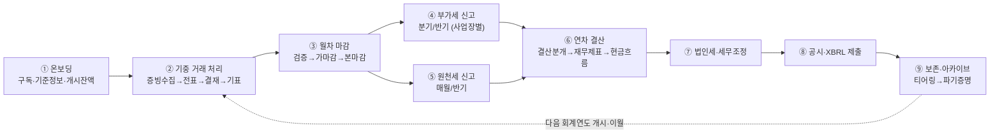
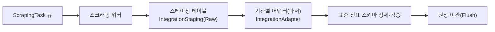
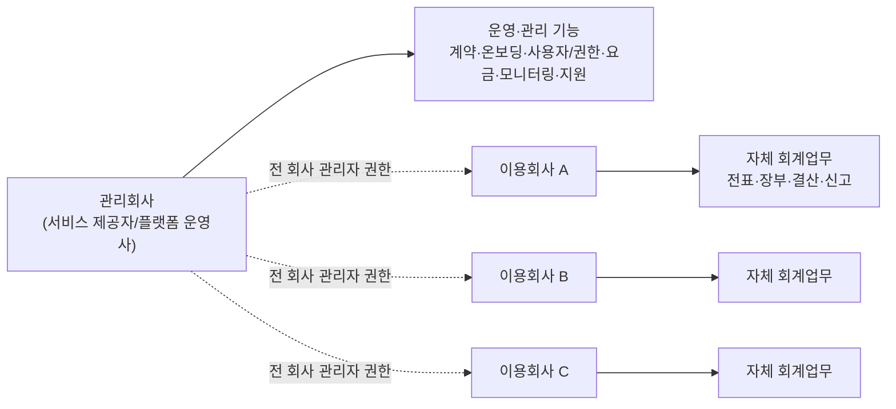
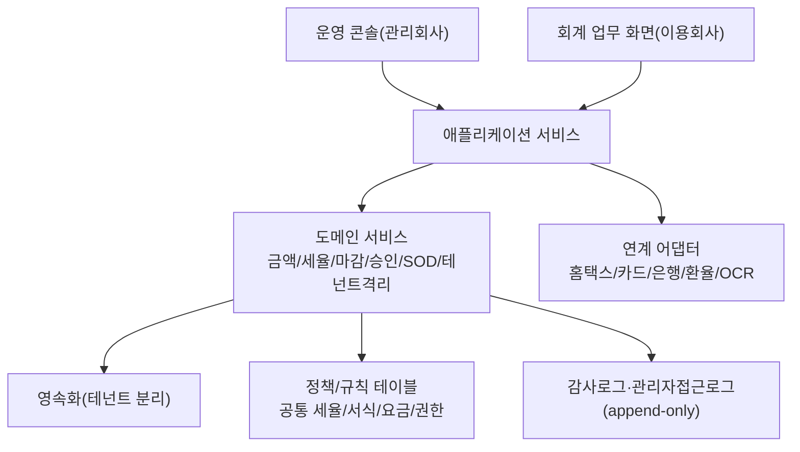
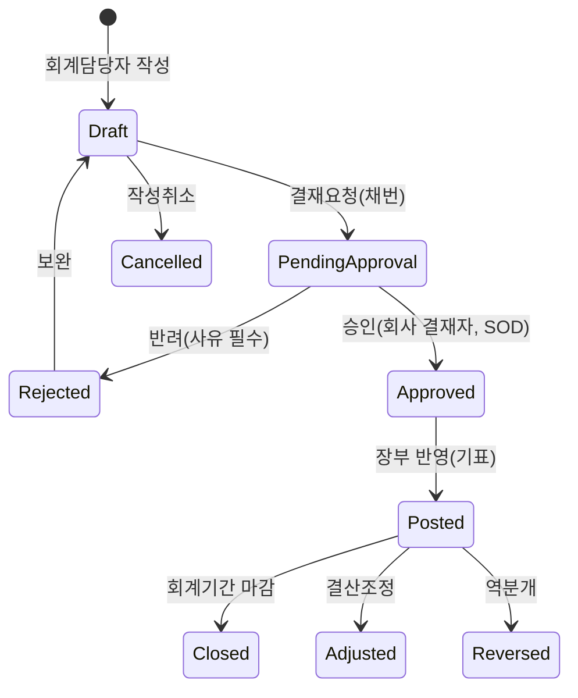
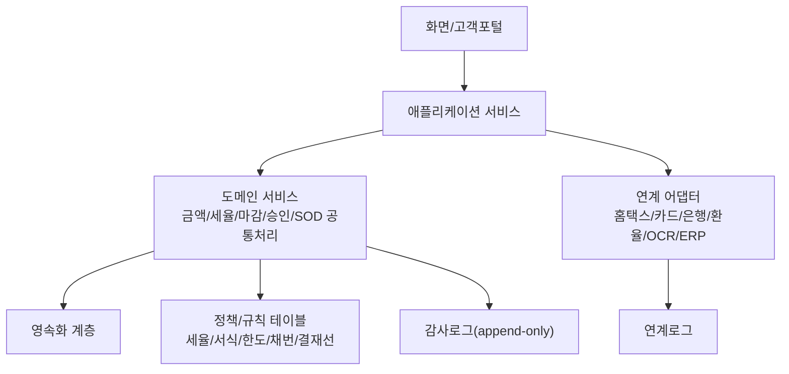
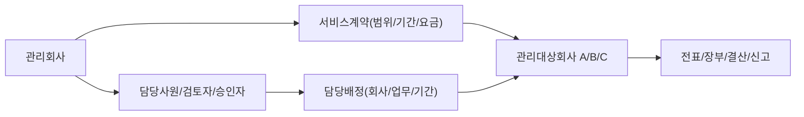
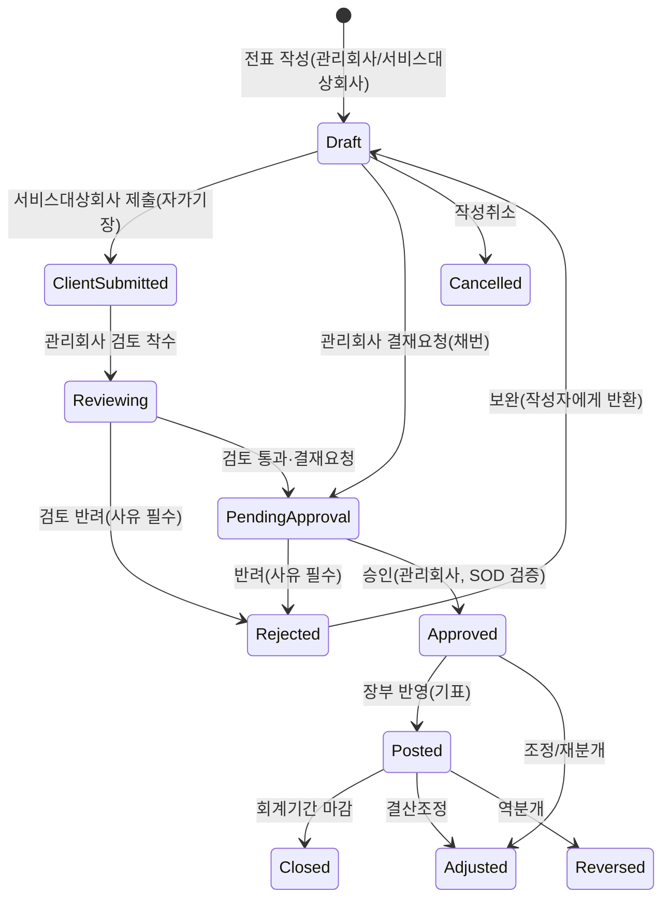
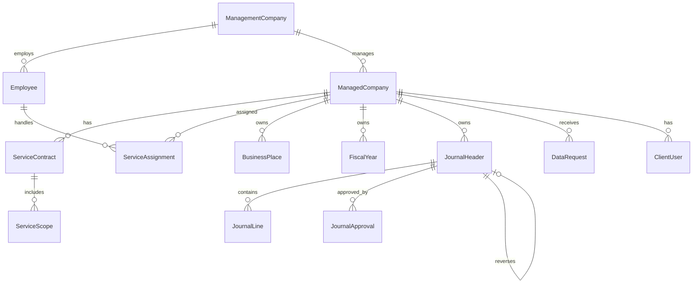
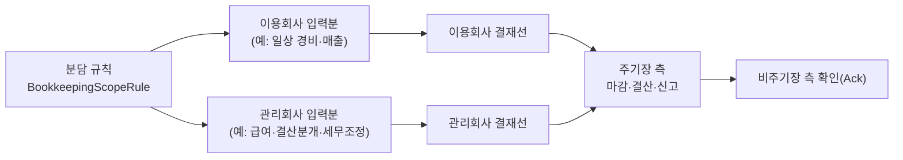

# BK 회계/세무 서비스 최종 설계서 v2.0

- 기반 문서: `bk_서비스_기본설계서.md` (서비스형/SaaS 자가운영 모델), `bk_상세_기본설계서.md` (기능 모듈 상세), `bk_기장선택_상세설계서.md` (기장 방식 선택 — v3.0에 통합), `보고서내용_추가.md` (실무 산출물 역분석 — v4.0에 통합), `구현_화면_기초_v1.0.html`(기초·기준정보 화면설계 — v4.1에 반영), `구현_화면_전표_v1.1.html`(전표·보조부 화면설계 + 검토의견 반영 — v4.1에 반영)
- 작성일: 2026-06-18
- 최종본 버전: **v2.0** (문서 버전 — 직전 `bk_설계서_v1.0.md` 전체 보존 + WEHAGO Smart A 10 회계관리 매뉴얼 전 기능 흡수·상세화)
- 원본 기준: `bk_서비스_상세설계서_v_4.1.md` 전체 내용 + 참조 문서 통합 부록 + **`요청사항/SmartA 10_회계관리매뉴얼.pdf`(WEHAGO Smart A 10 회계관리, 20개 Chapter·182개 메뉴) 전수 반영**
- 최종본 작성 방침: `bk_서비스_상세설계서_v_4.1.md`에서 참조하는 기반 설계·화면설계·검토자료를 본문과 부록에 통합하여 단독 열람 가능한 최종 설계서로 구성한다.
- **문서 버전 표기 주의**: 아래 개정 이력 표의 v1.0~v4.1은 본 설계의 *서비스 사양 계보*(누적 통합된 원본 설계서들)를 가리키며, 파일명(`bk_설계서_v1.0.md`→`bk_설계서_v2.0.md`)의 **문서 버전**과는 별개 축이다. 문서 v2.0은 문서 v1.0의 모든 내용을 **무손실 보존**한 위에, Smart A 10 회계관리 매뉴얼의 전 기능을 **25장(Smart A 10 회계관리 기능 준거 카탈로그)** 으로 신설·상세화하여 추가한 것이다.
- 작성 방침: 기본설계서 **「23. 상세설계 전 확인 필요사항」의 17개 항목을 "최대 기능(Full-feature) 구현" 방향으로 확정 또는 최대 범위 전제로 정리**하고, 각 결정에 대한 상세 설계(엔티티·필드·상태머신·업무흐름·API·검증규칙)를 정의한다. 회계·세무·보안의 기본 처리 규칙은 두 기반 문서를 준용하며, 본 문서는 서비스형 운영·거버넌스·확장 기능을 상세화한다. v2.0은 전체 업무흐름(End-to-End) 관점의 공백 보완(마감 워크플로우·원천세·자금/채권채무·증빙)과 운영 기반(알림·인프라/관측성/DR·보안 운영) 상세화를 추가한다. v3.0은 **기장 방식 선택(관리회사 주도/이용회사 주도/병행) 모델을 통합**하여 기장·마감·결산·신고의 수행 주체를 테넌트별 계약으로 결정하도록 확장한다. v4.0은 **실무 위탁기장 산출물(월별 결산 보고패키지·계정별 명세서·외화/관계사/그룹보고 등)을 역분석한 총 16개 보강 항목을 통합**하여 `OPERATOR_LED` 모델의 결과물·협업·품질 계층을 상세화한다. v4.1은 **기초·전표 구현 화면설계(`구현_화면_기초_v1.0.html`·`구현_화면_전표_v1.1.html`)에 반영된 설계 결정을 본 상세설계서에 역반영**한다 — 입금/출금 전표 메뉴 통합, 더존식 일자별 전표번호 채번, 전표 복합키(`전표일자`+`전표번호`), 부가세 자동라인 생성 조건, 차원 기본 필수/선택 정책, 거래처 마스터 검증, 보조부 화면 정합화, 화면 ID 인벤토리(BF/JV/AUX)를 정리한다(0.2절). v4.1 개정(2026-06-18)은 **주간정기회의 검토의견 13건(M1~M13: 사원 차원·결차/결대·원가 안분·소수점·어음 할인·카드 환급·결산 미리보기·계산시트·외화/조회조건 보강·부가세 보조부 차원·대상고객/로드맵/향후범위)**을 반영한다(0.3절).

**개정 이력**

| 버전 | 일자 | 주요 변경 |
|---|---|---|
| v1.0 | 2026-06-10 | 최초 작성(확인 17개 항목 확정, 추가검토 7개 항목 반영, AI 이상거래 탐지·AI 조회 챗봇 포함) |
| v2.0 | 2026-06-11 | (1) 전체 업무흐름(End-to-End) 정의(1.1), (2) 업무흐름 공백 보완 — 회계기간·마감 워크플로우(11.9), 원천세·지급명세서(11.10), 자금·채권채무(11.11), 증빙·전자문서(11.12), (3) 알림·커뮤니케이션 상세(18장 신설), (4) 시스템 운영·인프라 상세(19장 신설 — 환경분리/CI·CD/관측성/DR/큐 운영), (5) 보안 강화(20장 신설 — 키 관리 체계/취약점 관리/침해사고 대응/DLP/컴플라이언스), 기존 18~20장은 21~23장으로 이동 |
| v3.0 | 2026-06-11 | `bk_기장선택_상세설계서.md` 통합 — (1) 기장 모드 3종(`OPERATOR_LED`/`TENANT_LED`/`HYBRID`)·주기장 모델(21장 신설), (2) 자가 수행 전제 개정(1장), (3) 기장 담당 Role·결재선(4.5), (4) 접근모드 4종 확장 — `BOOKKEEPING` 신설(5.1, 5.2.1), (5) 마감·결산·신고에 주기장 권한·이용회사 확인(Ack) 적용(11.x), (6) 엔티티·API·배치·검증·알림 병합(12~15·18장), 기존 21~23장은 22~24장으로 이동 |
| v4.0 | 2026-06-15 | `보고서내용_추가.md`(실무 산출물 역분석) 통합 — (1) **월별 결산·보고 패키지**(11.13 신설), (2) **계정별 명세서·자동 tie-out**(11.14 신설), (3) **경과·충당·리스(IFRS16) 기간배분 스케줄**(11.15 신설, 11.3 보강), (4) **외화 운영회계 — 월말 환산·실현/미실현 외환손익·환율 마스터**(11.16 신설, 11.6.1 보강), (5) **관계사(Intercompany) 거래·대사**(11.17 신설), (6) **Cost-plus 수익·Invoice vs PL 차이분석**(11.18 신설), (7) **예산 대비 실적·관리회계**(11.19 신설, 9장 연계), (8) **그룹/모회사 연결보고 Export**(11.20 신설), (9) 다국어 COA·보고서(6장 보강), (10) 고객 협업·미결항목(18.3 신설), (11) 은행거래 분류·주간 자금마감(11.11 보강), (12) 월별 법인세 추정·선납세금(11.5 보강), (13) 자본거래·주주변동(11.3 보강), (14) 기장 이관 온보딩(22장 보강), (15) **매입원장 세무구분·국세청 전송상태**(11.4 보강), (16) **제조업 원가·재고·제조원가명세**(11.21 신설) + 엔티티·API·배치·검증(12~15장) 병합. 0.1절에 v4.0 확장 매트릭스 신설 |
| v4.1 | 2026-06-18 | **구현 화면설계(`구현_화면_기초_v1.0.html`·`구현_화면_전표_v1.1.html`) 반영** — (1) 화면설계 반영 매트릭스·화면 ID 인벤토리(BF/JV/AUX) 신설(0.2절), (2) **입금/출금 전표 메뉴 폐지·일반전표입력 통합**(현금 고정값 위치로 입출금 자동 판별, 11.1), (3) **더존식 전표번호** — 전표일자 단위 매일 001부터 리셋되는 일련번호, 유형은 「구분」 컬럼 표시, 외부표기 `YYYY-MM-DD-NNN`(11.1, 12.2~12.3), (4) **전표 복합키** `journal_header PK=(tenant_id, 전표일자, 전표번호)` + 라인·증빙·보조부 FK·파티셔닝 반영(11.1, 12.3), (5) **부가세 자동라인은 부가세 계정코드 입력 시에만 생성**(11.1, 11.4), (6) **차원 기본 필수/선택** — 사업장만 기본 필수, 코스트센터·프로젝트·현장은 기본 선택(`DimensionConfig`, 9.3·9.5), (7) **거래처 마스터 검증**(사업자등록번호·휴폐업, 11.1·11.4), (8) **전표 입력 UX** — JV-01 일자별 마스터-디테일(당일 전표 조회 후 추가)·「저장 후 계속 입력」, (9) **보조부 정합화** — 거래처/어음/예금/카드/부가세 보조부 목적·추적 타임라인·외화/거래성격 표시, 재고수불부 Phase 2 이관(11.4·11.11), (10) 기초 화면(BF-00~12)·메뉴 마스터(MenuVersion)·차원(프로젝트/현장) 정합 |
| **문서 v2.0** | 2026-06-18 | **WEHAGO Smart A 10 회계관리 매뉴얼 전 기능 흡수** — 문서 v1.0(=서비스 사양 v4.1 rev) 전체를 무손실 보존한 위에, **25장 「Smart A 10 회계관리 기능 준거 카탈로그」** 를 신설하여 매뉴얼 20개 Chapter·182개 메뉴를 빠짐없이 상세화: (Ch01) 기초정보관리, (Ch02~03) 전기이월/전기현장관리, (Ch04) 전표관리, (Ch05) 자동전표처리(증빙수집·국세청검증·스크래핑), (Ch06~08) 주요/보조장부 I·II(원가안분·현장손익), (Ch09~10) 결산재무제표·결산장부, (Ch11~15) 부가가치세 신고서류 전종(신고서·MRI·합계표·업종별·첨부·영세율·기타), (Ch16) 고정자산·감가상각, (Ch17) 자금·예산관리, (Ch18) 예적금·차입금, (Ch19) 어음·당좌관리, (Ch20) 데이터관리. 각 메뉴를 BK SaaS 서비스 설계로 매핑(엔티티·입력필드·처리/검증 규칙·산출물·자동전표·연계)하고, 25.0절에 전 메뉴 커버리지 체크리스트를 둔다 |
| **문서 v2.0 (rev. 2026-06-19)** | 2026-06-19 | **부서 차원·조직관리 보강** — 9.1 범용 차원 프레임워크에 `DEPARTMENT`를 추가하고, 부서 계층·부서장·사원 소속 이력·부서-코스트센터 매핑을 관리하는 조직관리(`OrganizationUnit`, `Department`, `EmployeeOrgAssignment`, `DepartmentCostCenterMapping`)를 9장·12장·13장에 반영 |
| v4.1 (rev. 2026-06-18) | 2026-06-18 | **주간정기회의(`회의자료/주간정기회의_20260618.md`) 반영** — (M1) **사원(EMPLOYEE) 차원 추가**(현장별·사원별·부서별 원가/손익 집계, 9장·12.1), (M2) **결차/결대(결산차변·결산대변) 전표 구분 추가**(제조원가명세서·손익계산서 원가 반영, 11.1·11.21·12.2), (M3) **원가 안분(배부) 집계**(차원 간 공통원가 배부규칙, 9.4·11.21), (M4) **금액/수량 소수점 자릿수 환경설정**(회사별, 11.1·BF-09), (M5) **어음 할인율·할인료 처리**(매출채권처분손실 자동분개, 11.11), (M6) **카드 매입세액 공제/환급 판정**(업종별 공제 분류·환급액 산출, 11.4·AUX-04), (M7) **결산 재무제표 미리보기·조정 전후 비교**(회사별 매핑규칙, 11.3·11.13), (M8) **근거자료 첨부·계산시트(Worksheet) 자동생성·주석 업데이트**(11.13·11.14), (M9) **외화 채권/채무 보강**(외화·발생환율·송금수수료, 11.11·AUX-01), (M10) **보조부 조회조건 세분화**(잔액/연체/미반제, 11.11·AUX-01), (M11) **부가세 보조부 프로젝트·부서 차원 분류**(11.4·AUX-06), (M12) 대상고객·단계별 개발 로드맵 명문화(1장), (M13) 페이롤·무역·감사대응 풀스코프는 향후 범위로 명기(1장) — 0.3절 매트릭스 신설 |

---

## 0. 확정 원칙 및 결정 매트릭스

"최대 기능 구현" 원칙: 옵션이 존재하는 항목은 **가장 풍부한 기능 + 가장 강한 통제**를 동시에 채택한다. 즉, 강력한 기능(긴급 대행, 위임관리, SSO, 전용 격리 등)을 제공하되, 그에 상응하는 승인·로그·통지·시간제한 통제를 함께 구현한다.

| # | 기본설계서 확인 항목 | 확정(최대 기능) | 상세 |
|---|---|---|---|
| 1 | 운영자의 이용회사 데이터 접근 범위·사유·통지 | 조회/지원세션/긴급변경 **3단계 접근모드 + 시간제한 + 사유 + 실시간 통지 + 승인** 전부 구현 | 5장 |
| 2 | 이용회사 관리자 위임 범위 | **완전 위임 관리(사용자/커스텀롤/권한/결재선/차원)** + 관리회사 정책 상한(가드레일) | 4장 |
| 3 | 회계 실무 긴급 대행 허용 | **허용(옵트인 + 이중통제 + 회사 동의 + 시간제한 + 전수 로그)** 으로 구현 | 5.4 |
| 4 | 공통 표준 배포·버전·강제 적용 | **버전 카탈로그 + 강제/권고/선택 3모드 + 자동적용 + 차이미리보기 + 롤백 + 회사 확장** | 6장 |
| 5 | 구독·상태 전환 시 데이터 정책 | **전체 구독 수명주기 + 그레이스 + 내보내기 + 보존 후 파기증명 + 재활성화** | 7장 |
| 6 | 외부 연계 인증정보 보관·보안 | **테넌트별 시크릿 볼트(KMS) + 토큰/인증서 관리 + 자동 회전 + 연결 상태 모니터링** | 8장 |
| 7 | 2FA 강제·인증 파라미터 | **운영자 필수 + 이용회사 기본 필수 + 다중 수단(TOTP/SMS/Email/Passkey/WebAuthn) + SSO(SAML/OIDC) + 적응형/Step-up** | 3장 |
| 8 | 멀티테넌시 격리·성능·백업 | **하이브리드 격리(공유+전용 선택) + RLS + 테넌트별 키/백업/PITR + 파티셔닝/캐시** | 2장 |
| 9 | 관리차원(사업장·코스트센터·부서) 정책 | **범용 차원 엔진(사업장/코스트센터/부서/프로젝트/현장/사원) + 조직관리 + 회사별 사용·필수·범위 + 조합규칙 + 기본값 + 예산** | 9장 |
| 10 | 차원 설정 변경 영향 | **유효일자 버전관리 + 변경영향분석 + 과거전표 일괄배정 도구 + 보고 정합성** | 10장 |
| 11 | 다중 회계기준·외부 데이터 변환 입력 | **K-GAAP/K-IFRS/US GAAP/IFRS/기타국 다중 지원 + 병행원장 + 외부데이터 수신·매핑·기준변환·검토·반영 파이프라인** | 11.6장 |
| 12 | 외부 데이터 수신 포맷·소스 시스템 범위 | **Excel/CSV/XML/XBRL/API 수신 + 원천키 멱등 + 스테이징 + 어댑터 ETL + 회사 검토 후 반영** | 8.4, 11.6장 |
| 13 | 회계기준 간 차이조정 적용 범위·승인 절차 | **기준쌍별 변환규칙 버전관리 + GAAP 차이 조정분개 + 검토/승인 워크플로우 + 변환 전후 감사** | 11.6장 |
| 14 | 현금흐름표 생성 방식·현금성자산 정의·활동 분류 | **직접법/간접법 선택 + 현금성자산 계정 정의 + 활동 매핑 + 통제된 조정 워크플로우** | 11.3.1장 |
| 15 | 공시자료 범위·XBRL taxonomy·제출 채널 | **재무제표/주석/XBRL 생성 + taxonomy 버전 배포 + 검증 + 제출상태/파일해시 감사** | 11.3.2장 |
| 16 | AI 이상거래 탐지 도입 범위·통제 | **규칙+통계+비지도 ML 3계층 하이브리드 + 설명가능(SHAP/reason code) + 휴먼인더루프(자동수정 금지) + 테넌트 격리·PII 가명화** | 11.7장 |
| 17 | AI 조회 챗봇(자연어 조회) 도입 범위·통제 | **Tool-calling 에이전트 + 제한적 Text-to-SQL + RAG 보조 + 읽기 전용 + 테넌트/권한 서버 강제 + 조회 감사** | 11.8장 |
| 18 | 기장 수행 주체 선택 (v3.0) | **기장 모드 3종(관리회사 주도/이용회사 주도/병행) + 주기장이 마감·결산·신고 수행 + 양측 동의 전환 + 상시 기장 접근모드(BOOKKEEPING) + 이용회사 확인(Ack)** | 21장(상세), 1장, 4.5, 5.2.1 |

> 기반 상세설계서 24장(회계기준·신고서식·연계규격 등)의 회계·세무 확인 항목도 **최대 범위 전제**로 정리한다. 단, US GAAP/IFRS/기타국 기준, XBRL 공시, 외부 데이터 변환 입력은 구현 복잡도와 검증 책임이 크므로 11.6장의 기능 플래그·요금제 제한·단계적 적용 원칙을 따른다.

### 0.1 v4.0 확장 매트릭스 (실무 산출물 역분석 통합)

v4.0은 실제 위탁기장(`OPERATOR_LED`) 산출물 6종을 역분석(`보고서내용_추가.md`)하고, 추가 검토 결과 Hibetter 산출물에서 드러난 **제조업 원가·재고·매입원장 세무상태**를 더해 **결과물·협업·품질 계층**을 총 16개 보강 항목으로 확장한다. 모든 항목은 멀티테넌시 격리(2장)·권한/SOD(4장)·기장모드(21장)·감사로그(17장)를 공통 기반으로 한다.

| # | 보강 항목 | 성격 | 본 문서 대응 | 우선순위 |
|---|---|---|---|---|
| A | 월별 결산·보고 패키지(Reporting Package) 생성·검증·전달 | 신설 | 11.13 | ★★★ |
| B | 계정별 명세서·잔액 소명(BS Reconciliation Schedule)·자동 tie-out | 신설 | 11.14 | ★★★ |
| C | 경과·충당·리스(IFRS16) 기간배분 스케줄 자동화 | 신설+보강 | 11.15, 11.3 | ★★★ |
| D | 외화 운영회계 — 월말 환산·실현/미실현 외환손익·환율 마스터 | 신설+보강 | 11.16, 11.6.1 | ★★★ |
| E | 관계사(Intercompany) 거래 식별·대사·연결제거 기초 | 신설 | 11.17 | ★★ |
| F | Cost-plus(원가가산) 수익 인식 + Invoice vs PL 차이분석 | 신설 | 11.18 | ★★ |
| G | 예산 대비 실적(Budget vs Actual)·부서/코스트센터 관리회계 | 신설+보강 | 11.19, 9장 | ★★ |
| H | 그룹/모회사 연결보고 Export(HFM·Weblink, 계정매핑·조정·YTD) | 신설 | 11.20 | ★★ |
| I | 다국어(국/영) 계정과목·보고서 출력(L10N) | 보강 | 6.1, 11.13 | ★★ |
| J | 고객 협업: 질의·확인·미결항목(Open Items/Query) 관리 | 신설 | 18.3, 21.4 | ★★ |
| K | 은행거래 분류·증빙매칭·주간 자금마감(Weekly Cash) 강화 | 보강 | 11.11 | ★ |
| L | 월별 법인세 추정·충당(Current Tax Provision)·선납세금 | 보강 | 11.5 | ★ |
| M | 자본거래·주주변동 명세(증자/감자/주식이전) | 보강 | 11.3 | ★ |
| N | 기장 이관(전임 기장처 데이터 인수) 온보딩 | 보강 | 22장 | ★ |
| O | 제조업 원가·재고·제조원가명세(CM) 산출 | 신설+보강 | 11.21, 11.13 | ★★ |
| P | 매입원장 세무구분·국세청 전송상태·증빙상태 리포트 | 보강 | 11.4, 11.13 | ★★ |

> 위 항목은 결정 #18(기장 수행 주체)의 `OPERATOR_LED` 산출물 정의를 구체화한다. 특히 A·B·J가 "관리회사 주도 기장의 결과물·협업·품질" 축을 형성한다.

### 0.2 v4.1 화면설계 반영 매트릭스 (구현 화면 역반영)

Phase 1 구현 화면설계(`구현_화면_기초_v1.0.html`·`구현_화면_전표_v1.1.html`)를 작성하며 확정·검토한 설계 결정을 본 상세설계서에 역반영한다. 특히 전표 화면은 검토의견(현업 리뷰)을 반영한 v1.1을 기준으로 한다.

| # | 반영 결정 | 출처 화면 | 본 문서 대응 | 상태 |
|---|---|---|---|---|
| S1 | **입금/출금 전표 메뉴 폐지·일반전표입력 통합** — 별도 입금/출금 메뉴를 두지 않고, 현금(고정값) 라인 위치로 입금(차변)/출금(대변)을 자동 판별 | JV-01~03 | 11.1 | 반영 |
| S2 | **더존식 전표번호** — 전표일자 단위로 매일 001부터 리셋되는 일련번호. 유형코드·연월·한글유형을 번호에 넣지 않고, 대체·입금·출금·매입·매출 구분은 「구분」 컬럼으로 표시. 외부 참조 표기 `YYYY-MM-DD-NNN` | JV-01·검색·보조부 | 11.1, 12.2 | 반영 |
| S3 | **전표 복합키** — `journal_header` PK = (`tenant_id`, `전표일자`, `전표번호`). 번호가 일자별 리셋되므로 전표일자가 키에 포함. 라인·증빙·보조부 FK와 파티셔닝(`tenant_id`+`전표일자`)에 반영. 입력 화면에 전표일자·전표번호 동시 표시(채번 전 「예정」) | JV-01 §2.2 | 11.1, 12.3 | 반영 |
| S4 | **부가세 자동라인 생성 조건** — 부가세구분만으로 자동 생성하지 않고, 부가세대급금/예수금 **계정코드 입력**(또는 매입/매출 전표 세금계산서 영역) 시에만 생성. 일반전표입력은 부가세 자동라인 기능 비대상 | JV-01·04·05 | 11.1, 11.4 | 반영 |
| S5 | **차원 기본 필수/선택** — 사업장만 기본 필수, 코스트센터·프로젝트·현장은 기본 선택. 회사별 `DimensionConfig.required`로 강화 가능 | JV-01, BF-09 | 9.3, 9.5 | 반영 |
| S6 | **현금 간편입력 범위** — 간편입력 고정값은 현금만 허용. 보통예금 입출금·카드출금·어음회수는 대체전표(JV-01)로 안내·전환. 현금 상대계정에 채권/채무·선수선급 계정 선택 시 간편입력 차단 후 대체전표 전환 | JV-01~03 | 11.1 | 반영 |
| S7 | **상대계정 직접 입력·일괄 변경** — 상대계정을 후보 N개 중 선택이 아닌 계정코드 직접 입력(F3) + 선택 분개 상대계정 일괄 변경 | JV-02·03 | 11.1 | 보완 |
| S8 | **거래처 마스터 검증** — 사업자등록번호 형식·휴폐업 여부 검증. 외부 기장자료 대량 업로드·매핑·전체 미리보기(다건/일괄 입력) | JV-07·08, BF | 11.1, 11.4 | 보완 |
| S9 | **전표 입력 UX** — JV-01을 일자별 마스터-디테일로 재구성(진입 시 당일 전표 목록 자동 조회 → 「＋ 전표 추가」/행 선택 → 분개 입력 → 「저장 후 계속 입력」). 더존/위하고식 일계 입력 | JV-01 | 11.1 | 반영 |
| S10 | **거래처 보조부 보강** — 외화/발생환율·거래성격(신규채권·일부회수·청구반제·대손조정·선수선급대체)·전표 연계 표시, 조회조건 세분화(잔액만/연체만/미반제만) | AUX-01 | 11.11 | 보완 |
| S11 | **어음 추적 타임라인** — 원전표→증빙→상태변경이력→부도/결제 후속전표 단일 추적 체인 | AUX-02 | 11.11, 11.12 | 보완 |
| S12 | **예금/카드/가지급금/부가세 보조부 목적 명확화** — 예금=계좌 단위 은행거래 대사·자금일정(거래처원장과 역할 구분), 카드=수신내역 매칭→전표 자동생성 후보·매입원장 연계, 가지급금=세무조정 인정이자 연동 특수 뷰, 부가세=세금계산서 합계·세무구분 집계(위하고 스타일) | AUX-03~06 | 11.4, 11.5, 11.11 | 검토 |
| S13 | **재고 수불부 Phase 2 이관** — 재고자산 수불부(AUX-08)는 2차 개발로 이관 | AUX-08 | 11.21, 22장 | 연기 |
| S14 | **기초 화면 인벤토리 정합** — 운영 콘솔·테넌트·기장설정·사용자/인증/권한·표준/차원/구독/알림·메뉴 마스터(MenuVersion 발행/롤백)·이용회사 선택(테넌트 스위처) 화면 정의 | BF-00~12 | 2·3·4·5·6·7·9·18·21장 | 반영 |

**화면 ID 인벤토리** — 구현 화면설계의 화면 ID와 본 문서/상위 화면설계서(TN/OP)의 매핑:

| 구분 | 화면 ID | 화면명 | 본 문서 연계 |
|---|---|---|---|
| 기초(BF) | BF-00 | 이용회사 선택(테넌트 스위처) | 2.2 |
| 기초(BF) | BF-01 | 관리회사(운영조직)·조직·담당 테넌트·IP 허용목록 | 5장 |
| 기초(BF) | BF-02 | 테넌트 목록·인프라·쿼터·스냅샷·비동기 잡 | 2장, 7장 |
| 기초(BF) | BF-03 | 기장 설정·전환 요청 워크플로우 | 21장 |
| 기초(BF) | BF-04 | 사용자·계정상태·인증수단(MFA/패스키)·SSO·세션·로그인 이력 | 3장 |
| 기초(BF) | BF-05 | 인증 정책 편집(범위 전환) | 3.2 |
| 기초(BF) | BF-06 | 접근 세션 로그·긴급대행 동의/요청 | 5장 |
| 기초(BF) | BF-07 | 역할·역할 부여·가드레일·예외·결재선·외부 파트너·기장 배정 | 4장 |
| 기초(BF) | BF-08 | 표준 카탈로그·버전·항목·테넌트 채택/확장 | 6장 |
| 기초(BF) | BF-09 | 차원·조직관리 — 사업장·코스트센터·부서·프로젝트·현장·사원·사용정책(DimensionConfig) | 9장 |
| 기초(BF) | BF-10 | 구독 상세·사용량·청구/결제 | 7장 |
| 기초(BF) | BF-11 | 알림 — 수신 매트릭스·템플릿·D-N 스케줄·웹훅 | 18장 |
| 기초(BF) | BF-12 | 메뉴 마스터(MenuVersion 발행/롤백)·메뉴·권한 관리 | 4.3 |
| 전표(JV) | JV-01 | 일반전표입력(입금/출금 통합, 일자별 마스터-디테일) | 11.1 |
| 전표(JV) | JV-02·03 | (동작 설명용) 입금/출금 간편입력 모드 | 11.1 |
| 전표(JV) | JV-04·05 | 매입·매출 전표(세금계산서 영역·자동 분개) | 11.4 |
| 전표(JV) | JV-06 | 전표 도구(복사/반복/템플릿/역분개) | 11.1 |
| 전표(JV) | JV-07 | 전표 검색 목록 | 11.1 |
| 전표(JV) | JV-08 | 다건/일괄 전표 입력(외부자료 매핑·대량 업로드) | 11.1 |
| 보조부(AUX) | AUX-01 | 거래처별 보조원장(매출처/매입처) | 11.11 |
| 보조부(AUX) | AUX-02 | 어음 보조원장(받을/지급)·추적 타임라인 | 11.11 |
| 보조부(AUX) | AUX-03 | 예금 보조원장(계좌별 입출·대사) | 11.11 |
| 보조부(AUX) | AUX-04 | 카드 보조원장(사용·결제·전표 자동생성 후보) | 11.4 |
| 보조부(AUX) | AUX-05 | 가지급금·가수금 보조원장(인정이자 연동) | 11.5 |
| 보조부(AUX) | AUX-06 | 부가세 보조원장(매입/매출 세액 집계) | 11.4 |
| 보조부(AUX) | AUX-07 | 현금출납장 | 11.11 |
| 보조부(AUX) | AUX-08 | 재고 수불부 (Phase 2 이관) | 11.21 |
| 보조부(AUX) | AUX-09 | 고정자산대장(기초) | 11.5 |

> 상위 화면설계서 매핑: JV(전표)=TN-05, AUX·장부=TN-07, 증빙=TN-08, 마감=TN-09. `OPERATOR_LED` 회사의 기장 담당자는 OP-12 기장 워크벤치에서 `BOOKKEEPING` 컨텍스트로 동일 화면을 사용한다(5.2.1, 21.5).

### 0.3 주간정기회의(2026-06-18) 반영 매트릭스

`회의자료/주간정기회의_20260618.md`의 검토의견(더존·위하고 실무 비교, 특수 회계 처리 요구)을 13개 항목으로 정리하여 본 문서에 반영한다.

| # | 반영 항목 | 회의 근거(요지) | 본 문서 대응 | 단계 |
|---|---|---|---|---|
| M1 | **사원(EMPLOYEE) 차원 추가** — 관리코드로 현장별·사원별·부서별 원가/손익 집계 | "관리코드 입력으로 현장·사원·부서별 원가/손익·안분 집계", "사원 등록" 기초정보 | 9.1·9.3·9.5·9.6, 12.1 | Phase 1 |
| M2 | **결차/결대(결산차변·결산대변) 전표 구분** — 결차/결대로 입력해야 손익계산서·제조원가명세서에 원가 반영 | "차변·대변·입금·출금·결차·결대 6가지 코드" | 11.1, 11.21, 12.2 | Phase 1 |
| M3 | **원가 안분(按分·배부) 집계** — 공통원가를 차원(코스트센터/부서/현장/사원/프로젝트)으로 배부 | "현장·사원·부서별 원가집계 및 안분 집계" | 9.4, 11.21 | Phase 2~3(원가) |
| M4 | **금액/수량 소수점 자릿수 환경설정** — 회사별 세팅 | 기초정보 "소수점 관리" | 11.1, 9.6(BF-09 환경설정) | Phase 1 |
| M5 | **어음 할인율·할인료 처리** — 어음 할인 시 할인료·매출채권처분손실 자동 분개, 자동 계정 매칭 | "어음 할인율 적용, 자동 계정과목 매칭" | 11.11(AUX-02) | Phase 1~2 |
| M6 | **카드 매입세액 공제/환급 판정** — 업종별 공제 가능 계정 분류·환급액 산출 | "카드 환급 금액 산출, 업종별 환급 가능 계정 분류, 파투아 분석" | 11.4(AUX-04) | Phase 2 |
| M7 | **결산 재무제표 미리보기·조정 전후 비교** — 회사별 매핑규칙 | "결산 재무제표 미리보기, 조정분개 전후 화면 비교, 회사별 매핑 규칙" | 11.3, 11.13 | Phase 2 |
| M8 | **근거자료 첨부·계산시트(Worksheet) 자동생성·주석 업데이트** | "감사보고서 주석·원장·숫자자료 근거 첨부, 계산 시트 자동 생성" | 11.13, 11.14 | Phase 2~3 |
| M9 | **외화 채권/채무 표시 보강** — 외화·발생환율·신규/일부회수/반제 구분·송금수수료 처리 | "외화 금액·환율, 신규/기존 채권, 일부 회수, 송금수수료 처리" | 11.11(AUX-01), 11.16 | Phase 1~2 |
| M10 | **보조부 조회조건 세분화** — 잔액만/연체만/미반제만 | "선수금·미반제·연체 등 조회 조건 세분화" | 11.11(AUX-01) | Phase 1 |
| M11 | **부가세 보조부 프로젝트·부서 차원 분류** — 매출 과세유형별 분류·인보이스 증빙 첨부 | "부가세 보조부 프로젝트별·부서별 구분, 매출 과세유형별 분류" | 11.4(AUX-06) | Phase 1~2 |
| M12 | **대상고객·단계별 개발 로드맵 명문화** — ERP 미보유 회사 주대상, 1차 보고서 도출→2차 자동분개→3차 AI | "ERP 없는 수기장부 회사 주대상", "1차 자동전표 없이 보고서→2차 자동분개→3차 AI" | 1장 | 배경 |
| M13 | **페이롤·무역·감사대응 풀스코프는 향후 범위로 명기** | "감사 대응·무역·페이롤 풀스코프 서비스 사례" | 1장(범위) | 향후 |

> M1·M2·M11은 설계 영향이 커 Phase 1에 우선 반영하고, M3·M6·M7·M8 등 원가/결산 자동화는 단계(Phase 2~3) 표기와 함께 정의한다. M9·M10은 기존 0.2절 S10(거래처 보조부)을 확장한다.

---

## 1. 시스템 개요 (서비스형 + 자가운영)

- 관리회사는 서비스 제공자이자 전 이용회사 관리자이며, 운영 콘솔에서 테넌트/구독/표준/권한/모니터링/지원을 수행한다.
- 회계·세무 실무의 수행 주체는 **테넌트별 기장 모드**(21장)에 따라 결정한다: `TENANT_LED`(이용회사 자체 수행 — 기본·현행), `OPERATOR_LED`(관리회사 주도 기장), `HYBRID`(병행). 전표 결재는 **주기장(primary bookkeeper) 측 결재선**에서 완결하고, 마감·결산·신고·공시는 주기장 측이 수행한다.
- 기장 계약이 없는 회사(`TENANT_LED`)에 대한 관리회사의 실무 개입은 긴급 대행(Break-glass, 5.3) 예외로만 가능하다.
- 본 상세설계서는 두 사용자 그룹(`OperatorUser`/`TenantUser`)과 두 채널(운영 콘솔/업무 화면)을 전제로 한다.
- `SaaS_회계개발_주의점.md`의 핵심 가이드(멀티테넌시/RLS·불변성/감사·세법 룰 마스터·마감 잠금·외부수집 비동기 ETL·프론트 대량 그리드)를 2·8.4·11.6·15·16·17장에 반영한다.

#### 1.0.1 대상 고객·서비스 범위·개발 로드맵 (v4.1 rev, M12·M13)

- **대상 고객(주간회의 반영)**: 자체 ERP를 보유하지 않고 수기/엑셀로 장부를 관리하는 **중소기업·외국계 한국지점**이 1차 대상이다. ERP(SAP 등)를 보유한 회사라도 전문 인력 직접 고용 대비 외주 기장이 효율적인 경우를 포괄하며, 한국지점·소규모 외국계에는 SAP에 준하는 표준 회계 기능을 제공하는 것을 지향한다.
- **단계별 개발 로드맵(M12)**: **Phase 1** — 자동 전표 생성 없이 수기 입력 기반으로 장부·시산표·재무제표 등 **보고서 도출**이 가능한 코어를 구축한다. **Phase 2** — 은행/카드/세금계산서 연계 기반 **자동 분개(자동전표)**·원가/결산 자동화를 추가한다. **Phase 3** — **AI**(자동 분개 추천·이상탐지·자연어 조회, 11.7·11.8)를 접목한다. 본 설계서의 "Phase 2~3" 표기 기능은 이 로드맵을 따른다.
- **향후 범위(M13)**: 페이롤(급여)·무역(수출입)·외부감사 대응 등 **풀스코프 위탁 서비스**는 실무 수요로 식별되었으나 본 Phase 1~3 회계/세무 코어 범위 밖으로 두고, 별도 모듈·연계로 **향후 확장 범위**에 둔다(현행 미구현, 요금/계약 옵션으로 추후 정의).

### 1.1 전체 업무흐름 (End-to-End) (v2.0 추가)

이용회사 관점의 연간 회계·세무 업무 사이클을 단계별로 정의하고, 각 단계가 본 설계서의 어느 장에 대응하는지 명시한다. 모든 단계는 멀티테넌시 격리(2장)·권한/SOD(4장)·감사로그(17장)·알림(18장)을 공통 기반으로 한다.



| 단계 | 업무 | 본 문서 대응 | 주요 통제 |
|---|---|---|---|
| ① 온보딩 | 구독 개시, 기장 모드 설정(21장), 표준 채택, 차원 설정, 계정/거래처 이관, 개시잔액 검증 | 6·7·9·21장, 22장 마이그레이션 | 시산표 균형 검증, 표준 가드레일 |
| ② 기중 거래 | 증빙 수집(수기/스크래핑/세금계산서), 전표 작성·결재·기표, 이상탐지 | 8.4, 11.1, 11.7, 11.12 | SOD, 마감 잠금, 멱등 채번 |
| ③ 월차 마감 | 마감 전 검증 체크리스트 → 가마감 → 본마감(마감해제는 예외 절차) | 11.9 | 분산 락(2.1.2), 마감 잠금 인터셉터(16.1) |
| ④ 부가세 신고 | 사업장별/사업자단위 집계, 예정/확정/수정/기한후, 전자신고 | 11.4 | 신고파일 해시, 전송 Step-up |
| ⑤ 원천세 신고 | 원천징수 집계, 이행상황신고, 지급명세서 | 11.10 | 민감정보(급여) 접근 통제(4.4·17장) |
| ⑥ 연차 결산 | 결산정리분개, 재무제표·현금흐름표, 병행원장 기준별 산출 | 11.3, 11.3.1, 11.6 | 결산 스냅샷, 조정 워크플로우 |
| ⑦ 법인세 | 세무조정, 신고서 작성·전자신고 | 11.5 | 세법 룰 마스터(6장) 버전 적용 |
| ⑧ 공시 | 재무제표 공시·주석·XBRL 생성·검증·제출 | 11.3.2 | taxonomy 검증, 제출 해시 감사 |
| ⑨ 보존 | Hot/Warm/Cold 티어링, 법정 보존, 파기 증명 | 7.3, 7.5 | WORM, 파기 승인 워크플로우 |

- 자금·채권채무 관리(어음/예금/aging/여신, 11.11)는 ②~③ 단계에 상시 병행한다.
- 관리회사 운영(테넌트/구독/표준/접근 거버넌스/모니터링)은 전 단계의 수평 레이어로 동작한다(5·6·7·19장).
- **수행 주체(v3.0)**: ②~⑧ 단계의 수행 주체는 기장 모드(21장)에 따른다 — `TENANT_LED`는 이용회사, `OPERATOR_LED`는 관리회사 기장 조직, `HYBRID`는 분담 규칙(②)과 주기장(③~⑧)을 따른다. `OPERATOR_LED`/`HYBRID`에서 이용회사는 ③ 마감·⑥ 결산·④⑤⑦ 신고 결과에 대한 확인(Acknowledge) 또는 전송 승인 절차로 참여한다(21.4).
- **월별 보고 산출(v4.0)**: ③ 월차 마감 직후, 주기장 측은 **월별 결산 보고패키지**(재무제표·시산표·분개장·총계정원장·계정별 명세서·aging·부가세/원천세 집계·매입원장·제조원가명세 등)를 조립·검증(계정별 자동 tie-out, 11.14)·전달하고 이용회사 확인(Ack)을 받는다(11.13). 마감 전 미결 질의·증빙요청은 미결항목(18.3)으로 추적하여 마감 게이트로 삼는다. 외화·관계사·예실·그룹보고·제조원가(11.16~11.21)는 ②~⑥ 단계에 병행한다.

---

## 2. 멀티테넌시 아키텍처 상세 (확정 #8)

### 2.1 격리 모델 — 하이브리드(테넌트 티어 선택)

| 티어 | 격리 방식 | 적용 대상 | 특징 |
|---|---|---|---|
| `SHARED` | 공유 스키마 + `tenantId` 컬럼 + RLS(Row-Level Security) | 일반 이용회사(기본) | 비용 효율, 대량 테넌트 |
| `SCHEMA` | 테넌트 전용 스키마 | 중대형/규제 요구 회사 | 논리 분리 강화 |
| `DEDICATED` | 테넌트 전용 DB/인스턴스 | 대기업/보안 요구 회사 | 물리 분리, 전용 백업 |

- 모든 테이블은 `tenant_id`(NOT NULL)를 가지며, 애플리케이션은 모든 쿼리에 테넌트 컨텍스트를 강제 주입한다.
- DB Row-Level Security 정책으로 `tenant_id = current_tenant()` 강제(이중 안전장치). 운영자 관리자 접근은 별도 정책 + 로그.
- 티어 전환(`SHARED`↔`SCHEMA`↔`DEDICATED`)은 완전 무중단의 정합성 리스크를 고려하여 **결산 마감 후 정기 점검 윈도우(Maintenance Window)를 활용한 반자동 이행을 표준 정책**으로 채택한다(2.1.1). 부득이한 실시간 이행 시 **쓰기 버퍼링(Write-Queuing)** 을 강제한다.

#### 2.1.1 티어 전환 하이브리드 워크플로우 (추가검토 1.1)

1. **전환 예약·타겟 프로비저닝**: 테넌트 데이터 용량 산정 → 타겟 스키마/전용 DB 인스턴스 생성 + 기본 스키마(DDL) 배포.
2. **소스 스냅샷 이관(1차 복제)**: 운영 공유 DB의 해당 `tenant_id` 레코드를 백업하여 타겟 DB로 Bulk Insert.
3. **실시간 변경분 추적(CDC·아웃박스·큐잉)**: 1차 복제 중 발생하는 신규 CUD는 DB WAL/binlog 기반 CDC를 우선 사용하고, 애플리케이션 트랜잭션에는 `TenantMigrationOutbox`를 함께 기록한다. Redis 변경로그 큐는 워커 전달 계층으로만 사용하며, 원천 변경 순서·재처리 기준은 CDC LSN/GTID 또는 아웃박스 sequence로 판단한다.
4. **전환 데이터 검증**: 소스·타겟 레코드 카운트, 주요 원장(시산표·거래처원장) 합계, 기간별 전표라인 checksum, `DataChangeLog` 해시체인을 대조한다.
5. **라우팅 전환·큐 플러시**: 라우팅 경로를 타겟 DB로 스위칭하는 순간 소스 Write를 일시 잠금 → 미반영 CDC/아웃박스 잔여분을 순서대로 동기화(Apply) → 타겟 DB를 읽기/쓰기 대상으로 승격한다.
6. **전환 검증·롤백 윈도우**: 전환 직후 지정 시간 동안 소스 DB를 read-only 보존하고, 핵심 리포트·잔액·원천키 중복 여부를 자동 검증한다. 검증 실패 시 라우팅을 소스로 되돌리고 타겟 DB는 폐기/재이관한다.
7. **전환 리허설**: 대용량·전용 티어 전환은 사전 리허설 잡을 수행하여 예상 소요시간, 누락 테이블, 스키마 차이, checksum 불일치를 전환 승인 전에 확인한다.

```
[공유 DB(SHARED)] ─(1차 스냅샷)─► [전용 DB(DEDICATED)]
      │                                   ▲
 (신규 트랜잭션)                          │ (최종 큐 플러시)
      ▼                                   │
[Redis 변경로그 큐] ──────────────────────┘
```

**전환 보조 엔티티**

| 엔티티 | 핵심 필드 | 용도 |
|---|---|---|
| `TierMigrationJob` | `tenantId`, `sourceTier`, `targetTier`, `status`, `scheduledAt`, `cutoverAt`, `rollbackDeadline` | 티어 전환 전체 상태 관리 |
| `TenantMigrationOutbox` | `jobId`, `tenantId`, `sequence`, `entity`, `entityId`, `operation`, `payloadRef`, `cdcPosition`, `status` | 전환 중 변경분의 순서 보장·재처리 |
| `TierMigrationValidation` | `jobId`, `checkType`, `sourceValue`, `targetValue`, `matched`, `checkedAt` | 카운트·합계·checksum 검증 결과 |
| `TierMigrationRollbackLog` | `jobId`, `reason`, `executedBy`, `executedAt`, `sourceRouteRestored` | 롤백 이력 |

#### 2.1.2 다중 WAS 분산 락(Distributed Lock) (추가검토 1.2)

로드밸런싱된 다중 WAS에서 동일 테넌트의 복수 사용자가 동시에 결산 마감·일괄 배정·외부데이터 이관을 요청할 때의 경쟁상태(Race Condition)를 원천 차단한다. Redis Redlock은 빠른 자원 선점에 사용하되, 회계 핵심 작업은 **분산 락 단독에 의존하지 않고 DB 제약·상태 전이 검증·fencing token**을 함께 적용한다.

| 적용 대상 | 락 키 | 최대 만료 |
|---|---|---|
| 월별 결산 마감 | `lock:tenant:{tenantId}:closing:{yyyymm}` | 10분 |
| 일련번호(채번) 생성 | `lock:tenant:{tenantId}:seq:{type}` | 3초 |
| 외부데이터 스테이징 이관 | `lock:tenant:{tenantId}:staging:flush` | 5분 |

- 락 획득: `SET key token NX PX <ttl>`. 미획득 시 비즈니스 예외("다른 사용자가 진행 중").
- 락 해제: Lua 스크립트로 **자신의 토큰 검증 후 원자적 삭제**(타 세션 락 오삭제 방지).
- 분산 락은 차원 일괄 배정(`DimensionBackfillJob`)·표준 자동적용 등 테넌트 단위 일괄 작업에도 적용한다.
- **Fencing token**: 락 획득 시 단조 증가 토큰(`lockVersion`)을 발급하고, DB 업데이트 조건에 `lockVersion >= currentLockVersion`을 포함하여 만료된 락 보유자의 늦은 쓰기를 차단한다.
- **DB 최종 방어선**: 채번은 (`tenantId`, `fiscalYear`, `sequenceType`, `number`) unique 제약으로 중복을 차단하고, 마감은 (`tenantId`, `periodId`, `closingType`) unique + 상태 전이 조건으로 중복 마감을 차단한다.
- **상태 재검증**: 락 획득 후에도 트랜잭션 내부에서 최신 상태를 다시 조회하여 `OPEN → CLOSING → CLOSED` 등 허용된 상태 전이만 커밋한다.
- **복구 처리**: 락 TTL 만료·워커 장애 시 `RUNNING` 상태의 작업을 재개/실패 처리하는 보상 잡을 두며, 멱등키 기준으로 이미 반영된 결과를 재반영하지 않는다.

### 2.2 테넌트 컨텍스트 처리

- 인증 토큰에 `tenantId`, `userGroup`, `tier`를 포함하고, 요청 진입 시 `TenantContext`로 바인딩.
- 운영자는 `tenantId` 없이 로그인하고, 특정 회사 진입 시 접근모드(5장)에 따라 임시 테넌트 컨텍스트를 획득(로그 동반).
- 캐시·메시지큐·파일 스토리지 키에 `tenantId` 프리픽스를 강제하여 교차 노출을 차단.

### 2.3 성능 설계

- 대용량 테이블(전표라인/원장/로그)은 `tenant_id` + 회계기간 기준 파티셔닝.
- 인덱스: (`tenant_id`, 회계기간, 계정), (`tenant_id`, 거래처), (`tenant_id`, 차원) 등 테넌트 선행 복합 인덱스.
- 조회 3초 목표, 대용량 장부/현황은 비동기 리포트 잡(`AsyncReportJob`) + 결과 캐시.
- 테넌트 리소스 쿼터(동시 배치 수, 리포트 크기, API rate limit)로 노이지 네이버 방지.

### 2.4 백업·복구

- `SHARED`: 일 단위 풀백업 + WAL/binlog 기반 PITR(Point-In-Time Recovery), 테넌트 단위 논리 백업 잡 추가.
- `SCHEMA`/`DEDICATED`: 스키마/인스턴스 단위 백업·복구·PITR.
- **테넌트 단위 복구**: 특정 회사만 시점 복구할 수 있도록 논리 백업(테넌트 export/snapshot) 제공.
- 마감/결산/신고 전 자동 스냅샷(`TenantSnapshot`), 복구 시 무결성·잔액 검증.

### 2.5 엔티티

| 엔티티 | 핵심 필드 |
|---|---|
| `TenantInfra` | `tenantId`, `tier`(SHARED/SCHEMA/DEDICATED), `dbRef`, `schemaName`, `encryptionKeyId`, `quotaProfile` |
| `TenantSnapshot` | `tenantId`, `snapshotType`(마감전/결산/수동), `createdAt`, `storageRef`, `checksum` |
| `AsyncReportJob` | `tenantId`, `reportType`, `params`, `status`, `resultRef`, `expireAt` |

---

## 3. 인증 · 계정 보안 상세 (확정 #7)

### 3.1 인증 수단 (전 수단 지원)

| 수단 | 코드 | 비고 |
|---|---|---|
| 비밀번호 | `PASSWORD` | 일방향 해시(Argon2id/bcrypt) + salt |
| TOTP(OTP 앱) | `TOTP` | 기본 2FA 권장 수단 |
| SMS 코드 | `SMS_OTP` | 통신 비용·취약성 고려, 보조 |
| 이메일 코드 | `EMAIL_OTP` | 보조 |
| Passkey/WebAuthn | `WEBAUTHN` | 피싱 저항, 권장 |
| 백업 코드 | `BACKUP_CODE` | 일회용 복구 |
| SSO | `SAML`,`OIDC` | 기업 테넌트 IdP 연동 |

### 3.2 적용 정책 (최대 강제)

- **운영자**: 2FA 필수(`WEBAUTHN` 또는 `TOTP` 우선), 비밀번호 정책 최강 등급.
- **이용회사**: 기본 2FA 필수. 관리회사가 **정책 하한(floor)** 을 강제(회사가 더 강하게만 조정 가능, 약화 불가).
- **Step-up 인증**: 신고 전송, 마감/마감해제, 권한 변경, 개인정보 평문 조회, 긴급 대행 시 재인증.
- **적응형(위험기반) 인증**: 신규 기기/지역/불가능 이동/이상 시간대 감지 시 추가 인증·차단.
- **SSO**: 기업 테넌트는 자사 IdP(SAML/OIDC)로 SSO + SCIM 사용자 프로비저닝(선택).

### 3.3 비밀번호 정책 파라미터(기본값, 회사 강화 가능)

| 파라미터 | 기본값 |
|---|---|
| 최소 길이 | 10자 |
| 복잡도 | 영대/영소/숫자/특수 중 3종 이상 |
| 변경 주기 | 90일(만료 시 강제 변경) |
| 재사용 금지 | 직전 5개 |
| 최소 사용기간 | 1일 |
| 잠금 임계치 | 5회 실패 → 잠금 + 점진 지연 |
| 휴면 | 365일 미접속 → `DORMANT` |

### 3.4 세션 관리

- 유휴 타임아웃 30분(정책), 절대 수명 12시간, 동시 세션 제한·강제 로그아웃.
- 토큰 보안(HttpOnly/Secure/SameSite), 비밀번호 변경 시 전 세션 무효화.
- 운영 콘솔/업무 화면 세션 분리, 신뢰 기기 등록(정책 옵션).

### 3.5 엔티티

`UserCredential`, `PasswordHistory`, `MfaDevice`(type, secretRef), `WebauthnCredential`, `SsoIdentity`(idpRef, externalId), `UserSession`, `TrustedDevice`, `LoginHistory`, `AccountStatus`, `AuthPolicy`(scope: GLOBAL/TENANT, floor 설정).

---

## 4. 권한 · 위임 관리 상세 (확정 #2)

### 4.1 완전 위임 관리(Delegated Administration)

이용회사 회사 관리자는 자사 범위 내에서 다음을 **완전 위임 관리**한다.

- 자사 사용자 생성/수정/잠금해제/2FA 초기화(관리회사 정책 하한 내).
- **커스텀 Role 생성/편집**: 표준 Role 템플릿을 복제·확장하여 자사 전용 권한 조합 구성.
- 메뉴/행위/데이터범위/민감정보 권한 부여.
- 결재선·결재규칙(`ApprovalRule`) 구성, 위임/대결 설정.
- 회사 환경설정(차원 사용 여부 등, 9장) 관리.

### 4.2 관리회사 정책 상한(가드레일)

관리회사는 전 회사 또는 요금제별로 **정책 상한**을 설정하고, 이용회사는 그 범위 내에서만 위임관리한다.

| 가드레일 | 예시 |
|---|---|
| 인증 하한 | 2FA 필수, 비밀번호 최소강도(약화 불가) |
| 권한 상한 | 단일 사용자 최대 Role 수, 위험 권한(신고전송/마감) 부여 자격 제한 |
| 사용자 수 | 요금제별 최대 사용자/관리자 수 |
| SOD 강제 | 작성-승인 분리 비활성화 금지(소규모 예외 승인 시만) |
| 커스텀 Role 한도 | 회사별 커스텀 Role 최대 개수 |

- 가드레일 위반 설정은 저장 차단. 관리회사는 필요 시 회사별 예외(override)를 사유·로그와 함께 승인.

### 4.3 권한 모델 (RBAC + 속성 제약)

- Role = 메뉴권한 + 행위권한(조회/등록/수정/삭제/승인/반려/마감/전송/출력) + 데이터범위(차원/사업장/부서) + 민감정보권한.
- 표준 Role 템플릿(회사관리자/회계담당/세무담당/결재자/열람자)은 공통 표준(6장)으로 배포, 회사가 채택·확장.

### 4.4 외주 세무대리인(수임처) 권한 위임·가드레일 (추가검토 3.2)

다수 중소·중견기업이 기장·세무조정을 외부 세무사/회계법인에 위임하는 국내 환경을 반영하여, **내부 임직원과 외부 파트너의 권한 경계**를 엄격히 분리한다.

**(1) 세무대리인 속성 확장(`UserCredential`/`TenantUser`)**

- `isExternalPartner`(외부 파트너 여부), `partnerFirmRegNo`(세무대리법인 사업자번호), `permittedScopeTags[]`(허용 업무 범위 태그, 예: `TAX_ADJUSTMENT`/`VAT_FILING`/`JOURNAL_VIEW`).

**(2) 가드레일 통제 규칙**

| 통제 | 규칙 |
|---|---|
| 인사/급여·민감정보 차단 | `isExternalPartner=true` 계정은 전표 권한이 있어도 급여명세·원천세 세부·주민번호 등 진입 시 API 레이어에서 `403`, 마스킹 데이터만 제공 |
| 데이터 내보내기 제한 | 세무 신고 목적 외 전사 전표 일괄 다운로드는 이용회사 총괄관리자 **실시간 2차 승인(카카오/문자 OTP)** 후 다운로드 링크 활성화 |
| 접근 IP 통제 | 세무대리인 로그인 IP 대역 별도 관리, 비정상 대역 접근 시 운영 관리자 대시보드 이상징후 알림 |
| 범위 태그 강제 | `permittedScopeTags`에 없는 업무 화면/API 차단 |

**(3) 제한적 민감정보 예외 조회**

세무 신고·원천세·지급명세서 등 법정 업무 수행상 민감정보가 필요한 경우 원천 차단만 적용하지 않고 다음 예외 경로를 제공한다.

1. 외부 파트너가 업무 목적, 대상 기간, 대상 항목, 예상 건수를 입력해 예외 조회를 요청한다.
2. 이용회사 총괄관리자 또는 지정 개인정보 승인자가 Step-up 인증 후 승인한다.
3. 승인 범위·기간·건수 안에서만 복호화 또는 제한 표시를 허용한다.
4. 조회/다운로드는 `PersonalDataAccessLog`와 `ExternalPartnerAccessLog`에 건별 기록하고, 대량 조회는 보안 이벤트로도 적재한다.
5. 승인 기간 만료 후 권한은 자동 회수되며, 동일 목적 반복 조회는 재승인 또는 사전 승인 정책에 따른다.

예외 조회는 `permittedScopeTags`와 별도로 `sensitiveAccessPurpose`가 필요하며, 신고 목적 외 2차 이용은 약관·감사 정책상 금지한다.

### 4.5 기장 담당 Role · 결재선 · 행위자 표식 (v3.0 추가)

기장 모드(21장)가 `OPERATOR_LED`/`HYBRID`인 회사의 기장 실무를 수행하는 **운영자 그룹 내 기장 담당 Role**을 분리한다.

**(1) 기장 담당 Role**

| Role | 권한 | 비고 |
|---|---|---|
| `BK_PREPARER`(기장 담당) | 배정 회사의 전표 작성·증빙 매칭·보조부 입력 | **배정 회사만** 접근(전 테넌트 접근 불가 — 최소 권한). 운영 콘솔 관리 기능과 분리 |
| `BK_REVIEWER`(기장 검토) | 배정 회사의 전표 검토·승인, 마감 체크리스트 실행 | 작성자와 동일인 금지(SOD) |
| `BK_MANAGER`(기장 책임) | 마감·결산·신고 승인, 담당 배정 관리, 모드 전환 동의 | 신고 전송 Step-up |

- `BookkeepingAssignment`(tenantId, operatorUserId, role, validFrom/To)로 회사별 담당·검토·책임을 배정한다. 배정 없는 운영자의 기장 접근(`BOOKKEEPING` 모드, 5.2.1)은 차단한다.
- **겸직 제한(가드레일)**: 기장 Role 보유자는 해당 회사의 접근 거버넌스 승인자(Break-glass 승인 등)가 될 수 없다(이해충돌 방지). `PolicyGuardrail`로 강제하며, 소규모 예외는 `PolicyException` 절차를 따른다.

**(2) 모드별 결재선·SOD**

| 모드 | 전표 결재선 | SOD 규칙 |
|---|---|---|
| `TENANT_LED` | 이용회사 내부 결재(현행 11.1) | 작성자≠승인자(현행) |
| `OPERATOR_LED` | 관리회사 내부: `BK_PREPARER` 작성 → `BK_REVIEWER` 승인(→ 금액 기준 `BK_MANAGER`) | 작성자≠검토자, 검토자≠마감 승인자 |
| `HYBRID` | **작성 주체별 결재선**: 이용회사 작성분→이용회사 결재선, 관리회사 작성분→관리회사 결재선. 기표 전 최종 게이트는 주기장 측 | 교차 승인 금지(분담 규칙의 검토 위임 명시 시만 허용, 21.6) |

**(3) 행위자 표식 (5.3-(5) 확장)**

- 모든 전표·기준정보·신고 데이터에 `createdByGroup`(OPERATOR/TENANT) + `bookkeepingMode`(생성 시점 모드) + `assignmentId`(기장 담당 배정 참조)를 기록한다.
- Break-glass 표식(`breakGlassSessionId`)과 구분: 기장 계약 기반 입력은 `BOOKKEEPING` 컨텍스트로 기록하고, 조회 화면에 `OPERATOR 기장` 배지로 표시한다.

### 4.6 엔티티

`Role`(scope, templateRef, custom), `Permission`, `RoleAssignment`, `PolicyGuardrail`(scope: GLOBAL/PLAN/TENANT), `PolicyException`(승인·사유·기간), `ApprovalRule/Line/Step`(+적용 주체 OPERATOR/TENANT 구분), `ExternalPartnerProfile`(firmRegNo, scopeTags, ipAllowlist), `ExternalPartnerAccessRequest`(purpose, scope, period, requestedItems, status), `ExternalPartnerAccessLog`, `BookkeepingAssignment`(role, validFrom/To).

---

## 5. 관리회사 관리자 접근 거버넌스 + 긴급 대행 (확정 #1, #3)

### 5.1 접근 모드 (4단계, v3.0 확장)

| 모드 | 코드 | 권한 | 통제 |
|---|---|---|---|
| 조회 지원 | `VIEW` | 회사 데이터 읽기(마스킹 적용) | 사유 입력 + 로그 |
| 지원 세션 | `SUPPORT_SESSION` | 설정/구성 변경 지원(회계 실무 제외) | 사유 + 시간제한 + 로그 + 회사 통지 |
| 기장 수행 (v3.0) | `BOOKKEEPING` | 기장 계약 회사의 회계 실무 **상시 수행** | 기장 계약(`BookkeepingConfig`, 21장) + 담당 배정(4.5) 필수 + 전수 로그 + 요약 통지(5.2.1) |
| 긴급 변경/대행 | `BREAK_GLASS` | 회계 실무 포함 예외 처리(**기장 계약 없는 회사**) | 옵트인 + 회사 동의 + 이중통제 + 시간제한 + 전수 로그 + 즉시 통지 |

> 기장 계약(`OPERATOR_LED`/`HYBRID`)이 있는 회사의 일상 기장은 `BOOKKEEPING` 모드로 수행하며 Break-glass를 사용하지 않는다. Break-glass는 `TENANT_LED` 회사(또는 기장 범위 외 예외)의 긴급 처리 용도로 유지한다.

### 5.2 접근 통제 규칙

- 모든 운영자의 이용회사 데이터 접근은 `AdminAccessLog`(운영자/회사/대상/모드/사유/시각/세션ID)로 append-only 기록.
- 개인정보 평문 조회는 Step-up 인증 + 사유 + `PersonalDataAccessLog` 이중 기록.
- 접근 세션은 시간제한(예: 30~60분), 만료 시 자동 종료. 연장은 재사유. (`BOOKKEEPING` 모드는 5.2.1의 별도 규칙 적용)
- 회사 관리자에게 접근 사실을 실시간 통지(이메일/포털), 회사별 통지 정책 설정.

#### 5.2.1 기장 수행(BOOKKEEPING) 모드 통제 (v3.0 추가)

- **진입 조건**: 해당 회사 기장 모드 ∈ {`OPERATOR_LED`, `HYBRID`} AND 유효한 `BookkeepingAssignment`(4.5) 보유. 둘 중 하나라도 없으면 진입 차단(`ASSIGNMENT_REQUIRED`/`BOOKKEEPING_NOT_CONTRACTED`).
- **세션**: 계약 기간 동안 상시 유효(시간제한 없음). 단, 접근 범위는 배정 회사로 한정하고 전 화면에 기장 모드 배너(회사명·모드·담당 Role)를 고정 표시한다.
- **로그**: 모든 행위는 `AdminAccessLog`(mode=BOOKKEEPING) + `DataChangeLog` 기록(현행 동일 강도). 세션 녹화(5.3.1)는 적용하지 않는다 — 상시 업무이므로 행위자 표식(4.5-(3))·해시체인으로 감사한다.
- **통지**: 건별 통지 대신 `noticeDigest` 정책(일/주 요약 — 처리 전표 수·마감·신고 행위 요약, 기본 일간)을 이용회사 관리자에게 발송한다(18장). 단, **민감 행위(마감해제, 신고 전송, 개인정보 평문 조회, 기준정보 변경)는 건별 즉시 통지**를 유지한다.
- **민감정보**: 기장 담당자도 평문 조회는 Step-up + `PersonalDataAccessLog`(현행 동일). 급여 등 민감 모듈은 분담 규칙·배정 권한에 명시된 경우만 접근한다.
- **모니터링**: 기장 담당자별 행위량·이상 패턴(비배정 회사 접근 시도, 대량 다운로드)을 보안 이벤트로 적재한다(20.4 연계).

### 5.3 긴급 대행(Break-glass Operate) — 최대 기능 + 최강 통제

회계 실무 긴급 대행을 **허용하되** 다음 절차를 강제한다.

1. **옵트인**: 회사가 계약/설정에서 긴급 대행 허용을 사전 동의(`BreakGlassConsent`). 미동의 회사는 대행 불가.
2. **요청·승인**: 운영자가 사유·범위·기간을 명시해 요청 → 관리회사 책임자 승인(이중통제, 2인 원칙).
3. **회사 통지·승인 옵션**: 회사 관리자에게 즉시 통지, 회사 사전승인 요구(정책 옵션).
4. **시간·범위 제한**: 지정 기간·대상(특정 전표/기능)만 가능, 만료 시 자동 회수.
5. **행위자 구분**: 대행으로 생성/수정된 전표·데이터는 `createdByGroup=OPERATOR`, `breakGlassSessionId`로 표식.
6. **전수 로그·사후 검토**: 모든 행위 `DataChangeLog`+`AdminAccessLog` 기록, 종료 후 회사·관리회사 공동 검토 리포트 자동 생성.

#### 5.3.1 Break-glass 세션 화면 녹화(Session Recording) (추가검토 3.1)

텍스트 변경 로그 외에 **운영자의 UI 조작 전 과정을 시각적으로 기록**하여 사후 검토 신뢰성을 극대화한다.

1. **동적 스크립트 인젝션**: `BREAK_GLASS` 세션 활성 시 프론트 최상위(Provider) 레이어에서 세션 리플레이 라이브러리(예: **rrweb**)/전용 에이전트를 동적 로드.
2. **DOM 스냅샷·이벤트 스트리밍**: 마우스 이동·클릭·키보드 입력·DOM 변경을 바이너리 스트림으로 캡처한다. 비밀번호뿐 아니라 주민등록번호, 계좌번호, 카드번호, 급여, 인증서, 토큰, 복호화된 개인정보 영역은 `data-recording-mask` 정책으로 캡처 전 마스킹한다.
3. **민감 필드 정책**: 화면 컴포넌트는 필드 메타데이터(`sensitivity`: PASSWORD/PII/FINANCIAL/PAYROLL/SECRET)를 갖고, 녹화 에이전트는 메타데이터 기준으로 값·placeholder·자동완성 후보를 모두 마스킹한다. 신규 화면은 녹화 마스킹 테스트를 통과해야 배포한다.
4. **독립 스토리지 격리 적재**: 스트림을 실시간으로 WORM(Object Lock) 스토리지에 `breakglass_session_{logId}.bin`으로 보관(불변)하고, 저장 전송 구간과 저장 객체를 별도 키로 암호화한다. 녹화 키 접근 권한은 운영자 업무 권한과 분리한다.
5. **보존기간·열람 권한**: 녹화 보존기간은 회사 계약/보안정책과 법정 보존 요구에 따라 설정하며, 기간 만료 시 파기 승인 후 파기이력을 남긴다. 재생은 보안관리자+감사자 2인 승인 또는 회사 관리자 승인 정책을 통과해야 가능하다.
6. **회사 통지·열람 정책**: `BREAK_GLASS` 세션 시작/종료와 녹화 생성 사실을 회사 관리자에게 통지한다. 회사가 계약상 열람권을 보유한 경우 마스킹된 세션 플레이어 또는 검토 리포트를 제공한다.
7. **사후 검토 결합**: `BreakGlassReviewReport`에 세션 플레이어 뷰어를 내장하고, `AdminAccessLog`·`DataChangeLog` 타임라인과 녹화 이벤트 타임라인을 함께 표시한다.

### 5.4 엔티티

`AdminAccessLog`, `AdminAccessSession`(mode — `VIEW`/`SUPPORT_SESSION`/`BOOKKEEPING`/`BREAK_GLASS`, expireAt, reason, approverId), `BreakGlassConsent`(tenantId, scope, enabled), `BreakGlassRequest`(reason, scope, period, approvals[], status), `BreakGlassReviewReport`, `SessionRecording`(sessionId, storageRef(WORM), maskedFields, encryptionKeyId, retentionUntil, playbackApprovalStatus), `SessionRecordingPlaybackLog`(recordingId, viewerId, reason, approvedBy, viewedAt).

---

## 6. 공통 표준 카탈로그 · 배포 거버넌스 (확정 #4)

### 6.1 표준 카탈로그

| 표준 유형 | 코드 | 내용 |
|---|---|---|
| 표준계정 템플릿 | `STD_ACCOUNT` | 업종별 표준 계정체계 |
| 부가세 세율/과세유형 | `STD_VAT` | 세율표, 과세유형 매핑 |
| 세법 룰 마스터 | `STD_TAX_RULE` | 과세표준 구간·비과세 한도 등 세법 기준값 + 적용 시작/종료일(16.1) |
| 원천세 기준 | `STD_WITHHOLDING` | 간이세액표, 소득구분별 원천세율·지방소득세율(11.10) |
| 신고서식 | `STD_FORM` | 부가세/법인세/원천세 전자신고 서식 버전 |
| 공통코드 | `STD_CODE` | 결제수단/거래유형 등 |
| Role 템플릿 | `STD_ROLE` | 표준 권한 묶음 |
| 결재선 템플릿 | `STD_APPROVAL` | 표준 결재 규칙 |
| 현금흐름 매핑 | `STD_CASHFLOW` | 계정/거래유형→활동 표준 매핑(11.3.1) |
| XBRL 분류체계 | `STD_TAXONOMY` | 공시 taxonomy 버전(11.3.2) |
| 기준 변환규칙 | `STD_CONVERSION` | 회계기준쌍별 변환·조정 규칙(11.6) |
| 이상탐지 규칙 | `STD_ANOMALY_RULE` | 탐지 규칙·임계치 표준(11.7) |
| 알림 템플릿 | `STD_NOTIFICATION` | 알림 유형·채널별 표준 템플릿(18장) |
| 보고패키지 템플릿 | `STD_REPORT_PACKAGE` | 월별 결산 보고패키지 목차·구성요소·언어(11.13, v4.0) |
| 명세서 템플릿 | `STD_SCHEDULE` | 계정별 명세서(BS Reconciliation) 유형·movement 컬럼 표준(11.14, v4.0) |
| 그룹 보고 매핑 | `STD_GROUP_MAPPING` | 로컬 계정↔그룹(HFM/Weblink) 계정·로케이션 표준 매핑(11.20, v4.0) |
| 다국어 계정명 | `STD_ACCOUNT_L10N` | 계정/보조계정 언어별 명칭(국/영 등) 표준(6.1.1, v4.0) |
| 제조원가 템플릿 | `STD_COSTING` | 제조원가명세서 항목, 원가요소, 배부기준, 재고평가 정책 표준(11.21, v4.0) |
| 매입원장 세무상태 | `STD_PURCHASE_TAX_STATUS` | 매입 세무구분·사유구분·국세청 전송상태·증빙상태 코드 표준(11.4, v4.0) |

#### 6.1.1 다국어 계정과목·보고서 출력(L10N) (v4.0 추가, 보강 항목 I)

외투법인·그룹보고 대상은 영문 또는 국·영 병기 산출이 필수다(실무: EY Kummyung COA `기타미지급금 / Other payable`, EDPR/Inteva/Qatar 영문 재무제표).

- **계정 다국어 명칭**: 계정마스터·보조계정에 언어별 명칭(`name_ko`, `name_en`, …)을 보존하고, 표준계정(`STD_ACCOUNT`) 배포 시 `STD_ACCOUNT_L10N`으로 다국어 명칭을 동시 배포한다. 회사 확장 계정도 다국어 입력.
- **보고서 언어 선택**: 보고패키지 템플릿(11.13)·개별 산출물에 출력 언어(국문/영문/병기) 옵션과 숫자·날짜·통화 로케일을 적용한다.
- **연계**: 그룹 보고 매핑(11.20)·Cost-plus 차이분석(11.18)의 코드↔명칭 매핑에 다국어 명칭을 활용한다.

### 6.2 버전 수명주기

`DRAFT → PUBLISHED → DEPRECATED → RETIRED`. 각 표준은 유효일자(effective date)를 가지며, 회사별 적용 이력을 보존한다.

### 6.3 배포 모드 (3모드)

| 모드 | 동작 |
|---|---|
| `MANDATORY` | 강제 적용(예: 세율·신고서식). 회사 거부 불가, 적용 시점 자동 반영 |
| `RECOMMENDED` | 권고. 회사가 채택/보류 선택, 미채택 시 알림 |
| `OPTIONAL` | 선택. 회사가 필요 시 채택 |

- **자동 적용**: 신규 회계연도 개시 시 최신 강제 표준 자동 채택, 세율 변경은 적용일 기준 자동 전환.
- **차이 미리보기(diff)**: 새 버전 적용 전 회사가 영향(계정/세율 변경분) 미리보기.
- **롤백**: 배포 후 이슈 시 직전 버전으로 롤백(영향 회사 일괄/선택).
- **회사 확장**: 회사는 표준을 채택 후 **네임스페이스 분리**하여 자사 항목 확장. 표준 항목과 충돌 검사.
- **적용 현황**: 표준별 회사 채택률/버전 분포 모니터링.

### 6.4 엔티티

`GlobalStandard`(type), `StandardVersion`(version, effectiveDate, status, mode), `StandardItem`, `TenantStandardAdoption`(tenantId, standardVersionId, adoptedAt, status), `TenantStandardExtension`(namespaced), `StandardRollbackLog`.

---

## 7. 구독 · 요금 · 데이터 수명주기 (확정 #5)

### 7.1 구독 수명주기

`TRIAL → ACTIVE → PAST_DUE → SUSPENDED → GRACE → TERMINATED`(+ `REACTIVATED`). 상태별 기능 통제는 기본설계서 2.3 + 다음을 상세화.

| 상태 | 데이터 접근 | 처리 |
|---|---|---|
| `TRIAL` | 전체(체험 한도) | 기능 제한·기간 제한 |
| `ACTIVE` | 전체 | 정상 |
| `PAST_DUE` | 전체(경고) | 납부 독촉(dunning), 일정 후 SUSPENDED |
| `SUSPENDED` | 조회만 | 신규 처리 차단 |
| `GRACE` | 조회+내보내기 | 해지 유예기간(데이터 회수 기회) |
| `TERMINATED` | 보관기간 내 조회/다운로드 | 이후 파기 |

### 7.2 요금/과금

- 요금제(`BillingPlan`): 기본료 + 사용량(전표 건수/사용자 수/저장용량/전자세금계산서 건수) 미터링.
- 청구·수금(`Invoice`, `Payment`), 미납 독촉(dunning) 워크플로, 한도 초과 알림.

### 7.3 데이터 내보내기·보존·파기

- **내보내기**: 해지/유예 시 회사 데이터 전체를 표준 포맷(엑셀/CSV/PDF + 원장/전표 dump)으로 export.
- **회계장부 보존**: 전표, 원장, 증빙, 신고파일, 결산 산출물은 법정 보존연한 및 계약 약정에 따라 read-only 아카이브로 보관한다. 보존 중에는 원천 데이터 수정·삭제를 금지하고, 열람·다운로드 권한만 제한한다.
- **개인정보 파기/분리보관**: 개인정보는 회계장부 보존과 별도 기준으로 보유기간을 관리한다. 법정·계약상 보존 필요가 없는 개인정보는 우선 파기 또는 분리보관하고, 장부 보존에 필요한 최소 항목만 마스킹/암호화 상태로 유지한다.
- **파기**: 보존연한 경과 후 스케줄 파기 + 승인 워크플로우 + **파기 증명서(`DataDestructionCertificate`)** 발급. 파기 사실 자체는 `DataDestructionLog`로 보존한다.
- **재활성화**: 보존기간 내 재계약 시 데이터 복원·재활성화.

| 데이터 유형 | 구독 종료 후 기본 정책 | 파기 조건 |
|---|---|---|
| 회계장부/원장/전표 | read-only 보존, 내보내기 허용 | 법정 보존연한 + 계약 보존기간 경과 |
| 증빙/첨부 | read-only 보존, 민감정보 마스킹 | 보존 필요성 종료 + 개인정보 검토 완료 |
| 신고파일/공시파일 | 제출상태·파일해시와 함께 보존 | 법정 보존연한 경과 |
| 개인정보 | 목적 종료 시 우선 파기/분리보관 | 보유근거 소멸 또는 정보주체 요청 처리 완료 |
| 운영/접근/감사로그 | 감사 목적 보존 | 로그 보존기간 경과 및 감사보류 없음 |

### 7.4 엔티티

`ServiceSubscription`, `BillingPlan`, `UsageMeter`, `Invoice`, `Payment`, `DunningCase`, `DataExportJob`, `RetentionPolicy`, `DataDestructionCertificate`, `DataDestructionLog`.

### 7.5 데이터 티어링 · 콜드 스토리지 아카이빙 (추가검토 4.1)

수천 테넌트의 대량 전표가 G/L RDBMS에 누적되면 인덱스 비대화로 IOPS 성능 저하·스토리지 비용 폭증이 발생하므로, 보존연한 데이터의 **물리적 이원화(데이터 티어링)** 를 강제한다.

| 티어 | 대상 | 저장소 | 속성 |
|---|---|---|---|
| **Hot** | 당기 + 전기(최근 2개년) | 고성능 SSD RDBMS 파티션 | 실시간 생성·수정·조회 |
| **Warm** | 마감 3~5년 차 | RDBMS 연도별 히스토리 파티션 테이블 | 상시 Read-Only |
| **Cold** | 5년 초과~10년 이하(법정 보존) | 객체 스토리지 + WORM/Object Lock | 운영 RDBMS 파티션 비활성/분리 + **Apache Parquet** 압축 보관 |

```
[RDBMS Hot] (최근 2개년) ─(당해 마감)─► [RDBMS Warm] (3~5년 Read-Only)
                                              │ (5년 초과 배치 이관)
                                              ▼
                                   [S3 Cold] (Parquet 압축)
```

- **콜드 데이터 조회**: 조회 빈도가 낮은 과거 장부는 RDBMS 커넥션 대신 서버리스 쿼리 엔진(예: Athena 계열)으로 Parquet 데이터셋을 조회한다. 즉시 조회가 필요한 데이터셋은 쿼리 가능한 스토리지 클래스에 보관하고, 장기 저비용 보관 스토리지(복원 필요 클래스)는 복원 요청 후 조회한다. 모든 조회는 **테넌트 격리 필터(`tenant_id`)** 와 권한 검증을 통과해야 한다.
- **불변성 원칙**: 회계 원천 데이터는 물리 삭제하지 않는다. 콜드 이관은 (1) 아카이브 파일 생성, (2) 파일 checksum/레코드 수/잔액 합계 검증, (3) `ArchiveDataset` 등록, (4) 운영 파티션 read-only 전환 또는 분리, (5) 필요 시 운영 조회 대상에서 제외 순서로 처리한다.
- **파기 원칙**: 법정 보존연한 경과 후에는 `RetentionPolicy`와 개인정보 보유기간을 모두 확인한 뒤 파기 승인 워크플로우를 거친다. 파기 대상·파일해시·수행자·시각은 `DataDestructionCertificate`와 `DataDestructionLog`에 남긴다.
- **아카이브 무결성**: Parquet 파일 ref, object lock 여부, checksum, 레코드 수, 기간별 차대변 합계, 생성 당시 `DataChangeLog` 해시체인 루트를 저장한다.
- 엔티티: `DataTierPolicy`(티어별 보존연한), `ArchiveDataset`(Parquet 파일 ref, tenant, period, checksum, recordCount, hashRoot, objectLockUntil), `ArchiveRestoreJob`(복원 요청·완료·만료).

---

## 8. 외부 연계 인증정보 볼트 (확정 #6)

### 8.1 테넌트별 시크릿 볼트

- 외부 연계(홈택스/카드사/은행/환율/OCR/ERP) 인증정보는 **이용회사 소유**로 테넌트별 분리 저장.
- 모든 시크릿은 KMS로 암호화(테넌트별 키, 2.4/3장 연계), 평문 저장·로그 금지.
- 자격유형: API Key/Secret, OAuth2 토큰(자동 갱신), 공인/사업자 범용 인증서, 계정/비밀번호(불가피 시 암호화).

### 8.2 관리·보안

- 인증서/토큰 만료 모니터링·사전 알림, 자동 회전(rotation) 및 폐기.
- 연계 권한 최소화(스코프 한정), 연결 상태 헬스체크(`ConnectionHealth`).
- 운영자는 시크릿 평문 접근 불가(설정 지원만), 접근 시 로그.
- 연계 호출/응답은 `IntegrationLog`(원문 또는 요약), 중복방지(원천문서번호/멱등키), 재전송 정책.

### 8.3 엔티티

`TenantConnector`(type, status), `ConnectorCredential`(kind, secretRef(KMS), expireAt, rotationPolicy), `OAuthToken`(access/refresh, expireAt), `Certificate`(subject, validFrom/To), `ConnectionHealth`, `IntegrationLog`.

### 8.4 외부 데이터 수집 비동기·ETL 파이프라인 (SaaS 가이드 3 반영)

대량 외부 수집(국세청/홈택스/카드사/은행)은 동기 처리 시 출근 시간대 동시 요청으로 API 서버가 마비되므로 **메시지 큐 기반 비동기 + 워커 분리 + 스테이징/어댑터 ETL** 로 구현한다.

**(1) 비동기 수집 (생산자-소비자)**

- 사용자/배치의 수집 요청은 웹 서버에서 **즉시 응답(202 Accepted)** 하고 `ScrapingTask`로 메시지 큐(Redis/RabbitMQ/Kafka)에 발행한다.
- **스크래핑 워커 풀**을 API 서버 인프라와 **완전 분리** 운영하여 외부기관 지연(Latency)이 서비스 전체 마비로 전파되지 않게 한다.
- 워커는 큐에서 태스크를 꺼내 외부 인증정보(8장 볼트)로 수집, 재시도·백오프·실패 알림, 멱등(원천키 중복 방지).

**(2) ETL — 스테이징 + 어댑터**



- 외부 Raw 데이터(규격·날짜포맷·인코딩 상이)는 가공 없이 `IntegrationStaging`에 1차 적재.
- **어댑터 패턴**: 기관별 파서 인터페이스(`IntegrationAdapter`)로 스테이징 데이터를 표준 전표 스키마로 매핑·정제 후 원장 이관(직접 인서트 금지, 정합성 보존).
- 변환 입력(11.6)과 동일한 검증·스테이징 원칙 적용.

**(3) 엔티티·상태**

- `ScrapingTask`(connectorType, params, status, retryCount), `IntegrationStaging`(rawPayload, source, status), `IntegrationAdapter`(parser 정의).
- 수집 태스크 상태: `QUEUED`, `RUNNING`, `SUCCESS`, `RETRY`, `FAILED`, `DEAD_LETTER`.

---

## 9. 관리차원 엔진: 사업장 · 코스트센터 · 부서 · 프로젝트 · 현장 · 사원 (확정 #9)

### 9.1 범용 차원 프레임워크

전표 라인에 부가하는 분석 축을 **범용 차원(Dimension)** 으로 일반화하고, 사업장·코스트센터·부서를 핵심 차원으로 제공한다(프로젝트/현장/사원도 동일 프레임).

| 차원 | 코드 | 성격 | 역할 |
|---|---|---|---|
| 사업장 | `BUSINESS_PLACE` | 법적(부가세 신고단위) | 주/종사업장, 사업자단위과세, 사업장별 부가세 신고 |
| 코스트센터 | `COST_CENTER` | 관리회계(손익·비용 책임) | 계층, 부서/프로젝트 매핑, 손익·예산 집계 |
| 부서 | `DEPARTMENT` | 조직(인사·권한·결재·관리회계) | 조직도 기반 부서별 원가·손익 집계, 사원 소속, 결재선·데이터 범위, 코스트센터 매핑 |
| 프로젝트 | `PROJECT` | 관리 | 프로젝트별 손익 |
| 현장 | `SITE` | 관리 | 현장별 집계(사업장에 귀속) |
| 사원 | `EMPLOYEE` | 관리 | 사원별 원가·손익 집계, 인정이자·정산·복리후생 추적(v4.1 rev, M1) |

> **사원(EMPLOYEE) 차원(M1, 주간회의 반영)**: 더존/위하고의 "관리코드(사원코드)" 입력에 대응하여, 전표 라인에 **사원** 차원을 둘 수 있다. 현장별·사원별·부서별 원가/손익 집계와 안분(9.4), 세무조사 시 추적(가지급금 인정이자 11.5 연계)에 활용한다. 기본값은 회사 선택(`enabled`)이며 기본 선택(비필수)이다. 사원 마스터는 기초정보(BF-09 사원 등록)에서 관리한다.

**부서(DEPARTMENT) 차원 및 조직관리(문서 v2.0 rev. 2026-06-19)**: 부서는 코스트센터와 동일시하지 않고, 회사 조직도에서 관리되는 조직 단위로 별도 차원화한다. 조직관리는 부서 계층(본부/부문/팀/파트), 부서코드·명칭, 상위부서, 부서장, 유효기간, 사용여부, 정렬순서, 기본 사업장, 기본 코스트센터, 사원 소속 이력을 관리한다. 전표 라인의 `departmentId`는 부서별 원가·손익·부가세 보조부 분류·결재선·권한 데이터범위에 사용하고, 코스트센터는 예산·원가 책임 단위로 유지한다. 부서와 코스트센터는 1:1로 강제하지 않고 `DepartmentCostCenterMapping`으로 유효일자 기반 1:N/N:1/N:M 매핑을 허용한다.

**조직관리 범위**: 이용회사 조직관리는 BF-09의 조직관리 탭에서 관리하며, 관리회사 운영조직(BF-01)과 분리한다. `OrganizationUnit`은 조직도 공통 노드, `Department`는 회계·관리 차원으로 사용할 수 있는 부서 노드, `EmployeeOrgAssignment`는 사원 소속/겸직/직책 이력을 담당한다. 조직 개편은 유효일자로 버전 관리하고 과거 전표의 부서 차원값은 보존한다.

### 9.2 사업장 vs 코스트센터 vs 부서 역할 구분

| 구분 | 사업장 | 코스트센터 | 부서 |
|---|---|---|---|
| 목적 | 세무(부가세 신고단위), 법적 단위 | 내부 관리회계(손익/비용 책임) | 조직관리(소속·결재·권한·부서별 성과) |
| 신고 연계 | 사업장별 부가세 과세표준/세액 집계, 사업자단위과세 합산 | 신고 비연계(관리 보고용) | 신고 비연계가 기본이나 부가세 보조부·매출 과세유형 분류의 관리축으로 사용 |
| 구조 | 사업자등록 기반(주/종) | 자유 계층(원가 책임 단위) | 조직도 계층(본부>부문>팀 등), 부서장·사원 소속 이력 포함 |
| 매핑 | 거래처/세금계산서 사업장 | 부서/프로젝트 매핑 | 사원 소속, 결재선, 데이터 범위, 기본 사업장·코스트센터 매핑 |

### 9.3 회사 환경설정(`DimensionConfig`) — 차원별 상세

| 설정 | 값 | 설명 |
|---|---|---|
| `enabled` | Y/N | 차원 사용 여부(회사별) |
| `required` | Y/N | 전표 입력 필수 여부(기본값: 사업장=Y, 코스트센터·부서·프로젝트·현장·사원=N — 9.5) |
| `scope` | 전체/전표유형/계정범위 | 적용 대상(예: 코스트센터=비용·손익계정) |
| `defaultBy` | 계정/사용자/없음 | 기본값 자동 채움 규칙 |
| `validCombinations` | 규칙 | 사업장×코스트센터 등 유효 조합 제약(선택) |
| `hierarchyLevel` | n | 집계 계층 깊이 |
| `orgManagement` | Y/N | 부서 조직도·부서장·사원 소속 이력 관리 사용 |
| `deptMapping` | Y/N | 부서-코스트센터 매핑 사용(부서 차원 사용 시 기본 Y) |
| `budgetEnabled` | Y/N | 차원별 예산 관리 사용 |

### 9.4 운영 규칙(최대 기능)

- **동시·다축 사용**: 사업장+코스트센터+부서(+프로젝트/현장/사원)를 한 라인에 동시 입력·교차 집계.
- **기본값 자동화**: 계정/사용자/전표유형/사원 소속 부서 기반 차원 기본값 자동 채움(생산성).
- **조합 검증**: 허용 조합 규칙(`validCombinations`)으로 잘못된 차원 조합 차단(선택 사용).
- **차원별 예산**: 코스트센터/부서/사업장 단위 예산 편성·실적 대비(`Budget`, `BudgetActual`). 예산 등록·예실 대비·차이분석·Capex/헤드카운트의 관리회계 상세는 **11.19**에서 정의한다(v4.0).
- **다차원 보고**: 사업장별·코스트센터별·부서별·현장별·사원별 원장/시산표/손익/예산대비 + 피벗 다차원 조회.
- **조직관리 연계**: 부서 계층·부서장·사원 소속 이력은 유효일자로 버전 보존한다. 결재선(4장), 데이터 범위(4.3), 사원 차원(9.1), 예산/헤드카운트(11.19)는 동일 조직관리 기준을 참조한다.
- **종료 관리**: 유효기간 종료 차원은 신규 사용 제한(과거 데이터 보존).
- **원가 안분(按分·배부) (v4.1 rev, M3)**: 공통원가(공통경비·본사비·간접비)를 배부기준(매출액·인원수·면적·직접원가 비율 등)에 따라 **코스트센터/부서/현장/사원/프로젝트로 안분 배부**한다. 배부규칙은 `CostAllocationRule`(11.21)로 정의하며, 안분 결과는 관리회계 보고(11.19)·제조원가명세서(11.21)·손익 집계에 반영한다. 안분 전표는 결산 단계에서 일괄 생성(소스·배부근거 추적 보존). 원가 배부 엔진의 전체 구현은 **Phase 2~3(원가 모듈, 11.21)** 로 단계화한다.

### 9.5 전표 라인 차원 필드

`businessPlaceId`, `costCenterId`, `departmentId`, `projectId`, `siteId`, `employeeId` (각 조건부 — 회사 설정 `enabled`/`required` + 계정 `requiredDimensions` AND 조건). 미사용 차원은 화면 컬럼 숨김·검증/집계 제외.

- **기본 필수/선택 정책 (v4.1, JV-01·BF-09 반영 / 문서 v2.0 rev. 2026-06-19 부서 추가)**: 전표 입력 시 **사업장만 기본 필수**(부가세 신고단위), **코스트센터·부서·프로젝트·현장·사원은 기본 선택**으로 둔다. 회사별로 `DimensionConfig.required=Y`를 지정하면 해당 차원을 필수로 강화할 수 있으며, 입력 화면은 회사 설정에 따라 필수 표식(`*`)·검증을 동적으로 렌더링한다. 부서는 입력 사용자 또는 선택 사원의 현 소속 부서로 기본 제안할 수 있으나, 마감된 기간의 조직개편은 기존 전표 부서값을 소급 변경하지 않는다.

### 9.6 엔티티

`Dimension`(type), `BusinessPlace`(주/종, 사업자번호, 과세유형), `CostCenter`(parentId, level, deptRef, validFrom/To), `OrganizationUnit`(type, code, name, parentId, managerEmployeeId, validFrom/To, active, displayOrder), `Department`(organizationUnitId, departmentCode, departmentName, parentDepartmentId, managerEmployeeId, defaultBusinessPlaceId, defaultCostCenterId, validFrom/To, active), `EmployeeOrgAssignment`(employeeId, departmentId, position, jobTitle, isPrimary, validFrom/To), `DepartmentCostCenterMapping`(departmentId, costCenterId, allocationRatio, validFrom/To), `Project`(WBS 계층 parentId, level, budget, validFrom/To), `Site`(businessPlaceId 귀속, 관리 위치), `Employee`(사번, 성명, 부서/코스트센터 매핑, 직위, 입퇴사일, validFrom/To — 사원 차원·인정이자 11.5 연계, v4.1 rev M1), `DimensionConfig`(tenantId, dimType, enabled, required, scope, defaultBy...), `DimensionCombinationRule`, `CostAllocationRule`(배부기준·대상차원, 9.4·11.21), `TenantAccountingConfig`(소수점 자릿수·통화 표시·반올림 정책 등 회사 환경설정 — v4.1 rev M4), `Budget`, `BudgetActual`. (화면: BF-09 — 사업장·코스트센터·**조직관리/부서**·프로젝트·현장·**사원**·환경설정(소수점)·사용정책 탭)

---

## 10. 차원 설정 변경 · 영향관리 (확정 #10)

### 10.1 유효일자 기반 설정 버전관리

- `DimensionConfig` 변경은 **유효일자(effectiveDate)** 를 가지며 버전으로 보존(`DimensionConfigHistory`).
- 변경은 **변경 시점 이후 거래**에 적용. 과거 전표의 기존 차원값은 보존(소급 미적용 기본).

### 10.2 변경 영향 분석

- 사용/필수/범위 변경 전 **영향 분석 리포트** 제공: 영향 받는 계정·전표유형·미입력 전표 수·보고 변화.
- 필수 전환 시: 기존 미입력(과거) 전표 목록 + 보완 필요 건 산출.

### 10.3 과거 데이터 처리(최대 기능)

- **일괄 배정 도구**: 과거 전표에 차원값을 규칙(계정/거래처/부서 매핑)으로 일괄 배정(`DimensionBackfillJob`). 회사 관리자 승인 + 감사로그.
- **보고 정합성**: 배정 전/후 보고 차이를 비교, 마감기간은 원칙적으로 소급 변경 금지(필요 시 조정전표/별도 권한).
- **차원 통합/분할/종료**: 코스트센터 통합·분할·종료 시 매핑 이력 유지, 보고 연속성 보장.

### 10.4 엔티티

`DimensionConfigHistory`, `DimensionChangeImpact`(분석 결과), `DimensionBackfillJob`(rule, scope, status, approverId), `CostCenterMergeSplitLog`.

---

## 11. 전표 · 장부 · 결산 · 세무 모듈 상세 (준용 + 서비스 특화)

처리 규칙은 `bk_상세_기본설계서.md` 6·9·10·11·12·13장을 준용한다. 본 모델 특화·상세 사항:

### 11.1 전표

- 생명주기: 작성→결재요청(채번)→승인(SOD)→기표→마감. 결재는 **주기장 측 결재선에서 완결**한다(v3.0) — `TENANT_LED`는 이용회사 내부(기본설계서 5.2, 현행), `OPERATOR_LED`는 관리회사 기장 결재선, `HYBRID`는 작성 주체별 결재선 + 주기장 최종 게이트(4.5-(2)).
- 라인 차원 입력(9.5), 자동분개/부가세 자동라인, 외화 환산.
- 모든 변경 `JournalHistory` + `DataChangeLog`. 행위자 표식: `createdByGroup` + `bookkeepingMode` + `assignmentId`(기장분) / `breakGlassSessionId`(긴급 대행분)(4.5-(3)).
- `OPERATOR_LED` 회사의 이용회사 전표 입력은 `tenantInputPolicy`에 따라 차단(기본 `NONE`) 또는 기장 요청 기재만 허용(`REQUEST_ONLY`). `HYBRID`는 분담 규칙(21.6) owner 검증 후 저장.

**(1) 전표 유형·메뉴 통합 (v4.1, JV-01~03 반영)**

- **입금/출금 전표 메뉴를 별도로 두지 않고 일반전표입력(JV-01)으로 통합**한다. 현금(고정값) 라인의 위치로 입금(현금 차변)/출금(현금 대변)을 자동 판별하며, 화면의 「구분」 컬럼에 대체·입금·출금·매입·매출을 표시한다. JV-02/03은 동작 설명용 모드로만 유지한다.
- **현금 간편입력 범위**: 간편입력 고정값은 **현금만** 허용한다. 보통예금 입출금·카드출금·어음회수는 대체전표(JV-01)로 처리하도록 안내·전환한다. 현금 간편입력의 상대계정으로 채권/채무(외상매출금·미수금 등)·선수선급 계정을 선택하면 간편입력을 차단하고 대체전표로 전환한다(채번 충돌 방지 포함).
- **상대계정 직접 입력·일괄 변경**: 상대계정은 후보 N개 중 선택이 아니라 계정코드 직접 입력(F3)을 기본으로 하고, 선택한 분개들의 상대계정을 일괄 변경할 수 있다.
- **입력 UX**: JV-01은 **일자별 마스터-디테일** 구조 — 진입 시 전기일(오늘)의 당일 전표 목록을 자동 조회하고, 상단 목록에서 「＋ 전표 추가(신규)」 또는 행 선택 후 하단에서 분개를 입력한다. 「저장 후 계속 입력」으로 연속 기표(더존/위하고식 일계 입력)를 지원한다.

**(2) 전표번호 채번 — 더존식 일자별 일련번호 (v4.1)**

- 전표번호는 **전표일자 단위로 매일 001부터 리셋되는 일련번호**다(예: 2026-06-18의 001·002…). 유형코드·연월·한글유형을 번호에 포함하지 않으며, 유형 구분은 화면 「구분」 컬럼으로 표시한다. 외부 참조·연계 표기는 `YYYY-MM-DD-NNN`(예: 2026-06-18-003)을 사용한다.
- **식별키(복합키)**: `journal_header` PK = (`tenant_id`, `전표일자`, `전표번호`). 번호가 일자별로 리셋되므로 **전표일자가 키에 포함**된다. 전표 라인·증빙·보조부 참조는 (`tenant_id`, `전표일자`, `전표번호`)(+ 라인은 `line_no`)를 FK로 가지며, 파티셔닝은 `tenant_id`+`전표일자` 기준이다(12.3).
- **멱등 채번**: (`tenant_id`+사업장+`전표일자`) 범위에서 다음 일련번호를 부여한다. 동시 입력 충돌 시 `NUMBERING_CONFLICT`로 재시도한다. 임시저장 단계에서는 `tempId`로 보관하고 전표번호는 채번 전 「예정」으로 표시하며, 입금/출금/대체는 동일 일자 시리즈를 공유(통합 채번)한다.
- 입력 화면 분개 영역에 **전표일자·전표번호를 동시 표시**한다.

**(3) 부가세 자동라인 생성 조건 (v4.1)**

- 부가세 자동라인은 부가세구분만으로 생성하지 않고, **부가세대급금/예수금 계정코드를 입력**(또는 매입/매출 전표의 세금계산서 영역 입력)한 경우에만 생성한다. 일반전표입력(JV-01)은 부가세 자동라인 기능 비대상이며, 부가세 회계는 매입(JV-04)·매출(JV-05) 전표 또는 대체전표의 부가세 계정 직접 입력으로 처리한다(상세 11.4).

**(4) 거래처 마스터 검증·대량 입력 (v4.1, JV-07·08 반영)**

- 거래처 입력 시 **사업자등록번호 형식·휴폐업 여부**를 검증한다(국세청 사업자 상태 연계, 8.4).
- 다건/일괄 전표 입력(JV-08)은 외부 기장자료 매핑·대량 업로드·일괄 상대계정 변경·전체 미리보기를 지원하여 건건 확인 부담을 줄인다.

**(5) 전표 분개 구분 — 차변·대변·입금·출금·결차·결대 (v4.1 rev, M2)**

- 더존/위하고 실무에 맞춰 전표 라인의 **분개 구분(`entryCode`)** 을 6종으로 둔다: **차변(`DR`)·대변(`CR`)·입금(`RECEIPT`)·출금(`PAYMENT`)·결차(결산차변 `CLOSING_DR`)·결대(결산대변 `CLOSING_CR`)**. 입금/출금은 현금(고정값) 위치로 자동 부여되며(11.1-(1)), 일반 분개는 차변/대변을 사용한다.
- **결차/결대(결산 차·대변)**: 제조원가명세서·손익계산서에 **원가가 정확히 반영되도록** 결산 시 원가 대체·집계 분개에 사용하는 전용 구분이다. 결차/결대로 입력된 라인은 결산 집계 로직(제조원가→재공품→제품→매출원가 대체, 11.21)과 손익 산출에서 **원가 흐름으로 인식**된다. 일반 차변/대변과 회계적 차/대 효과는 동일하나, **결산 대체 성격을 식별하는 플래그**로서 보고서 집계 분류를 가른다.
- 화면 「구분」 컬럼에 6종을 표시하고, 결차/결대는 결산기간(또는 결산전표 유형) 입력 시에만 활성화한다. `JournalLine.entryCode`로 저장하며, 미지정 시 차/대 금액 위치로 차변/대변을 자동 판정한다.

**(6) 금액·수량 소수점 자릿수 환경설정 (v4.1 rev, M4)**

- 회사별로 **금액·수량·단가의 소수점 자릿수와 반올림 정책**을 환경설정(`TenantAccountingConfig` — 9.6, BF-09 환경설정 탭)으로 둔다. 통화별 소수 자릿수(KRW=0, USD=2 등), 수량 소수 자릿수, 단가 소수 자릿수, 반올림 방식(반올림/올림/버림)을 정의한다.
- 입력 그리드·보고서·외화 환산(11.16)은 회사 설정 자릿수에 따라 표시·검증·합계 정합을 적용한다(자릿수 초과 입력 차단 또는 정책 반올림).

### 11.2 장부/원장

- 승인(`POSTED`↑) 전표만 집계, 차원별(사업장/코스트센터/부서/프로젝트/현장/사원) 원장·시산표·손익 다차원 조회.

### 11.3 결산

- 결산정리분개(감가/충당금/경과계정/외화환산) 자동화, **주기장 측 결재**로 마감(v3.0 — `TENANT_LED`는 이용회사 내부 결재 현행), 전기이월. 회계기준 다중 지원(일반기업회계기준+K-IFRS+US GAAP+IFRS) — 회사 선택.
- **결산정리분개 자동화 소스(v4.0)**: 경과계정(선급/미지급/충당)·리스(IFRS16 사용권자산·리스부채)는 **기간배분 스케줄(11.15)** 에서 월별 안분/상각 전표를 자동 생성하고, 외화성 자산·부채는 **월말 외화평가(11.16)** 로 실현/미실현 외환손익을 자동 인식한다.
- 주기장=OPERATOR인 경우 결산 확정 후 이용회사 확인(Ack) 절차를 적용한다(`ackPolicy`, 21.4).
- 재무제표: 재무상태표·손익계산서·자본변동표·**현금흐름표**(11.3.1)·주석 기초자료 생성. 병행원장 기준별로 각각 산출.
- **결산 재무제표 미리보기·조정 전후 비교 (v4.1 rev, M7)**: 결산정리분개를 **확정 전 미리보기**로 산출하고, **조정분개 전(수정 전 시산표/F.S.) ↔ 조정분개 후(결산반영 F.S.)** 를 나란히 비교하는 뷰를 제공한다. 회사별 **재무제표 매핑규칙**(계정→재무제표 라인, `DisclosureMapping`/표준 6장)으로 표시 항목을 구성하고, 조정 항목별 증감과 근거(조정분개·계산시트 11.14)를 드릴다운한다. 미리보기는 G/L을 변경하지 않으며(스냅샷·산출용), 확정 시 결산 스냅샷으로 보관한다. 화면 산출물은 보고패키지(11.13)에 포함한다.
- **자본변동표·자본금(v4.0, 보강 항목 M)**: 자본거래 이력(`CapitalTransaction` — 증자/감자/주식이전/분할/조직변경: 주주·주식수·액면가·발행가·주식발행초과금·등기일)과 주주명부(`Shareholder` — 지분율·취득일)를 보존하여 자본변동표·자본금 명세(11.14)를 자동 생성한다. 자본금 잔액은 계정별 명세서(11.14)로 tie-out하고, 주주는 특수관계자(11.17)·주석과 연계한다. 실무 근거: EY Kummyung `Capital` 시트(자본금 4,004,550,000 tie-out).
- **결산 산출물의 패키지화**: 확정 재무제표·시산표·분개장·원장·계정별 명세서·업종별 제조원가명세서는 월별 보고패키지(11.13)의 구성요소로 조립·전달된다.

### 11.3.1 현금흐름표 생성 (직접법/간접법)

**(1) 생성 방식·구조**

- 회사가 **직접법(Direct)/간접법(Indirect)** 을 선택(`cashFlowMethod`, 기본 간접법). 회계기준(11.6)별 양식 적용, 병행원장 기준별 각각 생성.
- 활동 구분: 영업활동/투자활동/재무활동(`OPERATING`/`INVESTING`/`FINANCING`), 활동별 세부항목 체계.
- 현금및현금성자산 범위는 `CashEquivalentAccount`로 정의(보통예금/현금/단기금융상품 등).

**(2) 산출 로직**

| 방식 | 처리 |
|---|---|
| 간접법 | 당기순이익 → 비현금 항목 가감(감가상각비·대손상각·충당금전입·외화환산손익·유형자산처분손익 등) → 운전자본 증감(매출채권·재고자산·매입채무·선급/선수 등 기초·기말 비교) → 영업활동 현금흐름. 투자/재무활동은 관련 계정 증감·거래 분류로 산출 |
| 직접법 | 현금및현금성자산 계정의 상대계정·거래유형 분석으로 현금유입(매출·이자수취 등)·유출(매입·인건비·이자지급 등) 항목별 직접 집계 |

- 원천: `POSTED` 이상 전표·원장 + 재무상태표 기초/기말 잔액 + 손익계산서. 비현금 거래(현물출자·전환 등)는 현금흐름에서 제외하고 주석 표시.

**(3) 항목 매핑(`CashFlowMapping`)**

- 계정/거래유형 → 현금흐름표 활동·세부항목 매핑 규칙. 표준 매핑은 공통 표준(6장)으로 배포, 회사가 확장.
- 미매핑 계정·현금 거래는 자동 추정 금지 → 검토대상으로 표시(분류 누락 방지).

**(4) 검증·통제**

- **현금 정합성 검증**: 기초현금 + 영업·투자·재무 순현금흐름 + 환율변동효과 = 기말현금, 그리고 기말현금 = 재무상태표 현금및현금성자산 잔액 일치.
- 마감/확정 시 산출물 스냅샷 보관(`TenantSnapshot` 연계), 생성 이력·매핑버전 감사(`DataChangeLog`).

**(5) 현금흐름 조정 워크플로우 (추가검토 2.2)**

불일치 시 차이내역만 표시하면 사용자가 마감을 완료할 수 없는 **교착(Deadlock)** 에 빠지므로, 추적 불가 미세 오차를 사용자 책임 하에 조정하는 통제된 보완 프로세스를 제공한다(G/L은 훼손하지 않음).

1. **검증 경고 발령**: 기말현금-재무상태표 현금 오차 발생 시 결산 화면에 **붉은색 경고 + 불일치 금액(`diffAmount`)** 출력.
2. **수기 매핑 조정 툴**: 활동(영업/투자/재무) 분류가 누락된 전표(예: 차·대 모두 대체계정)를 찾아 수동으로 현금흐름 차원을 매핑하는 원클릭 그리드 팝업 제공.
3. **현금흐름 조정 데이터 발행**: 원인 추적 불가 소액 오차는 사용자가 **승인 사유 입력 후** 미분류 항목을 특정 활동(예: 영업활동기타)으로 귀속. 이 조정은 **실제 회계 장부(G/L)를 변경하지 않고 현금흐름표 출력용 차원 테이블(`CashFlowAdjustment`/`CashFlowMapping`)에만 기록**되며 감사 추적(`DataChangeLog`)에 남는다.
- 조정 후에도 정합성 검증을 재수행하고, 조정 내역은 결산 산출물에 명시한다. 회계 장부 자체의 자동수정은 여전히 금지한다.

**(6) 엔티티**

`CashFlowStatement`(period, ledgerBookId, method(DIRECT/INDIRECT), status), `CashFlowStatementLine`(activity, item, amount), `CashFlowMapping`(계정/거래유형→활동·세부항목, 표준 배포+회사 확장), `CashEquivalentAccount`(현금성자산 계정 정의), `CashFlowAdjustment`(diffAmount, targetActivity, reason, approverId — G/L 미변경 출력용 조정).

### 11.3.2 공시자료 생성 (재무제표 공시·주석·XBRL)

확정·마감된 재무제표를 외부 공시·제출용 자료로 생성한다.

**(1) 공시 유형·산출물**

| 공시 유형 | 코드 | 산출물 |
|---|---|---|
| 사업보고서(연간) | `ANNUAL` | 재무제표 + 주석 + (연결) + XBRL |
| 반기/분기보고서 | `SEMI`/`QUARTER` | 요약·정규 재무제표 + XBRL |
| 감사보고서 첨부 | `AUDIT` | 감사대상 재무제표 + 주석 |
| 금융기관/거래소 제출 | `SUBMISSION` | 표준 서식 재무자료 |

- 산출 구성: 재무상태표·손익계산서·현금흐름표(11.3.1)·자본변동표 + 주석(`DisclosureNote`) + 연결재무제표(선택).

**(2) 생성 흐름 (상태머신)**

`DRAFT → GENERATED → VALIDATED → APPROVED → SUBMITTED → ACCEPTED`(또는 `REJECTED`).

확정 재무제표 → 공시 항목 매핑(`DisclosureMapping`) → 주석 자동 구성(템플릿 + 결산/자산/세무 데이터) → XBRL 인스턴스(`XbrlInstance`)·문서 생성 → 검증 → **주기장 측 결재**(`APPROVED`, v3.0 — 주기장=OPERATOR면 이용회사 확인/승인 병행, 21.4) → 제출(DART 등, 8장 연계).

**(3) XBRL·분류체계(taxonomy)**

- 표준 분류체계(`XbrlTaxonomy`, 한국 IFRS/일반기업회계기준 taxonomy)는 관리회사가 공통 표준(6장)으로 버전 배포.
- `DisclosureMapping`: 재무제표 항목 ↔ taxonomy 요소(element) 매핑. 표준 매핑 배포 + 회사 확장.
- 회사 적용기준(11.6)별 taxonomy 적용, 병행원장 기준별 공시자료 각각 생성.

**(4) 주석 자동 구성**

- 주석 템플릿(`DisclosureNote`)에 결산·고정자산·세무·차원·채권채무 데이터를 자동 바인딩(감가상각명세·매출구성·특수관계자·우발부채 등).
- 수기 보완 항목은 입력 후 버전 관리, 변경 시 재생성 대상 표시.

**(5) 검증·통제**

- taxonomy 적합성(요소·계산식 calc linkbase)·필수항목·합계 정합성 검증, 재무제표 간 정합(BS↔IS↔CF) 교차 검증.
- 마감·확정 재무제표만 공시 대상. 재무제표 변경 시 공시자료 자동 무효화·재생성 안내.
- 제출 상태·제출일·파일해시·생성자·taxonomy 버전을 `DisclosureSubmissionLog`로 기록(감사로그), 미매핑 항목 자동 추정 금지(검토대상).

**(6) 엔티티**

`DisclosureReport`(type, period, standard, status), `DisclosureMapping`, `DisclosureNote`, `XbrlTaxonomy`(version), `XbrlInstance`, `DisclosureSubmissionLog`.

### 11.4 매입매출/부가세

- 사업장 차원과 연계한 **사업장별 부가세 신고/사업자단위과세 합산**, 전 신고유형(예정/확정/수정/기한후) + 가산세.
- 전자세금계산서 발행/수신(테넌트 인증정보 볼트, 8장 연계), 통제(승인 전 발행 불가 등) 동일.
- 신고서 생성·전자신고 전송은 **주기장 측** 수행(v3.0). 주기장=OPERATOR는 세무대리 수임 검증 + 이용회사 전송 승인(`filingApprovalRequired`, 기본 Y — Step-up) 후 전송한다(21.4).
- **부가세 자동라인 생성 조건(v4.1, JV-04·05 반영)**: 부가세대급금/예수금 자동라인은 **부가세 계정코드 입력**(매입/매출 전표의 세금계산서 영역 또는 대체전표의 부가세 계정 직접 입력) 시에만 생성한다. 부가세구분 배지(예: 매입 과세 10%)는 세액 자동계산 대상임을 의미하며, 일반전표입력은 자동라인 비대상이다(11.1-(3)).
- **거래처 마스터 검증(v4.1)**: 매입/매출 전표·거래처 입력 시 사업자등록번호 형식·휴폐업 여부를 검증한다(국세청 사업자 상태 연계, 8.4). 부가세 보조원장(AUX-06)은 매입/매출 세금계산서 합계·세무구분별 집계(위하고 스타일)로 구성하며, 국세청 전송상태(`ntsStatus`, 11.4-(1))와 대사한다.

**(1) 매입원장 세무구분 · 국세청 전송상태 (v4.0 추가, 보강 항목 P)**

실무 근거: Hibetter `매입원장` 시트는 회계일자·적요·세무구분·사유구분·국세청전송상태·거래처명·사업자등록번호·공급가액·부가세·합계·전표참조를 한 줄로 보존한다. 이는 부가세 신고 집계의 원천이면서 증빙/전자세금계산서/매입채무와 맞물리는 월별 검토 산출물이다.

- **매입원장 라인(`PurchaseLedgerLine`)**: `postingDate`, `journalEntryId`, `journalLineId`, `vendorId`, `vendorName`, `businessRegistrationNo`, `description`, `taxCategory`, `reasonCode`, `supplyAmount`, `vatAmount`, `grossAmount`, `deductibleType`, `businessPlaceId`, `evidenceId`, `taxInvoiceId`, `ntsStatus`, `evidenceStatus`, `sourceSystem`, `remark`.
- **세무구분(`taxCategory`)**: 전자세금계산서/계산서/신용카드/현금영수증/수입세금계산서/불공제/면세/영세율/기타증빙 등. 기본값은 증빙 유형·거래처·계정·사업장 규칙으로 제안하되, 변경 시 사유(`reasonCode`)와 감사로그를 남긴다.
- **국세청 전송상태(`ntsStatus`)**: `NOT_TARGET`(전송대상 아님), `PENDING`(발행/수신 대기), `ISSUED`(발행), `SENT`(전송), `ACCEPTED`(국세청 접수), `REJECTED`(반려), `CANCELLED`(취소), `MANUAL_EVIDENCE`(카드/현금영수증/기타증빙). 홈택스/국세청 수신 결과(8.4)와 주기적으로 대사한다.
- **증빙상태(`evidenceStatus`) 연계**: 증빙이 없거나 세무구분과 증빙 유형이 불일치하면 `UNMATCHED` 또는 `REVIEW_REQUIRED`로 표시하고 미결항목(18.3)으로 승격할 수 있다.
- **월별 매입원장 리포트**: 기간·사업장·거래처·세무구분·국세청전송상태·증빙상태별 필터, 공급가액/부가세 합계, 부가세 신고서 라인 연결, 전표/증빙 drill-down, xlsx/pdf export를 제공한다. 보고패키지(11.13)의 선택 또는 필수 컴포넌트로 포함한다.
- **검증**: 공급가액+부가세=합계, 전표 금액과 매입원장 금액 일치, 사업자등록번호 형식, 세무구분별 부가세율, 불공제/면세/영세율 사유 필수, `REJECTED`·미수신 전자세금계산서 마감 체크리스트 표시.

**(2) 엔티티**

`PurchaseLedgerLine`(period, postingDate, vendorId, taxCategory, reasonCode, supplyAmount, vatAmount, grossAmount, ntsStatus, evidenceStatus, journalLineId, evidenceId), `TaxInvoiceTransmission`(taxInvoiceId, ntsStatus, sentAt, acceptedAt, rejectedReason, sourceRef), `PurchaseTaxStatusHistory`(lineId, beforeStatus, afterStatus, changedBy, reason).

**(3) 카드 보조원장 — 매입세액 공제/환급 판정 (v4.1 rev, M6)**

- **카드 사용내역 보조부(AUX-04)**: 카드사 수신내역(8.4)을 카드·일자·가맹점·업종(MCC)·공급가액·부가세·합계로 보존하고, 전표 자동생성 후보로 연계한다(11.11 카드출금은 보통예금 인출 → 대체전표).
- **업종별 공제 가능 여부 판정**: 가맹점 업종/거래 성격을 기준으로 **매입세액 공제 가능/불공제**를 자동 분류한다(불공제: 접대성 경비·비영업용 승용차·면세 등). 공제 가능 건은 부가세 신고서 매입세액으로 집계하고, 불공제 건은 비용 계정에 부가세 포함 처리한다.
- **환급액 산출**: 공제 가능 매입세액 합계를 산출하여 부가세 환급/납부 추정에 반영한다(실무 근거: 「파투아」 카드 환급 분석). 업종 코드·공제 규칙은 공통 표준(6장) 버전으로 배포하고 회사별 예외를 허용한다. *Phase 2 자동분개 범위.*

**(4) 부가세 보조원장 차원 분류·증빙 첨부 (v4.1 rev, M11)**

- **부가세 보조원장(AUX-06)** 은 매입/매출 세금계산서 합계·세무구분별 집계(위하고 스타일)에 더해, **프로젝트·부서·사업장 차원**으로 매출/매입을 분류 조회한다(9장 차원 엔진 연계).
- **매출 과세유형별 분류**: 과세/영세율/면세/불공제 등 과세유형별로 매출을 구분 집계하고, 각 라인에 **인보이스·세금계산서 증빙을 첨부**(11.12)하여 전표·증빙·신고서를 단일 체인으로 추적한다.

### 11.5 세무/고정자산

- 업무용승용차·접대비·외화평가·고정자산/감가상각·법인세 신고연계. 세법 기준값은 공통 표준 버전(6장) 적용.

**(1) 월별 법인세 추정·충당 (Current Tax Provision) (v4.0 추가, 보강 항목 L)**

실무 근거: 유이코리아 `법인세,서비스로 계산`(세전이익 → 접대비 손금부인 가산 → 법인세 → 월별 CTR provision 충당/환입).

- **월별 추정(`TaxProvision`)**: 세전이익 + 주요 세무조정 가산·차감(접대비 한도초과·손금불산입 등, 세무조정 연계) → 추정 법인세 산출 → 월별 충당/환입 전표 제안. 분기/연 신고 시 확정치와 정산하여 차이를 인식한다.
- **선납세금(`PrepaidTax`)**: 원천징수(이자·배당 법인원천: 법인세 14% + 지방소득세 1.4%)·중간예납 선납세금 명세를 관리하고(계정별 명세서 11.14로 tie-out), 신고 시 기납부세액 공제와 연계한다. 실무 근거: EY Kummyung `선납세금` 시트.

**(2) 고정자산 명세**

- 고정자산 대장(자산분류·코드·취득일·취득원가·감가상각누계·상태)·감가상각 명세는 계정별 명세서(11.14) 및 보고패키지(11.13)의 구성요소로 산출한다. 실무 근거: IP Korea `FA` 시트.

### 11.6 다중 회계기준 및 외부 데이터 변환 입력 (확정 #11, 최대 기능)

회계기준은 **다중 지원 + 외부 데이터 변환 입력**을 최대 기능으로 구현한다. 일반기업회계기준·K-IFRS뿐 아니라 **US GAAP·IFRS·기타국 기준 데이터를 수신하여 매핑·변환 후 입력**한다.

**적용 범위 통제**

| 통제 축 | 기준 |
|---|---|
| 기능 플래그 | `feature.multiStandardLedger`, `feature.gaapConversion`, `feature.xbrlDisclosure`, `feature.externalImportConversion`으로 기능을 분리한다. |
| 요금제/테넌트 제한 | 기본 요금제는 K-GAAP/K-IFRS 단일 또는 제한 병행만 제공하고, US GAAP/IFRS/기타국 기준·XBRL·외부 변환 입력은 고급 요금제 또는 승인된 테넌트만 활성화한다. |
| 1차 지원 기준 | 1차 구현은 K-GAAP/K-IFRS 병행원장과 Excel/CSV 변환 입력을 우선하고, US GAAP/IFRS/XBRL/API 수신은 규칙 검증셋 확보 후 단계적으로 활성화한다. |
| 책임 경계 | 관리회사는 표준 변환규칙·taxonomy·템플릿을 배포하고, 이용회사는 자사 계정 매핑·예외 조정·최종 반영 승인 책임을 가진다. |
| 검증 샘플셋 | 기준쌍별 회계처리 샘플(리스, 수익인식, 대손, 금융상품, 외화환산, 개발비, 재평가)을 표준 테스트 데이터로 관리한다. |
| 배포 승인 | 신규 기준/규칙 버전은 회계 전문가 검토, 회귀 테스트, 샘플 재무제표 대조, 배포 승인 후 `PUBLISHED` 상태로 전환한다. |
| 실패 격리 | 변환 실패는 스테이징 배치에 격리하며 원장 반영 전까지 기존 전표·장부에 영향을 주지 않는다. |
| 감사 추적 | 변환 전/후값, 규칙 버전, 승인자, 테스트셋 버전, 반영 멱등키를 모두 `ConversionLog`에 기록한다. |

**(1) 지원 기준·병행원장**

- `AccountingStandard`: `K_GAAP`/`K_IFRS`/`US_GAAP`/`IFRS`/`JP_GAAP` 등 + 버전/국가/기본통화/회계달력/재무제표 항목 체계.
- 회사는 주재무제표 기준(primary) + 다수 병행 기준(secondary[])을 적용. **병행원장(`LedgerBook`)** 으로 동일 거래를 복수 기준으로 동시 표현(다원장).
- 기준 간 차이는 **GAAP 차이 조정분개**(`ConversionDifference`)로 별도 관리하여 기준별 재무제표를 각각 산출.

**(2) 변환 입력 파이프라인 (상태머신)**

`RECEIVED → VALIDATED → MAPPED → CONVERTED → STAGED → REVIEWING → POSTED`(또는 `REJECTED`/`FAILED`).

| 단계 | 처리 | 산출 |
|---|---|---|
| 수신 | 파일(Excel/CSV/XML/XBRL)/API로 원천 데이터 적재(`ImportBatch`), 원천키 멱등 검증 | 원천 레코드 |
| 검증 | 스키마·필수·차대변·기간 검증, 오류행 리포트 | 검증 결과 |
| 매핑 | `ChartMapping`으로 원천 계정→자사/표준 계정, 거래처·차원 매핑 | 매핑 결과 |
| 변환 | `StandardConversionRule`로 기준 재분류·조정, `FxTranslation` 통화 환산, `PeriodMapping` 기간 환산 | 변환전표/잔액 |
| 스테이징 | 변환 결과를 스테이징(`ImportStagingEntry`)에 적재(반영 전 검토) | 스테이징 전표 |
| 검토/반영 | 회사 내부 검토·승인 → 전표/개시잔액 반영 | 정식 전표/잔액 |

**(3) 변환 규칙(예시 — 기준쌍별 조정)**

- 리스(US GAAP ASC842 ↔ K-IFRS 1116): 운용/금융리스 재분류, 사용권자산·리스부채 인식 차이.
- 수익인식(ASC606 ↔ K-IFRS 1115): 인식 시점·금액 차이 조정.
- 대손/금융상품(CECL ↔ 기대신용손실), 개발비 자본화, 유형자산 재평가 등.
- 규칙은 기준쌍(`fromStandard`,`toStandard`)·계정·조건별로 정의하고 버전 관리.

**(4) 통제**

- 멱등성: 원천 문서키/배치키 중복 수신 시 재처리(중복 전표 생성 금지).
- 미매핑 계정·미정의 규칙은 자동 추정 금지 → 검토대상/오류로 반영 차단.
- 차대변 불균형·필수 누락 행 분리, 부분 반영 금지(또는 검토 후 선택 반영).
- 변환 전/후값·적용 규칙버전·환율·수행자·시각을 `ConversionLog`로 감사(append-only), GAAP 차이 `ConversionDifference` 보존(임의 덮어쓰기 금지).
- 마감/신고 완료 기간 반영 제한(조정 절차·권한 필요), 변환 반영은 회사 내부 결재 대상.

**(5) 엔티티**

`AccountingStandard`, `LedgerBook`, `ChartMapping`, `StandardConversionRule`, `ImportTemplate`, `ImportBatch`, `ImportStagingEntry`, `ConversionLog`, `ConversionDifference`, `FxTranslation`, `PeriodMapping`.

### 11.6.1 다중 회계기준 이중 통화 환산(Dual Currency Translation) (추가검토 2.1)

다중 회계기준(11.6) 병행 적용 시 해외 지사/모법인 보고를 위한 **다중 통화 장부 구조**를 명확히 한다.

> **운영 단계 외화회계(v4.0)**: 본 절은 보고 목적의 기준별 이중 통화 환산을 다룬다. 일상 거래의 다중통화 전표·**월말 화폐성 자산·부채 평가(미실현 외환손익 자동분개 + 익월 환산제거)·실현 외환손익·월말 고시환율 마스터**의 운영 회계는 **11.16**에서 별도 정의한다(실무 근거: EY Kummyung `F-X Rate`/`외화` 시트, 월말환산→환산제거 반복 분개).

**(1) 전표 라인(`JournalEntryLine`) 통화 필드 확장**

- `functionalCurrency`(기능통화, 예 KRW)·`functionalAmount`, `presentationCurrency`(보고통화, 예 USD)·`presentationAmount`, `exchangeRateType`(전표시점고시환율/기말마감환율/역사적환율).
- 기준별 병행원장(`LedgerBook`)마다 기능통화/보고통화 조합을 보유할 수 있으며, 전표 입력 시점 환산과 결산 환산을 구분한다.

**(2) 기말 통화 환산·환산손익 규칙(`FxTranslationEngine`)**

| 항목 | 적용 환율 | 처리 |
|---|---|---|
| 화폐성(외화예금·채권·채무) | **기말 마감환율** | 재평가 차액 → 당기손익 **외화환산손익** 자동 분개 |
| 비화폐성(유형자산·지분상품) | **역사적 환율**(취득시 고정) | 환산 오차 미발생 |
| 보고통화 환산차이 | BS=기말, IS=기간평균 | 구조적 대차 불일치를 자본 항목 **해외사업환산손익(기타포괄손익누계액, OCI)** 으로 자동 흡수 |

- 환산은 병행원장 기준별로 수행하고, 환율유형·적용환율·환산손익을 `ConversionLog`/`FxTranslation`에 기록(감사). 자동수정 금지 원칙은 유지하되 OCI 흡수 분개는 규칙 기반 자동 생성한다.
- 환율 미등록, 통화 조합 미정의, 비화폐성 항목의 역사적 환율 누락은 환산 배치를 차단하고 검토대상으로 분리한다.

**(3) 출력·엔티티**

- 출력: 화면·PDF·Excel(XBRL 태깅 옵션), 기준별/사업장별/통화별 재무제표.
- 엔티티: `FxTranslation`(period, ledgerBookId, currencyPair, rateType, sourceAmount, translatedAmount, differenceAmount), `FxTranslationRule`, `ConversionLog`, `ConversionDifference`.

### 11.7 AI 기반 이상거래 탐지 (이상 전표/거래 탐지) (확정 #16)

전표 등 입력자료를 분석하여 **이상 징후를 점수화·우선순위화하고 사유를 제시**하는 보조 기능. **AI는 탐지·우선순위화·사유 제시까지만 수행하고, 전표의 수정·승인·반려·확정은 전적으로 사람(이용회사 사용자)이 판단**한다(휴먼인더루프, 자동수정 금지 — 16.1 불변성 원칙 일관). 회계·세무 감사 대응을 위해 **모든 알림은 설명가능(reason code 필수)** 해야 한다.

**(1) 탐지 범위 (이상 패턴)**

| 분류 | 패턴 예시 |
|---|---|
| 금액 이상 | 라운드 금액 반복(1,000,000 등), 계정·거래처별 분포 대비 통계적 이상치, Benford 법칙 위반 |
| 중복/유사 | 중복 전표, 동일 거래처·동일 금액 단기 반복, 승인 한도 회피 의심 분할 입력 |
| 시간 이상 | 마감 임박·심야·주말 입력, 비정상 소급 전기일자 |
| 계정 조합 이상 | 비정상 차·대변 계정쌍, 거래처-계정 의미 불일치(적요 임베딩 분석) |
| 통제 이상 | SOD 위반 의심(입력자=승인자 근접), 권한 외 패턴 |
| 마스터 정합성 | 신규/휴면 거래처 급증, 세무 과세유형 불일치 |

**(2) 탐지 방식 — 3계층 하이브리드 + 설명**

| 계층 | 기법 | 도구(예시) | 역할 | 라벨 |
|---|---|---|---|---|
| ① 규칙 | 라운드금액·심야·SOD·한도분할 룰 | 자체 룰엔진(`AnomalyRule`) | 즉시 적용, 설명 100% | 불필요 |
| ② 통계 | Z-score·IQR·Benford, 분포 기준선 | numpy/scipy | 회사별 자체 기준선 | 불필요 |
| ③ ML(비지도) | Isolation Forest·LOF·One-Class SVM·Autoencoder | scikit-learn/PyTorch | 다변량 복합 패턴 점수 | 불필요 |
| ④ ML(지도, 후순위) | XGBoost·LightGBM | - | 검토 피드백 라벨 축적 후 전환 | 필요(축적) |
| ⑤ 설명(XAI) | SHAP·LIME | shap | 점수 기여 변수 수치화(reason code) | - |
| ⑥ LLM(선택, 보조) | 사유 자연어화·적요 의미분석·검토자 Q&A | 온프레미스 우선(HyperCLOVA X/Llama/Qwen/Solar) | 사유 풀이(껍데기) | - |

- 세 계층(①②③) 점수를 가중 합산하여 최종 `anomalyScore`와 사유(reason codes)를 **동시 산출**한다. 블랙박스 딥러닝 단독 판단은 금지하고 규칙·통계를 1차로 둔다.

**(3) 데이터 흐름**

- **실시간**: 전표 저장/스테이징(11.6 변환 스테이징 포함) 단계에 비동기 훅 → 경량 규칙·통계 점수 산출. **저장은 차단하지 않고 위험 플래그·경고만** 표시(불필요한 입력 마찰 방지).
- **배치(야간/마감 전)**: 8.4 비동기 워커 풀·메시지 큐를 재사용하여 ML 전수 재평가 → 임계치 초과 건 `AnomalyAlert` 생성.
- **검토 루프**: 알림 → 검토자 확인/기각(정상확인/조치) → 결정을 `AnomalyReviewLog`(append-only)에 기록 → ML 재학습 피드백(④로 점진 전환).

**(4) 멀티테넌시·보안·감사 통제**

- **테넌트 격리**: `AnomalyModel`·기준선·점수·알림 전부 `tenantId` 단위 격리(RLS, 2장). 테넌트 간 데이터 교차 학습 금지.
- **개인정보**: 학습/추론 시 거래처명·주민번호 등 PII는 **가명화/특징량화**(17장). 외부 LLM API에 원시 전표 전송 금지(온프레미스/VPC 내 우선, 불가피 시 가명화 필수).
- **감사추적**: 점수·알림·검토 결정을 `DataChangeLog` 해시체인에 연계(17장), 사후 변조 불가.
- **운영자 접근**: 관리회사 운영자는 탐지 모델·임계치 표준 배포(6장)·운영 모니터링만 수행하며, 회사 전표 직접 변경은 5장 접근 거버넌스 적용.

**(5) 도입 단계(Phase)**

| 단계 | 범위 | 라벨 |
|---|---|---|
| Phase 1 | 규칙 + 통계(①②) + SHAP | 불필요 |
| Phase 2 | 비지도 ML(③) 점수 합산 | 불필요 |
| Phase 3 | 검토 피드백 기반 지도학습(④) + (선택)LLM 풀이 | 축적 후 |

**(6) 엔티티**

`AnomalyRule`(회사별 규칙·임계치 설정, `DimensionConfig` 패턴), `AnomalyModel`(ML 모델 버전·학습 메타, 테넌트 격리), `AnomalyScore`(전표별 점수·계층 기여도·reason codes), `AnomalyAlert`(임계 초과 알림·상태), `AnomalyReviewLog`(검토 결정 이력, append-only), `AnomalyFeatureSet`(특징량 정의·가명화 정책).

### 11.8 AI 조회 챗봇 (자연어 데이터 조회) (확정 #17)

전표·거래내역·잔액·원장·시산표 등을 **자연어 질문으로 조회**하는 대화형 보조 기능. **조회(Read-Only) 전용**으로, 전표 생성/수정/승인/삭제는 챗봇이 수행하지 않는다(휴먼인더루프, 변경은 정식 화면·결재 경로). 수치는 **DB/서비스가 계산한 결과를 그대로 사용**하고 LLM은 문장화만 한다(LLM 직접 계산 금지 → 환각·집계오류 방지).

**(1) 아키텍처 — Tool-calling Agent (RAG 단독 아님)**

```
사용자 질문(자연어)
  → LLM 에이전트(의도·파라미터 추출)
  → 등록된 조회 Tool/Function 호출(QueryToolRegistry, 화이트리스트)
  → 기존 도메인 서비스(JournalService/LedgerService/StatementService…) 실행  ← 실제 계산·집계
  → 결과(표·수치) + 출처(전표번호·기간·계정) 반환
  → LLM이 자연어 요약(수치 가공 금지)
```

| 방식 | 용도 | 비고 |
|---|---|---|
| Function/Tool calling | 표준 조회(전표 검색·계정별 합계·기간 잔액·미승인 건수 등) | 주력, 가장 안전 |
| Text-to-SQL | 자유 질의 대응 | **읽기 전용·화이트리스트 뷰·테넌트 필터 강제**에서만 제한적 허용 |
| RAG(임베딩 검색) | 계정과목 설명·매뉴얼·세무 규정 안내 등 비수치 질의 | 보조 |

**(2) 데이터 흐름·멀티턴**

- `ChatSession`(테넌트·사용자·대화 컨텍스트) → `ChatMessage`(질의/응답) → Tool 실행 → `ChatQueryLog`(실행 쿼리·파라미터·반환 건수, append-only) 기록.
- 멀티턴 문맥(예: "그 중 100만원 이상만")은 직전 질의 파라미터를 컨텍스트로 보존하여 누적 필터.

**(3) 보안·격리 가드레일 (회계 SaaS 핵심)**

| 항목 | 통제 |
|---|---|
| 테넌트 격리 | 모든 조회에 세션의 `tenantId`를 **서버에서 강제 주입**(LLM이 tenantId 지정 불가), 2장 RLS + ORM 글로벌 필터 재사용 |
| 권한 연계 | 사용자 본인 권한 범위만 조회(4장 RBAC·SOD), 권한 외 계정/사업장/급여 데이터 결과 제외 |
| 읽기 전용 | read-only DB 계정/커넥션, 쓰기·DDL·삭제 SQL 원천 차단 |
| Text-to-SQL 가드레일 | 화이트리스트 뷰 한정, `WHERE tenant_id` 자동 주입, 구문 파싱 검증, 행수·실행시간 제한 |
| PII 보호 | 주민번호 등 마스킹 반환, 외부 LLM API에 원시 PII·전표 전송 금지(온프레미스/VPC 우선) |
| 프롬프트 인젝션 방어 | 전표 적요 등 데이터에 포함된 지시문을 명령으로 실행 금지(데이터/명령 분리) |
| 감사 | 질의·생성 쿼리·반환 건을 `ChatQueryLog`로 기록(조회 감사), 운영자 접근은 5장 거버넌스 |

**(4) 사용할 AI**

- 에이전트 LLM: Tool-calling 지원 모델, 온프레미스/데이터주권 우선(HyperCLOVA X/Llama/Qwen/Solar) 또는 VPC 내. **스키마·질문·집계결과만 송수신**하고 원시 전표는 전달하지 않는 구조면 외부 API도 정책상 검토 가능.
- 임베딩(RAG 보조): 매뉴얼·계정설명·세무규정 검색에만. 수치 계산·집계는 AI가 아닌 기존 DB/서비스.

**(5) 도입 단계(Phase)**

| 단계 | 범위 |
|---|---|
| Phase 1 | 사전정의 Tool calling 표준 조회 N종(전표/원장/잔액/집계) |
| Phase 2 | 제한적 Text-to-SQL(읽기 전용 화이트리스트 뷰) |
| Phase 3 | RAG 보조(매뉴얼·규정) + 멀티턴 컨텍스트 강화 |

**(6) 엔티티**

`ChatSession`(대화 세션·테넌트·사용자), `ChatMessage`(질의/응답 이력), `ChatQueryLog`(실행 조회·파라미터·반환 건수 감사, append-only), `QueryToolRegistry`(허용 조회 함수·파라미터 스키마), `ChatGuardrailPolicy`(회사별 허용 데이터 범위·마스킹·LLM 사용 정책).

### 11.9 회계기간 · 마감 워크플로우 상세 (v2.0 추가)

기반 상세설계서의 마감 상태(`OPEN`/`TEMP_CLOSED`/`CLOSED`)와 마감 잠금 인터셉터(16.1)를 전제로, **마감을 단순 상태 전환이 아닌 검증·승인 워크플로우**로 상세화한다.

**(1) 회계연도·기간 관리**

- `FiscalYear`(tenantId, 기수, 시작/종료일, 상태) + `FiscalPeriod`(월별, 상태) 구조. 회사별 회계달력(12월말/3월말 등) 지원(11.6 `AccountingStandard` 회계달력 연계).
- 기간 상태: `FUTURE`(미개시) → `OPEN`(입력 가능) → `TEMP_CLOSED`(가마감) → `CLOSED`(본마감) → `LOCKED`(신고 완료·아카이브, 마감해제 불가).

**(2) 마감 전 검증 체크리스트(`ClosingChecklist`)**

| 검증 항목 | 처리 |
|---|---|
| 미결/반려/미승인 전표 존재 | 목록 제시, 승인 또는 차기 이월 처리 전 가마감 차단 |
| 시산표 차대 불일치 | 마감 차단(원천 오류 수정 필요) |
| 차원 필수값 미입력 전표 | 9장 규칙 기준 보완 목록 제시 |
| 외부수집/변환 스테이징 미반영 잔여 건 | 반영 또는 차기 이월 확인(8.4, 11.6) |
| 은행/카드 잔액 대사 미완료 | 경고(정책상 차단 선택 가능, 11.11) |
| 가마감 후 신규 입력 | 가마감 기간 입력 차단(권한 예외 시 사유·로그) |
| (HYBRID) 분담 영역별 입력 완료 | 양측 분담 영역(21.6)의 입력 완료 확인 — 미완료 측 잔여 목록 제시(v3.0) |

**(3) 마감·마감해제 절차**

마감·마감해제는 **주기장 측 권한**이다(v3.0, 21장) — `TENANT_LED`는 이용회사 마감 권한자, `OPERATOR_LED`/`HYBRID`(주기장=OPERATOR)는 `BK_MANAGER`(4.5). 비주기장 측 시도는 `NOT_PRIMARY_BOOKKEEPER`로 차단한다.

1. **가마감(`TEMP_CLOSED`)**: 체크리스트 통과 후 주기장 측 담당자 실행. 분산 락 `lock:tenant:{id}:closing:{yyyymm}` 획득(2.1.2) + 상태 재검증.
2. **본마감(`CLOSED`)**: 주기장 측 결재(마감 권한자, SOD: 전표 작성자와 분리) → 마감 스냅샷(`TenantSnapshot`) 자동 생성 → 마감 잠금 인터셉터 활성(16.1).
3. **이용회사 확인(Acknowledge, v3.0)**: 주기장=OPERATOR인 경우 본마감 후 마감 결과 요약을 이용회사에 송부 → `CONFIRMED` 또는 `OBJECTED`(사유) 처리(`TenantAcknowledgement`). `ackPolicy=REQUIRED`면 확인 완료 전 신고 생성 차단, `OBJECTED`는 주기장 보완 후 재확인 요청(21.4).
4. **마감해제**: Step-up 인증 + 사유 필수 + 주기장 측 마감해제 권한자 승인 → `ClosingReopenLog` 기록 → 양측 관리자 통지(18장, BOOKKEEPING 모드에서도 건별 즉시 통지 — 5.2.1). 신고 완료(`LOCKED`) 기간은 해제 불가(수정신고 절차로만 대응).
5. 연차 마감은 전 월차 본마감 완료 + 결산정리분개(11.3) 반영 후 수행하며, 마감 시 차기 회계연도 `FiscalYear` 생성·이월을 함께 처리한다.

**(4) 엔티티**

`FiscalYear`, `FiscalPeriod`(상태), `ClosingChecklist`(항목·결과·수행자), `ClosingJob`(가마감/본마감/연마감, status), `ClosingReopenLog`(reason, approverId, reopenedAt, 통지 여부).

### 11.10 원천세 · 지급명세서 (v2.0 추가)

기반 상세설계서에서 확인사항으로 분리했던 원천징수 연계를 **최대 기능으로 확정**한다. 급여 자동전표(준용)와 연계하여 원천세 신고까지 서비스 범위에 포함한다.

**(1) 범위**

| 소득 구분 | 처리 |
|---|---|
| 근로소득 | 급여 연계 원천징수, 간이세액표(세법 룰 마스터, 6장) 적용, 연말정산 결과 반영 |
| 사업소득(3.3%)/기타소득 | 지급 건별 원천징수 계산·전표 자동분개 |
| 이자·배당소득 | 지급 시 원천징수, 제한세율(조세조약) 검토 표시 |
| 퇴직소득 | 퇴직금 계산 연계 시 원천징수 산출 |

**(2) 신고·제출 흐름**

`지급 데이터 집계 → 원천징수이행상황신고서 생성(매월/반기) → 검토·내부 결재 → 전자신고(홈택스, 8장 볼트) → 지방소득세 특별징수 연계 → 지급명세서/간이지급명세서 생성·제출(연/반기/매월)`

- 신고 상태머신·가산세·수정신고는 부가세(11.4) 패턴을 준용한다. 신고 주체·전송 승인은 주기장 규칙(11.4와 동일, 21.4)을 따른다.
- 4대보험 정산 데이터는 외부 수신(8.4 스테이징) 후 자동분개 매핑으로 처리한다(연계 범위는 23장 확인사항).

**(3) 민감정보 통제 (필수)**

- 급여·주민등록번호 등 원천세 데이터는 17장 암호화·마스킹 + `PersonalDataAccessLog` 적용. 외부 세무대리인은 4.4의 가드레일(`permittedScopeTags`에 `WITHHOLDING_FILING` 태그, 예외 조회 승인 절차)을 그대로 적용한다.
- 지급명세서 다운로드·전자신고 전송은 Step-up 인증 + 건별 로그.

**(4) 엔티티**

`WithholdingTax`(소득구분, 지급액, 세액, 지방소득세), `WithholdingReturn`(이행상황신고서, period, status), `PaymentStatement`(지급명세서, 제출상태·파일해시), `YearEndAdjustment`(연말정산 결과 수신·반영).

### 11.11 자금 · 채권채무 관리 (준용 + 서비스 특화) (v2.0 추가)

처리 규칙은 기반 상세설계서 12장(자금/채권채무: 어음 보조부·연령분석·여신한도·자금일보)을 준용한다. 본 모델 특화 사항:

- **은행 잔액 자동 대사**: 8.4 스크래핑 파이프라인으로 수집한 은행 거래내역과 예금계좌 보조부(`BankAccount`) 잔액을 자동 대사하고, 불일치 건은 마감 체크리스트(11.9)에 표시한다.
- **은행거래 분류·증빙매칭(v4.0, 보강 항목 K)**: 수집 거래(8.4)에 거래구분(`category` — 입출금/이체/송금/공과금/수수료 등)·상대처(의뢰인/수취인)·연결전표/인보이스·증빙상태(`evidenceStatus`)를 부여한다. 자동 분류 규칙 + 수기 매칭을 지원하며, **미매칭·미증빙("no supporting documents") 거래는 미결항목(18.3)으로 승격**하여 마감 게이트로 삼는다. 실무 근거: EY Kummyung `BANK`(Weekly Cash) 시트.
- **주간 자금마감(`WeeklyCashReport`)(v4.0)**: 펀드/계좌별 입출금·잔액 + 미식별거래 목록을 주간 단위로 산출하여 자금일보·월 마감과 정합을 유지한다.
- **어음 만기·여신 초과 알림**: 받을/지급어음 만기 도래(D-7/D-3/당일), 거래처 여신한도 초과를 18장 알림 채널로 자동 통지한다.
- **aging 스냅샷 배치**: 월말 기준 채권/채무 연령분석 스냅샷(`AgingSnapshot`)을 자동 생성하여 대손충당금 설정(결산분개)·여신 관리의 근거 데이터로 보존한다. aging 명세(거래처별·월별)는 계정별 명세서(11.14)·보고패키지(11.13)의 구성요소로 산출한다(실무 근거: IP Korea `AP`/`AR` 시트의 월별 aging).
- **자금일보/주간 자금계획**: 입출금 실적 + 어음 만기 + 정기 지급(급여·세금 납부 일정 포함) 기반 자금 예측 리포트(비동기 리포트 잡, 2.3). 그룹 12개월 유동성 템플릿은 11.20과 연계한다.
- 엔티티(준용 + 확장): `Note`(어음), `BankAccount`, `BankTransaction`(date, amount, direction, category, counterparty, evidenceStatus, journalRef), `BankReconciliation`(대사 결과·불일치), `WeeklyCashReport`(weekOf, account, deposits, withdrawals, ending, unidentified[]), `AgingSnapshot`, `CreditLimit`, `CashPlanReport`.

**(보조부 화면 정합 — v4.1, AUX-01~03·07 반영)**

보조부는 전표 라인의 관리항목으로 입력되어 보조원장으로 집계되며(독립 조회 제공), 화면별 목적을 다음과 같이 명확히 한다.

- **거래처별 보조원장(AUX-01)**: 매출처/매입처 원장에 외화/발생환율·거래성격(신규채권·일부회수·청구반제·대손조정·선수선급대체)·전표 연계(`YYYY-MM-DD-NNN`)를 표시하고, 조회조건을 세분화(잔액만/연체만/미반제만)한다. 거래처 현재 잔액·최장 연체일·연계 전표를 패널로 제공한다.
  - **외화 채권/채무 표시 보강 (v4.1 rev, M9)**: 외화 금액·발생 시 적용환율을 라인에 보존하고, **신규 채권 / 기존 채권의 일부 회수 / 특정 청구건 반제 / 대손·조정 / 선수금·선급금 대체** 거래성격을 명시한다. 외화 회수 시 **송금수수료**를 별도 계정(지급수수료 등)으로 자동 분리 분개하고, 회수환율과 발생환율 차이는 외환차손익으로 인식한다(11.16 외화평가와 연계).
  - **조회조건 세분화 (v4.1 rev, M10)**: 잔액만 / 연체건만 / 미반제건만 / 선수·선급 대체건만 등 조건을 조합 조회하며, 각 조건은 거래성격 플래그로 필터링한다.
- **어음 보조원장(AUX-02)**: 받을/지급어음 만기·상태 관리에 더해 **추적 타임라인**(원전표→증빙→상태변경 이력→부도/결제 후속전표)을 단일 추적 체인(`note.audit_trail`)으로 연결하여 드릴다운을 제공한다.
  - **어음 할인율·할인료 처리 (v4.1 rev, M5)**: 받을어음 할인 시 어음번호별로 **할인율·할인료(매출채권처분손실)**·실수령액을 산출하고, 할인 거래를 자동 분개(차변 보통예금+매출채권처분손실 / 대변 받을어음)한다. 어음 계정과목을 거래성격(할인·배서·만기회수·부도)에 따라 자동 매칭하고, 할인 후 부도 시 후속 환매 전표까지 추적 체인에 연결한다.
- **예금 보조원장(AUX-03)**: 단순 계정원장이 아니라 **계좌 단위 은행거래 대사·자금 일정** 기준 보조부로, 거래처원장과 역할을 구분한다(은행 대사는 본 절의 자동 대사·`BankReconciliation` 연계).
- **현금출납장(AUX-07)**: 일자별 현금 수입/지출·잔액을 전표번호(일자별 일련번호)·상대계정과 함께 집계한다.
- (참고) 카드(AUX-04)·가지급금/가수금(AUX-05)·부가세(AUX-06) 보조부의 목적·연계는 각각 11.4·11.5에서 정의한다. 재고 수불부(AUX-08)는 Phase 2로 이관한다(11.21).

### 11.12 증빙 · 전자문서 관리 (v2.0 추가)

전표 첨부·OCR(준용)을 전제로, 증빙의 **수집→판정→보존** 수명주기를 서비스 관점에서 상세화한다.

**(1) 수집·등록**

- 수집 경로: 화면 업로드, 모바일 촬영, 이메일 수신함(회사별 전용 주소), 스크래핑(전자세금계산서/카드/현금영수증, 8.4).
- 업로드 통제: 허용 확장자/최대 용량 정책, **업로드 시 바이러스/악성코드 검사**(격리 버킷 → 검사 통과 후 본 스토리지 이동), 파일 해시(SHA-256) 저장으로 위변조 탐지.
- 스토리지: 테넌트 프리픽스 격리(2.2) + 테넌트 키 암호화, 증빙 원본은 수정 불가(신규 버전 추가만 허용).

**(2) 적격증빙 판정**

- 증빙 유형(세금계산서/계산서/신용카드/현금영수증/간이영수증/무증빙) 자동 분류(OCR + 스크래핑 매칭).
- 적격증빙 요건 미충족 거래(3만원 초과 간이영수증 등)는 **증빙불비 가산세 대상 플래그** 자동 표시, 손금불산입 검토 목록(11.5 세무조정 연계) 생성.
- 전표-증빙 매칭 상태(미첨부/매칭/불일치) 관리, 미첨부 전표는 마감 체크리스트(11.9) 경고 항목.

**(3) 보존·파기**

- 법정 보존연한 동안 7.5 티어링 정책에 따라 보존(콜드 이관 시 해시·object lock 유지), 파기는 7.3 파기 워크플로우 준용.

**(4) 엔티티**

`Evidence`(type, fileRef, hash, scanStatus, qualifiedStatus), `EvidenceMatch`(전표라인 매칭·상태), `EvidenceInbox`(이메일/모바일 수신함), `EvidencePolicy`(확장자·용량·보존).

### 11.13 월별 결산·보고 패키지 (Reporting Package) (v4.0 추가, 보강 항목 A)

위탁기장(`OPERATOR_LED`)의 핵심 결과물은 개별 보고서가 아니라 **정해진 목차로 매월 조립·검증되어 이용회사에 전달되는 패키지**다. 실무 근거: EY Kummyung `CONTENTS` 색인(FS + DETAIL FOR BS RECONCILIATION), Hibetter·EDPR의 BS+PL+TB+GL+분개장 일체형 산출.

**(1) 패키지 템플릿(`ReportPackageTemplate`)**

- 관리회사가 공통 표준(6장 `STD_REPORT_PACKAGE`)으로 배포. 구성요소(component) 목록·순서·필수여부, 적용 기장모드/요금제, 출력 언어(다국어, 6.1.1), 산출 형식(xlsx/pdf 묶음). 표준 템플릿 + 이용회사별 확장.

**(2) 구성요소 카탈로그(`ReportComponent`)**

- BS / IS(PL) / TB / 현금흐름표(11.3.1) / 자본변동표 / 분개장(JE) / 총계정원장(GL) / **계정별 명세서(11.14)** / 고정자산명세(11.5) / 채권·채무 aging(11.11) / 부가세 집계(11.4) / **매입원장 세무상태(11.4)** / 원천세(11.10) / 관계사 잔액(11.17) / **제조원가명세서(CM, 11.21)** 등.
- 각 컴포넌트는 결산 스냅샷(`TenantSnapshot`)·원장에서 자동 생성하며, 회계기준(11.6)별·언어별로 산출 가능.

**(3) 생성 흐름 (상태머신)**

`PENDING → GENERATED → VALIDATED → REVIEWED → DELIVERED → ACKED`

`정기 스케줄(월마감 후) → 컴포넌트 자동 생성 → 패키지 조립 → 정합성 검증(11.14 tie-out 전건 통과 + 18.3 미결항목 0건 확인) → 주기장 측 검토·결재 → 이용회사 전달(공유링크/이메일, 18장) → 이용회사 확인(Ack, 21.4)`.

**(4) 버전·재생성**

- 재무제표 변경 시 패키지 자동 무효화·재조립 안내(11.3.2 패턴 준용). 전달본은 **파일해시·생성 시점 표준/taxonomy 버전·생성자**를 기록(감사).

**(5) 엔티티**

`ReportPackage`(tenantId, period, templateId, status, deliveredAt, ackedAt), `ReportPackageTemplate`(components[], langs, mode, plan), `ReportComponent`(type, generator, order, required, lang), `ReportPackageDelivery`(channel, fileHash, recipient, sentAt).

### 11.14 계정별 명세서 · 잔액 소명 (BS Reconciliation Schedule) · 자동 tie-out (v4.0 추가, 보강 항목 B)

계정 잔액을 구성 명세로 분해하고 GL/TB 잔액과 자동 대조(tie-out)하여 차이 0을 검증하는 **명세서/소명자료 프레임워크**. 마감 품질의 핵심. 실무 근거: EY Kummyung의 계정별 `Balance Sheet Reconciliation` 27종(검증 True/False), IP Korea 계정 스케줄(`variance: 0`), EDPR 거래처원장(잔액).

**(1) 계정 명세 스키마(`AccountSchedule`)**

- 계정(또는 계정군)별 명세 라인: 거래처/항목·적요·금액·증빙참조·비고(Remark).
- 부채성·충당성 항목은 **이월(Opening) / 사용(Utilization) / 설정(Accruals) / 대체(Reclass) / 기말(Closing)** movement 컬럼을 지원(IP Korea Accrued Expenses·Payroll Payables 구조).

**(2) 자동 tie-out 검증(`ScheduleTieOut`)**

- 명세 합계 = 해당 계정의 GL/TB 마감잔액을 자동 대조 → `diff` 계산 → `verified(boolean)` 플래그(EY 시트의 True/검증, IP의 variance:0).
- **미tie-out(불일치) 계정은 마감 체크리스트(11.9)·보고패키지 검증(11.13)에서 차단 항목**으로 노출.

**(3) 명세 소스**

- (a) 보조원장/거래처원장 자동집계(EDPR 거래처원장 패턴), (b) 스케줄형 항목(선급/충당/리스, 11.15)에서 자동 생성, (c) 수기 명세(보증금·계약서 기반)는 입력 + 증빙(11.12) 연결.

**(4) 명세 carry-forward**

- 전월 명세를 익월로 이월하여 movement만 갱신(반복 작성 방지). 명세는 보고패키지(11.13)의 구성요소로 포함.

**(5) 엔티티**

`AccountSchedule`(tenantId, period, accountCode, scheduleType), `AccountScheduleLine`(partner, desc, opening, utilization, accruals, reclass, closing, evidenceRef, remark), `ScheduleTieOut`(glBalance, scheduleTotal, diff, verified).

**(6) 계산시트·근거자료 첨부·주석 자동 업데이트 (v4.1 rev, M8)**

- **계산시트(`CalculationSheet`)**: 계정 명세·결산 항목(대손충당금·감가상각·충당금·외화평가 등)의 산출 근거를 **셀 단위 계산식이 보존되는 계산시트**로 자동 생성한다. 계산시트는 명세(`AccountSchedule`)·전표·원장과 양방향 drill-down으로 연결한다.
- **근거자료 첨부**: 감사보고서 주석·원장·숫자 자료 등 근거자료를 계산시트/명세 라인에 첨부(11.12 증빙 프레임워크 재사용)하여 결산 산출물의 추적성을 확보한다.
- **주석 자동 업데이트**: 계산시트 결과가 변경되면 연결된 공시 주석(`DisclosureNote`, 11.3-(4))의 해당 항목을 재생성 대상으로 표시하고, 보고패키지(11.13)를 무효화·재검증한다.

### 11.15 경과·충당·리스 기간배분 스케줄 자동화 (v4.0 추가, 보강 항목 C)

선급·미지급·충당·리스를 **스케줄로 등록하면 매월 자동 안분/상각 전표가 생성**되도록 한다. 실무 근거: IP Korea Prepayments(월할 상각)·Accrued Expenses(movement)·Office Lease(NPV·24개월 상각표·ST/LT 재분류), EY Kummyung 선급비용 월할·금융리스.

**(1) 기간배분 스케줄(`AccrualSchedule`)**

- 유형: 선급비용/선급이자/미지급비용/충당부채/이연 등. 시작·종료일, 총액, 배분방법(정액/일할), 상대계정.
- 매월 마감 배치가 안분액을 자동분개(결산분개로 통합)하고 계정별 명세(11.14)를 자동 갱신한다.

**(2) 리스 회계(`LeaseContract`) — IFRS16 / 금융리스**

- 입력: 리스시작/종료·리스료·할인율(증분차입이자율, IP 시트의 "Average Bank Lending Rate")·무상기간.
- 산출: NPV → **사용권자산·리스부채 인식**, 월별 상각표(이자비용·리스부채 상환·감가상각·NBV) 자동 생성, **ST/LT(유동/비유동) 자동 재분류**.
- 회계기준(11.6)별 분기: K-GAAP 운용/금융리스 vs IFRS16 사용권자산.

**(3) 연동·변경**

- 스케줄·리스 잔액은 계정별 명세서(11.14)로, 안분/상각 전표는 결산 스냅샷으로 tie-out. 변경(중도해지·재평가) 시 잔여 스케줄 재계산 + 변경이력 보존.

**(4) 엔티티**

`AccrualSchedule`(type, start, end, totalAmount, method, counterAccount), `AccrualScheduleEntry`(period, amount, journalRef), `LeaseContract`(start, end, payment, discountRate, freeMonths), `LeaseAmortizationLine`(period, opening, payment, interest, closing, depreciation, nbv, stPortion, ltPortion).

### 11.16 외화 · 다중통화 운영회계 — 월말 환산 · 실현/미실현 외환손익 (v4.0 추가, 보강 항목 D)

일상 거래의 다중통화 처리와 **월말 화폐성 자산·부채 평가** 를 정의한다(보고 목적 기준별 환산은 11.6.1). 실무 근거: EY Kummyung 다중통화 현금계정·월별 고시환율(`F-X Rate`/`외화`)·월말환산→익월 환산제거 반복 분개·실현/미실현 외환손익 계정.

**(1) 환율 마스터(`FxRate`)**

- 통화·기준일별 환율(월말 고시환율/매매기준율/평균환율). 외부 수신(8.4) 또는 수기. **결산·평가·보고·예산(11.19)·그룹보고(11.20)에 동일 소스 사용**(정합성).

**(2) 월말 외화평가 배치(`FxRevaluation`)**

- 외화성 화폐자산·부채(외화예금/외화매출채권·매입채무/외화차입금/관계사 외화대여금)를 월말환율로 재평가 → **미실현 외환손익 자동분개**, 익월 초 **환산제거(reversal)**.
- 실현분(외화 결제 시)은 실현 외환손익으로 인식. 환율 미등록 통화는 평가 배치를 차단하고 검토대상으로 분리.

**(3) 다중통화 거래·잔액**

- 전표 라인에 거래통화·환율·외화금액(FC)/원화금액(TC)을 보존(EY journal의 차변(FC)/차변(TC) 구조). 통화별 잔액·환산내역 명세(11.14의 FX 명세)로 산출.

**(4) 엔티티**

`FxRate`(currency, asOf, rate, rateType), `FxRevaluation`(period, accountCode, currency, fcBalance, rate, revaluedKrw, unrealizedGl, journalRef), 전표라인 확장(`currency`, `fcAmount`, `fxRate`).

### 11.17 관계사 (Intercompany) 거래 식별 · 대사 · 연결제거 기초 (v4.0 추가, 보강 항목 E)

외투/그룹사 기장에서 상시 발생하는 관계사 거래를 식별·집계·대사한다. 실무 근거: EY Kummyung Intercompany loans/payable/receivable·관계사 이자(InterCo)·"관계/관계사" 구분, Inteva a/r interunit(ZJ/Gadsden/Pune/Troy/Sully/Esson)·N/R-KJSG.

**(1) 관계사 마스터(`RelatedParty`)**

- 거래처에 특수관계 구분(관계사/일반)·관계유형(모회사/자회사/관계기업)·그룹 식별자 부여.

**(2) IC 거래·잔액(`IntercompanyBalance`)**

- 관계사별 채권/채무/대여/차입/매출/매입 잔액 집계, 관계사 외화대여금·이자(InterCo interest) 스케줄(11.15·11.16 연계).
- 상대 엔티티가 동일 테넌트군이면 **상호 대사(양사 잔액 일치 검증)**, 불일치는 미결항목(18.3)으로 승격.

**(3) 연결제거 기초자료**

- IC 거래·잔액을 연결정산표/그룹보고(11.20)용 제거 후보로 추출(자동제거 분개는 범위 외, 기초자료 제공). 주석(특수관계자 거래)·자본(주주, 11.3)과 연계.

**(4) 엔티티**

`RelatedParty`(partnerId, relationType, groupId), `IntercompanyBalance`(period, relatedPartyId, category, amount, currency, counterpartyConfirmed).

### 11.18 Cost-plus(원가가산) 수익 인식 + Invoice vs PL 차이분석 (v4.0 추가, 보강 항목 F)

서비스/지원 법인(이전가격, TP)의 원가가산 수익을 자동 산출하고 인보이스-장부를 대사한다. 실무 근거: Qatar Energy(cost plus mark-up 6%, 월평균환율 USD 환산), 유이코리아(TP-management/service fee, 5% mark-up).

**(1) Cost-plus 수익 규칙(`CostPlusRule`)**

- 원가 베이스 계정 집합(급여·복리후생·임차·secondment 등), 마크업율(%), 적용통화·환율방식(월평균환율, `FxRate` 11.16).
- 월별 원가 집계 × (1+markup) → TP 서비스 매출 자동 산출·전표 제안.

**(2) Invoice vs PL 차이분석(`RevenueVarianceReport`)**

- 발행 인보이스 수익과 장부 PL을 계정·기간별로 대조(Qatar 시트 구조), 차이 임계 초과 항목 플래그 → 미결항목(18.3)·조정 검토.

**(3) 다국어/다중통화 계정 매핑**

- "EY code ↔ 그룹(Qatar) code", 국/영 계정명(6.1.1) 매핑을 분석표에 활용한다.

**(4) 엔티티**

`CostPlusRule`(baseAccounts, markupRate, currency, rateMethod), `RevenueVarianceLine`(period, account, invoiceAmount, plAmount, variance).

### 11.19 예산 대비 실적 (Budget vs Actual) · 부서/코스트센터 관리회계 (v4.0 추가, 보강 항목 G)

차원 엔진(9장)을 기반으로 예산 편성·예실 대비·차이분석을 제공한다. 실무 근거: Inteva Department Expense FY26(코스트센터 K01~K06·계정·월별 Budget/Actual/Differ·헤드카운트·Capex·예산환율·HFM 매핑, 회계연도 11월 시작).

**(1) 예산(`Budget`)**

- 차원(부서/코스트센터, 9장)·계정·월별 예산 등록(연단위, **회계연도 시작월 설정 가능** — 예: Inteva FY=11월 시작). 예산환율(`FxRate` 11.16 연계)·버전(최초/수정예산).

**(2) 예실 대비 리포트(`BudgetVsActual`)**

- 예산 vs 실적(POSTED 집계) vs 차이, 월별·누적(YTD), 부서/계정 드릴다운, 코멘트. Capex·헤드카운트 예산 별도 트랙.

**(3) 연계**

- 코스트센터(9.2)·HFM 매핑(11.20)·다국어(6.1.1) 활용. 비동기 리포트 잡(2.3).

**(4) 엔티티**

`Budget`(fiscalYear, dimension, accountCode, monthlyAmounts, version, fxRate), `BudgetVsActualLine`(period, dimension, account, budget, actual, diff, comment), `Capex`, `HeadcountPlan`.

### 11.20 그룹/모회사 연결보고 Export (HFM · Weblink) (v4.0 추가, 보강 항목 H)

로컬 장부를 모회사/그룹 보고시스템 포맷으로 매핑·조정·산출하는 **외부 보고(OUT)** 를 정의한다(외부 데이터 수신 IN은 8.4·11.6). 실무 근거: Inteva "Korea balance format for Weblink import"(Account No / Location.Center / GL No / Periodic / Adjustment1·2 / YTD balance), HFM Account 매핑, EDPR 그룹 12개월 유동성 템플릿(활동 태그 OA_*).

**(1) 그룹 보고 매핑(`GroupReportMapping`)**

- 로컬 계정 ↔ 그룹 계정(HFM/Weblink Account No), 로케이션/센터 코드, 그룹 통화·환산방식. 표준(6장 `STD_GROUP_MAPPING`) + 회사확장.

**(2) 연결보고 Export(`GroupReportExport`)**

- 월별 Periodic + 조정(Adjustment 다단) + **YTD 잔액** 산출, 지정 포맷(Weblink/HFM CSV·xlsx) 파일 생성. 기간 누적·재생성, 파일해시·전송이력.

**(3) 그룹 유동성/현금흐름 템플릿**

- 활동·항목 태그(OA_*/Investing/Financing) 기반 12개월 그룹 CF 템플릿 산출(EDPR 패턴), 11.3.1 CF·자금일보(11.11)와 연계.

**(4) 엔티티**

`GroupReportMapping`(localAccount, groupAccount, location, groupCurrency), `GroupReportExport`(period, format, periodicAmount, adj1, adj2, ytd, fileHash).

### 11.21 제조업 원가 · 재고 · 제조원가명세 (v4.0 추가, 보강 항목 O)

제조·유통 회사는 월별 결산패키지에 BS/PL/TB뿐 아니라 **제조원가명세서(CM)** 와 재고/매입/매출 원가 흐름이 함께 필요하다. 실무 근거: Hibetter `(Hibetter) 26 Feb_FS.xlsx`의 `CM` 시트(월별 제조원가), `분개장`, `매입원장` 일체형 산출. 본 절은 일반 서비스업에는 비활성화하고, 제조/재고 기능을 사용하는 테넌트에 기능 플래그와 요금제로 적용한다.

**(1) 적용 범위 · 원가 구성**

- 업종 설정(`industryType=MANUFACTURING` 또는 `DISTRIBUTION_WITH_INVENTORY`)과 기능 플래그(`manufacturingCostEnabled`)가 켜진 회사에 적용한다.
- 원가요소는 직접재료비, 직접노무비, 제조경비, 외주가공비, 감가상각비, 기타 제조간접비로 구분한다. 표준 원가요소와 계정 매핑은 `STD_COSTING`으로 배포하고 회사별 확장을 허용한다.
- 원가대상(`CostObject`)은 제품/반제품/공정/프로젝트/코스트센터 단위로 관리한다. 제품별 BOM/레시피는 선택 기능이며, 최소 구현은 계정·차원·품목 기준 원가 집계다.

**(2) 재고 수불 · 원가 흐름**

- 재고품목(`InventoryItem`)은 품목코드, 품목명, 유형(원재료/재공품/제품/상품), 단위, 표준계정, 창고, 과세구분, 사용여부를 가진다.
- 재고수불(`InventoryMovement`)은 매입입고, 생산투입, 생산입고, 매출출고, 반품, 폐기, 재고조정, 기말실사조정 유형을 지원한다. 각 라인은 수량, 단가, 금액, 원천 전표/증빙/매입원장 참조를 보존한다.
- 원가평가 방법은 이동평균을 기본으로 하고, 회사 정책에 따라 총평균/선입선출/표준원가를 선택할 수 있다. 평가방법 변경은 회계연도 경계 또는 관리회사 승인 후 적용한다.

**(3) 월별 원가계산(`ManufacturingCostRun`)**

월마감 시 `OPEN → CALCULATING → CALCULATED → TIED_OUT → APPROVED` 흐름으로 원가계산을 수행한다.

1. 원재료 매입·매입부대비용·수입비용을 매입원장/전표/증빙에서 집계한다.
2. 생산투입 수불을 기준으로 직접재료비를 산출한다.
3. 직접노무비와 제조경비는 코스트센터·공정·작업시간·생산수량·표준배부율 등 `CostAllocationRule`에 따라 원가대상에 배부한다.
4. 당기총제조비용 = 직접재료비 + 직접노무비 + 제조경비로 계산한다.
5. 기초/기말 재공품 증감을 반영하여 당기제품제조원가를 산출한다.
6. 기초/기말 제품·상품 재고 증감을 반영하여 매출원가와 PL 원가 계정을 산출한다.

**(4) 제조원가명세서(CM) 산출**

- CM 기본 항목: 원재료비, 노무비, 제조경비, 당기총제조비용, 기초재공품, 기말재공품, 당기제품제조원가, 기초제품/상품, 매입상품, 기말제품/상품, 매출원가.
- 월별 컬럼(예: 2026년01월, 2026년02월)과 누계 컬럼을 제공하고, 계정·차원·품목 드릴다운을 지원한다.
- 제조원가명세서는 보고패키지(11.13)의 업종별 컴포넌트로 포함하며, PL 매출원가·BS 재고자산·TB 원가계정과 자동 tie-out한다.
- 제조원가와 재고수불의 차이는 `ManufacturingCostVariance`로 보존하고, 정상 차이(표준원가 차이, 반올림, 평가방법 차이)와 오류 차이(미배부 원가, 음수재고, 미매핑 계정)를 구분한다.

**(5) 마감 통제**

- 재고수불이 음수이거나, 원가요소 계정이 미매핑이거나, 제조간접비가 미배부 상태이면 원가계산 `TIED_OUT` 전환을 차단한다.
- 원가계산 승인 후 해당 기간의 재고수불·원가배부·관련 전표 수정은 마감해제(11.9) 또는 원가 재계산 요청으로만 가능하다.
- 제조원가명세서 재생성 시 기존 보고패키지(11.13)를 무효화하고 재검증을 요구한다.

**(6) 엔티티**

`ManufacturingCostConfig`(tenantId, enabled, valuationMethod, fiscalYear, standardVersion), `CostObject`(type, code, name, dimensionId, productId), `InventoryItem`(itemCode, itemType, unit, inventoryAccount, cogsAccount), `InventoryMovement`(period, movementType, itemId, quantity, unitCost, amount, sourceRef, journalLineId), `CostAllocationRule`(costElement, sourceAccountSet, basis, targetCostObjects, effectiveFrom), `ManufacturingCostRun`(period, status, startedAt, approvedAt, fileHash), `ManufacturingCostLine`(period, costObjectId, costElement, amount, sourceType), `ManufacturingCostVariance`(period, varianceType, amount, reason, resolved).

---

## 12. 데이터 모델 통합

### 12.1 신규/확장 엔티티 (본 상세설계서)

| 영역 | 엔티티 |
|---|---|
| 인프라/격리 | `TenantInfra`, `TenantSnapshot`, `AsyncReportJob`, `DataTierPolicy`, `ArchiveDataset`, `ArchiveRestoreJob`, `TierMigrationJob`, `TenantMigrationOutbox`, `TierMigrationValidation`, `TierMigrationRollbackLog`, `DistributedLock`(논리) |
| 인증/보안 | `WebauthnCredential`, `SsoIdentity`, `AuthPolicy`(+ 3.5 기존) |
| 권한/위임 | `PolicyGuardrail`, `PolicyException`, `Role`(custom), `RoleAssignment`, `ExternalPartnerProfile`, `ExternalPartnerAccessRequest`, `ExternalPartnerAccessLog` |
| 관리자 접근 | `AdminAccessSession`, `BreakGlassConsent`, `BreakGlassRequest`, `BreakGlassReviewReport`, `SessionRecording`, `SessionRecordingPlaybackLog` |
| 공통 표준 | `StandardVersion`(mode), `StandardItem`, `TenantStandardAdoption`, `TenantStandardExtension`, `StandardRollbackLog`, `TaxRuleMaster` |
| 구독/요금 | `UsageMeter`, `Invoice`, `Payment`, `DunningCase`, `DataExportJob`, `DataDestructionCertificate`, `DataDestructionLog` |
| 연계 볼트 | `TenantConnector`, `ConnectorCredential`, `OAuthToken`, `Certificate`, `ConnectionHealth` |
| 외부수집/ETL | `ScrapingTask`, `IntegrationStaging`, `IntegrationAdapter` |
| 차원 | `Dimension`, `BusinessPlace`, `CostCenter`, `OrganizationUnit`, `Department`, `EmployeeOrgAssignment`, `DepartmentCostCenterMapping`, `Project`, `Site`, `Employee`(v4.1, M1), `CostAllocationRule`(v4.1, M3 — 차원 안분/배부), `TenantAccountingConfig`(v4.1, M4 — 소수점 자릿수), `DimensionConfig`, `DimensionConfigHistory`, `DimensionCombinationRule`, `DimensionChangeImpact`, `DimensionBackfillJob`, `Budget`, `BudgetActual` |
| 회계기준/변환 | `AccountingStandard`, `LedgerBook`, `ChartMapping`, `StandardConversionRule`, `ImportTemplate`, `ImportBatch`, `ImportStagingEntry`, `ConversionLog`, `ConversionDifference`, `FxTranslation`, `FxTranslationRule`, `PeriodMapping` |
| 현금흐름표 | `CashFlowStatement`, `CashFlowStatementLine`, `CashFlowMapping`, `CashEquivalentAccount`, `CashFlowAdjustment` |
| 공시 | `DisclosureReport`, `DisclosureMapping`, `DisclosureNote`, `XbrlTaxonomy`, `XbrlInstance`, `DisclosureSubmissionLog` |
| 이상거래 탐지 | `AnomalyRule`, `AnomalyModel`, `AnomalyScore`, `AnomalyAlert`, `AnomalyReviewLog`, `AnomalyFeatureSet` |
| AI 조회 챗봇 | `ChatSession`, `ChatMessage`, `ChatQueryLog`, `QueryToolRegistry`, `ChatGuardrailPolicy` |
| 회계기간/마감 | `FiscalYear`, `FiscalPeriod`, `ClosingChecklist`, `ClosingJob`, `ClosingReopenLog` |
| 원천세 | `WithholdingTax`, `WithholdingReturn`, `PaymentStatement`, `YearEndAdjustment` |
| 자금/채권채무 | `Note`, `BankAccount`, `BankReconciliation`, `AgingSnapshot`, `CreditLimit`, `CashPlanReport` |
| 증빙/전자문서 | `Evidence`, `EvidenceMatch`, `EvidenceInbox`, `EvidencePolicy` |
| 알림 | `NotificationPolicy`, `NotificationTemplate`, `NotificationSchedule`, `NotificationLog`, `WebhookEndpoint` |
| 시스템 운영 | `DeploymentRecord`, `FeatureFlagConfig`, `IncidentRecord`, `SloPolicy`, `DrDrillLog` |
| 보안 강화 | `VulnerabilityRecord`, `SecurityIncident`, `ComplianceControlMap`, `KeyRotationLog` |
| 기장 방식(v3.0) | `BookkeepingConfig`, `BookkeepingConfigHistory`, `BookkeepingModeChangeRequest`, `BookkeepingAssignment`, `BookkeepingScopeRule`, `TenantAcknowledgement`, `BookkeepingHandover` |
| 보고패키지(v4.0, 11.13) | `ReportPackage`, `ReportPackageTemplate`, `ReportComponent`, `ReportPackageDelivery` |
| 계정 명세·tie-out(v4.0, 11.14) | `AccountSchedule`, `AccountScheduleLine`, `ScheduleTieOut` |
| 경과·충당·리스(v4.0, 11.15) | `AccrualSchedule`, `AccrualScheduleEntry`, `LeaseContract`, `LeaseAmortizationLine` |
| 외화 운영회계(v4.0, 11.16) | `FxRate`, `FxRevaluation` (+ `JournalEntryLine` 통화 필드 확장) |
| 관계사(v4.0, 11.17) | `RelatedParty`, `IntercompanyBalance` |
| Cost-plus/차이분석(v4.0, 11.18) | `CostPlusRule`, `RevenueVarianceLine` |
| 예산/관리회계(v4.0, 11.19) | `Budget`, `BudgetVsActualLine`, `Capex`, `HeadcountPlan` |
| 그룹 연결보고(v4.0, 11.20) | `GroupReportMapping`, `GroupReportExport` |
| 제조업 원가(v4.0, 11.21) | `ManufacturingCostConfig`, `CostObject`, `InventoryItem`, `InventoryMovement`, `CostAllocationRule`, `ManufacturingCostRun`, `ManufacturingCostLine`, `ManufacturingCostVariance` |
| 매입원장 세무상태(v4.0, 11.4) | `PurchaseLedgerLine`, `TaxInvoiceTransmission`, `PurchaseTaxStatusHistory` |
| 세무 추정(v4.0, 11.5) | `TaxProvision`, `PrepaidTax` |
| 자본·주주(v4.0, 11.3) | `CapitalTransaction`, `Shareholder` |
| 자금/은행(v4.0, 11.11) | `BankTransaction`, `WeeklyCashReport` |
| 고객 협업·미결항목(v4.0, 18.3) | `OpenItem`, `OpenItemMessage` |
| 전표/보조부 화면(v4.1, 11.1) | `JournalHeader`(PK `tenant_id`+`전표일자`+`전표번호`, `type`{대체/입금/출금/매입/매출}, `status`), `JournalLine`(FK `tenant_id`+`전표일자`+`전표번호`+`line_no`, `entryCode`{DR/CR/RECEIPT/PAYMENT/CLOSING_DR/CLOSING_CR — v4.1, M2 결차/결대}, `employeeId` v4.1 M1), `JournalSequence`(tenantId, businessPlaceId, 전표일자, lastSeq — 일자별 멱등 채번), `JournalTemplate`, `RecurringJournal` |
| 메뉴 마스터(v4.1, BF-12) | `Menu`, `MenuVersion`(DRAFT/PUBLISHED 발행·롤백), `MenuPermissionLink` |

### 12.2 주요 상태값 (추가)

| 상태 그룹 | 상태값 |
|---|---|
| 테넌트 티어 | `SHARED`, `SCHEMA`, `DEDICATED` |
| 구독 | `TRIAL`, `ACTIVE`, `PAST_DUE`, `SUSPENDED`, `GRACE`, `TERMINATED`, `REACTIVATED` |
| 관리자 접근모드 | `VIEW`, `SUPPORT_SESSION`, `BOOKKEEPING`, `BREAK_GLASS` |
| 기장 모드 | `OPERATOR_LED`, `TENANT_LED`, `HYBRID` (주기장: `OPERATOR`/`TENANT`) |
| 기장 모드 전환 | `REQUESTED`, `COUNTERPARTY_CONSENTED`, `SCHEDULED`, `SWITCHED`, `REJECTED`, `CANCELLED` |
| 이용회사 확인(Ack) | `PENDING`, `CONFIRMED`, `OBJECTED` |
| 긴급대행 | `REQUESTED`, `APPROVED`, `ACTIVE`, `EXPIRED`, `REVOKED`, `REVIEWED` |
| 표준 버전 | `DRAFT`, `PUBLISHED`, `DEPRECATED`, `RETIRED` |
| 표준 배포모드 | `MANDATORY`, `RECOMMENDED`, `OPTIONAL` |
| 차원 배정잡 | `READY`, `RUNNING`, `SUCCESS`, `PARTIAL`, `FAILED` |
| 변환 배치 | `RECEIVED`, `VALIDATED`, `MAPPED`, `CONVERTED`, `STAGED`, `REVIEWING`, `POSTED`, `REJECTED`, `FAILED` |
| 수집 태스크 | `QUEUED`, `RUNNING`, `SUCCESS`, `RETRY`, `FAILED`, `DEAD_LETTER` |
| 공시자료 | `DRAFT`, `GENERATED`, `VALIDATED`, `APPROVED`, `SUBMITTED`, `ACCEPTED`, `REJECTED` |
| 티어 전환 잡 | `SCHEDULED`, `PROVISIONING`, `SNAPSHOTTING`, `CDC_SYNC`, `VALIDATING`, `CUTOVER`, `COMPLETED`, `ROLLED_BACK`, `FAILED` |
| 이상 알림 | `NEW`, `IN_REVIEW`, `CONFIRMED_NORMAL`, `ACTION_TAKEN`, `DISMISSED` |
| 이상 모델 | `TRAINING`, `STAGED`, `ACTIVE`, `SHADOW`, `RETIRED` |
| 챗봇 세션 | `ACTIVE`, `IDLE`, `EXPIRED`, `TERMINATED` |
| 회계기간 | `FUTURE`, `OPEN`, `TEMP_CLOSED`, `CLOSED`, `LOCKED` |
| 전표 분개구분(v4.1, M2) | `DR`(차변), `CR`(대변), `RECEIPT`(입금), `PAYMENT`(출금), `CLOSING_DR`(결산차변·결차), `CLOSING_CR`(결산대변·결대) — 결차/결대 라인만 제조원가명세서·손익계산서 원가에 반영 |
| 알림 발송 | `QUEUED`, `SENT`, `FAILED`, `DEAD_LETTER`, `READ` |
| 증빙 | `UPLOADED`, `SCANNING`, `CLEAN`, `QUARANTINED`, `MATCHED`, `UNMATCHED` |
| 보안 인시던트 | `DETECTED`, `CONTAINED`, `ANALYZING`, `RECOVERED`, `NOTIFIED`, `CLOSED` |
| 보고패키지(v4.0) | `PENDING`, `GENERATED`, `VALIDATED`, `REVIEWED`, `DELIVERED`, `ACKED` |
| 계정 명세 tie-out(v4.0) | `verified=true` / `verified=false`(diff≠0 — 마감 차단) |
| 미결항목(Open Item, v4.0) | `OPEN`, `ANSWERED`, `RESOLVED` |
| 그룹보고 Export(v4.0) | `DRAFT`, `MAPPED`, `GENERATED`, `EXPORTED` |
| 제조원가 계산(v4.0) | `OPEN`, `CALCULATING`, `CALCULATED`, `TIED_OUT`, `APPROVED`, `FAILED` |
| 국세청 전송상태(v4.0) | `NOT_TARGET`, `PENDING`, `ISSUED`, `SENT`, `ACCEPTED`, `REJECTED`, `CANCELLED`, `MANUAL_EVIDENCE` |
| 전표 유형(v4.1) | `대체`, `입금`, `출금`, `매입`, `매출` (화면 「구분」 컬럼 표시. 입금/출금은 일반전표입력 현금 위치로 자동 판별·동일 일자 시리즈 공유) |
| 전표번호 채번(v4.1) | `예정`(임시저장·채번 전), `확정`(일자별 001~ 일련번호 부여). 충돌 시 `NUMBERING_CONFLICT` 재시도 |
| 기타(전표/결재/마감/계정/세금계산서/신고/자산) | 기본설계서 13.4 + 상세설계서 14.5 준용 |

### 12.3 테이블 설계 공통 제약

DB설계서 작성 시 신규/확장 엔티티에는 다음 제약을 기본 적용한다.

| 항목 | 설계 기준 |
|---|---|
| 기본키 | 기본은 불변 surrogate key(`id`) + 업무 식별자 별도 unique key. **단, 전표 헤더는 업무 복합키 `PK=(tenant_id, 전표일자, 전표번호)`를 사용**하고(전표번호가 일자별 001부터 리셋되므로 전표일자가 키에 포함), 라인·증빙·보조부는 (`tenant_id`, `전표일자`, `전표번호`)(+`line_no`)를 FK로 둔다(v4.1, 11.1). |
| 테넌트 키 | 테넌트 업무 데이터는 `tenant_id NOT NULL`을 필수로 둔다. 운영 전역 테이블은 `tenant_id`를 nullable로 두되 scope(`GLOBAL`/`PLAN`/`TENANT`)를 명확히 둔다. |
| FK | `tenant_id`가 있는 자식 테이블은 부모와 동일 `tenant_id`를 보장하는 복합 FK 또는 애플리케이션+DB 체크 제약을 둔다. |
| Unique key | 채번, 외부 원천키, 배치 멱등키는 (`tenant_id`, 업무키) unique로 중복 반영을 차단한다. |
| 상태 전이 | 상태 컬럼은 코드 테이블 또는 enum으로 제한하고, 주요 전이는 서비스 계층에서 상태머신으로 검증한다. |
| 이력 테이블 | 권한, 표준, 차원, 전표, 변환, 공시, 마감, 접근 세션은 변경 이력 또는 append-only 로그를 가진다. |
| 감사 필드 | `created_at`, `created_by`, `updated_at`, `updated_by`, `version`, `source`를 기본 필드로 둔다. 회계 핵심 데이터는 물리 삭제하지 않는다. |
| 멱등키 | 외부 수신, 변환 반영, 자동전표, 배치 실행, 전송 API는 `idempotency_key`와 `request_hash`를 저장한다. |
| 파티셔닝 | 전표라인, 원장, 접근로그, 변경로그, 연계로그는 `tenant_id` + 회계기간/일자 기준 파티셔닝을 기본으로 한다. |
| 민감정보 | 주민번호·계좌·카드·급여 등은 암호화 컬럼과 마스킹 정책을 연결하고, 평문 조회 로그 FK를 남긴다. |

---

## 13. 서비스 / API 상세

### 13.1 서비스 (추가)

`TenantInfraService`(티어/백업/복구), `AuthService`(+SSO/WebAuthn/적응형), `DelegatedAdminService`(위임관리+가드레일), `AdminAccessGovernanceService`(접근모드/긴급대행), `GlobalStandardService`(버전/배포/롤백), `BillingService`(구독/과금/독촉), `DataLifecycleService`(내보내기/보존/파기), `ConnectorVaultService`(시크릿/토큰/인증서), `DimensionService`(차원/설정/배정/예산), `OrganizationService`(조직도·부서·부서장·사원 소속 이력·부서-코스트센터 매핑), `AccountingStandardService`(다중 기준·병행원장), `ConversionImportService`(수신·매핑·기준변환·스테이징·반영, 11.6), `CashFlowService`(현금흐름표 생성·매핑·검증, 11.3.1), `DisclosureService`(공시자료·주석·XBRL 생성·검증·제출, 11.3.2), `ScrapingPipelineService`(외부 수집 큐·워커·스테이징·어댑터 ETL, 8.4), `FxTranslationEngine`(이중 통화 환산·화폐성/비화폐성·OCI 흡수, 11.6.1), `DistributedLockService`(Redis Redlock 자원 락, 2.1.2), `TierMigrationService`(티어 전환 CDC·큐 플러시, 2.1.1), `DataTieringService`(Hot/Warm/Cold·Parquet·Athena, 7.5), `AnomalyDetectionService`(규칙·통계·ML 스코어링·알림·검토 루프, 11.7), `AnomalyModelService`(테넌트별 모델 학습·버전·섀도우 평가, 11.7), `ChatQueryAgentService`(자연어 조회 에이전트·Tool calling·Text-to-SQL 가드레일·조회 감사, 11.8), `QueryToolRegistryService`(허용 조회 함수 등록·스키마 검증, 11.8), `ClosingWorkflowService`(회계기간·체크리스트·가마감/본마감/마감해제, 11.9), `WithholdingTaxService`(원천징수·이행상황신고·지급명세서, 11.10), `TreasuryService`(어음·예금 대사·aging·여신·자금계획, 11.11), `EvidenceService`(증빙 수집·검사·적격 판정·매칭, 11.12), `NotificationService`(채널·템플릿·스케줄·발송 재처리, 18장), `KeyManagementService`(키 계층·회전·crypto-shredding, 20.1), `SecurityOperationService`(취약점·DLP·인시던트 대응, 20장), `BookkeepingModeService`(모드 설정·전환 워크플로우·체크, 21.3), `BookkeepingAssignmentService`(담당 배정·SOD·인계, 4.5), `BookkeepingWorkbenchService`(담당 보드·일괄 작업, 21.5), `ScopeRuleService`(HYBRID 분담·입력 주체 검증, 21.6), `AcknowledgementService`(확인 요청·이의 처리, 21.4). 회계 도메인 서비스는 기본설계서 14.1 준용하되, 마감·결산·신고 서비스에 **주기장 권한 검증 공통 인터셉터**를 추가한다(21.1).

v4.0 서비스(보고·결산 산출): `ReportPackageService`(템플릿·컴포넌트 조립·검증·전달·Ack, 11.13), `AccountScheduleService`(계정별 명세·자동 tie-out, 11.14), `AccrualScheduleService`·`LeaseAccountingService`(경과·충당·IFRS16 리스 안분/상각, 11.15), `FxRevaluationService`(환율 마스터·월말 외화평가·실현/미실현 손익, 11.16), `IntercompanyService`(관계사 식별·잔액·상호 대사, 11.17), `CostPlusRevenueService`(원가가산 수익·Invoice vs PL 차이분석, 11.18), `BudgetService`(예산·예실 대비·Capex/HC, 11.19), `GroupReportExportService`(HFM/Weblink 매핑·조정·YTD Export, 11.20), `ManufacturingCostService`(재고수불·원가배부·제조원가명세·CM tie-out, 11.21), `PurchaseLedgerService`(매입원장 세무구분·NTS 전송상태·증빙상태 대사, 11.4), `TaxProvisionService`(월별 법인세 추정·선납세금, 11.5), `CapitalService`(자본거래·주주명부, 11.3), `OpenItemService`(미결항목·질의 협업, 18.3). 모두 회계기준(11.6)·다국어(6.1.1)·감사로그를 공통 적용한다.

### 13.2 API (추가/대표)

| Method | URI | 설명 |
|---|---|---|
| `PUT` | `/api/operator/tenants/{id}/tier` | 테넌트 격리 티어 전환 |
| `POST` | `/api/operator/tenants/{id}/snapshots` | 테넌트 스냅샷/복구 |
| `POST` | `/api/operator/standards/{id}/publish` | 표준 버전 발행 |
| `POST` | `/api/operator/standards/{id}/distribute` | 배포(모드: MANDATORY/RECOMMENDED/OPTIONAL) |
| `POST` | `/api/operator/standards/{id}/rollback` | 표준 롤백 |
| `POST` | `/api/operator/access/{tenantId}/session` | 관리자 접근 세션 시작(mode·사유) |
| `POST` | `/api/operator/break-glass/requests` | 긴급 대행 요청 |
| `POST` | `/api/operator/break-glass/{id}/approve` | 긴급 대행 승인(이중통제) |
| `GET` | `/api/operator/billing/invoices` | 청구/수금 조회 |
| `POST` | `/api/tenant/data-export` | 회사 데이터 내보내기 |
| `GET·PUT` | `/api/tenant/auth-policy` | 회사 인증정책(하한 내 강화) |
| `POST·GET` | `/api/tenant/connectors` | 연계 커넥터/인증정보 등록(볼트) |
| `GET·PUT` | `/api/tenant/settings/dimensions` | 차원 환경설정 |
| `POST·GET` | `/api/tenant/business-places` · `/cost-centers` | 사업장/코스트센터 |
| `POST·GET` | `/api/tenant/organization-units` · `/departments` · `/employee-org-assignments` | 조직관리·부서·사원 소속 이력 |
| `POST` | `/api/tenant/dimensions/backfill` | 과거 전표 차원 일괄 배정 |
| `GET` | `/api/tenant/dimensions/change-impact` | 차원 설정 변경 영향 분석 |
| `GET·POST` | `/api/operator/accounting-standards` | 회계기준·변환규칙 공통 배포 |
| `GET·PUT` | `/api/tenant/accounting-standards` | 회사 적용기준(주/병행) 설정 |
| `GET·POST` | `/api/tenant/chart-mappings` | 계정 매핑(타 기준↔자사) |
| `POST` | `/api/tenant/import/batches` | 외부 회계데이터 수신 |
| `POST` | `/api/tenant/import/batches/{id}/convert` | 매핑·기준 변환 |
| `POST` | `/api/tenant/import/batches/{id}/post` | 변환 결과 반영(전표/잔액) |
| `GET·POST` | `/api/tenant/cash-flow-mappings` | 현금흐름 항목 매핑 설정 |
| `POST` | `/api/tenant/closing/{periodId}/cash-flow` | 현금흐름표 생성(직접/간접) |
| `GET` | `/api/tenant/cash-flow-statements/{id}` | 현금흐름표 조회/출력 |
| `GET·POST` | `/api/operator/disclosure-taxonomies` | XBRL 분류체계 공통 배포 |
| `GET·POST` | `/api/tenant/disclosure-mappings` | 공시 항목 매핑 설정 |
| `POST` | `/api/tenant/closing/{periodId}/disclosures` | 공시자료 생성(재무제표/주석/XBRL) |
| `POST` | `/api/tenant/disclosures/{id}/validate` | 공시자료 taxonomy/정합성 검증 |
| `GET` | `/api/tenant/disclosures/{id}` | 공시자료 조회/출력/제출상태 |
| `GET·POST` | `/api/operator/anomaly-rules` | 이상탐지 규칙·임계치 공통 표준 배포 |
| `GET·PUT` | `/api/tenant/anomaly-rules` | 회사 이상탐지 규칙·임계치 설정(on/off) |
| `POST` | `/api/tenant/anomaly/score` | 전표/입력자료 이상 점수 산출(실시간/배치) |
| `GET` | `/api/tenant/anomaly/alerts` | 이상 알림 목록(우선순위·사유 코드) |
| `POST` | `/api/tenant/anomaly/alerts/{id}/review` | 알림 검토 결정(정상확인/조치/기각) |
| `POST` | `/api/operator/anomaly-models/{tenantId}/train` | 테넌트별 모델 학습/버전 관리 |
| `POST` | `/api/tenant/chat/sessions` | AI 조회 챗봇 세션 시작 |
| `POST` | `/api/tenant/chat/sessions/{id}/messages` | 자연어 질의 전송·응답(조회 결과+출처) |
| `GET` | `/api/tenant/chat/query-logs` | 챗봇 조회 감사 로그 |
| `GET·PUT` | `/api/operator/chat/guardrail-policy` | 챗봇 허용 데이터·마스킹·LLM 사용 정책 |
| `GET·POST` | `/api/operator/chat/query-tools` | 허용 조회 함수(QueryToolRegistry) 등록/조회 |
| `GET` | `/api/tenant/closing/{periodId}/checklist` | 마감 전 검증 체크리스트 결과 |
| `POST` | `/api/tenant/closing/{periodId}/temp-close` · `/close` | 가마감/본마감 실행(분산 락) |
| `POST` | `/api/tenant/closing/{periodId}/reopen` | 마감해제(Step-up + 사유 + 승인) |
| `POST` | `/api/tenant/withholding/returns` | 원천징수이행상황신고서 생성 |
| `POST` | `/api/tenant/withholding/statements` | 지급명세서 생성·제출 |
| `GET` | `/api/tenant/treasury/aging` · `/notes` · `/cash-plan` | 연령분석/어음/자금계획 조회 |
| `POST` | `/api/tenant/bank-reconciliations/{accountId}/run` | 은행 잔액 자동 대사 실행 |
| `POST·GET` | `/api/tenant/evidences` | 증빙 업로드(검사 큐)/조회·매칭 |
| `GET·PUT` | `/api/tenant/notification-settings` | 알림 수신 설정(법정 통지 제외) |
| `GET` | `/api/tenant/notifications` | 알림함 조회/읽음 처리 |
| `GET` | `/api/operator/incidents` · `/slo` | 장애/인시던트·SLO 현황(운영 콘솔) |
| `GET·PUT` | `/api/operator/tenants/{id}/bookkeeping-config` | 기장 모드 설정 조회/변경 요청 |
| `POST` | `/api/tenant/bookkeeping/mode-change/{id}/consent` | 모드 전환 이용회사 동의(Step-up) |
| `POST·GET` | `/api/operator/bookkeeping/assignments` | 기장 담당 배정 관리 |
| `GET` | `/api/operator/bookkeeping/workbench` | 기장 워크벤치 — 담당 회사 보드 |
| `POST` | `/api/operator/bookkeeping/context/{tenantId}` | BOOKKEEPING 컨텍스트 진입(배정 검증) |
| `GET·PUT` | `/api/tenant/bookkeeping/scope-rules` | HYBRID 분담 규칙 |
| `POST` | `/api/tenant/closing/{periodId}/acknowledge` | 마감/결산 확인(CONFIRMED/OBJECTED) |
| `POST` | `/api/tenant/filings/{id}/approve` | 신고 전송 전 이용회사 승인(Step-up) |
| `GET` | `/api/tenant/bookkeeping/digest` | 기장 활동 요약 통지 내역 |
| `GET·POST` | `/api/operator/report-package-templates` | 보고패키지 템플릿 배포(11.13) |
| `POST` | `/api/tenant/report-packages/{periodId}/generate` | 월별 보고패키지 조립·검증(11.13) |
| `POST` | `/api/tenant/report-packages/{id}/deliver` | 보고패키지 이용회사 전달(18장) |
| `POST` | `/api/tenant/report-packages/{id}/acknowledge` | 보고패키지 확인(Ack, 21.4) |
| `GET·POST` | `/api/tenant/account-schedules/{periodId}` | 계정별 명세서 작성/조회·tie-out 결과(11.14) |
| `GET·POST` | `/api/tenant/accrual-schedules` · `/lease-contracts` | 경과·충당·리스 스케줄 등록(11.15) |
| `GET·POST` | `/api/tenant/fx-rates` | 월말/평균 환율 마스터(11.16) |
| `POST` | `/api/tenant/closing/{periodId}/fx-revaluation` | 월말 외화평가 실행(11.16) |
| `GET` | `/api/tenant/intercompany/balances` | 관계사 잔액·상호 대사(11.17) |
| `GET·POST` | `/api/tenant/cost-plus-rules` · `/revenue-variance` | Cost-plus 수익·Invoice vs PL 차이분석(11.18) |
| `GET·POST` | `/api/tenant/budgets` · `/budget-vs-actual` | 예산 등록·예실 대비(11.19) |
| `GET·POST` | `/api/tenant/group-report-mappings` · `/group-report-exports` | 그룹 연결보고 매핑·Export(11.20) |
| `GET` | `/api/tenant/purchase-ledger` | 매입원장 세무구분·국세청 전송상태·증빙상태 조회/export(11.4) |
| `POST` | `/api/tenant/purchase-ledger/{periodId}/reconcile-nts` | 전자세금계산서/국세청 전송상태 대사 실행(11.4) |
| `GET·POST` | `/api/tenant/manufacturing/cost-config` · `/cost-objects` | 제조원가 설정·원가대상·배부기준 관리(11.21) |
| `POST` | `/api/tenant/closing/{periodId}/manufacturing-cost` | 월별 제조원가 계산·tie-out 실행(11.21) |
| `GET` | `/api/tenant/manufacturing-cost-statements/{periodId}` | 제조원가명세서(CM) 조회/export(11.21) |
| `GET·POST` | `/api/tenant/open-items` | 미결항목(질의/증빙요청) 등록·응답(18.3) |

API 공통: 테넌트 API는 `tenantId` + 권한 + 차원 검증, 운영자 API는 관리자 권한·접근모드·`AdminAccessLog`, 멱등 생성은 멱등키. 이상탐지 API는 조회·점수·검토만 노출하며 전표 자동 수정 엔드포인트는 제공하지 않는다. 챗봇 API는 **읽기 전용**으로, 세션 `tenantId`·사용자 권한을 서버에서 강제하고 전표 변경(생성/수정/승인/삭제) 엔드포인트를 제공하지 않는다.

### 13.3 API 공통 계약

| 항목 | 기준 |
|---|---|
| 인증/인가 | 모든 API는 인증 토큰의 `userGroup`, `tenantId`, `role`, `scope`를 검증한다. 운영자 API는 접근모드(`VIEW`/`SUPPORT_SESSION`/`BREAK_GLASS`)와 사유를 추가 검증한다. |
| Scope | 예: `tenant:journal:write`, `tenant:closing:approve`, `tenant:closing:reopen`, `tenant:withholding:submit`, `tenant:bookkeeping:acknowledge`, `tenant:filing:approve`, `operator:tenant:support`, `operator:bookkeeping:prepare`, `operator:bookkeeping:close`, `operator:breakglass:approve`, `security:pii:decrypt`. 위험 scope(마감해제·신고 전송·평문 조회)는 Step-up 인증을 요구한다. |
| 멱등성 | 생성·전송·반영 API는 `Idempotency-Key` 헤더를 받으며, 동일 키+동일 요청해시는 동일 응답을 반환한다. 동일 키+다른 요청해시는 `409 IDEMPOTENCY_CONFLICT` 처리한다. |
| 오류코드 | 공통 오류: `VALIDATION_FAILED`, `UNAUTHORIZED`, `FORBIDDEN_SCOPE`, `TENANT_ACCESS_DENIED`, `SOD_VIOLATION`, `CLOSING_LOCKED`, `PERIOD_LOCKED`(신고 완료 기간 마감해제 불가), `CHECKLIST_NOT_PASSED`(마감 체크리스트 미통과), `EVIDENCE_QUARANTINED`(증빙 검사 격리), `IDEMPOTENCY_CONFLICT`, `EXTERNAL_INTEGRATION_FAILED`, `RATE_LIMITED`, `LOCK_NOT_ACQUIRED`, `NOT_PRIMARY_BOOKKEEPER`(비주기장 마감/결산/신고 시도), `BOOKKEEPING_NOT_CONTRACTED`(기장 계약 없는 회사 기장 API), `ASSIGNMENT_REQUIRED`(담당 배정 없는 기장 접근). |
| 페이징/정렬 | 목록 API는 cursor 기반 페이징을 기본으로 하며, 대용량 장부는 비동기 리포트 API로 전환한다. 정렬 필드는 인덱스가 있는 허용 목록만 지원한다. |
| Rate limit | 테넌트/사용자/API 키 단위 rate limit을 적용한다. 외부수집·리포트·다운로드는 별도 쿼터와 큐 기반 처리로 제한한다. |
| 감사로그 | CUD, 승인, 마감, 전송, 복호화, 관리자 접근, 긴급대행 API는 `DataChangeLog`/`AdminAccessLog`/`PersonalDataAccessLog` 중 해당 로그를 반드시 기록한다. |
| 민감정보 | 평문 반환 API는 별도 endpoint로 분리하고, 사유·승인·Step-up·마스킹 정책을 통과해야 한다. 기본 목록/출력 API는 마스킹을 적용한다. |
| 버전관리 | 외부 공개 또는 연계 API는 `/v1` 등 버전 prefix를 두고, breaking change는 병행 운영 기간을 둔다. |

---

## 14. 배치 / 스케줄 상세

운영 배치(관리회사): 구독 상태·독촉 점검, 표준 자동적용(회계연도 개시/세율 변경), 보존기간 파기 점검, 접근 이상탐지, 인증서/토큰 만료 점검, 테넌트 백업/스냅샷, **키 회전·재암호화 배치(20.1)**, **DR 복구 훈련 잡(19.3)**.
회사 배치(이용회사): 자동분개, 환율 동기화, 전자세금계산서 수신, 월별 감가상각, 결산검증, 신고 집계, 차원 일괄배정 잡, **외부 데이터 변환 입력 잡(수신·검증·변환·스테이징)**, **이상거래 야간 전수 스코어링 잡(ML 재평가·알림 생성, 11.7)**, **마감 전 검증 체크리스트 잡(11.9)**, **원천세 집계·지급명세서 생성 잡(11.10)**, **매입원장 세무상태/NTS 대사 잡(11.4)**, **aging 스냅샷·은행 자동 대사 잡(11.11)**, **기한 알림(D-N) 발송 잡(18장)**. 모두 멱등·재처리·실패 알림.
모델 운영 배치(관리회사): 테넌트별 이상탐지 모델 주기 재학습·섀도우 평가·기준선 갱신(11.7), 검토 피드백 누적 기반 성능 모니터링.
기장 운영 배치(v3.0, 관리회사): **기장 모드 전환 실행 잡**(효력일 권한·결재선·메뉴 일괄 전환, 21.3 — 멱등), **기장 요약 통지 잡**(`noticeDigest` 일/주 발송, 5.2.1), **확인(Ack) 리마인드 잡**(`PENDING` 건 D+3/D+7 리마인드·장기 미확인 에스컬레이션), **담당 공백 점검 잡**(OPERATOR_LED/HYBRID 회사의 유효 배정 부재 알림 — 마감·신고 기한 임박 우선).
보고·결산 산출 배치(v4.0, 주기장): **기간배분/리스 안분·상각 잡**(월별 자동분개, 11.15), **월말 외화평가 잡**(미실현 외환손익 분개 + 익월 환산제거, 11.16), **계정별 명세서 생성·tie-out 검증 잡**(11.14 — 미tie-out 계정 마감 차단 플래그), **제조원가 계산·재고/CM tie-out 잡**(11.21), **보고패키지 조립·검증·전달 잡**(11.13 — 컴포넌트 생성→tie-out/미결항목 0건 확인→전달→Ack 요청), **예실 대비 집계 잡**(11.19), **그룹 연결보고 Export 생성 잡**(Periodic/Adjustment/YTD, 11.20), **Cost-plus 수익 산출·Invoice vs PL 차이분석 잡**(11.18), **법인세 추정·충당 잡**(월별 provision, 11.5), **관계사 잔액 집계·상호 대사 잡**(11.17), **주간 자금마감 잡**(11.11). 모두 멱등·재처리·실패 알림.

---

## 15. 검증 / 오류 처리 상세

기본설계서 17장 + 다음 추가:

| 검증 항목 | 처리 |
|---|---|
| 정책 가드레일 위반(위임설정) | 저장 차단, 관리회사 예외 승인 필요 |
| 긴급 대행 미동의 회사 | 대행 차단 |
| 강제 표준 거부 시도 | 차단(MANDATORY) |
| 차원 필수 미입력/미사용 입력/종료 차원 | 9·10장 규칙대로 차단/제외/제한 |
| 차원 조합규칙 위반 | 저장 차단(사용 시) |
| 인증정책 하한 약화 시도 | 차단 |
| 마감기간 차원 소급 변경 | 차단(조정전표/별도권한) |
| 현금흐름표 기말현금 불일치 | 재무상태표 현금 잔액과 불일치 시 차이내역 표시 + 수기 매핑 조정/승인 워크플로우 제공(G/L 자동수정 금지) |
| 현금흐름 미매핑 계정/거래 | 자동 추정 금지, 검토대상 표시(분류 누락 방지) |
| 공시 taxonomy 부적합/정합성 오류 | 생성 차단, 오류항목 리포트(요소·계산식·합계) |
| 미확정 재무제표 공시 시도 | 마감·확정 전 공시 생성 차단 |
| 재무제표 변경 후 공시 미재생성 | 기존 공시자료 무효화·재생성 안내 |
| 분산 락 미획득(동시 마감/이관) | 비즈니스 예외("다른 사용자 진행 중"), 처리 차단 |
| 외부 파트너 민감정보 접근 | `403` + 마스킹(인사/급여/주민번호 등) |
| 외부 파트너 전사 내보내기 | 총괄관리자 2차 승인(OTP) 전 다운로드 차단 |
| 현금흐름 조정(미세오차) | G/L 미변경, 차원 테이블만 반영 + 사유·감사로그 |
| 티어 전환 checksum 불일치 | 컷오버 차단, 타겟 DB 폐기 또는 재이관, `TierMigrationValidation` 기록 |
| 만료된 fencing token 쓰기 | DB 업데이트 차단, 작업 실패/재시도 처리 |
| 아카이브 검증 실패 | 콜드 이관 중단, 운영 파티션 유지, 오류 리포트 및 재처리 |
| Break-glass 녹화 마스킹 누락 | 세션 시작 차단 또는 녹화 중지 후 보안 이벤트 적재, 화면 배포 차단 |
| 멱등키 충돌 | 동일 키+다른 요청해시인 경우 `409 IDEMPOTENCY_CONFLICT`, 반영 차단 |
| 이상탐지 알림 처리 | AI는 경고·우선순위만, 전표 자동 수정/반려/승인 금지(사람 검토 필수) |
| 이상탐지 사유 누락 | reason code 없는 알림 생성 차단(설명가능성 강제) |
| 학습 데이터 PII | 가명화/특징량화 미적용 데이터의 모델 학습 차단 |
| 챗봇 쓰기/변경 시도 | 읽기 전용 강제, 전표 생성/수정/승인/삭제 SQL·툴 호출 차단 |
| 챗봇 테넌트/권한 위반 | 세션 `tenantId`·사용자 권한 외 데이터 조회 차단(서버 강제 주입) |
| 챗봇 Text-to-SQL 위반 | 화이트리스트 뷰 외·`tenant_id` 미포함·행수/시간 초과 쿼리 차단 |
| 챗봇 프롬프트 인젝션 | 데이터 내 지시문 실행 금지(데이터/명령 분리) |
| 챗봇 수치 가공 | LLM 직접 계산 금지, DB/서비스 계산값만 반환·문장화 |
| 마감 체크리스트 미통과 | 가마감/본마감 차단, 미통과 항목 목록 제시(11.9) |
| `LOCKED` 기간 마감해제 시도 | 차단(수정신고 절차 안내), 시도 자체 감사로그 |
| 마감해제 사유/승인 누락 | 처리 차단, Step-up 인증 필수 |
| 원천세 민감정보 접근 | 4.4 가드레일 + 17장 마스킹·`PersonalDataAccessLog` 적용 |
| 증빙 바이러스 검사 실패 | 격리 버킷 보관(`QUARANTINED`), 전표 매칭 차단, 보안 이벤트 적재 |
| 적격증빙 미충족 거래 | 가산세 대상 플래그 자동 표시, 세무조정 검토 목록 생성 |
| 매입원장 세무구분·증빙유형 불일치 | 매입원장 라인 `REVIEW_REQUIRED`, 부가세 신고 집계 경고/차단(회사 정책), 미결항목 생성 가능(11.4·18.3) |
| 국세청 전송상태 반려/미수신 | `REJECTED` 또는 `PENDING` 상태를 마감 체크리스트에 표시, 전자세금계산서 필수 거래는 마감 차단 가능(11.4) |
| 여신한도 초과 거래처 | 경고 + 알림 발송(차단 여부는 회사 정책) |
| 은행 잔액 대사 불일치 | 불일치 내역 리포트 + 마감 체크리스트 경고(차단 여부는 회사 정책, 11.9·11.11) |
| 법정·보안 통지 수신거부 시도 | 차단(채널 변경만 허용, 18.1) |
| 알림 발송 최종 실패 | DLQ 적재 + 운영 콘솔 표시, 멱등 재처리 |
| 비주기장 측 마감/결산/신고 시도 | 차단 — `NOT_PRIMARY_BOOKKEEPER`(21.1) |
| TENANT_LED 회사 운영자 기장 API 호출 | 차단(Break-glass 세션만 예외) — `BOOKKEEPING_NOT_CONTRACTED` |
| 배정 없는 운영자의 BOOKKEEPING 진입 | 차단 — `ASSIGNMENT_REQUIRED`(5.2.1) |
| OPERATOR_LED 이용회사 전표 입력 | `tenantInputPolicy=NONE` 시 차단(메뉴 비활성 + API 이중 차단) |
| HYBRID 분담 규칙 위반 입력 | 차단(owner 불일치, `EITHER` 영역만 양측 허용, 21.6) |
| 양측 중복 입력 의심 | 저장 경고 + 이상탐지 `DUP_CROSS_PARTY` 알림(21.6) |
| 모드 전환 효력일/체크리스트 위반 | 마감 완료 기간 경계 외 날짜·미결 전표·결재선/배정/수임 미비 시 전환 차단(21.3) |
| Ack 미완료/이의 미해소 상태 신고 생성 | `ackPolicy=REQUIRED` 시 차단(21.4) |
| 신고 승인 누락·미수임 전송 | `filingApprovalRequired=Y` 시 승인 전 전송 차단, 주기장=OPERATOR 미수임 시 전송 차단(21.4) |
| 기장 Role-거버넌스 승인자 겸직 | 가드레일 위반 — 배정 저장 차단(4.5) |
| 계정별 명세 미tie-out(diff≠0) | 마감·보고패키지 생성 차단 또는 경고(`verified=false`), 차이내역 표시(11.14) |
| 미해결 미결항목(증빙불비 등) | 마감 게이트 차단/경고, "no supporting documents" 등 OpenItem 미해소 시 패키지 전달 보류(18.3·11.13) |
| 환율 미등록 통화 월말평가 | 외화평가 배치 차단, 검토대상 분리(11.16) |
| 보고패키지 검증 미통과 상태 전달 | `VALIDATED` 미달 시 전달(`DELIVERED`) 차단(11.13) |
| 재무제표 변경 후 보고패키지 미재생성 | 기존 패키지 무효화·재조립 안내(11.13) |
| 그룹보고 매핑 누락 계정 | Export 차단, 미매핑 계정 리포트(11.20) |
| 관계사 상호 잔액 불일치 | 미결항목(18.3) 생성, 연결제거 기초자료에서 미확인 표시(11.17) |
| Cost-plus 원가 베이스/마크업 미설정 | 수익 자동 산출 차단(11.18) |
| 리스 할인율/리스료 누락 | NPV·상각표 생성 차단, 검토대상(11.15) |
| 제조원가 미배부/미매핑 원가 | 원가계산 `TIED_OUT` 전환 차단, 미배부 계정·차원·품목 리포트(11.21) |
| 재고수불 음수/CM tie-out 불일치 | 제조원가명세서 승인 차단, PL 매출원가·BS 재고·TB 원가계정 차이내역 표시(11.21) |

- 성능: 테넌트 선행 인덱스·파티셔닝, 비동기 리포트, 테넌트 쿼터, 캐시 테넌트 격리.
- 가용성: 마감/신고 성수기 무중단, 자동 스케일, 읽기 복제.
- 백업/복구: 티어별 백업 + PITR + 테넌트 단위 복구, 마감/결산/신고 전 스냅샷.
- 확장성: 세율/서식/회계기준 변경을 공통 표준 배포로 흡수, 신규 차원/연계 어댑터 확장.
- 환경 분리·CI/CD·관측성·SLO·DR 등 운영 체계 상세는 19장을 따른다.

### 16.1 데이터 무결성·세법 유연성 상세 (SaaS 가이드 1·2 반영)

- **테넌트 격리 이중 강제**: DB RLS(2.1) + ORM 글로벌 필터/인터셉터(JPA `@Filter`, TypeORM/Prisma 미들웨어)로 모든 쿼리에 테넌트 조건 자동 결합. 애플리케이션 `WHERE tenant_id` 단독 의존 금지.
- **물리 삭제 금지(불변성)**: 회계 데이터는 물리 삭제하지 않는다. 잘못된 전표는 **취소/역분개 전표**로 처리하고 원본은 상태값·이력 테이블(`JournalHistory`)로 보존. CUD는 인터셉터/트리거에서 '누가/언제/IP/전후값'을 `DataChangeLog`로 강제.
- **세법 룰 마스터**: 부가세율·과세표준 구간·비과세 한도 등은 소스 상수 금지. 공통 표준(6장)의 **세법 룰 마스터 + 적용 시작/종료일**로 관리하고, 전표 **전기일(posting date)** 기준 해당 시점 규칙을 동적 바인딩.
- **마감 잠금 인터셉터**: 전표 CUD 진입점 미들웨어에서 전기일 연월의 테넌트 마감여부(`ClosingStatus`)를 상시 조회, 마감 기간이면 403/비즈니스 예외 + 트랜잭션 롤백.

### 16.2 프론트엔드 대량 그리드 성능·UX 상세 (SaaS 가이드 4 반영)

- **가상 스크롤(Windowing)**: 전표/원장 대량(수천 건) 조회 그리드는 가시영역 + 버퍼만 렌더링(React-Window/AG-Grid/가상화 옵션). 일반 `<table>` 전량 렌더링 금지.
- **키보드 주도 UX**: Tab/Enter로 셀·행 포커스 이동, `Ctrl+S` 저장 등 단축키. 마우스 의존 최소화.
- **유도규칙 실시간 자동기입**: 편집 그리드에서 코스트센터 선택 시 마스터 관계 해석으로 사업장 셀을 실시간 자동기입(차원 `defaultBy`/매핑 연계). 행별 인덱스 추적, `onChange`가 그리드 내부 스키마에서 즉시 반영.
- **클라이언트 사이드 실시간 검증**: 대차평균(차변합계=대변합계)·필수값(계정/금액/사업장)을 전송 전 풋터/실시간 레이어에서 연산해 시각 경고(Amber/Red), 불필요한 API 라운드트립 최소화. 서버 검증은 별도 유지(이중 검증).

---

## 17. 보안 · 개인정보 · 데이터 변경이력 상세

기본설계서 20장 + 상세설계서 21장 준용. 강조:

- 테넌트별 암호화 키, 개인정보 암호화·마스킹·접근통제·보유기간/파기.
- 운영자의 회사 데이터/개인정보 접근은 `AdminAccessLog`+`PersonalDataAccessLog` 이중 기록·통지·Step-up.
- 데이터 변경이력(`DataChangeLog`): 전 데이터 전후값·행위자(그룹/긴급대행 세션 포함)·사유·트랜잭션ID, append-only + 해시체인.
- 보안 이벤트·로그인 이력·이상탐지·SIEM 연계(선택).
- **AI 이상거래 탐지(11.7) 데이터 보호**: 학습/추론 입력은 거래처명·주민번호 등 PII를 가명화/특징량화 후 사용, 모델·점수·알림은 테넌트별 격리(RLS), 외부 LLM API에 원시 전표 전송 금지(온프레미스/VPC 우선). 점수·알림·검토 결정은 `DataChangeLog` 해시체인 연계로 변조 불가.
- **AI 조회 챗봇(11.8) 데이터 보호**: 읽기 전용 강제, 세션 `tenantId`·사용자 권한 서버 강제 주입(LLM 지정 불가), PII 마스킹 반환, 외부 LLM API에 원시 전표 전송 금지(온프레미스/VPC 우선, 스키마·집계결과만 송수신), 프롬프트 인젝션 방어(데이터/명령 분리). 모든 질의·실행 쿼리·반환 건은 `ChatQueryLog`(append-only)로 조회 감사.
- 키 관리 체계(계층·회전·crypto-shredding), 취약점 관리, 경계 방어(WAF/DDoS), DLP, 침해사고 대응·컴플라이언스 등 보안 운영 상세는 20장을 따른다.

---

## 18. 알림 · 커뮤니케이션 상세 (v2.0 신설)

본 문서 전반에 산재한 통지 요구(관리자 접근/긴급대행 통지, 표준 배포 알림, 독촉, 인증서 만료, 마감/신고 기한, 이상 알림, 어음 만기, **기장 통지** — 증빙 요청·확인(Ack) 요청·기장 활동 요약(5.2.1)·신고 승인 요청)를 **단일 알림 엔진**으로 통합한다. 기반 상세설계서의 공통 엔티티 `Notification`을 본 장의 엔티티 체계로 확장·대체한다.

### 18.1 채널·발송 정책

| 채널 | 용도 | 비고 |
|---|---|---|
| 포털(인앱) | 전 알림 기본 채널, 알림함·읽음 관리 | 필수 |
| 이메일 | 공식 통지(접근/긴급대행/구독/파기), 리포트 첨부 | 필수 |
| SMS/카카오 알림톡 | 긴급·기한 임박(신고 D-day, OTP 2차 승인) | 발송 비용 정책 |
| 웹훅(Webhook) | 이용회사 내부 시스템/메신저 연동 | 서명(HMAC) 검증 |

- **수신 설정**: 회사·사용자별 알림 유형×채널 매트릭스 설정. 단, **법적·보안 통지(관리자 접근, 긴급대행, 파기 예정, 구독 종료)는 수신 거부 불가**(채널 변경만 허용).
- **발송 신뢰성**: 알림 발송은 메시지 큐 비동기 처리(8.4 워커 패턴 재사용), 실패 시 재시도·백오프, 최종 실패는 DLQ + 운영 콘솔 표시. 발송·수신·읽음 이력은 `NotificationLog`(append-only).
- **기한 알림 스케줄**: 부가세/원천세/법인세 신고 기한, 인증서/토큰 만료, 어음 만기를 D-N 규칙(`NotificationSchedule`)으로 자동 발송. 세무 일정은 세법 룰 마스터(6장) 버전과 연동.
- **템플릿**: 알림 템플릿(`NotificationTemplate`)은 공통 표준(6장)으로 배포하고 회사가 문구를 확장. 민감정보는 본문에 미포함(링크+재인증 열람).

### 18.2 엔티티

`NotificationPolicy`(회사·사용자 수신 설정), `NotificationTemplate`(유형·채널별), `NotificationSchedule`(D-N 규칙), `NotificationLog`(발송·실패·읽음, append-only), `WebhookEndpoint`(url, secret, 상태).

### 18.3 고객 협업 · 질의 · 미결항목 (Open Items / Query) 관리 (v4.0 추가, 보강 항목 J)

위탁기장(`OPERATOR_LED`)에서 기장 담당과 이용회사 간 **거래/전표 단위 양방향 질의-응답-증빙요청** 을 구조화하여 추적한다. 실무 근거: EY Kummyung `특이사항`·`고객사 확인 요청 사항` 시트("EY/KPMG 질문 ↔ EQUIS 답변", "no supporting documents", 계약서 요청→수령→처리방침 확정).

**(1) 미결/질의 항목(`OpenItem`)**

- 대상(전표·거래·계정·증빙·은행거래) 연결, 유형(증빙요청/처리방침 문의/계약서 요청/오류 확인/자산화 여부 등), 작성자(기장측)·수신자(이용회사), 상태(`OPEN → ANSWERED → RESOLVED`), 답변·첨부(`OpenItemMessage`), 기한.

**(2) 마감 게이트**

- 미해결 OpenItem(특히 "no supporting documents"·증빙불비, 11.12)은 마감 체크리스트(11.9)·보고패키지 검증(11.13)에서 경고/차단한다. 계정별 미tie-out(11.14)과 함께 **마감 품질 지표**로 삼는다.

**(3) 알림 연계**

- 18.1 채널로 질의 발생·기한 임박·답변 통지. 모든 행위는 전수 로그(감사).

**(4) 엔티티**

`OpenItem`(tenantId, refType, refId, type, status, raisedBy, assignee, dueDate), `OpenItemMessage`(author, body, attachmentRef, at).

> **보고패키지 전달 채널(18.1 연계)**: 월별 보고패키지(11.13)의 이용회사 전달은 포털(인앱)·이메일(첨부) 채널을 기본으로 하며, 전달·열람·확인(Ack)은 `NotificationLog`·`ReportPackageDelivery`로 기록한다.

---

## 19. 시스템 운영 · 인프라 상세 (v2.0 신설)

### 19.1 환경 분리 · 배포(CI/CD)

- **환경**: `DEV → STG(운영 동형) → PROD` 3단계 분리. 운영 데이터는 STG/DEV로 복사 금지(필요 시 마스킹·합성 데이터만).
- **CI/CD**: 코드 정적분석·테스트·보안 스캔(20.2) 통과 후 빌드 아티팩트 단일화, STG 검증 후 PROD 배포. 배포 승인은 변경관리 절차(승인자·시각·롤백 계획 기록).
- **무중단 배포**: 블루-그린 또는 카나리 배포 표준. DB 마이그레이션은 **확장→전환→정리(expand-contract)** 패턴으로 하위 호환 유지(마감·신고 성수기 배포 동결 캘린더 운영).
- **IaC·형상관리**: 인프라는 코드(IaC)로 관리하고 변경 이력·리뷰를 강제한다. 환경설정·기능 플래그(`feature.*`, 11.6)는 중앙 설정 서비스로 관리하고 변경을 감사한다.

### 19.2 관측성(Observability)

| 영역 | 설계 기준 |
|---|---|
| 중앙 로그 | 전 서비스 구조화 로그(JSON) 중앙 수집. **모든 로그에 `tenantId`·`traceId`·`userGroup` 태깅**(교차 조회·테넌트별 장애 분석). 로그에 PII·시크릿 기록 금지(마스킹 필터) |
| 메트릭 | 서비스/DB/큐/워커 메트릭 + **테넌트별 사용량·지연 메트릭**(노이지 네이버 탐지, 2.3 쿼터 연계) |
| 분산 추적 | API→서비스→DB/큐→워커 전 구간 traceId 전파(외부 수집·변환 파이프라인 포함) |
| APM·알람 | 핵심 트랜잭션(전표 저장, 결재, 마감, 신고 전송) 응답시간·오류율 임계 알람 → 온콜 통지 |
| 배치 모니터링 | 14장 전 배치의 성공/실패/지연 대시보드, 실패 시 자동 재시도 후 운영자 알림(18장) |

### 19.3 SLO · 장애 대응 · 재해복구(DR)

- **SLO**: 가용성(예: 99.9%), 핵심 API 응답시간(조회 3초, 2.3), 배치 완료 시한(마감 전 검증 잡 등)을 SLO로 정의하고 에러버짓 기반으로 배포 속도를 조절한다. 마감·신고 성수기(월초/분기말/1월)는 사전 용량 증설·부하테스트를 수행한다.
- **장애 대응**: 심각도(SEV1~3) 분류, 온콜 체계, 장애 타임라인 기록, 사후 포스트모템(재발 방지 액션 추적). 이용회사 영향 장애는 상태 페이지·공지(18장)로 투명 공개.
- **DR**: RTO/RPO 목표를 티어별로 정의(예: SHARED RPO≤5분/RTO≤4시간, DEDICATED 계약별). 멀티 AZ 기본, DB 자동 페일오버, 백업 복구 정기 훈련(연 2회 이상, 테넌트 단위 복구 포함 — 2.4). 재해 시 신고 기한 임박 테넌트 우선 복구 정책.
- **메시지 큐 운영**: 큐 적체·소비 지연 알람, DLQ 메시지 재처리 콘솔(멱등키 기반 안전 재실행), 워커 오토스케일(수집 성수기 출근 시간대, 8.4).

### 19.4 엔티티

`DeploymentRecord`(버전, 승인자, 롤백 계획), `FeatureFlagConfig`, `IncidentRecord`(severity, timeline, postmortemRef), `SloPolicy`, `DrDrillLog`(복구 훈련 결과).

---

## 20. 보안 강화 추가사항 (v2.0 신설)

17장(암호화·개인정보·변경이력)을 전제로, 운영 보안 체계를 추가 상세화한다.

### 20.1 키 관리 체계(KMS) 상세

- **키 계층**: 루트 키(KMS/HSM, 추출 불가) → 테넌트별 DEK(Data Encryption Key) → 용도별 키(DB 컬럼/파일/백업/세션녹화). envelope encryption으로 DEK는 암호화 상태로만 저장.
- **키 회전**: 루트 키 연 1회, 테넌트 DEK 정책 주기(예: 1년) 또는 유출 의심 시 즉시 회전. 회전 시 재암호화 배치(무중단·멱등), 키 버전 관리로 구버전 복호화 지원.
- **키 접근 분리**: 키 관리 권한과 데이터 접근 권한 분리(운영자 단독으로 평문 접근 불가 구조), 키 사용 이력 전수 로그. 테넌트 해지·파기 시 **키 폐기(crypto-shredding)** 를 파기 수단에 포함(7.3 파기증명 연계).

### 20.2 취약점 관리 · 시큐어 개발

- **SDLC 보안**: CI 파이프라인에 SAST(정적분석)·SCA(오픈소스 의존성/SBOM)·시크릿 스캔을 게이트로 내장(19.1), 컨테이너/OS 이미지 취약점 스캔.
- **DAST·모의해킹**: 정기 DAST + 연 1회 이상 외부 모의해킹(멀티테넌시 격리 우회·권한 상승 시나리오 필수 포함). 발견 취약점은 심각도별 SLA(예: Critical 7일) 내 조치 추적(`VulnerabilityRecord`).
- **패치 관리**: OS/미들웨어/라이브러리 정기 패치 사이클과 긴급 패치(0-day) 절차.

### 20.3 경계 방어 · 접근 통제 강화

- **WAF·DDoS**: 전 외부 엔드포인트 WAF 적용(인젝션·봇 차단), DDoS 방어, API rate limit(13.3)과 이중화.
- **네트워크 분리**: DB·내부 워커는 프라이빗 네트워크 격리, 운영자 인프라 접근은 점프호스트/제로트러스트 + MFA + 세션 기록(5.3.1 패턴을 인프라 접근에도 적용).
- **IP 통제**: 운영 콘솔 IP 허용목록(정책), 세무대리인 IP 대역 관리(4.4 연계).

### 20.4 데이터 유출 방지(DLP) · 대량 행위 통제

- **대량 다운로드 통제**: 임계 건수 초과 조회/다운로드·내보내기는 승인 워크플로우(4.4 외부 파트너 OTP 승인 패턴을 내부 사용자에도 확장 적용 가능), 다운로드 파일 워터마크(요청자·시각) 옵션.
- **행위 이상 탐지**: 비정상 시간대 대량 조회, 권한 범위 경계 반복 접근, 퇴직 예정자 패턴 등 보안 이벤트 룰 → SIEM 연계(17장)·보안 알림(18장).
- **세션·전송 보안**: 전 구간 TLS 강제, HSTS, 다운로드 링크 서명·만료(시간 제한).

### 20.5 침해사고 대응(IR) · 컴플라이언스

- **침해사고 대응**: 탐지→격리→분석(포렌식 증거 보전: 불변 로그·해시체인 활용)→복구→통지 절차. **개인정보 유출 시 법정 기한 내 정보주체·당국 통지** 프로세스와 테넌트별 영향 산정(어느 회사 데이터가 영향받았는지) 체계.
- **컴플라이언스**: ISMS-P 인증 기준으로 통제 설계, 개인정보 영향평가(PIA) 수행, 수탁자(클라우드/알림 발송 등) 관리·감독, 회계장부 보존(국세기본법)·전자문서(전자문서법) 요건 매핑표 유지. 클라우드 리전·데이터 국외이전 정책 명시.
- 엔티티: `VulnerabilityRecord`, `SecurityIncident`(IR 단계·통지 이력), `ComplianceControlMap`(통제-기준 매핑), `KeyRotationLog`.

---

## 21. 기장 방식 선택 (Bookkeeping Mode) 상세 (v3.0 신설)

테넌트별로 기장 수행 주체를 계약 기반으로 선택한다. 권한·결재선은 4.5, 접근 통제는 5.2.1, 모듈별 주기장 권한은 11.x 각 절을 따르며, 본 장은 모드 모델·전환·업무흐름·워크벤치·분담·과금을 정의한다.

### 21.1 기장 모드 · 주기장

| 모드 | 코드 | 전표 입력 | 마감·결산·신고·공시 | 이용회사 역할 | 관리회사 역할 |
|---|---|---|---|---|---|
| 관리회사 주도 기장 | `OPERATOR_LED` | 관리회사 기장 담당자(기본). 이용회사 입력은 기본 차단 | **관리회사** | 증빙 제출, 거래 설명, 결과 확인(Ack), (옵션)신고 전 승인 | 기장 대행 전체(작성→검토→기표→마감→결산→신고) |
| 이용회사 주도 기장 | `TENANT_LED` | 이용회사(기본값·현행) | **이용회사** | 전체 자체 수행 | 운영·지원만(실무는 Break-glass 예외만) |
| 병행 기장 | `HYBRID` | 양측 — 분담 규칙(21.6)에 따라 입력 주체 분리 | **주기장 측**(계약 지정, 기본=관리회사) | 분담 범위 입력 + 확인 | 분담 범위 입력 + (주기장일 때) 마감·결산·신고 |

- `primaryBookkeeper` ∈ {`OPERATOR`, `TENANT`}: `OPERATOR_LED`→항상 `OPERATOR`, `TENANT_LED`→항상 `TENANT`, `HYBRID`→계약으로 지정(기본 `OPERATOR`).
- **주기장 전속 권한**: 가마감/본마감/마감해제(11.9), 결산정리분개·재무제표 확정(11.3), 현금흐름 조정 승인(11.3.1), 세무 신고서 생성·전자신고 전송(11.4/11.5/11.10), 공시 생성·제출(11.3.2), 개시잔액·변환 반영 승인(11.6). 비주기장 측 시도는 `NOT_PRIMARY_BOOKKEEPER`로 차단(15장).

### 21.2 회사 설정 (`BookkeepingConfig`)

| 필드 | 내용 |
|---|---|
| `mode` | `OPERATOR_LED` / `TENANT_LED`(기본) / `HYBRID` |
| `primaryBookkeeper` | `OPERATOR` / `TENANT` (21.1 규칙으로 유도, HYBRID만 선택) |
| `effectiveDate` | 효력 시작일 — 마감 완료 기간 경계만 허용(21.3) |
| `contractRef` | 기장 대행/세무대리 수임 계약 참조(전자계약·동의 이력) |
| `tenantInputPolicy` | OPERATOR_LED에서 이용회사 입력 허용 범위(기본 `NONE`, 옵션 `REQUEST_ONLY`=기장 요청 기재만) |
| `ackPolicy` | 이용회사 확인 의무 범위: 마감/결산/신고 각각 `REQUIRED`/`NOTIFY_ONLY` |
| `filingApprovalRequired` | 신고 전송 전 이용회사 승인 필수 여부(기본 Y) |
| `noticeDigest` | 기장 접근 통지 방식: `EACH`/`DAILY`(기본)/`WEEKLY` 요약(5.2.1) |

- 설정·변경은 양측 동의 워크플로우(21.3)를 통해서만 가능하며 `BookkeepingConfigHistory`로 버전 보존한다(과거 기간의 책임 경계는 당시 모드 기준).

### 21.3 설정 · 전환 워크플로우

상태머신: `REQUESTED → COUNTERPARTY_CONSENTED → SCHEDULED → SWITCHED` (또는 `REJECTED`/`CANCELLED`)

1. **요청**: 일방(관리회사 영업/운영자 또는 이용회사 총괄관리자)이 모드·주기장·효력일·계약 조건 제안(`BookkeepingModeChangeRequest`).
2. **상대방 동의**: 상대측 권한자가 Step-up 인증 후 동의. 동의 이력·`contractRef` 보존.
3. **전환 예약**: 효력일은 **마감 완료된 회계기간의 익월 1일**만 허용. 전환 전 체크 통과 시 `SCHEDULED`.
4. **전환 실행**: 효력일에 배치(14장)가 권한·결재선·메뉴 구성을 일괄 전환, 양측 통지.

**전환 전 체크리스트**

| 항목 | 처리 |
|---|---|
| 직전 기간 본마감 완료 | 미완료 시 전환 차단(책임 경계를 기간 단위로 명확화) |
| 미결·미승인 전표 | 승인 완결 또는 차기 이월 처리 후 전환(잔여 시 차단) |
| 결재선 재구성 | 신규 주기장 측 결재선(`ApprovalRule`) 구성 완료 검증 |
| 기장 담당 배정 | OPERATOR가 기장 주체가 되는 전환 시 `BookkeepingAssignment` 1인 이상 + 검토자 분리 배정 필수(4.5) |
| HYBRID 분담 규칙 | `HYBRID` 전환 시 분담 규칙(21.6) 정의 완료(미정의 영역은 주기장 귀속 기본값) |
| 신고 수임 | OPERATOR가 신고 주체인 경우 세무대리 수임 동의·홈택스 수임 등록 상태 확인 |

- 전환 소급 적용 금지. 구독 해지(`GRACE`/`TERMINATED`, 7.1) 시 OPERATOR_LED 회사는 마지막 기장 기간 정리·인계 리포트를 의무 생성한다.

### 21.4 모드별 업무흐름 · 확인(Ack) · 신고 책임

**(1) OPERATOR_LED**


- 이용회사 화면: 증빙 제출 + 기장 요청 기재(`REQUEST_ONLY` 시) + 조회 + 확인/승인. 전표 입력 메뉴 비활성.

**(2) TENANT_LED** — v2.0 1.1 흐름 그대로(현행). 관리회사 실무 개입은 Break-glass(5.3)만.

**(3) HYBRID** — 분담 규칙(21.6)에 따라 양측 입력 → 작성 주체별 결재선(4.5) → 주기장 측 마감·결산·신고 → 비주기장 측 확인(Ack). 마감 전 양측 분담 영역 입력 완료를 체크리스트로 검증(11.9).

**(4) 이용회사 확인(Acknowledge)**

- 주기장=OPERATOR인 마감·결산·신고 결과는 요약 리포트와 함께 확인 요청을 발송한다(`TenantAcknowledgement`: `PENDING→CONFIRMED/OBJECTED`).
- `OBJECTED`(사유 필수)는 주기장 보완 후 재확인 요청. `ackPolicy=REQUIRED`면 확인 완료 전 다음 단계(신고 생성 등) 차단, 미응답은 리마인드·에스컬레이션 배치(14장).
- **월별 보고패키지 확인(v4.0)**: 마감 후 전달되는 월별 결산 보고패키지(11.13)도 동일 확인(Ack) 절차를 적용한다(`ReportPackage.status: DELIVERED→ACKED`). 패키지에 대한 이의·질의는 미결항목(18.3)으로 등록되어 주기장 보완 후 재전달된다.

**(5) 신고 책임 경계**

- 주기장=OPERATOR인 신고는 관리회사가 **세무대리인 자격으로 수임**한 경우에만 허용(수임 계약·홈택스 수임 등록을 `contractRef`로 검증). 미수임 상태 전송 차단.
- `filingApprovalRequired=Y`(기본): 신고서 요약(과세표준·세액)을 이용회사 승인자에게 송부 → Step-up 승인 후 전송. 승인 이력은 신고 감사로그와 연결하고 `bookkeepingMode` 표식을 추가한다.

### 21.5 관리회사 기장 워크벤치

기장 담당자가 다수 배정 회사를 효율적으로 처리하는 운영 콘솔 전용 작업 공간.

- **담당 회사 보드**: 회사별 처리 현황 카드 — 미처리 증빙 수, 미결 전표, 마감 D-day, 신고 기한 D-N, 이용회사 확인 대기.
- **회사 컨텍스트 전환**: 카드 → 해당 회사 업무 화면으로 `BOOKKEEPING` 컨텍스트 진입(5.2.1 배너 고정).
- **일괄 작업**: 담당 회사 전체의 미처리 증빙 큐, 마감 체크리스트 일괄 실행, 확인 요청 일괄 발송.
- **인계**: 담당 변경 시 인계 노트·미처리 목록 자동 생성(`BookkeepingHandover`).
- 접근 범위는 `BookkeepingAssignment` 기준으로만 렌더링(미배정 회사 미노출).

### 21.6 HYBRID 분담 규칙 · 충돌 방지

**분담 규칙(`BookkeepingScopeRule`)**: `scopeType`(`JOURNAL_TYPE` 전표유형 / `TRANSACTION_SOURCE` 원천 / `ACCOUNT_RANGE` 계정 범위 / `MODULE` 급여·고정자산·결산분개 등) + `scopeValue` + `owner`(`OPERATOR`/`TENANT`/`EITHER`) + `reviewDelegation`(교차 검토 위임). 미정의 영역의 기본 owner는 주기장 측. 유효일자 버전 관리(10.1 패턴 준용).

| 통제 | 처리 |
|---|---|
| 입력 주체 검증 | 전표 저장 시 owner 검증 — 위반 시 차단(`EITHER` 영역만 양측 허용) |
| 중복 입력 탐지 | 동일 거래(원천키·거래처·금액·일자) 양측 중복 입력 저장 시 경고 + 이상탐지(11.7)에 `DUP_CROSS_PARTY` reason code 추가 |
| 동시 편집 | 전표 단건 잠금(준용) + 분산 락(2.1.2) 공용 |
| 원천 자동수집 귀속 | 스크래핑·전자세금계산서 수집분(8.4)의 기장 책임자를 분담 규칙으로 지정(미지정 시 주기장) |

### 21.7 과금 (7.2 확장)

- `BillingPlan`에 기장 대행 요금 항목 추가: 월 기본 기장료 + 전표 건수 구간 요금 + 신고 대행 건당 요금(부가세/원천세/법인세 구분).
- `UsageMeter`에 기장 전표 수(`createdByGroup=OPERATOR` + `BOOKKEEPING` 컨텍스트) 미터 추가. HYBRID는 관리회사 입력분만 기장료 미터링. 모드 전환 월의 일할/안분 정책은 23장 확인사항.

---

## 22. 구현 우선순위 · 마이그레이션

| 단계 | 범위 |
|---|---|
| 1단계 | 멀티테넌시(공유 티어+RLS)·인증/2FA·운영 콘솔(테넌트/구독)·권한위임·관리자접근 로그·공통표준 배포·전표 코어·차원 엔진 기초 |
| 2단계 | 장부/결산·**회계기간/마감 워크플로우(11.9)**·내부 전자결재·차원 다축 보고·표준 자동적용/롤백·**증빙 수집/적격 판정(11.12)** |
| 3단계 | 매입매출/부가세(사업장별 신고)·전자세금계산서·**매입원장 세무상태/NTS 대사(11.4)**·연계 볼트·구독 과금/독촉·**원천세/지급명세서(11.10)** |
| 4단계 | 세무조정/고정자산·**자금/채권채무(어음·대사·aging, 11.11)**·긴급 대행·전용 티어(SCHEMA/DEDICATED)·SSO/WebAuthn·예산·데이터 내보내기/파기증명·**기장 방식 선택(21장 — OPERATOR_LED/HYBRID·워크벤치·Ack·기장 과금)** |
| 5단계 | 다중 회계기준 병행원장·외부 데이터 변환 입력·이중 통화 환산·현금흐름표 고도화·공시/XBRL·**제조업 원가/재고/제조원가명세(11.21)** |
| 6단계 | AI 이상거래 탐지(Phase 1 규칙·통계 → Phase 2 비지도 ML → Phase 3 지도학습/LLM)·AI 조회 챗봇(Phase 1 Tool calling → Phase 2 Text-to-SQL → Phase 3 RAG/멀티턴) |
| 공통 | 개인정보/변경이력/보안·백업/PITR·접근 거버넌스·**알림 엔진(18장)·관측성/CI·CD(19장)·키 관리/취약점 관리(20장)** (1단계부터 기반) |

마이그레이션: 신규 온보딩(기본설계서 21장) + 기장 모드 설정·양측 동의(21장) + 차원 환경설정·표준 채택·연계 볼트 등록·개시잔액 검증. 티어 전환은 결산 마감 후 점검 윈도우 기반 반자동 이행을 표준으로 하며, 실시간 전환이 필요한 경우 CDC·아웃박스·쓰기 버퍼링·검증·롤백 절차를 포함한다. 차원 일괄배정은 전용 도구로 제공하되 마감기간 소급 변경은 별도 승인과 감사로그를 요구한다.

### 22.1 기장 이관(전임 기장처 데이터 인수) 온보딩 (v4.0 추가, 보강 항목 N)

타 기장처(또는 자체기장)에서 BK로 기장을 인수받는 `OPERATOR_LED` 온보딩 시나리오를 정의한다. 실무 근거: EY Kummyung에 `journal 2025_KPMG`(전임 KPMG 분개)와 `journal 2025_EY`(현 EY 분개)가 공존(KPMG→EY 기장처 변경 시 전임 장부 인수·개시잔액 구축·이력 분개 재적재).

1. **인수 절차** — (a) 전임 COA ↔ BK 표준 COA 매핑(다국어, 6.1.1), (b) 전임 GL/TB 수신(8.4)·개시잔액 적재 + **시산표 균형 tie-out**(11.14), (c) 과거 분개(JE) 선택적 적재(참조/감사용 — 전임처 식별자 보존), (d) 미결항목·증빙 인수(18.3·11.12).
2. **검증·개시** — 개시잔액·계정별 명세 tie-out 전건 통과 후 정상 기장 개시(`BookkeepingConfig` 활성, 21장). 인수 출처·전임처·이관일을 감사기록(`BookkeepingHandover` 확장)으로 남긴다.
3. **연계** — 21.3 설정·전환 워크플로우 + 본 22장 마이그레이션의 검증 패턴을 준용한다.

---

## 23. 잔여 확인사항 (최대 채택 전제, 정책·수치 확정 필요)

본 상세설계서는 기본설계서 23장의 17개 확인항목(1~17)을 최대 기능 기준으로 정리하고, v2.0 추가 모듈의 정책 항목(18~23)과 v3.0 기장 방식 선택의 정책 항목(24~31)을 더했다. 다만 구현 착수 전에는 기능 활성 범위, 법적 책임, 보안 승인, 보존기간, 요금제 등 **정책 결정과 세부 수치**를 확정해야 한다.

1. 긴급 대행 승인자 구성(이중통제 인원·역할)과 회사 사전승인 의무화 여부
2. 강제(MANDATORY) 표준의 범위(세율/서식 외 추가 대상)와 자동적용 시점
3. 구독 상태별 유예기간 일수, 보존연한(항목별), 파기 주기
4. 인증 정책 하한 수치(2FA 수단 허용범위, 비밀번호 파라미터, 세션 시간)
5. 격리 티어 전환 기준(규모/요금제/보안요구)과 전용 티어 백업 SLA
6. 차원 조합규칙·예산 사용 기본값, 마감기간 차원 소급 변경 허용 권한
7. 회계기준(일반기업회계기준/K-IFRS/US GAAP/IFRS/기타국) 회사 선택·병행 적용 정책 및 전환 규칙
8. 외부 데이터 수신 포맷·소스 시스템 범위와 계정 매핑·변환 규칙의 공통/회사 관리 책임, 미매핑 처리 정책
9. 회계기준 간 차이조정 항목(리스/수익인식/대손/금융상품 등) 적용 범위와 병행원장 재무제표 산출 요건
10. 다중 회계기준·XBRL·외부 변환 입력 기능의 요금제/테넌트 활성 기준과 기능 플래그 기본값
11. 티어 전환 점검 윈도우 시간, CDC/아웃박스 보관기간, 전환 실패 시 롤백 허용 시간
12. Break-glass 세션 녹화 보존기간, 재생 승인자, 회사 열람권, 민감 필드 마스킹 검수 기준
13. 외부 세무대리인의 민감정보 예외 조회 승인권자, 목적 코드, 허용 항목, 건수/기간 한도
14. 회계장부 보존기간과 개인정보 파기/분리보관 정책의 우선순위 및 충돌 처리 기준
15. API rate limit, 비동기 리포트 최대 크기, 대량 다운로드 승인 기준, 표준 오류코드 확정
16. AI 이상거래 탐지(11.7) 도입 범위·단계(Phase 1 규칙·통계 우선 여부), 알림 임계치 정책, 검토 SLA, 오탐 허용 수준, LLM 사용 여부 및 온프레미스/외부 API 정책, 학습 데이터 가명화 기준
17. AI 조회 챗봇(11.8) 도입 범위·단계(Tool calling 우선/Text-to-SQL 허용 여부), 허용 조회 함수·뷰 범위, LLM 온프레미스/외부 API 정책, 마스킹·권한 매핑 기준, 조회 감사 보존 정책
18. 원천세·4대보험 연계 범위(11.10): 급여 시스템 연동 방식(수신 포맷), 연말정산 데이터 수신 주체, 지방소득세 특별징수 신고 채널
19. 마감 정책(11.9): 가마감 의무화 여부, 마감해제 승인자 구성, `LOCKED` 전환 조건(신고 완료 기준), 은행 대사 미완료 시 차단/경고 선택
20. 알림 정책(18장): 채널별 발송 비용 부담 주체(SMS/알림톡), 법정 통지 채널 최소 기준, 웹훅 허용 범위
21. SLO/DR 수치(19장): 가용성 목표, 티어별 RTO/RPO, 성수기 배포 동결 기간, 상태 페이지 공개 범위
22. 보안 운영(20장): 키 회전 주기, 모의해킹 주기·범위, 취약점 조치 SLA, ISMS-P 인증 취득 일정, 데이터 국외이전·리전 정책
23. 증빙 정책(11.12): 이메일 수신함 제공 여부, 허용 확장자/용량 기본값, 증빙 원본 보존연한과 전표 보존연한 통합 여부
24. 기장 수임 법적 검토(21장): 관리회사의 세무대리인 자격·수임 범위(기장 대리 vs 신고 대리), 미수임 시 허용 업무 경계
25. 신고 승인 정책(21.4): `filingApprovalRequired` 기본값(Y) 유지 여부, 이용회사 무응답 시 처리(기한 임박 에스컬레이션 vs 전송 보류)
26. OPERATOR_LED 이용회사 입력 옵션(`REQUEST_ONLY`)의 범위 — 간이 경비 입력 허용 여부
27. HYBRID 분담 규칙(21.6) 표준 템플릿(업종별) 제공 여부와 기본 분담안
28. 기장 담당자 1인당 배정 회사 수 상한(품질·SLA)과 성수기(1월·부가세 신고월) 가중치
29. 기장 요약 통지(`noticeDigest`) 기본 주기와 민감 행위 건별 통지 범위(5.2.1)
30. 기장 대행 요금 체계(기본료·건수 구간·신고 건당, 21.7)와 모드 전환 월 안분 정책
31. Ack 이의(`OBJECTED`) 분쟁 처리 절차(보완 기한·중재·책임 경계)와 마감 일정 충돌 시 우선순위, 기장 Role 겸직 제한 예외(소규모 관리회사) 허용 기준
32. 보고패키지(11.13): 표준 목차·구성요소 기본 세트(업종/외투 구분), 전달 채널·언어 기본값, 전달 후 Ack 의무화 여부, 패키지 보존연한
33. 계정별 명세서(11.14): tie-out 차이 허용 임계(0 강제 vs 소액 허용), 미tie-out 시 마감 차단/경고 선택, 명세 필수 대상 계정 범위
34. 외화 운영회계(11.16): 월말환율 소스(고시환율 제공처)·환율유형 표준, 환산제거(reversal) 자동/수동, 비화폐성 항목 식별 기준
35. 리스(11.15): IFRS16 적용 대상 회사·기준(K-GAAP 운용리스 vs 사용권), 할인율 산정 정책(증분차입이자율 출처), 소액·단기 리스 면제 적용
36. 관계사(11.17): 특수관계자 판정 기준·그룹 식별 정책, 상호 대사 자동화 범위(동일 테넌트군 한정 여부), 연결제거 기초자료 제공 수준
37. Cost-plus/TP(11.18): 마크업율·원가 베이스 계정의 회사별 설정 책임, 환율방식(월평균) 표준, Invoice vs PL 차이 임계
38. 예산/관리회계(11.19): 회계연도 시작월 회사 설정 허용 범위, 예산 버전 관리 정책, Capex/헤드카운트 관리 포함 여부
39. 그룹 연결보고(11.20): 지원 대상 그룹 시스템(HFM/Weblink 외) 포맷, 매핑 표준/회사 관리 책임, 조정(Adjustment) 단수·YTD 산출 기준
40. 미결항목(18.3): 마감 차단 대상 OpenItem 유형(증빙불비 강제 차단 여부), 기한·에스컬레이션 정책
41. 법인세 추정(11.5): 월별 provision 자동화 범위(세무조정 항목), 확정 신고치와의 정산 주기
42. 기장 이관 온보딩(22.1): 전임 분개(JE) 적재 범위(참조용/감사용), 개시잔액 tie-out 미통과 시 개시 보류 기준
43. 매입원장 세무상태(11.4): 국세청 전송상태 코드와 홈택스 응답코드 매핑, `REJECTED`/미수신 거래의 마감 차단 여부, 카드/현금영수증/기타증빙의 대체 증빙 허용 기준
44. 제조업 원가(11.21): 재고평가 방법(이동평균/총평균/FIFO/표준원가) 허용 범위, BOM 사용 여부, 제조간접비 배부 기준, 음수재고 허용 예외, CM tie-out 차이 허용 임계

---

## 24. 산출물 연결 계획

| 후속 산출물 | 주요 내용 |
|---|---|
| 화면설계서 | 운영 콘솔(테넌트/구독/표준/접근거버넌스/긴급대행)·업무 화면(전표/차원/결재/결산/신고)·마감 체크리스트/마감해제·원천세/지급명세서·자금(어음/대사/aging)·증빙함·알림함/수신설정·이상 알림 검토함·AI 조회 챗봇 대화 화면·**기장 워크벤치(OP-12)·기장 협업함(TN-21)·기장 모드 배지/모드별 메뉴 가변(v3.0, 21장)**·**보고패키지 조립/전달·계정별 명세서/tie-out 보드·기간배분/리스 스케줄·외화평가·관계사 잔액·예실 대비·그룹보고 Export·매입원장 세무상태·제조원가명세/재고수불·미결항목(질의) 협업함(v4.0, 11.4·11.13~11.21·18.3)** |
| DB설계서 | 멀티테넌트 ERD(티어별), RLS 정책, 신규 엔티티 테이블정의, PK/FK/unique key, tenant_id 제약, 파티셔닝/인덱스, 이력/감사 테이블 |
| API설계서 | 운영자/테넌트 API, 접근모드·scope·멱등키·표준 오류코드·페이징·rate limit, 차원·표준·볼트 API, 매입원장/NTS 대사 API, 제조원가 계산·CM 조회 API |
| 배치설계서 | 운영/회사 배치, 표준 자동적용·파기·백업·차원 배정 잡, 매입원장 세무상태 대사 잡, 제조원가 계산·CM tie-out 잡 |
| 연계설계서 | 테넌트 시크릿 볼트, 커넥터별 인증/토큰/인증서, CDC/아웃박스, 스테이징/어댑터 ETL, 로그·재전송 |
| 보안설계서 | 암호화·키 계층/회전(20.1)·접근 거버넌스·긴급대행·세션녹화 마스킹·변경이력·SIEM·WAF/DDoS·DLP·침해사고 대응(IR)·컴플라이언스 매핑(ISMS-P/PIA) |
| 인프라/운영설계서 | 환경 분리·CI/CD·무중단 배포·IaC·관측성(로그/메트릭/추적)·SLO/온콜·DR(RTO/RPO)·큐/DLQ 운영(19장) |
| 테스트시나리오 | 테넌트 격리·권한위임/가드레일·긴급대행·표준배포/롤백·차원 설정변경·인증/SSO·멱등성·티어전환·아카이브 검증·마감/마감해제 워크플로우·원천세 신고·은행 대사·증빙 격리·알림 발송 재처리·이상탐지 휴먼인더루프(자동수정 금지)·챗봇 읽기전용/테넌트 격리 가드레일·**기장 모드별 권한 경계(주기장/비주기장)·모드 전환·HYBRID 분담/중복 입력·Ack/신고 승인 게이트(v3.0)** |
| AI/모델 운영설계서 | 이상탐지 규칙·통계 기준선·모델 학습/배포/섀도우 평가, 챗봇 QueryToolRegistry·가드레일 정책, LLM 온프레미스/VPC 구성, PII 가명화 파이프라인 |


---

## 25. Smart A 10 회계관리 기능 준거 카탈로그 (문서 v2.0 신설)

> 본 장은 **WEHAGO Smart A 10 회계관리** 프로그램 사용 매뉴얼(`요청사항/SmartA 10_회계관리매뉴얼.pdf`, 20개 Chapter·약 182개 메뉴)의 **모든 기능**을 BK 회계/세무 SaaS 서비스 설계 관점으로 흡수·정리한 것이다. 1~21장이 BK의 *서비스형 운영·거버넌스·플랫폼 아키텍처*를 정의한다면, 25장은 그 위에서 제공되어야 할 **회계·세무 실무 기능의 기능 준거(feature parity baseline)** 를 메뉴 단위로 빠짐없이 명세한다. 각 메뉴는 `목적 / 입력필드·탭 구성(또는 조회조건) / 처리·검증 규칙 / 산출물·연계 / BK 매핑`의 5요소로 기술하며, "BK 매핑"은 해당 기능을 BK의 엔티티·화면(BF/JV/AUX)·API·관리차원(사업장·코스트센터·프로젝트·현장·사원)·멀티테넌시(SHARED+RLS)·자동전표·전자신고 파이프라인으로 어떻게 구현/대응하는지를 가리킨다.
>
> **적용 원칙**: (1) Smart A의 데스크톱·기수(期數) 단일파일 모델은 BK에서 **멀티테넌시 + 회계기간(11.9) 모델**로 치환한다. (2) Smart A의 "관리코드(사원/부서/현장/프로젝트/자금)"는 BK의 **관리차원 엔진(9장)** 으로 일반화한다. (3) Smart A의 "구분(차변/대변/입금/출금/결차/결대)"은 BK `JournalLine.entryCode`(DR/CR/RECEIPT/PAYMENT/CLOSING_DR/CLOSING_CR)에 대응한다. (4) Smart A의 단계별 신고서식(부가세·영세율·업종별)은 BK의 **세무 신고 모듈 + 전자신고 파이프라인**으로 구현하되 단계적(Phase) 적용한다. (5) 자동전표처리(증빙수집→검증→전표전송)는 BK의 **자료 수집 ETL(8.4) + 자동분개(로드맵 Phase 2)** 와 정합한다.

### 25.0 전 메뉴 커버리지 체크리스트

아래 표는 Smart A 매뉴얼 20개 Chapter의 전 메뉴가 본 장 어디에 반영되었는지를 보여주는 **누락 방지 체크리스트**다. (✓ = 25장에 상세화 완료)

| Smart A Chapter | 본 문서 절 | 메뉴 수 | 메뉴 |
|---|---|---|---|
| Ch.1 기초정보관리 | 25.1 | 14 | ✓ 회사등록·권한설정·환경설정·부서등록·사원등록·거래처등록·계정과목및적요등록·현장등록·프로젝트등록·업무용승용차등록·외주처등록·거래처DM인쇄·거래처등코드변환·마감후이월 |
| Ch.2 전기이월 I | 25.2 | 8 | ✓ 전기분재무상태표·전기분손익계산서·전기분원가명세서·전기분이익잉여금처분계산서·전기분자본변동표·전기분현금흐름표·거래처별초기이월·부서사원별초기이월 |
| Ch.3 전기이월 II/전기현장관리 | 25.3 | 11 | ✓ 전기기간별손익계산서·전기기간별원가계산서·전기프로젝트손익현황·전기프로젝트원가현황·프로젝트초기이월·전기중단사업손익계산서·전기중단사업원가명세서·중도시산표·미완성공사초기이월·외주처별초기이월·현장별/거래처별초기이월 |
| Ch.4 전표관리 | 25.4 | 4 | ✓ 일반전표입력·매입매출전표입력·정기청구입력·물류전표처리 |
| Ch.5 자동전표처리 | 25.5 | 10 | ✓ 수집정보등록·전자세금계산서·전자계산서·신용카드·현금영수증·통장·자료수집현황·전표전송현황·국세청자료검증및사이트비교·ScrappingBoard |
| Ch.6 주요장부 | 25.6 | 9 | ✓ 전표출력·분개장·일월계표·총계정원장·현금출납장·계정별원장·거래처원장·총괄원장·매입매출장 |
| Ch.7 보조장부 I | 25.7 | 9 | ✓ 총계정관리원장·세금/계산서발급및수취현황·신용카드매출전표발행현황·적요별원장·전도금원장·공사대장·외주대장·운행기록부·차량비용현황 |
| Ch.8 보조장부 II | 25.8 | 11 | ✓ 현장/프로젝트/부서 원가안분·원가현황·손익안분·손익현황·원가손익·현장별공사원가집계표·현장별공사비용현황·현장별잔액명세서·현장/프로젝트/부서거래처원장·프로젝트누적손익현황·프로젝트누적원가현황 |
| Ch.9 결산재무제표 | 25.9 | 14 | ✓ 결산자료입력·합계잔액시산표·재무상태표·손익계산서·제조원가명세서·이익잉여금처분계산서·자본변동표·현금흐름표·결산부속명세서·현금예금잔액검토·신용카드및상품권등사용내역검토서식·AI합계잔액시산표·재무제표일괄출력·경영정보(안정성·수익성·활동성) |
| Ch.10 결산장부 | 25.10 | 7 | ✓ 영수증수취명세서·경비등송금명세서·지출증빙서류합계표·기간별손익계산서·기간별원가명세서·중단사업손익계산서·중단사업원가명세서 |
| Ch.11 부가가치세 주요신고서류 | 25.11 | 8 | ✓ 부가가치세신고서·세무리스크자동검증(MRI)·세금계산서합계표·신용카드매출전표등수령명세서·신용카드매출전표발행집계표·계산서합계표·부가가치세전자신고·부가가치세납부서 |
| Ch.12 업종별첨부서류 | 25.12 | 13 | ✓ 부동산임대공급가액명세서·건물관리명세서·의제매입세액공제신고서·재활용폐자원세액공제신고서·구리스크랩등매입세액공제신고서·현금매출명세서·동물진료용역매출명세서·면세유류공급명세서(갑)·월별판매액합계표·농어업기자재부가세환급신청·전자화폐결제명세서·전자신고세액공제신청서·보세판매장공급실적명세서 |
| Ch.13 부가가치세 첨부서류 | 25.13 | 7 | ✓ 공제받지못할매입세액명세서·건물등감가상각자산취득명세서·대손세액공제신고서·사업장별부가세납부환급신고명세·사업자단위과세사업장별부가세·과표수정및추가납부계산서·과표및세액경정청구서 |
| Ch.14 영세율·수출관련서류 | 25.14 | 15 | ✓ 수출실적명세서·영세율첨부서류제출명세서·내국신용장/구매확인서전자발급·외화획득명세서·관세환급금등명세서·외국인관광객면세판매및환급명세서·미용성형의료용역환급실적명세서·숙박용역환급실적명세서·즉시환급물품판매실적명세서·외국인물품(외교관면세)판매기록표·재화용역공급기록표·공급가액확정명세서·선박운송용역공급가액일람표·외항선박등재화용역일람표·영세율매출명세서 |
| Ch.15 기타신고서류 | 25.15 | 7 | ✓ 일반/간이과세전환시재고품등신고·과세사업전환감가상각자산신고서·매입자발행세금계산서합계표·과세유흥장소과표신고서·사업용계좌개설신고서·납부서작성(전세목)·사업양도신고서 |
| Ch.16 고정자산 | 25.16 | 7 | ✓ 고정자산등록·미상각분감가상각계산·양도자산감가상각계산·원가경비별감가상각명세서·고정자산관리대장·현장/프로젝트/부서자산명세서·월별감가상각비계상 |
| Ch.17 자금·예산관리 | 25.17 | 14 | ✓ 일일자금명세/경리일보·자금계획입력·일일자금현황·자금일월보·자금입출금내역·자금계획서·예산입력·당기예산월별실적현황·당기예산분기반기실적현황·전기실행액입력·전기예산월별실적현황·전기예산분기반기실적현황·차기예산입력·추정예산 |
| Ch.18 예적금·차입금 | 25.18 | 3 | ✓ 예적금현황·차입금스케쥴관리·차입금현황 |
| Ch.19 어음·당좌관리 | 25.19 | 4 | ✓ 받을어음현황·지급어음현황·어음집계표·당좌수표현황 |
| Ch.20 데이터관리 | 25.20 | 7 | ✓ 삭제전표복구·데이터백업/복구(기수별)·SmartA로보낼데이터만들기(기수별)·(월별/분기별)·SmartA데이터올리기(전체기수)·(월별/분기별)·기수변경 |
| **합계** | 25.1~25.20 | **182** | **전 메뉴 반영 완료** |

### 25.1 기초정보관리 (Smart A Ch.1)

#### 25.1.1 회사등록
- **목적**: WEHAGO 회계관리 서비스 사용을 위해 가장 먼저 선행되는 메뉴로, 기장·관리 대상 회사의 기초정보를 등록한다. 부가가치세·법인세·종합소득세·원천징수·연말정산 등 각종 신고의 기초가 되며 서비스 전반에 영향을 미친다.
- **입력 필드·탭 구성**:
  - **기본사항 - 기본정보**: ① 기수(개업연도를 1기로 계산, 전체기수를 한 개 데이터로 관리하므로 기수와 회계기간을 다르게 입력하면 수정 불가 → 최초 등록 시 정확 입력) ② 회계기간(법인은 정관상 사업연도 단위·1년 초과 불가, 개인은 1/1~12/31·폐업 시 폐업일이 종료일) ③ 인사년도(회계기간 연도 기준 자동반영) ④ 법인·개인구분(0.법인/1.개인 → 결산대체분개·세법 적용 상이) ⑤ 회사명 및 태그(신고·세금계산서에 자동반영, 태그는 WEHAGOT 수임처등록 시 활성화) ⑥ 사업자등록번호(10자리)·종사업자번호(4자리) ⑦ 법인등록번호(13자리) ⑧ 대표자성명(공동대표는 1인+"~외 몇명") ⑨ 대표자주민번호 ⑩ 대표자내외국인구분(0.내국인/1.외국인, 소득세법상 거주자·비거주자 판단) ⑪ 사업장주소(우편번호 검색→도로명코드 자동반영) ⑫ 사업장전화·팩스 ⑬ 업종코드(업태/종목, 부가세 전자신고 필수) ⑭ 설립년월일 ⑮ 개업년월일 ⑯ 폐업년월일.
  - **부가정보/본지점정보**: 회사영문명·대표자영문성명·회사영문주소(비거주자 지급명세서·영문 재무제표용), 홈페이지 주소(사이트 이동), 회사메모, 본·지점여부([본지점설정] 연동), 과세단위(지점 시 종사업자번호 추가 생성), 지점현황/본점현황, 권한등록(지점 데이터 조회 가능 직원). 총괄납부·사업자단위과세 개념 반영.
  - **회사인감(도장)등록**: 기본인감 사용(법인/개인구분에 따라 자동), 사용자등록인감 사용(스캔 이미지 직접 등록), 도장문구등록 사용(법인=상호명/개인=대표자명, 바탕·고딕·궁서·명조체, 적용/PDF 저장), 기본문구 사용(법인="대표이사", 개인="대표지인").
  - **추가사항 - 추가정보**: 사업장 세무서(F2 코드도움), 지방세 법정동코드·행정동코드, 법인구분(내국/외국/외투), 중소기업여부(0.중소/1.비중소 → 접대비 한도·결손금 소급공제·세율·세액감면 영향), 비중소기업구분(0.중견/1.상호출자제한/2.그외), 종류별 구분(1.중소~9.장외주식).
  - **회사담당자**: 성명·부서·모바일·이메일(전자세금계산서 발행/수취 시 필수)·공인전자주소(샵메일).
  - **개인사업자 전용 항목**(법인개인구분=1.개인): 소득구분(30.부동산임대/32.주택임대/33.주택분리과세/40.사업/0.비사업자), 과세유형(0.일반/1.간이/2.면세/3.간이세금계산서발급, 과세유형전환일 입력 시 부가세신고서 자동반영), 대표자비거주구분, 소유여부(1.자가/2.임대), 대표자 주소·전화·주소지세무서(종소세신고서 반영), 대표자구분(0~10), 공동사업장(0.부/1.여), 주된 소득자주민번호·구분.
  - **기능 버튼**: 회계기간 변경(비활성 회계기간 활성화하여 직접 수정), 본지점 설정(본·지점여부/과세단위/지점검색·현황/권한등록), 저장, Smart A 10 데이터 재구성하기(SDB 백업 기준 전체기수·전체년도 재구성). "＊" 표시 항목은 WEHAGO 회사설정과 연동.
- **처리·검증 규칙**: 사업자등록번호 오류 시 전자세금계산서·전자신고 오류 발생. 기수·회계기간은 등록 후 수정 불가. 회계기간 변경 시 기존 데이터 미조회 가능성. 저장 버튼 미클릭 시 수정내용 미저장. "＊" 항목 편집·저장 시 WEHAGO 회사설정 자동반영.
- **산출물/연계**: 부가세·법인세·종소세·원천징수·연말정산 신고서, (전자)세금계산서, 영문 재무제표, 민원서류 등 거의 모든 신고·출력물의 기초.
- **BK 매핑**: BK의 테넌트(사업장) 마스터 엔티티에 대응하며 BF-01(회사/사업장 기준정보) 화면으로 구현. 멀티테넌시(SHARED+RLS)에서 tenant 식별 단위가 되고 법인·개인구분·과세유형 등은 자동전표·결산대체 로직 분기 파라미터로 저장. 본지점·과세단위는 사업장 차원(管理차원 1)과 연결.

#### 25.1.2 권한설정
- **목적**: 회사관리자가 회계관리 서비스 관리자를 지정하고, 관리자가 일반사용자에게 모듈·메뉴별 권한을 배포·관리하는 메뉴.
- **입력 필드·탭 구성**: ① 사원(회사설정>서비스관리>서비스별 배포관리>SmartA10에서 배포된 사원 자동반영) ② 회사권한(0.전체회사=대표+관리회사 전체 접속/1.관리회사=등록 회사만) ③ 서비스명(구매한 SmartA10 서비스 표시) ④ 사용여부(0.여/1.부, 부 시 모듈 접속 불가) ⑤ 메뉴사용(1.전체메뉴/0.선택메뉴, 선택 시 메뉴별 개별 권한 부여) ⑥ 회계/급여/물류관리 모듈 라이센스 현황(우측 가이드영역, 서비스마켓 바로가기).
- **처리·검증 규칙**: 회사권한 "관리회사"인데 접속 안 되면 대표회사 접속 후 회사관리>권한설정에서 사용자별 권한 설정 필요.
- **산출물/연계**: 모듈·메뉴 접근 제어. 서비스마켓 연동.
- **BK 매핑**: BK의 RBAC/권한관리 화면(BF-02)으로 매핑. 사용자×테넌트×메뉴 권한 매트릭스를 RLS 정책과 결합하여 행 수준 접근 통제. API 게이트웨이의 인가 미들웨어로 메뉴사용·사용여부를 enforce.

#### 25.1.3 환경설정
- **목적**: 회계관리 서비스 사용을 위한 모듈별 초기설정 메뉴. "공통/회계/사용자" 3개 탭으로 구성되며 프로그램 전반에 영향을 주므로 최초 설정 후 변경 자제.
- **입력 필드·탭 구성**:
  - **공통 탭**: ① 계정과목코드체계(0/1.세목미사용 3자리 ↔ 2.세목사용 5자리) ② 소수점관리(매입매출전표 수량·단가·금액 소수점 및 처리방법 1.절사/2.올림/3.반올림, 단가 VAT 포함여부) ③ 관리코드 사용여부 및 자리수 관리(프로젝트·자금관리·현장·제품·부서사원 코드, 거래처 코드, 업무용승용차 코드 — "1.사용함" 설정 시 전표입력에서 사용, 계정과목별 관리항목 선행등록 필요) ④ 단축키 설정(1.사용함 시 F5 삭제/F9 인쇄) ⑤ 거래처코드 입력방법 설정(거래처코드 화면표시 0.표시안함/1.표시함, 거래처 자동완성 기능 0/1; 화면표시 "표시안함" 시 자동완성은 "사용함" 고정).
  - **회계 탭**: ① 중단사업코드 설정(0.사용안함/1.부서/2.PJT → 중단사업손익계산서·원가명세서 연동) ② 중소기업회계기준 적용 및 재무제표 작성 선택(0.사용안함/1.사용함, 작성선택 0.자본변동표/1.이익잉여금처분계산서/2.사용안함, 중소회계기준 사용표시) ③ 매입매출전표입력 자동설정관리(봉사료 구분 기재분 0/1 → 신용카드매출전표발행집계표 반영) ④ 부가가치세(공급가액) 소수점관리(매출 14건별/17카과/21전자/22현과, 매입 56금전/57카과/61현과 끝수처리 1.절사/2.올림/3.반올림) ⑤ 과세유형 추가 사용설정(매입자발행세금계산서·복지카드·현금영수증 승인번호 → 25.매세 등 유형 추가) ⑥ 중고차량/차대번호 관리(재활용폐자원세액공제신고서 반영) ⑦ 물류전표처리 메뉴 사용여부 ⑧ 전표체크펜 원장 표시여부(원장 메뉴 형광색 표시) ⑨ 성실신고확인대상자(개인)(카드계좌 "부" 선택 시 4.비사업자거래등/5.증빙불비/6.사업기타지급명세서 선택값 추가).
  - **사용자 탭**: ① 인쇄 보기 설정(0.사용안함 시 인쇄 기본설정 팝업/1.사용함 미리보기).
- **처리·검증 규칙**: 다른 메뉴 실행 중 환경설정 변경 시 실행 중 메뉴 미반영 → 반드시 종료 후 설정. 관리코드 사용 시 계정과목별 관리항목 선행 등록 필요.
- **산출물/연계**: 계정과목코드체계, 전표입력 동작, 부가세 신고서 유형, 중단사업·중소기업회계기준 전반에 영향.
- **BK 매핑**: 테넌트별 설정(tenant_config) 엔티티로 저장하는 BF-03(환경설정) 화면. 계정코드 자리수·소수점·관리차원(프로젝트/현장/부서사원/자금) 사용여부 플래그가 전표 검증·자동전표·결산 로직의 분기 조건이 되며, 5 관리차원 활성화 여부를 결정.

#### 25.1.4 부서등록(회계)
- **목적**: 회사 조직도 부서를 등록하여 채권·채무·경비 계정 및 사원을 부서 단위로 입력·관리. WEHAGO 조직관리 등록 부서와 급여관리 부서등록 부서로 구분되며 후자는 SmartA10 내에서만 사용.
- **입력 필드·탭 구성**: ① Code(직접 입력, 기본 4자리·최대 8자리, 환경설정>관리코드사용여부에서 자리수 변경) ② 부서명(한글 30자/영문 60자) ③ 순위(급여자료입력 정렬 기준) ④ 조직도 연동(조직관리 페이지에서 부서 추가·등록 후 연동, WEHAGO 조직연동 버튼으로 업데이트) ⑤ 사용(0.여/1.부, 부 시 불러오기·코드도움 미포함) ⑥ 현재시점 사원정보 영역([사원등록] 정보 조회). 기능: WEHAGO 조직 연동(변경 정보 붉은색 표시), 조직관리(조직도추가).
- **처리·검증 규칙**: 이미 연동된 조직은 SmartA10에서 삭제·추가 불가(WEHAGO 조직관리에서만 가능). 조직도 등록 권한 있는 사용자만 추가 가능.
- **산출물/연계**: 일반전표·매입매출전표 부서 항목, 거래처등록 담당부서, 급여자료입력 부서정렬.
- **BK 매핑**: 5 관리차원 중 부서/코스트센터 차원에 대응. BF-04(부서) 마스터로 등록, 전표 라인의 dimension(cost_center) 외래키로 연결. WEHAGO 조직 연동은 BK의 외부 조직 동기화 API로 추상화.

#### 25.1.5 사원등록(회계)
- **목적**: 채권·채무·경비 계정을 부서·사원별로 입력·관리하기 위해 사원을 등록. 인사모듈 사원등록과 연동.
- **입력 필드·탭 구성**:
  - **사원등록**: ① Code(인사환경설정>근로소득설정>사원코드체계 1.숫자/2.문자, 10자 이내, 변경 불가) ② 사원명(20자, 퇴사일 입력 시 파란색) ③ 내/외(0.내국인/1.외국인) ④ 주민번호(내국인=주민번호/외국인=외국인등록번호·여권, 남녀·나이 자동계산) ⑤ 입사일자 ⑥ 단일세율적용여부(외국인 19% 0.여/1.부) ⑦ 거주지국·거주구분(대한민국=0.거주자, 외국=1.비거주자 자동) ⑧ 체류자격(F2 코드도움) ⑨ 국적 ⑩ 주소/상세주소 ⑪ 휴대폰 ⑫ 이메일(급여명세서 이메일 반영) ⑬ 부서/직종/직급/호봉/현장/프로젝트(F2 코드도움, 사전 등록 필요) ⑭ 퇴사일자(달력/직접입력, Backspace+Enter 삭제) ⑮ 급여이체은행 ⑯ 상시근로자 구분(일반정규직/기간제/단시간 → NAHAGO 반영).
  - **툴바**: 화면설정(전체/재직자/퇴직자, 작업년도 근로자 조회 옵션), 사원검색, 사원명잠금(사원명·주민번호·입사일 수정제어), 조건검색, 데이터정렬(사원코드/성명/입력/부서/입사일순), 연동정보(WEHAGO 신규직원·퇴사자정보·사원연동 설정).
  - **더보기(기능모음)**: 가지급금대표자설정(현금예금잔액검토 전표전송용), 신규 사원 일괄등록(엑셀서식 SA10_신규사원등록양식.xlsx, 사원코드·이름·내외·주민번호·직급·직책·입사일 필수), 엑셀변환, 체크펜.
- **처리·검증 규칙**: 사원Code 사용 데이터 있으면 삭제 불가(사용 메뉴 확인 후 데이터 삭제 선행). 퇴사 재입사 시 기존코드 보존+신규코드 부여. 주민번호 붉은색은 부여오류일 수 있음(증명서류 일치 시 무시). 입사일자 변경 후 타 메뉴 재계산 필요.
- **산출물/연계**: 일반전표·매입매출전표 사원항목, 급여자료입력, 사업장가입자자격취득신고서, NAHAGO.
- **BK 매핑**: 5 관리차원 중 사원 차원. BF-05(사원) 마스터로 등록, 전표 라인 dimension(employee) 키로 연결. 가지급금 대표자 설정은 BK의 자동전표(현금예금 잔액검토→전표 생성) 기본값 파라미터로 구현. 멀티테넌시상 사원은 테넌트 스코프.

#### 25.1.6 거래처등록
- **목적**: 적격증빙서류 관리, 채권채무·통장잔액 관리를 위해 거래처를 등록. 일반·금융·카드 3개 탭으로 관리.
- **입력 필드·탭 구성**:
  - **공통 조회/목록**: 사용여부(0.전체/1.사용/2.미사용), 거래처구분(0.전체/1.매출/2.매입), 등록번호구분(0.전체/1.사업자/2.주민/3.외국인), 조회(조건검색), Code(환경설정 거래처코드 자리수 6~10자리, SmartA2.0과 달리 코드체계 없이 사용), 거래처명(한글30/영문60), 사업자등록번호(개인=주민/외국인=외국인번호), 대표자, 구분(0.전체/1.매출/2.매입), 사용(0.○/1.X, 일괄버튼), 연동(WEHAGO 거래처관리 연결/미연결).
  - **1. 일반거래처 - 기본사항**: 사업자등록번호/주민등록번호(tax 아이콘으로 폐업·과세유형 조회), 대표자성명, 업태/종목, 사업장주소, 전화·팩스, 담당사원/담당부서(F2), 거래처분류(분류등록 적용→원장 분류조회), 사업자단위 주사업장 여부, 단위신고거래처·종사업장번호, 출력용거래처명, 거래 시작(종료)일, 비고.
  - **일반거래처 - 추가사항**: 부서/담당자/직급, 전화[내선]/담당자H·P/담당자 이메일(전자세금계산서 발급 필수), 홈페이지, 금융기관(은행)·계좌번호/예금주·입금계좌, 여신한도액(물류 수금등록·미수채권집계·채권한도초과 알림), 담보설정액, 주류코드(소매)(세금계산서합계표 주류업종 반영), 국세청은행/계좌번호(일반전표 송금명세서 자동반영), 지방세법정코드, 개업년월일.
  - **2. 금융거래처**: 금융기관구분(0.전체/1.일반/2.적금/3.예금), 구분(0.일반/1.정기적금/2.정기예금). 기본사항(일반): 계좌번호, 계좌개설점(은행등록), 예금종류(0.보통/1.당좌/2.기타), 이자율, 당좌한도액/당좌차월기일, 사업자등록번호, 사업용계좌(0.여/1.부, 성실신고 사업용계좌별 잔액현황 반영), 금융기관 분류명, 사업장주소, 지방세법정동코드, 전화/팩스, 홈페이지, 계좌개설(해지)일, 비고. 추가사항(일반=자동이체): 일자, 자동납부, Code(자금항목코드), 자금항목, 금액, 기간, 상대거래처 → 자금계획입력 자동반영. 정기적금: 적금종류명·만기수령일·만기수령액·이자율·총불입횟수·월불입액·월불입일·이자이체일 등. 정기예금: 만기수령일/액·이자율·월수입액·이자이체일 등.
  - **3. 카드거래처**: 카드(사)구분(0.전체/1.매입/2.매출). 매입카드: 카드번호, 카드구분(0.회사/1.개인/2.회사사업용/3.개인사업용/4.제로페이 → 신용카드매출전표등수령명세서 유형 자동반영), 결제일, 카드담당사원/부서, 결제계좌(금융탭 거래처), 사용한도, 사업자/주민등록번호, 카드분류, 주소, 전화/팩스, 홈페이지, 유효기간, 비고. 매출카드: 가맹점번호, 입금계좌, 수수료, 사업자등록번호, 직불·기명식 선불전자지급수단(0.부/1.여 → 신용카드매출전표발행집계표 (6)/(8)란 집계), 카드분류, 주소, 전화/팩스, 홈페이지, 계약기간, 비고.
  - **기능**: 사업자정보 진위여부 확인(국세청 과세유형·휴폐업 대조), 담당자 이메일 등록(일괄등록), WEHAGO 거래처연동, 거래처명 잠금, 데이터정렬(탭별), 더보기(거래처등록 검증·전표전송·주민번호 별표·은행등록·분류등록[일반100~199/금융400~499/매출카드200~299/매입카드300~399]·엑셀서식 내려받기 6종/불러오기), 엑셀변환.
- **처리·검증 규칙**: 전자세금계산서 발행 시 추가사항 담당자 이메일 필수. 거래처명 두 줄/# 포함/영문·한문 입력은 전자신고 변환 오류 원인 → 거래처등록 검증으로 정정. 거래처 정보 변경 시 전표전송으로 매입매출전표 일괄 반영. 거래처관리 서비스 연동 여부는 기장에 영향 없음.
- **산출물/연계**: 세금계산서(계산서)·합계표, 거래처원장, 신용카드매출전표발행집계표·등수령명세서, 예적금현황, 자금계획입력, 물류 수금·채권.
- **BK 매핑**: BK의 거래처 마스터(BF-06)로 매핑하며 일반/금융/카드 구분을 partner_type으로 보유. 금융거래처의 자동이체 항목은 BK 자금계획 자동전표 시드로 활용. 거래처는 전표 라인 및 보조부(AUX 거래처원장)의 핵심 외래키이며 테넌트 스코프로 RLS 적용.

#### 25.1.7 계정과목 및 적요등록(회계)
- **목적**: 장부관리용 기초 계정과목을 제공하고 업종·회사 특성에 따라 수정·추가. 계정과목 코드에 의해 재무제표가 작성되므로 정확한 설정 필요.
- **입력 필드·탭 구성**: ① 계정체계(전체/자산/부채/자본/매출/매출원가/판관비/기타/제조/도급/분양) ② Code(환경설정 코드체계 0.세목미사용 3자리/1.세목사용 5자리, 세목은 5자리 설정 시만 추가) ③ 계정과목(기본 제공, 회사설정 계정과목 추가, 검은색 수정은 "계정과목명 수정", 붉은색 계정과목·구분·관계는 Ctrl+F1) ④ 구분(계정 성격) ⑤ 사용(1.부 시 전표입력 사용불가) ⑥ 관계(매출원가 결산대체·재무제표 연결, 예: 451 상품매출원가↔146 상품, 501 원재료비↔153 원재료) ⑦ 과목코드(세목 5자리 시 세목계정추가등록) ⑧ 코드체계(계정체계 코드번호) ⑨ 표준용코드(표준재무제표 서식코드, 관계코드 등록 계정은 등록 불가) ⑩ 출력용명칭 ⑪ 영문명 ⑫ 현금적요/대체적요(계정별 8개, 전표입력 가이드라인에서 추가 가능) ⑬ 관리항목(계정별 기본 설정, 예: 85200 리스료에 14.업무용승용차 사용 "○"; 미설정 시 전표입력 관리항목 사용불가).
  - **더보기(기능모음)**: 원가설정(매출원가코드·원가경비·표준원가선택; 제조업 455 제품매출원가·재고150/152/153/156/159·경비501~600, 도급건설업 452 도급공사매출원가·재고162/165/169·경비601~700, 분양건설업 453 분양공사매출원가·재고170/171·경비701~800; 상품매출원가 구분3.매입판매는 원가설정 안 함), 영문계정일괄적용, 출력용명칭 일괄적용, 표준재무제표 초기화, 세목계정추가등록, 차감계정 오류확인, 계정과목 설명, 재무제표 유형설정(1.일반법인용/2.금융·보험·증권업), 전기 표준용코드 불러오기.
- **처리·검증 규칙**: 사용 "1.부" 계정은 전표입력 불가. 치환 계정과목에 적요코드 없으면 세무조정·부가세 메뉴 금액 미반영. 다른 메뉴 실행 중 관리항목 변경 시 미반영 → 종료 후 설정. 표준용코드 초기화·전기 불러오기는 당기 데이터 삭제(복구 불가).
- **산출물/연계**: 재무상태표·손익계산서·제조원가명세서·표준재무제표, 일반/매입매출전표 적요·관리항목, 받을어음·지급어음·차량비용현황 등 보조부, 접대비조정명세서 등 세무조정.
- **BK 매핑**: BK의 계정과목(COA) 마스터(BF-07)로 매핑하며 구분·관계·관리항목 설정이 결산대체분개와 보조부(AUX) 연결 규칙을 결정. 세목(5자리)은 계정의 sub-account 계층으로 모델링. 관리항목 사용여부는 전표 라인이 어떤 관리차원(6차원: 사업장/코스트센터/부서/프로젝트/현장/사원)을 요구하는지 결정하는 메타데이터.

#### 25.1.8 현장등록(회계)
- **목적**: 건설회사의 현장별 관리(현장별공사원가집계표, 현장별원가비용현황 등)를 위한 현장 등록. 도급·분양 탭.
- **입력 필드·탭 구성**: 사용구분(0.사용/1.사용안함/2.전체), 현장구분(0.도급/1.분양/2.전체), ③ Code(환경설정 현장코드사용 "1.사용함" 필요, 4~8자리) ④ 현장명 ⑤ 구분(0.도급/1.분양) ⑥ 진행상황(0.완료/1.진행) ⑦ 사용(0.사용/1.사용안함) ⑧ 공사명 ⑨ 공사기간 ⑩ 공사착공일/완료일 ⑪ 원청회사(거래처등록 선행, F2) ⑫ 사원/부서(F2) ⑬ 당초/일자(1차=최초 계약일자) ⑭ 계약금액/선수금(총 도급·분양금액 → 현장별공사원가집계표 공사금액 반영; 2·3차는 계약변경·재계약) ⑮ 비고.
- **처리·검증 규칙**: 현장코드 사용 설정 필요. 사용안함 현장은 연관 메뉴에서 사용 불가. 당해년도 기성액은 일반/매입매출전표 "407/40700 공사수입금"으로 입력(2·3차 입력은 공사대장 참고자료).
- **산출물/연계**: 현장별공사원가집계표, 공사대장, 현장별원가비용현황.
- **BK 매핑**: 5 관리차원 중 현장 차원에 대응. BF-08(현장) 마스터로 등록, 전표 라인 dimension(site) 키로 연결. 도급/분양 구분은 원가귀속·매출원가 결산대체 분기에 사용.

#### 25.1.9 프로젝트등록(회계)
- **목적**: 프로젝트별 원가·손익 관리를 위해 프로젝트를 등록. 각종 장부에서 활용.
- **입력 필드·탭 구성**: 조회조건(0.전체/1.진행/2.완료/3.보류), 사용여부(0.여/1.부/2.전체), ③ Code(환경설정 프로젝트코드사용 "1.사용함" 필요, 4~8자리) ④ 프로젝트명 ⑤ 시작일/종료일 ⑥ 구분(1.진행/2.완료/3.보류, 회계연도 종료시점 상태) ⑦ 사용(0.사용/1.사용안함) ⑧ 목적과 내용 ⑨ 보류(완료)예정일(구분/상태 2.완료·3.보류 시) ⑩ 예산금액 ⑪ 주관사원/주관부서(F2) ⑫ 비고.
- **처리·검증 규칙**: 프로젝트코드 사용 설정 필요. 사용안함 프로젝트는 연관 메뉴 사용 불가.
- **산출물/연계**: 프로젝트손익현황·원가현황, 각종 장부의 프로젝트별 조회.
- **BK 매핑**: 5 관리차원 중 프로젝트 차원. BF-09(프로젝트) 마스터로 등록, 전표 라인 dimension(project) 키로 연결. 예산금액은 BK 예산대비 실적 분석의 기준값.

#### 25.1.10 업무용승용차 등록
- **목적**: 개별소비세 과세대상 차량으로 법인 소유·리스·임차한 업무용승용차를 등록하여 사적사용 제한·비용 범위 명확화. 종업원 소유 차량은 대상 아님.
- **입력 필드·탭 구성**: ① Code(Enter 시 다음 코드 자동) ② 차량번호/차종(전자신고 차량번호 오류 검증) ③ 명의구분(0.회사/1.렌트/2.리스→업무용승용차관련비용명세서 자동반영, 3.직원/4.타인, 5.회사(비)/6.리스(비)/7.렌트(비)=업무용승용차 아님) ④ 사용(0.사용/1.사용안함).
  - **기본사항**: ⑤ 고정자산계정과목/고정자산코드/고정자산명/취득일자/경비구분(명의 0.회사·5.회사(비) 시 차량운반구 자동, 고정자산등록 차량운반구 검색→자동반영; 직접입력 시 취득일자 필수) ⑥ 임차기간(명의 1.렌트·2.리스 시 필수) ⑦ 기초주행누적거리(운행기록부 "주행전km" 반영) ⑧ 보험가입여부(0.업무전용자동차보험/1.부/2.기타보험) ⑨ 보험기간.
  - **운행정보**: ① 사원 및 부서(F2) ② 전표반영("○여" 시 일반/매입매출전표·운행기록부 차량관리 사원·부서 자동반영).
  - **근무지등록/새로불러오기**: ① 코드(기본 [10]번=로그인 회사 주소, 추가 [11~99]) ② 근무지/주소 ③ 현재회사주소(운행기록부 회사주소 "○") ④ 현재회사주소불러오기 ⑤ 새로 불러오기(고정자산등록에서 취득일자·경비구분 갱신).
  - **더보기**: 데이터정렬(차량코드/번호/차종/사원코드/사원명/사용/구분순), 엑셀변환(Code/차량번호/차종/명의구분/사용).
- **처리·검증 규칙**: 마감후이월 재이월 시 마감기수·이월기수의 "차량번호+명의구분"이 모두 동일하면 동일 차량으로 인식, 하나라도 다르면 빈 코드 최소값으로 채번. 동일 차량은 마감기수 데이터(기초주행누적거리=마지막 km 등) 이월. 입력 프로세스: 고정자산등록→계정과목및적요등록(관리항목 추가)→업무용승용차등록.
- **산출물/연계**: 업무용승용차관련비용명세서, 운행기록부(업무용승용차), 재활용폐자원세액공제신고서(중고차량).
- **BK 매핑**: BK의 업무용승용차 마스터(BF-10) 및 고정자산 연동 엔티티로 매핑. 명의구분·보험가입여부·임차기간이 세무조정용 비용한도(800만원·운행기록부 업무사용비율) 계산 규칙의 입력값. 운행정보 전표반영 플래그는 자동전표의 차량 관리차원 채움 옵션.

#### 25.1.11 외주처등록
- **목적**: 각 현장별(도급/분양) 외주처를 등록. [현장등록]·[거래처등록] 입력 선행 필요.
- **입력 필드·탭 구성**: ① 구분(0.현장/1.외주처/2.전체; 현장 선택 후 F2로 현장 등록 또는 외주처 선택 후 F2로 외주처 등록) ② 공사내용/면허내용 ③ 공사기간 ④ 총 계약금액(총 도급/분양 계약금액) ⑤ 담당사원/담당부서(F2, 거래처등록 기본사항에 담당사원·부서 설정 시 자동반영) ⑥ 업체부서/담당 ⑦ 특이사항 ⑧ 일자·계약금액·선급금(회차별 외주계약일·계약금액·선급금 → 외주대장 자동반영, 마감후이월 시 외주처별 초기이월 반영) ⑨ 비고.
- **처리·검증 규칙**: 현장등록·거래처등록 선행. 계약금액 입력 시 외주대장 자동반영.
- **산출물/연계**: 외주대장, 외주처별 초기이월(마감후이월).
- **BK 매핑**: BK의 외주처 마스터(BF-11)로 매핑하며 현장(site) 차원·거래처와 연결되는 관계 엔티티. 회차별 계약금액·선급금은 외주대장 보조부(AUX) 및 차기 초기이월 시드로 활용.

#### 25.1.12 거래처DM인쇄
- **목적**: 거래처 우편물 발송용 DM 라벨을 인쇄. 규격별 라벨용지 선택. 거래처등록 자료를 불러오거나 직접 입력 가능.
- **입력 필드·탭 구성**: 구분(0.전체/1.매출/2.매입/3.일반/4.주민/5.직접입력), 거래상태(0.전체/1.사용/2.미사용), 거래처(F2), 조회(부서·사원·거래처분류별 조건검색), 사업자(주민)등록번호·대표자명·구분(거래처 코드도움 자동반영, 5.직접입력 시 직접 입력).
  - **거래처DM 인쇄등록사항**: 주소선택(사업장 주소/DB주소), DB주소/사업장주소, 수신자(전화·H·P 출력여부), 수식어 선택, 거래처분류, 거래상태(기본 "여"·수정불가), 부서/사원.
  - **거래처등록 전화번호 가져오기**: 부서 전화번호 반영(기본/추가사항 탭 선택), 대표자 전화번호 반영(기본사항 전화번호[내선]).
  - **더보기**: 등록사항 업데이트(전체/라인 데이터), 새로 불러오기(기존 삭제 후 반영), 추가 불러오기(기존 유지+추가), 일괄변경(주소·수신자·수식어), 주민번호 별표 사용설정.
- **처리·검증 규칙**: 거래상태 "부" 변경은 거래처등록 사용여부 "1.X" 후 등록사항 업데이트로 반영. 5.직접입력은 임시 거래처 직접 입력.
- **산출물/연계**: DM용 라벨 출력. 거래처등록·부서등록·사원등록 정보 활용.
- **BK 매핑**: BK에서는 거래처 마스터 기반의 출력/리포트 기능(BF-06 부가 기능 또는 별도 출력 서비스)으로 구현. 라벨 데이터는 거래처 엔티티의 read-only 뷰에서 생성하며 직접입력 임시거래처는 미저장 transient 데이터로 처리.

#### 25.1.13 거래처등코드변환
- **목적**: 전표입력된 계정과목코드·거래처코드·품목코드를 코드체계 변경 또는 오입력 정정을 위해 일괄 변경.
- **입력 필드·탭 구성**: ① 회사정보/기수/회계년도 ② 변환대상(계정과목코드/거래처코드/품목코드) ③ 변환대상조건(0.사용안함/1.계정과목/2.거래처/3.부서/4.사원/5.현장/6.프로젝트 코드, 변환대상과 동일 설정 불가) ④ 변환대상코드(F2) ⑤ 치환대상코드(변경후, F2) ⑥ 전표구분(일반전표입력/매입매출전표입력/일반+매입매출, 매입매출 선택 시 "전자분 포함" 체크) ⑦ 변환코드 설정(치환거래처 신규등록 시 "초기이월 선택" 활성화, 세금계산서/계산서합계표 추가전표 거래처 변환·거래처 DM변환 1.여) ⑧ 변환기간(월별/일별, 신규 거래처 등록 시 변환기간 설정 불가). 기능: 변환하기.
- **처리·검증 규칙**: 자금항목 설정 계정(받을어음·지급어음·차입금·미불관리·업무용승용차)은 변환 안 됨. 치환 계정에 적요코드 없으면 적요코드 "0(공란)" 반영·세무조정 미반영. 거래처코드: 할인기관코드·이체계좌코드 미변환(직접 변경), 자동전표처리(통장 제외)는 사업자등록번호 일치 시만 변환·통장은 조건없이 변환. 세금계산서합계표 마감 시 거래처코드 변환 불가(마감해제 필요). 품목코드는 미입력 품목만 변환·치환 후 재고평가·생산원가 삭제.
- **산출물/연계**: 일반전표·매입매출전표·거래처DM인쇄 코드 일괄 변경.
- **BK 매핑**: BK에서는 마스터 코드 재매핑 배치 API(관리자 전용)로 구현. tenant+전표일자+전표번호 복합키 기반 전표 라인의 외래키를 트랜잭션 내에서 일괄 갱신하되, 자금항목·마감 상태·자동전표 출처에 대한 가드 조건을 검증 규칙으로 enforce.

#### 25.1.14 마감후이월(회계)
- **목적**: 당해년도 제장부 마감 및 차기이월 작업. 당기 결산 완료 후 수행하며 [마감후이월] 외 모든 메뉴 종료 후 진행.
- **입력 필드·탭 구성**: ① 마감기수/이월기수(회사등록 설정 기수·회계기간 자동, 이월기수=다음 기수 자동) ② 환경설정-중단사업·중소기업회계기준설정 등(옵션값 그대로 이월) ③ 고정자산등록(체크 이월; 이월기수 데이터 있으면 삭제 후 이월) ④ 업무용승용차등록(체크 이월; 기존 미삭제·변경정보만 추가, 차량번호+명의구분 동일 시 동일 차량 인식) ⑤ 기초정보관리 II - 재무제표(마감기수 재무제표를 이월기수 전기분 재무제표로 이월; 기존 삭제 후 덮어쓰기) ⑥ 기초정보관리 II - 거래처/부서·사원/미완성공사/현장별·거래처별/외주처별/프로젝트별(체크 시 마감기수 회계 종료월 잔액을 이월기수 전기이월 금액으로 반영; 거래처별초기이월 "옵션"의 거래처별 제외 계정과목은 총 잔액으로 이월). 기능: 마감(확인 메시지 후 진행, 완료 시 "마감" 표시), 마감취소.
- **처리·검증 규칙**: 이월 전 재무제표(제조원가명세서·손익계산서·이익잉여금처분계산서·재무상태표·중단사업손익/원가명세서는 종료월, 기간별손익/원가명세서는 시작~종료월, 프로젝트 손익/원가현황은 프로젝트별 종료월)를 과목별/세목별/관리용/제출용/표준(법인용) 탭별로 조회 후 마감해야 정확 이월. 동일 회사 다른 사용자 미사용 필요. 계정잔액 0원이면 거래처 잔액 미이월. 이월기수 일반/매입매출전표 기존 데이터는 마감 시 미삭제. 모든 체크 해제 후 마감 시 이월 없이 마감만, 특정 메뉴만 체크 시 해당 데이터만 이월. 마감후이월 미실행 시 기초데이터 없이 작업 가능.
- **산출물/연계**: 이월기수 전기분 재무상태표·손익계산서·원가명세서·이익잉여금처분계산서, 거래처별/부서사원별/현장별/외주처별/프로젝트 초기이월, 고정자산·업무용승용차.
- **BK 매핑**: BK의 기간마감·차기이월 배치 프로세스(AUX/결산 영역)로 구현. 마감기수의 계정·차원별 종료월 잔액을 스냅샷하여 이월기수 opening_balance로 적재하며 idempotent 재이월(기존 데이터 삭제 후 재적재) 지원. 마감 상태 플래그가 전표 수정·코드변환의 가드 조건이 되고, 멀티테넌시상 테넌트별 회계기수(fiscal_period) 단위로 잠금.

### 25.2 전기이월 I (Smart A Ch.2)

#### 25.2.1 전기분재무상태표
- **목적**: 전년도·전전년도·전전전년도 재무상태표를 입력. 각 계정별 초기이월과 동시에 비교식 재무상태표의 전기 자료로 활용. 최초 작업년도에만 입력, 차기는 마감후이월로 자동반영(직접 수정 가능).
- **입력 필드·탭 구성**: ① Code/계정과목(계정과목명 2글자 이상 또는 F2 코드도움, 세목사용 시 5자리) ② 차변/대변(우측 +키로 천원단위 "000" 입력). 기능: 항목보기(전체보기)(집계항목 구성 계정·금액 역조회), 대표자설정(가지급금·가수금)(현금예금 잔액검토 전표전송용).
- **처리·검증 규칙**: 메뉴 종료 시 대차차액 발생하면 확인창(차액 없도록 정확 입력). 대손충당금·감가상각누계액은 본 계정 바로 밑 계정으로 입력. 가지급금·가수금은 대표/기타 분리. 충당금·결손금은 -로 입력 안 함. 법인 미처분이익잉여금=375 이월이익잉여금/미처리결손금=376 이월결손금(379 당기순이익·380 당기순손실 미입력). 개인 자본금=기초자본금+대표자인출금+당기순이익 합계. 전년도 기말재고액은 본 메뉴에서 입력→전기분손익계산서·원가명세서 매출원가·원재료비 기말재고액 반영. 이월이익잉여금(이월결손금)=전기분이익잉여금처분계산서 미처분이익잉여금(미처리결손금)과 일치.
- **산출물/연계**: 비교식 재무상태표, 거래처별/부서사원별 초기이월(준거 금액), 전기분손익계산서·원가명세서 기말재고.
- **BK 매핑**: BK의 기초잔액(opening balance) 엔티티(전기 재무상태표 스냅샷)로 매핑하며 계정×차원별 전기이월 금액을 저장. 대차 균형 검증을 서버 측 제약으로 두고, 초기이월 화면(BF/결산영역)에서 입력하거나 마감후이월 배치가 자동 적재.

#### 25.2.2 전기분손익계산서
- **목적**: 전년도·전전년도·전전전년도 손익계산서 입력. 당해연도 비교식 손익계산서의 전기 자료. 최초 작업년도에만 입력, 차기는 마감후이월 자동반영.
- **입력 필드·탭 구성**: ① 기간(전기 회계기간; 다른 결산재무제표 전기 회계기간으로 반영) ② Code/계정과목(2글자/F2, 세목 5자리) ③ 금액(+키 천원단위). 기능: 항목보기(매출액·매출원가·판관비 등 구성 계정 역조회), 전기분 포괄손익계산서 작성.
- **처리·검증 규칙**: 당기제품제조원가 금액은 전기분제조원가명세서 당기제품제조원가와 일치해야 함. 당기순손익은 전기분이익잉여금처분계산서 금액과 일치.
- **산출물/연계**: 비교식 손익계산서, 전기분포괄손익계산서, 전기분이익잉여금처분계산서.
- **BK 매핑**: BK 기초잔액 엔티티 중 손익(P&L) 전기 스냅샷으로 매핑. 전기 회계기간은 비교표시·전기대비 분석 API의 기준 기간 파라미터.

#### 25.2.3 전기분원가명세서
- **목적**: 전년도·전전년도·전전전년도 원가명세서 입력. 당해연도 비교식 제조원가명세서의 전기 자료. 최초 작업년도에만 입력, 차기는 마감후이월 자동반영.
- **입력 필드·탭 구성**: ① Code/계정과목(2글자/F2, 세목 5자리) ② 금액(+키 천원단위). 기능: 항목보기/전체보기(원재료비·부재료비·노무비 등 구성 계정 역조회), 원가설정(매출원가-원가경비 연결).
- **처리·검증 규칙**: 원재료비·부재료비 코드 입력 시 보조화면, 기말재고액은 전기분재무상태표 금액 자동반영(501 원재료비→153 원재료, 502 부재료비→162 부재료). 기초재공품·타계정 대체액은 별도 계정 없어 직접 입력. 당기제품제조원가는 전기분손익계산서와 일치.
- **산출물/연계**: 비교식 제조원가명세서, 전기분손익계산서 당기제품제조원가.
- **BK 매핑**: BK 기초잔액 엔티티의 제조원가 전기 스냅샷으로 매핑. 원가설정(매출원가↔원가경비)은 계정과목 관계 메타데이터와 일관되게 결산대체 규칙으로 재사용.

#### 25.2.4 전기분이익잉여금처분계산서
- **목적**: 전년도 당기순이익·처분내역 등 이익잉여금처분계산서 입력. 비교식 이익잉여금처분계산서의 전기 자료. 최초 작업년도에만 입력, 차기는 마감후이월 자동반영.
- **입력 필드·탭 구성**: ① 계정과목 및 과목명(2글자/F2, 세목 5자리) ② 금액(+키 천원단위, 결손금은 -) ③ 라인추가(집계항목 하위항목 추가) ④ 처분항목 제외/추가 ⑤ 초기화(전체 삭제).
- **처리·검증 규칙**: 처분사항·이입액 추가 시 당기순이익(손실)/미처분이익잉여금(결손금) 란에 커서 두고 라인추가. 결손금 -입력. 이월이익잉여금(결손금)=전기분재무상태표 미처분이익잉여금(미처리결손금)과 일치. 당기순손익은 전기분손익계산서 자료 반영·일치.
- **산출물/연계**: 비교식 이익잉여금처분계산서, 전기분재무상태표(이월이익잉여금) 정합성.
- **BK 매핑**: BK의 이익잉여금 처분 전기 스냅샷 엔티티로 매핑(개인사업자는 미존재). 재무상태표·손익계산서 전기 스냅샷과의 정합성 검증을 결산영역 validation 규칙으로 구현.

#### 25.2.5 전기분자본변동표
- **목적**: 전년도·전전년도 자본변동표 입력. 결산재무제표/결산장부→자본변동표에서 연도별 확인. 마감후이월로 자동반영(직접 수정 가능).
- **입력 필드·탭 구성**: ① 전기년도(전기·전전기 선택) ② 직접입력(활성 란 금액 입력·수정) ③ 추가(집계항목 하위항목 추가) ④ 집계 화면(집계항목 표시유무 설정).
- **처리·검증 규칙**: 마감후이월로 데이터 자동반영, 필요 시 직접 수정.
- **산출물/연계**: 자본변동표(연도별 조회).
- **BK 매핑**: BK 기초잔액 엔티티의 자본변동 전기 스냅샷으로 매핑. 자본 항목 행 구성은 계정과목 자본 분류와 연계한 구성형 리포트로 구현.

#### 25.2.6 전기분현금흐름표
- **목적**: 전년도·전전년도 현금흐름표 입력. 마감후이월로 자동반영(직접 수정 가능).
- **입력 필드·탭 구성**: ① 현금흐름분류(0.전체/1.영업/2.투자/3.재무) ② 과목편집(소분류·계정과목 추가/삭제; 과목추가=중분류에 소분류 추가, 삭제, 닫기, 전체초기화).
- **처리·검증 규칙**: 마감후이월로 자동반영, 직접 수정 가능.
- **산출물/연계**: 현금흐름표.
- **BK 매핑**: BK 기초잔액 엔티티의 현금흐름 전기 스냅샷으로 매핑. 영업/투자/재무 분류 구조는 현금흐름표 리포트 템플릿의 매핑 테이블로 관리.

#### 25.2.7 거래처별초기이월
- **목적**: 전년도 재무상태표 계정잔액에 대한 거래처별 채권채무 잔액 입력. 당해연도 거래처원장의 전기이월로 반영. 전기분재무상태표 계정금액에 준하여 거래처별 입력.
- **입력 필드·탭 구성**: ① Code/계정과목/금액(2글자/F2, 세목 5자리; 툴바 불러오기로 전기분재무상태표 전 계정·금액 불러오기) ② 상세 Code/거래처/금액(거래처명 2글자/F2, +키 천원단위) ③ 차액(좌측 재무상태표 계정금액 vs 우측 거래처별 합계 불일치 시) ④ 화면구성(차액·거래처별 합계 표시) ⑤ 어음등록(지급어음 등록: 수령일, 어음종류 1.어음/2.당좌/3.가계/4.전자, 금융기관, 시작어음번호, 매수, 전자어음일괄등록, 편집).
- **처리·검증 규칙**: 일반 계정은 거래처+이월잔액 입력. 자금관리 계정(110 받을어음·260 단기차입금·252 지급어음)은 거래처+이월잔액+관리내역(어음번호·은행명·만기일자·발행일자) 입력. 지급어음은 어음등록으로 발행 어음번호 선행 등록. 좌우 차액 0 필요.
- **산출물/연계**: 거래처원장 전기이월, 받을어음/지급어음 관리내역.
- **BK 매핑**: BK 거래처원장(AUX) 보조부의 전기이월 잔액으로 매핑하며 계정×거래처별 opening balance를 저장. 어음 관리내역은 어음 보조부(AUX) 엔티티의 초기 데이터로 적재, 차원=거래처.

#### 25.2.8 부서/사원별초기이월
- **목적**: 전기분 재무상태표 계정잔액에 대한 부서별·사원별 채권채무 잔액 입력. 계정별원장 "부서별·사원별 탭"의 전기이월로 반영.
- **입력 필드·탭 구성**: ① Code/계정과목/금액(2글자/F2, 세목 5자리) ② 사원/부서/금액(사원명 2글자/F2 입력 시 부서 자동반영, 이월잔액 입력) ③ 거래처/금액(거래처명 2글자/F2 입력 시 자동반영, 이월잔액).
- **처리·검증 규칙**: 전기분재무상태표 계정금액에 준하여 부서·사원별 입력.
- **산출물/연계**: 계정별원장 부서별·사원별 탭 전기이월.
- **BK 매핑**: BK 계정별원장(AUX)의 부서/사원 차원별 전기이월로 매핑. 5 관리차원 중 부서·사원 차원의 opening balance를 계정×차원 키로 적재.

### 25.3 전기이월 II·전기현장관리 (Smart A Ch.3)

#### 25.3.1 전기 기간별손익계산서
- **목적**: 전년도 월별 손익계산서 입력. [전기분손익계산서] 계정금액에 준하여 월별 입력. 최초 작업년도에만 입력, 차기는 마감후이월 자동반영.
- **입력 필드·탭 구성**: ① 계정과목([전기분손익계산서] 계정·금액 반영) ② 손익계산서 금액(전기분손익계산서 입력 금액 반영) ③ 차액(손익계산서 금액 vs 월별 합계 상이 시 붉은색) ④ 대분류 항목집계(분류 집계항목만 조회) ⑤ 계정과목 코드보기.
- **처리·검증 규칙**: 손익계산서 금액과 월별 합계 불일치 시 합계란 붉은색 표시.
- **산출물/연계**: 비교식 기간별손익계산서, 마감후이월(전기 기간별손익계산서).
- **BK 매핑**: BK 전기 스냅샷의 월별 손익 분배 데이터로 매핑. 연간 P&L 전기값을 월별로 배분 저장하여 월별 비교 리포트 API에 공급.

#### 25.3.2 전기 기간별원가계산서(원가명세서)
- **목적**: 전년도 월별 원가명세서 입력. 전기분원가명세서 계정금액에 준하여 월별 입력. 최초 작업년도에만 입력, 차기는 마감후이월 자동반영.
- **입력 필드·탭 구성**: 더보기(기능모음): ① 원가설정(매출원가-원가경비 연결) ② 대분류 항목집계 ③ 계정과목 코드보기.
- **처리·검증 규칙**: 원가명세서 금액과 월별 합계 불일치 시 합계란 붉은색 표시.
- **산출물/연계**: 비교식 기간별원가명세서, 마감후이월.
- **BK 매핑**: BK 전기 스냅샷의 월별 제조원가 분배 데이터로 매핑. 원가설정은 계정과목 관계 메타데이터를 재사용.

#### 25.3.3 전기 프로젝트손익현황
- **목적**: 전년도 프로젝트별 손익항목 입력. 전기분 손익계산서 계정금액을 프로젝트별로 입력. 최초 작업년도에만 입력, 차기는 마감후이월 자동반영.
- **입력 필드·탭 구성**: ① 프로젝트명(2글자/F2) ② Code/계정과목/금액(2글자/F2, 세목 5자리) ③ 계정과목복사(다른 프로젝트 계정·금액 복사).
- **처리·검증 규칙**: 전기분손익계산서 계정금액에 준하여 프로젝트별 입력.
- **산출물/연계**: 프로젝트손익현황, 마감후이월(프로젝트(누적)손익현황).
- **BK 매핑**: BK 전기 스냅샷의 프로젝트 차원(6차원 중 `PROJECT`) 손익 분배로 매핑. 계정×프로젝트 차원 키로 전기값 적재, 프로젝트 손익 분석 리포트에 공급.

#### 25.3.4 전기 프로젝트원가현황
- **목적**: 전년도 프로젝트별 원가항목 입력. 전기분 원가명세서 계정금액을 프로젝트별로 입력. 최초 작업년도에만 입력, 차기는 마감후이월 자동반영.
- **입력 필드·탭 구성**: ① 원가경비(원가설정 등록 순서대로 조회, 입력할 원가 선택) ② 프로젝트명(2글자/F2) ③ Code/계정과목/금액(2글자/F2, 세목 5자리) ④ 불러오기(선택 프로젝트에 전기분원가명세서 계정과목 불러오기) ⑤ 원가설정 ⑥ 계정과목 복사.
- **처리·검증 규칙**: 전기분원가명세서 계정금액에 준하여 프로젝트별 입력.
- **산출물/연계**: 프로젝트원가현황, 마감후이월(프로젝트(누적)원가현황).
- **BK 매핑**: BK 전기 스냅샷의 프로젝트 차원 원가 분배로 매핑. 원가경비별·계정×프로젝트 키로 적재.

#### 25.3.5 프로젝트초기이월
- **목적**: 전기분재무상태표 계정과목·금액과 프로젝트등록 프로젝트를 반영하여 프로젝트별 계정금액 입력. 계정과목·부서/사원·거래처 탭 구성. 최초 작업년도에만 입력, 차기는 마감후이월 자동반영.
- **입력 필드·탭 구성**: ① 프로젝트 초기이월 탭(계정과목=프로젝트별 금액 입력, 부서/사원=계정과목 탭 입력 계정의 프로젝트별 부서/사원 금액, 거래처=계정의 프로젝트별 거래처 금액) ② Code/계정과목/금액/차액(2글자/F2, 세목 5자리; [전기분재무상태표] 금액 반영) ③ Code/프로젝트/금액(계정의 프로젝트별 금액 입력).
- **처리·검증 규칙**: 전기분재무상태표 금액을 반영하여 프로젝트별 분개. 차액 표시로 정합성 확인.
- **산출물/연계**: 프로젝트별 전기이월(계정별원장 프로젝트 차원).
- **BK 매핑**: BK 계정별원장(AUX)의 프로젝트 차원 opening balance로 매핑하며, 부서/사원·거래처 하위 차원과의 다차원 초기이월을 계정×프로젝트×(부서/사원/거래처) 키로 적재.

#### 25.3.6 전기 중단사업손익계산서
- **목적**: 전년도 중단 부서/중단 프로젝트별 손익계산서 입력. 환경설정>회계 탭 중단사업코드설정 1.부서/2.PJT 선택 + 중소기업회계기준 적용여부 0.사용안함 시 입력 가능. 최초 작업년도에만 입력, 차기는 마감후이월 자동반영.
- **입력 필드·탭 구성**: ① 중단사업부서(더보기>중단사업코드설정>중단부서 등록 시 조회) ② Code/계정과목(2글자/F2, 세목 5자리) ③ 금액(계정 분류별 항목별 합계 반영) ④ 항목보기(매출액·매출원가·판관비 등 구성 계정 역조회).
- **처리·검증 규칙**: 환경설정 중단사업코드설정·중소기업회계기준 미적용 전제 충족 시 사용 가능.
- **산출물/연계**: 중단사업손익계산서, 마감후이월.
- **BK 매핑**: BK 전기 스냅샷의 중단사업(부서 또는 프로젝트 차원 한정) 손익으로 매핑. 환경설정 중단사업코드(부서/PJT) 플래그가 해당 차원을 중단사업 집합으로 태깅하는 조건.

#### 25.3.7 전기 중단사업원가명세서
- **목적**: 전년도 중단 부서/중단 프로젝트별 원가명세서 입력. 환경설정>회계 탭 중단사업코드설정 1.부서/2.PJT + 중소기업회계기준 적용여부 0.사용안함 시 입력 가능. 최초 작업년도에만 입력, 차기는 마감후이월 자동반영.
- **입력 필드·탭 구성**: ① Code/계정과목(2글자/F2, 세목 5자리) ② 금액(계정 분류별 항목별 합계 반영) ③ 원가설정(매출원가-원가경비 연결) ④ 중단사업 코드설정(중단사업 부서/PJT 설정) ⑤ 항목보기(원재료비·부재료비·노무비 등 역조회).
- **처리·검증 규칙**: 환경설정 전제 충족 시 사용 가능.
- **산출물/연계**: 중단사업원가명세서, 마감후이월.
- **BK 매핑**: BK 전기 스냅샷의 중단사업 원가로 매핑. 원가설정·중단사업 코드설정을 계정과목 관계·차원 태깅 메타데이터로 재사용.

#### 25.3.8 중도시산표
- **목적**: 회계기간 중간부터 프로그램 사용 또는 기장 누락 시 재무제표 작성을 위해 작성. 회계자료를 시산표 형식으로 입력하여 [일반전표입력]에 반영.
- **입력 필드·탭 구성**: ① Code/계정과목(2글자/F2, 세목 5자리) ② 차변/대변(계정·금액 입력 시 분류별 차감 잔액이 항목별 합계표 집계) ③ 항목별 합계표. 기능: ① 조회모드/편집모드 전환 ② 전표추가(조회모드→편집모드, [전표추가]로 일반전표입력 전송) ③ 임대주택 계정설정 ④ 분개화면 보기(일반전표입력 전송 분개 조회).
- **처리·검증 규칙**: 툴바 조회모드 클릭 후 시산표 형식 입력→일반전표입력 메뉴 반영(전표추가).
- **산출물/연계**: 일반전표입력(전송된 분개), 재무제표.
- **BK 매핑**: BK의 중도개시 시산표 입력 화면(JV/결산영역)으로 매핑. 시산표 잔액을 자동전표(개시 분개)로 변환하여 JV-xx 전표 라인(entryCode=DR/CR)을 생성하는 batch로 구현하며, 분개화면 보기는 생성 전 미리보기.

#### 25.3.9 미완성공사초기이월
- **목적**: 도급·분양 탭으로 구분하여 미완성공사 초기이월 입력. 입력 내용은 보조장부→[현장별공사원가집계표] 공사비 내역-전기 공사비 항목에 반영. 최초 작업년도에만 입력, 차기는 마감후이월 자동반영.
- **입력 필드·탭 구성**: ① Code/현장명/금액(현장명 2글자/F2; 해당 현장 총 공사비용 입력) ② 분류명/금액(좌측 금액 입력 시 계정과목 분류별 집계 반영) ③ 상세입력(분류명 선택 후 더보기>상세입력 팝업에서 항목별 상세 계정과목·금액 입력) ④ 원가경비 설정(매출원가-원가경비 연결).
- **처리·검증 규칙**: 도급/분양 탭별 입력, 분류별 집계 정합성.
- **산출물/연계**: 현장별공사원가집계표(전기 공사비), 마감후이월.
- **BK 매핑**: BK 현장 차원(6차원 중 `SITE`) 보조부(AUX)의 미완성공사 전기이월로 매핑. 도급/분양 구분 및 계정 분류별 상세를 현장×계정 키로 적재하여 공사원가집계표 전기값에 공급.

#### 25.3.10 외주처별초기이월
- **목적**: 외주처별로 이월된 공사계약금액·선급금·외주비 입력. 최초 작업년도에만 입력, 차기는 마감후이월 자동반영.
- **입력 필드·탭 구성**: ① 외주처/현장(F2 코드도움; [외주처등록] 등록 외주처·현장 조회) ② 공사계약금액/선급금/외주비/잔액(입력 시 잔액 자동 계산).
- **처리·검증 규칙**: 외주처등록 선행, 공사계약금액-선급금-외주비로 잔액 산출.
- **산출물/연계**: 외주대장, 외주처별 채권채무 관리, 마감후이월.
- **BK 매핑**: BK 외주처 보조부(AUX)의 전기이월로 매핑. 외주처×현장 키로 계약금액·선급금·외주비·잔액을 opening balance로 적재.

#### 25.3.11 현장별/거래처별초기이월
- **목적**: 계정과목별 현장 초기이월 및 현장별 거래처 초기이월 입력. 최초 작업년도에만 입력, 차기는 마감후이월 자동반영.
- **입력 필드·탭 구성**: ① 계정과목별 현장초기이월(F2로 전기분재무상태표 계정코드 선택→금액 반영, 우측 현장별 이월잔액 입력, 현장별 합계 vs 재무상태표 계정 차액을 [차액] 표시) ② 현장별 거래처초기이월(계정과목·현장 자동반영, 거래처 코드 F2로 우측 거래처별 이월잔액 입력, 현장별 합계 vs 현장 거래처별 합계 차액 표시) ③ 차액표시("여" 선택 시 차액 란 생성, 전기분재무상태표 계정별 합계 vs 입력 현장별 계정 합계 비교).
- **처리·검증 규칙**: 전기분재무상태표 계정코드 기준, 현장별·거래처별 합계와 차액 정합성 검증.
- **산출물/연계**: 계정별원장 현장별 탭, 현장별 잔액명세서 전기이월.
- **BK 매핑**: BK 계정별원장(AUX)의 현장 차원 및 현장×거래처 다차원 opening balance로 매핑. 계정×현장(×거래처) 키로 전기이월 잔액을 적재하고 차액 검증을 서버 측 validation으로 enforce.

### 25.4 전표관리 (Smart A Ch.4)

> Smart A 10 Chapter 05 "전표관리"는 부가가치세 신고와 무관한 모든 거래(일반전표)와 부가가치세 신고 관련 매입·매출 거래(매입매출전표), 정기 수입 자동전표(정기청구), 물류 모듈에서 넘어온 중간전표(물류전표처리)를 입력·승인하는 거래입력의 핵심 영역이다. 두 입력 메뉴([일반전표입력]/[매입매출전표입력])에 입력된 데이터는 모두 분개장·총계정원장 등 장부와 재무제표에 반영된다.

#### 25.4.1 일반전표입력

- **목적**: 부가가치세 신고와 관련된 매입매출 거래(세금계산서, 계산서, 수입세금계산서, 신용카드 매입·매출 등) **이외의 모든 거래**를 입력하는 메뉴. 부가세 신고 관련 거래는 반드시 [매입매출전표입력]에 입력해야 각종 부가세 신고서식에 반영된다. 본 메뉴 입력 데이터는 분개장·총계정원장·재무제표에 반영된다.

- **입력 필드·탭 구성**:
  - **조회 단위**: ① 기간/월별 (기간 설정 조회·입력 / 특정 월의 조회·입력). ② 현금잔액(조회일/종료일 현재 현금잔액 표시, [현금잔액] 버튼 클릭 시 [현금출납장] 실행).
  - ③ **일자**: 거래전표의 거래일자. 요일별 색상 구분(평일 검정 / 토요일 파랑 / 일요일·공휴일 빨강). 당일 신규입력 전표 `N`, 당일 수정 전표 `U` 표시.
  - ④ **번호(전표번호)**: 각 일자별로 `00001`부터 자동 채번. (더보기 > 화면구성 > 전표번호 보기 사용여부 '1.사용함' 설정 시 표시). ※ Smart A 10은 전표번호 수동수정 기능을 제공하지 않으며, "전표묶기" 기능으로만 같은 번호로 묶거나 분리한다.
  - ⑤ **구분(전표유형)**: 현금전표(`1.출금`, `2.입금`), 대체전표(`3.차변`, `4.대변`), 결산전표(`5.결차`, `6.결대`).
  - ⑥ **Code/계정과목**: '계정과목 코드도움'에서 선택 또는 직접 입력. [환경설정]>공통>계정과목코드체계 `0.세목미사용`(3자리)/`1.세목사용`(5자리). 조회법: 거래처(Code) 더블클릭 / 'C'아이콘 / F2코드도움 / 계정과목명 입력 후 조회.
  - ⑦ **Code/거래처**: 거래처코드 또는 거래처명 입력. 거래처코드 표시 여부는 [환경설정]>공통에서 설정. 빠른거래처 등록: 거래처코드란에 `+` 입력 → `0000000` 표시 → 거래처명 입력 후 엔터 → '거래처등록' 팝업에서 수정(Ctrl+D)/등록(tab).
  - ⑧ **차변(출금)/대변(입금) 금액**: `+키`로 천원 단위(000) 자동 입력.
  - ⑨ **적요**: 거래내용 간단 입력. F2 코드도움 또는 C아이콘으로 '적요 코드도움' 선택 또는 직접 입력. 가이드 '적요항목(편집)'에서 수정, 추가 등록은 [계정과목 및 적요등록]의 현금적요/대체적요 탭.
  - ⑩ **관리**: 사원·부서·현장·프로젝트·자금 관리. [환경설정]>공통>'관리코드 사용여부 및 자리수 관리' 사용여부에 따라 표시, [계정과목 및 적요등록]의 계정과목별 관리항목을 '여'로 설정 후 입력.
  - ⑪ **상세조회**: 버튼 누르고 조건값 입력하여 상세조회(조회 후 버튼이 붉은색으로 변경).
  - **툴바**: ① 차액전표보기(대차차액 발생 전표 조회) ② 행고정/해제 ③ **자동전표검증**(현재 회계기간 기준 [신용카드]·[현금영수증]·[통장]에서 [일반전표입력]으로 전송된 전표 중 '전표확정'이 아닌 경우 검증) ④ 데이터 정렬(입력순/날짜순/거래처코드순/계정코드순/계정과목명순).
  - **더보기(기능모음)**: ① **전표이동**(지정일자로 이동; 자금(어음)·일마감·계좌관리·증빙·자동전표 데이터는 이동 불가) ② **전표복사**(자금관리 항목 있으면 관리항목만 제외하고 나머지 복사) ③ **어음등록**(지급어음; 수령일·어음종류[1.어음/2.당좌/3.가계/4.전자]·금융기관·시작어음번호·매수·전자어음 일괄등록·편집) ④ 중복전표검색(일자/유형/계정/거래처/금액 중 선택) ⑤ **분개설정**(금액자동분개 0.부/1.여, 차·대변 변환 0.부/1.여, 거래처코드 복사 0.부/1.여) ⑥ 화면구성(전표번호보기/기본화면구성/자동분개설정) ⑦ 자동분개 일괄검색(회계·인사·물류 모듈 전표처리 데이터 일괄 검색·삭제) ⑧ **일마감**(마감일자 이전 데이터 수정·삭제·입력 불가) ⑨ **코드변환**(거래처·계정과목·사원·부서·현장·프로젝트·적요코드 변환; 자금항목[당좌·받을어음·지급어음·차입금·미불관리] 입력 데이터는 변환 제외).
  - **액션바**: ① 일괄적용(구분/거래처/적요명) ② **전표라인삽입**(Insert키, 같은 전표번호로 윗라인 빈 라인 추가) ③ **전표묶기(F7)**(다른 번호 전표를 같은 번호로 묶기/분리, 순서 올리기·내리기) ④ 인쇄(F9) ⑤ **삭제(F5)**.

- **처리·검증 규칙**: 현금 고정값(`1.출금`/`2.입금`)으로 입출금 자동판별. 자금관리(어음·차입금·이체) 항목은 전표복사 시 제외되고, 코드변환·전표이동에서도 보호된다. 일마감 후 마감일자 이전 데이터는 잠금. 자동전표검증으로 외부 전송 전표의 미확정 상태를 점검.

- **산출물/연계**: 분개장, 총계정원장, 현금출납장, 재무제표, 각종 보조부.

- **BK 매핑**: BK `JV` 일반전표 입력화면에 대응. entryCode = `RECEIPT`(입금)/`PAYMENT`(출금)/`DR`(차변)/`CR`(대변)/`CLOSING_DR`(결차)/`CLOSING_CR`(결대) 6값을 Smart A 구분 1~6과 1:1 매핑. 입금/출금전표는 별도 메뉴 없이 일반전표 한 화면에서 현금(101) 고정값 위치로 자동판별. 전표번호는 더존식 채번(tenant+전표일자 단위 매일 001 리셋, 복합키 tenant+전표일자+전표번호)으로 구현, 수동수정 불가·"묶기/분리"만 허용. 6차원(사업장/코스트센터/부서/프로젝트/현장/사원)을 관리항목(사원·부서→조직관리/코스트센터/현장/프로젝트)에 매핑. 자금관리(어음·차입금·이체)는 별도 AUX 보조부 엔티티로 관리하며 복사·이동·코드변환 시 보호 플래그. 멀티테넌시는 SHARED+RLS로 tenant 격리. 자동전표검증·일마감은 전표 상태머신(확정가능/확정/잠금)의 검증 API로 제공.

#### 25.4.2 매입매출전표입력

- **목적**: 부가가치세 신고와 관련한 매입매출 거래를 입력. 거래를 입력하는 **상단부**(부가세 신고자료: [부가가치세신고서]·[세금계산서합계표]·[매입매출장] 반영)와 분개를 입력하는 **하단부**(재무회계자료: [계정별원장]·재무제표 반영)로 구성.

- **입력 필드·탭 구성**:
  - ① 전체/유형별 탭(더보기 > 빠른부가세 입력설정 > '빠른부가세 입력적용'으로 선택한 과세유형만 표시). ② 기간/월별. ③ 일자(요일색상; N=신규, U=수정).
  - ④ **Code/거래처/사업자등록번호**: 거래처코드는 [세금계산서합계표]·[계산서합계표] 데이터 추출 기준이며 '사업자등록번호' 누락 시 합계표 마감 오류 발생. 빠른거래처 등록(`+` 입력)으로 거래처 구분·사업자등록번호 등록.
  - ⑤ **유형(과세유형)**: 매출(빨강)/매입(파랑). **매출유형** 11.과세(세금계산서,10%), 12.영세(영세율,0%), 13.면세(계산서,해당없음), 14.건별(영수증·금전등록기,10%; 공급대가 입력 시 공급가액·부가세 구분, 하단에 부가세예수금 반영), 15.종합(영수증,10%; 부가세 자동구분 안됨 직접입력), 16.수출(0%), 17.카과(10%), 18.카면(해당없음), 19.카영(0%), 20.면건(면세영수증,해당없음), 21.전자(전자화폐,10%), 22.현과(10%), 23.현면(해당없음), 24.현영(0%), 25.매세(매입자발행세금계산서,10%; [환경설정]>회계>과세유형추가 사용설정에서 '사용함' 시). **매입유형** 51.과세(10%), 52.영세(0%), 53.면세(해당없음), 54.불공(불공제사유,10%), 55.수입(수입세금계산서,0%), 56.금전(폐지,10%), 57.카과(10%), 58.카면(해당없음), 59.카영(0%), 60.면건(해당없음), 61.현과(10%; '현금영수증승인번호' 입력은 환경설정 '사용함' 시), 62.현면(해당없음), 63.복지(복지카드,10%; 환경설정 '사용함' 시), 64.매세(매입자발행,10%).
  - ⑥ **품명·수량·단가**(2개 이상은 기능모음 '복수거래'; 수량×단가 입력 시 공급가액·부가세 자동계산). ⑦ **공급가액/부가세**(직접 입력 가능, 영세·면세는 부가세 미표시, 단수 차이 직접 수정 가능). ※ 0원 전자세금계산서: 복수거래로 1원/-1원 입력해 합계 0원, 전자 '1.전자입력', 분개 '0.분개없음'.
  - ⑧ **전자**: 전자세금(계산)서 발급·수취 항목. 발행 시 공란 후 툴바 [전자발행]. 수기 입력 시 '1.전자입력'(→[세금계산서합계표] 전자세금계산서란 반영). 상태값: 전자입력/전자발행/국세청성공/전송실패/역발행, 발행상태(확인요청/확인/발행대상/발행요청), 신고상태(미전송/전송성공).
  - ⑨ **분개**: 0.분개없음, 1.현금, 2.외상, 3.혼합, 4.카드, 5~7.외상추가1·2·3. 선택 시 더보기 '분개 계정과목 설정'의 계정으로 자동분개. 기본계정 설정(매출/매출채권/매입/매입채무), 신용카드 기본계정(카드채권/카드채무), 매입매출 추가계정 사용여부 및 매출(매입)추가계정 설정.
  - ⑩ **관리**: 사원·부서·현장·프로젝트·자금관리·주류 여부. [매입매출장]의 현장별/프로젝트별/부서별/사원별 탭 조회. ⑪ 상세조회.
  - **툴바**: ① **전자발행**(매출 11·12·13 / 매입역발행 51·52·53·54 전표를 전자세금(계산)서로 발행; 화면구성/휴폐업조회/전자발행/발행취소[당일 '확인요청' 전표만]/이메일등록/발행옵션/도움말. 수량·단가 소수점 2자리, 3자리 이상은 3자리 반올림) ② 전송결과(WEHAGO 처리상태·국세청 전송결과 반영) ③ 전자세금계산서조회 ④ **자동전표검증**([전자세금계산서]·[전자계산서]에서 전송된 미확정 전표 검증 + 사업자등록번호 일치·면세사업자 매출유형 검증) ⑤ 행/열고정 ⑥ 데이터정렬 ⑦ 중복전표검색(일자/유형/계정/거래처/공급가액/부가세/공급대가/국세청승인번호) ⑧ 이용가이드.
  - **더보기(기능모음)**: ① 거래처등록 ② 품명등록(F2/C 품명도움) ③ 어음등록 ④ **복수거래**(최대 99개; 세금계산서 인쇄 최대 4품목, 나머지 ~외) ⑤ **예정누락**(예정신고 누락분을 확정신고기간 부가세신고서에 반영; 1~3월·7~9월만 입력 가능) ⑥ **수정세금계산서**(수정사유 선택 발행) ⑦ 전자입력(11·12·13·51·52·53·54·55 일괄 변경) ⑧ 수입납부유예입력(55.수입 전표만; [부가가치세신고서] '수출기업 수입납부유예' 반영) ⑨ 일마감 ⑩ 전표복사 ⑪ 전표이동(자금(차량)관리·일마감·외부전송 데이터 이동불가) ⑫ 화면구성(거래처기준/품명기준) ⑬ 자동분개설정(과거 거래내역 자동분개/상대계정 차액 자동반영/카드유형 거래처 복사) ⑭ 차액분개 보기 ⑮ **분개계정과목설정**(기본·추가계정, 전자세금계산서 거래처코드 변경여부, 카드 입력방식[공급대가/공급가액], 카드매입공제, 봉사료 사용여부) ⑯ 자동분개 일괄검색 ⑰ 주민번호 별표 설정 ⑱ **세금계산서 인쇄**(영수/청구표시, 공급자란/~외 일괄/물류규격명/사업자단위과세/책(일련)번호/외상거래표시/전자세금계산서 구분) ⑲ 국세청 신고여부(과세기간 종료 다음달 11일 이내 신고여부; '부' 시 전자외 발행분 반영) ⑳ 자료수집현황 바로가기 ㉑ 부가세 신고 요약 ㉒ **엑셀 자료 반영**(엑셀서식 내려받기→작성→업로드→전표전송).

- **처리·검증 규칙**: 상단 과세유형이 부가세 신고서·부속서류 반영 기준이므로 정확히 선택. 부가세 자동라인은 과세유형(부가세 계정)에 따라서만 생성(영세·면세는 미생성). 상·하단 금액 불일치 시 차액은 [부가가치세신고서] '과표/수입금액제외'에 반영. 자동전표검증으로 사업자번호·면세 매출유형 점검.

- **산출물/연계**: [부가가치세신고서], [세금계산서합계표]/[계산서합계표], [매입매출장], [신용카드매출전표발행집계표], [공제받지못할매입세액명세서], [계정별원장]·재무제표.

- **BK 매핑**: BK `JV` 매입매출전표(상단 세무헤더 + 하단 분개라인) 2계층 엔티티로 구현. 과세유형(11~25/51~64)을 taxType 코드 마스터로 모델링. 부가세 자동라인은 "부가세 계정코드 입력 시에만 생성" 규칙(BK 핵심개념)을 그대로 따라 taxType과 부가세 계정 매핑 룰로 생성. 분개유형(현금/외상/혼합/카드)은 자동분개 엔진 규칙으로, 6차원(사업장/코스트센터/부서/프로젝트/현장/사원)은 하단 관리항목으로 매핑. 전자세금계산서 발행·전송결과·신고상태는 외부 전자세금계산서 서비스 연동 상태값으로 보관. 멀티테넌시 RLS로 tenant별 부가세 신고자료 격리.

#### 25.4.3 정기청구입력

- **목적**: 매월 정기적으로 청구되는 수입에 대해 조회·등록·자동전표를 발행하는 메뉴. **기본사항등록**과 **정기청구입력** 두 탭으로 구성. [거래처등록]에 거래처 입력이 선행되어야 함.

- **입력 필드·탭 구성**:
  - **기본사항등록**: ① 거래처명/사업·주민번호/대표자명([거래처등록] 반영) ② **청구기간**([자금계획입력] 전송 시 필수) ③ **청구일**(청구일·청구주기 월; 31일 입력 시 말일; 전표전송 시 필수) ④ 수금예정일(청구월 이후, 청구일보다 이전 불가, 31일 시 말일) ⑤ 자금항목([자금계획입력] 반영; 자금계획 전송 시 필수) ⑥ 청구품목(적요) ⑦ **전표구분**('1.일반전표'→[일반전표입력] / '2.매입매출'→[매입매출전표입력], '1.과세'→매출 11.과세, '2.면세'→매출 13.면세) ⑧ 분개금액(직접입력 불가, 하단 청구분개(대변) 공급가액 자동반영; 전표전송 시 필수) ⑨ 청구과목(대변 계정) ⑩ 공급가액·부가세(일반전표/매입매출 면세는 부가세창 비활성) ⑪ 수금과목(차변 계정) ⑫ 금액(VAT포함) ⑬ 거래기간([거래처등록] 거래시작·종료일 자동반영) ⑭ 사용여부(미사용 거래처는 삭제 대신 '1.부'로 관리).
  - **정기청구입력**: 기본사항등록 내용 반영. 청구일 선택·조회 후 더보기 또는 액션바 '전표추가' 클릭 시 [일반전표입력]/[매입매출전표입력](자금계획입력 포함)에 반영.
  - **더보기(기능모음)**: ① 새로불러오기 ② **전표추가**(전표구분에 따라 [일반전표입력]/[매입매출전표입력]로 전송, 자금항목설정에 따라 [자금계획입력]의 정기자금으로 등록) ③ 주민번호별표 사용설정.

- **처리·검증 규칙**: 청구일 31일 = 말일 처리, 수금예정일은 청구일 이전 불가. 전표구분·과세/면세 설정에 따라 자동으로 매출 11/13 유형 및 부가세창 활성 여부 결정.

- **산출물/연계**: [일반전표입력], [매입매출전표입력], [자금계획입력](정기자금).

- **BK 매핑**: BK 정기청구 마스터(거래처·청구주기·청구·수금 계정) 엔티티로 모델링하고, 스케줄러 기반 자동전표 생성기로 매월 `JV` 일반/매입매출 전표를 생성(전표구분→entryType, 과세/면세→taxType 11/13). 자금항목은 자금계획(AUX) 연계. 멀티테넌시: tenant별 정기청구 템플릿 격리.

#### 25.4.4 물류전표처리

- **목적**: 물류 모듈에서 전송한 중간전표를 회계 반영을 위해 **승인**하는 메뉴. 물류 > 회계처리 및 수금/지급등록 메뉴에서 처리한 전표를 표시하며 전송 시 [일반전표입력]·[매입매출전표입력]에 반영. [물류환경설정]>물류탭>중간전표 사용여부 '1.여' 설정 시 실행.

- **입력 필드·탭 구성**:
  - [매출회계처리]·[매입마감 및 회계처리] 전표는 **매입매출전표탭**, [수금등록]·[지급등록] 전표는 **일반전표탭**에서 조회. 본 메뉴에서 추가입력·수정 불가.
  - ① 기간 ② **전표상태**(1.확정가능, 2.전표확정, 0.전체) ③ 과세구분(매출 빨강/매입 파랑) ④ 전자세금계산서 상태(미발행 전송 시 공란, 발행 후 전송 시 '전자발행') ⑤ 전표상태(확정가능=전송가능 / 전표확정=전송완료) ⑥ 하단 분개([물류환경설정]>물류탭>회계연결계정과목 설정 계정으로 분개생성) ⑦ 적요(일반전표탭; 수금등록번호+적요, 지급등록번호+적요 표시).
  - **전표전송**: 체크한 전표를 [매입매출입력]·[일반전표입력]으로 전송. **삭제**: 전송 이후 전송취소는 [매입매출입력]·[일반전표입력]에서 전송된 전표를 삭제(삭제 시 [매출회계처리]·[수금등록]·[매입마감 및 회계처리]·[지급등록] 전표상태가 미결→공란으로 변경).

- **처리·검증 규칙**: 본 메뉴는 승인·전송 전용으로 데이터 직접 편집 불가. 회계연결계정과목 매핑에 따라 자동 분개. 전송/취소가 원천 물류전표 상태와 양방향 연계.

- **산출물/연계**: [일반전표입력], [매입매출전표입력], 물류 모듈 원천 메뉴 상태.

- **BK 매핑**: BK에서 물류(또는 외부) 모듈 → 회계 중간전표를 승인 큐(staging) 엔티티로 두고, 회계연결계정 매핑 룰로 `JV` 전표 자동생성. 전송 상태(확정가능/전표확정)는 전표 상태머신, 전송취소는 원천 상태 롤백 트랜잭션으로 구현. 멀티테넌시 RLS로 tenant 격리.

### 25.5 자동전표처리 (Smart A Ch.5)

> Smart A 10 Chapter 05 "자동전표처리"는 국세청 홈택스·여신금융협회·은행·카드사 등에서 거래증빙을 **자동수집(스크래핑)→분개 추천→오류검증→[일반전표입력]/[매입매출전표입력]로 전표전송**하는 일련의 흐름을 담당한다. 공통적으로 상단내역(수집 원본·과세유형·전표상태)과 하단분개내역(추천 분개)으로 구성되며, 전표상태(확정가능/전표확정/확정제외/중복전표/미추천/삭제)로 전송 라이프사이클을 관리한다.

#### 25.5.1 수집정보등록

- **목적**: 자동전표처리에 필요한 전자세금계산서(계산서)·통장·현금영수증·신용카드 등 주요 증빙의 수집정보(인증서·계정·계좌)를 등록하는 메뉴. 등록 정보로 매일 자동수집 및 ScrappingBoard 실시간 수집이 가능. (인증서 이름·서명정보는 암호화 보관.)

- **입력 필드·탭 구성**:
  - **1) 전자세금계산서/전자계산서**: ① 인증서 등록(`+`버튼으로 홈택스 등록 인증서 등록) ② 저장매체선택/인증서 비밀번호 ③ 정보입력(부서사용자 아이디·비밀번호 — 필수 아님, 홈택스 부서사용자 가입 시) ④ **복수거래 수집여부**(1건 다품목 수집 여부; '여' 시 수집속도 저하) ⑤ 인증서 등록상태(정상/사용안함/접속불가; 접속불가 시 [ScrappingBoard] 오류확인·삭제 후 재등록) ⑥ 등록정보수정(복수거래 수집여부·사용여부 변경) ⑦ 삭제(삭제해도 기존 스크래핑 데이터 유지, 인증서는 복원불가).
  - **2) 현금영수증/신용카드(매입)**: ① 홈택스 아이디/비밀번호 ② 등록정보 저장(수정·삭제). 수집 경로: 현금영수증 매입(세액공제 확인/변경)·매출(매출내역 조회)·사업용신용카드 매입(매입세액 공제 확인/변경).
  - **3) 통장(계좌)**: ① 은행별 필수입력사항(은행 홈페이지 서비스 선가입; 예 신한 기업뱅킹·간편서비스) ② 신규등록 ③ 계좌구분(기업=사업자등록번호 등록 / 개인=주민등록번호 등록; 대표자 명의 사업용계좌도 개인) ④ 조회구분(빠른조회/간편조회 등) ⑤ 계좌번호/계좌비밀번호 ⑥ 외화계좌등록 ⑦ 사이트 아이디/비밀번호(WEB ID·PW 'O' 은행만) ⑧ 통화코드 ⑨ 통화(계좌)메모.
  - **4) 신용카드(매입)**: ① 신규등록(매입카드사 선택) ② 카드구분(법인/개인) ③ 카드번호 ④ 사이트 아이디/비밀번호(동일 카드사 다중카드 동일 계정 가능) ⑤ 카드메모.
  - **여신금융협회**(신용카드 매출): ① 아이디/비밀번호('등록정보 저장' 시 '매입내역조회' 수집) ② 등록정보 저장(수정·삭제).
  - **5) 수집기간 안내**: 홈택스 전자세금(계산)서·사업용 신용카드(매입)·화물복지카드(매입)·현금영수증 매출·매입·통장·카드사(매입)·여신금융협회(신용카드 매출)의 최초수집기간/매일 수집기간 확인. (여신금융협회 매출은 IP차단 우려로 최초 4일; 매입카드사 일반 6개월; 통장은 최초수집기간 이전 거래는 엑셀업로드로 반영.)

- **처리·검증 규칙**: 계정·인증서 삭제 시 기존 스크래핑 데이터는 유지되나 수집정보는 복원불가. 인증서 접속불가는 삭제 후 재등록. 부서사용자로 동시 다중 로그인 지원.

- **산출물/연계**: [전자세금계산서]·[전자계산서]·[신용카드]·[현금영수증]·[통장]·[ScrappingBoard]·[자료수집현황]의 수집 기반.

- **BK 매핑**: BK는 외부 자료수집 자격증명을 tenant 단위 자격증명 볼트(암호화·KMS)에 저장하는 `BF`(기초) 영역 엔티티로 모델링(인증서/홈택스 계정/은행계좌/카드 계정). 멀티테넌시 RLS + 자격증명 암호화로 격리. 수집 잡 스케줄러(매일 배치 + 수동 트리거)와 연동.

#### 25.5.2 전자세금계산서

- **목적**: 국세청 홈택스로부터 전자세금계산서(매출·매입)를 자동수집하여 분개를 추천하고, 추천 분개를 확인·수정하여 [매입매출전표입력]에 전송하는 메뉴.

- **입력 필드·탭 구성**:
  - **상단내역**: ① 기간 ② 구분(1.매출/2.매입) ③ 자료(1.국세청[인증성공 시]/2.엑셀[홈택스 다운 엑셀 업로드]) ④ 거래처(F2/C; 엔터 시 전체 거래처) ⑤ 전표상태(전체/확정가능/전표확정/확정제외/중복전표/미추천/삭제) ⑥ 조회(조건검색: 거래처·사업자/주민번호·대표자명·품명·공급가액·세액·업태/종목·차·대변계정·과세유형·전표상태·작업방법·체크확인).
  - ⑦ **일자**(작성·거래일자; 가이드에 발급일자·전송일자). 색상·표식: **세액확인**(공급가액 10%와 세액 차이 2원 초과 & 합산금액 원단위≠0), **수정**(수정세금계산서), **지연**(지연전송=발행보다 전송 익일 초과/지연발급=작성월 익월 10일 초과), **수입납부유예**, **공급자(면세)**(면세사업자), **고정자산 확인**(수선비·차량유지비·소모품비·사무용품비 중 **3,000,000원 이상**).
  - ⑧ **Code/거래처**(사업자등록번호로 [거래처등록] 매칭; 미등록 시 자동 채번·자동 등록; 동일 사업자 2개 이상 시 첫 코드 표시 주황색, F2/C로 변경).
  - ⑨ **유형(과세유형)**: 전송 시 [매입매출전표입력] 과세유형이 됨. 매출유형(국세청 수집값, 수정불가): 과세(11)·영세(12). 매입유형(수정가능): 과세(51)·영세(52)·불공(54; 거래처·품명 분석으로 인식, 51→54 변경 시 불공제사유 팝업)·수입(55). ※ 12·52·55는 수정불가. 54→51 변경 시 부가세대급금 자동생성, 54→전송 시 [공제받지못할매입세액명세서] 반영. 51→54 변경 시 135.부가세대급금 계정 제거 후 큰 금액 계정에 합산(동일 시 첫 계정 가감). 액션바 '일괄변경 > 전체일괄변경'으로 일괄 변경.
  - ⑩ 품명(수집 품명, 하단 분개 '적요' 반영; 수정 시 적요 동시 수정; 일괄변경 가능). ⑪ 공급가액/부가세/합계(수집값, 수정불가).
  - ⑫ **차변계정/대변계정**(거래처·품명 분석 추천; 흰색+추천=100%, 흰색+미추천=추천없음, 주황+추천=51%↑, 주황+미추천=50%↓; Shift+F7로 추천계정 확인, 전표확정 시 미적용).
  - ⑬ 관리(사원·부서·현장·프로젝트·자금관리·주류 여부; [환경설정]·[계정과목및적요등록] 설정 필요; 일괄변경 가능).
  - ⑭ **전표상태**: 확정가능(전송가능)/전표확정(전송완료, 변경불가, [매입매출전표입력]에서 삭제 시 '삭제전표')/확정제외(임의 제외 또는 승인번호 일치 제외)/**중복전표**(미전송이나 동일 일자·사업자번호·금액·과세유형 존재; 전송 불가)/미추천(추천계정 없음, '분개없음' 전송 가능)/삭제. 변경 룰: 확정가능→확정제외, 확정제외→확정가능, 삭제전표/중복전표→확정가능·확정제외, 미추천→확정제외. (커서 두고 '1'=확정가능, '3'=전송제외 입력 또는 액션바 일괄변경.)
  - **하단분개내역**: ① 구분/계정과목(F2/C) ② 차변(출금)/대변(입금)(상단 공급가액·부가세 반영, 수정가능; 상·하단 금액 차이는 [부가가치세신고서] '과표/수입금액제외' 반영; 전표확정 시 상단은 부가세 메뉴·하단은 [계정별원장]·[거래처원장] 반영) ③ 거래처 ④ 적요(상단 품명 동일, 계정별 수정; 일괄변경) ⑤ 사원/부서/현장/PJT/자금([환경설정] 공통탭 관리코드 설정 반영, 자금은 [자금계획입력] 자금항목 연계).
  - **수집하러가기**: [ScrappingBoard] 연동, 수집기간·작성일자/전송일자 기준 수동수집(홈택스 ID·PW·부서사용자 ID 선택입력).
  - **오류검증**: 유형검증오류(사용불가 유형, 예 전자세금계산서에 13.면세)·사업자번호 검증오류·상하단 합계금액 불일치·"공급가액+세액"과 합계금액 불일치·유형별 부가세금액 검증오류.
  - **더보기(기능모음)**: ① **전표전송**(확정가능: '분개포함/분개없음' 선택; 중복전표: 승인번호만 전송; 미추천: '분개없음' 전송, 대차차액 시 '차액분개보기') ② 자동분개시 과세유형 설정(차량유지비 '여' 시 54.불공[비영업소형승용차], 접대비는 설정 무관 불공) ③ 전표전송설정(분개계정과목 설정 자동반영 '여' 시 동일=외상/현금=현금/그외=혼합, '부'=혼합; 수량·단가 전송 여부) ④ 주민번호 별표 ⑤ **가산세 계산**(미발급·지연발급·지연수취·지연전송·미전송; 수정세금계산서 제외) ⑥ 복수거래(품목상세) ⑦ 부가세신고요약(과세기간별 유형별 건수·공급가액·세액) ⑧ 불공제사유변경(매입; 54.불공 일괄변경) ⑨ 매출/매입 엑셀서식 불러오기.
  - **추가기능(우클릭)**: ① 엑셀변환(일자·거래처·유형·품명·공급가액·부가세·합계·차·대변계정·관리·전표상태) ② 계산기.

- **처리·검증 규칙**: 추천 알고리즘(거래처·품명 50% 초과 확률) 기반 자동분개. 중복전표 의심기준 = [매입매출전표입력]에 동일 일자·사업자등록번호·금액·과세유형 존재. 부가세 자동라인은 과세유형에 따라 생성(54.불공은 부가세대급금 제거). 상·하단 차액은 신고서 과표 항목 자동반영.

- **산출물/연계**: [매입매출전표입력], [세금계산서합계표], [부가가치세신고서], [공제받지못할매입세액명세서], [계정별원장]·[거래처원장].

- **BK 매핑**: BK 자동전표 스테이징 엔티티(상단 수집헤더 + 하단 추천분개)로 모델링. 추천 분개 엔진 + 신뢰도(100/51↑/50↓/미추천)와 전표 상태머신(확정가능/확정/확정제외/중복/미추천/삭제)을 구현. 전표전송 시 `JV` 매입매출전표 생성(taxType 11/12/51/52/54/55, 부가세 자동라인 룰). 고정자산 확인(3,000,000원 이상) 플래그를 자산화 후보 알림으로 제공. 6차원 관리항목 매핑. 멀티테넌시 RLS로 tenant별 수집·전송 격리.

#### 25.5.3 전자계산서

- **목적**: 국세청 홈택스로부터 전자계산서(매출·매입, **면세**)를 자동수집하여 분개를 추천하고, 확인·수정 후 [매입매출전표입력]에 전송하는 메뉴.

- **입력 필드·탭 구성**:
  - **상단내역**: ① 기간 ② 구분(1.매출/2.매입) ③ 자료(1.국세청/2.엑셀) ④ 거래처 ⑤ 전표상태 ⑥ 조회(조건검색: 거래처·사업자/주민번호·대표자명·품명·공급가액·업태/종목·차·대변계정·전표상태·작업방법·체크확인).
  - ⑦ 일자(발급일자·전송일자; 색상). 표식: **고정자산 확인**(수선비·차량유지비·소모품비·사무용품비 등 **3,000,000원 이상**), **수정**(수정세금계산서). (전자계산서 의무발급·발급기한[익월 10일]·전송기한[발급 익일] 안내.)
  - ⑧ Code/거래처(사업자번호 매칭·자동채번·자동등록, 중복 시 주황색·F2/C 변경). ⑨ 품명(하단 적요 반영, 수정·일괄변경). ⑩ **공급가액**(수집값, 수정불가; 면세이므로 부가세 항목 없음). ⑪ 차변계정/대변계정(추천 음영규칙 동일, Shift+F7). ⑫ 관리(사원·부서·현장·프로젝트·자금관리·주류; 일괄변경). ⑬ 전표상태(확정가능/전표확정/확정제외/중복전표/미추천/삭제; 변경 룰 동일).
  - **하단분개내역**: ① 구분/계정과목 ② 차변/대변(상단 공급가액 반영, 수정가능; 매출 상·하단 차액은 [부가가치세신고서] '면세수입금액 수입금액제외(83)' 반영; 상단은 [부가가치세신고서]·[계산서합계표], 하단은 [계정별원장]·[거래처원장]) ③ 거래처 ④ 적요(상단 품명 동일·일괄변경) ⑤ 사원/부서/현장/PJT/자금.
  - **수집하러가기**([ScrappingBoard] 연동, 작성일자/전송일자 기준 수동수집).
  - **오류검증**(유형검증오류[예 전자계산서에 11.과세]·사업자번호·상하단 합계 불일치·"공급가액+세액"·유형별 부가세 검증).
  - **더보기**: ① 전표전송(확정가능/중복전표/미추천 동일 룰) ② 전표전송설정(분개계정과목 자동반영·수량단가 전송) ③ 주민번호 별표 ④ 복수거래(품목상세) ⑤ 부가세신고요약 ⑥ 매출/매입 엑셀서식 불러오기.
  - **추가기능(우클릭)**: ① 엑셀변환(일자·거래처·유형·품명·공급가액·차·대변계정·관리·전표상태) ② 계산기.

- **처리·검증 규칙**: 면세 전자계산서이므로 부가세 라인 없음. 추천·중복·미추천·삭제 라이프사이클은 전자세금계산서와 동일. 매출 차액은 면세수입금액 항목으로 반영.

- **산출물/연계**: [매입매출전표입력], [계산서합계표], [부가가치세신고서](면세수입금액), [계정별원장]·[거래처원장].

- **BK 매핑**: 전자세금계산서와 동일한 자동전표 스테이징 구조를 공유하되 taxType=13(매출)/53(매입) 면세, 부가세 자동라인 미생성. 고정자산 확인 플래그·6차원 매핑·전표 상태머신 동일. 멀티테넌시 RLS.

#### 25.5.4 신용카드

- **목적**: 매출·매입 신용카드 자료를 여신금융협회(매출), 국세청·각 카드사(매입)로부터 수집하여 분개를 추천하고, 확인·변경 후 [일반전표입력]·[매입매출전표입력]로 전송하는 메뉴.

- **입력 필드·탭 구성**:
  - **신용카드(매출) 상단내역**: ① 기간 ② 구분(1.매출) ③ 자료(1.여신금융협회/2.엑셀) ④ 승인일자·매입일자(매출 시 생성; 승인일자=매출발생일, 매입일자=카드사가 VAN사로부터 매입한 일자) ⑤ 카드 ⑥ 전표상태 ⑦ 조회(카드사명·품명·공급가액·세액·수수료·입금액·차·대변계정). ⑧ 매입/승인/일자(자료구분별 표시; 전송일자는 '승인일자' 기준). ⑨ Code/카드사([거래처등록] 카드탭 매칭; '카드사를 거래처명으로 일괄변경'). ⑩ Code/거래처(매출은 공란, F2/C 선택 또는 거래처명만; '거래처명을 품명으로 일괄변경'). ⑪ 품명(하단 적요 반영·일괄변경). ⑫ **유형**(더보기 '매출수수료 분개 및 계정설정' 설정값; 3.일반→[일반전표입력], 17.카과·18.카면·19.카영→[매입매출전표입력]; [신용카드매출전표발행집계표] 과세/면세매출분 반영). ⑬ 공급가액/세액(17.카과는 합계÷1.1; 3.일반·18·19는 부가세 포함). ⑭ 봉사료(여신금융협회 수집, 매출은 직접입력; 합계−봉사료 후 ÷1.1로 공급가액·세액). ⑮ 수수료/입금액(여신금융협회 제공; '매출시 수수료 인식' 시 수수료 분개 생성, '입금시 수수료 인식' 시 분개 제거). ⑯ 차변계정/대변계정(추천 음영규칙, F7). ⑰ 관리(사원·부서·현장·프로젝트). ⑱ 전표상태(확정가능/전표확정/확정제외/중복전표/미추천/삭제). **중복전표 기준** — 매출: [일반/매입매출전표]에 동일일자·동일 합계금액; 매입(일반전표): 일자·거래처(상·하단 대변=카드사)·금액 3조건 일치, 매입(매입매출전표): 일자·카드번호·금액·과세유형·사업자번호·카드거래처코드 일치. 미추천: 매입은 전표유형 '매입(57·58·59)'만, '일반'은 '전표전송'만 전송. 삭제전표.
  - **하단분개내역**: ① 구분/계정과목 ② 차변/대변(상단 공급가액·부가세 반영; 매출 차액은 [부가가치세신고서] '과표/수입금액제외') ③ 거래처 ④ 적요 ⑤ 사원명/부서명/현장명/프로젝트.
  - **신용카드(매입) 상단내역**: ① 기간 ② 구분(2.매입) ③ 자료(1.국세청/2.카드사/3.화물복지/4.엑셀/5.엑셀(국세청)/6.엑셀(화물복지)) ④ 카드 ⑤ 전표상태 ⑥ 조회. ⑦ 일자. 표식: **공급자확인**(불공 사업자[여객·철도]), 공급자(면세), **고정자산 확인**(수선비·차량유지비·소모품비·사무용품비 등 **3,000,000원 이상**), 전자중복(이전년도 포함 [전자세금계산서]에 동일 사업자번호 수집 이력), 외화승인금액확인(2.카드사·해외·승인금액 1원 미만). ⑧ Code/거래처(국세청/카드사 수집 거래처명). ⑨ 구분(국세청/화물복지/엑셀(국세청·화물복지) 시 법인·일반·면세·간이 표시, 변경불가). ⑩ 국내외(2.카드사). ⑪ 봉사료(매입은 변경불가). ⑫ 국세청(1.국세청 시 공제/불공제 표시, 수정불가; 유형란에서 3.일반/57·58·59로 공제·불공제 전표처리). ⑬ **유형**(자동분개시 과세유형 설정값; 3.일반→[일반전표입력], 57.카과·58.카면·59.카영·63.화물→[매입매출전표입력]; 57·63은 [신용카드매출전표등수령명세서] 반영).
  - **3)/6) 신용카드(매출)내역 수집**(매출만; 여신금융협회 매입일자 기준, 6개월 초과 불가; IP차단으로 최초·매일 4일만, 부가세신고 시 수동수집). **5) 수집하러가기**([ScrappingBoard]; 홈택스/카드사 등록 정상 시 활성). **7) 오류검증**. **8) 휴폐업조회**. **9) 수집한 국세청 자료집계**(매입; 분기·반기, 0.전체/1.국세청/2.화물복지, 기간내/기간외).
  - **더보기(기능모음)**: ① 전표전송(전송가능: 매입매출 '분개포함/분개없음'; 미추천: '분개없음', 대차차액 시 '차액분개보기') ② **매출수수료분개 및 계정설정**(과세/면세/간이/간이(세금계산서 발급); 수수료 인식[매출시/입금시]; 수수료 계정 531·631·731·831 지급수수료) ③ **채권계정카드사 설정**(108.외상매출금·120.미수금·531·631·731·831 지급수수료의 거래처를 카드사로 고정) ④ **전표전송 설정**(신규거래처 코드 생성여부; 분개유형 동일=외상/현금=현금/그외=혼합; 일반전표 현금(101)일 경우 입금/출금 전송) ⑤ 매출증빙병합(매출; 승인일자 조회 시; 일자별/월별·전체/카드사별; 월별=31일=말일; '매출증빙분리') ⑥ 수집 카드사 정보(여신금융협회 조회제외 은행 안내) ⑦ 부가세신고요약 ⑧ 매출엑셀서식 내려받기/불러오기 ⑨ 데이터 엑셀변환 ⑩ **자동분개시 과세유형 설정**(매입; 국세청 공제→카과/불공제→일반; 차량유지비 '여'·이미 전송 전표 기준 추천; 접대비는 항상 일반) ⑪ **매입신용카드 거래처등록**(카드사·카드번호 자동, 구분 1.신용/2.체크/3.직불/4.주류/5.화물; 결제계정 공란 시 253.미지급금 자동; 체크·직불은 통장거래처 등록) ⑫ 세액변경(매입; '일반'은 수정불가) ⑬ 공제유형별 집계(매입) ⑭ 매입엑셀서식 내려받기/불러오기 ⑮ 매입엑셀서식(국세청) 불러오기.
  - **추가기능(우클릭)**: ① 엑셀변환(매출: 연도·승인·카드사·품명·유형·공급가액·세액·봉사료·합계·수수료·입금액·입금예정일·차·대변계정·관리·전표상태·사업자번호 / 매입: 연도·일자·거래처·구분·품명·국내외·공급가액·세액·봉사료·합계·국세청·유형·차·대변계정·관리·전표상태·사업자번호) ② 계산기.

- **처리·검증 규칙**: 매출은 승인일자 기준 전송, 17.카과는 ÷1.1로 공급가액·세액 분리, 봉사료 차감 후 분리. 매입은 국세청 공제/불공제 표시는 수정불가하되 유형(3/57/58/59)으로 공제·불공제 전표처리. 채권계정카드사 설정으로 카드사 거래처 고정. 중복전표 기준이 매출/매입(일반/매입매출)별로 상이.

- **산출물/연계**: [일반전표입력], [매입매출전표입력], [신용카드매출전표발행집계표], [신용카드매출전표등수령명세서], [부가가치세신고서].

- **BK 매핑**: 카드 매출·매입을 분리한 자동전표 스테이징 엔티티로 모델링. 유형값(3.일반은 entryType=일반→`JV` 일반전표 / 17·18·19·57·58·59·63은 taxType→매입매출전표)으로 전송 라우팅. 매출 수수료/봉사료 분리 룰, 채권계정 카드사 고정 룰을 자동분개 엔진에 구현. 6차원 매핑·고정자산 확인 플래그·전표 상태머신 동일. 멀티테넌시 RLS + 카드/홈택스 자격증명 격리.

#### 25.5.5 현금영수증

- **목적**: 국세청 홈택스로부터 현금영수증 매출·매입 내역을 수집하여 분개를 추천하고, 확인·변경 후 [일반전표입력]·[매입매출전표입력]에 전송하는 메뉴.

- **입력 필드·탭 구성**:
  - **현금영수증(매출) 상단내역**: ① 기간 ② 구분(1.매출) ③ 자료구분(1.국세청[매출내역조회]/2.엑셀) ④ 전표상태 ⑤ 조회(거래처(상호)명·품명·공급가액·세액·봉사료·합계·대변계정·전표유형·과세유형). ⑥ 일자(승인일자). ⑦ Code/거래처(최초 수집 시 사이트정보로 확인불가 → 공란, F2/C 선택). ⑧ 품명(추천·직접입력, 하단 적요 동기화·일괄변경). ⑩ 공급가액/세액/봉사료/합계(수집값, 수정불가). ⑪ **유형(전표유형)**: 3.일반→[일반전표입력], 22.현과·23.현면·24.현영→[매입매출전표입력]([신용카드매출전표발행집계표] 과세/면세매출분). ⑫ 차변계정/대변계정(추천 음영규칙, F7). ⑬ 관리(사원·부서·현장·프로젝트). ⑭ 전표상태(확정가능/전표확정/확정제외/중복전표/미추천/삭제). **중복전표 기준** — 매출: [일반/매입매출전표]에 동일일자·동일 합계금액; 매입(매입매출전표): 일자·거래처·유형·금액(공급가액) 일치. 미추천: 매입은 '매입(61.현과/62.현면)'만, '일반'은 '전표전송'만.
  - **하단분개내역**: ① 구분/계정과목 ② 차변/대변(상단 공급가액·부가세 반영; 매출 차액은 [부가가치세신고서] '과표/수입금액제외') ③ 거래처 ④ 적요 ⑤ 사원명/부서명/현장명/프로젝트.
  - **현금영수증(매입) 상단내역**: ① 기간 ② 구분(2.매입) ③ 자료구분(1.국세청[세액공제 확인/변경]/2.엑셀) ④ 전표상태 ⑤ 조회. ⑥ 일자. 표식: 공급자확인·공급자(면세)·**고정자산 확인(3,000,000원 이상)**·전자중복. ⑦ Code/거래처(사업자번호 매칭, 동일 시 최근 입력 거래처·주황색; 신규는 전표전송 설정에 따라 자동 생성). ⑧ 구분(법인·일반·면세·간이, 변경불가). ⑨ 국세청(공제/불공제, 수정불가; 유형란 3.일반/61.현과/62.현면로 공제·불공제 처리). ⑩ **유형**: 3.일반→[일반전표입력], 61.현과·62.현면→[매입매출전표입력]([신용카드매출전표등수령명세서]).
  - **4) 수집하러가기**([ScrappingBoard]). **5) 오류검증**. **6) 휴폐업조회**.
  - **더보기(기능모음)**: ① 전표전송(전송가능: 매입매출 '분개포함/분개없음'; 미추천: '분개없음', 대차차액 시 '차액분개보기') ② 전표전송 설정(신규거래처 코드 생성여부; 분개유형 동일=외상/현금=현금/그외=혼합; 일반전표 현금(101) 입금/출금 전송) ③ 매출증빙병합(매출; 일자별/월별/전체; 월별=31일=말일; '매출증빙분리') ④ 매출엑셀/엑셀자료 불러오기 ⑤ 자동분개시 과세유형 설정(매입; 차량유지비 '여'→일반, 접대비 항상 일반) ⑥ 세액변경(매입; '일반' 수정불가) ⑦ 공제유형별 집계(매입) ⑧ 매입엑셀/엑셀자료 불러오기 ⑨ 데이터 엑셀변환.
  - **추가기능(우클릭)**: ① 엑셀변환(매출: 연도·일자·거래처·품명·공급가액·세액·봉사료·합계·유형·차·대변계정·관리·전표상태 / 매입: 연도·일자·거래처·구분·공급가액·세액·봉사료·합계·국세청·유형·차·대변계정·관리·전표상태) ② 계산기.

- **처리·검증 규칙**: 유형(3/22/23/24/61/62)에 따라 일반전표/매입매출전표 전송 라우팅. 국세청 공제/불공제는 수정불가하되 유형으로 전표처리. 중복전표 기준이 매출/매입별 상이. 매출 차액은 신고서 과표 항목 반영.

- **산출물/연계**: [일반전표입력], [매입매출전표입력], [신용카드매출전표발행집계표], [신용카드매출전표등수령명세서], [부가가치세신고서].

- **BK 매핑**: 현금영수증 매출·매입 자동전표 스테이징 엔티티. 유형값으로 entryType(일반→`JV` 일반전표) 또는 taxType(22/23/24/61/62→매입매출전표) 라우팅. 추천 분개 엔진·중복판정·상태머신·6차원·고정자산(3,000,000원) 플래그 동일. 멀티테넌시 RLS + 홈택스 자격증명 격리.

#### 25.5.6 통장

- **목적**: 각 금융기관 홈페이지에서 통장거래내역을 수집(또는 엑셀 업로드)하여 거래처코드를 찾아 분개를 추천하고, 확인·변경 후 [일반전표입력]에 전송하는 메뉴.

- **입력 필드·탭 구성**:
  - **조회/상단**: ① 기간 ② 구분(1.은행/2.엑셀; 최초수집기간 이전은 엑셀 업로드로 반영) ③ 금융거래처([거래처등록] '금융'탭에 계좌 등록 필요) ④ 전표상태 ⑤ 조회(통장적요·적요·금액·입금/출금·상대계정·거래처코드·체크확인·거래처명).
  - **1) 통장 이미지 영역**(수집 원본 통장이미지, 수정불가): ① 계좌 이동 버튼(금융거래처별 조회) ② 월/일 ③ 적요/내용/입금액/출금액/잔액/취급점/비고(수집·수정불가). ※ '체크카' 등 포함 시 체크카드 사용분으로 인식, 색상 음영·기본 '확정제외'(신용카드 중복 방지) → 전송하려면 '1' 입력해 확정가능.
  - **2) 통장 전표전송**: ④ Code/거래처(통장 적요 분석 자동매칭, 추천 2개↑ 오렌지색; 상대계정 거래처로 자동부여·하단 반영) ⑤ 전표적요(통장 적요 복사, 하단 적요 동기화; 하단 수정해 상단과 다르면 상단 수정해도 미반영) ⑥ 상대계정(추천 음영규칙, F7) ⑦ 관리(사원·부서·현장·프로젝트·자금관리) ⑧ 전표상태(확정가능/전표확정/확정제외[체크카드 자동]/중복전표[동일 통장 금융거래처코드·일자·금액]/미추천/삭제전표).
  - **3) 하단 분개내역**: ① 구분(3.차변/4.대변) ② 계정과목 ③ 차변/대변(출금·차변→차변란, 입금·대변→대변란) ④ 거래처명 ⑤ 적요(상단 전표적요 동일·일괄변경) ⑥ 사원명/부서명/현장명/프로젝트.
  - **4) 수집하러가기**([ScrappingBoard]; 통장계좌 정상 시 활성). **5) 오류검증**. **6) 정렬**(0.거래일시순/1.적요순/2.입금액순/3.출금액순/4.거래처코드순/5.거래처명순/6.전표적요순/7.상대계정순/8.전표상태순). **7) 매입매출**(좌측 매입매출장[금액구간·동일금액 조회; 입금=매출, 출금=매입], 우측 거래처원장). **8) 통장대조**(통장내역과 거래처원장 비교; 전체[입금액·출금액·잔액 차액]·상세[통장이미지·통장원장·분개내역]).
  - **9) 더보기(기능모음)**: ① 전표전송설정([일반전표입력] 현금(101) 입금/출금 전송; 경비성 계정·체크카드 카드계좌 '여') ② 전표전송('확정가능'만 전송) ③ **송금수수료 분개**('송금수수료 일괄분개'; 차변 1계정은 해당 계정에서 차감, 2계정↑은 가장 큰 금액 계정, 동일 시 빠른 순; 입금·차변없음·수수료≥차변은 미처리) ④ 거래처명을 전표적요로 일괄반영 ⑤ 통장내용을 전표적요로 일괄반영 ⑥ 전표적요를 거래처명으로 일괄반영 ⑦ 일괄변경(거래처·전표적요·상대계정·관리·전표상태; 전표확정 제외) ⑧ 적요코드 일괄변경 ⑨ 통장계정을 일괄변경 ⑩ 엑셀서식 내려받기 ⑪ 엑셀서식 불러오기(엑셀제목 설정·자동전표처리 제목번호 매칭·금융기관 선택) ⑫ 카드매출 입금 예정액 조회(여신금융협회 수집분; 카드사 거래처코드 미설정 시 '미등록 거래처').
  - **추가기능(우클릭)**: ① 엑셀변환(거래처·전표적요·상대계정·관리·전표상태) ② 계산기.

- **처리·검증 규칙**: 통장 거래내역 1건 = 1전표(입금/출금 자동판별). 체크카드 인식분은 신용카드 중복 방지를 위해 기본 확정제외. 중복전표 기준 = 동일 통장 금융거래처코드·일자·금액. 송금수수료 일괄분개의 차감 우선순위 규칙. 통장대조로 원장과의 차액 점검.

- **산출물/연계**: [일반전표입력], [매입매출장], [거래처원장], [자금계획입력](자금관리), [거래처등록] '금융'탭.

- **BK 매핑**: 은행 거래내역 수집 → 거래처 자동매칭 → 추천 상대계정 → `JV` 일반전표 전송 흐름을 자동전표 스테이징으로 구현. 입금/출금 → entryCode(RECEIPT/PAYMENT, 현금 101 위치 자동판별) 또는 DR/CR. 송금수수료 일괄분개 룰, 체크카드 중복 회피(확정제외 기본값)를 엔진에 구현. 통장대조는 통장 vs 거래처원장 reconciliation API. 6차원 매핑·상태머신 동일. 멀티테넌시 RLS + 은행 자격증명 격리.

#### 25.5.7 자료수집현황

- **목적**: [수집정보등록]에 등록된 정보 기준으로 수집한 자료를 **수집일자별**로 조회하는 메뉴. 수집기간별 자료수집 실패여부·실패사유 확인.

- **입력 필드·탭 구성**: ① 기간(자료수집기간) ② 자료수집현황(최근 수집일시 내림차순, 메뉴별 총 수집건수; 일자 선택 시 하단에 완료여부·실패사유) ③ 수집결과내역(증빙별 수집결과 완료여부·실패사유).

- **처리·검증 규칙**: 증빙별·일자별 수집 성공/실패 로그 조회 전용.

- **산출물/연계**: [수집정보등록], 각 증빙 수집메뉴, [ScrappingBoard].

- **BK 매핑**: BK 수집 잡 실행 이력(job run log) 엔티티 — 증빙종류·수집기간·건수·성공/실패·실패사유. 멀티테넌시 RLS로 tenant별 수집 로그 격리. 운영 모니터링 대시보드로 제공.

#### 25.5.8 전표전송현황

- **목적**: 자동전표처리 각 증빙메뉴에서 [일반전표입력]·[매입매출전표입력]로 전표전송하거나 미전송된 현황을 조회하는 메뉴.

- **입력 필드·탭 구성**: ① 증빙종류(증빙 메뉴별 전표상태값[미전송/전송완료/확정후 삭제/확정제외] 표시) ② 전체(증빙별 전표상태값 전체 건수 합계) ③ 최종수집일(증빙별 최종 수집일자) ④ 최종거래일(증빙별 마지막 거래일).

- **처리·검증 규칙**: 증빙별 전송 상태(미전송/전송완료/확정후 삭제/확정제외) 집계 조회 전용.

- **산출물/연계**: 각 증빙 수집메뉴, [일반전표입력], [매입매출전표입력].

- **BK 매핑**: BK 자동전표 스테이징의 전송상태(미전송/전송완료/확정후삭제/확정제외) 집계 뷰. 증빙종류별 최종수집일·최종거래일 메타데이터. 멀티테넌시 RLS.

#### 25.5.9 국세청자료검증 및 사이트비교

- **목적**: [매입매출전표입력] 입력 데이터와 국세청 홈택스 신고 데이터를 비교·검증하는 메뉴. 누락된 세금계산서는 추가 입력하고, 전자세금계산서가 아닌 데이터는 전자구분값을 제외하여 정확한 신고를 돕는다.

- **입력 필드·탭 구성**:
  - **1) 전자세금계산서(상세)**: ① 조회구분(월별/분기) ② 구분(1.매출/2.매입) ③ 차액 데이터만 보기 ④ 매입매출전표입력([매입매출전표입력] 데이터; '전자'항목 공란=종이세금계산서로 인식, 불러올 수 없음) ⑤ 전자세금계산서([전자세금계산서] 수집 데이터; 미수집 시 [수집정보등록] 인증서 확인 후 [ScrappingBoard] 수동수집) ⑥ 홈택스('불러오기' 시 홈택스 조회/발급 > 합계표 및 통계조회 > 전자(세금)계산서합계조회 데이터) ⑦ **일치여부**(3가지[전표입력·전자세금계산서수집·홈택스] 모두 동일 시 '○', 없으면 'X') ⑧ 매입매출전표입력/전자세금계산서([전자세금계산서] 기준 일자·사업자번호·공급가액·세액·합계 모두 일치 시 [매입매출전표입력] 데이터 표시).
  - **2) 전자세금계산서(신고용)**: [세금계산서합계표]와 동일 형식; ① 조회구분/분기(당해·다음 연도, 1기 예정/확정/예정+확정, 2기 예정/예정+확정) ② 최종 수집일시 ③ SmartA10 전자세금계산서 매출(매입) 집계 ④ e세로 전자세금계산서 매출(매입)('불러오기' 시 홈택스 합계표 데이터).
  - **3) 전자계산서(상세)** / **4) 전자계산서(신고용)**: 전자세금계산서와 동일 구조([전자계산서] 수집·[매입매출전표입력]·홈택스 비교; 신고용은 [계산서합계표] 형식; 일치 기준은 일자·사업자번호·공급가액·합계).
  - **5) 신용카드**: ① 구분(1.매출[월별]/2.매입(사업용)/3.매입(화물복지)[분기별]); SmartA10 신용카드 매출/사업용·화물복지 매입 집계, 여신금융협회 신용카드 매출('불러오기' 시 월별 매입내역), 국세청 사업용·화물복지 신용카드 매입('불러오기' 시 매입세액 공제금액 조회) ② 최종 수집일시 ③ 일치여부(매출=여신 기간별 vs 월별 매입내역, 매입=홈택스 공제확인/변경 vs 공제금액 조회 동일 시 '○') ④ 상세내역(월별·분기별 카드거래처별).
  - **6) 현금영수증**: ① 일자(월) ② 구분(1.매출/2.매입) ③ 최종 수집일시 ④ SmartA10 현금영수증 매출/매입(월별 집계) ⑤ 국세청 현금영수증 매출(매출내역 누계조회)/매입(매입내역(지출증빙) 누계조회) ⑥ 일치여부 ⑦ 상세(조회년월 선택 시 일별 상세).
  - **7) 불러오기**: 홈택스(전자세금계산서/전자계산서 합계표·사업용/화물복지 신용카드 매입세액 공제금액 조회·현금영수증 매출/매입 누계조회) 및 여신금융협회(신용카드 매출 월별 매입내역) 데이터 수집.

- **처리·검증 규칙**: 3원(전표입력·자동전표수집·홈택스) 비교로 일치/불일치('○'/'X') 판정. '전자' 공란(종이) 데이터는 검증 대상에서 제외. 차액 데이터만 필터링하여 누락·오류 식별. 신고용은 합계표 형식으로 SmartA10 집계 vs e세로 비교.

- **산출물/연계**: [매입매출전표입력], [전자세금계산서]/[전자계산서], [세금계산서합계표]/[계산서합계표], 홈택스(e세로), 여신금융협회.

- **BK 매핑**: BK는 (1)장부 측 매입매출전표, (2)자동전표 수집데이터, (3)외부 국세청/여신 합계데이터 3소스를 reconciliation 엔진으로 대조하는 검증 모듈로 구현. 일치여부 플래그·차액 필터·신고용 합계표 뷰 제공. 누락분 추가입력은 `JV` 매입매출전표 생성으로 연결. 멀티테넌시 RLS로 tenant별 신고 검증 격리.

#### 25.5.10 ScrappingBoard

- **목적**: 새벽에 수집 완료된 데이터를 각 증빙 메뉴별로 한 눈에 확인하는 메뉴. 증빙별 최종수집일자·전표 미처리 현황 확인, [수집정보등록]을 당일/변경한 경우 수동수집 기능 제공.

- **입력 필드·탭 구성**: ① 수집정보 등록하기([수집정보등록] 미등록 시 바로 연동) ② 시계아이콘(최종수집 진행일자) ③ 달력(기간)아이콘(미처리 내역 기간) ④ **건수**(현재 로그인 기수 기준 전표상태 확정가능·미추천·중복전표 미처리 건수; 엑셀 업로드 포함, 삭제전표 제외, 클릭 시 해당 메뉴 이동) ⑤ **오류확인**([수집정보등록] 정보 오류 시 증빙별 버튼 생성, 수집정보 확인 버튼으로 [수집정보등록] 연동) ⑥ WEstudio(관련 동영상) ⑦ 자료수집현황([자료수집현황] 연동) ⑧ **수집하기**(증빙별 수동수집; 수집 시작/종료일[6개월 초과·미래일 불가; 1년은 1~6월·7~12월 분할], 전자세금/계산서 수집기준[작성일/e세로 전송일], 인증 성공 증빙 선택; 홈택스 ID·PW는 전자세금/계산서 선택 시 활성[인증서 수집 시 선택입력]; 신용카드매출(여신)은 ScrappingBoard 수동수집 불가 → [신용카드] '신용카드(매출)내역 수집'으로; 수집 완료 후 남은 시간 카운트).

- **처리·검증 규칙**: 미처리 건수 = 확정가능+미추천+중복전표(삭제전표 제외). 수동수집 기간 6개월 제한·미래일 불가. 부서사용자로 동시 다중 로그인 지원.

- **산출물/연계**: [수집정보등록], 각 증빙 수집메뉴, [자료수집현황].

- **BK 매핑**: BK 수집 운영 콘솔(대시보드) — 증빙별 최종수집일·미처리 건수(확정가능/미추천/중복전표)·오류상태 집계, 수동수집 트리거(기간·작성일/전송일 기준·6개월 제한) API. 자격증명 오류 알림과 [수집정보등록] 연동. 멀티테넌시 RLS + 자격증명 볼트 연계. 수집 잡 큐·레이트리밋(여신금융협회 IP차단 대응)으로 스케줄링.

### 25.6 주요장부 (Smart A Ch.6)

> Smart A 6장 "주요장부"는 [일반전표입력]/[매입매출전표입력]에서 입력된 분개를 다양한 관점(전표·분개·일월계표·총계정·현금·계정·거래처·총괄·매입매출)으로 조회/출력하는 보고서 계층이다. BK에서는 JV(전표) 도메인에 누적된 분개를 읽어 AUX(보조부)/원장 조회 화면과 보고서 API로 투영하며, 6차원(사업장/코스트센터/부서/프로젝트/현장/사원)과 거래처를 GROUP BY 축으로 사용한다. 모든 조회는 multi-tenancy(SHARED + RLS)로 tenant 격리된다.

#### 25.6.1 전표출력
- **목적**: [일반전표입력] 및 [매입매출전표입력]에서 입력한 전표를 조회·출력한다. 일반전표는 전표번호 1~50000, 매입매출전표는 50001~99999로 표시된다.
- **조회 조건·필터/필드**: 기간; 전표구분(0.전체/1.출금/2.입금/3.대체/4.현금); 유형(전체/일반전표/매입매출/현금조정[현금예금잔액검토 추가분]/결산전표/잉여금관련/손익계산서/중도시산표분개/원가안분분개/손익안분분개/물류수지급분개/물류(매출·매입)/복사전표/매출전표/매입전표/자동·슈퍼북(통장)전표); 상세조회(거래처·프로젝트·계정과목·전표번호·현장·부서·사원·금액), 상대분개표시 여부에 따라 상대계정 동반 조회.
- **처리·집계 규칙**: 데이터 정렬(입력순/차변-대변/차변-차변(VAT)-대변-대변(VAT)/일자순/계정과목순). 전표출력옵션: 전표번호출력 여/부, 입·출금 전표 번호별 분리출력(여=출금전표 번호별 1건씩, 부=한 페이지 계정수 적용), 전표 1장 출력 계정수(1~8), 합계란 "다음장으로 이어짐" 표시, 계정과목 출력용 명칭 사용, 일반/매입매출전표 동일 인쇄설정, 인쇄 시 적요란 부서/사원 반영. 경비명칭변경으로 원가·경비명 편집 후 출력.
- **산출물/연계**: 전표 인쇄 양식, 데이터 출처는 [일반전표입력]/[매입매출전표입력] 및 각 추가전표 발생 메뉴(결산·안분 등).
- **BK 매핑**: JV 전표 조회/인쇄 API. 전표번호 채번은 source 구분(일반/매입매출/안분/결산)별 시퀀스로 대응하고, 분개구분 DR/CR/RECEIPT/PAYMENT/CLOSING_DR/CLOSING_CR가 전표구분(출금/입금/대체/결산) 필터에 매핑. 유형 필터 중 원가안분/손익안분분개는 CostAllocationRule이 생성한 안분전표 source 태그로 식별.

#### 25.6.2 분개장
- **목적**: [일반전표입력]/[매입매출전표입력]에서 입력된 분개 내역을 조회·출력한다.
- **조회 조건·필터/필드**: 기간(월·일); 전표(0.전체/1.일반/2.매출매입/3.매출/4.매입); 선택(0.전체/1.출금/2.입금/3.대체); 현금합산(매입매출전표 분개유형 '1.현금' 전표 중 동일 전표번호에 현금 분리분개 시 현금계정 합산 여부).
- **처리·집계 규칙**: 하단에 분개 상세 표시, 선택 전표 수정·삭제 가능(전표수정). 경비명칭변경으로 원가·경비명 편집 출력.
- **산출물/연계**: 엑셀변환, 계산기(Ctrl+Q).
- **BK 매핑**: JV 라인(분개) 시계열 조회 API. 출금/입금/대체 필터는 분개구분(PAYMENT/RECEIPT/DR·CR)으로, 현금합산은 동일 전표 내 현금계정 라인 집계 옵션으로 구현.

#### 25.6.3 일/월계표
- **목적**: 일계표 또는 월계표를 조회·출력한다.
- **조회 조건·필터/필드**: 기간(월·일); 구분(세목사용(5자리) 설정 시 노출, 0.과목/1.세목 — 과목은 세목 포함, 세목은 세목 분개분만); 임대주택(임대주택 자산을 별도 대분류로 표기, 계정과목 F2/C로 추가, 유동·비유동자산 사이에 별도 항목으로 기재); 계정과목코드보기.
- **처리·집계 규칙**: 차변/대변을 일자 또는 월 단위로 집계. 원장조회로 선택 데이터의 원장 진입 및 전표수정.
- **산출물/연계**: 엑셀변환.
- **BK 매핑**: 계정과목별 차·대변 합계 집계 리포트 API(일·월 grouping). 세목(5자리) 구분은 계정코드 체계의 세목 차원으로 매핑.

#### 25.6.4 총계정원장
- **목적**: 회계기간 계정과목의 월 총계 금액을 조회한다. 월별 탭·일별 탭으로 구성.
- **조회 조건·필터/필드**: 기간(회계연도 자동); 계정과목(3자리 또는 5자리, F2/C); 구분(세목사용 시 0.과목/1.세목).
- **처리·집계 규칙**: 월별 또는 일자별로 계정과목별 원장(증감·잔액) 집계. 원장조회로 상세 진입 및 전표수정.
- **산출물/연계**: 월별/일별 원장 출력.
- **BK 매핑**: 계정별 기간 집계 리포트(월/일 grouping) API. 회계기간 컨텍스트는 tenant의 회계연도 설정에서 도출.

#### 25.6.5 현금출납장
- **목적**: 현금 수입·지출 내역을 조회·출력한다. 전체/현장별/부서별/사원별 탭. 입금·차변 현금은 입금 란, 출금·대변 현금은 출금 란에 반영, 입금-출금으로 잔액 산정.
- **조회 조건·필터/필드**: 탭(전체/부서별/사원별/현장별); 기간; 전기이월(전체=[전기분재무상태표] 현금, 부서·사원=[부서사원별 초기이월], 현장=[현장별/거래처별 초기이월]); 집계옵션(일계/월계/누계); 잔액표시방법(0.일자별 잔액=동일일자 마지막 행, 1.건별(전표별) 잔액).
- **처리·집계 규칙**: 현금계정 전표만 추출, 입금-출금 누적 잔액. 차원 탭별 기초이월 출처가 다름. 전표수정 가능.
- **산출물/연계**: 현금출납장 출력.
- **BK 매핑**: 현금계정 전표를 입출 구분으로 누적하는 출납장 리포트. 전체/현장/부서/사원 탭은 차원 엔진(현장·코스트센터·사원)으로 grouping, 기초이월은 차원별 초기이월 테이블에서 로드.

#### 25.6.6 계정별원장
- **목적**: 현금계정(현금출납장)을 제외한 계정과목별 원장을 조회·출력한다. 계정별/부서별/사원별/현장별/프로젝트 탭.
- **조회 조건·필터/필드**: 탭별 전기이월 출처 — 계정별=[전기분재무상태표], 부서·사원별=[부서사원별 초기이월], 현장별=[현장별/거래처별 초기이월], 프로젝트별=[프로젝트초기이월]; 기간; 계정과목(F2/C, 공란=전체); 구분(세목사용 시 0.과목/1.세목).
- **처리·집계 규칙**: 전표의 부서·사원·현장·프로젝트 코드를 반영하여 차원별 계정원장 산출. 툴바: 행고정/해제, 계정성격순 정렬(자산·부채·자본은 증가거래 먼저 후 감소거래), 전표번호순 정렬(일반전표 00001~, 매입매출 50001~ 우선). 더보기: 집계옵션(월계/누계), 건별잔액설정(표시 유무·음수 빨간색), 화면구성, 전표수정.
- **산출물/연계**: 우클릭: 체크펜(노랑/녹색/분홍), 계산기, 엑셀변환.
- **BK 매핑**: 계정 원장 조회 API에 5 차원(사업장 제외 4축+계정) GROUP BY. 정렬·집계 옵션은 조회 파라미터로, 건별/누계 잔액은 running balance 계산으로 대응.

#### 25.6.7 거래처원장
- **목적**: 계정과목별 거래처별 잔액·거래내용을 조회·출력한다. 잔액/내용/총괄잔액/총괄내용 탭. 전기이월은 [거래처별 초기이월] 금액 반영.
- **조회 조건·필터/필드**: (잔액/내용) 기간; 계정과목(F2/C); 거래처(F2/C, 공란=전체); 구분(세목사용 시 0.과목/1.세목). (총괄잔액/총괄내용) 계정과목명 두 글자 이상 또는 코드 직접입력, 거래처 동일, 구분. 더보기: 주민번호 별표 사용설정, 집계옵션(월계/누계), 화면구성, 미등록거래처 사용여부, 잔액표시방법(잔액없는 거래처 표시·건별잔액·음수 빨간색).
- **처리·집계 규칙**: 계정과목별 거래처 잔액=전기이월±차/대변 상계. 특정 거래처 더블클릭 시 내용 탭으로 이동(세부 거래내용). 잔액없는 거래처 표시함=0 표기/표시안함=공란·미인쇄. 행고정/해제.
- **산출물/연계**: 우클릭 체크펜, 엑셀변환(내용탭 전체거래처 시트 분할: 인쇄설정 '전체내용 순백지 출력' → '그룹별 시트 분할 인쇄'), 계산기.
- **BK 매핑**: 거래처 차원을 축으로 한 계정별 보조원장 API. 잔액=거래처별 running balance, 총괄=계정 범위 전체 집계. 주민번호 마스킹은 개인정보 표시정책으로 처리.

#### 25.6.8 총괄원장
- **목적**: 프로젝트/현장/거래처/부서/사원별로 각 계정과목별 총괄잔액·총괄내용을 조회한다. PJT/현장/거래처/부서·사원 탭(각 잔액·내용).
- **조회 조건·필터/필드**: 공통 — 일자(기간); 계정과목(두 글자 이상 또는 F2/C/코드 직접입력, 공란=전체); 구분(세목사용 시 0.과목/1.세목). 탭별 키: 프로젝트/현장/거래처/(부서·사원). 부서·사원 탭은 구분1(과목·세목)과 구분2(부서/사원 기준 선택), 부서별/사원별 코드.
- **처리·집계 규칙**: 전표 입력 시 해당 차원 코드가 입력된 자료에 대해 계정과목별 차원 잔액·내용 집계.
- **산출물/연계**: 화면 조회 및 출력.
- **BK 매핑**: 차원 엔진의 단일 축(프로젝트/현장/거래처/부서/사원) × 계정 cross-tab 집계 API. 전표 라인에 부여된 차원 코드 유무로 필터.

#### 25.6.9 매입매출장
- **목적**: 부가가치세 관련 거래 내역(공급가액·부가세)을 [매입매출전표입력] 상단부 데이터로 조회하는 보조장부. 전체/현장별/프로젝트별/부서별/사원별 탭.
- **조회 조건·필터/필드**: (전체) 기간; 사업장명(본점에서 권한 설정 시 지점 조회 — 회사관리 권한/회사등록 '지점데이터 조회가능 직원'/세무대리인은 수임처 권한 배포); 조회구분(1.개별/2.통합); 상세조회(구분 0.전체·1.매출·2.매입·3.신고서기준; 거래구분 1.단일거래[합산, 품명 ~외]·2.복수거래[품명별]; 과세유형; 불공사유[구분2.매입·유형54.불공]; 거래처; 계정과목; 금액[공급가액·부가세·합계]); 주류(주류코드 설정 거래처 시 "여"); 신고월(예정누락 신고대상월). (현장/프로젝트/부서/사원별) 기간 + 해당 차원 코드(관리항목 입력분).
- **처리·집계 규칙**: 전자세금 조회옵션(전자(세금)계산서 전체 / 11일 이내 / 11일 이후), 종이발행(종이발행 / 종이발행+전자 11일 이후). 더보기: 화면구성, 집계옵션(합계/월계/분기누계/반기누계/누계), 주민번호 별표, 신고년월(예정신고 누락분·내국신용장 사후개설 — 전체탭), 예정누락(전체탭), 사후개설(전체탭), 전표수정, 유형별 전표 집계, 거래처별 집계(1.매출/2.매입). 행고정/해제.
- **산출물/연계**: 엑셀변환, 계산기; "세부 조회"로 구분 3.신고서기준 선택 시 [부가가치세신고서] 반영 기준 조회.
- **BK 매핑**: 부가세 거래원장 리포트 — 매입매출 전표의 공급가액/부가세 헤더를 과세유형·신고기준으로 집계. 사업장 차원은 multi-tenant 내 다중 사업장 RLS, 현장/프로젝트/부서/사원 탭은 차원 엔진 grouping, 신고서기준은 부가세신고 매핑 규칙으로 대응.

### 25.7 보조장부 I (Smart A Ch.7)

> 7장은 계정·적요·현장·전도금·공사/외주 및 업무용승용차(운행기록부·차량비용)까지 특수 보조장부를 다룬다. BK에서는 AUX(보조부) 화면군과 차원 엔진, 그리고 업무용승용차 같은 도메인 특화 보조 테이블로 매핑한다.

#### 25.7.1 총계정관리원장
- **목적**: 회계기간 선택 계정과목의 거래처별/현장별/프로젝트별/부서·사원별 월별 증가·감소·잔액을 조회한다.
- **조회 조건·필터/필드**: 계정과목(F2/C, 공란=전체); 구분(거래처/현장/프로젝트/부서·사원 선택 시 오른쪽에 해당 조회조건 추가); 거래처·현장·프로젝트·부서/사원 코드(공란=전체); 구분(0.과목=기본계정/1.세목=세목추가분, 세목 조회는 환경설정 공통 계정과목코드체계 '1.세목사용(5자리)' 필요).
- **처리·집계 규칙**: 차원×월별 증가/감소/잔액 집계. 원장조회(월별/차변/대변/잔액 더블클릭 포함)로 진입 후 전표 더블클릭 시 [일반전표입력]/[매입매출전표입력] 내용 확인·수정.
- **산출물/연계**: 원장 조회·전표수정.
- **BK 매핑**: 계정×선택 차원의 월별 증감/잔액 cross-tab 집계 API. 차원 선택 파라미터로 거래처/현장/프로젝트/부서·사원 축 전환.

#### 25.7.2 세금/계산서 발급 및 수취현황
- **목적**: [매입매출전표입력]의 매출·매입 거래에 대한 세금계산서·계산서 발급 및 수취내역을 조회한다. 본지점 설정 시 본점에서 지점 데이터 조회 가능.
- **조회 조건·필터/필드**: 기간(월); 유형(세금계산서 매출·매입, 계산서 매출·매입); 사업장(본지점 설정 시 지점 선택); 조회구분(본점에서만 1.개별·2.통합).
- **처리·집계 규칙**: 거래처별 세금계산서/계산서 집계. 일별현황(거래처 체크 후 일별현황 버튼 → 일별 거래내역 상세). 더보기: 주민번호 별표설정, 데이터정렬(거래처코드순/거래처명순/사업자(주민)번호순).
- **산출물/연계**: 일별현황 조회.
- **BK 매핑**: 세금계산서/계산서 발급·수취 현황 리포트. 본지점 = 다중 사업장 차원 + RLS, 개별/통합은 사업장 grouping 옵션.

#### 25.7.3 신용카드매출전표 발행현황
- **목적**: [매입매출전표입력]에서 카드회사별 신용카드매출전표 발행내용을 과세유형·세금계산서 발행 유무별로 조회한다. 과세분/영세율분/면세분/총괄(월별)/총괄(분기별)/총괄(내용) 탭.
- **조회 조건·필터/필드**: 구분(0.전체/1.세금계산서 발행/2.세금계산서 미발행); 기간(월별·분기별); 금융거래처(카드사, F2/C, 공란=전체); 봉사료 보이기/감추기.
- **처리·집계 규칙**: 과세유형별·발행유무별·카드사별 집계, 월별·분기별 총괄.
- **산출물/연계**: 화면 조회.
- **BK 매핑**: 카드매출 전표 집계 리포트 — 매입매출 전표 중 카드 결제수단·과세유형 태그로 필터, 카드사(금융거래처) 축 grouping.

#### 25.7.4 적요별원장
- **목적**: 계정과목별 거래내역을 실제 분개현황 및 적요별로 조회한다. 전기이월은 [전기분 재무상태표] 반영. 잔액/내용 탭. 적요코드·적요명 검색.
- **조회 조건·필터/필드**: (잔액탭) 기간; 분개유형(0.전체/1.현금/2.대체/3.결산); 계정과목(F2/C, 공란=전체); 구분(0.과목/1.세목); 유형(출금/입금/차변/대변별 동일 적요 집계); 적요(코드 "00"=적요코드 미입력 분 동일 적요명 합산, "00"+'적요명 없음'=코드·명 모두 미입력 합산). (내용탭) 기간·분개유형·계정과목·적요코드(내용탭에서만 입력)·구분; Code/적요별 전표 내용 조회.
- **처리·집계 규칙**: 동일 적요로 입력된 전표 잔액·내용 집계. 잔액탭 적요 더블클릭 시 상세내용. 전표수정 가능.
- **산출물/연계**: 화면 조회·전표수정.
- **BK 매핑**: 적요(메모/적요코드) 축 보조원장. 계정×적요코드 GROUP BY, 분개유형(현금/대체/결산) = 분개구분 매핑, 코드 미입력분은 적요코드 NULL 그룹으로 처리.

#### 25.7.5 전도금원장
- **목적**: [일반전표입력]/[매입매출전표입력]에서 "138.전도금" 계정으로 입력 시 부여된 현장코드 기준으로 현장·기간별 전도금 지급·정산·잔액을 조회·출력한다. 전기이월은 [현장별/거래처별초기이월] 반영.
- **조회 조건·필터/필드**: 기간; 현장(F2/C, 공란=전체); 구분(0.과목/1.세목); 집계옵션(월계/누계).
- **처리·집계 규칙**: "출금·차변"으로 입력한 138.전도금은 '지급' 란, "입금·대변"은 '정산' 란에 반영, 지급-정산으로 잔액. 전표수정 가능.
- **산출물/연계**: 전도금원장 출력.
- **BK 매핑**: 전도금(계정 138) 전용 보조원장 — 현장 차원 grouping, 차변/대변(DR/CR) 분개구분을 지급/정산으로 사상하여 running balance.

#### 25.7.6 공사대장
- **목적**: 도급공사 또는 분양공사 각 현장의 기간별 계약금·기성공사금액·잔액을 조회·출력한다.
- **조회 조건·필터/필드**: 기간; 현장(도급/분양현장 코드, F2/C, 공란=전체).
- **처리·집계 규칙**: 계약금액=[현장등록] 자동 반영; 기성액=[현장등록] 선수금 + 더보기 '계정과목 선택'에 설정된 계정의 전표입력 데이터; 잔액=계약금액-기성액. 더보기 '계정과목 선택'으로 기성액 반영 계정 설정. 전표수정 가능.
- **산출물/연계**: 공사대장 출력.
- **BK 매핑**: 현장(공사) 마스터의 계약금액 + 현장 차원 기성 집계 리포트. 기성 집계 대상 계정은 설정 파라미터.

#### 25.7.7 외주대장
- **목적**: 각 현장별·외주처별 총공사금액·기성공사금액·잔액을 조회·출력한다. 전기이월은 [외주처별 초기이월] 잔액 자동반영.
- **조회 조건·필터/필드**: 기간; 구분(1.현장별/2.외주처별 — 선택에 따라 현장/외주처 항목 생성); 현장/외주처(F2/C, 공란=전체); 조회조건(0.전체/1.등록현장/2.미등록현장, 0.전체는 현장·외주처 코드 없는 내역까지 조회).
- **처리·집계 규칙**: 당기외주총액=[외주처등록] 계약금액 자동반영; 선급금="선급금" 계정 분개 후 현장 관리항목 설정 전표; 외주비="외주비" 계정(외주계정 설정 계정) 분개 후 현장 관리항목 전표; 잔액=전기(월)이월+당기외주총액-선급금-외주비. 외주계정 설정으로 외주비 집계 계정 지정.
- **산출물/연계**: 외주대장 출력.
- **BK 매핑**: 외주처 차원 보조원장 — 외주처/현장 축 grouping, 외주비 대상 계정은 설정값, 잔액은 계약-기성 running balance.

#### 25.7.8 운행기록부(업무용승용차)
- **목적**: 차량별 운행일지 작성 및 운행내역·유류비 비용을 조회한다. 운행기록/누적거리확인/유류비확인 탭. 직접입력 또는 엑셀업로드.
- **조회 조건·필터/필드**: (운행기록) 기간(입력월 선택 시 누적조회); 유형([업무용승용차등록] 임차구분 0.회사차/1.렌트/2.리스/3.직원명의차량/4.직원소유타인명의/5~7.비영업용/8.전체/9.업무용승용차(0~2)); Code/차량번호(F2/C); 업무사용율(업무용 사용거리 합계÷총 주행거리 합계 자동); 일자(요일 자동); 사원/부서([업무용승용차등록] 운행자정보 자동, 사원 선택 시 부서 자동); 구분(1.출근/2.퇴근/3.업무/4.비업무/5.출퇴근/6.업무왕복/7.개인왕복 — 출퇴근 시 자택↔회사 주소 자동, 업무 시 직전 도착지가 출발지); 주행전km(자동)/주행km(정수)/주행후km(누적 자동); 출퇴근용·업무용 거리(구분별 자동 분배); 비고(0.직접입력/1.거래처방문/2.사업장방문/3.회의참석/4.판촉활동/5.교육 등).
- **처리·집계 규칙**: 사원일괄변경·비고일괄변경(체크 후 액션바). 복사(복사기간·0.주말/공휴일 제외·1.전체). 주소입력열기/닫기. 더보기: 입력자료유형 보기/숨기기(입력/엑셀 표기), 엑셀서식 불러오기(지정양식: 일자·구분·주행Km 필수, 차량번호·차종·명의구분 일치 필요 / 회사서식: 엑셀제목 매칭). (누적거리확인) 운행기록 새로불러오기, 운행기록반영, 누적거리점검(점검 후 누적거리·오차허용범위 기본 10 입력 → 오차거리 안분하여 점검후 주행km·증감km 반영). (유류비확인) 유류비계정설정(차량유지비 외 추가 가능), 전표불러오기 조건(구분으로 불러오기[업무용승용차관리 1.유류비]/적요명으로 불러오기), 조회, 표준연비일괄적용(유류비 단가·표준연비 입력 → 유류비 km), 새로불러오기.
- **산출물/연계**: 우클릭 체크펜·계산기; [업무용승용차관련비용명세서]의 (5)총주행거리·(6)업무용 사용거리에 자동 반영(법령 50의2 ⑥).
- **BK 매핑**: 업무용승용차 도메인 보조 테이블(운행일지·유류비). 차량 마스터([업무용승용차등록])와 사원 차원 연계, 유류비는 전표(계정·적요·관리항목) 연계 집계로 대응. 운행기록 → 세무 명세서 자동 반영은 별도 계산 파이프라인.

#### 25.7.9 차량비용현황(업무용승용차)
- **목적**: [일반전표입력]/[매입매출전표입력]에 입력된 업무용 승용차 관련 비용을 차량별·부서/사원별로 조회한다. 차량별/부서·사원별 탭.
- **조회 조건·필터/필드**: (차량별) 기간(누적조회); 업무용승용차(F2/C, 공란=전체); 유형(임차구분 0.회사차~9.업무용승용차(0~2)). (부서/사원별) 기간; 구분(0.부서별/1.사원별); 부서/사원(F2/C); 유형; 조회구분(0.전표(경비기준)=비용계정 업무용승용차 관리항목 구분[유류비/보험료/수선비/자동차세/임차료/감가상각비/기타] 기준, 1.운행자(관리항목)=사원 기준).
- **처리·집계 규칙**: 관리항목 미설정 데이터는 "미등록차량"으로 조회, 하단 액션바 "차량관리 전표일괄변경"으로 차량번호·구분 일괄반영. 불러오기(구분으로 불러오기/적요명으로 불러오기/설정 계정과목으로 전체조회 — 기본 설정 계정(세금과공과·감가상각비·지급임차료·수선비·보험료·차량유지비) 외 계정은 '계정과목 설정보기'에 추가 필요). 데이터정렬(날짜순/비용구분순/계정과목순/사원명순/금액순/적요순/전표유형순). 전표수정·원장조회.
- **산출물/연계**: 우클릭 계산기; 차량별/사원별 비용 세부내역·합계.
- **BK 매핑**: 차량×비용구분(유류비·보험료·수선비·자동차세·임차료·감가상각비·기타) 집계 리포트. 비용 계정 매핑·관리항목(차량·사원) 설정으로 차원 부여, 미등록차량은 차량 차원 NULL 그룹.

### 25.8 보조장부 II (Smart A Ch.8)

> 8장은 BK의 핵심 매핑 대상이다: 현장/프로젝트/부서별 원가·손익 안분(배부)과 그 현황·집계, 현장별 공사원가·잔액, 차원 거래처원장, 프로젝트 누적 손익/원가. 안분(배부)은 BK의 CostAllocationRule + 차원 엔진에 직접 대응한다.

#### 25.8.1 현장/프로젝트/부서 원가안분
- **목적**: 도급현장/분양현장/프로젝트/부서 탭별로 [제조원가명세서] 합계를 반영하고, 전표입력 시 현장/프로젝트/부서 코드가 입력되지 않은 원가 경비(간접비)를 안분기준에 따라 각 코드별로 안분한다.
- **조회 조건·필터/필드**: 기간; 구분(안분할 원가경비 선택); 계정과목([제조원가명세서] 계정); 안분/분개(안분대상선택 표시 '1.여' 시 노출, 안분·분개 선택 시 V); 합계([제조원가명세서] 금액); 차액(합계-현장별 합계); 기초재고액(현장=[현장별/거래처별초기이월]·부서=[부서사원별초기이월]·프로젝트=[프로젝트초기이월]); 당기 매입액(관리항목에 현장/프로젝트/부서 설정 전표).
- **처리·집계 규칙**: 안분대상선택(안분선택·분개선택·안분및분개 화면 표시여부·차액 화면 표시여부). 안분기준설정: ①비율기준(현장별 안분율 직접입력, 합계 100%) ②직접비(과목)기준(안분기준 계정 설정, 직접비 비율로 안분) ③직접입력 기준(현장별 금액 직접입력) ④직접비 포함 여부. 직접비=관리항목에 코드 입력된 직접 배부 비용, 간접비=관리항목 미입력 공통비(차액에 집계). 계산방법 — 비율기준(직접비 제외)=(차액×비율)+직접비; 비율기준(직접비 포함)=합계×비율; 직접비(과목)기준(직접비 제외)=(안분기준계정 직접비÷안분기준계정 직접비 합계×안분대상계정 차액)+안분대상계정 직접비; 직접비(과목)기준(직접비 포함)=현장 안분기준계정 직접비÷안분기준계정 직접비 합계×안분대상계정 합계; 안분기준 계정 2개 이상 시 직접비 총합 기준. 원단위 차액은 비율 최대 현장에 자동배분. 전표추가(기존 결산분개 마이너스 역분개 후 현장별 안분 관리항목 전표 추가), 저장. 더보기: 불러오기, 원가설정(매출원가-원가경비 연결), 완료처리(1.완성/2.미완성), 합계액보기, 차액조정(최대 비율 기준 일괄, 동일비율 시 당기총제조비용 최대), 계정과목코드보기, 원장조회.
- **산출물/연계**: 안분전표 추가([일반전표입력]), [현장/프로젝트/부서원가현황] 연계. (현장코드 누락 전표는 [원가현황] 전체조회 시 '0000 누락코드'에 조회.)
- **BK 매핑**: 핵심 — CostAllocationRule로 안분기준(비율/직접비과목/직접입력, 직접비 포함 여부)을 모델링하고 차원 엔진(현장/프로젝트/코스트센터)으로 배부 대상 차원 분기. 안분 결과는 결산분개 역분개(CLOSING_DR/CLOSING_CR) + 안분전표 자동 생성으로 구현. 원단위 잔차 자동배분 규칙 포함.

#### 25.8.2 현장/프로젝트/부서 원가현황
- **목적**: 도급현장/분양현장/프로젝트/부서별 탭으로 원가 현황을 조회한다(원가안분·전표추가 후 조회).
- **조회 조건·필터/필드**: 조회기간; 도급현장(또는 분양현장/프로젝트/부서, F2/C, 공란=전체); 경비구분(1.50000번대 제조/2.60000번대 공사/3.70000번대 분양); 원가설정(매출원가코드·원가경비코드); 상세/일괄조회설정; 계정과목코드보기.
- **처리·집계 규칙**: 전표 관리항목에 입력된 데이터 기준 차원별 원가 집계. 원장조회(전표수정), 보고서(원가보고서 조회·인쇄).
- **산출물/연계**: 원가보고서.
- **BK 매핑**: 차원별 원가 집계 리포트 — 원가안분 결과(CostAllocationRule 산출 전표) + 직접 입력 차원 전표를 경비구분(제조/공사/분양)별로 집계.

#### 25.8.3 현장/프로젝트/부서 손익안분
- **목적**: 도급현장/분양현장/프로젝트/부서 탭별로 [손익계산서] 금액을 합계 반영하고, 현장/프로젝트/부서 코드가 입력되지 않은 판매비와 관리비(간접비)를 안분기준에 따라 각 코드별로 안분한다.
- **조회 조건·필터/필드**: 기간; 차액(합계-현장별); 계정과목([손익계산서] 계정); 안분/분개(안분대상선택 표시 '1.여' 시); 합계([손익계산서] 금액); 기초 상품 재고액(현장/부서/프로젝트 초기이월); 당기 상품 매입액(관리항목 설정 전표).
- **처리·집계 규칙**: 안분대상선택·안분기준설정(비율기준/직접비(과목)기준/직접입력/직접비 포함)은 원가안분과 동일. 계산방법 — 비율기준(직접비 제외)=(차액×비율)+직접비; 비율기준(직접비 포함)=합계×비율; 직접비(과목)기준(직접비 제외)=(안분기준계정 직접비÷합계×안분대상 차액)+직접비; (직접비 포함)=현장 안분기준계정 직접비÷합계×안분대상 합계; 2개 이상 안분기준 계정은 직접비 총합 기준; 원단위 차액 최대 비율 현장 자동배분. 전표추가(기존 결산분개 마이너스 역분개 후 안분 관리항목 전표 추가), 저장. 더보기: 데이터 불러오기, 계정과목 원장조회(전표수정), 계정과목 코드표시, 완료처리(1.완성/2.미완성), 합계액 보기.
- **산출물/연계**: 안분전표 추가, [현장/프로젝트/부서손익현황] 연계. (현장코드 누락 전표는 [손익현황] 전체조회 시 '0000 누락코드'.)
- **BK 매핑**: 판관비 배부를 CostAllocationRule(손익 안분)로 모델링, 손익(P&L) 차원 배부. 원가안분과 동일 엔진을 손익계산서 계정 범위에 적용, 역분개+안분전표 생성.

#### 25.8.4 현장/프로젝트/부서 손익현황
- **목적**: 도급현장/분양현장/프로젝트/부서별 손익 현황을 조회한다(손익안분·전표추가 후 조회).
- **조회 조건·필터/필드**: 조회기간; 도급현장(또는 분양현장/프로젝트/부서, F2/C, 공란=전체); 계정과목코드보기.
- **처리·집계 규칙**: 전표 관리항목 입력 데이터 기준 차원별 손익 집계. 원장조회(전표수정).
- **산출물/연계**: 손익 현황 조회.
- **BK 매핑**: 차원별 손익 집계 리포트 — 손익안분 산출 전표 + 직접 입력 차원 전표를 차원별로 P&L 집계.

#### 25.8.5 현장/프로젝트/부서 원가손익
- **목적**: 도급현장/분양현장/프로젝트/부서별 원가손익을 조회한다. 매출·매입계정·원재료·노무비·경비(원가)·판매비와 관리비를 조회하고 월별 원가손익현황 조회.
- **조회 조건·필터/필드**: 조회기간; 도급현장(또는 차원, F2/C, 공란=전체); 구분(원가경비구분); 과목(세목)(세목 사용 시 0.과목/1.세목); 재고자산설정('선택' V 체크 계정은 'II.매입계정'에 표시); 원가설정(매출원가-원가경비); 원장조회(전표수정); 계정과목코드보기.
- **처리·집계 규칙**: 매출·매입·원재료·노무비·경비·판관비 구분 집계 후 차원별 원가손익(월별 포함) 산출.
- **산출물/연계**: 월별 원가손익현황 조회.
- **BK 매핑**: 차원별 원가+손익 통합 리포트 — 원가/손익 안분 결과를 결합, 재고자산·원가경비 매핑 설정으로 매입계정/매출원가 구성.

#### 25.8.6 현장별 공사원가집계표
- **목적**: 조회기간의 현장별 공사기간·공사금액·기성내역·공사비내역을 조회·출력한다. 공사원가집계표/작업진행률 탭.
- **조회 조건·필터/필드**: 기간; 원가구분(0.도급공사원가/1.분양공사원가); 현장(F2/C, 공란=전체); 조회([확인]=저장 데이터, [취소]=재계산 불러오기); Code/현장명/공사기간/공사금액([현장등록] 반영).
- **처리·집계 규칙**: 기성내역 — 전기 기성액(전기 '총기성금액 이월' 또는 '전기기성금액 조회' 편집), 당기 기성액('매출계정등록' 매출 계정 금액, 기본 '407 공사수입금'), 총 기성금액=전기+당기. 공사비내역 — '원가설정' 경비코드 입력 데이터, 전기 공사비([미완성공사 초기이월] 이월·'전기공사비 반영설정'), 당기 공사비(재료비+노무비+경비), 총공사누적액=전기+당기. 당기 공사비 내역=[일반/매입매출전표] 현장별 입력금액 + [원가안분] 안분 전표 처리금액; 재료비=원(부)재료비, 노무비=[계정과목]구분 '노무비', 경비=구분 '경비/기타'. 더보기: 원가설정(변경 시 [미완성공사 초기이월] 삭제), 전기공사비 반영설정(총금액/상세금액), 공사금액기준보기(공사기간/공사금액 기준), 총기성금액 이월, 현장별공사비 조회, 당기공사원가수정('세부내역 반영'). 작업진행률: 공사계약금액('공사금액'), 총공사누적비('총공사누적액'), 총공사예정비(직접입력), 진행률=총공사누적비÷총공사예정비, 기성고계산액=공사계약금액×진행률, 조정액=기성고계산액-(전기말+당기 회사수입계상액).
- **산출물/연계**: 공사원가집계표·작업진행률 출력; [현장등록]/[미완성공사초기이월]/전표 연계.
- **BK 매핑**: 현장(공사) 차원의 기성·공사비 누적 집계 + 진행기준(진행률) 계산 엔진. 노무비/경비/재료비 구분은 계정 분류, 안분 전표 반영은 CostAllocationRule 산출분 합산, 전기 이월은 미완성공사 초기이월 테이블.

#### 25.8.7 현장별 공사비용현황
- **목적**: 조회기간의 현장별 원가비용 현황을 조회·출력한다.
- **조회 조건·필터/필드**: 기간; 현장(F2/C, 공란=전체); 과목/세목(세목 사용 시 0.과목/1.세목); 원가설정(매출원가·원가경비코드 연결); 계정과목코드보기; 원장조회(전표수정).
- **처리·집계 규칙**: 현장별 원가경비 계정 비용 집계.
- **산출물/연계**: 공사비용현황 출력.
- **BK 매핑**: 현장 차원 비용 집계 리포트 — 원가경비 계정 범위를 현장 축으로 집계.

#### 25.8.8 현장별 잔액명세서
- **목적**: 해당 기간 각 현장별 모든 계정과목별 잔액을 조회·출력한다. 기초잔액은 [현장별/거래처별초기이월]의 "계정과목별 현장초기이월" 탭 반영.
- **조회 조건·필터/필드**: 현장별/계정별(현장별=계정과목의 현장별 잔액+공사내역, 계정별=현장의 계정과목별 잔액+공사내역); 기간; 현장(F2/C, 공란=전체); 계정과목(F2/C, 공란=전체).
- **처리·집계 규칙**: 현장×계정 잔액 산정(기초+증감), 공사내역 동반 표시.
- **산출물/연계**: 현장별 잔액명세서 출력.
- **BK 매핑**: 현장 차원×계정 잔액 cross-tab — 현장 초기이월 + 기간 증감 합산, 현장별/계정별 두 축 전환.

#### 25.8.9 현장/프로젝트/부서 거래처원장
- **목적**: 설정기간의 현장·부서/사원·프로젝트에 대해 조회 계정과목의 거래처별 잔액·거래내용을 조회·출력한다. 잔액/내용/총괄잔액/총괄내용 탭. 전기(월)이월은 [현장별/거래처별 초기이월]/[부서사원별초기이월]/[프로젝트초기이월] 반영.
- **조회 조건·필터/필드**: (잔액/내용) 기간; 구분/구분코드(0.현장별/1.부서별/2.사원별/3.프로젝트별 + 해당 코드, 공란=전체); 계정과목(필수 입력, 두 글자 이상/코드 직접입력); 거래처(F2/C, 공란=전체); 과목/세목(세목 사용 시). (총괄잔액/총괄내용) 기간·구분/구분코드·거래처·계정과목·과목/세목.
- **처리·집계 규칙**: 선택 차원별 거래처 잔액·거래내용 집계. 더보기: 잔액표시방법(잔액없는 거래처 표시·건별잔액·음수 빨간색), 미등록거래처표기, 잔액집계(잔액 있는 거래처만), 전표수정(내용/총괄내용 탭 더블클릭).
- **산출물/연계**: 차원별 거래처원장 출력.
- **BK 매핑**: (현장/부서/사원/프로젝트) 차원 × 거래처 × 계정 보조원장 API. 차원 선택 파라미터로 grouping 축 전환, 차원별 초기이월 테이블에서 기초 로드.

#### 25.8.10 프로젝트 누적손익현황
- **목적**: 프로젝트별 월별 손익항목 내역을 조회한다. 프로젝트별 누적 [전기프로젝트손익현황] 금액이 "전기 누적액"에 반영, "당기 누적액"=전기 누적액+당기 발생액.
- **조회 조건·필터/필드**: 구분(0.전체/1.진행/2.보류 — 프로젝트 상태); 프로젝트(F2/C, 공란=전체); 조회기간; 구분(세목 사용 시 0.과목/1.세목); 증감률계산설정(소수점 표시·계산방법); 원장조회(전표수정); 계정과목코드보기; 전체프로젝트 인쇄.
- **처리·집계 규칙**: 프로젝트별 월별 손익 + 전기/당기 누적 산정, 증감률 계산.
- **산출물/연계**: 전체 프로젝트 누적손익 현황 인쇄.
- **BK 매핑**: 프로젝트 차원 누적 손익 리포트 — 전기 이월(전기프로젝트손익현황) + 당기 P&L 발생 누적, 프로젝트 상태(진행/보류) 필터.

#### 25.8.11 프로젝트 누적원가현황
- **목적**: 프로젝트별 월별 원가항목 내역을 조회한다. [전기프로젝트원가현황] 금액이 "전기 누적액"에 자동 반영, "당기 누적액"=전기 누적액+당기 발생액.
- **조회 조건·필터/필드**: 조회기간; 구분(0.전체/1.진행/2.보류 — 프로젝트 상태); 프로젝트(F2/C, 공란=전체); 원가경비(0.50000번대 제조/1.60000번대 공사/2.70000번대 분양); 구분(세목 사용 시 0.과목/1.세목); 증감률계산설정; 원가설정(매출원가·원가경비코드 연결); 원장조회(전표수정); 계정과목코드보기.
- **처리·집계 규칙**: 프로젝트별 월별 원가 + 전기/당기 누적 산정, 원가경비구분(제조/공사/분양)별 집계.
- **산출물/연계**: 프로젝트 누적원가현황 조회.
- **BK 매핑**: 프로젝트 차원 누적 원가 리포트 — 전기 이월 + 당기 원가 발생 누적, 원가경비구분 및 원가설정 매핑으로 매출원가 구성.

### 25.9 결산재무제표 (Smart A Ch.9)

> Smart A 10 회계관리 9장 "결산재무제표"는 결산정리사항을 자동분개로 생성하는 [결산자료입력]을 기점으로, 합계잔액시산표·재무상태표·손익계산서·제조원가명세서·이익잉여금처분계산서·자본변동표·현금흐름표 등 정규 재무제표를 조회/출력하고, 결산부속명세서·현금예금잔액검토·신용카드/상품권 검토서식·AI 합계잔액시산표·재무제표 일괄출력·경영정보 분석까지 결산 패키지 전 과정을 포괄한다. BK에서는 이 14개 메뉴 전체가 "결산/보고패키지 모듈"(결산 워크플로우 → 결산분개 자동생성 → 검증 → 보고패키지 산출)에 대응하며, entryCode 중 CLOSING_DR(결차)/CLOSING_CR(결대) 라인만 제조원가명세서·손익계산서 매출원가에 반영하는 규칙으로 구현한다.

#### 25.9.1 결산자료입력
- **목적**: 결산작업의 마지막 단계로 결산정리사항을 수동대체분개하지 않고 해당 금액만 입력하면 결산분개(결산대체분개)를 자동 생성하는 메뉴. 재고자산 기말재고액·감가상각·대손상각·퇴직급여·법인세 등의 정리사항을 자동결산분개로 처리한다.
- **입력/조회 필드·항목**:
  - 기간: 월별/분기별/반기별(1월~1월, 1월~3월, 4월~6월 등), 기간 누적 결산(1월~2월, 1월~3월 형태로 연초부터 누적), 기말 결산(회계기간 전체 선택 시 기말결산으로 인식). 선택 기간의 기말재고가 익기 기초재고로 이월 반영됨.
  - 자동결산항목(입력 가능): ① 재고자산 기말재고액(기말 상품/원재료/부재료/재공품/제품 재고액 각 란) ② 유무형자산 감가상각비(판관비·제조경비·도급경비·분양경비별 직접입력 또는 자동반영) ③ 퇴직급여(귀속에 따라 판관비/제조/도급/분양경비별 입력) ④ 대손상각(판관비 대손상각란에 채권별 대손충당금 설정액) ⑤ 무형고정자산상각액(계정과목별 당기상각액) ⑥ 준비금 환입액/전입액(영업외수익·비용) ⑦ 법인세 등('2)법인세 계상'란에 기납입 법인세(이자소득세·중간예납액 등) 공제 후 추가 계산할 법인세액).
  - 더보기 기능: 원가설정(매출원가코드·원가경비·표준원가선택을 [계정과목 및 적요등록] 설정값으로 자동 조회/직접 편집), 감가상각비 반영([월별감가상각비계상]의 '월별감가상각비 명세' 금액을 '결산반영금액'란에 경비구분에 따라 자동반영, 반영여부 선택 후 [결산 반영]), 계정과목 코드보기.
- **처리·검증 규칙**:
  - 전표추가: 결산정리사항 입력 후 [전표추가] → "결산분개를 추가하시겠습니까?" → [일반전표입력]에 결산분개가 추가되고 '결산분개'란에 집계. 월(중간)결산 시 "익월 차감분개 포함추가" 선택 가능(익월 1일자로 결산차감분개 추가).
  - 결산분개 삭제/재결산: 결산월 [일반전표입력] > Shift+F6 또는 더보기 > [자동분개일괄검색 및 삭제]에서 '결산분개' 체크 후 삭제(일괄삭제분은 [삭제전표복구]로 복구 불가). 동일 결산월 재선택 시 이전 입력 데이터 불러오기 여부 메시지 표시(전표 수정분이 있으면 '취소' 필수).
  - 수동결산항목(본 메뉴 작업 불가, 결산월 [일반전표입력]에 직접 입력): 손익의 결산정리(수익·비용의 발생/이연), 소모품과 소모품비 정리, 단기매매증권 평가, 현금시재 검토·가계정 정리, 부가가치세예수금/대급금 정리.
- **산출물/연계**: 결산분개가 [일반전표입력]에 반영 → 합계잔액시산표·재무상태표·손익계산서·제조원가명세서가 결산 완료 상태로 확정. 법인세 계상분은 신고 모듈로 연계.
- **BK 매핑**: BK 결산/보고패키지 모듈의 "결산 입력 → 자동결산분개 생성" 워크플로우로 대응. 감가상각/대손/재고/퇴직급여/법인세 항목을 결산 입력 폼으로 받아 entryCode CLOSING_DR(결차)/CLOSING_CR(결대) 라인을 자동 생성하고, 결산대체분개는 회사구분에 따라 분기(법인=잉여금 대체, 개인=자본금 대체). 자동분개 일괄삭제·재결산 미리보기는 BK '결산 미리보기·조정 전후 비교'에 매핑. 원가설정의 원가경비코드 연결은 6차원(사업장/코스트센터/부서/프로젝트/현장/사원) 중 코스트센터/부서/현장 차원으로 모델링.

#### 25.9.2 합계잔액시산표
- **목적**: 입력 자료에 의한 월별 합계잔액시산표를 조회/출력. 과목별·세목별·제출용 탭으로 구성. 대차차액 발생 시 팝업으로 차액 전표를 조회/수정.
- **입력/조회 필드·항목**:
  - 탭: 과목별(과목코드별 집계, 회사관리용), 세목별([환경설정] 2.세목사용(5자리) 설정 시 표시), 제출용(기업회계기준 통합계정 — 현금및현금등가물·매출채권·매입채무 등 기본 설정, 통합계정 추가/삭제/수정 가능).
  - 기간: 조회 월·일 입력.
  - 더보기: 퇴직연금설정(확정급여형 병행 시 초과자산을 타 제도 부채와 상계, 퇴직금운용자산·퇴직급여충당부채 상계여부), 영문설정, 출력명칭설정, 원가손익차감계정 표시방법(과목별 탭, 비용계정 500~800번대 차감계정 합계표시/순액표시), 매출액(원가)순액표시 설정(매출/매출원가 차감계정 — 매출환입및에누리·매출할인·관세환급금 등 — 순액/구분 표기), 임대주택자산 등록(유동/비유동 사이 별도 대분류), 통합계정등록(통합과목명·구분: 당좌자산/투자자산/무형자산/유동부채/비유동부채/판관비/유형자산/매출/기타비유동자산·사용여부·하위 Code/계정과목), 대분류명 편집, 원장조회, 계정과목코드보기.
- **처리·검증 규칙**: 메뉴 오픈 시 "차변과 대변의 합계액에 차이가 있는 전표가 존재합니다" 알림 → 대차차액 발생 전표 확인/수정. 사용 원가경비번호 외의 경비 입력분(예: 500번대 사용인데 600/700번대 입력)이 있으면 원가대체 미수행으로 차액 발생 → 원가쪽 확인. 원재료를 원재료비로 입력하거나 제품/재공품/미완성공사/미완성건물 직접 입력 시 타계정대체 적요('08.타계정으로 대체액'/'09.타계정에서 대체액') 필수.
- **산출물/연계**: 과목별/세목별/제출용 시산표 출력. 재무상태표 차액오류 진단의 1차 검증 화면.
- **BK 매핑**: BK 계산시트(Worksheet)/시산표 검증 단계에 대응. 대차차액·원가경비번호 불일치·타계정대체 적요 누락 검증을 결산 검증 룰로 구현. 제출용 통합계정 매핑은 보고패키지의 표준 계정매핑 테이블로 관리.

#### 25.9.3 재무상태표
- **목적**: 월말 재무상태표를 조회/출력. 과목별·세목별·(세목)관리용·제출용·표준용 탭. 전기 데이터는 [전기분 재무상태표] 반영. 결산 완료 전(재고자산 없는 상태)에는 미결산 상태로 조회되며, 결산 완료 재무상태표는 [결산자료입력] 자동결산 또는 [일반전표입력] 결산분개 후 조회.
- **입력/조회 필드·항목**:
  - 탭: 과목별·세목별·(세목)관리용([환경설정] 세목사용 시)·제출용(통합계정)·표준용(개인/법인 표준양식, 더보기>법인유형설정에 따라).
  - 기간: 조회 월 선택. 경영정보(안정성/수익성/활동성) 연계 조회(당기/전기/전전기 비교).
  - 더보기: 퇴직연금설정(퇴직연금운용자산 > 충당부채 상계여부, 초과분만 투자자산 집계), 영문설정, 법인유형설정('일반법인용'/'금융업·보험업·증권업'), 출력명칭설정, 임대주택자산등록, 통합계정등록(22.9.2와 동일 구분체계), 재무비율 보기(자산 대비 비율, 소수점 둘째자리), 원장조회('전표수정' 가능), 계정과목 코드보기.
- **처리·검증 규칙**:
  - 차액 알림창: ① 재무상태표 처분(처리)전 잉여금 = "자산=부채+자본" 계산값(부채총계+미처분이익잉여금 제외 자본합계−자산총계) ② 이익잉여금처분계산서 처분전 잉여금 = [전기분이익잉여금처분계산서]+확정 [손익계산서] 당기순손익 반영 미처분이익잉여금 ③ 차액 = ①과 ②의 차이.
  - 차액 해결: 합계잔액시산표 대차차액/원가경비번호/타계정대체 적요 확인. 전기분재무상태표는 375.이월이익잉여금/376.이월결손금으로 입력(377/378 미사용), 하단 차액 확인, [전기분이익잉여금처분계산서] I.미처분이익잉여금과 일치 확인. 이익잉여금처분계산서의 III.이익잉여금처분액/II.결손금처리액 설정분은 자동분개 안 됨 → 주총 확정일 [일반전표입력] 직접 입력. 372.중간배당금 계정 사용 시 자동반영/잉여금처분분개 자동추가, 375.이월이익잉여금 사용 시 중간배당금란 선입력 후 계정코드 삭제 후 전표추가(중복 분개 방지).
  - 검증: [재무상태표]의 이월이익잉여금(이월결손금)은 [이익잉여금처분계산서]의 미처분이익잉여금(미처리결손금)과 일치해야 함.
- **산출물/연계**: 과목용/제출용/표준용 재무상태표. 자본변동표·현금흐름표·경영정보 분석의 선행 데이터.
- **BK 매핑**: 보고패키지의 핵심 산출물. '조정 전후 비교'(미결산/결산 완료 상태 비교)와 차액 알림 룰을 BK 결산 검증 엔진으로 구현. 잉여금 일치 검증(법인) 및 자본금 검증(개인)은 결산대체 워크플로우에 연동.

#### 25.9.4 손익계산서
- **목적**: 월말 손익계산서를 조회/출력. 과목별·세목별·(세목)관리용·제출용·표준용·포괄손익 탭. 기중에는 결산정리(원가 없는 상태) 전 데이터로 조회되며, 결산 완료분은 [결산자료입력] 자동결산 또는 결산분개 후 조회.
- **입력/조회 필드·항목**:
  - 탭: 과목별·세목별·(세목)관리용·제출용(통합계정)·표준용(개인/법인)·포괄손익(K-IFRS 당기손익+기타포괄손익, [환경설정]>회계>중소기업회계기준 적용여부 0.사용안함 시 조회).
  - 기간: 조회 월.
  - 더보기: 유형설정('일반법인용'/'금융업·보험업·증권업', 중단사업 여부 — 충족요건: 단일계획에 따른 일괄 매각/기업분할 처분, 주요사업별·지역별 구분, 경영관리·재무보고 목적상 별도 식별), 영문설정, 출력명칭설정, 주당손익(당기순손익÷발행주식수, 당기/전기 주식수 입력 → 기본주당이익(손실) 반영), 통합계정등록, 과목편집(소분류 계정과목명), 기초재고액 수정, 비율(재무비율, 소수점 둘째자리), 원장조회, 계정과목 코드보기. 포괄손익은 더보기>'법인세 효과'로 집계 계정과목 등록.
- **처리·검증 규칙**: [손익계산서]의 '당기제품제조원가'는 [제조원가명세서]의 '당기제품제조원가'와 일치해야 함. '당기순손익'은 [이익잉여금처분계산서]의 당기순손익과 일치해야 함.
- **산출물/연계**: 과목용/제출용/표준용/포괄손익 손익계산서. 이익잉여금처분계산서·경영정보 분석 연계.
- **BK 매핑**: 보고패키지 산출물. 결차/결대(CLOSING_DR/CLOSING_CR) 라인만 매출원가·당기제품제조원가에 반영하는 규칙이 핵심. 제조원가명세서·이익잉여금처분계산서와의 일치 검증을 보고패키지 정합성 룰로 구현. 중단사업 유형설정은 22.10.6/22.10.7 중단사업 손익/원가와 연계.

#### 25.9.5 제조원가명세서
- **목적**: 제조·공사현장 등의 원가명세서를 조회/출력. 과목별·세목별·세목(관리용)·제출용·표준용 탭. 조회 월 입력 후 '매출원가코드 및 계정과목선택' 화면에서 원가·관련 경비·표준원가명세서 선택.
- **입력/조회 필드·항목**:
  - 탭: 과목별(전표 입력액+초기이월액+재고액 과목별 집계), 세목별/세목(관리용)([환경설정] 세목사용 시, 하위세목 합산), 제출용(신고기준 집계), 표준용(개인/법인).
  - 기간(조회 월), 구분(원가경비 선택).
  - 더보기: 원가설정(매출원가코드·원가경비·표준원가선택), 영문설정, 출력명칭설정, 기초수정(기초재고액 편집), 제목편집(대분류 명칭), 과목편집(소분류), 과목초기화(기본값 복원), 원장조회(전표수정 가능), 계정과목 코드보기, 비율(항목별 비율, 소수점 둘째자리).
- **처리·검증 규칙**: [제조원가명세서]의 '당기제품제조원가'는 [손익계산서]의 '당기제품제조원가'와 일치해야 함.
- **산출물/연계**: 과목용/제출용/표준용 제조원가명세서. 손익계산서 매출원가로 연계.
- **BK 매핑**: 보고패키지 원가 보고서. 결차/결대 라인만 제조원가에 반영하는 entryCode 규칙과 원가경비코드(코스트센터/현장 차원) 매핑이 핵심. 매출원가코드별 표준원가 집계를 차원 기반 원가 롤업으로 구현.

#### 25.9.6 이익잉여금처분계산서
- **목적**: 당기 이익잉여금처분(결손금처리) 내역을 과목별로 반영. 상단 [전표추가]로 [일반전표입력] 회계기간 마지막 월에 손익대체분개를 자동 반영.
- **입력/조회 필드·항목**:
  - 처분일: 당기 처분예정일·전기 처분확정일 입력(당기 처분예정일은 법인조정모듈 [이익잉여금처분계산서]의 '처분확정일'에 반영).
  - 조회: 저장 데이터 불러오기 여부 메시지('확인'=기존 반영, '취소'=새로불러오기).
  - 전표추가: [일반전표입력] 회계기간종료일로 이익잉여금 처분내역 및 손익대체분개 추가.
  - 더보기: 라인추가(집계항목 하위에서 활성, F5/버튼 삭제), 항목추가 옵션(임의적립금 이입액·결손금 처리·이익잉여금 처분항목 추가/삭제 체크).
- **처리·검증 규칙**: [재무상태표]의 미처분이익잉여금(미처리결손금)과 일치. '당기순손익'은 [손익계산서] 자료 반영·일치. '임의적립금이입액'·'이익잉여금처분액'은 처분 확정일에 결의된 사항이므로 처분 확정일에 [일반전표입력] 분개 필요. 처분내역 수정 시 잉여금 처분분개 일괄삭제 후 재[전표추가].
- **산출물/연계**: 이익잉여금처분(결손금처리)계산서 출력. 손익대체분개를 [일반전표입력]에 자동 전송, 법인조정모듈로 처분확정일 연계.
- **BK 매핑**: BK 결산대체 워크플로우의 법인 케이스(=잉여금 대체)에 직접 대응. 손익대체분개를 CLOSING 라인으로 회계기간 종료일 자동 생성하고, 처분확정일 입력은 세무신고(법인조정) 연계 필드로 구현.

#### 25.9.7 자본변동표
- **목적**: 회계기간 내 자본변동 내역을 유형별로 정리하는 재무제표. 재무상태표 조회가 선행되어야 하며, 재무상태표 변경 시 새로 불러오기로 반영. [환경설정] 중소기업회계기준 적용여부 1.사용함+재무제표작성선택 0.자본변동표, 또는 적용여부 2.사용안함일 때 조회 가능.
- **입력/조회 필드·항목**:
  - 탭: 과목별(집계항목 속 계정과목별 자본변동), 제출용(과목별 자료 기반 집계, [전기분자본변동표] 비교식), 자본금내역(기간 내 자본금 기초/증가/감소/기말).
  - 기간/년도: 조회 년·월(전년·전전년 선택 시 [전기분 자본변동표] 반영).
  - 더보기: 현재라인 새로 불러오기(선택 라인 기존 금액 삭제 후 재반영), 전체라인 새로 불러오기, 항목추가(선택 라인 윗줄에 추가, 계정 F2 코드도움), 집계(집계/중간 항목 표시 설정).
- **처리·검증 규칙**: 재무상태표 변경 시 새로 불러오기 필수(자동 동기화 아님). 수기 항목추가 가능.
- **산출물/연계**: 자본변동표 출력(전기분 비교식). 재무상태표 자본 항목과 연계.
- **BK 매핑**: 보고패키지의 자본변동 보고서. 재무상태표 선행 → 자본변동 롤포워드 산출 의존관계를 BK 보고패키지의 산출 순서(시산표→재무상태표→자본변동표)로 모델링.

#### 25.9.8 현금흐름표
- **목적**: 일정기간 현금흐름을 조회/출력. 손익계산서 당기순이익이 자금흐름을 명확히 못 보여주는 단점을 보완.
- **입력/조회 필드·항목**:
  - 기간(조회 월), 현금흐름 분류(0.전체/1.영업/2.투자/3.재무), 수정금액(B/S 금액이 적정 현금흐름을 반영 못 할 때 최종 유출입액 수정 — 예: 장부가 100만원 건물 150만원 처분 시 50만원 가산), 항목별 합계액, 기타현금유출이없는비용(수익).
  - 툴바: 간략보기(금액 있는 항목만)/전체보기, 저장.
  - 더보기: 과목편집(영업/투자/재무별 소분류·계정과목코드, 과목추가/삭제/닫기/소분류 초기화/계정과목 초기화/전체 초기화), 영문설정.
- **처리·검증 규칙**:
  - 계산식: I.영업활동 = 당기순이익 + 현금유출없는비용가산 − 현금유입없는수익차감 + 자산·부채변동, II.투자활동 = 유입−유출, III.재무활동 = 유입−유출, IV.현금증감 = I+II+III, IV + V.기초현금및현금등가물 = VI.기말현금및현금등가물.
  - 기타현금유출(유입)이없는 비용(수익): 위 항목 제외 계산한 ④현금증감과, ⑥기말−⑤기초인 ⑦의 차액을 반영(④>⑦ → 기타현금유입이없는수익, ④<⑦ → 기타현금유출이없는비용).
  - 분석 원칙: 매출채권은 충당금 차감 순액 분석, 투자·재무활동에 동일 계정 중복 시 실제 발생 쪽만 남기고 삭제, 기초·기말현금은 제출용 재무상태표 현금및현금등가물 반영, 단기차입금은 총액 기재 원칙(빈번 시 순증감 가능). 종료 시 오류메시지 발생하면 재작성.
- **산출물/연계**: 영업/투자/재무활동 현금흐름표(비교식 초기이월 입력 가능). 제출용 재무상태표 데이터 기반.
- **BK 매핑**: 보고패키지의 현금흐름 보고서. 간접법 계산 로직을 결산 산출 룰로 구현, 수정금액·기타현금유출입 조정은 '조정 전후 비교'에 매핑. 과목편집(영업/투자/재무 매핑 테이블)은 보고패키지 분류 설정으로 관리.

#### 25.9.9 결산부속명세서
- **목적**: 계정과목과 명세서 항목을 설정하여 결산부속명세서를 생성. 또한 재무제표 일괄출력 기능을 내장(13장 [재무제표일괄출력]은 본 메뉴의 동일 기능 호출).
- **입력/조회 필드·항목**:
  - 조회월(최초 진입 시 '결산부속명세서 설정'에 따라 해당 시점 전표 입력 계정으로 자동 생성), 명세서명(F2/C로 설정 명세서 선택), 명세서 항목, 명세서 추가 등록(하단부터 등록·순서변경하기), 계정과목(최초 자동설정·F2 추가, 중복불가), 용지방향(1.가로/2.세로), 순서변경하기/순서저장하기.
  - 명세서항목 유형: 기본항목(전표 기준), 받을어음항목([받을어음현황] 기준), 지급어음항목([지급어음현황]), 차입금항목([차입금현황]), 고정자산항목([월별감가상각비계상_결산기준 감가상각 계상] 기준). 항목명/사용여부 수정 가능.
  - 전기명세불러오기(전기 설정 데이터 새로불러오기 후 전체불러오기 필수), 참고사항, 계정과목 삭제(F5), 추가분반영(이후 추가된 계정 자동 반영), 초기화, 확인.
  - 소계/소계완료(연속 행 소계, 불러오기·데이터정렬 시 소계 라인 삭제), 전체불러오기('결산부속명세서 설정' 기준 전체 계정 불러오기).
  - 더보기: 불러오기설정(거래처원장 잔액기준/발생기준), 데이터정렬(명세서 유형 기준), 인쇄옵션(page 분리·회사표기·단위표기).
- **재무제표 일괄출력(내장)**: 재무제표 구분(0.과목용/1.제출용/2.표준용/3.세목용), 출력유형(당기/비교식—당기+전기), 출력 재무제표 선택, PDF변환(폴더 선택), 인쇄(기본 프린터, 미리보기 없음).
- **처리·검증 규칙**: 항목명·사용여부·순서 변경 시 반드시 불러오기 재실행. 정렬/소계 변경 시 소계 삭제.
- **산출물/연계**: 결산부속명세서, 재무제표 일괄출력 PDF/인쇄. 받을어음/지급어음/차입금/감가상각 현황과 연계.
- **BK 매핑**: 보고패키지의 부속명세서 빌더 + 일괄출력(PDF 패키지) 기능에 대응. 명세서 항목별 데이터 소스(어음/차입금/고정자산 현황)를 BK 보조원장(AUX) 차원과 연동, 일괄출력은 보고패키지 일괄 PDF 생성 잡으로 구현.

#### 25.9.10 현금및예금잔액검토
- **목적**: 현금·예금 계정의 잔액검토. 현금일괄잔액검토·현금잔액검토·당좌예금잔액검토·보통예금잔액검토·당좌예금잔액(세목)·보통예금잔액(세목) 탭.
- **입력/조회 필드·항목**:
  - 현금일괄잔액검토(자동 조정): 기간(최소 1개월, 1년치는 1월~12월), 계정과목(개인→1.인출금/법인→2.가지급금,가수금), 금액(최소금액·최대금액·수정단위), 전표추가([전표추가]/F7로 [일반전표입력] 추가).
  - 현금잔액검토(수동 조정): 검토월, 구분(1.출금/2.입금), 계정과목(1.가지급금(법인 134)/2.가수금(257)/3.인출금(개인 338)), 수정금액, 전표추가.
  - 당좌예금잔액검토/(세목): 검토월, 계정과목(세목 탭만, F2/C), 금융거래처(금융기관코드), 일, 구분 및 계정과목(1.출금/2.입금→상대계정 101현금 자동, 3.차변(당좌예금이 대변일 때)/4.대변(당좌예금이 차변일 때), 당좌예금은 자동처리), 전표추가, 대표자 설정(가지급금·가수금).
  - 보통예금잔액검토/(세목): 위 당좌예금과 동일 구조(101현금 상대계정 자동, 출금/입금/차변/대변, 보통예금 자동처리), 전표추가, 대표자 설정.
- **처리·검증 규칙**: 좌측 수정전금액/수정후금액 및 가지급금·가수금·인출금 잔액 참고하여 검토. '전표추가'분 일괄삭제는 [일반전표입력] Shift+F6 [자동분개일괄검색 및 삭제]에서 '현금검토(현금일괄잔액·현금잔액)'/'예금검토(당좌예금잔액·보통예금잔액)' 체크 후 삭제(일괄삭제분은 [삭제전표복구] 복구 불가).
- **산출물/연계**: 잔액검토 조정전표를 [일반전표입력]에 추가. 통장 대조용 일별현황 산출.
- **BK 매핑**: BK 결산 전 잔액검토(현금·예금 조정) 워크플로우로 대응. 가지급금/가수금/인출금 조정분개 자동생성을 회사구분(법인/개인)에 따라 분기하고, 금융거래처는 거래처(AUX) 차원으로 모델링. 자동분개 일괄삭제 가능 플래그를 entry 메타데이터로 관리.

#### 25.9.11 신용카드 및 상품권 등 사용내역 검토서식
- **목적**: 국세청 법인세 신고 관련 주요 사후검증 항목에 대한 자기검증 검토서식. 신고기한 다음날부터 10일 이내 PDF 변환 제출 또는 전자제출.
- **입력/조회 필드·항목**:
  - 1) 계정과목별 신용카드 사적사용 여부 검토: 사용일자·계정과목코드·사용내역_금액·귀속자·사용내용·사적사용여부검토_금액(전표 분개에서 자동 반영, 직접 편집 가능), 사용구분(1.쇼핑몰 구입/2.신변잡화/3.가정용품/4.업무무관 경비지출/5.개인적 치료/6.공휴일 사용/7.기타사유/8.업무관련(정상)), 적정여부(8.업무관련(정상)→'여', 그 외→'부'), 유형([일반전표]→'일반'/[매입매출전표]→'매입'), 금액설정(분개금액 기준), 공휴일 설정(회계기간 내 공휴일 자동 반영, 추가정상근무→8/추가공휴일→6), 사적사용 대상등록(특정 사원 카드를 '4.업무무관'·'부' 처리), 사용구분 설정('적요명으로 사용구분 반영하기'), 불러오기, 크게.
  - 2) 상품권·기프트카드·선불카드 등 사용금액 적정여부 검토: 사용일자·계정과목코드·사용내역_금액·수령자 소명가능(기본 1.가능), 구분/성명(거래처)/직책, 수령자 검토_금액, 적정여부(기본 1.여), 유형, 상품권 조회조건 등록(적요명 기준/계정코드·적요코드 기준, 상품권등 계정별 수령자), 불러오기, 크게.
  - 툴바: 검토서식PDF변환, 데이터정렬, 원장조회(전표수정), 불러오기, 저장. 일괄변경(라인 선택 후 일괄변경).
- **처리·검증 규칙**: 사용구분 미설정 시 4.업무무관/6.공휴일/8.업무관련으로 자동 반영. 사적사용 대상 등록 사원 카드는 '4.업무무관'·적정여부 '부' 자동 반영. 적요명/적요코드 매칭으로 사용구분 자동 판정.
- **산출물/연계**: 국세청 제출용 자기검증 검토서식 PDF/전자제출. [일반전표]·[매입매출전표] 데이터 연계.
- **BK 매핑**: BK 세무 리스크 검증/보고패키지의 신용카드·상품권 자기검증 서식 산출 기능으로 대응. 사용구분·적정여부 판정 룰을 검증 엔진으로 구현, 귀속자/수령자는 사원(차원)·거래처(AUX) 매핑. PDF 전자제출 산출물은 보고패키지 출력 잡으로 처리.

#### 25.9.12 AI 합계잔액시산표
- **목적**: 수집된 적격증빙(전자세금계산서·전자계산서·신용카드·현금영수증·통장)을 AI 분석으로 자동분개한 가상(임의)전표가 반영된 합계잔액시산표 제공.
- **입력/조회 필드·항목**:
  - 조회기간, 자동전표처리(증빙별) 미전송 현황(전표확정 아닌 증빙의 미전송 건수·증빙별 집계 — 전송되어야 할 건수 의미, 각 증빙 클릭 시 원장조회로 상세 조회/수정/전표전송), 원장조회([전자세금계산서]/[전자계산서]/[신용카드]/[현금영수증]/[통장] 자동전표처리 메뉴를 거치지 않고 계정별·전표유형별 즉시 수정·전표전송, 매입매출·일반전표 신규 입력 가능).
  - 툴바: 재무상태표→손익계산서/손익계산서→재무상태표(조회 순서 정렬 옵션), 미추천 전표 보기(자동분개 미추천 증빙의 건수·금액 집계, 일괄 계정 반영·전표전송), 매입 신용카드 조회 설정(국세청(사업용)/카드사/국세청(화물복지)/엑셀(사용자서식)/국세청 엑셀(사업용)/국세청 엑셀(화물복지)), 이용가이드.
  - 더보기: 계정과목코드보기, 전표금액 조회 설정(미전송 전표 포함/미포함 조회).
- **처리·검증 규칙(이상검증)**: 자동분개 미추천·미전송 증빙을 시산표 금액과 함께 노출하여 누락/미반영을 검증. 미전송 건수 = 전송되어야 할 전표 건수로 정합성 점검.
- **산출물/연계**: 가상전표 반영 시산표(조회), 증빙별 전표전송. 자동전표처리 메뉴들과 연계.
- **BK 매핑**: BK 결산 미리보기/AI 자동분개의 "증빙 기반 추정 시산표"로 대응. 적격증빙(전자세금계산서·계산서·카드·현금영수증·통장) 수집 → 추천 분개 → 미추천/미전송 이상검증 → 확정 전송 파이프라인으로 구현. 가상전표는 미확정 entry 상태로 관리하고 전송 시 정식 전표(차원·entryCode 포함)로 승격.

#### 25.9.13 재무제표 일괄출력
- **목적**: 재무제표를 선택하여 PDF 변환/인쇄. 실행 시 [결산부속명세서]의 '재무제표 일괄출력'이 실행됨(22.9.9 내장 기능과 동일).
- **입력/조회 필드·항목**: 재무제표 구분(0.과목용/1.제출용/2.표준용/3.세목용), 출력유형(당기/비교식—당기+전기), 출력 재무제표 선택, PDF변환(폴더 찾아보기→확인), 인쇄(기본 프린터, 미리보기 없음).
- **처리·검증 규칙**: 비교식 선택 시 당기+전기 함께 표기. 인쇄 미리보기 미실행.
- **산출물/연계**: 선택 재무제표 일괄 PDF/인쇄. 재무상태표·손익계산서·제조원가명세서 등 산출 결과 의존.
- **BK 매핑**: BK 보고패키지의 일괄 PDF 출력 잡. 구분(과목용/제출용/표준용/세목용)·출력유형(당기/비교식)을 출력 옵션 파라미터로 받아 보고패키지 문서 세트를 일괄 생성.

#### 25.9.14 경영정보(안정성·수익성·활동성 분석)
- **목적**: 재무상태표·손익계산서에 의거한 분석자료를 한눈에 제공. 당기/전기/전전기 비교. 재무상태표·손익계산서 조회가 선행되어야 정확한 분석 가능.
- **입력/조회 필드·항목**:
  - 1) 안정성분석: ① 자산구성의 안정성(유동자산·비유동자산비율) ② 자본구성의 안정성(부채비율·유동부채비율·비유동부채비율) ③ 지급능력의 안정성(유동비율·당좌비율·매출채권비율) ④ 자본분배의 안정성(비유동비율·비유동장기적합율) ⑤ 운전자본구성의 안정성(총운전자본비율·순운전자본비율).
  - 2) 수익성분석: ① 자본수익성비율(순이익·총자본·자기자본 및 총자본이익율) ② 매출수익성비율(매출총이익율·매출영업이익율) ③ 수익대비용비율(총비용·영업수지비율·매출원가율).
  - 3) 활동성분석: ① 자본회전율(타인자본회전율·자기자본회전율·총자본회전율) ② 자본부채회전율(고정자산회전율·재고자산회전율·상품회전율).
  - 각 항목은 계산방법(계산식)과 함께 당기/전기/전전기 구분 조회.
- **처리·검증 규칙**: 분석은 조회 월의 [재무상태표]·[손익계산서] 자료 기반 → 두 메뉴 조회·갱신 선행 필수(미갱신 시 부정확).
- **산출물/연계**: 안정성/수익성/활동성 비율 분석표(당기/전기/전전기 비교). 재무상태표 메뉴의 '경영정보'와 동일 화면.
- **BK 매핑**: BK 보고패키지의 재무비율 분석 대시보드. 재무상태표·손익계산서 산출 후 비율 산식을 적용해 다기간 비교 지표를 생성하며, 비율 정의(분자/분모 계정매핑)는 분석 룰 테이블로 관리.

### 25.10 결산장부 (Smart A Ch.10)

> Smart A 10 회계관리 10장 "결산장부"는 결산 단계에서 작성하는 세무 부속 명세서(영수증수취명세서·경비등송금명세서·지출증명서류합계표)와 기간별 비교 손익/원가 명세서(기간별손익계산서·기간별원가명세서) 및 중단사업 손익/원가 명세서(중단사업손익계산서·중단사업원가명세서)를 포함한다. BK에서는 적격증빙 판정·미수취 명세서 산출(세무 신고 연계)과 기간별/중단사업 보고서를 결산/보고패키지 모듈의 세무 명세서 빌더 + 기간 비교 보고 기능으로 대응한다.

#### 25.10.1 영수증수취명세서
- **목적**: 법인세법·소득세법상 거래금액 3만원(접대비 3만원) 초과분에 대해 적격증빙(세금계산서·계산서·신용카드·현금영수증)을 미수취한 경우 작성. [일반전표입력] 데이터 불러오기 또는 직접 입력.
- **입력/조회 필드·항목**:
  - 영수증수취명세서(2): [일반전표입력]에서 카드계좌 사용여부 "부"+"2.명세서 제출대상"/"3.명세서 제출 제외"로 입력된 데이터가 미수취로 집계. 거래일자, 공급자 상호/성명/사업장주소/사업자등록번호(직접 입력 또는 [거래처등록] F2/C 자동 반영 — '명세서제출대상' 공란 거래는 사업자등록번호 필수), 거래금액(3만원 초과분부터), 구분(명세서제출제외 사유 구분코드 F2/C 선택), 계정과목, 적요.
  - 구분코드(명세서제출제외 사유): 15.읍·면지역 소재, 16.금융·보험용역, 17.비거주자와의 거래, 18.농어민과의 거래, 19.국가·지방자치단체, 20.비영리법인과의 거래, 21.원천징수대상사업소득, 22.사업의 양도, 23.전기통신·방송용역, 24.국외에서의 공급, 25.공매·경매·수용, 26.부동산구입, 27.주택임대용역, 28.택시운송용역, 29.전산발매통합관리시스템, 30.항공기항행용역, 31.간주임대료, 32.연체이자지급분, 33.송금명세서제출분, 34.접대비필요경비부인분(1만원/경조사비 20만원 초과, 21년 지출분부터 3만원 초과), 35.유료도로 통행료.
  - 영수증수취명세서(1): (2)탭의 "명세서 제출 대상"/"명세서 제출 제외"에 따라 집계(구분코드 없는 데이터→(12)명세서제출대상, 구분코드 입력 데이터→구분코드별 집계 후 (11)명세서 제출 제외 대상 합산).
  - 해당사항없음(기타): [일반전표입력] 카드계좌 "0.부, 1.해당사항없음" 데이터 불러오기.
  - 데이터정렬(거래일자순/공급자상호순/공급자명순/구분코드순/계정과목순), 불러오기(직접입력 제외 재반영/전체 삭제 후 불러오기), 명세서(2)불러오기.
  - 더보기: 주민번호 별표 사용설정, 세무대리인 등록([부가가치세 전자신고] '제출자등록' 1.세무대리인 자동 반영, 타 세무대리인 등록), 원장조회(전표수정), 계정과목코드 보이기/숨기기, 전표수정. 추가기능: 계산기, 엑셀변환(NO/거래일자/계정과목/적요/거래금액/상호).
- **처리·검증 규칙**: 3만원 초과분만 입력. 전표 카드계좌구분 수정 시 (2)탭 재[불러오기] 필요. 제출대상자: 복식부기의무자·간편장부대상자(소규모·추계 제외). 제외대상자: 법인(보관 의무만), 개인 추계신고자·간편장부 소규모사업자(신규/직전 수입 4,800만원 미만/연말정산 대상 사업자). 미제출 가산세 1%(복식부기의무자, 소득세법 제81조).
- **산출물/연계**: 영수증수취명세서(1)/(2) 출력(세무대리인 포함/제외 선택). [일반전표입력] 데이터, [부가가치세 전자신고] 연계.
- **BK 매핑**: BK 세무 명세서 빌더의 적격증빙 미수취 판정 기능. 전표의 카드계좌·명세서 구분(제출대상/제출제외/해당사항없음)·구분코드를 entry 속성으로 보유하고, 3만원 초과 룰 + 제외사유 코드로 명세서를 자동 집계. 거래처는 AUX 차원, 세무대리인 정보는 신고 메타데이터로 관리.

#### 25.10.2 경비등의송금명세서
- **목적**: 법인이 「법인세법 시행령」 제41조 제2항 제2호 또는 3만원 초과 재화·용역을 공급받고 그 대가를 「법인세법 시행규칙」 제79조 제10호 금융기관을 통해 지급한 거래에 대해 작성.
- **입력/조회 필드·항목**:
  - [일반전표입력]에서 카드계좌 "부, 3.명세서제출제외" + "명세서 제출제외 대상내역" 구분 "33.송금명세서 제출분"으로 입력한 데이터 자동 반영(직접 작성도 가능).
  - 거래일자, 법인명(상호), 성명(대표자), 사업자(주민)등록번호, 거래내역/거래금액(3만원 이하 입력 불가, 3만원 초과만), 송금일자, 은행명/계좌번호(F2/C 은행코드 선택 — 법인세·종합소득세 전자신고 시 은행코드·은행명 필수), 계정과목명(33.송금명세서 제출분 선택 시 자동 반영, 직접 입력 불가).
  - 툴바/더보기: 불러오기(직접입력 제외 재반영/전체 삭제 후 불러오기), 작성요령, 주민번호 별표 사용설정, 체크펜, 계산기.
- **처리·검증 규칙**: [거래처등록] 추가사항 탭 "국세청은행/계좌번호"에 등록되어 있으면 불러오기 시 자동 반영. 전자신고 시 은행코드·은행명 필수값.
- **산출물/연계**: 경비등의송금명세서 출력. [일반전표입력]·[거래처등록]·법인세/종합소득세 전자신고 연계.
- **BK 매핑**: BK 세무 명세서 빌더의 송금명세서 산출. 명세서제출제외 구분코드 33을 가진 전표를 거래처 은행/계좌 정보(AUX 차원 확장 필드)와 결합해 자동 집계, 전자신고 필수값(은행코드) 검증 룰 적용.

#### 25.10.3 지출증명서류합계표
- **목적**: 법인세법 제116조 제2항에 따라 지출증명서류를 수취해야 하는 거래(유형자산·무형자산·재고자산·비용)에 대해 작성. 신고용·관리용·현황 탭으로 구성.
- **입력/조회 필드·항목**:
  - 신고용 탭(표준재무제표계정과목만 표시): 표준재무제표계정과목, 지출증빙서류수취금액(계정별 신용카드(법인/개인)·현금영수증·세금계산서·계산서 중 선택), 수취제외대상금액, 차이.
    - 1) 표준대차대조표 계정과목별: 당해년도 취득 유·무형자산(토지/건물/차량운반구 등). 유가증권·대여금 등은 제외. [계정과목적요등록] 표준용코드 미설정 시 공란 반영.
    - 2) 표준손익계산서 계정과목별: 당해 사업연도 비용. 급여·감가상각비·이자비용 등은 제외.
    - 3) 표준손익계산서부속명세서 계정과목별: 원가비용. 구분(제조=1/공사=2/임대=3/분양=4/운송=5/기타=6). 임금·감가상각 등은 제외.
  - 지출증빙서류수취금액 불러오기 기준: [매입매출전표] 57.카과·58.카면·59.카영(신용카드), 61.현과·62.현면(현금영수증), 51.과세·52.영세·54.불공(세금계산서), 53.면세(계산서). [일반전표] 카드계좌 "여"+1.카드(법인)/3.개인카드/2.현금영수증. 접대비계정은 적요코드 01.거래처 접대비/신용카드(법인카드)→"신용카드(법인)", 그 외 접대비 및 만원 미만→수취제외대상금액.
  - 수취제외대상금액: 신용카드·현금영수증·세금계산서·계산서로 증빙하지 않은 자산, 적격증빙 수취했어도 3만원 미만이면 수취제외. [매입매출전표] 상단 합계 3만원 미만, [일반전표] 카드계좌"부"+명세서제출제외대상·해당사항없음(관리용 구분 "1.해당사항없음 수취제외 포함")에서 불러옴.
  - 차이: 표준재무제표계정과목 금액 − ('3.금액,4.계' − '10.수취제외대상금액'). [매입매출전표] 60.면건, [일반전표] 카드계좌"부"+명세서제출대상·해당사항없음(구분 "1.해당사항없음 수취제외 미포함")에서 불러옴.
  - 관리용 탭(전표입력 "새로 불러오기" 데이터 조회, 수정·삭제 불가): 기간, 구분("1.해당사항 없음 수취제외 포함" → [일반전표] 카드사용여부 "0.부,1.해당사항없음" 데이터를 "10.수취제외대상금액"에 포함 조회).
  - 현황 탭: 표준대차대조표/표준손익계산서/표준부속명세서 선택 + 증명서류 구분별 상세조회.
  - 불러오기([일반전표]·[매입매출전표] 계정과 표준대차대조표/손익계산서/부속명세서 표준코드 연결, 법인/금융·보험·증권업 유형에 따라), 저장, 원장조회, 일괄삭제(신고용 탭), 엑셀변환(신고용/관리용/현황 탭별).
- **처리·검증 규칙**: 개인신용카드는 법인 업무용으로 법인세법상 인정되는 것만 입력. 표준용코드 미설정 시 공란→[계정과목적요등록] 표준용코드 설정 후 재조회. 불러오기 시 [표준재무상태표] 법인유형 기준으로 새로 불러옴.
- **산출물/연계**: 지출증명서류합계표(신고용/관리용/현황). [지출증명서류수취신고검토서(전자신고)]에 신고용 탭 데이터 반영 → 법인세 전자신고. [일반전표]·[매입매출전표]·[계정과목적요등록] 표준코드 연계.
- **BK 매핑**: BK 세무 명세서 빌더의 지출증빙 합계표. 전표유형코드(카과/현과/과세/면세 등)·카드계좌 속성·금액 임계값(3만원/접대비 만원)을 적격증빙 판정 룰로 구현하고, 표준재무제표 코드 매핑 테이블로 신고용 집계를 생성. 법인세 전자신고 검토서 연계는 보고패키지의 신고 산출물로 처리.

#### 25.10.4 기간별손익계산서
- **목적**: 각 기간별로 매출·매입·노무비·제조경비·판매비와 일반관리비·영업외수익·영업외비용을 조회/출력. 월별·분기별·반기별·월별 전년대비·분기별 전년대비·반기별 전년대비 탭.
- **입력/조회 필드·항목**:
  - 월별(1월~12월 비교식), 분기별(1/4~4/4), 반기별(상·하반기), 월별/분기/반기 전년대비(전기/당기 구분 비교식).
  - 일자(조회 월), 구분(손익계산서/포괄손익계산서, "1.과목"/"2.세목" — 포괄손익은 [환경설정] 중소기업회계기준 적용여부 0.사용안함 시, 세목은 계정과목코드체계 1.세목사용(5자리) 시).
  - 더보기: 원장조회(전표수정), 계정과목 코드보기, 유형설정(구분 2.포괄 시 중단사업여부 — 충족요건: 단일계획 일괄매각/기업분할 처분, 주요사업·지역별 구분), 포괄손익설정(2.포괄 시 포괄손익 포함 계정 선택). 추가기능: 엑셀변환(탭별).
- **처리·검증 규칙**: 전기 데이터 미조회 시 — 전기 작업기수로 변경 후 '월별' 탭 조회, [마감후이월]에서 [전기 기간별 손익계산서] 마감, 당기에서 재조회. 또는 전기이월/전기현장관리 > [전기기간별손익계산서] 직접 입력([전기분손익계산서] 선행 필요).
- **산출물/연계**: 기간별(월/분기/반기) 비교 손익계산서, 전년대비 비교표. [전기분손익계산서]·[마감후이월] 연계.
- **BK 매핑**: BK 보고패키지의 기간 비교 손익 보고서. 기간 그레인(월/분기/반기)과 전년대비 비교를 조회 파라미터로 받아 기존 전표 집계로 산출하고, 포괄손익·중단사업 옵션은 보고 분류 설정으로 분기.

#### 25.10.5 기간별원가명세서
- **목적**: 각 기간별로 원가명세서를 조회/출력. 월별·분기별·반기별·월별 전년대비·분기 전년대비·반기 전년대비 탭. [원가명세서] 입력 계정과목에 준해 월별 데이터 조회.
- **입력/조회 필드·항목**:
  - 월별(1~12월 비교식), 분기별, 반기별, 각 전년대비(전기/당기 비교식).
  - 기간(조회 월), 구분(더보기 원가설정에서 설정한 원가설정에 따라 선택).
  - 더보기: 원가설정(매출원가·원가경비코드 연결, [계정과목및적요등록] 자동조회·직접 편집 — 제조업 455.제품매출원가/재고자산 150·152·153·156·159/경비 501~600, 도급건설업 452.도급공사매출원가/162·165·169/601~700, 분양건설업 453.분양공사매출원가/170·171/701~800. 상품매출원가(구분 3.매입판매)는 원가설정 안 함), 제목편집(제목·대분류명), 원장조회(전표수정), 계정과목 코드보기. 추가기능: 엑셀변환(탭별).
- **처리·검증 규칙**: 전기 데이터 미조회 시 — 전기 작업기수 변경 후 '월별' 탭 조회, [마감후이월]에서 [전기 기간별 원가명세서] 마감, 당기 재조회. 또는 전기이월/전기현장관리 > [전기기간별원가명세서] 직접 입력([전기분원가명세서] 선행 필요).
- **산출물/연계**: 기간별(월/분기/반기) 비교 원가명세서, 전년대비 비교표. [원가명세서]·[전기분원가명세서]·[마감후이월] 연계.
- **BK 매핑**: BK 보고패키지의 기간 비교 원가 보고서. 원가코드·재고자산코드·원가경비코드(업종별) 매핑을 코스트센터/현장 차원과 연결하고, 기간 그레인·전년대비 비교를 조회 파라미터로 산출.

#### 25.10.6 중단사업손익계산서
- **목적**: 중단사업에 대한 손익 항목을 조회/출력. 중단된 사업의 손익을 계산. [환경설정] 회계탭 중소기업 회계기준 적용여부 "0.사용안함" 설정 시 사용 가능, "중단사업코드설정"에서 부서 또는 프로젝트 중 하나 설정 시 관련 데이터만 반영.
- **입력/조회 필드·항목**:
  - 일자(중단 손익현황 조회 월), 구분(0.과목/1.세목), 내역([환경설정] "중단사업코드설정"에서 설정한 부서 또는 프로젝트별 손익항목 반영).
  - 전표추가(중단사업 손익대체분개를 [일반전표입력]에 전송 — 이전에 중단손익 분개한 경우 이전 분개 금액에서 현재 조회 금액을 차감하여 추가, 조회일 말일자로 전송).
  - 더보기: 중단사업설정(부서/프로젝트 중 중단사업코드 설정, [환경설정] 회계탭 "중단사업코드설정"에서 변경), 법인세 효과(법인세율 입력 후 계산, 세율 수정 가능), 계정과목 코드보기, 원장조회(전표수정).
- **처리·검증 규칙**: 중소기업 회계기준 미적용 환경에서만 사용. 부서 또는 프로젝트 단위로 중단사업 식별. 전표추가 시 기 분개분과의 차액만 추가(이중 반영 방지).
- **산출물/연계**: 중단사업 손익현황(법인세 효과 포함). 손익대체분개를 [일반전표입력]에 전송, [환경설정] 중단사업코드 연계.
- **BK 매핑**: BK 결산의 중단사업 손익 보고서 + 손익대체 워크플로우. 중단사업 코드(부서/프로젝트)를 BK 6차원 중 부서/코스트센터/프로젝트 차원으로 매핑해 해당 차원 값만 필터 집계하고, 손익대체분개를 CLOSING 라인으로 차액 기반 생성. 법인세 효과는 세율 파라미터로 계산.

#### 25.10.7 중단사업원가명세서
- **목적**: 중단사업에 대한 원가명세서를 작성하는 관리용 메뉴. 중단된 사업의 원가를 계산. [환경설정] 회계탭 중소기업 회계기준 적용여부 "0.사용안함" 설정 시 사용 가능, "중단사업코드설정"에서 부서 또는 프로젝트 중 하나 설정 시 관련 데이터만 반영.
- **입력/조회 필드·항목**:
  - 일자(중단 원가현황 조회 월), 구분(조회할 원가설정 코드 — 더보기 원가설정에서 설정한 원가코드 반영).
  - 새로 불러오기('확인' 시 중단사업제조원가 안분 분개도 삭제), 전표추가(중단사업 원가대체분개를 [일반전표입력]에 전송 — 이전 전표추가분과의 차액만 추가, 조회일 말일자 전송).
  - 더보기: 원가설정(매출원가·원가경비코드 연결, [계정과목및적요등록] 자동조회·직접 편집), 중단사업설정(부서/프로젝트 중 중단사업코드, [환경설정] 회계탭에서 변경), 원장조회(전표수정), 계정과목 코드보기.
- **처리·검증 규칙**: 중소기업 회계기준 미적용 환경에서만 사용. 새로 불러오기 시 중단사업제조원가 안분 분개 삭제됨. 전표추가 시 기 분개분과의 차액만 추가(이중 반영 방지).
- **산출물/연계**: 중단사업 원가현황(관리용). 원가대체분개를 [일반전표입력]에 전송, [환경설정] 중단사업코드·원가설정 연계.
- **BK 매핑**: BK 결산의 중단사업 원가 보고서 + 원가대체 워크플로우. 중단사업 코드(부서/프로젝트)를 코스트센터/프로젝트 차원으로 필터해 원가 안분, 원가대체분개를 CLOSING 라인으로 차액 기반 생성하고 원가설정(원가코드·경비코드)을 차원 기반 원가 매핑으로 구현.

### 25.11 부가가치세 주요신고서류 (Smart A Ch.11)

#### 25.11.1 부가가치세신고서
- **목적/근거서식**: 일반과세·간이과세 사업자가 6개월을 과세기간으로(중간 예정신고기간 포함) 신고·납부하는 부가가치세 신고서(정기신고/수정신고). 정기신고가 저장·마감되어 있어야 동일기간 수정신고 작성이 가능하며, 음식·숙박·기타서비스업은 사업장현황명세서를 함께 첨부한다.
- **자동 집계·입력 항목**:
  - 과세표준·매출세액: 세금계산서발급분(11.과세), 매입자발행세금계산서(25.매세), 신용카드·현금영수증(17.카과/21.전자/22.현과), 기타과세(14.건별/15.종합 — 15.종합은 공급대가로 반영되어 일반과세자는 공급가액·세액 분리 직접입력), 영세 세금계산서발급분(12.영세), 기타영세(16.수출/19.카영/24.현영)가 매입매출전표에서 자동 반영. 세액은 과세금액의 10/100 자동계산.
  - 예정신고누락분: 예정기간 매출·매입 유형 전표에 예정누락(Shift+F7) 대상월을 입력한 데이터가 확정신고기간에 반영(1기 4~6월, 2기 10~12월).
  - 대손세액가감: [대손세액공제신고서] 확정신고 대손발생분이 음수로 반영, 회수분은 양수 직접입력.
  - 매입세액: 세금계산서 수취분(51.과세/52.영세/54.불공/55.수입, 고정자산코드 분개분은 고정자산란으로 별도 집계), 수출기업수입납부유예(55.수입+수입납부유예 "여"), 매입자발행(64.매세), 그밖의공제세액(41~48: 신용매출전표수취 일반·고정 57.카과/61.현과, 43.의제매입세액/평창포함, 44.재활용폐자원, 45.과세사업전환, 46.재고매입, 47.변제대손세액, 48.외국인관광객환급), 공제받지못할매입세액(50.불공 직접 반영, 51.공통매입세액 면세사업, 52.대손처분받은세액).
  - 경감·공제세액: 54.전자신고세액공제(10,000원, 확정신고·직접신고시), 55.전자세금발급(건당200원, 연100만원), 56.택시운송, 57.대리납부, 58.현금영수증사업자, 신용카드매출전표등 발행공제(개인 13/1000, 연1,000만원, 직전 공급가액 10억 초과시 불가·법인은 금액만).
  - 그 외: 예정신고미환급세액, 예정고지세액, 사업양수자 대리납부세액, 매입자납부특례(금·구리·철스크랩), 신용카드업자 대리납부세액, 가산세액계(직접입력), 총괄납부사업자 납부할세액.
  - 과표/사업장명세: 업태·종목·업종코드([회사등록] 반영), 과세표준명세, 수입금액제외(고정자산매각 20100~25099·영업외수익 90100~93099 분개분), 면세수입금액(13.면세/18.카면/20.면건/23.현면), 계산서 발급(13.면세)/수취(53.면세) 명세, 영세율상호주의 여부.
- **처리·검증 규칙**: 매출 합계는 과표 과세표준명세 32.합계와 일치해야 마감·전자신고 오류 없음. 신고구분 1.예정/2.확정/3.영세율조기환급/4.기한후. 환급액 5천만원 초과시 환급계좌 미반영(입력시 전자신고 오류). 마감시 첨부서식 조회·전자신고여부(0/x) 지정, MRI 검사(60여 항목) 실행, 오류리스트의 <유의사항>은 강제마감 가능. 역추적 기능으로 전표내역·전표상세·작성서식내역(건수·금액·세액) 대사. 국세청 부가율 적용여부에 따라 부가율 계산식 분기(공제받지못할매입세액 차감 여부).
- **산출물/연계**: 전자신고 파일, 부가세 납부서(2D바코드, 법정신고일 자동), 첨부서식 일괄 인쇄/PDF, 작성조회(마감여부·과세구분·삭제), 매출액보기(법인 예정신고 대상 직전기 1.5억 판정). 수정신고는 첨부서식마감해제 후 작성하며 수정전(정기신고분 자동·수정불가)/수정후 관리, 추가 차가감납부세액 ≥0 수정신고·<0 경정청구.
- **BK 매핑**: BK 부가세 모듈의 신고서 엔진으로 대응. JV/매입매출 전표의 과세유형 코드(11~64)별 자동 집계 로직을 RLS 격리된 테넌트별 부가세 집계 뷰로 구현하고, 6차원 중 사업장 차원이 과세단위(사업장별/총괄/사업자단위) 분기의 키가 된다. 정기/수정 신고 차수 관리, 마감 상태머신(마감→전자신고여부→MRI), 역추적은 전표·증빙·서식 간 정합성 검증 파이프라인으로 매핑한다.

#### 25.11.2 세무리스크 자동검증(부가가치세 MRI)
- **목적/근거서식**: 입력 전표·부가세 신고서·부속서류를 MRI 분석엔진과 자체 구축 DB로 심층 분석해 누락·오류·부당공제를 사전 점검하는 업무참고용 서비스(법적책임 없음). 60여 항목 검사.
- **자동 집계·입력 항목**: 구분(검증기간) 선택 후 검증시작 → 검토항목별 세부내역 조회. 부속 기능으로 매매기준율 조회(서울외국환중개 기준, 토·일·공휴일 제외, 당일 20시 이후), 사업자등록상태조회(일반/간이/면세/폐업, 전체·매출·매입처별), 사업자정보 진위여부확인([거래처등록] 사업자등록번호·대표자명·개업년월일 필요).
- **처리·검증 규칙**: 세금계산서합계표 적정성, 고정거래처 증빙 누락, 가산세(세금계산서 전송·예정누락), 접대비 불공제, 현금매출명세서 제출누락, 재활용폐자원 업종·매입처·한도, 대리운전 매입세액공제, 신용카드 세액공제 한도, 공통매입세액 안분, 대손세액공제, 이중·중복 매입세액공제, 예정미환급세액 반영, 수출실적 원화환가 적정성, 거래처 휴폐업 상태 등.
- **산출물/연계**: 검토 의견(권고) 제시. 부가세신고서 마감 절차 내 "MRI검사 실행하기"로 연계 호출.
- **BK 매핑**: BK 전자신고 파이프라인의 사전검증(pre-validation) 단계로 대응. 룰엔진 기반 검증 항목 카탈로그 + 외부연계(환율, 국세청 사업자상태 API)로 구현하고, 테넌트별로 검증 결과를 격리. 차원(사업장/거래처)별 리스크 스코어링 산출물로 매핑.

#### 25.11.3 세금계산서합계표
- **목적/근거서식**: 매출처별·매입처별 세금계산서합계표를 예정·확정신고 시 제출. 매출은 11.과세/12.영세/25.매세, 매입은 51.과세/52.영세/54.불공/55.수입 전표 반영.
- **자동 집계·입력 항목**: 유형(전자/전자외 — 과세기간 종료일 다음달 11일까지 국세청 전송분이 전자, 이후·종이는 전자외, '국세청신고여부' 1.부 지정 가능), 구분(사업자/주민번호 — [거래처등록] 등록 기준), 매출처·매수·공급가액·부가세, 주류업종(주류코드 비고 자동 반영), 단위신고(지점 본점 동일 사업자번호 단위신고거래처). 수정세금계산서는 부가세신고서 수정차수 저장 후 매출/매입 수정전·수정후 관리.
- **처리·검증 규칙**: 마감 시 매출·매입 동시 마감, [거래처등록] 사업자등록번호 누락·전표와 불일치 시 마감화일 작성 실패. 휴폐업조회(매주 월요일 갱신). 합산(동일 사업자번호 합산), 전표추가(직접입력·엑셀업로드→전자외 집계, 전표전송으로 매입매출전표 생성).
- **산출물/연계**: 전자신고·전산매체 제출, 제출용자료조회(마감 무관 특정기간 조회·인쇄), 엑셀변환, 신고일자(종료월 다음달 25일).
- **BK 매핑**: BK 부가세 모듈의 매출·매입 세금계산서 집계 서식으로 대응. 전자(세금)계산서 국세청 전송상태(전자/전자외) 판정 로직과 거래처 마스터(사업자번호) 정합성 검증, 휴폐업 외부연계, 엑셀 임포트→전표 생성 파이프라인을 RLS 테넌트 격리하에 구현.

#### 25.11.4 신용카드매출전표등 수령명세서
- **목적/근거서식**: 일반과세자로부터 부가세 별도구분 신용카드매출전표 등 수취 시 매입세액공제를 받기 위한 부속서류(57.카과/61.현과/63.복지 전표). 세금계산서 발급불가 목욕·이발·미용·여객운송·입장권 제외.
- **자동 집계·입력 항목**: 탭별 — 현금영수증(61.현과, 62.현면 중 의제매입 재고자산코드 14600~17599·적요06), 화물운전자 복지카드(64.복지, 57.카과+복지카드 계정 차량유지비 매핑), 사업용신용카드(57.카과/58.카영/59.카면 — 법인/개인·매입카드 구분 기준), 기타신용카드(가맹점·회원인적사항 필수, 제로페이는 카드번호=주민등록번호). 합계 탭에서 4개 유형 집계.
- **처리·검증 규칙**: 휴폐업조회, 불러오기(기존 삭제 후 재집계), 마감(매출·매입 동시), 예정누락, 복지카드 계정과목 설정, 데이터 정렬.
- **산출물/연계**: 부가세신고서 41/42.신용매출전표수취(일반/고정)란 반영, 신용카드수령명세서(갑)·관리용 인쇄.
- **BK 매핑**: BK 매입세액공제 판정 모듈로 대응. 카드 증빙(현금영수증·복지·사업용·기타) 유형 분류와 의제매입 적요 연동을 증빙 메타데이터로 관리하고, 카드 마스터(법인/개인·사업용 구분)와 매입세액 공제대상 룰을 테넌트별로 적용.

#### 25.11.5 신용카드매출전표 발행집계표
- **목적/근거서식**: 법인 제외 사업자가 과세재화·용역 공급 후 신용카드·현금영수증·전자결제로 대금결제 시 발행금액의 13/1000(연 500만원, 가산세 제외 납부세액 한도) 공제를 받기 위한 부속서류.
- **자동 집계·입력 항목**: 과세매출분(신용/직불/선불카드 17.카과·19.카영 공급대가, 현금영수증 22.현과·24.현영, 직불·기명식선불전자지급수단 거래처 설정 "여"), 면세매출분(18.카면, 23.현면), 봉사료(환경설정 봉사료 사용시 팝업 입력), (5)합계 중 세금계산서·계산서 발급금액(동일일자 분개유형 4.카드, 다른일자 일반전표 미수금+신용카드관리 구분 1.세금계산서교부분/2.영세율/3.계산서교부분).
- **처리·검증 규칙**: 불러오기 시 기존 삭제 후 일반전표·매입매출전표 재집계.
- **산출물/연계**: 부가세신고서 신용카드매출전표등 발행공제 계 연동.
- **BK 매핑**: BK 부가세 모듈의 발행세액공제 산정으로 대응. 결제수단별 공급대가 집계와 세금계산서 중복분(발급+카드결제) 차감 로직을 결제·증빙 연계 테이블로 구현하고, 법인/개인 차원 판정을 적용.

#### 25.11.6 계산서합계표
- **목적/근거서식**: 면세 전자·전자외 계산서 발행·수취분을 사업자·주민번호 구분 표시하는 부가세신고서 부속서류. 매출 13.면세, 매입 53.면세. 정기신고만 가능(수정신고 미지원).
- **자동 집계·입력 항목**: 유형(전자/전자외 — 종료일 다음달 11일 기준, 국세청신고여부 1.부), 구분(사업자/주민번호), 매출·매입처별 매수·공급가액·부가세. 전표추가(직접입력·엑셀업로드→전자외).
- **처리·검증 규칙**: 휴폐업조회, 불러오기, 마감(매출·매입 동시, 사업자번호 불일치 시 실패), 합산, 제출용자료조회.
- **산출물/연계**: 전자신고·전산매체 제출, 엑셀변환, 신고일자(종료월 다음달 25일).
- **BK 매핑**: BK 부가세 모듈의 면세 계산서 집계 서식으로 대응. 전자계산서 전송상태 판정과 거래처 정합성 검증을 22.11.3과 공통 파이프라인으로 재사용한다.

#### 25.11.7 부가가치세 전자신고
- **목적/근거서식**: 부가세신고서 마감 후 홈택스 신고 전 전자파일을 제작하는 메뉴.
- **자동 집계·입력 항목**: 제출자등록(신고구분 1.세무대리인/2.일반업체, 전자신고 사용자ID 홈택스ID, 공통/개별ID, 제출자구분·관리번호·조정반번호 — 일반업체는 회사등록 정보 불러오기, 일반업체여야 확정신고 전자신고세액공제 1만원). 데이터(전산매체)제작(기간·구분 1.정기/2.기한후/3.수정, 과세유형, 신고상태, 회사명, 과세기간, 제작제외, 홈택스자동신고, 신고상태값, 사용자ID).
- **처리·검증 규칙**: 마감기간 조회 시 마감회사 목록 표시, 총괄납부 본·지점 지점회사 권한 필요. 신고상태(제작오류/제작완료/검증오류/검증완료/제출오류/제출확인), 재마감 시 상태 공란화. 제작제외는 마감해지 후에도 유지.
- **산출물/연계**: 변환파일(비밀번호 8~15자리), 파일명 제작일.101(일반)/.102(간이), 홈택스 자동 전자신고(약15단계 자동화), 데이터조회, 첨부서류제출(세무서코드·신고유형), 자료삭제요청서, 홈택스 바로가기.
- **BK 매핑**: BK 전자신고 파이프라인의 핵심으로 대응. 마감→제작→검증→제출(국세청 연계) 상태머신과 제출자(세무대리인/일반업체) 메타, 파일 암호화·포맷(.101/.102) 생성, 홈택스 자동제출 연동을 테넌트별 작업큐로 구현한다.

#### 25.11.8 부가가치세 납부서
- **목적/근거서식**: [부가가치세신고서]의 '납부서 인쇄' 기능으로 부가세 납부서를 출력하는 메뉴.
- **자동 집계·입력 항목**: 납부일자(법정신고일 자동·수정가능), 납부금액(차가감 납부할세액 자동, 총괄납부 금액 있으면 우선 반영).
- **처리·검증 규칙**: 2D 바코드 납부서 인쇄 시 필수항목(관할 세무서코드, 납부기한, 사업장등록번호 또는 대표자 주민번호) 미입력 시 바코드 미반영.
- **산출물/연계**: 2D 바코드 납부서(국민·신한·우리·하나은행 자동화기기 납부).
- **BK 매핑**: BK 부가세 모듈의 납부서 출력 산출물로 대응. 신고서 차가감세액과 연동되는 납부서 생성·바코드 인코딩을 테넌트·사업장 차원별로 제공한다.

### 25.12 업종별 첨부서류 (Smart A Ch.12)

#### 25.12.1 부동산임대공급가액명세서
- **목적/근거서식**: 부동산임대사업자가 월세·관리비·보증금 간주임대료를 계산해 과세표준으로 신고하는 부속서류.
- **자동 집계·입력 항목**: 적용이자율(국세청 고시 정기예금 이자율 자동, 이자율 변경 가능), 상호(성명)·층(B1/1/2, 필수)·호수·동, 사업자/주민등록번호, 임대면적(소수점2), 용도, 임대기간(계약기간, 간주임대료 계산의 핵심), 보증금·월세·관리비, 보증금이자(=보증금×이자율×임대일수÷365(윤366)), 계(과세표준), 갱신일(연장·변동시), 퇴거일(자동). 전표 불러오기 시 11.과세 중 부동산임대수입금액 계정 금액 반영.
- **처리·검증 규칙**: 임대기간 누락 자료는 불러오기 불가, 종료된 임대기간 포함여부 설정, 재계산.
- **산출물/연계**: 간주임대료는 부가세신고서에 자동반영되지 않아 14.건별 입력 후 불러오기 또는 기타 직접입력. 사업자단위과세는 주(종)사업장별 작성 후 합산 조회.
- **BK 매핑**: BK 부가세 모듈의 간주임대료 계산기로 대응. 임대물건(층/호/동)·계약기간을 6차원 중 현장/프로젝트 차원과 연계 관리하고, 이자율 마스터·일수 계산 로직을 테넌트별로 구현. 사업장 차원으로 사업자단위과세 합산 처리.

#### 25.12.2 건물관리명세서
- **목적/근거서식**: 부동산관리업(주거용 제외)이 상가·사무실 건물별 상세정보를 작성하는 부속서류.
- **자동 집계·입력 항목**: 건물명, 도로명(법정동) 주소검색, 주소구분(지번/도로명), 임대기간(과세기간 중 변경분만), 데이터정렬, 주민번호 별표, 자료이월(차기·다음분기 이월).
- **BK 매핑**: BK 부가세 부속서식으로 대응. 건물 마스터를 현장 차원과 연계, 분기 이월 기능을 기간 롤포워드 로직으로 구현.

#### 25.12.3 의제매입세액공제신고서
- **목적/근거서식**: 면세 농·축·수·임산물을 원재료로 제조·창출한 재화·용역 공급 시 의제매입세액을 매입세액으로 공제받는 부속서류.
- **자동 집계·입력 항목**: 관리용 매입처명세(53.면세/58.카면/60.면건/62.현면 + 계정 146/153/162 + 적요06 의제매입세액 원재료차감, 일반전표 거래처코드 분), 공급자·주민/사업자번호·취득일자·구분(사업자(계산서)/사업자(신용카드등)/농어민)·물품명(전자신고 필수)·수량·매입가액·공제율(2/102·6/106·4/104·기타, 업종·법인/개인·과세유흥 552201~552206별 차등)·의제매입세액(자동계산). 매입세액정산(의제) 탭(과세표준 불러오기(월별조기), 한도율, 당기매입액, 공제대상금액·액, 이미 공제받은 세액, 공제(납부)할 세액).
- **처리·검증 규칙**: 확정·폐업신고 시 매입세액정산 작성, 매입시기 집중제조업(12월 종료), 단수차이 편집, 일괄삭제, 공제율 일괄변경, 예정누락.
- **산출물/연계**: 부가세신고서 14.그밖의공제매입세액>의제매입세액 세액란 반영.
- **BK 매핑**: BK 매입세액공제 판정 모듈의 의제매입세액 산정으로 대응. 면세 원재료 적요·계정 연동, 업종·법인구분별 공제율 테이블, 한도 정산 로직을 테넌트별로 구현.

#### 25.12.4 재활용폐자원세액공제신고서
- **목적/근거서식**: 재활용폐자원·중고품을 과세사업자 아닌 자로부터 취득해 제조·가공·공급 시 매입세액공제를 받기 위한 부속서류.
- **자동 집계·입력 항목**: 관리용 매입처명세(53.면세→2.계산서, 58.카면/60.면건/62.현면·일반전표→1.영수증, 적요07 재활용폐자원매입세액), 종류(중고자동차 501202/519111/501103·기타재활용폐자원), 공제율(기타 3/103, 중고차 10/110, 기타 직접입력), 차량·차대번호(중고차 10/110시). 매입세액정산(매출액·당기매입액 (14)세금계산서 51.과세+적요07·(15)영수증, 중고차 제외). 분개내역(전표전송).
- **처리·검증 규칙**: 신고용 단수차이 편집, 구리스크랩 불러오기 합산, 전기작성 3개년 반영, 매입처명세 복사, 엑셀 업로드.
- **산출물/연계**: 부가세신고서 14.그밖의공제매입세액>44.재활용폐자원등매입세액 반영.
- **BK 매핑**: BK 매입세액공제 모듈로 대응. 중고차/기타 종류별 공제율·차대번호 관리, 구리스크랩 합산 및 전표 역전송 파이프라인을 테넌트별로 구현.

#### 25.12.5 구리스크랩등 매입세액공제신고서
- **목적/근거서식**: 사업자(간이 포함) 간 구리스크랩 등 거래의 매입세액공제를 위한 부속서류. 매입자 납부특례(조특법 106조의9, 지정 금융기관 전용계좌 입금→국고 납입) 관련.
- **자동 집계·입력 항목**: 구분(계산서 53.면세/영수증 58.카면·60.면건·62.현면·일반전표), 전표 출처(매입/일반/입력), 불러오기 기준(계정과목 / 적요 비고(성격) '5.구리스크랩(부가)' 재고자산 146~175).
- **처리·검증 규칙**: 예정누락, 공제율 일괄변경, 주민번호 별표.
- **산출물/연계**: [재활용폐자원세액공제신고서] '구리스크랩 불러오기'로 매입처명세 합산 → 부가세신고서 44.재활용폐자원등매입세액 반영.
- **BK 매핑**: BK 매입세액공제 모듈에서 재활용폐자원과 공통 처리. 적요 성격(구리스크랩) 기반 집계와 매입자 납부특례 표시를 증빙 메타로 관리.

#### 25.12.6 현금매출명세서
- **목적/근거서식**: 예식장·부동산중개·보건(병·의원)·변호사·세무사·회계사 등 전문서비스업 사업자가 현금매출을 작성하는 부속서류.
- **자동 집계·입력 항목**: 구분(현금매출사업자), 주민/사업자등록번호, 성명(상호), 거래일자, 거래금액(공급가액 입력시 부가세·공급대가 자동). 주민번호 기재 세금계산서 발급분(부가세법 32조1항2호)은 현금매출란에 포함.
- **처리·검증 규칙**: 편집(건수·합계), 일괄삭제, 불러오기(계정 202~230/401~420/901~930 또는 과세유형별), 예정누락, 제출업종안내, 엑셀.
- **산출물/연계**: 부가세신고 시 첨부. (MRI 현금매출명세서 제출누락 검토 연계)
- **BK 매핑**: BK 부가세 부속서식으로 대응. 제출대상 업종코드 마스터와 현금매출 계정 매핑을 테넌트별로 관리.

#### 25.12.7 동물진료용역매출명세서
- **목적/근거서식**: 동물진료용역 제공 사업자가 작성하는 부속서류. 가축·수산동물·장애인보조견·기초수급자 동물진료·질병예방목적 진료는 부가세 적용배제 대상.
- **자동 집계·입력 항목**: 구분(가축/수산동물/장애인보조견/기초수급자/질병예방)별 계정과목 설정 후 불러오기(매출유형 13.면세/18.카면/20.면건/23.현면).
- **BK 매핑**: BK 부가세 부속서식으로 대응. 진료유형별 계정 매핑·면세 전표 집계를 테넌트별로 구현.

#### 25.12.8 면세유류공급명세서(갑)
- **목적/근거서식**: 농업·임업에 공급한 면세유가 있는 경우 작성하는 부속서류(관리용·신고용).
- **자동 집계·입력 항목**: 구분(휘발유/경유/등유/중유/LPG)별 계정과목 설정 후 불러오기(매출유형 13.면세/18.카면/23.현면), 데이터정렬, 원장조회, 업종구분(농업용/임업용), 주민번호 별표.
- **BK 매핑**: BK 부가세 부속서식으로 대응. 유종별 계정 매핑과 농·임업 업종구분을 차원·증빙으로 관리.

#### 25.12.9 월별판매액합계표
- **목적/근거서식**: 영세율 적용 농·축·임·어업용 기자재 및 장애인 보장구 매출 작성 부속서류(미첨부 시 영세율과세표준불성실 가산세 0.5%).
- **자동 집계·입력 항목**: 탭(장애인보장구/농축임업용), 계정코드 설정 후 불러오기(매출유형 12.영세/16.수출/19.카영/24.현영), 데이터정렬, 주민번호 별표.
- **BK 매핑**: BK 부가세 영세율 부속서식으로 대응. 영세 매출 계정 집계와 미제출 가산세 룰을 검증 항목으로 연계.

#### 25.12.10 농어업기자재 부가세환급신청
- **목적/근거서식**: 농어민기자재 관련 농·수협·엽연초생산협동조합 및 직접 환급신청 사업자가 작성하는 부속서류(개인은 조합 대행).
- **자동 집계·입력 항목**: 환급신청내용/매입세금계산서 탭, 환급금 계좌정보([회사등록] 국세환급금계좌), 불러오기 계정(146~175/201~230/801~900, 유형 51.과세), 직접대행구분코드(0.직접신청/1.환급대행).
- **처리·검증 규칙**: 마감(수량 필수, 사업자/주민번호 미입력시 불가, 마감 후 수정불가), 작성조회.
- **산출물/연계**: 농·임·어업용기자재 부가가치세환급신청서/환급대행신청서 출력, 전산매체 제작(매입세금계산서 수록).
- **BK 매핑**: BK 부가세 환급 모듈로 대응. 환급계좌·기자재 매입 집계와 직접/대행 구분, 전산매체 제작을 테넌트별로 구현.

#### 25.12.11 전자화폐결제명세서
- **목적/근거서식**: 전자화폐 결제명세를 작성하는 부속서류(21.전자 전표, 거래처등록 카드탭 가맹점번호 필수).
- **자동 집계·입력 항목**: 가맹점번호·발행회사(신용카드사)·구매자(거래처)·결제일자(작성일자)·전자결제금액(공급대가)·결제처리번호(전자신고 필수). 불러오기(전체 또는 선택 가맹점).
- **BK 매핑**: BK 부가세 부속서식으로 대응. 전자결제 가맹점·결제처리번호 메타를 카드·결제 연계 테이블로 관리.

#### 25.12.12 전자신고세액공제신청서
- **목적/근거서식**: 세무대리인이 수임업체를 대리신고 시 전자신고 세액공제를 받기 위한 부속서류(세무대리인업종 신고 시 첨부).
- **자동 집계·입력 항목**: 공제세액(직전과세기간 마감 수임업체 건수×1만원), 세무대리인정보([회사등록]), 불러오기(직전과세기간 마감 확정신고서 세무대리인 정보 입력분), 공제한도(개인 300만원/세무회계법인 750만원), 엑셀.
- **BK 매핑**: BK 전자신고 파이프라인의 세무대리인 공제 산정으로 대응. 수임업체 집계·한도 검증을 멀티테넌트(세무대리인↔수임 사업자) 관계로 구현.

#### 25.12.13 입국경로 설치된 보세판매장 공급실적명세서
- **목적/근거서식**: 입국장면세점에 물품을 공급하는 사업자가 보세판매장 운영자 확인을 받아 제출하는 서식.
- **자동 집계·입력 항목**: 계정과목·공급처 설정 후 불러오기(유형 12.영세/19.카영/24.현영), 전표 불러오기 조건(전체 삭제/불러온데이터만 삭제), 작성조회, 일괄삭제.
- **BK 매핑**: BK 부가세 영세율 부속서식으로 대응. 공급처(보세판매장)·계정 매핑과 영세 전표 집계를 테넌트별로 구현.

### 25.13 부가가치세 첨부서류 (Smart A Ch.13)

#### 25.13.1 공제받지못할매입세액명세서
- **목적/근거서식**: 매입세액 불공제 대상 내역을 작성하는 부속서류(54.불공 + 불공제사유 자동반영, 직접입력 가능).
- **자동 집계·입력 항목**:
  - 공제받지못할매입세액 탭: 필요적기재사항누락(사유1), 사업과 직접관련없는 지출(2), 비영업용소형승용차 구입·유지(3), 접대비관련(9), 면세사업관련(4), 토지 자본적지출(0), 사업자등록전 매입세액(6), 금·구리스크랩 거래계좌 미사용(A/B), 공통매입세액안분/정산/재계산 연동분(세액에 ÷10% 공급가액 자동).
  - 공제매입세액 안분계산(예정): 계산식(1.공급가액/2.매입가액/3.예정공급가액/4.예정사용면적/5.도축두수), 과세·면세 공통매입(54.불공 사유5), 총공급가액·면세공급가액(자동, 4·5는 직접입력), 불공제매입세액 자동계산.
  - 공제매입세액 정산(확정): 면세공급가액/면세사용면적 기준, 총공통매입세액, 면세확정비율, 불공제매입세액총액, 기 불공제 매입세액(직접), 가산/공제되는 매입세액.
  - 납부/환급세액 재계산: 감가상각자산, 해당재화 매입세액(54.불공 사유8, 계정 20200~25099 설정), 체감률(건축·구축물 5%/기타 25%), 경과 과세기간수, 경감률, 면세비율 증감(5% 이상), 가산/공제 매입세액.
- **처리·검증 규칙**: 불러오기 시 탭별 데이터 유무·계산식 설정, 예정누락(공제받지못할 탭만), 안분 제외(면세비율 5% 미만 등). 신고일자(다음달 25일).
- **산출물/연계**: 부가세신고서 16.공제받지못할매입세액>50.공제받지못할 매입세액 자동반영. 마감 시 면세공급가액=0인데 총공급가액≠0이면 오류.
- **BK 매핑**: BK 부가세 모듈의 공통매입세액 안분·정산·재계산 엔진으로 대응. 겸영(과세/면세) 사업자의 공급가액 비율·감가상각자산 체감률 계산을 룰엔진으로 구현하고, 불공제 사유 코드 카탈로그를 전표 증빙과 연동. 사업장 차원으로 분기.

#### 25.13.2 건물등감가상각자산취득명세서
- **목적/근거서식**: 사업설비 신설·취득·확장·증축 시 취득내용을 작성하는 부속서류(51.과세/52.영세/54.불공/55.수입/57.카과 + 고정자산 계정 분개분).
- **자동 집계·입력 항목**: 취득일자, 상호·사업자등록번호, 자산구분(1.건물·구축물/2.기계장치/3.차량운반구/4.기타), 공급가액·세액·건수, 유형(1.세금계산서/2.신용카드). 불러오기(고정자산 구분별 계정 설정), 구분별보기, 편집.
- **처리·검증 규칙**: 고정자산매입분 있으면 작성 필요(미작성시 마감 유의사항). 신고일자(다음달 25일).
- **산출물/연계**: 부가세신고서 고정자산매입(11.고정자산)·42.신용매출전표수취/고정과 대사.
- **BK 매핑**: BK 부가세 모듈과 고정자산 모듈 연계로 대응. 고정자산 계정 분개 전표를 자산구분별로 집계하고 신고서 고정자산란과 정합성 검증.

#### 25.13.3 대손세액공제신고서
- **목적/근거서식**: 대손·대손변제 발생 시 작성하는 부속서류(대손발생 탭=공급자, 대손변제 탭=공급받는자, 확정신고시 직접입력).
- **자동 집계·입력 항목**: 대손발생(당초공급일(2022 1기확정부터 필수), 대손사유, 대손기준일, 대손확정일(부도 5.6월되는날 자동6개월), 대손금액(발생 양수/회수 음수), 대손세액 10/110, 거래처). 대손변제(당초대손확정일, 대손변제일, 변제금액(양수/음수), 변제세액 10/110, 변제사유).
- **처리·검증 규칙**: 대손확정일은 공급일로부터 10년 내 과세기간만, 확정일자 과세기간 내 입력. 신고일자(다음달 25일).
- **산출물/연계**: 대손발생→부가세신고서 8.대손세액가감(양수→(-), 음수→(+)), 대손변제→14.그밖의경감·공제>47.변제대손세액(양수→(+), 음수→(-)).
- **BK 매핑**: BK 부가세 모듈의 대손세액공제 처리로 대응. 대손/변제 부호 규칙과 공제 가능기간(10년) 검증을 룰로 구현하고, 거래처(채권) 차원과 연계.

#### 25.13.4 사업장별 부가세 납부/환급 신고명세
- **목적/근거서식**: 총괄납부 승인 사업자가 주된·종된 사업장 신고내역을 통합 작성하는 부속서류(사업장별부가가치세과세표준및납부(세액)신고서).
- **자동 집계·입력 항목**: 사업장명·주소·사업자등록번호([회사등록] 본지점설정 코드도움), 총괄납부번호, 매출·매입세액 과표·세율·세액("부가가치세 불러오기"로 본·지점 신고서 반영), 가산세·공제세액(직접입력).
- **처리·검증 규칙**: 본지점설정(본점·총괄납부) 및 지점 권한 필요, 대손세액공제·예정신고미환급·예정고지세액은 불러오기 불가→직접 조정. 사업장 불러오기 시 기존 삭제.
- **산출물/연계**: 부가세신고서 총괄납부사업자 납부할세액(환급)란 반영.
- **BK 매핑**: BK 멀티사업장(총괄납부) 집계 모듈로 대응. 6차원 중 사업장 차원으로 본·지점을 격리·합산하고, 권한(RLS)으로 지점 데이터 접근을 제어한다.

#### 25.13.5 사업자단위과세 사업장별 부가세
- **목적/근거서식**: 사업자단위과세 승인 사업자가 작성하는 부속서류(주된 사업장 외 사업자번호 말소, 주된 번호로 발급·수취).
- **자동 집계·입력 항목**: 사업장명·주소(본지점설정 코드도움), 적용번호(종사업장번호 자동, 없으면 0000), 매출·매입세액 과표·세액(부가가치세 불러오기), 가산세·공제세액(직접입력).
- **처리·검증 규칙**: 본지점설정(본점·사업자단위과세) 및 지점 권한 필요, 22.13.4와 동일하게 대손·미환급·고지 직접 조정.
- **산출물/연계**: 부가세 신고 통합. 사업장 불러오기·부가세신고서 불러오기.
- **BK 매핑**: BK 멀티사업장(사업자단위과세) 집계 모듈로 대응. 단일 사업자번호 하의 종사업장 일련번호를 사업장 차원으로 관리.

#### 25.13.6 과표수정 및 추가납부계산서(부가세)
- **목적/근거서식**: 부가세 수정신고 시 추가납부가 있는 경우 첨부하는 서식(수정신고서 저장 필요).
- **자동 집계·입력 항목**: 기간·수정차수(F2 코드도움), 신고인정보([회사등록] 자동·수정불가), 신고내용(수정신고서 데이터·수정사유 직접입력, 법정·최초신고일 자동), 위임장정보(세무대리인 설정시).
- **처리·검증 규칙**: 추가 차가감납부세액 ≥0 수정신고. 신고마감일 휴일 시 법정신고일 다음날 입력.
- **BK 매핑**: BK 전자신고 파이프라인의 수정신고 부속서식으로 대응. 차수 관리·당초/수정 데이터 비교를 신고 이력 모델로 구현.

#### 25.13.7 과표 및 세액 경정청구서(부가세)
- **목적/근거서식**: 부가세 수정신고 시 환급세액이 발생한 경우 작성하는 부속서류(수정신고서 저장 필요).
- **자동 집계·입력 항목**: 기간·수정차수, 신고인정보(자동·수정불가), 신고내용(경정청구이유1/2 중복 선택 금지(전자신고 오류), 국세환급금계좌신고), 위임장정보.
- **처리·검증 규칙**: 추가 차가감납부세액 <0 경정청구. 국세환급금계좌 변경은 [회사등록] 수정 후 불러오기.
- **BK 매핑**: BK 전자신고 파이프라인의 경정청구 부속서식으로 대응. 환급세액 발생 판정과 청구이유 코드 검증을 신고 이력 모델로 구현.

### 25.14 영세율·수출관련서류 (Smart A Ch.14)

#### 25.14.1 수출실적명세서
- **목적/근거서식**: Master L/C 등으로 재화·용역을 직접 수출(영세율)하는 사업자가 신고기간 단위로 수출실적을 제출하는 서식.
- **자동 집계·입력 항목**: 수출신고번호(14/15자리), 기타영세율건수, 선(기)적일자(환입시 환입일), 통화코드, 환율(선적일 기준환율/재정환율), 외화(수출신고서 (33)금액, 소수점2), 원화(외화×환율 또는 선적 전 환가금액), 작성일자(다음달 25일).
- **처리·검증 규칙**: 마감(전자신고), 원화금액=외화×환율 불일치 시 마감오류. 원화수출(KRW 환율1), 엔화(1JPY당 환율). 엑셀 업로드.
- **산출물/연계**: 영세율 조기환급·예정·확정 신고 첨부.
- **BK 매핑**: BK 부가세 영세율 모듈로 대응. 수출신고번호·통화·환율 환가 검증과 영세 전표 연동을 테넌트별로 구현하고, MRI의 원화환가 적정성 검토와 연계.

#### 25.14.2 영세율첨부서류제출명세서
- **목적/근거서식**: 개별소비세 수출면세 서류를 이미 제출했거나 전산테이프·디스켓으로 제출하려는 사업자가 작성하는 서식(관리용/신고용).
- **자동 집계·입력 항목**: 구분(1.명세서/2.목록/3.전체), 서류명, 발급자([거래처등록]), 발급일자, 선적일자, 통화코드, 환율, 당기 제출금액(외화·원화 자동), 당기 신고 해당분. 신고용 제출사유(1.개별소비세 신고서 함께/2.테이프·디스켓, 전자신고 필수).
- **처리·검증 규칙**: 구분 1.명세서 선택 시 마감 버튼 노출, 엑셀.
- **BK 매핑**: BK 부가세 영세율 부속서식으로 대응. 첨부서류 메타·제출사유 코드를 증빙으로 관리.

#### 25.14.3 내국신용장/구매확인서 전자발급
- **목적/근거서식**: 전자무역문서로 발급된 내국신용장·구매확인서 공급재화·수출재화임가공용역(영세율) 사업자가 작성하는 부속서류(12.영세 + 설정 계정 전표).
- **자동 집계·입력 항목**: 구분(기수·예정/확정), 입력단위(월별/기간별), 구분(1.내국신용장/2.구매확인서), 거래일자, 서류번호·발급일(직접입력), 거래처명·사업자등록번호, 금액. 불러오기(12.영세, 계정 401~420/901~930).
- **처리·검증 규칙**: 첨부서류 제출 위해 마감 필수, 정렬, 엑셀.
- **BK 매핑**: BK 부가세 영세율 부속서식으로 대응. 내국신용장/구매확인서 서류번호·발급일 메타와 영세 전표 집계를 테넌트별로 구현.

#### 25.14.4 외화획득명세서
- **목적/근거서식**: 영세율 적용사업자가 제출하는 영세율 첨부서류(부가세법 24조·시행령 31~33조 영세율 재화·용역 공급).
- **자동 집계·입력 항목**: 영세율 적용근거, 법정제출 서류명, 법정서식 제출가능여부·일자(1.여/2.부)·불능사유, 외화획득명세(공급일자·공급받는자·내용 직접입력 또는 12.영세/16.수출 전표 불러오기). 붙임서식(외환입금증명서·공급계약서·invoice·소포수령증), 과세유형·거래처 설정, 엑셀.
- **BK 매핑**: BK 부가세 영세율 부속서식으로 대응. 영세율 근거·증빙(붙임서식)을 증빙 메타로 관리하고 영세 전표 연동.

#### 25.14.5 관세환급금등명세서
- **목적/근거서식**: 수출재화 공급사업자가 내국신용장 미포함 관세환급금을 영세율 매출로 신고할 때 제출하는 서류.
- **자동 집계·입력 항목**: 공급일자, 환급금액, 공급받는자(상호·사업자등록번호), 내국신용장번호(전자신고 필수), 불러오기(과세유형 12.영세/16.수출·거래처 설정), 엑셀.
- **BK 매핑**: BK 부가세 영세율 부속서식으로 대응. 관세환급금·내국신용장번호 메타와 영세 전표 집계를 테넌트별로 구현.

#### 25.14.6 외국인관광객 면세판매 및 환급명세서
- **목적/근거서식**: 외국인관광객 물품판매 영세율 면세사업자가 작성하는 부속서류.
- **자동 집계·입력 항목**: 종사업장번호/면세판매장지정번호, 구매일련번호(20자리), 판매일자, 반출일자·반출승인번호(세관장), 환급(송금)일자·환급액(환급창구운영사업자), 판매금액/부가가치세/개별소비세/교육세/농어촌특별세. 불러오기(계정과목), 엑셀.
- **BK 매핑**: BK 부가세 영세율·환급 부속서식으로 대응. 면세판매장·구매일련번호·세관 반출 메타를 증빙으로 관리.

#### 25.14.7 외국인관광객 미용성형 의료용역 환급실적명세서
- **목적/근거서식**: 외국인관광객 미용성형 의료용역 공급 의료기관이 부가세액 공제를 위해 작성하는 부속서류.
- **자동 집계·입력 항목**: 종사업장번호/환급창구운영사업자([거래처등록]), 유치기관등록번호, 의료용역일련번호(20자리, 불러오기시 1부터 순차), 공급일자(의료용역공급확인서), 환급/송금일자·증명서 송부일자, 공급금액(세금포함)·부가가치세·환급액, 외국인환자 인적사항. 불러오기(거래처별 환급창구사업자), 엑셀.
- **BK 매핑**: BK 부가세 환급 부속서식으로 대응. 환급창구운영사업자·의료용역 일련번호·환자 메타를 증빙으로 관리.

#### 25.14.8 외국인관광객 숙박용역 환급실적명세서
- **목적/근거서식**: 외국인관광객 숙박용역 공급 관광호텔 사업자가 부가세액 공제를 위해 작성하는 부속서류.
- **자동 집계·입력 항목**: 종사업장번호/환급창구운영사업자, 관광사업 등록번호(관광진흥법시행령 3조1항), 숙박용역일련번호(20자리, 불러오기시 1부터 순차), 공급일자(숙박용역공급확인서), 환급일자·증명서 송부일자, 공급금액(세금포함)·부가가치세·환급액, 투숙객 인적사항. 불러오기, 엑셀.
- **BK 매핑**: BK 부가세 환급 부속서식으로 대응. 관광사업등록번호·숙박 일련번호·투숙객 메타를 증빙으로 관리.

#### 25.14.9 외국인관광객 즉시환급 물품판매실적명세서
- **목적/근거서식**: 외국인관광객 즉시환급 물품 판매 영세율 적용 판매자가 작성하는 부속서류.
- **자동 집계·입력 항목**: 종사업장번호/면세판매장 지정번호, 환급창구운영자(상호·사업자등록번호), 구매일련번호(20자리, 불러오기시 순차), 판매일자, 반출승인번호(관세청장), 판매가격(세금포함)·부가가치세(자동), 즉시환급상당액, 구입자(성명·국적). 불러오기(거래처 기준 상단 전표), 엑셀.
- **BK 매핑**: BK 부가세 영세율·환급 부속서식으로 대응. 즉시환급 면세판매장·구매일련번호·환급상당액 메타를 증빙으로 관리.

#### 25.14.10 외국인물품(외교관면세) 판매기록표
- **목적/근거서식**: 외국인전용 관광기념품 판매업자 등이 외교관 등에 공급하는 재화·용역에 대해 작성하는 부속서류.
- **자동 집계·입력 항목**: 공급일자, 공급받는자(성명·국적·근무처·여권번호/외교관면세카드), 품목·수량·단가·통화코드·금액(외화), 금액(원화 자동).
- **BK 매핑**: BK 부가세 영세율 부속서식으로 대응. 외교관면세 거래의 인적·물품 메타를 증빙으로 관리.

#### 25.14.11 재화·용역 공급기록표
- **목적/근거서식**: 외교공관 등에 공급하는 재화·용역에 대해 작성하는 부속서류.
- **자동 집계·입력 항목**: 공급일자, 공급받는자(F2 코드도움 또는 직접입력), 품목·금액, 신고일자(다음달 25일).
- **BK 매핑**: BK 부가세 영세율 부속서식으로 대응. 외교공관 공급기록 메타를 증빙으로 관리.

#### 25.14.12 공급가액확정명세서
- **목적/근거서식**: 항공기에 의한 외국항행용역을 제공하고 대가를 원화·해외 수입으로 받아 영세율 적용받는 사업자가 작성하는 부속서류.
- **자동 집계·입력 항목**: 노선(노선등록, 전자신고 필수), 수입금액(여객/화물/수화물/우편물/기타), 비고(통화코드(전자신고 필수)·외화금액). 불러오기(12.영세/16.수출, 구분별 계정 401~420/901~930).
- **BK 매핑**: BK 부가세 영세율 부속서식으로 대응. 노선·수입구분별 계정 매핑과 영세 전표 집계를 테넌트별로 구현.

#### 25.14.13 선박에 의한 운송용역 공급가액일람표
- **목적/근거서식**: 선박에 의한 외국항행용역을 제공하고 대가를 원화·해외 수입으로 받아 영세율 적용받는 사업자가 작성하는 부속서류.
- **자동 집계·입력 항목**: 거래일자, 선박명(선박등록), 운송수입금액(원화, 국내·해외 수입 구분), 비고(통화코드·외화금액). 불러오기(12.영세/16.수출, 설정 계정).
- **BK 매핑**: BK 부가세 영세율 부속서식으로 대응. 선박·수입 구분별 집계를 테넌트별로 구현.

#### 25.14.14 외항선박등에 제공한 재화·용역 일람표
- **목적/근거서식**: 외항선박·항공기 등에 공급한 재화·용역(하역 등)을 제공하고 대가를 원화·해외 수입으로 받아 영세율 적용받는 사업자가 작성하는 부속서류.
- **자동 집계·입력 항목**: 공급일자, 구분(1.재화/2.용역), 거래처명·사업자등록번호, 품명, 금액(원화·외화), 제출서류(물품·선용품 적재허가서 등). 작성조회(마감여부), 불러오기(12.영세/16.수출, 기본 2.용역), 주민번호 별표.
- **BK 매핑**: BK 부가세 영세율 부속서식으로 대응. 외항선박 공급 재화/용역 구분과 제출서류 메타를 증빙으로 관리.

#### 25.14.15 영세율매출명세서
- **목적/근거서식**: 부가세법·조세특례제한법상 영세율 매출이 있는 경우 작성하는 부속서류.
- **자동 집계·입력 항목**: 영세율 적용 공급실적 합계(부가세법·조특법·기타법률별 영세율 공급실적 원화). 부가세신고서 과세표준·매출세액의 영세율 금액 기준 세부 입력.
- **처리·검증 규칙**: 부가세신고서 영세매출금액과 (13)영세율 적용 공급실적 총합계 일치 필요(불일치·미작성 시 마감오류).
- **산출물/연계**: 부가세신고서 영세율 금액과 정합.
- **BK 매핑**: BK 부가세 영세율 모듈의 종합 명세로 대응. 영세율 근거 법률별 공급실적 집계와 신고서 정합성 검증을 테넌트별로 구현.

### 25.15 기타 신고서류 (Smart A Ch.15)

#### 25.15.1 일반/간이과세 전환 시 재고품등 신고
- **목적/근거서식**: 간이→일반 또는 일반→간이 전환 시 재고품·감가상각자산을 신고하는 부속서류(재고매입세액공제, 부가세시행령 86조).
- **자동 집계·입력 항목**: 신고구분(1.일반(간이→일반)/2.간이(일반→간이)), 적용시기(시작·종료일자), 일반과세 전환통지(여/부), 간이과세 포기신고(여/부), 간이과세 전환통지일, 기타, 재고품·건설중인자산·감가상각자산명세(품명(전자신고 필수)·규격·수량·단가·금액·재고매입(납부)세액·보관장소·취득일), 신고일자.
- **처리·검증 규칙**: 재고매입세액은 부가세 포함, 재고납부세액은 부가세 제외 금액 입력. 간이→일반 재고매입세액공제는 전환일 직전 확정신고 시 제출.
- **BK 매핑**: BK 부가세 과세유형 전환 처리로 대응. 전환 시점 재고·자산 평가와 재고매입/납부세액 산정을 테넌트별로 구현.

#### 25.15.2 과세사업전환 감가상각자산 신고서
- **목적/근거서식**: 면세사업에 사용하던 재화를 과세사업으로 전환 시 매입세액 공제를 받기 위한 부속서류.
- **자동 집계·입력 항목**: 신고구분(1.건축/구축물/2.기타), 수량, 취득일, 면세사업관련 불공제세액, 과세사업전환공제 매입세액, 보관장소, 면세사업장 정보([회사등록] 자동), 과세사업 사용·소비시기(필수, 미작성시 오류), 신고일자(다음달 25일).
- **산출물/연계**: 부가세신고서 45.과세사업전환매입세액 등과 연계.
- **BK 매핑**: BK 부가세 모듈의 과세전환 매입세액공제 산정으로 대응. 자산 취득·면세 불공제·전환공제 계산을 고정자산 모듈과 연계.

#### 25.15.3 매입자발행세금계산서합계표
- **목적/근거서식**: 매입자발행세금계산서(공급자 미발행 시 매입자가 세무서장 확인 받아 발행) 합계표(64.매세 전표 자동반영).
- **자동 집계·입력 항목**: 상호(법인명)·사업자등록번호, 매수, 공급가액, 세액. 불러오기(64.매세, 기존 삭제), 제출일자(다음달 25일).
- **처리·검증 규칙**: 64.매세는 [환경설정] 과세유형추가설정에서 사용설정. 발행요건(건당 공급대가 10만~500만원, 월 2건 이하, 신청기간 내, 정상 사업자 거래).
- **BK 매핑**: BK 부가세 모듈의 매입자발행세금계산서 집계로 대응. 64.매세 과세유형 사용설정·발행요건 검증을 테넌트별로 구현.

#### 25.15.4 과세유흥장소 과표신고서(신)
- **목적/근거서식**: 개별소비세 과세표준을 작성하는 부속서류(전자신고 미지원, 매월 신고서 입력·출력, 납부서는 [납부서작성(전세목)]).
- **자동 집계·입력 항목**: 과세유흥(1.62010 유흥주점/2.62020 외국인전용유흥음식점/3.62030 유사장소), 과세면세구분, 유흥음식요금(개별소비세 과세표준), 세율(개소세 10%·교육세 30% 자동·수정가능), 산출세액(자동), 가산세액(가산세입력 탭 자동반영), 납부세액(산출+가산세). 조회용 불러오기(계정·유형·부가세/개소세 포함여부), 인쇄설정(1.기한전/2.기한후/3.수정신고), 폐업신고.
- **BK 매핑**: BK 개별소비세(부가세 부속) 모듈로 대응. 유흥장소 코드·세율·가산세 계산을 룰로 구현하고 납부서 연계.

#### 25.15.5 사업용계좌 개설신고서
- **목적/근거서식**: 사업자가 사업 관련 입출금 계좌를 신고하는 서식(복식부기의무자는 과세기간 개시일부터 6개월 이내 신고·통장사본 제출).
- **자동 집계·입력 항목**: 계좌상태구분(1.개설/2.추가/3.폐지/4.환급겸용계좌), 개설은행명([거래처등록] 금융거래처), 예금종류명, 계좌번호, 계좌신고유형, 개설(변경)신고 여부, 세무서([회사등록] 추가사항 사업장세무서 자동), 신고일자. 계좌 불러오기(사업용계좌 "여" 금융거래처), 회사등록·신고대리인 불러오기, 계좌 추가 및 변경([거래처등록] 자동등록).
- **처리·검증 규칙**: 사업장별 각각 신고, 변경·추가는 종합소득세 확정신고기한(다음해 5월31일)까지.
- **BK 매핑**: BK 사업자 기초정보(계좌 마스터) 신고 서식으로 대응. 금융거래처 마스터와 사업장 차원별 사업용계좌 등록·신고를 테넌트별로 구현.

#### 25.15.6 납부서 작성(전세목)
- **목적/근거서식**: 모든 세목을 총괄하여 자진납부서·고지·체납분을 작성하고 일괄 출력하는 메뉴.
- **자동 집계·입력 항목**: 지급년월, 회사명·구분(세목), 결정구분(1.확정/2.수시/3.예정/4.원천/5.확정고지/6.수시고지/7.예정고지(중간예납)/8.원천고지), 수입징수관서·계좌번호(자동·수정), 세목, 귀속연도·기분·월, 납부금액, 납부기한. 불러오기(전월 귀속 데이터 자동), 주민번호 별표.
- **BK 매핑**: BK 전세목 납부서 출력 모듈로 대응. 세목·결정구분별 납부서 생성과 전월 데이터 롤포워드를 테넌트별로 구현.

#### 25.15.7 사업양도신고서
- **목적/근거서식**: 부가세법에 따라 사업양도 사실을 신고하기 위한 부속서류.
- **자동 집계·입력 항목**: 양수자 인적사항(상호·사업자등록번호·대표자명·사업양도 연월일·업태·종목·소재지), 사업양도내용(구분 01.양도되는 권리/02.양도되는 의무/03.양도제외 권리/04.양도제외 의무, 명세·양도금액·양도제외금액), 일괄삭제, 신고일자(다음달 25일).
- **BK 매핑**: BK 부가세 부속서식으로 대응. 사업양도 양수자·권리·의무 명세를 신고 데이터로 관리.

### 25.16 고정자산 (Smart A Ch.16)

#### 25.16.1 고정자산등록
- **목적**: 유형/무형 고정자산을 등록하여 감가상각비를 자동 산출하기 위한 기준 마스터 입력 메뉴. 입력 데이터는 마감 후 이월을 통해 차기년도로 이월 가능하며, 결산 시 고정자산관리대장 금액과 회계장부 금액의 일치 여부를 확인하여 누락분을 추가입력·수정한다.
- **입력 필드·탭 구성**:
  - **헤더(조회/식별)**: ① 계정과목(F2 코드도움, 유형/무형자산 코드 20200~25099 검색, 토지 20100은 비상각자산으로 등록 불가), ② 자산구분(미상각분/양도자산/업무용승용차/폐기자산/양도및폐기자산), ③ 상각방법 구분(유형 정액·정률, 무형 정액 등 계정과목코드 범위별), ④ Code·계정과목(3자리·5자리), ⑤ 자산코드(숫자 6자리, 계정과목별 순차 자동부여·직접수정 가능), ⑥ 자산명(한글·영문 40자), ⑦ 취득일, ⑧ 방법(상각방법, 주요사항 9.상각방법 자동반영).
  - **1) 주요등록사항(상단)**: ①기초가액, ②전기말상각누계액, ③전기말장부가액(자동), ④신규취득및증가(자본적 지출 포함), ⑤부분매각및폐기(자산변동사항 탭의 부분매각·부분폐기 자동반영), ⑥상각기초가액(자동), ⑦상각방법(0.정률법/1.정액법; 건물·구축물·무형은 정액법만, 2016년 이후 취득 업무용승용차는 정액법), ⑧내용연수(상각률)(세법 업종별 내용연수 F2 코드도움, 업무용승용차 5년), ⑨내용연수월수(당기말장부가액 1,000원 기준 미경과/경과, 취득·양도시점 월할 자동계산), ⑩상각상태(진행/완료), ⑪전기말부인누계·전기말자본지출계(법인/개인조정 [감가상각비조정명세서] '전기말부인액 불러오기' 연동), ⑫자본지출 즉시상각, ⑬전기말 의제누계, ⑭당기상각범위액(상각대상금액×상각률 자동; 정률법은 상각기초가액, 정액법은 기초가액 기준), ⑮회사계상상각비(당기상각범위액 반영, '사용자수정'으로 직접수정 시 차액은 상각부인액 세무조정 대상), ⑯특별상각률/특별상각비, ⑰당기말상각누계액·당기말장부가액(자동), ⑱특례적용/특례년수, ⑲업무용승용차여부(업무용승용차등록 명의 0.회사·차량운반구 코드 적용 시 "여"; 차량운반구 계정은 반드시 선택), ⑳취득수량, ㉑경비구분(0.800번대/1.500번대/2.600번대/3.700번대 → [월별감가상각비계상]·[결산자료입력] 경비별 반영), ㉒전체양도일자(양도월까지 월할), ㉓최저한세 부인액, ㉔당기의제상각액, ㉕전체폐기일자.
  - **3) 추가등록사항**(관리목적): 프로젝트/현장코드, 업종, 사용사원·부서, 관리사원·부서, 관리번호·매입처·제작처명·규격·모델·비고.
  - **4) 자산변동사항**: 일자, 구분(1.부분매각및감소액/2.부분폐기/3.사용부서(사원)이동/4.프로젝트이동), 금액·변동수량(부분매각·부분폐기만 금액입력), 전기말상각누계액(부분매각·폐기 시 자동계산 (부분매각폐기금액/기초가액)×전기말상각누계액), 감가상각비(부분매각감소액만 계산), 적요·부서·PJT코드(이동 구분 시 사원/프로젝트 변경 코드도움).
- **처리·검증 규칙**:
  - 법인 2016년 이후 취득 차량운반구 중 업무용승용차여부 "여"이면서 상각방법이 정률법인 경우 정률법이 붉은색 경고 표시.
  - 비망가액(잔존가액)=최초취득가액 5%와 1,000원 중 적은 금액; 차기 이월 시 당기말장부가액이 기초가액 5% 미만이면 당기에 1,000원만 남기고 일괄상각하여 당기상각범위액이 계산식보다 커질 수 있음.
  - **더보기(기능모음)**: ①전기이월 데이터 불러오기(전년도 데이터로 덮어쓰기, 양도/폐기일자 입력 자산 제외), ②전기말 부인액 불러오기, ③감가상각비재계산(연말/반기결산 기준, 사용자수정 포함 재계산·회사계상상각비 0으로 일괄재계산 옵션), ④전표 데이터 불러오기([일반전표]·[매입매출전표] 차변 유무형자산코드 분개 조회 → 자산명·상각방법·내용연수·경비구분·업종 보완 후 '고정자산등록 반영', 등록/미등록 판별, 미등록만 등록 가능, 일괄등록 지원).
  - **정렬**: 자산코드·자산명·취득일·입력순. **추가기능**: 엑셀변환(Code·계정과목·자산코드·자산명·취득일·방법만, 다운로드 폴더 저장).
- **산출물/연계**: 감가상각비 자동산출, [미상각분/양도자산 감가상각계산], [원가경비별감가상각명세서], [고정자산관리대장], [현장/프로젝트/부서 자산명세서], [월별감가상각비계상]·[결산자료입력] 자동전표 연계.
- **BK 매핑**: BK의 고정자산대장(AUX 보조부)에 자산구분·취득가액·상각방법·내용연수·경비구분 필드를 매핑. 6차원(사업장/코스트센터/부서/프로젝트/현장/사원)을 추가등록사항의 사용·관리부서·프로젝트·현장 차원으로 대응. 전표→고정자산 자동수집 및 감가상각 자동전표는 BF/JV 화면의 자동분개 파이프라인으로 구현. 멀티테넌시 SHARED+RLS 하에서 테넌트별 고정자산 마스터 분리, 부인누계·세무조정 항목은 BK 세무 모듈과 연계.

#### 25.16.2 미상각분 감가상각계산
- **목적**: 고정자산등록 입력내용을 반영하여 미상각분(전체양도일자·폐기일자 미입력) 자산의 감가상각계산 명세를 조회·출력. 유형자산/무형자산/총괄 탭 구성.
- **입력 필드·탭 구성**: 유형자산 탭(유형 계정과목 직접입력·F2 코드도움 시 미상각분 유형자산의 자산명·취득일·업종명·기초가액 등 반영), 무형자산 탭(무형 계정과목 선택 시 미상각분 무형자산 영업권·개발비 등 반영), 총괄 탭(1.유형자산총괄/2.무형자산총괄 선택, 계정과목별 합계 자동반영).
- **처리·검증 규칙**: 툴바 ①감가상각비수정('감가상각비수정'→'감가상각비해제' 토글, 당기상각비란 더블클릭 수정, 유형/무형 탭에서만 가능), ②데이터 정렬(자산코드·자산명·취득일·입력순).
- **산출물/연계**: 미상각분 감가상각계산 명세 조회·출력물. [고정자산등록] 데이터 기반.
- **BK 매핑**: BK 고정자산대장(AUX)의 상각 시뮬레이션·명세 리포트로 대응. 미상각/양도 구분은 자산 상태 플래그(양도일·폐기일)로 RLS 격리된 테넌트 단위 산출.

#### 25.16.3 양도자산 감가상각계산
- **목적**: [고정자산등록]에서 전체양도일자가 입력된 양도자산을 조회·출력(전체폐기일자 입력 데이터는 조회 제외). 유형/무형/총괄 탭 구성.
- **입력 필드·탭 구성**: 유형자산 탭(유형 계정과목 선택 시 자산명·취득일·업종명·기초가액 등 반영), 무형자산 탭(무형 계정과목 선택 시 자산명·취득일·양도일·업종명·기초가액 등 반영), 총괄 탭(1.유형자산총괄/2.무형자산총괄, 계정과목별 합계 자동반영).
- **처리·검증 규칙**: 데이터 정렬(자산코드·자산명·취득일·입력순). 양도월까지 월할 상각 반영(고정자산등록의 전체양도일자 기준).
- **산출물/연계**: 양도자산 감가상각계산 명세 조회·출력물.
- **BK 매핑**: BK 고정자산대장에서 양도(처분) 이벤트별 상각 마감·처분손익 산출 리포트로 대응. 처분일자 기준 월할상각 로직을 BK 결산 계산엔진에 반영.

#### 25.16.4 원가경비별 감가상각명세서
- **목적**: 고정자산등록 경비구분에서 선택한 사항을 계정과목별 또는 전체 범위에서 원가경비별 감가상각 내용을 조회·출력. 유형자산/무형자산/유형자산총괄/무형자산총괄 탭 구성.
- **입력 필드·탭 구성**: ①계정과목(직접입력·F2 코드도움), ②경비구분(전체/500번대/600번대/700번대/800번대 → 고정자산등록 경비구분 불러옴), ③자산구분(전체표시/양도자산표시/미상각분표시). 총괄 탭은 유형·무형별 총괄금액을 경비구분별로 조회.
- **처리·검증 규칙**: 고정자산등록 주요등록사항 경비구분 값에 따라 자산을 필터링. 양도자산/미상각분 표시 구분에 따라 자산구분 필터링.
- **산출물/연계**: 원가경비별 감가상각명세서 출력물. 원가(제조/도급/분양)·판관비 경비별 감가상각비 산출, 결산 연계.
- **BK 매핑**: BK 코스트센터/경비구분 차원과 고정자산대장을 결합한 원가경비별 상각 집계 리포트로 대응. 500~800번대 경비코드를 BK 계정·코스트센터 매핑 규칙으로 변환.

#### 25.16.5 고정자산관리대장
- **목적**: 고정자산등록 데이터를 반영하여 고정자산 관리대장을 조회·출력. 자산별 양도/폐기/사용부서 이동 등 기중 변동내역을 확인. 전체 탭과 부분양도(폐기) 탭 구성.
- **입력 필드·탭 구성**:
  - **전체 탭**: ①항목(0.전체/1.유형자산/2.무형자산), ②구분(전체고정자산/과목별고정자산 → 과목별 선택 시 계정과목란 활성화), ③유형(0.전체/1.미상각/2.전체양도/3.전체폐기/4.신규취득/5.상각진행/6.상각완료). 자산변동사항(양도/폐기/사용부서·사원이동/프로젝트이동) 입력 자산은 변동란에 ● 표시.
  - **부분양도(폐기) 탭**: 자산변동사항 구분 1.부분매각및감소액·2.부분폐기 자산 검색. ①항목, ②구분(전체/과목별), ③유형(0.전체/1.부분양도/2.부분폐기).
  - **라벨인쇄**: 자산 체크 시 인쇄형태에서 라벨 인쇄 가능(미체크 시 라벨 항목 미표시).
- **처리·검증 규칙**: 고정자산등록 상태(미상각/양도/폐기/신규/상각진행·완료) 기준 필터링.
- **산출물/연계**: 고정자산관리대장 출력물, 자산 라벨. 결산 시 회계장부 금액과 대조.
- **BK 매핑**: BK 고정자산대장(AUX) 원장·변동이력 조회 화면으로 대응. 변동 구분(양도/폐기/이동)을 자산 라이프사이클 이벤트 로그로 관리, 라벨인쇄는 자산실사용 바코드/라벨 출력 기능으로 매핑.

#### 25.16.6 현장 / 프로젝트 / 부서 자산명세서
- **목적**: 고정자산등록 추가등록사항 탭에 입력된 사용부서·관리부서·프로젝트·현장 항목으로 고정자산을 조회·출력. 유형자산/무형자산 탭 구성. 계정과목 미선택 후 Enter 시 전체 고정자산 조회.
- **입력 필드·탭 구성**: ①유형/무형자산 계정과목(직접입력·F2 코드도움·Enter 전체), ②조회구분(1.전체표시/2.양도자산표시/3.미상각분표시/4.업무용승용차/5.폐기자산/6.양도및폐기자산), ③구분(1.사용부서/2.관리부서/3.프로젝트/4.현장/5.사용사원/6.관리사원; 구분 선택에 따라 조회옵션 연동).
- **처리·검증 규칙**: 추가등록사항에 입력된 차원 항목 기준 자산 필터링·집계.
- **산출물/연계**: 현장/프로젝트/부서별 자산명세서 출력물.
- **BK 매핑**: BK 6차원(사업장/코스트센터/부서/프로젝트/현장/사원) 중 프로젝트·현장·부서·사원 차원으로 고정자산을 슬라이싱하는 다차원 자산명세 리포트로 직접 대응.

#### 25.16.7 월별 감가상각비 계상
- **목적**: 결산시점별로 고정자산 감가상각비를 계상. 결산기준 감가상각계상/월별감가상각비명세/월별감가상각비 자산별 총괄표 탭 구성.
- **입력 필드·탭 구성**:
  - **1) 결산기준 감가상각 계상**: ①결산월(월별·분기별; 월별은 1월부터 순차 조회, [결산자료입력] 12월 결산 시 1~12월 합계 반영; 전체양도·폐기일자 입력 자산은 양도·폐기월 이후 상각 미계산), ②경비구분(500~800번대, 전체 시 경비구분별 합계).
  - **2) 조회월삭제**: 선택 월 내역 삭제(복구 불가) 후 재조회 시 고정자산등록에서 재산출.
  - **3) 불러오기**: 고정자산등록 수정사항 반영(선택 결산월만 반영).
  - **4) 월별감가상각비 명세**: 자산별 월별 감가상각비 현황.
  - **5) 월별감가상각비 자산별 총괄표**: 경비별·계정과목별 월별 상각비 및 합계.
- **처리·검증 규칙**: **더보기** ①감가상각비 수정(누적감가상각비 수정, 수정 라인 파란색; 불러오기 시 재계산 주의), ②월할상각 설정(상각완료자산 월할상각·폐기자산 월할상각 사용여부; 전체양도자산은 설정 무관 양도월까지 월할), ③음수상각비 찾기(월별 순차 미조회 시 음수 발생분 검색). 추가기능 엑셀변환(다운로드 폴더 저장).
- **산출물/연계**: 월별 감가상각비 명세·자산별 총괄표 출력물. [결산자료입력] '감가상각반영'으로 자동전표/결산 데이터 반영.
- **BK 매핑**: BK 결산 모듈의 월별 감가상각 계상·자동전표 생성 배치로 대응. 경비구분별 상각비 배분을 BK 코스트센터 차원 자동분개로 구현, 월할상각·음수보정 로직을 결산 계산엔진에 내장.

### 25.17 자금·예산관리 (Smart A Ch.17)

#### 25.17.1 일일자금명세/경리일보
- **목적**: 자금항목으로 설정된 계정과목의 전일잔액·당일증감·잔액을 조회. 조회일자 발생 자금 증감을 항목별로 확인.
- **입력 필드·탭 구성**: ①일자(조회일자 이동 가능), ②자금항목(0.전체/1.당좌예금/2.보통예금/3.받을어음/4.지급어음/5.단기차입금/6.장기차입금/7.정기예적금), ③일일거래구분(0.전체/1.요약; 요약 시 계정·거래처 동일 거래 한 줄 요약), ④대체거래 제외/포함. **경리일보 탭**(일일거래 계정 발생금액·자금항목별 잔액 계정 발생금액 조회, 경리일보(전체용) 인쇄).
- **처리·검증 규칙**: **더보기** ①자금항목계정설정(자금항목별 집계 계정과목코드 설정, 과목만 선택·세목 포함 금액 표시; 일일거래는 현금 일별 수입·지출로 코드설정 불가; 자금항목명 더블클릭 수정), ②코드보기(계정·거래처코드 표시여부). 지급어음·받을어음·차입금은 어음번호/차입금번호별 집계.
- **산출물/연계**: 경리일보 출력물. [일반전표]·[매입매출전표] 데이터 반영.
- **BK 매핑**: BK 자금 보조부(AUX) 일일 자금증감 조회로 대응. 자금항목(예금·어음·차입금)을 BK 계정 그룹핑 규칙으로 매핑, 어음/차입금번호별 집계를 자금관리 보조원장 키로 관리.

#### 25.17.2 자금계획입력
- **목적**: 월별/일자별 자금 지급·입금 계획 입력. 내용은 [일일자금현황] '입출금예정액', [자금일월보] '계획', [자금계획서]에 자동 반영.
- **입력 필드·탭 구성**: ①계획월/계획일자, ②구분(0.지급/1.입금), ③자금항목(F2 코드도움; 전표 '미불계획관리·신용카드관리'의 수금예정일 입력 시 계정설정 자금항목으로 반영), ④일자·요일(자동), ⑤거래처명(2자 이상·F2 코드도움), ⑥적요(전표 수금예정일 자동반영·직접입력), ⑦금액·입력방식(직접입력/일반전표/매입매출/정기자금/차입금/거래처등록).
  - **차입금 연동**: [차입금스케줄관리] '상환계획입력' 데이터 반영, 원금=자금항목 '104 차입금상환', 이자='108 지급이자'.
  - **거래처등록 '금융'탭 연동**: 일반(추가사항 일자·자금항목), 정기적금(만기수령일·만기수령액→'603 정기예.적금 만기', 월불입액·월불입일→'105 적금불입'), 정기예금(만기→'603', 월수입액·이자이체일→'704 월수입이자').
- **처리·검증 규칙**: **더보기** ①계정설정(계정별 자금항목), ②자금항목코드도움, ③항목코드등록(자금집계항목·자금항목·계정과목 등록; 집계코드 3자리 지급 1-5/A-M·입금 6-9/N-Z, 자금항목 01~ZZ, 데이터 있는 항목 삭제 불가, 계정과목 세목 시 5자리), ④정기자금([정기청구입력] 전송·직접입력), ⑤항목별 합계조회('0.계획월' 선택 시), ⑥휴일자료사용여부(주말·공휴일 다음날 반영, 직접입력 데이터 제외).
- **산출물/연계**: [일일자금현황]·[자금일월보]·[자금계획서] 자동반영. [일반전표]·[매입매출전표] 자금항목 및 [정기청구입력] 전송 데이터 연동.
- **BK 매핑**: BK 자금계획(현금흐름 예측) 보조부로 대응. 자금항목 코드체계·예적금/차입금/어음 연동을 BK의 자금관리 마스터(예적금·차입금·어음 AUX)와 양방향 연계, 전표 수금예정일 기반 자동 자금계획 생성을 BF/JV 자금관리 항목으로 파이프라인 구현. 공휴일 보정은 영업일 캘린더 룰로 관리.

#### 25.17.3 일일자금현황
- **목적**: [일반전표]·[매입매출전표]·[자금계획입력] 입력내용을 반영하여 일일자금현황 조회. 일일거래증감현황/입출금예정액/예금현황/자금현황 탭 구성.
- **입력 필드·탭 구성**:
  - **1) 일일거래증감현황**: 조회일자별 현금·당좌예금 등 계정별 전일잔액·당일증가(+)·당일감소(-)·당일잔액. 구분(0.과목/1.세목; 환경설정 세목사용 5자리 시 노출), 항목별 계정등록(집계항목별 계정과목 등록; '일일거래증감현황' 탭에서만 설정, '입출금예정액'에도 반영).
  - **2) 입출금예정액**: 일별 입출금 예정액([자금계획입력]·전표 받을어음·지급어음·미불관리 데이터 만기일/수금·지급예정일 반영, 차입금은 [차입금스케줄관리] 상환계획입력 반영). 자금항목 편집은 [자금계획입력] 항목코드등록.
  - **3) 예금현황**: 은행코드별 전일잔액·당일증감·당일잔액. 구분(0.보통예금/1.당좌예금), 예금종류·계좌개설점([거래처등록] 반영), 한도잔액(당좌한도액 가감), 계정과목 추가(기본 103.보통예금·102.당좌예금).
  - **4) 자금현황**: 받을(지급)어음·차입금·정기예적금 반영. 구분 0.어음현황(좌:지급어음/우:받을어음), 1.차입금 및 정기예적금(좌:차입금/우:정기예적금). 계정과목 추가.
- **처리·검증 규칙**: 전표 차변/대변 입력 금액을 계정별 증감으로 자동 집계.
- **산출물/연계**: 일일자금현황 조회·출력. [자금계획입력]·[차입금스케줄관리] 연동.
- **BK 매핑**: BK 일일 자금 대시보드(자금 AUX)로 대응. 예금/어음/차입금/예적금 현황을 6차원 및 은행계좌 차원으로 집계, 당좌한도잔액 산출 로직 포함.

#### 25.17.4 자금일월보
- **목적**: 자금계획과 실적을 일별·월별로 조회. 계획/실적/계획·실적 대비 탭 구성, 계획 대비 실적 비율 조회.
- **입력 필드·탭 구성**: ①계획 탭([자금계획입력]·[차입금스케줄관리] 상환계획 입력 내용, 전일(월)·당일(월) 현금자금·입출금 계획), ②실적 탭([일반전표]·[매입매출전표] '자금'란 입력 내용, [현금출납장] 잔액과 전일(월)현금자금에서 자금입출금실적 가감 차액), ③계획·실적대비 탭(기간·일·월별 계획·실적 차이 분석).
- **처리·검증 규칙**: **더보기** ①현금자금계정설정(현금자금항목 계정과목 설정 후 재조회 반영), ②공휴일자료변경(납부·결제일 공휴일 시 다음날 반영, 직접입력 데이터 제외).
- **산출물/연계**: 자금일월보 출력물, 차기 자금계획 기초자료.
- **BK 매핑**: BK 자금 계획·실적 대비 리포트로 대응. 실적은 전표 자금관리 항목, 계획은 자금계획 보조부에서 집계하여 차이분석 대시보드로 구현.

#### 25.17.5 자금입출금내역
- **목적**: 현금·당좌예금·보통예금·정기예적금·받을어음·지급어음·차입금 입출금내역을 조회. 입금내역·지출내역 탭 구성.
- **입력 필드·탭 구성**: ①일자, ②적요([일반전표]·[매입매출전표] 적요 반영), ③Code·거래처명(전표 거래처코드 반영, 미입력 시 공란), ④자금항목 계정설정(자금항목 계정코드·사용여부; 과목만 선택·세목 포함; 최대 3개 추가 등록). 전표 차변(대변) 입력 현금·당좌·보통예금 증가(감소)금액을 입금·지출내역으로 반영.
- **처리·검증 규칙**: 계정별 입력내역·금액 자동 집계.
- **산출물/연계**: 자금 입출금내역 출력물. [일반전표]·[매입매출전표] 연동.
- **BK 매핑**: BK 자금 보조부의 입출금 거래내역 조회로 대응. 자금항목별 계정 매핑 설정을 테넌트별 구성값으로 관리.

#### 25.17.6 자금계획서
- **목적**: 자금계획을 월별 달력 형태로 한눈에 조회. [자금계획입력]·[거래처등록] '금융'탭(추가사항·정기적금·정기예금) 내용 조회.
- **입력 필드·탭 구성**: ①계획월, ②입금·지급계획(지급=빨간색, 입금=파란색; 특정일자 더블클릭 시 [자금계획입력]으로 이동·수정). 옵션: ①공휴일반영('여' 시 공휴일·토·일 다음날 자동반영, 직접입력 제외), ②현금자금반영설정(현금자금항목 계정과목 설정), ③인쇄옵션(전월 잔액 기준: '전월 전표 입력상 잔액' 또는 '전월 자금계획서상 잔액' 선택).
- **처리·검증 규칙**: 공휴일 보정·현금자금 잔액 연속성 처리.
- **산출물/연계**: 월별 자금계획 달력 출력물. [자금계획입력]·[거래처등록] 금융탭 연동.
- **BK 매핑**: BK 자금계획 캘린더 뷰로 대응. 입금·지급계획을 자금 AUX에서 집계하여 영업일 보정과 함께 시각화.

#### 25.17.7 예산입력
- **목적**: 부서별·사원별·프로젝트별로 예산과목에 대한 예산계획 입력. 경비예산/매출예산/고정자산예산/물품코드예산 탭 구성, 각 탭은 당기분·전기분으로 입력.
- **입력 필드·탭 구성**:
  - 경비예산: 매출원가(451~470)·제조원가(501~600)·도급원가(601~700)·분양원가(701~800)·판매관리비(801~900)·영업외비용(931~960)·998법인세등·999소득세등 계정(세목 시 45100~99999 범위).
  - 매출예산: 매출(401~420)·영업외수익(901~930)(세목 40100~93099).
  - 고정자산예산: 유형자산(201~230)·무형자산(231~250)(세목 20100~25099).
  - 공통 필드: ①입력기수(0.당기분/1.전기분), ②관리부서/사원/프로젝트(0.전체/1.부서별/2.사원별/3.프로젝트별), ③관리코드(상세코드), ④Code·계정과목(2자 이상·F2 코드도움), ⑤월별입력(월별 예산금액).
  - **물품코드예산 탭**: 물품(상품/원재료/부재료/제품/반제품/부산품/저장품)별 예산. 물품구분 선택(0.전체 시 모든 구분 입력), 구분 직접선택, 월별입력.
- **처리·검증 규칙**: 계정과목 코드 범위 검증, 관리코드(차원)별 예산 분리 입력.
- **산출물/연계**: [당기예산 월별/분기·반기 실적현황], [추정예산] 연계.
- **BK 매핑**: BK 예산관리 모듈로 대응. 6차원(부서/코스트센터/사원/프로젝트/사업장/현장) 차원별 예산 입력을 다차원 예산 마스터로 구현, 당기/전기분 기수 분리는 회계기수 차원으로 관리.

#### 25.17.8 당기예산 월별 실적현황
- **목적**: [예산입력] 당기 예산과 [일반전표]·[매입매출전표] 실적을 월별로 조회. 부서별·사원별·프로젝트별 구분, 경비/매출/고정자산/물품코드예산 탭 구성.
- **입력 필드·탭 구성**: ①기간, ②구분(0.전체/1.부서별/2.사원별/3.프로젝트별; 관리코드 선택), ③계정과목, ④조회내용(월별 예산액·실적액·차액·실적비율; 예산액=당기분, 실적액=전표, 차액=예산-실적(실적만 있으면 -), 실적비율=실적/예산×100; 전체누계 집계), ⑤집계옵션(대분류 녹색·중분류 노란색·계정과목 흰색).
- **처리·검증 규칙**: 예산 없이 실적만 있을 경우 차액 마이너스·실적비율 미표시.
- **산출물/연계**: 당기예산 월별 실적현황 출력물.
- **BK 매핑**: BK 예산 대비 실적(BvA) 월별 리포트로 대응. 실적은 전표 집계, 예산은 예산 마스터에서 다차원 조인하여 산출.

#### 25.17.9 당기예산 분기/반기 실적현황
- **목적**: [예산입력] 당기 예산과 전표 실적을 분기·반기로 조회. 부서별·사원별·프로젝트별 구분, 경비/매출/고정자산/물품코드예산 탭 구성.
- **입력 필드·탭 구성**: ①조회(1.분기별 1~4분기/2.반기별 상·하반기), ②구분(0.전체/1.부서별/2.사원별/3.프로젝트별), ③계정과목, ④조회내용(분기·반기별 예산액·실적액·차액·실적비율, 전체누계).
  - **2) 원장조회**: 선택 계정과목 원장 조회, 전표수정 버튼으로 수정.
  - **3) 더보기**: ①집계옵션(대·중분류 색상), ②조회기간설정(분기·반기 기준; 종료월 기준은 회사기수 1기만).
- **처리·검증 규칙**: 8과 동일한 차액·실적비율 산식.
- **산출물/연계**: 당기예산 분기/반기 실적현황 출력물, 원장 드릴다운·전표수정 연계.
- **BK 매핑**: BK BvA 분기·반기 집계 리포트와 원장 드릴다운(JV 전표 수정 연계)으로 대응.

#### 25.17.10 전기실행액입력
- **목적**: 전기의 경비/매출/고정자산/물품코드예산 실행액 입력. [예산입력] 전기분 예산액과 본 메뉴 실행액은 [추정예산]에서 예산액·실행액으로 비교.
- **입력 필드·탭 구성**: 경비/매출/고정자산/물품코드예산 탭(계정 범위는 7과 동일). ①관리코드(0.전체/1.부서별/2.사원별/3.프로젝트별), ②코드(상세코드), ③코드·계정과목(2자 이상·F2 코드도움), ④월별입력(월별 실행액).
- **처리·검증 규칙**: 본 메뉴 입력 사항은 [전기예산 월별/분기·반기 실적현황]에 반영.
- **산출물/연계**: [전기예산 월별/분기·반기 실적현황], [추정예산], [차기예산입력] 전기실행액 연계.
- **BK 매핑**: BK 예산관리의 전기 실적(actual) 입력 보조 테이블로 대응. 전기 데이터가 시스템에 없을 때 수기 실행액을 보정 입력하는 채널로 구현.

#### 25.17.11 전기예산 월별 실적현황
- **목적**: [예산입력] 전기분 예산과 [전기실행액입력] 전기 실적을 월별로 조회. 부서별·사원별·프로젝트별 구분, 경비/매출/고정자산예산 탭 구성.
- **입력 필드·탭 구성**: ①기간, ②구분(0.전체/1.부서별/2.사원별/3.프로젝트별), ③계정과목, ④조회내용(월별 예산액=전기분·실적액=전기실행액입력·차액·실행비율, 전체누계), ⑤집계옵션(대·중분류 색상).
- **처리·검증 규칙**: 실행비율=실적/예산×100, 예산 없이 실적만 있으면 미표시.
- **산출물/연계**: 전기예산 월별 실적현황 출력물.
- **BK 매핑**: BK 전기 예산 대비 실행 월별 비교 리포트로 대응. 실행액은 전기실행액 입력 테이블, 예산은 전기분 예산 마스터에서 조인.

#### 25.17.12 전기예산 분기/반기 실적현황
- **목적**: [예산입력] 전기분 예산과 [전기실행액입력] 전기 실적을 분기·반기별로 조회. 부서별·사원별·프로젝트별 구분, 경비/매출/고정자산/물품코드예산 탭 구성.
- **입력 필드·탭 구성**: ①조회(1.분기별 1~4분기/2.반기별 상·하반기), ②구분(0.전체/1.부서별/2.사원별/3.프로젝트별), ③계정과목, ④조회내용(분기·반기별 전기 예산액·실적액·차액·실행비율, 전체누계), ⑤집계옵션(대·중분류 색상), ⑥조회기간설정(분기·반기 기준).
- **처리·검증 규칙**: 11과 동일 산식.
- **산출물/연계**: 전기예산 분기/반기 실적현황 출력물.
- **BK 매핑**: BK 전기 BvA 분기·반기 비교 리포트로 대응.

#### 25.17.13 차기예산입력
- **목적**: 당기실행액 기준으로 차기예산비율·차기예산금액을 선택 입력하여 차기예산 추정. 입력 데이터는 [추정예산]에서 조회. 경비/매출/고정자산/품목별예산 탭 구성.
- **입력 필드·탭 구성**: ①기간(월), ②관리코드(0.전체/1.부서별/2.사원별/3.프로젝트별), ③Code·계정과목명(당기·전기 실행액 있는 계정 자동반영, 추가입력 가능), ④차기예산비율·차기예산금액(비율 입력 시 당기실행액×비율=차기예산금액 자동, 직접입력 가능), ⑤당기실행액(전표 금액 불러오기), ⑥전기실행액([전기실행액입력] 불러오기), ⑦차액(당기-전기 실행액), ⑧불러오기(당기·전기 실행액 재로드), ⑨재계산(차기예산 재계산).
- **처리·검증 규칙**: 비율 기반 자동산정·재계산.
- **산출물/연계**: [추정예산] 차기예산액 연계.
- **BK 매핑**: BK 예산 시뮬레이션(차기 예산편성) 기능으로 대응. 당기 실적 기반 증감률 적용 자동 산정 로직을 예산편성 엔진에 구현.

#### 25.17.14 추정예산
- **목적**: 전기·당기 예산 실행액을 분석하여 차기예산계획을 수정. 경비/매출/고정자산/물품코드예산 탭 구성.
- **입력 필드·탭 구성**: ①기간(월), ②구분(0.전체/1.부서별/2.사원별/3.프로젝트별), ③전기예산(예산액=[예산입력] 전기분, 실행액=[전기실행액입력], 구성비=전기 해당실행액/전기 실행액합계×100, 비율=전기 실행액/전기 예산액×100), ④당기예산(예산액=[예산입력] 당기분, 실행액=전표, 구성비·비율), ⑤증감액(당기-전기 실행액), ⑥차기예산(예산액=[차기예산입력], 구성비=차기 해당예산액/차기 예산액합계×100, 비율=차기 예산액/당기 실행액×100), ⑦계정과목 코드 보기.
- **처리·검증 규칙**: 예산액 없을 시 비율 미표시.
- **산출물/연계**: 추정예산 분석 출력물. [예산입력]·[전기실행액입력]·[차기예산입력] 종합 연계.
- **BK 매핑**: BK 예산 트렌드 분석(전기-당기-차기 추세·구성비) 리포트로 대응. 다년도 예산·실적 데이터를 회계기수 차원으로 결합하여 산출.

### 25.18 예적금·차입금 (Smart A Ch.18)

#### 25.18.1 예적금현황
- **목적**: 금융 거래처 계좌별 예금·적금 잔액 및 원장 상세내역을 조회·출력. 잔액 탭·원장 탭 구성.
- **입력 필드·탭 구성**:
  - **1) 잔액**: ①일자, ②잔액설정(0.포함/1.미포함), ③Code·계좌명·계좌번호([거래처등록] 금융탭), ④예금종류(적금종류명), ⑤잔액(조회일자 기준; [거래처별초기이월]·[일반전표]·[매입매출전표] 반영), ⑥계약기간(계좌 개설(해지)일), ⑦만기일(구분 1.정기적금/2.정기예금 시 만기수령일), ⑧수령액·한도액(만기수령액), ⑨Code·금융기관(계좌개설점; 추가는 더보기>등록>은행등록), ⑩이자율. 잔액 없는 계좌 미조회, 더블클릭 시 원장 탭 이동.
  - **2) 원장**: ①기간, ②금융거래처(F2 코드도움), ③현재금융거래처(전체 거래처 조회 시 |<,<,>,>| 계좌 이동). [거래처별초기이월]·[일반전표]·[매입매출전표] 상세내역 반영.
- **처리·검증 규칙**: 계좌 기본정보는 거래처등록 금융탭, 거래내역·잔액은 전표·초기이월 반영.
- **산출물/연계**: 예적금 잔액·원장 출력물. [거래처등록] 금융탭, 전표 연동.
- **BK 매핑**: BK 예적금 보조부(AUX, 자금관리)로 대응. 금융 거래처 계좌 마스터(예금종류·만기·이자율)와 전표 거래내역을 결합한 계좌별 원장으로 구현, 멀티테넌시 RLS로 테넌트 계좌 격리.

#### 25.18.2 차입금스케줄관리
- **목적**: [일반전표]·[매입매출전표] 차입금 계정과목의 상환스케줄 조회 및 직접 입력. [계정과목 및 적요등록] 관리항목에 차입금이 있는 계정의 자금관리 입력 데이터 반영. 차입금현황/상환스케줄/상환계획입력 탭 구성.
- **입력 필드·탭 구성**:
  - **1) 차입금현황**: ①차입금번호(전표 자금관리 입력), ②Code·차입처명(전표 자금관리 거래처), ③차입기간(시작일=최초차입일, 종료일=만기일), ④자금용도(1.운영/2.시설/3.기타), ⑤차입처구분, ⑥이체은행, ⑦이체계좌, ⑧차입원금, ⑨상환조건(일시/분할(원리금)/분할(원금)), ⑩원금상환주기(분할 시 활성화), ⑪이자지급방식, ⑫이자계산, ⑬이자지급일, ⑭이자율, ⑮월이자(상환계획입력 탭에서만 반영), ⑯최초차입일, ⑰최초상환일(거치기간 계산).
  - **2) 상환스케줄**: 전표 차입금 상환조건 2.분할(원리금)·3.분할(원금) 선택 시 일자별 상환금액 반영(자금관리 미입력 조건 있으면 미조회).
  - **3) 상환계획입력**: 차입금등록 조건의 스케줄을 사용하지 않고 상환계획 직접 입력.
- **처리·검증 규칙**: 상환조건·주기·이자방식에 따라 일자별 상환·이자 자동계산.
- **산출물/연계**: [자금계획입력](원금 104·이자 108), [일일자금현황] 입출금예정액, [자금일월보] 계획 연계.
- **BK 매핑**: BK 차입금 보조부(AUX, 자금관리)의 상환스케줄 관리로 대응. 차입원금·이자율·상환조건 기반 상환표 자동생성을 자금관리 엔진에 구현, 자금계획·일일자금현황과 양방향 연계.

#### 25.18.3 차입금현황
- **목적**: 상환구분별 조회일자 기준 차입금 거래처별 내역·기본사항 조회(잔액 탭)와 차입금번호별 전표 차입금관리 내용 확인(원장 탭).
- **입력 필드·탭 구성**:
  - **1) 잔액**: ①상환구분(0.전체/1.일시/2.분할(원리금)/3.분할(원금)), ②조회일(차입일자).
  - **2) 원장**: ①차입금번호(F2 코드도움).
  - **3) 더보기**: ①잔액표시(0원 표시여부), ②조회옵션번호(조회일 기준/차입일 기준; 잔액 탭 일자구분 변경).
- **처리·검증 규칙**: 상환구분·조회기준에 따른 잔액 집계.
- **산출물/연계**: 차입금 잔액·원장 출력물. [차입금스케줄관리]·전표 연동.
- **BK 매핑**: BK 차입금 보조부 잔액·원장 조회로 대응. 차입금번호를 자금관리 보조원장 키로 하여 상환구분별 잔액 집계.

### 25.19 어음·당좌관리 (Smart A Ch.19)

#### 25.19.1 받을어음현황
- **목적**: [일반전표]·[매입매출전표] 받을어음 계정과목의 자금관리(받을어음) 내역 조회. 만기일(월)별·지급은행별·거래처별 상세 조회.
- **입력 필드·탭 구성**:
  - **1) 만기일(월)별**: ①구분(1.일별/2.월별), ②만기일, ③거래처(F2 코드도움), ④원금(받을어음 발행금액), ⑤보유금액(분할배서후 금액; 1.보관 또는 6.부분할인 후 남은 금액), ⑥미보유금액(분할배서금액; 2.할인/3.배서/4.만기/5.부도/6.부분할인/9.반환).
  - **2) 거래처별**: ①구분(1.잔액/2.내용), ②기간(회계기간 기본), ③거래처.
  - **3) 어음조회**: ①구분(0.전체/1.보관/2.할인/3.배서양도/4.만기/5.부도/6.부분할인/9.반환/10.분할배서), ②조회구분(1.거래일/2.만기일/3.수취일), ③기간, ④거래처(Enter 전체), ⑤조회(조건검색: 어음종류·수취구분·어음번호·금융기관코드·만기일).
  - **4) 부분할인/분할배서**: 만기일 전 부분할인·부분배서 어음 조회(①거래처, ②처리기간).
  - **5) 전자어음 상세조회**: 전자어음 내역 조회(①거래처, ②처리기간).
- **처리·검증 규칙**: 어음 상태(보관·할인·배서·만기·부도·부분할인·반환·분할배서)별 보유/미보유 금액 자동 구분.
- **산출물/연계**: 받을어음 현황·전자어음 상세 출력물. 전표 자금관리(받을어음) 연동.
- **BK 매핑**: BK 받을어음 보조부(AUX-02 어음 보조부)로 대응. 어음번호별 상태·만기·할인·배서 이력을 어음 보조원장으로 관리, 만기일·거래처·은행 차원의 다각 조회 제공.

#### 25.19.2 지급어음현황
- **목적**: [일반전표]·[매입매출전표] 지급어음 계정과목의 자금관리(지급어음) 입력내용 조회. 만기일(월)별·지급은행별·거래처별 상세 조회. 전표 지급어음 입력은 어음집계표의 어음등록이 선행되어야 반영.
- **입력 필드·탭 구성**:
  - **1) 만기월별**: ①조회구분(1.일별/2.월별), ②만기일, ③어음구분(1.전체/2.발행/3.결제), ④거래처.
  - **2) 지급은행별**: ①금융거래처, ②어음구분(1.전체/2.발행/3.결제), ③만기일.
  - **3) 거래처별**: ①조회구분(1.잔액/2.내용), ②거래처, ③만기일.
  - **4) 데이터 정렬**: 1.어음번호순 / 2.발행일→만기일→거래처코드→어음번호순 / 3.거래처코드→만기일→어음번호순 / 4.거래처명→만기일→어음번호순 / 5.발행일→어음번호순 / 6.만기일→거래처코드→발행일→어음번호순.
- **처리·검증 규칙**: 어음등록 선행 필수. 발행/결제 구분별 집계.
- **산출물/연계**: 지급어음 현황 출력물. [어음집계표] 어음등록, 전표 자금관리(지급어음) 연동.
- **BK 매핑**: BK 지급어음 보조부(AUX-02)로 대응. 어음책 등록(어음번호 채번) 선행 후 전표 분개와 연결하는 어음발행 통제 로직 구현, 만기·은행·거래처 다차원 조회 및 정렬 옵션 제공.

#### 25.19.3 어음집계표
- **목적**: 현재 보유 중인 지급어음의 상태와 거래처별 수량관리. 지급어음 전표입력 시 어음등록 필수. 지급어음 수불관리/어음수지 탭 구성.
- **입력 필드·탭 구성**:
  - **1) 지급어음 수불관리**: 구분(1.수불장/2.전체집계/3.어음조회). ①수불장(어음번호별 금액·현재상태·수령일·발행일·만기일·거래일·어음종류; 금융거래처·어음책수령일), ②전체집계(수령일·지급은행 기준 시작~종료 어음번호·수량 집계), ③어음조회(조회구분 0.발행일/1.만기일/2.거래일/3.수령일).
  - **2) 어음수지 탭**: 조회구분(1.만기일기준/2.수금(발행일자)기준), 조회년월. 일자별 받을어음·지급어음 건수·금액, 일일 수지차·누계 수지차 조회.
  - **3) 더보기**: ①어음등록(어음책등록: 지급어음·당좌수표·가계수표·전자어음; 수령일·어음종류(1.어음/2.당좌/3.가계/4.전자)·구분(수령 고정)·어음으로 대체(당좌·가계→어음, 1.여/2.부)·금융기관·시작어음번호·매수·등록; 어음종류 1.어음·4.전자는 수불관리 탭 확인; 어음편집·삭제; 전자어음일괄등록 3/8/9자리), ②담보·폐기등록(담보등록 0.담보/1.회수, 폐기등록 0.폐기; 처리일·어음종류·어음번호·거래처명·금액·의뢰부서·회수예정일).
- **처리·검증 규칙**: 어음으로 대체 자동처리, 회수 구분 시 금액·의뢰부서·회수예정일 입력 제한, 담보 구분만 회수예정일 입력.
- **산출물/연계**: 어음집계표(수불장·전체집계·어음수지) 출력물. [지급어음현황]·[당좌수표현황]·전표 연동.
- **BK 매핑**: BK 어음 보조부(AUX-02)의 어음책 채번·수불·담보/폐기 관리로 대응. 어음번호 풀(매수·연속번호) 관리, 어음 상태전이(수령→발행→결제/담보/폐기) 통제, 받을·지급 어음 수지 집계 리포트 구현.

#### 25.19.4 당좌수표현황
- **목적**: 보유 중·정리된 당좌수표를 상태별로 상세 관리. 당좌수표등록은 더보기>어음등록 어음종류(2.당좌). 수불장/수표집계 탭 구성.
- **입력 필드·탭 구성**:
  - **1) 수불장**: 당좌·가계수표 처리상태별 조회(①금융거래처, ②수령일); 하단 총수령·결제·발행·폐기·잔여매수 수불건수 표시.
  - **2) 수표집계 탭**: 수표 처리상태를 수령일에 따라 금융기관별 조회(①금융거래처, ②수령일).
  - **3) 더보기**: ①어음등록(어음책등록; 어음종류 2.당좌·3.가계 등록 시 수불장 확인; 수령일·어음종류·구분(수령)·어음으로 대체·금융기관·시작어음번호·매수·등록; 편집·삭제; 전자어음일괄등록), ②담보·폐기등록(담보등록 0.담보/1.회수, 폐기등록 0.폐기; 처리일·수표종류·수표번호·거래처명·금액·의뢰부서·회수예정일).
- **처리·검증 규칙**: 전표입력 시 수표번호 반영 절차 — 더보기 어음등록으로 수표번호 등록 → [계정과목적요등록] 관리항목 당좌 "O" → [일반전표]·[매입매출전표] 가이드영역 당좌예금란에서 F2 코드도움으로 등록 수표번호 선택 반영.
- **산출물/연계**: 당좌수표 수불장·집계 출력물. [어음집계표] 어음등록, 전표 연동.
- **BK 매핑**: BK 당좌·수표 보조부(AUX-02 어음·당좌)로 대응. 수표책 채번·수불·담보/폐기를 어음과 동일 보조원장 체계로 관리, 전표 당좌예금 분개와 수표번호 연결.

### 25.20 데이터관리 (Smart A Ch.20)

#### 25.20.1 삭제전표복구
- **목적**: [매입매출전표입력]·[일반전표입력]에서 삭제한 전표를 복구. 복구 전표는 해당 입력 메뉴로 재반영.
- **입력 필드·탭 구성**: ①매입매출/일반전표 탭 선택, ②기간(복구 대상 기간 조회), ③전표복구(체크박스 선택 후 '전표복구'→검토→'확인'), ④복구 전표 확인(가이드라인 영역에 "복구전표" 표기).
- **처리·검증 규칙**: 타 메뉴(신용카드·현금영수증·통장·회계전표처리·현금예금잔액검토·결산자료입력·정기청구입력 등)에서 전표전송된 전표, 매입매출 복수거래 설정 전표, 자금관리 설정 전표는 복구 미지원(조회불가). 복구 시 새 전표번호 부여. 거래처코드가 [거래처등록]에 없는 전표는 복구 불가.
- **산출물/연계**: 복구된 전표가 [일반전표]·[매입매출전표]에 재반영.
- **BK 매핑**: BK의 전표 소프트삭제(soft-delete)·휴지통 복구 기능으로 대응. RLS 테넌트 범위 내 삭제 전표 보관 및 신규 전표번호 재채번, 자동연동 전표·자금관리 전표는 무결성 보호를 위해 복구 제외 규칙 적용.

#### 25.20.2 SmartA10 데이터백업 / 데이터복구(기수별)
- **목적**: [Smart A 10 데이터백업/복구(기수별)] 메뉴(데이터관리의 백업·복구 분리 메뉴가 동일 메뉴로 연결)로 [WEHAGO SmartA10] 사용 사업장 간 기수 데이터를 백업·복구. 2021년 데이터부터 기수 백업 가능. [기수별데이터백업]·[기수별데이터복구] 탭 구성.
- **입력 필드·탭 구성**:
  - **백업**: 하단 회사 리스트 선택(검색: 회사명/사업자번호) → [선택한 회사 정보] 확인 → 모듈 구분 선택(현재 회계관리 모듈만, 급여·법인/개인 추후) → [파일정보] 파일명 확인(9999_#_회사명_#_회계_#_기수_인사년도!.wdb) → [데이터백업] → 암호설정(숫자·문자·특수문자 4~8자리) → 진행 → 완료 시 브라우저 다운로드 경로 자동저장(확장자 .wdb).
  - **복구**: [파일정보]>[내PC]에서 .wdb 파일 선택 → [백업모듈] 확인·비밀번호 입력 → [기수데이터 복구하기] 활성화 → [복구 데이터 반영방법] 선택("신규 회사를 생성하여 데이터 복구" / "현재 회사로 데이터 복구").
  - 신규회사 복구: 회사명 뒤 "_복구회사" 반영(수정 가능) → [데이터 복구] → [데이터 복구 진행현황] 확인 → 완료 시 생성 회사목록 확인(세무대리=WEHAGO 메인, 일반업체=회계관리 [회사관리] 목록).
  - 현재회사 복구: [데이터복구] → 거래처/관리항목 코드 구성기준(동일 데이터 판단기준) 선택 → 동의 체크 → [데이터 복구].
- **처리·검증 규칙**: 복구 데이터와 현재 회사의 기수·사업자등록번호 불일치 시 복구 불가. 비밀번호 오류 시 경고. 현재회사 복구 시 업로드 모듈 기수에 해당하는 기존 데이터 삭제 후 반영. 기초코드(거래처·부서·사원·현장·프로젝트·계정과목및적요)는 선택 옵션에 따라 통합되며 복구 후 확인 필요. 추가 판단기준 미체크 시 사업자번호(주민번호)·계좌번호·가맹점번호·카드번호로 동일판단, 체크 시 거래처명 포함 비교(거래처코드 신규생성). 물류 전송 전표 존재 시 복구 후 확인. 데이터 손상·유실 면책.
- **산출물/연계**: .wdb 백업파일, 복구 회사·데이터.
- **BK 매핑**: BK 멀티테넌시 테넌트별 백업/복구로 대응. 기수(회계기간)·사업자번호를 백업 무결성 키로 사용, 신규 테넌트 생성 복구와 기존 테넌트 덮어쓰기 복구를 분리 제공, 기초코드 동일판단(사업자번호·계좌·카드)·중복통합 규칙을 데이터 머지 엔진으로 구현, 암호화 백업·면책 고지 포함.

#### 25.20.3 SmartA로 보낼 데이터 만들기(기수별)
- **목적**: [WEHAGO Smart A 10] 데이터를 구버전 [Smart A]에서 복구 가능한 파일로 내리는 메뉴. 선택 회사의 현재 기수·인사년도 데이터만 파일화(전체년도 변환 미지원).
- **입력 필드·탭 구성**: ①회사·모듈 구분 선택(회계관리/급여관리/법인개인 복수 선택; 검색·세무대리 태그정보 보기) → ②[파일정보] 파일명 확인(9999_#_회사명_#_모듈_#기수_인사년도!.whg) → [데이터 내리기] → [SmartA 10 데이터 내리기] 화면에서 파일정보·회사코드 설정(기본 9999, 0101~9999)·암호설정(1~8자리)·자동전표 설정(전자세금계산서·신용카드 등 자동전표처리 데이터 포함여부) → [내리기] → 변환 → 완료 시 다운로드 경로 자동저장(.whg).
- **처리·검증 규칙**: 보안상 회사마다 암호 설정·다중변환 미지원(1회 1개 회사). 데이터내리기 시 모든 메뉴 종료. 암호 분실 시 복구 불가. 복구 데이터와 현재 회사 기수·사업자번호 불일치 시 복구 불가. Smart A>[기초데이터]>보조데이터관리>[백업데이터복구]에서 업로드, 암호 입력 후 새 회사코드/선택 회사코드 복구 선택. 작업결과 성공/실패(실패 시 더블클릭 원인 확인).
- **산출물/연계**: .whg 파일. Smart A [백업데이터복구] 메뉴 연계.
- **BK 매핑**: BK 테넌트 데이터 내보내기(export to legacy)로 대응. 기수·인사년도 단위 익스포트, 회사코드 리매핑·암호화·자동전표 포함옵션을 export 파라미터로 구현, 외부 시스템(레거시 Smart A) 임포트 호환 포맷 생성.

#### 25.20.4 SmartA로 보낼 데이터 만들기(월별/분기별)
- **목적**: [WEHAGO Smart A 10]의 월별/분기별 데이터를 [Smart A] 복구 가능 파일로 내리는 메뉴(회계모듈 선택 데이터만 변환). 전표항목은 월별 1개월·분기별 1분기 단위.
- **입력 필드·탭 구성**: ①[회사명] F2 코드도움 회사 선택 → ②월별/분기별 선택 후 회계기수 선택 → ③보낼데이터 구분 선택(기초[일반전표·매입매출전표 시 기초코드 포함 권장], 전표입력[일반전표·매입매출전표 체크 후 분기 선택, 중복선택 불가], 부가가치세 신고서 및 첨부서류[작성조회→신고서 더블클릭 선택]) → ④[파일명] 확인·회사코드 설정(기본 9999, 0101~9999) → [만들기] → 변환 → 다운로드 경로 저장(.whgdata).
- **처리·검증 규칙**: 회사관리자 또는 권한관리(메뉴권한 'SmartA10 백업 데이터 내리기(월별/분기별/기수별)') 보유자만 실행. 월별 다건은 월별 반복 작업. 회계 데이터만 지원. 데이터 만들기 시 모든 메뉴 종료. Smart A>[기초데이터]>보조데이터관리>[받은데이터올리기]에서 [찾기]로 파일 선택 업로드; 로그인 회사와 업로드 회사정보(사업자번호·기수) 불일치 시 업로드 불가; [데이터 선택]에서 메뉴 자동체크(제외 가능)·[실행하기]; 선택 메뉴 기입력 데이터는 삭제·덮어쓰기.
- **산출물/연계**: .whgdata 파일. Smart A [받은데이터올리기] 연계. 부가가치세 신고서·첨부서식 포함.
- **BK 매핑**: BK 부분(기간/분기) 데이터 내보내기로 대응. 기초코드·전표·부가세 신고서식 단위 선택 익스포트, 권한관리(메뉴 권한) 통제, 임포트 시 기간 단위 삭제·덮어쓰기 무결성 규칙 적용.

#### 25.20.5 SmartA 데이터올리기(전체기수)
- **목적**: [Smart A로 데이터 올리기(전체기수)](구.Smart A10 데이터재구성하기)는 WEHAGO에 이미 생성된 회사에 Smart A의 전체기수·전체모듈 백업 데이터를 업로드. 현재 로그인 회사 데이터는 모두 삭제·재구성.
- **입력 필드·탭 구성**: ①대상 회사 로그인·회사명·사업자번호·대표자명 확인 → ②[파일정보]>내PC로 Smart A [데이터백업] '선택된 모듈의 전체데이터를 백업' 체크로 만든 전체모듈·전체기수·전체년도 .sdb 파일 선택 → ③[백업파일 비밀번호](1~8자리) 입력·유의사항 동의 체크 → [데이터 재구성하기] → 진행상태 확인 → ⑥WEHAGO 구성 기수·인사년도 선택 → [데이터 구성 시작하기] → 진행현황 확인 → 부서/사원 병합([동일 부서/사원 자동 연결], 미연결분 수동연결·신규등록).
- **처리·검증 규칙**: 회사 관리자·서비스 관리자 권한 보유 시 실행. 재구성 시 기존 [SmartA 10] 데이터 전부 삭제·백업파일 기준 재구성; 회사명·대표자명 불변; 경비청구/전자세금계산서 전송 전표 재전송 필요; 매입매출 전자세금계산서 발행분 자동전표 수집 후 재전송; 직원 권한 재확인; 원천 모듈 사용 시 회계모듈 포함 파일 사용; 2023년 초과 회계기간·인사년도 구성 제한. .whg가 아닌 .sdb(전체기수·전체연도) 필수, 일부 모듈만 백업 시 오류. SmartA 백업파일과 WEHAGO 사업자번호 동일해야 진행. 2018년도부터 지원. 데이터 손상·유실 면책.
- **산출물/연계**: 재구성된 WEHAGO 회사 데이터. 부서/사원 자동연동([SmartA 10 사원등록]>[연동정보]>[사원연동설정]).
- **BK 매핑**: BK 전체 마이그레이션(legacy→tenant full reconstruct)으로 대응. 전체 기수·모듈 임포트 시 기존 테넌트 데이터 전면 교체, 조직(부서/사원) 코드 병합·자동연결, 회계기간 상한·사업자번호 일치 검증, 관리자 권한 통제·면책 고지 포함.

#### 25.20.6 SmartA 데이터올리기(월별/분기별)
- **목적**: Smart A>[보낼데이터만들기]의 [Smart A 10 데이터만들기] 탭에서 생성된 월별/분기별 파일(.spwdata)만 업로드. 현재 로그인 회사 데이터는 삭제·재구성.
- **입력 필드·탭 구성**: ①[회사정보](회사명·구분·대표자·사업자번호·기수·회계기간) 확인 → ②[파일정보]>내PC로 .spwdata 파일 선택 → 압축해제 → ③[첨부 데이터 확인] 상세내역 확인 → [데이터 올리기](기입력 건수·업로드 건수 비교) → 거래처/관리항목 코드 구성기준(동일 데이터 판단기준) 선택 → [데이터 올리기] → 유의사항 동의 체크 → 부서/사원 통합([시작하기]→[동일 부서/사원 자동 연결], 미연결분 수동연결·신규등록) → 데이터 올리기 진행 → 완료.
- **처리·검증 규칙**: 데이터 올리기 후 기초데이터(거래처·부서·사원·현장·프로젝트·업무용승용차등록) 확인. 추가 판단기준 미체크 시 사업자번호·계좌번호·가맹점번호·카드번호 동일판단, 체크 시 거래처명 포함 비교(거래처코드 신규생성). 기초자료는 기초코드 설정 기준 통합; 전표·부가세 신고서·첨부서식은 '첨부 데이터 확인' 기간·서식에 따라 기존 데이터 삭제 후 올리기(전표=첨부 기간, 부가세=서식 해당 기간). 부서/사원 통합 작업 미진행 시 올리기 불가. [최종 작업 정보] 탭에 파일명·작업시간·작업자 이력 조회(작업자명/WEHAGO ID 검색).
- **산출물/연계**: 업로드 데이터, 최종 작업 정보 이력. Smart A [보낼데이터만들기] 생성 .spwdata 연계.
- **BK 매핑**: BK 부분(기간) 데이터 임포트로 대응. 기간/서식 단위 삭제 후 적재, 거래처·기초코드 동일판단 머지 규칙, 조직 코드 통합, 작업 이력(파일·작업자·시간) 감사로그로 관리.

#### 25.20.7 기수변경
- **목적**: 회계기수를 잘못 선택하여 데이터입력 작업을 한 경우 해당 기수로 바로잡는 메뉴. 한 개 기수만 있는 회사에만 지원(2개 이상 기수 보유 회사는 추후 지원). 변경 완료 후 데이터 확인 필요.
- **입력 필드·탭 구성**: ①회사정보(회사명·구분·개업년월일·사업자번호·대표자·회계기간 확인) → ②변경기수("변경 전"=현재 기수 자동표기·수정불가, "변경 후"=새 기수 입력) → ③데이터 확인(데이터 존재 기수 정보) → ④기수변경이력(회계기간·변경전·변경후·작업시간·작업자(사용자ID)).
- **처리·검증 규칙**: 데이터 존재 판단 기준은 전표 입력 유무가 아니라 해당 기수에서 메뉴 실행 여부; 1개 기수 외 다른 기수에서 메뉴 실행 시 2개 이상 기수 데이터 존재로 간주되어 기수변경 불가 → [온라인 문의하기]로 접수.
- **산출물/연계**: 변경된 기수 데이터, 기수변경 이력.
- **BK 매핑**: BK 회계기수(회계기간) 정정 기능으로 대응. 테넌트 단위로 기수 메타데이터 일괄 변경, 단일 기수 제약·변경 이력(작업자·시간) 감사로그 관리, 다기수 회사는 수동 검토 워크플로로 분리.
---

# 부록. 참조 문서 통합본

본 부록은 k_서비스_상세설계서_v_4.1.md의 기반 문서, 화면설계, 회의 검토자료, 개발 주의사항을 최종 설계서 안에 함께 보존하기 위한 원문 통합 영역이다. HTML 화면설계는 렌더링 혼선을 막기 위해 코드 블록으로 수록한다.

## A. 참조 포함 현황

| # | 참조 원본 | 포함 방식 | 비고 |
|---|---|---|---|
| 1 | `bk_서비스_기본설계서.md` | Markdown 원문 수록 | 서비스형/SaaS 자가운영 모델 기반 문서 |
| 2 | `backup\bk_상세_기본설계서.md` | Markdown 원문 수록 | 기능 모듈 상세 기반 문서 |
| 3 | `backup\bk_기장선택_상세설계서.md` | Markdown 원문 수록 | 기장 방식 선택 모델 원문 |
| 4 | `backup\보고서내용_추가.md` | Markdown 원문 수록 | 실무 산출물 역분석 보강 원문 |
| 5 | `구현_화면_기초_v1.0.html` | HTML 원문 코드블록 수록 | 기초/기준정보 구현 화면설계 원문 |
| 6 | `구현_화면_전표_v1.1.html` | HTML 원문 코드블록 수록 | 전표/보조부 구현 화면설계 원문 |
| 7 | `회의자료\주간정기회의_20260618.md` | Markdown 원문 수록 | v4.1 개정 검토의견 M1~M13 원문 |
| 8 | `backup\SaaS_회계개발_주의점.md` | Markdown 원문 수록 | 멀티테넌시/RLS/감사/마감 잠금 등 개발 가이드 원문 |
| 9 | `backup\추가검토.md` | Markdown 원문 수록 | v1.0 최초 작성 시 반영된 추가 검토 원문 |
| 10 | `backup\추가할_내역.md` | Markdown 원문 수록 | 초기 상세설계 보강 후보 원문 |
| 11 | `backup\서비스_주요기능_설명서.md` | Markdown 원문 수록 | 초기 서비스 주요 기능 설명 원문 |
| 12 | `BK보고서/(Hibetter) 26 Feb_FS.xlsx` 등 실무 보고서 원본 | 본문 11.4/11.13/11.21 및 `보고서내용_추가.md`에 역분석 결과 반영 | 바이너리 보고서는 설계서 이동 대상에서 제외 |

---

## B. bk_서비스_기본설계서.md

> 원본 위치: `bk_서비스_기본설계서.md`  
> 포함 사유: 서비스형/SaaS 자가운영 모델 기반 문서

# BK 회계/세무 서비스 기본설계서 (서비스형 운영 모델)

- 기반 문서: `bk_상세_기본설계서.md`
- 작성일: 2026-06-10
- 작성 목적: 본 시스템을 **서비스형(SaaS) 멀티테넌트 회계/세무 플랫폼**으로 설계한다. 관리회사는 서비스를 제공하며 서비스를 제공받는 모든 회사에 대한 **관리자 권한**을 보유하고, **모든 회계·세무 업무는 각 이용회사가 자체적으로 수행**한다. 본 문서는 이 운영 모델을 기준으로 권한·업무흐름·데이터·보안을 재정의한다.
- 적용 범위: 기능 모듈(전표/장부/결산/부가세/법인세/고정자산 등)의 처리 규칙은 `bk_상세_기본설계서.md`를 준용하되, **운영 모델·권한 체계·업무 주체·결재 흐름**은 본 문서를 우선한다.

---

## 1. 문서 체계 및 용어

### 1.1 핵심 개념 (상세설계서와의 차이)

| 구분 | 상세설계서(대행/혼합 중심) | 본 서비스설계서(자가운영) |
|---|---|---|
| 회계업무 수행 주체 | 관리회사 사원이 직접 처리 또는 검토/승인 | **이용회사가 전 업무 자체 수행** |
| 관리회사 역할 | 회계 대행·검토·승인 | **서비스 제공자 + 전 회사 관리자(운영·관리·지원)** |
| 관리회사 권한 | 배정된 회사·업무영역 범위 | **모든 이용회사에 대한 관리자 권한** |
| 전표 결재 | 고객 제출 → 관리회사 검토/승인 | **이용회사 내부 결재로 완결** |
| 기장 운영 모델 | 대행/자가/혼합 선택 | **자가운영 단일 모델** |

### 1.2 용어 정의

| 용어 | 영문/엔티티 | 정의 |
|---|---|---|
| 관리회사 | `ManagementCompany` | 서비스를 제공하고 전 이용회사를 관리·운영하는 주체(플랫폼 운영사) |
| 운영자 | `OperatorUser` | 관리회사 소속 사용자(운영관리/고객지원/시스템관리) |
| 이용회사 | `TenantCompany` (구 `ManagedCompany`) | 서비스를 제공받아 회계·세무 업무를 자체 수행하는 회사(테넌트) |
| 이용회사 사용자 | `TenantUser` | 이용회사 소속 사용자(회계관리자/담당자/결재자/세무담당/열람자) |
| 관리자 권한 | Admin Authority | 관리회사가 모든 이용회사에 대해 보유하는 설정·사용자·권한·모니터링·지원 권한 |
| 자가운영 | Self-Operation | 이용회사가 전표~결산~신고까지 스스로 처리하는 운영 방식 |

---

## 2. 서비스 운영 모델

### 2.1 운영 구조



### 2.2 운영 모델 기본 전제

- 관리회사는 다수 이용회사에 회계/세무 시스템을 **서비스로 제공**한다.
- 관리회사는 **모든 이용회사에 대한 관리자 권한**을 보유한다(회사 설정, 사용자·권한, 공통 기준정보 배포, 모니터링, 지원).
- **회계·세무 실무(전표 입력·승인·기표·장부·결산·신고)는 각 이용회사가 자체적으로 수행**한다. 관리회사는 실무 처리의 결재 주체가 아니다.
- 이용회사의 데이터(전표·장부·결산·신고·첨부)는 회사별로 완전히 분리되며, 회사 간 교차 접근은 차단된다.
- 관리회사의 이용회사 데이터 접근은 **관리자/지원 목적에 한해** 가능하며, 접근은 사유·로그로 통제한다(4.4).
- 관리회사는 운영 지원(문의 대응, 설정 지원, 장애 대응, 공통 코드/세율/서식 배포)을 제공한다.

### 2.3 이용회사 업무 상태

| 상태 | 코드 | 의미 | 통제 |
|---|---|---|---|
| 가입대기 | `PENDING` | 계약·온보딩 미완료 | 로그인/설정만, 회계업무 제한 |
| 이용중 | `ACTIVE` | 서비스 정상 이용 | 전 회계업무 자체 수행 |
| 일시중지 | `SUSPENDED` | 요금 미납/보류 | 조회만, 신규 처리 제한 |
| 해지 | `TERMINATED` | 서비스 종료 | 보관기간 내 조회/다운로드만 |
| 휴면 | `DORMANT` | 장기 미사용 | 재활성화 시 본인확인 |

---

## 3. 설계 원칙 및 아키텍처

### 3.1 업무 원칙

1. 회계 실무는 이용회사가 자체 수행하고, 전표는 **이용회사 내부 승인** 후에만 원장·장부·결산·신고에 반영한다.
2. 마감된 기간의 전표·세율·환율·결산자료는 수정/삭제를 제한한다.
3. 금액 불일치·계정 매핑 누락·세법 초과는 자동수정하지 않고 경고/검토/오류로그로 처리한다.
4. 모든 수정·삭제·승인·반려·마감·전송과 **관리회사의 관리자 접근**은 사용자·시각·전후값을 포함해 감사로그로 남긴다.
5. 자동분개·자동계산·신고파일 생성은 재실행 시 중복되지 않도록 멱등성을 보장한다.
6. 기준정보는 거래보다 먼저 확정한다. 공통 기준정보(세율/서식/표준계정)는 관리회사가 배포하고, 회사 기준정보는 이용회사가 관리한다.
7. 모든 업무 데이터는 이용회사(테넌트) 단위로 분리한다.
8. 작성자와 승인자는 분리한다(SOD, 이용회사 내부). 관리회사의 관리자 접근은 업무 처리와 분리 기록한다.

### 3.2 아키텍처 계층



### 3.3 구조 원칙

- 멀티테넌시: 모든 업무 데이터는 `tenantCompanyId`로 격리하고, 도메인 서비스 계층에서 테넌트 컨텍스트를 강제한다.
- 운영 콘솔(관리회사)과 업무 화면(이용회사)을 채널로 분리한다.
- 공통 기준정보·세율·서식은 전역 관리(관리회사 배포), 실제 적용값은 회사별 적용 이력으로 관리.
- 관리회사 관리자 권한과 회사 업무 권한을 분리하고, 관리자 접근은 전용 로그로 남긴다.

---

## 4. 사용자 · 권한 · 직무분리(SOD)

### 4.1 사용자 그룹 분리 원칙

| 그룹 | 엔티티 | 소속 | 채널 | 데이터 범위 |
|---|---|---|---|---|
| **관리회사 운영자** | `OperatorUser` | 관리회사 | 운영 콘솔 | **전 이용회사(관리자 권한)** |
| **이용회사 사용자** | `TenantUser` | 이용회사 | 회계 업무 화면 | 본인 소속 단일 이용회사 |

- 관리회사 운영자는 운영·관리·지원을 수행하며, 회계 실무(전표/결산/신고)는 직접 수행하지 않는다.
- 이용회사 사용자는 자사의 전 회계·세무 업무를 자체 수행한다.

### 4.2 관리회사 운영자 권한 체계 (전 회사 관리자)

| 역할 | 영역 | 핵심 권한 |
|---|---|---|
| 운영 총괄(슈퍼관리자) | 플랫폼 전반 | 전 이용회사·전 운영자·전역 정책에 대한 최고 관리자 권한 |
| 운영 관리자 | 계약·온보딩·요금 | 이용회사 등록/계약/요금, 온보딩, 서비스 상태 관리 |
| 고객 지원 | 지원·문의 | 이용회사 설정 지원, 문의 대응, 지원 목적 데이터 접근(로그) |
| 기준정보 운영 | 공통 표준 | 공통 세율·신고서식·표준계정·공통코드 배포/버전관리 |
| 시스템 관리자 | 시스템 | 인증정책, 배치, 연계, 접근로그, 보안 설정 |

관리회사 운영자 권한 범위:

- **전 이용회사 관리자 권한**: 회사 정보·환경설정·메뉴·권한 정책 관리, 이용회사 사용자 계정·권한 관리(생성/잠금/초기화), 진행현황·기한·지연 모니터링.
- 공통 기준정보(세율/서식/표준계정/공통코드) 등록·배포 및 회사별 적용 관리.
- 회계 실무 데이터(전표/장부/결산/신고)에 대한 **조회·지원 권한**(원칙적으로 직접 작성/승인하지 않음).
- 시스템 운영(인증정책, 배치, 연계, 보안)·요금·계약 관리.

### 4.3 이용회사 사용자 권한 체계 (자체 수행)

이용회사는 자사 조직 구조에 맞춰 회계 업무를 자체 수행한다.

| 역할 | 영역 | 핵심 권한 |
|---|---|---|
| 회사 관리자(회계관리자) | 자사 전반 | 자사 사용자·권한(위임범위 내), 회사 기준정보, 결산 승인, 마감 |
| 회계담당자 | 전표·장부 | 전표 작성/수정/조회, 증빙 첨부, 장부 출력, 결산자료 입력 |
| 세무담당자 | 부가세·법인세 | 부가세/법인세/차량/고정자산 세무, 신고자료 생성·전송 |
| 결재자/대표 | 승인 | 전표·결산·신고 승인/반려, 결재이력 |
| 열람자 | 조회 | 보고서·산출물 열람(권한 범위) |

이용회사 권한 통제:

- **데이터 범위 권한**: 본인 소속 단일 `tenantCompanyId`로 고정(교차 접근 불가).
- 자사 회계 전 업무(기준정보~전표~장부~결산~부가세/법인세~고정자산~신고)를 권한 범위 내에서 수행.
- 자사 사용자/권한은 회사 관리자가 관리하되, **관리회사가 상위 관리자**로서 정책·한도를 통제한다.

### 4.4 관리회사 관리자 접근 통제

관리회사는 전 회사 관리자 권한을 보유하므로, 오남용 방지를 위한 통제를 둔다.

| 통제 | 규칙 |
|---|---|
| 접근 로깅 | 관리회사 운영자의 이용회사 데이터 접근은 `AdminAccessLog`에 사용자/시각/회사/대상/목적 기록 |
| 사유 필수 | 회계 실무 데이터(전표/개인정보 등) 조회 시 접근 사유 입력 강제 |
| 직접 처리 제한 | 회계 실무(전표 작성/승인/기표)는 자가운영 원칙상 운영자가 직접 수행하지 않음. 긴급 지원 시에만 권한·사유·로그 동반 |
| 알림 | 이용회사 관리자에게 관리회사의 자사 데이터 접근 내역을 통지(정책 옵션) |
| 권한 분리 | 운영자 계정의 관리자 권한과 회사 업무 처리 권한을 분리 |

### 4.5 직무분리(SOD)

| 통제 | 규칙 |
|---|---|
| 작성-승인 분리 | 이용회사 내부에서 작성자(`createdBy`)와 승인자(`approvedBy`) 동일인 금지 |
| 등록-마감 분리 | 회사 기준정보 등록 권한과 마감/마감해제 권한 분리 |
| 생성-제출 분리 | 신고파일 생성자와 제출 승인자 분리 |
| 운영-업무 분리 | 관리회사 관리자 접근과 이용회사 업무 처리를 분리 기록 |

- 1인 운영 소규모 이용회사는 SOD 완화 옵션을 회사 정책으로 설정(사유/승인 기록).

### 4.6 인증 · 로그인 보안

`bk_상세_기본설계서.md` 5.7~5.14를 준용한다. 핵심 사항:

- 비밀번호 정책(길이·복잡도·변경주기·재사용 제한·잠금), 일방향 해시 저장.
- 다단계 인증(2FA): 관리회사 운영자는 **2FA 필수**, 이용회사 사용자는 회사 정책(권장 필수). 민감 작업 시 step-up 인증.
- 계정 잠금·휴면·세션 관리(유휴 타임아웃·동시 세션·신뢰 기기), 로그인 이력·이상 탐지.
- 인증 채널 분리: 운영 콘솔과 회사 업무 화면 세션 분리.

### 4.7 권한 검증 처리 흐름

1. 사용자 그룹 판별: `OperatorUser`(관리회사) / `TenantUser`(이용회사).
2. 채널 검증: 운영 콘솔 ↔ 회사 업무 화면.
3. 테넌트 범위 검증: 운영자는 전 회사(관리자 권한), 이용회사 사용자는 소속 단일 `tenantCompanyId`.
4. 행위 권한 검증: Role 기반 행위 권한.
5. 관리자 접근 통제: 운영자의 회사 데이터 접근 시 사유·`AdminAccessLog` 기록.
6. SOD 검증: 작성-승인 동일인 여부(이용회사 내부).
7. 위반 시 차단하고 `AccessLog`·보안 이벤트 기록.

---

## 5. 전표 도메인

전표 입력·승인·기표는 **이용회사가 자체적으로** 수행한다. 처리 규칙(전표유형/채번/분개 검증/외화/출력 등)은 상세설계서 6장을 준용한다.

### 5.1 전표 유형 / 채번 / 분개

- 전표유형: 입금/출금/대체/매입/매출/결산/역분개(상세설계서 6.1 준용).
- 채번: `tenantCompanyId` + 회계연도 + 유형 기준, 결재요청 시 정식 채번(상세설계서 6.2 준용).
- 분개 입력 보조(자동 잔액·필수 관리항목·부가세 자동라인·복사/템플릿/반복/엑셀 일괄)와 외화 전표는 상세설계서 6.4~6.5 준용.
- 관리차원: 전표 라인에 `businessPlaceId`(사업장)·`costCenterId`(코스트센터)를 입력할 수 있다. 두 차원의 표시·필수 여부는 회사 환경설정(`DimensionConfig`, 7.1)과 계정 속성에 따라 결정되며, 미사용 회사는 해당 컬럼을 숨긴다.

### 5.2 전표 생명주기 (이용회사 내부 완결)



- 상세설계서의 `CLIENT_SUBMITTED`/`REVIEWING`(고객 제출 → 관리회사 검토) 단계는 **본 모델에서 제거**한다. 전표 결재는 이용회사 내부에서 완결된다.
- 전표 헤더 `createdByGroup`은 `TENANT`(이용회사) 기준으로 기록한다. 관리회사 운영자에 의한 예외적 작성은 `OPERATOR`로 구분하고 사유·로그를 남긴다.

### 5.3 전표 상태별 통제

상세설계서 6.6의 통제표를 준용하되, 작성/검토/승인의 주체는 모두 **이용회사 사용자**이다. 마감/마감해제는 회사 관리자 권한, 관리회사는 모니터링·지원만 수행한다.

### 5.4 AI 기반 이상거래 탐지

전표 등 입력자료를 분석해 **이상 징후를 점수화·우선순위화하고 사유를 제시**하는 보조 기능(상세설계서 11.7 준용). **AI는 탐지·우선순위화·사유 제시까지만 수행하며, 전표의 수정·승인·반려·확정은 사람(이용회사 사용자)이 판단**한다(휴먼인더루프, 자동수정 금지 원칙 일관).

- **탐지 범위**: 라운드 금액·통계적 이상치·Benford, 중복/유사·한도 회피 분할, 심야·마감임박·소급 입력, 비정상 계정조합·거래처-계정 불일치, SOD 위반 의심, 거래처/과세유형 정합성.
- **탐지 방식(3계층 하이브리드 + 설명)**: ① 규칙 + ② 통계(Z-score/IQR/Benford) + ③ 비지도 ML(Isolation Forest/Autoencoder) 점수 합산, SHAP로 사유(reason code) 산출. 선택적으로 온프레미스 LLM이 사유를 자연어로 풀이. 블랙박스 단독 판단 금지.
- **흐름**: 전표 입력/스테이징 시 실시간 경량 점수(저장 차단 없이 경고) + 야간 배치 ML 전수 재평가 → 임계 초과 알림 → 검토자 확인/기각 → 결정 이력 보존·재학습 피드백.
- **통제**: 모델·기준선·점수·알림은 `tenantCompanyId` 단위 격리(교차 학습 금지), 학습/추론 시 PII 가명화, 외부 LLM API에 원시 전표 전송 금지, 점수·알림·검토 결정은 `DataChangeLog` 해시체인 연계.
- **도입 단계**: Phase 1(규칙+통계) → Phase 2(비지도 ML) → Phase 3(검토 피드백 지도학습 + 선택 LLM).
- 관리회사는 탐지 규칙·임계치 표준 배포(6장 연계)와 모델 운영·모니터링만 수행하고, 회사 전표는 직접 변경하지 않는다.

---

## 6. 전자결재 (이용회사 내부)

전자결재 시스템(상세설계서 7장)을 준용하되, **결재 주체는 이용회사 내부 사용자**로 한정한다.

- 결재 대상: 전표(`JOURNAL`), 결산 확정/마감, 부가세·법인세 신고 제출, 지출결의, 세금계산서 발행, 중요 기준정보 변경.
- 결재선: 이용회사 내부 결재선(기안/검토/협의/승인/전결), 금액 한도·전표유형·부서 기준 자동 산정.
- 전결·대결·위임, 결재함(기안/대기/진행/완료/반려/참조), 일괄결재, 이력(`ApprovalHistory`).
- 관리회사 운영자는 결재선에 포함되지 않으며, 진행현황 모니터링·지원만 수행한다.

---

## 7. 기준정보

기준정보는 **공통(관리회사 배포)** 과 **회사(이용회사 관리)** 로 구분한다.

| 구분 | 관리 주체 | 항목 |
|---|---|---|
| 공통 기준정보 | 관리회사 | 표준계정 템플릿, 부가세 세율·과세유형, 신고서식 버전, 공통코드 표준, 환율 소스 |
| 회사 기준정보 | 이용회사 | 회사정보, 회계연도/마감, 회사 계정과목, 거래처, 부서/프로젝트/현장, **사업장**, **코스트센터**, 회사 환경설정, 회사 공통코드, 자동분개 규칙, 전기이월 설정 |

- 공통 기준정보는 관리회사가 버전 관리·배포하고, 이용회사는 이를 채택/확장한다(회사별 적용 이력 보존).
- 회사 계정과목 확장 속성(계정성격/정상잔액/통제계정/필수 관리항목)은 상세설계서 8장(`BASE-03`, `EXT-02`) 준용.
- 검증: 코드 중복/사용 중 삭제 금지, 적용기간 중복 금지, 마감기간 소급수정 제한, 변경 전후값 감사로그.

### 7.1 관리차원: 사업장 · 코스트센터 (회사별 선택 사용)

전표 라인에 부가하는 분석 축(관리차원)으로 **사업장**과 **코스트센터**를 둔다. 두 차원은 **이용회사 환경설정(`CompanySettings` / `DimensionConfig`)에 따라 사용 여부·필수 여부를 회사가 직접 결정**하며, **함께(동시) 사용**할 수 있다.

| 관리차원 | 엔티티 | 성격 | 비고 |
|---|---|---|---|
| 사업장 | `BusinessPlace` | 부가세 신고단위 등 **법적 의미** 포함(주/종사업장) | 사업자단위과세·종된사업장 처리(10장 연계) |
| 코스트센터 | `CostCenter` | 비용/손익 집계·책임 단위(**관리 목적**) | 계층 구조, 부서/프로젝트와 매핑 가능, 유효기간 보유 |

회사 환경설정(`DimensionConfig`) 항목 — 회사별로 설정:

| 설정 | 값 | 설명 |
|---|---|---|
| `useBusinessPlace` | Y/N | 사업장 사용 여부 |
| `businessPlaceRequired` | Y/N | 전표 입력 시 사업장 필수 여부 |
| `businessPlaceScope` | 전체/대상유형 | 적용 대상(예: 매입/매출 전표 등) |
| `useCostCenter` | Y/N | 코스트센터 사용 여부 |
| `costCenterRequired` | Y/N | 전표 입력 시 코스트센터 필수 여부 |
| `costCenterScope` | 전체/대상계정 | 적용 대상(예: 비용·손익 계정) |
| `costCenterDeptMapping` | Y/N | 코스트센터-부서 매핑 사용 여부 |

운영 규칙:

- **동시 사용**: 한 회사가 사업장과 코스트센터를 함께 사용할 수 있고, 전표 라인에 두 축을 동시에 입력·집계한다.
- **회사별 선택**: 사용하지 않도록 설정한 차원은 입력 화면에서 **컬럼을 숨기고** 검증/집계에서 제외한다.
- **필수/선택**: 사용+필수로 설정 시 미입력은 저장 차단, 사용+선택 시 입력 권장(경고).
- **계정 연계**: 계정 확장 속성의 `requiredDimensions`에 `BUSINESS_PLACE`·`COST_CENTER`를 포함하여, 특정 계정에 한해 차원 입력을 강제할 수 있다(회사 설정과 AND 조건).
- **코스트센터 구조**: 계층(상/하위), 유효기간, 부서/프로젝트 매핑을 지원하고, 종료된 코스트센터·사업장은 신규 전표 사용을 제한한다.
- **변경 영향**: 사용 여부 변경은 변경 시점 이후 거래에 적용하며, 과거 전표의 기존 차원값은 보존한다(변경 전후값 감사로그).
- **보고**: 사용 회사는 사업장별/코스트센터별 원장·시산표·손익 집계 및 다차원 조회를 제공한다(8·9장 연계).

> 전표 라인 필드에 `businessPlaceId`(조건부)·`costCenterId`(조건부)를 추가한다. 필수 여부는 회사 환경설정 및 계정 속성에 따라 결정된다(5장·17장 연계).

### 7.2 다중 회계기준 지원 및 외부 데이터 변환 입력

복수 회계기준(`K_GAAP`/일반기업회계기준, `K_IFRS`, `US_GAAP`, `IFRS`, 기타국 기준)을 지원하고, 외부(타 시스템·해외법인·그룹 본사)에서 작성된 **다른 회계기준 데이터를 수신하여 매핑·변환 후 입력**한다.

- **공통 기준 마스터**: 관리회사가 회계기준(`AccountingStandard`)·표준 계정체계·재무제표 항목·기준 변환 규칙(`StandardConversionRule`)을 공통 표준으로 배포·버전관리(6장 표준 배포 연계).
- **회사별 적용 기준**: 이용회사는 주재무제표 기준(primary)과 병행 보고 기준(secondary)을 지정하고, **병행원장(`LedgerBook`)** 으로 동일 거래를 복수 기준으로 표현한다.
- **변환 입력 구성**: 원천 포맷 정의(`ImportTemplate`, Excel/CSV/XML/XBRL/API), 계정 매핑(`ChartMapping`), 기준 변환·조정 규칙, 통화 환산(`FxTranslation`), 회계기간 매핑(`PeriodMapping`).
- **변환 흐름**: 수신(`ImportBatch`) → 검증(스키마/차대변/필수) → 계정 매핑 → 기준 변환·조정분개 → 스테이징(변환전표/잔액) → 회사 내부 검토/승인 → 반영 → 변환로그(`ConversionLog`)·기준차이(`ConversionDifference`) 보존.
- **주체**: 변환 입력은 이용회사가 자체 수행하며, 관리회사는 공통 기준·변환규칙 배포와 지원을 제공한다.
- **통제**: 원천키 멱등성, 미매핑 계정·미정의 규칙은 검토대상/오류로 반영 차단, 변환 전후값·규칙버전·환율 감사 기록, 기준차이 임의 덮어쓰기 금지, 마감/신고 기간 반영 제한.

---

## 8. 장부 / 원장

상세설계서 9장 준용. 총계정원장·보조원장·거래처원장·시산표·일/월계표는 이용회사가 자사 데이터로 조회·출력한다. 승인(`POSTED`↑) 전표만 집계하며 미승인/취소 전표는 제외한다. 채권채무 연령분석(aging) 포함.

---

## 9. 결산

상세설계서 10장 준용. 결산자료 입력·시산표 검증·결산정리분개(감가상각/충당금/경과계정/외화환산)·재무제표 생성·결산장부·전기이월을 **이용회사가 자체 수행**하고, 결산 확정/마감은 회사 내부 결재로 처리한다. 관리회사는 결산 기한·진행 모니터링과 지원을 제공한다.

재무제표는 재무상태표·손익계산서·자본변동표와 함께 **현금흐름표(`CashFlowStatement`)** 를 생성한다.

### 9.1 현금흐름표 생성

- **생성 방식**: 간접법(Indirect)·직접법(Direct) 중 회사가 선택(`cashFlowMethod`). 기본 간접법.
- **활동 구분**: 영업활동/투자활동/재무활동(Operating/Investing/Financing)으로 분류.
- **원천 데이터**: 승인·기표(`POSTED`) 전표·원장 + 재무상태표 기초/기말 비교 + 손익계산서.
  - 간접법: 당기순이익에서 비현금 항목(감가상각·충당금·외화환산손익 등) 가감 + 운전자본(매출채권/재고/매입채무 등) 증감.
  - 직접법: 현금및현금성자산 계정 분석을 통한 항목별 현금유입·유출 집계.
- **현금흐름 매핑(`CashFlowMapping`)**: 계정·거래유형을 현금흐름표 활동·세부항목에 매핑. 현금및현금성자산 대상 계정(`CashEquivalentAccount`) 정의.
- **다중 회계기준 연계**: 회사 적용기준(7.2)별 현금흐름표 양식·항목을 적용하고, 병행원장 기준별로 각각 생성.
- **검증·조정**: 기말 현금및현금성자산 잔액 = 재무상태표 현금 잔액 일치 검증. 불일치 시 차이내역 표시(G/L 자동수정 금지)하되, 추적 불가 미세 오차는 **현금흐름 조정 워크플로우**(사유 입력 → 미분류 항목을 특정 활동으로 귀속, 현금흐름표 출력용 차원 테이블에만 기록·감사)로 마감 교착을 방지한다(상세 11.3.1).
- **이중 통화 환산**: 다중 회계기준 병행 시 기능통화/보고통화 이원 장부를 지원하고, 화폐성=기말환율(외화환산손익)·비화폐성=역사적환율·보고통화 차이=OCI(해외사업환산손익)로 자동 처리(상세 11.6.1).
- **출력**: 화면·PDF·Excel, 사업장별/기준별 조회. 결산 확정/마감 시 산출물로 보관.

### 9.2 공시자료 생성

확정·마감된 재무제표를 기반으로 외부 공시·제출용 자료(`DisclosureReport`)를 생성한다.

- **대상 산출물**: 재무제표(재무상태표·손익계산서·현금흐름표·자본변동표) + 주석(`DisclosureNote`) + 연결재무제표(선택). 감사보고서 첨부 재무제표 포함.
- **공시 유형**: 사업보고서(연간)·반기·분기보고서, 감사보고서용 재무제표, 금융기관/거래소 제출자료.
- **포맷**: DART(전자공시) **XBRL**, 표준 서식 PDF/Excel. 표준 분류체계(taxonomy)는 관리회사가 공통 표준(6장)으로 배포·버전관리.
- **생성 흐름**: 확정 재무제표 → 공시 항목 매핑(`DisclosureMapping`, 재무제표 항목 ↔ taxonomy 요소) → 주석 자동 구성(템플릿+데이터) → XBRL/문서 생성 → 검증(taxonomy/필수항목/합계) → 산출물·제출 상태 관리.
- **다중 회계기준 연계**: 회사 적용기준(7.2)별 taxonomy(K-IFRS/일반기업회계기준 등) 적용, 병행원장 기준별 생성.
- **주체**: 공시자료 생성은 이용회사가 자체 수행하며, 관리회사는 taxonomy·서식 배포와 지원을 제공한다.
- **통제**: 마감·확정 재무제표만 공시 대상, 재무제표 변경 시 재생성, 제출 상태·버전·파일해시·생성자 기록(감사로그), 미매핑 항목 자동 추정 금지(검토대상).

---

## 10. 매입매출 / 부가세 / 경비

상세설계서 11장 준용. 매입/매출전표, 전자세금계산서 발행/수신, 부가세 신고자료 생성·전송, 미수금, 카드경비를 이용회사가 자체 수행한다. 사업장 단위 처리, 신고유형(예정/확정/수정/기한후), 적격증빙 판정 포함. 전자세금계산서 통제(승인 전 발행 불가, 공급가-세액 불일치 자동수정 금지)는 동일.

---

## 11. 세무 / 차량 / 고정자산

상세설계서 12장 준용. 업무용승용차 세무조정, 접대비, 외화평가, 고정자산/감가상각, 법인세 신고연계를 이용회사가 자체 수행한다. 세법 기준값·한도·서식은 관리회사가 공통 배포한 버전을 적용한다.

---

## 12. 자금 / 채권채무

상세설계서 13장 준용. 어음(받을/지급) 보조부, 예금/당좌, 채권채무 연령분석, 여신한도, 미수금 회수 대사를 이용회사가 자체 관리한다.

---

## 13. 데이터 모델

### 13.1 운영/테넌트 엔티티 (변경)

| 영역 | 엔티티 | 설명 |
|---|---|---|
| 관리회사/운영 | `ManagementCompany`, `OperatorUser`, `OperatorRole`, `AdminAccessLog` | 관리회사, 운영자, 운영자 권한, 관리자 접근 로그 |
| 이용회사 | `TenantCompany`, `ServiceSubscription`, `BillingPlan`, `Onboarding` | 이용회사(테넌트), 구독/요금제, 온보딩 |
| 공통 표준 | `GlobalStandard`, `StandardVersion` | 공통 세율/서식/표준계정/코드 배포·버전 |
| 회사/기간 | `Company`, `FiscalYear`, `FiscalPeriod`, `ClosingStatus`, `BusinessPlace`, `CostCenter`, `DimensionConfig` | 이용회사 회계실체·기간·사업장·코스트센터·관리차원 환경설정 |
| 회계기준/변환 | `AccountingStandard`, `LedgerBook`, `ChartMapping`, `StandardConversionRule`, `ImportTemplate`, `ImportBatch`, `ImportStagingEntry`, `ConversionLog`, `ConversionDifference`, `FxTranslation`, `PeriodMapping` | 다중 회계기준·외부 데이터 변환 입력(7.2) |

### 13.2 업무/공통 엔티티 (상세설계서 준용)

- 권한/인증: `TenantUser`, `Role`, `Permission`, `AccessLog`, `UserCredential`, `PasswordHistory`, `MfaDevice`, `LoginHistory`, `UserSession`, `TrustedDevice`, `AccountStatus`.
- 결재: `ApprovalRule/Line/Step/Request/StepInstance/History/Delegation/Comment/Attachment`.
- 기준정보/거래처/세금환율, 전표(`JournalHeader/Line/Approval/Attachment/History`), 장부, 결산, 매입매출, 경비, 차량/세무, 고정자산: 상세설계서 14장 준용.
- 현금흐름표: `CashFlowStatement`, `CashFlowStatementLine`, `CashFlowMapping`, `CashEquivalentAccount`.
- 공시: `DisclosureReport`, `DisclosureMapping`, `DisclosureNote`, `XbrlTaxonomy`, `XbrlInstance`, `DisclosureSubmissionLog`.
- 외부수집/ETL: `ScrapingTask`(수집 태스크 큐), `IntegrationStaging`(외부 Raw 적재), `IntegrationAdapter`(기관별 파서).
- 아키텍처·거버넌스(추가검토): `TierMigrationJob`·`DistributedLock`(인프라), `DataTierPolicy`·`ArchiveDataset`(콜드 스토리지), `ExternalPartnerProfile`(세무대리인 가드레일), `SessionRecording`(긴급대행 녹화), `CashFlowAdjustment`(현금흐름 조정), `FxTranslationEngine` 관련 통화 필드(`functionalCurrency/Amount`, `presentationCurrency/Amount`, `exchangeRateType`).
- 개인정보/보안: `PersonalDataCatalog`, `ConsentRecord`, `EncryptionKey`, `MaskingPolicy`, `PersonalDataAccessLog`, `DataChangeLog`, `SecurityEvent`, `DataDestructionLog`.
- 이상거래 탐지(5.4, 상세 11.7): `AnomalyRule`, `AnomalyModel`, `AnomalyScore`, `AnomalyAlert`, `AnomalyReviewLog`, `AnomalyFeatureSet`.
- AI 조회 챗봇(18.1, 상세 11.8): `ChatSession`, `ChatMessage`, `ChatQueryLog`, `QueryToolRegistry`, `ChatGuardrailPolicy`.

### 13.3 데이터 분리 기준 (멀티테넌시)

- 전표/장부/결산/부가세/법인세/고정자산/첨부파일·개인정보는 반드시 `tenantCompanyId`를 가진다.
- 이용회사 사용자 조회는 소속 `tenantCompanyId` 단일값으로 제한.
- 관리회사 운영자는 관리자 권한으로 전 회사 접근 가능하나, 접근은 `AdminAccessLog`로 기록하고 회계 실무 직접 변경은 제한.
- 회사별 코드 유일성(계정/거래처/프로젝트), 공통 표준은 회사별 적용 이력으로 관리.

### 13.4 주요 상태값

| 상태 그룹 | 상태값 |
|---|---|
| 이용회사 | `PENDING`, `ACTIVE`, `SUSPENDED`, `TERMINATED`, `DORMANT` |
| 구독/요금 | `TRIAL`, `ACTIVE`, `PAST_DUE`, `CANCELED` |
| 전표 | `DRAFT`, `PENDING_APPROVAL`, `REJECTED`, `APPROVED`, `POSTED`, `ADJUSTED`, `REVERSED`, `CANCELLED` |
| 결재 | `DRAFT`, `IN_PROGRESS`, `APPROVED`, `REJECTED`, `WITHDRAWN`, `FINALIZED`, `POST_PENDING` |
| 마감 | `OPEN`, `TEMP_CLOSED`, `CLOSED`, `REOPEN_REQUESTED`, `REOPENED` |
| 계정(로그인) | `ACTIVE`, `LOCKED`, `DORMANT`, `SUSPENDED`, `PASSWORD_EXPIRED`, `DISABLED` |
| 변환 배치 | `RECEIVED`, `VALIDATED`, `MAPPED`, `CONVERTED`, `STAGED`, `REVIEWING`, `POSTED`, `REJECTED`, `FAILED` |
| 공시자료 | `DRAFT`, `GENERATED`, `VALIDATED`, `APPROVED`, `SUBMITTED`, `ACCEPTED`, `REJECTED` |
| 이상 알림 | `NEW`, `IN_REVIEW`, `CONFIRMED_NORMAL`, `ACTION_TAKEN`, `DISMISSED` |
| 챗봇 세션 | `ACTIVE`, `IDLE`, `EXPIRED`, `TERMINATED` |
| 기타(세금계산서/신고/자산 등) | 상세설계서 14.5 준용 |

---

## 14. 서비스 / API

### 14.1 내부 서비스 (변경/추가)

| 서비스 | 책임 |
|---|---|
| `TenantManagementService` | 이용회사 등록/상태/구독/요금/온보딩 |
| `OperatorAdminService` | 관리회사 운영자·전 회사 관리자 권한, 관리자 접근 로그 |
| `GlobalStandardService` | 공통 세율/서식/표준계정/코드 배포·버전 |
| `TenantUserService` | 이용회사 사용자/권한(회사 관리자 위임) |
| `AuthService` | 로그인/2FA/비밀번호/세션/잠금(4.6) |
| `JournalService`/`ApprovalService`/`PostingService`/`LedgerService`/`ClosingService`/`StatementService`/`VatService`/`TaxInvoiceService`/`ExpenseService`/`VehicleTaxService`/`FixedAssetService`/`CorporateTaxService`/`FundService`/`AuditService`/`ReportService`/`RetentionService` | 상세설계서 15장 준용(테넌트 컨텍스트로 동작) |
| `AnomalyDetectionService` | 이상거래 탐지(규칙·통계·ML 스코어링·알림·검토 루프, 5.4·상세 11.7) |
| `ChatQueryAgentService` | AI 조회 챗봇(자연어 조회 에이전트·Tool calling·읽기전용·조회 감사, 18.1·상세 11.8) |

### 14.2 API 예시 (운영/테넌트)

| Method | URI | 설명 |
|---|---|---|
| `POST` | `/api/operator/tenants` | 이용회사(테넌트) 등록 |
| `POST` | `/api/operator/tenants/{id}/subscription` | 구독/요금제 설정 |
| `GET` | `/api/operator/tenants/{id}/dashboard` | 회사 진행현황 모니터링 |
| `POST` | `/api/operator/tenants/{id}/users` | 이용회사 사용자 계정 관리(관리자 권한) |
| `POST` | `/api/operator/global-standards` | 공통 표준 배포 |
| `GET` | `/api/operator/admin-access-logs` | 관리자 접근 로그 조회 |
| `GET·PUT` | `/api/tenant/settings/dimensions` | 관리차원 환경설정(사업장/코스트센터 사용·필수) 조회/변경 |
| `POST·GET` | `/api/tenant/business-places` | 사업장 등록/조회 |
| `POST·GET` | `/api/tenant/cost-centers` | 코스트센터 등록/조회(계층·매핑) |
| `GET·POST` | `/api/operator/accounting-standards` | 회계기준·변환규칙 공통 배포 |
| `GET·PUT` | `/api/tenant/accounting-standards` | 회사 적용기준(주/병행) 설정 |
| `GET·POST` | `/api/tenant/chart-mappings` | 계정 매핑(타 기준↔자사) |
| `POST` | `/api/tenant/import/batches` | 외부 회계데이터 수신 |
| `POST` | `/api/tenant/import/batches/{id}/convert` | 매핑·기준 변환 |
| `POST` | `/api/tenant/import/batches/{id}/post` | 변환 결과 반영 |
| `POST` | `/api/tenant/journals` | (이용회사) 전표 저장 |
| `POST` | `/api/tenant/journals/{id}/submit` | 결재요청 |
| `POST` | `/api/tenant/journals/{id}/approve` | 승인(회사 결재자) |
| `POST` | `/api/tenant/journals/{id}/post` | 기표 |
| `POST` | `/api/tenant/closing/{periodId}/close` | 결산 마감 |
| `GET·POST` | `/api/tenant/cash-flow-mappings` | 현금흐름 항목 매핑 설정 |
| `POST` | `/api/tenant/closing/{periodId}/cash-flow` | 현금흐름표 생성(직접/간접) |
| `GET` | `/api/tenant/cash-flow-statements/{id}` | 현금흐름표 조회/출력 |
| `GET·POST` | `/api/operator/disclosure-taxonomies` | XBRL 분류체계 공통 배포 |
| `GET·POST` | `/api/tenant/disclosure-mappings` | 공시 항목 매핑 설정 |
| `POST` | `/api/tenant/closing/{periodId}/disclosures` | 공시자료 생성(재무제표/주석/XBRL) |
| `GET` | `/api/tenant/disclosures/{id}` | 공시자료 조회/출력/제출상태 |
| `POST` | `/api/tenant/vat/declarations` | 부가세 신고자료 생성 |
| `GET·PUT` | `/api/tenant/anomaly-rules` | 이상탐지 규칙·임계치 설정 |
| `GET` | `/api/tenant/anomaly/alerts` | 이상 알림 목록(우선순위·사유) |
| `POST` | `/api/tenant/anomaly/alerts/{id}/review` | 알림 검토 결정(정상확인/조치/기각) |
| `POST` | `/api/tenant/chat/sessions` | AI 조회 챗봇 세션 시작 |
| `POST` | `/api/tenant/chat/sessions/{id}/messages` | 자연어 질의 전송·응답(조회 결과+출처) |
| `GET` | `/api/tenant/chat/query-logs` | 챗봇 조회 감사 로그 |
| `POST` | `/api/auth/login` · `/api/auth/mfa/verify` | 인증 |

API 공통: 모든 업무 API는 `tenantCompanyId` 컨텍스트와 권한을 검증한다. 운영자 API는 관리자 권한·접근로그를 검증한다. 멱등 생성 API는 멱등키를 요구한다.

---

## 15. 외부 연계

상세설계서 16장 준용(홈택스/국세청/카드사/은행/ERP/환율/OCR/e-tax). 연계는 이용회사 단위로 인증·수행하며, 공통 연계 설정·인증정보 관리는 관리회사가 운영 지원한다. 연계 로그·중복방지·재전송 규칙 동일.

대량 외부 수집(스크래핑)은 **메시지 큐 기반 비동기**로 처리한다: 사용자 요청은 즉시 접수(202)하고, **API 서버와 분리된 스크래핑 워커 풀**이 큐에서 태스크를 처리한다(외부기관 지연이 서비스 전체로 전파되지 않도록 격리). 수집된 Raw 데이터는 **스테이징 테이블**에 적재 후 **기관별 어댑터(파서)** 로 표준 전표 스키마로 정제·검증하여 원장에 이관한다(직접 인서트 금지).

---

## 16. 배치 / 스케줄

상세설계서 17장 준용. 회사별 자동분개·환율동기화·세금계산서 수신·감가상각·결산검증·신고집계·**이상거래 야간 전수 스코어링(5.4)**은 이용회사 단위로 수행한다. 운영 배치(구독 상태 점검, 회사별 기한/지연 모니터링, 개인정보 보유기간/파기 점검, 접근 이상탐지, **이상탐지 모델 재학습·기준선 갱신**)는 관리회사가 운영한다.

---

## 17. 검증 / 오류 처리

상세설계서 18장 준용. 추가:

| 검증 항목 | 처리 기준 |
|---|---|
| 테넌트 범위 외 접근 | 차단, 접근로그·보안이벤트 기록 |
| 관리자 접근 사유 미입력 | 회계 실무/개인정보 접근 차단 |
| 구독 중지/해지 회사 | 신규 처리 제한, 조회만 허용 |
| 작성자=승인자 | 차단(SOD, 이용회사 내부) |
| 사업장/코스트센터 필수 미입력 | 회사 설정상 사용+필수인 차원 미입력 시 저장 차단 (7.1) |
| 미사용 차원값 입력 | 회사 설정상 미사용 차원은 입력/표시 제외 |
| 종료된 사업장/코스트센터 사용 | 신규 전표 사용 제한 |
| 이상탐지 알림 처리 | AI는 경고·우선순위만, 전표 자동 수정/반려/승인 금지(사람 검토 필수, 5.4) |
| 이상탐지 사유 누락 | reason code 없는 알림 생성 차단(설명가능성) |
| 학습 데이터 PII | 가명화 미적용 데이터의 모델 학습 차단 |
| 챗봇 쓰기/변경 시도 | 읽기 전용 강제, 전표 생성/수정/승인/삭제 차단(18.1) |
| 챗봇 테넌트/권한 위반 | 세션 `tenantCompanyId`·사용자 권한 외 조회 차단(서버 강제) |
| 챗봇 프롬프트 인젝션 | 데이터 내 지시문 실행 금지(데이터/명령 분리) |

---

## 18. 보고서 / 출력

상세설계서 19장 준용. 이용회사는 자사 전표/원장/시산표/재무제표/부가세신고서/세무자료를 조회·출력한다. 관리회사는 운영 보고서(회사별 이용현황·기한·지연·관리자 접근 로그·서비스 품질)를 조회한다. 개인정보·민감정보 마스킹 적용.

### 18.1 AI 조회 챗봇 (자연어 데이터 조회)

전표·거래내역·잔액·원장·시산표 등을 **자연어 질문으로 조회**하는 대화형 보조 기능(상세설계서 11.8 준용). **조회(Read-Only) 전용**이며, 전표 생성/수정/승인/삭제는 챗봇이 수행하지 않는다(변경은 정식 화면·결재 경로, 휴먼인더루프).

- **아키텍처**: Tool-calling 에이전트가 주력 — LLM이 의도·파라미터를 추출해 **사전 정의된 안전한 조회 함수**(전표 검색·계정별 합계·기간 잔액 등)를 호출하고, 실제 계산·집계는 기존 도메인 서비스(`JournalService`/`LedgerService`/`StatementService`)가 수행한다. 자유 질의는 **읽기 전용·화이트리스트 뷰**에 한정한 Text-to-SQL로 보완, 매뉴얼·계정설명·세무규정은 RAG로 보조. 수치는 DB/서비스 계산값을 그대로 쓰고 LLM은 문장화만 한다(LLM 직접 계산 금지).
- **보안·격리**: 모든 조회에 세션의 `tenantCompanyId`를 서버에서 강제 주입(LLM 지정 불가), 사용자 본인 권한 범위만 조회(RBAC·SOD), read-only 커넥션, PII 마스킹, 외부 LLM API에 원시 전표 전송 금지(온프레미스 우선), 프롬프트 인젝션 방어(데이터/명령 분리).
- **감사**: 질의·실행 쿼리·반환 건수를 `ChatQueryLog`(append-only)로 조회 감사한다.
- **도입 단계**: Phase 1(사전정의 Tool calling) → Phase 2(제한적 Text-to-SQL 읽기전용 뷰) → Phase 3(RAG 보조 + 멀티턴).
- 관리회사는 챗봇 허용 데이터·마스킹·LLM 사용 정책(`ChatGuardrailPolicy`)·허용 조회 함수(`QueryToolRegistry`)를 표준으로 운영하고, 회사 데이터는 직접 변경하지 않는다.

---

## 19. 비기능 요구사항

상세설계서 20장 준용. 핵심 강조:

| 항목 | 설계 기준 |
|---|---|
| 멀티테넌시 보안 | `tenantCompanyId` 격리, 회사 간 교차 접근 차단 |
| 관리자 권한 통제 | 관리회사 운영자 접근 전용 로그(`AdminAccessLog`)·사유·알림 |
| 직무분리 | 이용회사 내부 작성-승인, 운영-업무 분리 |
| 감사성 | 변경·관리자 접근·인증 이력 불변 저장(append-only + 해시체인) |
| 데이터 분리/소산 | 회사별 분리, 법정 보존연한 관리 후 소산 |
| 성능/가용성 | 다수 테넌트 동시 이용, 마감기간 가용성 |
| 확장성 | 세율/서식/회계기준 변경을 공통 표준 배포로 흡수 |

### 19.1 SaaS 회계 개발 준수사항 (`SaaS_회계개발_주의점.md` 반영)

SaaS 회계 개발 가이드의 핵심 항목을 본 설계에 반영한다.

| 가이드 영역 | 설계 반영 |
|---|---|
| 데이터 격리(1.1) | 격리 3티어(`SHARED`/`SCHEMA`/`DEDICATED`) 선택(상세 2장), 비즈니스 타겟별 적용 |
| Shared DB 보안(1.2) | **DB Row-Level Security(RLS) + ORM 글로벌 필터/인터셉터** 이중 강제 — 애플리케이션 `WHERE tenant_id` 의존 금지, 쿼리 빌드 시 테넌트 조건 자동 결합 |
| 불변성·감사(1.3) | **물리 삭제 금지(soft delete 지양)**: 잘못된 전표는 삭제 대신 **취소/역분개 전표**로 처리, 원본 보존 + 상태/이력 테이블. CUD는 '누가/언제/IP/전후값'을 `DataChangeLog`로 강제(인터셉터/트리거) |
| 세법 탈하드코딩(2.1) | 세율·한도·과표구간 코드 상수 금지 → **세법 룰 마스터(공통 표준 6장) + 적용 시작/종료일**, 전표 **전기일(posting date) 기준 동적 바인딩** |
| 마감 잠금(2.2) | 테넌트별 마감상태(`ClosingStatus`), 전표 CUD 진입점 인터셉터에서 전기일 연월 마감여부 조회 후 차단(403/예외, 트랜잭션 롤백) |
| 외부 수집 비동기(3.1) | **메시지 큐 기반 생산자-소비자**, API 서버와 **스크래핑 워커 풀 분리**, 요청 즉시 접수(202) 후 백그라운드 수집(외부기관 지연 격리) |
| 데이터 정제 ETL(3.2) | 외부 Raw 데이터는 **스테이징 테이블** 적재 후 **기관별 어댑터(파서)** 로 표준 전표 스키마 정제·이관(직접 인서트 금지) |
| 프론트 대량 그리드(4.1) | 전표/원장 대량 조회는 **가상 스크롤(windowing)** 적용(수천 건 렌더링 시 DOM 폭증 방지) |
| 키보드 주도 UX(4.2) | Tab/Enter 셀·행 이동, `Ctrl+S` 저장 단축키, **유도규칙 실시간 자동기입**(예: 코스트센터 선택 시 사업장 자동 채움 — 7.1 차원 `defaultBy` 연계) |
| 클라이언트 검증(4.3) | **대차평균(차변합계=대변합계)·필수값(계정/금액/사업장)** 을 전송 전 프론트 풋터·실시간 레이어에서 검증·시각 경고(불필요 API 라운드트립 최소화) |

신규/관련 엔티티: `IntegrationStaging`(외부 Raw 적재), `ScrapingTask`(수집 태스크 큐), 기관별 `IntegrationAdapter`(파서). 회계 데이터는 어떤 경우에도 물리 삭제하지 않는다.

### 19.2 아키텍처·거버넌스 보완 (`추가검토.md` 반영)

상세설계서 검토위원회 보완안을 반영한다(세부는 상세설계서 해당 장).

| 항목 | 반영 |
|---|---|
| 티어 전환 이행(1.1) | 완전 무중단 대신 **결산 후 점검 윈도우 반자동 이행** 표준화, 실시간 이행 시 **CDC + Redis 변경로그 큐 + 쓰기 버퍼링**(상세 2.1.1) |
| 분산 락(1.2) | 다중 WAS 동시성 제어를 **Redis Redlock** 자원 락으로 차단(결산 마감·채번·스테이징 이관)(상세 2.1.2) |
| 이중 통화 환산(2.1) | 기능통화/보고통화 이원 장부 + 화폐성/비화폐성/OCI 자동 처리(상세 11.6.1) |
| 현금흐름 조정(2.2) | 마감 교착 방지용 **통제된 현금흐름 조정 워크플로우**(G/L 미변경, 차원 테이블만 반영)(상세 11.3.1) |
| Break-glass 세션 녹화(3.1) | 긴급 대행 세션의 **UI 조작 화면 녹화(rrweb)** → WORM 스토리지 보존, 사후 재생 검토(상세 5.3.1) |
| 외주 세무대리인(3.2) | **외부 파트너 가드레일**: 인사/급여 민감정보 차단, 전사 내보내기 2차 승인(OTP), IP 대역 통제, 범위 태그(상세 4.4) |
| 콜드 스토리지(4.1) | **Hot/Warm/Cold 데이터 티어링** + Parquet/S3 Glacier + Athena 조회로 성능·비용 최적화(상세 7.5) |

---

## 20. 개인정보보호 · 정보보안 · 데이터 변경이력

상세설계서 21장 준용. 본 모델 특화 사항:

- 개인정보 항목 식별·암호화·마스킹·접근통제·보유기간/파기는 동일하게 적용한다.
- **관리회사 운영자의 이용회사 개인정보 접근**은 사유 입력·권한·`PersonalDataAccessLog`/`AdminAccessLog` 이중 기록 대상이며, 회사 관리자에게 통지 가능(정책).
- 데이터 변경이력(`DataChangeLog`): 전 업무 데이터의 생성/수정/삭제 전후값·행위자(그룹 포함)·사유·트랜잭션ID를 append-only로 기록. 관리회사 운영자에 의한 변경도 동일 기록·구분.
- 보안 이벤트·로그인 이력·이상행위 탐지는 운영자/이용회사 사용자 모두에 적용.

---

## 21. 온보딩 / 마이그레이션

- 신규 이용회사 온보딩: 회사·회계기간 등록 → **관리차원 환경설정(사업장·코스트센터 사용 여부 결정)** → 사업장/코스트센터 등록(사용 시) → 공통 표준(계정/세율/서식) 채택 → 거래처/부서 등 회사 기준정보 입력(대량 업로드) → 개시잔액 업로드·시산표 균형 검증 → 사용자·권한 설정 → `ACTIVE` 전환.
- 온보딩은 이용회사가 자체 수행하며, 관리회사는 가이드·검증·지원을 제공한다(상세설계서 22장 절차 준용).
- 개시잔액 차대변 불균형 시 `ACTIVE` 전환 차단.

---

## 22. 구현 우선순위

| 단계 | 범위 |
|---|---|
| 1단계 | 멀티테넌시 기반, 관리회사 운영 콘솔(테넌트/구독/사용자·권한), 인증/2FA, 공통 표준 배포, 회사 기준정보·전표 코어 |
| 2단계 | 이용회사 장부/결산 코어, 내부 전자결재 |
| 3단계 | 매입매출/부가세/전자세금계산서 |
| 4단계 | 세무조정/차량/고정자산/자금 |
| 공통 | 관리자 접근 통제·로그, 개인정보보호, 데이터 변경이력, 보안, 보존정책 (1단계부터 기반 적용) |

---

## 23. 상세설계 전 확인 필요사항

상세설계서 24장의 회계·세무·보안 항목을 준용하고, 서비스형 모델 관련해 추가로 확인한다.

1. 관리회사 운영자의 이용회사 데이터 접근 허용 범위(조회/지원/긴급변경)와 사유·통지 정책
2. 이용회사 회사 관리자에게 위임할 사용자/권한 관리 범위(관리회사 상위 통제 한도)
3. 회계 실무에 대한 관리회사의 긴급 대행 허용 여부 및 절차(원칙: 불가)
4. 공통 표준(세율/서식/표준계정) 배포·버전·강제 적용 정책과 회사 확장 허용 범위
5. 구독/요금제·이용 상태(중지/해지) 전환 시 데이터 접근·보관·파기 정책
6. 이용회사별 외부 연계(홈택스/카드/은행) 인증정보 보관 주체 및 보안 정책
7. 2FA 강제 범위(운영자 필수, 이용회사 필수/권장)와 인증 정책 파라미터
8. 멀티테넌시 격리 수준(논리 분리/스키마 분리/물리 분리) 및 성능·백업 정책
9. 관리차원 정책: 사업장·코스트센터의 회사별 사용/필수 기준, 코스트센터 계층·부서 매핑 규칙, 사업장(부가세 신고단위)과 코스트센터의 역할 구분
10. 사용 중 차원 설정 변경(사용→미사용 등) 시 기존 전표·집계 처리 및 보고 영향
11. 지원 회계기준 범위(US GAAP/IFRS/기타국)와 회사별 주·병행 기준, 병행원장 보고 요건
12. 외부 데이터 수신 포맷(Excel/CSV/XML/XBRL/API), 계정 매핑·변환 규칙의 공통(관리회사)/회사 관리 범위
13. 회계기준 간 차이조정(리스/수익인식/대손/금융상품 등) 적용 범위 및 변환 반영 검토·승인 절차
14. 현금흐름표 생성 방식(직접법/간접법) 회사 선택 정책, 현금및현금성자산 정의, 활동 분류 매핑 기준
15. 공시자료 범위(DART 사업보고서/반기/분기, 감사보고서, 연결) 및 XBRL 분류체계(taxonomy) 버전·제출 채널 정책
16. AI 이상거래 탐지(5.4) 도입 범위·단계(Phase), 알림 임계치·검토 SLA·오탐 허용 수준, LLM 사용 여부 및 온프레미스/외부 API 정책, 학습 데이터 가명화 기준
17. AI 조회 챗봇(18.1) 도입 범위·단계(Tool calling 우선/Text-to-SQL 허용 여부), 허용 조회 함수·뷰 범위, LLM 온프레미스/외부 API 정책, 마스킹·권한 매핑 기준, 조회 감사 보존 정책

## 24. 산출물 연결 계획

| 후속 산출물 | 주요 내용 |
|---|---|
| 화면설계서 | 운영 콘솔(관리회사)·회사 업무 화면(이용회사) 분리, 화면별 필드/버튼/권한/상태 |
| DB설계서 | 멀티테넌트 ERD, 테넌트 격리, 운영/표준 엔티티, 인덱스, 코드정의 |
| API설계서 | 운영자 API/테넌트 API 분리, 권한·관리자 접근 로그, 멱등키, 오류코드 |
| 배치설계서 | 운영 배치/회사 배치 분리, 재처리, 모니터링 |
| 연계설계서 | 회사 단위 연계, 인증정보 관리, 로그, 재전송 |
| 테스트시나리오 | 테넌트 격리·관리자 접근 통제·자가운영 업무흐름·SOD·보안 테스트 |

---

## C. bk_상세_기본설계서.md

> 원본 위치: `backup\bk_상세_기본설계서.md`  
> 포함 사유: 기능 모듈 상세 기반 문서

# BK 프로그램 상세 기본설계서

- 원천 문서: `bk_기초설계서.md`, `추가할_내역.md`
- 원천 요구사항: `KAT_요구사항정의서_bk.xlsx` (시트 `요구사항`)
- 작성일: 2026-06-09
- 작성 목적: 기초설계서와 보완 내역을 통합하여 화면설계서·DB설계서·API설계서·배치/연계설계서·테스트시나리오 작성의 직접 기준이 되도록 도메인 규칙, 필드, 상태, 검증, 데이터 모델을 상세 수준으로 정의한다.
- 적용 범위: 회계법인/기장대행사(관리회사)가 다수 고객회사(관리대상회사)에 회계·세무 서비스를 제공하는 통합 회계/세무 시스템.

---

## 1. 문서 체계 및 용어

### 1.1 용어 정의

| 용어 | 영문/코드 | 정의 |
|---|---|---|
| 관리회사 | `ManagementCompany` | 회계서비스를 제공하는 회계법인/기장대행사 |
| 관리대상회사 | `ManagedCompany` | 서비스를 제공받는 고객 회계실체 |
| 담당사원 | `Employee` | 관리대상회사 업무를 수행하도록 배정된 관리회사 사원 |
| 고객 담당자 | `ClientUser` | 관리대상회사 소속 포털 사용자 |
| 전표 | `Journal` | 차변/대변 분개의 집합(헤더 + 라인) |
| 기표 | Posting | 승인 전표를 원장에 반영하는 행위 |
| 가마감 | `TEMP_CLOSED` | 임시 마감(검증 완료, 정식마감 전 상태) |
| 직무분리 | SOD | 작성자-승인자 등 충돌 권한 분리 통제 |

### 1.2 식별자 표기 규칙

- 요구사항 ID는 원천 시트의 `BASE/BKJE/BKES/BKBILL/BKCS` 체계를 그대로 사용한다.
- 본 문서에서 신규 정의하는 보완 항목은 `EXT-xx`로 표기한다.

---

## 2. 요구사항 분석 및 시스템 성격

### 2.1 요구사항 분포

| 구분 | 건수 | ID 범위 | 핵심 업무 |
|---|---:|---|---|
| 기준정보 | 11 | `BASE-01`~`BASE-11` | 회사, 회계연도, 계정, 거래처, 조직, 권한, 부가세, 환율, 공통코드, 전기이월 |
| 전표/장부 | 19 | `BKJE-01`~`BKJE-19` | 전표 입력·승인·조회·마감, 원장, 장부, 통계, 감사대응 |
| 결산 | 8 | `BKES-20`~`BKES-27` | 결산조정, 재무제표, 결산장부, 재분개, 결산보고, 전기이월 |
| 매입매출/부가세/경비 | 10 | `BKBILL-28`~`BKBILL-37` | 매입/매출, 부가세, 전자세금계산서, 미수금, 카드경비 |
| 세무/차량/고정자산 | 19 | `BKCS-38`~`BKCS-56` | 업무용승용차, 법인세 조정, 접대비, 외화평가, 고정자산, 감가상각 |
| 보완(신규) | — | `EXT-01`~`EXT-14` | 채번, SOD, 결산정리분개, 보존정책, 마이그레이션 등 |

### 2.2 시스템 성격

- 내부통제 시스템: 마감·승인·이력·감사로그 중심, 작성자-승인자 직무분리 적용.
- 회계 데이터 허브: 전표를 원천으로 장부·재무제표·세무신고·조정명세서를 파생 생성.
- 외부 인터페이스 시스템: 홈택스/국세청/카드사/은행/환율/ERP/OCR 연계.
- 검증 중심 시스템: 금액 불일치·세법 초과는 자동수정하지 않고 경고/검토대상/오류로 처리.
- 멀티테넌트 운영 시스템: 관리대상회사 단위 데이터 분리, 담당배정 기반 접근통제.

---

## 3. 설계 원칙 및 아키텍처

### 3.1 업무 원칙

1. 전표는 승인 후에만 원장·장부·결산·신고자료에 반영한다.
2. 마감된 기간의 전표·세율·환율·결산자료는 수정/삭제를 제한한다.
3. 금액 불일치·계정 매핑 누락·세법 초과는 자동수정하지 않고 경고/검토/오류로그로 처리한다.
4. 모든 수정·삭제·승인·반려·마감·전송·재전송은 사용자/시각/전후값을 감사로그로 남긴다.
5. 자동분개·자동계산·신고파일 생성은 재실행 시 중복되지 않도록 멱등성을 보장한다.
6. 기준정보는 거래보다 먼저 확정하고, 사용 중 코드는 삭제 대신 비활성화한다.
7. 모든 회계 데이터는 관리대상회사 단위로 분리하고 배정 범위 내에서만 접근한다.
8. 작성자와 승인자는 분리하며(SOD), 내부 검토/승인과 고객확인은 별도 기록한다.

### 3.2 아키텍처 계층



### 3.3 구조 원칙

- 모듈 분리: `서비스운영`, `기준정보`, `전표`, `장부/원장`, `결산`, `매입매출/부가세`, `세무조정`, `고정자산`, `자금/채권채무`, `공통/권한/감사`.
- 금액 계산, 세율 적용, 마감 체크, 승인/SOD 체크는 화면이 아닌 도메인 서비스에서 공통 처리한다.
- 회계/세무 규칙은 코드에 산재시키지 않고 규칙 테이블·정책 서비스로 관리한다.
- 외부 연계는 업무 트랜잭션과 분리한 어댑터 + 연계로그로 처리한다.
- 보고서/출력은 원천 테이블 직접 집계 대신 검증된 집계/뷰/리포트 서비스를 사용한다.
- 관리회사/관리대상회사/담당배정/서비스계약은 모든 업무 데이터의 상위 컨텍스트로 강제한다.

---

## 4. 서비스 운영 모델

### 4.1 운영 구조



### 4.2 서비스 업무 상태

| 상태 | 코드 | 의미 | 통제 |
|---|---|---|---|
| 계약대기 | `PENDING` | 계약 미확정 | 기준정보 입력만 허용, 회계업무 제한 |
| 서비스중 | `ACTIVE` | 계약·배정 완료 | 전표/장부/결산/신고 수행 |
| 자료요청 | — | 증빙/자료 요청 | 포털 알림, 요청기한 관리 |
| 담당처리중 | `IN_PROGRESS` | 담당사원 처리 중 | 진행률/지연 표시 |
| 검토중 | `REVIEWING` | 검토자 검토 | 반려 또는 승인 |
| 고객확인중 | `CLIENT_CONFIRMING` | 고객 확인 필요 | 보고서 확인/이견 등록 |
| 완료 | `COMPLETED` | 기간 업무 완료 | 산출물 보관, 감사로그 확정 |
| 보류/해지 | `SUSPENDED`/`TERMINATED` | 계약 보류/해지 | 신규 업무 제한, 조회정책 적용 |

### 4.3 담당배정 규칙

- 회사별 주담당/부담당, 업무영역별(전표/장부/결산/부가세/법인세/급여경비/고정자산) 담당 분리 지정.
- 회계연도·계약기간 단위 배정 이력 보존.
- 담당자 변경 시 기존 이력 보존 + 미완료 업무 신규 담당자 이관(`WorkTransfer`).
- 미배정 회사는 전표/결산/신고 시작 시 경고 및 차단.

---

## 5. 사용자·권한·직무분리(SOD) 설계

### 5.1 사용자 그룹 분리 원칙

본 시스템의 사용자는 **소속 주체**에 따라 두 그룹으로 완전히 분리하며, 각 그룹은 별도의 사용자 마스터·권한 체계·로그인 도메인을 가진다. 서로의 권한 영역을 침범할 수 없다.

| 사용자 그룹 | 엔티티 | 소속 | 접근 채널 | 데이터 접근 범위 |
|---|---|---|---|---|
| **관리회사 사원** | `Employee` | 관리회사(회계법인/기장대행사) | 업무 시스템(백오피스) | 본인이 배정받은 관리대상회사 + 업무영역 |
| **서비스대상회사(관리대상회사) 사원** | `ClientUser` | 관리대상회사(고객사) | 고객포털 | 본인이 소속된 단일 관리대상회사 |

분리 원칙:

- 두 그룹은 동일 화면을 공유하지 않는다. 관리회사 사원은 업무 시스템, 서비스대상회사 사원은 고객포털(웹/모바일) 전용 화면을 사용한다.
- 서비스대상회사 사원은 본인 소속 회사 데이터만 접근하며, 다른 관리대상회사·관리회사 내부 데이터에는 어떤 경로로도 접근할 수 없다.
- 회계처리의 책임 주체는 기장 운영 모델(5.1.1)에 따라 결정되며, 모든 작성·검토·승인 행위는 행위자 그룹을 식별하여 기록 분리한다.

#### 5.1.1 기장 운영 모델

서비스대상회사도 업무 담당자를 두어 전표를 직접 입력·관리할 수 있다. 관리대상회사별로 다음 운영 모델을 계약·정책으로 선택한다(`ManagedCompany.bookkeepingMode`).

| 모델 | 코드 | 전표 입력 주체 | 검토/승인 주체 | 적용 상황 |
|---|---|---|---|---|
| 대행기장 | `OUTSOURCED` | 관리회사 사원 | 관리회사 사원 | 고객은 자료만 제공, 관리회사가 전부 처리 |
| 자가기장 | `SELF` | 서비스대상회사 업무담당자 | 관리회사 사원(검토/감리) | 고객이 직접 입력, 관리회사가 검토·결산·신고 |
| 혼합 | `HYBRID` | 양측(업무영역별 분담) | 관리회사 사원 | 매출/경비 등은 고객 입력, 결산/세무는 관리회사 |

- 운영 모델과 무관하게 **결산·세무신고·외부 전송·마감의 최종 책임과 권한은 관리회사 사원**에게 귀속된다.
- 자가기장·혼합 모델에서 서비스대상회사 업무담당자가 입력한 전표는 **관리회사 사원의 검토/승인을 거쳐야 원장에 반영**된다(6.6, 6.7 참조).
- 운영 모델은 회계연도/계약 단위로 변경 가능하며, 변경 이력을 보존한다.

### 5.2 관리회사 사원 권한 체계

관리회사 사원은 담당배정(`ServiceAssignment`)을 통해 부여된 관리대상회사·업무영역 범위 내에서 회계업무를 처리한다.

| 역할 | 영역 | 핵심 권한 |
|---|---|---|
| 관리회사 관리자 | 서비스운영 전반 | 관리회사 정보/조직, 계약, 관리대상회사 등록, 담당배정, 전체 현황 |
| 팀장/검토자 | 검토·내부승인 | 담당사원 배정, 진행 모니터링, 검토/반려, 내부 승인 |
| 회계 담당사원 | 배정회사 회계업무 | 전표 작성/수정/조회, 장부 출력, 결산자료 입력 |
| 세무 담당사원 | 세무 | 부가세/법인세/차량/고정자산 세무조정, 신고자료 생성 |
| 결재자/회계책임자 | 승인 | 전표/결산/신고 승인·반려, 결재이력 |
| 감사자 | 감사 | 감사로그/검증리포트 조회(읽기 전용) |
| 시스템 관리자 | 시스템 | Role/메뉴/코드/연계/접근로그 관리 |

관리회사 사원 권한 통제 단위:

- **데이터 범위 권한**: `managementCompanyId` + 담당배정된 `managedCompanyId` 목록 + 업무영역(전표/장부/결산/부가세/법인세/급여경비/고정자산).
- **행위 권한**: 조회/등록/수정/삭제/승인/반려/마감/마감해제/출력/전송.
- **결재 권한**: 결재 단계/금액 한도/대체 결재자.
- 미배정 관리대상회사에 대한 조회·처리는 차단한다.

### 5.3 서비스대상회사(관리대상회사) 사원 권한 체계

서비스대상회사 사원은 고객포털을 통해 본인 소속 회사의 자료 제공·확인 업무를 수행하며, 기장 운영 모델이 `SELF`/`HYBRID`인 경우 **업무 담당자가 전표를 직접 입력·관리**할 수 있다. 단, 입력 전표는 관리회사 검토/승인 전까지 원장에 반영되지 않는다.

| 역할 | 영역 | 핵심 권한 |
|---|---|---|
| 고객 관리자 | 포털 전반 | 자사 포털 사용자 관리(요청), 자료 제공 총괄, 보고서 확인/승인, 자사 업무담당자 권한범위 요청 |
| **고객 업무담당자(경리/회계)** | **전표 입력·관리** | **전표 작성/수정/삭제(자사 미승인분), 결재요청, 매입/매출/경비 전표 입력, 증빙 첨부, 자사 장부/시산표 조회** |
| 고객 자료담당자 | 자료 제공 | 증빙/자료 업로드, 자료요청 응답, 문의 등록 |
| 고객 열람자 | 조회 | 보고서·산출물 열람(다운로드 권한 별도) |

서비스대상회사 사원 권한 통제 단위:

- **데이터 범위 권한**: 본인이 소속된 단일 `managedCompanyId`로 고정(교차 접근 불가).
- **업무담당자 허용 행위**: 전표 작성/수정/삭제(자사 작성·미승인 전표 한정), 전표 결재요청(관리회사로 제출), 매입/매출/경비 전표 입력, 증빙 첨부, 자사 전표/장부/시산표 조회, 자료 업로드, 문의 등록.
- **공통 허용 행위**: 자료요청 확인/응답, 보고서 열람, 고객확인/이견 등록.
- **금지 행위(전 역할 공통)**: 전표 최종승인, 원장 기표, 결산·재무제표 생성, 신고자료 생성·전송, 기준정보(계정/거래처/세율 등) 변경, 회계기간 마감/마감해제, 담당배정, 타 회사 데이터 조회.
- **전표 작성 범위 제한**: 업무담당자는 회사 정책에서 허용한 전표유형(예: `SALES`/`PURCHASE`/`PAYMENT`/`RECEIPT`)만 작성하도록 제한할 수 있으며, 기준정보는 관리회사가 사전 확정한 코드 내에서만 선택한다.
- **확인 행위 기록**: 고객의 보고서 확인·승인은 `ClientConfirmation`으로, 전표 작성은 `JournalHeader.createdBy`(그룹=`CLIENT`)로 기록하며, 관리회사 내부 승인(`JournalApproval`)과 구분된다.

### 5.4 업무 처리 분담 매트릭스

주요 업무에 대한 권한을 분담한다. 서비스대상회사 측은 업무담당자 기준이며, 전표 입력 권한은 기장 운영 모델(`SELF`/`HYBRID`)에서 활성화된다. (○ 가능 / △ 정책·모델에 따라 제한적 허용 / ✕ 불가)

| 업무 | 관리회사 사원 | 서비스대상회사 업무담당자 |
|---|:---:|:---:|
| 증빙/원천자료 업로드 | ○ | ○ |
| 자료요청 생성 | ○ | ✕ |
| 자료요청 응답·자료 제출 | ✕ | ○ |
| 전표 작성/수정/삭제(미승인분) | ○ | △(허용 전표유형·운영모델 한정) |
| 전표 결재요청(제출) | ○ | △(자사 작성 전표) |
| 전표 검토/반려 | ○ | ✕ |
| 전표 최종승인·원장 기표 | ○ | ✕ |
| 자사 전표·장부·시산표 조회 | ○ | △(자사 한정) |
| 결산·재무제표 생성 | ○ | ✕ |
| 부가세·법인세 신고자료 생성/전송 | ○ | ✕ |
| 보고서·산출물 열람 | ○ | ○ |
| 보고서 고객확인/이견 등록 | ✕ | ○ |
| 기준정보 등록/변경 | ○ | ✕(관리회사 확정 코드 선택만) |
| 회계기간 마감/마감해제 | ○ | ✕ |
| 포털 문의 등록/답변 | ○(답변) | ○(등록) |

> 정책 옵션(△): 회사별 기장 운영 모델과 권한 설정에 따라 서비스대상회사 업무담당자의 전표 작성 가능 유형, 조회 가능 장부 범위를 제어한다. 권한 부여 시 범위와 승인 이력을 기록한다. `OUTSOURCED` 모델에서는 전표 작성/조회 권한이 비활성화된다.

### 5.5 직무분리(SOD) 규칙 `EXT-07`

SOD는 (1) 관리회사 사원 내부의 작성-승인 분리와 (2) 서비스대상회사 입력-관리회사 검토/승인 분리를 모두 포함한다.

| 통제 | 규칙 |
|---|---|
| 전표 작성-승인 분리 | 작성자(`createdBy`)와 승인자(`approvedBy`) 동일인 금지(관리회사 사원 내부) |
| 입력-검토 주체 분리 | 서비스대상회사 업무담당자가 입력한 전표의 검토/최종승인은 반드시 관리회사 사원이 수행(자가승인 불가) |
| 기준정보 등록-마감 분리 | 기준정보 등록 권한과 마감/마감해제 권한 분리 |
| 신고자료 생성-제출 분리 | 신고파일 생성자와 제출 승인자 분리 |
| 결재 위임 한도 | 위임/대결 시 금액 한도 및 위임기간 검증 |

- 서비스대상회사 업무담당자는 어떤 운영 모델에서도 자신이 입력한 전표를 스스로 최종승인하거나 원장에 기표할 수 없다.

- SOD 위반 시 저장/승인 차단 또는 예외 승인 로그 기록.
- 1인 운영 소규모 관리대상회사는 SOD 완화 옵션을 회사 단위 정책으로 설정(완화 시 사유/승인 기록).

### 5.6 권한 검증 처리 흐름

모든 업무 API/화면 진입 시 `PermissionService`가 다음 순서로 검증한다.

1. **사용자 그룹 판별**: `Employee`(관리회사) / `ClientUser`(서비스대상회사) 구분.
2. **채널 검증**: 업무 시스템 ↔ 고객포털 채널과 그룹 일치 여부.
3. **데이터 범위 검증**: 관리회사 사원은 담당배정 `managedCompanyId` 목록, 서비스대상회사 사원은 소속 `managedCompanyId` 단일값으로 제한.
4. **운영 모델 검증**: 전표 작성 요청 시 해당 회사 `bookkeepingMode`가 서비스대상회사 입력을 허용(`SELF`/`HYBRID`)하는지, 요청 전표유형이 허용 범위인지 확인.
5. **행위 권한 검증**: 5.4 분담 매트릭스 및 Role 기반 행위 권한 확인.
6. **SOD 검증**: 작성-승인 동일인 여부, 입력(서비스대상회사)-검토/승인(관리회사) 주체 분리.
7. 위반 시 차단하고 `AccessLog` + 보안 이벤트로 기록한다.

### 5.7 인증·로그인 보안 개요

인증은 회계·개인정보를 다루는 시스템의 1차 통제선이다. 모든 사용자(`Employee`, `ClientUser`)는 본 인증 정책을 따르며, 인증 처리는 `AuthService`가 담당한다. 인증 이벤트는 보안 로그(21.9)와 변경이력(21.8)에 기록한다.

- 인증 방식: ID/비밀번호 + 다단계 인증(2FA). 정책에 따라 SSO/외부 IdP 연동 가능.
- 사용자 그룹별 차등: 관리회사 사원(백오피스)은 2FA 필수 등 강한 정책, 고객포털 사용자는 회사 정책에 따라 차등 적용한다.
- 자격증명·세션·인증요소는 업무 데이터와 분리 저장하고, 비밀번호는 복호화 불가 해시로만 보관한다.

### 5.8 비밀번호 정책

| 항목 | 기준(기본값, 정책으로 조정) |
|---|---|
| 최소 길이/복잡도 | 최소 9자 이상, 영문 대/소문자·숫자·특수문자 중 3종류 이상 조합 |
| 저장 | 일방향 해시(bcrypt/Argon2, salt), 평문·복호화 보관 금지 |
| 변경 주기 | 90일 주기 변경 권고/강제(정책 설정), 만료 시 로그인 후 변경 강제 |
| 재사용 제한 | 직전 N개(예: 최근 5개) 비밀번호 재사용 금지(`PasswordHistory`) |
| 변경 제한 | 최소 사용기간(예: 1일) 내 연속 변경 제한, 본인확인 후 변경 |
| 금지 규칙 | ID·이메일·연속/반복 문자·사전단어·기관 공통단어 차단 |
| 초기 비밀번호 | 임시 발급, 최초 로그인 시 변경 강제 |

- 비밀번호 변경·재설정·만료 이벤트는 보안 로그로 기록한다.

### 5.9 다단계 인증(2FA/MFA)

- 지원 수단: OTP 앱(TOTP), SMS/이메일 인증코드, 백업 코드(일회용). 정책에 따라 수단 우선순위 지정.
- 적용 범위: 관리회사 사원은 2FA 필수. 고객포털 사용자는 회사 정책으로 필수/선택 설정.
- 등록/해제: 사용자별 인증수단 등록(`MfaDevice`), 분실 시 관리자 재설정(본인확인·로그 필수).
- 강제 재인증: 민감 작업(권한 변경, 개인정보 평문 조회, 신고자료 전송, 마감해제) 시 2차 인증 재요구(step-up 인증).
- 신뢰 기기/IP: 일정 기간 신뢰 기기 등록 옵션(정책으로 비활성 가능), 신규 기기·신규 위치 로그인 시 추가 인증.

### 5.10 로그인 시도 통제 및 계정 잠금

- 연속 인증 실패 임계치(예: 5회) 초과 시 계정 잠금(`LOCKED`) 및 일정 시간 잠금/관리자 해제.
- 점진적 지연(실패 횟수에 따른 지연), IP 기반 비정상 시도 차단, 무차별 대입(brute-force) 탐지.
- 휴면 계정 처리: 장기 미접속(예: 1년) 계정 비활성화/휴면 전환, 재활성화 시 본인확인.
- 계정 상태: `ACTIVE`, `LOCKED`, `DORMANT`, `SUSPENDED`, `PASSWORD_EXPIRED`, `DISABLED`.

### 5.11 세션 관리

- 세션 타임아웃: 유휴 시간(예: 30분) 초과 시 자동 로그아웃, 절대 세션 수명 제한.
- 동시 세션: 동일 계정 동시 로그인 제한/표시, 신규 로그인 시 기존 세션 종료 옵션.
- 토큰 보안: 세션·토큰은 안전한 속성(HttpOnly/Secure/SameSite) 적용, 재발급·만료 관리.
- 로그아웃: 명시적 로그아웃·전체 기기 로그아웃, 비밀번호 변경 시 기존 세션 일괄 무효화.
- 채널 분리: 업무 시스템과 고객포털 세션은 분리하며 교차 사용 불가.

### 5.12 비밀번호 재설정·계정 복구

- 본인확인 기반 재설정(등록 이메일/휴대폰 인증코드), 재설정 링크·코드 유효시간 제한·1회용.
- 재설정 시 2FA 재확인, 완료 후 기존 세션 무효화 및 사용자 알림.
- 관리자 강제 초기화는 본인확인·사유 기록·임시 비밀번호 강제변경을 동반한다.

### 5.13 로그인 이력 및 이상 로그인 탐지

- `LoginHistory`: 로그인/로그아웃/실패 일시, IP/단말/위치, 인증수단, 성공여부 기록.
- 이상 탐지: 신규 기기·신규 지역·비정상 시간대·다중 실패·불가능 이동(impossible travel) 탐지 시 추가 인증·알림·보안이벤트(`SecurityEvent`, `EXT-13` 알림 연계).
- 사용자는 본인 로그인 이력을 조회하고, 미인지 접속 신고 기능을 제공한다.

### 5.14 인증 관련 엔티티

| 엔티티 | 설명 |
|---|---|
| `UserCredential` | 비밀번호 해시·salt, 만료일, 변경일 |
| `PasswordHistory` | 직전 비밀번호 해시 이력(재사용 방지) |
| `MfaDevice` | 사용자 2FA 수단 등록(TOTP/SMS/이메일/백업코드) |
| `LoginHistory` | 로그인 시도·성공/실패 이력 |
| `UserSession` | 활성 세션/토큰, 발급·만료·기기정보 |
| `TrustedDevice` | 신뢰 기기 등록 |
| `AccountStatus` | 계정 상태(잠금/휴면/만료 등) 및 사유 |

> SSO/외부 IdP(예: OAuth2/OIDC, SAML) 연동 여부와 인증 정책 파라미터(임계치·주기·2FA 범위)는 24장 확인사항으로 확정한다.

---

## 6. 전표 도메인 상세 설계 `BKJE` + 전표 표준기능

전표 모듈은 시스템의 중심 원장 데이터 흐름이다. 모든 결산·부가세·법인세·분석은 승인 전표를 기준으로 생성된다.

### 6.1 전표 유형 체계

| 전표유형 | 코드 | 설명 | 입력방식 |
|---|---|---|---|
| 입금전표 | `RECEIPT` | 현금/예금 입금 (대변 고정) | 약식분개(상대계정만) |
| 출금전표 | `PAYMENT` | 현금/예금 출금 (차변 고정) | 약식분개 |
| 대체전표 | `TRANSFER` | 현금 비수반 일반 분개 | 복식분개 |
| 매입전표 | `PURCHASE` | 매입/매입부가세 | `BKBILL-28` 연동 |
| 매출전표 | `SALES` | 매출/매출부가세 | `BKBILL-29` 연동 |
| 결산전표 | `CLOSING` | 결산정리분개 | `BKES` 연동, 별도 구분/색상 |
| 역분개전표 | `REVERSAL` | 승인전표 취소 분개 | 원전표 참조 |

- 유형별로 채번·결재선·화면 색상을 구분한다.

### 6.2 전표번호 채번 `EXT-01`

- 채번 단위: `managedCompanyId` + 회계연도 + 전표유형(+ 일자).
- 채번 형식(기본): `{회사코드}-{YYYYMM}-{유형}-{6자리순번}` (회사 정책으로 변경 가능, 정책 테이블 관리).
- 채번 시점: **결재요청 시 정식 번호 부여**, 임시저장은 임시키(`tempId`)만 부여.
- 결번 관리: 취소/삭제 전표 번호는 재사용하지 않고 `CANCELLED` 상태로 보존(결번 리포트 제공).
- 동시 채번 경합 방지: `JournalNumberSequence` 테이블 + 행 락 또는 DB 시퀀스로 원자적 채번.

### 6.3 전표 헤더/라인 필드 정의

전표 헤더(`JournalHeader`):

| 필드 | 필수 | 설명 |
|---|---|---|
| `managedCompanyId` | Y | 관리대상회사 |
| `fiscalYear`/`fiscalPeriod` | Y | 회계연도/월 (일자 기준 자동 매핑) |
| `journalNo` | 채번시 | 전표번호 |
| `journalType` | Y | 전표유형 |
| `journalDate` | Y | 전표일자(기표일) |
| `entryDate` | N | 발생일(거래일), 필요 시 분리 |
| `status` | Y | 전표 상태 |
| `currency`/`exchangeRate` | 외화시 | 통화/적용환율 |
| `headerNarration` | N | 헤더 적요 |
| `sourceModule`/`sourceDocNo` | N | 원천 모듈/문서번호 |
| `autoRuleId` | N | 자동분개 규칙 ID |
| `approvalLineId` | 승인시 | 결재선 |
| `createdBy`/`approvedBy` | — | 작성자/승인자(SOD 검증) |
| `createdByGroup` | Y | 작성자 그룹(`MGMT`=관리회사 / `CLIENT`=서비스대상회사) |
| `reviewedBy` | 검토시 | 관리회사 검토자(고객 입력 전표 검토) |
| `inputSource` | Y | 입력경로(`MGMT_DIRECT`/`CLIENT_SELF`/`AUTO`/`UPLOAD`) |

전표 라인(`JournalLine`):

| 필드 | 필수 | 설명 |
|---|---|---|
| `accountId` | Y | 계정과목 |
| `drCr` | Y | 차/대 구분(라인당 한쪽만) |
| `amount` | Y | 금액(0/음수 검증) |
| `foreignAmount` | 외화시 | 외화금액 |
| `customerVendorId` | 조건부 | 계정 속성상 필수 시 강제 |
| `departmentId`/`projectId`/`siteId` | 조건부 | 관리항목 필수 시 강제 |
| `employeeId` | 조건부 | 사원 관리 계정 |
| `vatCode` | 조건부 | 부가세 계정 시 |
| `noteId`/`bankAccountId` | 조건부 | 어음/예금 보조부 계정 |
| `quantity`/`unitPrice` | N | 수량/단가 관리 계정 |
| `lineNarration` | N | 라인 적요 |
| `evidenceType`/`evidenceNo` | 조건부 | 증빙 구분/번호 |

### 6.4 분개 입력 보조 (생산성)

- 차대변 자동 균형: 마지막 라인 잔액 자동 채우기.
- 계정 즐겨찾기/최근사용/연상검색, 적요 코드·즐겨찾기(헤더/라인 분리).
- 계정별 필수 관리항목 강제(거래처/부서/프로젝트/카드/어음/예금/수량).
- 부가세 자동분개: 공급가액 입력 시 세액·부가세대급금/예수금 라인 자동 생성, 합계 역산.
- 복사전표, 템플릿전표(`JournalTemplate`), 반복(예약)전표(`RecurringJournal`, `BASE-09` 연계), 역분개(빨간전표, 원전표-역전표 연결), 엑셀 일괄 업로드(양식 검증·오류행 리포트·일괄 미리보기), 임시저장(미결함).

### 6.5 외화 전표 `BASE-08` 연계

- 통화·적용환율·원화환산액 자동 계산, 외화금액 입력 시 환율 자동 적용.
- 환율 수동 보정은 전후값/사유/사용자 이력 기록.
- 결산 시 외화채권채무 환산손익 자동 계상(`BKCS-45` 연계).

### 6.6 전표 생명주기



서비스대상회사 업무담당자가 작성한 전표는 `ClientSubmitted` → 관리회사 `Reviewing`(검토)을 거쳐 결재·기표된다. 관리회사 직접 입력 전표는 검토 단계를 생략하고 `PendingApproval`로 진행할 수 있다. 검토 반려 시 작성자(고객 업무담당자)에게 반환되며 사유가 고객포털에 표시된다.

전표 상태별 통제:

| 상태 | 코드 | 수정 | 삭제 | 장부반영 | 결산반영 | 통제 |
|---|---|---|---|---|---|---|
| 작성중 | `DRAFT` | 가능 | 가능 | 불가 | 불가 | 필수값/차대변 검증 |
| 고객제출 | `CLIENT_SUBMITTED` | 작성자(고객) 제한 | 제한 | 불가 | 불가 | 관리회사 검토 대기, 채번 |
| 검토중 | `REVIEWING` | 검토자 보정 가능 | 불가 | 불가 | 불가 | 관리회사 검토자 지정 |
| 승인요청 | `PENDING_APPROVAL` | 제한 | 제한 | 불가 | 불가 | 결재선/권한 검증 |
| 반려 | `REJECTED` | 가능 | 가능 | 불가 | 불가 | 반려사유 필수, 작성자 그룹에 반환 |
| 승인 | `APPROVED` | 제한 | 제한 | 가능 | 가능 | 승인자/시각, SOD |
| 장부반영 | `POSTED` | 조정전표로만 | 불가 | 가능 | 가능 | 원장 이력 보존 |
| 조정 | `ADJUSTED` | 제한 | 불가 | 가능 | 가능 | 조정사유/원전표 연결 |
| 역분개 | `REVERSED` | 불가 | 불가 | 반대반영 | 반영 | 원전표 참조 보존 |
| 마감 | `CLOSED` | 불가 | 불가 | — | — | 마감해제 권한 필요 |
| 취소 | `CANCELLED` | 불가 | 불가 | 불가 | 불가 | 결번 보존 |

### 6.7 결재·승인 및 고객 입력 전표 검토 흐름

전표 결재는 공통 전자결재 시스템(7장)을 결재대상 `JOURNAL`로 호출한다. 결재선/전결·대결/결재함/이력은 7장 규칙을 따르며, 본 절은 전표 고유의 검토 흐름을 정의한다.

- **관리회사 직접 입력(대행기장)**: 작성 → 결재요청 → 승인 → 기표. 결재선 자동 산정(금액 한도/전표유형/부서) + 수동 지정.
- **서비스대상회사 입력(자가/혼합기장)**: 고객 업무담당자 작성 → 제출(`CLIENT_SUBMITTED`) → 관리회사 검토자 검토(`REVIEWING`) → 결재요청 → 관리회사 승인 → 기표.
  - 검토 단계에서 관리회사 검토자는 계정/거래처/부가세코드/금액을 보정할 수 있으며, 보정 시 원입력값을 이력으로 보존한다.
  - 검토 반려는 고객포털에 사유·보정요청과 함께 표시되고, 고객 업무담당자가 보완 후 재제출한다.
  - 고객 입력 전표는 검토·승인 완료 전까지 원장·시산표·결산에 반영되지 않는다.
- 전결/대결/위임, 부재중 대결자, 위임기간·한도 검증.
- 일괄 검토/승인/반려, 검토 대기함·결재 대기함·처리함, 진행현황(입력경로별 필터 제공).
- SOD: 작성자=승인자 차단, 고객 입력 전표의 검토/승인은 관리회사 사원만 수행. 승인 시 장부 자동 기표(`PostingService`).

### 6.8 동시성·상태 표시 `EXT-04`

- 전표 단건 동시 수정 방지(낙관적 락 `version` 컬럼; 충돌 시 재조회 안내).
- 마감/배치 실행 중 대상 기간 입력 잠금(가마감 잠금).
- 전표 유형/상태별 색상·아이콘, 미결/반려/오류 빠른 필터 및 대기 카운트.

### 6.9 전표 출력 `BKJE-17`

- 입금/출금/대체전표 인쇄 양식, 분개장 출력.
- 다건 일괄 출력, PDF/Excel, 전표+증빙 합본 출력.

### 6.10 전표/장부 기능 매핑

| ID | 기능 | 핵심 처리 | 통제/예외 |
|---|---|---|---|
| `BKJE-01` | 전표입력 | 수기/자동/템플릿, 차대변 균형, 부가세 자동라인 | 불균형/필수누락 차단 |
| `BKJE-02` | 자동전표 | 매출/매입/급여/감가상각 자동생성 | 중복 금지, 실패로그 |
| `BKJE-03` | 수정/삭제 | 이력기록, 마감월 차단, 권한별 범위 | 무권한 차단 |
| `BKJE-04` | 승인/결재 | 결재선, 승인 시 기표, SOD | 미결재 반영 금지 |
| `BKJE-05` | 조회/검색 | 다차원 검색, Drill-down, Excel | 개인정보 마스킹 |
| `BKJE-06` | 마감 | 월 마감, 미결검증, 이월준비 | 마감 후 추가 금지 |
| `BKJE-07` | 첨부/증빙 | 세금계산서/영수증 첨부, OCR, 매칭 | 유형/용량 제한, 바이러스 검사 |
| `BKJE-08` | 검증/감사로그 | 이력저장, 이상탐지, append-only 로그 | 로그 변조 방지(해시체인) |
| `BKJE-09` | 자동분개규칙 | 거래유형별 매핑, 단가/수량 계산 | 규칙오류 검증요청 |
| `BKJE-10` | 통계/분석 | 유형/계정/부서 집계, 이상패턴 | 분석자료로 재무제표 직접수정 금지 |
| `BKJE-11` | 총계정원장 | 차대변 합계/잔액, PDF/Excel | 미승인분 제외 |
| `BKJE-12` | 보조원장 | 계정-거래처 보조부 | 미등록 거래처 자동배제 금지 |
| `BKJE-13` | 거래처원장 | 미수/미지급/이월잔액, aging 연계 | 취소전표 제외 |
| `BKJE-14` | 일계표/월계표 | 일/월 집계·누적 | 기간 불일치 중단 |
| `BKJE-15` | 시산표 | 차변합계=대변합계 검증 | 불일치 자동수정 금지 |
| `BKJE-16` | 부서/사원별 장부 | 부서/사원 집계 | 인사DB 미연동 시 오집계 금지 |
| `BKJE-17` | 장부출력 | 양식별 출력, PDF/Excel | 비승인 포함 금지 |
| `BKJE-18` | 손익/원가 | 손익/원가 분류·집계 | 원가계정 미지정 누락 금지 |
| `BKJE-19` | 감사대응 | 재무제표-계정 매핑, 외부보고 | 매핑 자동수정 금지 |

---

## 7. 전자결재(결재) 시스템

전표·결산·신고 등 주요 업무의 승인/반려는 공통 전자결재 시스템으로 처리한다. 각 업무 모듈(6.7 전표 결재 등)은 본 결재 엔진을 호출하며, 결재선·결재방식·전결/대결/위임·결재함·이력·알림을 일원화하여 관리한다. `ApprovalService`가 결재 상태와 단계 전이를 책임진다.

### 7.1 결재 대상 문서

결재는 단일 모듈에 한정되지 않고, 결재가 필요한 모든 업무 문서를 공통 처리한다.

| 결재대상 코드 | 문서 | 연계 모듈 |
|---|---|---|
| `JOURNAL` | 전표 승인 | `BKJE`(6장) |
| `CLOSING` | 결산 확정/마감 | `BKES`(10장) |
| `PERIOD_REOPEN` | 마감 해제 | `BKES`/`BASE` |
| `VAT_FILING` | 부가세 신고자료 제출 | `BKBILL`(11장) |
| `CORP_TAX_FILING` | 법인세 신고자료 제출 | `BKCS`(12장) |
| `EXPENSE` | 지출결의/경비 승인 | `BKBILL-36` |
| `TAX_INVOICE` | 전자세금계산서 발행 | `BKBILL-31` |
| `MASTER_CHANGE` | 중요 기준정보 변경(계정/세율 등) | `BASE` |

- 결재 대상은 공통 헤더(`ApprovalRequest`)로 추상화하고, 원문서는 `targetType`+`targetId`로 연결한다.
- 신규 결재 대상 추가 시 결재 엔진 수정 없이 결재대상 코드/규칙 등록만으로 확장한다.

### 7.2 결재선(Approval Line) 설계

결재선은 단계(Step)의 순서 집합이며, 단계별 결재자 유형과 결재 방식을 가진다.

| 결재자 유형 | 코드 | 설명 |
|---|---|---|
| 기안 | `DRAFT` | 결재를 상신하는 작성자 |
| 검토 | `REVIEW` | 내용 검토(고객 입력 전표 검토 포함) |
| 협의 | `AGREEMENT` | 합의/협조 부서(병렬 가능) |
| 승인 | `APPROVAL` | 단계별 승인자 |
| 전결 | `FINAL` | 위임된 최종 결재권자 |
| 참조/통보 | `REFERENCE` | 결재 후 열람만 |

결재선 산정:

- **자동 산정**: 관리대상회사·업무영역·전표유형·금액 한도·부서를 입력으로 `ApprovalRule`에서 결재선을 결정한다.
- **수동 지정**: 자동 산정 결과를 기안자가 정책 범위 내에서 보정(추가 결재자/참조자) 가능.
- **금액 한도 단계화**: 예) 100만원 이하 1단계, 1천만원 이하 2단계, 초과 시 책임자 단계 추가.
- 결재선 변경 이력은 보존하며, 진행 중 결재의 결재선은 임의 변경하지 않는다(긴급 시 회수 후 재상신).

### 7.3 결재 방식

| 방식 | 코드 | 설명 |
|---|---|---|
| 순차결재 | `SEQUENTIAL` | 단계 순서대로 진행, 이전 단계 승인 후 다음 단계 활성화 |
| 병렬결재 | `PARALLEL` | 동일 단계 복수 결재자 동시 진행 |
| 합의(전원) | `ALL` | 병렬 결재자 전원 승인해야 통과 |
| 선택(택1) | `ANY` | 병렬 결재자 중 1인 승인 시 통과 |
| 후결 | `POST` | 긴급 처리 후 사후 결재(사유 필수, 별도 표시) |

### 7.4 전결·대결·위임

| 기능 | 규칙 |
|---|---|
| 전결 | 위임된 전결권자가 상위 결재를 갈음. 전결 규칙(금액/문서유형)과 전결권자 이력 관리 |
| 대결 | 결재자 부재 시 지정 대결자가 대신 결재. 원결재자/대결자 모두 기록 |
| 위임 | 위임자→수임자, 위임기간·금액한도·문서범위 지정. 위임 종료 시 자동 환원 |
| 부재중 자동대결 | 결재자 부재(휴가) 설정 시 지정 대결자에게 자동 라우팅 |

- 위임/대결/전결 시 실제 결재자와 권한 위임 근거(`ApprovalDelegation`)를 함께 기록한다.

### 7.5 결재함 및 처리

화면 단위 결재함을 제공한다.

| 결재함 | 내용 |
|---|---|
| 기안함 | 본인이 상신한 문서(진행/완료/반려) |
| 결재 대기함 | 본인 결재 차례인 문서 |
| 진행함 | 결재 진행 중 문서 |
| 완료함 | 결재 완료 문서 |
| 반려함 | 반려/회수 문서 |
| 참조/수신함 | 참조·통보 문서 |

처리 기능: 승인, 반려(사유 필수), 보류, 회수(상신자), 전달/추가지정, 의견(코멘트)·첨부, **일괄 결재**(동일 유형 다건), 결재선 미리보기, 처리기한 표시.

### 7.6 결재 상태 및 이력

| 결재상태 | 코드 |
|---|---|
| 임시저장 | `DRAFT` |
| 상신(진행중) | `IN_PROGRESS` |
| 승인완료 | `APPROVED` |
| 반려 | `REJECTED` |
| 회수 | `WITHDRAWN` |
| 전결처리 | `FINALIZED` |
| 후결대기 | `POST_PENDING` |

- 단계별 처리자·일시·결과·의견을 `ApprovalHistory`에 append-only로 기록(위변조 방지, 20장 연계).
- 결재 완료 시 원문서 상태를 자동 전이한다(예: 전표 `APPROVED`→기표, 신고자료 `SUBMITTED` 가능 상태).
- 결재 회수/반려는 원문서를 작성 단계로 되돌리고 사유를 전달한다.

### 7.7 결재 알림

- 결재요청 도착, 반려, 완료, 처리기한 임박/초과 시 알림(이메일/SMS/메신저/포털, `EXT-13` 연계).
- 서비스대상회사 업무담당자가 상신한 전표의 검토/반려 결과는 고객포털 알림으로 전달한다.
- 결재 지연(SLA 초과) 건은 배치(17장)로 집계하여 상위자에게 에스컬레이션한다.

### 7.8 두 사용자 그룹 결재 연계

- 서비스대상회사 업무담당자의 전표 제출(`CLIENT_SUBMITTED`)은 결재 대상 `JOURNAL`의 **기안(`DRAFT`)→검토(`REVIEW`)** 단계로 매핑된다.
- 검토 단계 결재자는 반드시 관리회사 사원이며, 고객은 결재선의 승인/전결 단계에 배치되지 않는다(SOD, 5.5).
- 고객은 자신이 상신한 문서의 진행 상태를 고객포털 기안함에서 조회한다(타사·관리회사 내부 결재선 상세는 비공개).

### 7.9 결재 엔티티

| 엔티티 | 설명 |
|---|---|
| `ApprovalRule` | 결재선 자동 산정 규칙(문서유형/금액/부서/업무영역/회사) |
| `ApprovalLine` | 결재선(단계 집합) 정의 |
| `ApprovalStep` | 결재선 단계(순서, 결재자 유형, 결재방식) |
| `ApprovalRequest` | 결재 문서 헤더(targetType/targetId, 상태) |
| `ApprovalStepInstance` | 상신된 문서의 단계별 진행 인스턴스 |
| `ApprovalHistory` | 단계별 처리 이력(처리자/일시/결과/의견, append-only) |
| `ApprovalDelegation` | 위임/대결/전결 설정 및 이력 |
| `ApprovalComment`, `ApprovalAttachment` | 결재 의견/첨부 |

### 7.10 결재 API

| Method | URI | 설명 |
|---|---|---|
| `POST` | `/api/approvals/requests` | 결재 상신(targetType/targetId, 결재선) |
| `GET` | `/api/approvals/inbox` | 결재 대기함 조회 |
| `POST` | `/api/approvals/{id}/approve` | 승인 |
| `POST` | `/api/approvals/{id}/reject` | 반려(사유 필수) |
| `POST` | `/api/approvals/{id}/withdraw` | 회수(상신자) |
| `POST` | `/api/approvals/{id}/delegate` | 전달/대결 지정 |
| `POST` | `/api/approvals/batch-approve` | 일괄 승인 |
| `GET` | `/api/approvals/{id}/history` | 결재 이력 조회 |
| `POST` | `/api/approval-rules` | 결재 규칙 등록 |
| `POST` | `/api/approval-delegations` | 위임 설정 |

### 7.11 결재 통제 규칙

- 작성자=승인자 금지(SOD), 고객 상신 전표의 검토/승인은 관리회사 사원만 수행.
- 마감/마감해제, 신고자료 제출, 중요 기준정보 변경은 결재 완료 후에만 효력 발생.
- 결재 진행 중 원문서는 수정 잠금(보정 필요 시 회수/반려 후 수정).
- 모든 결재 처리는 사용자·시각·전후 상태를 감사로그로 남긴다.
- 결재선 미설정 문서는 상신 차단(자동 산정 실패 시 관리자에게 결재선 등록 요청).

---

## 8. 기준정보 모듈 상세 `BASE`

기준정보는 모든 거래·결산의 선행조건이다.

| ID | 기능 | 핵심 처리 | 산출물 |
|---|---|---|---|
| `BASE-01` | 회사기초정보 | 회사 등록, 사업자번호 형식/중복 검증, 결산월 기준 회계기간 생성, 계정체계 템플릿 매핑 | 회사기본정보, 관리회사-관리대상회사 매핑 |
| `BASE-02` | 회계연도 | 연도/월 생성, 마감여부, 중복/공백 검증 | 회계기간마스터, 마감플래그 |
| `BASE-03` | 계정과목 | 코드 생성, 상하위 검증, 재무제표 매핑, **계정성격/정상잔액·통제계정·관리항목 강제 속성** (`EXT-02`) | 계정마스터, 재무제표 매핑표 |
| `BASE-04` | 거래처 | 사업자번호 검증 API, 과세유형 추천, 중복/폐업 차단 | 거래처마스터 |
| `BASE-05` | 부서/프로젝트/현장 | 손익분석 기준코드, 종료 코드 사용제한 | 부서/프로젝트/현장 마스터 |
| `BASE-06` | 사용자/권한 | 사원/고객 사용자 등록, Role, 담당배정 기반 권한, 결재라인 반영, 인증·로그인 정책(비밀번호·2FA·잠금, 5.7~5.14), 접근로그 | 사용자권한, 담당배정표, 인증정보, 접근로그 |
| `BASE-07` | 부가세코드 | 과세유형별 세율/적용기간, 변경이력, 과거기간 수정제한 | 부가세코드, 과세유형 매핑 |
| `BASE-08` | 통화/환율 | 적용일 환율 자동적용, 이력관리, 외화전표 검증 | 환율마스터, 적용환율로그 |
| `BASE-09` | 자동분개 규칙 | 반복거래 스케줄, 계정 매핑 검증, 실행로그 | 자동분개테이블, 분개결과로그 |
| `BASE-10` | 공통코드 | 결제수단/지급조건/거래유형 코드, 중복검증, 사용여부 | 공통코드, 적용이력 |
| `BASE-11` | 전기이월 설정 | 결산완료 검증, 잔액 이월 검증, 미완료 차단 | 전기이월 설정, 로그 |

계정 속성 확장 `EXT-02`:

- `accountNature`(자산/부채/자본/수익/비용), `normalBalance`(차변/대변).
- `isControlAccount`(거래처 보조부 강제), `requiredDimensions`(거래처/부서/프로젝트/카드/어음/예금/수량 중 필수항목), `carryForward`(이월대상 여부), `usage`(결산용/관리용/통계용).

기준정보 공통 검증: 코드 중복 금지, 사용 중 코드 삭제 금지, 적용기간 중복 금지, 마감기간 소급수정 제한, 변경 전후값 감사로그.

### 8.1 다중 회계기준 지원 및 외부 데이터 변환 입력 `EXT-17`

본 시스템은 복수 회계기준을 지원하고, 외부(타 시스템·해외법인·그룹 본사 등)에서 작성된 **다른 회계기준의 데이터를 수신하여 매핑·변환 후 입력**할 수 있다.

지원 회계기준(`AccountingStandard`):

| 기준코드 | 명칭 | 비고 |
|---|---|---|
| `K_GAAP` | 일반기업회계기준 | 국내 기본 |
| `K_IFRS` | 한국채택국제회계기준 | 상장/연결 |
| `US_GAAP` | 미국 회계기준 | 해외법인/그룹 본사 |
| `IFRS` | 국제회계기준 | 해외 |
| `JP_GAAP` 등 | 기타 국가 기준 | 확장 가능 |

- 기준 마스터 속성: 기준코드, 국가, 버전, 기본 통화·회계달력, 재무제표 항목 체계.
- **회사별 적용 기준**: 회사는 주재무제표 기준(primary)과 병행 보고 기준(secondary)을 지정한다.
- **병행원장(`LedgerBook`)**: 동일 거래를 복수 회계기준으로 표현(주원장/병행원장). 기준 간 차이는 조정분개로 관리한다.

변환 입력 구성요소:

| 요소 | 엔티티 | 설명 |
|---|---|---|
| 원천 포맷 정의 | `ImportTemplate` | Excel/CSV/XML/XBRL/API 컬럼-필드 매핑 정의 |
| 계정 매핑 | `ChartMapping` | 원천(타 기준) 계정 ↔ 자사/표준 계정 매핑 |
| 기준 변환 규칙 | `StandardConversionRule` | 기준쌍별 재분류·조정(리스/수익인식/대손/금융상품 차이 등) |
| 통화 환산 | `FxTranslation` | 거래/기말/평균 환율 적용 |
| 기간 매핑 | `PeriodMapping` | 타국 회계연도/기간 ↔ 자사 회계기간 |

변환 입력 흐름:


통제:

- 멱등성: 원천 문서키/배치키 중복 수신 방지.
- 미매핑 계정·미정의 변환규칙은 자동 추정하지 않고 **검토대상/오류**로 처리(반영 차단).
- 차대변 불균형·필수 누락 행은 오류행 리포트로 분리, 부분 반영 금지(또는 검토 후 선택 반영).
- 변환 전/후값, 적용 규칙·버전, 환율, 수행자·시각을 `ConversionLog`로 감사 기록.
- 기준 간 차이(GAAP difference)는 `ConversionDifference`로 보존하며 임의 덮어쓰기 금지.
- 마감/신고 완료 기간으로의 변환 반영은 제한(조정 절차 필요).

---

## 9. 장부/원장 상세

- 총계정원장(`GeneralLedger`): 승인전표 라인 집계, 계정별 차대변 합계·잔액·이월잔액.
- 보조원장(`SubLedger`): 계정-거래처/부서/프로젝트 등 관리항목 기준 집계.
- 거래처원장(`CustomerLedger`): 미수/미지급, 이월잔액, **연령분석(aging) 연계** (`EXT-11`).
- 시산표(`TrialBalance`): 차변합계=대변합계 검증, 불일치 계정 목록화(자동수정 금지).
- 일계표/월계표: 일/월 단위 합계·누적.
- 장부 반영 기준: `POSTED` 이상 상태만 집계, `CANCELLED`/미승인 제외.

---

## 10. 결산 모듈 상세 `BKES`

### 10.1 결산 처리 순서

1. 미승인/미결 전표 확인 → 2. 전표 마감·장부 집계 → 3. 시산표 검증 → 4. 결산조정/재분개 → 5. 재무제표 생성 → 6. 결산장부·보고서 → 7. 감사로그/검증리포트 확정 → 8. 전기이월.

### 10.2 결산정리분개 자동화 `EXT-03`

결산전표(`CLOSING`)로 생성하는 표준 자동분개 대상:

| 분개 항목 | 근거 데이터 | 비고 |
|---|---|---|
| 감가상각비 계상 | `DepreciationSchedule`(`BKCS-53`) | 회계/세무 분리 |
| 대손충당금 설정/환입 | 채권 잔액·연령분석 | 한도 검증 |
| 퇴직급여충당부채 | 인사 연계 | 연계자료 기반 |
| 미지급비용/선급비용 | 경과계정 규칙 | 기간배분 |
| 미수수익/선수수익 | 경과계정 규칙 | 기간배분 |
| 재고자산 평가 | 재고 자료 | 저가법 등 |
| 외화환산손익 | `BKCS-45` | 기말환율 |
| 법인세비용/이연법인세 | `BKCS` 조정 | 신고 연계 |

- 자동분개 규칙(`ClosingAutoEntryRule`)로 관리, 재실행 시 멱등성 보장.

### 10.3 기능 매핑

| ID | 기능 | 산출물 |
|---|---|---|
| `BKES-20` | 결산자료 입력/조정 | 조정전표 리포트, 조정내역 로그 |
| `BKES-21` | 결산재무제표 생성 | 결산 재무제표 |
| `BKES-22` | 결산장부 관리 | 결산장부 리포트 |
| `BKES-23` | 조정/재분개 | 조정내역 리포트, 이력 로그 |
| `BKES-24` | 결산검증/감사로그 | 감사로그, 검증리포트 |
| `BKES-25` | 결산보고/외부제출 | 결산보고서, 제출용 재무자료 |
| `BKES-26` | 결산데이터 수집/검증 | 결산보고서(확정분만) |
| `BKES-27` | 전기이월 처리 | 전기이월 장부, 초기잔액 보고서 |

---

## 11. 매입매출/부가세/경비 모듈 상세 `BKBILL`

### 11.1 기능 매핑

| ID | 기능 | 산출물 |
|---|---|---|
| `BKBILL-28` | 매입전표 | 매입전표 리스트, 분개 반영 |
| `BKBILL-29` | 매출전표 | 매출전표 집계, 발행내역 |
| `BKBILL-30` | 부가세 빠른입력 | 부가세신고서, 과세표준집계표 |
| `BKBILL-31` | 전자세금계산서 발행 | XML/PDF, 발행이력 |
| `BKBILL-32` | 전자세금계산서 수신 | 수신목록, 매입 자동분개 |
| `BKBILL-33` | 미수금 청구서 | 청구서, 청구이력 |
| `BKBILL-34` | 미수금 회수 | 회수내역, 거래처 잔액현황 |
| `BKBILL-35` | 카드경비 수집 | 경비명세 초안, 카드사용리스트 |
| `BKBILL-36` | 경비 승인/회계반영 | 승인내역, 부서별 집계 |
| `BKBILL-37` | 부가세 신고자료 생성 | 부가세신고서, 과세표준명세표 |

### 11.2 사업장 단위 처리 `EXT-08`

- `BusinessPlace`(주사업장/종사업장) 엔티티, 사업장별 신고단위 처리, 사업자단위과세 옵션, 사업장 간 내부대체 처리.

### 11.3 부가세 신고 유형 `EXT-09`

- 예정/확정 신고, 수정신고/경정청구, 기한후신고 구분.
- 가산세 계산(과소신고/납부지연), 전자신고 세액공제 반영.

### 11.4 증빙 처리 `EXT-12`

- 적격증빙 판정(세금계산서/계산서/카드/현금영수증/간이영수증), 증빙불비 가산세 대상 자동 표시.
- 첨부 스토리지 정책, 허용 확장자/최대 용량, 바이러스 검사.

### 11.5 전자세금계산서 통제

- 승인 전 매출전표 발행 불가, 공급가-세액 불일치 자동수정 금지(오류 표시).
- 전송 실패 건 재전송 대기 큐, 발행/수신/재전송/취소 상태 이력, 거래처 코드 불일치 시 수동매칭.

---

## 12. 세무/차량/고정자산 모듈 상세 `BKCS`

| ID | 기능 | 산출물 |
|---|---|---|
| `BKCS-38` | 운행기록부 등록 | 운행기록부, 업무비율계산표 |
| `BKCS-39` | 차량비용 입력/분류 | 차량별비용명세서, 세무조정내역 |
| `BKCS-40` | 운행기록-비용 대사 | 업무/비업무 구분표 |
| `BKCS-41` | 업무용승용차 세무조정 | 세무조정자료, 신고첨부 엑셀 |
| `BKCS-42` | 감가상각비 한도적용 | 차량별 감가상각비명세서 |
| `BKCS-43` | 비업무용비용 판정 | 업무/비업무판정표 |
| `BKCS-44` | 접대비 자동분류 | 접대비명세, 조정파일 |
| `BKCS-45` | 외화평가손익 세무조정 | 외화평가손익계산서 |
| `BKCS-46` | 손익-부가세 비교 | 매출차이분석리포트 |
| `BKCS-47` | 법인세신고 연계자료 | 별지 제63호 서식, XML |
| `BKCS-48` | 차량비용 예산/손익 연동 | 예산대비비용현황표 |
| `BKCS-49` | 세무조정 전표 자동생성 | 세무조정전표 |
| `BKCS-50` | 세무검증 리포트 | 세무검증리포트 |
| `BKCS-51` | 고정자산 등록 | 자산등록내역서, 고정자산대장 |
| `BKCS-52` | 고정자산대장/이력 | 관리대장, 감가상각비명세 |
| `BKCS-53` | 월별 감가상각 | 월별감가상각명세, 자동전표 |
| `BKCS-54` | 미상각/잔존가치 | 미상각감가상각계산서 |
| `BKCS-55` | 양도자산 제거 | 자산처분내역서, 처분손익명세서 |
| `BKCS-56` | 감가상각명세/법인세 연동 | 감가상각비조정명세서 |

세무조정 공통 원칙: 기준값/한도/서식은 적용기간별 관리, 수동수정 시 원금액/수정금액/사유/승인자 기록, 신고-장부 차이는 조정내역으로 보존(임의 덮어쓰기 금지), 신고파일 생성 후 제출상태/제출일/파일해시/생성자 기록.

원천징수·지방세·4대보험 연계 범위 `EXT-10`는 확인사항(24장)으로 분리(서비스 범위 확정 후 상세설계).

---

## 13. 자금·채권채무 관리 `EXT-11`

| 기능 | 처리 | 산출물 |
|---|---|---|
| 어음 보조부 | 받을/지급어음 어음번호·만기·결제상태 관리 | 어음명세, 만기도래표 |
| 예금/당좌 관리 | 계좌별 잔액 연동, 입출금 대사 | 예금잔액현황 |
| 채권/채무 연령분석 | 거래처별 미수/미지급 aging | 연령분석표 |
| 여신한도 관리 | 거래처별 한도 설정/초과 경고 | 여신현황 |
| 미수금 회수 대사 | 입금자료 대사, 외상매출금 차감 | 회수내역 |

---

## 14. 데이터 모델

### 14.1 핵심 엔티티

| 영역 | 엔티티 |
|---|---|
| 서비스운영 | `ManagementCompany`, `ManagedCompany`, `ServiceContract`, `ServiceScope`, `ServiceAssignment`, `WorkTransfer` |
| 회사/기간 | `Company`, `FiscalYear`, `FiscalPeriod`, `ClosingStatus`, `BusinessPlace` |
| 기준정보 | `Account`, `AccountHierarchy`, `FinancialStatementMapping` |
| 거래처/조직 | `CustomerVendor`, `Department`, `Project`, `Site`, `EmployeeRef` |
| 권한 | `User`, `Employee`, `ClientUser`, `Role`, `Permission`, `AccessLog` |
| 인증/로그인 | `UserCredential`, `PasswordHistory`, `MfaDevice`, `LoginHistory`, `UserSession`, `TrustedDevice`, `AccountStatus` |
| 결재 | `ApprovalRule`, `ApprovalLine`, `ApprovalStep`, `ApprovalRequest`, `ApprovalStepInstance`, `ApprovalHistory`, `ApprovalDelegation`, `ApprovalComment`, `ApprovalAttachment` |
| 세금/환율 | `VatCode`, `VatRateHistory`, `Currency`, `ExchangeRate` |
| 전표 | `JournalHeader`, `JournalLine`, `JournalApproval`, `JournalAttachment`, `JournalHistory` |
| 장부 | `GeneralLedger`, `SubLedger`, `CustomerLedger`, `TrialBalance`, `LedgerBalance` |
| 결산 | `ClosingBatch`, `ClosingAdjustment`, `FinancialStatement`, `FinancialStatementLine`, `CarryForwardBalance` |
| 매입매출 | `PurchaseSlip`, `SalesSlip`, `TaxInvoice`, `VatDeclaration`, `ReceivableBill`, `ReceiptMatching` |
| 경비 | `CardTransaction`, `ExpenseClaim`, `ExpenseApproval`, `ExpenseJournalLink` |
| 차량/세무 | `Vehicle`, `VehicleTrip`, `VehicleCost`, `VehicleTaxAdjustment`, `CorporateTaxFile` |
| 고정자산 | `FixedAsset`, `AssetBook`, `DepreciationSchedule`, `AssetDisposal`, `DepreciationTaxAdjustment` |
| 공통 | `CommonCode`, `BatchJob`, `IntegrationLog`, `AuditLog`, `ErrorLog`, `Notification` |
| 고객업무 | `DataRequest`, `UploadedDocument`, `ClientInquiry`, `ClientConfirmation`, `WorkStatus` |
| 개인정보/보안 | `PersonalDataCatalog`, `ConsentRecord`, `EncryptionKey`, `MaskingPolicy`, `PersonalDataAccessLog`, `DataChangeLog`, `SecurityEvent`, `DataDestructionLog` |
| 회계기준/변환 | `AccountingStandard`, `LedgerBook`, `ChartMapping`, `StandardConversionRule`, `ImportTemplate`, `ImportBatch`, `ImportStagingEntry`, `ConversionLog`, `ConversionDifference`, `FxTranslation`, `PeriodMapping` |

### 14.2 추가 엔티티 `EXT`

| 엔티티 | 설명 | 근거 |
|---|---|---|
| `JournalNumberSequence` | 회사·연도·유형별 채번 시퀀스 | `EXT-01` |
| `JournalTemplate`, `RecurringJournal` | 템플릿/반복 전표 | 6.4 |
| `Note`, `BankAccount` | 어음/예금 보조부 | `EXT-11` |
| `ClosingAutoEntryRule` | 결산정리분개 규칙 | `EXT-03` |
| `AgingSnapshot`, `CreditLimit` | 연령분석/여신한도 | `EXT-11` |
| `RetentionPolicy`, `ArchiveRecord` | 보존기간/소산·아카이브 | `EXT-05` |
| `MigrationBatch`, `OpeningBalance` | 초기 이관/개시잔액 | `EXT-14` |
| `PersonalDataCatalog`, `ConsentRecord`, `EncryptionKey`, `MaskingPolicy`, `PersonalDataAccessLog`, `DataDestructionLog` | 개인정보 식별/동의/암호화/마스킹/접근·파기로그 | `EXT-15` |
| `DataChangeLog`, `SecurityEvent` | 데이터 변경 전후값 이력/보안 이벤트 | `EXT-16` |
| `AccountingStandard`, `LedgerBook`, `ChartMapping`, `StandardConversionRule`, `ImportTemplate`, `ImportBatch`, `ImportStagingEntry`, `ConversionLog`, `ConversionDifference`, `FxTranslation`, `PeriodMapping` | 다중 회계기준·외부 데이터 변환 입력 | `EXT-17` |

### 14.3 데이터 분리 기준

- 전표/장부/결산/부가세/법인세/고정자산/첨부파일은 반드시 `managedCompanyId`를 가진다.
- 사원 조회는 `managementCompanyId` + 담당배정 `managedCompanyId` 목록으로 제한.
- 고객포털 사용자는 본인 소속 `managedCompanyId`만 접근.
- 회사별 코드 유일성 기준(계정/거래처/프로젝트 동일 코드값 허용).
- 전역 기준정보(세율/서식/표준계정)는 회사별 적용 이력으로 관리.

### 14.4 주요 관계



### 14.5 주요 상태값

| 상태 그룹 | 상태값 |
|---|---|
| 서비스계약 | `PENDING`, `ACTIVE`, `SUSPENDED`, `TERMINATED`, `EXPIRED` |
| 담당배정 | `ASSIGNED`, `TRANSFER_REQUESTED`, `TRANSFERRED`, `ENDED` |
| 고객업무 | `REQUESTED`, `UPLOADED`, `IN_PROGRESS`, `REVIEWING`, `CLIENT_CONFIRMING`, `COMPLETED`, `ON_HOLD` |
| 전표 | `DRAFT`, `CLIENT_SUBMITTED`, `REVIEWING`, `PENDING_APPROVAL`, `REJECTED`, `APPROVED`, `POSTED`, `ADJUSTED`, `REVERSED`, `CANCELLED` |
| 결재 | `DRAFT`, `IN_PROGRESS`, `APPROVED`, `REJECTED`, `WITHDRAWN`, `FINALIZED`, `POST_PENDING` |
| 계정 상태 | `ACTIVE`, `LOCKED`, `DORMANT`, `SUSPENDED`, `PASSWORD_EXPIRED`, `DISABLED` |
| 마감 | `OPEN`, `TEMP_CLOSED`, `CLOSED`, `REOPEN_REQUESTED`, `REOPENED` |
| 세금계산서 | `DRAFT`, `READY_TO_SEND`, `SENT`, `ACCEPTED`, `FAILED`, `CANCELLED`, `RETRY_PENDING` |
| 배치 | `READY`, `RUNNING`, `SUCCESS`, `FAILED`, `PARTIAL_SUCCESS`, `CANCELLED` |
| 신고파일 | `CREATED`, `VALIDATED`, `SUBMITTED`, `ACCEPTED`, `REJECTED` |
| 자산 | `REGISTERED`, `ACTIVE`, `TRANSFERRED`, `DISPOSED`, `CLOSED` |
| 부가세신고유형 | `PRELIMINARY`, `FINAL`, `AMENDED`, `LATE` |
| 변환 배치 | `RECEIVED`, `VALIDATED`, `MAPPED`, `CONVERTED`, `STAGED`, `REVIEWING`, `POSTED`, `REJECTED`, `FAILED` |

---

## 15. 서비스/API 설계

### 15.1 내부 서비스

| 서비스 | 책임 |
|---|---|
| `ManagementCompanyService` | 관리회사/조직/사원 |
| `ManagedCompanyService` | 관리대상회사 등록/상태/고객 사용자 |
| `ServiceContractService` | 계약/범위/기간/상태 |
| `ServiceAssignmentService` | 담당/검토/승인 배정·이관 |
| `WorkStatusService` | 업무 진행상태/자료요청/지연/고객확인 |
| `BaseMasterService` | 회사/기간/계정/거래처/조직/공통코드 |
| `PermissionService` | Role/메뉴/데이터권한/SOD/접근로그 |
| `AuthService` | 로그인/로그아웃, 비밀번호 정책·변경·재설정, 2FA, 계정잠금, 세션·로그인이력(5.7~5.14) |
| `JournalNumberService` | 전표 채번(`EXT-01`) |
| `JournalService` | 전표 생성/수정/삭제/검증/상태전환 |
| `ApprovalService` | 전자결재 엔진: 결재선 산정/상신/승인/반려/회수/전결·대결·위임/결재함/이력(7장) |
| `PostingService` | 기표/취소/조정/역분개 |
| `LedgerService` | 원장/보조원장/거래처원장/시산표 |
| `ClosingService` | 월/결산 마감, 결산정리분개, 전기이월 |
| `StatementService` | 재무제표 매핑/생성/출력 |
| `VatService` | 부가세코드/신고/과세표준/신고검증 |
| `TaxInvoiceService` | 전자세금계산서 발행/수신/재전송 |
| `ExpenseService` | 카드/경비/전표연계 |
| `VehicleTaxService` | 운행기록/차량비용/세무조정 |
| `FixedAssetService` | 자산/대장/감가상각/처분/세무조정 |
| `CorporateTaxService` | 법인세 조정/신고파일 |
| `FundService` | 어음/예금/채권채무/연령분석(`EXT-11`) |
| `AuditService` | 변경이력/감사로그/이상거래 |
| `ReportService` | Excel/PDF/제출파일 |
| `RetentionService` | 보존기간/아카이브/소산(`EXT-05`) |
| `MigrationService` | 초기 이관/개시잔액(`EXT-14`) |
| `AccountingStandardService` | 회계기준 마스터·회사별 적용기준·병행원장(`EXT-17`) |
| `ConversionImportService` | 외부 데이터 수신·매핑·기준변환·스테이징·반영(`EXT-17`) |

### 15.2 API 예시

| Method | URI | 설명 |
|---|---|---|
| `POST` | `/api/auth/login` | 로그인(1차 인증) |
| `POST` | `/api/auth/mfa/verify` | 2FA 인증코드 검증 |
| `POST` | `/api/auth/mfa/devices` | 2FA 수단 등록/해제 |
| `POST` | `/api/auth/logout` | 로그아웃(전체 기기 옵션) |
| `POST` | `/api/auth/password/change` | 비밀번호 변경(정책·이력 검증) |
| `POST` | `/api/auth/password/reset-request` | 비밀번호 재설정 요청(본인확인) |
| `POST` | `/api/auth/password/reset` | 비밀번호 재설정 확정 |
| `GET` | `/api/auth/login-history` | 본인 로그인 이력 조회 |
| `GET` | `/api/auth/sessions` | 활성 세션 조회/종료 |
| `POST` | `/api/admin/users/{id}/unlock` | 계정 잠금 해제(관리자, 사유 기록) |
| `POST` | `/api/management-companies` | 관리회사 등록 |
| `POST` | `/api/management-companies/{id}/employees` | 사원 등록 |
| `POST` | `/api/managed-companies` | 관리대상회사 등록 |
| `POST` | `/api/managed-companies/{id}/client-users` | 고객 사용자 등록 |
| `POST` | `/api/service-contracts` | 서비스계약 등록 |
| `POST` | `/api/service-assignments` | 담당 배정 |
| `POST` | `/api/service-assignments/{id}/transfer` | 담당 이관 |
| `GET` | `/api/work-status` | 업무현황 조회 |
| `POST` | `/api/data-requests` | 자료요청 생성 |
| `POST` | `/api/data-requests/{id}/uploads` | 고객자료 업로드 |
| `POST` | `/api/base/companies` | 회계실체 등록 |
| `POST` | `/api/base/fiscal-years` | 회계연도 생성 |
| `POST` | `/api/journals` | 전표 저장(임시) |
| `POST` | `/api/portal/journals` | 서비스대상회사 업무담당자 전표 저장(고객포털) |
| `POST` | `/api/portal/journals/{id}/submit` | 고객 전표 제출(`CLIENT_SUBMITTED`) |
| `POST` | `/api/journals/{id}/submit` | 결재요청(채번) |
| `POST` | `/api/journals/{id}/review` | 관리회사 검토 착수/보정(`REVIEWING`) |
| `POST` | `/api/journals/{id}/approve` | 승인(SOD 검증) |
| `POST` | `/api/journals/{id}/reject` | 반려(고객 입력분은 작성자 그룹에 반환) |
| `POST` | `/api/journals/{id}/post` | 기표 |
| `POST` | `/api/journals/{id}/reverse` | 역분개 |
| `POST` | `/api/journals/bulk-upload` | 엑셀 일괄 업로드 |
| `GET` | `/api/ledgers/general` | 총계정원장 조회 |
| `POST` | `/api/closing/{periodId}/temp-close` | 가마감 |
| `POST` | `/api/closing/{periodId}/close` | 마감 |
| `POST` | `/api/closing/{periodId}/auto-entries` | 결산정리분개 생성 |
| `POST` | `/api/closing/{periodId}/statements` | 재무제표 생성 |
| `POST` | `/api/tax-invoices/send` | 전자세금계산서 전송 |
| `POST` | `/api/vat/declarations` | 부가세 신고자료 생성 |
| `POST` | `/api/assets/{id}/depreciation` | 감가상각 계산 |
| `POST` | `/api/corporate-tax/files` | 법인세 신고파일 생성 |
| `GET·POST` | `/api/accounting-standards` | 회계기준 마스터·회사 적용기준 |
| `GET·POST` | `/api/chart-mappings` | 계정 매핑(타 기준↔자사) |
| `GET·POST` | `/api/conversion-rules` | 회계기준 변환·조정 규칙 |
| `POST` | `/api/import/batches` | 외부 회계데이터 수신 |
| `POST` | `/api/import/batches/{id}/validate` | 수신 데이터 검증 |
| `POST` | `/api/import/batches/{id}/convert` | 매핑·기준 변환 |
| `POST` | `/api/import/batches/{id}/post` | 변환 결과 반영(전표/잔액) |

API 공통 규칙: 모든 업무 API는 `managedCompanyId` 컨텍스트와 권한·담당배정 검증을 거친다. 멱등성이 필요한 생성 API는 멱등키(원천문서번호/멱등토큰)를 요구한다.

---

## 16. 외부 연계 설계

| 연계 대상 | 기능 | 방식 | 주요 관리항목 |
|---|---|---|---|
| 고객포털 | 자료요청/업로드/확인 | 웹/모바일 | 요청기한, 파일, 확인자/시각 |
| 국세청 사업자번호 검증 | 거래처/회사 등록 | API | 검증결과, 실패사유 |
| 홈택스/전자세금계산서 | 발행/수신/전송결과 | API/파일 | 계산서번호, 전송상태, 오류코드 |
| 카드사 | 카드경비 | 파일/API | 카드내역, 승인번호, 중복여부 |
| 은행/입금자료 | 미수금 회수 | 파일/API | 입금일, 계좌, 거래처 매칭 |
| ERP(매출/구매/급여) | 자동전표 | API/DB/파일 | 원천문서번호, 중복키 |
| 환율 제공기관 | 환율 자동반영 | API/파일 | 통화, 적용일, 환율, 수신시각 |
| OCR 엔진 | 증빙 인식 | API | 파일ID, 인식 거래처/금액, 신뢰도 |
| e-tax 신고 | 법인세/부가세 신고 | XML 파일 | 서식버전, 파일해시, 제출상태 |

연계 공통 규칙: 요청/응답 원문 또는 요약을 `IntegrationLog`로 저장, 외부 실패가 내부 트랜잭션을 불완전하게 만들지 않도록 상태 분리, 원천문서번호/계산서번호/승인번호 기준 중복 방지, 재전송은 기존 건 상태 갱신(신규 전표 중복 생성 금지).

---

## 17. 배치/스케줄 설계

| 배치 | 주기 | 처리 | 실패 처리 |
|---|---|---|---|
| 서비스계약 상태 점검 | 매일 | 시작/종료/보류 반영, 만료 알림 | 담당/관리자 알림 |
| 담당업무 지연 점검 | 매일/수시 | 자료요청/전표/마감/신고기한 지연 확인 | 지연리스트, 알림 |
| 환율 동기화 | 매일 | 통화별 환율 수신/검증 | 미수신 알림, 외화전표 제한 |
| 자동분개 실행 | 설정주기 | 반복거래/급여/감가상각 자동전표 | 실패로그, 알림(멱등 보장) |
| 전자세금계산서 수신 | 일/수시 | 홈택스 동기화, 중복검증 | 수신불가 포맷 로그 |
| 카드내역 수집 | 일/주 | 카드사 수집, 직원/부서 매칭 | 수동매칭 대기 |
| 월별 감가상각 | 월말 | 상각 계산/전표 생성 | 상각오류 리스트 |
| 부가세 신고 집계 | 분기/신고전 | 과세/면세/영세 집계, 대비표 | 금액불일치 리포트 |
| 결산 검증 | 월/분기/연말 | 미승인전표/차대변/시산표 검증 | 마감 차단, 검토목록 |
| 전기이월 | 결산 후 | 차기 초기잔액 생성 | 누락/중복 경고 |
| 감사 이상거래 탐지 | 일/월 | 비정상거래/수정삭제 패턴 | 이상거래 플래그 |
| 보존기간 점검/소산 | 월 | 보존연한 도래 데이터 아카이브/소산(`EXT-05`) | 소산대상 검토목록 |
| 개인정보 보유기간/파기 점검 | 일/월 | 보유기간 경과 개인정보 분리보관·파기 대상 산출(`EXT-15`) | 파기대상 검토목록, 파기이력 |
| 개인정보 접근 이상탐지 | 일 | 대량 조회·다운로드·비정상 접근 탐지(`EXT-15`/`EXT-16`) | 보안이벤트·관리자 알림 |

배치 공통: 자동 재시도 횟수/간격 정의, 수동 재처리 화면, 실패 시 화면·메일·메신저 알림 동시 발송(`EXT-13`).

---

## 18. 검증 및 오류 처리

### 18.1 공통 검증 규칙

| 검증 항목 | 처리 기준 |
|---|---|
| 담당 배정 누락 | 회계업무 시작 제한, 배정 요청 |
| 계약 종료/보류 회사 | 신규 전표/결산/신고 제한 |
| 권한 외 회사 접근 | 차단, 접근로그·보안이벤트 기록 |
| 필수값 누락 | 저장 불가, 누락 필드 표시 |
| 코드 중복 | 저장 불가, 기존 코드 안내 |
| 마감기간 수정 | 수정/삭제 불가, 마감해제 권한 안내 |
| 차대변 불균형 | 저장/승인 불가 |
| 금액 0/음수 라인 | 저장 차단 또는 경고 (`EXT`) |
| 라인 차/대 동시입력 | 라인당 한쪽만 허용 (`EXT`) |
| 계정-필수 관리항목 누락 | 거래처/부서 등 미입력 시 차단 (`EXT-02`) |
| 부가세 계정-코드 불일치 | 경고/검토대상 (`EXT`) |
| 작성자=승인자 | 차단(SOD) (`EXT-07`) |
| 미승인 전표 반영 | 원장/결산/신고 반영 불가 |
| 거래처 사업자번호 오류 | 등록/계산서 발행 제한 |
| 세율/환율 미등록 | 관련 전표 생성 제한 |
| 계정 매핑 누락 | 재무제표/세무조정 생성 차단/검토 |
| 금액 불일치 | 자동수정 금지, 오류리포트 |
| 외부 전송 실패 | 재전송 대기, 사유코드 기록 |
| 개인정보 평문 조회/복호화 | 민감정보 권한·조회사유 필수, 미입력 시 차단 (`EXT-15`) |
| 개인정보 평문 다운로드/대량 조회 | 승인·로그 대상, 무권한 차단·보안이벤트 (`EXT-15`) |
| 변경 전후값 미기록 | 중요 데이터 변경 트랜잭션 불성립 (`EXT-16`) |
| 보유기간 경과 개인정보 | 신규 이용 차단, 파기/분리보관 대상 표시 (`EXT-15`) |

### 18.2 오류 메시지 원칙

- 사용자가 조치 가능한 문장, 오류필드/현재값/기대값 함께 제공.
- 자동수정 금지 오류는 "검토 필요" 상태로 전환.
- 배치 오류는 화면·메일/메신저 알림·오류로그 동시 기록.

---

## 19. 보고서/출력 설계

| 보고서 | 원천 | 형식 |
|---|---|---|
| 관리대상회사 업무현황 | 계약/배정/업무상태/자료요청 | 화면, Excel |
| 담당자별 업무현황 | 배정/처리/지연/반려 | 화면, Excel |
| 자료요청/수집현황 | 자료요청/업로드/확인 | 화면, Excel |
| 전표리스트/상세 | 전표/첨부/결재이력 | 화면, Excel, PDF |
| 분개장/전표 인쇄 | 전표 헤더/라인 | PDF, Excel |
| 총계정원장 | 전표라인/계정/잔액 | 화면, Excel, PDF |
| 보조원장/거래처원장 | 관리항목/전표라인 | 화면, Excel, PDF |
| 채권채무 연령분석 | 거래처 잔액/aging | 화면, Excel |
| 일계표/월계표 | 일/월 집계 | 화면, Excel |
| 시산표 | 계정잔액/차대변 | 화면, Excel, PDF |
| 결산재무제표 | 결산장부/매핑 | 화면, Excel, PDF |
| 부가세신고서 | 매입/매출/계산서/카드 | Excel, 신고양식 |
| 전자세금계산서 | 매출전표/거래처/세액 | XML, PDF |
| 차량비용명세/업무비율 | 운행기록/차량비용 | Excel, PDF |
| 법인세 조정자료 | 세무조정/상각 | XML, Excel |
| 감가상각명세서 | 자산대장/상각스케줄 | Excel, PDF |
| 감사로그/검증리포트 | 변경이력/접근로그/이상거래 | 화면, Excel, PDF |

출력 공통: 미승인/취소 전표 제외, 권한 범위 내 다운로드, 개인정보/민감정보 마스킹.

---

## 20. 비기능 요구사항

| 항목 | 설계 기준 |
|---|---|
| 보안 | Role 기반 + 관리회사/관리대상회사/담당배정 데이터 범위 권한, 민감정보 마스킹, 접근로그 |
| 직무분리 | 작성-승인, 등록-마감, 생성-제출 분리(`EXT-07`) |
| 데이터 분리 | 관리대상회사별 논리 분리, 교차 접근 차단 |
| 감사성 | 계약/배정/전표/기준정보/결산/신고/권한 변경 이력 불변 저장, append-only + 해시체인 변조탐지(`EXT-06`) |
| 동시성 | 전표 낙관적 락(version), 마감/배치 중 기간 잠금(`EXT-04`) |
| 정합성 | 원장 반영과 상태변경 동일 트랜잭션, 원자적 처리 |
| 성능 | 주요 조회 3초 목표, 대용량 장부/현황 비동기 리포트, 전표 페이징/인덱스 |
| 가용성 | 월말/분기/연말 마감 기간 입력·조회·출력 가능 |
| 보존/소산 | 회계장부·증빙·신고파일 법정 보존연한 관리 후 소산(`EXT-05`), 마감/결산/신고 전 스냅샷 |
| 추적성 | 산출물은 관리회사/관리대상회사/담당자/원천전표/기준정보 버전/생성자/시각 역추적 |
| 확장성 | 세율/서식/회계기준/연계방식 변경을 설정·어댑터로 흡수 |
| 사용성 | 엑셀 업로드/템플릿/복사전표/자동분개, 다중 회사 빠른 전환 |
| 개인정보보호 | 개인정보 식별·암호화·마스킹·접근통제·보유기간 관리(21장, `EXT-15`) |
| 변경이력 | 전 업무 데이터의 생성/수정/삭제 전후값·행위자·사유 불변 기록(21장, `EXT-16`) |

---

## 21. 개인정보보호·정보보안 및 데이터 변경이력 관리

본 시스템은 다수 관리대상회사의 회계·세무 데이터와 다량의 개인정보(대표자·사원·거래처 담당자 정보, 주민등록번호 등 고유식별정보, 계좌·카드번호, 급여)를 처리하는 수탁 처리 환경이다. 개인정보보호법 등 관련 법규를 준수하고, 모든 중요 데이터의 변경을 추적 가능하도록 보안·이력 프로세스를 공통 기능으로 설계한다. (`EXT-15` 개인정보보호 / `EXT-16` 데이터 변경이력)

### 21.1 적용 원칙 및 법규

- 적용 법규: 개인정보보호법, 신용정보의 이용 및 보호에 관한 법률, 전자금융 관련 규정(해당 시). 실제 적용 범위는 24장 확인사항으로 확정한다.
- 관리회사는 관리대상회사의 개인정보 **수탁처리자**이며, 위탁 범위·재위탁·보유기간을 계약(`ServiceContract`)과 연계해 관리한다.
- 처리 원칙: 최소 수집, 목적 외 이용 금지, 보유기간 경과 시 파기, 접근 최소화(Need-to-Know), 모든 접근·변경의 기록.

### 21.2 개인정보 항목 분류 및 데이터 카탈로그

개인정보가 저장되는 항목을 사전 식별하여 카탈로그(`PersonalDataCatalog`)로 관리한다.

| 분류 | 예시 항목 | 처리 기준 |
|---|---|---|
| 일반 개인정보 | 성명, 연락처, 이메일, 주소 | 마스킹·접근통제 |
| 고유식별정보 | 주민등록번호, 외국인등록번호, 여권번호, 운전면허 | 암호화(저장) + 분리보관 + 복호화 권한·사유 기록 |
| 민감정보 | 건강·장애 관련(특수 경비 증빙 등) | 원칙적 비수집, 불가피 시 별도 동의·암호화 |
| 금융정보 | 계좌번호, 카드번호 | 암호화·마스킹, 표시 최소화 |
| 인사/급여 | 급여, 4대보험, 부양가족 | 접근권한 제한, 마스킹 |

- 카탈로그 항목: 데이터 위치(테이블/컬럼), 처리목적, 법적근거, 보유기간, 암호화·마스킹 여부, 담당자.

### 21.3 암호화

| 대상 | 방식 |
|---|---|
| 주민번호·고유식별정보·계좌·카드번호 | 저장 시 양방향 암호화(AES-256 등), 키 분리 보관 |
| 비밀번호 | 일방향 해시(예: bcrypt/Argon2, salt 적용), 복호화 불가 |
| 전송 구간 | TLS 1.2+ 강제, 내부 연계도 암호화 채널 |
| 백업/아카이브 | 저장 매체 암호화, 접근통제 |

- 키 관리: 암호화 키는 별도 KMS/키스토어에서 관리하고 정기 교체(`EncryptionKey` 버전·교체이력). 키 접근은 시스템 관리자 권한과 분리한다.

### 21.4 마스킹 및 표시 통제

- 화면/목록/보고서/엑셀 다운로드 시 기본 마스킹: 주민번호 뒤 6자리, 카드번호 가운데, 계좌번호 일부, 연락처 일부.
- 마스킹 정책(`MaskingPolicy`)은 항목·화면·역할별로 규칙화한다.
- 평문(복호화) 조회는 민감정보 권한 보유자에 한하며, **조회 사유 입력 + 접근로그 기록**을 강제한다.
- 출력물·다운로드 파일에도 동일 마스킹을 적용하고, 평문 다운로드는 별도 승인·로그 대상으로 한다.

### 21.5 개인정보 접근통제 및 접근로그

- 데이터 범위 권한(관리대상회사 분리)과 결합하여, 배정되지 않은 회사의 개인정보는 어떤 경로로도 접근 불가.
- 개인정보 조회·복호화·다운로드는 `PersonalDataAccessLog`에 사용자/시각/대상/항목/목적/건수를 기록한다.
- 대량 조회·다운로드, 야간·비정상 접근은 임계치 기반 탐지 후 알림·보안이벤트(`SecurityEvent`)로 기록한다.

### 21.6 수집·이용 동의 및 제공 관리

- 고객·거래처·사원 개인정보의 수집·이용·제3자 제공·위탁에 대한 동의/근거를 `ConsentRecord`로 관리한다.
- 동의 항목·목적·일시·철회 여부를 보존하고, 철회 시 처리 제한·파기 절차를 연계한다.
- 외부 연계(국세청/카드사/은행 등) 제공 시 제공 항목·목적·일시를 기록한다.

### 21.7 보유기간 관리 및 파기

- 개인정보 항목별 보유기간을 카탈로그로 관리하고, 경과분은 분리보관 또는 파기 대상으로 전환한다(`EXT-05` 보존/소산과 연계, 17장 배치 점검).
- 파기 시 파기 대상·방법·시각·수행자를 파기이력으로 보존한다(파기 사실 자체는 보존).
- 계약 종료 회사의 개인정보는 약정 보관기간 후 파기하며, 그 전까지는 조회권한을 제한한다.

### 21.8 데이터 변경이력 관리 (Audit Trail) `EXT-16`

모든 중요 데이터의 생성/수정/삭제를 변경 전·후값과 함께 불변 기록한다.

- 공통 변경이력(`DataChangeLog`) 기록 항목: 대상 엔티티/키, 작업유형(C/U/D), **변경 전값·변경 후값**, 변경자(그룹·사용자), 변경시각, 변경사유, 트랜잭션ID, 접속 IP/단말, 원천(화면/배치/연계).
- 적용 대상: 전표(`JournalHistory`), 기준정보(계정/거래처/세율/환율), 권한·Role·담당배정, 결재(`ApprovalHistory`), 결산·신고자료, 개인정보 항목.
- 저장 방식: append-only(수정·삭제 불가), 해시체인으로 위변조 탐지(`EXT-06` 감사로그와 동일 무결성 기준), 법정 보존기간 보존.
- 조회: 엔티티별 변경이력 타임라인, 특정 시점 값 조회(스냅샷/이력 재구성), 변경 전후 비교 화면 제공.
- 마감·승인·신고 완료된 데이터의 사후 변경은 조정전표·재신고 등 정규 절차로만 가능하며, 직접 수정은 차단하고 이력으로 남긴다.

### 21.9 접근·보안 로그 및 이상행위 탐지

- 인증 이벤트: 로그인/로그아웃/실패/계정잠금/비밀번호 변경, 세션 타임아웃.
- 권한 이벤트: 권한·Role·담당배정·결재선 변경 전후값 기록.
- 이상행위: 권한 외 접근 시도, 대량 다운로드, 비정상 시간대 접근, 반복 실패를 `SecurityEvent`로 적재하고 관리자에게 알림(`EXT-13`).
- 감사자/외부감사인은 접근·변경·보안 로그를 읽기 전용으로 조회한다(로그 삭제·수정 불가).

### 21.10 개인정보·보안 엔티티

| 엔티티 | 설명 |
|---|---|
| `PersonalDataCatalog` | 개인정보 항목·위치·목적·보유기간·암호화/마스킹 지정 |
| `ConsentRecord` | 수집·이용·제공·위탁 동의/근거/철회 |
| `EncryptionKey` | 암호화 키 버전·교체이력(키 자체는 KMS 보관) |
| `MaskingPolicy` | 항목·화면·역할별 마스킹 규칙 |
| `PersonalDataAccessLog` | 개인정보 조회·복호화·다운로드 로그(목적 포함) |
| `DataChangeLog` | 전 업무 데이터 변경 전후값 이력(append-only) |
| `SecurityEvent` | 인증/권한/이상행위 보안 이벤트 |
| `DataDestructionLog` | 개인정보 파기 이력 |

### 21.11 통제 규칙 요약

- 미배정 회사 개인정보 접근 차단, 복호화는 권한·사유 필수.
- 평문 다운로드·대량 조회는 승인·로그 대상.
- 모든 중요 데이터 변경은 전후값과 함께 불변 기록(미기록 시 트랜잭션 불성립).
- 보안·변경·접근 로그는 append-only, 해시체인 무결성, 법정 보존.
- 개인정보 보유기간 경과분은 파기하고 파기이력을 남긴다.

---

## 22. 데이터 마이그레이션·온보딩 `EXT-14`

신규 관리대상회사 온보딩 절차:

1. 회사·사업장·회계기간 등록 → 2. 계정체계 템플릿 매핑 → 3. 거래처/부서/프로젝트 대량 업로드(검증) → 4. 개시잔액(`OpeningBalance`) 업로드 → 5. 미결 채권채무/어음/자산 이관 → 6. 개시 시점 시산표 균형 검증 → 7. 검증 통과 시 `ACTIVE` 전환.

- 대량 업로드는 양식 검증·오류행 리포트·미리보기 후 일괄 반영(`MigrationBatch`).
- 개시잔액 차대변 불균형 시 `ACTIVE` 전환 차단.

---

## 23. 구현 우선순위

| 단계 | 범위 | 포함 |
|---|---|---|
| 1단계 | 서비스운영/기준정보/전표 코어 | `BASE-01`~`10`, `BKJE-01`~`06`, 채번(`EXT-01`), SOD(`EXT-07`), 마이그레이션(`EXT-14`) |
| 2단계 | 장부/결산 코어 | `BASE-11`, `BKJE-11`~`19`, `BKES-20`~`27`, 결산정리분개(`EXT-03`) |
| 3단계 | 매입매출/부가세/전자세금계산서 | `BKBILL-28`~`37`, 사업장단위(`EXT-08`), 신고유형(`EXT-09`), 증빙(`EXT-12`) |
| 4단계 | 세무조정/차량/고정자산/자금 | `BKCS-38`~`56`, 채권채무·어음(`EXT-11`) |
| 공통 | 비기능/운영 | 감사로그 변조방지(`EXT-06`), 보존정책(`EXT-05`), 알림/재처리(`EXT-13`), 동시성(`EXT-04`), 개인정보보호(`EXT-15`), 데이터 변경이력(`EXT-16`) |

> 개인정보보호(`EXT-15`)와 데이터 변경이력(`EXT-16`)은 1단계부터 공통 기반으로 적용한다. 권한·전표·기준정보 기능 구현 시점부터 암호화·마스킹·접근로그·변경이력을 함께 반영해야 하며, 후행 추가 시 소급 적용 비용이 크다.

---

## 24. 상세설계 전 확인 필요사항

기초설계서 15장 1~15번에 더해 다음을 확인한다.

1~15. (기초설계서와 동일) 회계기준, 신고서식 버전, 연계 방식, 결재라인 기준, 마감해제 정책, 재무제표 매핑, 개인정보 정책, 보고서 양식, 데이터 규모, 자동분개 우선순위, 서비스계약 유형, 담당배정 기준, 고객포털 범위, 검토/고객확인 선후관계, 계약종료 후 보관정책.

추가 확인 (보완):

16. 전표 채번 규칙 및 결번 처리 정책
17. 입금/출금(약식) 전표 사용 여부 및 전표유형 체계
18. 결산정리분개 자동화 범위(감가상각·충당금·경과계정 등)
19. 원천징수·지방세·4대보험 연계 포함 여부
20. 사업장 단위(종된사업장/사업자단위과세) 부가세 처리 필요 여부
21. 부가세 예정/확정/수정신고 및 가산세 처리 범위
22. 어음·자금일보 등 자금관리 기능 포함 여부
23. 적격증빙 판정 및 증빙불비 가산세 관리 범위
24. 회계장부·증빙 법정 보존기간 및 소산 정책
25. 직무분리(SOD) 적용 수준 및 소규모 회사 완화 정책
26. 기장 운영 모델(대행기장/자가기장/혼합) 회사별 적용 기준 및 전환 절차
27. 서비스대상회사 업무담당자에게 허용할 전표유형·조회 장부 범위
28. 고객 입력 전표의 검토 단계 필수 여부 및 검토자 지정 규칙(자동/수동)
29. 개인정보 처리 항목·고유식별정보 범위 및 수집·이용·위탁 동의 방식
30. 암호화 대상 항목·방식 및 키 관리(KMS) 정책
31. 개인정보 항목별 보유기간·파기 절차 및 계약종료 후 보관·파기 기준
32. 마스킹 규칙(항목·화면·역할별) 및 평문 조회/다운로드 승인 정책
33. 데이터 변경이력 보존기간 및 위변조 방지(해시체인) 적용 범위
34. 접근·보안 로그 보존기간 및 외부 SIEM/감사 연계 여부
35. 지원 회계기준 범위(US GAAP/IFRS/기타국)와 회사별 주·병행 기준 적용 정책
36. 외부 데이터 수신 포맷(Excel/CSV/XML/XBRL/API) 및 계정 매핑·변환 규칙 관리 주체
37. 회계기준 간 차이조정(리스/수익인식/대손/금융상품 등) 적용 범위 및 병행원장 보고 요건
35. 비밀번호 정책 파라미터(길이·복잡도·변경주기·재사용 제한·잠금 임계치)
36. 2FA 적용 범위(관리회사/고객포털)·지원 수단·step-up 대상 작업
37. 세션 정책(유휴 타임아웃·동시 세션·신뢰 기기) 및 휴면계정 기준
38. SSO/외부 IdP(OAuth2·OIDC·SAML) 연동 여부 및 계정 연계 방식

---

## 25. 산출물 연결 계획

| 후속 산출물 | 주요 내용 |
|---|---|
| 화면설계서 | 메뉴 구조, 화면별 필드/버튼/검색조건, 상태별 UI, 전표 입력화면(약식/복식) |
| DB설계서 | ERD, 테이블정의서(신규 `EXT` 엔티티 포함), 인덱스, 코드정의 |
| API설계서 | REST 명세, 요청/응답, 멱등키, 오류코드 |
| 배치설계서 | 스케줄, 처리흐름, 재처리, 모니터링 |
| 연계설계서 | 외부기관별 전문, 인증, 로그, 재전송 |
| 테스트시나리오 | 요구사항/`EXT` ID별 정상/예외/권한/마감/SOD/성능 테스트 |

---

## D. bk_기장선택_상세설계서.md

> 원본 위치: `backup\bk_기장선택_상세설계서.md`  
> 포함 사유: 기장 방식 선택 모델 원문

# BK 기장 방식 선택(Bookkeeping Mode) 상세설계서 v1.0

- 기반 문서: `bk_서비스_상세설계서_v2.0.md` (이하 "v2.0"), `bk_화면설계서_v1.0.html`, `메뉴구조도_v1.0.html`
- 작성일: 2026-06-11
- 버전: v1.0
- 작성 목적: v2.0의 단일 전제 — **"모든 회계·세무 실무는 각 이용회사가 자체 수행"(v2.0 1장)** — 를 확장하여, 테넌트(이용회사)별로 **기장 수행 주체를 계약 기반으로 선택**할 수 있도록 한다. 본 문서는 변경·추가 사항만 상세화하며, 그 외 처리 규칙은 v2.0을 준용한다.

---

## 0. 결정 요약

| # | 결정 항목 | 확정 내용 | 상세 |
|---|---|---|---|
| 1 | 기장 모드 | `OPERATOR_LED`(관리회사 주도) / `TENANT_LED`(이용회사 주도, 기본·현행) / `HYBRID`(병행) 3모드 | 1장 |
| 2 | 마감·결산·신고 수행 주체 | **주기장(primary bookkeeper) 측이 수행** — 모드별 주기장 규칙 + HYBRID는 계약 지정 | 1.2, 5장 |
| 3 | 관리회사 기장 권한 | Break-glass(예외)와 분리된 **상시 접근모드 `BOOKKEEPING`** 신설 — 계약 기반, 배정 회사 한정 | 4, 8장 |
| 4 | 기장 담당자 | 운영자 그룹 내 **기장 담당 Role 분리** + 회사별 담당 배정(`BookkeepingAssignment`), 전 테넌트 접근 불가(최소 권한) | 4장 |
| 5 | HYBRID 충돌 방지 | 분담 규칙(`BookkeepingScopeRule`) + 입력 주체 검증 + 중복 입력 탐지(이상탐지 연계) | 7장 |
| 6 | 이용회사 보호 장치 | 모드 설정·전환 양측 동의, 마감·결산·신고에 대한 이용회사 **확인(Acknowledge) 절차**, 전수 행위자 표식·감사 | 3, 5, 8장 |
| 7 | 모드 전환 | 마감 완료 기간 경계에서만 효력, 미결 전표 정리 선행, 전환 이력 보존 | 3장 |

> v2.0의 긴급 대행(Break-glass, 5.3)은 **기장 계약이 없는 회사에 대한 예외 처리** 용도로 그대로 유지한다. 기장 계약(OPERATOR_LED/HYBRID)이 있는 회사의 일상 기장은 본 문서의 `BOOKKEEPING` 접근모드로 수행하며 Break-glass를 사용하지 않는다.

---

## 1. 기장 모드 정의

### 1.1 3개 모드

| 모드 | 코드 | 전표 입력 | 마감·결산·신고·공시 | 이용회사 역할 | 관리회사 역할 |
|---|---|---|---|---|---|
| 관리회사 주도 기장 | `OPERATOR_LED` | 관리회사 기장 담당자(기본). 이용회사 입력은 기본 차단 | **관리회사** | 증빙 제출, 거래 설명, 결과 확인(Acknowledge), (옵션)신고 전 승인 | 기장 대행 전체(작성→검토→기표→마감→결산→신고) |
| 이용회사 주도 기장 | `TENANT_LED` | 이용회사(현행 v2.0) | **이용회사** | 전체 자체 수행 | 운영·지원만(v2.0 현행, 실무는 Break-glass 예외만) |
| 병행 기장 | `HYBRID` | 양측 — 분담 규칙(`BookkeepingScopeRule`)에 따라 입력 주체 분리 | **주기장 측**(계약 지정, 기본=관리회사) | 분담 범위 입력 + 확인 | 분담 범위 입력 + (주기장일 때) 마감·결산·신고 |

### 1.2 주기장(Primary Bookkeeper) 규칙

- `primaryBookkeeper` ∈ {`OPERATOR`, `TENANT`}.
- `OPERATOR_LED` → 항상 `OPERATOR`, `TENANT_LED` → 항상 `TENANT`, `HYBRID` → 계약으로 지정(기본 `OPERATOR`).
- **주기장 전속 권한**: 가마감/본마감/마감해제(11.9), 결산정리분개·재무제표 확정(11.3), 현금흐름 조정 승인(11.3.1), 세무 신고서 생성·전자신고 전송(11.4/11.5/11.10), 공시 생성·제출(11.3.2), 개시잔액·변환 반영 승인(11.6).
- 비주기장 측이 위 작업 시도 시 `NOT_PRIMARY_BOOKKEEPER` 오류로 차단한다(12장).
- 신고 전송은 주기장이 수행하되, **이용회사 사전 승인(신고 내용 확인)을 정책 옵션**으로 제공한다(기본 ON — 납세자 확인 원칙, 5.4).

### 1.3 회사 설정(`BookkeepingConfig`)

| 필드 | 내용 |
|---|---|
| `mode` | `OPERATOR_LED` / `TENANT_LED`(기본) / `HYBRID` |
| `primaryBookkeeper` | `OPERATOR` / `TENANT` (1.2 규칙으로 유도, HYBRID만 선택) |
| `effectiveDate` | 효력 시작일 — 마감 완료 기간 경계만 허용(3장) |
| `contractRef` | 기장 대행/세무대리 수임 계약 참조(전자계약·동의 이력) |
| `tenantInputPolicy` | OPERATOR_LED에서 이용회사 입력 허용 범위(기본 `NONE`, 옵션 `REQUEST_ONLY`=기장 요청 기재만) |
| `ackPolicy` | 이용회사 확인 의무 범위: 마감/결산/신고 각각 `REQUIRED`/`NOTIFY_ONLY` |
| `filingApprovalRequired` | 신고 전송 전 이용회사 승인 필수 여부(기본 Y) |
| `noticeDigest` | 기장 접근 통지 방식: `EACH`(건별)/`DAILY`/`WEEKLY` 요약(기본 `DAILY`, 8장) |

- 설정·변경은 **양측 동의 워크플로우**(3장)를 통해서만 가능하며 `BookkeepingConfigHistory`로 버전 보존한다.

---

## 2. v2.0 변경 영향 매트릭스

| v2.0 장 | 변경 내용 |
|---|---|
| 1장 시스템 개요 | "모든 회계·세무 실무는 이용회사 자체 수행" → "**기장 모드에 따라 수행 주체 결정**(기본 TENANT_LED)"으로 개정. 1.1 업무흐름의 ②~⑧ 단계 수행 주체를 모드별로 주석 |
| 4장 권한 | 운영자 그룹에 기장 담당 Role 신설(4장), 가드레일에 기장 관련 상한 추가 |
| 5장 접근 거버넌스 | 접근모드 4종으로 확장: `VIEW`/`SUPPORT_SESSION`/**`BOOKKEEPING`(신설)**/`BREAK_GLASS`. Break-glass는 기장 계약 없는 회사의 예외로 유지 |
| 7장 구독·과금 | 기장 대행 요금 모델 추가(14장) |
| 11.1 전표 | 생명주기 문구 "이용회사 내부 완결" → "**주기장 측 결재선에서 완결**"로 개정, 행위자 표식 확장 |
| 11.9 마감 / 11.3 결산 / 11.4·11.5·11.10 신고 / 11.3.2 공시 | 수행 권한을 "주기장 측"으로 일반화 + 이용회사 확인(Ack) 단계 삽입 |
| 12·13장 데이터·API | 신규 엔티티·상태·API 추가(9·10장) |
| 15장 검증 | 모드·주기장·분담 규칙 검증 추가(12장) |
| 18장 알림 | 기장 통지 유형 추가(증빙 요청, 확인 요청, 요약 통지) |
| 화면설계서/메뉴구조도 | 운영 콘솔 기장 워크벤치(OP-12) 신설, 업무 화면 모드별 메뉴 가변(13장) |

---

## 3. 기장 모드 설정 · 전환

### 3.1 설정·전환 워크플로우 (상태머신)

`REQUESTED → COUNTERPARTY_CONSENTED → SCHEDULED → SWITCHED` (또는 `REJECTED` / `CANCELLED`)

1. **요청**: 어느 일방(관리회사 영업/운영자 또는 이용회사 총괄관리자)이 모드·주기장·효력일·계약 조건을 제안(`BookkeepingModeChangeRequest`).
2. **상대방 동의**: 상대측 권한자(이용회사 총괄관리자 ↔ 관리회사 책임자)가 Step-up 인증 후 동의. 동의 이력·계약 참조(`contractRef`)를 보존한다.
3. **전환 예약**: 효력일은 **마감 완료된 회계기간의 익월 1일**만 허용. 전환 전 체크(3.2) 통과 시 `SCHEDULED`.
4. **전환 실행**: 효력일에 배치가 권한·결재선·메뉴 구성을 일괄 전환하고 `SWITCHED` 처리, 양측 통지(18장 연계).

### 3.2 전환 전 체크리스트

| 항목 | 처리 |
|---|---|
| 직전 기간 본마감 완료 | 미완료 시 전환 차단(주기장 책임 경계를 기간 단위로 명확화) |
| 미결·미승인 전표 | 승인 완결 또는 차기 이월 처리 후 전환(잔여 시 차단) |
| 결재선 재구성 | 신규 주기장 측 결재선(`ApprovalRule`) 구성 완료 검증 |
| 기장 담당 배정 | `OPERATOR_LED`/`HYBRID`(주기장=OPERATOR) 전환 시 `BookkeepingAssignment` 1인 이상 + 검토자 분리 배정 필수 |
| HYBRID 분담 규칙 | `HYBRID` 전환 시 `BookkeepingScopeRule` 정의 완료(미정의 영역은 주기장 귀속 기본값) |
| 신고 수임 | OPERATOR가 신고 주체가 되는 경우 세무대리 수임 동의·홈택스 수임 등록 상태 확인(8.3) |

- 전환은 소급 적용 금지. 과거 기간의 행위자 표식·책임 경계는 당시 모드 기준으로 보존(`BookkeepingConfigHistory`).
- 구독 해지(`GRACE`/`TERMINATED`, v2.0 7.1) 시 OPERATOR_LED 회사는 마지막 기장 기간 정리·인계 리포트를 의무 생성한다.

---

## 4. 권한 · SOD · 결재선 모델

### 4.1 기장 담당 Role (운영자 그룹 내 분리)

| Role | 권한 | 비고 |
|---|---|---|
| `BK_PREPARER`(기장 담당) | 배정 회사의 전표 작성·증빙 매칭·보조부 입력 | **배정 회사만** 접근(전 테넌트 접근 불가 — 최소 권한). 운영 콘솔 관리 기능과 분리 |
| `BK_REVIEWER`(기장 검토) | 배정 회사의 전표 검토·승인, 마감 체크리스트 실행 | 작성자와 동일인 금지(SOD) |
| `BK_MANAGER`(기장 책임) | 마감·결산·신고 승인, 담당 배정 관리, 모드 전환 동의 | 신고 전송 Step-up |

- 기존 운영자 Role(테넌트 운영/표준 관리/보안)과 **겸직 제한**: 기장 Role 보유자는 해당 회사의 접근 거버넌스 승인자(Break-glass 승인 등)가 될 수 없다(이해충돌 방지). `PolicyGuardrail`로 강제.
- `BookkeepingAssignment`(tenantId, operatorUserId, role, validFrom/To): 담당·검토·책임을 회사별로 배정. 배정 없는 운영자의 `BOOKKEEPING` 접근은 차단.

### 4.2 모드별 결재선·SOD

| 모드 | 전표 결재선 | SOD 규칙 |
|---|---|---|
| `TENANT_LED` | 이용회사 내부 결재(현행 v2.0 11.1) | 현행(작성자≠승인자) |
| `OPERATOR_LED` | 관리회사 내부: `BK_PREPARER` 작성 → `BK_REVIEWER` 승인(→ 금액 기준 `BK_MANAGER`) | 작성자≠검토자, 검토자≠마감 승인자(소규모 예외는 가드레일 예외 승인) |
| `HYBRID` | **작성 주체별 결재선**: 이용회사 작성분 → 이용회사 결재선, 관리회사 작성분 → 관리회사 결재선. 기표 전 최종 게이트는 주기장 측 | 교차 승인 금지(이용회사 작성분을 관리회사가 임의 승인 불가 — 분담 규칙에 명시된 검토 위임 시만 허용) |

### 4.3 행위자 표식 (v2.0 5.3-(5) 확장)

- 모든 전표·기준정보·신고 데이터에 `createdByGroup`(OPERATOR/TENANT) + `bookkeepingMode`(생성 시점 모드) + `assignmentId`(기장 담당 배정 참조)를 기록한다.
- Break-glass 표식(`breakGlassSessionId`)과 구분: 기장 계약 기반 입력은 `BOOKKEEPING` 컨텍스트로 기록하며, 조회 화면에서 <OPERATOR 기장> 배지로 표시한다.

---

## 5. 모드별 업무흐름 (v2.0 1.1 확장)

### 5.1 OPERATOR_LED (관리회사 주도)


- 이용회사 화면: 증빙 제출 + 기장 요청 기재(`REQUEST_ONLY` 정책 시) + 조회 + 확인/승인. 전표 입력 메뉴는 비활성(13장).
- 이용회사 확인(Ack): 마감·결산 결과 요약 리포트를 수신하고 `CONFIRMED` 또는 `OBJECTED`(사유) 처리. `OBJECTED` 시 주기장이 보완 후 재확인 요청. `ackPolicy=REQUIRED`면 확인 완료 전 다음 단계(신고 생성) 차단.

### 5.2 TENANT_LED (이용회사 주도 — 현행)

- v2.0 1.1 흐름 그대로. 관리회사 실무 개입은 Break-glass(5.3)로만 가능.

### 5.3 HYBRID (병행)



- 마감 전 주기장은 **양측 입력분 통합 체크리스트**(11.9 확장: 분담 영역별 입력 완료 여부 항목 추가)를 통과해야 한다.

### 5.4 신고 책임 경계

- 주기장=OPERATOR인 신고는 관리회사가 **세무대리인 자격으로 수임**한 경우에만 허용(수임 계약·홈택스 수임 등록을 `contractRef`로 검증). 미수임 상태에서 신고 전송 차단.
- `filingApprovalRequired=Y`(기본): 신고서 요약(과세표준·세액)을 이용회사 승인자에게 송부 → Step-up 승인 후 전송 가능. 승인 이력은 신고 감사로그와 연결.
- 신고 전송 행위자·승인자·파일해시는 v2.0 신고 감사 체계를 그대로 사용하되 `bookkeepingMode` 표식을 추가한다.

---

## 6. 관리회사 기장 워크벤치 (운영 콘솔 확장)

기장 담당자가 다수 배정 회사를 효율적으로 처리하기 위한 전용 작업 공간(화면 `OP-12`, 13장).

- **담당 회사 보드**: 배정 회사별 처리 현황 카드 — 미처리 증빙 수, 미결 전표, 마감 D-day, 신고 기한 D-N, 이용회사 확인 대기.
- **회사 컨텍스트 전환**: 카드 클릭 → 해당 회사의 업무 화면(전표 입력 TN-05 등)으로 `BOOKKEEPING` 컨텍스트 진입. 전 화면에 <span>기장 모드 배너</span>(회사명·모드·담당 Role) 고정 표시.
- **일괄 작업**: 담당 회사 전체의 미처리 증빙 큐, 마감 체크리스트 일괄 실행, 확인 요청 일괄 발송.
- **인계**: 담당 변경 시 인계 노트·미처리 목록 자동 생성(`BookkeepingHandover`).
- 접근 범위는 `BookkeepingAssignment` 기준으로만 렌더링(미배정 회사 미노출).

---

## 7. HYBRID 분담 규칙 · 충돌 방지

### 7.1 분담 규칙(`BookkeepingScopeRule`)

| 필드 | 내용 |
|---|---|
| `scopeType` | `JOURNAL_TYPE`(전표유형) / `TRANSACTION_SOURCE`(원천: 스크래핑·세금계산서·수기 등) / `ACCOUNT_RANGE`(계정 범위) / `MODULE`(급여·고정자산·결산분개 등) |
| `scopeValue` | 대상 값(예: 결산전표, 급여 모듈, 8xx 계정) |
| `owner` | `OPERATOR` / `TENANT` / `EITHER`(양측 허용) |
| `reviewDelegation` | 교차 검토 위임 여부(4.2 예외) |

- 미정의 영역의 기본 owner는 **주기장 측**. 규칙은 유효일자 버전 관리(차원 설정 패턴, v2.0 10.1 준용).

### 7.2 충돌 방지 통제

| 통제 | 처리 |
|---|---|
| 입력 주체 검증 | 전표 저장 시 분담 규칙의 owner 검증 — 위반 시 차단(정책상 `EITHER` 영역만 양측 허용) |
| 중복 입력 탐지 | 동일 거래(원천키·거래처·금액·일자) 양측 중복 입력을 저장 시 경고 + 이상탐지 규칙(11.7)에 `DUP_CROSS_PARTY` reason code 추가 |
| 동시 편집 | 전표 단건 잠금(기반 설계 준용) + 마감·일괄 작업 분산 락(v2.0 2.1.2) 공용 |
| 원천 자동수집 귀속 | 스크래핑·전자세금계산서 수집분(8.4)의 기장 책임자를 분담 규칙으로 지정(미지정 시 주기장) |

---

## 8. 접근 거버넌스 확장 (v2.0 5장 개정)

### 8.1 접근모드 4종

| 모드 | 코드 | 성격 | 통제 |
|---|---|---|---|
| 조회 지원 | `VIEW` | (현행) | 사유 + 로그 |
| 지원 세션 | `SUPPORT_SESSION` | (현행) | 사유 + 시간제한 + 로그 + 통지 |
| **기장 수행** | `BOOKKEEPING` | **신설 — 계약 기반 상시** | 기장 계약(`BookkeepingConfig`) + 담당 배정 필수, 시간제한 없음(계약 기간), 전수 로그, **요약 통지** |
| 긴급 변경 | `BREAK_GLASS` | (현행) 기장 계약 없는 회사의 예외 | 옵트인 + 이중통제 + 시간제한 + 즉시 통지 + 녹화 |

### 8.2 BOOKKEEPING 모드 통제 규칙

- **진입 조건**: 해당 회사 `mode ∈ {OPERATOR_LED, HYBRID}` AND 유효한 `BookkeepingAssignment` 보유. 둘 중 하나라도 없으면 진입 차단.
- **로그**: 모든 행위는 `AdminAccessLog`(mode=BOOKKEEPING) + `DataChangeLog` 기록(현행과 동일 강도). 세션 녹화는 적용하지 않음(상시 업무 — 대신 행위자 표식·해시체인으로 감사).
- **통지**: 건별 통지 대신 `noticeDigest` 정책(일/주 요약 — 처리 전표 수·마감·신고 행위 요약)을 이용회사 관리자에게 발송. 단, **민감 행위(마감해제, 신고 전송, 개인정보 평문 조회, 기준정보 변경)는 건별 즉시 통지** 유지.
- **민감정보**: 기장 담당자도 평문 조회는 Step-up + `PersonalDataAccessLog`(현행 동일). 급여 등 민감 모듈은 분담 규칙·배정 권한에 명시된 경우만.
- **모니터링**: 기장 담당자별 행위량·이상 패턴(비배정 회사 접근 시도, 대량 다운로드)을 보안 이벤트로 적재(v2.0 20.4 연계).

---

## 9. 데이터 모델

### 9.1 신규 엔티티

| 엔티티 | 핵심 필드 | 용도 |
|---|---|---|
| `BookkeepingConfig` | tenantId, mode, primaryBookkeeper, effectiveDate, tenantInputPolicy, ackPolicy, filingApprovalRequired, noticeDigest, contractRef, status | 회사별 기장 모드 설정 |
| `BookkeepingConfigHistory` | configId, 변경 전/후, 효력기간 | 모드 이력(소급 책임 경계) |
| `BookkeepingModeChangeRequest` | tenantId, fromMode, toMode, requestedBy, consentBy, effectiveDate, status, checklistResult | 전환 동의 워크플로우 |
| `BookkeepingAssignment` | tenantId, operatorUserId, role(PREPARER/REVIEWER/MANAGER), validFrom/To, status | 기장 담당 배정 |
| `BookkeepingScopeRule` | tenantId, scopeType, scopeValue, owner, reviewDelegation, effectiveDate | HYBRID 분담 규칙 |
| `TenantAcknowledgement` | tenantId, targetType(CLOSING/SETTLEMENT/FILING), targetRef, status(PENDING/CONFIRMED/OBJECTED), actorId, reason, ackAt | 이용회사 확인 |
| `BookkeepingHandover` | tenantId, fromAssignee, toAssignee, openItems, note, confirmedAt | 담당 인계 |

### 9.2 기존 엔티티 확장

- 전표·신고·결산 산출물: `bookkeepingMode`, `assignmentId` 표식 컬럼 추가(4.3).
- `AdminAccessSession.mode`에 `BOOKKEEPING` 값 추가.
- `ApprovalRule`: 적용 주체(OPERATOR/TENANT) 구분 추가.
- `ClosingChecklist`(v2.0 11.9): HYBRID용 "분담 영역별 입력 완료" 항목 추가.

### 9.3 상태값 추가 (v2.0 12.2 확장)

| 상태 그룹 | 상태값 |
|---|---|
| 기장 모드 | `OPERATOR_LED`, `TENANT_LED`, `HYBRID` |
| 주기장 | `OPERATOR`, `TENANT` |
| 모드 전환 | `REQUESTED`, `COUNTERPARTY_CONSENTED`, `SCHEDULED`, `SWITCHED`, `REJECTED`, `CANCELLED` |
| 이용회사 확인 | `PENDING`, `CONFIRMED`, `OBJECTED` |
| 접근모드(확장) | `VIEW`, `SUPPORT_SESSION`, `BOOKKEEPING`, `BREAK_GLASS` |

---

## 10. 서비스 / API

### 10.1 서비스

`BookkeepingModeService`(모드 설정·전환 워크플로우·체크, 3장), `BookkeepingAssignmentService`(담당 배정·SOD·인계, 4장), `BookkeepingWorkbenchService`(담당 보드·일괄 작업, 6장), `ScopeRuleService`(HYBRID 분담·입력 주체 검증, 7장), `AcknowledgementService`(확인 요청·이의 처리, 5장). 마감·결산·신고 서비스는 v2.0 서비스를 그대로 사용하되 **주기장 권한 검증을 공통 인터셉터로 추가**한다.

### 10.2 API (추가/대표)

| Method | URI | 설명 |
|---|---|---|
| `GET·PUT` | `/api/operator/tenants/{id}/bookkeeping-config` | 기장 모드 설정 조회/변경 요청 |
| `POST` | `/api/tenant/bookkeeping/mode-change/{id}/consent` | 이용회사 동의(Step-up) |
| `POST·GET` | `/api/operator/bookkeeping/assignments` | 기장 담당 배정 관리 |
| `GET` | `/api/operator/bookkeeping/workbench` | 담당 회사 보드(현황 카드) |
| `POST` | `/api/operator/bookkeeping/context/{tenantId}` | BOOKKEEPING 컨텍스트 진입(배정 검증) |
| `GET·PUT` | `/api/tenant/bookkeeping/scope-rules` | HYBRID 분담 규칙 |
| `POST` | `/api/tenant/closing/{periodId}/acknowledge` | 마감/결산 확인(CONFIRMED/OBJECTED) |
| `POST` | `/api/tenant/filings/{id}/approve` | 신고 전송 전 이용회사 승인(Step-up) |
| `GET` | `/api/tenant/bookkeeping/digest` | 기장 활동 요약 통지 내역 |

- Scope 추가: `operator:bookkeeping:prepare`, `operator:bookkeeping:close`, `tenant:bookkeeping:acknowledge`, `tenant:filing:approve`.
- 기존 마감/결산/신고 API는 호출 주체의 주기장 여부를 검증한다(`NOT_PRIMARY_BOOKKEEPER`).

---

## 11. 배치

- **모드 전환 실행 잡**: 효력일 00시 권한·결재선·메뉴 일괄 전환(3.1-4), 멱등.
- **기장 요약 통지 잡**: `noticeDigest` 정책별(일/주) 기장 활동 요약 발송(8.2, 18장 채널).
- **확인 기한 리마인드 잡**: `TenantAcknowledgement` PENDING 건 D+3/D+7 리마인드, 장기 미확인 시 에스컬레이션.
- **담당 공백 점검 잡**: OPERATOR_LED/HYBRID 회사 중 유효 `BookkeepingAssignment` 부재 회사 운영 알림(마감·신고 기한 임박 우선).

---

## 12. 검증 / 오류 처리 (v2.0 15장 확장)

| 검증 항목 | 처리 |
|---|---|
| 비주기장 측 마감/결산/신고 시도 | 차단 — `NOT_PRIMARY_BOOKKEEPER` |
| TENANT_LED 회사에 운영자 기장 API 호출 | 차단(Break-glass 세션만 예외) — `BOOKKEEPING_NOT_CONTRACTED` |
| 배정 없는 운영자의 BOOKKEEPING 진입 | 차단 — `ASSIGNMENT_REQUIRED` |
| OPERATOR_LED에서 이용회사 전표 입력 | `tenantInputPolicy=NONE`이면 차단(메뉴 비활성 + API 이중 차단) |
| HYBRID 분담 규칙 위반 입력 | 차단(owner 불일치), `EITHER` 영역만 양측 허용 |
| 양측 중복 입력 의심 | 저장 경고 + 이상탐지 `DUP_CROSS_PARTY` 알림(7.2) |
| 모드 전환 효력일 위반 | 마감 완료 기간 경계 외 날짜 차단 |
| 전환 체크리스트 미통과 | `SCHEDULED` 전환 차단(미결 전표·결재선·배정·수임 미비) |
| Ack 미완료 상태 신고 생성 | `ackPolicy=REQUIRED` 시 차단, 이의(OBJECTED) 미해소 시 차단 |
| 신고 승인 누락 전송 | `filingApprovalRequired=Y` 시 전송 차단 |
| 미수임 상태 신고 전송(주기장=OPERATOR) | 차단 — 수임 등록 확인 필요 |
| 기장 Role-거버넌스 승인자 겸직 | 가드레일 위반 — 배정 저장 차단(4.1) |

---

## 13. 화면 · 메뉴 영향 (화면설계서 v1.0 / 메뉴구조도 v1.0 개정 대상)

| 구분 | 변경 |
|---|---|
| 운영 콘솔 메뉴 | **`OP-12` 기장 워크벤치 신설**(6장): 담당 회사 보드 / 회사 컨텍스트 전환 / 일괄 작업 / 인계. "2. 테넌트 관리" 하위 또는 독립 대메뉴 |
| 운영 콘솔 OP-02 | 테넌트 상세에 "기장 설정" 탭 추가(모드·주기장·담당 배정·전환 이력) |
| 업무 화면 공통 | GNB에 기장 모드 배지 상시 표시: <TENANT_LED 자가 기장> / <OPERATOR_LED 위탁 기장> / <HYBRID 병행> |
| TN-05 전표 입력 | OPERATOR_LED: 메뉴 비활성(→ "기장 요청·증빙 제출" 안내), HYBRID: 분담 영역 외 입력 시 차단 안내. OPERATOR 기장 전표는 목록에 <OPERATOR 기장> 배지 |
| TN-09 마감 / TN-10 결산 | 주기장=OPERATOR인 회사의 이용회사 화면은 실행 버튼 대신 **확인(Acknowledge) 패널**(결과 요약 + 확인/이의) 표시 |
| TN-12/13 신고 | 주기장=OPERATOR: 이용회사 화면은 신고 요약 + **전송 승인 버튼(Step-up)** 중심으로 재구성 |
| 신규 화면 `TN-21` | 기장 협업함(이용회사): 증빙 제출 현황, 기장 요청 기재, 관리회사 질의 응답, 확인 대기 목록 |
| 메뉴 운영 규칙 | 메뉴구조도 4장에 "기장 모드 연동" 규칙 추가: 모드에 따라 전표 입력·마감·신고 메뉴의 활성/확인 전용 전환 |

---

## 14. 과금 (v2.0 7.2 확장)

- `BillingPlan`에 기장 대행 요금 항목 추가: 월 기본 기장료 + 전표 건수 구간 요금 + 신고 대행 건당 요금(부가세/원천세/법인세 구분). `UsageMeter`에 기장 전표 수(`createdByGroup=OPERATOR` + BOOKKEEPING 컨텍스트) 미터 추가.
- HYBRID는 관리회사 입력분만 기장료 미터링. 모드 전환 월은 일할/안분 정책(15장 확인사항).

---

## 15. 잔여 확인사항

1. 관리회사의 세무대리인 자격·수임 범위(기장 대리 vs 신고 대리) 법적 검토 및 미수임 시 허용 업무 경계
2. `filingApprovalRequired` 기본값(Y)과 이용회사 무응답 시 처리(기한 임박 자동 에스컬레이션 vs 전송 보류)
3. OPERATOR_LED에서 이용회사 입력 허용 옵션(`REQUEST_ONLY`)의 범위 — 간이 경비 입력 허용 여부
4. HYBRID 분담 규칙 표준 템플릿(업종별) 제공 여부 및 기본 분담안
5. 기장 담당자 1인당 배정 회사 수 상한(품질·SLA)과 성수기(1월·부가세月) 가중치
6. 기장 요약 통지(`noticeDigest`) 기본 주기와 민감 행위 건별 통지 범위 확정
7. 기장 대행 요금 체계(기본료·건수 구간·신고 건당)와 전환 월 안분 정책
8. Ack 이의(OBJECTED) 분쟁 처리 절차(보완 기한, 중재, 책임 경계)와 마감 일정 충돌 시 우선순위
9. 기장 Role과 운영 Role 겸직 제한의 예외(소규모 관리회사) 허용 기준
10. v2.0 본문 개정 시점(본 문서 내용의 v3.0 통합 여부)

---

## 16. v2.0 반영 계획

본 문서는 독립 변경설계서로 운영하되, 확정 시 다음 순서로 v2.0(→v3.0)에 통합한다.

| 순서 | 반영 대상 | 내용 |
|---|---|---|
| 1 | v2.0 1장·1.1 | 자가 수행 전제 문구 개정 + 업무흐름 모드 주석 |
| 2 | v2.0 5장 | 접근모드 4종 표 교체(8장) |
| 3 | v2.0 4장 | 기장 Role·겸직 가드레일 추가 |
| 4 | v2.0 11.1/11.9/11.3/11.4/11.10/11.3.2 | "주기장 측" 일반화 + Ack 단계 |
| 5 | v2.0 12·13·14·15·18장 | 엔티티·상태·API·배치·검증·알림 병합 |
| 6 | 화면설계서 v1.1 / 메뉴구조도 v1.1 | OP-12·TN-21 신설, 모드별 메뉴 가변 규칙 |

---

## E. 보고서내용_추가.md

> 원본 위치: `backup\보고서내용_추가.md`  
> 포함 사유: 실무 산출물 역분석 보강 원문

# BK 서비스 상세설계서 v3.0 — 보고서 분석 기반 추가 제안

- 작성일: 2026-06-15
- 분석 대상: `BK보고서/` 폴더 하위 실무 산출물(아래 표)
- 대상 문서: `bk_서비스_상세설계서_v3.0.md`
- 목적: 실제 회계법인/관리회사가 이용회사에 제공하는 **월별 결산·보고 산출물(Deliverable)** 을 역분석하여, 현행 설계서에 누락되었거나 보강이 필요한 기능을 식별하고 추가 항목을 정리한다. **본 문서는 제안 정리이며 설계서에 적용하지 않는다.**

---

## 0. 분석한 보고서 및 핵심 발견

| 보고서 | 회사(업종) | 산출물 성격 | 핵심 시사점 |
|---|---|---|---|
| (Hibetter) 26 Feb_FS.xlsx | (주)하이베러(제조·유통) | BS/PL/제조원가(CM)/TB/분개장/매입원장 | 제조업 재무제표 + 분개장·매입원장(세무구분/국세청전송상태) 일체형 산출 |
| 4) IP Korea Balance Sheet Schedules_May 2026.xlsx | Interparfums Korea(외투 LLC) | **계정별 명세서**(미지급비용·미지급claim·보증금·선급·급여미지급·리스·고정자산·미수수익·AP·AR aging) | BS 계정별 소명/명세 스케줄 + 잔액 tie-out("variance: 0") + AP/AR 월별 aging |
| EY Kummyung Reporting Package…2026.05.xlsx | 금명 유한회사(에너지·외투) | **월 결산 보고패키지** (CONTENTS 색인 + FS + 계정별 BS Reconciliation 27종 + 다국어 COA + FX + 관계사 + 자본 + 주간 자금마감 + 고객 질의로그) | 표준 보고패키지·계정명세 tie-out·다국어·외화평가·관계사·기장이관(KPMG→EY)·고객협업 등 종합 |
| Variance analysis…Qatar PL.xlsx | Qatar Energy Seoul LLC | **Cost-plus(원가가산) 수익 산출 + Invoice vs PL 차이분석** | 원가 집계×마크업(6%) 수익인식, EY코드↔Qatar코드 매핑, 다중통화(월평균환율) |
| Department Expense FY26_Korea / GL / Weblink import (inteva) | Inteva Korea(외투 제조) | **부서/코스트센터별 예실(예산 vs 실적)** + GL + **그룹 연결보고 업로드 포맷(Weblink/HFM)** | 코스트센터(K01~K06)·HFM계정 매핑·YTD/조정·예산관리·헤드카운트/Capex |
| 법인세,서비스로 계산.xls | 유이코리아 유한회사(서비스) | PL + **월별 법인세 추정/충당(CTR provision)** + TP 5% 마크업 | 월별 current tax provision, 서비스 매출(TP) |
| EDPR_(BS/PL/TB/GL/CF/Non-trade payables) 02월.xls | 이디피알코리아 유한회사(외투) | 영문 FS + 계정별원장 + **거래처원장(잔액)** + **12개월 현금흐름(유동성) 템플릿** | 영문 결산세트, 거래처 보조원장, 월별 유동성 예측(활동별 태그) |

**공통 발견** — 분석 보고서 6건 중 5건이 **외국계/외부투자 법인(유한회사·LLC)에 대한 외부 회계법인(EY·KPMG 등) 위탁기장(Outsourced Bookkeeping)** 의 산출물이다. 이는 설계서 v3.0의 **`OPERATOR_LED`(관리회사 주도 기장) 모델(21장)** 의 실제 운영 형태를 그대로 보여주며, 그 핵심 결과물은 **"월별 결산 보고패키지 + 계정별 명세서(소명자료) + 다국어/외화/관계사/그룹보고"** 이다. 현행 설계서는 전표·장부·결산·세무·공시(11장)와 기장모드(21장)는 갖췄으나, **"산출물을 패키지로 조립·검증·전달"** 하는 계층과 다국어/외화운영/관계사/관리회계/그룹보고가 약하다. 아래 14개 항목을 제안한다.

---

## 1. 추가 제안 요약 (우선순위)

| # | 제안 항목 | 성격 | 반영 위치(제안) | 우선순위 |
|---|---|---|---|---|
| A | 월별 결산·보고 패키지(Reporting Package) 생성·검증·전달 | 신설 | 11.13 신설 | ★★★ |
| B | 계정별 명세서·잔액 소명(BS Reconciliation Schedule)·자동 tie-out | 신설 | 11.14 신설 | ★★★ |
| C | 경과·충당·리스 기간배분 스케줄 자동화(선급/미지급/충당/IFRS16 리스) | 보강 | 11.3 결산 확장 / 11.15 신설 | ★★★ |
| D | 외화·다중통화 운영회계: 월말 환산·실현/미실현 외환손익·환율 마스터 | 보강 | 11.6.1 확장 / 11.16 신설 | ★★★ |
| E | 관계사(Intercompany) 거래 식별·대사·연결제거 기초 | 신설 | 11.17 신설 | ★★ |
| F | Cost-plus(원가가산) 수익 인식 + Invoice vs PL 차이분석 | 신설 | 11.18 신설 | ★★ |
| G | 예산 대비 실적(Budget vs Actual)·부서/코스트센터 관리회계 | 보강 | 9장 연계 / 11.19 신설 | ★★ |
| H | 그룹/모회사 연결보고 Export(HFM·Weblink, 계정매핑·조정·YTD) | 신설 | 8.4 역방향 / 11.20 신설 | ★★ |
| I | 다국어(국/영) 계정과목·보고서 출력(L10N) | 보강 | 6장·11장 횡단 | ★★ |
| J | 고객 협업: 질의·확인·미결항목(Open Items/Query) 관리 | 보강 | 18장·21.4 확장 | ★★ |
| K | 은행거래 분류·증빙매칭·주간 자금마감(Weekly Cash) 강화 | 보강 | 11.11 확장 | ★ |
| L | 월별 법인세 추정·충당(Current Tax Provision)·선납세금 | 보강 | 11.5 확장 | ★ |
| M | 자본거래·주주변동 명세(증자/감자/주식이전) | 보강 | 11.3 / 11.14 연계 | ★ |
| N | 기장 이관(전임 기장처 데이터 인수) 온보딩 | 보강 | 21장·22장 확장 | ★ |

---

## A. 월별 결산·보고 패키지(Reporting Package) 생성·검증·전달 [신설 11.13]

**근거** — EY Kummyung의 `CONTENTS` 시트는 단일 통합 패키지의 색인이다: FINANCIAL STATEMENTS(BS/IS/TB/Journal/GL/GL up to reporting) + DETAIL FOR BS RECONCILIATION(Summary Bank/Prepaid Tax/Loan receivables/Intercompany loans/FX/VAT payable/VAT receivable/Capital). Hibetter·EDPR도 BS+PL+TB+GL+분개장을 한 세트로 산출한다. 즉 결산 결과는 **개별 보고서가 아니라 "정해진 목차로 조립되어 매월 고객에게 전달되는 패키지"** 다.

**현행 설계서 상태** — 11.3.2는 외부 공시(DART/XBRL)용 자료만 다룬다. 정기적으로 이용회사에 전달하는 **내부/관리용 월별 보고패키지** 개념과 그 조립·검증·전달 워크플로우가 없다.

**추가 제안**

1. **패키지 템플릿(`ReportPackageTemplate`)** — 관리회사가 공통 표준(6장)으로 배포. 구성요소(component) 목록·순서·필수여부, 적용 기장모드/요금제, 언어(다국어, 항목 I), 산출 형식(xlsx/pdf 묶음). 표준 템플릿 + 이용회사별 확장.
2. **구성요소 카탈로그(`ReportComponent`)** — BS/IS/TB/CF/자본변동표/분개장(JE)/총계정원장(GL)/계정별 명세서(항목 B)/고정자산명세/aging/부가세집계/원천세 등. 각 컴포넌트는 결산 스냅샷(`TenantSnapshot`)·원장에서 자동 생성.
3. **생성 흐름(상태머신)** — `정기 스케줄(월마감 후) → 컴포넌트 자동 생성 → 패키지 조립 → 정합성 검증(항목 B의 tie-out 전건 통과 확인) → 주기장 측 검토·결재 → 이용회사 전달(공유링크/이메일, 18장) → 이용회사 확인(Ack, 21.4)`. 상태: `PENDING → GENERATED → VALIDATED → REVIEWED → DELIVERED → ACKED`.
4. **버전·재생성** — 재무제표 변경 시 패키지 자동 무효화·재조립 안내(11.3.2 패턴 준용). 전달본은 파일해시·생성 taxonomy/표준버전 기록.
5. **엔티티** — `ReportPackage`(tenantId, period, templateId, status, deliveredAt, ackedAt), `ReportPackageTemplate`, `ReportComponent`(type, generator, order, required, lang), `ReportPackageDelivery`(channel, fileHash, recipient).

---

## B. 계정별 명세서·잔액 소명(BS Reconciliation Schedule)·자동 tie-out [신설 11.14]

**근거** — 위탁기장의 핵심 산출물. EY Kummyung은 BS 계정마다 한 시트씩(현금/은행/외상매출금/선급금/선납세금/Land/보증금/대여금·미수이자/미수금/투자자산/건설중인자산/감가상각/미지급(비용)금/예수금/선수금/대출금·미지급이자/FX/금융리스/Capital 등 27종) **"Balance Sheet Reconciliation, Periode, GL A/C, A/C Name + 명세 + TB잔액 대조 + 검증(True/False)"** 구조를 갖는다. IP Korea도 동일 패턴(Accrued Expenses/Prepayments/Deposits/Payroll Payables 등 + "variance: 0"). EDPR은 거래처원장(잔액)으로 소명.

**현행 설계서 상태** — 11.2는 원장·시산표 조회만 제공한다. **계정 잔액을 구성 명세로 분해하고 GL/TB 잔액과 자동 대조(tie-out)하여 차이 0을 검증** 하는 "명세서/소명자료" 프레임워크가 전무하다. 마감 품질의 핵심.

**추가 제안**

1. **계정 명세 스키마(`AccountSchedule`)** — 계정(또는 계정군)별 명세 라인: 거래처/항목·적요·금액·증빙참조·비고(Remark). 부채성 항목은 **이월(Opening)/사용(Utilization)/설정(Accruals)/대체(Reclass)/기말(Closing)** 의 movement 컬럼을 지원(IP Korea Accrued Expenses·Payroll Payables 구조).
2. **자동 tie-out 검증(`ScheduleTieOut`)** — 명세 합계 = 해당 계정의 GL/TB 마감잔액 자동 대조. `diff` 계산 후 `verified(boolean)` 플래그(EY 시트의 True/검증, IP의 variance:0). 마감 체크리스트(11.9)에 **불일치(미tie-out) 계정 차단 항목** 으로 노출.
3. **명세 소스** — (a) 보조원장/거래처원장 자동집계(EDPR 거래처원장 패턴), (b) 스케줄형 항목(선급/충당/리스, 항목 C)에서 자동 생성, (c) 수기 명세(보증금·계약서 기반)는 입력 + 증빙(11.12) 연결.
4. **명세 carry-forward** — 전월 명세를 익월로 이월하여 movement만 갱신(반복 작성 방지). 명세는 패키지(항목 A)의 컴포넌트로 포함.
5. **엔티티** — `AccountSchedule`(tenantId, period, accountCode, scheduleType), `AccountScheduleLine`(partner, desc, opening, utilization, accruals, reclass, closing, evidenceRef, remark), `ScheduleTieOut`(glBalance, scheduleTotal, diff, verified).

---

## C. 경과·충당·리스 기간배분 스케줄 자동화 [11.3 결산 확장 / 신설 11.15]

**근거** — IP Korea: Prepayments(보험료를 월할 상각, "less: expired"), Accrued Expenses(월별 설정·사용 movement), Office Lease(NPV·24개월 상각표: Opening/Payment/Interest/Closing + Dep + NBV, ST/LT 재분류). EY Kummyung: 보증금등 시트의 선급비용 월할(12,000,000→월 1,000,000씩 24개월), 금융리스(사용권자산/리스부채/이자/감가상각). 즉 **선급·미지급·충당·리스를 "스케줄로 등록하면 매월 자동 안분 전표가 생성"** 된다.

**현행 설계서 상태** — 11.3은 결산정리분개로 "감가/충당금/경과계정/외화환산 자동화"를 한 줄로만 언급. **리스(IFRS16 사용권자산/리스부채) 회계가 누락** 되어 있고, 경과계정의 스케줄 등록·월 자동안분·movement 명세 메커니즘이 구체화되지 않았다.

**추가 제안**

1. **기간배분 스케줄(`AccrualSchedule`)** — 유형: 선급비용/선급이자/미지급비용/충당부채/이연 등. 시작·종료일, 총액, 배분방법(정액/일할), 상대계정. 매월 마감 배치가 안분액 자동분개(결산분개로 통합) + 명세(항목 B) 자동 갱신.
2. **리스 회계(`LeaseContract`) — IFRS16/금융리스** — 입력: 리스시작/종료·리스료·할인율(증분차입이자율, IP 시트의 "Average Bank Lending Rate")·무상기간. 산출: NPV → 사용권자산·리스부채 인식, **월별 상각표(이자비용·리스부채 상환·감가상각·NBV)** 자동 생성, **ST/LT(유동/비유동) 자동 재분류**(IP "To be reclassified every q"). 회계기준(11.6)별 처리(K-GAAP 운용/금융리스 vs IFRS16 사용권) 분기.
3. **연동** — 스케줄·리스 잔액은 항목 B 명세서로, 안분/상각 전표는 결산 스냅샷으로 tie-out. 변경(중도해지·재평가) 시 잔여 스케줄 재계산 + 변경이력.
4. **엔티티** — `AccrualSchedule`(type, start, end, totalAmount, method, counterAccount), `AccrualScheduleEntry`(period, amount, journalRef), `LeaseContract`(start, end, payment, discountRate, freeMonths), `LeaseAmortizationLine`(period, opening, payment, interest, closing, depreciation, nbv, stPortion, ltPortion).

---

## D. 외화·다중통화 운영회계: 월말 환산·실현/미실현 외환손익·환율 마스터 [11.6.1 확장 / 신설 11.16]

**근거** — EY Kummyung: 다중통화 현금계정(USD/CNY/HKD/JPY 등 COA), **월별 고시환율 테이블**(`F-X Rate`/`외화` 시트: SGD/USD/AUD/EUR/GBP 월말환율), **월말환산→익월 환산제거**의 반복 분개, `FX-unrealized gains/losses`·`FX-realized gains/losses` 계정, 관계사 외화대여금 환산(KM-JV 분개). EDPR·Inteva·Qatar 모두 외화환산이익/손실 계정 보유.

**현행 설계서 상태** — 11.6.1은 보고 목적의 "이중 통화 환산(Dual Currency Translation)"을 다루나, **운영 단계의 월말 외화자산·부채 평가(monetary revaluation)와 실현/미실현 외환손익 자동분개·환산제거** 가 명시되지 않았다.

**추가 제안**

1. **환율 마스터(`FxRate`)** — 통화·기준일별 환율(월말 고시환율/매매기준율/평균환율). 외부 수신(8.4) 또는 수기. 결산·평가·보고에 동일 소스 사용(정합성).
2. **월말 외화평가 배치(`FxRevaluation`)** — 외화성 화폐자산·부채(외화예금/외화매출채권·매입채무/외화차입금/관계사 외화대여금)를 월말환율로 재평가 → **미실현 외환손익 자동분개**, 익월 초 **환산제거(reversal)**. 실현분(외화 결제 시)은 실현 외환손익으로 인식.
3. **다중통화 거래·잔액** — 전표 라인에 거래통화·환율·외화금액(FC)/원화금액(TC) 보존(EY journal의 차변(FC)/차변(TC) 구조). 통화별 잔액·환산내역 명세(항목 B의 FX 시트)로 산출.
4. **엔티티** — `FxRate`(currency, asOf, rate, rateType), `FxRevaluation`(period, accountCode, currency, fcBalance, rate, revaluedKrw, unrealizedGl, journalRef), 전표라인 확장(`currency`, `fcAmount`, `fxRate`).

---

## E. 관계사(Intercompany) 거래 식별·대사·연결제거 기초 [신설 11.17]

**근거** — EY Kummyung: Intercompany loans/payable/receivable, EEK2·EEKHPL·ECSK 관계사 거래, 관계사 이자비용(InterCo) 별도 계정, 거래처에 "관계/관계사" 구분. Inteva: a/r interunit(ZJ/Gadsden/Pune/Troy/Sully/Esson), N/R-KJSG 등 **유닛 간 채권**. 외투/그룹사 기장에서 관계사 거래는 상시 발생하며 잔액·이자·연결제거의 기초가 된다.

**현행 설계서 상태** — 거래처(9장 차원·11장 채권채무)는 있으나 **관계사(특수관계자) 표식·관계사 거래 식별·상호 잔액 대사(IC matching)·연결제거 기초자료** 개념이 없다. 주석(11.3.2)의 "특수관계자"만 언급.

**추가 제안**

1. **관계사 마스터(`RelatedParty`)** — 거래처에 특수관계 구분(관계사/일반)·관계유형(모회사/자회사/관계기업)·그룹 식별자. EY 시트의 "관계/관계사" 컬럼에 대응.
2. **IC 거래·잔액(`IntercompanyBalance`)** — 관계사별 채권/채무/대여/차입/매출/매입 잔액 집계, 관계사 외화대여금·이자(InterCo interest) 스케줄(항목 C·D 연계). 상대 엔티티가 동일 테넌트군이면 **상호 대사(양사 잔액 일치 검증)**, 불일치는 미결항목(항목 J)으로.
3. **연결제거 기초자료** — IC 거래·잔액을 연결정산표/그룹보고(항목 H)용 제거 후보로 추출(자동제거 분개는 범위 외, 기초자료 제공).
4. **엔티티** — `RelatedParty`(partnerId, relationType, groupId), `IntercompanyBalance`(period, relatedPartyId, category, amount, currency, counterpartyConfirmed).

---

## F. Cost-plus(원가가산) 수익 인식 + Invoice vs PL 차이분석 [신설 11.18]

**근거** — Qatar Energy Seoul: "Income: cost plus mark up", 비용(Total Cost)을 USD 환산 집계 후 **마크업 6%** 를 더해 수익(Cost recoveries) 산출, 월별 Invoice revenue와 PL을 항목별로 차이분석(KRW/USD, 월평균환율). 유이코리아: "TP-MANAGEMENT/SERVICE FEE", 영업비용 511,981,261 × **5% mark-up** = 수익. 서비스/지원 법인(이전가격, TP)의 전형적 수익인식.

**현행 설계서 상태** — 수익인식·매출 관련 cost-plus/이전가격(TP) 로직, invoice-PL 대사가 전무.

**추가 제안**

1. **Cost-plus 수익 규칙(`CostPlusRule`)** — 원가 베이스 계정 집합(급여·복리후생·임차·secondment 등), 마크업율(%), 적용통화·환율방식(월평균환율). 월별 원가 집계 × (1+markup) → TP 서비스 매출 자동 산출·전표 제안.
2. **Invoice vs PL 차이분석(`RevenueVarianceReport`)** — 발행 인보이스 수익과 장부 PL을 계정·기간별로 대조(Qatar 시트 구조), 차이 임계 초과 항목 플래그 → 미결항목(항목 J)·조정 검토.
3. **다국어/다중통화 계정 매핑** — "EY code ↔ Qatar(그룹) code", 국/영 계정명(항목 I) 매핑을 분석표에 활용.
4. **엔티티** — `CostPlusRule`(baseAccounts, markupRate, currency, rateMethod), `RevenueVarianceLine`(period, account, invoiceAmount, plAmount, variance).

---

## G. 예산 대비 실적(Budget vs Actual)·부서/코스트센터 관리회계 [9장 연계 / 신설 11.19]

**근거** — Inteva Department Expense FY26: 코스트센터(K01 Eng/K02 Sales/K03 Quality/K04 Admin·FIN/K05 Operation/K06 SD), 계정별·월별 **Budget / Actual / Differ**, 헤드카운트(HC info), Capex 예산, FX(예산환율), HFM 계정 매핑. 회계연도 11월~익10월(FY) 기준.

**현행 설계서 상태** — 9장 차원엔진에 "예산"이 키워드로만 등장. **예산 등록·예실 대비·차이분석·헤드카운트/Capex** 의 관리회계 모듈이 없다. 코스트센터 차원은 있으나 예산 관리 기능 미비.

**추가 제안**

1. **예산(`Budget`)** — 차원(부서/코스트센터, 9장)·계정·월별 예산 등록(연단위, 회계연도 시작월 설정 가능 — Inteva FY=11월 시작). 예산환율(`FxRate` 연계)·버전(최초/수정예산).
2. **예실 대비 리포트(`BudgetVsActual`)** — 예산 vs 실적(POSTED 집계) vs 차이, 월별·누적(YTD), 부서/계정 드릴다운, 코멘트. Capex·헤드카운트 예산 별도 트랙.
3. **연계** — 코스트센터(9.2)·HFM 매핑(항목 H)·다국어(항목 I) 활용. 비동기 리포트 잡(2.3).
4. **엔티티** — `Budget`(fiscalYear, dimension, accountCode, monthlyAmounts, version, fxRate), `BudgetVsActualLine`(period, dimension, account, budget, actual, diff, comment), `Capex`/`HeadcountPlan`.

---

## H. 그룹/모회사 연결보고 Export(HFM·Weblink·계정매핑·조정·YTD) [신설 11.20]

**근거** — Inteva "Korea balance format for Weblink import": 컬럼 = `Account No / Location.Center(021.inp) / GL No / Account Description / As of [월] Periodic / Adjustment1 / Adjustment2 / YTD balance`, 본사 연결시스템(**Weblink/HFM**) 업로드용. 로컬 GL계정 ↔ 그룹 계정(Account No/HFM Account) 매핑, **조정(Adjustment) 2단·YTD 산출**, 36개월치 시트 누적. Inteva Department도 HFM Account 컬럼 보유. EDPR CF도 그룹 12개월 유동성 템플릿(활동 태그 OA_BLACK_TP/OA_LEASES/OA_PERSONNEL).

**현행 설계서 상태** — 8.4·11.6은 **외부 데이터 수신(IN)** 만 다룬다. **로컬 장부 → 모회사/그룹 보고시스템 포맷으로 매핑·조정·산출하는 외부 보고(OUT)** 가 없다.

**추가 제안**

1. **그룹 보고 매핑(`GroupReportMapping`)** — 로컬 계정 ↔ 그룹 계정(HFM/Weblink Account No), 로케이션/센터 코드, 그룹 통화·환산방식. 표준 + 회사확장.
2. **연결보고 Export(`GroupReportExport`)** — 월별 Periodic + 조정(Adjustment 다단) + **YTD 잔액** 산출, 지정 포맷(Weblink/HFM CSV·xlsx) 파일 생성. 기간 누적·재생성, 파일해시·전송이력.
3. **그룹 유동성/현금흐름 템플릿** — 활동·항목 태그(OA_*/Investing/Financing) 기반 12개월 그룹 CF 템플릿 산출(EDPR 패턴), 11.3.1 CF·자금일보(11.11)와 연계.
4. **엔티티** — `GroupReportMapping`(localAccount, groupAccount, location, groupCurrency), `GroupReportExport`(period, format, periodicAmount, adj1, adj2, ytd, fileHash).

---

## I. 다국어(국/영) 계정과목·보고서 출력(L10N) [6장·11장 횡단 보강]

**근거** — EY Kummyung COA: `국문명 + 다국어(Foreign)` 2개 명칭(예: `기타미지급금 / Other payable`, `부가세대급금 / GST·VAT receivable`), 재무제표·시산표가 "Other payable / 기타미지급금"처럼 병기. Inteva/EDPR/Qatar 보고서는 영문(또는 국·영 병기). COA편집 시트도 `계정명 / 계정명(Foreign)`.

**현행 설계서 상태** — 다중 회계기준(11.6)은 있으나 **계정과목·보고서의 다국어(L10N) 출력** 정책이 없다. 외투법인/그룹보고는 영문/병기 산출이 필수.

**추가 제안**

1. **계정 다국어 명칭** — 계정마스터에 언어별 명칭(`name_ko`, `name_en`, …) + 보조계정 다국어. 공통 표준 COA(6장) 배포 시 다국어 동시 배포.
2. **보고서 언어 선택** — 패키지 템플릿(항목 A)·개별 산출물의 출력 언어(국문/영문/병기) 옵션, 숫자/날짜/통화 로케일.
3. **연계** — 그룹보고 매핑(항목 H)·TP 분석(항목 F)의 코드↔명칭 매핑에 활용.

---

## J. 고객 협업: 질의·확인·미결항목(Open Items/Query) 관리 [18장·21.4 확장]

**근거** — EY Kummyung `특이사항`·`고객사 확인 요청 사항` 시트: 회계법인(EY)과 고객(Equis) 간 **양방향 Q&A** — "KPMG/EY 질문 ↔ EQUIS 답변", "no supporting documents", "계약서 요청 → 계약서 수령, 14% 적용", 특정 전표/거래에 연결된 확인요청·증빙요청·자산화 여부 문의. 거래 단위 미결항목 추적.

**현행 설계서 상태** — 18장 알림·21.4 확인(Ack)은 있으나, **거래/전표 단위로 질의-응답-증빙요청-상태(open/answered/closed)를 추적하는 협업 로그** 가 없다. 위탁기장 품질의 핵심 협업 도구.

**추가 제안**

1. **미결/질의 항목(`OpenItem`/`Query`)** — 대상(전표·거래·계정·증빙) 연결, 유형(증빙요청/처리방침 문의/계약서 요청/오류 확인), 작성자(기장측)·수신자(이용회사), 상태(`OPEN → ANSWERED → RESOLVED`), 답변·첨부, 기한.
2. **마감 게이트** — 미해결 OpenItem(특히 "no supporting documents"·증빙불비)은 마감 체크리스트(11.9)·보고패키지 검증(항목 A)에서 경고/차단. 항목 B의 미tie-out과 함께 마감 품질 지표.
3. **알림 연계** — 18장 채널로 질의 발생·기한임박·답변 통지. 행위 전수 로그.
4. **엔티티** — `OpenItem`(tenantId, refType, refId, type, status, raisedBy, assignee, dueDate), `OpenItemMessage`(author, body, attachmentRef, at).

---

## K. 은행거래 분류·증빙매칭·주간 자금마감(Weekly Cash) 강화 [11.11 확장]

**근거** — EY Kummyung `BANK`(Weekly Cash) 시트: 은행 거래 전건에 `Fund/Sector/구분(Cash/Transfer/Remittance/CIF/Utility bill/Total Trade)/Entity/Net Amount/Concur Invoice Name/증빙상태(no supporting documents)/의뢰인·수취인`. 주간 단위 자금마감 + 거래분류 + 증빙매칭 + 미확인거래 추적. EDPR GL도 은행거래에 거래처코드·적요로 분류.

**현행 설계서 상태** — 11.11은 "은행 잔액 자동 대사·불일치 마감체크"까지. **거래 단위 분류·증빙매칭·주간 자금마감(Weekly)·미식별거래(미증빙) 추적** 은 미흡.

**추가 제안**

1. **은행거래 분류·매칭(`BankTransaction`)** — 수집 거래(8.4)에 거래구분·상대처(의뢰인/수취인)·연결전표/인보이스·증빙상태. 자동 규칙 + 수기 매칭. 미매칭/미증빙은 OpenItem(항목 J)으로 승격.
2. **주간 자금마감 리포트(`WeeklyCashReport`)** — 펀드/계좌별 입출금·잔액 + 미식별거래 목록(주간), 11.11 자금일보·월 마감과 정합.
3. **엔티티** — `BankTransaction`(account, date, amount, direction, category, counterparty, evidenceStatus, journalRef), `WeeklyCashReport`(weekOf, account, deposits, withdrawals, ending, unidentified[]).

---

## L. 월별 법인세 추정·충당(Current Tax Provision)·선납세금 [11.5 확장]

**근거** — 유이코리아 `법인세,서비스로 계산`: PL 기준 **세전이익 → 접대비 손금부인 가산 → 법인세(Profit tax) → 월별 CTR(Current Tax Reserve) provision**(January~ 월별 충당·환입). EY Kummyung `선납세금`: 이자소득 법인원천(14% + 지방소득세 1.4%) 명세, 선납세금 잔액 tie-out.

**현행 설계서 상태** — 11.5는 "법인세 신고연계"만 한 줄. **월별 법인세 추정·충당(provision) 자동계산, 선납세금(원천·중간예납) 관리·명세** 미구체화.

**추가 제안**

1. **월별 법인세 추정(`TaxProvision`)** — 세전이익 + 주요 세무조정 가산·차감(접대비 한도초과·손금부인 등, 11.5 세무조정 연계) → 추정 법인세 → 월별 충당/환입 전표 제안. 분기/연 신고 시 확정치와 정산.
2. **선납세금 관리(`PrepaidTax`)** — 원천징수(이자·배당 법인원천)·중간예납 선납세금 명세(항목 B tie-out), 신고 시 기납부세액 공제 연계.
3. **엔티티** — `TaxProvision`(period, pretaxProfit, adjustments[], estimatedTax, provisionEntryRef), `PrepaidTax`(date, source, incomeAmount, rate, corpTax, localTax).

---

## M. 자본거래·주주변동 명세(증자/감자/주식이전) [11.3 / 11.14 연계]

**근거** — EY Kummyung `Capital` 시트: 주주별·이벤트별(분할등기/유상증자/조직변경 무상감자/주식매수/증자) 주식수·액면가·금액·자본금 누적·지분율·등기일, 주식발행초과금. 자본금 4,004,550,000 tie-out.

**현행 설계서 상태** — 자본변동표는 FS 산출물(11.3)로만 언급. **자본거래 이력·주주명부·자본금 명세(등기 연동)** 가 없다.

**추가 제안**

1. **자본거래 이력(`CapitalTransaction`)** — 이벤트유형(증자/감자/주식이전/분할/조직변경), 주주, 주식수·액면가·발행가·premium, 등기일/변경일. 자본변동표·자본금 명세(항목 B) 자동 생성.
2. **주주명부(`Shareholder`)** — 주주·지분율·취득일. 특수관계자(항목 E)·주석(특수관계자 거래)과 연계.
3. **엔티티** — `CapitalTransaction`(eventType, shareholderId, shares, parValue, premium, registeredAt, journalRef), `Shareholder`(name, shares, ratio).

---

## N. 기장 이관(전임 기장처 데이터 인수) 온보딩 [21장·22장 확장]

**근거** — EY Kummyung에 `journal 2025_KPMG`(전임 KPMG 분개)와 `journal 2025_EY`(현 EY 분개)가 공존 — **기장처 변경(KPMG→EY) 시 전임 장부 인수·개시잔액 구축·이력 분개 재적재**. 다국어 COA·COA편집 시트도 이관/세팅 작업의 흔적.

**현행 설계서 상태** — 22장 마이그레이션은 시스템 이관(테넌트 티어 등) 중심, 1.1 온보딩은 개시잔액 검증 언급. **타 기장처(또는 자체기장)에서 BK로 기장을 인수받는 `OPERATOR_LED` 온보딩 시나리오** — 전임 GL/JE·COA 매핑·개시잔액 tie-out·과거 분개 적재 — 가 구체화되지 않았다.

**추가 제안**

1. **기장 인수 온보딩 절차** — (a) 전임 COA ↔ BK 표준 COA 매핑(다국어, 항목 I), (b) 전임 GL/TB 수신(8.4)·개시잔액 적재 + **시산표 균형 tie-out**(항목 B), (c) 과거 분개(JE) 선택적 적재(참조/감사용), (d) 미결항목·증빙 인수(항목 J·11.12).
2. **검증** — 개시잔액·계정별 명세 tie-out 전건 통과 후 정상 기장 개시(`BookkeepingConfig` 활성, 21장). 인수 출처·전임처·이관일 감사기록.
3. 연계 — 21.3 설정·전환 워크플로우 + 22장 마이그레이션의 검증 패턴 준용.

---

## 2. 반영 시 영향 요약

- **신규 장/절**: 11.13~11.20(보고패키지·명세서·스케줄/리스·외화운영·관계사·Cost-plus·예실·그룹보고) 신설 제안. 11.13(패키지)·11.14(명세서 tie-out)는 위탁기장 품질의 근간이므로 최우선.
- **기존 절 보강**: 11.3(결산: 리스·자본거래), 11.5(법인세 추정·선납세금), 11.6.1(외화 운영평가), 11.11(은행거래·주간자금), 9장(예산), 18장/21.4(고객 질의·미결항목), 6장(다국어 COA), 21/22장(기장 인수).
- **0장 결정 매트릭스**: 항목 18(기장 수행 주체)의 `OPERATOR_LED` 산출물 정의로 본 14개 항목을 연결(특히 A·B·J가 "관리회사 주도 기장의 결과물·협업·품질" 축).
- **데이터 모델(12장)·API(13장)·배치(14장)·검증(15장)·알림(18장)**: 위 신규 엔티티(ReportPackage, AccountSchedule/ScheduleTieOut, AccrualSchedule/LeaseContract, FxRate/FxRevaluation, RelatedParty/IntercompanyBalance, CostPlusRule, Budget, GroupReportMapping/Export, OpenItem, TaxProvision, CapitalTransaction 등)·월말 배치(외화평가·스케줄안분·패키지생성·예실·그룹export)·tie-out 검증 규칙·미결항목 알림을 각 장에 병합 필요.

---

## F. 구현_화면_기초_v1.0.html

> 원본 위치: `구현_화면_기초_v1.0.html`  
> 포함 사유: 기초/기준정보 구현 화면설계 원문

``html
<!DOCTYPE html>
<html lang="ko">
<head>
<meta charset="UTF-8">
<meta name="viewport" content="width=device-width, initial-scale=1.0">
<title>BK 회계/세무 서비스 기초항목 화면설계서 v1.0</title>
<style>
:root{
  --ink:#1c2333; --sub:#5b6478; --line:#d8dde8; --bg:#f4f6fa; --card:#ffffff;
  --accent:#2554c7; --accent-bg:#eaf0fd; --warn:#b45309; --warn-bg:#fef3c7;
  --danger:#b91c1c; --danger-bg:#fee2e2; --ok:#15803d; --ok-bg:#dcfce7;
  --muted-bg:#eef1f6; --wf-line:#7c879c; --teal:#0f766e; --teal-bg:#cdf3ee;
}
*{box-sizing:border-box}
body{margin:0;font-family:'Malgun Gothic','Apple SD Gothic Neo','Noto Sans KR',sans-serif;color:var(--ink);background:var(--bg);font-size:14px;line-height:1.65}
nav#toc{position:fixed;top:0;left:0;bottom:0;width:268px;background:#1c2333;color:#cdd5e4;overflow-y:auto;padding:18px 14px;font-size:12.5px}
nav#toc h2{font-size:14px;color:#fff;margin:0 0 4px}
nav#toc .ver{color:#8d99b2;font-size:11px;margin-bottom:14px}
nav#toc a{display:block;color:#cdd5e4;text-decoration:none;padding:3px 8px;border-radius:5px}
nav#toc a:hover{background:#2b3650;color:#fff}
nav#toc .g{margin-top:10px;font-weight:700;color:#8fa6d8;font-size:11.5px;text-transform:uppercase;letter-spacing:.04em}
nav#toc .sub{padding-left:16px;font-size:12px}
main{margin-left:268px;padding:32px 40px 80px;max-width:1220px}
.doc-header{background:linear-gradient(135deg,#1c2333,#2554c7);color:#fff;border-radius:12px;padding:28px 32px;margin-bottom:28px}
.doc-header h1{margin:0 0 6px;font-size:24px}
.doc-header p{margin:2px 0;color:#cdd9f6;font-size:13px}
section{background:var(--card);border:1px solid var(--line);border-radius:10px;padding:26px 30px;margin-bottom:26px}
h2{font-size:19px;margin:0 0 14px;padding-bottom:10px;border-bottom:2px solid var(--accent);color:#16213e}
h3{font-size:16px;margin:26px 0 10px;color:#2554c7}
h4{font-size:14.5px;margin:24px 0 8px;padding:7px 12px;background:var(--accent-bg);border-left:4px solid var(--accent);border-radius:0 6px 6px 0}
h4 .sid{display:inline-block;background:var(--accent);color:#fff;border-radius:4px;padding:1px 8px;font-size:12px;margin-right:8px;font-family:Consolas,monospace}
table{border-collapse:collapse;width:100%;margin:10px 0 16px;font-size:12.8px}
th,td{border:1px solid var(--line);padding:6px 9px;text-align:left;vertical-align:top}
th{background:var(--muted-bg);font-size:12.3px;white-space:nowrap}
td code,p code,li code{background:var(--muted-bg);border-radius:3px;padding:0 4px;font-family:Consolas,'D2Coding',monospace;font-size:12px;color:#33415e}
.meta{font-size:12.3px}
.meta th{width:120px;background:#f0f4fc}
ul{margin:6px 0 12px;padding-left:22px}
li{margin:3px 0}
.badge{display:inline-block;border-radius:10px;padding:1px 9px;font-size:11px;font-weight:700;white-space:nowrap}
.b-blue{background:var(--accent-bg);color:var(--accent)}
.b-green{background:var(--ok-bg);color:var(--ok)}
.b-amber{background:var(--warn-bg);color:var(--warn)}
.b-red{background:var(--danger-bg);color:var(--danger)}
.b-gray{background:var(--muted-bg);color:var(--sub)}
.b-dark{background:#1c2333;color:#fff}
.b-teal{background:var(--teal-bg);color:var(--teal)}
.b-purple{background:#ede9fe;color:#6d28d9}
.req{color:#b91c1c;font-weight:700}
.note{background:var(--warn-bg);border-left:4px solid var(--warn);border-radius:0 6px 6px 0;padding:9px 14px;font-size:12.8px;margin:10px 0}
.tip{background:var(--accent-bg);border-left:4px solid var(--accent);border-radius:0 6px 6px 0;padding:9px 14px;font-size:12.8px;margin:10px 0}
/* ---------- wireframe ---------- */
.wf{border:2px solid var(--wf-line);border-radius:8px;background:#fbfcfe;margin:12px 0 16px;overflow:hidden;font-size:11.8px;color:#2a3349}
.wf-cap{background:#eef1f6;color:#5b6478;font-size:11px;padding:3px 10px;border-bottom:1px dashed var(--line)}
.wf-bar{background:#27314d;color:#fff;padding:6px 12px;display:flex;gap:10px;align-items:center}
.wf-bar .sp{flex:1}
.wf-tool{display:flex;gap:6px;align-items:center;padding:7px 10px;border-bottom:1px solid var(--line);background:#f2f5fa;flex-wrap:wrap}
.wf-body{padding:10px 12px}
.wf-split{display:flex;gap:10px;align-items:stretch}
.wf-split>div{flex:1}
.wf-panel{border:1.5px solid var(--wf-line);border-radius:6px;background:#fff;padding:8px 10px;margin:6px 0}
.wf-panel .pt{font-weight:700;font-size:11.5px;color:#27314d;border-bottom:1px solid var(--line);padding-bottom:4px;margin-bottom:6px}
.wf-row{display:flex;gap:8px;align-items:center;margin:4px 0;flex-wrap:wrap}
.wf-row label{min-width:120px;color:#5b6478}
.wf-btn{display:inline-block;border:1.5px solid var(--wf-line);background:#fff;border-radius:5px;padding:2px 10px;font-size:11.3px;white-space:nowrap}
.wf-btn.pri{background:#2554c7;border-color:#2554c7;color:#fff}
.wf-btn.dng{background:#b91c1c;border-color:#b91c1c;color:#fff}
.wf-in{display:inline-block;border:1px solid #aab3c5;background:#fff;border-radius:4px;padding:2px 8px;color:#8a94a8;font-size:11.3px;min-width:90px}
.wf-in.wide{min-width:200px}
.wf-sel{display:inline-block;border:1px solid #aab3c5;background:#fff;border-radius:4px;padding:2px 20px 2px 8px;color:#33415e;font-size:11.3px;min-width:110px;position:relative}
.wf-grid{width:100%;border-collapse:collapse;margin:6px 0;font-size:11.3px}
.wf-grid th{background:#e6ebf4;border:1px solid #c3cbdb;padding:3px 6px;font-size:10.8px;white-space:nowrap}
.wf-grid td{border:1px solid #d5dbe7;padding:3px 6px;background:#fff;white-space:nowrap}
.wf-grid td.r,.wf-grid th.r{text-align:right}
.wf-foot{border-top:1.5px solid var(--wf-line);background:#f2f5fa;padding:6px 12px;display:flex;gap:14px;align-items:center;flex-wrap:wrap}
.wf-tab{display:flex;gap:0;border-bottom:2px solid var(--wf-line);margin-bottom:8px;flex-wrap:wrap}
.wf-tab span{padding:4px 14px;border:1.5px solid var(--wf-line);border-bottom:none;border-radius:6px 6px 0 0;background:#e8edf6;margin-right:4px;font-size:11.3px}
.wf-tab span.on{background:#fff;font-weight:700;color:#2554c7}
.wf-modal{border:2px solid #2554c7;border-radius:8px;background:#fff;margin:10px 0;box-shadow:0 6px 18px rgba(28,35,51,.18)}
.wf-modal .mh{background:#2554c7;color:#fff;padding:6px 12px;font-weight:700;font-size:11.6px;border-radius:6px 6px 0 0;display:flex;align-items:center}
.wf-modal .mh .sp{flex:1}
.kbd{border:1px solid #aab3c5;border-bottom-width:2px;border-radius:4px;background:#fff;padding:0 5px;font-family:Consolas,monospace;font-size:11px}
/* ---------- menu tree / flow ---------- */
.menu{border:1.5px solid var(--wf-line);border-radius:8px;background:#fff;padding:0;overflow:hidden;margin:10px 0}
.menu .mtop{background:#27314d;color:#fff;padding:6px 12px;font-weight:700;font-size:12px}
.menu ul{list-style:none;margin:0;padding:6px 0}
.menu li{margin:0;padding:3px 14px;font-size:12.4px;border-bottom:1px dashed #eef1f6}
.menu li .lv2{padding-left:18px;color:#33415e}
.menu .lk{color:#2554c7;font-family:Consolas,monospace;font-size:11px;background:#eaf0fd;border-radius:4px;padding:0 6px;margin-left:6px}
.crumb{display:flex;align-items:center;gap:6px;flex-wrap:wrap;background:#f0f4fc;border:1px solid #d8e0f3;border-radius:6px;padding:6px 12px;margin:8px 0 12px;font-size:12.3px}
.crumb b{color:#2554c7}
.crumb .sep{color:#9aa6bd}
.flow{display:flex;flex-wrap:wrap;gap:8px;align-items:stretch;margin:12px 0}
.flow .step{flex:1;min-width:120px;border:1.5px solid var(--wf-line);border-radius:8px;background:#fff;padding:8px 10px}
.flow .step .n{display:inline-block;background:#2554c7;color:#fff;border-radius:50%;width:18px;height:18px;text-align:center;font-size:11px;line-height:18px;margin-right:4px}
.flow .step .sc{display:block;font-family:Consolas,monospace;font-size:10.5px;color:#15803d;margin-top:4px}
.flow .arr{display:flex;align-items:center;color:#7c879c;font-weight:700;font-size:16px}
.fld th{white-space:normal}
.fld td:first-child{font-family:Consolas,'D2Coding',monospace;font-size:11.6px;color:#33415e;white-space:nowrap}
@media print{
  nav#toc{display:none} main{margin-left:0;max-width:none}
  section{break-inside:avoid;border:none;padding:10px 0}
  .doc-header{border-radius:0}
}
</style>
</head>
<body>
<nav id="toc">
  <h2>기초항목 화면설계서</h2>
  <div class="ver">v1.0 · 기초·기준정보 · 2026-06-16</div>
  <a href="#s1">1. 문서 개요</a>
  <a href="#s2">2. 공통 UI·표준</a>
  <a href="#s-nav">3. 내비게이션·업무 흐름</a>
  <a class="sub" href="#nav-ch">3.1 채널·로그인 흐름</a>
  <a class="sub" href="#nav-menu">3.2 메뉴(GNB·LNB) 구조</a>
  <a class="sub" href="#nav-tenant">3.3 이용회사 선택(BF-00)</a>
  <a class="sub" href="#nav-flow">3.4 온보딩~운영 흐름</a>
  <a class="sub" href="#nav-path">3.5 화면별 진입 경로</a>
  <a href="#s3">4. 화면 인벤토리</a>
  <div class="g">5. 운영 콘솔 기초 화면</div>
  <a class="sub" href="#bf01">BF-01 관리회사·조직</a>
  <a class="sub" href="#bf02">BF-02 이용회사(테넌트)</a>
  <a class="sub" href="#bf03">BF-03 기장 관계 설정</a>
  <div class="g">6. 사용자·인증·권한</div>
  <a class="sub" href="#bf04">BF-04 사용자 관리</a>
  <a class="sub" href="#bf05">BF-05 인증 정책</a>
  <a class="sub" href="#bf06">BF-06 관리자 접근 거버넌스</a>
  <a class="sub" href="#bf07">BF-07 권한·권한위임</a>
  <div class="g">7. 표준·차원·구독·알림</div>
  <a class="sub" href="#bf08">BF-08 공통코드·공통표준</a>
  <a class="sub" href="#bf09">BF-09 차원(관리항목)</a>
  <a class="sub" href="#bf10">BF-10 구독·요금</a>
  <a class="sub" href="#bf11">BF-11 알림 설정</a>
  <div class="g">8. 메뉴·권한 관리</div>
  <a class="sub" href="#bf12">BF-12 메뉴·권한 관리</a>
  <a class="sub" href="#bf12-tree">8.1 전체 메뉴 카탈로그(트리)</a>
  <a class="sub" href="#bf12-menu">8.2 메뉴 마스터 관리</a>
  <a class="sub" href="#bf12-perm">8.3 역할 × 메뉴 권한 매트릭스</a>
  <a class="sub" href="#bf12-field">8.4 필드 매핑</a>
  <div class="g">부록</div>
  <a class="sub" href="#ap-a">A. 공통 제약·감사</a>
  <a class="sub" href="#ap-b">B. 적재 순서</a>
  <a class="sub" href="#ap-c">C. 코드값(Enum) 집합</a>
</nav>
<main>

<div class="doc-header">
  <h1>BK 회계/세무 서비스 — 기초항목 화면설계서 v1.0</h1>
  <p>기준 문서: <b>bk_세부설계_기초_v1.0.md</b> (관리회사·이용회사·사용자·관리자·공통코드·차원·인증·권한·접근거버넌스·표준·구독·알림) · <b>bk_서비스_상세설계서_v_4.0.md</b></p>
  <p>작성일: 2026-06-16 · 버전: v1.0 (rev. 2026-06-18) · 범위: <b>모든 기초(마스터·기준정보) 항목의 관리 화면</b> — 세부설계서의 전 엔티티·전 필드를 화면 요소로 표현</p>
  <p class="note">v1.0 rev(2026-06-18): 주간정기회의 반영 — BF-09에 <b>사원(Employee) 차원</b>(M1)·<b>소수점 자릿수 환경설정(TenantAccountingConfig)</b>(M4) 추가.</p>
  <p>표기: 화면 ID <code>BF-xx</code>(Base/Foundation). 채널 <span class="badge b-dark">OP</span> 운영 콘솔 · <span class="badge b-teal">TN</span> 업무 화면 · <span class="badge b-gray">CO</span> 공통. 필수 입력은 <span class="req">*</span>.</p>
</div>

<section id="s1">
<h2>1. 문서 개요</h2>
<table class="meta">
  <tr><th>목적</th><td>BK 서비스의 <b>기초·기준정보 계층</b>을 운영·관리하는 화면을 정의한다. 각 엔티티의 <b>모든 필드(세부항목)</b>를 목록/상세 폼·그리드·필드 매핑표로 빠짐없이 표현하여 구현 착수의 기준으로 삼는다.</td></tr>
  <tr><th>범위</th><td>관리회사(운영조직)·이용회사(테넌트)·기장 관계 설정·사용자·인증 정책·관리자 접근 거버넌스·권한/권한위임·공통코드/공통표준·차원(관리항목)·구독/요금·알림. 전표·마감·신고 등 업무 트랜잭션 화면은 <code>구현_화면설계_v1.0.html</code>에서 다룬다.</td></tr>
  <tr><th>화면 구성 원칙</th><td>도메인별로 ① <b>목록(List)</b> + 검색·필터, ② <b>상세/편집 폼(Detail)</b>(전 필드), ③ <b>하위 엔티티 탭/그리드</b>, ④ <b>필드 매핑표</b>(엔티티·타입·필수·제약), ⑤ <b>액션·검증·권한</b>을 함께 제시한다.</td></tr>
  <tr><th>마스킹·암호화</th><td>사업자/법인등록번호·연락처·계좌·시크릿 등 <code>enc</code>/<code>mask</code> 필드는 기본 마스킹, 👁 평문 조회는 Step-up 인증 + 사유 기록 + 자동 재마스킹(상세 17·20.1).</td></tr>
  <tr><th>금지(보안)</th><td>비밀번호·결제수단(카드·계좌번호) 평문 입력 대행 금지. 본 화면은 토큰/PG·KMS 참조만 저장하고, 자격증명 입력은 사용자가 직접 수행한다.</td></tr>
</table>
</section>

<section id="s2">
<h2>2. 공통 UI · 표준</h2>
<h3>2.1 화면 셸·공통 컴포넌트</h3>
<ul>
  <li><b>셸</b>: 상단 GNB(조직/회사·환경 배지·알림·사용자) + 좌측 LNB(도메인 메뉴) + 콘텐츠. 메뉴는 Role 메뉴권한, 버튼은 행위권한으로 렌더링(상세 4.3).</li>
  <li><b>목록 표준</b>: 검색바 + 필터 + 정렬 + 페이지네이션(대량은 가상 스크롤), 행 클릭 → 상세 슬라이드/페이지. 상태는 배지로 표시.</li>
  <li><b>폼 표준</b>: 필수 <span class="req">*</span>, 인라인 검증(Amber 경고 / Red 차단), 저장 전 변경요약, 저장 시 <code>version</code> 낙관적 잠금.</li>
  <li><b>이력·감사</b>: 모든 상세에 "변경이력" 탭(<code>DataChangeLog</code> append-only·해시체인, 12.3). 물리 삭제 금지 — 비활성/상태전이로 처리.</li>
</ul>
<h3>2.2 공통 필드 세트(전 엔티티 상속, 상세 12.3)</h3>
<table class="fld">
  <tr><th>필드</th><th>타입</th><th>설명</th></tr>
  <tr><td>id</td><td>uuid</td><td>표면키(업무키와 분리)</td></tr>
  <tr><td>tenant_id</td><td>uuid</td><td>테넌트 귀속 시 NOT NULL + RLS</td></tr>
  <tr><td>created_at / created_by</td><td>ts / uuid</td><td>생성 감사</td></tr>
  <tr><td>updated_at / updated_by</td><td>ts / uuid</td><td>수정 감사</td></tr>
  <tr><td>version</td><td>int</td><td>낙관적 잠금</td></tr>
  <tr><td>source</td><td>enum</td><td>UI / API / BATCH / MIGRATION / SYNC</td></tr>
  <tr><td>created_by_group</td><td>enum</td><td>OPERATOR / TENANT (행위자 표식)</td></tr>
</table>
<div class="tip">필드 매핑표의 <b>필수</b> 열: <span class="badge b-red">Y</span> 필수 · <span class="badge b-gray">N</span> 선택 · <span class="badge b-amber">C</span> 조건부. <code>enc</code>=암호화, <code>mask</code>=마스킹 대상.</div>
</section>

<section id="s-nav">
<h2>3. 내비게이션 · 업무 흐름 · 이용회사 선택</h2>
<p>기초 화면은 "어디서·누가·어느 회사 컨텍스트로" 진입하는지에 따라 동작이 달라진다. 본 장은 채널·로그인 → 메뉴 → <b>이용회사 선택</b> → 화면 진입의 전체 동선을 정의한다.</p>

<h3 id="nav-ch">3.1 채널 · 로그인 흐름</h3>
<table>
<tr><th>채널</th><th>대상</th><th>진입 URL(예)</th><th>로그인 후 첫 화면</th><th>테넌트 컨텍스트</th></tr>
<tr><td><span class="badge b-dark">OP</span> 운영 콘솔</td><td>관리회사 운영자·기장 담당</td><td>console.bk.co.kr</td><td><b>이용회사 목록(BF-00)</b> 또는 운영 대시보드</td><td>회사를 <b>선택</b>해 진입(다중 회사)</td></tr>
<tr><td><span class="badge b-teal">TN</span> 업무 화면</td><td>이용회사 사용자</td><td>app.bk.co.kr (또는 회사 서브도메인)</td><td>자사 대시보드</td><td><b>자사 고정</b>(소속 1개 테넌트)</td></tr>
<tr><td><span class="badge b-gray">CO</span> 공통</td><td>외부 세무대리인 등</td><td>app.bk.co.kr</td><td>수임 회사 목록</td><td>수임 범위 내 회사 <b>선택</b></td></tr>
</table>
<div class="flow">
  <div class="step"><span class="n">1</span>로그인<span class="sc">PASSWORD→MFA</span></div>
  <div class="arr">→</div>
  <div class="step"><span class="n">2</span>채널 판별<span class="sc">userGroup</span></div>
  <div class="arr">→</div>
  <div class="step"><span class="n">3</span>OP: 이용회사 선택<span class="sc">BF-00</span></div>
  <div class="arr">→</div>
  <div class="step"><span class="n">4</span>접근 모드 선택<span class="sc">VIEW/BOOKKEEPING…</span></div>
  <div class="arr">→</div>
  <div class="step"><span class="n">5</span>업무 화면 진입<span class="sc">AdminAccessSession 시작</span></div>
</div>
<div class="tip">TENANT 사용자는 소속 테넌트가 1개로 고정되어 2~4단계 없이 곧바로 자사 화면에 진입한다. 운영자(OPERATOR)·외부 파트너만 <b>회사 선택</b> 단계를 거친다.</div>

<h3 id="nav-menu">3.2 메뉴(GNB · LNB) 구조</h3>
<div class="wf-split">
  <div class="menu"><div class="mtop">운영 콘솔 (OP) — 좌측 LNB</div>
    <ul>
      <li>🏠 운영 대시보드</li>
      <li>🏢 관리회사·조직 <span class="lk">BF-01</span></li>
      <li>👥 이용회사(테넌트) <span class="lk">BF-02</span>
        <div class="lv2">└ 회사 선택 → 회사 작업공간 진입 <span class="lk">BF-00</span></div></li>
      <li>📚 공통 표준 카탈로그 <span class="lk">BF-08</span></li>
      <li>💳 구독·요금 <span class="lk">BF-10</span></li>
      <li>🛡 접근 거버넌스(로그·긴급대행) <span class="lk">BF-06</span></li>
      <li>🔐 보안 ▸ 인증 정책(전역) <span class="lk">BF-05</span></li>
      <li>🧑‍💼 운영자 사용자·권한 <span class="lk">BF-04·BF-07</span></li>
    </ul>
  </div>
  <div class="menu"><div class="mtop">회사 작업공간 (OP 회사 선택 후 / TN) — 좌측 LNB</div>
    <ul>
      <li>🏠 회사 대시보드</li>
      <li>⚙ 회사 설정
        <div class="lv2">├ 기장 방식 <span class="lk">BF-03</span></div>
        <div class="lv2">├ 차원(관리항목) <span class="lk">BF-09</span></div>
        <div class="lv2">├ 표준 채택·확장 <span class="lk">BF-08</span></div>
        <div class="lv2">├ 인증 정책(테넌트) <span class="lk">BF-05</span></div>
        <div class="lv2">└ 알림 설정 <span class="lk">BF-11</span></div></li>
      <li>👤 사용자·권한
        <div class="lv2">├ 사용자 <span class="lk">BF-04</span></div>
        <div class="lv2">├ 역할·결재선·가드레일 <span class="lk">BF-07</span></div>
        <div class="lv2">└ 외부 세무대리인 <span class="lk">BF-07</span></div></li>
      <li>💳 구독·청구(자사) <span class="lk">BF-10</span></li>
      <li>📒 전표·장부·마감 <span class="lk">→ 구현_화면설계</span></li>
    </ul>
  </div>
</div>
<div class="note">메뉴 노출은 <b>Role 메뉴권한</b>, 버튼은 <b>행위권한</b>으로 렌더링(상세 4.3). 예: 운영자에게만 BF-01/BF-02/BF-06 메뉴가 보이고, 이용회사 일반 사용자에겐 회사 설정·전표 메뉴만 보인다.</div>

<h3 id="nav-tenant">3.3 이용회사 선택 — <span class="sid" style="background:#0f766e">BF-00</span> 회사 선택·작업공간 진입</h3>
<p>운영자/외부 파트너가 <b>어느 이용회사를 대상으로 작업할지 선택</b>하는 진입 화면. 회사를 고르고 <b>접근 모드</b>를 선택하면 <code>AdminAccessSession</code>(BF-06)이 시작되고, 이후 모든 화면·로그가 그 테넌트 컨텍스트(<code>app.current_tenant</code>)와 모드로 동작한다.</p>
<div class="wf">
  <div class="wf-cap">BF-00 · 이용회사 선택(테넌트 스위처) — 운영 콘솔 진입/상단 GNB 상시 전환</div>
  <div class="wf-bar"><b>운영 콘솔</b><span class="sp"></span><span class="wf-in">🔍 회사명·사업자번호</span><span class="badge b-dark">운영자: 이운영(세무1팀)</span></div>
  <div class="wf-tool"><span class="wf-sel">담당조직=세무1팀</span><span class="wf-sel">기장모드=전체</span><span class="wf-sel">상태=ACTIVE</span><span class="wf-btn">내 담당만</span></div>
  <div class="wf-body">
    <table class="wf-grid">
      <tr><th>이용회사</th><th>사업자번호</th><th>기장모드</th><th>내 역할</th><th>마감상태</th><th>미결</th><th>작업 진입</th></tr>
      <tr><td>(주)가나상사</td><td>211-81-***** 👁</td><td><span class="badge b-purple">OPERATOR_LED</span></td><td>BK_PREPARER</td><td>5월 가마감</td><td>3건</td><td><span class="wf-btn pri">기장 진입 ▸</span></td></tr>
      <tr><td>다라테크(주)</td><td>120-86-***** 👁</td><td><span class="badge b-teal">HYBRID</span></td><td>BK_REVIEWER</td><td>5월 본마감</td><td>0건</td><td><span class="wf-btn pri">기장 진입 ▸</span></td></tr>
      <tr><td>마바물산(주)</td><td>314-81-***** 👁</td><td><span class="badge b-gray">TENANT_LED</span></td><td>운영지원</td><td>-</td><td>-</td><td><span class="wf-btn">조회 진입 ▸</span></td></tr>
    </table>
    <div class="wf-modal">
      <div class="mh">회사 선택 시 — 접근 모드 선택 <span class="sp"></span>✕</div>
      <div class="wf-body">
        <div class="wf-row"><label>대상 회사</label><b>(주)가나상사</b> <span class="badge b-purple">OPERATOR_LED</span></div>
        <div class="wf-row"><label>접근 모드 <span class="req">*</span></label>
          <span class="wf-sel">VIEW(조회)</span>
          <span class="wf-sel">BOOKKEEPING(기장 대행)</span>
          <span class="wf-sel">SUPPORT_SESSION(지원)</span>
          <span class="wf-sel">BREAK_GLASS(긴급)</span></div>
        <div class="wf-row"><label>사유 <span class="req">*</span></label><span class="wf-in wide">2026-05월 기장 작업</span></div>
        <div class="wf-row"><label>근거</label><span class="wf-in">BookkeepingAssignment #A-12 (BK_PREPARER)</span></div>
        <div class="wf-foot"><span class="badge b-amber">BOOKKEEPING/BREAK_GLASS는 Step-up 인증</span><span class="badge b-red">BREAK_GLASS는 사전동의+녹화</span><span class="wf-btn pri">진입(세션 시작)</span></div>
      </div>
    </div>
  </div>
  <div class="wf-foot"><span class="badge b-blue">진입 시 AdminAccessSession 생성 → tenant 컨텍스트·모드 설정</span><span class="badge b-gray">상단 GNB에서 언제든 회사 전환(세션 재시작)</span></div>
</div>
<table>
<tr><th>단계</th><th>동작</th><th>기록·효과</th><th>관련 화면</th></tr>
<tr><td>① 회사 검색·선택</td><td>담당(OperatorTenantLink)·수임(ExternalPartnerProfile) 범위 내 회사만 노출</td><td>데이터 범위 필터</td><td>BF-01·BF-07</td></tr>
<tr><td>② 접근 모드 선택</td><td>VIEW / SUPPORT_SESSION / BOOKKEEPING / BREAK_GLASS + 사유</td><td>모드별 권한·통지 결정</td><td>BF-06</td></tr>
<tr><td>③ (조건) Step-up</td><td>BOOKKEEPING·BREAK_GLASS는 재인증, BREAK_GLASS는 사전동의 확인</td><td>BreakGlassConsent/Request</td><td>BF-05·BF-06</td></tr>
<tr><td>④ 세션 시작</td><td><code>AdminAccessSession</code> 생성, <code>app.current_tenant</code> 설정</td><td>이후 전 화면·로그 태깅, 통지(noticeDigest)</td><td>BF-06·BF-03</td></tr>
<tr><td>⑤ 작업공간 진입</td><td>해당 회사 컨텍스트로 회사 설정·전표 등 메뉴 활성</td><td>행위자 표식(createdByGroup=OPERATOR)</td><td>BF-03·BF-09…</td></tr>
</table>
<div class="note"><b>TENANT 사용자</b>는 BF-00을 거치지 않는다(소속 회사 고정). <b>운영자</b>는 상단 GNB의 회사 표시를 클릭해 언제든 다른 이용회사로 전환할 수 있으며, 전환 시 기존 세션 종료 + 새 <code>AdminAccessSession</code> 시작으로 처리된다.</div>

<h3 id="nav-flow">3.4 온보딩 ~ 운영 업무 흐름 (기초 화면 동선)</h3>
<p>신규 이용회사 도입부터 정상 운영까지 기초 화면이 사용되는 순서. 각 단계는 부록 B(적재 순서)와 일치한다.</p>
<div class="flow">
  <div class="step"><span class="n">1</span>관리회사·조직 준비<span class="sc">BF-01</span></div>
  <div class="arr">→</div>
  <div class="step"><span class="n">2</span>공통표준 배포<span class="sc">BF-08</span></div>
  <div class="arr">→</div>
  <div class="step"><span class="n">3</span>테넌트 생성·격리<span class="sc">BF-02</span></div>
  <div class="arr">→</div>
  <div class="step"><span class="n">4</span>구독 활성<span class="sc">BF-10</span></div>
</div>
<div class="flow">
  <div class="step"><span class="n">5</span>기장 방식 합의<span class="sc">BF-03</span></div>
  <div class="arr">→</div>
  <div class="step"><span class="n">6</span>사용자·인증<span class="sc">BF-04·BF-05</span></div>
  <div class="arr">→</div>
  <div class="step"><span class="n">7</span>권한·결재선·기장배정<span class="sc">BF-07</span></div>
  <div class="arr">→</div>
  <div class="step"><span class="n">8</span>표준 채택·차원·알림<span class="sc">BF-08·BF-09·BF-11</span></div>
</div>
<div class="flow">
  <div class="step"><span class="n">9</span>운영자 회사 선택·진입<span class="sc">BF-00</span></div>
  <div class="arr">→</div>
  <div class="step"><span class="n">10</span>전표·마감·신고<span class="sc">→ 구현_화면설계</span></div>
  <div class="arr">→</div>
  <div class="step"><span class="n">11</span>접근 감사·통지<span class="sc">BF-06</span></div>
</div>
<div class="tip">1~2단계는 <b>관리회사 1회 설정</b>(전역), 3~8단계는 <b>이용회사별 1회 셋업</b>, 9~11단계는 <b>반복 운영</b>이다.</div>

<h3 id="nav-path">3.5 화면별 진입 경로 매핑</h3>
<table>
<tr><th>화면</th><th>채널</th><th>메뉴 경로</th><th>접근 주체</th><th>회사 선택 필요</th></tr>
<tr><td><code>BF-00</code> 이용회사 선택</td><td><span class="badge b-dark">OP</span></td><td>로그인 직후 / GNB 회사 전환</td><td>운영자·외부파트너</td><td>—(선택 자체)</td></tr>
<tr><td><code>BF-01</code> 관리회사·조직</td><td><span class="badge b-dark">OP</span></td><td>운영 콘솔 ▸ 관리회사·조직</td><td>운영 관리자</td><td>불필요(전역)</td></tr>
<tr><td><code>BF-02</code> 이용회사</td><td><span class="badge b-dark">OP</span></td><td>운영 콘솔 ▸ 이용회사</td><td>운영 관리자</td><td>목록에서 행 선택</td></tr>
<tr><td><code>BF-03</code> 기장 방식</td><td><span class="badge b-dark">OP</span><span class="badge b-teal">TN</span></td><td>회사 작업공간 ▸ 회사 설정 ▸ 기장 방식</td><td>운영자·이용회사 총괄</td><td><b>필요</b>(BF-00 후)</td></tr>
<tr><td><code>BF-04</code> 사용자</td><td><span class="badge b-gray">CO</span></td><td>운영자 사용자(OP) / 회사 ▸ 사용자·권한(TN)</td><td>관리자</td><td>대상에 따라</td></tr>
<tr><td><code>BF-05</code> 인증 정책</td><td><span class="badge b-dark">OP</span><span class="badge b-teal">TN</span></td><td>보안 ▸ 인증 정책(전역) / 회사 설정 ▸ 인증 정책(테넌트)</td><td>보안 관리자</td><td>테넌트 정책은 필요</td></tr>
<tr><td><code>BF-06</code> 접근 거버넌스</td><td><span class="badge b-dark">OP</span></td><td>운영 콘솔 ▸ 접근 거버넌스 (또는 BF-00 진입 시 세션 자동생성)</td><td>보안·감사자</td><td>로그 필터로 선택</td></tr>
<tr><td><code>BF-07</code> 권한·권한위임</td><td><span class="badge b-gray">CO</span></td><td>회사 ▸ 사용자·권한 ▸ 역할/결재선/가드레일/파트너/기장배정</td><td>관리자</td><td><b>필요</b></td></tr>
<tr><td><code>BF-08</code> 공통표준</td><td><span class="badge b-dark">OP</span><span class="badge b-teal">TN</span></td><td>운영 콘솔 ▸ 공통 표준(배포) / 회사 설정 ▸ 표준 채택·확장</td><td>표준 소관·회사 관리자</td><td>채택·확장은 필요</td></tr>
<tr><td><code>BF-09</code> 차원</td><td><span class="badge b-teal">TN</span></td><td>회사 작업공간 ▸ 회사 설정 ▸ 차원(관리항목)</td><td>회사 관리자·운영자</td><td><b>필요</b></td></tr>
<tr><td><code>BF-10</code> 구독·요금</td><td><span class="badge b-dark">OP</span><span class="badge b-teal">TN</span></td><td>운영 콘솔 ▸ 구독 / 회사 ▸ 구독·청구</td><td>운영·회사 관리자</td><td>운영은 목록에서 선택</td></tr>
<tr><td><code>BF-11</code> 알림</td><td><span class="badge b-gray">CO</span></td><td>회사 작업공간 ▸ 회사 설정 ▸ 알림 설정</td><td>회사 관리자·사용자</td><td><b>필요</b></td></tr>
<tr><td><code>BF-12</code> 메뉴·권한</td><td><span class="badge b-dark">OP</span><span class="badge b-teal">TN</span></td><td>운영 콘솔 ▸ 운영자·권한 ▸ 메뉴·권한 관리(전역 카탈로그) / 회사 ▸ 사용자·권한 ▸ 메뉴 권한(역할 매핑)</td><td>운영 관리자·회사 관리자</td><td>역할 매핑은 <b>필요</b></td></tr>
</table>
</section>

<section id="s3">
<h2>4. 화면 인벤토리</h2>
<table>
<tr><th>화면 ID</th><th>화면명</th><th>주요 엔티티</th><th>채널</th><th>상세</th></tr>
<tr><td><code>BF-01</code></td><td>관리회사·조직 관리</td><td>OperatorOrg, OperatorOrgUnit, OperatorTenantLink</td><td><span class="badge b-dark">OP</span></td><td><a href="#bf01">●</a></td></tr>
<tr><td><code>BF-02</code></td><td>이용회사(테넌트) 관리</td><td>Tenant, TenantInfra, QuotaProfile, TenantSnapshot, AsyncReportJob</td><td><span class="badge b-dark">OP</span></td><td><a href="#bf02">●</a></td></tr>
<tr><td><code>BF-03</code></td><td>기장 관계 설정</td><td>BookkeepingConfig, ~History, ~ModeChangeRequest</td><td><span class="badge b-dark">OP</span><span class="badge b-teal">TN</span></td><td><a href="#bf03">●</a></td></tr>
<tr><td><code>BF-04</code></td><td>사용자 관리</td><td>User, AccountStatus, UserCredential, MfaDevice, WebauthnCredential, SsoIdentity, UserSession, TrustedDevice, LoginHistory, PasswordHistory</td><td><span class="badge b-gray">CO</span></td><td><a href="#bf04">●</a></td></tr>
<tr><td><code>BF-05</code></td><td>인증 정책</td><td>AuthPolicy (GLOBAL/TENANT)</td><td><span class="badge b-dark">OP</span><span class="badge b-teal">TN</span></td><td><a href="#bf05">●</a></td></tr>
<tr><td><code>BF-06</code></td><td>관리자 접근 거버넌스</td><td>AdminAccessSession/Log, PersonalDataAccessLog, BreakGlassConsent/Request, SessionRecording</td><td><span class="badge b-dark">OP</span></td><td><a href="#bf06">●</a></td></tr>
<tr><td><code>BF-07</code></td><td>권한·권한위임</td><td>Permission, Role, RoleAssignment, PolicyGuardrail, PolicyException, ApprovalRule, ExternalPartnerProfile, BookkeepingAssignment</td><td><span class="badge b-gray">CO</span></td><td><a href="#bf07">●</a></td></tr>
<tr><td><code>BF-08</code></td><td>공통코드·공통표준 카탈로그</td><td>GlobalStandard, StandardVersion, StandardItem, TenantStandardAdoption/Extension, StandardRollbackLog</td><td><span class="badge b-dark">OP</span><span class="badge b-teal">TN</span></td><td><a href="#bf08">●</a></td></tr>
<tr><td><code>BF-09</code></td><td>차원(관리항목) 관리</td><td>Dimension, BusinessPlace, CostCenter, Project, Site, Employee(v4.1), DimensionConfig, TenantAccountingConfig(v4.1 소수점)</td><td><span class="badge b-teal">TN</span></td><td><a href="#bf09">●</a></td></tr>
<tr><td><code>BF-10</code></td><td>구독·요금</td><td>ServiceSubscription, BillingPlan, UsageMeter, Invoice, Payment, DunningCase</td><td><span class="badge b-dark">OP</span><span class="badge b-teal">TN</span></td><td><a href="#bf10">●</a></td></tr>
<tr><td><code>BF-11</code></td><td>알림 설정</td><td>NotificationPolicy, NotificationTemplate, NotificationSchedule, WebhookEndpoint</td><td><span class="badge b-gray">CO</span></td><td><a href="#bf11">●</a></td></tr>
<tr><td><code>BF-12</code></td><td>메뉴·권한 관리</td><td>Menu, MenuVersion, RoleMenuPermission, MenuActionGrant, Permission(category=MENU/ACTION)</td><td><span class="badge b-gray">CO</span></td><td><a href="#bf12">●</a></td></tr>
</table>
</section>

<section id="bf01">
<h2>5. 운영 콘솔 기초 화면</h2>
<h4><span class="sid">BF-01</span>관리회사·조직 관리 <span class="badge b-dark">OP</span></h4>
<div class="crumb"><b>진입</b><span class="sep">▸</span>운영 콘솔 GNB ▸ 관리회사·조직<span class="sep">·</span>접근 주체: 운영 관리자<span class="sep">·</span>회사 선택: <b>불필요(전역 화면)</b></div>
<p>관리회사(운영조직) 본체·조직 계층·담당 이용회사 배정을 관리한다. 테넌트 비귀속 전역 엔티티(상세 1·4·5·21장).</p>
<div class="wf">
  <div class="wf-cap">BF-01 ① <b>기본정보</b> 탭 · OperatorOrg</div>
  <div class="wf-bar"><b>운영 콘솔 ▸ 관리회사</b><span class="sp"></span><span class="wf-btn">변경이력</span><span class="wf-btn pri">저장</span></div>
  <div class="wf-tab"><span class="on">기본정보</span><span>조직(OrgUnit)</span><span>담당 테넌트</span><span>IP 허용목록</span></div>
  <div class="wf-body">
    <div class="wf-split">
      <div class="wf-panel"><div class="pt">법인 기본정보</div>
        <div class="wf-row"><label>관리회사명 <span class="req">*</span></label><span class="wf-in wide">EY 한영 세무본부</span></div>
        <div class="wf-row"><label>사업자등록번호 <span class="req">*</span></label><span class="wf-in">123-81-***** 👁</span></div>
        <div class="wf-row"><label>대표자명</label><span class="wf-in">홍길동</span></div>
        <div class="wf-row"><label>세무대리 등록번호</label><span class="wf-in">2026-1234</span></div>
        <div class="wf-row"><label>홈택스 세무대리인ID</label><span class="wf-in">****** 👁 <span class="badge b-amber">평문조회=Step-up+사유</span></span></div>
        <div class="wf-row"><label>기본 언어 / 시간대</label><span class="wf-sel">ko</span> <span class="wf-sel">Asia/Seoul</span></div>
        <div class="wf-row"><label>상태</label><span class="wf-sel">ACTIVE</span> <span class="badge b-gray">ACTIVE↔SUSPENDED→CLOSED</span></div>
      </div>
      <div class="wf-panel"><div class="pt">주소 · 연락처 (address / contact · jsonb)</div>
        <div class="wf-row"><label>우편번호</label><span class="wf-in">06236</span><span class="wf-btn">주소검색</span></div>
        <div class="wf-row"><label>주소</label><span class="wf-in wide">서울 강남구 테헤란로 …</span></div>
        <div class="wf-row"><label>상세주소</label><span class="wf-in wide">EY빌딩 17F</span></div>
        <div class="wf-row"><label>대표연락처</label><span class="wf-in">02-3787-****</span></div>
        <div class="wf-row"><label>대표이메일</label><span class="wf-in">tax@ey.com</span></div>
        <div class="wf-row"><label>팩스</label><span class="wf-in">02-3787-****</span></div>
      </div>
    </div>
  </div>
  <div class="wf-foot"><span class="badge b-amber">사업자번호 형식 검증</span><span class="badge b-blue">defaultLocale/Timezone 필수</span></div>
</div>

<div class="wf">
  <div class="wf-cap">BF-01 ② <b>조직(OrgUnit)</b> 탭 · OperatorOrgUnit (트리 + 상세)</div>
  <div class="wf-bar"><b>운영 콘솔 ▸ 관리회사 ▸ 조직</b><span class="sp"></span><span class="wf-btn">+ 조직 추가</span><span class="wf-btn pri">저장</span></div>
  <div class="wf-tab"><span>기본정보</span><span class="on">조직(OrgUnit)</span><span>담당 테넌트</span><span>IP 허용목록</span></div>
  <div class="wf-body">
    <div class="wf-split">
      <div class="wf-panel"><div class="pt">조직 트리</div>
        <div>▸ HQ 세무본부 <span class="badge b-gray">level 0</span></div>
        <div style="padding-left:14px">▸ DIVISION 1본부 <span class="badge b-gray">level 1</span></div>
        <div style="padding-left:28px"><b>· TEAM 세무1팀</b> <span class="badge b-blue">선택</span></div>
        <div style="padding-left:28px">· TEAM 세무2팀</div>
        <div style="padding-left:14px">▸ DIVISION 2본부</div>
        <div class="wf-row"><span class="wf-btn">+ 하위 추가</span><span class="wf-btn">상위 변경</span><span class="wf-btn">순서 ↑↓</span><span class="wf-btn dng">비활성</span></div>
      </div>
      <div class="wf-panel"><div class="pt">조직 상세 (선택: 세무1팀)</div>
        <div class="wf-row"><label>조직 코드 <span class="req">*</span></label><span class="wf-in">TEAM-T1</span> <span class="badge b-gray">관리회사 내 유일</span></div>
        <div class="wf-row"><label>조직명 <span class="req">*</span></label><span class="wf-in wide">세무1팀</span></div>
        <div class="wf-row"><label>조직 유형 <span class="req">*</span></label><span class="wf-sel">TEAM</span> <span class="badge b-gray">HQ/DIVISION/TEAM</span></div>
        <div class="wf-row"><label>상위 조직</label><span class="wf-sel">1본부</span> <span class="badge b-blue">순환참조 차단</span></div>
        <div class="wf-row"><label>책임자(managerUserId)</label><span class="wf-in">김매니저 🔍</span></div>
        <div class="wf-row"><label>계층 레벨 / 정렬</label><span class="wf-in">2</span> <span class="wf-in">10</span></div>
        <div class="wf-row"><label>사용 여부</label><span class="wf-sel">활성</span></div>
        <div class="wf-row" style="justify-content:flex-end;gap:6px"><span class="wf-btn pri">저장</span><span class="wf-btn dng">비활성</span></div>
      </div>
    </div>
  </div>
  <div class="wf-foot"><span class="badge b-blue">조직 순환참조 차단</span><span class="badge b-gray">(operatorOrgId, code) 유니크</span></div>
</div>

<div class="wf">
  <div class="wf-cap">BF-01 ③ <b>담당 테넌트</b> 탭 · OperatorTenantLink</div>
  <div class="wf-bar"><b>운영 콘솔 ▸ 관리회사 ▸ 담당 테넌트</b><span class="sp"></span><span class="wf-in">🔍 회사명</span><span class="wf-btn pri">+ 담당 배정</span></div>
  <div class="wf-tab"><span>기본정보</span><span>조직(OrgUnit)</span><span class="on">담당 테넌트</span><span>IP 허용목록</span></div>
  <div class="wf-body">
    <table class="wf-grid">
      <tr><th>이용회사</th><th>담당조직(ownerUnit)</th><th>담당매니저</th><th>관계유형</th><th>시작</th><th>종료</th><th>상태</th><th></th></tr>
      <tr><td>(주)가나상사</td><td>세무1팀</td><td>김매니저</td><td>BOOKKEEPING</td><td>2026-01-01</td><td>-</td><td><span class="badge b-green">활성</span></td><td><span class="wf-btn">수정</span> <span class="wf-btn dng">담당 종료</span></td></tr>
      <tr><td>다라테크(주)</td><td>세무2팀</td><td>이담당</td><td>TAX_AGENT</td><td>2025-07-01</td><td>-</td><td><span class="badge b-green">활성</span></td><td><span class="wf-btn">수정</span> <span class="wf-btn dng">담당 종료</span></td></tr>
      <tr><td>마바물산(주)</td><td>2본부</td><td>박매니저</td><td>OPERATE_ONLY</td><td>2024-03-01</td><td>2025-12-31</td><td><span class="badge b-gray">종료</span></td><td><span class="wf-btn">재배정</span></td></tr>
    </table>
    <div class="wf-panel" style="margin-top:8px"><div class="pt">담당 배정 상세</div>
      <div class="wf-row"><label>이용회사 <span class="req">*</span></label><span class="wf-in">(주)가나상사 🔍</span></div>
      <div class="wf-row"><label>담당 조직</label><span class="wf-sel">세무1팀</span></div>
      <div class="wf-row"><label>담당 매니저</label><span class="wf-in">김매니저 🔍</span></div>
      <div class="wf-row"><label>관계 유형 <span class="req">*</span></label><span class="wf-sel">BOOKKEEPING</span> <span class="badge b-gray">OPERATE_ONLY/BOOKKEEPING/TAX_AGENT</span></div>
      <div class="wf-row"><label>기간(시작/종료)</label><span class="wf-in">2026-01-01</span> ~ <span class="wf-in">미정</span></div>
      <div class="wf-row" style="justify-content:flex-end;gap:6px"><span class="wf-btn">+ 신규 배정</span><span class="wf-btn pri">저장</span><span class="wf-btn dng">담당 종료(비활성)</span></div>
    </div>
  </div>
  <div class="wf-foot"><span class="badge b-gray">(operatorOrgId, tenantId) 활성 1건 유니크</span><span class="badge b-amber">종료일 &lt; 시작일 금지</span></div>
</div>

<div class="wf">
  <div class="wf-cap">BF-01 ④ <b>IP 허용목록</b> 탭 · OperatorOrg.ipAllowlist (운영 콘솔 접속 제한, 상세 20.3)</div>
  <div class="wf-bar"><b>운영 콘솔 ▸ 관리회사 ▸ IP 허용목록</b><span class="sp"></span><span class="wf-btn">+ 항목 추가</span><span class="wf-btn pri">저장</span></div>
  <div class="wf-tab"><span>기본정보</span><span>조직(OrgUnit)</span><span>담당 테넌트</span><span class="on">IP 허용목록</span></div>
  <div class="wf-body">
    <div class="wf-row"><label>허용목록 적용</label><span class="wf-sel">ON</span> <span class="badge b-red">OFF 시 전체 허용(주의)</span></div>
    <table class="wf-grid">
      <tr><th>설명(label)</th><th>CIDR / IP</th><th>적용 채널</th><th>사용</th><th></th></tr>
      <tr><td>본사 사무실</td><td>203.0.113.0/24</td><td>운영 콘솔</td><td><span class="badge b-green">활성</span></td><td><span class="wf-btn dng">삭제</span></td></tr>
      <tr><td>VPN 게이트웨이</td><td>198.51.100.10/32</td><td>운영 콘솔</td><td><span class="badge b-green">활성</span></td><td><span class="wf-btn dng">삭제</span></td></tr>
      <tr><td>재택 임시</td><td>192.0.2.55/32</td><td>운영 콘솔</td><td><span class="badge b-gray">만료</span></td><td><span class="wf-btn dng">삭제</span></td></tr>
    </table>
    <div class="note" style="margin-top:6px">CIDR 형식 검증 · 본인 현재 IP 제외 저장 시 경고(자기 잠금 방지) · 변경은 DataChangeLog 기록(사유 입력).</div>
  </div>
  <div class="wf-foot"><span class="badge b-amber">CIDR 형식 검증</span><span class="badge b-red">자기 잠금(self-lockout) 경고</span><span class="badge b-blue">변경 사유 필수</span></div>
</div>

<h3>BF-01 필드 매핑</h3>
<p><b>OperatorOrg</b> (관리회사 본체)</p>
<table class="fld">
<tr><th>필드</th><th>타입</th><th>필수</th><th>설명</th></tr>
<tr><td>id</td><td>uuid</td><td>Y</td><td>PK</td></tr>
<tr><td>name</td><td>string(200)</td><td>Y</td><td>관리회사명(법인명)</td></tr>
<tr><td>bizRegNo</td><td>string(20) mask</td><td>Y</td><td>사업자등록번호</td></tr>
<tr><td>repName</td><td>string(100)</td><td>N</td><td>대표자명</td></tr>
<tr><td>taxAgentRegNo</td><td>string(40)</td><td>N</td><td>세무대리 등록번호</td></tr>
<tr><td>homeTaxAgentId</td><td>string(40) enc</td><td>N</td><td>홈택스 세무대리인 식별자(수임 연계)</td></tr>
<tr><td>address</td><td>jsonb</td><td>N</td><td>우편번호/주소/상세</td></tr>
<tr><td>contact</td><td>jsonb</td><td>N</td><td>대표연락처·이메일·팩스</td></tr>
<tr><td>defaultLocale</td><td>enum{ko,en}</td><td>Y</td><td>기본 언어(기본 ko)</td></tr>
<tr><td>defaultTimezone</td><td>string(40)</td><td>Y</td><td>기본 시간대(기본 Asia/Seoul)</td></tr>
<tr><td>status</td><td>enum{ACTIVE,SUSPENDED,CLOSED}</td><td>Y</td><td>운영조직 상태</td></tr>
<tr><td>ipAllowlist</td><td>jsonb</td><td>N</td><td>운영 콘솔 IP 허용목록(20.3)</td></tr>
</table>
<p><b>OperatorOrgUnit</b> (조직·팀)</p>
<table class="fld">
<tr><th>필드</th><th>타입</th><th>필수</th><th>설명</th></tr>
<tr><td>id</td><td>uuid</td><td>Y</td><td>PK</td></tr>
<tr><td>operatorOrgId</td><td>FK→OperatorOrg</td><td>Y</td><td>소속 관리회사</td></tr>
<tr><td>parentUnitId</td><td>FK→OperatorOrgUnit</td><td>N</td><td>상위 조직(계층, 순환 금지)</td></tr>
<tr><td>code</td><td>string(40)</td><td>Y</td><td>조직 코드(관리회사 내 유일)</td></tr>
<tr><td>name</td><td>string(120)</td><td>Y</td><td>조직명</td></tr>
<tr><td>type</td><td>enum{HQ,DIVISION,TEAM}</td><td>Y</td><td>조직 유형</td></tr>
<tr><td>managerUserId</td><td>FK→User</td><td>N</td><td>조직 책임자</td></tr>
<tr><td>level</td><td>int</td><td>Y</td><td>계층 레벨(0=최상위)</td></tr>
<tr><td>sortOrder</td><td>int</td><td>N</td><td>표시 순서</td></tr>
<tr><td>active</td><td>bool</td><td>Y</td><td>사용 여부</td></tr>
</table>
<p><b>OperatorTenantLink</b> (관리회사↔이용회사 담당 배정)</p>
<table class="fld">
<tr><th>필드</th><th>타입</th><th>필수</th><th>설명</th></tr>
<tr><td>id</td><td>uuid</td><td>Y</td><td>PK</td></tr>
<tr><td>operatorOrgId</td><td>FK→OperatorOrg</td><td>Y</td><td>관리회사</td></tr>
<tr><td>tenantId</td><td>FK→Tenant</td><td>Y</td><td>담당 이용회사</td></tr>
<tr><td>ownerUnitId</td><td>FK→OperatorOrgUnit</td><td>N</td><td>담당 조직</td></tr>
<tr><td>accountManagerUserId</td><td>FK→User</td><td>N</td><td>담당 매니저</td></tr>
<tr><td>relationType</td><td>enum{OPERATE_ONLY,BOOKKEEPING,TAX_AGENT}</td><td>Y</td><td>관계 유형</td></tr>
<tr><td>startDate / endDate</td><td>date</td><td>Y/N</td><td>담당 기간</td></tr>
<tr><td>active</td><td>bool</td><td>Y</td><td>사용 여부</td></tr>
</table>
<div class="note"><b>검증·제약</b>: OperatorOrgUnit (operatorOrgId, code) 유니크·순환참조 차단 · OperatorTenantLink (operatorOrgId, tenantId) 활성 1건 유니크 · 사업자번호 형식 검증 · 상태 전이(ACTIVE↔SUSPENDED→CLOSED).</div>
</section>

<section id="bf02">
<h4><span class="sid">BF-02</span>이용회사(테넌트) 관리 <span class="badge b-dark">OP</span></h4>
<div class="crumb"><b>진입</b><span class="sep">▸</span>운영 콘솔 GNB ▸ 이용회사<span class="sep">·</span>접근 주체: 운영 관리자<span class="sep">·</span>회사 선택: 목록에서 행 선택(편집)</div>
<p>이용회사 본체·인프라(격리 티어)·쿼터·스냅샷·비동기 잡을 관리한다(상세 2장). 테넌트는 격리 단위이자 회계 주체.</p>
<div class="wf">
  <div class="wf-cap">BF-02 · 테넌트 목록 + 상세(인프라/쿼터/스냅샷)</div>
  <div class="wf-bar"><b>운영 콘솔 ▸ 이용회사</b><span class="sp"></span><span class="wf-in">🔍 회사명·사업자번호</span><span class="wf-btn pri">+ 테넌트 생성</span></div>
  <div class="wf-tool"><span class="wf-sel">상태=전체</span><span class="wf-sel">티어=전체</span><span class="wf-sel">온보딩=전체</span><span class="wf-btn">필터</span></div>
  <div class="wf-body">
    <table class="wf-grid">
      <tr><th>회사명</th><th>사업자번호</th><th>형태</th><th>회계기준</th><th>티어</th><th>온보딩</th><th>상태</th><th></th></tr>
      <tr><td>(주)가나상사</td><td>211-81-***** 👁</td><td>CORP</td><td>K_IFRS</td><td>SHARED</td><td>LIVE</td><td><span class="badge b-green">ACTIVE</span></td><td><span class="wf-btn">편집</span> <span class="wf-btn dng">정지</span></td></tr>
      <tr><td>다라테크(주)</td><td>120-86-***** 👁</td><td>CORP</td><td>SME</td><td>SCHEMA</td><td>READY</td><td><span class="badge b-amber">GRACE</span></td><td><span class="wf-btn">편집</span> <span class="wf-btn dng">정지</span></td></tr>
    </table>
    <div class="wf-tab"><span class="on">기본정보</span><span>인프라(TenantInfra)</span><span>쿼터(QuotaProfile)</span><span>스냅샷</span><span>비동기 잡</span></div>
    <div class="wf-split">
      <div class="wf-panel"><div class="pt">법인 기본 (Tenant) · 선택: (주)가나상사</div>
        <div class="wf-row"><label>회사명 <span class="req">*</span></label><span class="wf-in wide">(주)가나상사</span></div>
        <div class="wf-row"><label>사업자번호 <span class="req">*</span></label><span class="wf-in">211-81-***** 👁</span></div>
        <div class="wf-row"><label>법인등록번호</label><span class="wf-in">****** 👁(enc)</span></div>
        <div class="wf-row"><label>사업자 형태 <span class="req">*</span></label><span class="wf-sel">CORP</span> <span class="badge b-gray">CORP/INDIVIDUAL/NONPROFIT/ETC</span></div>
        <div class="wf-row"><label>업종코드</label><span class="wf-in">G47</span></div>
      </div>
      <div class="wf-panel"><div class="pt">회계 · 현지화 · 상태</div>
        <div class="wf-row"><label>회계연도 시작월 <span class="req">*</span></label><span class="wf-sel">1</span></div>
        <div class="wf-row"><label>기능통화 <span class="req">*</span></label><span class="wf-sel">KRW</span></div>
        <div class="wf-row"><label>회계기준 <span class="req">*</span></label><span class="wf-sel">K_IFRS</span> <span class="badge b-gray">K_IFRS/K_GAAP/SME</span></div>
        <div class="wf-row"><label>언어/시간대</label><span class="wf-sel">ko</span> <span class="wf-sel">Asia/Seoul</span></div>
        <div class="wf-row"><label>온보딩 단계</label><span class="wf-sel">LIVE</span> <span class="badge b-gray">INVITED→SETUP→READY→LIVE</span></div>
        <div class="wf-row"><label>테넌트 상태</label><span class="wf-sel">ACTIVE</span> <span class="badge b-blue">구독 연동</span></div>
        <div class="wf-row" style="justify-content:flex-end;gap:6px"><span class="wf-btn pri">저장</span><span class="wf-btn dng">정지(SUSPEND)</span><span class="wf-btn dng">해지(TERMINATE)</span></div>
      </div>
    </div>
    <div class="note" style="margin-top:6px">테넌트는 물리 삭제하지 않고 정지(SUSPENDED)·해지(TERMINATED) 상태로 전이(원본 보존) · 해지는 구독 상태머신·데이터 보존정책과 연동.</div>
  </div>
  <div class="wf-foot"><span class="badge b-amber">사업자번호 활성 테넌트 유니크</span><span class="badge b-gray">상태=구독 상태머신 연동</span></div>
</div>

<div class="wf">
  <div class="wf-cap">BF-02 ② <b>인프라(TenantInfra)</b> 탭 · 격리/티어 (Tenant 1:1)</div>
  <div class="wf-bar"><b>운영 콘솔 ▸ 이용회사 ▸ 인프라</b><span class="sp"></span><span class="wf-btn">티어 전환 마법사</span><span class="wf-btn pri">저장</span></div>
  <div class="wf-tab"><span>기본정보</span><span class="on">인프라(TenantInfra)</span><span>쿼터(QuotaProfile)</span><span>스냅샷</span><span>비동기 잡</span></div>
  <div class="wf-body">
    <div class="wf-split">
      <div class="wf-panel"><div class="pt">격리 설정</div>
        <div class="wf-row"><label>격리 티어 <span class="req">*</span></label><span class="wf-sel">SHARED</span> <span class="badge b-gray">SHARED/SCHEMA/DEDICATED</span></div>
        <div class="wf-row"><label>DB 라우팅(dbRef)</label><span class="wf-in">cluster-a/main</span></div>
        <div class="wf-row"><label>스키마명</label><span class="wf-in">(SHARED=N/A · SCHEMA 시 필수)</span></div>
        <div class="wf-row"><label>리전(region)</label><span class="wf-sel">kr-central</span></div>
      </div>
      <div class="wf-panel"><div class="pt">보안 · 전환</div>
        <div class="wf-row"><label>암호화 키 ID</label><span class="wf-in">kms:tnt-xxxx 👁</span></div>
        <div class="wf-row"><label>RLS 강제</label><span class="badge b-green">ON(SHARED 고정)</span> <span class="badge b-blue">DB RLS + ORM 이중강제</span></div>
        <div class="wf-row"><label>쿼터 프로파일</label><span class="wf-sel">STD-요금제B</span></div>
        <div class="wf-row"><label>전환 상태(migrationState)</label><span class="wf-sel">STABLE</span> <span class="badge b-gray">STABLE→MIGRATING→VERIFYING→STABLE</span></div>
      </div>
    </div>
    <div class="note" style="margin-top:6px">티어 전환 마법사: ① PRE_TIER_CHANGE 스냅샷 필수 → ② MIGRATING(데이터 이관) → ③ VERIFYING(검증) → ④ STABLE 확정. 전환 중 쓰기 차단/읽기전용 안내.</div>
  </div>
  <div class="wf-foot"><span class="badge b-blue">SHARED→RLS 자동 ON</span><span class="badge b-amber">전환 전 스냅샷 필수</span><span class="badge b-gray">migrationState 상태머신</span></div>
</div>

<div class="wf">
  <div class="wf-cap">BF-02 ③ <b>쿼터(QuotaProfile)</b> 탭 · 사용 한도</div>
  <div class="wf-bar"><b>운영 콘솔 ▸ 이용회사 ▸ 쿼터</b><span class="sp"></span><span class="badge b-purple">요금제: 표준 B</span><span class="wf-btn pri">저장</span></div>
  <div class="wf-tab"><span>기본정보</span><span>인프라(TenantInfra)</span><span class="on">쿼터(QuotaProfile)</span><span>스냅샷</span><span>비동기 잡</span></div>
  <div class="wf-body">
    <div class="wf-split">
      <div class="wf-panel"><div class="pt">한도 설정</div>
        <div class="wf-row"><label>프로파일명 <span class="req">*</span></label><span class="wf-in">STD-요금제B</span> <span class="badge b-blue">요금제 연동</span></div>
        <div class="wf-row"><label>최대 사용자 수 <span class="req">*</span></label><span class="wf-in">50</span></div>
        <div class="wf-row"><label>스토리지 한도(GB) <span class="req">*</span></label><span class="wf-in">200</span></div>
        <div class="wf-row"><label>API 호출 한도(/분) <span class="req">*</span></label><span class="wf-in">600</span></div>
        <div class="wf-row"><label>동시 비동기 잡 <span class="req">*</span></label><span class="wf-in">5</span></div>
        <div class="wf-row"><label>월 전표 라인 한도</label><span class="wf-in">500,000</span></div>
        <div class="wf-row"><label>리포트 보관일 <span class="req">*</span></label><span class="wf-in">365</span></div>
      </div>
      <div class="wf-panel"><div class="pt">현재 사용량 (모니터링)</div>
        <div class="wf-row"><label>사용자</label><span class="wf-in">32 / 50</span> <span class="badge b-green">64%</span></div>
        <div class="wf-row"><label>스토리지</label><span class="wf-in">118 / 200 GB</span> <span class="badge b-amber">59%</span></div>
        <div class="wf-row"><label>이번 달 전표 라인</label><span class="wf-in">214,300 / 500,000</span></div>
        <div class="wf-row"><label>동시 잡</label><span class="wf-in">2 / 5</span></div>
        <div class="note" style="margin-top:6px">한도 초과 임박 시 알림(BF-11) · 초과 시 신규 생성 차단 또는 GRACE 안내.</div>
      </div>
    </div>
  </div>
  <div class="wf-foot"><span class="badge b-blue">요금제 변경 시 자동 동기화</span><span class="badge b-amber">한도 초과 정책(차단/유예)</span></div>
</div>

<div class="wf">
  <div class="wf-cap">BF-02 ④ <b>스냅샷(TenantSnapshot)</b> 탭 · 시점 백업/복원</div>
  <div class="wf-bar"><b>운영 콘솔 ▸ 이용회사 ▸ 스냅샷</b><span class="sp"></span><span class="wf-btn pri">+ 스냅샷 생성</span></div>
  <div class="wf-tab"><span>기본정보</span><span>인프라(TenantInfra)</span><span>쿼터(QuotaProfile)</span><span class="on">스냅샷</span><span>비동기 잡</span></div>
  <div class="wf-body">
    <table class="wf-grid">
      <tr><th>생성시각</th><th>사유</th><th>범위</th><th>크기</th><th>상태</th><th>만료</th><th></th></tr>
      <tr><td>2026-05-31 23:50</td><td>PRE_CLOSING</td><td>ACCOUNTING_ONLY</td><td>2.1 GB</td><td><span class="badge b-green">AVAILABLE</span></td><td>2026-08-31</td><td><span class="wf-btn">복원</span></td></tr>
      <tr><td>2026-04-30 23:50</td><td>PRE_FILING</td><td>FULL</td><td>5.4 GB</td><td><span class="badge b-green">AVAILABLE</span></td><td>2026-07-31</td><td><span class="wf-btn">복원</span></td></tr>
      <tr><td>2026-04-01 10:05</td><td>PRE_TIER_CHANGE</td><td>FULL</td><td>5.2 GB</td><td><span class="badge b-gray">EXPIRED</span></td><td>2026-06-01</td><td>-</td></tr>
    </table>
    <div class="wf-panel" style="margin-top:8px"><div class="pt">스냅샷 생성</div>
      <div class="wf-row"><label>사유 <span class="req">*</span></label><span class="wf-sel">PRE_CLOSING</span> <span class="badge b-gray">PRE_CLOSING/PRE_FILING/PRE_TIER_CHANGE/MANUAL/SCHEDULED</span></div>
      <div class="wf-row"><label>범위 <span class="req">*</span></label><span class="wf-sel">ACCOUNTING_ONLY</span> <span class="badge b-gray">FULL/ACCOUNTING_ONLY</span></div>
      <div class="wf-row"><label>저장 위치</label><span class="wf-in">WORM 스토리지(자동)</span></div>
      <div class="wf-row"><label>보관(만료)</label><span class="wf-in">90일</span></div>
    </div>
    <div class="note" style="margin-top:6px">복원은 BREAK_GLASS/승인 대상(운영 콘솔) · 상태 CREATING→AVAILABLE→(RESTORING)→EXPIRED · 저장은 WORM(변경 불가).</div>
  </div>
  <div class="wf-foot"><span class="badge b-red">복원=승인·기록 필수</span><span class="badge b-gray">상태머신 CREATING→AVAILABLE→EXPIRED</span></div>
</div>

<div class="wf">
  <div class="wf-cap">BF-02 ⑤ <b>비동기 잡(AsyncReportJob)</b> 탭 · 대용량 리포트/배치</div>
  <div class="wf-bar"><b>운영 콘솔 ▸ 이용회사 ▸ 비동기 잡</b><span class="sp"></span><span class="wf-sel">상태=전체</span><span class="wf-btn">새로고침</span></div>
  <div class="wf-tab"><span>기본정보</span><span>인프라(TenantInfra)</span><span>쿼터(QuotaProfile)</span><span>스냅샷</span><span class="on">비동기 잡</span></div>
  <div class="wf-body">
    <table class="wf-grid">
      <tr><th>요청시각</th><th>잡 유형</th><th>요청자</th><th>진행상태</th><th>결과</th><th>멱등키</th></tr>
      <tr><td>2026-06-16 09:12</td><td>TRIAL_BALANCE_XLSX</td><td>김매니저</td><td><span class="badge b-green">DONE</span></td><td><span class="wf-btn">서명링크 ↓</span> <span class="badge b-gray">D-7 만료</span></td><td>idem-8842…</td></tr>
      <tr><td>2026-06-16 09:30</td><td>VAT_REPORT_PDF</td><td>이담당</td><td><span class="badge b-amber">RUNNING 62%</span></td><td>-</td><td>idem-9011…</td></tr>
      <tr><td>2026-06-15 18:40</td><td>LEDGER_EXPORT</td><td>박매니저</td><td><span class="badge b-red">FAILED</span></td><td><span class="wf-btn">재시도</span> <span class="badge b-gray">DLQ</span></td><td>idem-7723…</td></tr>
    </table>
    <div class="note" style="margin-top:6px">동시 실행은 쿼터(maxConcurrentJobs) 제한 · 결과는 서명·만료 링크(직접 URL 노출 금지) · 멱등키로 중복 요청 차단 · 실패는 재시도·DLQ.</div>
  </div>
  <div class="wf-foot"><span class="badge b-blue">결과=서명·만료 링크</span><span class="badge b-amber">동시 실행 쿼터 제한</span><span class="badge b-gray">idempotencyKey 중복차단</span></div>
</div>

<h3>BF-02 필드 매핑</h3>
<p><b>Tenant</b> (이용회사 본체)</p>
<table class="fld">
<tr><th>필드</th><th>타입</th><th>필수</th><th>설명</th></tr>
<tr><td>id</td><td>uuid</td><td>Y</td><td>PK = tenant_id(전역 식별자)</td></tr>
<tr><td>companyName</td><td>string(200)</td><td>Y</td><td>회사명</td></tr>
<tr><td>bizRegNo</td><td>string(20) mask</td><td>Y</td><td>사업자등록번호(대표 사업장)</td></tr>
<tr><td>corpRegNo</td><td>string(20) enc</td><td>N</td><td>법인등록번호</td></tr>
<tr><td>bizType</td><td>enum{CORP,INDIVIDUAL,NONPROFIT,ETC}</td><td>Y</td><td>사업자 형태</td></tr>
<tr><td>industryCode</td><td>string(20)</td><td>N</td><td>업종코드(표준계정 매핑)</td></tr>
<tr><td>fiscalYearStartMonth</td><td>int(1-12)</td><td>Y</td><td>회계연도 시작월(기본 1)</td></tr>
<tr><td>baseCurrency</td><td>enum{KRW,USD,...}</td><td>Y</td><td>기능통화(기본 KRW)</td></tr>
<tr><td>accountingStandard</td><td>enum{K_IFRS,K_GAAP,SME}</td><td>Y</td><td>적용 회계기준</td></tr>
<tr><td>defaultLocale</td><td>enum{ko,en}</td><td>Y</td><td>기본 언어</td></tr>
<tr><td>timezone</td><td>string(40)</td><td>Y</td><td>시간대</td></tr>
<tr><td>onboardingStatus</td><td>enum{INVITED,SETUP,READY,LIVE}</td><td>Y</td><td>온보딩 단계</td></tr>
<tr><td>status</td><td>enum{ACTIVE,SUSPENDED,GRACE,TERMINATED}</td><td>Y</td><td>테넌트 상태(구독 연동)</td></tr>
</table>
<p><b>TenantInfra</b> (격리 설정, Tenant 1:1)</p>
<table class="fld">
<tr><th>필드</th><th>타입</th><th>필수</th><th>설명</th></tr>
<tr><td>tenantId</td><td>FK→Tenant</td><td>Y</td><td>1:1</td></tr>
<tr><td>tier</td><td>enum{SHARED,SCHEMA,DEDICATED}</td><td>Y</td><td>격리 티어(기본 SHARED)</td></tr>
<tr><td>dbRef</td><td>string(120)</td><td>Y</td><td>DB 라우팅 참조</td></tr>
<tr><td>schemaName</td><td>string(63)</td><td>C</td><td>SCHEMA 티어 시</td></tr>
<tr><td>encryptionKeyId</td><td>string(120)</td><td>Y</td><td>테넌트 DEK(KMS)</td></tr>
<tr><td>quotaProfileId</td><td>FK→QuotaProfile</td><td>Y</td><td>쿼터 프로파일</td></tr>
<tr><td>rlsEnforced</td><td>bool</td><td>Y</td><td>RLS 강제(SHARED 항상 Y)</td></tr>
<tr><td>region</td><td>string(40)</td><td>Y</td><td>데이터 리전</td></tr>
<tr><td>migrationState</td><td>enum{STABLE,MIGRATING,VERIFYING}</td><td>Y</td><td>티어 전환 상태</td></tr>
</table>
<p><b>QuotaProfile</b> · <b>TenantSnapshot</b> · <b>AsyncReportJob</b></p>
<table class="fld">
<tr><th>엔티티.필드</th><th>타입</th><th>필수</th><th>설명</th></tr>
<tr><td>QuotaProfile.name</td><td>string(80)</td><td>Y</td><td>프로파일명(요금제 연동)</td></tr>
<tr><td>QuotaProfile.maxUsers</td><td>int</td><td>Y</td><td>최대 사용자 수</td></tr>
<tr><td>QuotaProfile.maxStorageGb</td><td>int</td><td>Y</td><td>스토리지 한도(GB)</td></tr>
<tr><td>QuotaProfile.apiRateLimit</td><td>int</td><td>Y</td><td>분당 API 호출 한도</td></tr>
<tr><td>QuotaProfile.maxConcurrentJobs</td><td>int</td><td>Y</td><td>동시 비동기 잡 한도</td></tr>
<tr><td>QuotaProfile.maxJournalRowsPerMonth</td><td>int</td><td>N</td><td>월 전표 라인 한도</td></tr>
<tr><td>QuotaProfile.reportRetentionDays</td><td>int</td><td>Y</td><td>리포트 보관일</td></tr>
<tr><td>TenantSnapshot.reason</td><td>enum{PRE_CLOSING,PRE_FILING,PRE_TIER_CHANGE,MANUAL,SCHEDULED}</td><td>Y</td><td>생성 사유</td></tr>
<tr><td>TenantSnapshot.scope</td><td>enum{FULL,ACCOUNTING_ONLY}</td><td>Y</td><td>범위</td></tr>
<tr><td>TenantSnapshot.storageRef / sizeBytes</td><td>string / bigint</td><td>Y/N</td><td>저장 위치(WORM)·크기</td></tr>
<tr><td>TenantSnapshot.status / expiresAt</td><td>enum{CREATING,AVAILABLE,RESTORING,EXPIRED} / ts</td><td>Y/N</td><td>상태·만료</td></tr>
<tr><td>AsyncReportJob.requestedBy / jobType</td><td>FK→User / enum</td><td>Y</td><td>요청자·잡 유형</td></tr>
<tr><td>AsyncReportJob.params / status / resultRef</td><td>jsonb / enum / string</td><td>Y/Y/N</td><td>파라미터·진행상태·결과(서명·만료 링크)</td></tr>
<tr><td>AsyncReportJob.idempotencyKey</td><td>string(80)</td><td>Y</td><td>멱등키</td></tr>
</table>
<div class="note"><b>제약</b>: bizRegNo 활성 테넌트 유니크 · SHARED 티어는 rlsEnforced 고정 ON(이중 강제: DB RLS + ORM 필터) · 티어 전환은 STABLE→MIGRATING→VERIFYING→STABLE 상태머신 + 전환 전 PRE_TIER_CHANGE 스냅샷 필수.</div>
</section>

<section id="bf03">
<h4><span class="sid">BF-03</span>기장 관계 설정 <span class="badge b-dark">OP</span><span class="badge b-teal">TN</span></h4>
<div class="crumb"><b>진입</b><span class="sep">▸</span><a href="#nav-tenant">BF-00 회사 선택</a> ▸ 회사 작업공간 ▸ 회사 설정 ▸ 기장 방식<span class="sep">·</span>접근 주체: 운영자·이용회사 총괄<span class="sep">·</span>회사 선택: <b>필요</b></div>
<p>테넌트별 기장 수행 주체(모드)·확인의무·신고승인 정책을 양측 동의 워크플로우로 설정한다(상세 21장). 이 설정이 권한·결재선·메뉴·과금을 결정한다.</p>
<div class="wf">
  <div class="wf-cap">BF-03 · 기장 설정 + 전환 요청 워크플로우</div>
  <div class="wf-bar"><b>설정 ▸ 기장 방식</b><span class="sp"></span><span class="badge b-purple">현재: OPERATOR_LED</span><span class="wf-btn">설정 이력</span><span class="wf-btn pri">전환 요청</span></div>
  <div class="wf-body">
    <div class="wf-split">
      <div class="wf-panel"><div class="pt">현재 설정 (BookkeepingConfig)</div>
        <div class="wf-row"><label>기장 모드 <span class="req">*</span></label><span class="wf-sel">OPERATOR_LED</span></div>
        <div class="wf-row"><label>주기장</label><span class="badge b-blue">OPERATOR (유도)</span></div>
        <div class="wf-row"><label>효력 시작일 <span class="req">*</span></label><span class="wf-in">2026-01-01</span> <span class="badge b-gray">마감완료 익월1일</span></div>
        <div class="wf-row"><label>수임 계약</label><span class="wf-in">CT-2026-001 👁</span></div>
        <div class="wf-row"><label>이용회사 입력정책</label><span class="wf-sel">NONE</span></div>
        <div class="wf-row"><label>신고 전 승인 필수</label><span class="wf-sel">Y</span></div>
        <div class="wf-row"><label>접근 통지</label><span class="wf-sel">DAILY</span></div>
      </div>
      <div class="wf-panel"><div class="pt">확인(Ack) 정책</div>
        <div class="wf-row"><label>마감 확인</label><span class="wf-sel">REQUIRED</span></div>
        <div class="wf-row"><label>결산 확인</label><span class="wf-sel">REQUIRED</span></div>
        <div class="wf-row"><label>신고 확인</label><span class="wf-sel">NOTIFY_ONLY</span></div>
        <div class="pt" style="margin-top:8px">전환 체크리스트</div>
        <div>✔ 직전 기간 본마감 완료</div>
        <div>✔ 미결·미승인 전표 정리</div>
        <div>✔ 결재선 재구성 / 기장 담당 배정(SOD)</div>
        <div>✔ (HYBRID) 분담 규칙 / 신고 수임 등록</div>
      </div>
    </div>
    <table class="wf-grid">
      <tr><th>전환 요청(ModeChangeRequest)</th><th>요청측</th><th>제안 모드</th><th>효력일</th><th>상대 동의</th><th>상태</th><th></th></tr>
      <tr><td>REQ-2026-07</td><td>OPERATOR</td><td>HYBRID</td><td>2026-08-01</td><td>대기</td><td><span class="badge b-amber">REQUESTED</span></td><td><span class="wf-btn">상세</span> <span class="wf-btn dng">요청 취소</span></td></tr>
    </table>
  </div>
  <div class="wf-foot"><span class="badge b-red">비주기장 작업 시 NOT_PRIMARY_BOOKKEEPER 차단</span><span class="badge b-blue">전환=양측 동의+Step-up</span><span class="badge b-gray">소급 금지</span></div>
</div>

<h3>BF-03 필드 매핑</h3>
<p><b>BookkeepingConfig</b> (Tenant 1:1)</p>
<table class="fld">
<tr><th>필드</th><th>타입</th><th>필수</th><th>설명</th></tr>
<tr><td>tenantId</td><td>FK→Tenant</td><td>Y</td><td>1:1</td></tr>
<tr><td>mode</td><td>enum{OPERATOR_LED,TENANT_LED,HYBRID}</td><td>Y</td><td>기장 모드(기본 TENANT_LED)</td></tr>
<tr><td>primaryBookkeeper</td><td>enum{OPERATOR,TENANT}</td><td>Y</td><td>주기장(모드 유도, HYBRID만 선택)</td></tr>
<tr><td>effectiveDate</td><td>date</td><td>Y</td><td>효력 시작일(마감완료 경계만)</td></tr>
<tr><td>contractRef</td><td>string(120)</td><td>N</td><td>수임 계약 참조</td></tr>
<tr><td>tenantInputPolicy</td><td>enum{NONE,REQUEST_ONLY}</td><td>Y</td><td>OPERATOR_LED 시 이용회사 입력 범위</td></tr>
<tr><td>ackPolicyClosing/Settlement/Filing</td><td>enum{REQUIRED,NOTIFY_ONLY}</td><td>Y</td><td>마감·결산·신고 확인 의무</td></tr>
<tr><td>filingApprovalRequired</td><td>bool</td><td>Y</td><td>신고 전송 전 이용회사 승인(기본 Y)</td></tr>
<tr><td>noticeDigest</td><td>enum{EACH,DAILY,WEEKLY}</td><td>Y</td><td>접근 통지 방식(기본 DAILY)</td></tr>
</table>
<p><b>BookkeepingConfigHistory</b> (append-only) · <b>BookkeepingModeChangeRequest</b></p>
<table class="fld">
<tr><th>엔티티.필드</th><th>타입</th><th>필수</th><th>설명</th></tr>
<tr><td>History.effectiveFrom/To</td><td>date</td><td>Y/N</td><td>적용 기간(null=현재)</td></tr>
<tr><td>History.snapshot</td><td>jsonb</td><td>Y</td><td>당시 Config 전체 스냅샷</td></tr>
<tr><td>History.changeRequestId</td><td>FK→ModeChangeRequest</td><td>N</td><td>변경 근거</td></tr>
<tr><td>ModeChangeRequest.requestedBy/Group</td><td>FK→User / enum{OPERATOR,TENANT}</td><td>Y</td><td>요청자·요청측</td></tr>
<tr><td>ModeChangeRequest.proposedMode/Primary</td><td>enum</td><td>Y</td><td>제안 모드·주기장</td></tr>
<tr><td>ModeChangeRequest.proposedEffectiveDate</td><td>date</td><td>Y</td><td>제안 효력일(마감완료 익월1일)</td></tr>
<tr><td>ModeChangeRequest.contractRef</td><td>string(120)</td><td>N</td><td>계약 조건</td></tr>
<tr><td>ModeChangeRequest.consentedBy/At</td><td>FK→User / ts</td><td>N</td><td>상대측 동의(Step-up)</td></tr>
<tr><td>ModeChangeRequest.status</td><td>enum{REQUESTED,COUNTERPARTY_CONSENTED,SCHEDULED,SWITCHED,REJECTED,CANCELLED}</td><td>Y</td><td>전환 상태머신</td></tr>
<tr><td>ModeChangeRequest.checklistResult</td><td>jsonb</td><td>N</td><td>전환 전 체크리스트 결과</td></tr>
</table>
<div class="note"><b>규칙</b>: 주기장 전속 권한(가/본마감·결산·신고·공시·개시잔액 승인) — 비주기장 시도는 <code>NOT_PRIMARY_BOOKKEEPER</code> 차단 · 전환은 REQUESTED→CONSENTED→SCHEDULED→SWITCHED + 체크리스트 통과 · 효력일은 마감완료 회계기간 익월 1일만, 소급 금지 · Config 변경은 BookkeepingConfigHistory로 버전 보존.</div>
</section>

<section id="bf04">
<h2>6. 사용자 · 인증 · 권한</h2>
<h4><span class="sid">BF-04</span>사용자 관리 <span class="badge b-gray">CO</span></h4>
<div class="crumb"><b>진입</b><span class="sep">▸</span>운영 콘솔 ▸ 운영자 사용자 <span class="sep">/</span> <a href="#nav-tenant">BF-00</a> ▸ 회사 ▸ 사용자·권한 ▸ 사용자<span class="sep">·</span>접근 주체: 관리자<span class="sep">·</span>회사 선택: 대상에 따라(운영자=불필요 / 회사 사용자=필요)</div>
<p>운영자·이용회사 사용자·외부 세무대리인을 포괄하는 공통 사용자와 인증 자격증명·세션·이력을 관리한다(상세 3장). 비밀번호 평문 입력 대행 금지.</p>
<div class="wf">
  <div class="wf-cap">BF-04 · 사용자 목록 + 상세(계정/인증수단/세션/이력)</div>
  <div class="wf-bar"><b>설정 ▸ 사용자</b><span class="sp"></span><span class="wf-in">🔍 이름·로그인ID</span><span class="wf-btn pri">+ 사용자 초대</span></div>
  <div class="wf-tool"><span class="wf-sel">그룹=전체</span><span class="wf-sel">상태=전체</span><span class="wf-sel">MFA=전체</span><span class="wf-btn">필터</span></div>
  <div class="wf-body">
    <table class="wf-grid">
      <tr><th>이름</th><th>로그인ID</th><th>그룹</th><th>소속</th><th>MFA</th><th>마지막 로그인</th><th>상태</th></tr>
      <tr><td>김담당</td><td>kim@gana.co.kr</td><td>TENANT</td><td>(주)가나상사</td><td>TOTP</td><td>2026-06-16 09:12</td><td><span class="badge b-green">ACTIVE</span></td></tr>
      <tr><td>이운영</td><td>lee@ey.com</td><td>OPERATOR</td><td>세무1팀</td><td>WEBAUTHN</td><td>2026-06-16 08:40</td><td><span class="badge b-green">ACTIVE</span></td></tr>
      <tr><td>박세무</td><td>park@taxfirm.kr</td><td>EXTERNAL_PARTNER</td><td>한영세무법인</td><td>SMS_OTP</td><td>2026-06-10</td><td><span class="badge b-amber">LOCKED</span></td></tr>
    </table>
    <div class="wf-tab"><span class="on">기본정보</span><span>계정상태</span><span>인증수단(MFA/패스키)</span><span>SSO</span><span>세션·장치</span><span>로그인 이력</span></div>
    <div class="wf-split">
      <div class="wf-panel"><div class="pt">기본정보 (User) · 선택: 김담당</div>
        <div class="wf-row"><label>로그인ID <span class="req">*</span></label><span class="wf-in wide">kim@gana.co.kr</span> <span class="badge b-blue">전역 유니크</span></div>
        <div class="wf-row"><label>이메일 <span class="req">*</span></label><span class="wf-in wide">kim@gana.co.kr <span class="badge b-green">검증</span></span></div>
        <div class="wf-row"><label>휴대전화</label><span class="wf-in">010-****-1234 👁</span> <span class="badge b-gray">enc·SMS OTP용</span></div>
        <div class="wf-row"><label>성명 <span class="req">*</span></label><span class="wf-in">김담당</span></div>
      </div>
      <div class="wf-panel"><div class="pt">소속 · 표시 설정</div>
        <div class="wf-row"><label>그룹 <span class="req">*</span></label><span class="wf-sel">TENANT</span> <span class="badge b-gray">OPERATOR/TENANT/EXTERNAL_PARTNER</span></div>
        <div class="wf-row"><label>소속 테넌트(homeTenantId)</label><span class="wf-sel">(주)가나상사</span> <span class="badge b-amber">TENANT 그룹 필수</span></div>
        <div class="wf-row"><label>소속 조직(operatorOrgId)</label><span class="wf-in">(OPERATOR 그룹 시 필수)</span></div>
        <div class="wf-row"><label>언어/시간대</label><span class="wf-sel">ko</span> <span class="wf-sel">Asia/Seoul</span></div>
        <div class="wf-row"><label>최근 로그인</label><span class="wf-in">2026-06-16 09:12</span></div>
        <div class="wf-row" style="justify-content:flex-end;gap:6px"><span class="wf-btn pri">저장</span><span class="wf-btn dng">계정 비활성</span></div>
      </div>
    </div>
  </div>
  <div class="wf-foot"><span class="badge b-red">비밀번호 평문 입력 대행 금지</span><span class="badge b-blue">로그인ID 전역 유니크</span><span class="badge b-amber">그룹별 소속 조건부 필수</span></div>
</div>

<div class="wf">
  <div class="wf-cap">BF-04 ② <b>계정상태(AccountStatus)</b> 탭 · 잠금/휴면/비활성</div>
  <div class="wf-bar"><b>설정 ▸ 사용자 ▸ 계정상태</b><span class="sp"></span><span class="wf-btn">잠금 해제</span><span class="wf-btn dng">계정 비활성</span></div>
  <div class="wf-tab"><span>기본정보</span><span class="on">계정상태</span><span>인증수단(MFA/패스키)</span><span>SSO</span><span>세션·장치</span><span>로그인 이력</span></div>
  <div class="wf-body">
    <div class="wf-split">
      <div class="wf-panel"><div class="pt">현재 상태</div>
        <div class="wf-row"><label>상태</label><span class="wf-sel">ACTIVE</span> <span class="badge b-gray">ACTIVE/LOCKED/SUSPENDED/DORMANT/DISABLED</span></div>
        <div class="wf-row"><label>잠금 사유</label><span class="wf-sel">NONE</span> <span class="badge b-gray">FAILED_ATTEMPTS/ADMIN_LOCK/RISK/NONE</span></div>
        <div class="wf-row"><label>연속 실패 횟수</label><span class="wf-in">0</span></div>
        <div class="wf-row"><label>잠금 해제 예정</label><span class="wf-in">-</span></div>
      </div>
      <div class="wf-panel"><div class="pt">휴면 · 비활성</div>
        <div class="wf-row"><label>휴면 시작(dormantSince)</label><span class="wf-in">-</span> <span class="badge b-gray">장기 미접속 자동</span></div>
        <div class="wf-row"><label>비활성 시각(disabledAt)</label><span class="wf-in">-</span></div>
        <div class="note" style="margin-top:6px">상태 전이는 상태머신으로 강제(예: LOCKED→ACTIVE는 관리자 해제 또는 lockedUntil 경과). 비활성은 물리삭제 대신 사용(원본 보존).</div>
      </div>
    </div>
  </div>
  <div class="wf-foot"><span class="badge b-blue">상태머신 전이만 허용</span><span class="badge b-red">물리 삭제 금지</span></div>
</div>

<div class="wf">
  <div class="wf-cap">BF-04 ③ <b>인증수단(MFA/패스키)</b> 탭 · UserCredential·MfaDevice·WebauthnCredential</div>
  <div class="wf-bar"><b>설정 ▸ 사용자 ▸ 인증수단</b><span class="sp"></span><span class="wf-btn">패스키 등록</span><span class="wf-btn">백업코드 재발급</span><span class="wf-btn">비밀번호 재설정 링크 발송</span></div>
  <div class="wf-tab"><span>기본정보</span><span>계정상태</span><span class="on">인증수단(MFA/패스키)</span><span>SSO</span><span>세션·장치</span><span>로그인 이력</span></div>
  <div class="wf-body">
    <div class="wf-panel"><div class="pt">비밀번호 자격(UserCredential) — 해시만 저장, 평문/관리자 대행 입력 금지</div>
      <div class="wf-row"><label>해시 알고리즘</label><span class="wf-in">ARGON2ID</span> <span class="badge b-gray">ARGON2ID/BCRYPT</span></div>
      <div class="wf-row"><label>변경 강제(mustChange)</label><span class="wf-sel">N</span> <label>변경 시각</label><span class="wf-in">2026-03-01</span></div>
      <div class="wf-row"><label>만료</label><span class="wf-in">2026-08-29</span> <span class="badge b-blue">직전 5개 재사용 금지(PasswordHistory)</span></div>
    </div>
    <div class="pt" style="margin-top:8px">MFA 장치(MfaDevice)</div>
    <table class="wf-grid">
      <tr><th>유형</th><th>라벨</th><th>발송대상/시드</th><th>기본</th><th>검증</th><th>최근사용</th><th></th></tr>
      <tr><td>TOTP</td><td>회사폰</td><td>seed ****(enc)</td><td>●</td><td>✔</td><td>06-16</td><td><span class="wf-btn dng">해제</span></td></tr>
      <tr><td>SMS_OTP</td><td>휴대폰</td><td>010-****-1234</td><td>-</td><td>✔</td><td>06-10</td><td><span class="wf-btn dng">해제</span></td></tr>
      <tr><td>BACKUP_CODE</td><td>(8/10 잔여)</td><td>해시 저장</td><td>-</td><td>✔</td><td>-</td><td><span class="wf-btn">재발급</span></td></tr>
    </table>
    <div class="pt" style="margin-top:8px">패스키(WebauthnCredential)</div>
    <table class="wf-grid">
      <tr><th>라벨</th><th>credentialId</th><th>인증기(aaguid)</th><th>전송방식</th><th>서명카운터</th><th></th></tr>
      <tr><td>회사 노트북</td><td>cred-7f2a…</td><td>Windows Hello</td><td>internal</td><td>42</td><td><span class="wf-btn dng">삭제</span></td></tr>
      <tr><td>YubiKey</td><td>cred-9c11…</td><td>Yubico</td><td>usb,nfc</td><td>11</td><td><span class="wf-btn dng">삭제</span></td></tr>
    </table>
  </div>
  <div class="wf-foot"><span class="badge b-red">평문·가역암호 금지(해시만)</span><span class="badge b-amber">관리자 대행 입력 금지(재설정 링크)</span></div>
</div>

<div class="wf">
  <div class="wf-cap">BF-04 ④ <b>SSO</b> 탭 · SsoIdentity (SAML/OIDC 연동 계정)</div>
  <div class="wf-bar"><b>설정 ▸ 사용자 ▸ SSO</b><span class="sp"></span><span class="wf-btn pri">+ IdP 연동</span></div>
  <div class="wf-tab"><span>기본정보</span><span>계정상태</span><span>인증수단(MFA/패스키)</span><span class="on">SSO</span><span>세션·장치</span><span>로그인 이력</span></div>
  <div class="wf-body">
    <table class="wf-grid">
      <tr><th>프로토콜</th><th>IdP(idpId)</th><th>subject</th><th>전용 테넌트</th><th>연동 시각</th><th></th></tr>
      <tr><td>OIDC</td><td>azure-ad-gana</td><td>sub-8842…</td><td>(주)가나상사</td><td>2026-02-01</td><td><span class="wf-btn dng">연동해제</span></td></tr>
      <tr><td>SAML</td><td>okta-ey</td><td>lee@ey.com</td><td>(전역)</td><td>2025-09-12</td><td><span class="wf-btn dng">연동해제</span></td></tr>
    </table>
    <div class="wf-panel" style="margin-top:8px"><div class="pt">연동 상세</div>
      <div class="wf-row"><label>프로토콜 <span class="req">*</span></label><span class="wf-sel">OIDC</span> <span class="badge b-gray">SAML/OIDC</span></div>
      <div class="wf-row"><label>IdP <span class="req">*</span></label><span class="wf-in">azure-ad-gana</span></div>
      <div class="wf-row"><label>subject <span class="req">*</span></label><span class="wf-in">sub-8842…</span> <span class="badge b-blue">(provider,idpId,subject) 유니크</span></div>
      <div class="wf-row"><label>전용 테넌트</label><span class="wf-sel">(주)가나상사</span></div>
      <div class="wf-row"><label>매핑 속성</label><span class="wf-in wide">{email, groups, dept}</span></div>
    </div>
  </div>
  <div class="wf-foot"><span class="badge b-blue">(provider,idpId,subject) 유니크</span><span class="badge b-gray">ssoEnforced 시 비밀번호 로그인 차단(BF-05)</span></div>
</div>

<div class="wf">
  <div class="wf-cap">BF-04 ⑤ <b>세션·장치</b> 탭 · UserSession·TrustedDevice</div>
  <div class="wf-bar"><b>설정 ▸ 사용자 ▸ 세션·장치</b><span class="sp"></span><span class="wf-btn dng">전체 세션 강제종료</span></div>
  <div class="wf-tab"><span>기본정보</span><span>계정상태</span><span>인증수단(MFA/패스키)</span><span>SSO</span><span class="on">세션·장치</span><span>로그인 이력</span></div>
  <div class="wf-body">
    <div class="pt">활성 세션(UserSession)</div>
    <table class="wf-grid">
      <tr><th>세션</th><th>테넌트 컨텍스트</th><th>인증강도</th><th>장치</th><th>IP</th><th>시작</th><th>마지막활동</th><th>만료</th><th></th></tr>
      <tr><td>sess-9f2…</td><td>(주)가나상사</td><td>L2_MFA</td><td>Chrome/Win</td><td>1.2.3.4</td><td>08:55</td><td>09:30</td><td>20:55</td><td><span class="wf-btn dng">강제종료</span></td></tr>
      <tr><td>sess-3a1…</td><td>(주)가나상사</td><td>L1_PASSWORD</td><td>Safari/iOS</td><td>5.6.7.8</td><td>07:10</td><td>07:40</td><td>19:10</td><td><span class="wf-btn dng">강제종료</span></td></tr>
    </table>
    <div class="pt" style="margin-top:8px">신뢰 장치(TrustedDevice) — 신뢰 기간 내 MFA 생략</div>
    <table class="wf-grid">
      <tr><th>표시명</th><th>지문(fingerprint)</th><th>최근 IP</th><th>등록일</th><th>신뢰 만료</th><th></th></tr>
      <tr><td>회사 노트북</td><td>fp-7c2a…</td><td>1.2.3.4</td><td>2026-03-01</td><td>2026-06-29</td><td><span class="wf-btn dng">신뢰 해제</span></td></tr>
    </table>
  </div>
  <div class="wf-foot"><span class="badge b-blue">강제종료=즉시 revokedAt 기록</span><span class="badge b-amber">신뢰 만료 후 재-MFA</span></div>
</div>

<div class="wf">
  <div class="wf-cap">BF-04 ⑥ <b>로그인 이력</b> 탭 · LoginHistory (append-only)</div>
  <div class="wf-bar"><b>설정 ▸ 사용자 ▸ 로그인 이력</b><span class="sp"></span><span class="wf-sel">결과=전체</span><span class="wf-sel">기간=최근30일</span><span class="wf-btn">CSV</span></div>
  <div class="wf-tab"><span>기본정보</span><span>계정상태</span><span>인증수단(MFA/패스키)</span><span>SSO</span><span>세션·장치</span><span class="on">로그인 이력</span></div>
  <div class="wf-body">
    <table class="wf-grid">
      <tr><th>시각</th><th>시도 ID</th><th>결과</th><th>수단</th><th>IP</th><th>지리(geo)</th><th>위험점수</th></tr>
      <tr><td>06-16 09:12</td><td>kim@gana.co.kr</td><td><span class="badge b-green">SUCCESS</span></td><td>TOTP</td><td>1.2.3.4</td><td>Seoul, KR</td><td>5</td></tr>
      <tr><td>06-16 09:11</td><td>kim@gana.co.kr</td><td><span class="badge b-amber">FAIL_MFA</span></td><td>TOTP</td><td>1.2.3.4</td><td>Seoul, KR</td><td>12</td></tr>
      <tr><td>06-15 23:40</td><td>kim@gana.co.kr</td><td><span class="badge b-red">RISK_BLOCKED</span></td><td>PASSWORD</td><td>203.0.x.x</td><td>Unknown</td><td>88</td></tr>
    </table>
    <div class="note" style="margin-top:6px">결과: SUCCESS/FAIL_PASSWORD/FAIL_MFA/LOCKED/RISK_BLOCKED · append-only(수정·삭제 불가) · 위험점수는 적응형 정책(BF-05)과 연동.</div>
  </div>
  <div class="wf-foot"><span class="badge b-gray">append-only · 해시체인</span><span class="badge b-blue">위험점수→Step-up/차단 연동</span></div>
</div>

<h3>BF-04 필드 매핑</h3>
<p><b>User</b> · <b>AccountStatus</b></p>
<table class="fld">
<tr><th>필드</th><th>타입</th><th>필수</th><th>설명</th></tr>
<tr><td>User.loginId</td><td>string(120)</td><td>Y</td><td>로그인 식별자(전역 유니크)</td></tr>
<tr><td>User.email / emailVerified</td><td>string(200) mask / bool</td><td>Y</td><td>이메일·검증</td></tr>
<tr><td>User.phone</td><td>string(40) enc mask</td><td>N</td><td>휴대전화(SMS OTP)</td></tr>
<tr><td>User.name</td><td>string(100) mask</td><td>Y</td><td>성명</td></tr>
<tr><td>User.userGroup</td><td>enum{OPERATOR,TENANT,EXTERNAL_PARTNER}</td><td>Y</td><td>행위자 그룹</td></tr>
<tr><td>User.homeTenantId</td><td>FK→Tenant</td><td>C</td><td>TENANT 그룹 필수</td></tr>
<tr><td>User.operatorOrgId</td><td>FK→OperatorOrg</td><td>C</td><td>OPERATOR 그룹 필수</td></tr>
<tr><td>User.locale / timezone / lastLoginAt</td><td>enum / string / ts</td><td>Y/Y/N</td><td>표시 설정·최근 로그인</td></tr>
<tr><td>AccountStatus.status</td><td>enum{ACTIVE,LOCKED,SUSPENDED,DORMANT,DISABLED}</td><td>Y</td><td>계정 상태</td></tr>
<tr><td>AccountStatus.lockReason</td><td>enum{FAILED_ATTEMPTS,ADMIN_LOCK,RISK,NONE}</td><td>Y</td><td>잠금 사유</td></tr>
<tr><td>AccountStatus.failedAttempts / lockedUntil</td><td>int / ts</td><td>Y/N</td><td>연속 실패·해제 예정</td></tr>
<tr><td>AccountStatus.dormantSince / disabledAt</td><td>ts</td><td>N</td><td>휴면·비활성 시각</td></tr>
</table>
<p><b>UserCredential · PasswordHistory · MfaDevice · WebauthnCredential · SsoIdentity</b></p>
<table class="fld">
<tr><th>엔티티.필드</th><th>타입</th><th>필수</th><th>설명</th></tr>
<tr><td>UserCredential.algo</td><td>enum{ARGON2ID,BCRYPT}</td><td>Y</td><td>해시 알고리즘</td></tr>
<tr><td>UserCredential.hash/salt/paramsRef</td><td>string enc / string / jsonb</td><td>Y</td><td>해시·솔트·작업계수(평문 미저장)</td></tr>
<tr><td>UserCredential.mustChange / passwordChangedAt / expiresAt</td><td>bool / ts / ts</td><td>Y/Y/N</td><td>변경강제·변경시각·만료</td></tr>
<tr><td>PasswordHistory.hash / changedAt</td><td>string enc / ts</td><td>Y</td><td>과거 해시(직전 N개 재사용 금지)</td></tr>
<tr><td>MfaDevice.type</td><td>enum{TOTP,SMS_OTP,EMAIL_OTP,BACKUP_CODE}</td><td>Y</td><td>수단 유형</td></tr>
<tr><td>MfaDevice.secret / target</td><td>string enc / string enc mask</td><td>C</td><td>TOTP 시드 / 발송 대상</td></tr>
<tr><td>MfaDevice.label / verified / isPrimary / lastUsedAt</td><td>string / bool / bool / ts</td><td>N/Y/Y/N</td><td>라벨·검증·기본·최근사용</td></tr>
<tr><td>WebauthnCredential.credentialId / publicKey / signCount</td><td>string / string / bigint</td><td>Y</td><td>자격ID·공개키·서명카운터</td></tr>
<tr><td>WebauthnCredential.aaguid / transports / attestationFmt / label</td><td>string / jsonb / string / string</td><td>N</td><td>인증기 정보</td></tr>
<tr><td>SsoIdentity.provider / idpId / subject</td><td>enum{SAML,OIDC} / string / string</td><td>Y</td><td>프로토콜·IdP·subject(유니크 조합)</td></tr>
<tr><td>SsoIdentity.tenantId / attributesRef / linkedAt</td><td>FK→Tenant / jsonb / ts</td><td>C/N/Y</td><td>전용 IdP·매핑 속성·연동시각</td></tr>
</table>
<p><b>UserSession · TrustedDevice · LoginHistory</b></p>
<table class="fld">
<tr><th>엔티티.필드</th><th>타입</th><th>필수</th><th>설명</th></tr>
<tr><td>UserSession.tenantContext / authLevel</td><td>FK→Tenant / enum{L1_PASSWORD,L2_MFA,L3_STEPUP}</td><td>N/Y</td><td>현재 테넌트·인증 강도</td></tr>
<tr><td>UserSession.deviceId / ip / userAgent</td><td>FK→TrustedDevice / string / string</td><td>N/Y/N</td><td>장치·IP·UA</td></tr>
<tr><td>UserSession.createdAt / lastSeenAt / expiresAt / revokedAt</td><td>ts</td><td>Y/Y/Y/N</td><td>시작·활동·만료·강제종료</td></tr>
<tr><td>TrustedDevice.fingerprint / name / trustedUntil</td><td>string / string / ts</td><td>Y/N/Y</td><td>지문·표시명·신뢰 만료(MFA 생략)</td></tr>
<tr><td>TrustedDevice.lastIp / createdAt</td><td>string / ts</td><td>N/Y</td><td>최근 IP·등록</td></tr>
<tr><td>LoginHistory.loginIdTried / result</td><td>string / enum{SUCCESS,FAIL_PASSWORD,FAIL_MFA,LOCKED,RISK_BLOCKED}</td><td>Y</td><td>시도ID·결과</td></tr>
<tr><td>LoginHistory.method</td><td>enum{PASSWORD,TOTP,SMS_OTP,EMAIL_OTP,WEBAUTHN,SAML,OIDC,BACKUP_CODE}</td><td>Y</td><td>사용 수단</td></tr>
<tr><td>LoginHistory.ip / geo / riskScore / at</td><td>string / jsonb / int / ts</td><td>Y/N/N/Y</td><td>IP·지리·위험점수·시각</td></tr>
</table>
<div class="note"><b>제약·보안</b>: loginId 전역 유니크 · 그룹별 소속(homeTenantId/operatorOrgId) 조건부 필수 · SsoIdentity (provider,idpId,subject) 유니크 · 비밀번호/백업코드는 해시만 저장, 평문·가역암호 금지 · LoginHistory·PasswordHistory append-only.</div>
</section>

<section id="bf05">
<h4><span class="sid">BF-05</span>인증 정책 <span class="badge b-dark">OP</span><span class="badge b-teal">TN</span></h4>
<div class="crumb"><b>진입</b><span class="sep">▸</span>운영 콘솔 ▸ 보안 ▸ 인증 정책(전역) <span class="sep">/</span> <a href="#nav-tenant">BF-00</a> ▸ 회사 설정 ▸ 인증 정책(테넌트)<span class="sep">·</span>접근 주체: 보안 관리자<span class="sep">·</span>회사 선택: 테넌트 정책 편집 시 <b>필요</b></div>
<p>전역(GLOBAL)·테넌트(TENANT) 2계층 인증 정책. 테넌트 정책은 전역 하한(floor)을 약화할 수 없으며, 병합 시 보안 강한 값으로 적용한다(상세 3장).</p>
<div class="wf">
  <div class="wf-cap">BF-05 · 인증 정책 편집(범위 전환) </div>
  <div class="wf-bar"><b>보안 ▸ 인증 정책</b><span class="sp"></span><span class="wf-sel">범위=TENANT:(주)가나상사</span><span class="wf-btn">전역 정책 보기</span><span class="wf-btn pri">저장</span></div>
  <div class="wf-body">
    <div class="wf-split">
      <div class="wf-panel"><div class="pt">비밀번호 정책</div>
        <div class="wf-row"><label>최소 길이 <span class="req">*</span></label><span class="wf-in">12</span> <span class="badge b-gray">전역≥10</span></div>
        <div class="wf-row"><label>복잡도</label><span class="wf-sel">대/소/숫자/특수</span></div>
        <div class="wf-row"><label>재사용 금지 개수 <span class="req">*</span></label><span class="wf-in">5</span></div>
        <div class="wf-row"><label>만료 주기(일)</label><span class="wf-in">90</span></div>
      </div>
      <div class="wf-panel"><div class="pt">MFA · 세션 · Step-up</div>
        <div class="wf-row"><label>MFA 요구 <span class="req">*</span></label><span class="wf-sel">REQUIRED</span></div>
        <div class="wf-row"><label>허용 MFA 수단</label><span class="wf-sel">TOTP,WEBAUTHN,SMS_OTP</span></div>
        <div class="wf-row"><label>잠금 임계/시간</label><span class="wf-in">5</span> 회 / <span class="wf-in">30</span> 분</div>
        <div class="wf-row"><label>세션 유휴/절대</label><span class="wf-in">30</span> / <span class="wf-in">720</span> 분</div>
        <div class="wf-row"><label>SSO 강제</label><span class="wf-sel">N</span></div>
      </div>
    </div>
    <div class="wf-panel"><div class="pt">Step-up 대상 행위 · 적응형/IP</div>
      <div>Step-up: 권한 변경 · 신고 전송 · 대량 다운로드 · 긴급대행 개시 · 결제수단 변경</div>
      <div>적응형 규칙(위치·시간·장치) / IP 허용·차단 정책(jsonb)</div>
    </div>
  </div>
  <div class="wf-foot"><span class="badge b-red">테넌트는 전역 하한 약화 불가(max 병합)</span><span class="badge b-blue">고위험 행위 Step-up 강제</span></div>
</div>
<h3>BF-05 필드 매핑 — <b>AuthPolicy</b></h3>
<table class="fld">
<tr><th>필드</th><th>타입</th><th>필수</th><th>설명</th></tr>
<tr><td>scope</td><td>enum{GLOBAL,TENANT}</td><td>Y</td><td>정책 범위</td></tr>
<tr><td>tenantId</td><td>FK→Tenant</td><td>C</td><td>TENANT 범위 시</td></tr>
<tr><td>passwordMinLength</td><td>int</td><td>Y</td><td>최소 길이</td></tr>
<tr><td>passwordComplexity</td><td>jsonb</td><td>Y</td><td>복잡도 규칙(대/소/숫자/특수)</td></tr>
<tr><td>passwordHistoryCount</td><td>int</td><td>Y</td><td>재사용 금지 개수</td></tr>
<tr><td>passwordMaxAgeDays</td><td>int</td><td>N</td><td>만료 주기</td></tr>
<tr><td>mfaRequirement</td><td>enum{OPTIONAL,REQUIRED,RISK_BASED}</td><td>Y</td><td>MFA 요구 수준</td></tr>
<tr><td>allowedMfaTypes</td><td>jsonb</td><td>Y</td><td>허용 MFA 수단 목록</td></tr>
<tr><td>lockoutThreshold / lockoutDuration</td><td>int / int</td><td>Y</td><td>잠금 임계·시간(분)</td></tr>
<tr><td>sessionIdleTimeout / sessionAbsoluteTimeout</td><td>int / int</td><td>Y</td><td>유휴·절대 만료(분)</td></tr>
<tr><td>stepUpActions</td><td>jsonb</td><td>Y</td><td>Step-up 요구 행위 목록</td></tr>
<tr><td>adaptiveRules / ipPolicy</td><td>jsonb</td><td>N</td><td>적응형·IP 정책</td></tr>
<tr><td>ssoEnforced</td><td>bool</td><td>N</td><td>SSO 강제(비밀번호 로그인 차단)</td></tr>
</table>
<div class="note"><b>병합 규칙</b>: 적용 시 각 항목을 <code>max(전역, 테넌트)</code>(보안 강한 값)으로 결합. 테넌트는 전역 하한을 약화할 수 없음.</div>
</section>

<section id="bf06">
<h4><span class="sid">BF-06</span>관리자 접근 거버넌스 <span class="badge b-dark">OP</span></h4>
<div class="crumb"><b>진입</b><span class="sep">▸</span>운영 콘솔 ▸ 접근 거버넌스 <span class="sep">/</span> <a href="#nav-tenant">BF-00</a> 진입 시 세션 자동 생성·기록<span class="sep">·</span>접근 주체: 보안·감사자<span class="sep">·</span>회사 선택: 로그 필터로 지정</div>
<p>운영자가 테넌트 데이터·개인정보에 접근할 때의 모드·동의·기록·통지·세션녹화를 관리한다(상세 5·17장). 4종 접근모드.</p>
<table>
<tr><th>모드</th><th>코드</th><th>의미</th><th>동의·기록</th></tr>
<tr><td>조회</td><td><code>VIEW</code></td><td>메타·통계·마스킹 조회</td><td>AdminAccessLog</td></tr>
<tr><td>지원 세션</td><td><code>SUPPORT_SESSION</code></td><td>사용자 동반 화면 지원</td><td>세션 기록 + 통지</td></tr>
<tr><td>기장</td><td><code>BOOKKEEPING</code></td><td>OPERATOR_LED 정상 대행 입력</td><td>행위자 표식 + 통지 요약</td></tr>
<tr><td>긴급 대행</td><td><code>BREAK_GLASS</code></td><td>사전 동의·사후 검토 전제 긴급 개입</td><td>사전 동의 + 세션 녹화 + 사후 검토</td></tr>
</table>
<div class="wf">
  <div class="wf-cap">BF-06 · 접근 세션 로그 + 긴급대행 동의/요청</div>
  <div class="wf-bar"><b>거버넌스 ▸ 접근 로그</b><span class="sp"></span><span class="wf-sel">모드=전체</span><span class="wf-sel">테넌트=전체</span><span class="wf-btn">CSV(승인필요)</span></div>
  <div class="wf-body">
    <table class="wf-grid">
      <tr><th>세션</th><th>운영자</th><th>테넌트</th><th>모드</th><th>사유</th><th>Step-up</th><th>녹화</th><th>통지</th><th>시작~종료</th></tr>
      <tr><td>AS-1021</td><td>이운영</td><td>가나상사</td><td>BREAK_GLASS</td><td>마감 오류 긴급수정</td><td>✔</td><td>▶rrweb</td><td>SENT</td><td>06-15 22:10~22:48</td></tr>
      <tr><td>AS-1020</td><td>이운영</td><td>가나상사</td><td>BOOKKEEPING</td><td>월 기장</td><td>✔</td><td>-</td><td>DIGESTED</td><td>06-15 14:00~17:30</td></tr>
    </table>
    <div class="wf-split">
      <div class="wf-panel"><div class="pt">긴급대행 사전동의(BreakGlassConsent)</div>
        <div class="wf-row"><label>동의자</label><span class="wf-in">가나상사 총괄관리자</span></div>
        <div class="wf-row"><label>허용 범위</label><span class="wf-in wide">전표/마감 · 7일</span></div>
        <div class="wf-row"><label>유효</label><span class="wf-in">06-10 ~ 06-30</span></div>
        <div class="wf-row" style="justify-content:flex-end;gap:6px"><span class="wf-btn">+ 동의 요청</span><span class="wf-btn dng">동의 철회(revoke)</span></div>
      </div>
      <div class="wf-panel"><div class="pt">개인정보 접근(PersonalDataAccessLog)</div>
        <table class="wf-grid">
          <tr><th>접근자</th><th>유형</th><th>목적</th><th>시각</th></tr>
          <tr><td>이운영</td><td>BANK</td><td>이체 확인</td><td>06-15 15:02</td></tr>
        </table>
      </div>
    </div>
  </div>
  <div class="wf-foot"><span class="badge b-red">개인정보 접근=이중기록+Step-up</span><span class="badge b-blue">로그 append-only·해시체인</span><span class="badge b-amber">녹화=WORM 보관</span></div>
</div>
<h3>BF-06 필드 매핑</h3>
<table class="fld">
<tr><th>엔티티.필드</th><th>타입</th><th>필수</th><th>설명</th></tr>
<tr><td>AdminAccessSession.mode</td><td>enum{VIEW,SUPPORT_SESSION,BOOKKEEPING,BREAK_GLASS}</td><td>Y</td><td>접근 모드</td></tr>
<tr><td>AdminAccessSession.operatorUserId / tenantId / reason</td><td>FK / FK / string(300)</td><td>Y</td><td>운영자·테넌트·사유</td></tr>
<tr><td>AdminAccessSession.assignmentId / breakGlassRequestId</td><td>FK</td><td>C</td><td>BOOKKEEPING/BREAK_GLASS 근거</td></tr>
<tr><td>AdminAccessSession.startedAt / endedAt / stepUpVerified</td><td>ts / ts / bool</td><td>Y/N/Y</td><td>시작·종료·Step-up</td></tr>
<tr><td>AdminAccessSession.recordingId / noticeState</td><td>FK→SessionRecording / enum{PENDING,SENT,DIGESTED}</td><td>N/Y</td><td>녹화·통지 상태</td></tr>
<tr><td>AdminAccessLog.action / targetRef / ip / at / hashChainPrev</td><td>string / string / string / ts / string</td><td>Y</td><td>행위·대상·IP·시각·해시체인(append-only)</td></tr>
<tr><td>PersonalDataAccessLog.dataCategory</td><td>enum{RRN,BANK,SALARY,CONTACT,OTHER}</td><td>Y</td><td>개인정보 유형</td></tr>
<tr><td>PersonalDataAccessLog.accessorUserId / purpose / targetSubjectRef / at</td><td>FK / string / string / ts</td><td>Y/Y/N/Y</td><td>접근자·목적·정보주체·시각</td></tr>
<tr><td>BreakGlassConsent.consentedBy / scope / validFrom~validTo / revokedAt</td><td>FK / jsonb / ts / ts</td><td>Y/Y/Y/N</td><td>동의자·범위·유효·철회</td></tr>
<tr><td>BreakGlassRequest.requestedBy / consentId / reason</td><td>FK / FK / string(300)</td><td>Y/C/Y</td><td>요청자·사전동의·사유</td></tr>
<tr><td>BreakGlassRequest.status / approvedBy / reviewReportRef</td><td>enum{REQUESTED,APPROVED,ACTIVE,CLOSED,REVIEWED} / FK / string</td><td>Y/N/N</td><td>상태·승인자·사후검토</td></tr>
<tr><td>SessionRecording.engine / storageRef / hash / durationSec / retentionUntil</td><td>enum{RRWEB} / string / string / int / ts</td><td>Y/Y/Y/N/Y</td><td>엔진·WORM 위치·무결성·길이·보관만료</td></tr>
</table>
<div class="note"><b>제약</b>: 모든 접근 로그 append-only + 해시체인(변조 방지) · 개인정보 접근은 AdminAccessLog+PersonalDataAccessLog 이중 기록 + Step-up · 대량 다운로드/내보내기는 승인 워크플로우(20.4).</div>
</section>

<section id="bf07">
<h4><span class="sid">BF-07</span>권한 · 권한위임 <span class="badge b-gray">CO</span></h4>
<div class="crumb"><b>진입</b><span class="sep">▸</span><a href="#nav-tenant">BF-00</a> ▸ 회사 ▸ 사용자·권한 ▸ 역할/결재선/가드레일/파트너/기장배정<span class="sep">·</span>접근 주체: 관리자<span class="sep">·</span>회사 선택: <b>필요</b></div>
<p>Role = 메뉴권한 + 행위권한 + 데이터범위 + 민감정보권한. 가드레일·예외·결재선·외부 파트너·기장 배정을 관리한다(상세 4장).</p>
<div class="wf">
  <div class="wf-cap">BF-07 · 역할 편집 + 부여 + 가드레일</div>
  <div class="wf-bar"><b>설정 ▸ 권한</b><span class="sp"></span><span class="wf-sel">대상 그룹=TENANT</span><span class="wf-btn">표준 Role 가져오기(STD_ROLE)</span><span class="wf-btn pri">저장</span></div>
  <div class="wf-tab"><span class="on">역할(Role)</span><span>역할 부여(RoleAssignment)</span><span>가드레일</span><span>예외</span><span>결재선</span><span>외부 파트너</span><span>기장 배정</span></div>
  <div class="wf-body">
    <div class="wf-split">
      <div class="wf-panel"><div class="pt">역할 목록</div>
        <table class="wf-grid">
          <tr><th>코드</th><th>명</th><th>그룹</th><th>표준출처</th><th></th></tr>
          <tr><td><b>BK_PREPARER</b></td><td>전표작성자</td><td>TENANT</td><td>STD_ROLE</td><td><span class="wf-btn dng">비활성</span></td></tr>
          <tr><td>BK_REVIEWER</td><td>검토자</td><td>TENANT</td><td>STD_ROLE</td><td><span class="wf-btn dng">비활성</span></td></tr>
          <tr><td>BK_MANAGER</td><td>총괄</td><td>TENANT</td><td>-</td><td><span class="wf-btn dng">비활성</span></td></tr>
        </table>
        <div class="wf-row"><span class="wf-btn">+ 역할 추가</span><span class="wf-btn">복제</span></div>
      </div>
      <div class="wf-panel"><div class="pt">역할 정의 (선택: BK_PREPARER) — 권한 4요소</div>
        <div class="wf-row"><label>코드/명 <span class="req">*</span></label><span class="wf-in">BK_PREPARER</span> <span class="wf-in">전표작성자</span></div>
        <div class="wf-row"><label>적용 그룹 <span class="req">*</span></label><span class="wf-sel">TENANT</span> <span class="badge b-gray">OPERATOR/TENANT/EXTERNAL</span></div>
        <div class="wf-row"><label>① 메뉴 권한</label><span class="wf-in wide">전표입력·장부조회 …</span></div>
        <div class="wf-row"><label>② 행위 권한</label><span class="wf-in wide">journal.create, journal.edit …</span> <span class="badge b-amber">riskLevel=HIGH→Step-up</span></div>
        <div class="wf-row"><label>③ 데이터 범위</label><span class="wf-in wide">사업장=서울 / 코스트센터=영업</span></div>
        <div class="wf-row"><label>④ 민감정보</label><span class="wf-sel">급여=N</span></div>
        <div class="wf-row"><label>시스템 역할</label><span class="wf-sel">N</span> <span class="badge b-gray">isSystem=Y는 편집 제한</span></div>
        <div class="wf-row" style="justify-content:flex-end;gap:6px"><span class="wf-btn pri">저장</span><span class="wf-btn dng">비활성</span></div>
      </div>
    </div>
  </div>
  <div class="wf-foot"><span class="badge b-blue">표준 Role(STD_ROLE) 가져오기/오버라이드</span><span class="badge b-gray">Role.tenantId=null → 전역/표준</span></div>
</div>

<div class="wf">
  <div class="wf-cap">BF-07 ② <b>역할 부여(RoleAssignment)</b> 탭</div>
  <div class="wf-bar"><b>설정 ▸ 권한 ▸ 역할 부여</b><span class="sp"></span><span class="wf-in">🔍 사용자</span><span class="wf-btn pri">+ 역할 부여</span></div>
  <div class="wf-tab"><span>역할(Role)</span><span class="on">역할 부여(RoleAssignment)</span><span>가드레일</span><span>예외</span><span>결재선</span><span>외부 파트너</span><span>기장 배정</span></div>
  <div class="wf-body">
    <table class="wf-grid">
      <tr><th>사용자</th><th>역할</th><th>범위 제약(scopeConstraint)</th><th>유효기간</th><th>부여자</th><th>상태</th><th></th></tr>
      <tr><td>김담당</td><td>BK_PREPARER</td><td>서울사업장</td><td>2026-01-01~</td><td>관리자</td><td><span class="badge b-green">ACTIVE</span></td><td><span class="wf-btn">수정</span> <span class="wf-btn dng">회수</span></td></tr>
      <tr><td>최검토</td><td>BK_REVIEWER</td><td>전체</td><td>2026-01-01~</td><td>관리자</td><td><span class="badge b-green">ACTIVE</span></td><td><span class="wf-btn">수정</span> <span class="wf-btn dng">회수</span></td></tr>
      <tr><td>박세무</td><td>BK_PREPARER</td><td>부산사업장</td><td>~2026-06-30</td><td>관리자</td><td><span class="badge b-gray">EXPIRED</span></td><td>-</td></tr>
    </table>
    <div class="wf-panel" style="margin-top:8px"><div class="pt">부여 상세</div>
      <div class="wf-row"><label>사용자 <span class="req">*</span></label><span class="wf-in">김담당 🔍</span></div>
      <div class="wf-row"><label>역할 <span class="req">*</span></label><span class="wf-sel">BK_PREPARER</span></div>
      <div class="wf-row"><label>추가 범위 제약</label><span class="wf-in wide">사업장=서울</span></div>
      <div class="wf-row"><label>유효기간</label><span class="wf-in">2026-01-01</span> ~ <span class="wf-in">미정</span></div>
      <div class="wf-row" style="justify-content:flex-end;gap:6px"><span class="wf-btn pri">저장</span><span class="wf-btn dng">회수</span></div>
    </div>
    <div class="note" style="margin-top:6px">SOD 검사: 부여 시 동일 테넌트에서 BK_PREPARER+BK_REVIEWER 동시 보유면 차단.</div>
  </div>
  <div class="wf-foot"><span class="badge b-amber">(userId, roleId, tenantId) 유니크</span><span class="badge b-red">SOD 위반 부여 차단</span></div>
</div>

<div class="wf">
  <div class="wf-cap">BF-07 ③ <b>가드레일(PolicyGuardrail)</b> 탭 · 역할·예외보다 우선</div>
  <div class="wf-bar"><b>설정 ▸ 권한 ▸ 가드레일</b><span class="sp"></span><span class="wf-sel">범위=TENANT</span><span class="wf-btn pri">+ 규칙 추가</span></div>
  <div class="wf-tab"><span>역할(Role)</span><span>역할 부여(RoleAssignment)</span><span class="on">가드레일</span><span>예외</span><span>결재선</span><span>외부 파트너</span><span>기장 배정</span></div>
  <div class="wf-body">
    <table class="wf-grid">
      <tr><th>규칙 유형</th><th>대상(target)</th><th>강제</th><th>범위</th><th>설명</th><th></th></tr>
      <tr><td>REQUIRE_SOD</td><td>작성≠검토</td><td><span class="badge b-red">BLOCK</span></td><td>TENANT</td><td>전표 작성자와 검토자 분리</td><td><span class="wf-btn">수정</span> <span class="wf-btn dng">비활성</span></td></tr>
      <tr><td>REQUIRE_STEPUP</td><td>신고 전송</td><td><span class="badge b-red">BLOCK</span></td><td>GLOBAL</td><td>홈택스 전송 전 재인증</td><td><span class="wf-btn">수정</span> <span class="badge b-gray">GLOBAL 잠금</span></td></tr>
      <tr><td>REQUIRE_APPROVAL</td><td>마감 확정</td><td><span class="badge b-amber">WARN</span></td><td>TENANT</td><td>결재 미완 시 경고</td><td><span class="wf-btn">수정</span> <span class="wf-btn dng">비활성</span></td></tr>
      <tr><td>FORBID</td><td>PREPARER+REVIEWER 동시</td><td><span class="badge b-red">BLOCK</span></td><td>GLOBAL</td><td>겸직 금지</td><td><span class="wf-btn">수정</span> <span class="badge b-gray">GLOBAL 잠금</span></td></tr>
    </table>
    <div class="note" style="margin-top:6px">유형: FORBID/REQUIRE_SOD/REQUIRE_STEPUP/REQUIRE_APPROVAL · 강제: BLOCK(차단)/WARN(경고) · GLOBAL 규칙은 테넌트가 약화 불가.</div>
  </div>
  <div class="wf-foot"><span class="badge b-blue">가드레일 &gt; 역할 &gt; 예외 우선순위</span><span class="badge b-red">GLOBAL 약화 불가</span></div>
</div>

<div class="wf">
  <div class="wf-cap">BF-07 ④ <b>예외(PolicyException)</b> 탭 · 승인된 한시적 면제</div>
  <div class="wf-bar"><b>설정 ▸ 권한 ▸ 예외</b><span class="sp"></span><span class="wf-sel">상태=ACTIVE</span><span class="wf-btn pri">+ 예외 요청</span></div>
  <div class="wf-tab"><span>역할(Role)</span><span>역할 부여(RoleAssignment)</span><span>가드레일</span><span class="on">예외</span><span>결재선</span><span>외부 파트너</span><span>기장 배정</span></div>
  <div class="wf-body">
    <table class="wf-grid">
      <tr><th>대상 가드레일</th><th>사용자</th><th>사유(reason)</th><th>승인자</th><th>유효기간</th><th>상태</th><th></th></tr>
      <tr><td>REQUIRE_SOD</td><td>김총괄</td><td>소규모팀 1인 겸직 불가피</td><td>박이사</td><td>~2026-09-30</td><td><span class="badge b-green">ACTIVE</span></td><td><span class="wf-btn dng">철회</span></td></tr>
      <tr><td>REQUIRE_STEPUP</td><td>이운영</td><td>배치 자동전송 계정</td><td>박이사</td><td>~2026-06-30</td><td><span class="badge b-gray">EXPIRED</span></td><td>-</td></tr>
    </table>
    <div class="note" style="margin-top:6px">예외는 반드시 승인자·사유·유효기간을 가지며, 만료 시 자동 해제(EXPIRED). 가드레일이 BLOCK이어도 ACTIVE 예외가 있으면 해당 사용자 한정 허용. 모든 예외는 감사 대상.</div>
  </div>
  <div class="wf-foot"><span class="badge b-amber">승인자·사유·유효기간 필수</span><span class="badge b-gray">상태 ACTIVE/EXPIRED/REVOKED</span></div>
</div>

<div class="wf">
  <div class="wf-cap">BF-07 ⑤ <b>결재선(ApprovalRule)</b> 탭 · 문서유형별 승인 단계</div>
  <div class="wf-bar"><b>설정 ▸ 권한 ▸ 결재선</b><span class="sp"></span><span class="wf-btn">표준 결재선(STD_APPROVAL) 가져오기</span><span class="wf-btn pri">+ 결재선 추가</span></div>
  <div class="wf-tab"><span>역할(Role)</span><span>역할 부여(RoleAssignment)</span><span>가드레일</span><span>예외</span><span class="on">결재선</span><span>외부 파트너</span><span>기장 배정</span></div>
  <div class="wf-body">
    <div class="wf-split">
      <div class="wf-panel"><div class="pt">결재선 목록</div>
        <table class="wf-grid">
          <tr><th>문서유형</th><th>조건</th><th>SOD</th><th>사용</th><th></th></tr>
          <tr><td><b>FILING</b>(신고)</td><td>전체</td><td>✔</td><td>활성</td><td><span class="wf-btn">수정</span> <span class="wf-btn dng">비활성</span></td></tr>
          <tr><td>CLOSING(마감)</td><td>월결산</td><td>✔</td><td>활성</td><td><span class="wf-btn">수정</span> <span class="wf-btn dng">비활성</span></td></tr>
          <tr><td>JOURNAL(전표)</td><td>금액≥1천만</td><td>-</td><td>활성</td><td><span class="wf-btn">수정</span> <span class="wf-btn dng">비활성</span></td></tr>
        </table>
      </div>
      <div class="wf-panel"><div class="pt">단계 정의 (선택: FILING)</div>
        <div class="wf-row"><label>문서유형 <span class="req">*</span></label><span class="wf-sel">FILING</span> <span class="badge b-gray">JOURNAL/CLOSING/FILING/DISCLOSURE</span></div>
        <div class="wf-row"><label>적용 조건</label><span class="wf-in wide">세목=부가세,법인세</span></div>
        <div class="wf-row"><label>1단계</label><span class="wf-in">검토자(BK_REVIEWER)</span></div>
        <div class="wf-row"><label>2단계</label><span class="wf-in">총괄(BK_MANAGER)</span></div>
        <div class="wf-row"><label>SOD 강제</label><span class="wf-sel">Y</span> <span class="badge b-red">기안자=결재자 금지</span></div>
        <div class="wf-row"><label>표준 출처</label><span class="wf-in">STD_APPROVAL:filing-v3</span></div>
        <div class="wf-row" style="justify-content:flex-end;gap:6px"><span class="wf-btn">+ 단계 추가</span><span class="wf-btn pri">저장</span><span class="wf-btn dng">비활성</span></div>
      </div>
    </div>
  </div>
  <div class="wf-foot"><span class="badge b-red">SOD: 기안≠결재</span><span class="badge b-blue">REQUIRE_APPROVAL 가드레일과 연동</span></div>
</div>

<div class="wf">
  <div class="wf-cap">BF-07 ⑥ <b>외부 파트너(ExternalPartnerProfile)</b> 탭 · 세무대리인 수임</div>
  <div class="wf-bar"><b>설정 ▸ 권한 ▸ 외부 파트너</b><span class="sp"></span><span class="wf-btn pri">+ 파트너 수임 등록</span></div>
  <div class="wf-tab"><span>역할(Role)</span><span>역할 부여(RoleAssignment)</span><span>가드레일</span><span>예외</span><span>결재선</span><span class="on">외부 파트너</span><span>기장 배정</span></div>
  <div class="wf-body">
    <div class="wf-split">
      <div class="wf-panel"><div class="pt">파트너 수임 상세</div>
        <div class="wf-row"><label>파트너 사용자 <span class="req">*</span></label><span class="wf-in">박세무 🔍</span></div>
        <div class="wf-row"><label>법인명 <span class="req">*</span></label><span class="wf-in wide">한영세무법인</span></div>
        <div class="wf-row"><label>세무대리 등록번호</label><span class="wf-in">2026-5678</span></div>
        <div class="wf-row"><label>수임 범위(engagementScope)</label><span class="wf-in wide">부가세·원천세 신고</span></div>
        <div class="wf-row"><label>수임 기간 <span class="req">*</span></label><span class="wf-in">2026-01-01</span> ~ <span class="wf-in">2026-12-31</span></div>
        <div class="wf-row"><label>상태</label><span class="wf-sel">ACTIVE</span> <span class="badge b-gray">ACTIVE/SUSPENDED/ENDED</span></div>
        <div class="wf-row" style="justify-content:flex-end;gap:6px"><span class="wf-btn pri">저장</span><span class="wf-btn dng">수임 정지</span><span class="wf-btn dng">수임 종료(ENDED)</span></div>
      </div>
      <div class="wf-panel"><div class="pt">접근 통제</div>
        <div class="wf-row"><label>OTP 승인 필수</label><span class="wf-sel">Y</span> <span class="badge b-amber">민감 행위 시 OTP</span></div>
        <div class="wf-row"><label>IP 허용 대역</label><span class="wf-in wide">203.0.113.0/24</span></div>
        <div class="note" style="margin-top:6px">외부 파트너는 EXTERNAL 그룹 역할만 부여 가능 · 수임 기간 외 접근 차단 · 모든 행위에 행위자 표식(createdByGroup=EXTERNAL_PARTNER).</div>
      </div>
    </div>
  </div>
  <div class="wf-foot"><span class="badge b-blue">수임 기간 외 접근 차단</span><span class="badge b-amber">OTP 승인·IP 대역 제한</span></div>
</div>

<div class="wf">
  <div class="wf-cap">BF-07 ⑦ <b>기장 배정(BookkeepingAssignment)</b> 탭 · 운영자 대행 담당 + 행위자 표식</div>
  <div class="wf-bar"><b>설정 ▸ 권한 ▸ 기장 배정</b><span class="sp"></span><span class="badge b-purple">기장모드: OPERATOR_LED</span><span class="wf-btn pri">+ 담당 배정</span></div>
  <div class="wf-tab"><span>역할(Role)</span><span>역할 부여(RoleAssignment)</span><span>가드레일</span><span>예외</span><span>결재선</span><span>외부 파트너</span><span class="on">기장 배정</span></div>
  <div class="wf-body">
    <table class="wf-grid">
      <tr><th>운영자(operatorUser)</th><th>기장 역할</th><th>담당 범위(scope)</th><th>기간</th><th>상태</th><th></th></tr>
      <tr><td>이운영</td><td>BK_PREPARER</td><td>전체 전표</td><td>2026-01-01~</td><td><span class="badge b-green">ACTIVE</span></td><td><span class="wf-btn">수정</span> <span class="wf-btn dng">배정 해제</span></td></tr>
      <tr><td>최검토</td><td>BK_REVIEWER</td><td>전체</td><td>2026-01-01~</td><td><span class="badge b-green">ACTIVE</span></td><td><span class="wf-btn">수정</span> <span class="wf-btn dng">배정 해제</span></td></tr>
      <tr><td>박총괄</td><td>BK_MANAGER</td><td>신고·마감 승인</td><td>2026-01-01~</td><td><span class="badge b-green">ACTIVE</span></td><td><span class="wf-btn">수정</span> <span class="wf-btn dng">배정 해제</span></td></tr>
    </table>
    <div class="wf-panel" style="margin-top:8px"><div class="pt">행위자 표식(모든 기장 데이터에 스탬프)</div>
      <div class="wf-row"><label>createdByGroup</label><span class="wf-in">OPERATOR</span> <label>bookkeepingMode</label><span class="wf-in">OPERATOR_LED</span></div>
      <div class="wf-row"><label>assignmentId</label><span class="wf-in">BA-2026-001</span> <label>breakGlassSessionId</label><span class="wf-in">(긴급대행 시)</span></div>
    </div>
    <div class="note" style="margin-top:6px">동일인 BK_PREPARER+BK_REVIEWER 동시 배정 금지(SOD) · 배정 기간 외 행위 차단 · 모든 행위에 표식 4종 스탬프(부록 A DataChangeLog).</div>
  </div>
  <div class="wf-foot"><span class="badge b-red">SOD: 작성≠검토 배정</span><span class="badge b-gray">행위자 표식 4종 스탬프</span><span class="badge b-blue">OPERATOR_LED에서 활성</span></div>
</div>

<h3>BF-07 필드 매핑</h3>
<p><b>Permission · Role · RoleAssignment</b></p>
<table class="fld">
<tr><th>엔티티.필드</th><th>타입</th><th>필수</th><th>설명</th></tr>
<tr><td>Permission.code</td><td>string(80)</td><td>Y</td><td>권한 코드(유니크, 예: journal.post)</td></tr>
<tr><td>Permission.category</td><td>enum{MENU,ACTION,DATA_SCOPE,SENSITIVE}</td><td>Y</td><td>권한 분류</td></tr>
<tr><td>Permission.module / description / riskLevel</td><td>string / string / enum{LOW,MEDIUM,HIGH}</td><td>Y/N/Y</td><td>모듈·설명·위험도(Step-up 연계)</td></tr>
<tr><td>Role.tenantId</td><td>FK→Tenant</td><td>C</td><td>테넌트 전용(null=전역/표준)</td></tr>
<tr><td>Role.code / name / scopeType</td><td>string / string / enum{OPERATOR,TENANT,EXTERNAL}</td><td>Y</td><td>코드·명·적용 그룹</td></tr>
<tr><td>Role.menuPermissions / actionPermissions</td><td>jsonb</td><td>Y</td><td>메뉴·행위 권한 집합</td></tr>
<tr><td>Role.dataScope / sensitivePermissions</td><td>jsonb</td><td>Y</td><td>데이터 범위·민감정보 권한</td></tr>
<tr><td>Role.standardRef / isSystem</td><td>FK→StandardItem / bool</td><td>N/Y</td><td>표준 템플릿 출처·시스템 역할</td></tr>
<tr><td>RoleAssignment.userId / roleId / tenantId</td><td>FK</td><td>Y/Y/C</td><td>대상·역할·테넌트(유니크 조합)</td></tr>
<tr><td>RoleAssignment.scopeConstraint / validFrom~validTo / grantedBy</td><td>jsonb / ts / FK</td><td>N/N/Y</td><td>추가 범위 제약·유효·부여자</td></tr>
<tr><td>RoleAssignment.status</td><td>enum{ACTIVE,SUSPENDED,EXPIRED}</td><td>Y</td><td>상태</td></tr>
</table>
<p><b>PolicyGuardrail · PolicyException · ApprovalRule</b></p>
<table class="fld">
<tr><th>엔티티.필드</th><th>타입</th><th>필수</th><th>설명</th></tr>
<tr><td>PolicyGuardrail.scope / tenantId</td><td>enum{GLOBAL,TENANT} / FK</td><td>Y/C</td><td>범위</td></tr>
<tr><td>PolicyGuardrail.ruleType</td><td>enum{FORBID,REQUIRE_SOD,REQUIRE_STEPUP,REQUIRE_APPROVAL}</td><td>Y</td><td>규칙 유형</td></tr>
<tr><td>PolicyGuardrail.target / enforcement / description</td><td>jsonb / enum{BLOCK,WARN} / string</td><td>Y/Y/N</td><td>대상·강제수준·설명</td></tr>
<tr><td>PolicyException.guardrailId / userId / reason</td><td>FK / FK / string(300)</td><td>Y/N/Y</td><td>예외 대상·사용자·사유</td></tr>
<tr><td>PolicyException.approvedBy / validFrom~validTo / status</td><td>FK / ts / enum{ACTIVE,EXPIRED,REVOKED}</td><td>Y/Y/Y</td><td>승인자·유효·상태</td></tr>
<tr><td>ApprovalRule.docType</td><td>enum{JOURNAL,CLOSING,FILING,DISCLOSURE,...}</td><td>Y</td><td>결재 대상 문서</td></tr>
<tr><td>ApprovalRule.conditions / steps / sodEnforced</td><td>jsonb / jsonb / bool</td><td>Y</td><td>조건·단계·SOD 강제</td></tr>
<tr><td>ApprovalRule.standardRef / active</td><td>FK→StandardItem / bool</td><td>N/Y</td><td>표준 결재선(STD_APPROVAL)·사용</td></tr>
</table>
<p><b>ExternalPartnerProfile · BookkeepingAssignment · 행위자 표식</b></p>
<table class="fld">
<tr><th>엔티티.필드</th><th>타입</th><th>필수</th><th>설명</th></tr>
<tr><td>ExternalPartnerProfile.userId / tenantId / partnerOrgName</td><td>FK / FK / string(200)</td><td>Y</td><td>파트너·수임 테넌트·법인명</td></tr>
<tr><td>ExternalPartnerProfile.taxAgentRegNo / engagementScope / ipAllowlist</td><td>string / jsonb / jsonb</td><td>N/Y/N</td><td>등록번호·수임 범위·IP 대역</td></tr>
<tr><td>ExternalPartnerProfile.otpApprovalRequired / validFrom~validTo / status</td><td>bool / date / enum{ACTIVE,SUSPENDED,ENDED}</td><td>Y/Y/Y</td><td>OTP 승인·수임기간·상태</td></tr>
<tr><td>BookkeepingAssignment.tenantId / operatorUserId / role</td><td>FK / FK / enum{BK_PREPARER,BK_REVIEWER,BK_MANAGER}</td><td>Y</td><td>테넌트·담당자·기장 역할</td></tr>
<tr><td>BookkeepingAssignment.scope / validFrom~validTo / status</td><td>jsonb / date / enum{ACTIVE,SUSPENDED,ENDED}</td><td>N/Y/Y</td><td>담당 범위·기간·상태</td></tr>
<tr><td>(행위자 표식) createdByGroup / bookkeepingMode</td><td>enum / enum</td><td>Y</td><td>작성 그룹·당시 기장 모드</td></tr>
<tr><td>(행위자 표식) assignmentId / breakGlassSessionId</td><td>FK / FK</td><td>C</td><td>대행 배정·긴급대행 근거</td></tr>
</table>
<div class="note"><b>SOD·우선순위</b>: 동일 테넌트에서 동일인의 BK_PREPARER+BK_REVIEWER 동시 보유 금지(전환 시 검토자 분리) · 가드레일은 역할·예외보다 우선 적용 · 모든 행위 데이터에 행위자 표식 스탬프.</div>
</section>

<section id="bf08">
<h2>7. 표준 · 차원 · 구독 · 알림</h2>
<h4><span class="sid">BF-08</span>공통코드 · 공통표준 카탈로그 <span class="badge b-dark">OP</span><span class="badge b-teal">TN</span></h4>
<div class="crumb"><b>진입</b><span class="sep">▸</span>운영 콘솔 ▸ 공통 표준(배포) <span class="sep">/</span> <a href="#nav-tenant">BF-00</a> ▸ 회사 설정 ▸ 표준 채택·확장<span class="sep">·</span>접근 주체: 표준 소관·회사 관리자<span class="sep">·</span>회사 선택: 채택·확장 시 <b>필요</b></div>
<p>세율·서식·계정·코드 등을 버전 관리되는 공통 표준으로 배포(관리회사)하고, 이용회사가 채택·확장한다(상세 6장). 소스 상수 금지.</p>
<div class="wf">
  <div class="wf-cap">BF-08 · 표준 카탈로그 + 버전(생명주기) + 항목 + 테넌트 채택/확장</div>
  <div class="wf-bar"><b>운영 콘솔 ▸ 공통 표준</b><span class="sp"></span><span class="wf-sel">유형=STD_VAT</span><span class="wf-btn">새 버전(DRAFT)</span><span class="wf-btn pri">배포(PUBLISH)</span></div>
  <div class="wf-body">
    <div class="wf-split">
      <div class="wf-panel"><div class="pt">표준 정의 (GlobalStandard)</div>
        <div class="wf-row"><label>유형 <span class="req">*</span></label><span class="wf-sel">STD_VAT</span></div>
        <div class="wf-row"><label>코드/명 <span class="req">*</span></label><span class="wf-in">VAT-KR</span> <span class="wf-in">부가세 세율표</span></div>
        <div class="wf-row"><label>배포 모드 <span class="req">*</span></label><span class="wf-sel">MANDATORY</span></div>
        <div class="wf-row"><label>업종 범위</label><span class="wf-in">전체</span></div>
        <div class="wf-row" style="justify-content:flex-end;gap:6px"><span class="wf-btn pri">저장</span><span class="wf-btn dng">표준 폐기</span></div>
      </div>
      <div class="wf-panel"><div class="pt">버전 (StandardVersion) — 생명주기</div>
        <table class="wf-grid">
          <tr><th>버전</th><th>상태</th><th>적용 시작</th><th>적용 종료</th><th></th></tr>
          <tr><td>2026.1</td><td><span class="badge b-green">PUBLISHED</span></td><td>2026-01-01</td><td>-</td><td><span class="wf-btn">사용중지(DEPRECATE)</span></td></tr>
          <tr><td>2025.2</td><td><span class="badge b-amber">DEPRECATED</span></td><td>2025-07-01</td><td>2025-12-31</td><td><span class="wf-btn dng">폐기(RETIRE)</span></td></tr>
          <tr><td>2027.0</td><td><span class="badge b-gray">DRAFT</span></td><td>2027-01-01</td><td>-</td><td><span class="wf-btn">수정</span> <span class="wf-btn dng">삭제</span></td></tr>
        </table>
        <div class="badge b-blue">DRAFT→PUBLISHED→DEPRECATED→RETIRED</div>
      </div>
    </div>
    <div class="wf-row" style="margin-top:8px"><b>항목(StandardItem)</b><span class="sp" style="flex:1"></span><span class="wf-btn">+ 항목 추가</span><span class="badge b-gray">DRAFT 버전에서만 편집</span></div>
    <table class="wf-grid">
      <tr><th>항목(StandardItem)</th><th>payload</th><th>상위</th><th>순서</th><th>사용</th><th></th></tr>
      <tr><td>VAT_10</td><td>{rate:0.10, type:'TAXABLE'}</td><td>-</td><td>1</td><td>✔</td><td><span class="wf-btn">수정</span> <span class="wf-btn dng">사용중지</span></td></tr>
      <tr><td>VAT_0</td><td>{rate:0, type:'ZERO'}</td><td>-</td><td>2</td><td>✔</td><td><span class="wf-btn">수정</span> <span class="wf-btn dng">사용중지</span></td></tr>
      <tr><td>VAT_EXEMPT</td><td>{type:'EXEMPT'}</td><td>-</td><td>3</td><td>✔</td><td><span class="wf-btn">수정</span> <span class="wf-btn dng">사용중지</span></td></tr>
    </table>
    <div class="wf-split">
      <div class="wf-panel"><div class="pt">테넌트 채택(TenantStandardAdoption)</div>
        <div class="wf-row"><label>채택 버전</label><span class="wf-sel">2026.1</span></div>
        <div class="wf-row"><label>채택 상태</label><span class="wf-sel">ADOPTED</span></div>
        <div class="wf-row"><label>자동 업그레이드</label><span class="wf-sel">Y</span></div>
        <div class="wf-row" style="justify-content:flex-end;gap:6px"><span class="wf-btn pri">채택 저장</span><span class="wf-btn dng">채택 해제</span></div>
      </div>
      <div class="wf-panel"><div class="pt" style="display:flex;align-items:center">테넌트 확장(TenantStandardExtension)<span class="sp" style="flex:1"></span><span class="wf-btn">+ 확장 추가</span></div>
        <table class="wf-grid">
          <tr><th>항목</th><th>유형</th><th>사용</th><th></th></tr>
          <tr><td>ACC_5301(복리후생-사내)</td><td>ADD</td><td>✔</td><td><span class="wf-btn">수정</span> <span class="wf-btn dng">사용중지</span></td></tr>
          <tr><td>ACC_4011(명칭변경)</td><td>OVERRIDE</td><td>✔</td><td><span class="wf-btn">수정</span> <span class="wf-btn dng">사용중지</span></td></tr>
        </table>
      </div>
    </div>
  </div>
  <div class="wf-foot"><span class="badge b-red">MANDATORY 항목 DISABLE 불가</span><span class="badge b-blue">전기일 기준 시점 규칙 동적 바인딩</span><span class="badge b-amber">롤백 이력 append-only</span></div>
</div>

<h3>BF-08 표준 유형 카탈로그(STD_*)</h3>
<table>
<tr><th>코드</th><th>설명</th><th>코드</th><th>설명</th></tr>
<tr><td><code>STD_ACCOUNT</code></td><td>업종별 표준 계정체계</td><td><code>STD_TAXONOMY</code></td><td>공시 XBRL 분류체계</td></tr>
<tr><td><code>STD_VAT</code></td><td>세율표·과세유형 매핑</td><td><code>STD_CONVERSION</code></td><td>회계기준쌍 변환규칙</td></tr>
<tr><td><code>STD_TAX_RULE</code></td><td>세법 룰 마스터(+적용일)</td><td><code>STD_ANOMALY_RULE</code></td><td>이상탐지 규칙·임계치</td></tr>
<tr><td><code>STD_WITHHOLDING</code></td><td>원천세 간이세액표·세율</td><td><code>STD_NOTIFICATION</code></td><td>알림 템플릿</td></tr>
<tr><td><code>STD_FORM</code></td><td>전자신고 서식 버전</td><td><code>STD_REPORT_PACKAGE</code></td><td>보고패키지 템플릿</td></tr>
<tr><td><code>STD_CODE</code></td><td>공통코드(결제·거래유형)</td><td><code>STD_SCHEDULE</code></td><td>계정별 명세서 템플릿</td></tr>
<tr><td><code>STD_ROLE</code></td><td>표준 권한 묶음</td><td><code>STD_GROUP_MAPPING</code></td><td>로컬↔그룹 계정 매핑</td></tr>
<tr><td><code>STD_APPROVAL</code></td><td>표준 결재선</td><td><code>STD_ACCOUNT_L10N</code></td><td>다국어 계정명</td></tr>
<tr><td><code>STD_CASHFLOW</code></td><td>현금흐름 활동 매핑</td><td><code>STD_COSTING</code></td><td>제조원가 템플릿</td></tr>
<tr><td colspan="2"></td><td><code>STD_PURCHASE_TAX_STATUS</code></td><td>매입 세무상태 코드</td></tr>
</table>
<h3>BF-08 필드 매핑</h3>
<table class="fld">
<tr><th>엔티티.필드</th><th>타입</th><th>필수</th><th>설명</th></tr>
<tr><td>GlobalStandard.type</td><td>enum{STD_ACCOUNT,STD_VAT,...}</td><td>Y</td><td>표준 유형(19종)</td></tr>
<tr><td>GlobalStandard.code / name / description / owner</td><td>string</td><td>Y/Y/N/N</td><td>코드·명·설명·소관</td></tr>
<tr><td>GlobalStandard.deployMode / industryScope</td><td>enum{MANDATORY,RECOMMENDED,OPTIONAL} / jsonb</td><td>Y/N</td><td>배포 모드·업종 범위</td></tr>
<tr><td>StandardVersion.versionNo / status</td><td>string / enum{DRAFT,PUBLISHED,DEPRECATED,RETIRED}</td><td>Y</td><td>버전·생명주기 상태</td></tr>
<tr><td>StandardVersion.effectiveFrom / effectiveTo</td><td>date</td><td>Y/N</td><td>적용 시작·종료(시점 바인딩)</td></tr>
<tr><td>StandardVersion.publishedAt / publishedBy / changeNote / rollbackOfVersionId</td><td>ts / FK / string / FK</td><td>N</td><td>배포·변경요약·롤백 대상</td></tr>
<tr><td>StandardItem.itemKey / payload</td><td>string(120) / jsonb</td><td>Y</td><td>항목 키(유니크)·값</td></tr>
<tr><td>StandardItem.parentItemKey / sortOrder / active</td><td>string / int / bool</td><td>N/N/Y</td><td>계층·순서·사용</td></tr>
<tr><td>TenantStandardAdoption.standardId / adoptedVersionId</td><td>FK</td><td>Y</td><td>표준·채택 버전</td></tr>
<tr><td>TenantStandardAdoption.adoptionState / adoptedAt / autoUpgrade</td><td>enum{PENDING,ADOPTED,OVERRIDDEN,ROLLED_BACK} / ts / bool</td><td>Y/N/Y</td><td>채택 상태·시각·자동 반영</td></tr>
<tr><td>TenantStandardExtension.itemKey / payload / overrideType / active</td><td>string / jsonb / enum{ADD,OVERRIDE,DISABLE} / bool</td><td>Y</td><td>확장 항목·값·유형·사용</td></tr>
<tr><td>StandardRollbackLog.fromVersionId / toVersionId / scope / tenantId</td><td>FK / FK / enum{GLOBAL,TENANT} / FK</td><td>Y/Y/Y/C</td><td>롤백 전후 버전·범위</td></tr>
<tr><td>StandardRollbackLog.reason / executedBy / at</td><td>string / FK / ts</td><td>Y</td><td>사유·실행자·시각(append-only)</td></tr>
</table>
<div class="note"><b>제약</b>: StandardItem (versionId, itemKey) 유니크 · MANDATORY 표준 항목은 확장 DISABLE 불가, OVERRIDE는 가드레일 범위 내 · 전표 전기일 기준 시점 규칙 동적 바인딩(16.1).</div>
</section>

<section id="bf09">
<h4><span class="sid">BF-09</span>차원(관리항목) 관리 <span class="badge b-teal">TN</span></h4>
<div class="crumb"><b>진입</b><span class="sep">▸</span><a href="#nav-tenant">BF-00 회사 선택</a> ▸ 회사 작업공간 ▸ 회사 설정 ▸ 차원(관리항목)<span class="sep">·</span>접근 주체: 회사 관리자·운영자<span class="sep">·</span>회사 선택: <b>필요</b></div>
<p>사업장(법적·부가세 단위)·코스트센터(관리)·프로젝트·현장·<b>사원</b>(v4.1)과 차원 사용 정책, <b>소수점 자릿수 환경설정</b>(v4.1)을 관리한다(상세 9장). 전표 라인의 분석 축이자 화면 필터·필수차단의 근거.</p>
<div class="wf">
  <div class="wf-cap">BF-09 · 차원 트리 + 사업장/코스트센터/부서/프로젝트/현장/사원 + 조직관리 + 사용 정책 + 소수점(환경설정)</div>
  <div class="wf-bar"><b>설정 ▸ 차원(관리항목)</b><span class="sp"></span><span class="wf-sel">유형=사업장</span><span class="wf-btn pri">+ 추가</span></div>
  <div class="wf-tab"><span class="on">사업장</span><span>코스트센터</span><span>프로젝트</span><span>현장</span><span>사원</span><span>차원 사용정책(DimensionConfig)</span><span>소수점(환경설정)</span></div>
  <div class="wf-body">
    <div class="wf-split">
      <div class="wf-panel"><div class="pt">사업장 목록 (BusinessPlace)</div>
        <table class="wf-grid">
          <tr><th>코드</th><th>사업장명</th><th>사업자번호</th><th>세무서</th><th>VAT</th><th>본점</th><th>사용</th></tr>
          <tr><td><b>BP01</b></td><td>서울본점</td><td>211-81-***** 👁</td><td>역삼</td><td>✔</td><td>✔</td><td>활성</td></tr>
          <tr><td>BP02</td><td>부산지점</td><td>602-81-***** 👁</td><td>부산진</td><td>✔</td><td>-</td><td>활성</td></tr>
        </table>
      </div>
      <div class="wf-panel"><div class="pt">사업장 상세 (선택: BP01)</div>
        <div class="wf-row"><label>코드 <span class="req">*</span></label><span class="wf-in">BP01</span> <span class="badge b-gray">(tenant,type,code) 유니크</span></div>
        <div class="wf-row"><label>사업장명 <span class="req">*</span></label><span class="wf-in wide">서울본점</span></div>
        <div class="wf-row"><label>사업자번호 <span class="req">*</span></label><span class="wf-in">211-81-***** 👁</span></div>
        <div class="wf-row"><label>세무서 코드</label><span class="wf-in">역삼(220)</span></div>
        <div class="wf-row"><label>VAT 신고 단위 <span class="req">*</span></label><span class="wf-sel">Y</span> <span class="badge b-blue">부가세 신고 단위</span></div>
        <div class="wf-row"><label>본점 여부</label><span class="wf-sel">Y</span></div>
        <div class="wf-row"><label>주소</label><span class="wf-in wide">서울 강남구 …</span></div>
        <div class="wf-row"><label>계층(parent/level)</label><span class="wf-in">- / 0</span></div>
        <div class="wf-row"><label>사용</label><span class="wf-sel">활성</span></div>
        <div class="wf-row" style="justify-content:flex-end;gap:6px"><span class="wf-btn pri">저장</span><span class="wf-btn dng">비활성</span></div>
      </div>
    </div>
  </div>
  <div class="wf-foot"><span class="badge b-blue">사업장=법적·부가세 신고 단위</span><span class="badge b-amber">사업자번호 형식 검증</span></div>
</div>

<div class="wf">
  <div class="wf-cap">BF-09 ② <b>코스트센터(CostCenter)</b> 탭 · 관리 목적 단위</div>
  <div class="wf-bar"><b>설정 ▸ 차원 ▸ 코스트센터</b><span class="sp"></span><span class="wf-btn pri">+ 추가</span></div>
  <div class="wf-tab"><span>사업장</span><span class="on">코스트센터</span><span>프로젝트</span><span>현장</span><span>사원</span><span>차원 사용정책(DimensionConfig)</span><span>소수점(환경설정)</span></div>
  <div class="wf-body">
    <div class="wf-split">
      <div class="wf-panel"><div class="pt">코스트센터 목록</div>
        <table class="wf-grid">
          <tr><th>코드</th><th>명칭</th><th>기본사업장</th><th>예산</th><th>사용</th></tr>
          <tr><td><b>CC10</b></td><td>영업1팀</td><td>BP01</td><td>✔</td><td>활성</td></tr>
          <tr><td>CC20</td><td>생산</td><td>BP02</td><td>✔</td><td>활성</td></tr>
        </table>
      </div>
      <div class="wf-panel"><div class="pt">코스트센터 상세 (선택: CC10)</div>
        <div class="wf-row"><label>코드 <span class="req">*</span></label><span class="wf-in">CC10</span></div>
        <div class="wf-row"><label>명칭 <span class="req">*</span></label><span class="wf-in wide">영업1팀</span></div>
        <div class="wf-row"><label>기본 사업장(defaultBusinessPlaceId)</label><span class="wf-sel">BP01</span> <span class="badge b-blue">선택 시 사업장 자동기입</span></div>
        <div class="wf-row"><label>부서 매핑(deptMapping)</label><span class="wf-in wide">{HR부서코드: D-101}</span></div>
        <div class="wf-row"><label>예산 관리(budgetEnabled)</label><span class="wf-sel">Y</span></div>
        <div class="wf-row"><label>계층(parent/level)</label><span class="wf-in">- / 0</span></div>
        <div class="wf-row"><label>사용</label><span class="wf-sel">활성</span></div>
        <div class="wf-row" style="justify-content:flex-end;gap:6px"><span class="wf-btn pri">저장</span><span class="wf-btn dng">비활성</span></div>
      </div>
    </div>
    <div class="note" style="margin-top:6px">DimensionConfig.defaultBy=COST_CENTER이면, 전표 입력 시 코스트센터 선택 → defaultBusinessPlaceId로 사업장 자동 기입(16.2 유도규칙).</div>
  </div>
  <div class="wf-foot"><span class="badge b-blue">코스트센터→사업장 유도(defaultBy)</span><span class="badge b-gray">관리 목적(신고 단위 아님)</span></div>
</div>

<div class="wf">
  <div class="wf-cap">BF-09 ③ <b>프로젝트(Project)</b> 탭 · WBS 계층·예산</div>
  <div class="wf-bar"><b>설정 ▸ 차원 ▸ 프로젝트</b><span class="sp"></span><span class="wf-sel">상태=전체</span><span class="wf-btn pri">+ 추가</span></div>
  <div class="wf-tab"><span>사업장</span><span>코스트센터</span><span class="on">프로젝트</span><span>현장</span><span>사원</span><span>차원 사용정책(DimensionConfig)</span><span>소수점(환경설정)</span></div>
  <div class="wf-body">
    <div class="wf-split">
      <div class="wf-panel"><div class="pt">프로젝트 목록 (트리)</div>
        <div>▸ <b>PJ-A 스마트팩토리</b> <span class="badge b-gray">CONTRACT</span></div>
        <div style="padding-left:16px">· PJ-A-1 설계 단계</div>
        <div style="padding-left:16px">· PJ-A-2 시공 단계</div>
        <div>▸ PJ-R R&amp;D 과제 <span class="badge b-gray">RND</span></div>
        <div class="wf-row"><span class="wf-btn">+ 하위(WBS) 추가</span></div>
      </div>
      <div class="wf-panel"><div class="pt">프로젝트 상세 (선택: PJ-A)</div>
        <div class="wf-row"><label>코드 <span class="req">*</span></label><span class="wf-in">PJ-A</span></div>
        <div class="wf-row"><label>명 <span class="req">*</span></label><span class="wf-in wide">스마트팩토리 구축</span></div>
        <div class="wf-row"><label>유형 <span class="req">*</span></label><span class="wf-sel">CONTRACT</span> <span class="badge b-gray">CONTRACT/RND/INTERNAL/CAMPAIGN/ETC</span></div>
        <div class="wf-row"><label>상위 프로젝트</label><span class="wf-sel">(없음)</span></div>
        <div class="wf-row"><label>발주처(customerRef)</label><span class="wf-in">(주)마바물산</span></div>
        <div class="wf-row"><label>PM(managerUserId)</label><span class="wf-in">김PM 🔍</span></div>
        <div class="wf-row"><label>기본 코스트센터</label><span class="wf-sel">CC20</span></div>
        <div class="wf-row"><label>기간 <span class="req">*</span></label><span class="wf-in">2026-01-01</span> ~ <span class="wf-in">2026-12-31</span></div>
        <div class="wf-row"><label>예산(budgetAmount)</label><span class="wf-in">1,200,000,000</span> <label>예산관리</label><span class="wf-sel">Y</span></div>
        <div class="wf-row"><label>상태 <span class="req">*</span></label><span class="wf-sel">ACTIVE</span> <span class="badge b-gray">PLANNED/ACTIVE/ON_HOLD/CLOSED</span></div>
        <div class="wf-row" style="justify-content:flex-end;gap:6px"><span class="wf-btn pri">저장</span><span class="wf-btn dng">종료(CLOSED)</span><span class="wf-btn dng">비활성</span></div>
      </div>
    </div>
    <div class="note" style="margin-top:6px">endDate ≥ startDate · CLOSED 또는 종료일 경과 시 신규 전표 라인 차단.</div>
  </div>
  <div class="wf-foot"><span class="badge b-amber">종료일&lt;착수일 금지</span><span class="badge b-red">CLOSED/경과 시 신규 라인 차단</span></div>
</div>

<div class="wf">
  <div class="wf-cap">BF-09 ④ <b>현장(Site)</b> 탭 · 관리 위치(사업장 귀속)</div>
  <div class="wf-bar"><b>설정 ▸ 차원 ▸ 현장</b><span class="sp"></span><span class="wf-sel">상태=전체</span><span class="wf-btn pri">+ 추가</span></div>
  <div class="wf-tab"><span>사업장</span><span>코스트센터</span><span>프로젝트</span><span class="on">현장</span><span>사원</span><span>차원 사용정책(DimensionConfig)</span><span>소수점(환경설정)</span></div>
  <div class="wf-body">
    <div class="wf-split">
      <div class="wf-panel"><div class="pt">현장 목록 (Site)</div>
        <table class="wf-grid">
          <tr><th>코드</th><th>명</th><th>유형</th><th>귀속사업장</th><th>상태</th></tr>
          <tr><td><b>ST-1</b></td><td>판교현장</td><td>CONSTRUCTION</td><td>BP01</td><td>OPERATING</td></tr>
          <tr><td>ST-2</td><td>창원공장</td><td>PLANT</td><td>BP02</td><td>OPERATING</td></tr>
        </table>
      </div>
      <div class="wf-panel"><div class="pt">현장 상세 (선택: ST-1)</div>
        <div class="wf-row"><label>코드 <span class="req">*</span></label><span class="wf-in">ST-1</span></div>
        <div class="wf-row"><label>명 <span class="req">*</span></label><span class="wf-in wide">판교 건설현장</span></div>
        <div class="wf-row"><label>유형 <span class="req">*</span></label><span class="wf-sel">CONSTRUCTION</span> <span class="badge b-gray">CONSTRUCTION/PLANT/WAREHOUSE/STORE/OFFICE/ETC</span></div>
        <div class="wf-row"><label>귀속 사업장(businessPlaceId)</label><span class="wf-sel">BP01</span> <span class="badge b-blue">신고 단위 아님</span></div>
        <div class="wf-row"><label>연관 프로젝트</label><span class="wf-sel">PJ-A</span></div>
        <div class="wf-row"><label>상위 현장(parentSiteId)</label><span class="wf-sel">(없음)</span></div>
        <div class="wf-row"><label>책임자</label><span class="wf-in">박소장 🔍</span></div>
        <div class="wf-row"><label>주소</label><span class="wf-in wide">경기 성남시 분당구 …</span></div>
        <div class="wf-row"><label>가동기간</label><span class="wf-in">2026-02-01</span> ~ <span class="wf-in">미정</span></div>
        <div class="wf-row"><label>운영 상태 <span class="req">*</span></label><span class="wf-sel">OPERATING</span> <span class="badge b-gray">PLANNED/OPERATING/SUSPENDED/CLOSED</span></div>
        <div class="wf-row" style="justify-content:flex-end;gap:6px"><span class="wf-btn pri">저장</span><span class="wf-btn dng">폐쇄(CLOSED)</span><span class="wf-btn dng">비활성</span></div>
      </div>
    </div>
    <div class="note" style="margin-top:6px">현장은 세무 신고 단위가 아니며 businessPlaceId로 사업장에 귀속(부가세는 사업장 기준 집계).</div>
  </div>
  <div class="wf-foot"><span class="badge b-gray">현장→사업장 귀속(매핑)</span><span class="badge b-amber">CLOSED 시 신규 라인 차단</span></div>
</div>

<div class="wf">
  <div class="wf-cap">BF-09 ⑤ <b>사원(Employee)</b> 탭 · 사원별 원가·손익 차원 (v4.1, 주간회의 M1)</div>
  <div class="wf-bar"><b>설정 ▸ 차원 ▸ 사원</b><span class="sp"></span><span class="wf-sel">상태=재직</span><span class="wf-btn pri">+ 추가</span></div>
  <div class="wf-tab"><span>사업장</span><span>코스트센터</span><span>프로젝트</span><span>현장</span><span class="on">사원</span><span>차원 사용정책(DimensionConfig)</span><span>소수점(환경설정)</span></div>
  <div class="wf-body">
    <div class="wf-split">
      <div class="wf-panel"><div class="pt">사원 목록 (Employee)</div>
        <table class="wf-grid">
          <tr><th>사번</th><th>성명</th><th>부서</th><th>기본 코스트센터</th><th>상태</th></tr>
          <tr><td><b>E-1001</b></td><td>김영업</td><td>CC10 영업1팀</td><td>과장</td><td>재직</td></tr>
          <tr><td>E-1002</td><td>이생산</td><td>CC20 생산</td><td>대리</td><td>재직</td></tr>
        </table>
      </div>
      <div class="wf-panel"><div class="pt">사원 상세 (선택: E-1001)</div>
        <div class="wf-row"><label>사번 <span class="req">*</span></label><span class="wf-in">E-1001</span> <span class="badge b-gray">(tenant,type,code) 유니크</span></div>
        <div class="wf-row"><label>성명 <span class="req">*</span></label><span class="wf-in wide">김영업</span></div>
        <div class="wf-row"><label>기본 코스트센터(부서)</label><span class="wf-sel">CC10</span> <span class="badge b-blue">선택 시 부서 자동기입</span></div>
        <div class="wf-row"><label>기본 사업장</label><span class="wf-sel">BP01</span></div>
        <div class="wf-row"><label>직급/직책</label><span class="wf-in">과장</span></div>
        <div class="wf-row"><label>HR 사원코드 매핑</label><span class="wf-in wide">{HR: EMP-0001}</span></div>
        <div class="wf-row"><label>입사/퇴사일</label><span class="wf-in">2022-03-01</span> ~ <span class="wf-in">재직</span></div>
        <div class="wf-row"><label>상태 <span class="req">*</span></label><span class="wf-sel">재직</span> <span class="badge b-gray">재직/휴직/퇴직</span></div>
        <div class="wf-row"><label>사용</label><span class="wf-sel">활성</span></div>
        <div class="wf-row" style="justify-content:flex-end;gap:6px"><span class="wf-btn pri">저장</span><span class="wf-btn dng">비활성</span></div>
      </div>
    </div>
    <div class="note" style="margin-top:6px">사원 차원은 사원별 원가·손익 집계, 가지급금 인정이자·여비교통비 정산·복리후생 추적에 활용한다(상세 9장). 전표 라인 <code>employeeId</code>로 입력되며 보조원장으로 집계된다. 신고 단위 아님.</div>
  </div>
  <div class="wf-foot"><span class="badge b-blue">사원별 원가·손익 집계</span><span class="badge b-gray">관리 목적(신고 단위 아님)</span><span class="badge b-amber">퇴직 시 신규 라인 차단(선택)</span></div>
</div>

<div class="wf">
  <div class="wf-cap">BF-09 ⑥ <b>차원 사용정책(DimensionConfig)</b> 탭 · 전표 입력 강제 규칙</div>
  <div class="wf-bar"><b>설정 ▸ 차원 ▸ 사용정책</b><span class="sp"></span><span class="wf-btn pri">저장</span></div>
  <div class="wf-tab"><span>사업장</span><span>코스트센터</span><span>프로젝트</span><span>현장</span><span>사원</span><span class="on">차원 사용정책(DimensionConfig)</span><span>소수점(환경설정)</span></div>
  <div class="wf-body">
    <table class="wf-grid">
      <tr><th>차원 유형</th><th>사용(enabled)</th><th>필수(required)</th><th>기본값 유도(defaultBy)</th><th>적용 범위(scope)</th><th>유효 조합</th><th>계층</th></tr>
      <tr><td>BUSINESS_PLACE</td><td><span class="wf-sel">ON</span></td><td><span class="wf-sel">필수</span></td><td><span class="wf-sel">COST_CENTER</span></td><td>전 계정</td><td>사업장×코스트센터</td><td>2</td></tr>
      <tr><td>COST_CENTER</td><td><span class="wf-sel">ON</span></td><td><span class="wf-sel">필수</span></td><td><span class="wf-sel">USER_DEFAULT</span></td><td>비용·수익 계정</td><td>-</td><td>1</td></tr>
      <tr><td>PROJECT</td><td><span class="wf-sel">ON</span></td><td><span class="wf-sel">선택</span></td><td><span class="wf-sel">NONE</span></td><td>지정 계정</td><td>-</td><td>3</td></tr>
      <tr><td>SITE</td><td><span class="wf-sel">ON</span></td><td><span class="wf-sel">선택</span></td><td><span class="wf-sel">NONE</span></td><td>지정 계정</td><td>현장→사업장 매핑</td><td>2</td></tr>
      <tr><td>EMPLOYEE <span class="badge b-teal">v4.1</span></td><td><span class="wf-sel">ON</span></td><td><span class="wf-sel">선택</span></td><td><span class="wf-sel">USER_DEFAULT</span></td><td>지정 계정(인건비·가지급금 등)</td><td>사원→코스트센터 매핑</td><td>1</td></tr>
    </table>
    <div class="wf-panel" style="margin-top:8px"><div class="pt">정책 옵션</div>
      <div class="wf-row"><label>defaultBy 후보</label><span class="badge b-gray">NONE / COST_CENTER / USER_DEFAULT / ACCOUNT</span></div>
      <div class="wf-row"><label>부서 매핑(deptMapping)</label><span class="wf-sel">사용</span> <label>예산 연동(budgetEnabled)</label><span class="wf-sel">사용</span></div>
      <div class="note" style="margin-top:6px">required=true인 차원이 전표 라인에 비면 저장 시 <code>DIMENSION_REQUIRED</code> 예외로 차단 · scope로 계정·전표유형별 적용 범위를 한정 · validCombinations로 부적합 조합 차단.</div>
    </div>
  </div>
  <div class="wf-foot"><span class="badge b-red">required 위반 시 DIMENSION_REQUIRED 차단</span><span class="badge b-blue">defaultBy 자동기입</span><span class="badge b-gray">validCombinations 조합검증</span></div>
</div>

<div class="wf">
  <div class="wf-cap">BF-09 ⑦ <b>소수점 자릿수(환경설정)</b> 탭 · 금액·수량·환율·단가 표시·반올림 정책 (v4.1, 주간회의 M4)</div>
  <div class="wf-bar"><b>설정 ▸ 차원 ▸ 환경설정(소수점)</b><span class="sp"></span><span class="wf-btn pri">저장</span></div>
  <div class="wf-tab"><span>사업장</span><span>코스트센터</span><span>프로젝트</span><span>현장</span><span>사원</span><span>차원 사용정책(DimensionConfig)</span><span class="on">소수점(환경설정)</span></div>
  <div class="wf-body">
    <table class="wf-grid">
      <tr><th>항목</th><th>소수점 자릿수</th><th>반올림 방식</th><th>비고</th></tr>
      <tr><td>금액(원화 amount)</td><td><span class="wf-sel">0</span></td><td><span class="wf-sel">ROUND_HALF_UP</span></td><td>원 단위(소수 미사용)</td></tr>
      <tr><td>외화 금액(foreign amount)</td><td><span class="wf-sel">2</span></td><td><span class="wf-sel">ROUND_HALF_UP</span></td><td>통화별 재정의 가능</td></tr>
      <tr><td>수량(quantity)</td><td><span class="wf-sel">2</span></td><td><span class="wf-sel">ROUND_DOWN</span></td><td>재고·수불 연동</td></tr>
      <tr><td>단가(unit price)</td><td><span class="wf-sel">4</span></td><td><span class="wf-sel">ROUND_HALF_UP</span></td><td>금액=수량×단가 검증</td></tr>
      <tr><td>환율(fx rate)</td><td><span class="wf-sel">4</span></td><td><span class="wf-sel">ROUND_HALF_UP</span></td><td>외화 환산(11.16)</td></tr>
      <tr><td>비율(%)</td><td><span class="wf-sel">2</span></td><td><span class="wf-sel">ROUND_HALF_UP</span></td><td>할인율·세율 등</td></tr>
    </table>
    <div class="note" style="margin-top:6px">테넌트별 <code>TenantAccountingConfig</code>로 저장하며, 전표·보조부·보고서 전반의 표시·반올림·검증(금액=수량×단가, 차대 일치)에 일관 적용한다. 통화별 소수점은 별도 재정의 가능.</div>
  </div>
  <div class="wf-foot"><span class="badge b-teal">TenantAccountingConfig</span><span class="badge b-blue">표시·반올림·검증 일관 적용</span></div>
</div>

<h3>BF-09 필드 매핑</h3>
<p><b>Dimension · BusinessPlace · CostCenter</b></p>
<table class="fld">
<tr><th>엔티티.필드</th><th>타입</th><th>필수</th><th>설명</th></tr>
<tr><td>Dimension.type</td><td>enum{BUSINESS_PLACE,COST_CENTER,DEPARTMENT,PROJECT,SITE,EMPLOYEE}</td><td>Y</td><td>차원 유형</td></tr>
<tr><td>Dimension.code / name / parentId / level / active</td><td>string / string / FK / int / bool</td><td>Y/Y/N/Y/Y</td><td>코드(유니크)·명·계층·레벨·사용</td></tr>
<tr><td>BusinessPlace.dimensionId / bizRegNo / name</td><td>FK / string(20) mask / string</td><td>Y</td><td>차원 연계·사업자번호·명</td></tr>
<tr><td>BusinessPlace.taxOfficeCode / vatUnit / address / isHeadOffice / active</td><td>string / bool / jsonb / bool / bool</td><td>N/Y/N/Y/Y</td><td>세무서·VAT단위·주소·본점·사용</td></tr>
<tr><td>CostCenter.dimensionId / code / name</td><td>FK / string / string</td><td>Y</td><td>차원 연계·코드·명</td></tr>
<tr><td>CostCenter.deptMapping / defaultBusinessPlaceId</td><td>jsonb / FK→BusinessPlace</td><td>N</td><td>부서 매핑·사업장 자동기입 근거</td></tr>
<tr><td>CostCenter.budgetEnabled / active</td><td>bool</td><td>Y</td><td>예산 관리·사용</td></tr>
</table>
<p><b>Project · Site</b></p>
<table class="fld">
<tr><th>엔티티.필드</th><th>타입</th><th>필수</th><th>설명</th></tr>
<tr><td>Project.dimensionId / code / name</td><td>FK / string / string(160)</td><td>Y</td><td>차원 연계·코드(유니크)·명</td></tr>
<tr><td>Project.parentProjectId / projectType</td><td>FK / enum{CONTRACT,RND,INTERNAL,CAMPAIGN,ETC}</td><td>N/Y</td><td>WBS 계층·유형</td></tr>
<tr><td>Project.customerRef / managerUserId / defaultCostCenterId</td><td>string / FK / FK</td><td>N</td><td>발주처·PM·코스트센터 기본값</td></tr>
<tr><td>Project.startDate / endDate / budgetAmount / budgetEnabled</td><td>date / date / numeric / bool</td><td>Y/N/N/Y</td><td>착수·종료·예산·예산관리</td></tr>
<tr><td>Project.status / active</td><td>enum{PLANNED,ACTIVE,ON_HOLD,CLOSED} / bool</td><td>Y</td><td>진행 상태·사용</td></tr>
<tr><td>Site.dimensionId / code / name</td><td>FK / string / string(160)</td><td>Y</td><td>차원 연계·코드(유니크)·명</td></tr>
<tr><td>Site.parentSiteId / siteType</td><td>FK / enum{CONSTRUCTION,PLANT,WAREHOUSE,STORE,OFFICE,ETC}</td><td>N/Y</td><td>구역 계층·유형</td></tr>
<tr><td>Site.businessPlaceId / relatedProjectId / address / managerUserId</td><td>FK / FK / jsonb / FK</td><td>N</td><td>귀속 사업장·연관 프로젝트·주소·책임자</td></tr>
<tr><td>Site.operationStartDate / operationEndDate / status / active</td><td>date / date / enum{PLANNED,OPERATING,SUSPENDED,CLOSED} / bool</td><td>N/N/Y/Y</td><td>가동·종료·운영 상태·사용</td></tr>
</table>
<p><b>Employee · TenantAccountingConfig</b> (v4.1, 주간회의 M1·M4)</p>
<table class="fld">
<tr><th>엔티티.필드</th><th>타입</th><th>필수</th><th>설명</th></tr>
<tr><td>Employee.dimensionId / code / name</td><td>FK / string / string(120)</td><td>Y</td><td>차원 연계·사번(유니크)·성명</td></tr>
<tr><td>Employee.defaultDepartmentId / defaultCostCenterId / defaultBusinessPlaceId / hrEmployeeRef</td><td>FK / FK / FK / jsonb</td><td>N</td><td>기본 부서·기본 코스트센터·기본 사업장·HR 매핑</td></tr>
<tr><td>Employee.position / hireDate / leaveDate / status / active</td><td>string / date / date / enum{ACTIVE,ON_LEAVE,RESIGNED} / bool</td><td>N/N/N/Y/Y</td><td>직급·입사·퇴사·재직상태·사용</td></tr>
<tr><td>TenantAccountingConfig.scaleAmount / scaleForeign / scaleQuantity / scaleUnitPrice / scaleFxRate / scaleRate</td><td>int</td><td>Y</td><td>금액·외화·수량·단가·환율·비율 소수점 자릿수</td></tr>
<tr><td>TenantAccountingConfig.roundingMode / currencyOverrides</td><td>enum{ROUND_HALF_UP,ROUND_DOWN,ROUND_HALF_EVEN} / jsonb</td><td>Y/N</td><td>반올림 방식·통화별 소수점 재정의</td></tr>
</table>
<p><b>DimensionConfig</b> (차원 사용 정책)</p>
<table class="fld">
<tr><th>필드</th><th>타입</th><th>필수</th><th>설명</th></tr>
<tr><td>dimensionType</td><td>enum{BUSINESS_PLACE,COST_CENTER,DEPARTMENT,PROJECT,SITE,EMPLOYEE}</td><td>Y</td><td>대상 차원</td></tr>
<tr><td>enabled / required</td><td>bool</td><td>Y</td><td>사용·입력 필수</td></tr>
<tr><td>scope</td><td>jsonb</td><td>Y</td><td>적용 범위(계정·전표유형별)</td></tr>
<tr><td>defaultBy</td><td>enum{NONE,COST_CENTER,USER_DEFAULT,ACCOUNT}</td><td>Y</td><td>기본값 유도 규칙</td></tr>
<tr><td>validCombinations / hierarchyLevel / deptMapping / budgetEnabled</td><td>jsonb / int / jsonb / bool</td><td>N</td><td>유효 조합·계층·부서매핑·예산연동</td></tr>
</table>
<div class="note"><b>규칙</b>: Dimension (tenantId, type, code) 유니크 · defaultBy=COST_CENTER 시 코스트센터 선택→CostCenter.defaultBusinessPlaceId로 사업장 자동기입 · required=true 위반 시 전표 저장 <code>DIMENSION_REQUIRED</code> 예외 · Project endDate≥startDate, CLOSED/경과 시 신규 라인 차단 · Site는 신고 단위가 아니며 businessPlaceId로 사업장에 귀속.</div>
</section>

<section id="bf10">
<h4><span class="sid">BF-10</span>구독 · 요금 <span class="badge b-dark">OP</span><span class="badge b-teal">TN</span></h4>
<div class="crumb"><b>진입</b><span class="sep">▸</span>운영 콘솔 ▸ 구독(전체 테넌트) <span class="sep">/</span> <a href="#nav-tenant">BF-00</a> ▸ 회사 ▸ 구독·청구<span class="sep">·</span>접근 주체: 운영·회사 관리자<span class="sep">·</span>회사 선택: 운영은 목록에서 선택</div>
<p>테넌트 구독 생명주기·요금제·사용량 계측·청구/결제/독촉을 관리한다(상세 7장). 결제수단 평문 입력 대행 금지(토큰/PG 참조만).</p>
<div class="wf">
  <div class="wf-cap">BF-10 · 구독 상세 + 사용량 + 청구/결제</div>
  <div class="wf-bar"><b>운영 콘솔 ▸ 구독</b><span class="sp"></span><span class="badge b-green">ACTIVE</span><span class="wf-btn">요금제 변경</span><span class="wf-btn">해지</span></div>
  <div class="wf-body">
    <div class="wf-split">
      <div class="wf-panel"><div class="pt">구독 (ServiceSubscription)</div>
        <div class="wf-row"><label>요금제 <span class="req">*</span></label><span class="wf-sel">PRO(SCHEMA)</span></div>
        <div class="wf-row"><label>상태 <span class="req">*</span></label><span class="wf-sel">ACTIVE</span></div>
        <div class="wf-row"><label>시작 / 갱신일</label><span class="wf-in">2026-01-01</span> / <span class="wf-in">2027-01-01</span></div>
        <div class="wf-row"><label>유예 만료</label><span class="wf-in">-</span></div>
        <div class="wf-row"><label>데이터 보유 만료</label><span class="wf-in">-</span></div>
        <div class="wf-row" style="justify-content:flex-end;gap:6px"><span class="wf-btn pri">저장</span><span class="wf-btn">요금제 변경</span><span class="wf-btn dng">해지</span></div>
      </div>
      <div class="wf-panel"><div class="pt">사용량 (UsageMeter) — 2026-06</div>
        <table class="wf-grid">
          <tr><th>항목</th><th>사용량</th><th>한도</th></tr>
          <tr><td>USERS</td><td>14</td><td>20</td></tr>
          <tr><td>STORAGE_GB</td><td>42</td><td>100</td></tr>
          <tr><td>JOURNAL_ROWS</td><td>18,400</td><td>50,000</td></tr>
        </table>
      </div>
    </div>
    <table class="wf-grid">
      <tr><th>청구(Invoice)</th><th>기간</th><th>금액</th><th>기한</th><th>상태</th><th>결제(Payment)</th><th>독촉</th><th></th></tr>
      <tr><td>INV-2606</td><td>2026-06</td><td>₩550,000</td><td>06-30</td><td>ISSUED</td><td>PENDING</td><td>-</td><td><span class="wf-btn">청구서</span> <span class="wf-btn">독촉 발송</span></td></tr>
      <tr><td>INV-2605</td><td>2026-05</td><td>₩550,000</td><td>05-31</td><td>PAID</td><td>SUCCESS</td><td>-</td><td><span class="wf-btn">청구서</span></td></tr>
    </table>
  </div>
  <div class="wf-foot"><span class="badge b-blue">TRIAL→ACTIVE→PAST_DUE→SUSPENDED→GRACE→TERMINATED</span><span class="badge b-red">결제수단 평문 입력 금지</span><span class="badge b-amber">해지 시 인계 리포트(OPERATOR_LED)</span></div>
</div>
<h3>BF-10 필드 매핑</h3>
<table class="fld">
<tr><th>엔티티.필드</th><th>타입</th><th>필수</th><th>설명</th></tr>
<tr><td>ServiceSubscription.planId</td><td>FK→BillingPlan</td><td>Y</td><td>요금제</td></tr>
<tr><td>ServiceSubscription.status</td><td>enum{TRIAL,ACTIVE,PAST_DUE,SUSPENDED,GRACE,TERMINATED,REACTIVATED}</td><td>Y</td><td>구독 상태머신</td></tr>
<tr><td>ServiceSubscription.trialEndsAt / startedAt / renewalDate</td><td>ts / ts / date</td><td>N/Y/N</td><td>체험·시작·갱신</td></tr>
<tr><td>ServiceSubscription.terminatedAt / graceUntil / dataRetentionUntil</td><td>ts</td><td>N</td><td>해지·유예·보유 만료(파기 예정)</td></tr>
<tr><td>BillingPlan.code / name / tier</td><td>string / string / enum{SHARED,SCHEMA,DEDICATED}</td><td>Y</td><td>코드·명·연계 티어</td></tr>
<tr><td>BillingPlan.quotaProfileId / billingCycle / basePrice</td><td>FK / enum{MONTHLY,ANNUAL} / numeric</td><td>Y</td><td>쿼터·주기·기본료</td></tr>
<tr><td>BillingPlan.meteredItems / active</td><td>jsonb / bool</td><td>N/Y</td><td>종량 항목·판매 여부</td></tr>
<tr><td>UsageMeter.metricKey</td><td>enum{USERS,STORAGE_GB,JOURNAL_ROWS,API_CALLS,...}</td><td>Y</td><td>계측 항목</td></tr>
<tr><td>UsageMeter.period / quantity / recordedAt</td><td>string(7) / numeric / ts</td><td>Y</td><td>정산기간·사용량·집계시각</td></tr>
<tr><td>Invoice.period / amount / status / dueDate</td><td>string / numeric / enum{ISSUED,PAID,OVERDUE,VOID} / date</td><td>Y</td><td>청구 기간·금액·상태·기한</td></tr>
<tr><td>Payment.invoiceId / method / amount / status / paidAt</td><td>FK / string / numeric / enum{PENDING,SUCCESS,FAILED,REFUNDED} / ts</td><td>Y/N</td><td>청구 연결·수단·금액·상태·결제시각</td></tr>
<tr><td>DunningCase.invoiceId / stage / status</td><td>FK / enum{REMINDER,WARNING,SUSPEND} / enum</td><td>Y</td><td>미납 독촉 단계·상태</td></tr>
</table>
<div class="note"><b>보안·제약</b>: 결제수단(카드·계좌) 평문 입력 대행 금지 — 토큰/PG 참조만 저장 · 구독 상태 전이는 정의된 머신만 · GRACE/TERMINATED 시 OPERATOR_LED 회사는 인계 리포트 의무.</div>
</section>

<section id="bf11">
<h4><span class="sid">BF-11</span>알림 설정 <span class="badge b-gray">CO</span></h4>
<div class="crumb"><b>진입</b><span class="sep">▸</span><a href="#nav-tenant">BF-00 회사 선택</a> ▸ 회사 작업공간 ▸ 회사 설정 ▸ 알림 설정<span class="sep">·</span>접근 주체: 회사 관리자·사용자<span class="sep">·</span>회사 선택: <b>필요</b></div>
<p>단일 알림 엔진의 기초 마스터(수신 정책·템플릿·기한 스케줄·웹훅)를 관리한다(상세 18장). 법적·보안 통지는 수신 거부 불가(채널 변경만).</p>
<div class="wf">
  <div class="wf-cap">BF-11 · 수신 매트릭스 + 템플릿 + D-N 스케줄 + 웹훅</div>
  <div class="wf-bar"><b>설정 ▸ 알림</b><span class="sp"></span><span class="wf-btn pri">저장</span></div>
  <div class="wf-body">
    <div class="wf-panel"><div class="pt">수신 설정 (NotificationPolicy) — 유형×채널</div>
      <table class="wf-grid">
        <tr><th>알림 유형</th><th>포털</th><th>이메일</th><th>SMS/카톡</th><th>웹훅</th><th>거부불가</th></tr>
        <tr><td>관리자 접근/긴급대행</td><td>✔</td><td>✔</td><td>✔</td><td>-</td><td><span class="badge b-red">🔒</span></td></tr>
        <tr><td>신고 기한 D-day</td><td>✔</td><td>✔</td><td>✔</td><td>✔</td><td>-</td></tr>
        <tr><td>증빙 요청·확인</td><td>✔</td><td>✔</td><td>-</td><td>-</td><td>-</td></tr>
        <tr><td>구독 종료/파기 예정</td><td>✔</td><td>✔</td><td>-</td><td>-</td><td><span class="badge b-red">🔒</span></td></tr>
      </table>
    </div>
    <div class="wf-split">
      <div class="wf-panel"><div class="pt" style="display:flex;align-items:center">기한 스케줄 (NotificationSchedule)<span class="sp" style="flex:1"></span><span class="wf-btn">+ 스케줄 추가</span></div>
        <table class="wf-grid">
          <tr><th>이벤트</th><th>D-N</th><th>세법버전</th><th></th></tr>
          <tr><td>VAT_FILING</td><td>D-7, D-1</td><td>2026.1</td><td><span class="wf-btn">수정</span> <span class="wf-btn dng">사용중지</span></td></tr>
          <tr><td>WHT_FILING</td><td>D-3</td><td>2026.1</td><td><span class="wf-btn">수정</span> <span class="wf-btn dng">사용중지</span></td></tr>
          <tr><td>CERT_EXPIRY</td><td>D-30</td><td>-</td><td><span class="wf-btn">수정</span> <span class="wf-btn dng">사용중지</span></td></tr>
        </table>
      </div>
      <div class="wf-panel"><div class="pt" style="display:flex;align-items:center">웹훅 (WebhookEndpoint)<span class="sp" style="flex:1"></span><span class="wf-btn">+ 웹훅 추가</span></div>
        <div class="wf-row"><label>URL</label><span class="wf-in wide">https://erp.gana…/hook</span></div>
        <div class="wf-row"><label>시크릿</label><span class="wf-in">****** 👁(HMAC)</span></div>
        <div class="wf-row"><label>구독 이벤트</label><span class="wf-in">filing.*, closing.*</span></div>
        <div class="wf-row"><label>상태</label><span class="wf-sel">ACTIVE</span></div>
        <div class="wf-row" style="justify-content:flex-end;gap:6px"><span class="wf-btn">테스트 발송</span><span class="wf-btn pri">저장</span><span class="wf-btn dng">비활성</span></div>
      </div>
    </div>
  </div>
  <div class="wf-foot"><span class="badge b-red">법적·보안 통지 수신거부 불가</span><span class="badge b-blue">민감정보 본문 미포함(링크+재인증)</span><span class="badge b-amber">웹훅 HMAC 서명</span></div>
</div>
<h3>BF-11 필드 매핑</h3>
<table class="fld">
<tr><th>엔티티.필드</th><th>타입</th><th>필수</th><th>설명</th></tr>
<tr><td>NotificationPolicy.tenantId / userId</td><td>FK</td><td>C</td><td>회사·사용자 단위 정책</td></tr>
<tr><td>NotificationPolicy.notificationType / channelMatrix / mandatoryLocked</td><td>string / jsonb / bool</td><td>Y</td><td>유형·유형×채널·거부불가</td></tr>
<tr><td>NotificationTemplate.type / channel</td><td>string / enum{PORTAL,EMAIL,SMS,KAKAO,WEBHOOK}</td><td>Y</td><td>유형·채널</td></tr>
<tr><td>NotificationTemplate.locale / subject / body / standardRef</td><td>enum{ko,en} / string / text / FK</td><td>Y/N/Y/N</td><td>언어·제목·본문(민감정보 미포함)·표준 출처</td></tr>
<tr><td>NotificationSchedule.eventType</td><td>enum{VAT_FILING,WHT_FILING,CORP_TAX,CERT_EXPIRY,NOTE_MATURITY,...}</td><td>Y</td><td>이벤트 유형</td></tr>
<tr><td>NotificationSchedule.offsetDays / taxRuleVersionRef / active</td><td>int / FK / bool</td><td>Y/N/Y</td><td>D-N(음수=사전)·세법버전 연동·사용</td></tr>
<tr><td>WebhookEndpoint.url / secret / events / status</td><td>string / string enc / jsonb / enum{ACTIVE,DISABLED,FAILED}</td><td>Y</td><td>URL·HMAC 시크릿·구독 이벤트·상태</td></tr>
</table>
<div class="note"><b>제약</b>: 관리자 접근·긴급대행·파기 예정·구독 종료 통지는 수신 거부 불가(채널 변경만) · 본문 민감정보 미포함(링크+재인증 열람) · 발송 비동기·재시도·DLQ, 발송/읽음 이력 NotificationLog(append-only).</div>
</section>

<section id="bf12">
<h2>8. 메뉴 · 권한 관리</h2>
<h4><span class="sid">BF-12</span>메뉴 · 권한 관리 <span class="badge b-dark">OP</span><span class="badge b-teal">TN</span></h4>
<p>전체 서비스 메뉴(GNB·LNB·탭·액션)를 <b>Menu 마스터</b>로 카탈로그화하고, 각 메뉴의 노출·진입·버튼(행위)을 <b>역할(Role) 기준으로 권한 매핑</b>하는 화면이다. 상세설계 <b>§4.3 RBAC</b>를 화면화한 것으로, Role = <b>메뉴권한</b>(어떤 메뉴가 보이는가) + <b>행위권한</b>(조회/등록/수정/삭제/승인/반려/마감/전송/출력) + 데이터범위 + 민감정보권한의 조합이다. 메뉴 노출은 <code>Permission(category=MENU)</code>, 버튼 렌더링은 <code>Permission(category=ACTION)</code>으로 평가된다.</p>
<div class="note"><b>핵심 개념</b> — ① <b>Menu</b>: 메뉴 정의(코드·계층·채널·화면 연결·필요 권한). ② <b>RoleMenuPermission</b>: 역할 × 메뉴(노출/진입). ③ <b>MenuActionGrant</b>: 역할 × 메뉴 × 행위(버튼 단위). ④ <b>MenuVersion</b>: 메뉴 구성 발행/롤백(스냅샷 WORM). 메뉴는 <b>물리 삭제 금지</b> — <code>active=false</code>(숨김)·버전 보존으로 처리(부록 A).</div>

<h3 id="bf12-tree">8.1 전체 메뉴 카탈로그(트리)</h3>
<p>두 채널(운영 콘솔 OP · 회사 작업공간 TN)의 <b>전체 메뉴를 세부 메뉴(탭)까지</b> 정의한다. <span class="lk">M-OP-*</span>/<span class="lk">M-WS-*</span>는 메뉴 코드, <span class="lk">BF-xx</span>/<span class="lk">§11.x</span>는 연결 화면·상세설계 출처다.</p>
<div class="wf-split">
  <div class="menu"><div class="mtop">채널 ① 운영 콘솔 (OP) — 운영자·외부 파트너 GNB/LNB</div>
    <ul>
      <li>🏠 <span class="lk">M-OP-00</span> 운영 대시보드</li>
      <li>🏢 <span class="lk">M-OP-01</span> 관리회사·조직 <span class="lk">BF-01</span>
        <div class="lv2">├ 기본정보(OperatorOrg)</div>
        <div class="lv2">├ 조직·부서·팀(OperatorOrgUnit)</div>
        <div class="lv2">├ 담당 테넌트 매핑(OperatorTenantLink)</div>
        <div class="lv2">└ IP 허용목록</div></li>
      <li>👥 <span class="lk">M-OP-02</span> 이용회사(테넌트) <span class="lk">BF-02</span>
        <div class="lv2">├ 기본정보(Tenant)</div>
        <div class="lv2">├ 인프라·리전(TenantInfra)</div>
        <div class="lv2">├ 쿼터·티어링(QuotaProfile)</div>
        <div class="lv2">├ 스냅샷(TenantSnapshot)</div>
        <div class="lv2">├ 비동기 잡(AsyncReportJob)</div>
        <div class="lv2">└ 회사 선택 → 작업공간 진입 <span class="lk">BF-00</span></div></li>
      <li>📚 <span class="lk">M-OP-03</span> 공통 표준 카탈로그 <span class="lk">BF-08</span>
        <div class="lv2">├ 표준 정의(GlobalStandard)</div>
        <div class="lv2">├ 버전(StandardVersion)</div>
        <div class="lv2">├ 항목(StandardItem)</div>
        <div class="lv2">├ 배포·롤백(StandardRollbackLog)</div>
        <div class="lv2">└ 채택 현황(TenantStandardAdoption)</div></li>
      <li>💳 <span class="lk">M-OP-04</span> 구독·요금 <span class="lk">BF-10</span>
        <div class="lv2">├ 구독 현황(ServiceSubscription)</div>
        <div class="lv2">├ 요금제(BillingPlan)</div>
        <div class="lv2">├ 청구·결제(Invoice/Payment)</div>
        <div class="lv2">├ 독촉(DunningCase)</div>
        <div class="lv2">└ 보존·파기 정책 <span class="lk">§7.3</span></div></li>
      <li>🛡 <span class="lk">M-OP-05</span> 접근 거버넌스 <span class="lk">BF-06</span>
        <div class="lv2">├ 관리자 세션 로그(AdminAccessLog)</div>
        <div class="lv2">├ 긴급대행(Break-glass)</div>
        <div class="lv2">├ 개인정보 접근 로그(PersonalDataAccessLog)</div>
        <div class="lv2">└ 세션 녹화(SessionRecording)</div></li>
      <li>🔐 <span class="lk">M-OP-06</span> 보안 <span class="lk">BF-05</span> <span class="lk">§20</span>
        <div class="lv2">├ 인증 정책(전역) <span class="lk">BF-05</span></div>
        <div class="lv2">├ Step-up 정책</div>
        <div class="lv2">├ KMS·키 관리 <span class="lk">§20.1</span></div>
        <div class="lv2">├ 취약점 관리 <span class="lk">§20.2</span></div>
        <div class="lv2">├ 경계 방어·DLP <span class="lk">§20.3·20.4</span></div>
        <div class="lv2">└ 침해대응(IR) <span class="lk">§20.5</span></div></li>
      <li>🧑‍💼 <span class="lk">M-OP-07</span> 운영자·권한
        <div class="lv2">├ 운영자 사용자 <span class="lk">BF-04</span></div>
        <div class="lv2">├ 역할·권한 <span class="lk">BF-07</span></div>
        <div class="lv2">├ 기장 배정(BookkeepingAssignment) <span class="lk">BF-07</span></div>
        <div class="lv2">└ <b>메뉴·권한 관리</b> <span class="lk">BF-12</span></div></li>
      <li>🔗 <span class="lk">M-OP-08</span> 외부 연계 볼트 <span class="lk">§8</span>
        <div class="lv2">├ 시크릿·자격증명</div>
        <div class="lv2">├ 토큰·인증서</div>
        <div class="lv2">├ 연결 모니터링</div>
        <div class="lv2">└ ETL 파이프라인 <span class="lk">§8.4</span></div></li>
      <li>🖥 <span class="lk">M-OP-09</span> 시스템 운영 <span class="lk">§19·14</span>
        <div class="lv2">├ 관측성(로그·메트릭)</div>
        <div class="lv2">├ CI/CD·릴리스</div>
        <div class="lv2">├ SLO·DR</div>
        <div class="lv2">└ 배치 잡 <span class="lk">§14</span></div></li>
      <li>🧰 <span class="lk">M-OP-10</span> 기장 워크벤치 <span class="lk">§21.5</span>
        <div class="lv2">├ 담당 회사 큐</div>
        <div class="lv2">└ 마감·신고 진행판</div></li>
    </ul>
  </div>
  <div class="menu"><div class="mtop">채널 ② 회사 작업공간 (TN) — 회사 선택 후 GNB/LNB</div>
    <ul>
      <li>🏠 <span class="lk">M-WS-00</span> 회사 대시보드</li>
      <li>⚙ <span class="lk">M-WS-01</span> 회사 설정
        <div class="lv2">├ 기장 방식 <span class="lk">BF-03</span></div>
        <div class="lv2">├ 차원(관리항목)·조직관리 <span class="lk">BF-09</span> (사업장/코스트센터/부서/프로젝트/현장/사원/사용 정책)</div>
        <div class="lv2">├ 표준 채택·확장 <span class="lk">BF-08</span></div>
        <div class="lv2">├ 인증 정책(테넌트) <span class="lk">BF-05</span></div>
        <div class="lv2">└ 알림 설정 <span class="lk">BF-11</span></div></li>
      <li>👤 <span class="lk">M-WS-02</span> 사용자·권한
        <div class="lv2">├ 사용자 <span class="lk">BF-04</span></div>
        <div class="lv2">├ 역할·결재선·가드레일 <span class="lk">BF-07</span></div>
        <div class="lv2">├ 외부 세무대리인 <span class="lk">BF-07</span> <span class="lk">§4.4</span></div>
        <div class="lv2">└ 메뉴 권한(역할 매핑) <span class="lk">BF-12</span></div></li>
      <li>📒 <span class="lk">M-WS-03</span> 전표·장부 <span class="lk">§11.1·11.2</span>
        <div class="lv2">├ 전표 입력</div>
        <div class="lv2">├ 전표 목록·승인</div>
        <div class="lv2">├ 분개장</div>
        <div class="lv2">├ 총계정원장</div>
        <div class="lv2">├ 계정별 원장</div>
        <div class="lv2">└ 거래처 원장</div></li>
      <li>📎 <span class="lk">M-WS-04</span> 증빙·전자문서 <span class="lk">§11.12</span>
        <div class="lv2">├ 증빙 수집·업로드</div>
        <div class="lv2">├ 세금계산서 수집</div>
        <div class="lv2">└ 증빙 매칭</div></li>
      <li>📅 <span class="lk">M-WS-05</span> 회계기간·마감 <span class="lk">§11.9</span>
        <div class="lv2">├ 기간 관리</div>
        <div class="lv2">├ 마감 전 검증</div>
        <div class="lv2">├ 가마감·본마감</div>
        <div class="lv2">└ 마감 해제</div></li>
      <li>🏦 <span class="lk">M-WS-06</span> 자금·채권채무 <span class="lk">§11.11</span>
        <div class="lv2">├ 예금·어음</div>
        <div class="lv2">├ 채권·채무 Aging</div>
        <div class="lv2">├ 은행거래 분류·매칭</div>
        <div class="lv2">└ 주간 자금 마감</div></li>
      <li>🧮 <span class="lk">M-WS-07</span> 결산 <span class="lk">§11.3·11.15</span>
        <div class="lv2">├ 결산정리분개</div>
        <div class="lv2">├ 경과·충당·리스 스케줄 <span class="lk">§11.15</span></div>
        <div class="lv2">├ 재무제표</div>
        <div class="lv2">├ 현금흐름표 <span class="lk">§11.3.1</span></div>
        <div class="lv2">└ 자본거래·주주변동</div></li>
      <li>🧾 <span class="lk">M-WS-08</span> 세무 <span class="lk">§11.4·11.5·11.10</span>
        <div class="lv2">├ 부가세 신고 <span class="lk">§11.4</span></div>
        <div class="lv2">├ 매입매출장·세무구분</div>
        <div class="lv2">├ 원천세·지급명세서 <span class="lk">§11.10</span></div>
        <div class="lv2">├ 법인세·세무조정</div>
        <div class="lv2">├ 법인세 추정·선납세금</div>
        <div class="lv2">└ 고정자산 <span class="lk">§11.5</span></div></li>
      <li>📰 <span class="lk">M-WS-09</span> 공시 <span class="lk">§11.3.2</span>
        <div class="lv2">├ 재무제표 공시·주석</div>
        <div class="lv2">└ XBRL 생성·검증·제출</div></li>
      <li>🌐 <span class="lk">M-WS-10</span> 다중기준·외화 <span class="lk">§11.6·11.16</span>
        <div class="lv2">├ 다중 회계기준·병행원장 <span class="lk">§11.6</span></div>
        <div class="lv2">├ 이중통화 <span class="lk">§11.6.1</span></div>
        <div class="lv2">├ 외부 데이터 수신·매핑</div>
        <div class="lv2">├ 기준 변환·차이 조정</div>
        <div class="lv2">├ 외화환산·외환손익 <span class="lk">§11.16</span></div>
        <div class="lv2">└ 환율 마스터</div></li>
      <li>📊 <span class="lk">M-WS-11</span> 관리회계·보고 <span class="lk">§11.13~11.21</span>
        <div class="lv2">├ 월별 보고 패키지 <span class="lk">§11.13</span></div>
        <div class="lv2">├ 계정별 명세서·tie-out <span class="lk">§11.14</span></div>
        <div class="lv2">├ 예실(예산 대비 실적) <span class="lk">§11.19</span></div>
        <div class="lv2">├ Cost-plus·Invoice vs PL <span class="lk">§11.18</span></div>
        <div class="lv2">├ 관계사 거래·대사 <span class="lk">§11.17</span></div>
        <div class="lv2">├ 그룹 연결보고 <span class="lk">§11.20</span></div>
        <div class="lv2">└ 제조원가·재고 <span class="lk">§11.21</span></div></li>
      <li>🤖 <span class="lk">M-WS-12</span> AI 어시스트 <span class="lk">§11.7·11.8</span>
        <div class="lv2">├ 이상거래 탐지 <span class="lk">§11.7</span></div>
        <div class="lv2">└ 조회 챗봇 <span class="lk">§11.8</span></div></li>
      <li>💬 <span class="lk">M-WS-13</span> 협업·미결항목 <span class="lk">§18.3</span>
        <div class="lv2">├ 질의·Open Items</div>
        <div class="lv2">└ 확인(Ack) 대기</div></li>
      <li>💳 <span class="lk">M-WS-14</span> 구독·청구(자사) <span class="lk">BF-10</span></li>
      <li>🔔 <span class="lk">M-WS-15</span> 알림함 <span class="lk">BF-11</span></li>
    </ul>
  </div>
</div>
<div class="note">메뉴 유형 — <b>GROUP</b>(상위 묶음·비링크) · <b>MENU</b>(라우팅 화면) · <b>TAB</b>(화면 내 탭) · <b>ACTION</b>(버튼·행위 단위). 위 트리의 최상위 항목=GROUP/MENU, <code>├ └</code> 하위=TAB, 버튼은 ACTION으로 8.3에서 매핑한다. 채널 <span class="badge b-gray">CO</span> 메뉴(사용자·알림 등)는 두 채널에 공통 노출되며 노출범위는 <code>visibilityScope</code>로 제어한다.</div>

<h3 id="bf12-menu">8.2 메뉴 마스터 관리</h3>
<p>운영 관리자가 메뉴 트리를 정의·정렬하고 화면(BF-xx)·필요 권한·기능 플래그를 연결한다. 변경은 <b>버전(MenuVersion)으로 발행</b>되며 즉시 반영/예약 반영·롤백이 가능하다.</p>
<p>탭(<b>전체 / 운영 콘솔(OP) / 회사 작업공간(TN) / 공통(CO)</b>)으로 채널별 메뉴를 분리 관리한다. 좌측은 전체 트리, 우측은 선택 메뉴 상세(편집·저장·비활성·하위 추가)이며, 탭별 화면은 아래와 같다.</p>

<p><b>① 전체 탭</b> — 모든 채널을 통합 표시(읽기 중심·채널 배지로 구분)</p>
<div class="wf">
  <div class="wf-cap">BF-12 · 메뉴 마스터 — [전체] 탭 · 운영 콘솔 ▸ 운영자·권한 ▸ 메뉴·권한 관리</div>
  <div class="wf-bar"><b>메뉴 카탈로그</b><span class="sp"></span><span class="wf-in">🔍 메뉴명·코드</span><span class="wf-btn">+ 메뉴 추가</span><span class="wf-btn">+ 하위 추가</span><span class="wf-btn">↕ 순서 변경</span><span class="wf-btn pri">버전 발행</span></div>
  <div class="wf-tab"><span class="on">전체</span><span>운영 콘솔(OP)</span><span>회사 작업공간(TN)</span><span>공통(CO)</span></div>
  <div class="wf-split">
    <div class="wf-panel">
      <div class="pt">전체 메뉴 트리 <span class="badge b-dark">OP 11</span><span class="badge b-teal">TN 16</span><span class="badge b-gray">CO 4</span></div>
      <div class="menu">
        <ul>
          <li>🏢 관리회사·조직 <span class="lk">M-OP-01</span> <span class="badge b-dark">OP</span> <span class="badge b-purple">GROUP</span></li>
          <li>👥 이용회사(테넌트) <span class="lk">M-OP-02</span> <span class="badge b-dark">OP</span> <span class="badge b-purple">GROUP</span>
            <div class="lv2">├ 기본정보 <span class="badge b-gray">TAB</span></div>
            <div class="lv2">└ 회사 선택→진입 <span class="lk">BF-00</span> <span class="badge b-gray">ACTION</span></div></li>
          <li>⚙ 회사 설정 <span class="lk">M-WS-01</span> <span class="badge b-teal">TN</span> <span class="badge b-purple">GROUP</span></li>
          <li>📒 전표·장부 <span class="lk">M-WS-03</span> <span class="badge b-teal">TN</span> <span class="badge b-purple">GROUP</span>
            <div class="lv2">├ 전표 입력 <span class="badge b-blue">MENU</span></div>
            <div class="lv2">└ 전표 목록·승인 <span class="badge b-blue">MENU</span></div></li>
          <li>👤 사용자·권한 <span class="lk">M-*-02</span> <span class="badge b-gray">CO</span> <span class="badge b-purple">GROUP</span></li>
        </ul>
      </div>
      <div class="note" style="margin:8px 0 0">…전체 메뉴는 운영 콘솔 11 + 회사 작업공간 16 + 공통 4건(8.1 카탈로그 전체).</div>
    </div>
    <div class="wf-panel">
      <div class="pt">메뉴 상세 — 전표 입력</div>
      <div class="wf-row"><span style="width:120px">메뉴 코드<span class="req">*</span></span><span class="wf-in" style="flex:1">M-WS-03-1</span></div>
      <div class="wf-row"><span style="width:120px">상위 메뉴</span><span class="wf-in" style="flex:1">전표·장부 (M-WS-03)</span></div>
      <div class="wf-row"><span style="width:120px">채널<span class="req">*</span></span><span class="wf-in" style="flex:1">TN ▾</span></div>
      <div class="wf-row"><span style="width:120px">메뉴명(ko/en)<span class="req">*</span></span><span class="wf-in" style="flex:1">전표 입력 / Journal Entry</span></div>
      <div class="wf-row"><span style="width:120px">메뉴 유형<span class="req">*</span></span><span class="wf-in" style="flex:1">MENU ▾ (GROUP/MENU/TAB/ACTION)</span></div>
      <div class="wf-row"><span style="width:120px">경로 / 화면</span><span class="wf-in" style="flex:1">/journal/new · screenRef ▾</span></div>
      <div class="wf-row"><span style="width:120px">아이콘 / 정렬</span><span class="wf-in" style="flex:1">📒 / 31</span></div>
      <div class="wf-row"><span style="width:120px">필요 메뉴권한<span class="req">*</span></span><span class="wf-in" style="flex:1">MENU:JOURNAL.VIEW ▾ (Permission category=MENU)</span></div>
      <div class="wf-row"><span style="width:120px">기능 플래그</span><span class="wf-in" style="flex:1">tier≥STANDARD · feature.journal</span></div>
      <div class="wf-row"><span style="width:120px">노출 범위<span class="req">*</span></span><span class="wf-in" style="flex:1">TENANT ▾ (OPERATOR/TENANT/EXTERNAL)</span></div>
      <div class="wf-row"><span style="width:120px">사용 여부</span><span class="wf-in" style="flex:1">사용 <span class="badge b-green">active</span></span></div>
      <div class="wf-foot"><span class="wf-btn pri">저장</span><span class="wf-btn">+ 하위(탭/액션) 추가</span><span class="wf-btn dng">비활성</span></div>
    </div>
  </div>
  <div class="note">정렬·계층 변경은 드래그 또는 [↕ 순서 변경]. 저장 시 <code>MenuVersion(DRAFT)</code>에 누적되고 [버전 발행]으로 PUBLISHED 전환·캐시 무효화. 메뉴 삭제 불가 — <b>비활성</b>으로 숨김(하위까지 연쇄 비활성, 이력 보존).</div>
</div>

<p><b>② 운영 콘솔(OP) 탭</b> — 운영자·외부 파트너 메뉴(M-OP-00~10) 전체</p>
<div class="wf">
  <div class="wf-cap">BF-12 · 메뉴 마스터 — [운영 콘솔(OP)] 탭</div>
  <div class="wf-bar"><b>메뉴 카탈로그</b><span class="badge b-dark">채널: OP</span><span class="sp"></span><span class="wf-in">🔍 메뉴명·코드</span><span class="wf-btn">+ 메뉴 추가</span><span class="wf-btn">+ 하위 추가</span><span class="wf-btn">↕ 순서 변경</span><span class="wf-btn pri">버전 발행</span></div>
  <div class="wf-tab"><span>전체</span><span class="on">운영 콘솔(OP)</span><span>회사 작업공간(TN)</span><span>공통(CO)</span></div>
  <div class="wf-split">
    <div class="wf-panel">
      <div class="pt">운영 콘솔 메뉴 트리</div>
      <div class="menu">
        <ul>
          <li>🏠 운영 대시보드 <span class="lk">M-OP-00</span> <span class="badge b-blue">MENU</span></li>
          <li>🏢 관리회사·조직 <span class="lk">M-OP-01</span> <span class="lk">BF-01</span> <span class="badge b-purple">GROUP</span>
            <div class="lv2">├ 기본정보 <span class="badge b-gray">TAB</span></div>
            <div class="lv2">├ 조직·부서·팀 <span class="badge b-gray">TAB</span></div>
            <div class="lv2">├ 담당 테넌트 매핑 <span class="badge b-gray">TAB</span></div>
            <div class="lv2">└ IP 허용목록 <span class="badge b-gray">TAB</span></div></li>
          <li>👥 이용회사(테넌트) <span class="lk">M-OP-02</span> <span class="lk">BF-02</span> <span class="badge b-purple">GROUP</span>
            <div class="lv2">├ 기본정보 <span class="badge b-gray">TAB</span></div>
            <div class="lv2">├ 인프라·리전 <span class="badge b-gray">TAB</span></div>
            <div class="lv2">├ 쿼터·티어링 <span class="badge b-gray">TAB</span></div>
            <div class="lv2">├ 스냅샷 <span class="badge b-gray">TAB</span></div>
            <div class="lv2">├ 비동기 잡 <span class="badge b-gray">TAB</span></div>
            <div class="lv2">└ 회사 선택→진입 <span class="lk">BF-00</span> <span class="badge b-gray">ACTION</span></div></li>
          <li>📚 공통 표준 카탈로그 <span class="lk">M-OP-03</span> <span class="lk">BF-08</span> <span class="badge b-purple">GROUP</span>
            <div class="lv2">├ 표준 정의 <span class="badge b-gray">TAB</span></div>
            <div class="lv2">├ 버전 <span class="badge b-gray">TAB</span></div>
            <div class="lv2">├ 항목 <span class="badge b-gray">TAB</span></div>
            <div class="lv2">├ 배포·롤백 <span class="badge b-gray">TAB</span></div>
            <div class="lv2">└ 채택 현황 <span class="badge b-gray">TAB</span></div></li>
          <li>💳 구독·요금 <span class="lk">M-OP-04</span> <span class="lk">BF-10</span> <span class="badge b-purple">GROUP</span>
            <div class="lv2">├ 구독 현황 <span class="badge b-gray">TAB</span></div>
            <div class="lv2">├ 요금제 <span class="badge b-gray">TAB</span></div>
            <div class="lv2">├ 청구·결제 <span class="badge b-gray">TAB</span></div>
            <div class="lv2">├ 독촉(Dunning) <span class="badge b-gray">TAB</span></div>
            <div class="lv2">└ 보존·파기 정책 <span class="badge b-gray">TAB</span></div></li>
          <li>🛡 접근 거버넌스 <span class="lk">M-OP-05</span> <span class="lk">BF-06</span> <span class="badge b-purple">GROUP</span>
            <div class="lv2">├ 관리자 세션 로그 <span class="badge b-gray">TAB</span></div>
            <div class="lv2">├ 긴급대행(Break-glass) <span class="badge b-gray">TAB</span></div>
            <div class="lv2">├ 개인정보 접근 로그 <span class="badge b-gray">TAB</span></div>
            <div class="lv2">└ 세션 녹화 <span class="badge b-gray">TAB</span></div></li>
          <li>🔐 보안 <span class="lk">M-OP-06</span> <span class="lk">BF-05</span> <span class="badge b-purple">GROUP</span>
            <div class="lv2">├ 인증 정책(전역) <span class="badge b-gray">TAB</span></div>
            <div class="lv2">├ Step-up 정책 <span class="badge b-gray">TAB</span></div>
            <div class="lv2">├ KMS·키 관리 <span class="badge b-gray">TAB</span></div>
            <div class="lv2">├ 취약점 관리 <span class="badge b-gray">TAB</span></div>
            <div class="lv2">├ 경계 방어·DLP <span class="badge b-gray">TAB</span></div>
            <div class="lv2">└ 침해대응(IR) <span class="badge b-gray">TAB</span></div></li>
          <li>🧑‍💼 운영자·권한 <span class="lk">M-OP-07</span> <span class="badge b-purple">GROUP</span>
            <div class="lv2">├ 운영자 사용자 <span class="lk">BF-04</span> <span class="badge b-blue">MENU</span></div>
            <div class="lv2">├ 역할·권한 <span class="lk">BF-07</span> <span class="badge b-blue">MENU</span></div>
            <div class="lv2">├ 기장 배정 <span class="lk">BF-07</span> <span class="badge b-blue">MENU</span></div>
            <div class="lv2">└ 메뉴·권한 관리 <span class="lk">BF-12</span> <span class="badge b-blue">MENU</span></div></li>
          <li>🔗 외부 연계 볼트 <span class="lk">M-OP-08</span> <span class="badge b-purple">GROUP</span>
            <div class="lv2">├ 시크릿·자격증명 <span class="badge b-gray">TAB</span></div>
            <div class="lv2">├ 토큰·인증서 <span class="badge b-gray">TAB</span></div>
            <div class="lv2">├ 연결 모니터링 <span class="badge b-gray">TAB</span></div>
            <div class="lv2">└ ETL 파이프라인 <span class="badge b-gray">TAB</span></div></li>
          <li>🖥 시스템 운영 <span class="lk">M-OP-09</span> <span class="badge b-purple">GROUP</span>
            <div class="lv2">├ 관측성(로그·메트릭) <span class="badge b-gray">TAB</span></div>
            <div class="lv2">├ CI/CD·릴리스 <span class="badge b-gray">TAB</span></div>
            <div class="lv2">├ SLO·DR <span class="badge b-gray">TAB</span></div>
            <div class="lv2">└ 배치 잡 <span class="badge b-gray">TAB</span></div></li>
          <li>🧰 기장 워크벤치 <span class="lk">M-OP-10</span> <span class="badge b-purple">GROUP</span>
            <div class="lv2">├ 담당 회사 큐 <span class="badge b-gray">TAB</span></div>
            <div class="lv2">└ 마감·신고 진행판 <span class="badge b-gray">TAB</span></div></li>
        </ul>
      </div>
      <div class="wf-row" style="justify-content:flex-end;gap:6px"><span class="wf-btn dng">비활성</span></div>
    </div>
    <div class="wf-panel">
      <div class="pt">메뉴 상세 — 이용회사(테넌트)</div>
      <div class="wf-row"><span style="width:120px">메뉴 코드<span class="req">*</span></span><span class="wf-in" style="flex:1">M-OP-02</span></div>
      <div class="wf-row"><span style="width:120px">상위 메뉴</span><span class="wf-in" style="flex:1">— (루트)</span></div>
      <div class="wf-row"><span style="width:120px">채널<span class="req">*</span></span><span class="wf-in" style="flex:1">OP ▾</span></div>
      <div class="wf-row"><span style="width:120px">메뉴명(ko/en)<span class="req">*</span></span><span class="wf-in" style="flex:1">이용회사(테넌트) / Tenants</span></div>
      <div class="wf-row"><span style="width:120px">메뉴 유형<span class="req">*</span></span><span class="wf-in" style="flex:1">GROUP ▾</span></div>
      <div class="wf-row"><span style="width:120px">경로 / 화면</span><span class="wf-in" style="flex:1">/op/tenants · screenRef = BF-02 ▾</span></div>
      <div class="wf-row"><span style="width:120px">아이콘 / 정렬</span><span class="wf-in" style="flex:1">👥 / 20</span></div>
      <div class="wf-row"><span style="width:120px">필요 메뉴권한<span class="req">*</span></span><span class="wf-in" style="flex:1">MENU:OP.TENANT.VIEW ▾</span></div>
      <div class="wf-row"><span style="width:120px">노출 범위<span class="req">*</span></span><span class="wf-in" style="flex:1">OPERATOR ▾</span></div>
      <div class="wf-row"><span style="width:120px">사용 여부</span><span class="wf-in" style="flex:1">사용 <span class="badge b-green">active</span></span></div>
      <div class="wf-foot"><span class="wf-btn pri">저장</span><span class="wf-btn">+ 하위(탭/액션) 추가</span><span class="wf-btn dng">비활성</span></div>
    </div>
  </div>
</div>

<p><b>③ 회사 작업공간(TN) 탭</b> — 이용회사 업무 메뉴(M-WS-00~15) 전체</p>
<div class="wf">
  <div class="wf-cap">BF-12 · 메뉴 마스터 — [회사 작업공간(TN)] 탭</div>
  <div class="wf-bar"><b>메뉴 카탈로그</b><span class="badge b-teal">채널: TN</span><span class="sp"></span><span class="wf-in">🔍 메뉴명·코드</span><span class="wf-btn">+ 메뉴 추가</span><span class="wf-btn">+ 하위 추가</span><span class="wf-btn">↕ 순서 변경</span><span class="wf-btn pri">버전 발행</span></div>
  <div class="wf-tab"><span>전체</span><span>운영 콘솔(OP)</span><span class="on">회사 작업공간(TN)</span><span>공통(CO)</span></div>
  <div class="wf-split">
    <div class="wf-panel">
      <div class="pt">회사 작업공간 메뉴 트리</div>
      <div class="menu">
        <ul>
          <li>🏠 회사 대시보드 <span class="lk">M-WS-00</span> <span class="badge b-blue">MENU</span></li>
          <li>⚙ 회사 설정 <span class="lk">M-WS-01</span> <span class="badge b-purple">GROUP</span>
            <div class="lv2">├ 기장 방식 <span class="lk">BF-03</span> <span class="badge b-gray">TAB</span></div>
            <div class="lv2">├ 차원(관리항목) <span class="lk">BF-09</span> <span class="badge b-gray">TAB</span></div>
            <div class="lv2">├ 표준 채택·확장 <span class="lk">BF-08</span> <span class="badge b-gray">TAB</span></div>
            <div class="lv2">├ 인증 정책(테넌트) <span class="lk">BF-05</span> <span class="badge b-gray">TAB</span></div>
            <div class="lv2">└ 알림 설정 <span class="lk">BF-11</span> <span class="badge b-gray">TAB</span></div></li>
          <li>👤 사용자·권한 <span class="lk">M-WS-02</span> <span class="badge b-purple">GROUP</span>
            <div class="lv2">├ 사용자 <span class="lk">BF-04</span> <span class="badge b-blue">MENU</span></div>
            <div class="lv2">├ 역할·결재선·가드레일 <span class="lk">BF-07</span> <span class="badge b-blue">MENU</span></div>
            <div class="lv2">├ 외부 세무대리인 <span class="lk">BF-07</span> <span class="badge b-blue">MENU</span></div>
            <div class="lv2">└ 메뉴 권한(역할 매핑) <span class="lk">BF-12</span> <span class="badge b-blue">MENU</span></div></li>
          <li>📒 전표·장부 <span class="lk">M-WS-03</span> <span class="badge b-purple">GROUP</span>
            <div class="lv2">├ 전표 입력 <span class="badge b-blue">MENU</span></div>
            <div class="lv2">├ 전표 목록·승인 <span class="badge b-blue">MENU</span></div>
            <div class="lv2">├ 분개장 <span class="badge b-blue">MENU</span></div>
            <div class="lv2">├ 총계정원장 <span class="badge b-blue">MENU</span></div>
            <div class="lv2">├ 계정별 원장 <span class="badge b-blue">MENU</span></div>
            <div class="lv2">└ 거래처 원장 <span class="badge b-blue">MENU</span></div></li>
          <li>📎 증빙·전자문서 <span class="lk">M-WS-04</span> <span class="badge b-purple">GROUP</span>
            <div class="lv2">├ 증빙 수집·업로드 <span class="badge b-blue">MENU</span></div>
            <div class="lv2">├ 세금계산서 수집 <span class="badge b-blue">MENU</span></div>
            <div class="lv2">└ 증빙 매칭 <span class="badge b-blue">MENU</span></div></li>
          <li>📅 회계기간·마감 <span class="lk">M-WS-05</span> <span class="badge b-purple">GROUP</span>
            <div class="lv2">├ 기간 관리 <span class="badge b-gray">TAB</span></div>
            <div class="lv2">├ 마감 전 검증 <span class="badge b-gray">TAB</span></div>
            <div class="lv2">├ 가마감·본마감 <span class="badge b-gray">TAB</span></div>
            <div class="lv2">└ 마감 해제 <span class="badge b-gray">TAB</span></div></li>
          <li>🏦 자금·채권채무 <span class="lk">M-WS-06</span> <span class="badge b-purple">GROUP</span>
            <div class="lv2">├ 예금·어음 <span class="badge b-blue">MENU</span></div>
            <div class="lv2">├ 채권·채무 Aging <span class="badge b-blue">MENU</span></div>
            <div class="lv2">├ 은행거래 분류·매칭 <span class="badge b-blue">MENU</span></div>
            <div class="lv2">└ 주간 자금 마감 <span class="badge b-blue">MENU</span></div></li>
          <li>🧮 결산 <span class="lk">M-WS-07</span> <span class="badge b-purple">GROUP</span>
            <div class="lv2">├ 결산정리분개 <span class="badge b-blue">MENU</span></div>
            <div class="lv2">├ 경과·충당·리스 스케줄 <span class="badge b-blue">MENU</span></div>
            <div class="lv2">├ 재무제표 <span class="badge b-blue">MENU</span></div>
            <div class="lv2">├ 현금흐름표 <span class="badge b-blue">MENU</span></div>
            <div class="lv2">└ 자본거래·주주변동 <span class="badge b-blue">MENU</span></div></li>
          <li>🧾 세무 <span class="lk">M-WS-08</span> <span class="badge b-purple">GROUP</span>
            <div class="lv2">├ 부가세 신고 <span class="badge b-blue">MENU</span></div>
            <div class="lv2">├ 매입매출장·세무구분 <span class="badge b-blue">MENU</span></div>
            <div class="lv2">├ 원천세·지급명세서 <span class="badge b-blue">MENU</span></div>
            <div class="lv2">├ 법인세·세무조정 <span class="badge b-blue">MENU</span></div>
            <div class="lv2">├ 법인세 추정·선납세금 <span class="badge b-blue">MENU</span></div>
            <div class="lv2">└ 고정자산 <span class="badge b-blue">MENU</span></div></li>
          <li>📰 공시 <span class="lk">M-WS-09</span> <span class="badge b-purple">GROUP</span>
            <div class="lv2">├ 재무제표 공시·주석 <span class="badge b-blue">MENU</span></div>
            <div class="lv2">└ XBRL 생성·검증·제출 <span class="badge b-blue">MENU</span></div></li>
          <li>🌐 다중기준·외화 <span class="lk">M-WS-10</span> <span class="badge b-purple">GROUP</span>
            <div class="lv2">├ 다중 회계기준·병행원장 <span class="badge b-blue">MENU</span></div>
            <div class="lv2">├ 이중통화 <span class="badge b-blue">MENU</span></div>
            <div class="lv2">├ 외부 데이터 수신·매핑 <span class="badge b-blue">MENU</span></div>
            <div class="lv2">├ 기준 변환·차이 조정 <span class="badge b-blue">MENU</span></div>
            <div class="lv2">├ 외화환산·외환손익 <span class="badge b-blue">MENU</span></div>
            <div class="lv2">└ 환율 마스터 <span class="badge b-blue">MENU</span></div></li>
          <li>📊 관리회계·보고 <span class="lk">M-WS-11</span> <span class="badge b-purple">GROUP</span>
            <div class="lv2">├ 월별 보고 패키지 <span class="badge b-blue">MENU</span></div>
            <div class="lv2">├ 계정별 명세서·tie-out <span class="badge b-blue">MENU</span></div>
            <div class="lv2">├ 예실(예산 대비 실적) <span class="badge b-blue">MENU</span></div>
            <div class="lv2">├ Cost-plus·Invoice vs PL <span class="badge b-blue">MENU</span></div>
            <div class="lv2">├ 관계사 거래·대사 <span class="badge b-blue">MENU</span></div>
            <div class="lv2">├ 그룹 연결보고 <span class="badge b-blue">MENU</span></div>
            <div class="lv2">└ 제조원가·재고 <span class="badge b-blue">MENU</span></div></li>
          <li>🤖 AI 어시스트 <span class="lk">M-WS-12</span> <span class="badge b-purple">GROUP</span>
            <div class="lv2">├ 이상거래 탐지 <span class="badge b-blue">MENU</span></div>
            <div class="lv2">└ 조회 챗봇 <span class="badge b-blue">MENU</span></div></li>
          <li>💬 협업·미결항목 <span class="lk">M-WS-13</span> <span class="badge b-purple">GROUP</span>
            <div class="lv2">├ 질의·Open Items <span class="badge b-blue">MENU</span></div>
            <div class="lv2">└ 확인(Ack) 대기 <span class="badge b-blue">MENU</span></div></li>
          <li>💳 구독·청구(자사) <span class="lk">M-WS-14</span> <span class="lk">BF-10</span> <span class="badge b-blue">MENU</span></li>
          <li>🔔 알림함 <span class="lk">M-WS-15</span> <span class="lk">BF-11</span> <span class="badge b-blue">MENU</span></li>
        </ul>
      </div>
      <div class="wf-row" style="justify-content:flex-end;gap:6px"><span class="wf-btn dng">비활성</span></div>
    </div>
    <div class="wf-panel">
      <div class="pt">메뉴 상세 — 부가세 신고</div>
      <div class="wf-row"><span style="width:120px">메뉴 코드<span class="req">*</span></span><span class="wf-in" style="flex:1">M-WS-08-1</span></div>
      <div class="wf-row"><span style="width:120px">상위 메뉴</span><span class="wf-in" style="flex:1">세무 (M-WS-08)</span></div>
      <div class="wf-row"><span style="width:120px">채널<span class="req">*</span></span><span class="wf-in" style="flex:1">TN ▾</span></div>
      <div class="wf-row"><span style="width:120px">메뉴명(ko/en)<span class="req">*</span></span><span class="wf-in" style="flex:1">부가세 신고 / VAT Filing</span></div>
      <div class="wf-row"><span style="width:120px">메뉴 유형<span class="req">*</span></span><span class="wf-in" style="flex:1">MENU ▾</span></div>
      <div class="wf-row"><span style="width:120px">경로 / 화면</span><span class="wf-in" style="flex:1">/tax/vat · screenRef ▾</span></div>
      <div class="wf-row"><span style="width:120px">아이콘 / 정렬</span><span class="wf-in" style="flex:1">🧾 / 81</span></div>
      <div class="wf-row"><span style="width:120px">필요 메뉴권한<span class="req">*</span></span><span class="wf-in" style="flex:1">MENU:TAX.VAT.VIEW ▾</span></div>
      <div class="wf-row"><span style="width:120px">기능 플래그</span><span class="wf-in" style="flex:1">tier≥STANDARD · feature.tax</span></div>
      <div class="wf-row"><span style="width:120px">노출 범위<span class="req">*</span></span><span class="wf-in" style="flex:1">TENANT ▾</span></div>
      <div class="wf-row"><span style="width:120px">사용 여부</span><span class="wf-in" style="flex:1">사용 <span class="badge b-green">active</span></span></div>
      <div class="wf-foot"><span class="wf-btn pri">저장</span><span class="wf-btn">+ 하위(탭/액션) 추가</span><span class="wf-btn dng">비활성</span></div>
    </div>
  </div>
</div>

<p><b>④ 공통(CO) 탭</b> — 두 채널에 공통 노출되는 메뉴(노출 대상은 <code>visibilityScope</code>로 제어)</p>
<div class="wf">
  <div class="wf-cap">BF-12 · 메뉴 마스터 — [공통(CO)] 탭</div>
  <div class="wf-bar"><b>메뉴 카탈로그</b><span class="badge b-gray">채널: CO</span><span class="sp"></span><span class="wf-in">🔍 메뉴명·코드</span><span class="wf-btn">+ 메뉴 추가</span><span class="wf-btn">+ 하위 추가</span><span class="wf-btn">↕ 순서 변경</span><span class="wf-btn pri">버전 발행</span></div>
  <div class="wf-tab"><span>전체</span><span>운영 콘솔(OP)</span><span>회사 작업공간(TN)</span><span class="on">공통(CO)</span></div>
  <div class="wf-split">
    <div class="wf-panel">
      <div class="pt">공통 메뉴 트리</div>
      <div class="menu">
        <ul>
          <li>👤 사용자 관리 <span class="lk">M-CO-USER</span> <span class="lk">BF-04</span> <span class="badge b-blue">MENU</span>
            <div class="lv2">노출범위 OPERATOR+TENANT · 운영자/회사 양쪽 진입</div></li>
          <li>🔑 권한·역할 <span class="lk">M-CO-ROLE</span> <span class="lk">BF-07</span> <span class="badge b-blue">MENU</span>
            <div class="lv2">노출범위 OPERATOR+TENANT</div></li>
          <li>🗂 메뉴·권한 관리 <span class="lk">M-CO-MENU</span> <span class="lk">BF-12</span> <span class="badge b-blue">MENU</span>
            <div class="lv2">├ 메뉴 마스터(전역 카탈로그) — OPERATOR</div>
            <div class="lv2">└ 역할 메뉴 매핑 — OPERATOR+TENANT</div></li>
          <li>🔔 알림 <span class="lk">M-CO-NOTI</span> <span class="lk">BF-11</span> <span class="badge b-purple">GROUP</span>
            <div class="lv2">├ 알림 설정 <span class="badge b-gray">TAB</span></div>
            <div class="lv2">└ 알림함 <span class="badge b-gray">TAB</span></div></li>
          <li>💳 구독·청구 <span class="lk">M-CO-SUB</span> <span class="lk">BF-10</span> <span class="badge b-blue">MENU</span>
            <div class="lv2">운영=관리/회사=자사 청구 뷰(visibilityScope 분기)</div></li>
        </ul>
      </div>
      <div class="wf-row" style="justify-content:flex-end;gap:6px"><span class="wf-btn dng">비활성</span></div>
    </div>
    <div class="wf-panel">
      <div class="pt">메뉴 상세 — 사용자 관리</div>
      <div class="wf-row"><span style="width:120px">메뉴 코드<span class="req">*</span></span><span class="wf-in" style="flex:1">M-CO-USER</span></div>
      <div class="wf-row"><span style="width:120px">상위 메뉴</span><span class="wf-in" style="flex:1">— (양 채널 사용자·권한 그룹에 마운트)</span></div>
      <div class="wf-row"><span style="width:120px">채널<span class="req">*</span></span><span class="wf-in" style="flex:1">CO ▾</span></div>
      <div class="wf-row"><span style="width:120px">메뉴명(ko/en)<span class="req">*</span></span><span class="wf-in" style="flex:1">사용자 관리 / Users</span></div>
      <div class="wf-row"><span style="width:120px">메뉴 유형<span class="req">*</span></span><span class="wf-in" style="flex:1">MENU ▾</span></div>
      <div class="wf-row"><span style="width:120px">경로 / 화면</span><span class="wf-in" style="flex:1">/users · screenRef = BF-04 ▾</span></div>
      <div class="wf-row"><span style="width:120px">필요 메뉴권한<span class="req">*</span></span><span class="wf-in" style="flex:1">MENU:USER.VIEW ▾</span></div>
      <div class="wf-row"><span style="width:120px">노출 범위<span class="req">*</span></span><span class="wf-in" style="flex:1">OPERATOR + TENANT ▾ (다중)</span></div>
      <div class="wf-row"><span style="width:120px">사용 여부</span><span class="wf-in" style="flex:1">사용 <span class="badge b-green">active</span></span></div>
      <div class="wf-foot"><span class="wf-btn pri">저장</span><span class="wf-btn">+ 하위(탭/액션) 추가</span><span class="wf-btn dng">비활성</span></div>
    </div>
  </div>
  <div class="note">공통(CO) 메뉴는 단일 정의를 양 채널에 마운트하고 <code>visibilityScope</code>로 노출 주체를 분기한다. 정렬·계층 변경은 드래그 또는 [↕ 순서 변경], 저장은 <code>MenuVersion(DRAFT)</code> 누적 후 [버전 발행]. 메뉴 삭제 불가 — <b>비활성</b>으로 숨김(이력 보존).</div>
</div>

<h3 id="bf12-perm">8.3 역할 × 메뉴 권한 매트릭스</h3>
<p>역할(Role)별로 <b>메뉴 노출(보기)·진입(접근)</b>을 체크하고, 선택 메뉴의 <b>행위권한(버튼)</b>을 행위 단위로 부여한다. 데이터범위·민감정보권한은 BF-07 가드레일과 결합 평가된다.</p>
<div class="wf">
  <div class="wf-cap">BF-12 · 역할 × 메뉴 권한 매트릭스 — 회사 ▸ 사용자·권한 ▸ 메뉴 권한</div>
  <div class="wf-bar"><b>대상 역할</b><span class="wf-in">총괄관리자 ▾</span><span class="wf-in">결산담당 ▾</span><span class="sp"></span><span class="badge b-teal">테넌트: (주)가나다</span><span class="wf-btn">역할 복제</span><span class="wf-btn pri">권한 저장</span></div>
  <div class="wf-grid">
    <table>
      <tr><th>메뉴(코드)</th><th>채널</th><th>노출<br>(canView)</th><th>진입<br>(canAccess)</th><th>총괄관리자</th><th>결산담당</th><th>조회전용</th><th>외부세무대리인</th></tr>
      <tr><td>회사 설정 ▸ 차원 <code>M-WS-01</code></td><td><span class="badge b-teal">TN</span></td><td>☑</td><td>☑</td><td><span class="badge b-green">전체</span></td><td><span class="badge b-amber">조회</span></td><td><span class="badge b-amber">조회</span></td><td><span class="badge b-gray">숨김</span></td></tr>
      <tr><td>전표·장부 ▸ 전표 입력 <code>M-WS-03-1</code></td><td><span class="badge b-teal">TN</span></td><td>☑</td><td>☑</td><td><span class="badge b-green">등록·수정</span></td><td><span class="badge b-green">등록·수정</span></td><td><span class="badge b-amber">조회</span></td><td><span class="badge b-green">등록</span></td></tr>
      <tr><td>전표·장부 ▸ 목록·승인 <code>M-WS-03-2</code></td><td><span class="badge b-teal">TN</span></td><td>☑</td><td>☑</td><td><span class="badge b-green">승인·반려</span></td><td><span class="badge b-amber">조회</span></td><td><span class="badge b-amber">조회</span></td><td><span class="badge b-gray">숨김</span></td></tr>
      <tr><td>결산 ▸ 본마감 <code>M-WS-05</code></td><td><span class="badge b-teal">TN</span></td><td>☑</td><td>☑</td><td><span class="badge b-green">마감·해제</span></td><td><span class="badge b-green">마감</span></td><td><span class="badge b-gray">숨김</span></td><td><span class="badge b-gray">숨김</span></td></tr>
      <tr><td>세무 ▸ 부가세 신고 <code>M-WS-08-1</code></td><td><span class="badge b-teal">TN</span></td><td>☑</td><td>☑</td><td><span class="badge b-green">전송·출력</span></td><td><span class="badge b-amber">조회</span></td><td><span class="badge b-amber">조회</span></td><td><span class="badge b-green">전송</span></td></tr>
      <tr><td>접근 거버넌스 <code>M-OP-05</code></td><td><span class="badge b-dark">OP</span></td><td>☐</td><td>☐</td><td><span class="badge b-gray">숨김</span></td><td><span class="badge b-gray">숨김</span></td><td><span class="badge b-gray">숨김</span></td><td><span class="badge b-gray">숨김</span></td></tr>
    </table>
  </div>
  <div class="wf-split">
    <div class="wf-panel">
      <div class="pt">선택 메뉴 행위권한 — 전표 입력 / 결산담당</div>
      <div class="wf-row"><span style="width:80px">조회</span><span>☑</span><span class="sp"></span><span style="width:80px">등록</span><span>☑</span></div>
      <div class="wf-row"><span style="width:80px">수정</span><span>☑</span><span class="sp"></span><span style="width:80px">삭제</span><span>☐ (DRAFT 한정)</span></div>
      <div class="wf-row"><span style="width:80px">승인</span><span>☐</span><span class="sp"></span><span style="width:80px">반려</span><span>☐</span></div>
      <div class="wf-row"><span style="width:80px">마감</span><span>☐</span><span class="sp"></span><span style="width:80px">전송</span><span>☐</span></div>
      <div class="wf-row"><span style="width:80px">출력</span><span>☑</span><span class="sp"></span><span style="width:80px">데이터범위</span><span>사업장: 본점 ▾</span></div>
      <div class="wf-foot"><span class="wf-btn pri">행위권한 저장</span><span class="wf-btn">기본값 복원</span></div>
    </div>
    <div class="wf-panel">
      <div class="pt">평가 미리보기 — 결산담당 로그인 시</div>
      <div class="note" style="margin:0">선택 역할로 로그인했을 때 <b>실제 노출되는 메뉴·버튼</b>을 시뮬레이션한다. 메뉴는 <code>canView</code>, 진입은 <code>canAccess</code>, 버튼은 <code>MenuActionGrant</code> + 데이터범위·민감정보권한(BF-07)으로 평가.</div>
      <div class="menu" style="margin-top:8px">
        <ul>
          <li>📒 전표·장부 <span class="badge b-green">표시</span>
            <div class="lv2">├ 전표 입력 — [저장][임시저장][출력] <span class="badge b-gray">[승인] 숨김</span></div>
            <div class="lv2">└ 목록·승인 — [조회만]</div></li>
          <li>🛡 접근 거버넌스 <span class="badge b-gray">미표시(권한 없음)</span></li>
        </ul>
      </div>
    </div>
  </div>
  <div class="tip">우선순위: <b>명시적 거부 &gt; 허용</b>. 상위 메뉴 미노출 시 하위·버튼은 평가 전 차단. 외부 세무대리인은 <code>§4.4</code> 위임 범위·기간 내에서만 행위권한이 활성화된다.</div>
</div>

<h3 id="bf12-field">8.4 필드 매핑</h3>
<p><b>Menu — 메뉴 정의</b></p>
<table>
<tr><th>엔티티.필드</th><th>타입</th><th>필수</th><th>설명</th></tr>
<tr><td>Menu.id / code</td><td>uuid / string</td><td>Y</td><td>표면키 · 메뉴 코드(M-OP-*, M-WS-*; 테넌트 내 유일)</td></tr>
<tr><td>Menu.parentMenuId</td><td>FK</td><td>N</td><td>상위 메뉴(트리), null=루트</td></tr>
<tr><td>Menu.channel</td><td>enum{OP,TN,CO}</td><td>Y</td><td>노출 채널(공통 CO는 두 채널 공유)</td></tr>
<tr><td>Menu.name / nameEn</td><td>string</td><td>Y/N</td><td>메뉴명(다국어)</td></tr>
<tr><td>Menu.menuType</td><td>enum{GROUP,MENU,TAB,ACTION}</td><td>Y</td><td>그룹/메뉴/탭/액션</td></tr>
<tr><td>Menu.path / screenRef</td><td>string / FK</td><td>N</td><td>라우팅 경로 · 연결 화면 ID(BF-xx)</td></tr>
<tr><td>Menu.icon / sortOrder</td><td>string / int</td><td>N/Y</td><td>아이콘 · 형제 내 정렬</td></tr>
<tr><td>Menu.requiredPermissionCode</td><td>FK</td><td>Y</td><td>메뉴 노출 권한(Permission category=MENU)</td></tr>
<tr><td>Menu.featureFlag</td><td>string</td><td>N</td><td>기능 플래그 · 구독 티어 게이트(§7.5)</td></tr>
<tr><td>Menu.visibilityScope</td><td>enum{OPERATOR,TENANT,EXTERNAL}</td><td>Y</td><td>노출 대상 주체</td></tr>
<tr><td>Menu.active</td><td>bool</td><td>Y</td><td>사용 여부(false=숨김) · <b>물리 삭제 금지</b></td></tr>
<tr><td>MenuVersion.versionNo / status</td><td>int / enum{DRAFT,PUBLISHED,ROLLED_BACK}</td><td>Y</td><td>메뉴 구성 버전 · 발행 상태</td></tr>
<tr><td>MenuVersion.publishedAt/by · snapshot</td><td>ts/FK · jsonb</td><td>N/Y</td><td>발행 정보 · 메뉴 트리 스냅샷(WORM·롤백 근거)</td></tr>
</table>
<p><b>RoleMenuPermission · MenuActionGrant — 권한 매핑</b></p>
<table>
<tr><th>엔티티.필드</th><th>타입</th><th>필수</th><th>설명</th></tr>
<tr><td>RoleMenuPermission.id</td><td>uuid</td><td>Y</td><td>표면키</td></tr>
<tr><td>RoleMenuPermission.roleId / menuId</td><td>FK / FK</td><td>Y</td><td>역할(BF-07 Role) × 메뉴</td></tr>
<tr><td>RoleMenuPermission.canView / canAccess</td><td>bool</td><td>Y</td><td>메뉴 노출 · 진입(라우팅) 허용</td></tr>
<tr><td>RoleMenuPermission.tenantId</td><td>FK</td><td>N</td><td>테넌트 한정(전역 운영자 역할은 null)</td></tr>
<tr><td>RoleMenuPermission.inherited / explicitDeny</td><td>bool</td><td>N</td><td>상위 메뉴 상속 여부 · 명시적 거부(우선)</td></tr>
<tr><td>MenuActionGrant.roleMenuPermissionId</td><td>FK</td><td>Y</td><td>대상 메뉴권한</td></tr>
<tr><td>MenuActionGrant.action</td><td>enum{조회,등록,수정,삭제,승인,반려,마감,전송,출력}</td><td>Y</td><td>행위권한(버튼 단위, Permission category=ACTION)</td></tr>
<tr><td>MenuActionGrant.allowed</td><td>bool</td><td>Y</td><td>허용 여부</td></tr>
<tr><td>MenuActionGrant.dataScopeRef</td><td>FK</td><td>N</td><td>데이터 범위(차원/사업장/부서) 결합(§4.3)</td></tr>
<tr><td>MenuActionGrant.sensitiveMaskOverride</td><td>bool</td><td>N</td><td>민감정보 표시 권한 결합(기본 마스킹)</td></tr>
</table>
<div class="note"><b>제약</b> — 메뉴·권한 변경은 모두 <code>RoleAssignmentHistory</code>/<code>MenuVersion</code>(append-only, 해시체인)으로 감사. 메뉴·역할 매핑 삭제 금지(비활성/만료로 처리). 평가 캐시는 발행·역할 변경 시 무효화하며, 평가는 <b>메뉴(노출)→진입→행위→데이터범위→민감정보</b> 순으로 단계 차단한다.</div>
</section>

<section id="ap-a">
<h2>부록 A. 공통 테이블 제약 · 감사 (상세 12.3)</h2>
<ul>
  <li><b>공통 컬럼</b>: id(표면키) · tenant_id(테넌트 귀속 NOT NULL+RLS) · created_at/by · updated_at/by · version(낙관적 잠금) · source(UI/API/BATCH/MIGRATION/SYNC) · created_by_group(행위자 표식).</li>
  <li><b>유니크 업무키</b>: (tenant_id, 업무키) 형태로 테넌트 내 유일성 보장.</li>
  <li><b>상태 머신</b>: 상태 컬럼은 정의된 전이만 허용(애플리케이션·트리거 강제).</li>
  <li><b>이력/append-only</b>: *History·*Log 테이블은 갱신·삭제 금지(해시체인 적용).</li>
  <li><b>멱등</b>: 외부 연계·중요 쓰기 진입점은 idempotency_key + request_hash 보유.</li>
  <li><b>물리 삭제 금지</b>: 회계 데이터는 상태값·역분개로 처리, 원본 보존(16.1).</li>
  <li><b>암호화·마스킹</b>: 개인정보·시크릿(enc)은 테넌트 DEK(20.1), 표시 시 마스킹(mask), 평문 조회는 Step-up+사유.</li>
  <li><b>파티셔닝</b>: 대량 로그·전표 계열은 기간·테넌트 파티셔닝.</li>
  <li><b>DataChangeLog</b>: 모든 CUD를 누가·언제·IP·전후값·사유·트랜잭션ID·행위자(그룹/긴급대행 세션)로 append-only+해시체인 기록.</li>
</ul>
</section>

<section id="ap-b">
<h2>부록 B. 기초 데이터 적재 순서 (구축·온보딩, 상세 14)</h2>
<div class="wf"><div class="wf-body" style="font-family:Consolas,monospace;font-size:12px;white-space:pre">
1. OperatorOrg / OperatorOrgUnit            (관리회사·조직)        ▸ BF-01
2. GlobalStandard / StandardVersion·Item    (공통표준 배포)        ▸ BF-08
3. Tenant / TenantInfra / QuotaProfile       (이용회사 생성·격리)   ▸ BF-02
4. BillingPlan → ServiceSubscription         (구독 활성)            ▸ BF-10
5. BookkeepingConfig                         (기장 관계 확정)       ▸ BF-03
6. User / Credential / MfaDevice             (사용자·인증)          ▸ BF-04, BF-05
7. Permission → Role → RoleAssignment        (권한)                 ▸ BF-07
8. TenantStandardAdoption / Extension        (표준 채택·확장)       ▸ BF-08
9. Dimension / BusinessPlace / CostCenter / Project / Site / DimensionConfig (차원) ▸ BF-09
10. ApprovalRule / BookkeepingAssignment     (결재선·기장 배정)     ▸ BF-07
11. NotificationPolicy / Template / Schedule (알림)                 ▸ BF-11
→ 이후 전표·마감·신고 트랜잭션 개시 (구현_화면설계_v1.0.html)
</div></div>
</section>

<section id="ap-c">
<h2>부록 C. 코드값(Enum) 집합</h2>
<div class="note"><b>관리 방식 — 이 표는 "시스템 고정 Enum"이다(업무 공통코드와 구분).</b> 아래 값들은 도메인 모델·상태머신·보안 로직에 결합된 <b>구조적 타입</b>으로, 애플리케이션 코드(TS enum/상수)와 데이터베이스(PostgreSQL <code>enum</code> 타입 또는 <code>CHECK</code> 제약 + 필요 시 lookup 테이블)에 동시에 선언한다. 단일 출처는 본 부록(상세 15장 Enum Master)이며, <b>런타임에 사용자가 추가·수정할 수 없고</b> 변경은 코드 배포 + DB 마이그레이션으로만 한다(값 추가는 append 전용, rename/재사용 금지, 폐기는 deprecated 처리로 하위호환·과거데이터 보존). 표시명·다국어 라벨은 코드값과 분리해 메시지 카탈로그/<code>STD_ACCOUNT_L10N</code>으로 관리한다.</div>
<h4>C.1 관리 계층 분류 (A / B / C)</h4>
<table style="margin-bottom:14px">
<tr><th>계층</th><th>정의</th><th>관리 방식</th><th>사용자 편집</th></tr>
<tr><td><span class="badge b-red">A 핵심 시스템 Enum</span></td><td>보안·상태머신·권한·인프라 로직에 결합된 구조적 타입. 코드 분기·DB 무결성이 이 값에 의존</td><td>코드(TS enum) + DB(<code>enum</code>/<code>CHECK</code>) 고정. 변경=릴리스·마이그레이션</td><td><b>불가</b></td></tr>
<tr><td><span class="badge b-amber">B Enum + 라벨/노출 데이터화</span></td><td>A 중 화면 노출 코드의 <b>표시명(다국어)·정렬순서·노출여부·아이콘</b>만 운영 조정 대상</td><td>코드값은 A처럼 고정, 메타데이터만 <code>EnumLabel</code>/<code>STD_ACCOUNT_L10N</code> 데이터로</td><td>라벨·노출만(코드값 불변)</td></tr>
<tr><td><span class="badge b-green">C 공통코드 이관 대상</span></td><td>동작 분기가 없는 <b>순수 업무 분류</b>. 이용회사별 자유 확장이 자연스러움</td><td><a href="#bf08">BF-08</a> <code>STD_CODE</code> 데이터로 이관(<code>ETC</code> + 사용자 정의 하위코드)</td><td><b>가능</b>(채택·확장)</td></tr>
</table>
<div class="tip"><b>전부를 공통코드로 못 빼는 이유</b>: ① <span class="badge b-red">A</span>를 데이터화하면 데이터 변조만으로 RLS·SOD·권한·상태전이를 우회·붕괴시킬 수 있음 ② 타입 안전성·DB 제약(enum/CHECK/FK) 상실 ③ 새 값은 어차피 처리 코드(예: 새 <code>authMethod</code>·<code>notifyChannel</code> 어댑터)가 있어야 동작 → 데이터만 추가하면 "선택은 되나 작동 안 하는 값" 발생. ④ <b>16.1 "소스 상수 금지"</b>는 세율·계정 같은 <b>업무 값</b>에 적용되는 규칙이며, 본 부록의 구조적 도메인 enum과는 별개다.</div>
<h4>C.2 코드셋 목록 (계층 표기)</h4>
<table>
<tr><th>코드셋</th><th>계층</th><th>값</th><th>비고</th></tr>
<tr><td>userGroup</td><td><span class="badge b-red">A</span></td><td>OPERATOR, TENANT, EXTERNAL_PARTNER</td><td>RLS·행위자 표식·권한 분기의 기준</td></tr>
<tr><td>tier</td><td><span class="badge b-red">A</span></td><td>SHARED(기본), SCHEMA, DEDICATED</td><td>인프라 프로비저닝 분기</td></tr>
<tr><td>mode(기장)</td><td><span class="badge b-red">A</span></td><td>TENANT_LED(기본), OPERATOR_LED, HYBRID</td><td>SOD·행위자 분기</td></tr>
<tr><td>primaryBookkeeper</td><td><span class="badge b-red">A</span></td><td>OPERATOR, TENANT</td><td>주기장 책임 판정</td></tr>
<tr><td>accessMode</td><td><span class="badge b-red">A</span> <span class="badge b-amber">B</span></td><td>VIEW, SUPPORT_SESSION, BOOKKEEPING, BREAK_GLASS</td><td>접근 거버넌스·세션·녹화 분기(라벨만 B)</td></tr>
<tr><td>authMethod</td><td><span class="badge b-red">A</span> <span class="badge b-amber">B</span></td><td>PASSWORD, TOTP, SMS_OTP, EMAIL_OTP, WEBAUTHN, BACKUP_CODE, SAML, OIDC</td><td>새 수단=어댑터 코드 필요</td></tr>
<tr><td>authLevel</td><td><span class="badge b-red">A</span></td><td>L1_PASSWORD, L2_MFA, L3_STEPUP</td><td>Step-up 판정</td></tr>
<tr><td>accountStatus</td><td><span class="badge b-red">A</span> <span class="badge b-amber">B</span></td><td>ACTIVE, LOCKED, SUSPENDED, DORMANT, DISABLED</td><td>상태머신(부록 A)·라벨만 B</td></tr>
<tr><td>mfaRequirement</td><td><span class="badge b-red">A</span></td><td>OPTIONAL, REQUIRED, RISK_BASED</td><td>인증 정책 분기</td></tr>
<tr><td>permissionCategory</td><td><span class="badge b-red">A</span></td><td>MENU, ACTION, DATA_SCOPE, SENSITIVE</td><td>권한 엔진 구조</td></tr>
<tr><td>bkRole</td><td><span class="badge b-red">A</span></td><td>BK_PREPARER, BK_REVIEWER, BK_MANAGER</td><td>SOD 강제</td></tr>
<tr><td>guardrailType</td><td><span class="badge b-red">A</span></td><td>FORBID, REQUIRE_SOD, REQUIRE_STEPUP, REQUIRE_APPROVAL</td><td>정책 엔진 분기</td></tr>
<tr><td>stdStatus</td><td><span class="badge b-red">A</span></td><td>DRAFT, PUBLISHED, DEPRECATED, RETIRED</td><td>표준 생명주기 상태머신</td></tr>
<tr><td>deployMode</td><td><span class="badge b-red">A</span></td><td>MANDATORY, RECOMMENDED, OPTIONAL</td><td>배포 강제도 분기</td></tr>
<tr><td>adoptionState</td><td><span class="badge b-red">A</span></td><td>PENDING, ADOPTED, OVERRIDDEN, ROLLED_BACK</td><td>채택 상태머신</td></tr>
<tr><td>stdType</td><td><span class="badge b-red">A</span></td><td>STD_ACCOUNT, STD_VAT, STD_TAX_RULE, STD_WITHHOLDING, STD_FORM, STD_CODE, STD_ROLE, STD_APPROVAL, STD_CASHFLOW, STD_TAXONOMY, STD_CONVERSION, STD_ANOMALY_RULE, STD_NOTIFICATION, STD_REPORT_PACKAGE, STD_SCHEDULE, STD_GROUP_MAPPING, STD_ACCOUNT_L10N, STD_COSTING, STD_PURCHASE_TAX_STATUS</td><td>각 STD는 전용 처리 로직 보유 → 코드 결합</td></tr>
<tr><td>dimensionType</td><td><span class="badge b-red">A</span></td><td>BUSINESS_PLACE, COST_CENTER, PROJECT, SITE</td><td>차원 엔진·유도규칙 결합</td></tr>
<tr><td>projectType</td><td><span class="badge b-green">C</span></td><td>CONTRACT, RND, INTERNAL, CAMPAIGN, ETC</td><td><b>BF-08 공통코드 이관 후보</b>(순수 분류)</td></tr>
<tr><td>siteType</td><td><span class="badge b-green">C</span></td><td>CONSTRUCTION, PLANT, WAREHOUSE, STORE, OFFICE, ETC</td><td><b>BF-08 공통코드 이관 후보</b>(순수 분류)</td></tr>
<tr><td>subscriptionStatus</td><td><span class="badge b-red">A</span> <span class="badge b-amber">B</span></td><td>TRIAL, ACTIVE, PAST_DUE, SUSPENDED, GRACE, TERMINATED, REACTIVATED</td><td>구독 상태머신·라벨만 B</td></tr>
<tr><td>modeChangeStatus</td><td><span class="badge b-red">A</span></td><td>REQUESTED, COUNTERPARTY_CONSENTED, SCHEDULED, SWITCHED, REJECTED, CANCELLED</td><td>모드전환 상태머신</td></tr>
<tr><td>notifyChannel</td><td><span class="badge b-red">A</span> <span class="badge b-amber">B</span></td><td>PORTAL, EMAIL, SMS, KAKAO, WEBHOOK</td><td>새 채널=발송 어댑터 코드 필요</td></tr>
<tr><td>source</td><td><span class="badge b-red">A</span></td><td>UI, API, BATCH, MIGRATION, SYNC</td><td>감사 출처</td></tr>
</table>
<div class="tip">연계 문서: 업무 트랜잭션 화면 <b>구현_화면설계_v1.0.html</b> · 구현 일정 <b>서비스_구현계획_v1.0.md</b> · 기초 세부설계 <b>bk_세부설계_기초_v1.0.md</b> · 전체 아키텍처 <b>bk_서비스_상세설계서_v_4.0.md</b>.</div>
</section>

</main>
</body>
</html>
``

---

## G. 구현_화면_전표_v1.1.html

> 원본 위치: `구현_화면_전표_v1.1.html`  
> 포함 사유: 전표/보조부 구현 화면설계 원문

``html
<!DOCTYPE html>
<html lang="ko">
<head>
<meta charset="UTF-8">
<meta name="viewport" content="width=device-width, initial-scale=1.0">
<title>BK 회계/세무 서비스 구현 화면설계서 v1.0 (Phase 1)</title>
<style>
:root{
  --ink:#1c2333; --sub:#5b6478; --line:#d8dde8; --bg:#f4f6fa; --card:#ffffff;
  --accent:#2554c7; --accent-bg:#eaf0fd; --warn:#b45309; --warn-bg:#fef3c7;
  --danger:#b91c1c; --danger-bg:#fee2e2; --ok:#15803d; --ok-bg:#dcfce7;
  --muted-bg:#eef1f6; --wf-line:#7c879c; --teal:#0f766e; --teal-bg:#cdf3ee;
}
*{box-sizing:border-box}
body{margin:0;font-family:'Malgun Gothic','Apple SD Gothic Neo','Noto Sans KR',sans-serif;color:var(--ink);background:var(--bg);font-size:14px;line-height:1.65}
nav#toc{position:fixed;top:0;left:0;bottom:0;width:256px;background:#1c2333;color:#cdd5e4;overflow-y:auto;padding:18px 14px;font-size:12.5px}
nav#toc h2{font-size:14px;color:#fff;margin:0 0 4px}
nav#toc .ver{color:#8d99b2;font-size:11px;margin-bottom:14px}
nav#toc a{display:block;color:#cdd5e4;text-decoration:none;padding:3px 8px;border-radius:5px}
nav#toc a:hover{background:#2b3650;color:#fff}
nav#toc .g{margin-top:10px;font-weight:700;color:#8fa6d8;font-size:11.5px;text-transform:uppercase;letter-spacing:.04em}
nav#toc .sub{padding-left:16px;font-size:12px}
main{margin-left:256px;padding:32px 40px 80px;max-width:1200px}
.doc-header{background:linear-gradient(135deg,#1c2333,#2554c7);color:#fff;border-radius:12px;padding:28px 32px;margin-bottom:28px}
.doc-header h1{margin:0 0 6px;font-size:24px}
.doc-header p{margin:2px 0;color:#cdd9f6;font-size:13px}
section{background:var(--card);border:1px solid var(--line);border-radius:10px;padding:26px 30px;margin-bottom:26px}
h2{font-size:19px;margin:0 0 14px;padding-bottom:10px;border-bottom:2px solid var(--accent);color:#16213e}
h3{font-size:16px;margin:26px 0 10px;color:#2554c7}
h4{font-size:14.5px;margin:24px 0 8px;padding:7px 12px;background:var(--accent-bg);border-left:4px solid var(--accent);border-radius:0 6px 6px 0}
h4 .sid{display:inline-block;background:var(--accent);color:#fff;border-radius:4px;padding:1px 8px;font-size:12px;margin-right:8px;font-family:Consolas,monospace}
table{border-collapse:collapse;width:100%;margin:10px 0 16px;font-size:12.8px}
th,td{border:1px solid var(--line);padding:6px 9px;text-align:left;vertical-align:top}
th{background:var(--muted-bg);font-size:12.3px;white-space:nowrap}
td code,p code,li code{background:var(--muted-bg);border-radius:3px;padding:0 4px;font-family:Consolas,'D2Coding',monospace;font-size:12px;color:#33415e}
.meta{font-size:12.3px}
.meta th{width:110px;background:#f0f4fc}
ul{margin:6px 0 12px;padding-left:22px}
li{margin:3px 0}
.badge{display:inline-block;border-radius:10px;padding:1px 9px;font-size:11px;font-weight:700;white-space:nowrap}
.b-blue{background:var(--accent-bg);color:var(--accent)}
.b-green{background:var(--ok-bg);color:var(--ok)}
.b-amber{background:var(--warn-bg);color:var(--warn)}
.b-red{background:var(--danger-bg);color:var(--danger)}
.b-gray{background:var(--muted-bg);color:var(--sub)}
.b-dark{background:#1c2333;color:#fff}
.b-teal{background:var(--teal-bg);color:var(--teal)}
.b-purple{background:#ede9fe;color:#6d28d9}
.note{background:var(--warn-bg);border-left:4px solid var(--warn);border-radius:0 6px 6px 0;padding:9px 14px;font-size:12.8px;margin:10px 0}
.tip{background:var(--accent-bg);border-left:4px solid var(--accent);border-radius:0 6px 6px 0;padding:9px 14px;font-size:12.8px;margin:10px 0}
/* ---------- wireframe ---------- */
.wf{border:2px solid var(--wf-line);border-radius:8px;background:#fbfcfe;margin:12px 0 16px;overflow:hidden;font-size:11.8px;color:#2a3349}
.wf-cap{background:#eef1f6;color:#5b6478;font-size:11px;padding:3px 10px;border-bottom:1px dashed var(--line)}
.wf-bar{background:#27314d;color:#fff;padding:6px 12px;display:flex;gap:10px;align-items:center}
.wf-bar .sp{flex:1}
.wf-tool{display:flex;gap:6px;align-items:center;padding:7px 10px;border-bottom:1px solid var(--line);background:#f2f5fa;flex-wrap:wrap}
.wf-body{padding:10px 12px}
.wf-split{display:flex;gap:10px;align-items:stretch}
.wf-split>div{flex:1}
.wf-panel{border:1.5px solid var(--wf-line);border-radius:6px;background:#fff;padding:8px 10px;margin:6px 0}
.wf-panel .pt{font-weight:700;font-size:11.5px;color:#27314d;border-bottom:1px solid var(--line);padding-bottom:4px;margin-bottom:6px}
.wf-btn{display:inline-block;border:1.5px solid var(--wf-line);background:#fff;border-radius:5px;padding:2px 10px;font-size:11.3px;white-space:nowrap}
.wf-btn.pri{background:#2554c7;border-color:#2554c7;color:#fff}
.wf-btn.dng{background:#b91c1c;border-color:#b91c1c;color:#fff}
.wf-in{display:inline-block;border:1px solid #aab3c5;background:#fff;border-radius:4px;padding:2px 8px;color:#8a94a8;font-size:11.3px;min-width:90px}
.wf-grid{width:100%;border-collapse:collapse;margin:6px 0;font-size:11.3px}
.wf-grid th{background:#e6ebf4;border:1px solid #c3cbdb;padding:3px 6px;font-size:10.8px;white-space:nowrap}
.wf-grid td{border:1px solid #d5dbe7;padding:3px 6px;background:#fff;white-space:nowrap}
.wf-grid td.r,.wf-grid th.r{text-align:right}
.wf-foot{border-top:1.5px solid var(--wf-line);background:#f2f5fa;padding:6px 12px;display:flex;gap:14px;align-items:center;flex-wrap:wrap}
.wf-tab{display:flex;gap:0;border-bottom:2px solid var(--wf-line);margin-bottom:8px;flex-wrap:wrap}
.wf-tab span{padding:4px 14px;border:1.5px solid var(--wf-line);border-bottom:none;border-radius:6px 6px 0 0;background:#e8edf6;margin-right:4px;font-size:11.3px}
.wf-tab span.on{background:#fff;font-weight:700;color:#2554c7}
.wf-modal{border:2px solid #2554c7;border-radius:8px;background:#fff;margin:10px 0;box-shadow:0 6px 18px rgba(28,35,51,.18)}
.wf-modal .mh{background:#2554c7;color:#fff;padding:6px 12px;font-weight:700;font-size:11.6px;border-radius:6px 6px 0 0;display:flex;align-items:center}
.wf-modal .mh .sp{flex:1}
.kbd{border:1px solid #aab3c5;border-bottom-width:2px;border-radius:4px;background:#fff;padding:0 5px;font-family:Consolas,monospace;font-size:11px}
@media print{
  nav#toc{display:none} main{margin-left:0;max-width:none}
  section{break-inside:avoid;border:none;padding:10px 0}
  .doc-header{border-radius:0}
}
</style>
</head>
<body>
<nav id="toc">
  <h2>구현 화면설계서</h2>
  <div class="ver">v1.1 · Phase 1 · 2026-06-18</div>
  <a href="#s1">1. 문서 개요 · Phase 1 범위</a>
  <a class="sub" href="#chglog">1.1 v1.1 검토 의견 반영</a>
  <a href="#s2">2. 공통 UI 표준</a>
  <a href="#s3">3. Phase 1 화면 목록</a>
  <div class="g">4. 전표 입력 화면 (상세)</div>
  <a class="sub" href="#jv-common">4.1 전표 입력 공통 구조</a>
  <a class="sub" href="#jv01">4.2 일반전표입력(대체·입금·출금) JV-01</a>
  <a class="sub" href="#jv02">4.3 현금 간편입력 — 입금 JV-02</a>
  <a class="sub" href="#jv03">4.4 현금 간편입력 — 출금 JV-03</a>
  <a class="sub" href="#jv04">4.5 매입전표 JV-04</a>
  <a class="sub" href="#jv05">4.6 매출전표 JV-05</a>
  <a class="sub" href="#jv06">4.7 복사·반복·템플릿·역분개 JV-06</a>
  <a class="sub" href="#jv07">4.8 전표 검색·수정·삭제 JV-07</a>
  <a class="sub" href="#jv08">4.9 다건·일괄 전표 입력 JV-08</a>
  <div class="g">5. 전표 보조부 입력 화면 (상세)</div>
  <a class="sub" href="#aux-common">5.1 보조부 개념·연동 구조</a>
  <a class="sub" href="#aux01">5.2 거래처별 보조부 AUX-01</a>
  <a class="sub" href="#aux02">5.3 어음 보조부 AUX-02</a>
  <a class="sub" href="#aux03">5.4 예금(은행) 보조부 AUX-03</a>
  <a class="sub" href="#aux04">5.5 카드 보조부 AUX-04</a>
  <a class="sub" href="#aux05">5.6 가지급금·가수금 AUX-05</a>
  <a class="sub" href="#aux06">5.7 부가세 보조부 AUX-06</a>
  <a class="sub" href="#aux07">5.8 현금출납장 AUX-07</a>
  <a class="sub" href="#aux08">5.9 재고 수불부(기초) AUX-08</a>
  <a class="sub" href="#aux09">5.10 고정자산대장(기초) AUX-09</a>
  <div class="g">6. 연계 화면</div>
  <a class="sub" href="#s6">결재함·장부조회·증빙·마감</a>
  <a href="#s7">7. 부록: 상태 · 오류 · 권한</a>
</nav>
<main>

<div class="doc-header">
  <h1>BK 회계/세무 서비스 구현 화면설계서 v1.1 — Phase 1</h1>
  <p>기준 문서: <b>서비스_구현계획_v1.0.md</b> (Phase 1 범위) · <b>bk_서비스_상세설계서_v_4.0.md</b> (11.1 전표 / 11.2 장부 / 9.5 차원 / 16.2 그리드 UX / 11.12 증빙) · bk_화면설계서_v4.0.html · <b>260617_BK_전표_설계서_v1_검토.xlsx</b>(고객 검토 의견)</p>
  <p>작성일: 2026-06-18 · 버전: <b>v1.1</b>(v1.0 고객 검토 의견 + <b>주간정기회의(2026-06-18)</b> 더존/위하고 기능 검토 반영) · 범위: <b>Phase 1(코어 플랫폼 & 기장 기본)</b> 구현 대상 화면 — 특히 <b>전표 상세 입력 화면 전종</b>과 <b>전표 보조부 입력 화면 전종</b>을 구현 수준으로 상세화</p>
  <p style="color:var(--accent)"><b>v1.1 rev(2026-06-18)</b>: 주간정기회의 반영 — 사원(Employee) 차원 컬럼/필터(M1), 결차·결대 분개구분 「구분」 컬럼(M2), AUX-01 송금수수료·조회조건(M9·M10), AUX-02 어음 할인료(M5), AUX-04 카드 매입세액 공제/환급(M6), AUX-06 프로젝트/부서 차원·매출 과세유형 분류(M11).</p>
  <p>기술 스택: 백엔드 <b>NestJS</b> / 프론트 <b>React 18</b> / DB <b>PostgreSQL 16</b>(RLS·파티셔닝) · 본 문서의 모든 그리드는 가상 스크롤·키보드 주도·실시간 검증(16.2)을 전제로 한다.</p>
</div>

<section id="s1">
<h2>1. 문서 개요 · Phase 1 범위</h2>
<table class="meta">
  <tr><th>목적</th><td>Phase 1 구현 착수를 위해 화면별 레이아웃(와이어프레임)·입력 필드·액션/검증·연계 API·권한·상태를 구현 가능한 수준으로 정의한다. 특히 <b>전표 입력</b>과 <b>전표 보조부 입력</b>은 전표 유형별·보조부 유형별 화면을 모두 표현한다.</td></tr>
  <tr><th>Phase 1 정의</th><td>멀티테넌시(SHARED+RLS)·인증/2FA·운영 콘솔(테넌트/구독/표준)·권한 위임·관리자 접근 로그·공통 표준 배포·<b>전표 코어</b>·차원 엔진 기초·회계기간/마감 워크플로우(11.9)·증빙 수집/적격 판정(11.12)·장부/시산표/재무제표 기초(구현계획 Phase 1).</td></tr>
  <tr><th>전표 범위</th><td><b>일반전표입력</b> 1개 화면으로 <b>대체·입금·출금</b>을 모두 처리(별도 입금/출금 메뉴 없음 — 현금 고정값의 차/대 위치로 입금·출금 자동 구분). 매입·매출 전표, 복사/반복/템플릿/역분개, 검색·수정·삭제. 라인 차원 입력(9.5, <b>코스트센터·프로젝트는 선택</b>), 멱등 채번(<code>tenant</code>+연도+유형), <b>부가세 자동라인(부가세 계정코드 입력 시에만 생성)</b>, 외화 환산, 행위자 표식(4.5). <span style="color:var(--accent)">[v1.1 검토 반영]</span></td></tr>
  <tr><th>보조부 범위</th><td>거래처별(매출처/매입처 원장)·어음(받을/지급)·예금(은행계정)·카드·가지급금/가수금·부가세(대급금/예수금)·현금출납장·재고 수불(기초)·고정자산대장(기초). 보조부는 전표 라인의 <b>관리항목</b>으로 입력되며 보조원장으로 집계된다.</td></tr>
  <tr><th>표기 원칙</th><td>화면 ID는 본 문서 전용으로 <code>JV-xx</code>(전표)·<code>AUX-xx</code>(보조부)를 사용하고, 상위 화면설계서의 <code>TN-05</code>(전표 입력)·<code>TN-07</code>(장부)·<code>TN-08</code>(증빙)·<code>TN-09</code>(마감)와 연결한다.</td></tr>
</table>
<div class="tip">본 문서는 <b>업무 화면(TenantUser)</b> 기준이다. <code>OPERATOR_LED</code> 회사의 기장 담당자는 OP-12 기장 워크벤치에서 <code>BOOKKEEPING</code> 컨텍스트로 동일 화면을 사용한다(상세 5.2.1). <code>TENANT_LED</code>(자가 기장)가 Phase 1의 기본 시나리오다.</div>

<h3 id="chglog">1.1 v1.1 검토 의견 반영 요약</h3>
<p>고객 검토 파일(<code>260617_BK_전표_설계서_v1_검토.xlsx</code>)의 의견을 화면별로 반영했다. 분류: <span class="badge b-green">반영</span> 설계 변경 / <span class="badge b-blue">보완</span> 기능 추가 / <span class="badge b-amber">검토</span> 질의에 대한 설계 근거·방향 명시 / <span class="badge b-gray">연기</span> 후속 단계.</p>
<table>
  <tr><th>화면</th><th>검토 의견</th><th>반영 내용 (v1.1)</th><th>구분</th></tr>
  <tr><td>JV-01</td><td>일반(대체)·입금·출금은 [일반전표입력] 동일 화면에서 수행. 부가세자동라인 불필요</td><td>JV-01을 <b>일반전표입력 통합 화면</b>으로 재정의. 부가세자동라인은 매입/매출전표(JV-04/05)와 부가세 계정코드 입력 시에만 동작</td><td><span class="badge b-green">반영</span></td></tr>
  <tr><td>JV-01</td><td>전표 입력 시 오늘 날짜 전표가 조회되고 그 화면에서 추가하여 입력하는 방식으로</td><td>JV-01을 <b>일자별 마스터-디테일</b>로 재구성 — 진입 시 <b>전기일(오늘) 당일 전표 목록</b> 자동 조회, 상단 목록에서 <b>「＋ 전표 추가(신규)」/행 선택</b> → 하단 분개 입력. 「저장 후 계속 입력」으로 연속 기표(더존/위하고식 일계 입력)</td><td><span class="badge b-green">반영</span></td></tr>
  <tr><td>JV-01</td><td>코스트센터/프로젝트/현장은 입력 시 선택사항</td><td>필수 차원에서 코스트센터·프로젝트·현장 제외(사업장만 기본). <code>DimensionConfig</code>로 회사별 필수 지정 가능, 기본=선택. 4개 차원(사업장·코스트센터·프로젝트·현장) 모두 라인 입력 컬럼 제공</td><td><span class="badge b-green">반영</span></td></tr>
  <tr><td>JV-01</td><td>부가세자동라인은 부가세 계정코드를 입력해야 생성</td><td>부가세구분만으로 자동 생성하지 않고, <b>부가세대급금/예수금 계정코드 입력(또는 매입/매출 전표 세금계산서 영역)</b> 시에만 자동라인 생성</td><td><span class="badge b-green">반영</span></td></tr>
  <tr><td>JV-02·JV-03</td><td>입금/출금전표 메뉴가 따로 있을 필요 없음. 현금(고정값) 차변=입금, 대변=출금</td><td>별도 메뉴 폐지. <b>일반전표입력의 현금 간편입력</b>으로 통합(현금 위치로 입금/출금 자동 판별). JV-02/03은 동작 설명용 모드로 유지</td><td><span class="badge b-green">반영</span></td></tr>
  <tr><td>JV-02·JV-03</td><td>간편입력 고정값은 현금만. 보통예금·카드출금·어음회수는 대체전표</td><td>현금만 간편입력 고정값 허용. 보통예금 입출금·카드출금·어음회수는 <b>대체전표(JV-01)</b>로 안내·전환</td><td><span class="badge b-green">반영</span></td></tr>
  <tr><td>JV-02</td><td>현금 상대계정에 외상매출금·미수금·선수금 등이 오면 대체전표</td><td>현금 간편입력 상대계정 검증 추가 — 채권/채무·선수선급 계정 선택 시 <span class="badge b-red">간편입력 차단</span> 후 대체전표 전환</td><td><span class="badge b-green">반영</span></td></tr>
  <tr><td>JV-02·JV-03</td><td>상대계정을 N개 중 선택보다 계정코드 직접 입력/일괄변경</td><td>상대계정 <b>계정코드 직접 입력(F3)</b> + 선택 분개 <b>상대계정 일괄 변경</b> 기능 추가</td><td><span class="badge b-blue">보완</span></td></tr>
  <tr><td>JV-03</td><td>출금전표에서 부가세계정 사용 시 채번 충돌</td><td>출금 간편입력에서 부가세계정 사용 불가(대체전표 유도) → 통합으로 채번 문제 해소</td><td><span class="badge b-green">반영</span></td></tr>
  <tr><td>공통</td><td>전표번호 <code>A-202606-대체-000131</code> 체계가 영문코드·한글유형·연월을 모두 포함해 복잡</td><td><b>더존 방식으로 단순화</b> → 전표번호는 <b>전표일자 단위로 매일 001부터 리셋되는 일련번호</b>(예: 2026-06-18의 001·002…). 유형코드·연월을 번호에 넣지 않고, 대체·입금·출금·매입·매출 구분은 화면 「구분」 컬럼으로 표시. 외부 참조 표기는 <code>YYYY-MM-DD-NNN</code>(예: 2026-06-18-003)</td><td><span class="badge b-green">반영</span></td></tr>
  <tr><td>공통 / JV-01</td><td>전표일자와 전표번호를 합해 PK로 구성하고 입력 화면에도 함께 표시</td><td><code>journal_header</code> <b>PK = (tenant_id, 전표일자, 전표번호)</b> 복합키로 정의(번호가 일자별 리셋되므로 전표일자 필수), 라인·증빙·보조부 FK 반영. 일반전표입력 분개 영역에 <b>전표일자·전표번호 동시 표시</b>(번호는 채번 전 「예정」)</td><td><span class="badge b-green">반영</span></td></tr>
  <tr><td>JV-04</td><td>'매입10%' 의미가 무엇인가</td><td>부가세구분 배지 의미를 범례로 명시(매입 과세 10% 세액 자동계산 대상)</td><td><span class="badge b-amber">검토</span></td></tr>
  <tr><td>JV-07/08</td><td>입력을 건건 확인해야 하나, 한꺼번에 볼 수 없나 / 외부 기장자료 대량 업로드 보완 / 거래처 마스터 검증</td><td>다건·일괄 입력(JV-08) 강화: 외부자료 매핑·대량 업로드·일괄 상대계정 변경·전체 미리보기. <b>거래처 사업자번호·휴폐업 검증</b> 추가</td><td><span class="badge b-blue">보완</span></td></tr>
  <tr><td>AUX-01</td><td>채권/채무 정보 표시(외화·환율·거래 성격) 및 조회조건 세분화 필요</td><td>거래처보조부에 <b>외화/발생환율·거래성격(신규·일부회수·청구반제·대손조정·선수선급대체)·전표 연계</b> 표시, 조회조건(잔액만/연체만/미반제만) 추가</td><td><span class="badge b-blue">보완</span></td></tr>
  <tr><td>AUX-02</td><td>원전표→증빙→상태이력→후속전표 추적 구조 필요</td><td>어음 보조부에 <b>추적 타임라인</b>(원전표·증빙·상태변경이력·부도/결제 후속전표) 추가</td><td><span class="badge b-blue">보완</span></td></tr>
  <tr><td>AUX-03</td><td>예금보조부를 왜 만들었나</td><td>존재 근거 명시 — 단순 계정원장이 아니라 <b>계좌 단위 은행거래 대사·자금 일정</b> 기준(11.11). 거래처원장과 역할 구분</td><td><span class="badge b-amber">검토</span></td></tr>
  <tr><td>AUX-04</td><td>자동전표·부가세신고 연동 보조부인가</td><td>목적 명시 — 카드 수신내역 매칭→<b>전표 자동생성 후보·매입원장(11.4) 연계</b>. 부가세 공제구분 보존</td><td><span class="badge b-amber">검토</span></td></tr>
  <tr><td>AUX-05</td><td>거래처원장으로 되는데 왜 별도인가</td><td>거래처보조부의 <b>특수 뷰</b>로 재정의 — 세무조정 <b>가지급금 인정이자</b> 계산 연동 목적임을 명시</td><td><span class="badge b-amber">검토</span></td></tr>
  <tr><td>AUX-06</td><td>NTS PENDING 의미·화면 구성 이해 어려움. 위하고식 보조부 희망</td><td>NTS 상태 표기 근거 명시, 화면을 <b>매입/매출 세금계산서 합계·세무구분별 집계(위하고 스타일)</b>로 재구성</td><td><span class="badge b-amber">검토</span></td></tr>
  <tr><td>AUX-08</td><td>재고수불부는 2차 개발 기간에</td><td>재고자산 수불부를 <b>Phase 2(2차 개발)</b>로 이관 표시</td><td><span class="badge b-gray">연기</span></td></tr>
  <tr><td colspan="4" style="background:#f1f5f9;font-weight:700">주간정기회의(2026-06-18) 반영 — 더존/위하고 기능 검토 의견(M1~M11)</td></tr>
  <tr><td>JV-01~08 전체</td><td>현장별·사원별·부서별 원가 집계가 가능해야 함(관리코드)</td><td><b>사원(Employee) 차원 컬럼</b>을 전 분개 그리드·검색·필터에 추가(M1). 사업장·코스트센터·프로젝트·현장과 동일하게 라인 선택 입력</td><td><span class="badge b-blue">보완</span></td></tr>
  <tr><td>JV-01</td><td>결차/결대를 사용해야 제조원가명세서·손익계산서에 원가 반영(더존 6종 분개구분)</td><td>분개 그리드에 <b>「구분」 컬럼</b> 추가 — 차변/대변/입금/출금/<b>결차(결산차변)/결대(결산대변)</b> 6종. <code>JournalLine.entryCode</code>=CLOSING_DR/CLOSING_CR 라인만 결산 원가에 반영(M2)</td><td><span class="badge b-blue">보완</span></td></tr>
  <tr><td>AUX-01</td><td>외화채권채무 송금수수료·외환차손익 처리, 조회조건 세분화</td><td>거래처보조부 모달에 <b>회수환율·송금수수료·수수료계정·외환차손익</b> 라인 추가(M9), 조회구분에 <b>선수·선급 대체건만</b> 추가(M10)</td><td><span class="badge b-blue">보완</span></td></tr>
  <tr><td>AUX-02</td><td>어음 할인율 적용·할인료 자동 분개</td><td>어음보조부에 <b>할인율(연)·할인일수·할인료·실수령액</b> + <b>할인 자동 분개</b>(보통예금/매출채권처분손실 ↔ 받을어음) 추가(M5)</td><td><span class="badge b-blue">보완</span></td></tr>
  <tr><td>AUX-04</td><td>카드 매입세액 공제/환급 판정(업종·MCC, 파투아)</td><td>카드보조부에 <b>업종(MCC)·사용 사원·공제판정·공제세액</b> 컬럼 및 <b>매입세액 공제·환급 판정/요약</b> 패널 추가(M6)</td><td><span class="badge b-blue">보완</span></td></tr>
  <tr><td>AUX-06</td><td>부가세 보조부 프로젝트/부서 차원·매출 과세유형별 분류·인보이스 증빙(위하고식)</td><td>부가세보조부에 <b>사업장·프로젝트·부서 필터</b> 및 <b>매출 과세유형별 분류(과세/영세율/면세)·프로젝트/부서·인보이스 증빙</b> 집계표 추가(M11)</td><td><span class="badge b-blue">보완</span></td></tr>
</table>
</section>

<section id="s2">
<h2>2. 공통 UI 표준 (요약)</h2>
<h3>2.1 화면 셸 · 그리드 표준</h3>
<ul>
  <li><b>셸</b>: 상단 GNB(회사명·기장 모드 배지·알림·사용자) + 좌측 LNB(전표/장부·결산/마감·증빙·설정) + 콘텐츠 영역. 메뉴는 Role 메뉴권한, 버튼은 행위권한으로 렌더링(4.3).</li>
  <li><b>대량 그리드(16.2)</b>: 가상 스크롤(windowing), 키보드 주도(<span class="kbd">Tab</span>/<span class="kbd">Enter</span> 이동, <span class="kbd">F2</span> 편집, <span class="kbd">Ctrl+S</span> 저장, <span class="kbd">Ctrl+D</span> 행 복사, <span class="kbd">F3</span> 계정/거래처 검색), 유도규칙 자동기입(코스트센터→사업장), 풋터 실시간 검증.</li>
  <li><b>2단계 검증</b>: <span class="badge b-amber">Amber 경고</span>(저장 가능) / <span class="badge b-red">Red 차단</span>(저장 불가). 서버 검증 이중 유지.</li>
  <li><b>마스킹(17장)</b>: 계좌·카드·주민번호 기본 마스킹, 👁 평문 조회는 Step-up 인증 + 사유 + 자동 재마스킹.</li>
  <li><b>보조부 호출</b>: 전표 라인에서 <b>관리항목이 설정된 계정</b>(거래처/어음/카드/예금/수량 등)에 진입하면 <span class="kbd">F4</span> 또는 자동으로 <b>보조부 입력 팝업</b>이 뜬다(5장).</li>
  <li><b>차원 입력 정책 <span style="color:var(--accent)">[v1.1]</span></b>: <b>사업장</b>만 회사 기본 필수이며 <b>코스트센터·프로젝트·현장은 선택</b>이 기본이다. 회사별로 <code>DimensionConfig.required</code>에서 필수 여부를 조정한다(9.5). 코스트센터 입력 시 사업장은 유도규칙으로 자동기입되며, <b>현장</b>은 사업장에 귀속된다.</li>
  <li><b>거래처 마스터 검증 <span style="color:var(--accent)">[v1.1]</span></b>: 거래처 등록·선택 시 <b>사업자등록번호 유효성·휴폐업 여부</b>를 국세청 연계로 검증(8.4). 폐업·번호 오류는 <span class="badge b-amber">경고</span> 표시, 신규 등록 시 중복 사업자번호 차단.</li>
</ul>
<h3>2.2 전표·보조부 데이터 모델 매핑 (PostgreSQL)</h3>
<table>
  <tr><th>화면 요소</th><th>엔티티 / 테이블</th><th>비고</th></tr>
  <tr><td>전표 헤더</td><td><code>journal_header</code> (JournalHeader)</td><td><b>PK = (<code>tenant_id</code>, <code>전표일자</code>, <code>전표번호</code>)</b> 복합키 <span style="color:var(--accent)">[v1.1]</span>. 그 외 유형, 적요, 상태, 채번, 행위자 표식. 라인은 이 복합키를 FK로 참조</td></tr>
  <tr><td>전표 라인(분개)</td><td><code>journal_line</code> (JournalLine)</td><td>계정, 차/대, 금액, 차원 FK, 거래처, 통화/환율, 부가세 플래그. FK = (<code>tenant_id</code>,<code>전표일자</code>,<code>전표번호</code>) + <code>line_no</code> — 파티셔닝(<code>tenant_id</code>+<code>전표일자</code>)</td></tr>
  <tr><td>보조부 관리항목</td><td><code>journal_line_aux</code> (라인:보조 1:N)</td><td>보조부 유형(VENDOR/NOTE/BANK/CARD/ADVANCE/VAT/QTY) + 참조키</td></tr>
  <tr><td>거래처</td><td><code>partner</code></td><td>거래처코드·사업자번호·구분</td></tr>
  <tr><td>어음</td><td><code>note</code> (Note)</td><td>어음번호·만기·발행/수취·상태(11.11 골격)</td></tr>
  <tr><td>은행계좌</td><td><code>bank_account</code></td><td>계좌·예금종류(마스킹)</td></tr>
  <tr><td>증빙</td><td><code>evidence</code> / <code>evidence_match</code></td><td>전표 라인 매칭(11.12)</td></tr>
  <tr><td>변경 이력</td><td><code>journal_history</code> / <code>data_change_log</code></td><td>append-only, 물리 삭제 금지(12.3)</td></tr>
</table>
</section>

<section id="s3">
<h2>3. Phase 1 화면 목록 (인벤토리)</h2>
<table>
<tr><th>화면 ID</th><th>화면명</th><th>그룹</th><th>본 문서 상세</th><th>상위 화면설계서</th></tr>
<tr><td><code>JV-01</code></td><td>일반전표입력(대체·입금·출금 통합)</td><td>전표</td><td><a href="#jv01">●</a></td><td>TN-05</td></tr>
<tr><td><code>JV-02</code></td><td>현금 간편입력 — 입금(일반전표입력의 현금 차변 모드)</td><td>전표</td><td><a href="#jv02">●</a></td><td>TN-05</td></tr>
<tr><td><code>JV-03</code></td><td>현금 간편입력 — 출금(일반전표입력의 현금 대변 모드)</td><td>전표</td><td><a href="#jv03">●</a></td><td>TN-05</td></tr>
<tr><td><code>JV-04</code></td><td>매입전표 입력(세금계산서·부가세)</td><td>전표</td><td><a href="#jv04">●</a></td><td>TN-05·11.4</td></tr>
<tr><td><code>JV-05</code></td><td>매출전표 입력(세금계산서·부가세)</td><td>전표</td><td><a href="#jv05">●</a></td><td>TN-05·11.4</td></tr>
<tr><td><code>JV-06</code></td><td>복사·반복·템플릿·역분개</td><td>전표</td><td><a href="#jv06">●</a></td><td>TN-05</td></tr>
<tr><td><code>JV-07</code></td><td>전표 검색·조회·수정·삭제</td><td>전표</td><td><a href="#jv07">●</a></td><td>TN-05·TN-07</td></tr>
<tr><td><code>JV-08</code></td><td>다건·일괄 전표 입력(분개장 연속 입력)</td><td>전표</td><td><a href="#jv08">●</a></td><td>TN-05·16.2</td></tr>
<tr><td><code>AUX-01</code></td><td>거래처별 보조부(매출처/매입처 원장)</td><td>보조부</td><td><a href="#aux01">●</a></td><td>TN-07</td></tr>
<tr><td><code>AUX-02</code></td><td>어음 보조부(받을/지급어음)</td><td>보조부</td><td><a href="#aux02">●</a></td><td>TN-14(11.11)</td></tr>
<tr><td><code>AUX-03</code></td><td>예금(은행계정) 보조부</td><td>보조부</td><td><a href="#aux03">●</a></td><td>TN-14(11.11)</td></tr>
<tr><td><code>AUX-04</code></td><td>카드 사용내역 보조부</td><td>보조부</td><td><a href="#aux04">●</a></td><td>TN-08·11.4</td></tr>
<tr><td><code>AUX-05</code></td><td>가지급금·가수금 보조부</td><td>보조부</td><td><a href="#aux05">●</a></td><td>TN-07</td></tr>
<tr><td><code>AUX-06</code></td><td>부가세 보조부(대급금/예수금)</td><td>보조부</td><td><a href="#aux06">●</a></td><td>11.4</td></tr>
<tr><td><code>AUX-07</code></td><td>현금출납장</td><td>보조부</td><td><a href="#aux07">●</a></td><td>TN-07</td></tr>
<tr><td><code>AUX-08</code></td><td>재고자산 수불부 <span class="badge b-gray">Phase 2 이관</span></td><td>보조부</td><td><a href="#aux08">●</a></td><td>11.21(2차)</td></tr>
<tr><td><code>AUX-09</code></td><td>고정자산대장(기초)</td><td>보조부</td><td><a href="#aux09">●</a></td><td>11.5(기초)</td></tr>
<tr><td><code>TN-06</code></td><td>전표 결재함</td><td>연계</td><td><a href="#s6">요약</a></td><td>TN-06</td></tr>
<tr><td><code>TN-07</code></td><td>장부·원장 조회</td><td>연계</td><td><a href="#s6">요약</a></td><td>TN-07</td></tr>
</table>
</section>

<section id="s4">
<h2>4. 전표 입력 화면 (상세)</h2>

<h4 id="jv-common"><span class="sid">4.1</span>전표 입력 공통 구조 · 동작</h4>
<p>모든 전표 입력은 <b>헤더(공통) → 분개 라인 그리드 → 보조부 팝업 → 검증 풋터 → 결재요청</b>의 동일 골격을 공유한다. <span style="color:var(--accent)">[v1.1]</span> 실제 입력 화면은 <b>일반전표입력(JV-01) · 매입전표(JV-04) · 매출전표(JV-05)</b> 세 종류이며, <b>입금·출금은 별도 전표·메뉴가 아니라 일반전표입력의 「현금 간편입력」 동작</b>이다(현금 고정값이 <b>차변이면 입금 · 대변이면 출금</b>). 유형에 따라 그리드 컬럼·자동분개·고정계정이 달라진다.</p>
<div class="note"><b>전표 유형 체계(v1.1)</b> — ① <b>대체(일반)</b>: 자유 분개. ② <b>현금 간편입력</b>: 현금(고정값) 한 변을 고정하고 상대 라인만 입력(JV-02 입금·JV-03 출금). ③ <b>매입/매출</b>: 세금계산서 영역 기반 자동 분개. <b>보통예금 입출금·카드출금·어음 회수·채권/채무(외상매출금·미수금·선수금 등) 거래는 현금 간편입력 대상이 아니라 대체전표</b>로 입력한다.</div>
<table>
  <tr><th>구역</th><th>구성 요소</th></tr>
  <tr><td>헤더</td><td>전표유형 · 전기일(회계기간 검증) · 전표번호(채번 전 임시) · 적요(공통) · 사업장(기본 차원) · 증빙첨부 · 작성자/행위자 표식</td></tr>
  <tr><td>분개 라인</td><td>계정과목(코드/명, <span class="kbd">F3</span> 검색) · 차변 · 대변 · 거래처 · 차원(사업장/코스트센터/부서/프로젝트/현장/사원) · 적요(라인) · 부가세구분 · 보조부(<span class="kbd">F4</span>) · 증빙 · AI 경고칩</td></tr>
  <tr><td>검증 풋터</td><td>차변합계 · 대변합계 · 차대 일치 배지 · 경고/차단 카운트 · 임시저장 · 결재요청(채번)</td></tr>
</table>
<table>
  <tr><th>공통 검증 (근거)</th><th>동작</th></tr>
  <tr><td>차대 평균</td><td>차변합계=대변합계. 불일치 시 <span class="badge b-red">Red 차단</span> — 결재요청 비활성(11.1).</td></tr>
  <tr><td>마감기간</td><td>전기일 연월이 <code>TEMP_CLOSED</code>/<code>CLOSED</code>/<code>LOCKED</code>면 저장 차단 — <code>CLOSING_LOCKED</code>(16.1).</td></tr>
  <tr><td>차원 입력 <span style="color:var(--accent)">[v1.1]</span></td><td><b>사업장만 기본 필수</b>, <b>코스트센터·프로젝트·현장은 선택</b>. 회사별 <code>DimensionConfig.required</code>로 필수 전환 가능. 필수로 지정된 차원 누락 시에만 <span class="badge b-red">차단</span>. 코스트센터 입력 시 사업장 자동기입, <b>현장은 사업장에 귀속</b>(9.5·16.2).</td></tr>
  <tr><td>부가세 자동라인 <span style="color:var(--accent)">[v1.1]</span></td><td><b>부가세대급금/예수금 계정코드가 입력될 때에만</b> 세액 자동라인을 생성한다(부가세구분 선택만으로는 미생성). <b>일반전표입력에서는 자동라인을 강제하지 않으며</b>, 부가세 처리는 매입/매출 전표(JV-04/05) 또는 부가세 계정 직접 입력으로 수행(11.1·11.4).</td></tr>
  <tr><td>전표번호 체계 <span style="color:var(--accent)">[v1.1 · 더존식]</span></td><td><b>전표일자 단위로 매일 001부터 리셋되는 일련번호</b>(예: 2026-06-18의 <code>001</code>, <code>002</code> …). 유형코드·연월을 번호에 넣지 않으며(더존 방식), <b>대체·입금·출금·매입·매출 구분은 화면의 「구분」 컬럼</b>으로 표시한다. 같은 날짜 내에서 일반전표입력(JV-01)과 매입/매출전표(JV-04/05)가 <b>하나의 일자별 일련</b>을 공유한다(테넌트·사업장 기준). 외부 참조 표기는 <code>YYYY-MM-DD-NNN</code>(예: <code>2026-06-18-003</code>).</td></tr>
  <tr><td>식별키(PK) <span style="color:var(--accent)">[v1.1]</span></td><td>전표는 <b>(<code>전표일자</code> + <code>전표번호</code>)</b>로 식별한다(더존식). 즉 <code>journal_header</code> PK = (<code>tenant_id</code>, <code>전표일자</code>, <code>전표번호</code>). 번호가 일자별로 리셋되므로 <b>전표일자가 PK 필수 구성요소</b>이며, 날짜 단위 파티션·조회 키이자 사용자가 인용하는 업무 식별자(예: "6/18 003번")가 된다. 라인·증빙·보조부는 이 복합키를 FK로 참조한다.</td></tr>
  <tr><td>멱등 채번(일자별) <span style="color:var(--accent)">[v1.1]</span></td><td>결재요청 시 <b>(tenant+사업장+전표일자)</b> 범위에서 다음 일련번호를 멱등 채번. 동시성 충돌은 <code>NUMBERING_CONFLICT</code> 재시도. 임시저장은 <code>tempId</code>만, 번호는 채번 전 <span class="badge b-gray">예정</span> 표시.</td></tr>
  <tr><td>입금/출금 통합 채번</td><td>입금/출금도 별도 번호대 없이 <b>일반전표와 같은 일자별 일련</b>으로 채번되어 <b>부가세계정 사용 시 채번 충돌 없음</b>(현금 차/대 위치로 입금·출금 구분).</td></tr>
  <tr><td>SOD</td><td>작성자=승인자 차단. 결재는 주기장 측 결재선에서 완결(4.5).</td></tr>
  <tr><td>관리항목(보조부)</td><td>계정의 관리항목 설정에 따라 거래처/어음/카드/예금/수량 입력이 <b>필수</b>면 보조부 팝업 미입력 시 <span class="badge b-red">차단</span>(5장).</td></tr>
  <tr><td>행위자 표식</td><td><code>createdByGroup</code>+<code>bookkeepingMode</code>+<code>assignmentId</code>(기장분)/<code>breakGlassSessionId</code>(긴급분) 저장(4.5-(3)).</td></tr>
</table>

<h4 id="jv01"><span class="sid">JV-01</span>일반전표입력 (대체 · 입금 · 출금 통합)</h4>
<table class="meta">
  <tr><th>용도</th><td><b>모든 수기 전표의 단일 입력 화면</b>. <b>전기일(오늘) 당일 전표 목록을 조회하고 그 화면에서 「추가」해 입력</b>하는 일자별 입력 방식 <span style="color:var(--accent)">[v1.1]</span>. 대체 거래(미지급/미수/결산) 자유 분개 + <b>현금 간편입력(입금/출금)</b>을 한 화면에서 처리. 별도 입금/출금 전표 메뉴 없음</td><th>API</th><td><code>GET /api/tenant/journals?postingDate</code>(당일 조회) · <code>POST /api/tenant/journals</code> (type=GENERAL)</td></tr>
  <tr><th>권한</th><td><code>tenant:journal:write</code></td><th>고정계정</th><td>대체=없음(자유 차/대) · 현금 간편입력=현금(101) 한 변 고정</td></tr>
</table>
<div class="note"><b>입금/출금 통합 동작 <span style="color:var(--accent)">[v1.1]</span></b> — 헤더의 <b>「현금 간편입력」</b>을 켜고 현금 위치를 <b>차변(입금)/대변(출금)</b>으로 두면 상대 라인만 입력한다. 끄면 일반 대체 분개다. 간편입력 고정값은 <b>현금만</b> 허용하며 보통예금은 대체로 입력한다. 부가세 자동라인은 부가세 계정코드 입력 시에만 생성된다.</div>
<div class="note"><b>일자별 전표 입력 흐름 <span style="color:var(--accent)">[v1.1]</span></b> — 화면을 열면 <b>전기일(기본=오늘)</b> 기준으로 그날 입력된 전표 목록이 먼저 조회된다. 목록에서 <b>「＋ 전표 추가(신규)」</b>를 누르면 하단 분개 입력 영역에 빈 전표가 열리고, 기존 전표를 <b>선택</b>하면 그 전표가 하단에서 편집 모드로 열린다. 입력·저장 즉시 상단 목록에 반영되어 <b>같은 화면에서 조회→추가→입력</b>이 끊김 없이 이어진다(더존/위하고식 일계 입력).</div>
<div class="wf">
  <div class="wf-cap">일반전표입력 — ① 전기일(오늘) 당일 전표 목록 + ② 선택/신규 전표 분개 입력(마스터-디테일)</div>
  <div class="wf-bar">전표/장부 › 일반전표 <span class="sp"></span> <span class="badge b-blue">자가 기장 TENANT_LED</span> <span>👤 홍길동 · 회계담당</span></div>

  <div class="wf-tool">
    전기일 <span class="wf-in" style="min-width:140px">2026-06-18 (오늘)</span> <span class="wf-btn">◀ 전일</span><span class="wf-btn">익일 ▶</span><span class="wf-btn">📅 달력</span> 사업장 <span class="wf-in" style="min-width:80px">전체 ▾</span> <span class="wf-btn pri">조회</span>
    <span class="sp" style="flex:1"></span>
    <span class="wf-btn pri">＋ 전표 추가(신규)</span><span class="wf-btn">복사전표(F8)</span><span class="wf-btn">템플릿 ▾</span><span class="wf-btn dng">선택 삭제</span>
  </div>
  <div class="wf-body">
    <div style="margin-bottom:4px;color:var(--sub)">📅 <b>2026-06-18</b> 당일 전표 목록 <b>3건</b> · 합계 차변 <b>4,245,000</b> = 대변 <b>4,245,000</b> · 전표번호는 <b>일자별 001부터</b> — 행 선택 시 아래에서 편집, <span class="kbd">Ins</span> 또는 「＋ 전표 추가」로 신규</div>
    <table class="wf-grid">
      <tr><th>선택</th><th>전표번호</th><th>구분</th><th>적요(대표)</th><th class="r">금액</th><th>사업장</th><th>증빙</th><th>상태</th><th>작성자</th></tr>
      <tr><td>○</td><td class="r">001</td><td><span class="badge b-gray">대체</span></td><td>카드 사용분 정산</td><td class="r">880,000</td><td>본점</td><td><span class="badge b-green">📎2</span></td><td><span class="badge b-green">결재대기</span></td><td>홍길동</td></tr>
      <tr><td>○</td><td class="r">002</td><td><span class="badge b-teal">입금</span></td><td>예금이자 외 현금수입</td><td class="r">65,000</td><td>본점</td><td>—</td><td><span class="badge b-green">POSTED</span></td><td>홍길동</td></tr>
      <tr style="background:#eef3ff"><td>◉</td><td class="r">003 <span class="badge b-gray">예정</span></td><td><span class="badge b-gray">대체</span></td><td>6월 임차료 미지급</td><td class="r">3,300,000</td><td>본점</td><td><span class="badge b-green">📎1</span></td><td><span class="badge b-amber">편집중</span></td><td>홍길동</td></tr>
      <tr><td colspan="9" style="color:#8a94a8">… 당일 전표만 표시 · 전표번호 일자별 리셋(001~) · 전기일 변경 시 해당 일자 목록으로 재조회 · 기간/조건 검색은 JV-07 …</td></tr>
    </table>
  </div>

  <div class="wf-tool" style="border-top:2px solid var(--accent)">
    <b>분개 입력</b> — <b>전표일자</b> <span class="wf-in" style="min-width:104px">2026-06-18</span> <b>전표번호</b> <span class="wf-in" style="min-width:96px">003 <span class="badge b-gray">예정</span></span> 구분 <span class="wf-in" style="min-width:90px">대체 ▾</span> <span class="wf-btn">☐ 현금 간편입력</span> 적요 <span class="wf-in" style="min-width:140px">6월 임차료 미지급</span>
    <span class="sp" style="flex:1"></span>
    <span class="wf-btn">상대계정 일괄변경</span><span class="wf-btn">행 추가(Ins)</span><span class="wf-btn">엑셀 업로드</span>
  </div>
  <div style="color:var(--sub);padding:2px 8px">※ 전표는 <b>(전표일자 + 전표번호)</b>로 식별. 전표일자는 상단 조회 일자를 상속(라인별 변경 가능), 전표번호는 결재요청(채번) 시 확정 — 그 전에는 <span class="badge b-gray">예정</span>/임시 표시.</div>
  <div class="wf-body"><div class="wf-split">
    <div style="flex:0 0 74%">
    <table class="wf-grid">
      <tr><th>#</th><th>계정과목</th><th>구분</th><th class="r">차변</th><th class="r">대변</th><th>거래처</th><th>사업장</th><th>코스트센터</th><th>프로젝트</th><th>현장</th><th>사원</th><th>적요</th><th>부가세</th><th>보조</th><th>AI</th></tr>
      <tr><td>1</td><td>519 임차료</td><td><span class="badge b-gray">차변</span></td><td class="r">3,000,000</td><td class="r"></td><td>한빌딩</td><td>본점</td><td>경영지원팀</td><td>—</td><td>—</td><td>—</td><td>6월 임차료</td><td>—</td><td>📋</td><td></td></tr>
      <tr><td>2</td><td>135 부가세대급금</td><td><span class="badge b-gray">차변</span></td><td class="r">300,000</td><td class="r"></td><td>한빌딩</td><td>본점 <i style="color:#2554c7">(자동)</i></td><td>—</td><td>—</td><td>—</td><td>—</td><td>매입세액</td><td><span class="badge b-blue">매입10%</span></td><td>📋</td><td></td></tr>
      <tr><td>3</td><td>253 미지급금</td><td><span class="badge b-gray">대변</span></td><td class="r"></td><td class="r">3,300,000</td><td>한빌딩</td><td>본점</td><td>—</td><td>—</td><td>—</td><td>—</td><td>—</td><td>—</td><td>📋</td><td></td></tr>
      <tr><td>4</td><td><span class="wf-in" style="min-width:130px">계정 입력(F3)…</span></td><td><span class="wf-in" style="min-width:54px">구분 ▾</span></td><td class="r"></td><td class="r"></td><td></td><td></td><td></td><td></td><td></td><td></td><td></td><td></td><td></td><td></td></tr>
      <tr><td colspan="15" style="color:#8a94a8">… 가상 스크롤 영역 …</td></tr>
    </table>
    </div>
    <div>
      <div class="wf-panel"><div class="pt">증빙</div>📎 임대차계약서.pdf <span class="badge b-green">CLEAN</span><br><span class="wf-btn">증빙 연결(TN-08)</span></div>
      <div class="wf-panel"><div class="pt">전표 요약</div>라인 3건 · 거래처 1 · 차원 누락 0<br>이상점수 <span class="badge b-green">정상</span></div>
    </div>
  </div></div>
  <div class="wf-foot">
    차변 <b>3,300,000</b> · 대변 <b>3,300,000</b> <span class="badge b-green">차대 일치</span>
    <span class="badge b-gray">경고 0 · 차단 0</span>
    <span class="sp" style="flex:1"></span>
    <span class="wf-btn">저장 후 계속 입력</span><span class="wf-btn">임시저장 (Ctrl+S)</span> <span class="wf-btn pri">결재요청 (채번)</span>
  </div>
</div>
<table>
  <tr><th>요소 / 액션</th><th>처리 · 검증 (근거)</th></tr>
  <tr><td>당일 전표 목록 <span style="color:var(--accent)">[v1.1]</span></td><td>화면 진입 시 <b>전기일=오늘</b>로 <code>GET /api/tenant/journals?postingDate=today</code>를 자동 호출해 그날 전표를 상단에 표시. <b>전일/익일/달력</b>으로 전기일 변경 시 해당 일자 목록으로 재조회. 행 선택 → 하단 분개 편집, 저장·삭제 즉시 목록 갱신(낙관적 반영).</td></tr>
  <tr><td>＋ 전표 추가(신규) <span style="color:var(--accent)">[v1.1]</span></td><td><b>「＋ 전표 추가」 또는 <span class="kbd">Ins</span></b>로 하단에 빈 전표를 열어 입력. 전기일은 상단에서 조회 중인 일자를 기본 상속(라인에서 개별 변경 가능). <b>「저장 후 계속 입력」</b>은 저장 즉시 목록에 추가하고 새 빈 전표를 열어 연속 입력을 지원.</td></tr>
  <tr><td>계정 입력(F3)</td><td>코드/명 검색. 계정의 관리항목(거래처필수·어음·카드·예금·수량·세무구분) 설정을 읽어 라인에 보조부 입력 요건을 부여.</td></tr>
  <tr><td>부가세 자동라인 <span style="color:var(--accent)">[v1.1]</span></td><td><b>부가세대급금/예수금 계정코드를 입력한 경우에만</b> 세액·상대 라인 보정이 동작한다. 일반전표입력에서는 부가세구분 선택만으로 라인을 자동 추가하지 않으며, 부가세 처리가 필요하면 매입/매출 전표(JV-04/05)를 사용한다(11.1·11.4).</td></tr>
  <tr><td>분개구분(결차/결대) <span class="badge b-amber">v1.1</span></td><td><b>차변·대변·입금·출금·결차(결산차변)·결대(결산대변)</b> 6종 분개구분(더존식). 일반 거래는 차변/대변, 현금 간편입력은 입금/출금으로 자동 설정. <b>결산정리분개(원가 대체·기말 재공품·제조원가 배부 등)는 「결차/결대」로 입력</b>해야 제조원가명세서·손익계산서 원가에 반영된다(<code>JournalLine.entryCode</code>=CLOSING_DR/CLOSING_CR, 11.1·11.21). 결차/결대 라인은 결산 시즌·조정전표에서만 활성.</td></tr>
  <tr><td>보조(📋)</td><td>관리항목 계정에 진입 시 <span class="kbd">F4</span>로 보조부 팝업(거래처/어음/예금 등 5장). 필수 미입력 시 차단.</td></tr>
  <tr><td>임시저장/결재요청</td><td>임시저장은 <code>tempId</code> 미결함 보관. 결재요청 시 멱등 채번 + SOD + 차대/차원/보조 검증 통과 필요.</td></tr>
</table>

<h4 id="jv02"><span class="sid">JV-02</span>현금 간편입력 — 입금 (일반전표입력의 현금 차변 모드)</h4>
<div class="note"><b>v1.1</b> — 별도 「입금전표」 메뉴는 없다. <b>일반전표입력(JV-01)</b>에서 「현금 간편입력 + 현금=차변」을 선택하면 본 화면 동작이 된다. 고정값은 <b>현금(101)만</b> 허용하며, <b>보통예금 입금은 대체전표</b>로 입력한다.</div>
<table class="meta">
  <tr><th>용도</th><td>현금 <b>입금</b> 거래 간편 입력. 차변 현금 고정, 대변 상대계정만 입력</td><th>API</th><td><code>POST /api/tenant/journals</code> (type=GENERAL, cashQuickEntry=DR)</td></tr>
  <tr><th>고정계정</th><td>차변 = 현금(101) 고정 <span style="color:var(--accent)">[v1.1: 보통예금 제외]</span></td><th>상대계정</th><td>대변 계정코드 직접 입력(F3) · 외상매출금·미수금·선수금 등 채권/선수 계정 선택 시 <span class="badge b-red">간편입력 차단 → 대체전표</span></td></tr>
</table>
<div class="wf">
  <div class="wf-cap">현금 간편입력(입금) — 현금 차변 고정, 대변 상대계정 라인만 입력</div>
  <div class="wf-tool">입력방식 <span class="wf-in" style="min-width:120px">현금 간편입력 ▾</span> 현금위치 <span class="wf-in">차변(입금) ▾</span> 전기일 <span class="wf-in" style="min-width:92px">2026-06-11</span> 적요 <span class="wf-in" style="min-width:140px">현금 잡수입</span> <span class="sp" style="flex:1"></span><span class="wf-btn">상대계정 일괄변경</span></div>
  <div class="wf-body">
    <table class="wf-grid">
      <tr><th>#</th><th>대변 계정과목(상대)</th><th class="r">금액</th><th>거래처</th><th>사업장</th><th>코스트센터</th><th>프로젝트</th><th>현장</th><th>사원</th><th>적요</th><th>부가세</th><th>보조</th></tr>
      <tr><td>1</td><td>901 이자수익</td><td class="r">15,000</td><td>국민은행</td><td>본점</td><td>경영지원팀</td><td>—</td><td>—</td><td>—</td><td>예금이자</td><td>—</td><td>📋 예금</td></tr>
      <tr><td>2</td><td>930 잡이익</td><td class="r">50,000</td><td>—</td><td>본점</td><td>—</td><td>—</td><td>—</td><td>—</td><td>고철 매각</td><td>—</td><td>—</td></tr>
      <tr style="background:#fff5f5"><td>3</td><td>108 외상매출금 <span class="badge b-red">간편입력 불가 → 대체전표</span></td><td class="r">2,200,000</td><td>대한상사</td><td>본점</td><td>영업팀</td><td>P-2026물류</td><td>—</td><td>—</td><td>5월 판매분 회수</td><td>—</td><td>📋 거래처</td></tr>
      <tr><td>4</td><td><span class="wf-in" style="min-width:120px">계정 입력(F3)…</span></td><td class="r"></td><td></td><td></td><td></td><td></td><td></td><td></td><td></td><td></td><td></td></tr>
    </table>
    <div style="color:var(--sub)">※ 차변은 <b>현금 65,000</b> 자동 생성(현금 고정). <b>외상매출금·미수금·선수금 등 채권/선수 계정</b>은 상대값이 현금이 될 수 없어 간편입력에서 차단(<code>QUICK_ENTRY_INVALID_ACCOUNT</code>) → <b>대체전표(JV-01)</b>로 전환. 사업장 필수·코스트센터·프로젝트·현장 선택(9.5·16.2).</div>
  </div>
  <div class="wf-foot">입금(차변) <b>65,000</b> = 대변 <b>65,000</b> <span class="badge b-green">차대 일치</span><span class="sp" style="flex:1"></span><span class="wf-btn">상대계정 일괄변경</span><span class="wf-btn">임시저장</span><span class="wf-btn pri">결재요청</span></div>
</div>
<table>
  <tr><th>요소</th><th>처리 · 검증</th></tr>
  <tr><td>현금 고정 <span class="badge b-amber">v1.1</span></td><td>차변은 <b>현금(101)만</b> 고정 자동 생성. <b>보통예금 입금은 대체전표</b>(JV-01)로 입력(간편입력 고정값에서 제외).</td></tr>
  <tr><td>대변 상대계정</td><td>계정코드 <b>직접 입력(F3)</b>. 이자수익·잡이익 등 현금성 수입만 허용. <b>외상매출금·미수금·선수금</b> 선택 시 <code>QUICK_ENTRY_INVALID_ACCOUNT</code>로 차단하고 대체전표 전환을 안내.</td></tr>
  <tr><td>상대계정 일괄변경 <span class="badge b-amber">v1.1</span></td><td>선택한 다건 라인의 대변 상대계정을 한 번에 변경(5개 고정 선택이 아닌 자유 입력 + 일괄 적용).</td></tr>
  <tr><td>어음 회수</td><td>받을어음 회수는 현금 간편입력 대상이 아님 → <b>대체전표(JV-01)</b>에서 차변 현금/대변 받을어음 + AUX-02 어음 보조부 상태를 <code>결제</code>로 갱신.</td></tr>
  <tr><td>차원(사업장·코스트센터·프로젝트·현장)</td><td><b>사업장 필수·코스트센터·프로젝트·현장 선택</b>이 기본. 코스트센터 선택 시 소속 사업장 자동기입(유도규칙), <b>현장은 사업장에 귀속</b>. <code>DimensionConfig.required</code> 차원 누락 시 <code>DIMENSION_REQUIRED</code> 차단(9.5·16.2).</td></tr>
</table>

<h4 id="jv03"><span class="sid">JV-03</span>현금 간편입력 — 출금 (일반전표입력의 현금 대변 모드)</h4>
<div class="note"><b>v1.1</b> — 별도 「출금전표」 메뉴는 없다. <b>일반전표입력(JV-01)</b>에서 「현금 간편입력 + 현금=대변」을 선택하면 본 화면 동작이 된다. 고정값은 <b>현금(101)만</b> 허용하며, <b>보통예금 출금·카드 결제는 대체전표</b>로 입력한다(일반적으로 보통예금에서 인출).</div>
<table class="meta">
  <tr><th>용도</th><td>현금 <b>출금</b> 거래 간편 입력. 대변 현금 고정, 차변 상대계정만 입력</td><th>API</th><td><code>POST /api/tenant/journals</code> (type=GENERAL, cashQuickEntry=CR)</td></tr>
  <tr><th>고정계정</th><td>대변 = 현금(101) 고정 <span style="color:var(--accent)">[v1.1: 보통예금·카드 제외]</span></td><th>상대계정</th><td>차변 계정코드 직접 입력(F3) · 부가세 계정 사용 거래는 <span class="badge b-red">간편입력 차단 → 대체전표</span></td></tr>
</table>
<div class="wf">
  <div class="wf-cap">현금 간편입력(출금) — 현금 대변 고정, 차변 상대계정 라인만 입력</div>
  <div class="wf-tool">입력방식 <span class="wf-in" style="min-width:120px">현금 간편입력 ▾</span> 현금위치 <span class="wf-in">대변(출금) ▾</span> 전기일 <span class="wf-in" style="min-width:92px">2026-06-11</span> 적요 <span class="wf-in" style="min-width:130px">소모품 구입</span> <span class="sp" style="flex:1"></span><span class="wf-btn">상대계정 일괄변경</span></div>
  <div class="wf-body">
    <table class="wf-grid">
      <tr><th>#</th><th>차변 계정과목(상대)</th><th class="r">금액</th><th>거래처</th><th>사업장</th><th>코스트센터</th><th>프로젝트</th><th>현장</th><th>사원</th><th>적요</th><th>부가세</th><th>보조</th></tr>
      <tr><td>1</td><td>830 소모품비</td><td class="r">120,000</td><td>오피스월드</td><td>본점</td><td>경영지원팀</td><td>—</td><td>—</td><td>—</td><td>A4용지 외</td><td>—</td><td>📋 거래처</td></tr>
      <tr><td>2</td><td>811 복리후생비</td><td class="r">38,000</td><td>—</td><td>본점</td><td>경영지원팀</td><td>—</td><td>—</td><td>E-1001 김영업</td><td>간식 구입</td><td>—</td><td>—</td></tr>
      <tr style="background:#fff5f5"><td>3</td><td>135 부가세대급금 <span class="badge b-red">간편입력 불가 → 대체전표</span></td><td class="r">—</td><td></td><td></td><td></td><td></td><td></td><td></td><td>세액 포함 매입</td><td>—</td><td></td></tr>
      <tr><td>4</td><td><span class="wf-in" style="min-width:120px">계정 입력(F3)…</span></td><td class="r"></td><td></td><td></td><td></td><td></td><td></td><td></td><td></td><td></td><td></td></tr>
    </table>
    <div style="color:var(--sub)">※ 대변은 <b>현금 158,000</b> 자동 생성(현금 고정). <b>부가세 계정을 사용하는 거래</b>는 채번 충돌을 피하기 위해 간편입력에서 차단 → <b>대체전표(JV-01)</b> 또는 매입전표(JV-04)로 입력. 사업장 필수·코스트센터·프로젝트·현장 선택(9.5·16.2).</div>
  </div>
  <div class="wf-foot">차변 <b>158,000</b> = 출금(대변) 현금 <b>158,000</b> <span class="badge b-green">차대 일치</span><span class="sp" style="flex:1"></span><span class="wf-btn">상대계정 일괄변경</span><span class="wf-btn">임시저장</span><span class="wf-btn pri">결재요청</span></div>
</div>
<table>
  <tr><th>요소</th><th>처리 · 검증</th></tr>
  <tr><td>현금 고정 <span class="badge b-amber">v1.1</span></td><td>대변은 <b>현금(101)만</b> 고정. <b>보통예금 출금·카드 결제는 대체전표</b>(JV-01)로 입력(일반적으로 보통예금에서 인출되므로).</td></tr>
  <tr><td>차변 상대계정</td><td>계정코드 <b>직접 입력(F3)</b> + 다건 <b>일괄변경</b>(4개 고정 선택 폐지). 비용/자산 계정에 거래처·세무구분 관리항목 입력.</td></tr>
  <tr><td>부가세 계정 차단 <span class="badge b-amber">v1.1</span></td><td>출금 간편입력에서 부가세 계정 사용 시 전표번호 채번 충돌이 발생 → <code>QUICK_ENTRY_INVALID_ACCOUNT</code>로 차단하고 <b>대체전표(JV-01)·매입전표(JV-04)</b>로 유도(임의 채번 수정 불편 제거).</td></tr>
  <tr><td>카드 출금</td><td>법인카드 결제는 보통예금 인출이 일반적 → <b>대체전표</b>로 미지급금(카드) 계상 + AUX-04 카드 보조부 매칭.</td></tr>
  <tr><td>차원(사업장·코스트센터·프로젝트·현장)</td><td>비용 라인은 코스트센터(부서)·프로젝트·현장 배부가 핵심. <b>사업장 필수·코스트센터·프로젝트·현장 선택</b>. 코스트센터 선택 시 사업장 자동기입(유도), <b>현장은 사업장에 귀속</b>. 필수 차원 누락 시 <code>DIMENSION_REQUIRED</code> 차단(9.5·16.2).</td></tr>
</table>

<h4 id="jv04"><span class="sid">JV-04</span>매입전표 입력 (세금계산서 · 부가세)</h4>
<table class="meta">
  <tr><th>용도</th><td>매입 거래(세금계산서/계산서/카드/현금영수증) 입력. 부가세대급금·세무구분·매입원장(11.4) 자동 연계</td><th>API</th><td><code>POST /api/tenant/journals</code> (type=PURCHASE)</td></tr>
  <tr><th>권한</th><td><code>tenant:journal:write</code></td><th>엔티티</th><td><code>JournalHeader/Line</code>, <code>PurchaseLedgerLine</code>(11.4)</td></tr>
</table>
<div class="wf">
  <div class="wf-cap">매입전표 — 세금계산서 정보 영역 + 분개 자동생성 + 매입원장 미리보기</div>
  <div class="wf-tool">전표유형 <span class="wf-in">매입 ▾</span> 전기일 <span class="wf-in" style="min-width:92px">2026-06-09</span> <span class="wf-btn">전자세금계산서 불러오기(증빙함)</span></div>
  <div class="wf-body"><div class="wf-split">
    <div>
      <div class="wf-panel"><div class="pt">세금계산서 정보</div>
        거래처 <span class="wf-in" style="min-width:120px">오피스월드(123-45-67890)</span><br>
        세무구분 <span class="wf-in" style="min-width:140px">전자세금계산서 ▾</span><br>
        품목/적요 <span class="wf-in" style="min-width:140px">사무용품</span><br>
        공급가액 <span class="wf-in">1,000,000</span> 세액 <span class="wf-in">100,000</span><br>
        매입 구분 <span class="wf-in" style="min-width:120px">과세(공제) ▾</span> 계정 <span class="wf-in" style="min-width:110px">830 소모품비</span><br>
        사업장 <span class="wf-in" style="min-width:90px">본점 ▾</span> 코스트센터 <span class="wf-in" style="min-width:110px">경영지원팀 ▾</span><br>
        프로젝트 <span class="wf-in" style="min-width:110px">(선택) ▾</span> 현장 <span class="wf-in" style="min-width:90px">(선택) ▾</span> 사원 <span class="wf-in" style="min-width:90px">(선택) ▾</span> <span style="color:var(--sub)">※ 비용/자산 라인에 적용</span>
      </div>
    </div>
    <div>
      <div class="wf-panel"><div class="pt">자동 생성 분개</div>
        <table class="wf-grid">
          <tr><th>계정</th><th class="r">차변</th><th class="r">대변</th><th>사업장</th><th>코스트센터</th><th>프로젝트</th><th>현장</th><th>사원</th></tr>
          <tr><td>830 소모품비</td><td class="r">1,000,000</td><td class="r"></td><td>본점</td><td>경영지원팀</td><td>—</td><td>—</td><td>—</td></tr>
          <tr><td>135 부가세대급금</td><td class="r">100,000</td><td class="r"></td><td>본점 <i style="color:#2554c7">(자동)</i></td><td>—</td><td>—</td><td>—</td><td>—</td></tr>
          <tr><td>251 외상매입금</td><td class="r"></td><td class="r">1,100,000</td><td>본점</td><td>—</td><td>—</td><td>—</td><td>—</td></tr>
        </table>
      </div>
      <div class="wf-panel"><div class="pt">매입원장 라인 미리보기(11.4)</div>
        세무구분 <span class="badge b-blue">전자세금계산서</span> · 공제 <span class="badge b-green">공제</span> · NTS상태 <span class="badge b-amber">PENDING</span> · 증빙 <span class="badge b-green">매칭</span>
      </div>
    </div>
  </div></div>
  <div class="wf-foot">차변 <b>1,100,000</b> = 대변 <b>1,100,000</b> <span class="badge b-green">일치</span><span class="sp" style="flex:1"></span><span class="wf-btn">임시저장</span><span class="wf-btn pri">결재요청</span></div>
</div>
<table>
  <tr><th>요소</th><th>처리 · 검증 (근거)</th></tr>
  <tr><td>세금계산서 불러오기</td><td>증빙함(TN-08) 수신 전자세금계산서를 선택하면 거래처·금액·세무구분 자동 채움(11.12·8.4).</td></tr>
  <tr><td>세무구분/공제</td><td>전자세금계산서/계산서/카드/현금영수증/불공제/면세/영세율 등. 불공제 시 부가세대급금 대신 비용/자산 가산(11.4).</td></tr>
  <tr><td><span class="badge b-blue">매입10%</span> 표식 <span class="badge b-amber">v1.1</span></td><td>매입 <b>과세(공제) 세율 10%</b> 적용 라인을 뜻하는 배지로, 공급가액의 10%가 <b>부가세대급금 자동라인</b> 대상임을 표시한다. 세무구분 배지 범례 — <span class="badge b-blue">매입10%</span> 과세공제 · <span class="badge b-gray">불공제</span> · <span class="badge b-gray">면세</span> · <span class="badge b-gray">영세율</span>. <b>부가세 계정코드를 입력해야</b> 자동라인이 생성된다(미입력 시 미생성).</td></tr>
  <tr><td>매입원장 연계</td><td>저장 시 <code>PurchaseLedgerLine</code> 생성 — 세무구분·NTS 전송상태·증빙상태 보존. AUX-06 부가세 보조부에서 집계(11.4).</td></tr>
  <tr><td>대변 결제수단</td><td>외상매입금/미지급금/현금/예금/카드 선택 — 거래처/카드/어음 관리항목이면 보조부 팝업(5장).</td></tr>
  <tr><td>차원(사업장·코스트센터·프로젝트·현장)</td><td>패널에서 지정한 사업장·코스트센터·프로젝트·현장이 비용/자산 라인에 적용되고 자동 분개에 표기. 코스트센터→사업장 유도, 현장은 사업장에 귀속, 필수 차원 누락 시 <code>DIMENSION_REQUIRED</code> 차단(9.5·16.2).</td></tr>
</table>

<h4 id="jv05"><span class="sid">JV-05</span>매출전표 입력 (세금계산서 · 부가세)</h4>
<table class="meta">
  <tr><th>용도</th><td>매출 거래 입력. 부가세예수금·세무구분·매출처원장(AUX-01) 자동 연계</td><th>API</th><td><code>POST /api/tenant/journals</code> (type=SALES)</td></tr>
</table>
<div class="wf">
  <div class="wf-cap">매출전표 — 세금계산서 정보 + 자동 분개 + 매출처 보조부</div>
  <div class="wf-tool">전표유형 <span class="wf-in">매출 ▾</span> 전기일 <span class="wf-in" style="min-width:92px">2026-06-12</span> <span class="wf-btn">전자세금계산서 발행 연계</span></div>
  <div class="wf-body"><div class="wf-split">
    <div>
      <div class="wf-panel"><div class="pt">세금계산서 정보</div>
        거래처 <span class="wf-in" style="min-width:120px">대한상사(211-22-33333)</span><br>
        세무구분 <span class="wf-in" style="min-width:140px">전자세금계산서(매출) ▾</span><br>
        공급가액 <span class="wf-in">5,000,000</span> 세액 <span class="wf-in">500,000</span><br>
        매출 계정 <span class="wf-in" style="min-width:110px">401 상품매출</span> 결제 <span class="wf-in" style="min-width:110px">외상매출금</span><br>
        사업장 <span class="wf-in" style="min-width:90px">본점 ▾</span> 코스트센터 <span class="wf-in" style="min-width:90px">영업팀 ▾</span><br>
        프로젝트 <span class="wf-in" style="min-width:110px">P-2026물류 ▾</span> 현장 <span class="wf-in" style="min-width:90px">(선택) ▾</span> 사원 <span class="wf-in" style="min-width:90px">(선택) ▾</span> <span style="color:var(--sub)">※ 수익 라인에 적용</span>
      </div>
    </div>
    <div>
      <div class="wf-panel"><div class="pt">자동 생성 분개</div>
        <table class="wf-grid">
          <tr><th>계정</th><th class="r">차변</th><th class="r">대변</th><th>사업장</th><th>코스트센터</th><th>프로젝트</th><th>현장</th><th>사원</th></tr>
          <tr><td>108 외상매출금</td><td class="r">5,500,000</td><td class="r"></td><td>본점</td><td>—</td><td>—</td><td>—</td><td>—</td></tr>
          <tr><td>401 상품매출</td><td class="r"></td><td class="r">5,000,000</td><td>본점</td><td>영업팀</td><td>P-2026물류</td><td>—</td><td>—</td></tr>
          <tr><td>255 부가세예수금</td><td class="r"></td><td class="r">500,000</td><td>본점 <i style="color:#2554c7">(자동)</i></td><td>—</td><td>—</td><td>—</td><td>—</td></tr>
        </table>
      </div>
      <div class="wf-panel"><div class="pt">매출처 보조부(AUX-01)</div>거래처 대한상사 외상매출금 잔액 <b>+5,500,000</b> 반영 · aging 대상</div>
    </div>
  </div></div>
  <div class="wf-foot">차변 <b>5,500,000</b> = 대변 <b>5,500,000</b> <span class="badge b-green">일치</span><span class="sp" style="flex:1"></span><span class="wf-btn">임시저장</span><span class="wf-btn pri">결재요청</span></div>
</div>
<table>
  <tr><th>요소</th><th>처리 · 검증</th></tr>
  <tr><td>매출 부가세</td><td>공급가액 입력 시 부가세예수금 자동라인. 영세율/면세 구분 반영(11.4).</td></tr>
  <tr><td>결제수단</td><td>외상매출금(거래처 보조부)·받을어음(어음 보조부)·현금·예금 선택. 어음 수취 시 AUX-02 어음 신규 등록.</td></tr>
  <tr><td>매출처원장</td><td>저장 시 AUX-01 거래처별 외상매출금 잔액·증감 갱신, aging 스냅샷 대상(11.11).</td></tr>
  <tr><td>차원(사업장·코스트센터·프로젝트·현장)</td><td>패널 지정 차원이 수익 라인에 적용되고 자동 분개에 표기. 사업장·프로젝트·현장별 매출 집계의 기준(차원별 원장 11.2). 현장은 사업장에 귀속. 필수 차원 누락 시 <code>DIMENSION_REQUIRED</code> 차단(9.5).</td></tr>
</table>

<h4 id="jv06"><span class="sid">JV-06</span>복사 · 반복 · 템플릿 · 역분개</h4>
<table class="meta">
  <tr><th>용도</th><td>반복 거래 효율 입력 및 오류 정정(역분개)</td><th>API</th><td><code>POST /api/tenant/journals/{id}/copy</code> · <code>/reverse</code>, <code>GET·POST /api/tenant/journal-templates</code></td></tr>
</table>
<div class="wf">
  <div class="wf-cap">전표 도구 — 복사/반복(정기)/템플릿/역분개</div>
  <div class="wf-body"><div class="wf-split">
    <div><div class="wf-panel"><div class="pt">복사전표(F8)</div>기존 전표를 불러와 전기일·금액만 수정 후 신규 채번. 보조부 관리항목도 함께 복사(편집 가능).</div>
      <div class="wf-panel"><div class="pt">정기 반복전표</div>매월 임차료·감가상각 등 반복 분개를 등록 → 지정일에 임시 전표 자동 생성(결재 필요). 주기·종료일·금액 설정.</div></div>
    <div><div class="wf-panel"><div class="pt">전표 템플릿</div>자주 쓰는 분개 패턴을 템플릿으로 저장(계정·차원·적요·보조항목 프리셋). 헤더 툴바 <span class="wf-btn">템플릿 ▾</span>에서 호출.</div>
      <div class="wf-panel"><div class="pt">역분개(취소)</div>승인·기표된 전표는 수정 대신 <b>역분개</b>로 정정 — 차/대 반대 전표 자동 생성·연결(원전표 참조). 마감기간은 차단(16.1).</div></div>
  </div></div>
</div>

<h4 id="jv07"><span class="sid">JV-07</span>전표 검색 · 조회 · 수정 · 삭제</h4>
<table class="meta">
  <tr><th>용도</th><td>기간·유형·계정·거래처·<b>사업장·코스트센터·프로젝트·현장</b>·금액·상태·작성자 조건 검색 및 상태별 처리</td><th>API</th><td><code>GET /api/tenant/journals</code>(차원 필터 포함), <code>PUT/DELETE /api/tenant/journals/{id}</code></td></tr>
</table>
<div class="wf">
  <div class="wf-cap">전표 검색 목록 — 조건 필터 + 결과 그리드 + 상태/행위자 배지</div>
  <div class="wf-tool">기간 <span class="wf-in" style="min-width:140px">2026-06-01 ~ 06-30</span> 유형 <span class="wf-in">전체 ▾</span> 계정 <span class="wf-in">전체</span> 거래처 <span class="wf-in">전체</span> 사업장 <span class="wf-in">전체 ▾</span> 코스트센터 <span class="wf-in">전체 ▾</span> 프로젝트 <span class="wf-in">전체 ▾</span> 현장 <span class="wf-in">전체 ▾</span> 사원 <span class="wf-in">전체 ▾</span> 상태 <span class="wf-in">전체 ▾</span> <span class="wf-btn pri">조회</span></div>
  <div class="wf-body">
    <table class="wf-grid">
      <tr><th>전표일자</th><th class="r">전표번호</th><th>구분</th><th>사업장</th><th>코스트센터</th><th>프로젝트</th><th>현장</th><th>사원</th><th>적요</th><th class="r">금액</th><th>상태</th><th>행위자</th><th>액션</th></tr>
      <tr><td>06-10</td><td class="r">001</td><td>대체</td><td>본점</td><td>경영지원팀</td><td>—</td><td>—</td><td>—</td><td>6월 임차료 미지급</td><td class="r">3,300,000</td><td><span class="badge b-green">POSTED</span></td><td><span class="badge b-gray">TENANT</span></td><td><span class="wf-btn">보기</span> <span class="wf-btn">역분개</span></td></tr>
      <tr><td>06-11</td><td class="r">001</td><td>입금</td><td>본점</td><td>영업팀</td><td>P-2026물류</td><td>—</td><td>—</td><td>외상매출금 회수</td><td class="r">2,200,000</td><td><span class="badge b-amber">결재대기</span></td><td><span class="badge b-blue">OPERATOR 기장</span></td><td><span class="wf-btn">수정</span> <span class="wf-btn dng">삭제</span></td></tr>
      <tr><td>06-12</td><td class="r">(임시)</td><td>매출</td><td>본점</td><td>영업팀</td><td>P-2026물류</td><td>—</td><td>—</td><td>대한상사 상품매출</td><td class="r">5,500,000</td><td><span class="badge b-gray">임시저장</span></td><td><span class="badge b-gray">TENANT</span></td><td><span class="wf-btn">편집</span> <span class="wf-btn dng">삭제</span></td></tr>
    </table>
    <div style="color:var(--sub)">※ 기본 정렬은 <b>전표일자 → 전표번호</b> 오름차순(복합키 순)이며, 전표번호는 일자별 001부터의 일련번호다. 전표 헤더 차원이 여러 라인에 걸치면 <b>(복수)</b>로 표시하고, 라인 펼침에서 라인별 사업장·코스트센터·프로젝트·현장 확인. 차원 조건은 라인 단위로 매칭(차원별 원장 11.2).</div>
  </div>
</div>
<table>
  <tr><th>상태</th><th>허용 동작 (근거)</th></tr>
  <tr><td>임시저장</td><td>편집·삭제 자유(채번 전).</td></tr>
  <tr><td>결재대기/반려</td><td>작성자 수정·삭제 가능(재상신). 결재 진행 중 잠금.</td></tr>
  <tr><td>POSTED(기표)</td><td>수정·삭제 금지 — <b>역분개(JV-06)</b>로만 정정. 회계 불변성(12.3).</td></tr>
  <tr><td>마감기간</td><td><code>CLOSING_LOCKED</code> — 마감해제(TN-09) 후 또는 조정전표만 가능(16.1).</td></tr>
  <tr><td>차원 검색·드릴다운</td><td>사업장·코스트센터·프로젝트·현장 조건은 라인 단위 매칭. 결과에서 차원별 원장(TN-07)·차원별 시산표로 드릴다운(11.2).</td></tr>
  <tr><td>상대계정 일괄변경 <span class="badge b-amber">v1.1</span></td><td>검색 결과에서 다건 라인 선택 → <b>상대계정 일괄 변경</b>(잘못 입력한 상대계정을 한 번에 정정). 임시저장·결재대기 상태만 허용, POSTED는 역분개.</td></tr>
  <tr><td>전체 보기(미리보기) <span class="badge b-amber">v1.1</span></td><td>건건 확인 대신 <b>여러 전표를 펼쳐 한 화면에서 일괄 검토</b>(전표별 분개 펼침 + 차대·차원·증빙 상태 컬럼). 분개장 형태 인쇄/엑셀 내보내기.</td></tr>
</table>

<h4 id="jv08"><span class="sid">JV-08</span>다건 · 일괄 전표 입력 (분개장 연속 입력)</h4>
<table class="meta">
  <tr><th>용도</th><td>기장 대행·월말 다건 거래를 <b>한 화면에서 끊김 없이 연속 기표</b>하고 일괄 채번·일괄 결재요청. 엑셀 업로드 일괄 검증/적재 포함(16.2)</td><th>API</th><td><code>POST /api/tenant/journals:batch</code>, <code>POST /api/tenant/journals:import</code></td></tr>
  <tr><th>권한</th><td><code>tenant:journal:write</code> (+ 일괄 결재요청)</td><th>특징</th><td>전표 단위 그룹(전표번호 임시키) + 라인 연속 입력, 가상 스크롤·키보드 주도</td></tr>
</table>
<div class="wf">
  <div class="wf-cap">다건/일괄 전표 입력 — 여러 전표를 한 그리드에서 연속 입력, 전표 그룹별 차대 검증</div>
  <div class="wf-bar">전표/장부 › 일괄 입력 <span class="sp"></span> <span class="badge b-blue">자가 기장 TENANT_LED</span> <span>👤 홍길동 · 회계담당</span></div>
  <div class="wf-tool">
    기본 전기일 <span class="wf-in" style="min-width:92px">2026-06-30</span> 기본 유형 <span class="wf-in" style="min-width:70px">대체 ▾</span>
    <span class="sp" style="flex:1"></span>
    <span class="wf-btn">엑셀 양식 다운로드</span><span class="wf-btn">엑셀 업로드</span><span class="wf-btn">행 추가(Ins)</span><span class="wf-btn">전표 분리(Ctrl+Enter)</span>
  </div>
  <div class="wf-body">
    <table class="wf-grid">
      <tr><th>전표</th><th>전기일</th><th>유형</th><th>계정과목</th><th class="r">차변</th><th class="r">대변</th><th>거래처</th><th>사업장</th><th>코스트센터</th><th>프로젝트</th><th>현장</th><th>사원</th><th>적요</th><th>부가세</th><th>보조</th><th>검증</th></tr>
      <tr><td rowspan="2">①</td><td>06-30</td><td>대체</td><td>519 임차료</td><td class="r">3,000,000</td><td class="r"></td><td>한빌딩</td><td>본점</td><td>경영지원팀</td><td>—</td><td>—</td><td>—</td><td>6월 임차료</td><td>—</td><td>📋</td><td rowspan="2"><span class="badge b-green">일치</span></td></tr>
      <tr><td>06-30</td><td>대체</td><td>253 미지급금</td><td class="r"></td><td class="r">3,000,000</td><td>한빌딩</td><td>본점</td><td>—</td><td>—</td><td>—</td><td>—</td><td>—</td><td>—</td><td>📋</td></tr>
      <tr><td rowspan="2">②</td><td>06-30</td><td>대체</td><td>811 복리후생비</td><td class="r">450,000</td><td class="r"></td><td>김밥천국</td><td>본점</td><td>영업팀</td><td>—</td><td>—</td><td>E-1001 김영업</td><td>야근 식대</td><td><span class="badge b-blue">매입10%</span></td><td>📋</td><td rowspan="2"><span class="badge b-green">일치</span></td></tr>
      <tr><td>06-30</td><td>대체</td><td>103 보통예금</td><td class="r"></td><td class="r">450,000</td><td>김밥천국</td><td>본점 <i style="color:#2554c7">(자동)</i></td><td>—</td><td>—</td><td>—</td><td>—</td><td>—</td><td>—</td><td>📋 예금</td></tr>
      <tr><td>③</td><td>06-30</td><td>대체</td><td>826 도서인쇄비</td><td class="r">80,000</td><td class="r"></td><td>교보문고</td><td>본점</td><td>경영지원팀</td><td>—</td><td>—</td><td>—</td><td>업무 도서</td><td>—</td><td>📋</td><td><span class="badge b-red">차대 불일치</span></td></tr>
      <tr><td colspan="16" style="color:#8a94a8">… 가상 스크롤 영역 · <span class="kbd">Ctrl+D</span> 행 복사 · <span class="kbd">Ctrl+Enter</span> 새 전표 분리 …</td></tr>
    </table>
  </div>
  <div class="wf-foot">
    전표 <b>3</b>건 · 라인 <b>5</b> · <span class="badge b-green">일치 2</span> <span class="badge b-red">불일치 1</span> <span class="badge b-amber">경고 0</span>
    <span class="sp" style="flex:1"></span>
    <span class="wf-btn">전체 임시저장</span> <span class="wf-btn pri">일괄 결재요청 (검증 통과분만 채번)</span>
  </div>
</div>
<table>
  <tr><th>요소 / 액션</th><th>처리 · 검증 (근거)</th></tr>
  <tr><td>전표 그룹·분리</td><td>같은 전표번호(①②③)로 라인을 묶고 <span class="kbd">Ctrl+Enter</span>로 새 전표 분리. 전표 그룹 <b>단위로 차대 검증</b> — 그룹별 일치/불일치 배지(11.1).</td></tr>
  <tr><td>엑셀 업로드</td><td>표준 양식(계정·차대·거래처·차원·적요·부가세) 업로드 → 행별 검증 결과를 그리드에 적재. 오류행은 <span class="badge b-red">차단</span> 표시 후 인라인 수정(16.2).</td></tr>
  <tr><td>외부 기장자료 대량 업로드 <span class="badge b-amber">v1.1</span></td><td>타 회계/ERP 분개 추출본을 <b>컬럼 매핑 마법사</b>로 표준 양식에 매핑 → 계정·거래처 코드 자동 매칭(미매칭은 후보 추천). 거래처 신규는 <b>사업자등록번호 검증</b> 후 마스터 등록, 대용량은 청크 비동기 적재 + 적재 리포트(16.2).</td></tr>
  <tr><td>차원·보조부</td><td>각 라인에서 JV-01과 동일한 사업장·코스트센터·프로젝트·현장·관리항목(보조부 F4) 입력. 코스트센터→사업장 자동기입(유도), 현장은 사업장에 귀속.</td></tr>
  <tr><td>일괄 결재요청</td><td><b>검증 통과 전표만</b> 멱등 채번 후 결재 상신. 불일치·필수누락 전표는 제외하고 사유 리포트 제공. 채번은 전표 그룹별 개별 부여(11.1).</td></tr>
  <tr><td>마감/SOD</td><td>마감기간 라인은 <code>CLOSING_LOCKED</code>로 제외. 결재·기표는 결재함(TN-06)에서 SOD 적용(4.5).</td></tr>
</table>
</section>

<section id="s5">
<h2>5. 전표 보조부 입력 화면 (상세)</h2>

<h4 id="aux-common"><span class="sid">5.1</span>보조부 개념 · 전표 연동 구조</h4>
<p><b>전표 보조부(보조원장)</b>는 특정 계정의 거래 내역을 <b>관리항목(거래처·어음·카드·예금·수량·세무 등) 단위</b>로 분해·집계하는 종속 장부다. 본 서비스에서 보조부는 별도 입력 화면이 아니라 <b>전표 라인 입력 중 관리항목 계정에 진입할 때 호출되는 입력 팝업(<span class="kbd">F4</span>)</b>과 <b>독립 조회용 보조원장 뷰</b> 두 형태로 제공된다. 입력은 항상 전표에서 발생하며(단일 입력원), 보조부는 그 결과를 관리항목 키로 누적한다.</p>
<table>
  <tr><th>구조</th><th>설명 (근거)</th></tr>
  <tr><td>입력원</td><td>모든 보조부 기표는 <b>전표 라인</b>에서 발생. 라인 저장 시 <code>journal_line_aux</code>(1:N)에 보조부 유형·참조키·금액·수량·일자 기록(11.1·12.x).</td></tr>
  <tr><td>관리항목 트리거</td><td>계정과목의 <b>관리항목 설정</b>(거래처필수/어음/카드/예금/수량/세무)에 따라 라인 진입 시 해당 보조부 팝업이 <b>자동/F4</b> 호출. 필수 미입력 시 <span class="badge b-red">Red 차단</span>.</td></tr>
  <tr><td>집계 시점</td><td>보조원장 잔액·증감은 <b>POSTED(기표) 전표만</b> 집계(11.2). 임시저장·결재대기 전표는 미반영(별도 표시).</td></tr>
  <tr><td>독립 뷰</td><td>거래처/어음/예금/카드/가지급금/부가세/현금/재고/고정자산 보조원장은 TN-07 장부 조회에서 조건 검색·드릴다운(원전표) 가능.</td></tr>
  <tr><td>마감 연동</td><td>마감기간 보조부 신규 기표는 전표와 동일하게 <code>CLOSING_LOCKED</code>로 차단(16.1).</td></tr>
  <tr><td>차원(사업장·코스트센터·프로젝트·현장)</td><td>보조부의 1차 키는 <b>관리항목</b>이고 차원(사업장·코스트센터·프로젝트·현장 4종)은 <b>전표 라인 속성</b>이라 <b>F4 입력 팝업에는 차원을 두지 않는다</b>(라인에서 입력, 보조부 비중복). 독립 보조원장 뷰에서는 보조부 성격에 따라 차원을 <b>필터/컬럼으로 선별 제공</b>한다(아래 각 화면).</td></tr>
</table>
<table>
  <tr><th>보조부</th><th>유형코드</th><th>참조 테이블</th><th>호출 전표 유형</th><th>화면</th></tr>
  <tr><td>거래처별(매출처/매입처)</td><td><code>VENDOR</code></td><td><code>partner</code></td><td>대체·입금·출금·매입·매출</td><td><a href="#aux01">AUX-01</a></td></tr>
  <tr><td>어음(받을/지급)</td><td><code>NOTE</code></td><td><code>note</code></td><td>입금·출금·대체·매입·매출</td><td><a href="#aux02">AUX-02</a></td></tr>
  <tr><td>예금(은행계정)</td><td><code>BANK</code></td><td><code>bank_account</code></td><td>입금·출금·대체</td><td><a href="#aux03">AUX-03</a></td></tr>
  <tr><td>카드 사용내역</td><td><code>CARD</code></td><td><code>card</code>/<code>card_txn</code></td><td>출금·매입·대체</td><td><a href="#aux04">AUX-04</a></td></tr>
  <tr><td>가지급금·가수금</td><td><code>ADVANCE</code></td><td><code>partner</code>/직원</td><td>출금·입금·대체</td><td><a href="#aux05">AUX-05</a></td></tr>
  <tr><td>부가세(대급금/예수금)</td><td><code>VAT</code></td><td><code>purchase_ledger_line</code>(11.4)</td><td>매입·매출·출금·입금</td><td><a href="#aux06">AUX-06</a></td></tr>
  <tr><td>현금출납장</td><td><code>BANK</code>(현금)</td><td><code>journal_line</code>(현금계정)</td><td>입금·출금</td><td><a href="#aux07">AUX-07</a></td></tr>
  <tr><td>재고자산 수불부(기초)</td><td><code>QTY</code></td><td><code>item</code>/<code>stock_move</code></td><td>매입·매출·대체</td><td><a href="#aux08">AUX-08</a></td></tr>
  <tr><td>고정자산대장(기초)</td><td>—</td><td><code>fixed_asset</code></td><td>매입·대체(취득)</td><td><a href="#aux09">AUX-09</a></td></tr>
</table>
<p><b>보조부별 차원(사업장·코스트센터·프로젝트·현장·사원) 적합성</b> — 1차 키(관리항목)와 직교하므로, 독립 보조원장 뷰에만 보조부 성격에 맞게 <b>필터/컬럼</b>으로 선별 제공한다(F4 입력 팝업은 비적용). <span class="badge b-teal">사원=v4.1</span></p>
<table>
  <tr><th>보조부</th><th>사업장</th><th>코스트센터</th><th>프로젝트</th><th>현장</th><th>사원</th><th>적용 형태 · 사유</th></tr>
  <tr><td>AUX-01 거래처별</td><td>○</td><td>△</td><td>△</td><td>△</td><td>✕</td><td>사업장 필터(다사업장 채권/채무 분리) · 프로젝트/현장별 채권·채무 분석 필터</td></tr>
  <tr><td>AUX-02 어음</td><td>✕</td><td>✕</td><td>✕</td><td>✕</td><td>✕</td><td>어음번호·거래처·만기 단위 — 차원 미적용</td></tr>
  <tr><td>AUX-03 예금</td><td>○</td><td>✕</td><td>✕</td><td>✕</td><td>✕</td><td>사업장 필터(계좌의 사업장 귀속)</td></tr>
  <tr><td>AUX-04 카드</td><td>△</td><td>○</td><td>△</td><td>✕</td><td>○</td><td>코스트센터 필터(부서 카드 사용 분석) · 프로젝트 사용 분석 · 사용 사원별 분석</td></tr>
  <tr><td>AUX-05 가지급/가수금</td><td>△</td><td>○</td><td>△</td><td>✕</td><td>○</td><td>코스트센터 필터·컬럼(부서·대상별 정산) · 프로젝트 정산 · <b>사원별 가지급금·인정이자</b></td></tr>
  <tr><td>AUX-06 부가세</td><td>△</td><td>✕</td><td>✕</td><td>✕</td><td>✕</td><td>사업자(사업장) 단위 과세 — 코스트센터·프로젝트·현장 무관(매출 과세유형별 집계는 프로젝트/부서 분류 제공, 11.4)</td></tr>
  <tr><td>AUX-07 현금출납장</td><td>○</td><td>△</td><td>✕</td><td>△</td><td>✕</td><td>사업장 필터·컬럼(사업장별 시재) · 현장 시재 관리</td></tr>
  <tr><td>AUX-08 재고 수불부</td><td>△</td><td>✕</td><td>✕</td><td>△</td><td>✕</td><td>1차 축은 창고(warehouse) — 사업장은 창고로 유도, 현장 창고 매핑</td></tr>
  <tr><td>AUX-09 고정자산대장</td><td>○</td><td>○</td><td>△</td><td>○</td><td>△</td><td>컬럼(설치 사업장·사용부서·설치 현장·사용 사원) — 상각비 배부 기준</td></tr>
</table>

<h4 id="aux01"><span class="sid">AUX-01</span>거래처별 보조부 (매출처 / 매입처 원장)</h4>
<table class="meta">
  <tr><th>용도</th><td>외상매출금·외상매입금·미수금·미지급금 등 채권/채무 계정을 <b>거래처 단위</b>로 입력·집계. 잔액·연령(aging) 산출</td><th>유형</th><td><code>journal_line_aux.type=VENDOR</code></td></tr>
  <tr><th>호출</th><td>거래처 관리항목 계정 라인 진입 시 <span class="kbd">F4</span></td><th>API</th><td><code>GET /api/tenant/ledgers/partner</code></td></tr>
</table>
<div class="wf-modal">
  <div class="mh">📋 거래처 보조부 입력 (F4) — 라인: 108 외상매출금 / 차변 5,500,000</div>
  <div class="wf-body">
    거래처 <span class="wf-in" style="min-width:160px">대한상사(211-22-33333) ▾</span> <span class="wf-btn">거래처 검색(F3)</span> <span class="wf-btn">신규 등록</span> <span class="badge b-green">정상사업자</span><br>
    구분 <span class="wf-in">매출처(채권)</span> 거래일 <span class="wf-in" style="min-width:92px">2026-06-12</span> 적요 <span class="wf-in" style="min-width:150px">상품매출 외상</span><br>
    거래성격 <span class="wf-in" style="min-width:150px">신규채권 ▾</span> 반제대상 <span class="wf-in" style="min-width:130px">— (회수 시 청구건 선택)</span> <span style="color:var(--sub)">※ 신규/일부회수/특정청구반제/대손·조정/선수금대체</span><br>
    통화 <span class="wf-in" style="min-width:70px">USD ▾</span> 외화금액 <span class="wf-in" style="min-width:90px">4,000.00</span> 발생환율 <span class="wf-in" style="min-width:90px">1,375.00</span> 원화 <span class="wf-in">5,500,000</span> <span style="color:var(--sub)">※ 외화 채권/채무는 발생 시 적용환율 보존</span><br>
    <span style="color:var(--accent)">[회수 시]</span> 회수환율 <span class="wf-in" style="min-width:90px">1,390.00</span> 송금수수료 <span class="wf-in" style="min-width:90px">15,000</span> 수수료계정 <span class="wf-in" style="min-width:110px">831 지급수수료 ▾</span> 외환차손익 <span class="wf-in" style="min-width:90px">+60,000</span> <span style="color:var(--sub)">※ v1.1 M9: 송금수수료 별도 분개·환율차 외환차손익 인식(11.16)</span><br>
    <div class="wf-panel" style="margin-top:8px"><div class="pt">거래처 현재 잔액(POSTED 기준)</div>외상매출금 기존 <b>3,200,000</b> → 본 거래 후 <b>8,700,000</b> · 최장 연체 <span class="badge b-amber">47일</span> · 연계 전표 <span class="badge b-blue">2026-06-12-001</span></div>
  </div>
  <div class="wf-foot"><span class="badge b-red">필수</span> 거래처 미선택 시 라인 저장 차단 · 폐업 거래처는 <span class="badge b-amber">경고</span><span class="sp" style="flex:1"></span><span class="wf-btn">취소</span><span class="wf-btn pri">적용 (Enter)</span></div>
</div>
<div class="wf">
  <div class="wf-cap">거래처별 보조원장 (독립 조회) — 매출처 드릴다운</div>
  <div class="wf-tool">계정 <span class="wf-in">108 외상매출금 ▾</span> 거래처 <span class="wf-in" style="min-width:140px">대한상사</span> 사업장 <span class="wf-in">전체 ▾</span> 기간 <span class="wf-in" style="min-width:130px">2026-01~06</span> 조회구분 <span class="wf-in" style="min-width:120px">전체 ▾</span> <span class="wf-btn pri">조회</span> <span class="sp" style="flex:1"></span><span class="wf-btn">연령분석</span><span class="wf-btn">엑셀</span></div>
  <div class="wf-body">
    <div style="margin-bottom:6px">조회구분 <span class="badge b-gray">전체</span> <span class="badge b-blue">잔액만</span> <span class="badge b-amber">연체건만</span> <span class="badge b-red">미반제건만</span> <span class="badge b-teal">선수·선급 대체건만</span> <span style="color:var(--sub)">— v1.1 M10: 조회조건 세분화(조합 가능)</span></div>
    <table class="wf-grid">
      <tr><th>일자</th><th class="r">전표번호</th><th>적요</th><th>거래성격</th><th class="r">외화</th><th class="r">증가(차변)</th><th class="r">감소(대변)</th><th class="r">잔액</th><th>반제</th><th>상태</th></tr>
      <tr><td>05-31</td><td>—</td><td>전기이월</td><td>—</td><td class="r"></td><td class="r"></td><td class="r"></td><td class="r">3,200,000</td><td>—</td><td><span class="badge b-gray">이월</span></td></tr>
      <tr><td>06-12</td><td class="r">001</td><td>상품매출 외상</td><td><span class="badge b-blue">신규채권</span></td><td class="r">$4,000</td><td class="r">5,500,000</td><td class="r"></td><td class="r">8,700,000</td><td><span class="badge b-red">미반제</span></td><td><span class="badge b-green">POSTED</span></td></tr>
      <tr><td>06-15</td><td class="r">001</td><td>외상대금 회수(일부)</td><td><span class="badge b-amber">일부회수</span></td><td class="r"></td><td class="r"></td><td class="r">2,000,000</td><td class="r">6,700,000</td><td>↳ 2026-06-12-001 청구</td><td><span class="badge b-green">POSTED</span></td></tr>
    </table>
    <div style="color:var(--sub)">행 더블클릭 → 원전표(JV-07) 드릴다운. 연령분석은 0/30/60/90일+ 버킷. <b>v1.1</b>: 거래성격(신규채권·일부회수·특정청구반제·대손/조정·선수선급대체)·외화/발생환율·반제 청구건·전표 연계를 컬럼으로 표시.</div>
  </div>
</div>

<h4 id="aux02"><span class="sid">AUX-02</span>어음 보조부 (받을어음 / 지급어음)</h4>
<table class="meta">
  <tr><th>용도</th><td>받을어음·지급어음을 <b>어음 단위</b>로 등록·추적(만기·배서·할인·결제·부도). 잔액·만기도래 관리</td><th>유형</th><td><code>journal_line_aux.type=NOTE</code> → <code>note</code></td></tr>
  <tr><th>호출</th><td>받을어음/지급어음 계정 라인 진입 시 <span class="kbd">F4</span></td><th>API</th><td><code>GET·POST /api/tenant/notes</code></td></tr>
</table>
<div class="wf-modal">
  <div class="mh">📋 어음 보조부 입력 (F4) — 라인: 110 받을어음 / 차변 3,000,000</div>
  <div class="wf-body"><div class="wf-split">
    <div>
      구분 <span class="wf-in">받을어음 ▾</span> 어음번호 <span class="wf-in" style="min-width:140px">가12345678</span><br>
      거래처 <span class="wf-in" style="min-width:140px">대한상사 ▾</span> 어음종류 <span class="wf-in">약속어음 ▾</span><br>
      발행일 <span class="wf-in" style="min-width:92px">2026-06-12</span> 만기일 <span class="wf-in" style="min-width:92px">2026-09-12</span><br>
      금액 <span class="wf-in">3,000,000</span> 지급은행 <span class="wf-in" style="min-width:110px">국민은행</span><br>
      <span style="color:var(--accent)">[할인 시]</span> 할인율(연) <span class="wf-in" style="min-width:70px">6.5%</span> 할인일수 <span class="wf-in" style="min-width:60px">92</span> 할인료 <span class="wf-in" style="min-width:90px">49,150</span> 실수령액 <span class="wf-in" style="min-width:90px">2,950,850</span> <span style="color:var(--sub)">※ v1.1 M5</span>
    </div>
    <div><div class="wf-panel"><div class="pt">상태 전이</div>수취/발행 → 배서 → <b>할인</b> → <b>결제</b> / 부도. 본 입력은 <span class="badge b-blue">수취</span>로 등록.</div>
      <div class="wf-panel" style="margin-top:6px"><div class="pt">할인 자동 분개 (M5)</div>차변 <b>103 보통예금 2,950,850</b> + <b>936 매출채권처분손실 49,150</b> / 대변 <b>110 받을어음 3,000,000</b>. 거래성격(할인·배서·만기회수·부도)별 계정 자동 매칭.</div></div>
  </div></div>
  <div class="wf-foot"><span class="badge b-red">필수</span> 어음번호·만기 누락 시 차단<span class="sp" style="flex:1"></span><span class="wf-btn">취소</span><span class="wf-btn pri">적용</span></div>
</div>
<div class="wf">
  <div class="wf-cap">어음 보조원장 (독립 조회) — 만기·상태 관리</div>
  <div class="wf-tool">구분 <span class="wf-in">받을어음 ▾</span> 상태 <span class="wf-in">전체 ▾</span> 만기 <span class="wf-in" style="min-width:130px">~2026-09-30</span> <span class="wf-btn pri">조회</span><span class="sp" style="flex:1"></span><span class="wf-btn">만기도래 알림</span></div>
  <div class="wf-body">
    <table class="wf-grid">
      <tr><th>어음번호</th><th>거래처</th><th>발행일</th><th>만기일</th><th class="r">금액</th><th>상태</th><th>전표</th></tr>
      <tr><td>가12345678</td><td>대한상사</td><td>06-12</td><td>09-12</td><td class="r">3,000,000</td><td><span class="badge b-blue">수취(보유)</span></td><td>2026-06-12-001</td></tr>
      <tr><td>나98765432</td><td>한울유통</td><td>04-20</td><td>06-20</td><td class="r">1,500,000</td><td><span class="badge b-amber">만기도래</span></td><td>2026-04-20-001</td></tr>
      <tr><td>다55667788</td><td>대성기업</td><td>03-10</td><td>06-10</td><td class="r">2,200,000</td><td><span class="badge b-green">결제완료</span></td><td>2026-06-10-002</td></tr>
    </table>
    <div style="color:var(--sub)">결제·배서·할인·부도는 해당 전표(입금/출금/대체) 입력 시 어음 상태 갱신. 부도 시 <span class="badge b-red">부도</span> + 부도어음 대체.<br>※ 차원 미적용: 어음은 <b>어음번호·거래처·만기</b> 단위로 관리하며 사업장/코스트센터 귀속 의미가 약해 보조원장 컬럼/필터에서 제외(원전표에서 차원 확인).</div>
  </div>
  <div class="wf-body">
    <div class="wf-panel"><div class="pt">어음 추적 타임라인 (가12345678) <span class="badge b-amber">v1.1</span></div>
      <table class="wf-grid">
        <tr><th>단계</th><th>일자</th><th>전표/증빙</th><th>상태</th><th>비고</th></tr>
        <tr><td>① 원전표(수취)</td><td>06-12</td><td><span class="badge b-blue">2026-06-12-001</span></td><td><span class="badge b-blue">수취(보유)</span></td><td>받을어음 계상</td></tr>
        <tr><td>② 증빙</td><td>06-12</td><td>📎 어음 스캔본(TN-08)</td><td><span class="badge b-green">매칭</span></td><td>증빙함 연결</td></tr>
        <tr><td>③ 상태변경 이력</td><td>07-01</td><td>배서양도 처리</td><td><span class="badge b-gray">배서</span></td><td>한울유통 결제 충당</td></tr>
        <tr><td>④ 후속전표(결제/부도)</td><td>09-12</td><td><span class="badge b-blue">2026-09-12-001</span></td><td><span class="badge b-green">결제완료</span></td><td>만기 정상결제 / 부도 시 부도어음 대체</td></tr>
      </table>
      <div style="color:var(--sub)">원전표 → 증빙 → 상태변경 이력 → 부도/결제 후속전표까지 <b>단일 추적 체인</b>으로 연결(<code>note.audit_trail</code>). 각 단계 더블클릭 → 원전표/증빙 드릴다운.</div>
    </div>
  </div>
</div>

<h4 id="aux03"><span class="sid">AUX-03</span>예금 (은행계정) 보조부</h4>
<div class="note"><b>설계 근거(v1.1)</b> — 예금 보조부는 단순 계정원장(거래처원장)과 다르다. <b>계좌(은행·계좌번호) 단위</b>로 ① <b>은행 거래내역 대사(reconciliation, 11.11)</b>, ② <b>계좌별 자금 일정·잔액 관리</b>, ③ 계좌번호 마스킹/접근통제(17장)를 수행하기 위한 전용 보조부다. 거래처원장은 채권/채무 거래처 단위, 예금 보조부는 자사 계좌 단위로 역할이 구분된다.</div>
<table class="meta">
  <tr><th>용도</th><td>보통예금·당좌예금 등을 <b>계좌 단위</b>로 입출 추적. 은행 거래내역 대사(11.11 골격) 기준 계좌별 잔액</td><th>유형</th><td><code>journal_line_aux.type=BANK</code> → <code>bank_account</code></td></tr>
  <tr><th>호출</th><td>예금 계정 라인 진입(또는 입/출금전표 계정 선택) 시 <span class="kbd">F4</span></td><th>마스킹</th><td>계좌번호 기본 마스킹(17장), 👁 평문은 Step-up</td></tr>
</table>
<div class="wf-modal">
  <div class="mh">📋 예금 보조부 입력 (F4) — 라인: 103 보통예금 / 대변 132,000</div>
  <div class="wf-body">
    은행/계좌 <span class="wf-in" style="min-width:180px">국민은행 ****-**-**3456 ▾</span> <span class="wf-btn">계좌 등록</span> 👁<br>
    거래구분 <span class="wf-in">출금 ▾</span> 거래일 <span class="wf-in" style="min-width:92px">2026-06-11</span> 적요 <span class="wf-in" style="min-width:140px">소모품 결제</span><br>
    금액 <span class="wf-in">132,000</span> 상대거래처 <span class="wf-in" style="min-width:120px">오피스월드</span><br>
    <div class="wf-panel" style="margin-top:8px"><div class="pt">계좌 잔액 / 대사</div>장부잔액 <b>4,868,000</b> · 은행 거래내역 매칭 <span class="badge b-amber">대사 대기</span>(11.11)</div>
  </div>
  <div class="wf-foot"><span class="badge b-red">필수</span> 계좌 미선택 차단<span class="sp" style="flex:1"></span><span class="wf-btn">취소</span><span class="wf-btn pri">적용</span></div>
</div>
<div class="wf">
  <div class="wf-cap">예금 보조원장 (독립 조회) — 계좌별 입출 내역</div>
  <div class="wf-tool">계좌 <span class="wf-in" style="min-width:170px">국민은행 ****3456 ▾</span> 사업장 <span class="wf-in">전체 ▾</span> 기간 <span class="wf-in" style="min-width:130px">2026-06</span> <span class="wf-btn pri">조회</span><span class="sp" style="flex:1"></span><span class="wf-btn">은행거래 대사(11.11)</span></div>
  <div class="wf-body">
    <table class="wf-grid">
      <tr><th>일자</th><th class="r">전표번호</th><th>적요</th><th class="r">입금</th><th class="r">출금</th><th class="r">잔액</th><th>대사</th></tr>
      <tr><td>06-01</td><td>—</td><td>전월이월</td><td class="r"></td><td class="r"></td><td class="r">5,000,000</td><td>—</td></tr>
      <tr><td>06-11</td><td class="r">003</td><td>소모품 결제</td><td class="r"></td><td class="r">132,000</td><td class="r">4,868,000</td><td><span class="badge b-amber">대기</span></td></tr>
      <tr><td>06-15</td><td class="r">001</td><td>외상대금 회수</td><td class="r">2,000,000</td><td class="r"></td><td class="r">6,868,000</td><td><span class="badge b-green">대사</span></td></tr>
    </table>
  </div>
</div>

<h4 id="aux04"><span class="sid">AUX-04</span>카드 사용내역 보조부</h4>
<div class="note"><b>목적(v1.1)</b> — 카드사 <b>수신 사용내역을 매칭</b>하여 ① <b>전표 자동생성 후보</b>(미반영 사용분 → 매입/대체전표 생성), ② <b>매입원장(11.4) 연계</b>(신용카드매입 공제구분 보존), ③ 미지급금(카드) 결제 추적을 수행하는 보조부다. 부가세 공제/불공제 구분을 사용내역 단위로 보존한다.</div>
<table class="meta">
  <tr><th>용도</th><td>법인/사업용 카드 사용내역을 <b>카드 단위</b>로 관리하고 전표(매입/출금)와 매칭. 미지급금(카드) 결제 추적</td><th>유형</th><td><code>journal_line_aux.type=CARD</code> → <code>card_txn</code></td></tr>
  <tr><th>호출</th><td>미지급금(카드)·매입 카드 결제 라인 진입 시 <span class="kbd">F4</span></td><th>연계</th><td>매입원장(11.4)·증빙(TN-08)</td></tr>
</table>
<div class="wf-modal">
  <div class="mh">📋 카드 보조부 입력 (F4) — 라인: 253 미지급금(카드) / 대변 132,000</div>
  <div class="wf-body"><div class="wf-split">
    <div>
      카드 <span class="wf-in" style="min-width:170px">신한 법인 ****-****-**11 ▾</span> 👁<br>
      가맹점 <span class="wf-in" style="min-width:140px">오피스월드</span> 업종(MCC) <span class="wf-in" style="min-width:110px">사무용품 ▾</span> 승인번호 <span class="wf-in" style="min-width:110px">30012345</span><br>
      사용일 <span class="wf-in" style="min-width:92px">2026-06-11</span> 금액 <span class="wf-in">132,000</span> 사용 사원 <span class="wf-in" style="min-width:100px">E-1001 김영업 ▾</span><br>
      세무구분 <span class="wf-in" style="min-width:130px">신용카드매입(공제) ▾</span> 공제판정 <span class="badge b-green">공제 가능</span> <span style="color:var(--sub)">※ v1.1 M6: 업종(MCC) 기준 자동 판정</span>
    </div>
    <div><div class="wf-panel"><div class="pt">매칭 상태</div>카드사 수신내역 <span class="badge b-green">매칭</span> · 매입원장 <span class="badge b-blue">생성예정</span> · 증빙 <span class="badge b-amber">대기</span></div>
      <div class="wf-panel" style="margin-top:6px"><div class="pt">공제·환급 판정 (M6)</div>업종 <b>사무용품</b> → <span class="badge b-green">매입세액 공제 대상</span> · 공급가액 120,000 / 세액 <b>12,000</b> 환급 반영. (접대성·비영업용 승용차·면세 업종은 <span class="badge b-gray">불공제</span> 자동 분류)</div></div>
  </div></div>
  <div class="wf-foot"><span class="badge b-amber">권장</span> 승인번호·가맹점<span class="sp" style="flex:1"></span><span class="wf-btn">취소</span><span class="wf-btn pri">적용</span></div>
</div>
<div class="wf">
  <div class="wf-cap">카드 보조원장 (독립 조회) — 카드별 사용·결제</div>
  <div class="wf-tool">카드 <span class="wf-in" style="min-width:160px">신한 법인 ****11 ▾</span> 코스트센터 <span class="wf-in">전체 ▾</span> 사원 <span class="wf-in">전체 ▾</span> 기간 <span class="wf-in" style="min-width:120px">2026-06</span> 상태 <span class="wf-in">전체 ▾</span> <span class="wf-btn pri">조회</span></div>
  <div class="wf-body">
    <table class="wf-grid">
      <tr><th>사용일</th><th>가맹점</th><th>업종</th><th>승인번호</th><th class="r">금액</th><th>세무구분</th><th>공제판정</th><th class="r">공제세액</th><th>전표매칭</th></tr>
      <tr><td>06-11</td><td>오피스월드</td><td>사무용품</td><td>30012345</td><td class="r">132,000</td><td><span class="badge b-blue">공제</span></td><td><span class="badge b-green">공제</span></td><td class="r">12,000</td><td><span class="badge b-green">매칭</span></td></tr>
      <tr><td>06-13</td><td>○○주유소(비영업승용)</td><td>주유</td><td>30012988</td><td class="r">88,000</td><td><span class="badge b-gray">불공제</span></td><td><span class="badge b-gray">불공제</span></td><td class="r">0</td><td><span class="badge b-amber">미매칭</span></td></tr>
    </table>
    <div style="color:var(--sub)">미매칭 내역은 전표 미작성 상태. 일괄 전표 생성(반복/엑셀) 후 매칭.</div>
    <div class="wf-panel" style="margin-top:8px"><div class="pt">매입세액 공제·환급 요약 (M6) <span class="badge b-amber">v1.1</span></div>
      공제 가능 건 <b>1건</b> · 공제세액 합계 <b>12,000</b> · 불공제 <b>1건</b>(접대·비영업 승용차·면세 업종 자동 분류). <b>업종별 공제규칙은 공통 표준(6장) 버전 배포</b>, 회사별 예외 허용. 산출 공제세액은 부가세 보조부(AUX-06)·신고서 매입세액에 반영. <span style="color:var(--sub)">실무 근거: 파투아 카드 환급 분석. Phase 2 자동분개.</span>
    </div>
  </div>
</div>

<h4 id="aux05"><span class="sid">AUX-05</span>가지급금 · 가수금 보조부</h4>
<table class="meta">
  <tr><th>용도</th><td>가지급금·가수금을 <b>거래처/직원/사유 단위</b>로 추적, 후속 정산(대체)으로 소멸 관리</td><th>유형</th><td><code>journal_line_aux.type=ADVANCE</code></td></tr>
  <tr><th>호출</th><td>가지급금·가수금 계정 라인 진입 시 <span class="kbd">F4</span></td><th>특이</th><td>장기 미정산 잔액 결산 점검 대상(11.9)</td></tr>
</table>
<div class="note"><b>위치 정의(v1.1)</b> — 가지급금/가수금은 본질적으로 거래처원장(AUX-01)으로 조회 가능한 계정이다. 본 보조부는 거래처원장의 <b>특수 뷰</b>로, ① <b>대상(직원·임원·거래처)·사유별 정산 추적</b>과 ② <b>세무조정 「가지급금 인정이자」 계산 연동</b>(특수관계자 업무무관 가지급금 가중평균 잔액·기간 산출)을 목적으로 별도 제공한다. 단순 채권/채무 조회만 필요하면 AUX-01을 사용한다.</div>
<div class="wf-modal">
  <div class="mh">📋 가지급금 보조부 입력 (F4) — 라인: 134 가지급금 / 차변 500,000</div>
  <div class="wf-body">
    구분 <span class="wf-in">가지급금 ▾</span> 대상 <span class="wf-in" style="min-width:140px">직원·홍길동 ▾</span> <span class="wf-btn">대상 검색</span><br>
    사유 <span class="wf-in" style="min-width:160px">출장 가지급</span> 지급일 <span class="wf-in" style="min-width:92px">2026-06-11</span><br>
    금액 <span class="wf-in">500,000</span> 정산예정 <span class="wf-in" style="min-width:92px">2026-06-30</span><br>
    <div class="wf-panel" style="margin-top:8px"><div class="pt">대상 미정산 잔액</div>홍길동 기존 미정산 <b>0</b> → <b>500,000</b></div>
  </div>
  <div class="wf-foot"><span class="badge b-red">필수</span> 대상 미지정 차단<span class="sp" style="flex:1"></span><span class="wf-btn">취소</span><span class="wf-btn pri">적용</span></div>
</div>
<div class="wf">
  <div class="wf-cap">가지급금·가수금 보조원장 (독립 조회) — 정산 추적</div>
  <div class="wf-tool">구분 <span class="wf-in">가지급금 ▾</span> 대상 <span class="wf-in" style="min-width:120px">전체</span> 코스트센터 <span class="wf-in">전체 ▾</span> 상태 <span class="wf-in">미정산 ▾</span> <span class="wf-btn pri">조회</span></div>
  <div class="wf-body">
    <table class="wf-grid">
      <tr><th>대상</th><th>코스트센터</th><th>사유</th><th>지급일</th><th class="r">발생</th><th class="r">정산</th><th class="r">잔액</th><th>상태</th></tr>
      <tr><td>홍길동</td><td>경영지원팀</td><td>출장 가지급</td><td>06-11</td><td class="r">500,000</td><td class="r"></td><td class="r">500,000</td><td><span class="badge b-amber">미정산</span></td></tr>
      <tr><td>대한상사</td><td>영업팀</td><td>선급 보증금</td><td>05-02</td><td class="r">1,000,000</td><td class="r">1,000,000</td><td class="r">0</td><td><span class="badge b-green">정산완료</span></td></tr>
    </table>
    <div style="color:var(--sub)">정산은 대체전표(가지급금↔비용/현금)로 처리, 보조부에서 잔액 차감.</div>
    <div class="wf-panel" style="margin-top:8px"><div class="pt">세무조정 인정이자 연동 미리보기 <span class="badge b-amber">v1.1</span></div>
      대상 <b>임원·김대표</b> · 특수관계자 <span class="badge b-red">해당</span> · 업무무관 <span class="badge b-amber">검토</span> · 가중평균 잔액 <b>30,000,000</b> · 적용이자율(당좌대출/가중평균) <b>4.6%</b> · 인정이자(추정) <b>1,380,000</b>
      <div style="color:var(--sub)">※ 세무조정 모듈(11.x)로 잔액·기간을 전달, 인정이자·익금산입 계산에 사용. Phase 1은 데이터 연계 골격.</div>
    </div>
  </div>
</div>

<h4 id="aux06"><span class="sid">AUX-06</span>부가세 보조부 (대급금 / 예수금)</h4>
<div class="note"><b>화면 재구성(v1.1)</b> — 위하고 스타일로 <b>매입/매출 세금계산서 합계 + 세무구분별 집계표</b>를 1차 화면으로 제공한다(아래 보조원장 그리드가 세무구분별 집계). <b>NTS 상태</b> 컬럼은 국세청 전자세금계산서 전송/수신 대사 상태(<code>PENDING/ACCEPTED/REJECTED</code>)를 의미하며, Phase 1은 <b>상태 표시·집계</b>까지이고 세금계산서 발행·전송 프로그램은 Phase 2다. 즉 NTS PENDING은 발행 프로그램 예고가 아니라 <b>수신 대사 대기</b> 표기다.</div>
<table class="meta">
  <tr><th>용도</th><td>부가세대급금(매입)·부가세예수금(매출)을 <b>세무구분·거래처 단위</b>로 집계. 매입원장(11.4)과 동기화하여 신고 기초자료 생성</td><th>유형</th><td><code>journal_line_aux.type=VAT</code> → <code>purchase_ledger_line</code></td></tr>
  <tr><th>호출</th><td>부가세 자동라인 생성 시 자동 기록(JV-04/05)</td><th>연계</th><td>매입원장 세무상태(NTS) — 11.4</td></tr>
</table>
<div class="wf-modal">
  <div class="mh">📋 부가세 보조부 (자동) — 매입 라인에서 생성된 부가세대급금 100,000</div>
  <div class="wf-body">
    세무구분 <span class="wf-in" style="min-width:150px">전자세금계산서 ▾</span> 거래처 <span class="wf-in" style="min-width:140px">오피스월드(123-45-67890)</span><br>
    공급가액 <span class="wf-in">1,000,000</span> 세액 <span class="wf-in">100,000</span> 공제구분 <span class="wf-in" style="min-width:110px">공제 ▾</span><br>
    <div class="wf-panel" style="margin-top:8px"><div class="pt">매입원장 라인(11.4)</div>NTS상태 <span class="badge b-amber">PENDING</span> · 증빙상태 <span class="badge b-green">매칭</span> · 공제유형 <span class="badge b-green">매입세액공제</span></div>
  </div>
  <div class="wf-foot"><span style="color:var(--sub)">※ 전표 저장 시 자동 동기화 — 수정은 원전표 정정으로만</span><span class="sp" style="flex:1"></span><span class="wf-btn pri">확인</span></div>
</div>
<div class="wf">
  <div class="wf-cap">부가세 보조원장 (독립 조회) — 매입/매출 세액 집계(Phase 1 기초)</div>
  <div class="wf-tool">구분 <span class="wf-in">매입 ▾</span> 과세기간 <span class="wf-in" style="min-width:130px">2026 1기 확정</span> 세무구분 <span class="wf-in">전체 ▾</span> 사업장 <span class="wf-in">전체 ▾</span> 프로젝트 <span class="wf-in">전체 ▾</span> 부서 <span class="wf-in">전체 ▾</span> <span class="wf-btn pri">조회</span><span class="sp" style="flex:1"></span><span class="wf-btn">매입원장(11.4)</span></div>
  <div class="wf-body">
    <table class="wf-grid">
      <tr><th>세무구분</th><th class="r">건수</th><th class="r">공급가액</th><th class="r">세액</th><th class="r">공제세액</th><th>NTS</th></tr>
      <tr><td>전자세금계산서</td><td class="r">24</td><td class="r">52,000,000</td><td class="r">5,200,000</td><td class="r">5,200,000</td><td><span class="badge b-green">ACCEPTED</span></td></tr>
      <tr><td>신용카드매입</td><td class="r">11</td><td class="r">3,400,000</td><td class="r">340,000</td><td class="r">340,000</td><td><span class="badge b-gray">N/A</span></td></tr>
      <tr><td>불공제(접대 등)</td><td class="r">3</td><td class="r">900,000</td><td class="r">90,000</td><td class="r">0</td><td><span class="badge b-gray">N/A</span></td></tr>
    </table>
    <div class="wf-panel" style="margin-top:8px"><div class="pt">매출 과세유형별 분류 · 프로젝트/부서 차원 (M11) <span class="badge b-amber">v1.1</span></div>
      <table class="wf-grid">
        <tr><th>과세유형</th><th>프로젝트</th><th>부서</th><th class="r">공급가액</th><th class="r">세액</th><th>인보이스 증빙</th></tr>
        <tr><td><span class="badge b-blue">과세</span></td><td>P-2026물류</td><td>영업팀</td><td class="r">48,000,000</td><td class="r">4,800,000</td><td>📎 INV-0612 <span class="badge b-green">첨부</span></td></tr>
        <tr><td><span class="badge b-gray">영세율</span></td><td>P-수출</td><td>영업팀</td><td class="r">12,000,000</td><td class="r">0</td><td>📎 수출신고필증 <span class="badge b-green">첨부</span></td></tr>
        <tr><td><span class="badge b-gray">면세</span></td><td>—</td><td>경영지원팀</td><td class="r">2,000,000</td><td class="r">0</td><td><span class="badge b-amber">대기</span></td></tr>
      </table>
    </div>
    <div style="color:var(--sub)">※ Phase 1은 <b>집계·기초자료</b>까지. 부가세 신고서 작성·전송은 Phase 2(11.4).<br>※ 차원: 신고 단위는 <b>사업자(사업장) 단위 과세</b>이나, <b>매출 과세유형별 집계는 프로젝트·부서 차원으로 분류 조회</b>를 제공하고(9장 연계, M11) 각 라인에 <b>인보이스·세금계산서 증빙을 첨부</b>(11.12)한다. 집계 축은 세무구분·거래처·과세유형.</div>
  </div>
</div>

<h4 id="aux07"><span class="sid">AUX-07</span>현금출납장</h4>
<table class="meta">
  <tr><th>용도</th><td>현금(101) 계정의 입출을 일자순으로 정리한 <b>현금 보조원장</b>. 일계·잔액 산출, 시재 점검</td><th>입력원</th><td>일반전표입력의 <b>현금 간편입력(JV-02/03)</b> 및 현금 라인을 포함한 대체전표에서 자동 생성</td></tr>
  <tr><th>유형</th><td>현금계정 <code>journal_line</code> 집계</td><th>API</th><td><code>GET /api/tenant/ledgers/cash</code></td></tr>
</table>
<div class="wf">
  <div class="wf-cap">현금출납장 (독립 조회) — 일자별 입출·잔액</div>
  <div class="wf-tool">사업장 <span class="wf-in">본점 ▾</span> 기간 <span class="wf-in" style="min-width:130px">2026-06-01~06-30</span> <span class="wf-btn pri">조회</span><span class="sp" style="flex:1"></span><span class="wf-btn">일계표</span><span class="wf-btn">엑셀</span></div>
  <div class="wf-body">
    <table class="wf-grid">
      <tr><th>일자</th><th class="r">전표번호</th><th>사업장</th><th>적요</th><th>상대계정</th><th class="r">수입</th><th class="r">지출</th><th class="r">잔액</th></tr>
      <tr><td>06-01</td><td>—</td><td>본점</td><td>전월이월</td><td>—</td><td class="r"></td><td class="r"></td><td class="r">350,000</td></tr>
      <tr><td>06-11</td><td class="r">001</td><td>본점</td><td>외상매출금 회수</td><td>외상매출금</td><td class="r">2,200,000</td><td class="r"></td><td class="r">2,550,000</td></tr>
      <tr><td>06-11</td><td class="r">002</td><td>본점</td><td>소모품 구입</td><td>소모품비</td><td class="r"></td><td class="r">120,000</td><td class="r">2,430,000</td></tr>
      <tr><td colspan="5" class="r"><b>월 합계</b></td><td class="r"><b>2,200,000</b></td><td class="r"><b>120,000</b></td><td class="r"><b>2,430,000</b></td></tr>
    </table>
    <div style="color:var(--sub)">현금 입력은 <b>현금 간편입력(JV-02/03)</b> 또는 현금 라인을 포함한 대체전표에서 발생(직접 보조부 입력 없음). 행 더블클릭 → 원전표. 사업장별 시재 분리 관리(다사업장). 코스트센터는 현금 시재 축과 무관해 미적용.</div>
  </div>
</div>

<h4 id="aux08"><span class="sid">AUX-08</span>재고자산 수불부 (기초) <span class="badge b-gray">Phase 2 이관</span></h4>
<div class="note"><b>일정 조정(v1.1)</b> — 검토 의견에 따라 <b>재고자산 수불부는 2차 개발(Phase 2)로 이관</b>한다. 아래 화면은 목표 설계(참고)이며, Phase 1 범위에서는 구현하지 않는다. 재고 관련 매입/매출 전표는 Phase 1에서 수량 관리항목 없이 금액 전표로 처리한다.</div>
<table class="meta">
  <tr><th>용도</th><td>품목 <b>수량 관리항목</b> 계정의 입·출고를 품목별 추적(Phase 1은 <b>수량·금액 수불 기초</b>). 단가평가·원가계산은 Phase 3(11.21)</td><th>유형</th><td><code>journal_line_aux.type=QTY</code> → <code>stock_move</code></td></tr>
  <tr><th>호출</th><td>상품·제품·원재료 등 수량 관리 계정 라인 진입 시 <span class="kbd">F4</span></td><th>범위</th><td>Phase 1: 수불 기록·잔량 / Phase 3: 평가·원가</td></tr>
</table>
<div class="wf-modal">
  <div class="mh">📋 재고 수불 입력 (F4) — 라인: 146 상품 / 차변 1,000,000</div>
  <div class="wf-body"><div class="wf-split">
    <div>
      품목 <span class="wf-in" style="min-width:150px">SKU-1001 사무용지 ▾</span> <span class="wf-btn">품목 검색</span><br>
      입출구분 <span class="wf-in">입고 ▾</span> 창고 <span class="wf-in" style="min-width:100px">본사창고 ▾</span><br>
      수량 <span class="wf-in">100</span> 단가 <span class="wf-in">10,000</span> 금액 <span class="wf-in">1,000,000</span><br>
      거래처 <span class="wf-in" style="min-width:120px">오피스월드</span>
    </div>
    <div><div class="wf-panel"><div class="pt">품목 현재 수량</div>SKU-1001 기존 <b>40</b> → 입고 후 <b>140</b> · 평가방법 <span class="badge b-gray">Phase 3</span></div></div>
  </div></div>
  <div class="wf-foot"><span class="badge b-red">필수</span> 품목·수량 누락 차단<span class="sp" style="flex:1"></span><span class="wf-btn">취소</span><span class="wf-btn pri">적용</span></div>
</div>
<div class="wf">
  <div class="wf-cap">재고 수불부 (독립 조회) — 품목별 입출고·잔량</div>
  <div class="wf-tool">품목 <span class="wf-in" style="min-width:150px">SKU-1001 사무용지</span> 창고 <span class="wf-in">본사창고 ▾</span> 기간 <span class="wf-in" style="min-width:110px">2026-06</span> <span class="wf-btn pri">조회</span></div>
  <div class="wf-body">
    <table class="wf-grid">
      <tr><th>일자</th><th class="r">전표번호</th><th>구분</th><th class="r">입고수량</th><th class="r">출고수량</th><th class="r">잔량</th><th class="r">금액</th></tr>
      <tr><td>06-01</td><td>—</td><td>기초</td><td class="r"></td><td class="r"></td><td class="r">40</td><td class="r">400,000</td></tr>
      <tr><td>06-09</td><td class="r">001</td><td>입고</td><td class="r">100</td><td class="r"></td><td class="r">140</td><td class="r">1,000,000</td></tr>
      <tr><td>06-14</td><td class="r">001</td><td>출고</td><td class="r"></td><td class="r">30</td><td class="r">110</td><td class="r">—</td></tr>
    </table>
    <div style="color:var(--sub)">※ 출고 단가·매출원가 자동계산은 Phase 3 원가(11.21). Phase 1은 수량·취득금액 수불만.<br>※ 차원: 재고의 1차 공간 축은 <b>창고(warehouse)</b>로 사업장/코스트센터와 별개다. 창고가 사업장에 매핑되면 사업장 집계는 창고를 통해 유도(원가 차원 연계는 Phase 3).</div>
  </div>
</div>

<h4 id="aux09"><span class="sid">AUX-09</span>고정자산대장 (기초)</h4>
<table class="meta">
  <tr><th>용도</th><td>유형/무형자산 취득을 <b>자산 단위</b>로 등록(Phase 1은 <b>취득·대장 기초</b>). 감가상각 자동계산·월할 상각은 Phase 2~3(11.5)</td><th>참조</th><td><code>fixed_asset</code></td></tr>
  <tr><th>호출</th><td>유형자산 취득(매입/대체) 라인 진입 시 <span class="kbd">F4</span></td><th>범위</th><td>Phase 1: 취득 등록·내용연수 입력 / 상각: Phase 2~3</td></tr>
</table>
<div class="wf-modal">
  <div class="mh">📋 고정자산 등록 (F4) — 라인: 212 비품 / 차변 3,000,000</div>
  <div class="wf-body"><div class="wf-split">
    <div>
      자산명 <span class="wf-in" style="min-width:150px">노트북 10대</span> 자산코드 <span class="wf-in" style="min-width:100px">(자동)</span><br>
      자산분류 <span class="wf-in">비품 ▾</span> 취득일 <span class="wf-in" style="min-width:92px">2026-06-05</span><br>
      취득가액 <span class="wf-in">3,000,000</span> 내용연수 <span class="wf-in" style="min-width:60px">5년</span><br>
      상각방법 <span class="wf-in">정액법 ▾</span> 거래처 <span class="wf-in" style="min-width:110px">테크몰</span><br>
      설치 사업장 <span class="wf-in" style="min-width:90px">본점 ▾</span> 사용부서 <span class="wf-in" style="min-width:110px">경영지원팀 ▾</span> <span style="color:var(--sub)">※ 상각비 배부 기준(자산 속성)</span>
    </div>
    <div><div class="wf-panel"><div class="pt">상각 일정</div><span class="badge b-gray">Phase 2~3</span> 월할 상각·상각비 자동전표 예정. Phase 1은 대장 등록만. 상각비는 사용부서·코스트센터·설치 사업장으로 배부(Phase 2~3).</div></div>
  </div></div>
  <div class="wf-foot"><span class="badge b-red">필수</span> 자산명·취득가액·내용연수<span class="sp" style="flex:1"></span><span class="wf-btn">취소</span><span class="wf-btn pri">등록</span></div>
</div>
<div class="wf">
  <div class="wf-cap">고정자산대장 (독립 조회) — 자산 목록</div>
  <div class="wf-tool">분류 <span class="wf-in">전체 ▾</span> 설치 사업장 <span class="wf-in">전체 ▾</span> 사용부서 <span class="wf-in">전체 ▾</span> 취득연도 <span class="wf-in" style="min-width:80px">2026</span> <span class="wf-btn pri">조회</span><span class="sp" style="flex:1"></span><span class="wf-btn">엑셀</span></div>
  <div class="wf-body">
    <table class="wf-grid">
      <tr><th>자산코드</th><th>자산명</th><th>분류</th><th>설치 사업장</th><th>사용부서</th><th>취득일</th><th class="r">취득가액</th><th class="r">내용연수</th><th>상각</th></tr>
      <tr><td>FA-2026-0007</td><td>노트북 10대</td><td>비품</td><td>본점</td><td>경영지원팀</td><td>06-05</td><td class="r">3,000,000</td><td class="r">5년</td><td><span class="badge b-gray">미상각(P2)</span></td></tr>
      <tr><td>FA-2026-0003</td><td>업무용 차량</td><td>차량운반구</td><td>본점</td><td>영업팀</td><td>02-10</td><td class="r">28,000,000</td><td class="r">5년</td><td><span class="badge b-gray">미상각(P2)</span></td></tr>
    </table>
    <div style="color:var(--sub)">※ Phase 1은 취득·대장 관리. 감가상각비 자동전표·월할 상각은 Phase 2~3(11.5).</div>
  </div>
</div>
</section>

<section id="s6">
<h2>6. 연계 화면 (요약)</h2>
<p>전표·보조부 입력은 아래 화면과 함께 동작한다. 상세 와이어프레임은 상위 <code>bk_화면설계서_v4.0.html</code>을 참조하고, 여기서는 Phase 1 연동 포인트만 요약한다.</p>
<table>
  <tr><th>화면</th><th>역할</th><th>전표·보조부 연동</th></tr>
  <tr><td><b>TN-06 전표 결재함</b></td><td>결재요청된 전표 목록·승인/반려</td><td>채번 완료 전표 표시. <b>SOD</b>로 작성자=승인자 차단. 승인 시 <code>POSTED</code> 전이 → 보조부·장부 집계 반영(11.1·4.5).</td></tr>
  <tr><td><b>TN-07 장부·원장 조회</b></td><td>총계정원장·시산표·보조원장 통합 조회</td><td>AUX-01~09 보조원장의 상위 진입점. 계정·거래처·기간 조건 검색, 원전표(JV-07) 드릴다운(11.2).</td></tr>
  <tr><td><b>TN-08 증빙함</b></td><td>증빙 업로드·매칭·바이러스 스캔</td><td>전표 라인 증빙 연결(11.12). 매입전표 전자세금계산서 불러오기, 카드 보조부 증빙 매칭.</td></tr>
  <tr><td><b>TN-09 마감 관리</b></td><td>기간 마감·해제·잠금</td><td>마감기간 전표/보조부 신규 기표 차단(<code>CLOSING_LOCKED</code>). 마감 게이트 검증(16.1·11.9).</td></tr>
</table>
<p style="color:var(--sub)">※ TN-06/07은 본 문서 인벤토리(3장)에 포함되어 연동 요약을 제공하며, TN-08/09는 상위 화면설계서에서 상세 정의한다.</p>
</section>

<section id="s7">
<h2>7. 부록 — 상태·오류·권한 (Phase 1)</h2>

<h3>7.1 상태 배지 규칙</h3>
<table>
  <tr><th>배지</th><th>의미</th><th>적용</th></tr>
  <tr><td><span class="badge b-gray">임시저장 / 이월 / N/A</span></td><td>채번 전·집계 외</td><td>전표 임시저장, 보조원장 전기이월</td></tr>
  <tr><td><span class="badge b-amber">결재대기 / PENDING / 대기 / 만기도래</span></td><td>진행 중·주의</td><td>결재함 대기, NTS 미전송, 대사 대기</td></tr>
  <tr><td><span class="badge b-green">POSTED / 정상 / 일치 / 매칭 / 정산완료</span></td><td>정상 완료</td><td>기표 전표, 차대 일치, 증빙·대사 매칭</td></tr>
  <tr><td><span class="badge b-red">반려 / 차단 / 부도</span></td><td>오류·차단·부정 상태</td><td>검증 차단, 결재 반려, 어음 부도</td></tr>
  <tr><td><span class="badge b-blue">OPERATOR 기장 / 매입10% / 수취</span></td><td>행위자·분류 표식</td><td>행위자 배지, 부가세구분, 어음 상태</td></tr>
</table>

<h3>7.2 오류 코드 (Phase 1)</h3>
<table>
  <tr><th>코드</th><th>발생 조건</th><th>화면 처리</th></tr>
  <tr><td><code>VALIDATION_FAILED</code></td><td>차대 불일치·필수항목 누락</td><td>풋터 <span class="badge b-red">Red 차단</span>, 결재요청 비활성</td></tr>
  <tr><td><code>CLOSING_LOCKED</code></td><td>전기일이 마감(TEMP_CLOSED/CLOSED/LOCKED) 기간</td><td>저장 차단, 마감해제(TN-09) 안내(16.1)</td></tr>
  <tr><td><code>SOD_VIOLATION</code></td><td>작성자=승인자 결재 시도</td><td>결재함에서 승인 버튼 차단(4.5)</td></tr>
  <tr><td><code>DIMENSION_REQUIRED</code></td><td>필수 차원 누락</td><td>해당 라인 셀 <span class="badge b-red">차단</span> 표시</td></tr>
  <tr><td><code>AUX_REQUIRED</code></td><td>관리항목(거래처/어음/예금 등) 필수 미입력</td><td>보조부 팝업 강제 호출, 라인 저장 차단(5장)</td></tr>
  <tr><td><code>NUMBERING_CONFLICT</code></td><td>멱등 채번 충돌(동시성)</td><td>재시도 안내, 멱등키 재사용(11.1)</td></tr>
  <tr><td><code>POSTED_IMMUTABLE</code></td><td>기표 전표 직접 수정·삭제 시도</td><td>역분개(JV-06) 유도(12.3)</td></tr>
</table>

<h3>7.3 Phase 1 권한 매트릭스 (전표·보조부)</h3>
<table>
  <tr><th>권한 / 역할</th><th>BK_PREPARER<br>(작성)</th><th>BK_REVIEWER<br>(검토·승인)</th><th>BK_MANAGER<br>(관리)</th><th>비고</th></tr>
  <tr><td><code>tenant:journal:write</code> (작성·임시저장)</td><td>●</td><td>●</td><td>●</td><td>전표·보조부 입력</td></tr>
  <tr><td>결재요청(채번)</td><td>●</td><td>●</td><td>●</td><td>작성자</td></tr>
  <tr><td><code>tenant:journal:approve</code> (승인·기표)</td><td>—</td><td>●</td><td>●</td><td><b>SOD</b>: 작성자≠승인자</td></tr>
  <tr><td>역분개</td><td>—</td><td>●</td><td>●</td><td>기표 정정</td></tr>
  <tr><td><code>tenant:closing:manage</code> (마감/해제)</td><td>—</td><td>—</td><td>●</td><td>TN-09</td></tr>
  <tr><td>보조원장 조회(TN-07)</td><td>●</td><td>●</td><td>●</td><td>마스킹 평문은 Step-up(17장)</td></tr>
</table>
<p style="color:var(--sub)">※ 역할명은 기장 모드(TENANT_LED 기본)의 대표 역할이며, 실제 권한은 Role-행위권한 매핑(4.3)으로 세분화된다. 운영자(OPERATOR) 기장분은 행위자 배지·<code>assignmentId</code>로 구분 기록(4.5).</p>
</section>

</main>
</body>
</html>
``

---

## H. 주간정기회의_20260618.md

> 원본 위치: `회의자료\주간정기회의_20260618.md`  
> 포함 사유: v4.1 개정 검토의견 M1~M13 원문

AI로 생성했습니다. 정확도를 확인하세요.
모임 노트:
더존 및 위하고 시스템의 전표 입력과 관리: 
Jy-Jiyeon과 Kang-Soo는 더존 및 위하고 시스템에서 전표 입력, 관리 코드 설정, 계정과목 코드 체계, 원가 집계 방식 등 다양한 회계 처리 방법과 세부 기능에 대해 논의하며, 실제 업무 적용 사례와 각 회사별 맞춤 설정의 필요성을 상세히 설명했다.
	전표 입력 메뉴 구조: Jy-Jiyeon은 더존 시스템에서 일반 대체 전표, 입력전표, 출금 등 각 메뉴가 분리되어 있으며, 관리 코드와 부서 코드, 사원 코드 등은 회사별로 선택적으로 입력할 수 있음을 설명했다.
	기초 정보 및 환경 설정: 기초 정보 관리에서 회사 등록, 환경 설정, 계정과목 코드 체계, 소수점 관리, 거래처 등록, 프로젝트 등록, 부서 등록, 사원 등록 등 다양한 세팅을 통해 회사별 맞춤 회계 처리가 가능함을 안내했다.
	원가 집계와 관리 코드 활용: 관리 코드 입력을 통해 현장별, 사원별, 부서별 원가 집계 및 손익 집계, 안분 집계가 가능하며, 세무조사나 이익 붕괴 등 추적이 필요한 경우에도 관리 코드가 활용됨을 강조했다.
	차변, 대변, 입금, 출금, 결차, 결대 코드 설명: 전표 입력 시 차변, 대변, 입금, 출금, 결차, 결대 등 6가지 코드가 있으며, 결차 결대를 사용해야만 손익계산서와 제조원가명세서에 원가가 반영됨을 구체적으로 설명했다.
	부가세 처리와 자동 붕괴 기능: 일반전표에서는 부가세 자동 라인이 필요 없으며, 부가세 신고서에 반영하려면 별도의 입력이 필요함을 안내했고, 자동 붕괴 기능을 통해 매출, 매입 전표의 자동 처리 및 설정 방법을 설명했다.
북키핑 서비스의 고객사 범위와 업무 자동화: 
Kang-Soo와 Jy-Jiyeon은 북키핑 서비스의 대상 고객사, ERP 도입 여부에 따른 서비스 범위, 자동 분개 시스템 및 AI 접목 계획, 대형 고객사와 중소기업의 차이, 업무 자동화의 필요성과 단계별 개발 계획을 논의했다.
	고객사 ERP 도입 여부: ERP가 없는 수기 장부 관리 회사가 북키핑 서비스의 주요 대상이며, ERP를 도입한 회사도 전문가 고용 비용과 비교해 외주 서비스가 더 효율적일 수 있음을 설명했다.
	대형 고객사와 중소기업 차이: 대형 글로벌 기업은 SEP 등 자체 ERP를 사용하지만, 한국 지점이나 규모가 작은 외국계 회사는 북키핑 서비스가 필요하며, SEP에 준하는 프로그램 개발 필요성을 언급했다.
	자동 분개 및 AI 시스템 개발 계획: 1차 개발에서는 자동 전표 기능 없이 보고서 도출이 가능한 시스템 구축을 목표로 하고, 2차에서 자동 분개, 3차에서 AI 시스템 접목을 단계적으로 추진할 계획임을 밝혔다.
	업무 자동화와 수작업 한계: 자동 붕괴, 전표 복사, 엑셀 업로드 등 자동화 기능의 필요성을 강조하며, 대량 전표 입력 시 복사 및 일괄 변경 기능이 실제 업무에서 활용됨을 구체적으로 설명했다.
회계 프로그램 비교 및 업무 적용 사례: 
Jy-Jiyeon과 Kang-Soo는 스마트 A, 더존 위하고, CS 프로그램 등 다양한 회계 프로그램의 기능과 차이점을 비교하며, 실제 고객사 업무 적용 사례와 프로그램 선택 기준을 공유했다.
	스마트 A와 더존 위하고 비교: 스마트 A는 노트북에 설치해야 하며 IP 공유로만 접근 가능하지만, 위하고는 SaaS 방식으로 어디서든 접속 가능하고 권한 관리가 용이함을 설명했다.
	프로그램별 기능 및 업무 적용: 스마트 A, 더존 위하고, CS 프로그램 등은 부가세, 페이롤, 전표 복사, 자동 붕괴 등 다양한 기능을 제공하며, 회사 규모와 업무 범위에 따라 프로그램 선택이 달라짐을 안내했다.
	실제 업무 적용 사례: Jy-Jiyeon은 일본계 제약회사 등에서 월 만 건의 전표를 복사 및 일괄 변경 기능으로 처리한 경험을 공유하며, 감사 대응, 무역업무, 페이롤 등 풀스쿱 서비스 제공 사례를 설명했다.
외화채권채무, 어음, 카드 사용 내역 등 특수 회계 처리: 
Jy-Jiyeon은 외화채권채무, 어음 관리, 카드 사용 내역, 선수금 등 특수 회계 처리 항목의 화면 구성, 자동 매칭, 환율 적용, 대손 조정, 조회 조건 세분화 등 구체적인 기능 요구사항을 Kang-Soo와 논의했다.
	외화채권채무 관리: 외화 금액 표시, 환율 적용, 신규/기존 채권 구분, 일부 회수 및 송금 수수료 처리 등 외화채권채무의 세부 기능과 화면 연동 필요성을 설명했다.
	어음 관리 및 할인율 처리: 어음 번호별 관리, 회수 증빙, 어음 할인율 적용, 자동 계정과목 매칭 등 어음 관련 업무의 자동화와 추적 기능 필요성을 구체적으로 제시했다.
	카드 사용 내역 및 환급: 카드 사용 내역 보조부, 파투아 분석, 환급 금액 산출, 업종별 환급 가능 계정 분류 등 카드 관련 회계 처리 로직과 실제 환급 사례를 설명했다.
	선수금 및 조회 조건 세분화: 선수금, 미반체권, 연체권 등 다양한 조회 조건의 세분화 필요성과, 각종 특수 거래의 추적 및 자동화 기능 요구를 구체적으로 논의했다.
부가세, 증빙, 결산 재무제표 등 주요 회계 모듈 기능 요구: 
Jy-Jiyeon과 Kang-Soo는 부가세 보조부, 증빙 자동 매칭, 결산 재무제표, 근거자료 첨부, 계산 시트 생성 등 주요 회계 모듈의 기능 요구사항과 화면 구성, 자동화 방안에 대해 상세히 논의했다.
	부가세 보조부 화면 구성: 메인 외출장, 프로젝트별, 부서별 구분, 매출 과세 유형별 분류, 전표와 증빙 자동 매칭, 인보이스 증빙 첨부 등 부가세 보조부의 주요 기능과 화면 구성 요구를 설명했다.
	증빙 자동 매칭 및 결산 재무제표: 전표와 증빙의 자동 매칭, 결산 재무제표의 미리보기, 조정 붕괴 전후 화면 비교, 회사별 매핑 규칙 설정 등 결산 및 증빙 관련 자동화 기능을 구체적으로 제시했다.
	근거자료 첨부 및 계산 시트: 감사보고서 주석, 원장, 숫자 자료 등 근거자료 첨부와 계산 시트 자동 생성, 주석 업데이트 등 결산 자료의 관리 및 자동화 방안을 논의했다.
자료 공유 및 추가 개발 요청: 
Kang-Soo와 Jy-Jiyeon은 스마트 A 매뉴얼, 더존 위하고 영상, 엑셀 파일 등 자료 공유와 추가 개발 요청, 코멘트 반영, HTML 결과물 학습 등 실무 지원 및 후속 조치에 대해 협의했다.
	자료 공유 및 매뉴얼 전달: Jy-Jiyeon은 스마트 A 매뉴얼, 더존 위하고 영상, 엑셀 파일 등 필요한 자료를 Kang-Soo에게 전달하기로 했으며, 추가 개발 요청 사항도 함께 보완해 보내기로 했다.
	코멘트 반영 및 HTML 학습: Kang-Soo는 Jy-Jiyeon의 코멘트를 HTML 결과물에 반영하고, 녹화된 내용을 학습시켜 결과물을 도출할 계획임을 밝혔다.
후속 작업:
스마트 A 매뉴얼 및 영상 자료 공유: 
스마트 A 매뉴얼과 관련 영상 자료를 다시 한 번 전달해 주세요. (Jy-Jiyeon)
위하고 거래처 등록 지원: 
위하고에 거래처나 사용자를 등록하여 부장님이 볼 수 있도록 설정해 주세요. (Jy-Jiyeon)
파투와 파일 및 관련 자료 전달: 
파투와 파일 등 신용카드 환급 관련 서류를 함께 전달해 주세요. (Jy-Jiyeon)
개발 요청 메뉴 및 보완 자료 전달: 
개발 요청 메뉴, 보완 자료, 영상 주소 등을 다시 한 번 전달해 주세요. (Jy-Jiyeon)

---

## I. SaaS_회계개발_주의점.md

> 원본 위치: `backup\SaaS_회계개발_주의점.md`  
> 포함 사유: 멀티테넌시/RLS/감사/마감 잠금 등 개발 가이드 원문

# SaaS 회계 프로그램 개발 시 핵심 고려사항 및 아키텍처 가이드

본 문서는 웹 기반 구독형(SaaS) B2B 회계 서비스를 기획, 설계 및 개발할 때 반드시 확보해야 하는 아키텍처적 요소와 비즈니스 논리적 주의점을 정리한 기술 가이드라인입니다. 

SaaS 회계 프로그램은 일반적인 B2B SaaS와 달리 **'기업의 민감한 재무 데이터'**와 **'법적 증빙 및 세법 규제'**를 다루기 때문에, 시스템 설계 초기 단계부터 최고 수준의 무결성, 보안성, 그리고 확장성을 반영해야 합니다.

---

## 1. 데이터 격리 및 멀티테넌시(Multi-Tenancy) 아키텍처

하나의 인프라와 애플리케이션 풀을 수많은 고객사(Tenant)가 공유하는 SaaS 환경에서, **타인에게 데이터가 노출되는 사고는 서비스의 즉각적인 파멸**을 의미합니다. 회계 데이터는 기업의 핵심 기밀이므로 완벽한 격리가 필요합니다.

### 1.1. 데이터베이스 격리 모델 선택
테넌트 간 데이터를 격리하는 방식은 크게 세 가지로 나뉘며, 비즈니스 타겟(소상공인 vs 중견/대기업)에 따라 적절한 모델을 선택해야 합니다.

| 격리 모델 | 아키텍처 형태 | 장점 | 단점 / 고려사항 |
| :--- | :--- | :--- | :--- |
| **Shared Database<br>(공유 DB / 행 격리)** | 단일 DB 내에서 모든 테넌트가 동일한 테이블을 공유하며 `tenant_id` 필드로 구분 | 데이터베이스 유지비용 극소화, 스키마 마이그레이션 및 일괄 업데이트 용이 | 쿼리 실수 시 타사 데이터 노출 위험, 특정 테넌트 트래픽 급증 시 전체 영향(Noisy Neighbor) |
| **Logical Isolation<br>(스키마 격리)** | 단일 데이터베이스 인스턴스를 공유하되, 테넌트별로 독립된 스키마(Schema) 부여 | Shared DB 대비 높은 보안성, 테넌트별 독립적 백업/복구 용이 | 인스턴스당 지원 가능한 스키마 수 제한(DB 엔진별 상이), 커넥션 풀 관리 복잡도 증가 |
| **Physical Isolation<br>(독립 DB / 물리 격리)** | 테넌트별로 완전히 독립된 DB 인스턴스 또는 컨테이너를 동적 할당 | 최고 수준의 보안 및 독립성 보장, 대기업 타겟 SaaS에 필수적 | 인프라 비용 폭발적 증가, 수천 개 자원의 중앙 제어 및 마이그레이션 난이도 극상 |

### 1.2. Shared DB 모델 적용 시 필수 보안 조치 (RLS)
비용 효율성을 위해 **Shared Database** 모델을 채택할 경우, 애플리케이션 레이어의 `WHERE tenant_id = :tenant_id` 조건절에만 의존하는 것은 매우 위험합니다. 개발자의 실수로 조건이 누락되는 것을 방지하기 위해 **데이터베이스 엔진 레벨의 격리**를 강제해야 합니다.

* **PostgreSQL Row-Level Security (RLS):**
    DB 내부적으로 세션 컨텍스트의 테넌트 ID를 인식하여, 인가되지 않은 행(Row)에는 아예 접근할 수 없도록 격리 정책(Policy)을 설정합니다.
    ```sql
    ALTER TABLE journal_entry ENABLE ROW LEVEL SECURITY;
    CREATE POLICY tenant_isolation_policy ON journal_entry 
    USING (tenant_id = current_setting('app.current_tenant_id'));
    ```
* **ORM 인터셉터/글로벌 필터:**
    JPA(Hibernate)의 `@Filter`나 TypeORM/Prisma의 미들웨어를 활용하여 모든 SQL 쿼리 빌드 시 테넌트 조건이 자동으로 결합되도록 전역 파이프라인을 구축합니다.

### 1.3. 불변성(Immutability)과 감사 추적(Audit Trail)
회계 데이터는 임의로 수정되거나 흔적 없이 삭제되어서는 안 됩니다.
* **감사 로그(Audit Log) 자동화:** 전표(Journal Entry), 마스터 데이터(거래처, 계정과목 등)의 CUD(생성·수정·삭제)가 발생할 때마다 '누가, 언제, 어떤 IP에서, 변경 전/후 데이터'를 남기는 시스템을 애플리케이션 인터셉터 또는 DB 트리거 레벨에서 강제해야 합니다.
* **소프트 딜리트(Soft Delete) 지양:** 일반 서비스와 달리, 잘못 입력된 전표는 삭제(Delete)하기보다 **취소 전표(- 전표)**를 발행하여 회계적 히스토리를 남기거나, 원본 데이터를 보존한 채 상태값 변경 및 이력 테이블(History Table)로 관리하는 구조가 안전합니다.

---

## 2. 세법 변동 대응 유연성 및 마감(Closing) 아키텍처

회계 프로그램은 매년 국가 세법(부가가치세법, 법인세법, 소득세법 등) 및 국제 회계기준(IFRS/GAAP) 개정에 직면합니다. 시스템이 이에 유연하게 대응하지 못하면 매년 연말연시에 거대한 장애 리스크를 안게 됩니다.

### 2.1. 세법 로직의 탈(脫) 하드코딩 및 하드웨어화 금지
* 부가가치세율(예: 10%), 과세 표준 구간, 비과세 한도 등 변동 가능성이 높은 변수들은 백엔드 소스코드에 상수로 존재해서는 안 됩니다.
* **세법 룰 마스터(Rule Master) 테이블:** 세법 정책을 버전별, 적용 시작일/종료일(`start_date`, `end_date`)별로 관리하는 마스터 테이블을 구축하고, 전표의 **'전기일(Posting Date)'** 기준으로 해당 시점의 세법 규칙이 동적으로 바인딩되도록 설계해야 합니다.

### 2.2. 회계 마감(Closing)과 데이터 잠금(Locking)
회계 프로세스는 특정 기간(월, 분기, 년)의 장부를 확정 짓는 '마감'이 핵심입니다. 마감이 완료되면 과거의 재무제표가 변해서는 안 되므로 엄격한 락 메커니즘이 필요합니다.

* **테넌트별 마감 상태 테이블 관리:**
    ```
    Tenant ID | 대상 연월  | 마감 여부 (Is_Closed) | 마감 일시
    ---------------------------------------------------------
    T0001     | 2026-05   | True                 | 2026-06-05 18:00
    ```
* **전표 적재 밸리데이션 파이프라인:** 전표가 생성, 수정, 삭제 요청을 받을 때 백엔드 진입점(Middleware/Interceptor)에서 전표의 `posting_date` 속성이 속한 연월의 마감 여부를 상시 조회하여, 마감된 기간일 경우 `403 Forbidden` 또는 비즈니스 예외(Custom Exception)를 발생시키고 DB 트랜잭션을 차단해야 합니다.

---

## 3. 대량 외부 데이터 스크래핑 및 비동기 파이프라인

현대 회계 프로그램의 입력 데이터 중 80% 이상은 사용자의 수동 입력이 아닌, 외부 기관(국세청, 카드사, 은행)으로부터 수집(Scraping)된 데이터입니다. 대량의 연동 데이터를 안정적으로 처리하는 아키텍처가 필요합니다.

### 3.1. 메시지 큐(Message Queue) 기반 비동기 아키텍처
출근 시간 직후(오전 9시~10시) 수만 개의 기업 고객이 일제히 "오늘 자 계좌 내역/세금계산서 긁어오기"를 요청하면 모놀리식 웹 서버는 즉시 Connection Timeout으로 마비됩니다.

* **생산자-소비자(Producer-Consumer) 패턴:**
    사용자의 스크래핑 요청은 웹 서버에서 즉시 응답(202 Accepted) 처리하고, 실제 수집 작업은 **Redis, RabbitMQ, Kafka** 등의 메시지 큐에 태스크(Task) 인스턴스로 발행합니다.
* **전용 워커(Worker) 풀 운영:**
    웹 애플리케이션 서버(API Server)와 스크래핑 워커(Scraping Worker) 인프라를 완전히 분리하여, 백그라운드 워커 팩토리가 큐에서 태스크를 하나씩 꺼내어 처리하도록 구성합니다. 이를 통해 외부 기관 API의 지연(Latency)이 서비스 전체 마비로 이어지는 것을 방지합니다.

### 3.2. 데이터 정제(Data Normalization) 및 ETL 레이어
각 금융기관과 국세청이 제공하는 데이터의 규격, 날짜 포맷, 텍스트 인코딩은 모두 제각각입니다.
* 외부 생 데이터(Raw Data)를 가공 없이 전표 테이블에 직접 인서트하면 정합성이 파괴됩니다.
* **스테이징 테이블(Staging Table) 활용:** 1차 수집된 데이터는 영속성 레이어의 임시 영역(Staging)에 로우 형태로 적재합니다.
* **어댑터 패턴(Adapter Pattern):** 기관별 파서(Parser) 인터페이스를 구현하여 스테이징 데이터를 우리 시스템의 표준 전표 스키마(Standard Journal Schema)로 매핑 및 정제한 후 최종 회계 원장에 이관(Flush)하는 ETL 단계를 거쳐야 합니다.

---

## 4. 프론트엔드 대량 데이터 그리드(Grid) 퍼포먼스 및 UI/UX

회계 담당자는 일반 사용자들과 UI/UX 요구사항이 완전히 다릅니다. 이들은 마우스를 거의 쓰지 않으며, 수백 줄의 데이터를 엑셀처럼 빠르고 막힘없이 다루기를 원합니다.

### 4.1. 브라우저 성능 최적화 (Virtual Scrolling)
한 달 치 전표 5,000건을 한 번에 조회할 때 일반적인 HTML `<table>`이나 단순 매핑 트리거를 쓰면 DOM(Document Object Model) 노드가 수만 개 생성되어 브라우저 메모리가 고갈되고 화면이 멈춥니다.

* **가상 스크롤(Virtual Scroll / Windowing):**
    화면에 보이는 영역(예: 20줄)과 상하 약간의 버퍼 DOM만 실제로 렌더링하고, 사용자가 스크롤할 때 안의 텍스트와 데이터 데이터만 동적으로 교체하는 기법을 필수 적용해야 합니다. (React-Window, AG-Grid, 또는 Ant Design Table의 가상화 옵션 활용)

### 4.2. 키보드 주도 개발(Keyboard-Driven UX) 및 상태 바인딩
* **포커스 이동 및 단축키:** `Tab`과 `Enter` 키를 눌렀을 때 다음 셀(Cell) 또는 다음 행으로 포커스가 자연스럽게 넘어가야 하며, 전표 저장(`Ctrl + S` 등) 단축키가 매끄럽게 작동해야 합니다.
* **컴포넌트 간 유도 규칙(Derivation Rule) 실시간 반영:**
    사용자가 복잡한 편집 가능 테이블(Editable Table) 내부에서 특정 '코스트센터'를 선택했을 때, 시스템은 마스터 데이터 관계를 해석하여 해당 행의 '사업장' 셀 값을 실시간으로 자동 기입(Auto-fill)해 주어야 합니다. 
    이를 위해 프론트엔드 상태 관리(State Management)단에서 행(Row)별 인덱스를 추적하고, 특정 필드의 `onChange` 이벤트가 타 필드의 값을 전역 상태 스토어를 거치지 않고 그리드 내부 스키마 내에서 즉각 업데이트하도록 로직을 최적화해야 합니다.

### 4.3. 클라이언트 사이드 실시간 원장 검증 (Client-side Validation)
* 회계의 대원칙인 **대차평균의 법칙(차변 합계 = 대변 합계)** 및 필수 값(계정과목, 금액, 사업장 등) 누락 여부는 전표가 백엔드로 전송되기 전, 프론트엔드 테이블 풋터(Footer)나 실시간 밸리데이션 레이어에서 연산되어 사용자에게 시각적 경고(Amber/Red)를 주어야 합니다. 데이터 입력의 피로도를 줄이고 불필요한 API 라운드트립을 최소화하는 핵심 요소입니다.

---

## 5. 결론 및 체크리스트

SaaS 회계 프로그램 개발은 **속도보다는 무결성**이 지배하는 영역입니다. 시스템 개발 프로세스 전반에 걸쳐 아래 사항이 반영되었는지 지속해서 점검하십시오.

- [ ] 모든 테이블에 `tenant_id`가 포함되어 있으며 DB 레벨(RLS 등)에서 차단되는가?
- [ ] 데이터의 물리적 삭제를 금지하고 모든 변경 이력이 추적(Audit Trail)되는가?
- [ ] 세법 관련 수식과 요율이 소스코드와 분리되어 마스터 데이터로 관리되는가?
- [ ] 마감된 연월의 전표 수정을 원천 차단하는 백엔드 인터셉터가 존재하는가?
- [ ] 외부 스크래핑 프로세스가 API 서버와 분리되어 비동기 큐 기반으로 도는가?
- [ ] 수천 건의 전표를 로드해도 브라우저가 버벅거리지 않도록 가상 스크롤이 적용되었는가?

---

## J. 추가검토.md

> 원본 위치: `backup\추가검토.md`  
> 포함 사유: v1.0 최초 작성 시 반영된 추가 검토 원문

# BK 회계/세무 서비스 상세설계서 개정 및 보완안 (추가검토.md)

- **대상 문서:** `bk_서비스_상세설계서.md` (최대 기능 구현 기준)
- **개정 목적:** 아키텍처 무결성 강화, 다중 회계기준 환산 오차 제어, 외주 세무대리인 보안 거버넌스 확립 및 결산 교착 상태 예방
- **작성일:** 2026-06-10
- **작성자:** 시스템 아키텍처 및 도메인 검토 위원회

---

## 1. 아키텍처 및 인프라 레이어 고도화

### 1.1. 테넌트 DB 티어 전환 (`SHARED` ↔ `DEDICATED`) 이행 아키텍처 변경
* **기존 안:** 전용 티어(SCHEMA/DEDICATED) 전환 및 차원 일괄 배정을 전용 도구로 무중단(Zero-Downtime) 지원.
* **변경 안:** 완전 무중단 방식의 정합성 리스크를 고려하여 **‘계역 결산 마감 후 정기 점검 윈도우(Maintenance Window)’**를 활용한 반자동 이행을 표준 정책으로 채택하고, 부득이한 실시간 이행 시 **‘쓰기 버퍼링(Write-Queuing)’** 메커니즘을 강제한다.

#### 1.1.1. 티어 전환 하이브리드 워크플로우
1.  **전환 예약 및 타겟 인프라 프로비저닝:** 테넌트의 데이터 용량을 산정하여 타겟 스키마 또는 전용 DB 인스턴스(AWS RDS/Aurora 등)를 생성하고 기본 스키마(DDL)를 배포한다.
2.  **소스 데이터 스냅샷 이관 (1차 복제):** 운영 중인 공유 DB에서 해당 `tenant_id`를 가진 레코드 전반을 백업하여 타겟 DB로 복제(Bulk Insert)한다.
3.  **실시간 변경분 추적 (CDC 및 큐잉):** 1차 복제 중 발생하는 신규 CUD 트랜잭션은 웹 애플리케이션 레이어에서 인터셉트하여 **Redis 메시지 큐(Changelog Queue)**에 순차적으로 적재한다.
4.  **전환 데이터 검증 (Data Verification):** 소스와 타겟의 레코드 카운트 및 주요 원장(시산표, 거래처 원장)의 해시체인을 대조한다.
5.  **라우팅 전환 및 큐 플러시 (Flush):** DNS 또는 API 게이트웨이의 라우팅 경로를 타겟 DB로 스위칭하는 순간, 소스 DB로의 Write를 일시 잠금(Lock)하고 메시지 큐에 쌓인 최종 잔여 변경분을 타겟 DB에 순서대로 동기화(Apply)한다.

```
[공유 DB (SHARED)] ──(1차 스냅샷 이관)──► [전용 DB (DEDICATED)]
      │                                          ▲
(신규 트랜잭션 수신)                              │ (최종 큐 플러시)
      ▼                                          │
[Redis 변경 로그 큐] ────────────────────────────┘
```

---

### 1.2. 다중 WAS 환경에서의 분산 락(Distributed Lock) 도입
* **추가 배경:** 로드밸런싱된 다중 애플리케이션 서버 환경에서 동일 테넌트의 복수 사용자가 동시에 결산 마감, 전표 일괄 배정, 또는 외부 데이터 이관(Flush)을 요청할 때 발생하는 동시성 제어 오류(Race Condition)를 원천 차단한다.
* **구현 표준:** 단일 데이터베이스 트랜잭션 격리수준(Serializable)에만 의존하지 않고, 분산 캐시 시스템(**Redis Redlock 알고리즘**)을 사용하여 자원 레벨에서 락을 선점하도록 설계한다.

#### 1.2.1. 분산 락 적용 대상 및 락 키(Lock Key) 명명 규칙
* **테넌트 월별 결산 마감:** `lock:tenant:{tenant_id}:closing:{year}{month}` (최대 만료 시간: 10분)
* **일련번호(채번) 생성 엔진:** `lock:tenant:{tenant_id}:seq:{sequence_type}` (최대 만료 시간: 3초)
* **외부 데이터(국세청/금융기관) 스테이징 이관:** `lock:tenant:{tenant_id}:staging:flush` (최대 만료 시간: 5분)

#### 1.2.2. 분산 락 처리 의사코드(Pseudo-code) 예시
```typescript
async function processTenantClosing(tenantId: string, yearMonth: string) {
    const lockKey = `lock:tenant:${tenantId}:closing:${yearMonth}`;
    const token = generateUniqueToken(); // UUID 기반 토큰
    
    // 1. Redis를 통한 분산 락 획득 시도 (TTL 600,000ms)
    const isAcquired = await redis.set(lockKey, token, 'NX', 'PX', 600000);
    if (!isAcquired) {
        throw new BusinessException("현재 다른 사용자가 결산 마감 프로세스를 진행 중입니다. 잠시 후 다시 시도하세요.");
    }
    
    try {
        // 2. 비즈니스 로직 수행 (마감 상태 검증, 시산표 동결, 마감 전표 생성 등)
        await closingService.execute(tenantId, yearMonth);
    } finally {
        // 3. 락 해제 시 스크립트를 사용하여 자신이 획득한 락인지 검증 후 원자적(Atomic) 삭제
        const luaScript = `
            if redis.call('get', KEYS[1]) == ARGV[1] then
                return redis.call('del', KEYS[1])
            else
                return 0
            end`;
        await redis.eval(luaScript, 1, lockKey, token);
    }
}
```

---

## 2. 회계 및 세무 도메인 논리 고도화

### 2.1. 다중 회계기준 간 ‘이중 통화 환산(Dual Currency Translation)’ 설계
* **추가 배경:** 11.6의 다중 회계기준(K-IFRS, 일반기업회계기준, US-GAAP 등) 병행 적용 시, 해외 지사나 모법인 보고를 위한 다중 통화 장부 구조를 명확히 한다. 단순 전표 입력 시점의 원화 환산 외에 기말 결산 시 환산 오차 처리를 자동화한다.

#### 2.1.1. 데이터 엔티티 확장
`JournalEntryLine` 테이블에 아래 필드를 추가 정의한다.
* `functional_currency` (기능통화 코드, 예: KRW)
* `functional_amount` (기능통화 기준 금액)
* `presentation_currency` (보고통화 코드, 예: USD)
* `presentation_amount` (보고통화 기준 금액)
* `exchange_rate_type` (적용 환율 유형: 전표시점고시환율 / 기말마감환율 / 역사적환율)

#### 2.1.2. 기말 통화 환산 및 가외 손익 처리 규칙
1.  **화폐성 자산/부채 (Monetary Items):** 외화 예금, 외화 채권/채무 등은 **기말 마감 환율(Closing Rate)**로 재평가하며, 발생하는 차액은 당기손익인 **‘외화환산손익’** 계정으로 자동 분개 처리한다.
2.  **비화폐성 자산/부채 (Non-Monetary Items):** 유형자산, 지분상품 등은 취득 당시의 **역사적 환율(Historical Rate)**을 고정 적용하여 환산 오차 발생을 방지한다.
3.  **보고통화 환산 차이 제어:** 재무상태표 항목과 손익계산서 항목(기간 평균환율 적용) 간의 환산 구조적 차이로 발생하는 대차 불일치 금액은 자본 항목인 **‘해외사업환산손익 (기타포괄손익누계액, OCI)’** 자본 계정으로 자동 흡수되도록 결산 통제 엔진(`FxTranslationEngine`)에 로직을 추가한다.

---

### 2.2. 현금흐름표(11.3.1) 검증 불일치 시 예외 처리 프로세스 수정
* **기존 안:** 현금흐름표 기말현금 불일치 시 시스템에 의한 자동 수정을 금지하고 차이 내역만 표시.
* **변경 안:** 차이 내역만 표시할 경우 사용자가 마감 단계를 완전히 완료할 수 없는 교착 상태(Deadlock)에 빠지므로, 추적 불가능한 미세 오차를 사용자가 책임 하에 조정할 수 있는 통제된 보완 프로세스를 추가한다.

#### 2.2.1. 현금흐름 조정 워크플로우 (Cash Flow Adjustment Workflow)
1.  **검증 경고 발령:** 현금흐름표 상 기말 현금 잔액과 재무상태표 상 현금성자산 잔액 간 오차 발생 시 결산 화면에 **붉은색 경고(Red Indicator)**와 함께 상세 불일치 금액(`diff_amount`)을 출력한다.
2.  **수기 매핑 조정 툴 제공:** 사용자가 영업/투자/재무 활동 분류가 누락된 전표(예: 차변/대변 모두 대체 계정으로 구성된 복잡한 분개)를 찾아 수동으로 현금흐름 차원을 매핑할 수 있는 원클릭 그리드를 팝업으로 노출한다.
3.  **현금흐름 조정 전표 발행:** 원인 추적이 불가능한 소액 오차에 대해 사용자가 승인 사유를 입력한 후, 미분류 항목을 특정 활동(예: 영업활동기타)으로 밀어 넣는 **‘현금흐름 조정 상태 데이터’**를 생성할 수 있게 허용한다. 해당 조정 데이터는 실제 회계 장부(G/L)를 훼손하지 않고 현금흐름표 출력용 차원 테이블(`DimCashFlowMapping`)에만 기록되며, 감사 추적(Audit Trail) 로그에 기록된다.

---

## 3. 보안 및 운영 거버넌스 레이어 보완

### 3.1. 긴급 대행(Break-glass) 세션에 대한 웹 화면 녹화(Session Recording)
* **추가 배경:** 5.3의 운영자 긴급 변경 모드(`BREAK_GLASS`) 가동 시, 사후 검토 리포트의 신뢰성을 극대화하기 위해 텍스트 형태의 데이터 변경 로그(`DataChangeLog`) 외에 실제 운영자가 브라우저에서 행한 모든 UI 조작 행위를 시각적으로 기록 보존한다.

#### 3.1.1. 기술적 구현 매커니즘
1.  **동적 스크립트 인젝션:** `BREAK_GLASS` 세션이 활성화되면 프론트엔드 최상위 컴포넌트(React Provider Layer)에서 오픈소스 세션 리플레이 라이브러리(예: **rrweb** 또는 전용 에이전트 인터셉터)를 동적으로 로드 및 가동한다.
2.  **DOM 스냅샷 및 이벤트 스트리밍:** 마우스 이동, 클릭, 키보드 입력(비밀번호 필드는 마스킹), DOM 트리 변경 사항을 바이너리 데이터 스트림으로 캡처한다.
3.  **독립 스토리지 격리 적재:** 캡처된 스트림 데이터는 실시간으로 API 서버를 거쳐 AWS S3 Cold Storage(WORM - Write Once Read Many 옵션 적용)로 직접 전송되며, 파일명은 `breakglass_session_{log_id}.bin` 형태로 보관된다.
4.  **사후 검토 리포트 결합:** `BreakGlassReviewReport` 상세 화면에 '세션 플레이어' 뷰어를 내장하여, 보안 관리자가 운영자의 조작 과정을 비디오처럼 타임라인별로 재생 및 검토할 수 있도록 링크를 제공한다.

---

### 3.2. 외주 세무대리인(수임처) 전용 권한 위임 및 가드레일 설계
* **추가 배경:** 다수의 중소기업 및 중견기업이 자사 회계 장부 기장 및 세무 조정을 외주 세무사 또는 회계법인에 완전 위임하는 국내 기업 환경을 반영하여, 내부 임직원과 외부 파트너 간의 권한 경계를 엄격히 분리한다.

#### 3.2.1. 세무대리인 전용 엔티티 속성 확장 (`UserCredential`)
* `is_external_partner` (외부 파트너 여부: Boolean)
* `partner_firm_reg_no` (세무대리법인 사업자등록번호)
* `permitted_scope_tags` (허용된 업무 범위 태그 배열, 예: `["TAX_ADJUSTMENT", "VAT_FILING", "JOURNAL_VIEW"]`)

#### 3.2.2. 세무대리인 가드레일(Guardrail) 통제 규칙
* **인사/급여 데이터 접근 원천 차단:** `is_external_partner` 속성이 `True`인 계정은 전용 차원이나 전표 권한이 있더라도 임직원 개인별 급여 명세, 원천세 세부 내역, 주민등록번호 등 민감 개인정보가 포함된 화면 진입 시 API 레이어에서 `403 Forbidden` 처리하고 masked 데이터만 제공한다.
* **데이터 내보내기 제한:** 세무 신고 목적 외의 전사 전표 내보내기(Excel/CSV 일괄 다운로드) 시 이용회사 총괄관리자의 **실시간 카카오톡/문자 2차 승인(OTP 인증)**을 거쳐야만 다운로드 링크가 활성화되도록 제어한다.
* **감사 전용 대시보드 강제:** 세무대리인의 로그인 IP 대역을 별도로 관리하며, 비정상 대역 접근 시 운영 관리자 대시보드에 이상 징후 알림을 전송한다.

---

## 4. 데이터 수명주기 및 비용 최적화

### 4.1. 법정 보존연한 경과 데이터의 ‘콜드 스토리지(Cold Storage)’ 이관 및 아카이빙
* **기존 안:** 7.3의 보존연한(5~10년)까지 Read-Only 아카이브로 장부 보관.
* **변경 안:** 수천 개 테넌트의 대량 전표 데이터가 상용 G/L RDBMS 테이블에 누적될 경우 인덱스 트리 비대화로 인한 전반적인 IOPS 성능 저하 및 스토리지 비용 폭증이 발생하므로, 마감 장부의 물리적 데이터 이원화를 강제한다.

#### 4.1.1. 데이터 티어링(Data Tiering) 아키텍처
1.  **핫 데이터 (Hot Tier):** 당기(Current Year) 및 전기(Previous Year) 데이터를 포함한 최근 2개년 데이터는 고성능 SSD 기반 RDBMS 파티션에 유지하여 실시간 생성·수정·조회 성능을 극대화한다.
2.  **웜 데이터 (Warm Tier):** 마감된 3년 차 ~ 5년 차 데이터는 RDBMS 내의 **연도별 히스토리 테이블(History Partition Table)**로 이관하고 상시 Read-Only 속성을 부여한다.
3.  **콜드 데이터 (Cold Tier):** 법정 의무 보존 연한에 속하는 5년 초과 ~ 10년 이하 데이터는 RDBMS에서 완전히 Delete 처리하는 동시에, **열 지향 압축 포맷인 Apache Parquet 파일**로 변환하여 AWS S3 Glacier Flexible Retrieval 등의 저비용 오브젝트 스토리지로 내보낸다.

```
[RDBMS: Hot Tier] (최근 2개년) ──(당해 마감 완료)──► [RDBMS: Warm Tier] (3~5년 차 Read-Only)
                                                                 │
                                                    (5년 초과 연도 배치를 통한 이관)
                                                                 ▼
                                                    [AWS S3: Cold Tier] (Parquet 압축 보관)
```

#### 4.1.2. 콜드 데이터 조회 아키텍처 (Serverless Query 연계)
* 사용자가 아주 간혹 5년 전 과거 장부를 조회해야 하는 경우, RDBMS 커넥션을 사용하지 않고 서버리스 데이터 레이크 쿼리 엔진(**AWS Athena** 등)을 구동한다.
* S3에 저장된 Parquet 파일 구조 위에 테넌트 격리 필터(`WHERE tenant_id = :tenant_id`)를 강제 적용한 뷰(View)를 생성하여, 사용자는 기존 UI 화면에서 다소간의 지연 시간(2~5초) 내에 과거 데이터를 여전히 조회할 수 있으면서도 전체 시스템 인프라 유지 비용을 80% 이상 절감한다.

---

## K. 추가할_내역.md

> 원본 위치: `backup\추가할_내역.md`  
> 포함 사유: 초기 상세설계 보강 후보 원문

# BK 기초설계서 보완 및 추가 내역

- 기준 문서: `bk_기초설계서.md`
- 작성일: 2026-06-09
- 작성 목적: 기초설계서를 검토하여 (1) 기존 설계에서 보완이 필요한 항목과 (2) 일반적인 전표관리 시스템에 표준적으로 포함되어야 하는 기능을 정리한다. 본 문서는 상세설계 착수 전 추가 반영 대상 목록이다.

---

## 1. 기초설계서 보완 사항

기존 설계서는 서비스운영/기준정보/전표/장부/결산/세무 흐름을 잘 정리하고 있으나, 아래 항목은 명시가 부족하거나 누락되어 상세설계 전에 보강이 필요하다.

### 1.1 전표번호 채번 체계 (누락)

현재 `JournalHeader` 엔티티는 있으나 전표번호 채번 규칙이 정의되어 있지 않다.

- 채번 단위: 관리대상회사 + 회계연도 + (전표유형/일자) 기준 채번
- 채번 형식 정의 필요 (예: `회사코드-YYYYMM-유형-순번`)
- 결번(欠番)/공번 관리: 삭제·취소된 전표번호의 재사용 여부 정책
- 동시 채번 경합 방지(채번 시퀀스 테이블 또는 락 전략)
- 채번 시점: 임시저장 시 vs 결재요청 시 vs 승인 시 중 어느 시점에 확정 번호를 부여할지 결정 필요

### 1.2 차변/대변 정상잔액 및 계정 성격 규칙 (보완)

`BASE-03 계정과목 관리`에 "차대변 유형 검증"이 있으나, 계정 성격(자산/부채/자본/수익/비용) 및 정상잔액(차변/대변) 정의가 명시되어 있지 않다.

- 계정별 정상잔액 방향 정의 → 시산표/재무제표 자동 분류 근거
- 통제계정(거래처별 보조부 강제) 여부, 마감 후 잔액이월 대상 여부 속성 추가
- 결산용/관리용/통계용 계정 구분 속성

### 1.3 결산정리분개(결산 자동분개) 항목 구체화 (보완)

`BKES-20`, `BKES-23`에서 조정전표/재분개를 다루나, 결산 시 표준적으로 발생하는 자동분개 항목이 열거되어 있지 않다. 다음 항목을 결산 자동분개 대상으로 명시 권장:

- 감가상각비 계상, 대손충당금 설정/환입
- 퇴직급여충당부채, 미지급비용/선급비용, 미수수익/선수수익
- 재고자산 평가, 외화환산손익(`BKCS-45`와 연계)
- 법인세비용/이연법인세, 가지급금 인정이자

### 1.4 동시성·잠금 제어 (보완)

비기능 요구사항(13장)에 정합성은 있으나 전표 동시 편집/마감 중 입력에 대한 잠금 전략이 없다.

- 전표 단건 동시 수정 방지(낙관적 락 버전 컬럼 또는 비관적 락)
- 마감 진행 중 해당 기간 전표 입력 차단(가마감 잠금)
- 배치(자동분개/이월) 실행 중 대상 기간 잠금

### 1.5 법정 보존기간 및 데이터 소산 정책 (보완)

15장 확인사항 15번에 계약 종료 후 보관만 언급. 전자장부·증빙의 법정 보존기간(국세기본법상 통상 5년, 일부 거래 10년) 기준 보존/소산(파기) 정책이 필요하다.

- 회계장부/증빙/신고파일 보존연한 및 자동 소산 정책
- 보존 중 데이터 무결성 보장(아카이브 스토리지, 위변조 방지)

### 1.6 감사로그 위변조 방지 (보완)

`BKJE-08`에 "로그변조 금지" 원칙은 있으나 기술적 보장 방안이 없다.

- 감사로그 append-only 저장, 해시체인/타임스탬프로 변조 탐지
- 로그 보존기간 및 접근권한(감사자 전용) 분리

### 1.7 직무분리(SOD) 통제 (누락)

내부통제 시스템을 표방하나 입력자-승인자 분리 규칙이 명시되어 있지 않다.

- 전표 작성자와 승인자 동일인 금지 규칙(권한·결재선 검증)
- 기준정보 등록자와 마감/마감해제 권한 분리

### 1.8 부가세 사업장 단위 처리 (보완)

매입매출/부가세 모듈이 회사 단위로만 설계되어 있다. 종된사업장/사업자단위과세 등 사업장 단위 부가세 신고 요건 검토 필요.

- 사업장(주사업장/종사업장) 엔티티 및 사업장별 신고 단위 처리
- 사업장 간 내부거래/대체 처리

### 1.9 부가세 신고 유형 세분화 (보완)

`BKBILL-37`이 신고자료 생성을 다루나 신고 유형이 구분되어 있지 않다.

- 예정신고/확정신고, 수정신고/경정청구, 기한후신고 구분
- 가산세 계산(과소신고·납부지연 등), 전자신고 세액공제 반영

### 1.10 원천징수·지방세·4대보험 연계 범위 (확인 필요)

급여 연계 자동전표는 있으나 원천징수(근로/사업/기타소득), 지방소득세, 4대보험 정산 처리 범위가 불명확하다. 서비스 범위 포함 여부를 15장 확인사항에 추가 권장.

### 1.11 채권·채무 관리 보강 (보완)

`BKJE-13 거래처원장`, `BKBILL-34 미수금 회수`는 있으나 다음이 미흡하다.

- 채권/채무 연령분석(aging), 거래처별 여신한도 관리
- 미지급금/지급어음 만기 관리, 받을어음/지급어음 등 어음 보조부

### 1.12 첨부파일·증빙 처리 정책 (보완)

`BKJE-07`에 파일 첨부/OCR이 있으나 운영 정책이 부족하다.

- 첨부파일 스토리지 전략, 바이러스 검사, 허용 확장자/최대 용량
- 적격증빙 여부 판정(세금계산서/계산서/카드/현금영수증/간이영수증) 및 증빙불비 가산세 대상 표시

### 1.13 알림 채널·재처리 구체화 (보완)

11장/12장에 알림이 언급되나 채널과 재처리 정책이 추상적이다.

- 알림 채널(이메일/SMS/카카오/사내 메신저/포털 알림) 및 수신 설정
- 배치 실패 시 자동 재시도 횟수/간격, 수동 재처리 화면

### 1.14 데이터 마이그레이션·초기 구축 (누락)

신규 관리대상회사 온보딩 시 기존 회계데이터(기초잔액, 거래처, 계정, 미결채권채무) 이관 절차가 없다.

- 기초잔액/거래처/자산 대량 업로드 및 검증 도구
- 개시 시점 잔액 검증(시산표 균형) 절차

### 1.15 다중 회계기준 및 외부 데이터 변환 입력 (신규)

단일 회계기준만 가정하고 있어 글로벌/그룹 환경 대응이 어렵다. 복수 회계기준 지원과 외부 데이터 변환 입력이 필요하다.

- 다중 회계기준 지원: 일반기업회계기준, K-IFRS, US GAAP, IFRS, 기타국 기준(`AccountingStandard`).
- 회사별 주재무제표 기준 + 병행 보고 기준, 병행원장(`LedgerBook`)으로 복수 기준 동시 표현.
- 외부/타국 기준 데이터 수신(Excel/CSV/XML/XBRL/API) → 계정 매핑(`ChartMapping`) → 기준 변환·조정(`StandardConversionRule`) → 통화 환산(`FxTranslation`) → 스테이징 → 검토/반영.
- 기준 간 차이(리스/수익인식/대손/금융상품 등)는 조정분개·차이내역(`ConversionDifference`)으로 보존, 임의 덮어쓰기 금지.
- 통제: 멱등성, 미매핑/미정의 규칙 반영 차단, 변환 전후값·규칙버전 감사로그, 마감/신고 기간 반영 제한.

---

## 2. 일반 전표관리 표준 추가 기능

`5.2 전표/장부 모듈(BKJE)`을 기준으로, 일반적인 회계 전표관리 시스템이 표준으로 갖추어야 하나 현재 명시가 부족한 기능을 정리한다.

### 2.1 전표 유형 체계

| 전표유형 | 설명 | 입력 방식 |
|---|---|---|
| 입금전표 | 현금/예금 입금 거래 (대변 고정) | 약식분개(상대계정만 입력) |
| 출금전표 | 현금/예금 출금 거래 (차변 고정) | 약식분개 |
| 대체전표 | 현금 수반 없는 일반 분개 | 복식분개(차/대변 직접) |
| 매입전표 | 매입/매입부가세 거래 | `BKBILL-28` 연동 |
| 매출전표 | 매출/매출부가세 거래 | `BKBILL-29` 연동 |
| 결산전표 | 결산정리분개 전용 | `BKES` 연동, 별도 색상/구분 |

- 약식(입금/출금)전표와 복식(대체)전표 입력 화면을 모두 지원
- 전표유형별 채번·승인선·색상 표시 구분

### 2.2 분개 입력 보조 기능

- 차대변 자동 균형: 마지막 라인 금액 자동 계산(잔액 채우기)
- 계정 즐겨찾기 / 최근 사용 계정 / 계정 검색(코드·명칭·연상검색)
- 적요 코드/즐겨찾기 적요, 헤더적요와 라인적요 분리
- 계정별 필수 관리항목 강제: 계정 속성에 따라 거래처·부서·프로젝트·카드·어음·예금계좌·수량 등 보조항목 입력 의무화
- 부가세 자동 분개: 공급가액 입력 시 세액·부가세대급금/예수금 라인 자동 생성, 합계 역산

### 2.3 전표 생산성 기능

- 복사전표: 기존 전표 복제 후 일자/금액만 수정
- 반복(예약)전표: 정기 발생 거래의 스케줄 생성(`BASE-09` 자동분개와 연계, 반복 주기/종료일)
- 역분개(빨간전표): 기존 승인전표를 반대 분개로 취소, 원전표-역전표 연결 추적
- 템플릿 전표: 자주 쓰는 분개 패턴 저장/호출
- 전표 일괄 입력: 엑셀 업로드(양식 검증, 오류 행 리포트), 대량 미리보기 후 일괄 저장
- 임시저장(미결함): 미완성 전표 보관 및 재호출

### 2.4 전표 일자·기간 통제

- 전표일자와 회계기간(연/월) 자동 매핑 및 범위 검증
- 마감기간·미래일자 입력 차단(권한별 예외)
- 발생일자(거래일)와 기표일자 구분 관리 필요 시 분리

### 2.5 결재·승인 보강

- 결재선 자동 산정(금액 한도/전표유형/부서 기준) 및 수동 지정
- 전결/대결/위임 결재 처리, 부재중 대결자 지정
- 일괄 승인/일괄 반려, 결재 진행현황(결재 대기함/처리함)
- 작성자-승인자 분리(SOD) 검증

### 2.6 외화 전표 처리

- 통화·적용환율·원화환산액 자동 계산(`BASE-08` 연계)
- 외화금액 입력 시 환율 자동 적용 및 환산, 환율 수동 보정 이력 기록
- 결산 시 외화채권채무 환산손익 자동 계상(`BKCS-45` 연계)

### 2.7 전표 출력·인쇄

- 전표 출력 양식(입금/출금/대체전표 인쇄), 분개장 출력
- 다건 전표 일괄 출력, PDF/Excel 내보내기(`BKJE-17` 연계)
- 첨부 증빙 합본 출력(전표+증빙)

### 2.8 동시성·상태 표시

- 전표 동시 편집 잠금(편집 중 표시, 락 해제 정책)
- 전표 상태/유형별 목록 색상·아이콘 구분
- 미결·반려·오류 전표 빠른 필터 및 처리 대기 카운트 표시

### 2.9 자금·증빙 연계 보조부

- 어음 보조부(받을어음/지급어음): 어음번호·만기·결제 상태 관리
- 예금/당좌 잔액 연동, 카드·현금영수증·세금계산서 증빙 구분 입력
- 적격증빙 판정 및 증빙불비 가산세 대상 자동 표시

### 2.10 추가 검증 규칙 (11.1 보완)

| 검증 항목 | 처리 기준 |
|---|---|
| 금액 0 또는 음수 라인 | 저장 차단 또는 경고 |
| 차변·대변 동시 입력 라인 | 라인당 차/대 한쪽만 허용 |
| 계정-필수 관리항목 누락 | 거래처/부서 등 필수 보조항목 미입력 시 저장 차단 |
| 부가세 계정-부가세코드 불일치 | 부가세 계정에 부가세코드 누락/불일치 시 경고 |
| 자기 전표 자기 승인 | 작성자=승인자 차단(SOD) |
| 전표일자-회계기간 불일치 | 저장 차단, 해당 기간 안내 |
| 환율 미적용 외화전표 | 저장 차단, 환율 등록 안내 |

---

## 3. 엔티티 추가 제안 (7.1 보완)

| 영역 | 추가 엔티티 | 설명 |
|---|---|---|
| 전표 | `JournalNumberSequence` | 회사·연도·유형별 전표 채번 시퀀스 |
| 전표 | `JournalTemplate`, `RecurringJournal` | 템플릿 전표, 반복(예약) 전표 정의 |
| 자금 | `Note`(어음), `BankAccount` | 받을/지급어음, 예금계좌 보조부 |
| 사업장 | `BusinessPlace` | 사업장(주/종) 단위 부가세 처리 |
| 결산 | `ClosingAutoEntryRule` | 결산정리분개 자동 생성 규칙 |
| 채권채무 | `AgingSnapshot`, `CreditLimit` | 연령분석, 거래처 여신한도 |
| 보존 | `RetentionPolicy`, `ArchiveRecord` | 법정 보존기간·소산 정책, 아카이브 이력 |
| 회계기준/변환 | `AccountingStandard`, `LedgerBook`, `ChartMapping`, `StandardConversionRule`, `ImportTemplate`, `ImportBatch`, `ConversionLog`, `ConversionDifference`, `FxTranslation` | 다중 회계기준·외부 데이터 변환 입력 |

---

## 4. 15장 확인사항 추가 제안

기존 15장에 다음 항목을 추가 확인 권장한다.

16. 전표 채번 규칙 및 결번 처리 정책
17. 입금/출금(약식) 전표 사용 여부 및 전표유형 체계
18. 결산정리분개 자동화 범위(감가상각·충당금·경과계정 등)
19. 원천징수·지방세·4대보험 연계 포함 여부
20. 사업장 단위(종된사업장/사업자단위과세) 부가세 처리 필요 여부
21. 부가세 예정/확정/수정신고 및 가산세 처리 범위
22. 어음·자금일보 등 자금관리 기능 포함 여부
23. 적격증빙 판정 및 증빙불비 가산세 관리 범위
24. 회계장부·증빙 법정 보존기간 및 소산 정책
25. 직무분리(SOD) 정책: 작성자-승인자, 등록자-마감자 분리 수준
26. 지원 회계기준 범위(US GAAP/IFRS/기타국)와 회사별 주·병행 기준, 병행원장 보고 요건
27. 외부 데이터 수신 포맷·계정 매핑·기준 변환규칙 관리 주체 및 미매핑 처리 정책

---

## L. 서비스_주요기능_설명서.md

> 원본 위치: `backup\서비스_주요기능_설명서.md`  
> 포함 사유: 초기 서비스 주요 기능 설명 원문

# BK 회계/세무 서비스 주요기능 설명서

- 기준 문서: `bk_서비스_상세설계서_v1.0.md`
- 작성일: 2026-06-10
- 문서 목적: 서비스형 BK 회계/세무 플랫폼의 주요 기능을 업무 관점에서 설명하여 기획, 화면설계, 개발, QA, 운영 협의의 공통 기준으로 사용한다.
- 적용 모델: 관리회사는 플랫폼 운영·관리·지원 주체이며, 이용회사는 전표부터 결산·신고까지 자체 수행하는 SaaS 자가운영 모델이다.

---

## 1. 서비스 개요

BK 회계/세무 서비스는 다수 이용회사가 하나의 서비스 플랫폼에서 회계·세무 업무를 자체 수행할 수 있도록 제공되는 멀티테넌트 SaaS 시스템이다. 이용회사는 전표 입력, 내부 결재, 원장/장부 조회, 결산, 부가세·법인세 신고, 고정자산, 자금·채권채무 업무를 직접 처리한다.

관리회사는 플랫폼 운영자로서 이용회사 등록, 구독/요금, 공통 표준 배포, 인증정책, 보안, 외부 연계, 장애 지원, 접근 거버넌스를 관리한다. 단, 회계 실무 데이터 작성·승인·마감의 기본 책임은 이용회사 내부에 있다.

### 1.1 사용자 그룹

| 사용자 그룹 | 설명 | 주요 사용 채널 |
|---|---|---|
| 관리회사 운영자 | 서비스 제공자 소속 사용자. 테넌트, 구독, 표준, 보안, 지원 업무를 수행한다. | 운영 콘솔 |
| 이용회사 사용자 | 이용회사 소속 사용자. 자사 회계·세무 업무를 자체 수행한다. | 회계 업무 화면 |
| 외부 세무대리인 | 이용회사가 위임한 외부 파트너. 승인된 범위에서 세무·신고 업무를 지원한다. | 제한된 회계 업무 화면 |

### 1.2 핵심 운영 원칙

- 이용회사 데이터는 테넌트 단위로 분리한다.
- 전표는 이용회사 내부 승인 후에만 원장·장부·결산·신고에 반영한다.
- 관리회사 운영자의 이용회사 데이터 접근은 목적, 시간, 권한, 로그, 통지로 통제한다.
- 회계 원천 데이터는 물리 삭제하지 않고 취소, 역분개, 이력으로 관리한다.
- 세율, 신고서식, 회계기준, 변환규칙은 버전 관리되는 표준으로 배포한다.
- 개인정보 평문 조회, 긴급 대행, 마감해제, 신고 전송 등 위험 작업은 Step-up 인증과 감사로그를 요구한다.

---

## 2. 주요 기능 요약

| 영역 | 주요 기능 | 핵심 가치 |
|---|---|---|
| 멀티테넌시 | 공유/스키마/전용 DB 티어, RLS, 테넌트 컨텍스트, 백업/복구 | 회사별 데이터 격리와 확장성 확보 |
| 인증·보안 | 비밀번호, 2FA, Passkey/WebAuthn, SSO, 적응형 인증, 세션 관리 | 회계·개인정보 보호 수준 강화 |
| 권한·위임 | RBAC, 커스텀 Role, 가드레일, 외부 세무대리인 권한 | 회사 자율 관리와 운영 통제 균형 |
| 관리자 접근 | 조회 지원, 지원 세션, Break-glass 긴급 대행, 세션 녹화 | 운영 지원과 감사 가능성 동시 확보 |
| 표준 카탈로그 | 계정, 세율, 신고서식, Role, 결재선 표준 배포 | 법·기준 변경 대응과 회사별 확장 지원 |
| 구독·요금 | 요금제, 사용량 과금, 미납 독촉, 상태별 기능 제한 | SaaS 사업 운영 기반 |
| 데이터 수명주기 | 내보내기, 보존, 파기, 아카이브, 콜드 스토리지 | 법정 보존과 비용 최적화 |
| 외부 연계 | 홈택스, 카드, 은행, 환율, OCR, ERP 연계 볼트/ETL | 외부 원천자료 수집 자동화 |
| 관리차원 | 사업장, 코스트센터, 프로젝트, 현장, 예산, 다차원 보고 | 세무 신고와 관리회계 동시 지원 |
| 회계 업무 | 전표, 원장, 결산, 부가세, 법인세, 고정자산, 자금 | 이용회사 회계·세무 전 과정 처리 |
| 고급 회계 | 다중 회계기준, 병행원장, 외부 데이터 변환, 통화 환산 | 글로벌/복수 기준 보고 대응 |
| 공시·보고 | 현금흐름표, 주석, XBRL, 공시자료 생성 | 외부 제출·감사 대응 |
| API·배치 | 멱등 API, 표준 오류코드, 비동기 리포트, 배치 재처리 | 안정적 운영과 확장 연계 |
| 감사·개인정보 | 변경이력, 접근로그, 마스킹, 암호화, 파기로그 | 내부통제와 개인정보보호 준수 |

---

## 3. 운영 콘솔 기능

관리회사 운영자가 사용하는 운영 콘솔은 서비스 제공, 보안, 지원, 표준 배포, 구독 관리를 수행하는 관리자 영역이다.

### 3.1 테넌트/이용회사 관리

이용회사를 등록하고 서비스 상태, 격리 티어, 구독, 사용량, 백업, 연계 상태를 관리한다.

주요 기능:

- 이용회사 등록, 계약/구독 상태 관리
- `TRIAL`, `ACTIVE`, `PAST_DUE`, `SUSPENDED`, `GRACE`, `TERMINATED`, `REACTIVATED` 상태 전환
- 테넌트 격리 티어 선택: `SHARED`, `SCHEMA`, `DEDICATED`
- 테넌트별 쿼터, API rate limit, 리포트 크기 제한
- 마감/결산/신고 전 자동 스냅샷 생성
- 테넌트 단위 백업, 복구, 시점 복구 지원

통제 포인트:

- 전용 티어 전환은 결산 마감 후 점검 윈도우 기반 반자동 이행을 표준으로 한다.
- 실시간 전환 시 CDC, 아웃박스, 쓰기 버퍼링, checksum 검증, 롤백 절차를 적용한다.
- 테넌트 데이터 접근은 운영자 접근모드와 로그를 통해 통제한다.

### 3.2 공통 표준 카탈로그 관리

관리회사는 여러 이용회사에 공통 적용되는 기준정보와 정책을 버전으로 관리하고 배포한다.

주요 기능:

- 표준계정 템플릿 배포
- 부가세 세율/과세유형 배포
- 신고서식 버전 배포
- 공통코드 배포
- 표준 Role 및 결재선 템플릿 배포
- 표준 버전 수명주기 관리: `DRAFT → PUBLISHED → DEPRECATED → RETIRED`
- 배포 모드 관리: `MANDATORY`, `RECOMMENDED`, `OPTIONAL`
- 회사별 채택 현황, 버전 분포, 미적용 회사 모니터링
- 새 버전 적용 전 차이 미리보기와 롤백

통제 포인트:

- 세율, 신고서식 등 법정 표준은 강제 배포할 수 있다.
- 회사는 표준을 채택한 뒤 자사 네임스페이스로 확장할 수 있다.
- 표준 항목 변경은 적용일과 버전을 기준으로 이력 관리한다.

### 3.3 구독·요금·사용량 관리

SaaS 과금과 서비스 상태 전환을 관리한다.

주요 기능:

- 요금제 관리: 기본료, 사용자 수, 전표 건수, 저장용량, 전자세금계산서 건수 등
- 사용량 미터링
- 청구서 생성, 수금, 미납 독촉
- 미납 상태에 따른 기능 제한
- 해지/유예 상태의 데이터 내보내기 제공
- 재활성화 시 데이터 복원

상태별 기능 통제:

| 상태 | 데이터 접근 | 업무 처리 |
|---|---|---|
| `TRIAL` | 체험 범위 내 접근 | 기능·기간 제한 |
| `ACTIVE` | 전체 접근 | 정상 처리 |
| `PAST_DUE` | 전체 접근 | 경고 및 독촉 |
| `SUSPENDED` | 조회 중심 | 신규 처리 제한 |
| `GRACE` | 조회 및 내보내기 | 데이터 회수 기회 제공 |
| `TERMINATED` | 보관기간 내 제한 접근 | 이후 파기 절차 |

### 3.4 관리자 접근 거버넌스

관리회사 운영자가 이용회사 데이터에 접근할 때 목적과 권한을 엄격히 통제한다.

접근 모드:

| 모드 | 설명 | 통제 |
|---|---|---|
| `VIEW` | 조회 지원 | 사유 입력, 마스킹, 접근로그 |
| `SUPPORT_SESSION` | 설정·구성 지원 | 시간제한, 회사 통지, 로그 |
| `BREAK_GLASS` | 긴급 변경/대행 | 옵트인, 이중승인, Step-up, 전수 로그, 세션 녹화 |

Break-glass 주요 기능:

- 회사 사전 동의 기반 긴급 대행
- 관리회사 책임자 승인
- 회사 관리자 통지 및 정책에 따른 사전승인
- 지정된 범위와 시간 안에서만 작업 허용
- 운영자 대행 행위는 `createdByGroup=OPERATOR`로 구분
- 모든 변경은 `AdminAccessLog`, `DataChangeLog`에 기록
- 세션 녹화는 민감정보 마스킹 후 WORM 스토리지에 보관

### 3.5 보안·감사 운영

운영자는 서비스 전체 보안 이벤트와 접근 이력을 모니터링한다.

주요 기능:

- 로그인 성공/실패, 계정잠금, 이상 로그인 탐지
- 관리자 접근로그 조회
- 개인정보 평문 조회/다운로드 로그 조회
- 대량 다운로드, 비정상 시간대 접근, 권한 외 접근 시도 탐지
- 데이터 변경이력 조회
- SIEM 연계 옵션
- 파기증명서, 파기이력 관리

---

## 4. 이용회사 업무 기능

이용회사 사용자는 자사 범위 안에서 회계·세무 업무를 자체 수행한다.

### 4.1 사용자·권한·결재선 관리

이용회사 회사 관리자는 관리회사가 정한 정책 하한과 가드레일 안에서 자사 사용자를 관리한다.

주요 기능:

- 자사 사용자 생성, 수정, 잠금해제, 2FA 초기화
- 표준 Role 복제 및 커스텀 Role 생성
- 메뉴권한, 행위권한, 데이터범위, 민감정보권한 설정
- 결재선 및 결재규칙 구성
- 위임/대결 설정
- 외부 세무대리인 계정과 업무 범위 관리

통제 포인트:

- 관리회사 정책 하한보다 약한 인증정책은 저장할 수 없다.
- 위험 권한은 가드레일과 승인 절차를 통과해야 한다.
- 작성자와 승인자 동일인 금지 등 SOD 규칙을 적용한다.
- 외부 세무대리인은 허용된 scope tag 안에서만 업무를 수행한다.

### 4.2 기준정보 관리

이용회사는 자사 회계업무에 필요한 기준정보를 관리한다.

주요 기능:

- 회사 기준정보 관리
- 계정과목, 거래처, 부서, 프로젝트, 현장 관리
- 사업장 및 코스트센터 관리
- 부가세/세율/환율/공통코드 적용
- 표준계정 템플릿 채택 및 자사 확장
- 기준정보 변경이력 조회

통제 포인트:

- 사용 중인 코드는 삭제하지 않고 비활성화한다.
- 마감기간에 영향을 주는 기준정보 변경은 제한한다.
- 개인정보가 포함된 거래처 정보는 암호화·마스킹·접근로그를 적용한다.

### 4.3 관리차원 기능

사업장, 코스트센터, 프로젝트, 현장 등 분석 축을 전표 라인에 부여하여 신고와 관리회계 보고를 지원한다.

주요 기능:

- 차원 사용 여부와 필수 여부 설정
- 사업장별 부가세 신고 단위 관리
- 코스트센터 계층 관리
- 프로젝트/현장별 손익 집계
- 계정, 사용자, 전표유형 기반 기본값 자동 입력
- 차원 조합 규칙 검증
- 차원별 예산과 실적 대비
- 차원별 원장, 시산표, 손익, 피벗 보고

차원 변경 영향관리:

- 차원 설정 변경 시 유효일자 기반 버전관리
- 변경 전 영향 분석 리포트 제공
- 과거 전표 일괄 배정 도구 제공
- 마감기간 소급 변경은 별도 승인과 감사로그 필요

### 4.4 전표 관리

전표는 회계업무의 원천 데이터이며, 승인 후에만 원장에 반영된다.

주요 기능:

- 입금, 출금, 대체, 매입, 매출, 결산, 역분개 전표
- 결재요청 시 정식 채번
- 복식 분개 입력
- 자동 잔액 계산
- 부가세 자동라인 생성
- 외화 전표 입력과 환율 적용
- 복사전표, 템플릿, 반복전표
- 엑셀 일괄 업로드
- 증빙 첨부 및 OCR 매칭
- 전표 출력

전표 상태 흐름:

`Draft → PendingApproval → Approved → Posted → Closed`

예외 흐름:

- `PendingApproval → Rejected → Draft`
- `Draft → Cancelled`
- `Posted → Adjusted`

통제 포인트:

- 차대변 불균형 전표는 저장/승인할 수 없다.
- 마감기간 전표는 수정·삭제할 수 없다.
- 승인된 전표는 원장에만 반영된다.
- 잘못된 전표는 취소/역분개/조정전표로 처리한다.
- 모든 변경은 전후값과 함께 변경이력으로 남긴다.

### 4.5 전자결재

이용회사 내부 결재로 전표, 결산, 신고, 중요 기준정보 변경을 승인한다.

주요 기능:

- 전표 결재요청
- 결재 대기함, 진행함, 완료함, 반려함
- 결재선 자동 적용
- 금액/문서유형별 결재 규칙
- 승인, 반려, 보류
- 위임/대결
- 결재 의견과 이력 관리

통제 포인트:

- 작성자와 승인자가 동일하면 승인할 수 없다.
- 반려 시 사유를 필수 입력한다.
- 신고 제출, 마감해제 등 위험 결재는 Step-up 인증을 요구한다.

### 4.6 장부·원장 조회

승인되어 기표된 전표를 기준으로 장부와 원장을 조회한다.

주요 기능:

- 총계정원장
- 보조원장
- 거래처원장
- 일계표/월계표
- 시산표
- 차원별 원장과 손익 조회
- 계정, 거래처, 사업장, 코스트센터, 기간별 필터
- PDF/Excel 출력

통제 포인트:

- 미승인/취소 전표는 장부 집계에서 제외한다.
- 개인정보와 민감정보는 다운로드 시 마스킹한다.
- 대용량 장부 조회는 비동기 리포트로 처리할 수 있다.

### 4.7 결산 관리

월말, 분기, 연말 결산 업무를 수행하고 재무제표를 생성한다.

주요 기능:

- 미승인/미결 전표 검증
- 시산표 차대변 검증
- 결산정리분개 자동화
- 감가상각, 충당금, 경과계정, 외화환산 자동분개
- 재무상태표, 손익계산서, 자본변동표 생성
- 현금흐름표 생성
- 결산 마감 내부 결재
- 전기이월
- 결산 산출물 스냅샷 보관

통제 포인트:

- 결산분개는 멱등 처리하여 중복 생성하지 않는다.
- 결산 마감은 내부 결재 승인 후 효력이 발생한다.
- 마감 후 변경은 직접수정이 아니라 조정 절차로 처리한다.

### 4.8 현금흐름표

현금흐름표는 직접법 또는 간접법으로 생성한다.

주요 기능:

- 회사별 직접법/간접법 선택
- 현금및현금성자산 계정 정의
- 영업·투자·재무활동 분류
- 현금흐름 항목 매핑
- 미매핑 거래 검토대상 표시
- 기초현금 + 순현금흐름 + 환율변동효과 = 기말현금 검증
- 불일치 시 수기 매핑 조정 워크플로우

통제 포인트:

- 현금흐름 조정은 G/L을 변경하지 않는다.
- 조정 사유, 승인자, 전후값을 감사로그로 남긴다.
- 조정 내역은 결산 산출물에 명시한다.

### 4.9 공시자료·XBRL

확정된 재무제표를 기반으로 외부 공시·제출 자료를 생성한다.

주요 기능:

- 사업보고서, 반기/분기보고서, 감사보고서 첨부자료
- 재무제표, 주석, XBRL 인스턴스 생성
- taxonomy 버전 적용
- 공시 항목 매핑
- 주석 템플릿 자동 바인딩
- 필수항목, 합계, 계산식 검증
- 제출 상태와 파일해시 관리

통제 포인트:

- 마감·확정 재무제표만 공시자료 생성 대상이다.
- 재무제표 변경 시 기존 공시자료는 무효화하고 재생성을 안내한다.
- 미매핑 항목은 자동 추정하지 않고 검토대상으로 둔다.

### 4.10 매입매출·부가세

매입/매출 전표, 전자세금계산서, 부가세 신고 업무를 처리한다.

주요 기능:

- 매입전표, 매출전표 등록
- 전자세금계산서 발행/수신
- 홈택스 연계
- 사업장별 부가세 집계
- 사업자단위과세 합산
- 예정/확정/수정/기한후 신고
- 가산세 처리
- 적격증빙 판정
- 카드경비 수집 및 비용전표 생성
- 미수금 청구와 입금 매칭

통제 포인트:

- 승인 전 매출전표는 세금계산서 발행 대상에서 제외한다.
- 공급가액과 세액 불일치는 자동수정하지 않고 오류 또는 검토대상으로 표시한다.
- 외부 전송 실패는 내부 업무상태와 분리해 재전송 대기 상태로 관리한다.

### 4.11 세무·고정자산

법인세, 차량, 고정자산, 감가상각 관련 세무 업무를 처리한다.

주요 기능:

- 업무용승용차 운행기록부
- 차량비용 업무비율 산정
- 접대비·세무조정
- 외화평가
- 고정자산 등록
- 자산대장 관리
- 월별 감가상각 실행
- 자산 처분 및 처분손익 전표
- 감가상각조정명세 생성
- 법인세 신고자료 연계

통제 포인트:

- 세법 기준값은 공통 표준 버전을 적용한다.
- 환율 미등록, 한도초과, 세무조정 미매핑은 검토대상으로 표시한다.
- 자동 생성 전표는 멱등키로 중복 생성을 방지한다.

### 4.12 자금·채권채무

자금 흐름과 채권·채무 상태를 관리한다.

주요 기능:

- 거래처별 채권/채무 잔액
- 만기일 관리
- 미수금 회수 처리
- 지급 예정 조회
- 어음 관리
- 자금일보
- 채권채무 연령분석
- 은행 입금자료 매칭

통제 포인트:

- 입금자료 중복 매칭을 방지한다.
- 만기 초과 건은 알림과 리포트로 표시한다.
- 원천 전표와 회수/지급 처리 이력을 연결한다.

---

## 5. 외부 연계 기능

외부 기관과 시스템에서 회계·세무 원천자료를 수집하고 표준 스키마로 정제한다.

### 5.1 테넌트별 연계 인증정보 볼트

주요 기능:

- 홈택스, 카드사, 은행, 환율, OCR, ERP 연계 인증정보 관리
- API Key, OAuth2 토큰, 인증서, 계정/비밀번호 보관
- 테넌트별 KMS 암호화
- 토큰/인증서 만료 모니터링
- 자동 회전 및 폐기
- 연결 상태 헬스체크

통제 포인트:

- 운영자는 시크릿 평문을 조회할 수 없다.
- 연계 요청/응답은 로그로 남기되 시크릿과 개인정보는 마스킹한다.

### 5.2 비동기 수집·ETL

대량 수집은 웹 요청에서 직접 처리하지 않고 큐와 워커로 분리한다.

처리 흐름:

1. 사용자 또는 배치가 수집 요청
2. `ScrapingTask` 큐 발행
3. 워커가 외부기관에서 데이터 수집
4. `IntegrationStaging`에 Raw 데이터 적재
5. 기관별 `IntegrationAdapter`가 표준 전표 스키마로 변환
6. 검증 후 전표/스테이징 데이터로 반영

상태:

`QUEUED → RUNNING → SUCCESS`

예외 상태:

- `RETRY`
- `FAILED`
- `DEAD_LETTER`

통제 포인트:

- 외부 원천문서번호와 멱등키로 중복 반영을 차단한다.
- 외부기관 장애는 내부 업무 트랜잭션을 불완전하게 만들지 않는다.
- 변환 실패 데이터는 스테이징에 격리한다.

---

## 6. 고급 회계·글로벌 기능

고급 기능은 기능 플래그와 요금제/테넌트 승인 기준에 따라 단계적으로 활성화한다.

### 6.1 다중 회계기준·병행원장

여러 회계기준을 동시에 적용해야 하는 회사가 기준별 재무제표를 산출할 수 있도록 지원한다.

주요 기능:

- K-GAAP, K-IFRS, US GAAP, IFRS, 기타국 기준 관리
- 회사별 주 기준과 병행 기준 설정
- 병행원장 생성
- 기준 간 차이 조정분개 관리
- 기준쌍별 변환규칙 버전 관리
- 변환 전/후값 감사

통제 포인트:

- 미매핑 계정과 미정의 변환규칙은 자동 추정하지 않는다.
- 변환 결과는 스테이징 후 회사 내부 검토·승인을 거쳐 반영한다.
- 고급 기준은 기능 플래그와 요금제에 따라 제한 적용한다.

### 6.2 외부 데이터 변환 입력

외부 회계 시스템이나 해외 법인의 데이터를 수신해 자사 기준으로 변환한다.

지원 포맷:

- Excel
- CSV
- XML
- XBRL
- API

처리 흐름:

`RECEIVED → VALIDATED → MAPPED → CONVERTED → STAGED → REVIEWING → POSTED`

예외 상태:

- `REJECTED`
- `FAILED`

주요 기능:

- 원천 문서키 멱등 검증
- 원천 계정과 자사 계정 매핑
- 거래처와 차원 매핑
- 기간 환산
- 통화 환산
- 변환 오류행 리포트
- 검토 후 반영

### 6.3 이중 통화 환산

해외 지사나 모법인 보고를 위해 기능통화와 보고통화를 함께 관리한다.

주요 기능:

- 기능통화 금액과 보고통화 금액 관리
- 전표시점 환율, 기말환율, 역사적 환율 구분
- 화폐성 자산/부채 기말 재평가
- 외화환산손익 자동분개
- 보고통화 환산차이를 OCI로 처리
- 환산 로그와 규칙 버전 관리

통제 포인트:

- 환율 미등록 시 환산 배치를 차단한다.
- 비화폐성 항목의 역사적 환율 누락은 검토대상으로 분리한다.

---

## 7. 데이터·보안·감사 기능

### 7.1 데이터 모델·테이블 공통 기능

주요 기능:

- 모든 테넌트 업무 테이블에 `tenant_id` 적용
- RLS와 애플리케이션 필터로 테넌트 격리
- PK/FK/unique key 설계
- 멱등키와 요청해시 저장
- 상태머신 기반 상태 전이 검증
- 파티셔닝과 인덱스 최적화
- 변경이력 및 감사 필드 기본화

통제 포인트:

- 회계 핵심 데이터는 물리 삭제하지 않는다.
- 외부 수신, 자동전표, 배치, 전송 API는 멱등성을 보장한다.

### 7.2 API 공통 기능

주요 기능:

- 운영자 API와 테넌트 API 분리
- 인증 토큰 기반 `userGroup`, `tenantId`, `role`, `scope` 검증
- 위험 작업 Step-up 인증
- `Idempotency-Key` 지원
- 표준 오류코드
- cursor 기반 페이징
- API rate limit
- 대용량 조회 비동기 리포트 전환

대표 오류코드:

- `VALIDATION_FAILED`
- `UNAUTHORIZED`
- `FORBIDDEN_SCOPE`
- `TENANT_ACCESS_DENIED`
- `SOD_VIOLATION`
- `CLOSING_LOCKED`
- `IDEMPOTENCY_CONFLICT`
- `EXTERNAL_INTEGRATION_FAILED`
- `RATE_LIMITED`
- `LOCK_NOT_ACQUIRED`

### 7.3 개인정보보호

주요 기능:

- 개인정보 항목 카탈로그 관리
- 주민번호, 계좌, 카드, 급여 등 민감정보 암호화
- 화면/목록/출력물 마스킹
- 평문 조회 사유 입력
- 평문 조회와 다운로드 로그
- 보유기간 관리
- 파기 또는 분리보관

통제 포인트:

- 평문 조회는 권한, 사유, Step-up 인증, 접근로그를 요구한다.
- 대량 다운로드는 승인과 로그 대상이다.
- 보유기간 경과 개인정보는 신규 이용을 차단한다.

### 7.4 변경이력·감사로그

주요 기능:

- 전 데이터 생성/수정/삭제 전후값 기록
- 전표, 기준정보, 권한, 결재, 결산, 신고, 개인정보 변경 추적
- append-only 로그
- 해시체인 무결성
- 시점별 변경이력 타임라인
- 특정 시점 값 재구성

통제 포인트:

- 변경이력 미기록 시 중요 데이터 변경 트랜잭션은 성립하지 않는다.
- 로그 삭제/수정은 금지한다.

### 7.5 데이터 보존·아카이브·파기

주요 기능:

- 회계장부 read-only 보존
- 개인정보 우선 파기/분리보관
- 데이터 내보내기
- Hot/Warm/Cold 데이터 티어링
- Parquet 아카이브
- 아카이브 checksum 검증
- 복원 요청 관리
- 파기증명서 발급

통제 포인트:

- 콜드 이관은 원천 데이터 삭제가 아니라 검증된 아카이브와 운영 파티션 분리로 처리한다.
- 파기 시 파기 대상, 해시, 수행자, 시각을 기록한다.

---

## 8. 배치·스케줄 기능

### 8.1 운영 배치

관리회사 관점의 배치:

- 구독 상태 점검
- 미납 독촉
- 표준 자동적용
- 보존기간/파기 대상 점검
- 접근 이상탐지
- 인증서/토큰 만료 점검
- 테넌트 백업과 스냅샷
- 아카이브 이관

### 8.2 이용회사 배치

이용회사 업무 배치:

- 자동분개
- 환율 동기화
- 전자세금계산서 수신
- 월별 감가상각
- 결산 검증
- 신고 집계
- 차원 일괄배정
- 외부 데이터 수신·검증·변환·스테이징

공통 통제:

- 배치는 멱등 처리한다.
- 실패 시 재처리와 알림을 제공한다.
- 중복 실행 방지를 위해 분산 락, fencing token, DB 제약을 함께 사용한다.

---

## 9. 구현 단계

| 단계 | 주요 범위 |
|---|---|
| 1단계 | 멀티테넌시 공유 티어, RLS, 인증/2FA, 운영 콘솔, 구독, 권한위임, 관리자 접근로그, 공통표준, 전표 코어, 차원 엔진 기초 |
| 2단계 | 장부/결산, 내부 전자결재, 차원 다축 보고, 표준 자동적용/롤백 |
| 3단계 | 매입매출, 부가세, 전자세금계산서, 연계 볼트, 구독 과금/독촉 |
| 4단계 | 세무조정, 고정자산, 자금, 긴급 대행, 전용 티어, SSO/WebAuthn, 예산, 데이터 내보내기/파기증명 |
| 5단계 | 다중 회계기준 병행원장, 외부 데이터 변환 입력, 이중 통화 환산, 현금흐름표 고도화, 공시/XBRL |
| 공통 | 개인정보, 변경이력, 보안, 백업/PITR, 접근 거버넌스 |

---

## 10. 후속 산출물 연결

| 산출물 | 연결 내용 |
|---|---|
| 화면설계서 | 운영 콘솔, 이용회사 업무 화면, 권한별 버튼/상태/검증 |
| DB설계서 | 멀티테넌트 ERD, RLS, PK/FK, unique key, tenant_id 제약, 로그/이력 테이블 |
| API설계서 | 운영자/테넌트 API, scope, 멱등키, 오류코드, 페이징, rate limit |
| 배치설계서 | 운영/회사 배치, 재처리, 알림, 멱등성, 분산 락 |
| 연계설계서 | 연계 볼트, 인증서/토큰, CDC/아웃박스, 스테이징/어댑터 ETL |
| 보안설계서 | 암호화, 키관리, 접근 거버넌스, 긴급대행, 세션녹화 마스킹, SIEM |
| 테스트시나리오 | 테넌트 격리, 권한/가드레일, SOD, 멱등성, 티어전환, 아카이브 검증, 개인정보 |

---

## 11. 핵심 차별점

1. **자가운영 SaaS 모델**: 이용회사가 회계·세무 업무를 직접 수행하고, 관리회사는 플랫폼 운영·지원에 집중한다.
2. **강한 테넌트 격리**: RLS, 테넌트 컨텍스트, 티어별 인프라로 회사 간 데이터 노출을 방지한다.
3. **운영자 접근 거버넌스**: 지원 목적 접근도 사유, 시간제한, 통지, 로그, 세션 녹화로 통제한다.
4. **회계 불변성**: 전표와 장부는 삭제가 아니라 이력, 취소, 조정으로 관리한다.
5. **표준 배포 체계**: 세율, 신고서식, 계정, Role, 결재선을 버전으로 배포한다.
6. **외부 연계 자동화**: 홈택스, 카드, 은행, 환율, OCR 데이터를 비동기 ETL로 수집·정제한다.
7. **다차원 관리회계**: 사업장, 코스트센터, 프로젝트, 현장 기준 집계와 예산 관리를 지원한다.
8. **고급 회계 확장성**: 다중 회계기준, 병행원장, 외부 데이터 변환, 통화 환산, XBRL 공시까지 확장 가능하다.
9. **개인정보·감사 대응**: 암호화, 마스킹, 접근로그, 변경이력, 파기증명으로 보안과 감사성을 확보한다.


---
