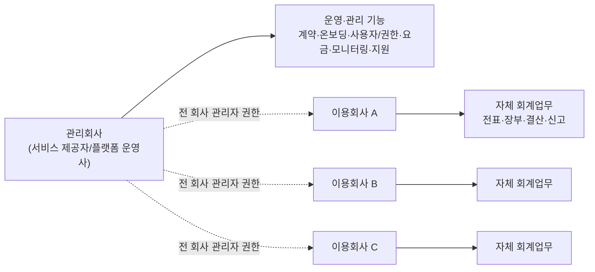
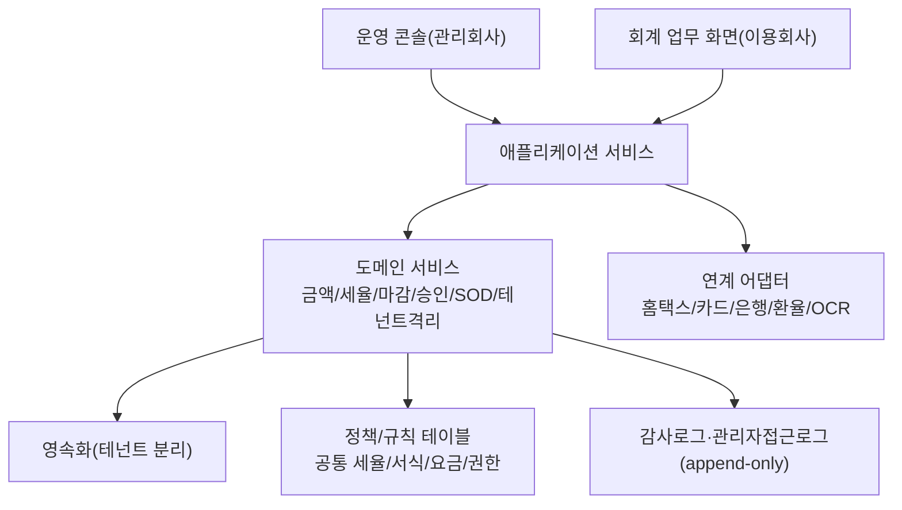
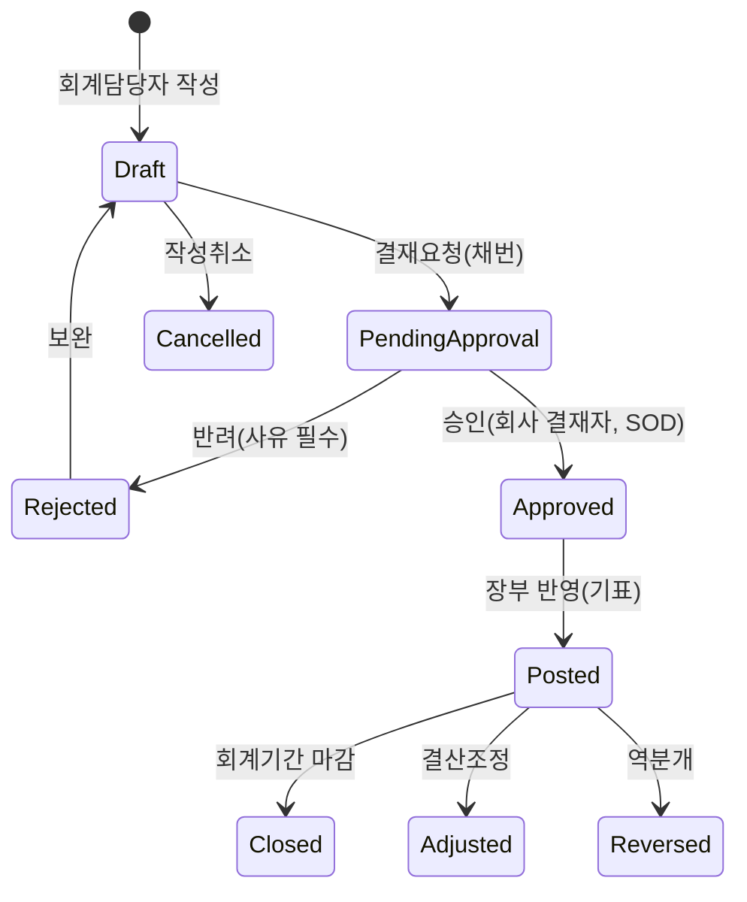

# BK 회계/세무 서비스 기본설계서 (서비스형 운영 모델)

- 기반 문서: `bk_상세_기본설계서.md`
- 작성일: 2026-06-10
- 작성 목적: 본 시스템을 **서비스형(SaaS) 멀티테넌트 회계/세무 플랫폼**으로 설계한다. 관리회사는 서비스를 제공하며 서비스를 제공받는 모든 회사에 대한 **관리자 권한**을 보유하고, **모든 회계·세무 업무는 각 이용회사가 자체적으로 수행**한다. 본 문서는 이 운영 모델을 기준으로 권한·업무흐름·데이터·보안을 재정의한다.
- 적용 범위: 기능 모듈(전표/장부/결산/부가세/법인세/고정자산 등)의 처리 규칙은 `bk_상세_기본설계서.md`를 준용하되, **운영 모델·권한 체계·업무 주체·결재 흐름**은 본 문서를 우선한다.

---

## 1. 문서 체계 및 용어

### 1.1 핵심 개념 (상세설계서와의 차이)

| 구분 | 상세설계서(대행/혼합 중심) | 본 서비스설계서(자가운영) |
|---|---|---|
| 회계업무 수행 주체 | 관리회사 사원이 직접 처리 또는 검토/승인 | **이용회사가 전 업무 자체 수행** |
| 관리회사 역할 | 회계 대행·검토·승인 | **서비스 제공자 + 전 회사 관리자(운영·관리·지원)** |
| 관리회사 권한 | 배정된 회사·업무영역 범위 | **모든 이용회사에 대한 관리자 권한** |
| 전표 결재 | 고객 제출 → 관리회사 검토/승인 | **이용회사 내부 결재로 완결** |
| 기장 운영 모델 | 대행/자가/혼합 선택 | **자가운영 단일 모델** |

### 1.2 용어 정의

| 용어 | 영문/엔티티 | 정의 |
|---|---|---|
| 관리회사 | `ManagementCompany` | 서비스를 제공하고 전 이용회사를 관리·운영하는 주체(플랫폼 운영사) |
| 운영자 | `OperatorUser` | 관리회사 소속 사용자(운영관리/고객지원/시스템관리) |
| 이용회사 | `TenantCompany` (구 `ManagedCompany`) | 서비스를 제공받아 회계·세무 업무를 자체 수행하는 회사(테넌트) |
| 이용회사 사용자 | `TenantUser` | 이용회사 소속 사용자(회계관리자/담당자/결재자/세무담당/열람자) |
| 관리자 권한 | Admin Authority | 관리회사가 모든 이용회사에 대해 보유하는 설정·사용자·권한·모니터링·지원 권한 |
| 자가운영 | Self-Operation | 이용회사가 전표~결산~신고까지 스스로 처리하는 운영 방식 |

---

## 2. 서비스 운영 모델

### 2.1 운영 구조

### 2.2 운영 모델 기본 전제

- 관리회사는 다수 이용회사에 회계/세무 시스템을 **서비스로 제공**한다.
- 관리회사는 **모든 이용회사에 대한 관리자 권한**을 보유한다(회사 설정, 사용자·권한, 공통 기준정보 배포, 모니터링, 지원).
- **회계·세무 실무(전표 입력·승인·기표·장부·결산·신고)는 각 이용회사가 자체적으로 수행**한다. 관리회사는 실무 처리의 결재 주체가 아니다.
- 이용회사의 데이터(전표·장부·결산·신고·첨부)는 회사별로 완전히 분리되며, 회사 간 교차 접근은 차단된다.
- 관리회사의 이용회사 데이터 접근은 **관리자/지원 목적에 한해** 가능하며, 접근은 사유·로그로 통제한다(4.4).
- 관리회사는 운영 지원(문의 대응, 설정 지원, 장애 대응, 공통 코드/세율/서식 배포)을 제공한다.

### 2.3 이용회사 업무 상태

| 상태 | 코드 | 의미 | 통제 |
|---|---|---|---|
| 가입대기 | `PENDING` | 계약·온보딩 미완료 | 로그인/설정만, 회계업무 제한 |
| 이용중 | `ACTIVE` | 서비스 정상 이용 | 전 회계업무 자체 수행 |
| 일시중지 | `SUSPENDED` | 요금 미납/보류 | 조회만, 신규 처리 제한 |
| 해지 | `TERMINATED` | 서비스 종료 | 보관기간 내 조회/다운로드만 |
| 휴면 | `DORMANT` | 장기 미사용 | 재활성화 시 본인확인 |

---

## 3. 설계 원칙 및 아키텍처

### 3.1 업무 원칙

1. 회계 실무는 이용회사가 자체 수행하고, 전표는 **이용회사 내부 승인** 후에만 원장·장부·결산·신고에 반영한다.
2. 마감된 기간의 전표·세율·환율·결산자료는 수정/삭제를 제한한다.
3. 금액 불일치·계정 매핑 누락·세법 초과는 자동수정하지 않고 경고/검토/오류로그로 처리한다.
4. 모든 수정·삭제·승인·반려·마감·전송과 **관리회사의 관리자 접근**은 사용자·시각·전후값을 포함해 감사로그로 남긴다.
5. 자동분개·자동계산·신고파일 생성은 재실행 시 중복되지 않도록 멱등성을 보장한다.
6. 기준정보는 거래보다 먼저 확정한다. 공통 기준정보(세율/서식/표준계정)는 관리회사가 배포하고, 회사 기준정보는 이용회사가 관리한다.
7. 모든 업무 데이터는 이용회사(테넌트) 단위로 분리한다.
8. 작성자와 승인자는 분리한다(SOD, 이용회사 내부). 관리회사의 관리자 접근은 업무 처리와 분리 기록한다.

### 3.2 아키텍처 계층

### 3.3 구조 원칙

- 멀티테넌시: 모든 업무 데이터는 `tenantCompanyId`로 격리하고, 도메인 서비스 계층에서 테넌트 컨텍스트를 강제한다.
- 운영 콘솔(관리회사)과 업무 화면(이용회사)을 채널로 분리한다.
- 공통 기준정보·세율·서식은 전역 관리(관리회사 배포), 실제 적용값은 회사별 적용 이력으로 관리.
- 관리회사 관리자 권한과 회사 업무 권한을 분리하고, 관리자 접근은 전용 로그로 남긴다.

---

## 4. 사용자 · 권한 · 직무분리(SOD)

### 4.1 사용자 그룹 분리 원칙

| 그룹 | 엔티티 | 소속 | 채널 | 데이터 범위 |
|---|---|---|---|---|
| **관리회사 운영자** | `OperatorUser` | 관리회사 | 운영 콘솔 | **전 이용회사(관리자 권한)** |
| **이용회사 사용자** | `TenantUser` | 이용회사 | 회계 업무 화면 | 본인 소속 단일 이용회사 |

- 관리회사 운영자는 운영·관리·지원을 수행하며, 회계 실무(전표/결산/신고)는 직접 수행하지 않는다.
- 이용회사 사용자는 자사의 전 회계·세무 업무를 자체 수행한다.

### 4.2 관리회사 운영자 권한 체계 (전 회사 관리자)

| 역할 | 영역 | 핵심 권한 |
|---|---|---|
| 운영 총괄(슈퍼관리자) | 플랫폼 전반 | 전 이용회사·전 운영자·전역 정책에 대한 최고 관리자 권한 |
| 운영 관리자 | 계약·온보딩·요금 | 이용회사 등록/계약/요금, 온보딩, 서비스 상태 관리 |
| 고객 지원 | 지원·문의 | 이용회사 설정 지원, 문의 대응, 지원 목적 데이터 접근(로그) |
| 기준정보 운영 | 공통 표준 | 공통 세율·신고서식·표준계정·공통코드 배포/버전관리 |
| 시스템 관리자 | 시스템 | 인증정책, 배치, 연계, 접근로그, 보안 설정 |

관리회사 운영자 권한 범위:

- **전 이용회사 관리자 권한**: 회사 정보·환경설정·메뉴·권한 정책 관리, 이용회사 사용자 계정·권한 관리(생성/잠금/초기화), 진행현황·기한·지연 모니터링.
- 공통 기준정보(세율/서식/표준계정/공통코드) 등록·배포 및 회사별 적용 관리.
- 회계 실무 데이터(전표/장부/결산/신고)에 대한 **조회·지원 권한**(원칙적으로 직접 작성/승인하지 않음).
- 시스템 운영(인증정책, 배치, 연계, 보안)·요금·계약 관리.

### 4.3 이용회사 사용자 권한 체계 (자체 수행)

이용회사는 자사 조직 구조에 맞춰 회계 업무를 자체 수행한다.

| 역할 | 영역 | 핵심 권한 |
|---|---|---|
| 회사 관리자(회계관리자) | 자사 전반 | 자사 사용자·권한(위임범위 내), 회사 기준정보, 결산 승인, 마감 |
| 회계담당자 | 전표·장부 | 전표 작성/수정/조회, 증빙 첨부, 장부 출력, 결산자료 입력 |
| 세무담당자 | 부가세·법인세 | 부가세/법인세/차량/고정자산 세무, 신고자료 생성·전송 |
| 결재자/대표 | 승인 | 전표·결산·신고 승인/반려, 결재이력 |
| 열람자 | 조회 | 보고서·산출물 열람(권한 범위) |

이용회사 권한 통제:

- **데이터 범위 권한**: 본인 소속 단일 `tenantCompanyId`로 고정(교차 접근 불가).
- 자사 회계 전 업무(기준정보~전표~장부~결산~부가세/법인세~고정자산~신고)를 권한 범위 내에서 수행.
- 자사 사용자/권한은 회사 관리자가 관리하되, **관리회사가 상위 관리자**로서 정책·한도를 통제한다.

### 4.4 관리회사 관리자 접근 통제

관리회사는 전 회사 관리자 권한을 보유하므로, 오남용 방지를 위한 통제를 둔다.

| 통제 | 규칙 |
|---|---|
| 접근 로깅 | 관리회사 운영자의 이용회사 데이터 접근은 `AdminAccessLog`에 사용자/시각/회사/대상/목적 기록 |
| 사유 필수 | 회계 실무 데이터(전표/개인정보 등) 조회 시 접근 사유 입력 강제 |
| 직접 처리 제한 | 회계 실무(전표 작성/승인/기표)는 자가운영 원칙상 운영자가 직접 수행하지 않음. 긴급 지원 시에만 권한·사유·로그 동반 |
| 알림 | 이용회사 관리자에게 관리회사의 자사 데이터 접근 내역을 통지(정책 옵션) |
| 권한 분리 | 운영자 계정의 관리자 권한과 회사 업무 처리 권한을 분리 |

### 4.5 직무분리(SOD)

| 통제 | 규칙 |
|---|---|
| 작성-승인 분리 | 이용회사 내부에서 작성자(`createdBy`)와 승인자(`approvedBy`) 동일인 금지 |
| 등록-마감 분리 | 회사 기준정보 등록 권한과 마감/마감해제 권한 분리 |
| 생성-제출 분리 | 신고파일 생성자와 제출 승인자 분리 |
| 운영-업무 분리 | 관리회사 관리자 접근과 이용회사 업무 처리를 분리 기록 |

- 1인 운영 소규모 이용회사는 SOD 완화 옵션을 회사 정책으로 설정(사유/승인 기록).

### 4.6 인증 · 로그인 보안

`bk_상세_기본설계서.md` 5.7~5.14를 준용한다. 핵심 사항:

- 비밀번호 정책(길이·복잡도·변경주기·재사용 제한·잠금), 일방향 해시 저장.
- 다단계 인증(2FA): 관리회사 운영자는 **2FA 필수**, 이용회사 사용자는 회사 정책(권장 필수). 민감 작업 시 step-up 인증.
- 계정 잠금·휴면·세션 관리(유휴 타임아웃·동시 세션·신뢰 기기), 로그인 이력·이상 탐지.
- 인증 채널 분리: 운영 콘솔과 회사 업무 화면 세션 분리.

### 4.7 권한 검증 처리 흐름

1. 사용자 그룹 판별: `OperatorUser`(관리회사) / `TenantUser`(이용회사).
2. 채널 검증: 운영 콘솔 ↔ 회사 업무 화면.
3. 테넌트 범위 검증: 운영자는 전 회사(관리자 권한), 이용회사 사용자는 소속 단일 `tenantCompanyId`.
4. 행위 권한 검증: Role 기반 행위 권한.
5. 관리자 접근 통제: 운영자의 회사 데이터 접근 시 사유·`AdminAccessLog` 기록.
6. SOD 검증: 작성-승인 동일인 여부(이용회사 내부).
7. 위반 시 차단하고 `AccessLog`·보안 이벤트 기록.

---

## 5. 전표 도메인

전표 입력·승인·기표는 **이용회사가 자체적으로** 수행한다. 처리 규칙(전표유형/채번/분개 검증/외화/출력 등)은 상세설계서 6장을 준용한다.

### 5.1 전표 유형 / 채번 / 분개

- 전표유형: 입금/출금/대체/매입/매출/결산/역분개(상세설계서 6.1 준용).
- 채번: `tenantCompanyId` + 회계연도 + 유형 기준, 결재요청 시 정식 채번(상세설계서 6.2 준용).
- 분개 입력 보조(자동 잔액·필수 관리항목·부가세 자동라인·복사/템플릿/반복/엑셀 일괄)와 외화 전표는 상세설계서 6.4~6.5 준용.
- 관리차원: 전표 라인에 `businessPlaceId`(사업장)·`costCenterId`(코스트센터)를 입력할 수 있다. 두 차원의 표시·필수 여부는 회사 환경설정(`DimensionConfig`, 7.1)과 계정 속성에 따라 결정되며, 미사용 회사는 해당 컬럼을 숨긴다.

### 5.2 전표 생명주기 (이용회사 내부 완결)

- 상세설계서의 `CLIENT_SUBMITTED`/`REVIEWING`(고객 제출 → 관리회사 검토) 단계는 **본 모델에서 제거**한다. 전표 결재는 이용회사 내부에서 완결된다.
- 전표 헤더 `createdByGroup`은 `TENANT`(이용회사) 기준으로 기록한다. 관리회사 운영자에 의한 예외적 작성은 `OPERATOR`로 구분하고 사유·로그를 남긴다.

### 5.3 전표 상태별 통제

상세설계서 6.6의 통제표를 준용하되, 작성/검토/승인의 주체는 모두 **이용회사 사용자**이다. 마감/마감해제는 회사 관리자 권한, 관리회사는 모니터링·지원만 수행한다.

### 5.4 AI 기반 이상거래 탐지

전표 등 입력자료를 분석해 **이상 징후를 점수화·우선순위화하고 사유를 제시**하는 보조 기능(상세설계서 11.7 준용). **AI는 탐지·우선순위화·사유 제시까지만 수행하며, 전표의 수정·승인·반려·확정은 사람(이용회사 사용자)이 판단**한다(휴먼인더루프, 자동수정 금지 원칙 일관).

- **탐지 범위**: 라운드 금액·통계적 이상치·Benford, 중복/유사·한도 회피 분할, 심야·마감임박·소급 입력, 비정상 계정조합·거래처-계정 불일치, SOD 위반 의심, 거래처/과세유형 정합성.
- **탐지 방식(3계층 하이브리드 + 설명)**: ① 규칙 + ② 통계(Z-score/IQR/Benford) + ③ 비지도 ML(Isolation Forest/Autoencoder) 점수 합산, SHAP로 사유(reason code) 산출. 선택적으로 온프레미스 LLM이 사유를 자연어로 풀이. 블랙박스 단독 판단 금지.
- **흐름**: 전표 입력/스테이징 시 실시간 경량 점수(저장 차단 없이 경고) + 야간 배치 ML 전수 재평가 → 임계 초과 알림 → 검토자 확인/기각 → 결정 이력 보존·재학습 피드백.
- **통제**: 모델·기준선·점수·알림은 `tenantCompanyId` 단위 격리(교차 학습 금지), 학습/추론 시 PII 가명화, 외부 LLM API에 원시 전표 전송 금지, 점수·알림·검토 결정은 `DataChangeLog` 해시체인 연계.
- **도입 단계**: Phase 1(규칙+통계) → Phase 2(비지도 ML) → Phase 3(검토 피드백 지도학습 + 선택 LLM).
- 관리회사는 탐지 규칙·임계치 표준 배포(6장 연계)와 모델 운영·모니터링만 수행하고, 회사 전표는 직접 변경하지 않는다.

---

## 6. 전자결재 (이용회사 내부)

전자결재 시스템(상세설계서 7장)을 준용하되, **결재 주체는 이용회사 내부 사용자**로 한정한다.

- 결재 대상: 전표(`JOURNAL`), 결산 확정/마감, 부가세·법인세 신고 제출, 지출결의, 세금계산서 발행, 중요 기준정보 변경.
- 결재선: 이용회사 내부 결재선(기안/검토/협의/승인/전결), 금액 한도·전표유형·부서 기준 자동 산정.
- 전결·대결·위임, 결재함(기안/대기/진행/완료/반려/참조), 일괄결재, 이력(`ApprovalHistory`).
- 관리회사 운영자는 결재선에 포함되지 않으며, 진행현황 모니터링·지원만 수행한다.

---

## 7. 기준정보

기준정보는 **공통(관리회사 배포)** 과 **회사(이용회사 관리)** 로 구분한다.

| 구분 | 관리 주체 | 항목 |
|---|---|---|
| 공통 기준정보 | 관리회사 | 표준계정 템플릿, 부가세 세율·과세유형, 신고서식 버전, 공통코드 표준, 환율 소스 |
| 회사 기준정보 | 이용회사 | 회사정보, 회계연도/마감, 회사 계정과목, 거래처, 부서/프로젝트/현장, **사업장**, **코스트센터**, 회사 환경설정, 회사 공통코드, 자동분개 규칙, 전기이월 설정 |

- 공통 기준정보는 관리회사가 버전 관리·배포하고, 이용회사는 이를 채택/확장한다(회사별 적용 이력 보존).
- 회사 계정과목 확장 속성(계정성격/정상잔액/통제계정/필수 관리항목)은 상세설계서 8장(`BASE-03`, `EXT-02`) 준용.
- 검증: 코드 중복/사용 중 삭제 금지, 적용기간 중복 금지, 마감기간 소급수정 제한, 변경 전후값 감사로그.

### 7.1 관리차원: 사업장 · 코스트센터 (회사별 선택 사용)

전표 라인에 부가하는 분석 축(관리차원)으로 **사업장**과 **코스트센터**를 둔다. 두 차원은 **이용회사 환경설정(`CompanySettings` / `DimensionConfig`)에 따라 사용 여부·필수 여부를 회사가 직접 결정**하며, **함께(동시) 사용**할 수 있다.

| 관리차원 | 엔티티 | 성격 | 비고 |
|---|---|---|---|
| 사업장 | `BusinessPlace` | 부가세 신고단위 등 **법적 의미** 포함(주/종사업장) | 사업자단위과세·종된사업장 처리(10장 연계) |
| 코스트센터 | `CostCenter` | 비용/손익 집계·책임 단위(**관리 목적**) | 계층 구조, 부서/프로젝트와 매핑 가능, 유효기간 보유 |

회사 환경설정(`DimensionConfig`) 항목 — 회사별로 설정:

| 설정 | 값 | 설명 |
|---|---|---|
| `useBusinessPlace` | Y/N | 사업장 사용 여부 |
| `businessPlaceRequired` | Y/N | 전표 입력 시 사업장 필수 여부 |
| `businessPlaceScope` | 전체/대상유형 | 적용 대상(예: 매입/매출 전표 등) |
| `useCostCenter` | Y/N | 코스트센터 사용 여부 |
| `costCenterRequired` | Y/N | 전표 입력 시 코스트센터 필수 여부 |
| `costCenterScope` | 전체/대상계정 | 적용 대상(예: 비용·손익 계정) |
| `costCenterDeptMapping` | Y/N | 코스트센터-부서 매핑 사용 여부 |

운영 규칙:

- **동시 사용**: 한 회사가 사업장과 코스트센터를 함께 사용할 수 있고, 전표 라인에 두 축을 동시에 입력·집계한다.
- **회사별 선택**: 사용하지 않도록 설정한 차원은 입력 화면에서 **컬럼을 숨기고** 검증/집계에서 제외한다.
- **필수/선택**: 사용+필수로 설정 시 미입력은 저장 차단, 사용+선택 시 입력 권장(경고).
- **계정 연계**: 계정 확장 속성의 `requiredDimensions`에 `BUSINESS_PLACE`·`COST_CENTER`를 포함하여, 특정 계정에 한해 차원 입력을 강제할 수 있다(회사 설정과 AND 조건).
- **코스트센터 구조**: 계층(상/하위), 유효기간, 부서/프로젝트 매핑을 지원하고, 종료된 코스트센터·사업장은 신규 전표 사용을 제한한다.
- **변경 영향**: 사용 여부 변경은 변경 시점 이후 거래에 적용하며, 과거 전표의 기존 차원값은 보존한다(변경 전후값 감사로그).
- **보고**: 사용 회사는 사업장별/코스트센터별 원장·시산표·손익 집계 및 다차원 조회를 제공한다(8·9장 연계).

> 전표 라인 필드에 `businessPlaceId`(조건부)·`costCenterId`(조건부)를 추가한다. 필수 여부는 회사 환경설정 및 계정 속성에 따라 결정된다(5장·17장 연계).

### 7.2 다중 회계기준 지원 및 외부 데이터 변환 입력

복수 회계기준(`K_GAAP`/일반기업회계기준, `K_IFRS`, `US_GAAP`, `IFRS`, 기타국 기준)을 지원하고, 외부(타 시스템·해외법인·그룹 본사)에서 작성된 **다른 회계기준 데이터를 수신하여 매핑·변환 후 입력**한다.

- **공통 기준 마스터**: 관리회사가 회계기준(`AccountingStandard`)·표준 계정체계·재무제표 항목·기준 변환 규칙(`StandardConversionRule`)을 공통 표준으로 배포·버전관리(6장 표준 배포 연계).
- **회사별 적용 기준**: 이용회사는 주재무제표 기준(primary)과 병행 보고 기준(secondary)을 지정하고, **병행원장(`LedgerBook`)** 으로 동일 거래를 복수 기준으로 표현한다.
- **변환 입력 구성**: 원천 포맷 정의(`ImportTemplate`, Excel/CSV/XML/XBRL/API), 계정 매핑(`ChartMapping`), 기준 변환·조정 규칙, 통화 환산(`FxTranslation`), 회계기간 매핑(`PeriodMapping`).
- **변환 흐름**: 수신(`ImportBatch`) → 검증(스키마/차대변/필수) → 계정 매핑 → 기준 변환·조정분개 → 스테이징(변환전표/잔액) → 회사 내부 검토/승인 → 반영 → 변환로그(`ConversionLog`)·기준차이(`ConversionDifference`) 보존.
- **주체**: 변환 입력은 이용회사가 자체 수행하며, 관리회사는 공통 기준·변환규칙 배포와 지원을 제공한다.
- **통제**: 원천키 멱등성, 미매핑 계정·미정의 규칙은 검토대상/오류로 반영 차단, 변환 전후값·규칙버전·환율 감사 기록, 기준차이 임의 덮어쓰기 금지, 마감/신고 기간 반영 제한.

---

## 8. 장부 / 원장

상세설계서 9장 준용. 총계정원장·보조원장·거래처원장·시산표·일/월계표는 이용회사가 자사 데이터로 조회·출력한다. 승인(`POSTED`↑) 전표만 집계하며 미승인/취소 전표는 제외한다. 채권채무 연령분석(aging) 포함.

---

## 9. 결산

상세설계서 10장 준용. 결산자료 입력·시산표 검증·결산정리분개(감가상각/충당금/경과계정/외화환산)·재무제표 생성·결산장부·전기이월을 **이용회사가 자체 수행**하고, 결산 확정/마감은 회사 내부 결재로 처리한다. 관리회사는 결산 기한·진행 모니터링과 지원을 제공한다.

재무제표는 재무상태표·손익계산서·자본변동표와 함께 **현금흐름표(`CashFlowStatement`)** 를 생성한다.

### 9.1 현금흐름표 생성

- **생성 방식**: 간접법(Indirect)·직접법(Direct) 중 회사가 선택(`cashFlowMethod`). 기본 간접법.
- **활동 구분**: 영업활동/투자활동/재무활동(Operating/Investing/Financing)으로 분류.
- **원천 데이터**: 승인·기표(`POSTED`) 전표·원장 + 재무상태표 기초/기말 비교 + 손익계산서.
  - 간접법: 당기순이익에서 비현금 항목(감가상각·충당금·외화환산손익 등) 가감 + 운전자본(매출채권/재고/매입채무 등) 증감.
  - 직접법: 현금및현금성자산 계정 분석을 통한 항목별 현금유입·유출 집계.
- **현금흐름 매핑(`CashFlowMapping`)**: 계정·거래유형을 현금흐름표 활동·세부항목에 매핑. 현금및현금성자산 대상 계정(`CashEquivalentAccount`) 정의.
- **다중 회계기준 연계**: 회사 적용기준(7.2)별 현금흐름표 양식·항목을 적용하고, 병행원장 기준별로 각각 생성.
- **검증·조정**: 기말 현금및현금성자산 잔액 = 재무상태표 현금 잔액 일치 검증. 불일치 시 차이내역 표시(G/L 자동수정 금지)하되, 추적 불가 미세 오차는 **현금흐름 조정 워크플로우**(사유 입력 → 미분류 항목을 특정 활동으로 귀속, 현금흐름표 출력용 차원 테이블에만 기록·감사)로 마감 교착을 방지한다(상세 11.3.1).
- **이중 통화 환산**: 다중 회계기준 병행 시 기능통화/보고통화 이원 장부를 지원하고, 화폐성=기말환율(외화환산손익)·비화폐성=역사적환율·보고통화 차이=OCI(해외사업환산손익)로 자동 처리(상세 11.6.1).
- **출력**: 화면·PDF·Excel, 사업장별/기준별 조회. 결산 확정/마감 시 산출물로 보관.

### 9.2 공시자료 생성

확정·마감된 재무제표를 기반으로 외부 공시·제출용 자료(`DisclosureReport`)를 생성한다.

- **대상 산출물**: 재무제표(재무상태표·손익계산서·현금흐름표·자본변동표) + 주석(`DisclosureNote`) + 연결재무제표(선택). 감사보고서 첨부 재무제표 포함.
- **공시 유형**: 사업보고서(연간)·반기·분기보고서, 감사보고서용 재무제표, 금융기관/거래소 제출자료.
- **포맷**: DART(전자공시) **XBRL**, 표준 서식 PDF/Excel. 표준 분류체계(taxonomy)는 관리회사가 공통 표준(6장)으로 배포·버전관리.
- **생성 흐름**: 확정 재무제표 → 공시 항목 매핑(`DisclosureMapping`, 재무제표 항목 ↔ taxonomy 요소) → 주석 자동 구성(템플릿+데이터) → XBRL/문서 생성 → 검증(taxonomy/필수항목/합계) → 산출물·제출 상태 관리.
- **다중 회계기준 연계**: 회사 적용기준(7.2)별 taxonomy(K-IFRS/일반기업회계기준 등) 적용, 병행원장 기준별 생성.
- **주체**: 공시자료 생성은 이용회사가 자체 수행하며, 관리회사는 taxonomy·서식 배포와 지원을 제공한다.
- **통제**: 마감·확정 재무제표만 공시 대상, 재무제표 변경 시 재생성, 제출 상태·버전·파일해시·생성자 기록(감사로그), 미매핑 항목 자동 추정 금지(검토대상).

---

## 10. 매입매출 / 부가세 / 경비

상세설계서 11장 준용. 매입/매출전표, 전자세금계산서 발행/수신, 부가세 신고자료 생성·전송, 미수금, 카드경비를 이용회사가 자체 수행한다. 사업장 단위 처리, 신고유형(예정/확정/수정/기한후), 적격증빙 판정 포함. 전자세금계산서 통제(승인 전 발행 불가, 공급가-세액 불일치 자동수정 금지)는 동일.

---

## 11. 세무 / 차량 / 고정자산

상세설계서 12장 준용. 업무용승용차 세무조정, 접대비, 외화평가, 고정자산/감가상각, 법인세 신고연계를 이용회사가 자체 수행한다. 세법 기준값·한도·서식은 관리회사가 공통 배포한 버전을 적용한다.

---

## 12. 자금 / 채권채무

상세설계서 13장 준용. 어음(받을/지급) 보조부, 예금/당좌, 채권채무 연령분석, 여신한도, 미수금 회수 대사를 이용회사가 자체 관리한다.

---

## 13. 데이터 모델

### 13.1 운영/테넌트 엔티티 (변경)

| 영역 | 엔티티 | 설명 |
|---|---|---|
| 관리회사/운영 | `ManagementCompany`, `OperatorUser`, `OperatorRole`, `AdminAccessLog` | 관리회사, 운영자, 운영자 권한, 관리자 접근 로그 |
| 이용회사 | `TenantCompany`, `ServiceSubscription`, `BillingPlan`, `Onboarding` | 이용회사(테넌트), 구독/요금제, 온보딩 |
| 공통 표준 | `GlobalStandard`, `StandardVersion` | 공통 세율/서식/표준계정/코드 배포·버전 |
| 회사/기간 | `Company`, `FiscalYear`, `FiscalPeriod`, `ClosingStatus`, `BusinessPlace`, `CostCenter`, `DimensionConfig` | 이용회사 회계실체·기간·사업장·코스트센터·관리차원 환경설정 |
| 회계기준/변환 | `AccountingStandard`, `LedgerBook`, `ChartMapping`, `StandardConversionRule`, `ImportTemplate`, `ImportBatch`, `ImportStagingEntry`, `ConversionLog`, `ConversionDifference`, `FxTranslation`, `PeriodMapping` | 다중 회계기준·외부 데이터 변환 입력(7.2) |

### 13.2 업무/공통 엔티티 (상세설계서 준용)

- 권한/인증: `TenantUser`, `Role`, `Permission`, `AccessLog`, `UserCredential`, `PasswordHistory`, `MfaDevice`, `LoginHistory`, `UserSession`, `TrustedDevice`, `AccountStatus`.
- 결재: `ApprovalRule/Line/Step/Request/StepInstance/History/Delegation/Comment/Attachment`.
- 기준정보/거래처/세금환율, 전표(`JournalHeader/Line/Approval/Attachment/History`), 장부, 결산, 매입매출, 경비, 차량/세무, 고정자산: 상세설계서 14장 준용.
- 현금흐름표: `CashFlowStatement`, `CashFlowStatementLine`, `CashFlowMapping`, `CashEquivalentAccount`.
- 공시: `DisclosureReport`, `DisclosureMapping`, `DisclosureNote`, `XbrlTaxonomy`, `XbrlInstance`, `DisclosureSubmissionLog`.
- 외부수집/ETL: `ScrapingTask`(수집 태스크 큐), `IntegrationStaging`(외부 Raw 적재), `IntegrationAdapter`(기관별 파서).
- 아키텍처·거버넌스(추가검토): `TierMigrationJob`·`DistributedLock`(인프라), `DataTierPolicy`·`ArchiveDataset`(콜드 스토리지), `ExternalPartnerProfile`(세무대리인 가드레일), `SessionRecording`(긴급대행 녹화), `CashFlowAdjustment`(현금흐름 조정), `FxTranslationEngine` 관련 통화 필드(`functionalCurrency/Amount`, `presentationCurrency/Amount`, `exchangeRateType`).
- 개인정보/보안: `PersonalDataCatalog`, `ConsentRecord`, `EncryptionKey`, `MaskingPolicy`, `PersonalDataAccessLog`, `DataChangeLog`, `SecurityEvent`, `DataDestructionLog`.
- 이상거래 탐지(5.4, 상세 11.7): `AnomalyRule`, `AnomalyModel`, `AnomalyScore`, `AnomalyAlert`, `AnomalyReviewLog`, `AnomalyFeatureSet`.
- AI 조회 챗봇(18.1, 상세 11.8): `ChatSession`, `ChatMessage`, `ChatQueryLog`, `QueryToolRegistry`, `ChatGuardrailPolicy`.

### 13.3 데이터 분리 기준 (멀티테넌시)

- 전표/장부/결산/부가세/법인세/고정자산/첨부파일·개인정보는 반드시 `tenantCompanyId`를 가진다.
- 이용회사 사용자 조회는 소속 `tenantCompanyId` 단일값으로 제한.
- 관리회사 운영자는 관리자 권한으로 전 회사 접근 가능하나, 접근은 `AdminAccessLog`로 기록하고 회계 실무 직접 변경은 제한.
- 회사별 코드 유일성(계정/거래처/프로젝트), 공통 표준은 회사별 적용 이력으로 관리.

### 13.4 주요 상태값

| 상태 그룹 | 상태값 |
|---|---|
| 이용회사 | `PENDING`, `ACTIVE`, `SUSPENDED`, `TERMINATED`, `DORMANT` |
| 구독/요금 | `TRIAL`, `ACTIVE`, `PAST_DUE`, `CANCELED` |
| 전표 | `DRAFT`, `PENDING_APPROVAL`, `REJECTED`, `APPROVED`, `POSTED`, `ADJUSTED`, `REVERSED`, `CANCELLED` |
| 결재 | `DRAFT`, `IN_PROGRESS`, `APPROVED`, `REJECTED`, `WITHDRAWN`, `FINALIZED`, `POST_PENDING` |
| 마감 | `OPEN`, `TEMP_CLOSED`, `CLOSED`, `REOPEN_REQUESTED`, `REOPENED` |
| 계정(로그인) | `ACTIVE`, `LOCKED`, `DORMANT`, `SUSPENDED`, `PASSWORD_EXPIRED`, `DISABLED` |
| 변환 배치 | `RECEIVED`, `VALIDATED`, `MAPPED`, `CONVERTED`, `STAGED`, `REVIEWING`, `POSTED`, `REJECTED`, `FAILED` |
| 공시자료 | `DRAFT`, `GENERATED`, `VALIDATED`, `APPROVED`, `SUBMITTED`, `ACCEPTED`, `REJECTED` |
| 이상 알림 | `NEW`, `IN_REVIEW`, `CONFIRMED_NORMAL`, `ACTION_TAKEN`, `DISMISSED` |
| 챗봇 세션 | `ACTIVE`, `IDLE`, `EXPIRED`, `TERMINATED` |
| 기타(세금계산서/신고/자산 등) | 상세설계서 14.5 준용 |

---

## 14. 서비스 / API

### 14.1 내부 서비스 (변경/추가)

| 서비스 | 책임 |
|---|---|
| `TenantManagementService` | 이용회사 등록/상태/구독/요금/온보딩 |
| `OperatorAdminService` | 관리회사 운영자·전 회사 관리자 권한, 관리자 접근 로그 |
| `GlobalStandardService` | 공통 세율/서식/표준계정/코드 배포·버전 |
| `TenantUserService` | 이용회사 사용자/권한(회사 관리자 위임) |
| `AuthService` | 로그인/2FA/비밀번호/세션/잠금(4.6) |
| `JournalService`/`ApprovalService`/`PostingService`/`LedgerService`/`ClosingService`/`StatementService`/`VatService`/`TaxInvoiceService`/`ExpenseService`/`VehicleTaxService`/`FixedAssetService`/`CorporateTaxService`/`FundService`/`AuditService`/`ReportService`/`RetentionService` | 상세설계서 15장 준용(테넌트 컨텍스트로 동작) |
| `AnomalyDetectionService` | 이상거래 탐지(규칙·통계·ML 스코어링·알림·검토 루프, 5.4·상세 11.7) |
| `ChatQueryAgentService` | AI 조회 챗봇(자연어 조회 에이전트·Tool calling·읽기전용·조회 감사, 18.1·상세 11.8) |

### 14.2 API 예시 (운영/테넌트)

| Method | URI | 설명 |
|---|---|---|
| `POST` | `/api/operator/tenants` | 이용회사(테넌트) 등록 |
| `POST` | `/api/operator/tenants/{id}/subscription` | 구독/요금제 설정 |
| `GET` | `/api/operator/tenants/{id}/dashboard` | 회사 진행현황 모니터링 |
| `POST` | `/api/operator/tenants/{id}/users` | 이용회사 사용자 계정 관리(관리자 권한) |
| `POST` | `/api/operator/global-standards` | 공통 표준 배포 |
| `GET` | `/api/operator/admin-access-logs` | 관리자 접근 로그 조회 |
| `GET·PUT` | `/api/tenant/settings/dimensions` | 관리차원 환경설정(사업장/코스트센터 사용·필수) 조회/변경 |
| `POST·GET` | `/api/tenant/business-places` | 사업장 등록/조회 |
| `POST·GET` | `/api/tenant/cost-centers` | 코스트센터 등록/조회(계층·매핑) |
| `GET·POST` | `/api/operator/accounting-standards` | 회계기준·변환규칙 공통 배포 |
| `GET·PUT` | `/api/tenant/accounting-standards` | 회사 적용기준(주/병행) 설정 |
| `GET·POST` | `/api/tenant/chart-mappings` | 계정 매핑(타 기준↔자사) |
| `POST` | `/api/tenant/import/batches` | 외부 회계데이터 수신 |
| `POST` | `/api/tenant/import/batches/{id}/convert` | 매핑·기준 변환 |
| `POST` | `/api/tenant/import/batches/{id}/post` | 변환 결과 반영 |
| `POST` | `/api/tenant/journals` | (이용회사) 전표 저장 |
| `POST` | `/api/tenant/journals/{id}/submit` | 결재요청 |
| `POST` | `/api/tenant/journals/{id}/approve` | 승인(회사 결재자) |
| `POST` | `/api/tenant/journals/{id}/post` | 기표 |
| `POST` | `/api/tenant/closing/{periodId}/close` | 결산 마감 |
| `GET·POST` | `/api/tenant/cash-flow-mappings` | 현금흐름 항목 매핑 설정 |
| `POST` | `/api/tenant/closing/{periodId}/cash-flow` | 현금흐름표 생성(직접/간접) |
| `GET` | `/api/tenant/cash-flow-statements/{id}` | 현금흐름표 조회/출력 |
| `GET·POST` | `/api/operator/disclosure-taxonomies` | XBRL 분류체계 공통 배포 |
| `GET·POST` | `/api/tenant/disclosure-mappings` | 공시 항목 매핑 설정 |
| `POST` | `/api/tenant/closing/{periodId}/disclosures` | 공시자료 생성(재무제표/주석/XBRL) |
| `GET` | `/api/tenant/disclosures/{id}` | 공시자료 조회/출력/제출상태 |
| `POST` | `/api/tenant/vat/declarations` | 부가세 신고자료 생성 |
| `GET·PUT` | `/api/tenant/anomaly-rules` | 이상탐지 규칙·임계치 설정 |
| `GET` | `/api/tenant/anomaly/alerts` | 이상 알림 목록(우선순위·사유) |
| `POST` | `/api/tenant/anomaly/alerts/{id}/review` | 알림 검토 결정(정상확인/조치/기각) |
| `POST` | `/api/tenant/chat/sessions` | AI 조회 챗봇 세션 시작 |
| `POST` | `/api/tenant/chat/sessions/{id}/messages` | 자연어 질의 전송·응답(조회 결과+출처) |
| `GET` | `/api/tenant/chat/query-logs` | 챗봇 조회 감사 로그 |
| `POST` | `/api/auth/login` · `/api/auth/mfa/verify` | 인증 |

API 공통: 모든 업무 API는 `tenantCompanyId` 컨텍스트와 권한을 검증한다. 운영자 API는 관리자 권한·접근로그를 검증한다. 멱등 생성 API는 멱등키를 요구한다.

---

## 15. 외부 연계

상세설계서 16장 준용(홈택스/국세청/카드사/은행/ERP/환율/OCR/e-tax). 연계는 이용회사 단위로 인증·수행하며, 공통 연계 설정·인증정보 관리는 관리회사가 운영 지원한다. 연계 로그·중복방지·재전송 규칙 동일.

대량 외부 수집(스크래핑)은 **메시지 큐 기반 비동기**로 처리한다: 사용자 요청은 즉시 접수(202)하고, **API 서버와 분리된 스크래핑 워커 풀**이 큐에서 태스크를 처리한다(외부기관 지연이 서비스 전체로 전파되지 않도록 격리). 수집된 Raw 데이터는 **스테이징 테이블**에 적재 후 **기관별 어댑터(파서)** 로 표준 전표 스키마로 정제·검증하여 원장에 이관한다(직접 인서트 금지).

---

## 16. 배치 / 스케줄

상세설계서 17장 준용. 회사별 자동분개·환율동기화·세금계산서 수신·감가상각·결산검증·신고집계·**이상거래 야간 전수 스코어링(5.4)**은 이용회사 단위로 수행한다. 운영 배치(구독 상태 점검, 회사별 기한/지연 모니터링, 개인정보 보유기간/파기 점검, 접근 이상탐지, **이상탐지 모델 재학습·기준선 갱신**)는 관리회사가 운영한다.

---

## 17. 검증 / 오류 처리

상세설계서 18장 준용. 추가:

| 검증 항목 | 처리 기준 |
|---|---|
| 테넌트 범위 외 접근 | 차단, 접근로그·보안이벤트 기록 |
| 관리자 접근 사유 미입력 | 회계 실무/개인정보 접근 차단 |
| 구독 중지/해지 회사 | 신규 처리 제한, 조회만 허용 |
| 작성자=승인자 | 차단(SOD, 이용회사 내부) |
| 사업장/코스트센터 필수 미입력 | 회사 설정상 사용+필수인 차원 미입력 시 저장 차단 (7.1) |
| 미사용 차원값 입력 | 회사 설정상 미사용 차원은 입력/표시 제외 |
| 종료된 사업장/코스트센터 사용 | 신규 전표 사용 제한 |
| 이상탐지 알림 처리 | AI는 경고·우선순위만, 전표 자동 수정/반려/승인 금지(사람 검토 필수, 5.4) |
| 이상탐지 사유 누락 | reason code 없는 알림 생성 차단(설명가능성) |
| 학습 데이터 PII | 가명화 미적용 데이터의 모델 학습 차단 |
| 챗봇 쓰기/변경 시도 | 읽기 전용 강제, 전표 생성/수정/승인/삭제 차단(18.1) |
| 챗봇 테넌트/권한 위반 | 세션 `tenantCompanyId`·사용자 권한 외 조회 차단(서버 강제) |
| 챗봇 프롬프트 인젝션 | 데이터 내 지시문 실행 금지(데이터/명령 분리) |

---

## 18. 보고서 / 출력

상세설계서 19장 준용. 이용회사는 자사 전표/원장/시산표/재무제표/부가세신고서/세무자료를 조회·출력한다. 관리회사는 운영 보고서(회사별 이용현황·기한·지연·관리자 접근 로그·서비스 품질)를 조회한다. 개인정보·민감정보 마스킹 적용.

### 18.1 AI 조회 챗봇 (자연어 데이터 조회)

전표·거래내역·잔액·원장·시산표 등을 **자연어 질문으로 조회**하는 대화형 보조 기능(상세설계서 11.8 준용). **조회(Read-Only) 전용**이며, 전표 생성/수정/승인/삭제는 챗봇이 수행하지 않는다(변경은 정식 화면·결재 경로, 휴먼인더루프).

- **아키텍처**: Tool-calling 에이전트가 주력 — LLM이 의도·파라미터를 추출해 **사전 정의된 안전한 조회 함수**(전표 검색·계정별 합계·기간 잔액 등)를 호출하고, 실제 계산·집계는 기존 도메인 서비스(`JournalService`/`LedgerService`/`StatementService`)가 수행한다. 자유 질의는 **읽기 전용·화이트리스트 뷰**에 한정한 Text-to-SQL로 보완, 매뉴얼·계정설명·세무규정은 RAG로 보조. 수치는 DB/서비스 계산값을 그대로 쓰고 LLM은 문장화만 한다(LLM 직접 계산 금지).
- **보안·격리**: 모든 조회에 세션의 `tenantCompanyId`를 서버에서 강제 주입(LLM 지정 불가), 사용자 본인 권한 범위만 조회(RBAC·SOD), read-only 커넥션, PII 마스킹, 외부 LLM API에 원시 전표 전송 금지(온프레미스 우선), 프롬프트 인젝션 방어(데이터/명령 분리).
- **감사**: 질의·실행 쿼리·반환 건수를 `ChatQueryLog`(append-only)로 조회 감사한다.
- **도입 단계**: Phase 1(사전정의 Tool calling) → Phase 2(제한적 Text-to-SQL 읽기전용 뷰) → Phase 3(RAG 보조 + 멀티턴).
- 관리회사는 챗봇 허용 데이터·마스킹·LLM 사용 정책(`ChatGuardrailPolicy`)·허용 조회 함수(`QueryToolRegistry`)를 표준으로 운영하고, 회사 데이터는 직접 변경하지 않는다.

---

## 19. 비기능 요구사항

상세설계서 20장 준용. 핵심 강조:

| 항목 | 설계 기준 |
|---|---|
| 멀티테넌시 보안 | `tenantCompanyId` 격리, 회사 간 교차 접근 차단 |
| 관리자 권한 통제 | 관리회사 운영자 접근 전용 로그(`AdminAccessLog`)·사유·알림 |
| 직무분리 | 이용회사 내부 작성-승인, 운영-업무 분리 |
| 감사성 | 변경·관리자 접근·인증 이력 불변 저장(append-only + 해시체인) |
| 데이터 분리/소산 | 회사별 분리, 법정 보존연한 관리 후 소산 |
| 성능/가용성 | 다수 테넌트 동시 이용, 마감기간 가용성 |
| 확장성 | 세율/서식/회계기준 변경을 공통 표준 배포로 흡수 |

### 19.1 SaaS 회계 개발 준수사항 (`SaaS_회계개발_주의점.md` 반영)

SaaS 회계 개발 가이드의 핵심 항목을 본 설계에 반영한다.

| 가이드 영역 | 설계 반영 |
|---|---|
| 데이터 격리(1.1) | 격리 3티어(`SHARED`/`SCHEMA`/`DEDICATED`) 선택(상세 2장), 비즈니스 타겟별 적용 |
| Shared DB 보안(1.2) | **DB Row-Level Security(RLS) + ORM 글로벌 필터/인터셉터** 이중 강제 — 애플리케이션 `WHERE tenant_id` 의존 금지, 쿼리 빌드 시 테넌트 조건 자동 결합 |
| 불변성·감사(1.3) | **물리 삭제 금지(soft delete 지양)**: 잘못된 전표는 삭제 대신 **취소/역분개 전표**로 처리, 원본 보존 + 상태/이력 테이블. CUD는 '누가/언제/IP/전후값'을 `DataChangeLog`로 강제(인터셉터/트리거) |
| 세법 탈하드코딩(2.1) | 세율·한도·과표구간 코드 상수 금지 → **세법 룰 마스터(공통 표준 6장) + 적용 시작/종료일**, 전표 **전기일(posting date) 기준 동적 바인딩** |
| 마감 잠금(2.2) | 테넌트별 마감상태(`ClosingStatus`), 전표 CUD 진입점 인터셉터에서 전기일 연월 마감여부 조회 후 차단(403/예외, 트랜잭션 롤백) |
| 외부 수집 비동기(3.1) | **메시지 큐 기반 생산자-소비자**, API 서버와 **스크래핑 워커 풀 분리**, 요청 즉시 접수(202) 후 백그라운드 수집(외부기관 지연 격리) |
| 데이터 정제 ETL(3.2) | 외부 Raw 데이터는 **스테이징 테이블** 적재 후 **기관별 어댑터(파서)** 로 표준 전표 스키마 정제·이관(직접 인서트 금지) |
| 프론트 대량 그리드(4.1) | 전표/원장 대량 조회는 **가상 스크롤(windowing)** 적용(수천 건 렌더링 시 DOM 폭증 방지) |
| 키보드 주도 UX(4.2) | Tab/Enter 셀·행 이동, `Ctrl+S` 저장 단축키, **유도규칙 실시간 자동기입**(예: 코스트센터 선택 시 사업장 자동 채움 — 7.1 차원 `defaultBy` 연계) |
| 클라이언트 검증(4.3) | **대차평균(차변합계=대변합계)·필수값(계정/금액/사업장)** 을 전송 전 프론트 풋터·실시간 레이어에서 검증·시각 경고(불필요 API 라운드트립 최소화) |

신규/관련 엔티티: `IntegrationStaging`(외부 Raw 적재), `ScrapingTask`(수집 태스크 큐), 기관별 `IntegrationAdapter`(파서). 회계 데이터는 어떤 경우에도 물리 삭제하지 않는다.

### 19.2 아키텍처·거버넌스 보완 (`추가검토.md` 반영)

상세설계서 검토위원회 보완안을 반영한다(세부는 상세설계서 해당 장).

| 항목 | 반영 |
|---|---|
| 티어 전환 이행(1.1) | 완전 무중단 대신 **결산 후 점검 윈도우 반자동 이행** 표준화, 실시간 이행 시 **CDC + Redis 변경로그 큐 + 쓰기 버퍼링**(상세 2.1.1) |
| 분산 락(1.2) | 다중 WAS 동시성 제어를 **Redis Redlock** 자원 락으로 차단(결산 마감·채번·스테이징 이관)(상세 2.1.2) |
| 이중 통화 환산(2.1) | 기능통화/보고통화 이원 장부 + 화폐성/비화폐성/OCI 자동 처리(상세 11.6.1) |
| 현금흐름 조정(2.2) | 마감 교착 방지용 **통제된 현금흐름 조정 워크플로우**(G/L 미변경, 차원 테이블만 반영)(상세 11.3.1) |
| Break-glass 세션 녹화(3.1) | 긴급 대행 세션의 **UI 조작 화면 녹화(rrweb)** → WORM 스토리지 보존, 사후 재생 검토(상세 5.3.1) |
| 외주 세무대리인(3.2) | **외부 파트너 가드레일**: 인사/급여 민감정보 차단, 전사 내보내기 2차 승인(OTP), IP 대역 통제, 범위 태그(상세 4.4) |
| 콜드 스토리지(4.1) | **Hot/Warm/Cold 데이터 티어링** + Parquet/S3 Glacier + Athena 조회로 성능·비용 최적화(상세 7.5) |

---

## 20. 개인정보보호 · 정보보안 · 데이터 변경이력

상세설계서 21장 준용. 본 모델 특화 사항:

- 개인정보 항목 식별·암호화·마스킹·접근통제·보유기간/파기는 동일하게 적용한다.
- **관리회사 운영자의 이용회사 개인정보 접근**은 사유 입력·권한·`PersonalDataAccessLog`/`AdminAccessLog` 이중 기록 대상이며, 회사 관리자에게 통지 가능(정책).
- 데이터 변경이력(`DataChangeLog`): 전 업무 데이터의 생성/수정/삭제 전후값·행위자(그룹 포함)·사유·트랜잭션ID를 append-only로 기록. 관리회사 운영자에 의한 변경도 동일 기록·구분.
- 보안 이벤트·로그인 이력·이상행위 탐지는 운영자/이용회사 사용자 모두에 적용.

---

## 21. 온보딩 / 마이그레이션

- 신규 이용회사 온보딩: 회사·회계기간 등록 → **관리차원 환경설정(사업장·코스트센터 사용 여부 결정)** → 사업장/코스트센터 등록(사용 시) → 공통 표준(계정/세율/서식) 채택 → 거래처/부서 등 회사 기준정보 입력(대량 업로드) → 개시잔액 업로드·시산표 균형 검증 → 사용자·권한 설정 → `ACTIVE` 전환.
- 온보딩은 이용회사가 자체 수행하며, 관리회사는 가이드·검증·지원을 제공한다(상세설계서 22장 절차 준용).
- 개시잔액 차대변 불균형 시 `ACTIVE` 전환 차단.

---

## 22. 구현 우선순위

| 단계 | 범위 |
|---|---|
| 1단계 | 멀티테넌시 기반, 관리회사 운영 콘솔(테넌트/구독/사용자·권한), 인증/2FA, 공통 표준 배포, 회사 기준정보·전표 코어 |
| 2단계 | 이용회사 장부/결산 코어, 내부 전자결재 |
| 3단계 | 매입매출/부가세/전자세금계산서 |
| 4단계 | 세무조정/차량/고정자산/자금 |
| 공통 | 관리자 접근 통제·로그, 개인정보보호, 데이터 변경이력, 보안, 보존정책 (1단계부터 기반 적용) |

---

## 23. 상세설계 전 확인 필요사항

상세설계서 24장의 회계·세무·보안 항목을 준용하고, 서비스형 모델 관련해 추가로 확인한다.

1. 관리회사 운영자의 이용회사 데이터 접근 허용 범위(조회/지원/긴급변경)와 사유·통지 정책
2. 이용회사 회사 관리자에게 위임할 사용자/권한 관리 범위(관리회사 상위 통제 한도)
3. 회계 실무에 대한 관리회사의 긴급 대행 허용 여부 및 절차(원칙: 불가)
4. 공통 표준(세율/서식/표준계정) 배포·버전·강제 적용 정책과 회사 확장 허용 범위
5. 구독/요금제·이용 상태(중지/해지) 전환 시 데이터 접근·보관·파기 정책
6. 이용회사별 외부 연계(홈택스/카드/은행) 인증정보 보관 주체 및 보안 정책
7. 2FA 강제 범위(운영자 필수, 이용회사 필수/권장)와 인증 정책 파라미터
8. 멀티테넌시 격리 수준(논리 분리/스키마 분리/물리 분리) 및 성능·백업 정책
9. 관리차원 정책: 사업장·코스트센터의 회사별 사용/필수 기준, 코스트센터 계층·부서 매핑 규칙, 사업장(부가세 신고단위)과 코스트센터의 역할 구분
10. 사용 중 차원 설정 변경(사용→미사용 등) 시 기존 전표·집계 처리 및 보고 영향
11. 지원 회계기준 범위(US GAAP/IFRS/기타국)와 회사별 주·병행 기준, 병행원장 보고 요건
12. 외부 데이터 수신 포맷(Excel/CSV/XML/XBRL/API), 계정 매핑·변환 규칙의 공통(관리회사)/회사 관리 범위
13. 회계기준 간 차이조정(리스/수익인식/대손/금융상품 등) 적용 범위 및 변환 반영 검토·승인 절차
14. 현금흐름표 생성 방식(직접법/간접법) 회사 선택 정책, 현금및현금성자산 정의, 활동 분류 매핑 기준
15. 공시자료 범위(DART 사업보고서/반기/분기, 감사보고서, 연결) 및 XBRL 분류체계(taxonomy) 버전·제출 채널 정책
16. AI 이상거래 탐지(5.4) 도입 범위·단계(Phase), 알림 임계치·검토 SLA·오탐 허용 수준, LLM 사용 여부 및 온프레미스/외부 API 정책, 학습 데이터 가명화 기준
17. AI 조회 챗봇(18.1) 도입 범위·단계(Tool calling 우선/Text-to-SQL 허용 여부), 허용 조회 함수·뷰 범위, LLM 온프레미스/외부 API 정책, 마스킹·권한 매핑 기준, 조회 감사 보존 정책

## 24. 산출물 연결 계획

| 후속 산출물 | 주요 내용 |
|---|---|
| 화면설계서 | 운영 콘솔(관리회사)·회사 업무 화면(이용회사) 분리, 화면별 필드/버튼/권한/상태 |
| DB설계서 | 멀티테넌트 ERD, 테넌트 격리, 운영/표준 엔티티, 인덱스, 코드정의 |
| API설계서 | 운영자 API/테넌트 API 분리, 권한·관리자 접근 로그, 멱등키, 오류코드 |
| 배치설계서 | 운영 배치/회사 배치 분리, 재처리, 모니터링 |
| 연계설계서 | 회사 단위 연계, 인증정보 관리, 로그, 재전송 |
| 테스트시나리오 | 테넌트 격리·관리자 접근 통제·자가운영 업무흐름·SOD·보안 테스트 |
