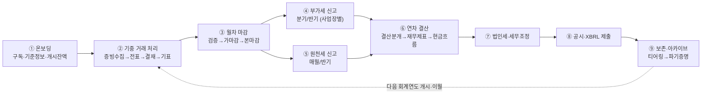
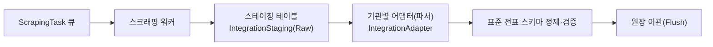

# BK 회계/세무 서비스 상세설계서 v3.0 (최대 기능 구현 기준)

- 기반 문서: `bk_서비스_기본설계서.md` (서비스형/SaaS 자가운영 모델), `bk_상세_기본설계서.md` (기능 모듈 상세), `bk_기장선택_상세설계서.md` (기장 방식 선택 — v3.0에 통합)
- 작성일: 2026-06-11
- 버전: v3.0
- 작성 방침: 기본설계서 **「23. 상세설계 전 확인 필요사항」의 17개 항목을 "최대 기능(Full-feature) 구현" 방향으로 확정 또는 최대 범위 전제로 정리**하고, 각 결정에 대한 상세 설계(엔티티·필드·상태머신·업무흐름·API·검증규칙)를 정의한다. 회계·세무·보안의 기본 처리 규칙은 두 기반 문서를 준용하며, 본 문서는 서비스형 운영·거버넌스·확장 기능을 상세화한다. v2.0은 전체 업무흐름(End-to-End) 관점의 공백 보완(마감 워크플로우·원천세·자금/채권채무·증빙)과 운영 기반(알림·인프라/관측성/DR·보안 운영) 상세화를 추가한다. v3.0은 **기장 방식 선택(관리회사 주도/이용회사 주도/병행) 모델을 통합**하여 기장·마감·결산·신고의 수행 주체를 테넌트별 계약으로 결정하도록 확장한다.

**개정 이력**

| 버전 | 일자 | 주요 변경 |
|---|---|---|
| v1.0 | 2026-06-10 | 최초 작성(확인 17개 항목 확정, 추가검토 7개 항목 반영, AI 이상거래 탐지·AI 조회 챗봇 포함) |
| v2.0 | 2026-06-11 | (1) 전체 업무흐름(End-to-End) 정의(1.1), (2) 업무흐름 공백 보완 — 회계기간·마감 워크플로우(11.9), 원천세·지급명세서(11.10), 자금·채권채무(11.11), 증빙·전자문서(11.12), (3) 알림·커뮤니케이션 상세(18장 신설), (4) 시스템 운영·인프라 상세(19장 신설 — 환경분리/CI·CD/관측성/DR/큐 운영), (5) 보안 강화(20장 신설 — 키 관리 체계/취약점 관리/침해사고 대응/DLP/컴플라이언스), 기존 18~20장은 21~23장으로 이동 |
| v3.0 | 2026-06-11 | `bk_기장선택_상세설계서.md` 통합 — (1) 기장 모드 3종(`OPERATOR_LED`/`TENANT_LED`/`HYBRID`)·주기장 모델(21장 신설), (2) 자가 수행 전제 개정(1장), (3) 기장 담당 Role·결재선(4.5), (4) 접근모드 4종 확장 — `BOOKKEEPING` 신설(5.1, 5.2.1), (5) 마감·결산·신고에 주기장 권한·이용회사 확인(Ack) 적용(11.x), (6) 엔티티·API·배치·검증·알림 병합(12~15·18장), 기존 21~23장은 22~24장으로 이동 |

---

## 0. 확정 원칙 및 결정 매트릭스

"최대 기능 구현" 원칙: 옵션이 존재하는 항목은 **가장 풍부한 기능 + 가장 강한 통제**를 동시에 채택한다. 즉, 강력한 기능(긴급 대행, 위임관리, SSO, 전용 격리 등)을 제공하되, 그에 상응하는 승인·로그·통지·시간제한 통제를 함께 구현한다.

| # | 기본설계서 확인 항목 | 확정(최대 기능) | 상세 |
|---|---|---|---|
| 1 | 운영자의 이용회사 데이터 접근 범위·사유·통지 | 조회/지원세션/긴급변경 **3단계 접근모드 + 시간제한 + 사유 + 실시간 통지 + 승인** 전부 구현 | 5장 |
| 2 | 이용회사 관리자 위임 범위 | **완전 위임 관리(사용자/커스텀롤/권한/결재선/차원)** + 관리회사 정책 상한(가드레일) | 4장 |
| 3 | 회계 실무 긴급 대행 허용 | **허용(옵트인 + 이중통제 + 회사 동의 + 시간제한 + 전수 로그)** 으로 구현 | 5.4 |
| 4 | 공통 표준 배포·버전·강제 적용 | **버전 카탈로그 + 강제/권고/선택 3모드 + 자동적용 + 차이미리보기 + 롤백 + 회사 확장** | 6장 |
| 5 | 구독·상태 전환 시 데이터 정책 | **전체 구독 수명주기 + 그레이스 + 내보내기 + 보존 후 파기증명 + 재활성화** | 7장 |
| 6 | 외부 연계 인증정보 보관·보안 | **테넌트별 시크릿 볼트(KMS) + 토큰/인증서 관리 + 자동 회전 + 연결 상태 모니터링** | 8장 |
| 7 | 2FA 강제·인증 파라미터 | **운영자 필수 + 이용회사 기본 필수 + 다중 수단(TOTP/SMS/Email/Passkey/WebAuthn) + SSO(SAML/OIDC) + 적응형/Step-up** | 3장 |
| 8 | 멀티테넌시 격리·성능·백업 | **하이브리드 격리(공유+전용 선택) + RLS + 테넌트별 키/백업/PITR + 파티셔닝/캐시** | 2장 |
| 9 | 관리차원(사업장·코스트센터) 정책 | **범용 차원 엔진(사업장/코스트센터/프로젝트/현장) + 회사별 사용·필수·범위 + 조합규칙 + 기본값 + 예산** | 9장 |
| 10 | 차원 설정 변경 영향 | **유효일자 버전관리 + 변경영향분석 + 과거전표 일괄배정 도구 + 보고 정합성** | 10장 |
| 11 | 다중 회계기준·외부 데이터 변환 입력 | **K-GAAP/K-IFRS/US GAAP/IFRS/기타국 다중 지원 + 병행원장 + 외부데이터 수신·매핑·기준변환·검토·반영 파이프라인** | 11.6장 |
| 12 | 외부 데이터 수신 포맷·소스 시스템 범위 | **Excel/CSV/XML/XBRL/API 수신 + 원천키 멱등 + 스테이징 + 어댑터 ETL + 회사 검토 후 반영** | 8.4, 11.6장 |
| 13 | 회계기준 간 차이조정 적용 범위·승인 절차 | **기준쌍별 변환규칙 버전관리 + GAAP 차이 조정분개 + 검토/승인 워크플로우 + 변환 전후 감사** | 11.6장 |
| 14 | 현금흐름표 생성 방식·현금성자산 정의·활동 분류 | **직접법/간접법 선택 + 현금성자산 계정 정의 + 활동 매핑 + 통제된 조정 워크플로우** | 11.3.1장 |
| 15 | 공시자료 범위·XBRL taxonomy·제출 채널 | **재무제표/주석/XBRL 생성 + taxonomy 버전 배포 + 검증 + 제출상태/파일해시 감사** | 11.3.2장 |
| 16 | AI 이상거래 탐지 도입 범위·통제 | **규칙+통계+비지도 ML 3계층 하이브리드 + 설명가능(SHAP/reason code) + 휴먼인더루프(자동수정 금지) + 테넌트 격리·PII 가명화** | 11.7장 |
| 17 | AI 조회 챗봇(자연어 조회) 도입 범위·통제 | **Tool-calling 에이전트 + 제한적 Text-to-SQL + RAG 보조 + 읽기 전용 + 테넌트/권한 서버 강제 + 조회 감사** | 11.8장 |
| 18 | 기장 수행 주체 선택 (v3.0) | **기장 모드 3종(관리회사 주도/이용회사 주도/병행) + 주기장이 마감·결산·신고 수행 + 양측 동의 전환 + 상시 기장 접근모드(BOOKKEEPING) + 이용회사 확인(Ack)** | 21장(상세), 1장, 4.5, 5.2.1 |

> 기반 상세설계서 24장(회계기준·신고서식·연계규격 등)의 회계·세무 확인 항목도 **최대 범위 전제**로 정리한다. 단, US GAAP/IFRS/기타국 기준, XBRL 공시, 외부 데이터 변환 입력은 구현 복잡도와 검증 책임이 크므로 11.6장의 기능 플래그·요금제 제한·단계적 적용 원칙을 따른다.

---

## 1. 시스템 개요 (서비스형 + 자가운영)

- 관리회사는 서비스 제공자이자 전 이용회사 관리자이며, 운영 콘솔에서 테넌트/구독/표준/권한/모니터링/지원을 수행한다.
- 회계·세무 실무의 수행 주체는 **테넌트별 기장 모드**(21장)에 따라 결정한다: `TENANT_LED`(이용회사 자체 수행 — 기본·현행), `OPERATOR_LED`(관리회사 주도 기장), `HYBRID`(병행). 전표 결재는 **주기장(primary bookkeeper) 측 결재선**에서 완결하고, 마감·결산·신고·공시는 주기장 측이 수행한다.
- 기장 계약이 없는 회사(`TENANT_LED`)에 대한 관리회사의 실무 개입은 긴급 대행(Break-glass, 5.3) 예외로만 가능하다.
- 본 상세설계서는 두 사용자 그룹(`OperatorUser`/`TenantUser`)과 두 채널(운영 콘솔/업무 화면)을 전제로 한다.
- `SaaS_회계개발_주의점.md`의 핵심 가이드(멀티테넌시/RLS·불변성/감사·세법 룰 마스터·마감 잠금·외부수집 비동기 ETL·프론트 대량 그리드)를 2·8.4·11.6·15·16·17장에 반영한다.

### 1.1 전체 업무흐름 (End-to-End) (v2.0 추가)

이용회사 관점의 연간 회계·세무 업무 사이클을 단계별로 정의하고, 각 단계가 본 설계서의 어느 장에 대응하는지 명시한다. 모든 단계는 멀티테넌시 격리(2장)·권한/SOD(4장)·감사로그(17장)·알림(18장)을 공통 기반으로 한다.



| 단계 | 업무 | 본 문서 대응 | 주요 통제 |
|---|---|---|---|
| ① 온보딩 | 구독 개시, 기장 모드 설정(21장), 표준 채택, 차원 설정, 계정/거래처 이관, 개시잔액 검증 | 6·7·9·21장, 22장 마이그레이션 | 시산표 균형 검증, 표준 가드레일 |
| ② 기중 거래 | 증빙 수집(수기/스크래핑/세금계산서), 전표 작성·결재·기표, 이상탐지 | 8.4, 11.1, 11.7, 11.12 | SOD, 마감 잠금, 멱등 채번 |
| ③ 월차 마감 | 마감 전 검증 체크리스트 → 가마감 → 본마감(마감해제는 예외 절차) | 11.9 | 분산 락(2.1.2), 마감 잠금 인터셉터(16.1) |
| ④ 부가세 신고 | 사업장별/사업자단위 집계, 예정/확정/수정/기한후, 전자신고 | 11.4 | 신고파일 해시, 전송 Step-up |
| ⑤ 원천세 신고 | 원천징수 집계, 이행상황신고, 지급명세서 | 11.10 | 민감정보(급여) 접근 통제(4.4·17장) |
| ⑥ 연차 결산 | 결산정리분개, 재무제표·현금흐름표, 병행원장 기준별 산출 | 11.3, 11.3.1, 11.6 | 결산 스냅샷, 조정 워크플로우 |
| ⑦ 법인세 | 세무조정, 신고서 작성·전자신고 | 11.5 | 세법 룰 마스터(6장) 버전 적용 |
| ⑧ 공시 | 재무제표 공시·주석·XBRL 생성·검증·제출 | 11.3.2 | taxonomy 검증, 제출 해시 감사 |
| ⑨ 보존 | Hot/Warm/Cold 티어링, 법정 보존, 파기 증명 | 7.3, 7.5 | WORM, 파기 승인 워크플로우 |

- 자금·채권채무 관리(어음/예금/aging/여신, 11.11)는 ②~③ 단계에 상시 병행한다.
- 관리회사 운영(테넌트/구독/표준/접근 거버넌스/모니터링)은 전 단계의 수평 레이어로 동작한다(5·6·7·19장).
- **수행 주체(v3.0)**: ②~⑧ 단계의 수행 주체는 기장 모드(21장)에 따른다 — `TENANT_LED`는 이용회사, `OPERATOR_LED`는 관리회사 기장 조직, `HYBRID`는 분담 규칙(②)과 주기장(③~⑧)을 따른다. `OPERATOR_LED`/`HYBRID`에서 이용회사는 ③ 마감·⑥ 결산·④⑤⑦ 신고 결과에 대한 확인(Acknowledge) 또는 전송 승인 절차로 참여한다(21.4).

---

## 2. 멀티테넌시 아키텍처 상세 (확정 #8)

### 2.1 격리 모델 — 하이브리드(테넌트 티어 선택)

| 티어 | 격리 방식 | 적용 대상 | 특징 |
|---|---|---|---|
| `SHARED` | 공유 스키마 + `tenantId` 컬럼 + RLS(Row-Level Security) | 일반 이용회사(기본) | 비용 효율, 대량 테넌트 |
| `SCHEMA` | 테넌트 전용 스키마 | 중대형/규제 요구 회사 | 논리 분리 강화 |
| `DEDICATED` | 테넌트 전용 DB/인스턴스 | 대기업/보안 요구 회사 | 물리 분리, 전용 백업 |

- 모든 테이블은 `tenant_id`(NOT NULL)를 가지며, 애플리케이션은 모든 쿼리에 테넌트 컨텍스트를 강제 주입한다.
- DB Row-Level Security 정책으로 `tenant_id = current_tenant()` 강제(이중 안전장치). 운영자 관리자 접근은 별도 정책 + 로그.
- 티어 전환(`SHARED`↔`SCHEMA`↔`DEDICATED`)은 완전 무중단의 정합성 리스크를 고려하여 **결산 마감 후 정기 점검 윈도우(Maintenance Window)를 활용한 반자동 이행을 표준 정책**으로 채택한다(2.1.1). 부득이한 실시간 이행 시 **쓰기 버퍼링(Write-Queuing)** 을 강제한다.

#### 2.1.1 티어 전환 하이브리드 워크플로우 (추가검토 1.1)

1. **전환 예약·타겟 프로비저닝**: 테넌트 데이터 용량 산정 → 타겟 스키마/전용 DB 인스턴스 생성 + 기본 스키마(DDL) 배포.
2. **소스 스냅샷 이관(1차 복제)**: 운영 공유 DB의 해당 `tenant_id` 레코드를 백업하여 타겟 DB로 Bulk Insert.
3. **실시간 변경분 추적(CDC·아웃박스·큐잉)**: 1차 복제 중 발생하는 신규 CUD는 DB WAL/binlog 기반 CDC를 우선 사용하고, 애플리케이션 트랜잭션에는 `TenantMigrationOutbox`를 함께 기록한다. Redis 변경로그 큐는 워커 전달 계층으로만 사용하며, 원천 변경 순서·재처리 기준은 CDC LSN/GTID 또는 아웃박스 sequence로 판단한다.
4. **전환 데이터 검증**: 소스·타겟 레코드 카운트, 주요 원장(시산표·거래처원장) 합계, 기간별 전표라인 checksum, `DataChangeLog` 해시체인을 대조한다.
5. **라우팅 전환·큐 플러시**: 라우팅 경로를 타겟 DB로 스위칭하는 순간 소스 Write를 일시 잠금 → 미반영 CDC/아웃박스 잔여분을 순서대로 동기화(Apply) → 타겟 DB를 읽기/쓰기 대상으로 승격한다.
6. **전환 검증·롤백 윈도우**: 전환 직후 지정 시간 동안 소스 DB를 read-only 보존하고, 핵심 리포트·잔액·원천키 중복 여부를 자동 검증한다. 검증 실패 시 라우팅을 소스로 되돌리고 타겟 DB는 폐기/재이관한다.
7. **전환 리허설**: 대용량·전용 티어 전환은 사전 리허설 잡을 수행하여 예상 소요시간, 누락 테이블, 스키마 차이, checksum 불일치를 전환 승인 전에 확인한다.

```
[공유 DB(SHARED)] ─(1차 스냅샷)─► [전용 DB(DEDICATED)]
      │                                   ▲
 (신규 트랜잭션)                          │ (최종 큐 플러시)
      ▼                                   │
[Redis 변경로그 큐] ──────────────────────┘
```

**전환 보조 엔티티**

| 엔티티 | 핵심 필드 | 용도 |
|---|---|---|
| `TierMigrationJob` | `tenantId`, `sourceTier`, `targetTier`, `status`, `scheduledAt`, `cutoverAt`, `rollbackDeadline` | 티어 전환 전체 상태 관리 |
| `TenantMigrationOutbox` | `jobId`, `tenantId`, `sequence`, `entity`, `entityId`, `operation`, `payloadRef`, `cdcPosition`, `status` | 전환 중 변경분의 순서 보장·재처리 |
| `TierMigrationValidation` | `jobId`, `checkType`, `sourceValue`, `targetValue`, `matched`, `checkedAt` | 카운트·합계·checksum 검증 결과 |
| `TierMigrationRollbackLog` | `jobId`, `reason`, `executedBy`, `executedAt`, `sourceRouteRestored` | 롤백 이력 |

#### 2.1.2 다중 WAS 분산 락(Distributed Lock) (추가검토 1.2)

로드밸런싱된 다중 WAS에서 동일 테넌트의 복수 사용자가 동시에 결산 마감·일괄 배정·외부데이터 이관을 요청할 때의 경쟁상태(Race Condition)를 원천 차단한다. Redis Redlock은 빠른 자원 선점에 사용하되, 회계 핵심 작업은 **분산 락 단독에 의존하지 않고 DB 제약·상태 전이 검증·fencing token**을 함께 적용한다.

| 적용 대상 | 락 키 | 최대 만료 |
|---|---|---|
| 월별 결산 마감 | `lock:tenant:{tenantId}:closing:{yyyymm}` | 10분 |
| 일련번호(채번) 생성 | `lock:tenant:{tenantId}:seq:{type}` | 3초 |
| 외부데이터 스테이징 이관 | `lock:tenant:{tenantId}:staging:flush` | 5분 |

- 락 획득: `SET key token NX PX <ttl>`. 미획득 시 비즈니스 예외("다른 사용자가 진행 중").
- 락 해제: Lua 스크립트로 **자신의 토큰 검증 후 원자적 삭제**(타 세션 락 오삭제 방지).
- 분산 락은 차원 일괄 배정(`DimensionBackfillJob`)·표준 자동적용 등 테넌트 단위 일괄 작업에도 적용한다.
- **Fencing token**: 락 획득 시 단조 증가 토큰(`lockVersion`)을 발급하고, DB 업데이트 조건에 `lockVersion >= currentLockVersion`을 포함하여 만료된 락 보유자의 늦은 쓰기를 차단한다.
- **DB 최종 방어선**: 채번은 (`tenantId`, `fiscalYear`, `sequenceType`, `number`) unique 제약으로 중복을 차단하고, 마감은 (`tenantId`, `periodId`, `closingType`) unique + 상태 전이 조건으로 중복 마감을 차단한다.
- **상태 재검증**: 락 획득 후에도 트랜잭션 내부에서 최신 상태를 다시 조회하여 `OPEN → CLOSING → CLOSED` 등 허용된 상태 전이만 커밋한다.
- **복구 처리**: 락 TTL 만료·워커 장애 시 `RUNNING` 상태의 작업을 재개/실패 처리하는 보상 잡을 두며, 멱등키 기준으로 이미 반영된 결과를 재반영하지 않는다.

### 2.2 테넌트 컨텍스트 처리

- 인증 토큰에 `tenantId`, `userGroup`, `tier`를 포함하고, 요청 진입 시 `TenantContext`로 바인딩.
- 운영자는 `tenantId` 없이 로그인하고, 특정 회사 진입 시 접근모드(5장)에 따라 임시 테넌트 컨텍스트를 획득(로그 동반).
- 캐시·메시지큐·파일 스토리지 키에 `tenantId` 프리픽스를 강제하여 교차 노출을 차단.

### 2.3 성능 설계

- 대용량 테이블(전표라인/원장/로그)은 `tenant_id` + 회계기간 기준 파티셔닝.
- 인덱스: (`tenant_id`, 회계기간, 계정), (`tenant_id`, 거래처), (`tenant_id`, 차원) 등 테넌트 선행 복합 인덱스.
- 조회 3초 목표, 대용량 장부/현황은 비동기 리포트 잡(`AsyncReportJob`) + 결과 캐시.
- 테넌트 리소스 쿼터(동시 배치 수, 리포트 크기, API rate limit)로 노이지 네이버 방지.

### 2.4 백업·복구

- `SHARED`: 일 단위 풀백업 + WAL/binlog 기반 PITR(Point-In-Time Recovery), 테넌트 단위 논리 백업 잡 추가.
- `SCHEMA`/`DEDICATED`: 스키마/인스턴스 단위 백업·복구·PITR.
- **테넌트 단위 복구**: 특정 회사만 시점 복구할 수 있도록 논리 백업(테넌트 export/snapshot) 제공.
- 마감/결산/신고 전 자동 스냅샷(`TenantSnapshot`), 복구 시 무결성·잔액 검증.

### 2.5 엔티티

| 엔티티 | 핵심 필드 |
|---|---|
| `TenantInfra` | `tenantId`, `tier`(SHARED/SCHEMA/DEDICATED), `dbRef`, `schemaName`, `encryptionKeyId`, `quotaProfile` |
| `TenantSnapshot` | `tenantId`, `snapshotType`(마감전/결산/수동), `createdAt`, `storageRef`, `checksum` |
| `AsyncReportJob` | `tenantId`, `reportType`, `params`, `status`, `resultRef`, `expireAt` |

---

## 3. 인증 · 계정 보안 상세 (확정 #7)

### 3.1 인증 수단 (전 수단 지원)

| 수단 | 코드 | 비고 |
|---|---|---|
| 비밀번호 | `PASSWORD` | 일방향 해시(Argon2id/bcrypt) + salt |
| TOTP(OTP 앱) | `TOTP` | 기본 2FA 권장 수단 |
| SMS 코드 | `SMS_OTP` | 통신 비용·취약성 고려, 보조 |
| 이메일 코드 | `EMAIL_OTP` | 보조 |
| Passkey/WebAuthn | `WEBAUTHN` | 피싱 저항, 권장 |
| 백업 코드 | `BACKUP_CODE` | 일회용 복구 |
| SSO | `SAML`,`OIDC` | 기업 테넌트 IdP 연동 |

### 3.2 적용 정책 (최대 강제)

- **운영자**: 2FA 필수(`WEBAUTHN` 또는 `TOTP` 우선), 비밀번호 정책 최강 등급.
- **이용회사**: 기본 2FA 필수. 관리회사가 **정책 하한(floor)** 을 강제(회사가 더 강하게만 조정 가능, 약화 불가).
- **Step-up 인증**: 신고 전송, 마감/마감해제, 권한 변경, 개인정보 평문 조회, 긴급 대행 시 재인증.
- **적응형(위험기반) 인증**: 신규 기기/지역/불가능 이동/이상 시간대 감지 시 추가 인증·차단.
- **SSO**: 기업 테넌트는 자사 IdP(SAML/OIDC)로 SSO + SCIM 사용자 프로비저닝(선택).

### 3.3 비밀번호 정책 파라미터(기본값, 회사 강화 가능)

| 파라미터 | 기본값 |
|---|---|
| 최소 길이 | 10자 |
| 복잡도 | 영대/영소/숫자/특수 중 3종 이상 |
| 변경 주기 | 90일(만료 시 강제 변경) |
| 재사용 금지 | 직전 5개 |
| 최소 사용기간 | 1일 |
| 잠금 임계치 | 5회 실패 → 잠금 + 점진 지연 |
| 휴면 | 365일 미접속 → `DORMANT` |

### 3.4 세션 관리

- 유휴 타임아웃 30분(정책), 절대 수명 12시간, 동시 세션 제한·강제 로그아웃.
- 토큰 보안(HttpOnly/Secure/SameSite), 비밀번호 변경 시 전 세션 무효화.
- 운영 콘솔/업무 화면 세션 분리, 신뢰 기기 등록(정책 옵션).

### 3.5 엔티티

`UserCredential`, `PasswordHistory`, `MfaDevice`(type, secretRef), `WebauthnCredential`, `SsoIdentity`(idpRef, externalId), `UserSession`, `TrustedDevice`, `LoginHistory`, `AccountStatus`, `AuthPolicy`(scope: GLOBAL/TENANT, floor 설정).

---

## 4. 권한 · 위임 관리 상세 (확정 #2)

### 4.1 완전 위임 관리(Delegated Administration)

이용회사 회사 관리자는 자사 범위 내에서 다음을 **완전 위임 관리**한다.

- 자사 사용자 생성/수정/잠금해제/2FA 초기화(관리회사 정책 하한 내).
- **커스텀 Role 생성/편집**: 표준 Role 템플릿을 복제·확장하여 자사 전용 권한 조합 구성.
- 메뉴/행위/데이터범위/민감정보 권한 부여.
- 결재선·결재규칙(`ApprovalRule`) 구성, 위임/대결 설정.
- 회사 환경설정(차원 사용 여부 등, 9장) 관리.

### 4.2 관리회사 정책 상한(가드레일)

관리회사는 전 회사 또는 요금제별로 **정책 상한**을 설정하고, 이용회사는 그 범위 내에서만 위임관리한다.

| 가드레일 | 예시 |
|---|---|
| 인증 하한 | 2FA 필수, 비밀번호 최소강도(약화 불가) |
| 권한 상한 | 단일 사용자 최대 Role 수, 위험 권한(신고전송/마감) 부여 자격 제한 |
| 사용자 수 | 요금제별 최대 사용자/관리자 수 |
| SOD 강제 | 작성-승인 분리 비활성화 금지(소규모 예외 승인 시만) |
| 커스텀 Role 한도 | 회사별 커스텀 Role 최대 개수 |

- 가드레일 위반 설정은 저장 차단. 관리회사는 필요 시 회사별 예외(override)를 사유·로그와 함께 승인.

### 4.3 권한 모델 (RBAC + 속성 제약)

- Role = 메뉴권한 + 행위권한(조회/등록/수정/삭제/승인/반려/마감/전송/출력) + 데이터범위(차원/사업장/부서) + 민감정보권한.
- 표준 Role 템플릿(회사관리자/회계담당/세무담당/결재자/열람자)은 공통 표준(6장)으로 배포, 회사가 채택·확장.

### 4.4 외주 세무대리인(수임처) 권한 위임·가드레일 (추가검토 3.2)

다수 중소·중견기업이 기장·세무조정을 외부 세무사/회계법인에 위임하는 국내 환경을 반영하여, **내부 임직원과 외부 파트너의 권한 경계**를 엄격히 분리한다.

**(1) 세무대리인 속성 확장(`UserCredential`/`TenantUser`)**

- `isExternalPartner`(외부 파트너 여부), `partnerFirmRegNo`(세무대리법인 사업자번호), `permittedScopeTags[]`(허용 업무 범위 태그, 예: `TAX_ADJUSTMENT`/`VAT_FILING`/`JOURNAL_VIEW`).

**(2) 가드레일 통제 규칙**

| 통제 | 규칙 |
|---|---|
| 인사/급여·민감정보 차단 | `isExternalPartner=true` 계정은 전표 권한이 있어도 급여명세·원천세 세부·주민번호 등 진입 시 API 레이어에서 `403`, 마스킹 데이터만 제공 |
| 데이터 내보내기 제한 | 세무 신고 목적 외 전사 전표 일괄 다운로드는 이용회사 총괄관리자 **실시간 2차 승인(카카오/문자 OTP)** 후 다운로드 링크 활성화 |
| 접근 IP 통제 | 세무대리인 로그인 IP 대역 별도 관리, 비정상 대역 접근 시 운영 관리자 대시보드 이상징후 알림 |
| 범위 태그 강제 | `permittedScopeTags`에 없는 업무 화면/API 차단 |

**(3) 제한적 민감정보 예외 조회**

세무 신고·원천세·지급명세서 등 법정 업무 수행상 민감정보가 필요한 경우 원천 차단만 적용하지 않고 다음 예외 경로를 제공한다.

1. 외부 파트너가 업무 목적, 대상 기간, 대상 항목, 예상 건수를 입력해 예외 조회를 요청한다.
2. 이용회사 총괄관리자 또는 지정 개인정보 승인자가 Step-up 인증 후 승인한다.
3. 승인 범위·기간·건수 안에서만 복호화 또는 제한 표시를 허용한다.
4. 조회/다운로드는 `PersonalDataAccessLog`와 `ExternalPartnerAccessLog`에 건별 기록하고, 대량 조회는 보안 이벤트로도 적재한다.
5. 승인 기간 만료 후 권한은 자동 회수되며, 동일 목적 반복 조회는 재승인 또는 사전 승인 정책에 따른다.

예외 조회는 `permittedScopeTags`와 별도로 `sensitiveAccessPurpose`가 필요하며, 신고 목적 외 2차 이용은 약관·감사 정책상 금지한다.

### 4.5 기장 담당 Role · 결재선 · 행위자 표식 (v3.0 추가)

기장 모드(21장)가 `OPERATOR_LED`/`HYBRID`인 회사의 기장 실무를 수행하는 **운영자 그룹 내 기장 담당 Role**을 분리한다.

**(1) 기장 담당 Role**

| Role | 권한 | 비고 |
|---|---|---|
| `BK_PREPARER`(기장 담당) | 배정 회사의 전표 작성·증빙 매칭·보조부 입력 | **배정 회사만** 접근(전 테넌트 접근 불가 — 최소 권한). 운영 콘솔 관리 기능과 분리 |
| `BK_REVIEWER`(기장 검토) | 배정 회사의 전표 검토·승인, 마감 체크리스트 실행 | 작성자와 동일인 금지(SOD) |
| `BK_MANAGER`(기장 책임) | 마감·결산·신고 승인, 담당 배정 관리, 모드 전환 동의 | 신고 전송 Step-up |

- `BookkeepingAssignment`(tenantId, operatorUserId, role, validFrom/To)로 회사별 담당·검토·책임을 배정한다. 배정 없는 운영자의 기장 접근(`BOOKKEEPING` 모드, 5.2.1)은 차단한다.
- **겸직 제한(가드레일)**: 기장 Role 보유자는 해당 회사의 접근 거버넌스 승인자(Break-glass 승인 등)가 될 수 없다(이해충돌 방지). `PolicyGuardrail`로 강제하며, 소규모 예외는 `PolicyException` 절차를 따른다.

**(2) 모드별 결재선·SOD**

| 모드 | 전표 결재선 | SOD 규칙 |
|---|---|---|
| `TENANT_LED` | 이용회사 내부 결재(현행 11.1) | 작성자≠승인자(현행) |
| `OPERATOR_LED` | 관리회사 내부: `BK_PREPARER` 작성 → `BK_REVIEWER` 승인(→ 금액 기준 `BK_MANAGER`) | 작성자≠검토자, 검토자≠마감 승인자 |
| `HYBRID` | **작성 주체별 결재선**: 이용회사 작성분→이용회사 결재선, 관리회사 작성분→관리회사 결재선. 기표 전 최종 게이트는 주기장 측 | 교차 승인 금지(분담 규칙의 검토 위임 명시 시만 허용, 21.6) |

**(3) 행위자 표식 (5.3-(5) 확장)**

- 모든 전표·기준정보·신고 데이터에 `createdByGroup`(OPERATOR/TENANT) + `bookkeepingMode`(생성 시점 모드) + `assignmentId`(기장 담당 배정 참조)를 기록한다.
- Break-glass 표식(`breakGlassSessionId`)과 구분: 기장 계약 기반 입력은 `BOOKKEEPING` 컨텍스트로 기록하고, 조회 화면에 `OPERATOR 기장` 배지로 표시한다.

### 4.6 엔티티

`Role`(scope, templateRef, custom), `Permission`, `RoleAssignment`, `PolicyGuardrail`(scope: GLOBAL/PLAN/TENANT), `PolicyException`(승인·사유·기간), `ApprovalRule/Line/Step`(+적용 주체 OPERATOR/TENANT 구분), `ExternalPartnerProfile`(firmRegNo, scopeTags, ipAllowlist), `ExternalPartnerAccessRequest`(purpose, scope, period, requestedItems, status), `ExternalPartnerAccessLog`, `BookkeepingAssignment`(role, validFrom/To).

---

## 5. 관리회사 관리자 접근 거버넌스 + 긴급 대행 (확정 #1, #3)

### 5.1 접근 모드 (4단계, v3.0 확장)

| 모드 | 코드 | 권한 | 통제 |
|---|---|---|---|
| 조회 지원 | `VIEW` | 회사 데이터 읽기(마스킹 적용) | 사유 입력 + 로그 |
| 지원 세션 | `SUPPORT_SESSION` | 설정/구성 변경 지원(회계 실무 제외) | 사유 + 시간제한 + 로그 + 회사 통지 |
| 기장 수행 (v3.0) | `BOOKKEEPING` | 기장 계약 회사의 회계 실무 **상시 수행** | 기장 계약(`BookkeepingConfig`, 21장) + 담당 배정(4.5) 필수 + 전수 로그 + 요약 통지(5.2.1) |
| 긴급 변경/대행 | `BREAK_GLASS` | 회계 실무 포함 예외 처리(**기장 계약 없는 회사**) | 옵트인 + 회사 동의 + 이중통제 + 시간제한 + 전수 로그 + 즉시 통지 |

> 기장 계약(`OPERATOR_LED`/`HYBRID`)이 있는 회사의 일상 기장은 `BOOKKEEPING` 모드로 수행하며 Break-glass를 사용하지 않는다. Break-glass는 `TENANT_LED` 회사(또는 기장 범위 외 예외)의 긴급 처리 용도로 유지한다.

### 5.2 접근 통제 규칙

- 모든 운영자의 이용회사 데이터 접근은 `AdminAccessLog`(운영자/회사/대상/모드/사유/시각/세션ID)로 append-only 기록.
- 개인정보 평문 조회는 Step-up 인증 + 사유 + `PersonalDataAccessLog` 이중 기록.
- 접근 세션은 시간제한(예: 30~60분), 만료 시 자동 종료. 연장은 재사유. (`BOOKKEEPING` 모드는 5.2.1의 별도 규칙 적용)
- 회사 관리자에게 접근 사실을 실시간 통지(이메일/포털), 회사별 통지 정책 설정.

#### 5.2.1 기장 수행(BOOKKEEPING) 모드 통제 (v3.0 추가)

- **진입 조건**: 해당 회사 기장 모드 ∈ {`OPERATOR_LED`, `HYBRID`} AND 유효한 `BookkeepingAssignment`(4.5) 보유. 둘 중 하나라도 없으면 진입 차단(`ASSIGNMENT_REQUIRED`/`BOOKKEEPING_NOT_CONTRACTED`).
- **세션**: 계약 기간 동안 상시 유효(시간제한 없음). 단, 접근 범위는 배정 회사로 한정하고 전 화면에 기장 모드 배너(회사명·모드·담당 Role)를 고정 표시한다.
- **로그**: 모든 행위는 `AdminAccessLog`(mode=BOOKKEEPING) + `DataChangeLog` 기록(현행 동일 강도). 세션 녹화(5.3.1)는 적용하지 않는다 — 상시 업무이므로 행위자 표식(4.5-(3))·해시체인으로 감사한다.
- **통지**: 건별 통지 대신 `noticeDigest` 정책(일/주 요약 — 처리 전표 수·마감·신고 행위 요약, 기본 일간)을 이용회사 관리자에게 발송한다(18장). 단, **민감 행위(마감해제, 신고 전송, 개인정보 평문 조회, 기준정보 변경)는 건별 즉시 통지**를 유지한다.
- **민감정보**: 기장 담당자도 평문 조회는 Step-up + `PersonalDataAccessLog`(현행 동일). 급여 등 민감 모듈은 분담 규칙·배정 권한에 명시된 경우만 접근한다.
- **모니터링**: 기장 담당자별 행위량·이상 패턴(비배정 회사 접근 시도, 대량 다운로드)을 보안 이벤트로 적재한다(20.4 연계).

### 5.3 긴급 대행(Break-glass Operate) — 최대 기능 + 최강 통제

회계 실무 긴급 대행을 **허용하되** 다음 절차를 강제한다.

1. **옵트인**: 회사가 계약/설정에서 긴급 대행 허용을 사전 동의(`BreakGlassConsent`). 미동의 회사는 대행 불가.
2. **요청·승인**: 운영자가 사유·범위·기간을 명시해 요청 → 관리회사 책임자 승인(이중통제, 2인 원칙).
3. **회사 통지·승인 옵션**: 회사 관리자에게 즉시 통지, 회사 사전승인 요구(정책 옵션).
4. **시간·범위 제한**: 지정 기간·대상(특정 전표/기능)만 가능, 만료 시 자동 회수.
5. **행위자 구분**: 대행으로 생성/수정된 전표·데이터는 `createdByGroup=OPERATOR`, `breakGlassSessionId`로 표식.
6. **전수 로그·사후 검토**: 모든 행위 `DataChangeLog`+`AdminAccessLog` 기록, 종료 후 회사·관리회사 공동 검토 리포트 자동 생성.

#### 5.3.1 Break-glass 세션 화면 녹화(Session Recording) (추가검토 3.1)

텍스트 변경 로그 외에 **운영자의 UI 조작 전 과정을 시각적으로 기록**하여 사후 검토 신뢰성을 극대화한다.

1. **동적 스크립트 인젝션**: `BREAK_GLASS` 세션 활성 시 프론트 최상위(Provider) 레이어에서 세션 리플레이 라이브러리(예: **rrweb**)/전용 에이전트를 동적 로드.
2. **DOM 스냅샷·이벤트 스트리밍**: 마우스 이동·클릭·키보드 입력·DOM 변경을 바이너리 스트림으로 캡처한다. 비밀번호뿐 아니라 주민등록번호, 계좌번호, 카드번호, 급여, 인증서, 토큰, 복호화된 개인정보 영역은 `data-recording-mask` 정책으로 캡처 전 마스킹한다.
3. **민감 필드 정책**: 화면 컴포넌트는 필드 메타데이터(`sensitivity`: PASSWORD/PII/FINANCIAL/PAYROLL/SECRET)를 갖고, 녹화 에이전트는 메타데이터 기준으로 값·placeholder·자동완성 후보를 모두 마스킹한다. 신규 화면은 녹화 마스킹 테스트를 통과해야 배포한다.
4. **독립 스토리지 격리 적재**: 스트림을 실시간으로 WORM(Object Lock) 스토리지에 `breakglass_session_{logId}.bin`으로 보관(불변)하고, 저장 전송 구간과 저장 객체를 별도 키로 암호화한다. 녹화 키 접근 권한은 운영자 업무 권한과 분리한다.
5. **보존기간·열람 권한**: 녹화 보존기간은 회사 계약/보안정책과 법정 보존 요구에 따라 설정하며, 기간 만료 시 파기 승인 후 파기이력을 남긴다. 재생은 보안관리자+감사자 2인 승인 또는 회사 관리자 승인 정책을 통과해야 가능하다.
6. **회사 통지·열람 정책**: `BREAK_GLASS` 세션 시작/종료와 녹화 생성 사실을 회사 관리자에게 통지한다. 회사가 계약상 열람권을 보유한 경우 마스킹된 세션 플레이어 또는 검토 리포트를 제공한다.
7. **사후 검토 결합**: `BreakGlassReviewReport`에 세션 플레이어 뷰어를 내장하고, `AdminAccessLog`·`DataChangeLog` 타임라인과 녹화 이벤트 타임라인을 함께 표시한다.

### 5.4 엔티티

`AdminAccessLog`, `AdminAccessSession`(mode — `VIEW`/`SUPPORT_SESSION`/`BOOKKEEPING`/`BREAK_GLASS`, expireAt, reason, approverId), `BreakGlassConsent`(tenantId, scope, enabled), `BreakGlassRequest`(reason, scope, period, approvals[], status), `BreakGlassReviewReport`, `SessionRecording`(sessionId, storageRef(WORM), maskedFields, encryptionKeyId, retentionUntil, playbackApprovalStatus), `SessionRecordingPlaybackLog`(recordingId, viewerId, reason, approvedBy, viewedAt).

---

## 6. 공통 표준 카탈로그 · 배포 거버넌스 (확정 #4)

### 6.1 표준 카탈로그

| 표준 유형 | 코드 | 내용 |
|---|---|---|
| 표준계정 템플릿 | `STD_ACCOUNT` | 업종별 표준 계정체계 |
| 부가세 세율/과세유형 | `STD_VAT` | 세율표, 과세유형 매핑 |
| 세법 룰 마스터 | `STD_TAX_RULE` | 과세표준 구간·비과세 한도 등 세법 기준값 + 적용 시작/종료일(16.1) |
| 원천세 기준 | `STD_WITHHOLDING` | 간이세액표, 소득구분별 원천세율·지방소득세율(11.10) |
| 신고서식 | `STD_FORM` | 부가세/법인세/원천세 전자신고 서식 버전 |
| 공통코드 | `STD_CODE` | 결제수단/거래유형 등 |
| Role 템플릿 | `STD_ROLE` | 표준 권한 묶음 |
| 결재선 템플릿 | `STD_APPROVAL` | 표준 결재 규칙 |
| 현금흐름 매핑 | `STD_CASHFLOW` | 계정/거래유형→활동 표준 매핑(11.3.1) |
| XBRL 분류체계 | `STD_TAXONOMY` | 공시 taxonomy 버전(11.3.2) |
| 기준 변환규칙 | `STD_CONVERSION` | 회계기준쌍별 변환·조정 규칙(11.6) |
| 이상탐지 규칙 | `STD_ANOMALY_RULE` | 탐지 규칙·임계치 표준(11.7) |
| 알림 템플릿 | `STD_NOTIFICATION` | 알림 유형·채널별 표준 템플릿(18장) |

### 6.2 버전 수명주기

`DRAFT → PUBLISHED → DEPRECATED → RETIRED`. 각 표준은 유효일자(effective date)를 가지며, 회사별 적용 이력을 보존한다.

### 6.3 배포 모드 (3모드)

| 모드 | 동작 |
|---|---|
| `MANDATORY` | 강제 적용(예: 세율·신고서식). 회사 거부 불가, 적용 시점 자동 반영 |
| `RECOMMENDED` | 권고. 회사가 채택/보류 선택, 미채택 시 알림 |
| `OPTIONAL` | 선택. 회사가 필요 시 채택 |

- **자동 적용**: 신규 회계연도 개시 시 최신 강제 표준 자동 채택, 세율 변경은 적용일 기준 자동 전환.
- **차이 미리보기(diff)**: 새 버전 적용 전 회사가 영향(계정/세율 변경분) 미리보기.
- **롤백**: 배포 후 이슈 시 직전 버전으로 롤백(영향 회사 일괄/선택).
- **회사 확장**: 회사는 표준을 채택 후 **네임스페이스 분리**하여 자사 항목 확장. 표준 항목과 충돌 검사.
- **적용 현황**: 표준별 회사 채택률/버전 분포 모니터링.

### 6.4 엔티티

`GlobalStandard`(type), `StandardVersion`(version, effectiveDate, status, mode), `StandardItem`, `TenantStandardAdoption`(tenantId, standardVersionId, adoptedAt, status), `TenantStandardExtension`(namespaced), `StandardRollbackLog`.

---

## 7. 구독 · 요금 · 데이터 수명주기 (확정 #5)

### 7.1 구독 수명주기

`TRIAL → ACTIVE → PAST_DUE → SUSPENDED → GRACE → TERMINATED`(+ `REACTIVATED`). 상태별 기능 통제는 기본설계서 2.3 + 다음을 상세화.

| 상태 | 데이터 접근 | 처리 |
|---|---|---|
| `TRIAL` | 전체(체험 한도) | 기능 제한·기간 제한 |
| `ACTIVE` | 전체 | 정상 |
| `PAST_DUE` | 전체(경고) | 납부 독촉(dunning), 일정 후 SUSPENDED |
| `SUSPENDED` | 조회만 | 신규 처리 차단 |
| `GRACE` | 조회+내보내기 | 해지 유예기간(데이터 회수 기회) |
| `TERMINATED` | 보관기간 내 조회/다운로드 | 이후 파기 |

### 7.2 요금/과금

- 요금제(`BillingPlan`): 기본료 + 사용량(전표 건수/사용자 수/저장용량/전자세금계산서 건수) 미터링.
- 청구·수금(`Invoice`, `Payment`), 미납 독촉(dunning) 워크플로, 한도 초과 알림.

### 7.3 데이터 내보내기·보존·파기

- **내보내기**: 해지/유예 시 회사 데이터 전체를 표준 포맷(엑셀/CSV/PDF + 원장/전표 dump)으로 export.
- **회계장부 보존**: 전표, 원장, 증빙, 신고파일, 결산 산출물은 법정 보존연한 및 계약 약정에 따라 read-only 아카이브로 보관한다. 보존 중에는 원천 데이터 수정·삭제를 금지하고, 열람·다운로드 권한만 제한한다.
- **개인정보 파기/분리보관**: 개인정보는 회계장부 보존과 별도 기준으로 보유기간을 관리한다. 법정·계약상 보존 필요가 없는 개인정보는 우선 파기 또는 분리보관하고, 장부 보존에 필요한 최소 항목만 마스킹/암호화 상태로 유지한다.
- **파기**: 보존연한 경과 후 스케줄 파기 + 승인 워크플로우 + **파기 증명서(`DataDestructionCertificate`)** 발급. 파기 사실 자체는 `DataDestructionLog`로 보존한다.
- **재활성화**: 보존기간 내 재계약 시 데이터 복원·재활성화.

| 데이터 유형 | 구독 종료 후 기본 정책 | 파기 조건 |
|---|---|---|
| 회계장부/원장/전표 | read-only 보존, 내보내기 허용 | 법정 보존연한 + 계약 보존기간 경과 |
| 증빙/첨부 | read-only 보존, 민감정보 마스킹 | 보존 필요성 종료 + 개인정보 검토 완료 |
| 신고파일/공시파일 | 제출상태·파일해시와 함께 보존 | 법정 보존연한 경과 |
| 개인정보 | 목적 종료 시 우선 파기/분리보관 | 보유근거 소멸 또는 정보주체 요청 처리 완료 |
| 운영/접근/감사로그 | 감사 목적 보존 | 로그 보존기간 경과 및 감사보류 없음 |

### 7.4 엔티티

`ServiceSubscription`, `BillingPlan`, `UsageMeter`, `Invoice`, `Payment`, `DunningCase`, `DataExportJob`, `RetentionPolicy`, `DataDestructionCertificate`, `DataDestructionLog`.

### 7.5 데이터 티어링 · 콜드 스토리지 아카이빙 (추가검토 4.1)

수천 테넌트의 대량 전표가 G/L RDBMS에 누적되면 인덱스 비대화로 IOPS 성능 저하·스토리지 비용 폭증이 발생하므로, 보존연한 데이터의 **물리적 이원화(데이터 티어링)** 를 강제한다.

| 티어 | 대상 | 저장소 | 속성 |
|---|---|---|---|
| **Hot** | 당기 + 전기(최근 2개년) | 고성능 SSD RDBMS 파티션 | 실시간 생성·수정·조회 |
| **Warm** | 마감 3~5년 차 | RDBMS 연도별 히스토리 파티션 테이블 | 상시 Read-Only |
| **Cold** | 5년 초과~10년 이하(법정 보존) | 객체 스토리지 + WORM/Object Lock | 운영 RDBMS 파티션 비활성/분리 + **Apache Parquet** 압축 보관 |

```
[RDBMS Hot] (최근 2개년) ─(당해 마감)─► [RDBMS Warm] (3~5년 Read-Only)
                                              │ (5년 초과 배치 이관)
                                              ▼
                                   [S3 Cold] (Parquet 압축)
```

- **콜드 데이터 조회**: 조회 빈도가 낮은 과거 장부는 RDBMS 커넥션 대신 서버리스 쿼리 엔진(예: Athena 계열)으로 Parquet 데이터셋을 조회한다. 즉시 조회가 필요한 데이터셋은 쿼리 가능한 스토리지 클래스에 보관하고, 장기 저비용 보관 스토리지(복원 필요 클래스)는 복원 요청 후 조회한다. 모든 조회는 **테넌트 격리 필터(`tenant_id`)** 와 권한 검증을 통과해야 한다.
- **불변성 원칙**: 회계 원천 데이터는 물리 삭제하지 않는다. 콜드 이관은 (1) 아카이브 파일 생성, (2) 파일 checksum/레코드 수/잔액 합계 검증, (3) `ArchiveDataset` 등록, (4) 운영 파티션 read-only 전환 또는 분리, (5) 필요 시 운영 조회 대상에서 제외 순서로 처리한다.
- **파기 원칙**: 법정 보존연한 경과 후에는 `RetentionPolicy`와 개인정보 보유기간을 모두 확인한 뒤 파기 승인 워크플로우를 거친다. 파기 대상·파일해시·수행자·시각은 `DataDestructionCertificate`와 `DataDestructionLog`에 남긴다.
- **아카이브 무결성**: Parquet 파일 ref, object lock 여부, checksum, 레코드 수, 기간별 차대변 합계, 생성 당시 `DataChangeLog` 해시체인 루트를 저장한다.
- 엔티티: `DataTierPolicy`(티어별 보존연한), `ArchiveDataset`(Parquet 파일 ref, tenant, period, checksum, recordCount, hashRoot, objectLockUntil), `ArchiveRestoreJob`(복원 요청·완료·만료).

---

## 8. 외부 연계 인증정보 볼트 (확정 #6)

### 8.1 테넌트별 시크릿 볼트

- 외부 연계(홈택스/카드사/은행/환율/OCR/ERP) 인증정보는 **이용회사 소유**로 테넌트별 분리 저장.
- 모든 시크릿은 KMS로 암호화(테넌트별 키, 2.4/3장 연계), 평문 저장·로그 금지.
- 자격유형: API Key/Secret, OAuth2 토큰(자동 갱신), 공인/사업자 범용 인증서, 계정/비밀번호(불가피 시 암호화).

### 8.2 관리·보안

- 인증서/토큰 만료 모니터링·사전 알림, 자동 회전(rotation) 및 폐기.
- 연계 권한 최소화(스코프 한정), 연결 상태 헬스체크(`ConnectionHealth`).
- 운영자는 시크릿 평문 접근 불가(설정 지원만), 접근 시 로그.
- 연계 호출/응답은 `IntegrationLog`(원문 또는 요약), 중복방지(원천문서번호/멱등키), 재전송 정책.

### 8.3 엔티티

`TenantConnector`(type, status), `ConnectorCredential`(kind, secretRef(KMS), expireAt, rotationPolicy), `OAuthToken`(access/refresh, expireAt), `Certificate`(subject, validFrom/To), `ConnectionHealth`, `IntegrationLog`.

### 8.4 외부 데이터 수집 비동기·ETL 파이프라인 (SaaS 가이드 3 반영)

대량 외부 수집(국세청/홈택스/카드사/은행)은 동기 처리 시 출근 시간대 동시 요청으로 API 서버가 마비되므로 **메시지 큐 기반 비동기 + 워커 분리 + 스테이징/어댑터 ETL** 로 구현한다.

**(1) 비동기 수집 (생산자-소비자)**

- 사용자/배치의 수집 요청은 웹 서버에서 **즉시 응답(202 Accepted)** 하고 `ScrapingTask`로 메시지 큐(Redis/RabbitMQ/Kafka)에 발행한다.
- **스크래핑 워커 풀**을 API 서버 인프라와 **완전 분리** 운영하여 외부기관 지연(Latency)이 서비스 전체 마비로 전파되지 않게 한다.
- 워커는 큐에서 태스크를 꺼내 외부 인증정보(8장 볼트)로 수집, 재시도·백오프·실패 알림, 멱등(원천키 중복 방지).

**(2) ETL — 스테이징 + 어댑터**



- 외부 Raw 데이터(규격·날짜포맷·인코딩 상이)는 가공 없이 `IntegrationStaging`에 1차 적재.
- **어댑터 패턴**: 기관별 파서 인터페이스(`IntegrationAdapter`)로 스테이징 데이터를 표준 전표 스키마로 매핑·정제 후 원장 이관(직접 인서트 금지, 정합성 보존).
- 변환 입력(11.6)과 동일한 검증·스테이징 원칙 적용.

**(3) 엔티티·상태**

- `ScrapingTask`(connectorType, params, status, retryCount), `IntegrationStaging`(rawPayload, source, status), `IntegrationAdapter`(parser 정의).
- 수집 태스크 상태: `QUEUED`, `RUNNING`, `SUCCESS`, `RETRY`, `FAILED`, `DEAD_LETTER`.

---

## 9. 관리차원 엔진: 사업장 · 코스트센터 (확정 #9)

### 9.1 범용 차원 프레임워크

전표 라인에 부가하는 분석 축을 **범용 차원(Dimension)** 으로 일반화하고, 사업장·코스트센터를 핵심 차원으로 제공한다(프로젝트/현장도 동일 프레임).

| 차원 | 코드 | 성격 | 역할 |
|---|---|---|---|
| 사업장 | `BUSINESS_PLACE` | 법적(부가세 신고단위) | 주/종사업장, 사업자단위과세, 사업장별 부가세 신고 |
| 코스트센터 | `COST_CENTER` | 관리(손익·비용 책임) | 계층, 부서/프로젝트 매핑, 손익·예산 집계 |
| 프로젝트 | `PROJECT` | 관리 | 프로젝트별 손익 |
| 현장 | `SITE` | 관리 | 현장별 집계 |

### 9.2 사업장 vs 코스트센터 역할 구분

| 구분 | 사업장 | 코스트센터 |
|---|---|---|
| 목적 | 세무(부가세 신고단위), 법적 단위 | 내부 관리회계(손익/비용 책임) |
| 신고 연계 | 사업장별 부가세 과세표준/세액 집계, 사업자단위과세 합산 | 신고 비연계(관리 보고용) |
| 구조 | 사업자등록 기반(주/종) | 자유 계층(본부>부문>팀 등) |
| 매핑 | 거래처/세금계산서 사업장 | 부서/프로젝트 매핑 |

### 9.3 회사 환경설정(`DimensionConfig`) — 차원별 상세

| 설정 | 값 | 설명 |
|---|---|---|
| `enabled` | Y/N | 차원 사용 여부(회사별) |
| `required` | Y/N | 전표 입력 필수 여부 |
| `scope` | 전체/전표유형/계정범위 | 적용 대상(예: 코스트센터=비용·손익계정) |
| `defaultBy` | 계정/사용자/없음 | 기본값 자동 채움 규칙 |
| `validCombinations` | 규칙 | 사업장×코스트센터 등 유효 조합 제약(선택) |
| `hierarchyLevel` | n | 집계 계층 깊이 |
| `deptMapping` | Y/N | 코스트센터-부서 매핑 사용 |
| `budgetEnabled` | Y/N | 차원별 예산 관리 사용 |

### 9.4 운영 규칙(최대 기능)

- **동시·다축 사용**: 사업장+코스트센터(+프로젝트/현장)를 한 라인에 동시 입력·교차 집계.
- **기본값 자동화**: 계정/사용자/전표유형 기반 차원 기본값 자동 채움(생산성).
- **조합 검증**: 허용 조합 규칙(`validCombinations`)으로 잘못된 차원 조합 차단(선택 사용).
- **차원별 예산**: 코스트센터/사업장 단위 예산 편성·실적 대비(`Budget`, `BudgetActual`).
- **다차원 보고**: 사업장별·코스트센터별 원장/시산표/손익/예산대비 + 피벗 다차원 조회.
- **종료 관리**: 유효기간 종료 차원은 신규 사용 제한(과거 데이터 보존).

### 9.5 전표 라인 차원 필드

`businessPlaceId`, `costCenterId`, `projectId`, `siteId` (각 조건부 — 회사 설정 `enabled`/`required` + 계정 `requiredDimensions` AND 조건). 미사용 차원은 화면 컬럼 숨김·검증/집계 제외.

### 9.6 엔티티

`Dimension`(type), `BusinessPlace`(주/종, 사업자번호, 과세유형), `CostCenter`(parentId, level, deptRef, validFrom/To), `DimensionConfig`(tenantId, dimType, enabled, required, scope, defaultBy...), `DimensionCombinationRule`, `Budget`, `BudgetActual`.

---

## 10. 차원 설정 변경 · 영향관리 (확정 #10)

### 10.1 유효일자 기반 설정 버전관리

- `DimensionConfig` 변경은 **유효일자(effectiveDate)** 를 가지며 버전으로 보존(`DimensionConfigHistory`).
- 변경은 **변경 시점 이후 거래**에 적용. 과거 전표의 기존 차원값은 보존(소급 미적용 기본).

### 10.2 변경 영향 분석

- 사용/필수/범위 변경 전 **영향 분석 리포트** 제공: 영향 받는 계정·전표유형·미입력 전표 수·보고 변화.
- 필수 전환 시: 기존 미입력(과거) 전표 목록 + 보완 필요 건 산출.

### 10.3 과거 데이터 처리(최대 기능)

- **일괄 배정 도구**: 과거 전표에 차원값을 규칙(계정/거래처/부서 매핑)으로 일괄 배정(`DimensionBackfillJob`). 회사 관리자 승인 + 감사로그.
- **보고 정합성**: 배정 전/후 보고 차이를 비교, 마감기간은 원칙적으로 소급 변경 금지(필요 시 조정전표/별도 권한).
- **차원 통합/분할/종료**: 코스트센터 통합·분할·종료 시 매핑 이력 유지, 보고 연속성 보장.

### 10.4 엔티티

`DimensionConfigHistory`, `DimensionChangeImpact`(분석 결과), `DimensionBackfillJob`(rule, scope, status, approverId), `CostCenterMergeSplitLog`.

---

## 11. 전표 · 장부 · 결산 · 세무 모듈 상세 (준용 + 서비스 특화)

처리 규칙은 `bk_상세_기본설계서.md` 6·9·10·11·12·13장을 준용한다. 본 모델 특화·상세 사항:

### 11.1 전표

- 생명주기: 작성→결재요청(채번)→승인(SOD)→기표→마감. 결재는 **주기장 측 결재선에서 완결**한다(v3.0) — `TENANT_LED`는 이용회사 내부(기본설계서 5.2, 현행), `OPERATOR_LED`는 관리회사 기장 결재선, `HYBRID`는 작성 주체별 결재선 + 주기장 최종 게이트(4.5-(2)).
- 라인 차원 입력(9.5), 멱등 채번(`tenant`+연도+유형), 자동분개/부가세 자동라인, 외화 환산.
- 모든 변경 `JournalHistory` + `DataChangeLog`. 행위자 표식: `createdByGroup` + `bookkeepingMode` + `assignmentId`(기장분) / `breakGlassSessionId`(긴급 대행분)(4.5-(3)).
- `OPERATOR_LED` 회사의 이용회사 전표 입력은 `tenantInputPolicy`에 따라 차단(기본 `NONE`) 또는 기장 요청 기재만 허용(`REQUEST_ONLY`). `HYBRID`는 분담 규칙(21.6) owner 검증 후 저장.

### 11.2 장부/원장

- 승인(`POSTED`↑) 전표만 집계, 차원별(사업장/코스트센터/프로젝트) 원장·시산표·손익 다차원 조회.

### 11.3 결산

- 결산정리분개(감가/충당금/경과계정/외화환산) 자동화, **주기장 측 결재**로 마감(v3.0 — `TENANT_LED`는 이용회사 내부 결재 현행), 전기이월. 회계기준 다중 지원(일반기업회계기준+K-IFRS+US GAAP+IFRS) — 회사 선택.
- 주기장=OPERATOR인 경우 결산 확정 후 이용회사 확인(Ack) 절차를 적용한다(`ackPolicy`, 21.4).
- 재무제표: 재무상태표·손익계산서·자본변동표·**현금흐름표**(11.3.1)·주석 기초자료 생성. 병행원장 기준별로 각각 산출.

### 11.3.1 현금흐름표 생성 (직접법/간접법)

**(1) 생성 방식·구조**

- 회사가 **직접법(Direct)/간접법(Indirect)** 을 선택(`cashFlowMethod`, 기본 간접법). 회계기준(11.6)별 양식 적용, 병행원장 기준별 각각 생성.
- 활동 구분: 영업활동/투자활동/재무활동(`OPERATING`/`INVESTING`/`FINANCING`), 활동별 세부항목 체계.
- 현금및현금성자산 범위는 `CashEquivalentAccount`로 정의(보통예금/현금/단기금융상품 등).

**(2) 산출 로직**

| 방식 | 처리 |
|---|---|
| 간접법 | 당기순이익 → 비현금 항목 가감(감가상각비·대손상각·충당금전입·외화환산손익·유형자산처분손익 등) → 운전자본 증감(매출채권·재고자산·매입채무·선급/선수 등 기초·기말 비교) → 영업활동 현금흐름. 투자/재무활동은 관련 계정 증감·거래 분류로 산출 |
| 직접법 | 현금및현금성자산 계정의 상대계정·거래유형 분석으로 현금유입(매출·이자수취 등)·유출(매입·인건비·이자지급 등) 항목별 직접 집계 |

- 원천: `POSTED` 이상 전표·원장 + 재무상태표 기초/기말 잔액 + 손익계산서. 비현금 거래(현물출자·전환 등)는 현금흐름에서 제외하고 주석 표시.

**(3) 항목 매핑(`CashFlowMapping`)**

- 계정/거래유형 → 현금흐름표 활동·세부항목 매핑 규칙. 표준 매핑은 공통 표준(6장)으로 배포, 회사가 확장.
- 미매핑 계정·현금 거래는 자동 추정 금지 → 검토대상으로 표시(분류 누락 방지).

**(4) 검증·통제**

- **현금 정합성 검증**: 기초현금 + 영업·투자·재무 순현금흐름 + 환율변동효과 = 기말현금, 그리고 기말현금 = 재무상태표 현금및현금성자산 잔액 일치.
- 마감/확정 시 산출물 스냅샷 보관(`TenantSnapshot` 연계), 생성 이력·매핑버전 감사(`DataChangeLog`).

**(5) 현금흐름 조정 워크플로우 (추가검토 2.2)**

불일치 시 차이내역만 표시하면 사용자가 마감을 완료할 수 없는 **교착(Deadlock)** 에 빠지므로, 추적 불가 미세 오차를 사용자 책임 하에 조정하는 통제된 보완 프로세스를 제공한다(G/L은 훼손하지 않음).

1. **검증 경고 발령**: 기말현금-재무상태표 현금 오차 발생 시 결산 화면에 **붉은색 경고 + 불일치 금액(`diffAmount`)** 출력.
2. **수기 매핑 조정 툴**: 활동(영업/투자/재무) 분류가 누락된 전표(예: 차·대 모두 대체계정)를 찾아 수동으로 현금흐름 차원을 매핑하는 원클릭 그리드 팝업 제공.
3. **현금흐름 조정 데이터 발행**: 원인 추적 불가 소액 오차는 사용자가 **승인 사유 입력 후** 미분류 항목을 특정 활동(예: 영업활동기타)으로 귀속. 이 조정은 **실제 회계 장부(G/L)를 변경하지 않고 현금흐름표 출력용 차원 테이블(`CashFlowAdjustment`/`CashFlowMapping`)에만 기록**되며 감사 추적(`DataChangeLog`)에 남는다.
- 조정 후에도 정합성 검증을 재수행하고, 조정 내역은 결산 산출물에 명시한다. 회계 장부 자체의 자동수정은 여전히 금지한다.

**(6) 엔티티**

`CashFlowStatement`(period, ledgerBookId, method(DIRECT/INDIRECT), status), `CashFlowStatementLine`(activity, item, amount), `CashFlowMapping`(계정/거래유형→활동·세부항목, 표준 배포+회사 확장), `CashEquivalentAccount`(현금성자산 계정 정의), `CashFlowAdjustment`(diffAmount, targetActivity, reason, approverId — G/L 미변경 출력용 조정).

### 11.3.2 공시자료 생성 (재무제표 공시·주석·XBRL)

확정·마감된 재무제표를 외부 공시·제출용 자료로 생성한다.

**(1) 공시 유형·산출물**

| 공시 유형 | 코드 | 산출물 |
|---|---|---|
| 사업보고서(연간) | `ANNUAL` | 재무제표 + 주석 + (연결) + XBRL |
| 반기/분기보고서 | `SEMI`/`QUARTER` | 요약·정규 재무제표 + XBRL |
| 감사보고서 첨부 | `AUDIT` | 감사대상 재무제표 + 주석 |
| 금융기관/거래소 제출 | `SUBMISSION` | 표준 서식 재무자료 |

- 산출 구성: 재무상태표·손익계산서·현금흐름표(11.3.1)·자본변동표 + 주석(`DisclosureNote`) + 연결재무제표(선택).

**(2) 생성 흐름 (상태머신)**

`DRAFT → GENERATED → VALIDATED → APPROVED → SUBMITTED → ACCEPTED`(또는 `REJECTED`).

확정 재무제표 → 공시 항목 매핑(`DisclosureMapping`) → 주석 자동 구성(템플릿 + 결산/자산/세무 데이터) → XBRL 인스턴스(`XbrlInstance`)·문서 생성 → 검증 → **주기장 측 결재**(`APPROVED`, v3.0 — 주기장=OPERATOR면 이용회사 확인/승인 병행, 21.4) → 제출(DART 등, 8장 연계).

**(3) XBRL·분류체계(taxonomy)**

- 표준 분류체계(`XbrlTaxonomy`, 한국 IFRS/일반기업회계기준 taxonomy)는 관리회사가 공통 표준(6장)으로 버전 배포.
- `DisclosureMapping`: 재무제표 항목 ↔ taxonomy 요소(element) 매핑. 표준 매핑 배포 + 회사 확장.
- 회사 적용기준(11.6)별 taxonomy 적용, 병행원장 기준별 공시자료 각각 생성.

**(4) 주석 자동 구성**

- 주석 템플릿(`DisclosureNote`)에 결산·고정자산·세무·차원·채권채무 데이터를 자동 바인딩(감가상각명세·매출구성·특수관계자·우발부채 등).
- 수기 보완 항목은 입력 후 버전 관리, 변경 시 재생성 대상 표시.

**(5) 검증·통제**

- taxonomy 적합성(요소·계산식 calc linkbase)·필수항목·합계 정합성 검증, 재무제표 간 정합(BS↔IS↔CF) 교차 검증.
- 마감·확정 재무제표만 공시 대상. 재무제표 변경 시 공시자료 자동 무효화·재생성 안내.
- 제출 상태·제출일·파일해시·생성자·taxonomy 버전을 `DisclosureSubmissionLog`로 기록(감사로그), 미매핑 항목 자동 추정 금지(검토대상).

**(6) 엔티티**

`DisclosureReport`(type, period, standard, status), `DisclosureMapping`, `DisclosureNote`, `XbrlTaxonomy`(version), `XbrlInstance`, `DisclosureSubmissionLog`.

### 11.4 매입매출/부가세

- 사업장 차원과 연계한 **사업장별 부가세 신고/사업자단위과세 합산**, 전 신고유형(예정/확정/수정/기한후) + 가산세.
- 전자세금계산서 발행/수신(테넌트 인증정보 볼트, 8장 연계), 통제(승인 전 발행 불가 등) 동일.
- 신고서 생성·전자신고 전송은 **주기장 측** 수행(v3.0). 주기장=OPERATOR는 세무대리 수임 검증 + 이용회사 전송 승인(`filingApprovalRequired`, 기본 Y — Step-up) 후 전송한다(21.4).

### 11.5 세무/고정자산

- 업무용승용차·접대비·외화평가·고정자산/감가상각·법인세 신고연계. 세법 기준값은 공통 표준 버전(6장) 적용.

### 11.6 다중 회계기준 및 외부 데이터 변환 입력 (확정 #11, 최대 기능)

회계기준은 **다중 지원 + 외부 데이터 변환 입력**을 최대 기능으로 구현한다. 일반기업회계기준·K-IFRS뿐 아니라 **US GAAP·IFRS·기타국 기준 데이터를 수신하여 매핑·변환 후 입력**한다.

**적용 범위 통제**

| 통제 축 | 기준 |
|---|---|
| 기능 플래그 | `feature.multiStandardLedger`, `feature.gaapConversion`, `feature.xbrlDisclosure`, `feature.externalImportConversion`으로 기능을 분리한다. |
| 요금제/테넌트 제한 | 기본 요금제는 K-GAAP/K-IFRS 단일 또는 제한 병행만 제공하고, US GAAP/IFRS/기타국 기준·XBRL·외부 변환 입력은 고급 요금제 또는 승인된 테넌트만 활성화한다. |
| 1차 지원 기준 | 1차 구현은 K-GAAP/K-IFRS 병행원장과 Excel/CSV 변환 입력을 우선하고, US GAAP/IFRS/XBRL/API 수신은 규칙 검증셋 확보 후 단계적으로 활성화한다. |
| 책임 경계 | 관리회사는 표준 변환규칙·taxonomy·템플릿을 배포하고, 이용회사는 자사 계정 매핑·예외 조정·최종 반영 승인 책임을 가진다. |
| 검증 샘플셋 | 기준쌍별 회계처리 샘플(리스, 수익인식, 대손, 금융상품, 외화환산, 개발비, 재평가)을 표준 테스트 데이터로 관리한다. |
| 배포 승인 | 신규 기준/규칙 버전은 회계 전문가 검토, 회귀 테스트, 샘플 재무제표 대조, 배포 승인 후 `PUBLISHED` 상태로 전환한다. |
| 실패 격리 | 변환 실패는 스테이징 배치에 격리하며 원장 반영 전까지 기존 전표·장부에 영향을 주지 않는다. |
| 감사 추적 | 변환 전/후값, 규칙 버전, 승인자, 테스트셋 버전, 반영 멱등키를 모두 `ConversionLog`에 기록한다. |

**(1) 지원 기준·병행원장**

- `AccountingStandard`: `K_GAAP`/`K_IFRS`/`US_GAAP`/`IFRS`/`JP_GAAP` 등 + 버전/국가/기본통화/회계달력/재무제표 항목 체계.
- 회사는 주재무제표 기준(primary) + 다수 병행 기준(secondary[])을 적용. **병행원장(`LedgerBook`)** 으로 동일 거래를 복수 기준으로 동시 표현(다원장).
- 기준 간 차이는 **GAAP 차이 조정분개**(`ConversionDifference`)로 별도 관리하여 기준별 재무제표를 각각 산출.

**(2) 변환 입력 파이프라인 (상태머신)**

`RECEIVED → VALIDATED → MAPPED → CONVERTED → STAGED → REVIEWING → POSTED`(또는 `REJECTED`/`FAILED`).

| 단계 | 처리 | 산출 |
|---|---|---|
| 수신 | 파일(Excel/CSV/XML/XBRL)/API로 원천 데이터 적재(`ImportBatch`), 원천키 멱등 검증 | 원천 레코드 |
| 검증 | 스키마·필수·차대변·기간 검증, 오류행 리포트 | 검증 결과 |
| 매핑 | `ChartMapping`으로 원천 계정→자사/표준 계정, 거래처·차원 매핑 | 매핑 결과 |
| 변환 | `StandardConversionRule`로 기준 재분류·조정, `FxTranslation` 통화 환산, `PeriodMapping` 기간 환산 | 변환전표/잔액 |
| 스테이징 | 변환 결과를 스테이징(`ImportStagingEntry`)에 적재(반영 전 검토) | 스테이징 전표 |
| 검토/반영 | 회사 내부 검토·승인 → 전표/개시잔액 반영 | 정식 전표/잔액 |

**(3) 변환 규칙(예시 — 기준쌍별 조정)**

- 리스(US GAAP ASC842 ↔ K-IFRS 1116): 운용/금융리스 재분류, 사용권자산·리스부채 인식 차이.
- 수익인식(ASC606 ↔ K-IFRS 1115): 인식 시점·금액 차이 조정.
- 대손/금융상품(CECL ↔ 기대신용손실), 개발비 자본화, 유형자산 재평가 등.
- 규칙은 기준쌍(`fromStandard`,`toStandard`)·계정·조건별로 정의하고 버전 관리.

**(4) 통제**

- 멱등성: 원천 문서키/배치키 중복 수신 시 재처리(중복 전표 생성 금지).
- 미매핑 계정·미정의 규칙은 자동 추정 금지 → 검토대상/오류로 반영 차단.
- 차대변 불균형·필수 누락 행 분리, 부분 반영 금지(또는 검토 후 선택 반영).
- 변환 전/후값·적용 규칙버전·환율·수행자·시각을 `ConversionLog`로 감사(append-only), GAAP 차이 `ConversionDifference` 보존(임의 덮어쓰기 금지).
- 마감/신고 완료 기간 반영 제한(조정 절차·권한 필요), 변환 반영은 회사 내부 결재 대상.

**(5) 엔티티**

`AccountingStandard`, `LedgerBook`, `ChartMapping`, `StandardConversionRule`, `ImportTemplate`, `ImportBatch`, `ImportStagingEntry`, `ConversionLog`, `ConversionDifference`, `FxTranslation`, `PeriodMapping`.

### 11.6.1 다중 회계기준 이중 통화 환산(Dual Currency Translation) (추가검토 2.1)

다중 회계기준(11.6) 병행 적용 시 해외 지사/모법인 보고를 위한 **다중 통화 장부 구조**를 명확히 한다.

**(1) 전표 라인(`JournalEntryLine`) 통화 필드 확장**

- `functionalCurrency`(기능통화, 예 KRW)·`functionalAmount`, `presentationCurrency`(보고통화, 예 USD)·`presentationAmount`, `exchangeRateType`(전표시점고시환율/기말마감환율/역사적환율).
- 기준별 병행원장(`LedgerBook`)마다 기능통화/보고통화 조합을 보유할 수 있으며, 전표 입력 시점 환산과 결산 환산을 구분한다.

**(2) 기말 통화 환산·환산손익 규칙(`FxTranslationEngine`)**

| 항목 | 적용 환율 | 처리 |
|---|---|---|
| 화폐성(외화예금·채권·채무) | **기말 마감환율** | 재평가 차액 → 당기손익 **외화환산손익** 자동 분개 |
| 비화폐성(유형자산·지분상품) | **역사적 환율**(취득시 고정) | 환산 오차 미발생 |
| 보고통화 환산차이 | BS=기말, IS=기간평균 | 구조적 대차 불일치를 자본 항목 **해외사업환산손익(기타포괄손익누계액, OCI)** 으로 자동 흡수 |

- 환산은 병행원장 기준별로 수행하고, 환율유형·적용환율·환산손익을 `ConversionLog`/`FxTranslation`에 기록(감사). 자동수정 금지 원칙은 유지하되 OCI 흡수 분개는 규칙 기반 자동 생성한다.
- 환율 미등록, 통화 조합 미정의, 비화폐성 항목의 역사적 환율 누락은 환산 배치를 차단하고 검토대상으로 분리한다.

**(3) 출력·엔티티**

- 출력: 화면·PDF·Excel(XBRL 태깅 옵션), 기준별/사업장별/통화별 재무제표.
- 엔티티: `FxTranslation`(period, ledgerBookId, currencyPair, rateType, sourceAmount, translatedAmount, differenceAmount), `FxTranslationRule`, `ConversionLog`, `ConversionDifference`.

### 11.7 AI 기반 이상거래 탐지 (이상 전표/거래 탐지) (확정 #16)

전표 등 입력자료를 분석하여 **이상 징후를 점수화·우선순위화하고 사유를 제시**하는 보조 기능. **AI는 탐지·우선순위화·사유 제시까지만 수행하고, 전표의 수정·승인·반려·확정은 전적으로 사람(이용회사 사용자)이 판단**한다(휴먼인더루프, 자동수정 금지 — 16.1 불변성 원칙 일관). 회계·세무 감사 대응을 위해 **모든 알림은 설명가능(reason code 필수)** 해야 한다.

**(1) 탐지 범위 (이상 패턴)**

| 분류 | 패턴 예시 |
|---|---|
| 금액 이상 | 라운드 금액 반복(1,000,000 등), 계정·거래처별 분포 대비 통계적 이상치, Benford 법칙 위반 |
| 중복/유사 | 중복 전표, 동일 거래처·동일 금액 단기 반복, 승인 한도 회피 의심 분할 입력 |
| 시간 이상 | 마감 임박·심야·주말 입력, 비정상 소급 전기일자 |
| 계정 조합 이상 | 비정상 차·대변 계정쌍, 거래처-계정 의미 불일치(적요 임베딩 분석) |
| 통제 이상 | SOD 위반 의심(입력자=승인자 근접), 권한 외 패턴 |
| 마스터 정합성 | 신규/휴면 거래처 급증, 세무 과세유형 불일치 |

**(2) 탐지 방식 — 3계층 하이브리드 + 설명**

| 계층 | 기법 | 도구(예시) | 역할 | 라벨 |
|---|---|---|---|---|
| ① 규칙 | 라운드금액·심야·SOD·한도분할 룰 | 자체 룰엔진(`AnomalyRule`) | 즉시 적용, 설명 100% | 불필요 |
| ② 통계 | Z-score·IQR·Benford, 분포 기준선 | numpy/scipy | 회사별 자체 기준선 | 불필요 |
| ③ ML(비지도) | Isolation Forest·LOF·One-Class SVM·Autoencoder | scikit-learn/PyTorch | 다변량 복합 패턴 점수 | 불필요 |
| ④ ML(지도, 후순위) | XGBoost·LightGBM | - | 검토 피드백 라벨 축적 후 전환 | 필요(축적) |
| ⑤ 설명(XAI) | SHAP·LIME | shap | 점수 기여 변수 수치화(reason code) | - |
| ⑥ LLM(선택, 보조) | 사유 자연어화·적요 의미분석·검토자 Q&A | 온프레미스 우선(HyperCLOVA X/Llama/Qwen/Solar) | 사유 풀이(껍데기) | - |

- 세 계층(①②③) 점수를 가중 합산하여 최종 `anomalyScore`와 사유(reason codes)를 **동시 산출**한다. 블랙박스 딥러닝 단독 판단은 금지하고 규칙·통계를 1차로 둔다.

**(3) 데이터 흐름**

- **실시간**: 전표 저장/스테이징(11.6 변환 스테이징 포함) 단계에 비동기 훅 → 경량 규칙·통계 점수 산출. **저장은 차단하지 않고 위험 플래그·경고만** 표시(불필요한 입력 마찰 방지).
- **배치(야간/마감 전)**: 8.4 비동기 워커 풀·메시지 큐를 재사용하여 ML 전수 재평가 → 임계치 초과 건 `AnomalyAlert` 생성.
- **검토 루프**: 알림 → 검토자 확인/기각(정상확인/조치) → 결정을 `AnomalyReviewLog`(append-only)에 기록 → ML 재학습 피드백(④로 점진 전환).

**(4) 멀티테넌시·보안·감사 통제**

- **테넌트 격리**: `AnomalyModel`·기준선·점수·알림 전부 `tenantId` 단위 격리(RLS, 2장). 테넌트 간 데이터 교차 학습 금지.
- **개인정보**: 학습/추론 시 거래처명·주민번호 등 PII는 **가명화/특징량화**(17장). 외부 LLM API에 원시 전표 전송 금지(온프레미스/VPC 내 우선, 불가피 시 가명화 필수).
- **감사추적**: 점수·알림·검토 결정을 `DataChangeLog` 해시체인에 연계(17장), 사후 변조 불가.
- **운영자 접근**: 관리회사 운영자는 탐지 모델·임계치 표준 배포(6장)·운영 모니터링만 수행하며, 회사 전표 직접 변경은 5장 접근 거버넌스 적용.

**(5) 도입 단계(Phase)**

| 단계 | 범위 | 라벨 |
|---|---|---|
| Phase 1 | 규칙 + 통계(①②) + SHAP | 불필요 |
| Phase 2 | 비지도 ML(③) 점수 합산 | 불필요 |
| Phase 3 | 검토 피드백 기반 지도학습(④) + (선택)LLM 풀이 | 축적 후 |

**(6) 엔티티**

`AnomalyRule`(회사별 규칙·임계치 설정, `DimensionConfig` 패턴), `AnomalyModel`(ML 모델 버전·학습 메타, 테넌트 격리), `AnomalyScore`(전표별 점수·계층 기여도·reason codes), `AnomalyAlert`(임계 초과 알림·상태), `AnomalyReviewLog`(검토 결정 이력, append-only), `AnomalyFeatureSet`(특징량 정의·가명화 정책).

### 11.8 AI 조회 챗봇 (자연어 데이터 조회) (확정 #17)

전표·거래내역·잔액·원장·시산표 등을 **자연어 질문으로 조회**하는 대화형 보조 기능. **조회(Read-Only) 전용**으로, 전표 생성/수정/승인/삭제는 챗봇이 수행하지 않는다(휴먼인더루프, 변경은 정식 화면·결재 경로). 수치는 **DB/서비스가 계산한 결과를 그대로 사용**하고 LLM은 문장화만 한다(LLM 직접 계산 금지 → 환각·집계오류 방지).

**(1) 아키텍처 — Tool-calling Agent (RAG 단독 아님)**

```
사용자 질문(자연어)
  → LLM 에이전트(의도·파라미터 추출)
  → 등록된 조회 Tool/Function 호출(QueryToolRegistry, 화이트리스트)
  → 기존 도메인 서비스(JournalService/LedgerService/StatementService…) 실행  ← 실제 계산·집계
  → 결과(표·수치) + 출처(전표번호·기간·계정) 반환
  → LLM이 자연어 요약(수치 가공 금지)
```

| 방식 | 용도 | 비고 |
|---|---|---|
| Function/Tool calling | 표준 조회(전표 검색·계정별 합계·기간 잔액·미승인 건수 등) | 주력, 가장 안전 |
| Text-to-SQL | 자유 질의 대응 | **읽기 전용·화이트리스트 뷰·테넌트 필터 강제**에서만 제한적 허용 |
| RAG(임베딩 검색) | 계정과목 설명·매뉴얼·세무 규정 안내 등 비수치 질의 | 보조 |

**(2) 데이터 흐름·멀티턴**

- `ChatSession`(테넌트·사용자·대화 컨텍스트) → `ChatMessage`(질의/응답) → Tool 실행 → `ChatQueryLog`(실행 쿼리·파라미터·반환 건수, append-only) 기록.
- 멀티턴 문맥(예: "그 중 100만원 이상만")은 직전 질의 파라미터를 컨텍스트로 보존하여 누적 필터.

**(3) 보안·격리 가드레일 (회계 SaaS 핵심)**

| 항목 | 통제 |
|---|---|
| 테넌트 격리 | 모든 조회에 세션의 `tenantId`를 **서버에서 강제 주입**(LLM이 tenantId 지정 불가), 2장 RLS + ORM 글로벌 필터 재사용 |
| 권한 연계 | 사용자 본인 권한 범위만 조회(4장 RBAC·SOD), 권한 외 계정/사업장/급여 데이터 결과 제외 |
| 읽기 전용 | read-only DB 계정/커넥션, 쓰기·DDL·삭제 SQL 원천 차단 |
| Text-to-SQL 가드레일 | 화이트리스트 뷰 한정, `WHERE tenant_id` 자동 주입, 구문 파싱 검증, 행수·실행시간 제한 |
| PII 보호 | 주민번호 등 마스킹 반환, 외부 LLM API에 원시 PII·전표 전송 금지(온프레미스/VPC 우선) |
| 프롬프트 인젝션 방어 | 전표 적요 등 데이터에 포함된 지시문을 명령으로 실행 금지(데이터/명령 분리) |
| 감사 | 질의·생성 쿼리·반환 건을 `ChatQueryLog`로 기록(조회 감사), 운영자 접근은 5장 거버넌스 |

**(4) 사용할 AI**

- 에이전트 LLM: Tool-calling 지원 모델, 온프레미스/데이터주권 우선(HyperCLOVA X/Llama/Qwen/Solar) 또는 VPC 내. **스키마·질문·집계결과만 송수신**하고 원시 전표는 전달하지 않는 구조면 외부 API도 정책상 검토 가능.
- 임베딩(RAG 보조): 매뉴얼·계정설명·세무규정 검색에만. 수치 계산·집계는 AI가 아닌 기존 DB/서비스.

**(5) 도입 단계(Phase)**

| 단계 | 범위 |
|---|---|
| Phase 1 | 사전정의 Tool calling 표준 조회 N종(전표/원장/잔액/집계) |
| Phase 2 | 제한적 Text-to-SQL(읽기 전용 화이트리스트 뷰) |
| Phase 3 | RAG 보조(매뉴얼·규정) + 멀티턴 컨텍스트 강화 |

**(6) 엔티티**

`ChatSession`(대화 세션·테넌트·사용자), `ChatMessage`(질의/응답 이력), `ChatQueryLog`(실행 조회·파라미터·반환 건수 감사, append-only), `QueryToolRegistry`(허용 조회 함수·파라미터 스키마), `ChatGuardrailPolicy`(회사별 허용 데이터 범위·마스킹·LLM 사용 정책).

### 11.9 회계기간 · 마감 워크플로우 상세 (v2.0 추가)

기반 상세설계서의 마감 상태(`OPEN`/`TEMP_CLOSED`/`CLOSED`)와 마감 잠금 인터셉터(16.1)를 전제로, **마감을 단순 상태 전환이 아닌 검증·승인 워크플로우**로 상세화한다.

**(1) 회계연도·기간 관리**

- `FiscalYear`(tenantId, 기수, 시작/종료일, 상태) + `FiscalPeriod`(월별, 상태) 구조. 회사별 회계달력(12월말/3월말 등) 지원(11.6 `AccountingStandard` 회계달력 연계).
- 기간 상태: `FUTURE`(미개시) → `OPEN`(입력 가능) → `TEMP_CLOSED`(가마감) → `CLOSED`(본마감) → `LOCKED`(신고 완료·아카이브, 마감해제 불가).

**(2) 마감 전 검증 체크리스트(`ClosingChecklist`)**

| 검증 항목 | 처리 |
|---|---|
| 미결/반려/미승인 전표 존재 | 목록 제시, 승인 또는 차기 이월 처리 전 가마감 차단 |
| 시산표 차대 불일치 | 마감 차단(원천 오류 수정 필요) |
| 차원 필수값 미입력 전표 | 9장 규칙 기준 보완 목록 제시 |
| 외부수집/변환 스테이징 미반영 잔여 건 | 반영 또는 차기 이월 확인(8.4, 11.6) |
| 은행/카드 잔액 대사 미완료 | 경고(정책상 차단 선택 가능, 11.11) |
| 가마감 후 신규 입력 | 가마감 기간 입력 차단(권한 예외 시 사유·로그) |
| (HYBRID) 분담 영역별 입력 완료 | 양측 분담 영역(21.6)의 입력 완료 확인 — 미완료 측 잔여 목록 제시(v3.0) |

**(3) 마감·마감해제 절차**

마감·마감해제는 **주기장 측 권한**이다(v3.0, 21장) — `TENANT_LED`는 이용회사 마감 권한자, `OPERATOR_LED`/`HYBRID`(주기장=OPERATOR)는 `BK_MANAGER`(4.5). 비주기장 측 시도는 `NOT_PRIMARY_BOOKKEEPER`로 차단한다.

1. **가마감(`TEMP_CLOSED`)**: 체크리스트 통과 후 주기장 측 담당자 실행. 분산 락 `lock:tenant:{id}:closing:{yyyymm}` 획득(2.1.2) + 상태 재검증.
2. **본마감(`CLOSED`)**: 주기장 측 결재(마감 권한자, SOD: 전표 작성자와 분리) → 마감 스냅샷(`TenantSnapshot`) 자동 생성 → 마감 잠금 인터셉터 활성(16.1).
3. **이용회사 확인(Acknowledge, v3.0)**: 주기장=OPERATOR인 경우 본마감 후 마감 결과 요약을 이용회사에 송부 → `CONFIRMED` 또는 `OBJECTED`(사유) 처리(`TenantAcknowledgement`). `ackPolicy=REQUIRED`면 확인 완료 전 신고 생성 차단, `OBJECTED`는 주기장 보완 후 재확인 요청(21.4).
4. **마감해제**: Step-up 인증 + 사유 필수 + 주기장 측 마감해제 권한자 승인 → `ClosingReopenLog` 기록 → 양측 관리자 통지(18장, BOOKKEEPING 모드에서도 건별 즉시 통지 — 5.2.1). 신고 완료(`LOCKED`) 기간은 해제 불가(수정신고 절차로만 대응).
5. 연차 마감은 전 월차 본마감 완료 + 결산정리분개(11.3) 반영 후 수행하며, 마감 시 차기 회계연도 `FiscalYear` 생성·이월을 함께 처리한다.

**(4) 엔티티**

`FiscalYear`, `FiscalPeriod`(상태), `ClosingChecklist`(항목·결과·수행자), `ClosingJob`(가마감/본마감/연마감, status), `ClosingReopenLog`(reason, approverId, reopenedAt, 통지 여부).

### 11.10 원천세 · 지급명세서 (v2.0 추가)

기반 상세설계서에서 확인사항으로 분리했던 원천징수 연계를 **최대 기능으로 확정**한다. 급여 자동전표(준용)와 연계하여 원천세 신고까지 서비스 범위에 포함한다.

**(1) 범위**

| 소득 구분 | 처리 |
|---|---|
| 근로소득 | 급여 연계 원천징수, 간이세액표(세법 룰 마스터, 6장) 적용, 연말정산 결과 반영 |
| 사업소득(3.3%)/기타소득 | 지급 건별 원천징수 계산·전표 자동분개 |
| 이자·배당소득 | 지급 시 원천징수, 제한세율(조세조약) 검토 표시 |
| 퇴직소득 | 퇴직금 계산 연계 시 원천징수 산출 |

**(2) 신고·제출 흐름**

`지급 데이터 집계 → 원천징수이행상황신고서 생성(매월/반기) → 검토·내부 결재 → 전자신고(홈택스, 8장 볼트) → 지방소득세 특별징수 연계 → 지급명세서/간이지급명세서 생성·제출(연/반기/매월)`

- 신고 상태머신·가산세·수정신고는 부가세(11.4) 패턴을 준용한다. 신고 주체·전송 승인은 주기장 규칙(11.4와 동일, 21.4)을 따른다.
- 4대보험 정산 데이터는 외부 수신(8.4 스테이징) 후 자동분개 매핑으로 처리한다(연계 범위는 23장 확인사항).

**(3) 민감정보 통제 (필수)**

- 급여·주민등록번호 등 원천세 데이터는 17장 암호화·마스킹 + `PersonalDataAccessLog` 적용. 외부 세무대리인은 4.4의 가드레일(`permittedScopeTags`에 `WITHHOLDING_FILING` 태그, 예외 조회 승인 절차)을 그대로 적용한다.
- 지급명세서 다운로드·전자신고 전송은 Step-up 인증 + 건별 로그.

**(4) 엔티티**

`WithholdingTax`(소득구분, 지급액, 세액, 지방소득세), `WithholdingReturn`(이행상황신고서, period, status), `PaymentStatement`(지급명세서, 제출상태·파일해시), `YearEndAdjustment`(연말정산 결과 수신·반영).

### 11.11 자금 · 채권채무 관리 (준용 + 서비스 특화) (v2.0 추가)

처리 규칙은 기반 상세설계서 12장(자금/채권채무: 어음 보조부·연령분석·여신한도·자금일보)을 준용한다. 본 모델 특화 사항:

- **은행 잔액 자동 대사**: 8.4 스크래핑 파이프라인으로 수집한 은행 거래내역과 예금계좌 보조부(`BankAccount`) 잔액을 자동 대사하고, 불일치 건은 마감 체크리스트(11.9)에 표시한다.
- **어음 만기·여신 초과 알림**: 받을/지급어음 만기 도래(D-7/D-3/당일), 거래처 여신한도 초과를 18장 알림 채널로 자동 통지한다.
- **aging 스냅샷 배치**: 월말 기준 채권/채무 연령분석 스냅샷(`AgingSnapshot`)을 자동 생성하여 대손충당금 설정(결산분개)·여신 관리의 근거 데이터로 보존한다.
- **자금일보/주간 자금계획**: 입출금 실적 + 어음 만기 + 정기 지급(급여·세금 납부 일정 포함) 기반 자금 예측 리포트(비동기 리포트 잡, 2.3).
- 엔티티(준용 + 확장): `Note`(어음), `BankAccount`, `BankReconciliation`(대사 결과·불일치), `AgingSnapshot`, `CreditLimit`, `CashPlanReport`.

### 11.12 증빙 · 전자문서 관리 (v2.0 추가)

전표 첨부·OCR(준용)을 전제로, 증빙의 **수집→판정→보존** 수명주기를 서비스 관점에서 상세화한다.

**(1) 수집·등록**

- 수집 경로: 화면 업로드, 모바일 촬영, 이메일 수신함(회사별 전용 주소), 스크래핑(전자세금계산서/카드/현금영수증, 8.4).
- 업로드 통제: 허용 확장자/최대 용량 정책, **업로드 시 바이러스/악성코드 검사**(격리 버킷 → 검사 통과 후 본 스토리지 이동), 파일 해시(SHA-256) 저장으로 위변조 탐지.
- 스토리지: 테넌트 프리픽스 격리(2.2) + 테넌트 키 암호화, 증빙 원본은 수정 불가(신규 버전 추가만 허용).

**(2) 적격증빙 판정**

- 증빙 유형(세금계산서/계산서/신용카드/현금영수증/간이영수증/무증빙) 자동 분류(OCR + 스크래핑 매칭).
- 적격증빙 요건 미충족 거래(3만원 초과 간이영수증 등)는 **증빙불비 가산세 대상 플래그** 자동 표시, 손금불산입 검토 목록(11.5 세무조정 연계) 생성.
- 전표-증빙 매칭 상태(미첨부/매칭/불일치) 관리, 미첨부 전표는 마감 체크리스트(11.9) 경고 항목.

**(3) 보존·파기**

- 법정 보존연한 동안 7.5 티어링 정책에 따라 보존(콜드 이관 시 해시·object lock 유지), 파기는 7.3 파기 워크플로우 준용.

**(4) 엔티티**

`Evidence`(type, fileRef, hash, scanStatus, qualifiedStatus), `EvidenceMatch`(전표라인 매칭·상태), `EvidenceInbox`(이메일/모바일 수신함), `EvidencePolicy`(확장자·용량·보존).

---

## 12. 데이터 모델 통합

### 12.1 신규/확장 엔티티 (본 상세설계서)

| 영역 | 엔티티 |
|---|---|
| 인프라/격리 | `TenantInfra`, `TenantSnapshot`, `AsyncReportJob`, `DataTierPolicy`, `ArchiveDataset`, `ArchiveRestoreJob`, `TierMigrationJob`, `TenantMigrationOutbox`, `TierMigrationValidation`, `TierMigrationRollbackLog`, `DistributedLock`(논리) |
| 인증/보안 | `WebauthnCredential`, `SsoIdentity`, `AuthPolicy`(+ 3.5 기존) |
| 권한/위임 | `PolicyGuardrail`, `PolicyException`, `Role`(custom), `RoleAssignment`, `ExternalPartnerProfile`, `ExternalPartnerAccessRequest`, `ExternalPartnerAccessLog` |
| 관리자 접근 | `AdminAccessSession`, `BreakGlassConsent`, `BreakGlassRequest`, `BreakGlassReviewReport`, `SessionRecording`, `SessionRecordingPlaybackLog` |
| 공통 표준 | `StandardVersion`(mode), `StandardItem`, `TenantStandardAdoption`, `TenantStandardExtension`, `StandardRollbackLog`, `TaxRuleMaster` |
| 구독/요금 | `UsageMeter`, `Invoice`, `Payment`, `DunningCase`, `DataExportJob`, `DataDestructionCertificate`, `DataDestructionLog` |
| 연계 볼트 | `TenantConnector`, `ConnectorCredential`, `OAuthToken`, `Certificate`, `ConnectionHealth` |
| 외부수집/ETL | `ScrapingTask`, `IntegrationStaging`, `IntegrationAdapter` |
| 차원 | `Dimension`, `BusinessPlace`, `CostCenter`, `DimensionConfig`, `DimensionConfigHistory`, `DimensionCombinationRule`, `DimensionChangeImpact`, `DimensionBackfillJob`, `Budget`, `BudgetActual` |
| 회계기준/변환 | `AccountingStandard`, `LedgerBook`, `ChartMapping`, `StandardConversionRule`, `ImportTemplate`, `ImportBatch`, `ImportStagingEntry`, `ConversionLog`, `ConversionDifference`, `FxTranslation`, `FxTranslationRule`, `PeriodMapping` |
| 현금흐름표 | `CashFlowStatement`, `CashFlowStatementLine`, `CashFlowMapping`, `CashEquivalentAccount`, `CashFlowAdjustment` |
| 공시 | `DisclosureReport`, `DisclosureMapping`, `DisclosureNote`, `XbrlTaxonomy`, `XbrlInstance`, `DisclosureSubmissionLog` |
| 이상거래 탐지 | `AnomalyRule`, `AnomalyModel`, `AnomalyScore`, `AnomalyAlert`, `AnomalyReviewLog`, `AnomalyFeatureSet` |
| AI 조회 챗봇 | `ChatSession`, `ChatMessage`, `ChatQueryLog`, `QueryToolRegistry`, `ChatGuardrailPolicy` |
| 회계기간/마감 | `FiscalYear`, `FiscalPeriod`, `ClosingChecklist`, `ClosingJob`, `ClosingReopenLog` |
| 원천세 | `WithholdingTax`, `WithholdingReturn`, `PaymentStatement`, `YearEndAdjustment` |
| 자금/채권채무 | `Note`, `BankAccount`, `BankReconciliation`, `AgingSnapshot`, `CreditLimit`, `CashPlanReport` |
| 증빙/전자문서 | `Evidence`, `EvidenceMatch`, `EvidenceInbox`, `EvidencePolicy` |
| 알림 | `NotificationPolicy`, `NotificationTemplate`, `NotificationSchedule`, `NotificationLog`, `WebhookEndpoint` |
| 시스템 운영 | `DeploymentRecord`, `FeatureFlagConfig`, `IncidentRecord`, `SloPolicy`, `DrDrillLog` |
| 보안 강화 | `VulnerabilityRecord`, `SecurityIncident`, `ComplianceControlMap`, `KeyRotationLog` |
| 기장 방식(v3.0) | `BookkeepingConfig`, `BookkeepingConfigHistory`, `BookkeepingModeChangeRequest`, `BookkeepingAssignment`, `BookkeepingScopeRule`, `TenantAcknowledgement`, `BookkeepingHandover` |

### 12.2 주요 상태값 (추가)

| 상태 그룹 | 상태값 |
|---|---|
| 테넌트 티어 | `SHARED`, `SCHEMA`, `DEDICATED` |
| 구독 | `TRIAL`, `ACTIVE`, `PAST_DUE`, `SUSPENDED`, `GRACE`, `TERMINATED`, `REACTIVATED` |
| 관리자 접근모드 | `VIEW`, `SUPPORT_SESSION`, `BOOKKEEPING`, `BREAK_GLASS` |
| 기장 모드 | `OPERATOR_LED`, `TENANT_LED`, `HYBRID` (주기장: `OPERATOR`/`TENANT`) |
| 기장 모드 전환 | `REQUESTED`, `COUNTERPARTY_CONSENTED`, `SCHEDULED`, `SWITCHED`, `REJECTED`, `CANCELLED` |
| 이용회사 확인(Ack) | `PENDING`, `CONFIRMED`, `OBJECTED` |
| 긴급대행 | `REQUESTED`, `APPROVED`, `ACTIVE`, `EXPIRED`, `REVOKED`, `REVIEWED` |
| 표준 버전 | `DRAFT`, `PUBLISHED`, `DEPRECATED`, `RETIRED` |
| 표준 배포모드 | `MANDATORY`, `RECOMMENDED`, `OPTIONAL` |
| 차원 배정잡 | `READY`, `RUNNING`, `SUCCESS`, `PARTIAL`, `FAILED` |
| 변환 배치 | `RECEIVED`, `VALIDATED`, `MAPPED`, `CONVERTED`, `STAGED`, `REVIEWING`, `POSTED`, `REJECTED`, `FAILED` |
| 수집 태스크 | `QUEUED`, `RUNNING`, `SUCCESS`, `RETRY`, `FAILED`, `DEAD_LETTER` |
| 공시자료 | `DRAFT`, `GENERATED`, `VALIDATED`, `APPROVED`, `SUBMITTED`, `ACCEPTED`, `REJECTED` |
| 티어 전환 잡 | `SCHEDULED`, `PROVISIONING`, `SNAPSHOTTING`, `CDC_SYNC`, `VALIDATING`, `CUTOVER`, `COMPLETED`, `ROLLED_BACK`, `FAILED` |
| 이상 알림 | `NEW`, `IN_REVIEW`, `CONFIRMED_NORMAL`, `ACTION_TAKEN`, `DISMISSED` |
| 이상 모델 | `TRAINING`, `STAGED`, `ACTIVE`, `SHADOW`, `RETIRED` |
| 챗봇 세션 | `ACTIVE`, `IDLE`, `EXPIRED`, `TERMINATED` |
| 회계기간 | `FUTURE`, `OPEN`, `TEMP_CLOSED`, `CLOSED`, `LOCKED` |
| 알림 발송 | `QUEUED`, `SENT`, `FAILED`, `DEAD_LETTER`, `READ` |
| 증빙 | `UPLOADED`, `SCANNING`, `CLEAN`, `QUARANTINED`, `MATCHED`, `UNMATCHED` |
| 보안 인시던트 | `DETECTED`, `CONTAINED`, `ANALYZING`, `RECOVERED`, `NOTIFIED`, `CLOSED` |
| 기타(전표/결재/마감/계정/세금계산서/신고/자산) | 기본설계서 13.4 + 상세설계서 14.5 준용 |

### 12.3 테이블 설계 공통 제약

DB설계서 작성 시 신규/확장 엔티티에는 다음 제약을 기본 적용한다.

| 항목 | 설계 기준 |
|---|---|
| 기본키 | 모든 테이블은 불변 surrogate key(`id`)를 기본키로 두고, 외부 연계·업무 식별자는 별도 unique key로 관리한다. |
| 테넌트 키 | 테넌트 업무 데이터는 `tenant_id NOT NULL`을 필수로 둔다. 운영 전역 테이블은 `tenant_id`를 nullable로 두되 scope(`GLOBAL`/`PLAN`/`TENANT`)를 명확히 둔다. |
| FK | `tenant_id`가 있는 자식 테이블은 부모와 동일 `tenant_id`를 보장하는 복합 FK 또는 애플리케이션+DB 체크 제약을 둔다. |
| Unique key | 채번, 외부 원천키, 배치 멱등키는 (`tenant_id`, 업무키) unique로 중복 반영을 차단한다. |
| 상태 전이 | 상태 컬럼은 코드 테이블 또는 enum으로 제한하고, 주요 전이는 서비스 계층에서 상태머신으로 검증한다. |
| 이력 테이블 | 권한, 표준, 차원, 전표, 변환, 공시, 마감, 접근 세션은 변경 이력 또는 append-only 로그를 가진다. |
| 감사 필드 | `created_at`, `created_by`, `updated_at`, `updated_by`, `version`, `source`를 기본 필드로 둔다. 회계 핵심 데이터는 물리 삭제하지 않는다. |
| 멱등키 | 외부 수신, 변환 반영, 자동전표, 배치 실행, 전송 API는 `idempotency_key`와 `request_hash`를 저장한다. |
| 파티셔닝 | 전표라인, 원장, 접근로그, 변경로그, 연계로그는 `tenant_id` + 회계기간/일자 기준 파티셔닝을 기본으로 한다. |
| 민감정보 | 주민번호·계좌·카드·급여 등은 암호화 컬럼과 마스킹 정책을 연결하고, 평문 조회 로그 FK를 남긴다. |

---

## 13. 서비스 / API 상세

### 13.1 서비스 (추가)

`TenantInfraService`(티어/백업/복구), `AuthService`(+SSO/WebAuthn/적응형), `DelegatedAdminService`(위임관리+가드레일), `AdminAccessGovernanceService`(접근모드/긴급대행), `GlobalStandardService`(버전/배포/롤백), `BillingService`(구독/과금/독촉), `DataLifecycleService`(내보내기/보존/파기), `ConnectorVaultService`(시크릿/토큰/인증서), `DimensionService`(차원/설정/배정/예산), `AccountingStandardService`(다중 기준·병행원장), `ConversionImportService`(수신·매핑·기준변환·스테이징·반영, 11.6), `CashFlowService`(현금흐름표 생성·매핑·검증, 11.3.1), `DisclosureService`(공시자료·주석·XBRL 생성·검증·제출, 11.3.2), `ScrapingPipelineService`(외부 수집 큐·워커·스테이징·어댑터 ETL, 8.4), `FxTranslationEngine`(이중 통화 환산·화폐성/비화폐성·OCI 흡수, 11.6.1), `DistributedLockService`(Redis Redlock 자원 락, 2.1.2), `TierMigrationService`(티어 전환 CDC·큐 플러시, 2.1.1), `DataTieringService`(Hot/Warm/Cold·Parquet·Athena, 7.5), `AnomalyDetectionService`(규칙·통계·ML 스코어링·알림·검토 루프, 11.7), `AnomalyModelService`(테넌트별 모델 학습·버전·섀도우 평가, 11.7), `ChatQueryAgentService`(자연어 조회 에이전트·Tool calling·Text-to-SQL 가드레일·조회 감사, 11.8), `QueryToolRegistryService`(허용 조회 함수 등록·스키마 검증, 11.8), `ClosingWorkflowService`(회계기간·체크리스트·가마감/본마감/마감해제, 11.9), `WithholdingTaxService`(원천징수·이행상황신고·지급명세서, 11.10), `TreasuryService`(어음·예금 대사·aging·여신·자금계획, 11.11), `EvidenceService`(증빙 수집·검사·적격 판정·매칭, 11.12), `NotificationService`(채널·템플릿·스케줄·발송 재처리, 18장), `KeyManagementService`(키 계층·회전·crypto-shredding, 20.1), `SecurityOperationService`(취약점·DLP·인시던트 대응, 20장), `BookkeepingModeService`(모드 설정·전환 워크플로우·체크, 21.3), `BookkeepingAssignmentService`(담당 배정·SOD·인계, 4.5), `BookkeepingWorkbenchService`(담당 보드·일괄 작업, 21.5), `ScopeRuleService`(HYBRID 분담·입력 주체 검증, 21.6), `AcknowledgementService`(확인 요청·이의 처리, 21.4). 회계 도메인 서비스는 기본설계서 14.1 준용하되, 마감·결산·신고 서비스에 **주기장 권한 검증 공통 인터셉터**를 추가한다(21.1).

### 13.2 API (추가/대표)

| Method | URI | 설명 |
|---|---|---|
| `PUT` | `/api/operator/tenants/{id}/tier` | 테넌트 격리 티어 전환 |
| `POST` | `/api/operator/tenants/{id}/snapshots` | 테넌트 스냅샷/복구 |
| `POST` | `/api/operator/standards/{id}/publish` | 표준 버전 발행 |
| `POST` | `/api/operator/standards/{id}/distribute` | 배포(모드: MANDATORY/RECOMMENDED/OPTIONAL) |
| `POST` | `/api/operator/standards/{id}/rollback` | 표준 롤백 |
| `POST` | `/api/operator/access/{tenantId}/session` | 관리자 접근 세션 시작(mode·사유) |
| `POST` | `/api/operator/break-glass/requests` | 긴급 대행 요청 |
| `POST` | `/api/operator/break-glass/{id}/approve` | 긴급 대행 승인(이중통제) |
| `GET` | `/api/operator/billing/invoices` | 청구/수금 조회 |
| `POST` | `/api/tenant/data-export` | 회사 데이터 내보내기 |
| `GET·PUT` | `/api/tenant/auth-policy` | 회사 인증정책(하한 내 강화) |
| `POST·GET` | `/api/tenant/connectors` | 연계 커넥터/인증정보 등록(볼트) |
| `GET·PUT` | `/api/tenant/settings/dimensions` | 차원 환경설정 |
| `POST·GET` | `/api/tenant/business-places` · `/cost-centers` | 사업장/코스트센터 |
| `POST` | `/api/tenant/dimensions/backfill` | 과거 전표 차원 일괄 배정 |
| `GET` | `/api/tenant/dimensions/change-impact` | 차원 설정 변경 영향 분석 |
| `GET·POST` | `/api/operator/accounting-standards` | 회계기준·변환규칙 공통 배포 |
| `GET·PUT` | `/api/tenant/accounting-standards` | 회사 적용기준(주/병행) 설정 |
| `GET·POST` | `/api/tenant/chart-mappings` | 계정 매핑(타 기준↔자사) |
| `POST` | `/api/tenant/import/batches` | 외부 회계데이터 수신 |
| `POST` | `/api/tenant/import/batches/{id}/convert` | 매핑·기준 변환 |
| `POST` | `/api/tenant/import/batches/{id}/post` | 변환 결과 반영(전표/잔액) |
| `GET·POST` | `/api/tenant/cash-flow-mappings` | 현금흐름 항목 매핑 설정 |
| `POST` | `/api/tenant/closing/{periodId}/cash-flow` | 현금흐름표 생성(직접/간접) |
| `GET` | `/api/tenant/cash-flow-statements/{id}` | 현금흐름표 조회/출력 |
| `GET·POST` | `/api/operator/disclosure-taxonomies` | XBRL 분류체계 공통 배포 |
| `GET·POST` | `/api/tenant/disclosure-mappings` | 공시 항목 매핑 설정 |
| `POST` | `/api/tenant/closing/{periodId}/disclosures` | 공시자료 생성(재무제표/주석/XBRL) |
| `POST` | `/api/tenant/disclosures/{id}/validate` | 공시자료 taxonomy/정합성 검증 |
| `GET` | `/api/tenant/disclosures/{id}` | 공시자료 조회/출력/제출상태 |
| `GET·POST` | `/api/operator/anomaly-rules` | 이상탐지 규칙·임계치 공통 표준 배포 |
| `GET·PUT` | `/api/tenant/anomaly-rules` | 회사 이상탐지 규칙·임계치 설정(on/off) |
| `POST` | `/api/tenant/anomaly/score` | 전표/입력자료 이상 점수 산출(실시간/배치) |
| `GET` | `/api/tenant/anomaly/alerts` | 이상 알림 목록(우선순위·사유 코드) |
| `POST` | `/api/tenant/anomaly/alerts/{id}/review` | 알림 검토 결정(정상확인/조치/기각) |
| `POST` | `/api/operator/anomaly-models/{tenantId}/train` | 테넌트별 모델 학습/버전 관리 |
| `POST` | `/api/tenant/chat/sessions` | AI 조회 챗봇 세션 시작 |
| `POST` | `/api/tenant/chat/sessions/{id}/messages` | 자연어 질의 전송·응답(조회 결과+출처) |
| `GET` | `/api/tenant/chat/query-logs` | 챗봇 조회 감사 로그 |
| `GET·PUT` | `/api/operator/chat/guardrail-policy` | 챗봇 허용 데이터·마스킹·LLM 사용 정책 |
| `GET·POST` | `/api/operator/chat/query-tools` | 허용 조회 함수(QueryToolRegistry) 등록/조회 |
| `GET` | `/api/tenant/closing/{periodId}/checklist` | 마감 전 검증 체크리스트 결과 |
| `POST` | `/api/tenant/closing/{periodId}/temp-close` · `/close` | 가마감/본마감 실행(분산 락) |
| `POST` | `/api/tenant/closing/{periodId}/reopen` | 마감해제(Step-up + 사유 + 승인) |
| `POST` | `/api/tenant/withholding/returns` | 원천징수이행상황신고서 생성 |
| `POST` | `/api/tenant/withholding/statements` | 지급명세서 생성·제출 |
| `GET` | `/api/tenant/treasury/aging` · `/notes` · `/cash-plan` | 연령분석/어음/자금계획 조회 |
| `POST` | `/api/tenant/bank-reconciliations/{accountId}/run` | 은행 잔액 자동 대사 실행 |
| `POST·GET` | `/api/tenant/evidences` | 증빙 업로드(검사 큐)/조회·매칭 |
| `GET·PUT` | `/api/tenant/notification-settings` | 알림 수신 설정(법정 통지 제외) |
| `GET` | `/api/tenant/notifications` | 알림함 조회/읽음 처리 |
| `GET` | `/api/operator/incidents` · `/slo` | 장애/인시던트·SLO 현황(운영 콘솔) |
| `GET·PUT` | `/api/operator/tenants/{id}/bookkeeping-config` | 기장 모드 설정 조회/변경 요청 |
| `POST` | `/api/tenant/bookkeeping/mode-change/{id}/consent` | 모드 전환 이용회사 동의(Step-up) |
| `POST·GET` | `/api/operator/bookkeeping/assignments` | 기장 담당 배정 관리 |
| `GET` | `/api/operator/bookkeeping/workbench` | 기장 워크벤치 — 담당 회사 보드 |
| `POST` | `/api/operator/bookkeeping/context/{tenantId}` | BOOKKEEPING 컨텍스트 진입(배정 검증) |
| `GET·PUT` | `/api/tenant/bookkeeping/scope-rules` | HYBRID 분담 규칙 |
| `POST` | `/api/tenant/closing/{periodId}/acknowledge` | 마감/결산 확인(CONFIRMED/OBJECTED) |
| `POST` | `/api/tenant/filings/{id}/approve` | 신고 전송 전 이용회사 승인(Step-up) |
| `GET` | `/api/tenant/bookkeeping/digest` | 기장 활동 요약 통지 내역 |

API 공통: 테넌트 API는 `tenantId` + 권한 + 차원 검증, 운영자 API는 관리자 권한·접근모드·`AdminAccessLog`, 멱등 생성은 멱등키. 이상탐지 API는 조회·점수·검토만 노출하며 전표 자동 수정 엔드포인트는 제공하지 않는다. 챗봇 API는 **읽기 전용**으로, 세션 `tenantId`·사용자 권한을 서버에서 강제하고 전표 변경(생성/수정/승인/삭제) 엔드포인트를 제공하지 않는다.

### 13.3 API 공통 계약

| 항목 | 기준 |
|---|---|
| 인증/인가 | 모든 API는 인증 토큰의 `userGroup`, `tenantId`, `role`, `scope`를 검증한다. 운영자 API는 접근모드(`VIEW`/`SUPPORT_SESSION`/`BREAK_GLASS`)와 사유를 추가 검증한다. |
| Scope | 예: `tenant:journal:write`, `tenant:closing:approve`, `tenant:closing:reopen`, `tenant:withholding:submit`, `tenant:bookkeeping:acknowledge`, `tenant:filing:approve`, `operator:tenant:support`, `operator:bookkeeping:prepare`, `operator:bookkeeping:close`, `operator:breakglass:approve`, `security:pii:decrypt`. 위험 scope(마감해제·신고 전송·평문 조회)는 Step-up 인증을 요구한다. |
| 멱등성 | 생성·전송·반영 API는 `Idempotency-Key` 헤더를 받으며, 동일 키+동일 요청해시는 동일 응답을 반환한다. 동일 키+다른 요청해시는 `409 IDEMPOTENCY_CONFLICT` 처리한다. |
| 오류코드 | 공통 오류: `VALIDATION_FAILED`, `UNAUTHORIZED`, `FORBIDDEN_SCOPE`, `TENANT_ACCESS_DENIED`, `SOD_VIOLATION`, `CLOSING_LOCKED`, `PERIOD_LOCKED`(신고 완료 기간 마감해제 불가), `CHECKLIST_NOT_PASSED`(마감 체크리스트 미통과), `EVIDENCE_QUARANTINED`(증빙 검사 격리), `IDEMPOTENCY_CONFLICT`, `EXTERNAL_INTEGRATION_FAILED`, `RATE_LIMITED`, `LOCK_NOT_ACQUIRED`, `NOT_PRIMARY_BOOKKEEPER`(비주기장 마감/결산/신고 시도), `BOOKKEEPING_NOT_CONTRACTED`(기장 계약 없는 회사 기장 API), `ASSIGNMENT_REQUIRED`(담당 배정 없는 기장 접근). |
| 페이징/정렬 | 목록 API는 cursor 기반 페이징을 기본으로 하며, 대용량 장부는 비동기 리포트 API로 전환한다. 정렬 필드는 인덱스가 있는 허용 목록만 지원한다. |
| Rate limit | 테넌트/사용자/API 키 단위 rate limit을 적용한다. 외부수집·리포트·다운로드는 별도 쿼터와 큐 기반 처리로 제한한다. |
| 감사로그 | CUD, 승인, 마감, 전송, 복호화, 관리자 접근, 긴급대행 API는 `DataChangeLog`/`AdminAccessLog`/`PersonalDataAccessLog` 중 해당 로그를 반드시 기록한다. |
| 민감정보 | 평문 반환 API는 별도 endpoint로 분리하고, 사유·승인·Step-up·마스킹 정책을 통과해야 한다. 기본 목록/출력 API는 마스킹을 적용한다. |
| 버전관리 | 외부 공개 또는 연계 API는 `/v1` 등 버전 prefix를 두고, breaking change는 병행 운영 기간을 둔다. |

---

## 14. 배치 / 스케줄 상세

운영 배치(관리회사): 구독 상태·독촉 점검, 표준 자동적용(회계연도 개시/세율 변경), 보존기간 파기 점검, 접근 이상탐지, 인증서/토큰 만료 점검, 테넌트 백업/스냅샷, **키 회전·재암호화 배치(20.1)**, **DR 복구 훈련 잡(19.3)**.
회사 배치(이용회사): 자동분개, 환율 동기화, 전자세금계산서 수신, 월별 감가상각, 결산검증, 신고 집계, 차원 일괄배정 잡, **외부 데이터 변환 입력 잡(수신·검증·변환·스테이징)**, **이상거래 야간 전수 스코어링 잡(ML 재평가·알림 생성, 11.7)**, **마감 전 검증 체크리스트 잡(11.9)**, **원천세 집계·지급명세서 생성 잡(11.10)**, **aging 스냅샷·은행 자동 대사 잡(11.11)**, **기한 알림(D-N) 발송 잡(18장)**. 모두 멱등·재처리·실패 알림.
모델 운영 배치(관리회사): 테넌트별 이상탐지 모델 주기 재학습·섀도우 평가·기준선 갱신(11.7), 검토 피드백 누적 기반 성능 모니터링.
기장 운영 배치(v3.0, 관리회사): **기장 모드 전환 실행 잡**(효력일 권한·결재선·메뉴 일괄 전환, 21.3 — 멱등), **기장 요약 통지 잡**(`noticeDigest` 일/주 발송, 5.2.1), **확인(Ack) 리마인드 잡**(`PENDING` 건 D+3/D+7 리마인드·장기 미확인 에스컬레이션), **담당 공백 점검 잡**(OPERATOR_LED/HYBRID 회사의 유효 배정 부재 알림 — 마감·신고 기한 임박 우선).

---

## 15. 검증 / 오류 처리 상세

기본설계서 17장 + 다음 추가:

| 검증 항목 | 처리 |
|---|---|
| 정책 가드레일 위반(위임설정) | 저장 차단, 관리회사 예외 승인 필요 |
| 긴급 대행 미동의 회사 | 대행 차단 |
| 강제 표준 거부 시도 | 차단(MANDATORY) |
| 차원 필수 미입력/미사용 입력/종료 차원 | 9·10장 규칙대로 차단/제외/제한 |
| 차원 조합규칙 위반 | 저장 차단(사용 시) |
| 인증정책 하한 약화 시도 | 차단 |
| 마감기간 차원 소급 변경 | 차단(조정전표/별도권한) |
| 현금흐름표 기말현금 불일치 | 재무상태표 현금 잔액과 불일치 시 차이내역 표시 + 수기 매핑 조정/승인 워크플로우 제공(G/L 자동수정 금지) |
| 현금흐름 미매핑 계정/거래 | 자동 추정 금지, 검토대상 표시(분류 누락 방지) |
| 공시 taxonomy 부적합/정합성 오류 | 생성 차단, 오류항목 리포트(요소·계산식·합계) |
| 미확정 재무제표 공시 시도 | 마감·확정 전 공시 생성 차단 |
| 재무제표 변경 후 공시 미재생성 | 기존 공시자료 무효화·재생성 안내 |
| 분산 락 미획득(동시 마감/이관) | 비즈니스 예외("다른 사용자 진행 중"), 처리 차단 |
| 외부 파트너 민감정보 접근 | `403` + 마스킹(인사/급여/주민번호 등) |
| 외부 파트너 전사 내보내기 | 총괄관리자 2차 승인(OTP) 전 다운로드 차단 |
| 현금흐름 조정(미세오차) | G/L 미변경, 차원 테이블만 반영 + 사유·감사로그 |
| 티어 전환 checksum 불일치 | 컷오버 차단, 타겟 DB 폐기 또는 재이관, `TierMigrationValidation` 기록 |
| 만료된 fencing token 쓰기 | DB 업데이트 차단, 작업 실패/재시도 처리 |
| 아카이브 검증 실패 | 콜드 이관 중단, 운영 파티션 유지, 오류 리포트 및 재처리 |
| Break-glass 녹화 마스킹 누락 | 세션 시작 차단 또는 녹화 중지 후 보안 이벤트 적재, 화면 배포 차단 |
| 멱등키 충돌 | 동일 키+다른 요청해시인 경우 `409 IDEMPOTENCY_CONFLICT`, 반영 차단 |
| 이상탐지 알림 처리 | AI는 경고·우선순위만, 전표 자동 수정/반려/승인 금지(사람 검토 필수) |
| 이상탐지 사유 누락 | reason code 없는 알림 생성 차단(설명가능성 강제) |
| 학습 데이터 PII | 가명화/특징량화 미적용 데이터의 모델 학습 차단 |
| 챗봇 쓰기/변경 시도 | 읽기 전용 강제, 전표 생성/수정/승인/삭제 SQL·툴 호출 차단 |
| 챗봇 테넌트/권한 위반 | 세션 `tenantId`·사용자 권한 외 데이터 조회 차단(서버 강제 주입) |
| 챗봇 Text-to-SQL 위반 | 화이트리스트 뷰 외·`tenant_id` 미포함·행수/시간 초과 쿼리 차단 |
| 챗봇 프롬프트 인젝션 | 데이터 내 지시문 실행 금지(데이터/명령 분리) |
| 챗봇 수치 가공 | LLM 직접 계산 금지, DB/서비스 계산값만 반환·문장화 |
| 마감 체크리스트 미통과 | 가마감/본마감 차단, 미통과 항목 목록 제시(11.9) |
| `LOCKED` 기간 마감해제 시도 | 차단(수정신고 절차 안내), 시도 자체 감사로그 |
| 마감해제 사유/승인 누락 | 처리 차단, Step-up 인증 필수 |
| 원천세 민감정보 접근 | 4.4 가드레일 + 17장 마스킹·`PersonalDataAccessLog` 적용 |
| 증빙 바이러스 검사 실패 | 격리 버킷 보관(`QUARANTINED`), 전표 매칭 차단, 보안 이벤트 적재 |
| 적격증빙 미충족 거래 | 가산세 대상 플래그 자동 표시, 세무조정 검토 목록 생성 |
| 여신한도 초과 거래처 | 경고 + 알림 발송(차단 여부는 회사 정책) |
| 은행 잔액 대사 불일치 | 불일치 내역 리포트 + 마감 체크리스트 경고(차단 여부는 회사 정책, 11.9·11.11) |
| 법정·보안 통지 수신거부 시도 | 차단(채널 변경만 허용, 18.1) |
| 알림 발송 최종 실패 | DLQ 적재 + 운영 콘솔 표시, 멱등 재처리 |
| 비주기장 측 마감/결산/신고 시도 | 차단 — `NOT_PRIMARY_BOOKKEEPER`(21.1) |
| TENANT_LED 회사 운영자 기장 API 호출 | 차단(Break-glass 세션만 예외) — `BOOKKEEPING_NOT_CONTRACTED` |
| 배정 없는 운영자의 BOOKKEEPING 진입 | 차단 — `ASSIGNMENT_REQUIRED`(5.2.1) |
| OPERATOR_LED 이용회사 전표 입력 | `tenantInputPolicy=NONE` 시 차단(메뉴 비활성 + API 이중 차단) |
| HYBRID 분담 규칙 위반 입력 | 차단(owner 불일치, `EITHER` 영역만 양측 허용, 21.6) |
| 양측 중복 입력 의심 | 저장 경고 + 이상탐지 `DUP_CROSS_PARTY` 알림(21.6) |
| 모드 전환 효력일/체크리스트 위반 | 마감 완료 기간 경계 외 날짜·미결 전표·결재선/배정/수임 미비 시 전환 차단(21.3) |
| Ack 미완료/이의 미해소 상태 신고 생성 | `ackPolicy=REQUIRED` 시 차단(21.4) |
| 신고 승인 누락·미수임 전송 | `filingApprovalRequired=Y` 시 승인 전 전송 차단, 주기장=OPERATOR 미수임 시 전송 차단(21.4) |
| 기장 Role-거버넌스 승인자 겸직 | 가드레일 위반 — 배정 저장 차단(4.5) |

---

## 16. 비기능 상세 (성능/가용성/백업)

- 성능: 테넌트 선행 인덱스·파티셔닝, 비동기 리포트, 테넌트 쿼터, 캐시 테넌트 격리.
- 가용성: 마감/신고 성수기 무중단, 자동 스케일, 읽기 복제.
- 백업/복구: 티어별 백업 + PITR + 테넌트 단위 복구, 마감/결산/신고 전 스냅샷.
- 확장성: 세율/서식/회계기준 변경을 공통 표준 배포로 흡수, 신규 차원/연계 어댑터 확장.
- 환경 분리·CI/CD·관측성·SLO·DR 등 운영 체계 상세는 19장을 따른다.

### 16.1 데이터 무결성·세법 유연성 상세 (SaaS 가이드 1·2 반영)

- **테넌트 격리 이중 강제**: DB RLS(2.1) + ORM 글로벌 필터/인터셉터(JPA `@Filter`, TypeORM/Prisma 미들웨어)로 모든 쿼리에 테넌트 조건 자동 결합. 애플리케이션 `WHERE tenant_id` 단독 의존 금지.
- **물리 삭제 금지(불변성)**: 회계 데이터는 물리 삭제하지 않는다. 잘못된 전표는 **취소/역분개 전표**로 처리하고 원본은 상태값·이력 테이블(`JournalHistory`)로 보존. CUD는 인터셉터/트리거에서 '누가/언제/IP/전후값'을 `DataChangeLog`로 강제.
- **세법 룰 마스터**: 부가세율·과세표준 구간·비과세 한도 등은 소스 상수 금지. 공통 표준(6장)의 **세법 룰 마스터 + 적용 시작/종료일**로 관리하고, 전표 **전기일(posting date)** 기준 해당 시점 규칙을 동적 바인딩.
- **마감 잠금 인터셉터**: 전표 CUD 진입점 미들웨어에서 전기일 연월의 테넌트 마감여부(`ClosingStatus`)를 상시 조회, 마감 기간이면 403/비즈니스 예외 + 트랜잭션 롤백.

### 16.2 프론트엔드 대량 그리드 성능·UX 상세 (SaaS 가이드 4 반영)

- **가상 스크롤(Windowing)**: 전표/원장 대량(수천 건) 조회 그리드는 가시영역 + 버퍼만 렌더링(React-Window/AG-Grid/가상화 옵션). 일반 `<table>` 전량 렌더링 금지.
- **키보드 주도 UX**: Tab/Enter로 셀·행 포커스 이동, `Ctrl+S` 저장 등 단축키. 마우스 의존 최소화.
- **유도규칙 실시간 자동기입**: 편집 그리드에서 코스트센터 선택 시 마스터 관계 해석으로 사업장 셀을 실시간 자동기입(차원 `defaultBy`/매핑 연계). 행별 인덱스 추적, `onChange`가 그리드 내부 스키마에서 즉시 반영.
- **클라이언트 사이드 실시간 검증**: 대차평균(차변합계=대변합계)·필수값(계정/금액/사업장)을 전송 전 풋터/실시간 레이어에서 연산해 시각 경고(Amber/Red), 불필요한 API 라운드트립 최소화. 서버 검증은 별도 유지(이중 검증).

---

## 17. 보안 · 개인정보 · 데이터 변경이력 상세

기본설계서 20장 + 상세설계서 21장 준용. 강조:

- 테넌트별 암호화 키, 개인정보 암호화·마스킹·접근통제·보유기간/파기.
- 운영자의 회사 데이터/개인정보 접근은 `AdminAccessLog`+`PersonalDataAccessLog` 이중 기록·통지·Step-up.
- 데이터 변경이력(`DataChangeLog`): 전 데이터 전후값·행위자(그룹/긴급대행 세션 포함)·사유·트랜잭션ID, append-only + 해시체인.
- 보안 이벤트·로그인 이력·이상탐지·SIEM 연계(선택).
- **AI 이상거래 탐지(11.7) 데이터 보호**: 학습/추론 입력은 거래처명·주민번호 등 PII를 가명화/특징량화 후 사용, 모델·점수·알림은 테넌트별 격리(RLS), 외부 LLM API에 원시 전표 전송 금지(온프레미스/VPC 우선). 점수·알림·검토 결정은 `DataChangeLog` 해시체인 연계로 변조 불가.
- **AI 조회 챗봇(11.8) 데이터 보호**: 읽기 전용 강제, 세션 `tenantId`·사용자 권한 서버 강제 주입(LLM 지정 불가), PII 마스킹 반환, 외부 LLM API에 원시 전표 전송 금지(온프레미스/VPC 우선, 스키마·집계결과만 송수신), 프롬프트 인젝션 방어(데이터/명령 분리). 모든 질의·실행 쿼리·반환 건은 `ChatQueryLog`(append-only)로 조회 감사.
- 키 관리 체계(계층·회전·crypto-shredding), 취약점 관리, 경계 방어(WAF/DDoS), DLP, 침해사고 대응·컴플라이언스 등 보안 운영 상세는 20장을 따른다.

---

## 18. 알림 · 커뮤니케이션 상세 (v2.0 신설)

본 문서 전반에 산재한 통지 요구(관리자 접근/긴급대행 통지, 표준 배포 알림, 독촉, 인증서 만료, 마감/신고 기한, 이상 알림, 어음 만기, **기장 통지** — 증빙 요청·확인(Ack) 요청·기장 활동 요약(5.2.1)·신고 승인 요청)를 **단일 알림 엔진**으로 통합한다. 기반 상세설계서의 공통 엔티티 `Notification`을 본 장의 엔티티 체계로 확장·대체한다.

### 18.1 채널·발송 정책

| 채널 | 용도 | 비고 |
|---|---|---|
| 포털(인앱) | 전 알림 기본 채널, 알림함·읽음 관리 | 필수 |
| 이메일 | 공식 통지(접근/긴급대행/구독/파기), 리포트 첨부 | 필수 |
| SMS/카카오 알림톡 | 긴급·기한 임박(신고 D-day, OTP 2차 승인) | 발송 비용 정책 |
| 웹훅(Webhook) | 이용회사 내부 시스템/메신저 연동 | 서명(HMAC) 검증 |

- **수신 설정**: 회사·사용자별 알림 유형×채널 매트릭스 설정. 단, **법적·보안 통지(관리자 접근, 긴급대행, 파기 예정, 구독 종료)는 수신 거부 불가**(채널 변경만 허용).
- **발송 신뢰성**: 알림 발송은 메시지 큐 비동기 처리(8.4 워커 패턴 재사용), 실패 시 재시도·백오프, 최종 실패는 DLQ + 운영 콘솔 표시. 발송·수신·읽음 이력은 `NotificationLog`(append-only).
- **기한 알림 스케줄**: 부가세/원천세/법인세 신고 기한, 인증서/토큰 만료, 어음 만기를 D-N 규칙(`NotificationSchedule`)으로 자동 발송. 세무 일정은 세법 룰 마스터(6장) 버전과 연동.
- **템플릿**: 알림 템플릿(`NotificationTemplate`)은 공통 표준(6장)으로 배포하고 회사가 문구를 확장. 민감정보는 본문에 미포함(링크+재인증 열람).

### 18.2 엔티티

`NotificationPolicy`(회사·사용자 수신 설정), `NotificationTemplate`(유형·채널별), `NotificationSchedule`(D-N 규칙), `NotificationLog`(발송·실패·읽음, append-only), `WebhookEndpoint`(url, secret, 상태).

---

## 19. 시스템 운영 · 인프라 상세 (v2.0 신설)

### 19.1 환경 분리 · 배포(CI/CD)

- **환경**: `DEV → STG(운영 동형) → PROD` 3단계 분리. 운영 데이터는 STG/DEV로 복사 금지(필요 시 마스킹·합성 데이터만).
- **CI/CD**: 코드 정적분석·테스트·보안 스캔(20.2) 통과 후 빌드 아티팩트 단일화, STG 검증 후 PROD 배포. 배포 승인은 변경관리 절차(승인자·시각·롤백 계획 기록).
- **무중단 배포**: 블루-그린 또는 카나리 배포 표준. DB 마이그레이션은 **확장→전환→정리(expand-contract)** 패턴으로 하위 호환 유지(마감·신고 성수기 배포 동결 캘린더 운영).
- **IaC·형상관리**: 인프라는 코드(IaC)로 관리하고 변경 이력·리뷰를 강제한다. 환경설정·기능 플래그(`feature.*`, 11.6)는 중앙 설정 서비스로 관리하고 변경을 감사한다.

### 19.2 관측성(Observability)

| 영역 | 설계 기준 |
|---|---|
| 중앙 로그 | 전 서비스 구조화 로그(JSON) 중앙 수집. **모든 로그에 `tenantId`·`traceId`·`userGroup` 태깅**(교차 조회·테넌트별 장애 분석). 로그에 PII·시크릿 기록 금지(마스킹 필터) |
| 메트릭 | 서비스/DB/큐/워커 메트릭 + **테넌트별 사용량·지연 메트릭**(노이지 네이버 탐지, 2.3 쿼터 연계) |
| 분산 추적 | API→서비스→DB/큐→워커 전 구간 traceId 전파(외부 수집·변환 파이프라인 포함) |
| APM·알람 | 핵심 트랜잭션(전표 저장, 결재, 마감, 신고 전송) 응답시간·오류율 임계 알람 → 온콜 통지 |
| 배치 모니터링 | 14장 전 배치의 성공/실패/지연 대시보드, 실패 시 자동 재시도 후 운영자 알림(18장) |

### 19.3 SLO · 장애 대응 · 재해복구(DR)

- **SLO**: 가용성(예: 99.9%), 핵심 API 응답시간(조회 3초, 2.3), 배치 완료 시한(마감 전 검증 잡 등)을 SLO로 정의하고 에러버짓 기반으로 배포 속도를 조절한다. 마감·신고 성수기(월초/분기말/1월)는 사전 용량 증설·부하테스트를 수행한다.
- **장애 대응**: 심각도(SEV1~3) 분류, 온콜 체계, 장애 타임라인 기록, 사후 포스트모템(재발 방지 액션 추적). 이용회사 영향 장애는 상태 페이지·공지(18장)로 투명 공개.
- **DR**: RTO/RPO 목표를 티어별로 정의(예: SHARED RPO≤5분/RTO≤4시간, DEDICATED 계약별). 멀티 AZ 기본, DB 자동 페일오버, 백업 복구 정기 훈련(연 2회 이상, 테넌트 단위 복구 포함 — 2.4). 재해 시 신고 기한 임박 테넌트 우선 복구 정책.
- **메시지 큐 운영**: 큐 적체·소비 지연 알람, DLQ 메시지 재처리 콘솔(멱등키 기반 안전 재실행), 워커 오토스케일(수집 성수기 출근 시간대, 8.4).

### 19.4 엔티티

`DeploymentRecord`(버전, 승인자, 롤백 계획), `FeatureFlagConfig`, `IncidentRecord`(severity, timeline, postmortemRef), `SloPolicy`, `DrDrillLog`(복구 훈련 결과).

---

## 20. 보안 강화 추가사항 (v2.0 신설)

17장(암호화·개인정보·변경이력)을 전제로, 운영 보안 체계를 추가 상세화한다.

### 20.1 키 관리 체계(KMS) 상세

- **키 계층**: 루트 키(KMS/HSM, 추출 불가) → 테넌트별 DEK(Data Encryption Key) → 용도별 키(DB 컬럼/파일/백업/세션녹화). envelope encryption으로 DEK는 암호화 상태로만 저장.
- **키 회전**: 루트 키 연 1회, 테넌트 DEK 정책 주기(예: 1년) 또는 유출 의심 시 즉시 회전. 회전 시 재암호화 배치(무중단·멱등), 키 버전 관리로 구버전 복호화 지원.
- **키 접근 분리**: 키 관리 권한과 데이터 접근 권한 분리(운영자 단독으로 평문 접근 불가 구조), 키 사용 이력 전수 로그. 테넌트 해지·파기 시 **키 폐기(crypto-shredding)** 를 파기 수단에 포함(7.3 파기증명 연계).

### 20.2 취약점 관리 · 시큐어 개발

- **SDLC 보안**: CI 파이프라인에 SAST(정적분석)·SCA(오픈소스 의존성/SBOM)·시크릿 스캔을 게이트로 내장(19.1), 컨테이너/OS 이미지 취약점 스캔.
- **DAST·모의해킹**: 정기 DAST + 연 1회 이상 외부 모의해킹(멀티테넌시 격리 우회·권한 상승 시나리오 필수 포함). 발견 취약점은 심각도별 SLA(예: Critical 7일) 내 조치 추적(`VulnerabilityRecord`).
- **패치 관리**: OS/미들웨어/라이브러리 정기 패치 사이클과 긴급 패치(0-day) 절차.

### 20.3 경계 방어 · 접근 통제 강화

- **WAF·DDoS**: 전 외부 엔드포인트 WAF 적용(인젝션·봇 차단), DDoS 방어, API rate limit(13.3)과 이중화.
- **네트워크 분리**: DB·내부 워커는 프라이빗 네트워크 격리, 운영자 인프라 접근은 점프호스트/제로트러스트 + MFA + 세션 기록(5.3.1 패턴을 인프라 접근에도 적용).
- **IP 통제**: 운영 콘솔 IP 허용목록(정책), 세무대리인 IP 대역 관리(4.4 연계).

### 20.4 데이터 유출 방지(DLP) · 대량 행위 통제

- **대량 다운로드 통제**: 임계 건수 초과 조회/다운로드·내보내기는 승인 워크플로우(4.4 외부 파트너 OTP 승인 패턴을 내부 사용자에도 확장 적용 가능), 다운로드 파일 워터마크(요청자·시각) 옵션.
- **행위 이상 탐지**: 비정상 시간대 대량 조회, 권한 범위 경계 반복 접근, 퇴직 예정자 패턴 등 보안 이벤트 룰 → SIEM 연계(17장)·보안 알림(18장).
- **세션·전송 보안**: 전 구간 TLS 강제, HSTS, 다운로드 링크 서명·만료(시간 제한).

### 20.5 침해사고 대응(IR) · 컴플라이언스

- **침해사고 대응**: 탐지→격리→분석(포렌식 증거 보전: 불변 로그·해시체인 활용)→복구→통지 절차. **개인정보 유출 시 법정 기한 내 정보주체·당국 통지** 프로세스와 테넌트별 영향 산정(어느 회사 데이터가 영향받았는지) 체계.
- **컴플라이언스**: ISMS-P 인증 기준으로 통제 설계, 개인정보 영향평가(PIA) 수행, 수탁자(클라우드/알림 발송 등) 관리·감독, 회계장부 보존(국세기본법)·전자문서(전자문서법) 요건 매핑표 유지. 클라우드 리전·데이터 국외이전 정책 명시.
- 엔티티: `VulnerabilityRecord`, `SecurityIncident`(IR 단계·통지 이력), `ComplianceControlMap`(통제-기준 매핑), `KeyRotationLog`.

---

## 21. 기장 방식 선택 (Bookkeeping Mode) 상세 (v3.0 신설)

테넌트별로 기장 수행 주체를 계약 기반으로 선택한다. 권한·결재선은 4.5, 접근 통제는 5.2.1, 모듈별 주기장 권한은 11.x 각 절을 따르며, 본 장은 모드 모델·전환·업무흐름·워크벤치·분담·과금을 정의한다.

### 21.1 기장 모드 · 주기장

| 모드 | 코드 | 전표 입력 | 마감·결산·신고·공시 | 이용회사 역할 | 관리회사 역할 |
|---|---|---|---|---|---|
| 관리회사 주도 기장 | `OPERATOR_LED` | 관리회사 기장 담당자(기본). 이용회사 입력은 기본 차단 | **관리회사** | 증빙 제출, 거래 설명, 결과 확인(Ack), (옵션)신고 전 승인 | 기장 대행 전체(작성→검토→기표→마감→결산→신고) |
| 이용회사 주도 기장 | `TENANT_LED` | 이용회사(기본값·현행) | **이용회사** | 전체 자체 수행 | 운영·지원만(실무는 Break-glass 예외만) |
| 병행 기장 | `HYBRID` | 양측 — 분담 규칙(21.6)에 따라 입력 주체 분리 | **주기장 측**(계약 지정, 기본=관리회사) | 분담 범위 입력 + 확인 | 분담 범위 입력 + (주기장일 때) 마감·결산·신고 |

- `primaryBookkeeper` ∈ {`OPERATOR`, `TENANT`}: `OPERATOR_LED`→항상 `OPERATOR`, `TENANT_LED`→항상 `TENANT`, `HYBRID`→계약으로 지정(기본 `OPERATOR`).
- **주기장 전속 권한**: 가마감/본마감/마감해제(11.9), 결산정리분개·재무제표 확정(11.3), 현금흐름 조정 승인(11.3.1), 세무 신고서 생성·전자신고 전송(11.4/11.5/11.10), 공시 생성·제출(11.3.2), 개시잔액·변환 반영 승인(11.6). 비주기장 측 시도는 `NOT_PRIMARY_BOOKKEEPER`로 차단(15장).

### 21.2 회사 설정 (`BookkeepingConfig`)

| 필드 | 내용 |
|---|---|
| `mode` | `OPERATOR_LED` / `TENANT_LED`(기본) / `HYBRID` |
| `primaryBookkeeper` | `OPERATOR` / `TENANT` (21.1 규칙으로 유도, HYBRID만 선택) |
| `effectiveDate` | 효력 시작일 — 마감 완료 기간 경계만 허용(21.3) |
| `contractRef` | 기장 대행/세무대리 수임 계약 참조(전자계약·동의 이력) |
| `tenantInputPolicy` | OPERATOR_LED에서 이용회사 입력 허용 범위(기본 `NONE`, 옵션 `REQUEST_ONLY`=기장 요청 기재만) |
| `ackPolicy` | 이용회사 확인 의무 범위: 마감/결산/신고 각각 `REQUIRED`/`NOTIFY_ONLY` |
| `filingApprovalRequired` | 신고 전송 전 이용회사 승인 필수 여부(기본 Y) |
| `noticeDigest` | 기장 접근 통지 방식: `EACH`/`DAILY`(기본)/`WEEKLY` 요약(5.2.1) |

- 설정·변경은 양측 동의 워크플로우(21.3)를 통해서만 가능하며 `BookkeepingConfigHistory`로 버전 보존한다(과거 기간의 책임 경계는 당시 모드 기준).

### 21.3 설정 · 전환 워크플로우

상태머신: `REQUESTED → COUNTERPARTY_CONSENTED → SCHEDULED → SWITCHED` (또는 `REJECTED`/`CANCELLED`)

1. **요청**: 일방(관리회사 영업/운영자 또는 이용회사 총괄관리자)이 모드·주기장·효력일·계약 조건 제안(`BookkeepingModeChangeRequest`).
2. **상대방 동의**: 상대측 권한자가 Step-up 인증 후 동의. 동의 이력·`contractRef` 보존.
3. **전환 예약**: 효력일은 **마감 완료된 회계기간의 익월 1일**만 허용. 전환 전 체크 통과 시 `SCHEDULED`.
4. **전환 실행**: 효력일에 배치(14장)가 권한·결재선·메뉴 구성을 일괄 전환, 양측 통지.

**전환 전 체크리스트**

| 항목 | 처리 |
|---|---|
| 직전 기간 본마감 완료 | 미완료 시 전환 차단(책임 경계를 기간 단위로 명확화) |
| 미결·미승인 전표 | 승인 완결 또는 차기 이월 처리 후 전환(잔여 시 차단) |
| 결재선 재구성 | 신규 주기장 측 결재선(`ApprovalRule`) 구성 완료 검증 |
| 기장 담당 배정 | OPERATOR가 기장 주체가 되는 전환 시 `BookkeepingAssignment` 1인 이상 + 검토자 분리 배정 필수(4.5) |
| HYBRID 분담 규칙 | `HYBRID` 전환 시 분담 규칙(21.6) 정의 완료(미정의 영역은 주기장 귀속 기본값) |
| 신고 수임 | OPERATOR가 신고 주체인 경우 세무대리 수임 동의·홈택스 수임 등록 상태 확인 |

- 전환 소급 적용 금지. 구독 해지(`GRACE`/`TERMINATED`, 7.1) 시 OPERATOR_LED 회사는 마지막 기장 기간 정리·인계 리포트를 의무 생성한다.

### 21.4 모드별 업무흐름 · 확인(Ack) · 신고 책임

**(1) OPERATOR_LED**


- 이용회사 화면: 증빙 제출 + 기장 요청 기재(`REQUEST_ONLY` 시) + 조회 + 확인/승인. 전표 입력 메뉴 비활성.

**(2) TENANT_LED** — v2.0 1.1 흐름 그대로(현행). 관리회사 실무 개입은 Break-glass(5.3)만.

**(3) HYBRID** — 분담 규칙(21.6)에 따라 양측 입력 → 작성 주체별 결재선(4.5) → 주기장 측 마감·결산·신고 → 비주기장 측 확인(Ack). 마감 전 양측 분담 영역 입력 완료를 체크리스트로 검증(11.9).

**(4) 이용회사 확인(Acknowledge)**

- 주기장=OPERATOR인 마감·결산·신고 결과는 요약 리포트와 함께 확인 요청을 발송한다(`TenantAcknowledgement`: `PENDING→CONFIRMED/OBJECTED`).
- `OBJECTED`(사유 필수)는 주기장 보완 후 재확인 요청. `ackPolicy=REQUIRED`면 확인 완료 전 다음 단계(신고 생성 등) 차단, 미응답은 리마인드·에스컬레이션 배치(14장).

**(5) 신고 책임 경계**

- 주기장=OPERATOR인 신고는 관리회사가 **세무대리인 자격으로 수임**한 경우에만 허용(수임 계약·홈택스 수임 등록을 `contractRef`로 검증). 미수임 상태 전송 차단.
- `filingApprovalRequired=Y`(기본): 신고서 요약(과세표준·세액)을 이용회사 승인자에게 송부 → Step-up 승인 후 전송. 승인 이력은 신고 감사로그와 연결하고 `bookkeepingMode` 표식을 추가한다.

### 21.5 관리회사 기장 워크벤치

기장 담당자가 다수 배정 회사를 효율적으로 처리하는 운영 콘솔 전용 작업 공간.

- **담당 회사 보드**: 회사별 처리 현황 카드 — 미처리 증빙 수, 미결 전표, 마감 D-day, 신고 기한 D-N, 이용회사 확인 대기.
- **회사 컨텍스트 전환**: 카드 → 해당 회사 업무 화면으로 `BOOKKEEPING` 컨텍스트 진입(5.2.1 배너 고정).
- **일괄 작업**: 담당 회사 전체의 미처리 증빙 큐, 마감 체크리스트 일괄 실행, 확인 요청 일괄 발송.
- **인계**: 담당 변경 시 인계 노트·미처리 목록 자동 생성(`BookkeepingHandover`).
- 접근 범위는 `BookkeepingAssignment` 기준으로만 렌더링(미배정 회사 미노출).

### 21.6 HYBRID 분담 규칙 · 충돌 방지

**분담 규칙(`BookkeepingScopeRule`)**: `scopeType`(`JOURNAL_TYPE` 전표유형 / `TRANSACTION_SOURCE` 원천 / `ACCOUNT_RANGE` 계정 범위 / `MODULE` 급여·고정자산·결산분개 등) + `scopeValue` + `owner`(`OPERATOR`/`TENANT`/`EITHER`) + `reviewDelegation`(교차 검토 위임). 미정의 영역의 기본 owner는 주기장 측. 유효일자 버전 관리(10.1 패턴 준용).

| 통제 | 처리 |
|---|---|
| 입력 주체 검증 | 전표 저장 시 owner 검증 — 위반 시 차단(`EITHER` 영역만 양측 허용) |
| 중복 입력 탐지 | 동일 거래(원천키·거래처·금액·일자) 양측 중복 입력 저장 시 경고 + 이상탐지(11.7)에 `DUP_CROSS_PARTY` reason code 추가 |
| 동시 편집 | 전표 단건 잠금(준용) + 분산 락(2.1.2) 공용 |
| 원천 자동수집 귀속 | 스크래핑·전자세금계산서 수집분(8.4)의 기장 책임자를 분담 규칙으로 지정(미지정 시 주기장) |

### 21.7 과금 (7.2 확장)

- `BillingPlan`에 기장 대행 요금 항목 추가: 월 기본 기장료 + 전표 건수 구간 요금 + 신고 대행 건당 요금(부가세/원천세/법인세 구분).
- `UsageMeter`에 기장 전표 수(`createdByGroup=OPERATOR` + `BOOKKEEPING` 컨텍스트) 미터 추가. HYBRID는 관리회사 입력분만 기장료 미터링. 모드 전환 월의 일할/안분 정책은 23장 확인사항.

---

## 22. 구현 우선순위 · 마이그레이션

| 단계 | 범위 |
|---|---|
| 1단계 | 멀티테넌시(공유 티어+RLS)·인증/2FA·운영 콘솔(테넌트/구독)·권한위임·관리자접근 로그·공통표준 배포·전표 코어·차원 엔진 기초 |
| 2단계 | 장부/결산·**회계기간/마감 워크플로우(11.9)**·내부 전자결재·차원 다축 보고·표준 자동적용/롤백·**증빙 수집/적격 판정(11.12)** |
| 3단계 | 매입매출/부가세(사업장별 신고)·전자세금계산서·연계 볼트·구독 과금/독촉·**원천세/지급명세서(11.10)** |
| 4단계 | 세무조정/고정자산·**자금/채권채무(어음·대사·aging, 11.11)**·긴급 대행·전용 티어(SCHEMA/DEDICATED)·SSO/WebAuthn·예산·데이터 내보내기/파기증명·**기장 방식 선택(21장 — OPERATOR_LED/HYBRID·워크벤치·Ack·기장 과금)** |
| 5단계 | 다중 회계기준 병행원장·외부 데이터 변환 입력·이중 통화 환산·현금흐름표 고도화·공시/XBRL |
| 6단계 | AI 이상거래 탐지(Phase 1 규칙·통계 → Phase 2 비지도 ML → Phase 3 지도학습/LLM)·AI 조회 챗봇(Phase 1 Tool calling → Phase 2 Text-to-SQL → Phase 3 RAG/멀티턴) |
| 공통 | 개인정보/변경이력/보안·백업/PITR·접근 거버넌스·**알림 엔진(18장)·관측성/CI·CD(19장)·키 관리/취약점 관리(20장)** (1단계부터 기반) |

마이그레이션: 신규 온보딩(기본설계서 21장) + 기장 모드 설정·양측 동의(21장) + 차원 환경설정·표준 채택·연계 볼트 등록·개시잔액 검증. 티어 전환은 결산 마감 후 점검 윈도우 기반 반자동 이행을 표준으로 하며, 실시간 전환이 필요한 경우 CDC·아웃박스·쓰기 버퍼링·검증·롤백 절차를 포함한다. 차원 일괄배정은 전용 도구로 제공하되 마감기간 소급 변경은 별도 승인과 감사로그를 요구한다.

---

## 23. 잔여 확인사항 (최대 채택 전제, 정책·수치 확정 필요)

본 상세설계서는 기본설계서 23장의 17개 확인항목(1~17)을 최대 기능 기준으로 정리하고, v2.0 추가 모듈의 정책 항목(18~23)과 v3.0 기장 방식 선택의 정책 항목(24~31)을 더했다. 다만 구현 착수 전에는 기능 활성 범위, 법적 책임, 보안 승인, 보존기간, 요금제 등 **정책 결정과 세부 수치**를 확정해야 한다.

1. 긴급 대행 승인자 구성(이중통제 인원·역할)과 회사 사전승인 의무화 여부
2. 강제(MANDATORY) 표준의 범위(세율/서식 외 추가 대상)와 자동적용 시점
3. 구독 상태별 유예기간 일수, 보존연한(항목별), 파기 주기
4. 인증 정책 하한 수치(2FA 수단 허용범위, 비밀번호 파라미터, 세션 시간)
5. 격리 티어 전환 기준(규모/요금제/보안요구)과 전용 티어 백업 SLA
6. 차원 조합규칙·예산 사용 기본값, 마감기간 차원 소급 변경 허용 권한
7. 회계기준(일반기업회계기준/K-IFRS/US GAAP/IFRS/기타국) 회사 선택·병행 적용 정책 및 전환 규칙
8. 외부 데이터 수신 포맷·소스 시스템 범위와 계정 매핑·변환 규칙의 공통/회사 관리 책임, 미매핑 처리 정책
9. 회계기준 간 차이조정 항목(리스/수익인식/대손/금융상품 등) 적용 범위와 병행원장 재무제표 산출 요건
10. 다중 회계기준·XBRL·외부 변환 입력 기능의 요금제/테넌트 활성 기준과 기능 플래그 기본값
11. 티어 전환 점검 윈도우 시간, CDC/아웃박스 보관기간, 전환 실패 시 롤백 허용 시간
12. Break-glass 세션 녹화 보존기간, 재생 승인자, 회사 열람권, 민감 필드 마스킹 검수 기준
13. 외부 세무대리인의 민감정보 예외 조회 승인권자, 목적 코드, 허용 항목, 건수/기간 한도
14. 회계장부 보존기간과 개인정보 파기/분리보관 정책의 우선순위 및 충돌 처리 기준
15. API rate limit, 비동기 리포트 최대 크기, 대량 다운로드 승인 기준, 표준 오류코드 확정
16. AI 이상거래 탐지(11.7) 도입 범위·단계(Phase 1 규칙·통계 우선 여부), 알림 임계치 정책, 검토 SLA, 오탐 허용 수준, LLM 사용 여부 및 온프레미스/외부 API 정책, 학습 데이터 가명화 기준
17. AI 조회 챗봇(11.8) 도입 범위·단계(Tool calling 우선/Text-to-SQL 허용 여부), 허용 조회 함수·뷰 범위, LLM 온프레미스/외부 API 정책, 마스킹·권한 매핑 기준, 조회 감사 보존 정책
18. 원천세·4대보험 연계 범위(11.10): 급여 시스템 연동 방식(수신 포맷), 연말정산 데이터 수신 주체, 지방소득세 특별징수 신고 채널
19. 마감 정책(11.9): 가마감 의무화 여부, 마감해제 승인자 구성, `LOCKED` 전환 조건(신고 완료 기준), 은행 대사 미완료 시 차단/경고 선택
20. 알림 정책(18장): 채널별 발송 비용 부담 주체(SMS/알림톡), 법정 통지 채널 최소 기준, 웹훅 허용 범위
21. SLO/DR 수치(19장): 가용성 목표, 티어별 RTO/RPO, 성수기 배포 동결 기간, 상태 페이지 공개 범위
22. 보안 운영(20장): 키 회전 주기, 모의해킹 주기·범위, 취약점 조치 SLA, ISMS-P 인증 취득 일정, 데이터 국외이전·리전 정책
23. 증빙 정책(11.12): 이메일 수신함 제공 여부, 허용 확장자/용량 기본값, 증빙 원본 보존연한과 전표 보존연한 통합 여부
24. 기장 수임 법적 검토(21장): 관리회사의 세무대리인 자격·수임 범위(기장 대리 vs 신고 대리), 미수임 시 허용 업무 경계
25. 신고 승인 정책(21.4): `filingApprovalRequired` 기본값(Y) 유지 여부, 이용회사 무응답 시 처리(기한 임박 에스컬레이션 vs 전송 보류)
26. OPERATOR_LED 이용회사 입력 옵션(`REQUEST_ONLY`)의 범위 — 간이 경비 입력 허용 여부
27. HYBRID 분담 규칙(21.6) 표준 템플릿(업종별) 제공 여부와 기본 분담안
28. 기장 담당자 1인당 배정 회사 수 상한(품질·SLA)과 성수기(1월·부가세 신고월) 가중치
29. 기장 요약 통지(`noticeDigest`) 기본 주기와 민감 행위 건별 통지 범위(5.2.1)
30. 기장 대행 요금 체계(기본료·건수 구간·신고 건당, 21.7)와 모드 전환 월 안분 정책
31. Ack 이의(`OBJECTED`) 분쟁 처리 절차(보완 기한·중재·책임 경계)와 마감 일정 충돌 시 우선순위, 기장 Role 겸직 제한 예외(소규모 관리회사) 허용 기준

---

## 24. 산출물 연결 계획

| 후속 산출물 | 주요 내용 |
|---|---|
| 화면설계서 | 운영 콘솔(테넌트/구독/표준/접근거버넌스/긴급대행)·업무 화면(전표/차원/결재/결산/신고)·마감 체크리스트/마감해제·원천세/지급명세서·자금(어음/대사/aging)·증빙함·알림함/수신설정·이상 알림 검토함·AI 조회 챗봇 대화 화면·**기장 워크벤치(OP-12)·기장 협업함(TN-21)·기장 모드 배지/모드별 메뉴 가변(v3.0, 21장)** |
| DB설계서 | 멀티테넌트 ERD(티어별), RLS 정책, 신규 엔티티 테이블정의, PK/FK/unique key, tenant_id 제약, 파티셔닝/인덱스, 이력/감사 테이블 |
| API설계서 | 운영자/테넌트 API, 접근모드·scope·멱등키·표준 오류코드·페이징·rate limit, 차원·표준·볼트 API |
| 배치설계서 | 운영/회사 배치, 표준 자동적용·파기·백업·차원 배정 잡 |
| 연계설계서 | 테넌트 시크릿 볼트, 커넥터별 인증/토큰/인증서, CDC/아웃박스, 스테이징/어댑터 ETL, 로그·재전송 |
| 보안설계서 | 암호화·키 계층/회전(20.1)·접근 거버넌스·긴급대행·세션녹화 마스킹·변경이력·SIEM·WAF/DDoS·DLP·침해사고 대응(IR)·컴플라이언스 매핑(ISMS-P/PIA) |
| 인프라/운영설계서 | 환경 분리·CI/CD·무중단 배포·IaC·관측성(로그/메트릭/추적)·SLO/온콜·DR(RTO/RPO)·큐/DLQ 운영(19장) |
| 테스트시나리오 | 테넌트 격리·권한위임/가드레일·긴급대행·표준배포/롤백·차원 설정변경·인증/SSO·멱등성·티어전환·아카이브 검증·마감/마감해제 워크플로우·원천세 신고·은행 대사·증빙 격리·알림 발송 재처리·이상탐지 휴먼인더루프(자동수정 금지)·챗봇 읽기전용/테넌트 격리 가드레일·**기장 모드별 권한 경계(주기장/비주기장)·모드 전환·HYBRID 분담/중복 입력·Ack/신고 승인 게이트(v3.0)** |
| AI/모델 운영설계서 | 이상탐지 규칙·통계 기준선·모델 학습/배포/섀도우 평가, 챗봇 QueryToolRegistry·가드레일 정책, LLM 온프레미스/VPC 구성, PII 가명화 파이프라인 |
