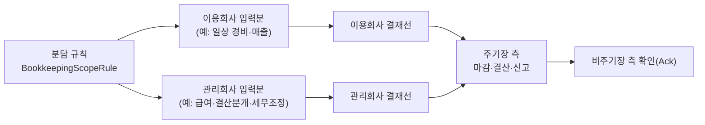

# BK 기장 방식 선택(Bookkeeping Mode) 상세설계서 v1.0

- 기반 문서: `bk_서비스_상세설계서_v2.0.md` (이하 "v2.0"), `bk_화면설계서_v1.0.html`, `메뉴구조도_v1.0.html`
- 작성일: 2026-06-11
- 버전: v1.0
- 작성 목적: v2.0의 단일 전제 — **"모든 회계·세무 실무는 각 이용회사가 자체 수행"(v2.0 1장)** — 를 확장하여, 테넌트(이용회사)별로 **기장 수행 주체를 계약 기반으로 선택**할 수 있도록 한다. 본 문서는 변경·추가 사항만 상세화하며, 그 외 처리 규칙은 v2.0을 준용한다.

---

## 0. 결정 요약

| # | 결정 항목 | 확정 내용 | 상세 |
|---|---|---|---|
| 1 | 기장 모드 | `OPERATOR_LED`(관리회사 주도) / `TENANT_LED`(이용회사 주도, 기본·현행) / `HYBRID`(병행) 3모드 | 1장 |
| 2 | 마감·결산·신고 수행 주체 | **주기장(primary bookkeeper) 측이 수행** — 모드별 주기장 규칙 + HYBRID는 계약 지정 | 1.2, 5장 |
| 3 | 관리회사 기장 권한 | Break-glass(예외)와 분리된 **상시 접근모드 `BOOKKEEPING`** 신설 — 계약 기반, 배정 회사 한정 | 4, 8장 |
| 4 | 기장 담당자 | 운영자 그룹 내 **기장 담당 Role 분리** + 회사별 담당 배정(`BookkeepingAssignment`), 전 테넌트 접근 불가(최소 권한) | 4장 |
| 5 | HYBRID 충돌 방지 | 분담 규칙(`BookkeepingScopeRule`) + 입력 주체 검증 + 중복 입력 탐지(이상탐지 연계) | 7장 |
| 6 | 이용회사 보호 장치 | 모드 설정·전환 양측 동의, 마감·결산·신고에 대한 이용회사 **확인(Acknowledge) 절차**, 전수 행위자 표식·감사 | 3, 5, 8장 |
| 7 | 모드 전환 | 마감 완료 기간 경계에서만 효력, 미결 전표 정리 선행, 전환 이력 보존 | 3장 |

> v2.0의 긴급 대행(Break-glass, 5.3)은 **기장 계약이 없는 회사에 대한 예외 처리** 용도로 그대로 유지한다. 기장 계약(OPERATOR_LED/HYBRID)이 있는 회사의 일상 기장은 본 문서의 `BOOKKEEPING` 접근모드로 수행하며 Break-glass를 사용하지 않는다.

---

## 1. 기장 모드 정의

### 1.1 3개 모드

| 모드 | 코드 | 전표 입력 | 마감·결산·신고·공시 | 이용회사 역할 | 관리회사 역할 |
|---|---|---|---|---|---|
| 관리회사 주도 기장 | `OPERATOR_LED` | 관리회사 기장 담당자(기본). 이용회사 입력은 기본 차단 | **관리회사** | 증빙 제출, 거래 설명, 결과 확인(Acknowledge), (옵션)신고 전 승인 | 기장 대행 전체(작성→검토→기표→마감→결산→신고) |
| 이용회사 주도 기장 | `TENANT_LED` | 이용회사(현행 v2.0) | **이용회사** | 전체 자체 수행 | 운영·지원만(v2.0 현행, 실무는 Break-glass 예외만) |
| 병행 기장 | `HYBRID` | 양측 — 분담 규칙(`BookkeepingScopeRule`)에 따라 입력 주체 분리 | **주기장 측**(계약 지정, 기본=관리회사) | 분담 범위 입력 + 확인 | 분담 범위 입력 + (주기장일 때) 마감·결산·신고 |

### 1.2 주기장(Primary Bookkeeper) 규칙

- `primaryBookkeeper` ∈ {`OPERATOR`, `TENANT`}.
- `OPERATOR_LED` → 항상 `OPERATOR`, `TENANT_LED` → 항상 `TENANT`, `HYBRID` → 계약으로 지정(기본 `OPERATOR`).
- **주기장 전속 권한**: 가마감/본마감/마감해제(11.9), 결산정리분개·재무제표 확정(11.3), 현금흐름 조정 승인(11.3.1), 세무 신고서 생성·전자신고 전송(11.4/11.5/11.10), 공시 생성·제출(11.3.2), 개시잔액·변환 반영 승인(11.6).
- 비주기장 측이 위 작업 시도 시 `NOT_PRIMARY_BOOKKEEPER` 오류로 차단한다(12장).
- 신고 전송은 주기장이 수행하되, **이용회사 사전 승인(신고 내용 확인)을 정책 옵션**으로 제공한다(기본 ON — 납세자 확인 원칙, 5.4).

### 1.3 회사 설정(`BookkeepingConfig`)

| 필드 | 내용 |
|---|---|
| `mode` | `OPERATOR_LED` / `TENANT_LED`(기본) / `HYBRID` |
| `primaryBookkeeper` | `OPERATOR` / `TENANT` (1.2 규칙으로 유도, HYBRID만 선택) |
| `effectiveDate` | 효력 시작일 — 마감 완료 기간 경계만 허용(3장) |
| `contractRef` | 기장 대행/세무대리 수임 계약 참조(전자계약·동의 이력) |
| `tenantInputPolicy` | OPERATOR_LED에서 이용회사 입력 허용 범위(기본 `NONE`, 옵션 `REQUEST_ONLY`=기장 요청 기재만) |
| `ackPolicy` | 이용회사 확인 의무 범위: 마감/결산/신고 각각 `REQUIRED`/`NOTIFY_ONLY` |
| `filingApprovalRequired` | 신고 전송 전 이용회사 승인 필수 여부(기본 Y) |
| `noticeDigest` | 기장 접근 통지 방식: `EACH`(건별)/`DAILY`/`WEEKLY` 요약(기본 `DAILY`, 8장) |

- 설정·변경은 **양측 동의 워크플로우**(3장)를 통해서만 가능하며 `BookkeepingConfigHistory`로 버전 보존한다.

---

## 2. v2.0 변경 영향 매트릭스

| v2.0 장 | 변경 내용 |
|---|---|
| 1장 시스템 개요 | "모든 회계·세무 실무는 이용회사 자체 수행" → "**기장 모드에 따라 수행 주체 결정**(기본 TENANT_LED)"으로 개정. 1.1 업무흐름의 ②~⑧ 단계 수행 주체를 모드별로 주석 |
| 4장 권한 | 운영자 그룹에 기장 담당 Role 신설(4장), 가드레일에 기장 관련 상한 추가 |
| 5장 접근 거버넌스 | 접근모드 4종으로 확장: `VIEW`/`SUPPORT_SESSION`/**`BOOKKEEPING`(신설)**/`BREAK_GLASS`. Break-glass는 기장 계약 없는 회사의 예외로 유지 |
| 7장 구독·과금 | 기장 대행 요금 모델 추가(14장) |
| 11.1 전표 | 생명주기 문구 "이용회사 내부 완결" → "**주기장 측 결재선에서 완결**"로 개정, 행위자 표식 확장 |
| 11.9 마감 / 11.3 결산 / 11.4·11.5·11.10 신고 / 11.3.2 공시 | 수행 권한을 "주기장 측"으로 일반화 + 이용회사 확인(Ack) 단계 삽입 |
| 12·13장 데이터·API | 신규 엔티티·상태·API 추가(9·10장) |
| 15장 검증 | 모드·주기장·분담 규칙 검증 추가(12장) |
| 18장 알림 | 기장 통지 유형 추가(증빙 요청, 확인 요청, 요약 통지) |
| 화면설계서/메뉴구조도 | 운영 콘솔 기장 워크벤치(OP-12) 신설, 업무 화면 모드별 메뉴 가변(13장) |

---

## 3. 기장 모드 설정 · 전환

### 3.1 설정·전환 워크플로우 (상태머신)

`REQUESTED → COUNTERPARTY_CONSENTED → SCHEDULED → SWITCHED` (또는 `REJECTED` / `CANCELLED`)

1. **요청**: 어느 일방(관리회사 영업/운영자 또는 이용회사 총괄관리자)이 모드·주기장·효력일·계약 조건을 제안(`BookkeepingModeChangeRequest`).
2. **상대방 동의**: 상대측 권한자(이용회사 총괄관리자 ↔ 관리회사 책임자)가 Step-up 인증 후 동의. 동의 이력·계약 참조(`contractRef`)를 보존한다.
3. **전환 예약**: 효력일은 **마감 완료된 회계기간의 익월 1일**만 허용. 전환 전 체크(3.2) 통과 시 `SCHEDULED`.
4. **전환 실행**: 효력일에 배치가 권한·결재선·메뉴 구성을 일괄 전환하고 `SWITCHED` 처리, 양측 통지(18장 연계).

### 3.2 전환 전 체크리스트

| 항목 | 처리 |
|---|---|
| 직전 기간 본마감 완료 | 미완료 시 전환 차단(주기장 책임 경계를 기간 단위로 명확화) |
| 미결·미승인 전표 | 승인 완결 또는 차기 이월 처리 후 전환(잔여 시 차단) |
| 결재선 재구성 | 신규 주기장 측 결재선(`ApprovalRule`) 구성 완료 검증 |
| 기장 담당 배정 | `OPERATOR_LED`/`HYBRID`(주기장=OPERATOR) 전환 시 `BookkeepingAssignment` 1인 이상 + 검토자 분리 배정 필수 |
| HYBRID 분담 규칙 | `HYBRID` 전환 시 `BookkeepingScopeRule` 정의 완료(미정의 영역은 주기장 귀속 기본값) |
| 신고 수임 | OPERATOR가 신고 주체가 되는 경우 세무대리 수임 동의·홈택스 수임 등록 상태 확인(8.3) |

- 전환은 소급 적용 금지. 과거 기간의 행위자 표식·책임 경계는 당시 모드 기준으로 보존(`BookkeepingConfigHistory`).
- 구독 해지(`GRACE`/`TERMINATED`, v2.0 7.1) 시 OPERATOR_LED 회사는 마지막 기장 기간 정리·인계 리포트를 의무 생성한다.

---

## 4. 권한 · SOD · 결재선 모델

### 4.1 기장 담당 Role (운영자 그룹 내 분리)

| Role | 권한 | 비고 |
|---|---|---|
| `BK_PREPARER`(기장 담당) | 배정 회사의 전표 작성·증빙 매칭·보조부 입력 | **배정 회사만** 접근(전 테넌트 접근 불가 — 최소 권한). 운영 콘솔 관리 기능과 분리 |
| `BK_REVIEWER`(기장 검토) | 배정 회사의 전표 검토·승인, 마감 체크리스트 실행 | 작성자와 동일인 금지(SOD) |
| `BK_MANAGER`(기장 책임) | 마감·결산·신고 승인, 담당 배정 관리, 모드 전환 동의 | 신고 전송 Step-up |

- 기존 운영자 Role(테넌트 운영/표준 관리/보안)과 **겸직 제한**: 기장 Role 보유자는 해당 회사의 접근 거버넌스 승인자(Break-glass 승인 등)가 될 수 없다(이해충돌 방지). `PolicyGuardrail`로 강제.
- `BookkeepingAssignment`(tenantId, operatorUserId, role, validFrom/To): 담당·검토·책임을 회사별로 배정. 배정 없는 운영자의 `BOOKKEEPING` 접근은 차단.

### 4.2 모드별 결재선·SOD

| 모드 | 전표 결재선 | SOD 규칙 |
|---|---|---|
| `TENANT_LED` | 이용회사 내부 결재(현행 v2.0 11.1) | 현행(작성자≠승인자) |
| `OPERATOR_LED` | 관리회사 내부: `BK_PREPARER` 작성 → `BK_REVIEWER` 승인(→ 금액 기준 `BK_MANAGER`) | 작성자≠검토자, 검토자≠마감 승인자(소규모 예외는 가드레일 예외 승인) |
| `HYBRID` | **작성 주체별 결재선**: 이용회사 작성분 → 이용회사 결재선, 관리회사 작성분 → 관리회사 결재선. 기표 전 최종 게이트는 주기장 측 | 교차 승인 금지(이용회사 작성분을 관리회사가 임의 승인 불가 — 분담 규칙에 명시된 검토 위임 시만 허용) |

### 4.3 행위자 표식 (v2.0 5.3-(5) 확장)

- 모든 전표·기준정보·신고 데이터에 `createdByGroup`(OPERATOR/TENANT) + `bookkeepingMode`(생성 시점 모드) + `assignmentId`(기장 담당 배정 참조)를 기록한다.
- Break-glass 표식(`breakGlassSessionId`)과 구분: 기장 계약 기반 입력은 `BOOKKEEPING` 컨텍스트로 기록하며, 조회 화면에서 <OPERATOR 기장> 배지로 표시한다.

---

## 5. 모드별 업무흐름 (v2.0 1.1 확장)

### 5.1 OPERATOR_LED (관리회사 주도)

- 이용회사 화면: 증빙 제출 + 기장 요청 기재(`REQUEST_ONLY` 정책 시) + 조회 + 확인/승인. 전표 입력 메뉴는 비활성(13장).
- 이용회사 확인(Ack): 마감·결산 결과 요약 리포트를 수신하고 `CONFIRMED` 또는 `OBJECTED`(사유) 처리. `OBJECTED` 시 주기장이 보완 후 재확인 요청. `ackPolicy=REQUIRED`면 확인 완료 전 다음 단계(신고 생성) 차단.

### 5.2 TENANT_LED (이용회사 주도 — 현행)

- v2.0 1.1 흐름 그대로. 관리회사 실무 개입은 Break-glass(5.3)로만 가능.

### 5.3 HYBRID (병행)

- 마감 전 주기장은 **양측 입력분 통합 체크리스트**(11.9 확장: 분담 영역별 입력 완료 여부 항목 추가)를 통과해야 한다.

### 5.4 신고 책임 경계

- 주기장=OPERATOR인 신고는 관리회사가 **세무대리인 자격으로 수임**한 경우에만 허용(수임 계약·홈택스 수임 등록을 `contractRef`로 검증). 미수임 상태에서 신고 전송 차단.
- `filingApprovalRequired=Y`(기본): 신고서 요약(과세표준·세액)을 이용회사 승인자에게 송부 → Step-up 승인 후 전송 가능. 승인 이력은 신고 감사로그와 연결.
- 신고 전송 행위자·승인자·파일해시는 v2.0 신고 감사 체계를 그대로 사용하되 `bookkeepingMode` 표식을 추가한다.

---

## 6. 관리회사 기장 워크벤치 (운영 콘솔 확장)

기장 담당자가 다수 배정 회사를 효율적으로 처리하기 위한 전용 작업 공간(화면 `OP-12`, 13장).

- **담당 회사 보드**: 배정 회사별 처리 현황 카드 — 미처리 증빙 수, 미결 전표, 마감 D-day, 신고 기한 D-N, 이용회사 확인 대기.
- **회사 컨텍스트 전환**: 카드 클릭 → 해당 회사의 업무 화면(전표 입력 TN-05 등)으로 `BOOKKEEPING` 컨텍스트 진입. 전 화면에 기장 모드 배너(회사명·모드·담당 Role) 고정 표시.
- **일괄 작업**: 담당 회사 전체의 미처리 증빙 큐, 마감 체크리스트 일괄 실행, 확인 요청 일괄 발송.
- **인계**: 담당 변경 시 인계 노트·미처리 목록 자동 생성(`BookkeepingHandover`).
- 접근 범위는 `BookkeepingAssignment` 기준으로만 렌더링(미배정 회사 미노출).

---

## 7. HYBRID 분담 규칙 · 충돌 방지

### 7.1 분담 규칙(`BookkeepingScopeRule`)

| 필드 | 내용 |
|---|---|
| `scopeType` | `JOURNAL_TYPE`(전표유형) / `TRANSACTION_SOURCE`(원천: 스크래핑·세금계산서·수기 등) / `ACCOUNT_RANGE`(계정 범위) / `MODULE`(급여·고정자산·결산분개 등) |
| `scopeValue` | 대상 값(예: 결산전표, 급여 모듈, 8xx 계정) |
| `owner` | `OPERATOR` / `TENANT` / `EITHER`(양측 허용) |
| `reviewDelegation` | 교차 검토 위임 여부(4.2 예외) |

- 미정의 영역의 기본 owner는 **주기장 측**. 규칙은 유효일자 버전 관리(차원 설정 패턴, v2.0 10.1 준용).

### 7.2 충돌 방지 통제

| 통제 | 처리 |
|---|---|
| 입력 주체 검증 | 전표 저장 시 분담 규칙의 owner 검증 — 위반 시 차단(정책상 `EITHER` 영역만 양측 허용) |
| 중복 입력 탐지 | 동일 거래(원천키·거래처·금액·일자) 양측 중복 입력을 저장 시 경고 + 이상탐지 규칙(11.7)에 `DUP_CROSS_PARTY` reason code 추가 |
| 동시 편집 | 전표 단건 잠금(기반 설계 준용) + 마감·일괄 작업 분산 락(v2.0 2.1.2) 공용 |
| 원천 자동수집 귀속 | 스크래핑·전자세금계산서 수집분(8.4)의 기장 책임자를 분담 규칙으로 지정(미지정 시 주기장) |

---

## 8. 접근 거버넌스 확장 (v2.0 5장 개정)

### 8.1 접근모드 4종

| 모드 | 코드 | 성격 | 통제 |
|---|---|---|---|
| 조회 지원 | `VIEW` | (현행) | 사유 + 로그 |
| 지원 세션 | `SUPPORT_SESSION` | (현행) | 사유 + 시간제한 + 로그 + 통지 |
| **기장 수행** | `BOOKKEEPING` | **신설 — 계약 기반 상시** | 기장 계약(`BookkeepingConfig`) + 담당 배정 필수, 시간제한 없음(계약 기간), 전수 로그, **요약 통지** |
| 긴급 변경 | `BREAK_GLASS` | (현행) 기장 계약 없는 회사의 예외 | 옵트인 + 이중통제 + 시간제한 + 즉시 통지 + 녹화 |

### 8.2 BOOKKEEPING 모드 통제 규칙

- **진입 조건**: 해당 회사 `mode ∈ {OPERATOR_LED, HYBRID}` AND 유효한 `BookkeepingAssignment` 보유. 둘 중 하나라도 없으면 진입 차단.
- **로그**: 모든 행위는 `AdminAccessLog`(mode=BOOKKEEPING) + `DataChangeLog` 기록(현행과 동일 강도). 세션 녹화는 적용하지 않음(상시 업무 — 대신 행위자 표식·해시체인으로 감사).
- **통지**: 건별 통지 대신 `noticeDigest` 정책(일/주 요약 — 처리 전표 수·마감·신고 행위 요약)을 이용회사 관리자에게 발송. 단, **민감 행위(마감해제, 신고 전송, 개인정보 평문 조회, 기준정보 변경)는 건별 즉시 통지** 유지.
- **민감정보**: 기장 담당자도 평문 조회는 Step-up + `PersonalDataAccessLog`(현행 동일). 급여 등 민감 모듈은 분담 규칙·배정 권한에 명시된 경우만.
- **모니터링**: 기장 담당자별 행위량·이상 패턴(비배정 회사 접근 시도, 대량 다운로드)을 보안 이벤트로 적재(v2.0 20.4 연계).

---

## 9. 데이터 모델

### 9.1 신규 엔티티

| 엔티티 | 핵심 필드 | 용도 |
|---|---|---|
| `BookkeepingConfig` | tenantId, mode, primaryBookkeeper, effectiveDate, tenantInputPolicy, ackPolicy, filingApprovalRequired, noticeDigest, contractRef, status | 회사별 기장 모드 설정 |
| `BookkeepingConfigHistory` | configId, 변경 전/후, 효력기간 | 모드 이력(소급 책임 경계) |
| `BookkeepingModeChangeRequest` | tenantId, fromMode, toMode, requestedBy, consentBy, effectiveDate, status, checklistResult | 전환 동의 워크플로우 |
| `BookkeepingAssignment` | tenantId, operatorUserId, role(PREPARER/REVIEWER/MANAGER), validFrom/To, status | 기장 담당 배정 |
| `BookkeepingScopeRule` | tenantId, scopeType, scopeValue, owner, reviewDelegation, effectiveDate | HYBRID 분담 규칙 |
| `TenantAcknowledgement` | tenantId, targetType(CLOSING/SETTLEMENT/FILING), targetRef, status(PENDING/CONFIRMED/OBJECTED), actorId, reason, ackAt | 이용회사 확인 |
| `BookkeepingHandover` | tenantId, fromAssignee, toAssignee, openItems, note, confirmedAt | 담당 인계 |

### 9.2 기존 엔티티 확장

- 전표·신고·결산 산출물: `bookkeepingMode`, `assignmentId` 표식 컬럼 추가(4.3).
- `AdminAccessSession.mode`에 `BOOKKEEPING` 값 추가.
- `ApprovalRule`: 적용 주체(OPERATOR/TENANT) 구분 추가.
- `ClosingChecklist`(v2.0 11.9): HYBRID용 "분담 영역별 입력 완료" 항목 추가.

### 9.3 상태값 추가 (v2.0 12.2 확장)

| 상태 그룹 | 상태값 |
|---|---|
| 기장 모드 | `OPERATOR_LED`, `TENANT_LED`, `HYBRID` |
| 주기장 | `OPERATOR`, `TENANT` |
| 모드 전환 | `REQUESTED`, `COUNTERPARTY_CONSENTED`, `SCHEDULED`, `SWITCHED`, `REJECTED`, `CANCELLED` |
| 이용회사 확인 | `PENDING`, `CONFIRMED`, `OBJECTED` |
| 접근모드(확장) | `VIEW`, `SUPPORT_SESSION`, `BOOKKEEPING`, `BREAK_GLASS` |

---

## 10. 서비스 / API

### 10.1 서비스

`BookkeepingModeService`(모드 설정·전환 워크플로우·체크, 3장), `BookkeepingAssignmentService`(담당 배정·SOD·인계, 4장), `BookkeepingWorkbenchService`(담당 보드·일괄 작업, 6장), `ScopeRuleService`(HYBRID 분담·입력 주체 검증, 7장), `AcknowledgementService`(확인 요청·이의 처리, 5장). 마감·결산·신고 서비스는 v2.0 서비스를 그대로 사용하되 **주기장 권한 검증을 공통 인터셉터로 추가**한다.

### 10.2 API (추가/대표)

| Method | URI | 설명 |
|---|---|---|
| `GET·PUT` | `/api/operator/tenants/{id}/bookkeeping-config` | 기장 모드 설정 조회/변경 요청 |
| `POST` | `/api/tenant/bookkeeping/mode-change/{id}/consent` | 이용회사 동의(Step-up) |
| `POST·GET` | `/api/operator/bookkeeping/assignments` | 기장 담당 배정 관리 |
| `GET` | `/api/operator/bookkeeping/workbench` | 담당 회사 보드(현황 카드) |
| `POST` | `/api/operator/bookkeeping/context/{tenantId}` | BOOKKEEPING 컨텍스트 진입(배정 검증) |
| `GET·PUT` | `/api/tenant/bookkeeping/scope-rules` | HYBRID 분담 규칙 |
| `POST` | `/api/tenant/closing/{periodId}/acknowledge` | 마감/결산 확인(CONFIRMED/OBJECTED) |
| `POST` | `/api/tenant/filings/{id}/approve` | 신고 전송 전 이용회사 승인(Step-up) |
| `GET` | `/api/tenant/bookkeeping/digest` | 기장 활동 요약 통지 내역 |

- Scope 추가: `operator:bookkeeping:prepare`, `operator:bookkeeping:close`, `tenant:bookkeeping:acknowledge`, `tenant:filing:approve`.
- 기존 마감/결산/신고 API는 호출 주체의 주기장 여부를 검증한다(`NOT_PRIMARY_BOOKKEEPER`).

---

## 11. 배치

- **모드 전환 실행 잡**: 효력일 00시 권한·결재선·메뉴 일괄 전환(3.1-4), 멱등.
- **기장 요약 통지 잡**: `noticeDigest` 정책별(일/주) 기장 활동 요약 발송(8.2, 18장 채널).
- **확인 기한 리마인드 잡**: `TenantAcknowledgement` PENDING 건 D+3/D+7 리마인드, 장기 미확인 시 에스컬레이션.
- **담당 공백 점검 잡**: OPERATOR_LED/HYBRID 회사 중 유효 `BookkeepingAssignment` 부재 회사 운영 알림(마감·신고 기한 임박 우선).

---

## 12. 검증 / 오류 처리 (v2.0 15장 확장)

| 검증 항목 | 처리 |
|---|---|
| 비주기장 측 마감/결산/신고 시도 | 차단 — `NOT_PRIMARY_BOOKKEEPER` |
| TENANT_LED 회사에 운영자 기장 API 호출 | 차단(Break-glass 세션만 예외) — `BOOKKEEPING_NOT_CONTRACTED` |
| 배정 없는 운영자의 BOOKKEEPING 진입 | 차단 — `ASSIGNMENT_REQUIRED` |
| OPERATOR_LED에서 이용회사 전표 입력 | `tenantInputPolicy=NONE`이면 차단(메뉴 비활성 + API 이중 차단) |
| HYBRID 분담 규칙 위반 입력 | 차단(owner 불일치), `EITHER` 영역만 양측 허용 |
| 양측 중복 입력 의심 | 저장 경고 + 이상탐지 `DUP_CROSS_PARTY` 알림(7.2) |
| 모드 전환 효력일 위반 | 마감 완료 기간 경계 외 날짜 차단 |
| 전환 체크리스트 미통과 | `SCHEDULED` 전환 차단(미결 전표·결재선·배정·수임 미비) |
| Ack 미완료 상태 신고 생성 | `ackPolicy=REQUIRED` 시 차단, 이의(OBJECTED) 미해소 시 차단 |
| 신고 승인 누락 전송 | `filingApprovalRequired=Y` 시 전송 차단 |
| 미수임 상태 신고 전송(주기장=OPERATOR) | 차단 — 수임 등록 확인 필요 |
| 기장 Role-거버넌스 승인자 겸직 | 가드레일 위반 — 배정 저장 차단(4.1) |

---

## 13. 화면 · 메뉴 영향 (화면설계서 v1.0 / 메뉴구조도 v1.0 개정 대상)

| 구분 | 변경 |
|---|---|
| 운영 콘솔 메뉴 | **`OP-12` 기장 워크벤치 신설**(6장): 담당 회사 보드 / 회사 컨텍스트 전환 / 일괄 작업 / 인계. "2. 테넌트 관리" 하위 또는 독립 대메뉴 |
| 운영 콘솔 OP-02 | 테넌트 상세에 "기장 설정" 탭 추가(모드·주기장·담당 배정·전환 이력) |
| 업무 화면 공통 | GNB에 기장 모드 배지 상시 표시: <TENANT_LED 자가 기장> / <OPERATOR_LED 위탁 기장> / <HYBRID 병행> |
| TN-05 전표 입력 | OPERATOR_LED: 메뉴 비활성(→ "기장 요청·증빙 제출" 안내), HYBRID: 분담 영역 외 입력 시 차단 안내. OPERATOR 기장 전표는 목록에 <OPERATOR 기장> 배지 |
| TN-09 마감 / TN-10 결산 | 주기장=OPERATOR인 회사의 이용회사 화면은 실행 버튼 대신 **확인(Acknowledge) 패널**(결과 요약 + 확인/이의) 표시 |
| TN-12/13 신고 | 주기장=OPERATOR: 이용회사 화면은 신고 요약 + **전송 승인 버튼(Step-up)** 중심으로 재구성 |
| 신규 화면 `TN-21` | 기장 협업함(이용회사): 증빙 제출 현황, 기장 요청 기재, 관리회사 질의 응답, 확인 대기 목록 |
| 메뉴 운영 규칙 | 메뉴구조도 4장에 "기장 모드 연동" 규칙 추가: 모드에 따라 전표 입력·마감·신고 메뉴의 활성/확인 전용 전환 |

---

## 14. 과금 (v2.0 7.2 확장)

- `BillingPlan`에 기장 대행 요금 항목 추가: 월 기본 기장료 + 전표 건수 구간 요금 + 신고 대행 건당 요금(부가세/원천세/법인세 구분). `UsageMeter`에 기장 전표 수(`createdByGroup=OPERATOR` + BOOKKEEPING 컨텍스트) 미터 추가.
- HYBRID는 관리회사 입력분만 기장료 미터링. 모드 전환 월은 일할/안분 정책(15장 확인사항).

---

## 15. 잔여 확인사항

1. 관리회사의 세무대리인 자격·수임 범위(기장 대리 vs 신고 대리) 법적 검토 및 미수임 시 허용 업무 경계
2. `filingApprovalRequired` 기본값(Y)과 이용회사 무응답 시 처리(기한 임박 자동 에스컬레이션 vs 전송 보류)
3. OPERATOR_LED에서 이용회사 입력 허용 옵션(`REQUEST_ONLY`)의 범위 — 간이 경비 입력 허용 여부
4. HYBRID 분담 규칙 표준 템플릿(업종별) 제공 여부 및 기본 분담안
5. 기장 담당자 1인당 배정 회사 수 상한(품질·SLA)과 성수기(1월·부가세月) 가중치
6. 기장 요약 통지(`noticeDigest`) 기본 주기와 민감 행위 건별 통지 범위 확정
7. 기장 대행 요금 체계(기본료·건수 구간·신고 건당)와 전환 월 안분 정책
8. Ack 이의(OBJECTED) 분쟁 처리 절차(보완 기한, 중재, 책임 경계)와 마감 일정 충돌 시 우선순위
9. 기장 Role과 운영 Role 겸직 제한의 예외(소규모 관리회사) 허용 기준
10. v2.0 본문 개정 시점(본 문서 내용의 v3.0 통합 여부)

---

## 16. v2.0 반영 계획

본 문서는 독립 변경설계서로 운영하되, 확정 시 다음 순서로 v2.0(→v3.0)에 통합한다.

| 순서 | 반영 대상 | 내용 |
|---|---|---|
| 1 | v2.0 1장·1.1 | 자가 수행 전제 문구 개정 + 업무흐름 모드 주석 |
| 2 | v2.0 5장 | 접근모드 4종 표 교체(8장) |
| 3 | v2.0 4장 | 기장 Role·겸직 가드레일 추가 |
| 4 | v2.0 11.1/11.9/11.3/11.4/11.10/11.3.2 | "주기장 측" 일반화 + Ack 단계 |
| 5 | v2.0 12·13·14·15·18장 | 엔티티·상태·API·배치·검증·알림 병합 |
| 6 | 화면설계서 v1.1 / 메뉴구조도 v1.1 | OP-12·TN-21 신설, 모드별 메뉴 가변 규칙 |
