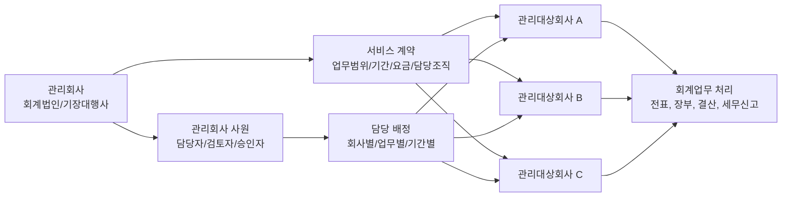
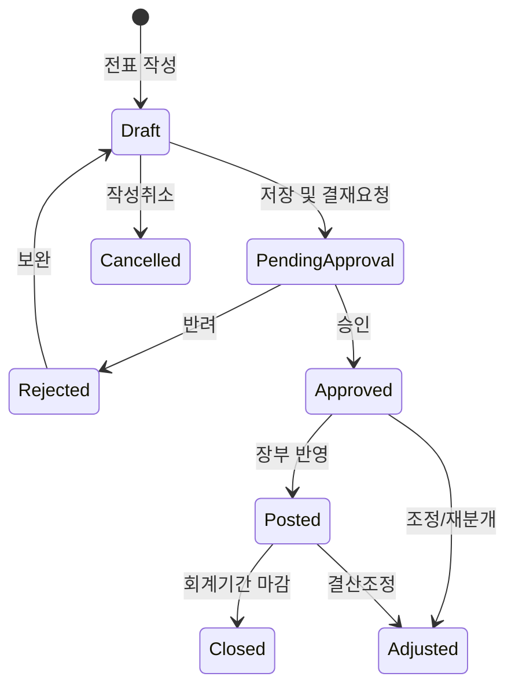
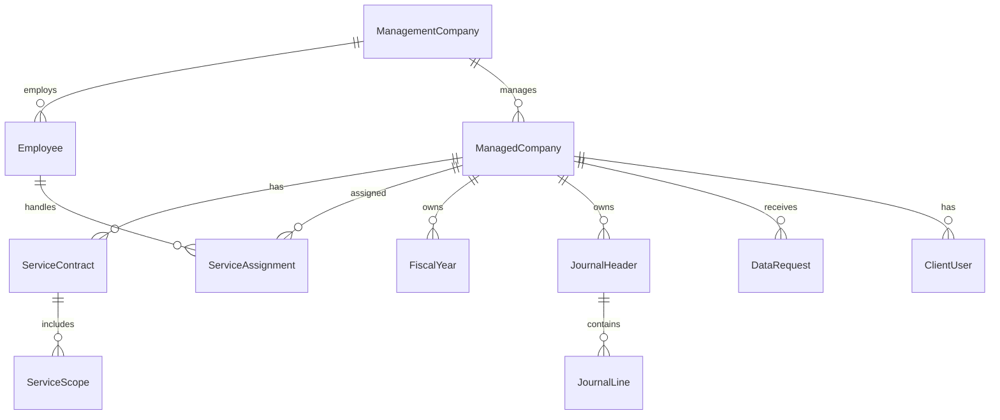

# BK 프로그램 기초설계서

- 원천 파일: `KAT_요구사항정의서_bk.xlsx`
- 분석 시트: `요구사항`
- 작성일: 2026-06-08
- 작성 목적: 요구사항 시트의 업무 요구와 회계서비스 운영 구조를 프로그램 구현 관점으로 재분류하여, 이후 화면설계서, DB설계서, API설계서, 상세설계서 작성의 기준 문서로 사용한다.

## 1. 요구사항 분석 개요

### 1.1 분석 범위

요구사항 시트는 `A1:P71` 범위로 구성되어 있으며, 헤더와 작성 가이드 행을 제외하면 실제 요구사항은 총 67건이다. 별도 ID가 없는 참고 메모는 2건이다.

| 구분 | 요구사항 수 | ID 범위 | 주요 업무 |
|---|---:|---|---|
| 기준정보 | 11 | `BASE-01` ~ `BASE-11` | 회사, 회계연도, 계정, 거래처, 조직, 권한, 부가세, 환율, 공통코드, 전기이월 기준 |
| 전표/장부 | 19 | `BKJE-01` ~ `BKJE-19` | 전표 입력, 승인, 조회, 마감, 원장, 장부, 통계, 감사대응 |
| 결산 | 8 | `BKES-20` ~ `BKES-27` | 결산자료 조정, 재무제표, 결산장부, 재분개, 결산보고, 전기이월 |
| 매입매출/부가세/경비 | 10 | `BKBILL-28` ~ `BKBILL-37` | 매입/매출 전표, 부가세 입력, 전자세금계산서, 미수금, 카드경비, 신고자료 |
| 세무/차량/고정자산 | 19 | `BKCS-38` ~ `BKCS-56` | 업무용승용차, 법인세 조정, 접대비, 외화평가, 고정자산, 감가상각 |

참고 메모:

- `법인세조정관련 계정과목 입력시`: 전표 입력 또는 계정 선택 시 법인세 조정 관련 계정의 세무분류 연계를 고려해야 한다.
- `자동발행연동`: 전자세금계산서 발행 기능은 승인된 매출전표와 자동 발행/전송 연동을 전제로 한다.

### 1.2 시스템 성격

본 시스템은 회계 기준정보, 전표, 장부, 결산, 부가세, 법인세 조정, 차량비용, 고정자산을 하나의 흐름으로 연결하는 통합 회계/세무 업무 시스템이다. 또한 회계회사 또는 기장대행사가 여러 고객회사에 회계서비스를 제공하는 운영 구조를 전제로 한다. 서비스를 제공하는 회사를 `관리회사`, 서비스를 제공받는 회사를 `관리대상회사`로 정의한다.

단순 입력 시스템이 아니라 다음 성격을 가진다.

- 회계기간 마감, 승인, 이력, 감사로그를 중심으로 한 내부통제 시스템
- 전표 데이터를 원천으로 장부, 재무제표, 세무신고, 조정명세서를 생성하는 회계 데이터 허브
- 국세청/홈택스, 전자세금계산서, 카드사, OCR, 환율, ERP/인사/구매/매출 모듈과 연계되는 외부 인터페이스 시스템
- 자동계산과 자동분개를 제공하되, 금액 불일치나 회계/세무 오류를 임의 자동수정하지 않는 검증 중심 시스템
- 복수 회계기준(일반기업회계기준, K-IFRS, US GAAP, IFRS 등)을 지원하고, 외부/타국 기준으로 작성된 데이터를 수신·매핑·변환하여 입력할 수 있는 다중 회계기준 시스템
- 관리회사의 사원이 여러 관리대상회사의 회계업무를 담당하고, 담당 배정과 권한 범위에 따라 업무를 수행하는 회계서비스 운영 시스템

### 1.3 서비스 운영 모델

운영 모델의 기본 전제:

- 하나의 관리회사는 여러 관리대상회사를 등록하고 회계서비스를 제공한다.
- 관리회사의 사원은 관리대상회사별 담당자로 배정된다.
- 담당 배정은 회사 단위뿐 아니라 업무영역, 회계기간, 결재/검토 단계 단위로 설정할 수 있어야 한다.
- 관리대상회사의 전표, 장부, 결산, 신고자료는 회사별로 완전히 분리되어야 한다.
- 관리회사 내부의 팀장, 검토자, 승인자는 여러 담당자의 업무를 모니터링하고 검토/승인할 수 있다.
- 관리대상회사 담당자는 자료 업로드, 전표/증빙 확인, 보고서 열람 등 제한된 고객 포털 기능을 사용할 수 있다.

## 2. 설계 기본 원칙

### 2.1 업무 원칙

1. 전표는 승인 후에만 원장, 장부, 결산, 신고자료에 반영한다.
2. 마감된 회계기간의 전표, 세율, 환율, 결산자료는 수정/삭제를 제한한다.
3. 금액 불일치, 계정 매핑 누락, 세법 기준 초과 등은 자동수정하지 않고 경고, 검토대상, 오류로그로 처리한다.
4. 모든 수정, 삭제, 승인, 반려, 마감, 전송, 재전송은 사용자와 시각을 포함하여 감사로그로 남긴다.
5. 자동분개, 자동계산, 자동신고 파일 생성은 재실행 시 중복 생성되지 않도록 멱등성을 보장한다.
6. 기준정보는 거래 데이터보다 먼저 확정되어야 하며, 사용 중인 기준정보는 삭제보다 비활성화로 관리한다.
7. 모든 회계 데이터는 관리대상회사 단위로 분리하고, 관리회사 사원은 배정받은 관리대상회사와 업무 범위 내에서만 접근한다.
8. 관리회사 내부 검토/승인과 관리대상회사 확인/승인은 분리하여 기록한다.

### 2.2 프로그램 구조 원칙

- 모듈은 `서비스운영`, `기준정보`, `전표`, `장부/원장`, `결산`, `매입매출/부가세`, `세무조정`, `고정자산`, `공통/권한/감사`로 분리한다.
- 금액 계산, 세율 적용, 마감 체크, 승인 상태 체크는 화면이 아니라 도메인 서비스 계층에서 공통 처리한다.
- 외부 연계는 업무 트랜잭션과 분리된 인터페이스 어댑터와 연계 로그를 둔다.
- 보고서와 엑셀/PDF 출력은 원천 테이블을 직접 임의 집계하지 않고 검증된 집계/뷰/리포트 서비스를 사용한다.
- 회계/세무 규칙은 코드에 산재시키지 않고 규칙 테이블 또는 정책 서비스로 관리할 수 있게 설계한다.
- 관리회사, 관리대상회사, 담당사원, 서비스계약, 업무배정은 모든 업무 데이터의 상위 컨텍스트로 관리한다.

## 3. 전체 업무 흐름

### 3.1 전표 생명주기

전표 상태별 통제:

| 상태 | 수정 | 삭제 | 장부 반영 | 결산 반영 | 통제 기준 |
|---|---|---|---|---|---|
| 작성중 | 가능 | 가능 | 불가 | 불가 | 필수값, 차대변 검증 |
| 승인요청 | 제한 | 제한 | 불가 | 불가 | 결재선, 권한 검증 |
| 반려 | 가능 | 가능 | 불가 | 불가 | 반려사유 필수 |
| 승인 | 제한 | 제한 | 가능 | 가능 | 승인자/승인시각 기록 |
| 장부반영 | 조정전표로 처리 | 삭제 불가 | 가능 | 가능 | 원장 이력 보존 |
| 마감 | 불가 | 불가 | 가능 | 가능 | 마감 해제 권한 필요 |

## 4. 사용자 및 권한 설계

### 4.1 사용자 역할

| 역할 | 주요 사용 영역 | 주요 권한 |
|---|---|---|
| 관리회사 대표/관리자 | 서비스운영, 전체 현황, 권한 | 관리회사 정보, 서비스계약, 관리대상회사, 담당조직, 전체 업무현황 관리 |
| 관리회사 팀장/검토자 | 담당자 업무검토, 결산/신고 검토 | 담당사원 업무 배정, 진행상태 모니터링, 검토/반려, 내부 승인 |
| 관리회사 담당사원 | 배정된 관리대상회사 회계업무 | 배정 회사의 전표, 장부, 결산, 부가세, 세무조정 업무 처리 |
| 관리대상회사 담당자 | 자료제공, 확인, 보고서 열람 | 증빙/자료 업로드, 문의 답변, 보고서 확인, 제한적 승인/확인 |
| 회계 관리자 | 기준정보, 전표, 결산, 보고 | 회사/회계연도/계정/마감 관리, 결산 승인, 보고서 생성 |
| 회계 담당자 | 전표, 장부, 매입매출, 결산 입력 | 전표 작성, 조회, 증빙 첨부, 장부 출력, 결산자료 입력 |
| 세무 담당자 | 부가세, 법인세, 차량비용, 고정자산 세무 | 부가세 신고자료, 세무조정, 법인세 연계자료, 세법 검증 |
| 인사/구매 담당자 | 급여/구매 연계 전표 | 타 모듈 자료 제공, 자동전표 생성 요청 |
| 부서 담당자 | 부서 전표/경비 신청 | 부서 경비 입력, 증빙 첨부, 결재 요청 |
| 결재자/회계책임자 | 전표 승인 | 승인/반려, 결재 이력 관리 |
| 관리자/경영진 | 조회, 분석, 보고 | 경영보고서, 손익/예산 분석, 제출자료 조회 |
| 내부 감사자/외부 감사인 | 감사로그, 검증리포트 | 감사자료 조회, 이상거래 검토, 로그 확인 |
| 시스템 관리자 | 사용자, 권한, 공통코드, 연계 설정 | Role 관리, 메뉴권한, 접근로그, 시스템 설정 |
| 운전자/총무팀 | 운행기록, 차량비용 | 운행기록 입력, 차량비용 자료 등록 |

### 4.2 권한 통제 단위

- 메뉴 접근 권한: 모듈/화면 단위 접근 제어
- 데이터 범위 권한: 관리회사, 관리대상회사, 사업장, 부서, 프로젝트, 현장, 회계연도 기준
- 행위 권한: 조회, 등록, 수정, 삭제, 승인, 반려, 마감, 마감해제, 출력, 전송
- 민감정보 권한: 주민번호 등 개인정보, 카드번호, 외부 제출자료, 감사로그
- 결재 권한: 결재 단계, 대체 결재자, 금액 한도, 부서별 승인자
- 담당 배정 권한: 관리대상회사별 담당자, 검토자, 승인자, 업무영역, 적용기간 기준
- 고객 포털 권한: 관리대상회사 사용자의 자료 업로드, 조회, 확인, 승인 가능 범위 기준

### 4.3 관리회사 담당 체계

| 구분 | 설명 |
|---|---|
| 관리회사 | 회계서비스를 제공하는 회사로, 자체 사원/팀/권한/서비스계약을 관리한다. |
| 관리대상회사 | 관리회사로부터 회계, 세무, 결산, 신고 서비스를 제공받는 고객회사이다. |
| 담당사원 | 특정 관리대상회사의 업무를 수행하도록 배정된 관리회사 사원이다. |
| 검토자 | 담당사원의 처리 결과를 검토하고 반려 또는 내부 승인하는 관리회사 사원이다. |
| 승인자 | 결산, 신고, 대외제출 등 중요 업무의 최종 승인을 수행한다. |
| 고객 담당자 | 관리대상회사 소속 사용자로, 자료 제공, 문의 답변, 보고서 확인을 수행한다. |

담당 배정 기준:

- 관리대상회사별 주담당자와 부담당자를 지정한다.
- 업무영역별로 전표, 장부, 결산, 부가세, 법인세, 급여/경비, 고정자산 담당자를 다르게 지정할 수 있다.
- 회계연도 또는 계약기간별로 담당 배정 이력을 보존한다.
- 담당자 변경 시 변경 전 담당자의 처리 이력은 보존하고, 미완료 업무는 신규 담당자에게 이관한다.
- 담당자가 배정되지 않은 관리대상회사는 전표 입력, 결산, 신고 업무를 시작할 수 없도록 경고한다.

### 4.4 서비스 업무 상태 관리

| 상태 | 의미 | 주요 처리 |
|---|---|---|
| 계약대기 | 관리대상회사 등록 후 서비스 계약이 확정되지 않은 상태 | 기준정보 입력은 가능하나 회계업무 진행 제한 |
| 서비스중 | 계약과 담당 배정이 완료되어 업무 처리가 가능한 상태 | 전표/장부/결산/신고 업무 수행 |
| 자료요청 | 관리대상회사에 증빙 또는 추가자료를 요청한 상태 | 고객 포털 알림, 요청기한 관리 |
| 담당처리중 | 관리회사 담당사원이 업무를 처리 중인 상태 | 업무별 진행률, 지연 여부 표시 |
| 검토중 | 팀장/검토자가 처리 결과를 검토하는 상태 | 반려 또는 승인 |
| 고객확인중 | 관리대상회사 확인이 필요한 상태 | 보고서 확인, 이견 등록 |
| 완료 | 해당 기간의 서비스 업무가 완료된 상태 | 산출물 보관, 감사로그 확정 |
| 보류/해지 | 계약 보류 또는 서비스 해지 상태 | 신규 업무 제한, 기존 자료 조회 정책 적용 |

## 5. 모듈별 기능 설계

### 5.0 서비스운영 모듈

서비스운영 모듈은 관리회사가 여러 관리대상회사의 회계업무를 안정적으로 수행하기 위한 상위 관리 기능이다. 모든 회계/세무 업무는 서비스계약과 담당 배정 정보를 기준으로 접근권한과 업무 책임자가 결정된다.

| 기능 | 주요 처리 | 주요 데이터/산출물 |
|---|---|---|
| 관리회사 정보관리 | 관리회사 기본정보, 사업자번호, 조직/팀, 서비스 제공 범위 관리 | 관리회사마스터, 관리회사 조직정보 |
| 관리대상회사 등록 | 고객회사 기본정보, 계약상태, 담당지점/팀, 서비스 시작일 관리 | 관리대상회사마스터 |
| 서비스계약 관리 | 기장, 결산, 부가세, 법인세, 급여/경비 등 서비스 범위와 기간 관리 | 서비스계약, 계약이력 |
| 담당사원 배정 | 회사별/업무별/기간별 주담당자, 부담당자, 검토자, 승인자 지정 | 담당배정표, 업무이관이력 |
| 업무현황 대시보드 | 회사별 월마감, 자료요청, 전표처리, 신고기한, 지연 업무 조회 | 업무현황판, 지연리스트 |
| 자료요청/수집 | 관리대상회사에 증빙, 카드내역, 매출/매입자료 요청 및 수집 | 자료요청서, 업로드 파일, 수신확인 |
| 고객 커뮤니케이션 | 문의, 답변, 검토요청, 보고서 확인 요청 관리 | 문의이력, 고객확인로그 |
| 서비스 품질관리 | 담당자별 처리건수, 마감준수율, 오류/반려 건수 집계 | 서비스품질 리포트 |

서비스운영 통제:

- 관리회사 사원은 담당 배정이 있는 관리대상회사만 조회/처리할 수 있다.
- 관리대상회사 간 전표, 장부, 신고자료, 첨부파일은 교차 조회되지 않아야 한다.
- 담당자 변경과 업무 이관은 이력으로 저장한다.
- 계약 종료 또는 보류 상태의 관리대상회사는 신규 전표/신고 생성이 제한된다.
- 신고기한, 마감기한, 자료요청 기한은 알림과 지연 상태로 관리한다.

### 5.1 기준정보 모듈 `BASE`

기준정보는 모든 거래와 결산의 선행 조건이다. 관리회사와 관리대상회사 관계가 먼저 설정되고, 관리대상회사별 회사, 회계기간, 계정, 거래처, 조직, 세율, 환율, 자동분개 규칙이 확정되어야 전표와 신고자료를 안정적으로 생성할 수 있다.

| ID | 기능 | 주요 처리 | 주요 데이터/산출물 |
|---|---|---|---|
| `BASE-01` | 회사기초정보 관리 | 관리대상회사 기본정보 등록, 사업자번호 형식/중복 검증, 결산월 기준 회계기간 생성, 계정체계 템플릿 매핑, 세무서/구청 코드 검증 | 회사기본정보, 회사-회계연도 매핑, 관리회사-관리대상회사 매핑 |
| `BASE-02` | 회계연도 관리 | 회계연도/월 생성, 마감여부 설정, 기간 중복/공백 검증, 마감기간 수정 제한 | 회계기간마스터, 마감플래그 |
| `BASE-03` | 계정과목 관리 | 계정코드 생성, 상하위 구조 검증, 재무제표 항목 매핑, 차대변 유형 검증 | 계정마스터, 재무제표 매핑표 |
| `BASE-04` | 거래처 관리 | 사업자번호 검증 API 연동, 과세유형 추천, 거래처 중복 검증, 폐업사업자 차단 | 거래처마스터, 과세유형 매핑 |
| `BASE-05` | 부서/프로젝트/현장 관리 | 손익분석 기준 코드 관리, 전표 입력 시 코드 사용, 종료 프로젝트 사용 제한 | 부서마스터, 프로젝트/현장 원장 |
| `BASE-06` | 사용자 권한 관리 | 관리회사 사원/관리대상회사 사용자 등록, Role 설정, 담당 배정 기반 권한 적용, 결재라인 자동반영, 로그인 실패 잠금, 접근로그 기록 | 사용자권한테이블, 담당배정표, 접근로그 |
| `BASE-07` | 부가세 코드 관리 | 과세유형별 세율/적용기간 관리, 세율 변경 이력 저장, 과거 신고기간 수정 제한 | 부가세코드, 과세유형 매핑 |
| `BASE-08` | 통화 및 환율 관리 | 적용일 기준 환율 자동적용, 환율 이력관리, 외화전표 생성 검증 | 환율마스터, 적용환율로그 |
| `BASE-09` | 자동분개 규칙 설정 | 반복거래 자동분개 스케줄, 계정코드 매핑 검증, 실행 로그 | 자동분개테이블, 분개결과로그 |
| `BASE-10` | 공통코드 관리 | 결제수단, 지급조건, 거래유형 등 코드 중복 검증, 사용여부 제어 | 공통코드, 적용이력 |
| `BASE-11` | 전기이월 기본설정 | 결산완료 여부 검증, 재무제표/잔액 이월 검증, 미완료 이월 차단 | 전기이월 설정정보, 로그 |

기준정보 공통 검증:

- 코드 중복 금지
- 사용 중인 코드 삭제 금지
- 적용 시작일/종료일의 중복 기간 금지
- 마감 기간의 기준정보 소급 수정 제한
- 기준정보 변경 시 변경 전/후 값 감사로그 기록

### 5.2 전표/장부 모듈 `BKJE`

전표/장부 모듈은 시스템의 중심 원장 데이터 흐름이다. 모든 결산, 부가세, 법인세, 분석 리포트는 승인된 전표와 장부 데이터를 기준으로 생성되어야 한다.

| ID | 기능 | 주요 처리 | 통제/예외 |
|---|---|---|---|
| `BKJE-01` | 전표입력관리 | 수기/자동/템플릿 전표 등록, 차대변 균형 검증, 부가세코드 자동생성, 반복전표 저장 | 불균형 저장 금지, 필수항목 누락 차단 |
| `BKJE-02` | 자동전표처리 | 매출, 매입, 급여, 감가상각 등 타 모듈 자료로 자동전표 생성 | 중복전표 생성 금지, 실패사유 로그 |
| `BKJE-03` | 전표수정 및 삭제 | 수정/삭제 이력 기록, 결산완료월 수정 차단, 권한별 수정범위 제한 | 권한 없는 수정 차단 |
| `BKJE-04` | 전표승인 및 결재 | 결재선 지정, 승인/반려 처리, 승인 시 장부 반영 | 미결재 전표 재무반영 금지 |
| `BKJE-05` | 전표조회/검색 | 계정, 거래처, 기간, 금액, 부서 등 다차원 검색, Drill-down, Excel 출력 | 개인정보 노출 제한 |
| `BKJE-06` | 전표마감관리 | 월별 전표마감, 미결전표 검증, 전기이월 준비 | 마감 후 전표추가 금지 |
| `BKJE-07` | 전표첨부문서 관리 | 세금계산서/영수증 첨부, OCR 인식, 증빙-전표 매칭 | 파일유형/크기 제한, 중복파일 경고 |
| `BKJE-08` | 전표검증/감사로그 | 수정/삭제 전 이력 저장, 비정상거래 탐지, 감사로그 생성 | 로그변조 금지 |
| `BKJE-09` | 전표자동분개규칙관리 | 거래유형별 계정/부가세 매핑, 단가/수량 자동계산 | 규칙 오류 시 검증요청 |
| `BKJE-10` | 전표통계/분석 | 전표유형/계정/부서별 집계, 손익/비용비율, 이상패턴 탐지 | 분석자료로 재무제표 직접수정 금지 |
| `BKJE-11` | 원장 조회/출력 | 총계정원장 조회, 차대변 합계/잔액 계산, PDF/Excel 출력 | 미승인분 포함 금지 |
| `BKJE-12` | 보조원장 | 계정-거래처 매핑 기준 보조원장 생성 | 미등록 거래처 자동배제 금지 |
| `BKJE-13` | 거래처 원장 | 거래처별 미수/미지급 잔액, 이월잔액 반영 | 취소 전표 제외 |
| `BKJE-14` | 일계표/월계표 | 일자별/월별 계정 합계 및 누적금액 집계 | 날짜/회계기간 불일치 시 중단 |
| `BKJE-15` | 시산표 | 차변합계=대변합계 검증, 불일치 계정 목록화 | 불일치 자동수정 금지 |
| `BKJE-16` | 부서별/사원별 장부 | 부서/사원별 발생금액 집계, 필터 조회 | 인사DB 미연동 시 오집계 금지 |
| `BKJE-17` | 장부출력/엑셀파일생성 | 장부별 출력양식, PDF/Excel 내보내기 | 비승인 전표 포함 금지 |
| `BKJE-18` | 기간별 손익/원가 관리 | 손익/원가 계정 자동분류, 기간별 집계 | 원가계정 미지정 누락 금지 |
| `BKJE-19` | 감사대응 | 재무제표 항목과 계정 매핑, 외부보고용 자료 생성 | 매핑 자동수정 금지 |

전표 입력 화면 핵심 항목:

- 전표일자, 회계연도/월, 전표유형, 전표상태
- 차변/대변 계정, 거래처, 금액, 부가세코드, 부서/프로젝트/현장, 사원
- 적요, 증빙번호, 첨부파일, 결재라인
- 원천 모듈, 원천 문서번호, 자동분개 규칙 ID

### 5.3 결산 모듈 `BKES`

결산 모듈은 승인 전표와 원장 데이터를 기준으로 조정, 재무제표 생성, 결산장부 확정, 외부 제출자료 생성을 처리한다.

| ID | 기능 | 주요 처리 | 산출물 |
|---|---|---|---|
| `BKES-20` | 결산자료 입력 및 조정 | 계정별 합계 검증, 조정전표 입력, 미결전표 확인, 전기이월 반영 | 조정전표 리포트, 조정내역 로그 |
| `BKES-21` | 결산재무제표 생성 | 재무제표 항목별 계정 자동매칭, 차대변 합계 검증, 전기이월 반영 | 결산 재무제표 |
| `BKES-22` | 결산장부 관리 | 총계정원장, 보조장부, 거래처원장 집계 및 PDF/Excel 출력 | 결산장부 리포트, 통계리포트 |
| `BKES-23` | 조정 및 재분개 처리 | 조정분 자동분개, 차대변 검증, 전표 이력관리 | 조정내역 리포트, 이력 로그 |
| `BKES-24` | 결산검증 및 감사로그 | 전표/조정 이력 추적, 이상거래 플래그, 로그 생성 | 감사로그, 검증리포트 |
| `BKES-25` | 결산보고서 및 외부제출 | 양식 자동 적용, 승인체계, PDF/Excel 출력 | 결산보고서, 제출용 재무자료 |
| `BKES-26` | 결산데이터 수집/검증/보고서 | 확정분만 집계, 마감 전 데이터/임시전표 제외 | 결산보고서 |
| `BKES-27` | 전기이월 처리 | 결산잔액 기반 차기 회계기간 초기잔액 생성 | 전기이월 장부, 초기잔액 보고서 |

결산 처리 순서:

1. 회계기간의 미승인/미결 전표 확인
2. 전표 마감 및 장부 집계
3. 시산표 검증
4. 결산조정 또는 재분개 등록
5. 재무제표 생성
6. 결산장부 및 보고서 생성
7. 감사로그/검증리포트 확정
8. 전기이월 실행

### 5.4 매입매출/부가세/경비 모듈 `BKBILL`

해당 모듈은 매입/매출 전표, 전자세금계산서, 부가세 신고, 미수금, 경비처리를 전표 모듈과 연결한다.

| ID | 기능 | 주요 처리 | 산출물 |
|---|---|---|---|
| `BKBILL-28` | 매입전표 입력/관리 | 매입자료 입력 즉시 분개, 부가세코드 적용, 거래처 원장 연동 | 매입전표 리스트, 분개장 반영 결과 |
| `BKBILL-29` | 매출전표 입력/관리 | 수익계정 분개, 부가세 계산, 미수금 계정 설정 | 매출전표 집계표, 세금계산서 발행내역 |
| `BKBILL-30` | 부가세 빠른입력 | 과세/면세/영세 자동분류, 세액계산, 신고서 연동 | 부가세신고서, 과세표준집계표 |
| `BKBILL-31` | 전자세금계산서 발행 | 국세청 전송, 전송결과 수신, 상태값 반영 | XML/PDF, 발행이력로그 |
| `BKBILL-32` | 전자세금계산서 수신 | 홈택스 자료 수신, 매입/불공제/면세 분류, 자동분개 | 수신세금계산서 목록, 매입자동분개 |
| `BKBILL-33` | 미수금 청구서 발행 | 미수금 자동산출, 청구서 PDF 생성, 발송기록 저장 | 청구서, 청구이력 |
| `BKBILL-34` | 미수금 회수처리 | 입금액 대사, 외상매출금 차감, 미수잔액 계산 | 회수내역, 거래처별 잔액현황 |
| `BKBILL-35` | 직원 카드경비 수집 | 카드내역 수집, 가맹점/계정 매핑, 증빙 연결 | 경비명세서 초안, 카드사용리스트 |
| `BKBILL-36` | 경비 승인/회계반영 | 승인 후 자동분개, 계정코드 배정, 예산 연계 | 승인내역, 부서별 경비집계 |
| `BKBILL-37` | 부가세 신고자료 생성 | 과세/면세 집계, 신고서 자동생성, 신고대비표 작성 | 부가세신고서, 과세표준명세표 |

전자세금계산서 통제:

- 승인 전 매출전표는 발행 불가
- 공급가액과 세액 불일치 시 자동수정 금지, 오류 표시
- 전송 실패 건은 재전송 대기 큐에 저장
- 발행/수신/재전송/취소 상태를 이력으로 관리
- 홈택스 수신자료와 거래처 코드가 불일치하면 수동매칭 요청

### 5.5 세무/차량/고정자산 모듈 `BKCS`

`BKCS` 영역은 법인세 신고와 관련된 세무조정 기능을 포함한다. 특히 업무용승용차, 접대비, 외화평가, 고정자산/감가상각은 회계장부와 세무조정 자료가 함께 관리되어야 한다.

| ID | 기능 | 주요 처리 | 산출물 |
|---|---|---|---|
| `BKCS-38` | 운행기록부 등록 | 운행거리/목적 등록, 업무용비율 계산, 미입력 차량 비업무 처리 | 운행기록부, 업무비율계산표 |
| `BKCS-39` | 차량비용 입력/분류 | 유류비/보험료/리스료 등 계정 매핑, 부가세 공제 판정 | 차량별비용명세서, 세무조정내역 |
| `BKCS-40` | 운행기록-비용 대사 | 업무용비율 기준 손금산입/불산입 산출 | 업무/비업무비용 구분표 |
| `BKCS-41` | 업무용승용차 세무조정 | 손금산입/불산입 분류, 조정계산서 작성, 이월처리 | 세무조정자료, 신고첨부용 엑셀 |
| `BKCS-42` | 감가상각비 한도적용 | 차량별 상각자산정보 반영, 한도초과 손금불산입 | 차량별 감가상각비명세서 |
| `BKCS-43` | 비업무용비용 판정 | 휴일/야간/비업무 목적 자동판별, 관리자 승인 요청 | 업무/비업무판정표 |
| `BKCS-44` | 접대비 자동분류 | 접대비 계정/적요 기준 분류, 세무조정코드 매핑 | 접대비명세, 법인세 조정파일 |
| `BKCS-45` | 외화평가손익 세무조정 | 취득환율/기말환율 기준 평가손익 산출, 신고서 반영 | 외화평가손익계산서, 신고연계파일 |
| `BKCS-46` | 손익-부가세 비교 | 매출계정 합계와 부가세 신고금액 비교, 차이 분석 | 매출차이분석리포트 |
| `BKCS-47` | 법인세신고 연계자료 | 업무용승용차 관련비용명세서, e-tax XML 생성 | 별지 제63호 서식, XML |
| `BKCS-48` | 차량비용 예산/손익 연동 | 예산대비율 계산, 판관비 연동 | 예산대비비용현황표 |
| `BKCS-49` | 세무조정 전표 자동생성 | 손금불산입분 별도분개, 법인세 모듈 전송 | 전표리스트, 세무조정전표 |
| `BKCS-50` | 세무검증 리포트 | 운행기록/비용/조정 연계표, 계산근거 표시 | 세무검증리포트, 감사제출 PDF |
| `BKCS-51` | 고정자산 등록 | 자산코드, 취득가액, 내용연수, 상각방법, 세무상 내용연수 매핑 | 자산등록내역서, 고정자산대장 |
| `BKCS-52` | 고정자산대장/이력 | 회계/세무 관리대장, 이동/처분/재평가 이력 | 고정자산관리대장, 감가상각비명세 |
| `BKCS-53` | 월별 감가상각 | 회계/세무 상각 분리, 월별 자동계상, 전표 자동기표 | 월별감가상각비명세서, 자동전표 |
| `BKCS-54` | 미상각/잔존가치 계산 | 결산월 기준 상각잔액, 세법상 미상각분 계산 | 미상각감가상각계산서 |
| `BKCS-55` | 양도자산 제거처리 | 처분일 기준 상각, 장부가액 차감, 처분손익 전표 | 자산처분내역서, 처분손익명세서 |
| `BKCS-56` | 감가상각명세/법인세 연동 | 원가/경비별 감가상각 분류, 손금산입/불산입 조정표 | 감가상각비조정명세서 |

세무조정 공통 원칙:

- 세법상 기준값, 한도, 서식 매핑은 적용기간별로 관리한다.
- 수동수정은 가능하더라도 원금액, 수정금액, 수정사유, 승인자를 반드시 기록한다.
- 신고용 금액과 장부 금액의 차이는 조정내역으로 남기며 임의 덮어쓰기를 금지한다.
- 신고 파일 생성 후 제출 상태, 제출일, 파일 해시, 생성자를 기록한다.

## 6. 화면 설계 개요

### 6.1 메뉴 구조

| 대메뉴 | 중메뉴 | 주요 화면 |
|---|---|---|
| 서비스운영 | 관리회사 | 관리회사정보, 조직/팀, 사원관리, 내부권한 |
| 서비스운영 | 관리대상회사 | 고객회사 등록, 계약관리, 담당배정, 업무이관 |
| 서비스운영 | 업무관리 | 회사별 업무현황, 자료요청, 고객문의, 신고기한, 지연업무 |
| 기준정보 | 회사/회계기간 | 회사정보, 회계연도, 회계월 마감, 전기이월 설정 |
| 기준정보 | 회계 기준 | 계정과목, 재무제표 매핑, 자동분개 규칙, 공통코드 |
| 기준정보 | 거래/조직 | 거래처, 부서, 프로젝트, 현장, 사용자/권한 |
| 전표 | 전표관리 | 전표입력, 자동전표, 템플릿전표, 전표수정/삭제, 결재 |
| 전표 | 조회/검증 | 전표검색, 첨부문서, 감사로그, 전표통계 |
| 장부 | 원장/장부 | 총계정원장, 보조원장, 거래처원장, 일계표, 월계표, 시산표 |
| 결산 | 결산작업 | 결산자료 입력, 조정전표, 재분개, 결산마감 |
| 결산 | 결산보고 | 재무제표, 결산장부, 결산보고서, 외부제출자료 |
| 매입매출 | 세금계산서/부가세 | 매입전표, 매출전표, 전자세금계산서 발행/수신, 부가세 신고 |
| 매입매출 | 채권/경비 | 미수금 청구, 회수처리, 카드경비, 경비승인 |
| 세무 | 차량/법인세 | 운행기록부, 차량비용, 업무용승용차 세무조정, 법인세 신고연계 |
| 세무 | 고정자산 | 자산등록, 자산대장, 감가상각, 처분, 감가상각조정명세 |
| 고객포털 | 자료/보고 | 자료 업로드, 요청사항 확인, 보고서 열람, 고객확인 |
| 공통 | 시스템관리 | 배치관리, 연계로그, 접근로그, 오류로그, 알림 |

### 6.2 화면 공통 UI 규칙

- 관리회사 사용자는 업무 화면 진입 시 관리대상회사 컨텍스트를 명확히 선택하거나 자동 적용받아야 한다.
- 화면 상단에는 현재 처리 중인 관리대상회사, 회계연도, 회계기간, 담당자 정보를 표시한다.
- 필수값은 저장 전과 입력 중 모두 검증한다.
- 금액 입력 필드는 원화/외화, 공급가액/세액/합계, 차변/대변을 명확히 분리한다.
- 마감 또는 승인 완료 데이터는 읽기 전용 상태로 표시한다.
- 오류는 저장 실패 사유, 관련 필드, 조치 방법을 함께 표시한다.
- 목록 화면은 관리회사, 관리대상회사, 회계연도, 기간, 상태, 거래처, 계정, 부서, 담당자 필터를 기본 제공한다.
- 모든 주요 목록은 권한 범위 내 Excel 다운로드를 제공하되, 개인정보/민감정보는 마스킹한다.
- 고객포털 화면은 관리대상회사 사용자가 자기 회사 자료만 조회/업로드할 수 있도록 제한한다.

## 7. 데이터 설계 개요

### 7.1 핵심 엔티티

| 영역 | 엔티티 | 설명 |
|---|---|---|
| 서비스운영 | `ManagementCompany`, `ManagedCompany`, `ServiceContract`, `ServiceScope`, `ServiceAssignment`, `WorkTransfer` | 관리회사, 관리대상회사, 서비스계약, 서비스범위, 담당배정, 업무이관 |
| 회사/기간 | `Company`, `FiscalYear`, `FiscalPeriod`, `ClosingStatus` | 관리대상회사 회계실체, 회계연도, 회계월, 마감상태 |
| 기준정보 | `Account`, `AccountHierarchy`, `FinancialStatementMapping` | 계정과목, 상하위 구조, 재무제표 매핑 |
| 회계기준/변환 | `AccountingStandard`, `LedgerBook`, `ChartMapping`, `StandardConversionRule`, `ImportTemplate`, `ImportBatch`, `ConversionLog`, `ConversionDifference`, `FxTranslation` | 다중 회계기준, 병행원장, 계정 매핑, 기준 변환규칙, 외부 데이터 수신·변환·차이 |
| 거래처/조직 | `CustomerVendor`, `Department`, `Project`, `Site`, `EmployeeRef` | 거래처, 부서, 프로젝트, 현장, 사원 참조 |
| 권한 | `User`, `Employee`, `ClientUser`, `Role`, `Permission`, `ApprovalLine`, `AccessLog` | 관리회사 사원, 관리대상회사 사용자, 권한, 결재선, 접근로그 |
| 세금/환율 | `VatCode`, `VatRateHistory`, `Currency`, `ExchangeRate` | 부가세코드, 세율 이력, 통화, 환율 |
| 전표 | `JournalHeader`, `JournalLine`, `JournalApproval`, `JournalAttachment`, `JournalHistory` | 전표 헤더/라인, 승인, 첨부, 변경이력 |
| 장부 | `GeneralLedger`, `SubLedger`, `CustomerLedger`, `TrialBalance`, `LedgerBalance` | 총계정원장, 보조원장, 거래처원장, 시산표, 잔액 |
| 결산 | `ClosingBatch`, `ClosingAdjustment`, `FinancialStatement`, `FinancialStatementLine`, `CarryForwardBalance` | 결산 실행, 조정, 재무제표, 이월잔액 |
| 매입매출 | `PurchaseSlip`, `SalesSlip`, `TaxInvoice`, `VatDeclaration`, `ReceivableBill`, `ReceiptMatching` | 매입/매출, 세금계산서, 부가세 신고, 미수금 |
| 경비 | `CardTransaction`, `ExpenseClaim`, `ExpenseApproval`, `ExpenseJournalLink` | 카드내역, 경비신청, 승인, 전표연계 |
| 차량/세무 | `Vehicle`, `VehicleTrip`, `VehicleCost`, `VehicleTaxAdjustment`, `CorporateTaxFile` | 차량, 운행기록, 비용, 세무조정, 신고파일 |
| 고정자산 | `FixedAsset`, `AssetBook`, `DepreciationSchedule`, `AssetDisposal`, `DepreciationTaxAdjustment` | 자산, 자산대장, 상각스케줄, 처분, 세무조정 |
| 공통 | `CommonCode`, `BatchJob`, `IntegrationLog`, `AuditLog`, `ErrorLog`, `Notification` | 공통코드, 배치, 연계로그, 감사로그, 오류, 알림 |
| 고객업무 | `DataRequest`, `UploadedDocument`, `ClientInquiry`, `ClientConfirmation`, `WorkStatus` | 자료요청, 업로드 자료, 고객문의, 고객확인, 업무상태 |

### 7.2 주요 데이터 관계

관리대상회사별 데이터 분리 기준:

- 전표, 장부, 결산, 부가세, 법인세, 고정자산, 첨부파일은 반드시 `managedCompanyId`를 가진다.
- 관리회사 사원의 조회 조건은 `managementCompanyId`와 담당 배정의 `managedCompanyId` 목록으로 제한한다.
- 고객포털 사용자는 본인이 소속된 `managedCompanyId` 데이터만 접근한다.
- 관리대상회사 간 계정과목, 거래처, 프로젝트 코드는 동일 코드값을 사용할 수 있으므로 회사별 유일성을 기준으로 한다.
- 공통 세율, 신고서식, 표준계정 템플릿은 전역 기준정보로 관리하되, 실제 적용값은 관리대상회사별 적용 이력으로 남긴다.

### 7.3 주요 상태값

| 상태 그룹 | 상태값 |
|---|---|
| 서비스계약 상태 | `PENDING`, `ACTIVE`, `SUSPENDED`, `TERMINATED`, `EXPIRED` |
| 담당배정 상태 | `ASSIGNED`, `TRANSFER_REQUESTED`, `TRANSFERRED`, `ENDED` |
| 고객업무 상태 | `REQUESTED`, `UPLOADED`, `IN_PROGRESS`, `REVIEWING`, `CLIENT_CONFIRMING`, `COMPLETED`, `ON_HOLD` |
| 전표 상태 | `DRAFT`, `PENDING_APPROVAL`, `REJECTED`, `APPROVED`, `POSTED`, `ADJUSTED`, `CANCELLED` |
| 마감 상태 | `OPEN`, `TEMP_CLOSED`, `CLOSED`, `REOPEN_REQUESTED`, `REOPENED` |
| 세금계산서 상태 | `DRAFT`, `READY_TO_SEND`, `SENT`, `ACCEPTED`, `FAILED`, `CANCELLED`, `RETRY_PENDING` |
| 배치 상태 | `READY`, `RUNNING`, `SUCCESS`, `FAILED`, `PARTIAL_SUCCESS`, `CANCELLED` |
| 신고파일 상태 | `CREATED`, `VALIDATED`, `SUBMITTED`, `ACCEPTED`, `REJECTED` |
| 자산 상태 | `REGISTERED`, `ACTIVE`, `TRANSFERRED`, `DISPOSED`, `CLOSED` |

## 8. 서비스/API 설계 개요

### 8.1 내부 서비스

| 서비스 | 책임 |
|---|---|
| `ManagementCompanyService` | 관리회사, 조직/팀, 관리회사 사원 관리 |
| `ManagedCompanyService` | 관리대상회사 등록, 서비스 상태, 고객 사용자 관리 |
| `ServiceContractService` | 서비스계약, 서비스범위, 계약기간, 계약상태 관리 |
| `ServiceAssignmentService` | 회사별/업무별 담당자, 검토자, 승인자 배정 및 업무이관 |
| `WorkStatusService` | 관리대상회사별 업무 진행상태, 자료요청, 지연업무, 고객확인 관리 |
| `BaseMasterService` | 관리대상회사별 회사, 회계기간, 계정, 거래처, 조직, 공통코드 관리 |
| `PermissionService` | 사용자/Role/메뉴/데이터권한/담당배정 기반 접근권한/접근로그 관리 |
| `JournalService` | 전표 생성, 수정, 삭제, 검증, 상태전환 |
| `ApprovalService` | 결재선 산정, 승인, 반려, 승인권한 검증 |
| `PostingService` | 승인전표 원장 반영, 취소/조정 처리 |
| `LedgerService` | 총계정원장, 보조원장, 거래처원장, 시산표 생성 |
| `ClosingService` | 월마감, 결산마감, 결산검증, 전기이월 |
| `StatementService` | 재무제표 매핑, 재무제표 생성, 보고서 출력 |
| `VatService` | 부가세코드, 신고자료, 과세표준 집계, 신고검증 |
| `TaxInvoiceService` | 전자세금계산서 발행/수신/재전송/상태관리 |
| `ExpenseService` | 카드내역, 경비신청, 승인 후 전표연계 |
| `VehicleTaxService` | 운행기록, 차량비용, 업무용비율, 차량 세무조정 |
| `FixedAssetService` | 자산등록, 대장, 감가상각, 처분, 감가상각 세무조정 |
| `CorporateTaxService` | 법인세 조정자료, 신고용 XML/Excel 생성 |
| `AuditService` | 변경이력, 감사로그, 이상거래 플래그 |
| `ReportService` | Excel/PDF/제출용 파일 생성 |

### 8.2 API 예시

| Method | URI | 설명 |
|---|---|---|
| `POST` | `/api/management-companies` | 관리회사 등록 |
| `POST` | `/api/management-companies/{id}/employees` | 관리회사 사원 등록 |
| `POST` | `/api/managed-companies` | 관리대상회사 등록 |
| `POST` | `/api/managed-companies/{id}/client-users` | 관리대상회사 사용자 등록 |
| `POST` | `/api/service-contracts` | 서비스계약 등록 |
| `POST` | `/api/service-assignments` | 담당사원/검토자/승인자 배정 |
| `POST` | `/api/service-assignments/{id}/transfer` | 담당업무 이관 |
| `GET` | `/api/work-status` | 관리대상회사별 업무현황 조회 |
| `POST` | `/api/data-requests` | 관리대상회사 자료요청 생성 |
| `POST` | `/api/data-requests/{id}/uploads` | 고객자료 업로드 |
| `POST` | `/api/base/companies` | 관리대상회사 회계실체 등록 |
| `POST` | `/api/base/fiscal-years` | 회계연도 생성 |
| `POST` | `/api/journals` | 전표 저장 |
| `POST` | `/api/journals/{id}/submit` | 전표 결재요청 |
| `POST` | `/api/journals/{id}/approve` | 전표 승인 |
| `POST` | `/api/journals/{id}/reject` | 전표 반려 |
| `POST` | `/api/journals/{id}/post` | 승인전표 장부 반영 |
| `GET` | `/api/ledgers/general` | 총계정원장 조회 |
| `POST` | `/api/closing/{periodId}/close` | 회계기간 마감 |
| `POST` | `/api/closing/{periodId}/statements` | 결산 재무제표 생성 |
| `POST` | `/api/tax-invoices/send` | 전자세금계산서 전송 |
| `POST` | `/api/vat/declarations` | 부가세 신고자료 생성 |
| `POST` | `/api/assets/{id}/depreciation` | 감가상각 계산 |
| `POST` | `/api/corporate-tax/files` | 법인세 신고 연계파일 생성 |

## 9. 외부 연계 설계

| 연계 대상 | 사용 기능 | 연계 방식 | 주요 관리 항목 |
|---|---|---|---|
| 관리대상회사 고객포털 | 자료요청, 증빙 업로드, 보고서 확인 | 웹/모바일 포털 | 요청기한, 업로드 파일, 확인자, 확인시각 |
| 국세청 사업자번호 검증 | 거래처 등록, 회사 등록 | API | 요청/응답, 검증결과, 실패사유 |
| 홈택스/전자세금계산서 | 발행, 수신, 전송결과 | API 또는 파일 | 세금계산서번호, 전송상태, 오류코드 |
| 카드사 | 직원 카드경비 | 파일 업로드/API | 카드내역, 승인번호, 중복여부 |
| 은행/입금자료 | 미수금 회수 | 파일 업로드/API | 입금일자, 계좌, 거래처 매칭 |
| ERP 매출/구매/급여 | 자동전표 | API/DB 연계/파일 | 원천문서번호, 중복 생성 키 |
| 환율 제공기관 | 환율 자동반영 | API/파일 | 통화, 적용일자, 환율, 수신시각 |
| OCR 엔진 | 증빙 인식 | API | 파일ID, 인식 거래처/금액, 신뢰도 |
| e-tax 신고 | 법인세 신고 파일 | XML 파일 | 서식버전, 파일해시, 생성자, 제출상태 |

연계 공통 규칙:

- 모든 연계 요청과 응답은 원문 또는 요약을 연계로그로 저장한다.
- 외부 연계 실패가 내부 회계 트랜잭션을 불완전하게 만들지 않도록 상태를 분리한다.
- 동일 원천문서번호, 세금계산서번호, 승인번호 기준 중복 처리를 방지한다.
- 재전송은 기존 건의 상태를 갱신하되 신규 회계전표를 중복 생성하지 않는다.

## 10. 배치/스케줄 설계

| 배치 | 주기 | 처리 내용 | 실패 처리 |
|---|---|---|---|
| 서비스계약 상태 점검 | 매일 | 계약 시작/종료/보류 상태 반영, 만료 예정 알림 | 담당자/관리자 알림 |
| 담당업무 지연 점검 | 매일/수시 | 관리대상회사별 자료요청, 전표처리, 마감, 신고기한 지연 확인 | 지연리스트 생성, 담당자/팀장 알림 |
| 환율 동기화 | 매일 | 통화별 적용일 환율 수신 및 검증 | 미수신 통화 알림, 외화전표 생성 제한 |
| 자동분개 실행 | 설정 주기 | 반복거래, 급여, 감가상각 등 자동전표 생성 | 실패사유 로그, 관리자 알림 |
| 전자세금계산서 수신 | 일/수시 | 홈택스 수신자료 동기화, 중복검증 | 수신불가 포맷 로그 |
| 카드내역 수집 | 일/주 | 카드사 자료 수집, 직원/부서 매칭 | 수동매칭 대기 |
| 월별 감가상각 | 월말 | 감가상각비 계산 및 전표 생성 | 상각완료/비상각 오류 리스트 |
| 부가세 신고 집계 | 분기/신고 전 | 과세/면세/영세 집계, 신고대비표 생성 | 금액불일치 리포트 |
| 결산 검증 | 월/분기/연말 | 미승인전표, 차대변, 원장/시산표 검증 | 마감 차단, 검토 목록 생성 |
| 전기이월 | 결산 완료 후 | 차기 회계기간 초기잔액 생성 | 누락/중복 잔액 경고 |
| 감사 이상거래 탐지 | 일/월 | 비정상거래, 수정/삭제 패턴 탐지 | 이상거래 플래그 |

## 11. 검증 및 오류 처리 설계

### 11.1 공통 검증 규칙

| 검증 항목 | 처리 기준 |
|---|---|
| 담당 배정 누락 | 회계업무 시작 제한, 관리회사 관리자에게 배정 요청 |
| 계약 종료/보류 회사 | 신규 전표, 결산, 신고 생성 제한 |
| 관리대상회사 권한 외 접근 | 조회/처리 차단, 접근로그와 보안 이벤트 기록 |
| 필수값 누락 | 저장 불가, 누락 필드 표시 |
| 코드 중복 | 저장 불가, 기존 코드 안내 |
| 마감기간 수정 | 수정/삭제 불가, 마감 해제 권한 안내 |
| 차대변 불균형 | 전표 저장 또는 승인 불가 |
| 미승인 전표 | 원장, 결산, 신고자료 반영 불가 |
| 거래처 사업자번호 오류 | 거래처 등록 또는 세금계산서 발행 제한 |
| 세율/환율 미등록 | 관련 전표 생성 제한 |
| 계정 매핑 누락 | 재무제표/세무조정 생성 차단 또는 검토대상 표시 |
| 금액 불일치 | 자동수정 금지, 오류리포트 생성 |
| 외부 전송 실패 | 재전송 대기, 사유코드 기록 |

### 11.2 오류 메시지 원칙

- 사용자가 조치할 수 있는 문장으로 표시한다.
- 오류 필드, 현재값, 기대값 또는 기준값을 함께 제공한다.
- 회계/세무상 자동수정이 금지된 오류는 “검토 필요” 상태로 전환한다.
- 배치 오류는 화면 알림, 메일/메신저 알림, 오류로그를 함께 남긴다.

## 12. 보고서/출력 설계

| 보고서 | 원천 데이터 | 출력 형식 |
|---|---|---|
| 관리대상회사 업무현황 | 서비스계약, 담당배정, 업무상태, 자료요청 | 화면, Excel |
| 담당자별 업무현황 | 담당배정, 처리건수, 지연건수, 반려건수 | 화면, Excel |
| 자료요청/수집현황 | 자료요청, 업로드 파일, 고객확인 | 화면, Excel |
| 전표리스트/전표상세 | 승인/미승인 전표, 첨부, 결재이력 | 화면, Excel, PDF |
| 총계정원장 | 전표라인, 계정마스터, 잔액 | 화면, Excel, PDF |
| 보조원장/거래처원장 | 계정-거래처 매핑, 전표라인 | 화면, Excel, PDF |
| 일계표/월계표 | 일자/월별 전표집계 | 화면, Excel |
| 시산표 | 계정잔액, 차대변 합계 | 화면, Excel, PDF |
| 결산재무제표 | 결산장부, 재무제표 매핑 | 화면, Excel, PDF |
| 부가세신고서 | 매입/매출, 세금계산서, 카드내역 | Excel, 신고양식 |
| 전자세금계산서 | 매출전표, 거래처, 세액 | XML, PDF |
| 차량비용명세/업무비율 | 운행기록, 차량비용 | Excel, PDF |
| 법인세 조정자료 | 세무조정, 차량/접대비/외화/상각 | XML, Excel |
| 감가상각명세서 | 자산대장, 상각스케줄 | Excel, PDF |
| 감사로그/검증리포트 | 변경이력, 접근로그, 이상거래 | 화면, Excel, PDF |

## 13. 비기능 요구사항

| 항목 | 설계 기준 |
|---|---|
| 보안 | Role 기반 접근제어, 관리회사/관리대상회사/담당배정 기반 데이터 범위 권한, 민감정보 마스킹, 접근로그 저장 |
| 데이터 분리 | 관리대상회사별 전표, 장부, 결산, 신고, 첨부파일을 논리적으로 분리하고 권한 외 교차 접근을 차단 |
| 감사성 | 서비스계약, 담당배정, 전표/기준정보/결산/신고/권한 변경 이력 불변 저장 |
| 성능 | 주요 조회 화면 3초 이내 응답을 목표로 하며, 여러 관리대상회사를 집계하는 대용량 장부/현황은 비동기 리포트 생성 지원 |
| 정합성 | 회계 트랜잭션은 원자적으로 처리하고, 원장 반영과 상태변경은 동일 트랜잭션으로 관리 |
| 가용성 | 월말/분기/연말 마감 기간에도 주요 입력/조회/출력 기능 사용 가능 |
| 백업/복구 | 관리대상회사별 마감/결산/신고 전 주요 데이터 스냅샷 보관 |
| 추적성 | 모든 산출물은 관리회사, 관리대상회사, 담당자, 원천 전표, 기준정보 버전, 생성자, 생성시각으로 역추적 가능 |
| 확장성 | 세율, 세법 서식, 회계기준, 외부 연계 방식 변경을 설정/어댑터로 흡수 |
| 사용성 | 대량 입력은 엑셀 업로드, 템플릿, 복사전표, 자동분개를 제공하고, 관리회사 담당자는 여러 관리대상회사를 빠르게 전환할 수 있어야 함 |
| 운영관리 | 회사별 업무기한, 자료요청, 담당자 업무량, 지연업무를 대시보드로 확인 가능 |

## 14. 구현 우선순위 제안

요구사항 대부분이 `필수(High)`이므로 실제 개발은 업무 의존성 기준으로 단계화한다.

### 14.1 1단계: 서비스운영/회계 기준/전표 코어

- `BASE-01` ~ `BASE-10`
- `BKJE-01` ~ `BKJE-06`
- 관리회사, 관리대상회사, 서비스계약, 담당배정, 사용자/권한, 회계기간, 계정, 거래처, 전표 입력/승인/마감

### 14.2 2단계: 장부/결산 코어

- `BASE-11`
- `BKJE-11` ~ `BKJE-19`
- `BKES-20` ~ `BKES-27`
- 총계정원장, 보조원장, 시산표, 재무제표, 조정전표, 전기이월

### 14.3 3단계: 매입매출/부가세/전자세금계산서

- `BKBILL-28` ~ `BKBILL-37`
- 전자세금계산서 발행/수신, 부가세 신고, 미수금, 경비 승인

### 14.4 4단계: 세무조정/차량/고정자산

- `BKCS-38` ~ `BKCS-56`
- 업무용승용차, 법인세 조정, 접대비, 외화평가, 고정자산, 감가상각

## 15. 상세설계 전 확인 필요사항

다음 항목은 요구사항 시트만으로 확정하기 어려우며 상세설계 전에 업무 담당자 확인이 필요하다.

1. 적용 회계기준: 일반기업회계기준, K-IFRS, US GAAP, IFRS, 기타국 기준의 적용 범위와 회사별 주·병행 기준, 외부 데이터 변환 입력(계정 매핑/기준 변환규칙) 요건
2. 법인세/부가세 신고 서식 버전과 전자신고 파일 규격
3. 국세청/홈택스/카드사/은행/ERP 연계 방식 및 인증 방식
4. 결재라인 산정 기준: 부서, 금액, 전표유형, 프로젝트별 승인 규칙
5. 마감 해제 정책: 허용 권한, 승인 단계, 로그 보존 기준
6. 재무제표 매핑 기준: 표준계정과 회사계정 간 매핑표
7. 개인정보/민감정보 범위와 마스킹 정책
8. 보고서 양식: 내부양식, 금융기관 제출양식, 세무신고 첨부양식
9. 대량 데이터 규모: 전표 월 건수, 거래처 수, 자산 수, 카드내역 수
10. 자동분개 규칙의 우선순위와 예외 승인 절차
11. 관리회사와 관리대상회사 간 서비스계약 유형: 기장, 결산, 부가세, 법인세, 급여/경비 등 제공 범위
12. 담당사원 배정 기준: 회사별, 업무별, 회계기간별, 팀별 배정 방식과 업무 이관 절차
13. 관리대상회사 사용자에게 제공할 고객포털 범위: 자료 업로드, 보고서 열람, 승인/확인 가능 여부
14. 관리회사 내부 검토/승인 절차와 고객확인 절차의 선후관계
15. 계약 종료 또는 서비스 해지 후 자료 보관기간, 조회권한, 다운로드 정책

## 16. 산출물 연결 계획

본 기초설계서를 기준으로 후속 문서를 다음 순서로 작성한다.

| 후속 산출물 | 주요 내용 |
|---|---|
| 화면설계서 | 메뉴 구조, 화면별 필드, 버튼, 검색조건, 상태별 UI |
| DB설계서 | ERD, 테이블정의서, 인덱스, 코드정의 |
| API설계서 | REST/API 명세, 요청/응답, 오류코드 |
| 배치설계서 | 스케줄, 처리흐름, 재처리, 모니터링 |
| 연계설계서 | 외부기관/시스템별 전문, 인증, 로그, 재전송 |
| 테스트시나리오 | 요구사항 ID별 정상/예외/권한/마감/성능 테스트 |
