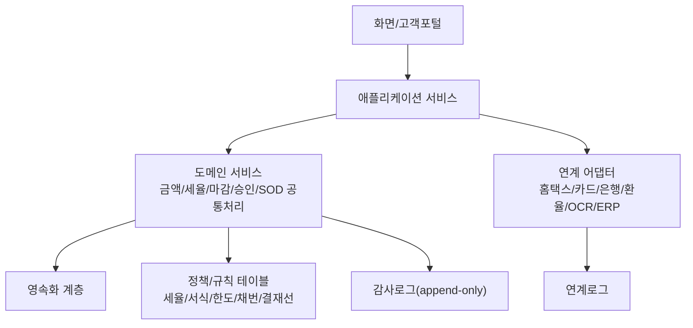
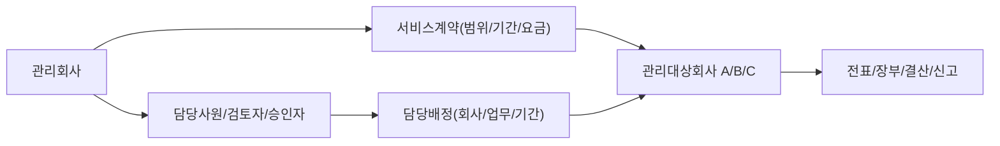
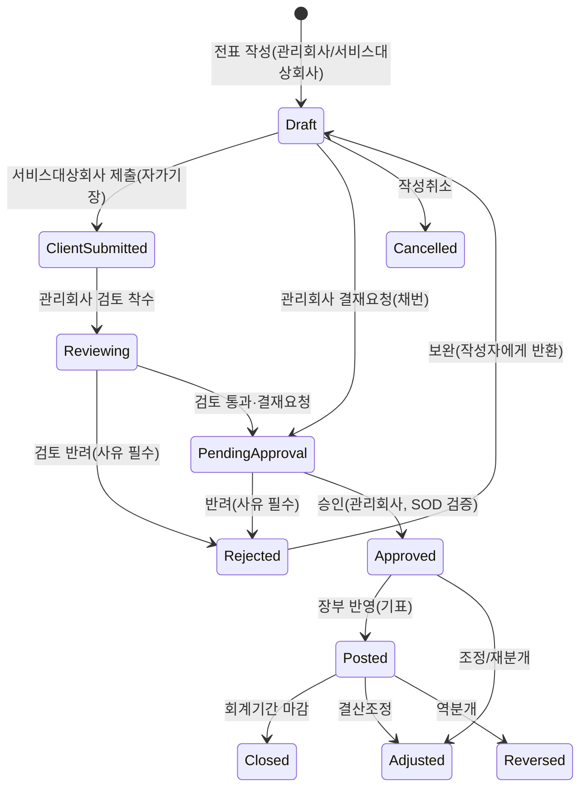
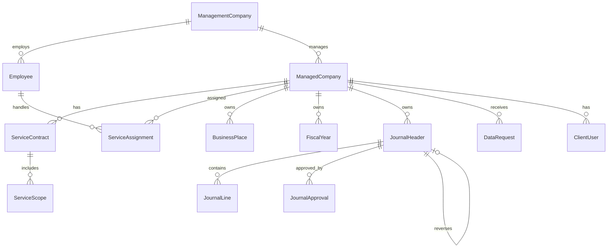

# BK 프로그램 상세 기본설계서

- 원천 문서: `bk_기초설계서.md`, `추가할_내역.md`
- 원천 요구사항: `KAT_요구사항정의서_bk.xlsx` (시트 `요구사항`)
- 작성일: 2026-06-09
- 작성 목적: 기초설계서와 보완 내역을 통합하여 화면설계서·DB설계서·API설계서·배치/연계설계서·테스트시나리오 작성의 직접 기준이 되도록 도메인 규칙, 필드, 상태, 검증, 데이터 모델을 상세 수준으로 정의한다.
- 적용 범위: 회계법인/기장대행사(관리회사)가 다수 고객회사(관리대상회사)에 회계·세무 서비스를 제공하는 통합 회계/세무 시스템.

---

## 1. 문서 체계 및 용어

### 1.1 용어 정의

| 용어 | 영문/코드 | 정의 |
|---|---|---|
| 관리회사 | `ManagementCompany` | 회계서비스를 제공하는 회계법인/기장대행사 |
| 관리대상회사 | `ManagedCompany` | 서비스를 제공받는 고객 회계실체 |
| 담당사원 | `Employee` | 관리대상회사 업무를 수행하도록 배정된 관리회사 사원 |
| 고객 담당자 | `ClientUser` | 관리대상회사 소속 포털 사용자 |
| 전표 | `Journal` | 차변/대변 분개의 집합(헤더 + 라인) |
| 기표 | Posting | 승인 전표를 원장에 반영하는 행위 |
| 가마감 | `TEMP_CLOSED` | 임시 마감(검증 완료, 정식마감 전 상태) |
| 직무분리 | SOD | 작성자-승인자 등 충돌 권한 분리 통제 |

### 1.2 식별자 표기 규칙

- 요구사항 ID는 원천 시트의 `BASE/BKJE/BKES/BKBILL/BKCS` 체계를 그대로 사용한다.
- 본 문서에서 신규 정의하는 보완 항목은 `EXT-xx`로 표기한다.

---

## 2. 요구사항 분석 및 시스템 성격

### 2.1 요구사항 분포

| 구분 | 건수 | ID 범위 | 핵심 업무 |
|---|---:|---|---|
| 기준정보 | 11 | `BASE-01`~`BASE-11` | 회사, 회계연도, 계정, 거래처, 조직, 권한, 부가세, 환율, 공통코드, 전기이월 |
| 전표/장부 | 19 | `BKJE-01`~`BKJE-19` | 전표 입력·승인·조회·마감, 원장, 장부, 통계, 감사대응 |
| 결산 | 8 | `BKES-20`~`BKES-27` | 결산조정, 재무제표, 결산장부, 재분개, 결산보고, 전기이월 |
| 매입매출/부가세/경비 | 10 | `BKBILL-28`~`BKBILL-37` | 매입/매출, 부가세, 전자세금계산서, 미수금, 카드경비 |
| 세무/차량/고정자산 | 19 | `BKCS-38`~`BKCS-56` | 업무용승용차, 법인세 조정, 접대비, 외화평가, 고정자산, 감가상각 |
| 보완(신규) | — | `EXT-01`~`EXT-14` | 채번, SOD, 결산정리분개, 보존정책, 마이그레이션 등 |

### 2.2 시스템 성격

- 내부통제 시스템: 마감·승인·이력·감사로그 중심, 작성자-승인자 직무분리 적용.
- 회계 데이터 허브: 전표를 원천으로 장부·재무제표·세무신고·조정명세서를 파생 생성.
- 외부 인터페이스 시스템: 홈택스/국세청/카드사/은행/환율/ERP/OCR 연계.
- 검증 중심 시스템: 금액 불일치·세법 초과는 자동수정하지 않고 경고/검토대상/오류로 처리.
- 멀티테넌트 운영 시스템: 관리대상회사 단위 데이터 분리, 담당배정 기반 접근통제.

---

## 3. 설계 원칙 및 아키텍처

### 3.1 업무 원칙

1. 전표는 승인 후에만 원장·장부·결산·신고자료에 반영한다.
2. 마감된 기간의 전표·세율·환율·결산자료는 수정/삭제를 제한한다.
3. 금액 불일치·계정 매핑 누락·세법 초과는 자동수정하지 않고 경고/검토/오류로그로 처리한다.
4. 모든 수정·삭제·승인·반려·마감·전송·재전송은 사용자/시각/전후값을 감사로그로 남긴다.
5. 자동분개·자동계산·신고파일 생성은 재실행 시 중복되지 않도록 멱등성을 보장한다.
6. 기준정보는 거래보다 먼저 확정하고, 사용 중 코드는 삭제 대신 비활성화한다.
7. 모든 회계 데이터는 관리대상회사 단위로 분리하고 배정 범위 내에서만 접근한다.
8. 작성자와 승인자는 분리하며(SOD), 내부 검토/승인과 고객확인은 별도 기록한다.

### 3.2 아키텍처 계층

### 3.3 구조 원칙

- 모듈 분리: `서비스운영`, `기준정보`, `전표`, `장부/원장`, `결산`, `매입매출/부가세`, `세무조정`, `고정자산`, `자금/채권채무`, `공통/권한/감사`.
- 금액 계산, 세율 적용, 마감 체크, 승인/SOD 체크는 화면이 아닌 도메인 서비스에서 공통 처리한다.
- 회계/세무 규칙은 코드에 산재시키지 않고 규칙 테이블·정책 서비스로 관리한다.
- 외부 연계는 업무 트랜잭션과 분리한 어댑터 + 연계로그로 처리한다.
- 보고서/출력은 원천 테이블 직접 집계 대신 검증된 집계/뷰/리포트 서비스를 사용한다.
- 관리회사/관리대상회사/담당배정/서비스계약은 모든 업무 데이터의 상위 컨텍스트로 강제한다.

---

## 4. 서비스 운영 모델

### 4.1 운영 구조

### 4.2 서비스 업무 상태

| 상태 | 코드 | 의미 | 통제 |
|---|---|---|---|
| 계약대기 | `PENDING` | 계약 미확정 | 기준정보 입력만 허용, 회계업무 제한 |
| 서비스중 | `ACTIVE` | 계약·배정 완료 | 전표/장부/결산/신고 수행 |
| 자료요청 | — | 증빙/자료 요청 | 포털 알림, 요청기한 관리 |
| 담당처리중 | `IN_PROGRESS` | 담당사원 처리 중 | 진행률/지연 표시 |
| 검토중 | `REVIEWING` | 검토자 검토 | 반려 또는 승인 |
| 고객확인중 | `CLIENT_CONFIRMING` | 고객 확인 필요 | 보고서 확인/이견 등록 |
| 완료 | `COMPLETED` | 기간 업무 완료 | 산출물 보관, 감사로그 확정 |
| 보류/해지 | `SUSPENDED`/`TERMINATED` | 계약 보류/해지 | 신규 업무 제한, 조회정책 적용 |

### 4.3 담당배정 규칙

- 회사별 주담당/부담당, 업무영역별(전표/장부/결산/부가세/법인세/급여경비/고정자산) 담당 분리 지정.
- 회계연도·계약기간 단위 배정 이력 보존.
- 담당자 변경 시 기존 이력 보존 + 미완료 업무 신규 담당자 이관(`WorkTransfer`).
- 미배정 회사는 전표/결산/신고 시작 시 경고 및 차단.

---

## 5. 사용자·권한·직무분리(SOD) 설계

### 5.1 사용자 그룹 분리 원칙

본 시스템의 사용자는 **소속 주체**에 따라 두 그룹으로 완전히 분리하며, 각 그룹은 별도의 사용자 마스터·권한 체계·로그인 도메인을 가진다. 서로의 권한 영역을 침범할 수 없다.

| 사용자 그룹 | 엔티티 | 소속 | 접근 채널 | 데이터 접근 범위 |
|---|---|---|---|---|
| **관리회사 사원** | `Employee` | 관리회사(회계법인/기장대행사) | 업무 시스템(백오피스) | 본인이 배정받은 관리대상회사 + 업무영역 |
| **서비스대상회사(관리대상회사) 사원** | `ClientUser` | 관리대상회사(고객사) | 고객포털 | 본인이 소속된 단일 관리대상회사 |

분리 원칙:

- 두 그룹은 동일 화면을 공유하지 않는다. 관리회사 사원은 업무 시스템, 서비스대상회사 사원은 고객포털(웹/모바일) 전용 화면을 사용한다.
- 서비스대상회사 사원은 본인 소속 회사 데이터만 접근하며, 다른 관리대상회사·관리회사 내부 데이터에는 어떤 경로로도 접근할 수 없다.
- 회계처리의 책임 주체는 기장 운영 모델(5.1.1)에 따라 결정되며, 모든 작성·검토·승인 행위는 행위자 그룹을 식별하여 기록 분리한다.

#### 5.1.1 기장 운영 모델

서비스대상회사도 업무 담당자를 두어 전표를 직접 입력·관리할 수 있다. 관리대상회사별로 다음 운영 모델을 계약·정책으로 선택한다(`ManagedCompany.bookkeepingMode`).

| 모델 | 코드 | 전표 입력 주체 | 검토/승인 주체 | 적용 상황 |
|---|---|---|---|---|
| 대행기장 | `OUTSOURCED` | 관리회사 사원 | 관리회사 사원 | 고객은 자료만 제공, 관리회사가 전부 처리 |
| 자가기장 | `SELF` | 서비스대상회사 업무담당자 | 관리회사 사원(검토/감리) | 고객이 직접 입력, 관리회사가 검토·결산·신고 |
| 혼합 | `HYBRID` | 양측(업무영역별 분담) | 관리회사 사원 | 매출/경비 등은 고객 입력, 결산/세무는 관리회사 |

- 운영 모델과 무관하게 **결산·세무신고·외부 전송·마감의 최종 책임과 권한은 관리회사 사원**에게 귀속된다.
- 자가기장·혼합 모델에서 서비스대상회사 업무담당자가 입력한 전표는 **관리회사 사원의 검토/승인을 거쳐야 원장에 반영**된다(6.6, 6.7 참조).
- 운영 모델은 회계연도/계약 단위로 변경 가능하며, 변경 이력을 보존한다.

### 5.2 관리회사 사원 권한 체계

관리회사 사원은 담당배정(`ServiceAssignment`)을 통해 부여된 관리대상회사·업무영역 범위 내에서 회계업무를 처리한다.

| 역할 | 영역 | 핵심 권한 |
|---|---|---|
| 관리회사 관리자 | 서비스운영 전반 | 관리회사 정보/조직, 계약, 관리대상회사 등록, 담당배정, 전체 현황 |
| 팀장/검토자 | 검토·내부승인 | 담당사원 배정, 진행 모니터링, 검토/반려, 내부 승인 |
| 회계 담당사원 | 배정회사 회계업무 | 전표 작성/수정/조회, 장부 출력, 결산자료 입력 |
| 세무 담당사원 | 세무 | 부가세/법인세/차량/고정자산 세무조정, 신고자료 생성 |
| 결재자/회계책임자 | 승인 | 전표/결산/신고 승인·반려, 결재이력 |
| 감사자 | 감사 | 감사로그/검증리포트 조회(읽기 전용) |
| 시스템 관리자 | 시스템 | Role/메뉴/코드/연계/접근로그 관리 |

관리회사 사원 권한 통제 단위:

- **데이터 범위 권한**: `managementCompanyId` + 담당배정된 `managedCompanyId` 목록 + 업무영역(전표/장부/결산/부가세/법인세/급여경비/고정자산).
- **행위 권한**: 조회/등록/수정/삭제/승인/반려/마감/마감해제/출력/전송.
- **결재 권한**: 결재 단계/금액 한도/대체 결재자.
- 미배정 관리대상회사에 대한 조회·처리는 차단한다.

### 5.3 서비스대상회사(관리대상회사) 사원 권한 체계

서비스대상회사 사원은 고객포털을 통해 본인 소속 회사의 자료 제공·확인 업무를 수행하며, 기장 운영 모델이 `SELF`/`HYBRID`인 경우 **업무 담당자가 전표를 직접 입력·관리**할 수 있다. 단, 입력 전표는 관리회사 검토/승인 전까지 원장에 반영되지 않는다.

| 역할 | 영역 | 핵심 권한 |
|---|---|---|
| 고객 관리자 | 포털 전반 | 자사 포털 사용자 관리(요청), 자료 제공 총괄, 보고서 확인/승인, 자사 업무담당자 권한범위 요청 |
| **고객 업무담당자(경리/회계)** | **전표 입력·관리** | **전표 작성/수정/삭제(자사 미승인분), 결재요청, 매입/매출/경비 전표 입력, 증빙 첨부, 자사 장부/시산표 조회** |
| 고객 자료담당자 | 자료 제공 | 증빙/자료 업로드, 자료요청 응답, 문의 등록 |
| 고객 열람자 | 조회 | 보고서·산출물 열람(다운로드 권한 별도) |

서비스대상회사 사원 권한 통제 단위:

- **데이터 범위 권한**: 본인이 소속된 단일 `managedCompanyId`로 고정(교차 접근 불가).
- **업무담당자 허용 행위**: 전표 작성/수정/삭제(자사 작성·미승인 전표 한정), 전표 결재요청(관리회사로 제출), 매입/매출/경비 전표 입력, 증빙 첨부, 자사 전표/장부/시산표 조회, 자료 업로드, 문의 등록.
- **공통 허용 행위**: 자료요청 확인/응답, 보고서 열람, 고객확인/이견 등록.
- **금지 행위(전 역할 공통)**: 전표 최종승인, 원장 기표, 결산·재무제표 생성, 신고자료 생성·전송, 기준정보(계정/거래처/세율 등) 변경, 회계기간 마감/마감해제, 담당배정, 타 회사 데이터 조회.
- **전표 작성 범위 제한**: 업무담당자는 회사 정책에서 허용한 전표유형(예: `SALES`/`PURCHASE`/`PAYMENT`/`RECEIPT`)만 작성하도록 제한할 수 있으며, 기준정보는 관리회사가 사전 확정한 코드 내에서만 선택한다.
- **확인 행위 기록**: 고객의 보고서 확인·승인은 `ClientConfirmation`으로, 전표 작성은 `JournalHeader.createdBy`(그룹=`CLIENT`)로 기록하며, 관리회사 내부 승인(`JournalApproval`)과 구분된다.

### 5.4 업무 처리 분담 매트릭스

주요 업무에 대한 권한을 분담한다. 서비스대상회사 측은 업무담당자 기준이며, 전표 입력 권한은 기장 운영 모델(`SELF`/`HYBRID`)에서 활성화된다. (○ 가능 / △ 정책·모델에 따라 제한적 허용 / ✕ 불가)

| 업무 | 관리회사 사원 | 서비스대상회사 업무담당자 |
|---|:---:|:---:|
| 증빙/원천자료 업로드 | ○ | ○ |
| 자료요청 생성 | ○ | ✕ |
| 자료요청 응답·자료 제출 | ✕ | ○ |
| 전표 작성/수정/삭제(미승인분) | ○ | △(허용 전표유형·운영모델 한정) |
| 전표 결재요청(제출) | ○ | △(자사 작성 전표) |
| 전표 검토/반려 | ○ | ✕ |
| 전표 최종승인·원장 기표 | ○ | ✕ |
| 자사 전표·장부·시산표 조회 | ○ | △(자사 한정) |
| 결산·재무제표 생성 | ○ | ✕ |
| 부가세·법인세 신고자료 생성/전송 | ○ | ✕ |
| 보고서·산출물 열람 | ○ | ○ |
| 보고서 고객확인/이견 등록 | ✕ | ○ |
| 기준정보 등록/변경 | ○ | ✕(관리회사 확정 코드 선택만) |
| 회계기간 마감/마감해제 | ○ | ✕ |
| 포털 문의 등록/답변 | ○(답변) | ○(등록) |

> 정책 옵션(△): 회사별 기장 운영 모델과 권한 설정에 따라 서비스대상회사 업무담당자의 전표 작성 가능 유형, 조회 가능 장부 범위를 제어한다. 권한 부여 시 범위와 승인 이력을 기록한다. `OUTSOURCED` 모델에서는 전표 작성/조회 권한이 비활성화된다.

### 5.5 직무분리(SOD) 규칙 `EXT-07`

SOD는 (1) 관리회사 사원 내부의 작성-승인 분리와 (2) 서비스대상회사 입력-관리회사 검토/승인 분리를 모두 포함한다.

| 통제 | 규칙 |
|---|---|
| 전표 작성-승인 분리 | 작성자(`createdBy`)와 승인자(`approvedBy`) 동일인 금지(관리회사 사원 내부) |
| 입력-검토 주체 분리 | 서비스대상회사 업무담당자가 입력한 전표의 검토/최종승인은 반드시 관리회사 사원이 수행(자가승인 불가) |
| 기준정보 등록-마감 분리 | 기준정보 등록 권한과 마감/마감해제 권한 분리 |
| 신고자료 생성-제출 분리 | 신고파일 생성자와 제출 승인자 분리 |
| 결재 위임 한도 | 위임/대결 시 금액 한도 및 위임기간 검증 |

- 서비스대상회사 업무담당자는 어떤 운영 모델에서도 자신이 입력한 전표를 스스로 최종승인하거나 원장에 기표할 수 없다.

- SOD 위반 시 저장/승인 차단 또는 예외 승인 로그 기록.
- 1인 운영 소규모 관리대상회사는 SOD 완화 옵션을 회사 단위 정책으로 설정(완화 시 사유/승인 기록).

### 5.6 권한 검증 처리 흐름

모든 업무 API/화면 진입 시 `PermissionService`가 다음 순서로 검증한다.

1. **사용자 그룹 판별**: `Employee`(관리회사) / `ClientUser`(서비스대상회사) 구분.
2. **채널 검증**: 업무 시스템 ↔ 고객포털 채널과 그룹 일치 여부.
3. **데이터 범위 검증**: 관리회사 사원은 담당배정 `managedCompanyId` 목록, 서비스대상회사 사원은 소속 `managedCompanyId` 단일값으로 제한.
4. **운영 모델 검증**: 전표 작성 요청 시 해당 회사 `bookkeepingMode`가 서비스대상회사 입력을 허용(`SELF`/`HYBRID`)하는지, 요청 전표유형이 허용 범위인지 확인.
5. **행위 권한 검증**: 5.4 분담 매트릭스 및 Role 기반 행위 권한 확인.
6. **SOD 검증**: 작성-승인 동일인 여부, 입력(서비스대상회사)-검토/승인(관리회사) 주체 분리.
7. 위반 시 차단하고 `AccessLog` + 보안 이벤트로 기록한다.

### 5.7 인증·로그인 보안 개요

인증은 회계·개인정보를 다루는 시스템의 1차 통제선이다. 모든 사용자(`Employee`, `ClientUser`)는 본 인증 정책을 따르며, 인증 처리는 `AuthService`가 담당한다. 인증 이벤트는 보안 로그(21.9)와 변경이력(21.8)에 기록한다.

- 인증 방식: ID/비밀번호 + 다단계 인증(2FA). 정책에 따라 SSO/외부 IdP 연동 가능.
- 사용자 그룹별 차등: 관리회사 사원(백오피스)은 2FA 필수 등 강한 정책, 고객포털 사용자는 회사 정책에 따라 차등 적용한다.
- 자격증명·세션·인증요소는 업무 데이터와 분리 저장하고, 비밀번호는 복호화 불가 해시로만 보관한다.

### 5.8 비밀번호 정책

| 항목 | 기준(기본값, 정책으로 조정) |
|---|---|
| 최소 길이/복잡도 | 최소 9자 이상, 영문 대/소문자·숫자·특수문자 중 3종류 이상 조합 |
| 저장 | 일방향 해시(bcrypt/Argon2, salt), 평문·복호화 보관 금지 |
| 변경 주기 | 90일 주기 변경 권고/강제(정책 설정), 만료 시 로그인 후 변경 강제 |
| 재사용 제한 | 직전 N개(예: 최근 5개) 비밀번호 재사용 금지(`PasswordHistory`) |
| 변경 제한 | 최소 사용기간(예: 1일) 내 연속 변경 제한, 본인확인 후 변경 |
| 금지 규칙 | ID·이메일·연속/반복 문자·사전단어·기관 공통단어 차단 |
| 초기 비밀번호 | 임시 발급, 최초 로그인 시 변경 강제 |

- 비밀번호 변경·재설정·만료 이벤트는 보안 로그로 기록한다.

### 5.9 다단계 인증(2FA/MFA)

- 지원 수단: OTP 앱(TOTP), SMS/이메일 인증코드, 백업 코드(일회용). 정책에 따라 수단 우선순위 지정.
- 적용 범위: 관리회사 사원은 2FA 필수. 고객포털 사용자는 회사 정책으로 필수/선택 설정.
- 등록/해제: 사용자별 인증수단 등록(`MfaDevice`), 분실 시 관리자 재설정(본인확인·로그 필수).
- 강제 재인증: 민감 작업(권한 변경, 개인정보 평문 조회, 신고자료 전송, 마감해제) 시 2차 인증 재요구(step-up 인증).
- 신뢰 기기/IP: 일정 기간 신뢰 기기 등록 옵션(정책으로 비활성 가능), 신규 기기·신규 위치 로그인 시 추가 인증.

### 5.10 로그인 시도 통제 및 계정 잠금

- 연속 인증 실패 임계치(예: 5회) 초과 시 계정 잠금(`LOCKED`) 및 일정 시간 잠금/관리자 해제.
- 점진적 지연(실패 횟수에 따른 지연), IP 기반 비정상 시도 차단, 무차별 대입(brute-force) 탐지.
- 휴면 계정 처리: 장기 미접속(예: 1년) 계정 비활성화/휴면 전환, 재활성화 시 본인확인.
- 계정 상태: `ACTIVE`, `LOCKED`, `DORMANT`, `SUSPENDED`, `PASSWORD_EXPIRED`, `DISABLED`.

### 5.11 세션 관리

- 세션 타임아웃: 유휴 시간(예: 30분) 초과 시 자동 로그아웃, 절대 세션 수명 제한.
- 동시 세션: 동일 계정 동시 로그인 제한/표시, 신규 로그인 시 기존 세션 종료 옵션.
- 토큰 보안: 세션·토큰은 안전한 속성(HttpOnly/Secure/SameSite) 적용, 재발급·만료 관리.
- 로그아웃: 명시적 로그아웃·전체 기기 로그아웃, 비밀번호 변경 시 기존 세션 일괄 무효화.
- 채널 분리: 업무 시스템과 고객포털 세션은 분리하며 교차 사용 불가.

### 5.12 비밀번호 재설정·계정 복구

- 본인확인 기반 재설정(등록 이메일/휴대폰 인증코드), 재설정 링크·코드 유효시간 제한·1회용.
- 재설정 시 2FA 재확인, 완료 후 기존 세션 무효화 및 사용자 알림.
- 관리자 강제 초기화는 본인확인·사유 기록·임시 비밀번호 강제변경을 동반한다.

### 5.13 로그인 이력 및 이상 로그인 탐지

- `LoginHistory`: 로그인/로그아웃/실패 일시, IP/단말/위치, 인증수단, 성공여부 기록.
- 이상 탐지: 신규 기기·신규 지역·비정상 시간대·다중 실패·불가능 이동(impossible travel) 탐지 시 추가 인증·알림·보안이벤트(`SecurityEvent`, `EXT-13` 알림 연계).
- 사용자는 본인 로그인 이력을 조회하고, 미인지 접속 신고 기능을 제공한다.

### 5.14 인증 관련 엔티티

| 엔티티 | 설명 |
|---|---|
| `UserCredential` | 비밀번호 해시·salt, 만료일, 변경일 |
| `PasswordHistory` | 직전 비밀번호 해시 이력(재사용 방지) |
| `MfaDevice` | 사용자 2FA 수단 등록(TOTP/SMS/이메일/백업코드) |
| `LoginHistory` | 로그인 시도·성공/실패 이력 |
| `UserSession` | 활성 세션/토큰, 발급·만료·기기정보 |
| `TrustedDevice` | 신뢰 기기 등록 |
| `AccountStatus` | 계정 상태(잠금/휴면/만료 등) 및 사유 |

> SSO/외부 IdP(예: OAuth2/OIDC, SAML) 연동 여부와 인증 정책 파라미터(임계치·주기·2FA 범위)는 24장 확인사항으로 확정한다.

---

## 6. 전표 도메인 상세 설계 `BKJE` + 전표 표준기능

전표 모듈은 시스템의 중심 원장 데이터 흐름이다. 모든 결산·부가세·법인세·분석은 승인 전표를 기준으로 생성된다.

### 6.1 전표 유형 체계

| 전표유형 | 코드 | 설명 | 입력방식 |
|---|---|---|---|
| 입금전표 | `RECEIPT` | 현금/예금 입금 (대변 고정) | 약식분개(상대계정만) |
| 출금전표 | `PAYMENT` | 현금/예금 출금 (차변 고정) | 약식분개 |
| 대체전표 | `TRANSFER` | 현금 비수반 일반 분개 | 복식분개 |
| 매입전표 | `PURCHASE` | 매입/매입부가세 | `BKBILL-28` 연동 |
| 매출전표 | `SALES` | 매출/매출부가세 | `BKBILL-29` 연동 |
| 결산전표 | `CLOSING` | 결산정리분개 | `BKES` 연동, 별도 구분/색상 |
| 역분개전표 | `REVERSAL` | 승인전표 취소 분개 | 원전표 참조 |

- 유형별로 채번·결재선·화면 색상을 구분한다.

### 6.2 전표번호 채번 `EXT-01`

- 채번 단위: `managedCompanyId` + 회계연도 + 전표유형(+ 일자).
- 채번 형식(기본): `{회사코드}-{YYYYMM}-{유형}-{6자리순번}` (회사 정책으로 변경 가능, 정책 테이블 관리).
- 채번 시점: **결재요청 시 정식 번호 부여**, 임시저장은 임시키(`tempId`)만 부여.
- 결번 관리: 취소/삭제 전표 번호는 재사용하지 않고 `CANCELLED` 상태로 보존(결번 리포트 제공).
- 동시 채번 경합 방지: `JournalNumberSequence` 테이블 + 행 락 또는 DB 시퀀스로 원자적 채번.

### 6.3 전표 헤더/라인 필드 정의

전표 헤더(`JournalHeader`):

| 필드 | 필수 | 설명 |
|---|---|---|
| `managedCompanyId` | Y | 관리대상회사 |
| `fiscalYear`/`fiscalPeriod` | Y | 회계연도/월 (일자 기준 자동 매핑) |
| `journalNo` | 채번시 | 전표번호 |
| `journalType` | Y | 전표유형 |
| `journalDate` | Y | 전표일자(기표일) |
| `entryDate` | N | 발생일(거래일), 필요 시 분리 |
| `status` | Y | 전표 상태 |
| `currency`/`exchangeRate` | 외화시 | 통화/적용환율 |
| `headerNarration` | N | 헤더 적요 |
| `sourceModule`/`sourceDocNo` | N | 원천 모듈/문서번호 |
| `autoRuleId` | N | 자동분개 규칙 ID |
| `approvalLineId` | 승인시 | 결재선 |
| `createdBy`/`approvedBy` | — | 작성자/승인자(SOD 검증) |
| `createdByGroup` | Y | 작성자 그룹(`MGMT`=관리회사 / `CLIENT`=서비스대상회사) |
| `reviewedBy` | 검토시 | 관리회사 검토자(고객 입력 전표 검토) |
| `inputSource` | Y | 입력경로(`MGMT_DIRECT`/`CLIENT_SELF`/`AUTO`/`UPLOAD`) |

전표 라인(`JournalLine`):

| 필드 | 필수 | 설명 |
|---|---|---|
| `accountId` | Y | 계정과목 |
| `drCr` | Y | 차/대 구분(라인당 한쪽만) |
| `amount` | Y | 금액(0/음수 검증) |
| `foreignAmount` | 외화시 | 외화금액 |
| `customerVendorId` | 조건부 | 계정 속성상 필수 시 강제 |
| `departmentId`/`projectId`/`siteId` | 조건부 | 관리항목 필수 시 강제 |
| `employeeId` | 조건부 | 사원 관리 계정 |
| `vatCode` | 조건부 | 부가세 계정 시 |
| `noteId`/`bankAccountId` | 조건부 | 어음/예금 보조부 계정 |
| `quantity`/`unitPrice` | N | 수량/단가 관리 계정 |
| `lineNarration` | N | 라인 적요 |
| `evidenceType`/`evidenceNo` | 조건부 | 증빙 구분/번호 |

### 6.4 분개 입력 보조 (생산성)

- 차대변 자동 균형: 마지막 라인 잔액 자동 채우기.
- 계정 즐겨찾기/최근사용/연상검색, 적요 코드·즐겨찾기(헤더/라인 분리).
- 계정별 필수 관리항목 강제(거래처/부서/프로젝트/카드/어음/예금/수량).
- 부가세 자동분개: 공급가액 입력 시 세액·부가세대급금/예수금 라인 자동 생성, 합계 역산.
- 복사전표, 템플릿전표(`JournalTemplate`), 반복(예약)전표(`RecurringJournal`, `BASE-09` 연계), 역분개(빨간전표, 원전표-역전표 연결), 엑셀 일괄 업로드(양식 검증·오류행 리포트·일괄 미리보기), 임시저장(미결함).

### 6.5 외화 전표 `BASE-08` 연계

- 통화·적용환율·원화환산액 자동 계산, 외화금액 입력 시 환율 자동 적용.
- 환율 수동 보정은 전후값/사유/사용자 이력 기록.
- 결산 시 외화채권채무 환산손익 자동 계상(`BKCS-45` 연계).

### 6.6 전표 생명주기

서비스대상회사 업무담당자가 작성한 전표는 `ClientSubmitted` → 관리회사 `Reviewing`(검토)을 거쳐 결재·기표된다. 관리회사 직접 입력 전표는 검토 단계를 생략하고 `PendingApproval`로 진행할 수 있다. 검토 반려 시 작성자(고객 업무담당자)에게 반환되며 사유가 고객포털에 표시된다.

전표 상태별 통제:

| 상태 | 코드 | 수정 | 삭제 | 장부반영 | 결산반영 | 통제 |
|---|---|---|---|---|---|---|
| 작성중 | `DRAFT` | 가능 | 가능 | 불가 | 불가 | 필수값/차대변 검증 |
| 고객제출 | `CLIENT_SUBMITTED` | 작성자(고객) 제한 | 제한 | 불가 | 불가 | 관리회사 검토 대기, 채번 |
| 검토중 | `REVIEWING` | 검토자 보정 가능 | 불가 | 불가 | 불가 | 관리회사 검토자 지정 |
| 승인요청 | `PENDING_APPROVAL` | 제한 | 제한 | 불가 | 불가 | 결재선/권한 검증 |
| 반려 | `REJECTED` | 가능 | 가능 | 불가 | 불가 | 반려사유 필수, 작성자 그룹에 반환 |
| 승인 | `APPROVED` | 제한 | 제한 | 가능 | 가능 | 승인자/시각, SOD |
| 장부반영 | `POSTED` | 조정전표로만 | 불가 | 가능 | 가능 | 원장 이력 보존 |
| 조정 | `ADJUSTED` | 제한 | 불가 | 가능 | 가능 | 조정사유/원전표 연결 |
| 역분개 | `REVERSED` | 불가 | 불가 | 반대반영 | 반영 | 원전표 참조 보존 |
| 마감 | `CLOSED` | 불가 | 불가 | — | — | 마감해제 권한 필요 |
| 취소 | `CANCELLED` | 불가 | 불가 | 불가 | 불가 | 결번 보존 |

### 6.7 결재·승인 및 고객 입력 전표 검토 흐름

전표 결재는 공통 전자결재 시스템(7장)을 결재대상 `JOURNAL`로 호출한다. 결재선/전결·대결/결재함/이력은 7장 규칙을 따르며, 본 절은 전표 고유의 검토 흐름을 정의한다.

- **관리회사 직접 입력(대행기장)**: 작성 → 결재요청 → 승인 → 기표. 결재선 자동 산정(금액 한도/전표유형/부서) + 수동 지정.
- **서비스대상회사 입력(자가/혼합기장)**: 고객 업무담당자 작성 → 제출(`CLIENT_SUBMITTED`) → 관리회사 검토자 검토(`REVIEWING`) → 결재요청 → 관리회사 승인 → 기표.
  - 검토 단계에서 관리회사 검토자는 계정/거래처/부가세코드/금액을 보정할 수 있으며, 보정 시 원입력값을 이력으로 보존한다.
  - 검토 반려는 고객포털에 사유·보정요청과 함께 표시되고, 고객 업무담당자가 보완 후 재제출한다.
  - 고객 입력 전표는 검토·승인 완료 전까지 원장·시산표·결산에 반영되지 않는다.
- 전결/대결/위임, 부재중 대결자, 위임기간·한도 검증.
- 일괄 검토/승인/반려, 검토 대기함·결재 대기함·처리함, 진행현황(입력경로별 필터 제공).
- SOD: 작성자=승인자 차단, 고객 입력 전표의 검토/승인은 관리회사 사원만 수행. 승인 시 장부 자동 기표(`PostingService`).

### 6.8 동시성·상태 표시 `EXT-04`

- 전표 단건 동시 수정 방지(낙관적 락 `version` 컬럼; 충돌 시 재조회 안내).
- 마감/배치 실행 중 대상 기간 입력 잠금(가마감 잠금).
- 전표 유형/상태별 색상·아이콘, 미결/반려/오류 빠른 필터 및 대기 카운트.

### 6.9 전표 출력 `BKJE-17`

- 입금/출금/대체전표 인쇄 양식, 분개장 출력.
- 다건 일괄 출력, PDF/Excel, 전표+증빙 합본 출력.

### 6.10 전표/장부 기능 매핑

| ID | 기능 | 핵심 처리 | 통제/예외 |
|---|---|---|---|
| `BKJE-01` | 전표입력 | 수기/자동/템플릿, 차대변 균형, 부가세 자동라인 | 불균형/필수누락 차단 |
| `BKJE-02` | 자동전표 | 매출/매입/급여/감가상각 자동생성 | 중복 금지, 실패로그 |
| `BKJE-03` | 수정/삭제 | 이력기록, 마감월 차단, 권한별 범위 | 무권한 차단 |
| `BKJE-04` | 승인/결재 | 결재선, 승인 시 기표, SOD | 미결재 반영 금지 |
| `BKJE-05` | 조회/검색 | 다차원 검색, Drill-down, Excel | 개인정보 마스킹 |
| `BKJE-06` | 마감 | 월 마감, 미결검증, 이월준비 | 마감 후 추가 금지 |
| `BKJE-07` | 첨부/증빙 | 세금계산서/영수증 첨부, OCR, 매칭 | 유형/용량 제한, 바이러스 검사 |
| `BKJE-08` | 검증/감사로그 | 이력저장, 이상탐지, append-only 로그 | 로그 변조 방지(해시체인) |
| `BKJE-09` | 자동분개규칙 | 거래유형별 매핑, 단가/수량 계산 | 규칙오류 검증요청 |
| `BKJE-10` | 통계/분석 | 유형/계정/부서 집계, 이상패턴 | 분석자료로 재무제표 직접수정 금지 |
| `BKJE-11` | 총계정원장 | 차대변 합계/잔액, PDF/Excel | 미승인분 제외 |
| `BKJE-12` | 보조원장 | 계정-거래처 보조부 | 미등록 거래처 자동배제 금지 |
| `BKJE-13` | 거래처원장 | 미수/미지급/이월잔액, aging 연계 | 취소전표 제외 |
| `BKJE-14` | 일계표/월계표 | 일/월 집계·누적 | 기간 불일치 중단 |
| `BKJE-15` | 시산표 | 차변합계=대변합계 검증 | 불일치 자동수정 금지 |
| `BKJE-16` | 부서/사원별 장부 | 부서/사원 집계 | 인사DB 미연동 시 오집계 금지 |
| `BKJE-17` | 장부출력 | 양식별 출력, PDF/Excel | 비승인 포함 금지 |
| `BKJE-18` | 손익/원가 | 손익/원가 분류·집계 | 원가계정 미지정 누락 금지 |
| `BKJE-19` | 감사대응 | 재무제표-계정 매핑, 외부보고 | 매핑 자동수정 금지 |

---

## 7. 전자결재(결재) 시스템

전표·결산·신고 등 주요 업무의 승인/반려는 공통 전자결재 시스템으로 처리한다. 각 업무 모듈(6.7 전표 결재 등)은 본 결재 엔진을 호출하며, 결재선·결재방식·전결/대결/위임·결재함·이력·알림을 일원화하여 관리한다. `ApprovalService`가 결재 상태와 단계 전이를 책임진다.

### 7.1 결재 대상 문서

결재는 단일 모듈에 한정되지 않고, 결재가 필요한 모든 업무 문서를 공통 처리한다.

| 결재대상 코드 | 문서 | 연계 모듈 |
|---|---|---|
| `JOURNAL` | 전표 승인 | `BKJE`(6장) |
| `CLOSING` | 결산 확정/마감 | `BKES`(10장) |
| `PERIOD_REOPEN` | 마감 해제 | `BKES`/`BASE` |
| `VAT_FILING` | 부가세 신고자료 제출 | `BKBILL`(11장) |
| `CORP_TAX_FILING` | 법인세 신고자료 제출 | `BKCS`(12장) |
| `EXPENSE` | 지출결의/경비 승인 | `BKBILL-36` |
| `TAX_INVOICE` | 전자세금계산서 발행 | `BKBILL-31` |
| `MASTER_CHANGE` | 중요 기준정보 변경(계정/세율 등) | `BASE` |

- 결재 대상은 공통 헤더(`ApprovalRequest`)로 추상화하고, 원문서는 `targetType`+`targetId`로 연결한다.
- 신규 결재 대상 추가 시 결재 엔진 수정 없이 결재대상 코드/규칙 등록만으로 확장한다.

### 7.2 결재선(Approval Line) 설계

결재선은 단계(Step)의 순서 집합이며, 단계별 결재자 유형과 결재 방식을 가진다.

| 결재자 유형 | 코드 | 설명 |
|---|---|---|
| 기안 | `DRAFT` | 결재를 상신하는 작성자 |
| 검토 | `REVIEW` | 내용 검토(고객 입력 전표 검토 포함) |
| 협의 | `AGREEMENT` | 합의/협조 부서(병렬 가능) |
| 승인 | `APPROVAL` | 단계별 승인자 |
| 전결 | `FINAL` | 위임된 최종 결재권자 |
| 참조/통보 | `REFERENCE` | 결재 후 열람만 |

결재선 산정:

- **자동 산정**: 관리대상회사·업무영역·전표유형·금액 한도·부서를 입력으로 `ApprovalRule`에서 결재선을 결정한다.
- **수동 지정**: 자동 산정 결과를 기안자가 정책 범위 내에서 보정(추가 결재자/참조자) 가능.
- **금액 한도 단계화**: 예) 100만원 이하 1단계, 1천만원 이하 2단계, 초과 시 책임자 단계 추가.
- 결재선 변경 이력은 보존하며, 진행 중 결재의 결재선은 임의 변경하지 않는다(긴급 시 회수 후 재상신).

### 7.3 결재 방식

| 방식 | 코드 | 설명 |
|---|---|---|
| 순차결재 | `SEQUENTIAL` | 단계 순서대로 진행, 이전 단계 승인 후 다음 단계 활성화 |
| 병렬결재 | `PARALLEL` | 동일 단계 복수 결재자 동시 진행 |
| 합의(전원) | `ALL` | 병렬 결재자 전원 승인해야 통과 |
| 선택(택1) | `ANY` | 병렬 결재자 중 1인 승인 시 통과 |
| 후결 | `POST` | 긴급 처리 후 사후 결재(사유 필수, 별도 표시) |

### 7.4 전결·대결·위임

| 기능 | 규칙 |
|---|---|
| 전결 | 위임된 전결권자가 상위 결재를 갈음. 전결 규칙(금액/문서유형)과 전결권자 이력 관리 |
| 대결 | 결재자 부재 시 지정 대결자가 대신 결재. 원결재자/대결자 모두 기록 |
| 위임 | 위임자→수임자, 위임기간·금액한도·문서범위 지정. 위임 종료 시 자동 환원 |
| 부재중 자동대결 | 결재자 부재(휴가) 설정 시 지정 대결자에게 자동 라우팅 |

- 위임/대결/전결 시 실제 결재자와 권한 위임 근거(`ApprovalDelegation`)를 함께 기록한다.

### 7.5 결재함 및 처리

화면 단위 결재함을 제공한다.

| 결재함 | 내용 |
|---|---|
| 기안함 | 본인이 상신한 문서(진행/완료/반려) |
| 결재 대기함 | 본인 결재 차례인 문서 |
| 진행함 | 결재 진행 중 문서 |
| 완료함 | 결재 완료 문서 |
| 반려함 | 반려/회수 문서 |
| 참조/수신함 | 참조·통보 문서 |

처리 기능: 승인, 반려(사유 필수), 보류, 회수(상신자), 전달/추가지정, 의견(코멘트)·첨부, **일괄 결재**(동일 유형 다건), 결재선 미리보기, 처리기한 표시.

### 7.6 결재 상태 및 이력

| 결재상태 | 코드 |
|---|---|
| 임시저장 | `DRAFT` |
| 상신(진행중) | `IN_PROGRESS` |
| 승인완료 | `APPROVED` |
| 반려 | `REJECTED` |
| 회수 | `WITHDRAWN` |
| 전결처리 | `FINALIZED` |
| 후결대기 | `POST_PENDING` |

- 단계별 처리자·일시·결과·의견을 `ApprovalHistory`에 append-only로 기록(위변조 방지, 20장 연계).
- 결재 완료 시 원문서 상태를 자동 전이한다(예: 전표 `APPROVED`→기표, 신고자료 `SUBMITTED` 가능 상태).
- 결재 회수/반려는 원문서를 작성 단계로 되돌리고 사유를 전달한다.

### 7.7 결재 알림

- 결재요청 도착, 반려, 완료, 처리기한 임박/초과 시 알림(이메일/SMS/메신저/포털, `EXT-13` 연계).
- 서비스대상회사 업무담당자가 상신한 전표의 검토/반려 결과는 고객포털 알림으로 전달한다.
- 결재 지연(SLA 초과) 건은 배치(17장)로 집계하여 상위자에게 에스컬레이션한다.

### 7.8 두 사용자 그룹 결재 연계

- 서비스대상회사 업무담당자의 전표 제출(`CLIENT_SUBMITTED`)은 결재 대상 `JOURNAL`의 **기안(`DRAFT`)→검토(`REVIEW`)** 단계로 매핑된다.
- 검토 단계 결재자는 반드시 관리회사 사원이며, 고객은 결재선의 승인/전결 단계에 배치되지 않는다(SOD, 5.5).
- 고객은 자신이 상신한 문서의 진행 상태를 고객포털 기안함에서 조회한다(타사·관리회사 내부 결재선 상세는 비공개).

### 7.9 결재 엔티티

| 엔티티 | 설명 |
|---|---|
| `ApprovalRule` | 결재선 자동 산정 규칙(문서유형/금액/부서/업무영역/회사) |
| `ApprovalLine` | 결재선(단계 집합) 정의 |
| `ApprovalStep` | 결재선 단계(순서, 결재자 유형, 결재방식) |
| `ApprovalRequest` | 결재 문서 헤더(targetType/targetId, 상태) |
| `ApprovalStepInstance` | 상신된 문서의 단계별 진행 인스턴스 |
| `ApprovalHistory` | 단계별 처리 이력(처리자/일시/결과/의견, append-only) |
| `ApprovalDelegation` | 위임/대결/전결 설정 및 이력 |
| `ApprovalComment`, `ApprovalAttachment` | 결재 의견/첨부 |

### 7.10 결재 API

| Method | URI | 설명 |
|---|---|---|
| `POST` | `/api/approvals/requests` | 결재 상신(targetType/targetId, 결재선) |
| `GET` | `/api/approvals/inbox` | 결재 대기함 조회 |
| `POST` | `/api/approvals/{id}/approve` | 승인 |
| `POST` | `/api/approvals/{id}/reject` | 반려(사유 필수) |
| `POST` | `/api/approvals/{id}/withdraw` | 회수(상신자) |
| `POST` | `/api/approvals/{id}/delegate` | 전달/대결 지정 |
| `POST` | `/api/approvals/batch-approve` | 일괄 승인 |
| `GET` | `/api/approvals/{id}/history` | 결재 이력 조회 |
| `POST` | `/api/approval-rules` | 결재 규칙 등록 |
| `POST` | `/api/approval-delegations` | 위임 설정 |

### 7.11 결재 통제 규칙

- 작성자=승인자 금지(SOD), 고객 상신 전표의 검토/승인은 관리회사 사원만 수행.
- 마감/마감해제, 신고자료 제출, 중요 기준정보 변경은 결재 완료 후에만 효력 발생.
- 결재 진행 중 원문서는 수정 잠금(보정 필요 시 회수/반려 후 수정).
- 모든 결재 처리는 사용자·시각·전후 상태를 감사로그로 남긴다.
- 결재선 미설정 문서는 상신 차단(자동 산정 실패 시 관리자에게 결재선 등록 요청).

---

## 8. 기준정보 모듈 상세 `BASE`

기준정보는 모든 거래·결산의 선행조건이다.

| ID | 기능 | 핵심 처리 | 산출물 |
|---|---|---|---|
| `BASE-01` | 회사기초정보 | 회사 등록, 사업자번호 형식/중복 검증, 결산월 기준 회계기간 생성, 계정체계 템플릿 매핑 | 회사기본정보, 관리회사-관리대상회사 매핑 |
| `BASE-02` | 회계연도 | 연도/월 생성, 마감여부, 중복/공백 검증 | 회계기간마스터, 마감플래그 |
| `BASE-03` | 계정과목 | 코드 생성, 상하위 검증, 재무제표 매핑, **계정성격/정상잔액·통제계정·관리항목 강제 속성** (`EXT-02`) | 계정마스터, 재무제표 매핑표 |
| `BASE-04` | 거래처 | 사업자번호 검증 API, 과세유형 추천, 중복/폐업 차단 | 거래처마스터 |
| `BASE-05` | 부서/프로젝트/현장 | 손익분석 기준코드, 종료 코드 사용제한 | 부서/프로젝트/현장 마스터 |
| `BASE-06` | 사용자/권한 | 사원/고객 사용자 등록, Role, 담당배정 기반 권한, 결재라인 반영, 인증·로그인 정책(비밀번호·2FA·잠금, 5.7~5.14), 접근로그 | 사용자권한, 담당배정표, 인증정보, 접근로그 |
| `BASE-07` | 부가세코드 | 과세유형별 세율/적용기간, 변경이력, 과거기간 수정제한 | 부가세코드, 과세유형 매핑 |
| `BASE-08` | 통화/환율 | 적용일 환율 자동적용, 이력관리, 외화전표 검증 | 환율마스터, 적용환율로그 |
| `BASE-09` | 자동분개 규칙 | 반복거래 스케줄, 계정 매핑 검증, 실행로그 | 자동분개테이블, 분개결과로그 |
| `BASE-10` | 공통코드 | 결제수단/지급조건/거래유형 코드, 중복검증, 사용여부 | 공통코드, 적용이력 |
| `BASE-11` | 전기이월 설정 | 결산완료 검증, 잔액 이월 검증, 미완료 차단 | 전기이월 설정, 로그 |

계정 속성 확장 `EXT-02`:

- `accountNature`(자산/부채/자본/수익/비용), `normalBalance`(차변/대변).
- `isControlAccount`(거래처 보조부 강제), `requiredDimensions`(거래처/부서/프로젝트/카드/어음/예금/수량 중 필수항목), `carryForward`(이월대상 여부), `usage`(결산용/관리용/통계용).

기준정보 공통 검증: 코드 중복 금지, 사용 중 코드 삭제 금지, 적용기간 중복 금지, 마감기간 소급수정 제한, 변경 전후값 감사로그.

### 8.1 다중 회계기준 지원 및 외부 데이터 변환 입력 `EXT-17`

본 시스템은 복수 회계기준을 지원하고, 외부(타 시스템·해외법인·그룹 본사 등)에서 작성된 **다른 회계기준의 데이터를 수신하여 매핑·변환 후 입력**할 수 있다.

지원 회계기준(`AccountingStandard`):

| 기준코드 | 명칭 | 비고 |
|---|---|---|
| `K_GAAP` | 일반기업회계기준 | 국내 기본 |
| `K_IFRS` | 한국채택국제회계기준 | 상장/연결 |
| `US_GAAP` | 미국 회계기준 | 해외법인/그룹 본사 |
| `IFRS` | 국제회계기준 | 해외 |
| `JP_GAAP` 등 | 기타 국가 기준 | 확장 가능 |

- 기준 마스터 속성: 기준코드, 국가, 버전, 기본 통화·회계달력, 재무제표 항목 체계.
- **회사별 적용 기준**: 회사는 주재무제표 기준(primary)과 병행 보고 기준(secondary)을 지정한다.
- **병행원장(`LedgerBook`)**: 동일 거래를 복수 회계기준으로 표현(주원장/병행원장). 기준 간 차이는 조정분개로 관리한다.

변환 입력 구성요소:

| 요소 | 엔티티 | 설명 |
|---|---|---|
| 원천 포맷 정의 | `ImportTemplate` | Excel/CSV/XML/XBRL/API 컬럼-필드 매핑 정의 |
| 계정 매핑 | `ChartMapping` | 원천(타 기준) 계정 ↔ 자사/표준 계정 매핑 |
| 기준 변환 규칙 | `StandardConversionRule` | 기준쌍별 재분류·조정(리스/수익인식/대손/금융상품 차이 등) |
| 통화 환산 | `FxTranslation` | 거래/기말/평균 환율 적용 |
| 기간 매핑 | `PeriodMapping` | 타국 회계연도/기간 ↔ 자사 회계기간 |

변환 입력 흐름:

통제:

- 멱등성: 원천 문서키/배치키 중복 수신 방지.
- 미매핑 계정·미정의 변환규칙은 자동 추정하지 않고 **검토대상/오류**로 처리(반영 차단).
- 차대변 불균형·필수 누락 행은 오류행 리포트로 분리, 부분 반영 금지(또는 검토 후 선택 반영).
- 변환 전/후값, 적용 규칙·버전, 환율, 수행자·시각을 `ConversionLog`로 감사 기록.
- 기준 간 차이(GAAP difference)는 `ConversionDifference`로 보존하며 임의 덮어쓰기 금지.
- 마감/신고 완료 기간으로의 변환 반영은 제한(조정 절차 필요).

---

## 9. 장부/원장 상세

- 총계정원장(`GeneralLedger`): 승인전표 라인 집계, 계정별 차대변 합계·잔액·이월잔액.
- 보조원장(`SubLedger`): 계정-거래처/부서/프로젝트 등 관리항목 기준 집계.
- 거래처원장(`CustomerLedger`): 미수/미지급, 이월잔액, **연령분석(aging) 연계** (`EXT-11`).
- 시산표(`TrialBalance`): 차변합계=대변합계 검증, 불일치 계정 목록화(자동수정 금지).
- 일계표/월계표: 일/월 단위 합계·누적.
- 장부 반영 기준: `POSTED` 이상 상태만 집계, `CANCELLED`/미승인 제외.

---

## 10. 결산 모듈 상세 `BKES`

### 10.1 결산 처리 순서

1. 미승인/미결 전표 확인 → 2. 전표 마감·장부 집계 → 3. 시산표 검증 → 4. 결산조정/재분개 → 5. 재무제표 생성 → 6. 결산장부·보고서 → 7. 감사로그/검증리포트 확정 → 8. 전기이월.

### 10.2 결산정리분개 자동화 `EXT-03`

결산전표(`CLOSING`)로 생성하는 표준 자동분개 대상:

| 분개 항목 | 근거 데이터 | 비고 |
|---|---|---|
| 감가상각비 계상 | `DepreciationSchedule`(`BKCS-53`) | 회계/세무 분리 |
| 대손충당금 설정/환입 | 채권 잔액·연령분석 | 한도 검증 |
| 퇴직급여충당부채 | 인사 연계 | 연계자료 기반 |
| 미지급비용/선급비용 | 경과계정 규칙 | 기간배분 |
| 미수수익/선수수익 | 경과계정 규칙 | 기간배분 |
| 재고자산 평가 | 재고 자료 | 저가법 등 |
| 외화환산손익 | `BKCS-45` | 기말환율 |
| 법인세비용/이연법인세 | `BKCS` 조정 | 신고 연계 |

- 자동분개 규칙(`ClosingAutoEntryRule`)로 관리, 재실행 시 멱등성 보장.

### 10.3 기능 매핑

| ID | 기능 | 산출물 |
|---|---|---|
| `BKES-20` | 결산자료 입력/조정 | 조정전표 리포트, 조정내역 로그 |
| `BKES-21` | 결산재무제표 생성 | 결산 재무제표 |
| `BKES-22` | 결산장부 관리 | 결산장부 리포트 |
| `BKES-23` | 조정/재분개 | 조정내역 리포트, 이력 로그 |
| `BKES-24` | 결산검증/감사로그 | 감사로그, 검증리포트 |
| `BKES-25` | 결산보고/외부제출 | 결산보고서, 제출용 재무자료 |
| `BKES-26` | 결산데이터 수집/검증 | 결산보고서(확정분만) |
| `BKES-27` | 전기이월 처리 | 전기이월 장부, 초기잔액 보고서 |

---

## 11. 매입매출/부가세/경비 모듈 상세 `BKBILL`

### 11.1 기능 매핑

| ID | 기능 | 산출물 |
|---|---|---|
| `BKBILL-28` | 매입전표 | 매입전표 리스트, 분개 반영 |
| `BKBILL-29` | 매출전표 | 매출전표 집계, 발행내역 |
| `BKBILL-30` | 부가세 빠른입력 | 부가세신고서, 과세표준집계표 |
| `BKBILL-31` | 전자세금계산서 발행 | XML/PDF, 발행이력 |
| `BKBILL-32` | 전자세금계산서 수신 | 수신목록, 매입 자동분개 |
| `BKBILL-33` | 미수금 청구서 | 청구서, 청구이력 |
| `BKBILL-34` | 미수금 회수 | 회수내역, 거래처 잔액현황 |
| `BKBILL-35` | 카드경비 수집 | 경비명세 초안, 카드사용리스트 |
| `BKBILL-36` | 경비 승인/회계반영 | 승인내역, 부서별 집계 |
| `BKBILL-37` | 부가세 신고자료 생성 | 부가세신고서, 과세표준명세표 |

### 11.2 사업장 단위 처리 `EXT-08`

- `BusinessPlace`(주사업장/종사업장) 엔티티, 사업장별 신고단위 처리, 사업자단위과세 옵션, 사업장 간 내부대체 처리.

### 11.3 부가세 신고 유형 `EXT-09`

- 예정/확정 신고, 수정신고/경정청구, 기한후신고 구분.
- 가산세 계산(과소신고/납부지연), 전자신고 세액공제 반영.

### 11.4 증빙 처리 `EXT-12`

- 적격증빙 판정(세금계산서/계산서/카드/현금영수증/간이영수증), 증빙불비 가산세 대상 자동 표시.
- 첨부 스토리지 정책, 허용 확장자/최대 용량, 바이러스 검사.

### 11.5 전자세금계산서 통제

- 승인 전 매출전표 발행 불가, 공급가-세액 불일치 자동수정 금지(오류 표시).
- 전송 실패 건 재전송 대기 큐, 발행/수신/재전송/취소 상태 이력, 거래처 코드 불일치 시 수동매칭.

---

## 12. 세무/차량/고정자산 모듈 상세 `BKCS`

| ID | 기능 | 산출물 |
|---|---|---|
| `BKCS-38` | 운행기록부 등록 | 운행기록부, 업무비율계산표 |
| `BKCS-39` | 차량비용 입력/분류 | 차량별비용명세서, 세무조정내역 |
| `BKCS-40` | 운행기록-비용 대사 | 업무/비업무 구분표 |
| `BKCS-41` | 업무용승용차 세무조정 | 세무조정자료, 신고첨부 엑셀 |
| `BKCS-42` | 감가상각비 한도적용 | 차량별 감가상각비명세서 |
| `BKCS-43` | 비업무용비용 판정 | 업무/비업무판정표 |
| `BKCS-44` | 접대비 자동분류 | 접대비명세, 조정파일 |
| `BKCS-45` | 외화평가손익 세무조정 | 외화평가손익계산서 |
| `BKCS-46` | 손익-부가세 비교 | 매출차이분석리포트 |
| `BKCS-47` | 법인세신고 연계자료 | 별지 제63호 서식, XML |
| `BKCS-48` | 차량비용 예산/손익 연동 | 예산대비비용현황표 |
| `BKCS-49` | 세무조정 전표 자동생성 | 세무조정전표 |
| `BKCS-50` | 세무검증 리포트 | 세무검증리포트 |
| `BKCS-51` | 고정자산 등록 | 자산등록내역서, 고정자산대장 |
| `BKCS-52` | 고정자산대장/이력 | 관리대장, 감가상각비명세 |
| `BKCS-53` | 월별 감가상각 | 월별감가상각명세, 자동전표 |
| `BKCS-54` | 미상각/잔존가치 | 미상각감가상각계산서 |
| `BKCS-55` | 양도자산 제거 | 자산처분내역서, 처분손익명세서 |
| `BKCS-56` | 감가상각명세/법인세 연동 | 감가상각비조정명세서 |

세무조정 공통 원칙: 기준값/한도/서식은 적용기간별 관리, 수동수정 시 원금액/수정금액/사유/승인자 기록, 신고-장부 차이는 조정내역으로 보존(임의 덮어쓰기 금지), 신고파일 생성 후 제출상태/제출일/파일해시/생성자 기록.

원천징수·지방세·4대보험 연계 범위 `EXT-10`는 확인사항(24장)으로 분리(서비스 범위 확정 후 상세설계).

---

## 13. 자금·채권채무 관리 `EXT-11`

| 기능 | 처리 | 산출물 |
|---|---|---|
| 어음 보조부 | 받을/지급어음 어음번호·만기·결제상태 관리 | 어음명세, 만기도래표 |
| 예금/당좌 관리 | 계좌별 잔액 연동, 입출금 대사 | 예금잔액현황 |
| 채권/채무 연령분석 | 거래처별 미수/미지급 aging | 연령분석표 |
| 여신한도 관리 | 거래처별 한도 설정/초과 경고 | 여신현황 |
| 미수금 회수 대사 | 입금자료 대사, 외상매출금 차감 | 회수내역 |

---

## 14. 데이터 모델

### 14.1 핵심 엔티티

| 영역 | 엔티티 |
|---|---|
| 서비스운영 | `ManagementCompany`, `ManagedCompany`, `ServiceContract`, `ServiceScope`, `ServiceAssignment`, `WorkTransfer` |
| 회사/기간 | `Company`, `FiscalYear`, `FiscalPeriod`, `ClosingStatus`, `BusinessPlace` |
| 기준정보 | `Account`, `AccountHierarchy`, `FinancialStatementMapping` |
| 거래처/조직 | `CustomerVendor`, `Department`, `Project`, `Site`, `EmployeeRef` |
| 권한 | `User`, `Employee`, `ClientUser`, `Role`, `Permission`, `AccessLog` |
| 인증/로그인 | `UserCredential`, `PasswordHistory`, `MfaDevice`, `LoginHistory`, `UserSession`, `TrustedDevice`, `AccountStatus` |
| 결재 | `ApprovalRule`, `ApprovalLine`, `ApprovalStep`, `ApprovalRequest`, `ApprovalStepInstance`, `ApprovalHistory`, `ApprovalDelegation`, `ApprovalComment`, `ApprovalAttachment` |
| 세금/환율 | `VatCode`, `VatRateHistory`, `Currency`, `ExchangeRate` |
| 전표 | `JournalHeader`, `JournalLine`, `JournalApproval`, `JournalAttachment`, `JournalHistory` |
| 장부 | `GeneralLedger`, `SubLedger`, `CustomerLedger`, `TrialBalance`, `LedgerBalance` |
| 결산 | `ClosingBatch`, `ClosingAdjustment`, `FinancialStatement`, `FinancialStatementLine`, `CarryForwardBalance` |
| 매입매출 | `PurchaseSlip`, `SalesSlip`, `TaxInvoice`, `VatDeclaration`, `ReceivableBill`, `ReceiptMatching` |
| 경비 | `CardTransaction`, `ExpenseClaim`, `ExpenseApproval`, `ExpenseJournalLink` |
| 차량/세무 | `Vehicle`, `VehicleTrip`, `VehicleCost`, `VehicleTaxAdjustment`, `CorporateTaxFile` |
| 고정자산 | `FixedAsset`, `AssetBook`, `DepreciationSchedule`, `AssetDisposal`, `DepreciationTaxAdjustment` |
| 공통 | `CommonCode`, `BatchJob`, `IntegrationLog`, `AuditLog`, `ErrorLog`, `Notification` |
| 고객업무 | `DataRequest`, `UploadedDocument`, `ClientInquiry`, `ClientConfirmation`, `WorkStatus` |
| 개인정보/보안 | `PersonalDataCatalog`, `ConsentRecord`, `EncryptionKey`, `MaskingPolicy`, `PersonalDataAccessLog`, `DataChangeLog`, `SecurityEvent`, `DataDestructionLog` |
| 회계기준/변환 | `AccountingStandard`, `LedgerBook`, `ChartMapping`, `StandardConversionRule`, `ImportTemplate`, `ImportBatch`, `ImportStagingEntry`, `ConversionLog`, `ConversionDifference`, `FxTranslation`, `PeriodMapping` |

### 14.2 추가 엔티티 `EXT`

| 엔티티 | 설명 | 근거 |
|---|---|---|
| `JournalNumberSequence` | 회사·연도·유형별 채번 시퀀스 | `EXT-01` |
| `JournalTemplate`, `RecurringJournal` | 템플릿/반복 전표 | 6.4 |
| `Note`, `BankAccount` | 어음/예금 보조부 | `EXT-11` |
| `ClosingAutoEntryRule` | 결산정리분개 규칙 | `EXT-03` |
| `AgingSnapshot`, `CreditLimit` | 연령분석/여신한도 | `EXT-11` |
| `RetentionPolicy`, `ArchiveRecord` | 보존기간/소산·아카이브 | `EXT-05` |
| `MigrationBatch`, `OpeningBalance` | 초기 이관/개시잔액 | `EXT-14` |
| `PersonalDataCatalog`, `ConsentRecord`, `EncryptionKey`, `MaskingPolicy`, `PersonalDataAccessLog`, `DataDestructionLog` | 개인정보 식별/동의/암호화/마스킹/접근·파기로그 | `EXT-15` |
| `DataChangeLog`, `SecurityEvent` | 데이터 변경 전후값 이력/보안 이벤트 | `EXT-16` |
| `AccountingStandard`, `LedgerBook`, `ChartMapping`, `StandardConversionRule`, `ImportTemplate`, `ImportBatch`, `ImportStagingEntry`, `ConversionLog`, `ConversionDifference`, `FxTranslation`, `PeriodMapping` | 다중 회계기준·외부 데이터 변환 입력 | `EXT-17` |

### 14.3 데이터 분리 기준

- 전표/장부/결산/부가세/법인세/고정자산/첨부파일은 반드시 `managedCompanyId`를 가진다.
- 사원 조회는 `managementCompanyId` + 담당배정 `managedCompanyId` 목록으로 제한.
- 고객포털 사용자는 본인 소속 `managedCompanyId`만 접근.
- 회사별 코드 유일성 기준(계정/거래처/프로젝트 동일 코드값 허용).
- 전역 기준정보(세율/서식/표준계정)는 회사별 적용 이력으로 관리.

### 14.4 주요 관계

### 14.5 주요 상태값

| 상태 그룹 | 상태값 |
|---|---|
| 서비스계약 | `PENDING`, `ACTIVE`, `SUSPENDED`, `TERMINATED`, `EXPIRED` |
| 담당배정 | `ASSIGNED`, `TRANSFER_REQUESTED`, `TRANSFERRED`, `ENDED` |
| 고객업무 | `REQUESTED`, `UPLOADED`, `IN_PROGRESS`, `REVIEWING`, `CLIENT_CONFIRMING`, `COMPLETED`, `ON_HOLD` |
| 전표 | `DRAFT`, `CLIENT_SUBMITTED`, `REVIEWING`, `PENDING_APPROVAL`, `REJECTED`, `APPROVED`, `POSTED`, `ADJUSTED`, `REVERSED`, `CANCELLED` |
| 결재 | `DRAFT`, `IN_PROGRESS`, `APPROVED`, `REJECTED`, `WITHDRAWN`, `FINALIZED`, `POST_PENDING` |
| 계정 상태 | `ACTIVE`, `LOCKED`, `DORMANT`, `SUSPENDED`, `PASSWORD_EXPIRED`, `DISABLED` |
| 마감 | `OPEN`, `TEMP_CLOSED`, `CLOSED`, `REOPEN_REQUESTED`, `REOPENED` |
| 세금계산서 | `DRAFT`, `READY_TO_SEND`, `SENT`, `ACCEPTED`, `FAILED`, `CANCELLED`, `RETRY_PENDING` |
| 배치 | `READY`, `RUNNING`, `SUCCESS`, `FAILED`, `PARTIAL_SUCCESS`, `CANCELLED` |
| 신고파일 | `CREATED`, `VALIDATED`, `SUBMITTED`, `ACCEPTED`, `REJECTED` |
| 자산 | `REGISTERED`, `ACTIVE`, `TRANSFERRED`, `DISPOSED`, `CLOSED` |
| 부가세신고유형 | `PRELIMINARY`, `FINAL`, `AMENDED`, `LATE` |
| 변환 배치 | `RECEIVED`, `VALIDATED`, `MAPPED`, `CONVERTED`, `STAGED`, `REVIEWING`, `POSTED`, `REJECTED`, `FAILED` |

---

## 15. 서비스/API 설계

### 15.1 내부 서비스

| 서비스 | 책임 |
|---|---|
| `ManagementCompanyService` | 관리회사/조직/사원 |
| `ManagedCompanyService` | 관리대상회사 등록/상태/고객 사용자 |
| `ServiceContractService` | 계약/범위/기간/상태 |
| `ServiceAssignmentService` | 담당/검토/승인 배정·이관 |
| `WorkStatusService` | 업무 진행상태/자료요청/지연/고객확인 |
| `BaseMasterService` | 회사/기간/계정/거래처/조직/공통코드 |
| `PermissionService` | Role/메뉴/데이터권한/SOD/접근로그 |
| `AuthService` | 로그인/로그아웃, 비밀번호 정책·변경·재설정, 2FA, 계정잠금, 세션·로그인이력(5.7~5.14) |
| `JournalNumberService` | 전표 채번(`EXT-01`) |
| `JournalService` | 전표 생성/수정/삭제/검증/상태전환 |
| `ApprovalService` | 전자결재 엔진: 결재선 산정/상신/승인/반려/회수/전결·대결·위임/결재함/이력(7장) |
| `PostingService` | 기표/취소/조정/역분개 |
| `LedgerService` | 원장/보조원장/거래처원장/시산표 |
| `ClosingService` | 월/결산 마감, 결산정리분개, 전기이월 |
| `StatementService` | 재무제표 매핑/생성/출력 |
| `VatService` | 부가세코드/신고/과세표준/신고검증 |
| `TaxInvoiceService` | 전자세금계산서 발행/수신/재전송 |
| `ExpenseService` | 카드/경비/전표연계 |
| `VehicleTaxService` | 운행기록/차량비용/세무조정 |
| `FixedAssetService` | 자산/대장/감가상각/처분/세무조정 |
| `CorporateTaxService` | 법인세 조정/신고파일 |
| `FundService` | 어음/예금/채권채무/연령분석(`EXT-11`) |
| `AuditService` | 변경이력/감사로그/이상거래 |
| `ReportService` | Excel/PDF/제출파일 |
| `RetentionService` | 보존기간/아카이브/소산(`EXT-05`) |
| `MigrationService` | 초기 이관/개시잔액(`EXT-14`) |
| `AccountingStandardService` | 회계기준 마스터·회사별 적용기준·병행원장(`EXT-17`) |
| `ConversionImportService` | 외부 데이터 수신·매핑·기준변환·스테이징·반영(`EXT-17`) |

### 15.2 API 예시

| Method | URI | 설명 |
|---|---|---|
| `POST` | `/api/auth/login` | 로그인(1차 인증) |
| `POST` | `/api/auth/mfa/verify` | 2FA 인증코드 검증 |
| `POST` | `/api/auth/mfa/devices` | 2FA 수단 등록/해제 |
| `POST` | `/api/auth/logout` | 로그아웃(전체 기기 옵션) |
| `POST` | `/api/auth/password/change` | 비밀번호 변경(정책·이력 검증) |
| `POST` | `/api/auth/password/reset-request` | 비밀번호 재설정 요청(본인확인) |
| `POST` | `/api/auth/password/reset` | 비밀번호 재설정 확정 |
| `GET` | `/api/auth/login-history` | 본인 로그인 이력 조회 |
| `GET` | `/api/auth/sessions` | 활성 세션 조회/종료 |
| `POST` | `/api/admin/users/{id}/unlock` | 계정 잠금 해제(관리자, 사유 기록) |
| `POST` | `/api/management-companies` | 관리회사 등록 |
| `POST` | `/api/management-companies/{id}/employees` | 사원 등록 |
| `POST` | `/api/managed-companies` | 관리대상회사 등록 |
| `POST` | `/api/managed-companies/{id}/client-users` | 고객 사용자 등록 |
| `POST` | `/api/service-contracts` | 서비스계약 등록 |
| `POST` | `/api/service-assignments` | 담당 배정 |
| `POST` | `/api/service-assignments/{id}/transfer` | 담당 이관 |
| `GET` | `/api/work-status` | 업무현황 조회 |
| `POST` | `/api/data-requests` | 자료요청 생성 |
| `POST` | `/api/data-requests/{id}/uploads` | 고객자료 업로드 |
| `POST` | `/api/base/companies` | 회계실체 등록 |
| `POST` | `/api/base/fiscal-years` | 회계연도 생성 |
| `POST` | `/api/journals` | 전표 저장(임시) |
| `POST` | `/api/portal/journals` | 서비스대상회사 업무담당자 전표 저장(고객포털) |
| `POST` | `/api/portal/journals/{id}/submit` | 고객 전표 제출(`CLIENT_SUBMITTED`) |
| `POST` | `/api/journals/{id}/submit` | 결재요청(채번) |
| `POST` | `/api/journals/{id}/review` | 관리회사 검토 착수/보정(`REVIEWING`) |
| `POST` | `/api/journals/{id}/approve` | 승인(SOD 검증) |
| `POST` | `/api/journals/{id}/reject` | 반려(고객 입력분은 작성자 그룹에 반환) |
| `POST` | `/api/journals/{id}/post` | 기표 |
| `POST` | `/api/journals/{id}/reverse` | 역분개 |
| `POST` | `/api/journals/bulk-upload` | 엑셀 일괄 업로드 |
| `GET` | `/api/ledgers/general` | 총계정원장 조회 |
| `POST` | `/api/closing/{periodId}/temp-close` | 가마감 |
| `POST` | `/api/closing/{periodId}/close` | 마감 |
| `POST` | `/api/closing/{periodId}/auto-entries` | 결산정리분개 생성 |
| `POST` | `/api/closing/{periodId}/statements` | 재무제표 생성 |
| `POST` | `/api/tax-invoices/send` | 전자세금계산서 전송 |
| `POST` | `/api/vat/declarations` | 부가세 신고자료 생성 |
| `POST` | `/api/assets/{id}/depreciation` | 감가상각 계산 |
| `POST` | `/api/corporate-tax/files` | 법인세 신고파일 생성 |
| `GET·POST` | `/api/accounting-standards` | 회계기준 마스터·회사 적용기준 |
| `GET·POST` | `/api/chart-mappings` | 계정 매핑(타 기준↔자사) |
| `GET·POST` | `/api/conversion-rules` | 회계기준 변환·조정 규칙 |
| `POST` | `/api/import/batches` | 외부 회계데이터 수신 |
| `POST` | `/api/import/batches/{id}/validate` | 수신 데이터 검증 |
| `POST` | `/api/import/batches/{id}/convert` | 매핑·기준 변환 |
| `POST` | `/api/import/batches/{id}/post` | 변환 결과 반영(전표/잔액) |

API 공통 규칙: 모든 업무 API는 `managedCompanyId` 컨텍스트와 권한·담당배정 검증을 거친다. 멱등성이 필요한 생성 API는 멱등키(원천문서번호/멱등토큰)를 요구한다.

---

## 16. 외부 연계 설계

| 연계 대상 | 기능 | 방식 | 주요 관리항목 |
|---|---|---|---|
| 고객포털 | 자료요청/업로드/확인 | 웹/모바일 | 요청기한, 파일, 확인자/시각 |
| 국세청 사업자번호 검증 | 거래처/회사 등록 | API | 검증결과, 실패사유 |
| 홈택스/전자세금계산서 | 발행/수신/전송결과 | API/파일 | 계산서번호, 전송상태, 오류코드 |
| 카드사 | 카드경비 | 파일/API | 카드내역, 승인번호, 중복여부 |
| 은행/입금자료 | 미수금 회수 | 파일/API | 입금일, 계좌, 거래처 매칭 |
| ERP(매출/구매/급여) | 자동전표 | API/DB/파일 | 원천문서번호, 중복키 |
| 환율 제공기관 | 환율 자동반영 | API/파일 | 통화, 적용일, 환율, 수신시각 |
| OCR 엔진 | 증빙 인식 | API | 파일ID, 인식 거래처/금액, 신뢰도 |
| e-tax 신고 | 법인세/부가세 신고 | XML 파일 | 서식버전, 파일해시, 제출상태 |

연계 공통 규칙: 요청/응답 원문 또는 요약을 `IntegrationLog`로 저장, 외부 실패가 내부 트랜잭션을 불완전하게 만들지 않도록 상태 분리, 원천문서번호/계산서번호/승인번호 기준 중복 방지, 재전송은 기존 건 상태 갱신(신규 전표 중복 생성 금지).

---

## 17. 배치/스케줄 설계

| 배치 | 주기 | 처리 | 실패 처리 |
|---|---|---|---|
| 서비스계약 상태 점검 | 매일 | 시작/종료/보류 반영, 만료 알림 | 담당/관리자 알림 |
| 담당업무 지연 점검 | 매일/수시 | 자료요청/전표/마감/신고기한 지연 확인 | 지연리스트, 알림 |
| 환율 동기화 | 매일 | 통화별 환율 수신/검증 | 미수신 알림, 외화전표 제한 |
| 자동분개 실행 | 설정주기 | 반복거래/급여/감가상각 자동전표 | 실패로그, 알림(멱등 보장) |
| 전자세금계산서 수신 | 일/수시 | 홈택스 동기화, 중복검증 | 수신불가 포맷 로그 |
| 카드내역 수집 | 일/주 | 카드사 수집, 직원/부서 매칭 | 수동매칭 대기 |
| 월별 감가상각 | 월말 | 상각 계산/전표 생성 | 상각오류 리스트 |
| 부가세 신고 집계 | 분기/신고전 | 과세/면세/영세 집계, 대비표 | 금액불일치 리포트 |
| 결산 검증 | 월/분기/연말 | 미승인전표/차대변/시산표 검증 | 마감 차단, 검토목록 |
| 전기이월 | 결산 후 | 차기 초기잔액 생성 | 누락/중복 경고 |
| 감사 이상거래 탐지 | 일/월 | 비정상거래/수정삭제 패턴 | 이상거래 플래그 |
| 보존기간 점검/소산 | 월 | 보존연한 도래 데이터 아카이브/소산(`EXT-05`) | 소산대상 검토목록 |
| 개인정보 보유기간/파기 점검 | 일/월 | 보유기간 경과 개인정보 분리보관·파기 대상 산출(`EXT-15`) | 파기대상 검토목록, 파기이력 |
| 개인정보 접근 이상탐지 | 일 | 대량 조회·다운로드·비정상 접근 탐지(`EXT-15`/`EXT-16`) | 보안이벤트·관리자 알림 |

배치 공통: 자동 재시도 횟수/간격 정의, 수동 재처리 화면, 실패 시 화면·메일·메신저 알림 동시 발송(`EXT-13`).

---

## 18. 검증 및 오류 처리

### 18.1 공통 검증 규칙

| 검증 항목 | 처리 기준 |
|---|---|
| 담당 배정 누락 | 회계업무 시작 제한, 배정 요청 |
| 계약 종료/보류 회사 | 신규 전표/결산/신고 제한 |
| 권한 외 회사 접근 | 차단, 접근로그·보안이벤트 기록 |
| 필수값 누락 | 저장 불가, 누락 필드 표시 |
| 코드 중복 | 저장 불가, 기존 코드 안내 |
| 마감기간 수정 | 수정/삭제 불가, 마감해제 권한 안내 |
| 차대변 불균형 | 저장/승인 불가 |
| 금액 0/음수 라인 | 저장 차단 또는 경고 (`EXT`) |
| 라인 차/대 동시입력 | 라인당 한쪽만 허용 (`EXT`) |
| 계정-필수 관리항목 누락 | 거래처/부서 등 미입력 시 차단 (`EXT-02`) |
| 부가세 계정-코드 불일치 | 경고/검토대상 (`EXT`) |
| 작성자=승인자 | 차단(SOD) (`EXT-07`) |
| 미승인 전표 반영 | 원장/결산/신고 반영 불가 |
| 거래처 사업자번호 오류 | 등록/계산서 발행 제한 |
| 세율/환율 미등록 | 관련 전표 생성 제한 |
| 계정 매핑 누락 | 재무제표/세무조정 생성 차단/검토 |
| 금액 불일치 | 자동수정 금지, 오류리포트 |
| 외부 전송 실패 | 재전송 대기, 사유코드 기록 |
| 개인정보 평문 조회/복호화 | 민감정보 권한·조회사유 필수, 미입력 시 차단 (`EXT-15`) |
| 개인정보 평문 다운로드/대량 조회 | 승인·로그 대상, 무권한 차단·보안이벤트 (`EXT-15`) |
| 변경 전후값 미기록 | 중요 데이터 변경 트랜잭션 불성립 (`EXT-16`) |
| 보유기간 경과 개인정보 | 신규 이용 차단, 파기/분리보관 대상 표시 (`EXT-15`) |

### 18.2 오류 메시지 원칙

- 사용자가 조치 가능한 문장, 오류필드/현재값/기대값 함께 제공.
- 자동수정 금지 오류는 "검토 필요" 상태로 전환.
- 배치 오류는 화면·메일/메신저 알림·오류로그 동시 기록.

---

## 19. 보고서/출력 설계

| 보고서 | 원천 | 형식 |
|---|---|---|
| 관리대상회사 업무현황 | 계약/배정/업무상태/자료요청 | 화면, Excel |
| 담당자별 업무현황 | 배정/처리/지연/반려 | 화면, Excel |
| 자료요청/수집현황 | 자료요청/업로드/확인 | 화면, Excel |
| 전표리스트/상세 | 전표/첨부/결재이력 | 화면, Excel, PDF |
| 분개장/전표 인쇄 | 전표 헤더/라인 | PDF, Excel |
| 총계정원장 | 전표라인/계정/잔액 | 화면, Excel, PDF |
| 보조원장/거래처원장 | 관리항목/전표라인 | 화면, Excel, PDF |
| 채권채무 연령분석 | 거래처 잔액/aging | 화면, Excel |
| 일계표/월계표 | 일/월 집계 | 화면, Excel |
| 시산표 | 계정잔액/차대변 | 화면, Excel, PDF |
| 결산재무제표 | 결산장부/매핑 | 화면, Excel, PDF |
| 부가세신고서 | 매입/매출/계산서/카드 | Excel, 신고양식 |
| 전자세금계산서 | 매출전표/거래처/세액 | XML, PDF |
| 차량비용명세/업무비율 | 운행기록/차량비용 | Excel, PDF |
| 법인세 조정자료 | 세무조정/상각 | XML, Excel |
| 감가상각명세서 | 자산대장/상각스케줄 | Excel, PDF |
| 감사로그/검증리포트 | 변경이력/접근로그/이상거래 | 화면, Excel, PDF |

출력 공통: 미승인/취소 전표 제외, 권한 범위 내 다운로드, 개인정보/민감정보 마스킹.

---

## 20. 비기능 요구사항

| 항목 | 설계 기준 |
|---|---|
| 보안 | Role 기반 + 관리회사/관리대상회사/담당배정 데이터 범위 권한, 민감정보 마스킹, 접근로그 |
| 직무분리 | 작성-승인, 등록-마감, 생성-제출 분리(`EXT-07`) |
| 데이터 분리 | 관리대상회사별 논리 분리, 교차 접근 차단 |
| 감사성 | 계약/배정/전표/기준정보/결산/신고/권한 변경 이력 불변 저장, append-only + 해시체인 변조탐지(`EXT-06`) |
| 동시성 | 전표 낙관적 락(version), 마감/배치 중 기간 잠금(`EXT-04`) |
| 정합성 | 원장 반영과 상태변경 동일 트랜잭션, 원자적 처리 |
| 성능 | 주요 조회 3초 목표, 대용량 장부/현황 비동기 리포트, 전표 페이징/인덱스 |
| 가용성 | 월말/분기/연말 마감 기간 입력·조회·출력 가능 |
| 보존/소산 | 회계장부·증빙·신고파일 법정 보존연한 관리 후 소산(`EXT-05`), 마감/결산/신고 전 스냅샷 |
| 추적성 | 산출물은 관리회사/관리대상회사/담당자/원천전표/기준정보 버전/생성자/시각 역추적 |
| 확장성 | 세율/서식/회계기준/연계방식 변경을 설정·어댑터로 흡수 |
| 사용성 | 엑셀 업로드/템플릿/복사전표/자동분개, 다중 회사 빠른 전환 |
| 개인정보보호 | 개인정보 식별·암호화·마스킹·접근통제·보유기간 관리(21장, `EXT-15`) |
| 변경이력 | 전 업무 데이터의 생성/수정/삭제 전후값·행위자·사유 불변 기록(21장, `EXT-16`) |

---

## 21. 개인정보보호·정보보안 및 데이터 변경이력 관리

본 시스템은 다수 관리대상회사의 회계·세무 데이터와 다량의 개인정보(대표자·사원·거래처 담당자 정보, 주민등록번호 등 고유식별정보, 계좌·카드번호, 급여)를 처리하는 수탁 처리 환경이다. 개인정보보호법 등 관련 법규를 준수하고, 모든 중요 데이터의 변경을 추적 가능하도록 보안·이력 프로세스를 공통 기능으로 설계한다. (`EXT-15` 개인정보보호 / `EXT-16` 데이터 변경이력)

### 21.1 적용 원칙 및 법규

- 적용 법규: 개인정보보호법, 신용정보의 이용 및 보호에 관한 법률, 전자금융 관련 규정(해당 시). 실제 적용 범위는 24장 확인사항으로 확정한다.
- 관리회사는 관리대상회사의 개인정보 **수탁처리자**이며, 위탁 범위·재위탁·보유기간을 계약(`ServiceContract`)과 연계해 관리한다.
- 처리 원칙: 최소 수집, 목적 외 이용 금지, 보유기간 경과 시 파기, 접근 최소화(Need-to-Know), 모든 접근·변경의 기록.

### 21.2 개인정보 항목 분류 및 데이터 카탈로그

개인정보가 저장되는 항목을 사전 식별하여 카탈로그(`PersonalDataCatalog`)로 관리한다.

| 분류 | 예시 항목 | 처리 기준 |
|---|---|---|
| 일반 개인정보 | 성명, 연락처, 이메일, 주소 | 마스킹·접근통제 |
| 고유식별정보 | 주민등록번호, 외국인등록번호, 여권번호, 운전면허 | 암호화(저장) + 분리보관 + 복호화 권한·사유 기록 |
| 민감정보 | 건강·장애 관련(특수 경비 증빙 등) | 원칙적 비수집, 불가피 시 별도 동의·암호화 |
| 금융정보 | 계좌번호, 카드번호 | 암호화·마스킹, 표시 최소화 |
| 인사/급여 | 급여, 4대보험, 부양가족 | 접근권한 제한, 마스킹 |

- 카탈로그 항목: 데이터 위치(테이블/컬럼), 처리목적, 법적근거, 보유기간, 암호화·마스킹 여부, 담당자.

### 21.3 암호화

| 대상 | 방식 |
|---|---|
| 주민번호·고유식별정보·계좌·카드번호 | 저장 시 양방향 암호화(AES-256 등), 키 분리 보관 |
| 비밀번호 | 일방향 해시(예: bcrypt/Argon2, salt 적용), 복호화 불가 |
| 전송 구간 | TLS 1.2+ 강제, 내부 연계도 암호화 채널 |
| 백업/아카이브 | 저장 매체 암호화, 접근통제 |

- 키 관리: 암호화 키는 별도 KMS/키스토어에서 관리하고 정기 교체(`EncryptionKey` 버전·교체이력). 키 접근은 시스템 관리자 권한과 분리한다.

### 21.4 마스킹 및 표시 통제

- 화면/목록/보고서/엑셀 다운로드 시 기본 마스킹: 주민번호 뒤 6자리, 카드번호 가운데, 계좌번호 일부, 연락처 일부.
- 마스킹 정책(`MaskingPolicy`)은 항목·화면·역할별로 규칙화한다.
- 평문(복호화) 조회는 민감정보 권한 보유자에 한하며, **조회 사유 입력 + 접근로그 기록**을 강제한다.
- 출력물·다운로드 파일에도 동일 마스킹을 적용하고, 평문 다운로드는 별도 승인·로그 대상으로 한다.

### 21.5 개인정보 접근통제 및 접근로그

- 데이터 범위 권한(관리대상회사 분리)과 결합하여, 배정되지 않은 회사의 개인정보는 어떤 경로로도 접근 불가.
- 개인정보 조회·복호화·다운로드는 `PersonalDataAccessLog`에 사용자/시각/대상/항목/목적/건수를 기록한다.
- 대량 조회·다운로드, 야간·비정상 접근은 임계치 기반 탐지 후 알림·보안이벤트(`SecurityEvent`)로 기록한다.

### 21.6 수집·이용 동의 및 제공 관리

- 고객·거래처·사원 개인정보의 수집·이용·제3자 제공·위탁에 대한 동의/근거를 `ConsentRecord`로 관리한다.
- 동의 항목·목적·일시·철회 여부를 보존하고, 철회 시 처리 제한·파기 절차를 연계한다.
- 외부 연계(국세청/카드사/은행 등) 제공 시 제공 항목·목적·일시를 기록한다.

### 21.7 보유기간 관리 및 파기

- 개인정보 항목별 보유기간을 카탈로그로 관리하고, 경과분은 분리보관 또는 파기 대상으로 전환한다(`EXT-05` 보존/소산과 연계, 17장 배치 점검).
- 파기 시 파기 대상·방법·시각·수행자를 파기이력으로 보존한다(파기 사실 자체는 보존).
- 계약 종료 회사의 개인정보는 약정 보관기간 후 파기하며, 그 전까지는 조회권한을 제한한다.

### 21.8 데이터 변경이력 관리 (Audit Trail) `EXT-16`

모든 중요 데이터의 생성/수정/삭제를 변경 전·후값과 함께 불변 기록한다.

- 공통 변경이력(`DataChangeLog`) 기록 항목: 대상 엔티티/키, 작업유형(C/U/D), **변경 전값·변경 후값**, 변경자(그룹·사용자), 변경시각, 변경사유, 트랜잭션ID, 접속 IP/단말, 원천(화면/배치/연계).
- 적용 대상: 전표(`JournalHistory`), 기준정보(계정/거래처/세율/환율), 권한·Role·담당배정, 결재(`ApprovalHistory`), 결산·신고자료, 개인정보 항목.
- 저장 방식: append-only(수정·삭제 불가), 해시체인으로 위변조 탐지(`EXT-06` 감사로그와 동일 무결성 기준), 법정 보존기간 보존.
- 조회: 엔티티별 변경이력 타임라인, 특정 시점 값 조회(스냅샷/이력 재구성), 변경 전후 비교 화면 제공.
- 마감·승인·신고 완료된 데이터의 사후 변경은 조정전표·재신고 등 정규 절차로만 가능하며, 직접 수정은 차단하고 이력으로 남긴다.

### 21.9 접근·보안 로그 및 이상행위 탐지

- 인증 이벤트: 로그인/로그아웃/실패/계정잠금/비밀번호 변경, 세션 타임아웃.
- 권한 이벤트: 권한·Role·담당배정·결재선 변경 전후값 기록.
- 이상행위: 권한 외 접근 시도, 대량 다운로드, 비정상 시간대 접근, 반복 실패를 `SecurityEvent`로 적재하고 관리자에게 알림(`EXT-13`).
- 감사자/외부감사인은 접근·변경·보안 로그를 읽기 전용으로 조회한다(로그 삭제·수정 불가).

### 21.10 개인정보·보안 엔티티

| 엔티티 | 설명 |
|---|---|
| `PersonalDataCatalog` | 개인정보 항목·위치·목적·보유기간·암호화/마스킹 지정 |
| `ConsentRecord` | 수집·이용·제공·위탁 동의/근거/철회 |
| `EncryptionKey` | 암호화 키 버전·교체이력(키 자체는 KMS 보관) |
| `MaskingPolicy` | 항목·화면·역할별 마스킹 규칙 |
| `PersonalDataAccessLog` | 개인정보 조회·복호화·다운로드 로그(목적 포함) |
| `DataChangeLog` | 전 업무 데이터 변경 전후값 이력(append-only) |
| `SecurityEvent` | 인증/권한/이상행위 보안 이벤트 |
| `DataDestructionLog` | 개인정보 파기 이력 |

### 21.11 통제 규칙 요약

- 미배정 회사 개인정보 접근 차단, 복호화는 권한·사유 필수.
- 평문 다운로드·대량 조회는 승인·로그 대상.
- 모든 중요 데이터 변경은 전후값과 함께 불변 기록(미기록 시 트랜잭션 불성립).
- 보안·변경·접근 로그는 append-only, 해시체인 무결성, 법정 보존.
- 개인정보 보유기간 경과분은 파기하고 파기이력을 남긴다.

---

## 22. 데이터 마이그레이션·온보딩 `EXT-14`

신규 관리대상회사 온보딩 절차:

1. 회사·사업장·회계기간 등록 → 2. 계정체계 템플릿 매핑 → 3. 거래처/부서/프로젝트 대량 업로드(검증) → 4. 개시잔액(`OpeningBalance`) 업로드 → 5. 미결 채권채무/어음/자산 이관 → 6. 개시 시점 시산표 균형 검증 → 7. 검증 통과 시 `ACTIVE` 전환.

- 대량 업로드는 양식 검증·오류행 리포트·미리보기 후 일괄 반영(`MigrationBatch`).
- 개시잔액 차대변 불균형 시 `ACTIVE` 전환 차단.

---

## 23. 구현 우선순위

| 단계 | 범위 | 포함 |
|---|---|---|
| 1단계 | 서비스운영/기준정보/전표 코어 | `BASE-01`~`10`, `BKJE-01`~`06`, 채번(`EXT-01`), SOD(`EXT-07`), 마이그레이션(`EXT-14`) |
| 2단계 | 장부/결산 코어 | `BASE-11`, `BKJE-11`~`19`, `BKES-20`~`27`, 결산정리분개(`EXT-03`) |
| 3단계 | 매입매출/부가세/전자세금계산서 | `BKBILL-28`~`37`, 사업장단위(`EXT-08`), 신고유형(`EXT-09`), 증빙(`EXT-12`) |
| 4단계 | 세무조정/차량/고정자산/자금 | `BKCS-38`~`56`, 채권채무·어음(`EXT-11`) |
| 공통 | 비기능/운영 | 감사로그 변조방지(`EXT-06`), 보존정책(`EXT-05`), 알림/재처리(`EXT-13`), 동시성(`EXT-04`), 개인정보보호(`EXT-15`), 데이터 변경이력(`EXT-16`) |

> 개인정보보호(`EXT-15`)와 데이터 변경이력(`EXT-16`)은 1단계부터 공통 기반으로 적용한다. 권한·전표·기준정보 기능 구현 시점부터 암호화·마스킹·접근로그·변경이력을 함께 반영해야 하며, 후행 추가 시 소급 적용 비용이 크다.

---

## 24. 상세설계 전 확인 필요사항

기초설계서 15장 1~15번에 더해 다음을 확인한다.

1~15. (기초설계서와 동일) 회계기준, 신고서식 버전, 연계 방식, 결재라인 기준, 마감해제 정책, 재무제표 매핑, 개인정보 정책, 보고서 양식, 데이터 규모, 자동분개 우선순위, 서비스계약 유형, 담당배정 기준, 고객포털 범위, 검토/고객확인 선후관계, 계약종료 후 보관정책.

추가 확인 (보완):

16. 전표 채번 규칙 및 결번 처리 정책
17. 입금/출금(약식) 전표 사용 여부 및 전표유형 체계
18. 결산정리분개 자동화 범위(감가상각·충당금·경과계정 등)
19. 원천징수·지방세·4대보험 연계 포함 여부
20. 사업장 단위(종된사업장/사업자단위과세) 부가세 처리 필요 여부
21. 부가세 예정/확정/수정신고 및 가산세 처리 범위
22. 어음·자금일보 등 자금관리 기능 포함 여부
23. 적격증빙 판정 및 증빙불비 가산세 관리 범위
24. 회계장부·증빙 법정 보존기간 및 소산 정책
25. 직무분리(SOD) 적용 수준 및 소규모 회사 완화 정책
26. 기장 운영 모델(대행기장/자가기장/혼합) 회사별 적용 기준 및 전환 절차
27. 서비스대상회사 업무담당자에게 허용할 전표유형·조회 장부 범위
28. 고객 입력 전표의 검토 단계 필수 여부 및 검토자 지정 규칙(자동/수동)
29. 개인정보 처리 항목·고유식별정보 범위 및 수집·이용·위탁 동의 방식
30. 암호화 대상 항목·방식 및 키 관리(KMS) 정책
31. 개인정보 항목별 보유기간·파기 절차 및 계약종료 후 보관·파기 기준
32. 마스킹 규칙(항목·화면·역할별) 및 평문 조회/다운로드 승인 정책
33. 데이터 변경이력 보존기간 및 위변조 방지(해시체인) 적용 범위
34. 접근·보안 로그 보존기간 및 외부 SIEM/감사 연계 여부
35. 지원 회계기준 범위(US GAAP/IFRS/기타국)와 회사별 주·병행 기준 적용 정책
36. 외부 데이터 수신 포맷(Excel/CSV/XML/XBRL/API) 및 계정 매핑·변환 규칙 관리 주체
37. 회계기준 간 차이조정(리스/수익인식/대손/금융상품 등) 적용 범위 및 병행원장 보고 요건
35. 비밀번호 정책 파라미터(길이·복잡도·변경주기·재사용 제한·잠금 임계치)
36. 2FA 적용 범위(관리회사/고객포털)·지원 수단·step-up 대상 작업
37. 세션 정책(유휴 타임아웃·동시 세션·신뢰 기기) 및 휴면계정 기준
38. SSO/외부 IdP(OAuth2·OIDC·SAML) 연동 여부 및 계정 연계 방식

---

## 25. 산출물 연결 계획

| 후속 산출물 | 주요 내용 |
|---|---|
| 화면설계서 | 메뉴 구조, 화면별 필드/버튼/검색조건, 상태별 UI, 전표 입력화면(약식/복식) |
| DB설계서 | ERD, 테이블정의서(신규 `EXT` 엔티티 포함), 인덱스, 코드정의 |
| API설계서 | REST 명세, 요청/응답, 멱등키, 오류코드 |
| 배치설계서 | 스케줄, 처리흐름, 재처리, 모니터링 |
| 연계설계서 | 외부기관별 전문, 인증, 로그, 재전송 |
| 테스트시나리오 | 요구사항/`EXT` ID별 정상/예외/권한/마감/SOD/성능 테스트 |
