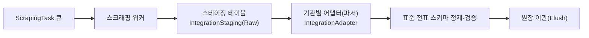

# BK 회계/세무 서비스 상세설계서 (최대 기능 구현 기준)

- 기반 문서: `bk_서비스_기본설계서.md` (서비스형/SaaS 자가운영 모델), `bk_상세_기본설계서.md` (기능 모듈 상세)
- 작성일: 2026-06-10
- 작성 방침: 기본설계서 **「23. 상세설계 전 확인 필요사항」의 10개 항목을 모두 "최대 기능(Full-feature) 구현" 방향으로 확정**하고, 각 결정에 대한 상세 설계(엔티티·필드·상태머신·업무흐름·API·검증규칙)를 정의한다. 회계·세무·보안의 기본 처리 규칙은 두 기반 문서를 준용하며, 본 문서는 서비스형 운영·거버넌스·확장 기능을 상세화한다.

---

## 0. 확정 원칙 및 결정 매트릭스

"최대 기능 구현" 원칙: 옵션이 존재하는 항목은 **가장 풍부한 기능 + 가장 강한 통제**를 동시에 채택한다. 즉, 강력한 기능(긴급 대행, 위임관리, SSO, 전용 격리 등)을 제공하되, 그에 상응하는 승인·로그·통지·시간제한 통제를 함께 구현한다.

| # | 기본설계서 확인 항목 | 확정(최대 기능) | 상세 |
|---|---|---|---|
| 1 | 운영자의 이용회사 데이터 접근 범위·사유·통지 | 조회/지원세션/긴급변경 **3단계 접근모드 + 시간제한 + 사유 + 실시간 통지 + 승인** 전부 구현 | 5장 |
| 2 | 이용회사 관리자 위임 범위 | **완전 위임 관리(사용자/커스텀롤/권한/결재선/차원)** + 관리회사 정책 상한(가드레일) | 4장 |
| 3 | 회계 실무 긴급 대행 허용 | **허용(옵트인 + 이중통제 + 회사 동의 + 시간제한 + 전수 로그)** 으로 구현 | 5.4 |
| 4 | 공통 표준 배포·버전·강제 적용 | **버전 카탈로그 + 강제/권고/선택 3모드 + 자동적용 + 차이미리보기 + 롤백 + 회사 확장** | 6장 |
| 5 | 구독·상태 전환 시 데이터 정책 | **전체 구독 수명주기 + 그레이스 + 내보내기 + 보존 후 파기증명 + 재활성화** | 7장 |
| 6 | 외부 연계 인증정보 보관·보안 | **테넌트별 시크릿 볼트(KMS) + 토큰/인증서 관리 + 자동 회전 + 연결 상태 모니터링** | 8장 |
| 7 | 2FA 강제·인증 파라미터 | **운영자 필수 + 이용회사 기본 필수 + 다중 수단(TOTP/SMS/Email/Passkey/WebAuthn) + SSO(SAML/OIDC) + 적응형/Step-up** | 3장 |
| 8 | 멀티테넌시 격리·성능·백업 | **하이브리드 격리(공유+전용 선택) + RLS + 테넌트별 키/백업/PITR + 파티셔닝/캐시** | 2장 |
| 9 | 관리차원(사업장·코스트센터) 정책 | **범용 차원 엔진(사업장/코스트센터/프로젝트/현장) + 회사별 사용·필수·범위 + 조합규칙 + 기본값 + 예산** | 9장 |
| 10 | 차원 설정 변경 영향 | **유효일자 버전관리 + 변경영향분석 + 과거전표 일괄배정 도구 + 보고 정합성** | 10장 |
| 11 | 다중 회계기준·외부 데이터 변환 입력 | **K-GAAP/K-IFRS/US GAAP/IFRS/기타국 다중 지원 + 병행원장 + 외부데이터 수신·매핑·기준변환·검토·반영 파이프라인** | 11.6장 |
| 12 | AI 기반 이상거래 탐지 | **규칙+통계+비지도 ML 3계층 하이브리드 + 설명가능(SHAP/reason code) + 휴먼인더루프(자동수정 금지) + 테넌트 격리·PII 가명화** | 11.7장 |
| 13 | AI 조회 챗봇(자연어 조회) | **Tool-calling 에이전트 + 제한적 Text-to-SQL + RAG 보조 + 읽기 전용 + 테넌트/권한 서버 강제 + 조회 감사** | 11.8장 |

> 기반 상세설계서 24장(회계기준·신고서식·연계규격 등) 회계·세무 확인 항목도 **최대 범위로 채택**한다: 일반기업회계기준 + K-IFRS + **US GAAP + IFRS + 기타국 기준 동시 지원 및 변환 입력**(11.6), 부가세 전 신고유형(예정/확정/수정/기한후), 법인세 전자신고 서식 최신 버전, 홈택스/카드/은행/환율/OCR 전 연계 활성화(19장).

---

## 1. 시스템 개요 (서비스형 + 자가운영)

- 관리회사는 서비스 제공자이자 전 이용회사 관리자이며, 운영 콘솔에서 테넌트/구독/표준/권한/모니터링/지원을 수행한다.
- 모든 회계·세무 실무는 각 이용회사가 자체 수행하고, 전표 결재는 이용회사 내부에서 완결한다.
- 본 상세설계서는 두 사용자 그룹(`OperatorUser`/`TenantUser`)과 두 채널(운영 콘솔/업무 화면)을 전제로 한다.
- `SaaS_회계개발_주의점.md`의 핵심 가이드(멀티테넌시/RLS·불변성/감사·세법 룰 마스터·마감 잠금·외부수집 비동기 ETL·프론트 대량 그리드)를 2·8.4·11.6·15·16·17장에 반영한다.

---

## 2. 멀티테넌시 아키텍처 상세 (확정 #8)

### 2.1 격리 모델 — 하이브리드(테넌트 티어 선택)

| 티어 | 격리 방식 | 적용 대상 | 특징 |
|---|---|---|---|
| `SHARED` | 공유 스키마 + `tenantId` 컬럼 + RLS(Row-Level Security) | 일반 이용회사(기본) | 비용 효율, 대량 테넌트 |
| `SCHEMA` | 테넌트 전용 스키마 | 중대형/규제 요구 회사 | 논리 분리 강화 |
| `DEDICATED` | 테넌트 전용 DB/인스턴스 | 대기업/보안 요구 회사 | 물리 분리, 전용 백업 |

- 모든 테이블은 `tenant_id`(NOT NULL)를 가지며, 애플리케이션은 모든 쿼리에 테넌트 컨텍스트를 강제 주입한다.
- DB Row-Level Security 정책으로 `tenant_id = current_tenant()` 강제(이중 안전장치). 운영자 관리자 접근은 별도 정책 + 로그.
- 티어 전환(`SHARED`↔`SCHEMA`↔`DEDICATED`)은 완전 무중단의 정합성 리스크를 고려하여 **결산 마감 후 정기 점검 윈도우(Maintenance Window)를 활용한 반자동 이행을 표준 정책**으로 채택한다(2.1.1). 부득이한 실시간 이행 시 **쓰기 버퍼링(Write-Queuing)** 을 강제한다.

#### 2.1.1 티어 전환 하이브리드 워크플로우 (추가검토 1.1)

1. **전환 예약·타겟 프로비저닝**: 테넌트 데이터 용량 산정 → 타겟 스키마/전용 DB 인스턴스 생성 + 기본 스키마(DDL) 배포.
2. **소스 스냅샷 이관(1차 복제)**: 운영 공유 DB의 해당 `tenant_id` 레코드를 백업하여 타겟 DB로 Bulk Insert.
3. **실시간 변경분 추적(CDC·큐잉)**: 1차 복제 중 발생하는 신규 CUD는 애플리케이션 레이어에서 인터셉트하여 **Redis 변경로그 큐(Changelog Queue)** 에 순차 적재.
4. **전환 데이터 검증**: 소스·타겟 레코드 카운트 및 주요 원장(시산표·거래처원장) 해시체인 대조.
5. **라우팅 전환·큐 플러시**: 라우팅 경로를 타겟 DB로 스위칭하는 순간 소스 Write를 일시 잠금 → 큐 잔여 변경분을 순서대로 동기화(Apply).

```
[공유 DB(SHARED)] ─(1차 스냅샷)─► [전용 DB(DEDICATED)]
      │                                   ▲
 (신규 트랜잭션)                          │ (최종 큐 플러시)
      ▼                                   │
[Redis 변경로그 큐] ──────────────────────┘
```

#### 2.1.2 다중 WAS 분산 락(Distributed Lock) (추가검토 1.2)

로드밸런싱된 다중 WAS에서 동일 테넌트의 복수 사용자가 동시에 결산 마감·일괄 배정·외부데이터 이관을 요청할 때의 경쟁상태(Race Condition)를 원천 차단한다. 단일 DB 트랜잭션 격리수준에만 의존하지 않고 **Redis Redlock** 으로 자원 레벨 락을 선점한다.

| 적용 대상 | 락 키 | 최대 만료 |
|---|---|---|
| 월별 결산 마감 | `lock:tenant:{tenantId}:closing:{yyyymm}` | 10분 |
| 일련번호(채번) 생성 | `lock:tenant:{tenantId}:seq:{type}` | 3초 |
| 외부데이터 스테이징 이관 | `lock:tenant:{tenantId}:staging:flush` | 5분 |

- 락 획득: `SET key token NX PX <ttl>`. 미획득 시 비즈니스 예외("다른 사용자가 진행 중").
- 락 해제: Lua 스크립트로 **자신의 토큰 검증 후 원자적 삭제**(타 세션 락 오삭제 방지).
- 분산 락은 차원 일괄 배정(`DimensionBackfillJob`)·표준 자동적용 등 테넌트 단위 일괄 작업에도 적용한다.

### 2.2 테넌트 컨텍스트 처리

- 인증 토큰에 `tenantId`, `userGroup`, `tier`를 포함하고, 요청 진입 시 `TenantContext`로 바인딩.
- 운영자는 `tenantId` 없이 로그인하고, 특정 회사 진입 시 접근모드(5장)에 따라 임시 테넌트 컨텍스트를 획득(로그 동반).
- 캐시·메시지큐·파일 스토리지 키에 `tenantId` 프리픽스를 강제하여 교차 노출을 차단.

### 2.3 성능 설계

- 대용량 테이블(전표라인/원장/로그)은 `tenant_id` + 회계기간 기준 파티셔닝.
- 인덱스: (`tenant_id`, 회계기간, 계정), (`tenant_id`, 거래처), (`tenant_id`, 차원) 등 테넌트 선행 복합 인덱스.
- 조회 3초 목표, 대용량 장부/현황은 비동기 리포트 잡(`AsyncReportJob`) + 결과 캐시.
- 테넌트 리소스 쿼터(동시 배치 수, 리포트 크기, API rate limit)로 노이지 네이버 방지.

### 2.4 백업·복구

- `SHARED`: 일 단위 풀백업 + WAL/binlog 기반 PITR(Point-In-Time Recovery), 테넌트 단위 논리 백업 잡 추가.
- `SCHEMA`/`DEDICATED`: 스키마/인스턴스 단위 백업·복구·PITR.
- **테넌트 단위 복구**: 특정 회사만 시점 복구할 수 있도록 논리 백업(테넌트 export/snapshot) 제공.
- 마감/결산/신고 전 자동 스냅샷(`TenantSnapshot`), 복구 시 무결성·잔액 검증.

### 2.5 엔티티

| 엔티티 | 핵심 필드 |
|---|---|
| `TenantInfra` | `tenantId`, `tier`(SHARED/SCHEMA/DEDICATED), `dbRef`, `schemaName`, `encryptionKeyId`, `quotaProfile` |
| `TenantSnapshot` | `tenantId`, `snapshotType`(마감전/결산/수동), `createdAt`, `storageRef`, `checksum` |
| `AsyncReportJob` | `tenantId`, `reportType`, `params`, `status`, `resultRef`, `expireAt` |

---

## 3. 인증 · 계정 보안 상세 (확정 #7)

### 3.1 인증 수단 (전 수단 지원)

| 수단 | 코드 | 비고 |
|---|---|---|
| 비밀번호 | `PASSWORD` | 일방향 해시(Argon2id/bcrypt) + salt |
| TOTP(OTP 앱) | `TOTP` | 기본 2FA 권장 수단 |
| SMS 코드 | `SMS_OTP` | 통신 비용·취약성 고려, 보조 |
| 이메일 코드 | `EMAIL_OTP` | 보조 |
| Passkey/WebAuthn | `WEBAUTHN` | 피싱 저항, 권장 |
| 백업 코드 | `BACKUP_CODE` | 일회용 복구 |
| SSO | `SAML`,`OIDC` | 기업 테넌트 IdP 연동 |

### 3.2 적용 정책 (최대 강제)

- **운영자**: 2FA 필수(`WEBAUTHN` 또는 `TOTP` 우선), 비밀번호 정책 최강 등급.
- **이용회사**: 기본 2FA 필수. 관리회사가 **정책 하한(floor)** 을 강제(회사가 더 강하게만 조정 가능, 약화 불가).
- **Step-up 인증**: 신고 전송, 마감/마감해제, 권한 변경, 개인정보 평문 조회, 긴급 대행 시 재인증.
- **적응형(위험기반) 인증**: 신규 기기/지역/불가능 이동/이상 시간대 감지 시 추가 인증·차단.
- **SSO**: 기업 테넌트는 자사 IdP(SAML/OIDC)로 SSO + SCIM 사용자 프로비저닝(선택).

### 3.3 비밀번호 정책 파라미터(기본값, 회사 강화 가능)

| 파라미터 | 기본값 |
|---|---|
| 최소 길이 | 10자 |
| 복잡도 | 영대/영소/숫자/특수 중 3종 이상 |
| 변경 주기 | 90일(만료 시 강제 변경) |
| 재사용 금지 | 직전 5개 |
| 최소 사용기간 | 1일 |
| 잠금 임계치 | 5회 실패 → 잠금 + 점진 지연 |
| 휴면 | 365일 미접속 → `DORMANT` |

### 3.4 세션 관리

- 유휴 타임아웃 30분(정책), 절대 수명 12시간, 동시 세션 제한·강제 로그아웃.
- 토큰 보안(HttpOnly/Secure/SameSite), 비밀번호 변경 시 전 세션 무효화.
- 운영 콘솔/업무 화면 세션 분리, 신뢰 기기 등록(정책 옵션).

### 3.5 엔티티

`UserCredential`, `PasswordHistory`, `MfaDevice`(type, secretRef), `WebauthnCredential`, `SsoIdentity`(idpRef, externalId), `UserSession`, `TrustedDevice`, `LoginHistory`, `AccountStatus`, `AuthPolicy`(scope: GLOBAL/TENANT, floor 설정).

---

## 4. 권한 · 위임 관리 상세 (확정 #2)

### 4.1 완전 위임 관리(Delegated Administration)

이용회사 회사 관리자는 자사 범위 내에서 다음을 **완전 위임 관리**한다.

- 자사 사용자 생성/수정/잠금해제/2FA 초기화(관리회사 정책 하한 내).
- **커스텀 Role 생성/편집**: 표준 Role 템플릿을 복제·확장하여 자사 전용 권한 조합 구성.
- 메뉴/행위/데이터범위/민감정보 권한 부여.
- 결재선·결재규칙(`ApprovalRule`) 구성, 위임/대결 설정.
- 회사 환경설정(차원 사용 여부 등, 9장) 관리.

### 4.2 관리회사 정책 상한(가드레일)

관리회사는 전 회사 또는 요금제별로 **정책 상한**을 설정하고, 이용회사는 그 범위 내에서만 위임관리한다.

| 가드레일 | 예시 |
|---|---|
| 인증 하한 | 2FA 필수, 비밀번호 최소강도(약화 불가) |
| 권한 상한 | 단일 사용자 최대 Role 수, 위험 권한(신고전송/마감) 부여 자격 제한 |
| 사용자 수 | 요금제별 최대 사용자/관리자 수 |
| SOD 강제 | 작성-승인 분리 비활성화 금지(소규모 예외 승인 시만) |
| 커스텀 Role 한도 | 회사별 커스텀 Role 최대 개수 |

- 가드레일 위반 설정은 저장 차단. 관리회사는 필요 시 회사별 예외(override)를 사유·로그와 함께 승인.

### 4.3 권한 모델 (RBAC + 속성 제약)

- Role = 메뉴권한 + 행위권한(조회/등록/수정/삭제/승인/반려/마감/전송/출력) + 데이터범위(차원/사업장/부서) + 민감정보권한.
- 표준 Role 템플릿(회사관리자/회계담당/세무담당/결재자/열람자)은 공통 표준(6장)으로 배포, 회사가 채택·확장.

### 4.4 외주 세무대리인(수임처) 권한 위임·가드레일 (추가검토 3.2)

다수 중소·중견기업이 기장·세무조정을 외부 세무사/회계법인에 위임하는 국내 환경을 반영하여, **내부 임직원과 외부 파트너의 권한 경계**를 엄격히 분리한다.

**(1) 세무대리인 속성 확장(`UserCredential`/`TenantUser`)**

- `isExternalPartner`(외부 파트너 여부), `partnerFirmRegNo`(세무대리법인 사업자번호), `permittedScopeTags[]`(허용 업무 범위 태그, 예: `TAX_ADJUSTMENT`/`VAT_FILING`/`JOURNAL_VIEW`).

**(2) 가드레일 통제 규칙**

| 통제 | 규칙 |
|---|---|
| 인사/급여·민감정보 차단 | `isExternalPartner=true` 계정은 전표 권한이 있어도 급여명세·원천세 세부·주민번호 등 진입 시 API 레이어에서 `403`, 마스킹 데이터만 제공 |
| 데이터 내보내기 제한 | 세무 신고 목적 외 전사 전표 일괄 다운로드는 이용회사 총괄관리자 **실시간 2차 승인(카카오/문자 OTP)** 후 다운로드 링크 활성화 |
| 접근 IP 통제 | 세무대리인 로그인 IP 대역 별도 관리, 비정상 대역 접근 시 운영 관리자 대시보드 이상징후 알림 |
| 범위 태그 강제 | `permittedScopeTags`에 없는 업무 화면/API 차단 |

### 4.5 엔티티

`Role`(scope, templateRef, custom), `Permission`, `RoleAssignment`, `PolicyGuardrail`(scope: GLOBAL/PLAN/TENANT), `PolicyException`(승인·사유·기간), `ApprovalRule/Line/Step`, `ExternalPartnerProfile`(firmRegNo, scopeTags, ipAllowlist).

---

## 5. 관리회사 관리자 접근 거버넌스 + 긴급 대행 (확정 #1, #3)

### 5.1 접근 모드 (3단계)

| 모드 | 코드 | 권한 | 통제 |
|---|---|---|---|
| 조회 지원 | `VIEW` | 회사 데이터 읽기(마스킹 적용) | 사유 입력 + 로그 |
| 지원 세션 | `SUPPORT_SESSION` | 설정/구성 변경 지원(회계 실무 제외) | 사유 + 시간제한 + 로그 + 회사 통지 |
| 긴급 변경/대행 | `BREAK_GLASS` | 회계 실무 포함 예외 처리 | 옵트인 + 회사 동의 + 이중통제 + 시간제한 + 전수 로그 + 즉시 통지 |

### 5.2 접근 통제 규칙

- 모든 운영자의 이용회사 데이터 접근은 `AdminAccessLog`(운영자/회사/대상/모드/사유/시각/세션ID)로 append-only 기록.
- 개인정보 평문 조회는 Step-up 인증 + 사유 + `PersonalDataAccessLog` 이중 기록.
- 접근 세션은 시간제한(예: 30~60분), 만료 시 자동 종료. 연장은 재사유.
- 회사 관리자에게 접근 사실을 실시간 통지(이메일/포털), 회사별 통지 정책 설정.

### 5.3 긴급 대행(Break-glass Operate) — 최대 기능 + 최강 통제

회계 실무 긴급 대행을 **허용하되** 다음 절차를 강제한다.

1. **옵트인**: 회사가 계약/설정에서 긴급 대행 허용을 사전 동의(`BreakGlassConsent`). 미동의 회사는 대행 불가.
2. **요청·승인**: 운영자가 사유·범위·기간을 명시해 요청 → 관리회사 책임자 승인(이중통제, 2인 원칙).
3. **회사 통지·승인 옵션**: 회사 관리자에게 즉시 통지, 회사 사전승인 요구(정책 옵션).
4. **시간·범위 제한**: 지정 기간·대상(특정 전표/기능)만 가능, 만료 시 자동 회수.
5. **행위자 구분**: 대행으로 생성/수정된 전표·데이터는 `createdByGroup=OPERATOR`, `breakGlassSessionId`로 표식.
6. **전수 로그·사후 검토**: 모든 행위 `DataChangeLog`+`AdminAccessLog` 기록, 종료 후 회사·관리회사 공동 검토 리포트 자동 생성.

#### 5.3.1 Break-glass 세션 화면 녹화(Session Recording) (추가검토 3.1)

텍스트 변경 로그 외에 **운영자의 UI 조작 전 과정을 시각적으로 기록**하여 사후 검토 신뢰성을 극대화한다.

1. **동적 스크립트 인젝션**: `BREAK_GLASS` 세션 활성 시 프론트 최상위(Provider) 레이어에서 세션 리플레이 라이브러리(예: **rrweb**)/전용 에이전트를 동적 로드.
2. **DOM 스냅샷·이벤트 스트리밍**: 마우스 이동·클릭·키보드 입력(**비밀번호 필드 마스킹**)·DOM 변경을 바이너리 스트림으로 캡처.
3. **독립 스토리지 격리 적재**: 스트림을 실시간으로 **S3 Cold Storage(WORM, Write Once Read Many)** 에 `breakglass_session_{logId}.bin`으로 보관(불변).
4. **사후 검토 결합**: `BreakGlassReviewReport`에 '세션 플레이어' 뷰어 내장 → 보안 관리자가 타임라인별 재생·검토.

### 5.4 엔티티

`AdminAccessLog`, `AdminAccessSession`(mode, expireAt, reason, approverId), `BreakGlassConsent`(tenantId, scope, enabled), `BreakGlassRequest`(reason, scope, period, approvals[], status), `BreakGlassReviewReport`, `SessionRecording`(sessionId, storageRef(WORM), maskedFields).

---

## 6. 공통 표준 카탈로그 · 배포 거버넌스 (확정 #4)

### 6.1 표준 카탈로그

| 표준 유형 | 코드 | 내용 |
|---|---|---|
| 표준계정 템플릿 | `STD_ACCOUNT` | 업종별 표준 계정체계 |
| 부가세 세율/과세유형 | `STD_VAT` | 세율표, 과세유형 매핑 |
| 신고서식 | `STD_FORM` | 부가세/법인세 전자신고 서식 버전 |
| 공통코드 | `STD_CODE` | 결제수단/거래유형 등 |
| Role 템플릿 | `STD_ROLE` | 표준 권한 묶음 |
| 결재선 템플릿 | `STD_APPROVAL` | 표준 결재 규칙 |

### 6.2 버전 수명주기

`DRAFT → PUBLISHED → DEPRECATED → RETIRED`. 각 표준은 유효일자(effective date)를 가지며, 회사별 적용 이력을 보존한다.

### 6.3 배포 모드 (3모드)

| 모드 | 동작 |
|---|---|
| `MANDATORY` | 강제 적용(예: 세율·신고서식). 회사 거부 불가, 적용 시점 자동 반영 |
| `RECOMMENDED` | 권고. 회사가 채택/보류 선택, 미채택 시 알림 |
| `OPTIONAL` | 선택. 회사가 필요 시 채택 |

- **자동 적용**: 신규 회계연도 개시 시 최신 강제 표준 자동 채택, 세율 변경은 적용일 기준 자동 전환.
- **차이 미리보기(diff)**: 새 버전 적용 전 회사가 영향(계정/세율 변경분) 미리보기.
- **롤백**: 배포 후 이슈 시 직전 버전으로 롤백(영향 회사 일괄/선택).
- **회사 확장**: 회사는 표준을 채택 후 **네임스페이스 분리**하여 자사 항목 확장. 표준 항목과 충돌 검사.
- **적용 현황**: 표준별 회사 채택률/버전 분포 모니터링.

### 6.4 엔티티

`GlobalStandard`(type), `StandardVersion`(version, effectiveDate, status, mode), `StandardItem`, `TenantStandardAdoption`(tenantId, standardVersionId, adoptedAt, status), `TenantStandardExtension`(namespaced), `StandardRollbackLog`.

---

## 7. 구독 · 요금 · 데이터 수명주기 (확정 #5)

### 7.1 구독 수명주기

`TRIAL → ACTIVE → PAST_DUE → SUSPENDED → GRACE → TERMINATED`(+ `REACTIVATED`). 상태별 기능 통제는 기본설계서 2.3 + 다음을 상세화.

| 상태 | 데이터 접근 | 처리 |
|---|---|---|
| `TRIAL` | 전체(체험 한도) | 기능 제한·기간 제한 |
| `ACTIVE` | 전체 | 정상 |
| `PAST_DUE` | 전체(경고) | 납부 독촉(dunning), 일정 후 SUSPENDED |
| `SUSPENDED` | 조회만 | 신규 처리 차단 |
| `GRACE` | 조회+내보내기 | 해지 유예기간(데이터 회수 기회) |
| `TERMINATED` | 보관기간 내 조회/다운로드 | 이후 파기 |

### 7.2 요금/과금

- 요금제(`BillingPlan`): 기본료 + 사용량(전표 건수/사용자 수/저장용량/전자세금계산서 건수) 미터링.
- 청구·수금(`Invoice`, `Payment`), 미납 독촉(dunning) 워크플로, 한도 초과 알림.

### 7.3 데이터 내보내기·보존·파기

- **내보내기**: 해지/유예 시 회사 데이터 전체를 표준 포맷(엑셀/CSV/PDF + 원장/전표 dump)으로 export.
- **보존**: 법정 보존연한(전자장부 통상 5년, 일부 10년)까지 read-only 아카이브 보관.
- **파기**: 보존연한 경과 후 스케줄 파기 + **파기 증명서(`DataDestructionCertificate`)** 발급, 개인정보 우선 파기.
- **재활성화**: 보존기간 내 재계약 시 데이터 복원·재활성화.

### 7.4 엔티티

`ServiceSubscription`, `BillingPlan`, `UsageMeter`, `Invoice`, `Payment`, `DunningCase`, `DataExportJob`, `RetentionPolicy`, `DataDestructionCertificate`.

### 7.5 데이터 티어링 · 콜드 스토리지 아카이빙 (추가검토 4.1)

수천 테넌트의 대량 전표가 G/L RDBMS에 누적되면 인덱스 비대화로 IOPS 성능 저하·스토리지 비용 폭증이 발생하므로, 보존연한 데이터의 **물리적 이원화(데이터 티어링)** 를 강제한다.

| 티어 | 대상 | 저장소 | 속성 |
|---|---|---|---|
| **Hot** | 당기 + 전기(최근 2개년) | 고성능 SSD RDBMS 파티션 | 실시간 생성·수정·조회 |
| **Warm** | 마감 3~5년 차 | RDBMS 연도별 히스토리 파티션 테이블 | 상시 Read-Only |
| **Cold** | 5년 초과~10년 이하(법정 보존) | AWS S3 Glacier(객체 스토리지) | RDBMS에서 Delete + **Apache Parquet** 압축 보관 |

```
[RDBMS Hot] (최근 2개년) ─(당해 마감)─► [RDBMS Warm] (3~5년 Read-Only)
                                              │ (5년 초과 배치 이관)
                                              ▼
                                   [S3 Cold] (Parquet 압축)
```

- **콜드 데이터 조회**: RDBMS 커넥션 대신 서버리스 쿼리 엔진(**AWS Athena** 등)으로 S3 Parquet에 **테넌트 격리 필터(`WHERE tenant_id`)** 강제 뷰를 생성, 기존 UI에서 다소 지연(2~5초) 내 과거 장부 조회. 인프라 비용 대폭 절감.
- 콜드 이관·삭제도 변경이력·아카이브 레코드로 추적하며, 법정 보존연한 경과 후에만 최종 파기(7.3)한다.
- 엔티티: `DataTierPolicy`(티어별 보존연한), `ArchiveDataset`(Parquet 파일 ref, tenant, period, checksum).

---

## 8. 외부 연계 인증정보 볼트 (확정 #6)

### 8.1 테넌트별 시크릿 볼트

- 외부 연계(홈택스/카드사/은행/환율/OCR/ERP) 인증정보는 **이용회사 소유**로 테넌트별 분리 저장.
- 모든 시크릿은 KMS로 암호화(테넌트별 키, 2.4/3장 연계), 평문 저장·로그 금지.
- 자격유형: API Key/Secret, OAuth2 토큰(자동 갱신), 공인/사업자 범용 인증서, 계정/비밀번호(불가피 시 암호화).

### 8.2 관리·보안

- 인증서/토큰 만료 모니터링·사전 알림, 자동 회전(rotation) 및 폐기.
- 연계 권한 최소화(스코프 한정), 연결 상태 헬스체크(`ConnectionHealth`).
- 운영자는 시크릿 평문 접근 불가(설정 지원만), 접근 시 로그.
- 연계 호출/응답은 `IntegrationLog`(원문 또는 요약), 중복방지(원천문서번호/멱등키), 재전송 정책.

### 8.3 엔티티

`TenantConnector`(type, status), `ConnectorCredential`(kind, secretRef(KMS), expireAt, rotationPolicy), `OAuthToken`(access/refresh, expireAt), `Certificate`(subject, validFrom/To), `ConnectionHealth`, `IntegrationLog`.

### 8.4 외부 데이터 수집 비동기·ETL 파이프라인 (SaaS 가이드 3 반영)

대량 외부 수집(국세청/홈택스/카드사/은행)은 동기 처리 시 출근 시간대 동시 요청으로 API 서버가 마비되므로 **메시지 큐 기반 비동기 + 워커 분리 + 스테이징/어댑터 ETL** 로 구현한다.

**(1) 비동기 수집 (생산자-소비자)**

- 사용자/배치의 수집 요청은 웹 서버에서 **즉시 응답(202 Accepted)** 하고 `ScrapingTask`로 메시지 큐(Redis/RabbitMQ/Kafka)에 발행한다.
- **스크래핑 워커 풀**을 API 서버 인프라와 **완전 분리** 운영하여 외부기관 지연(Latency)이 서비스 전체 마비로 전파되지 않게 한다.
- 워커는 큐에서 태스크를 꺼내 외부 인증정보(8장 볼트)로 수집, 재시도·백오프·실패 알림, 멱등(원천키 중복 방지).

**(2) ETL — 스테이징 + 어댑터**



- 외부 Raw 데이터(규격·날짜포맷·인코딩 상이)는 가공 없이 `IntegrationStaging`에 1차 적재.
- **어댑터 패턴**: 기관별 파서 인터페이스(`IntegrationAdapter`)로 스테이징 데이터를 표준 전표 스키마로 매핑·정제 후 원장 이관(직접 인서트 금지, 정합성 보존).
- 변환 입력(11.6)과 동일한 검증·스테이징 원칙 적용.

**(3) 엔티티·상태**

- `ScrapingTask`(connectorType, params, status, retryCount), `IntegrationStaging`(rawPayload, source, status), `IntegrationAdapter`(parser 정의).
- 수집 태스크 상태: `QUEUED`, `RUNNING`, `SUCCESS`, `RETRY`, `FAILED`, `DEAD_LETTER`.

---

## 9. 관리차원 엔진: 사업장 · 코스트센터 (확정 #9)

### 9.1 범용 차원 프레임워크

전표 라인에 부가하는 분석 축을 **범용 차원(Dimension)** 으로 일반화하고, 사업장·코스트센터를 핵심 차원으로 제공한다(프로젝트/현장도 동일 프레임).

| 차원 | 코드 | 성격 | 역할 |
|---|---|---|---|
| 사업장 | `BUSINESS_PLACE` | 법적(부가세 신고단위) | 주/종사업장, 사업자단위과세, 사업장별 부가세 신고 |
| 코스트센터 | `COST_CENTER` | 관리(손익·비용 책임) | 계층, 부서/프로젝트 매핑, 손익·예산 집계 |
| 프로젝트 | `PROJECT` | 관리 | 프로젝트별 손익 |
| 현장 | `SITE` | 관리 | 현장별 집계 |

### 9.2 사업장 vs 코스트센터 역할 구분

| 구분 | 사업장 | 코스트센터 |
|---|---|---|
| 목적 | 세무(부가세 신고단위), 법적 단위 | 내부 관리회계(손익/비용 책임) |
| 신고 연계 | 사업장별 부가세 과세표준/세액 집계, 사업자단위과세 합산 | 신고 비연계(관리 보고용) |
| 구조 | 사업자등록 기반(주/종) | 자유 계층(본부>부문>팀 등) |
| 매핑 | 거래처/세금계산서 사업장 | 부서/프로젝트 매핑 |

### 9.3 회사 환경설정(`DimensionConfig`) — 차원별 상세

| 설정 | 값 | 설명 |
|---|---|---|
| `enabled` | Y/N | 차원 사용 여부(회사별) |
| `required` | Y/N | 전표 입력 필수 여부 |
| `scope` | 전체/전표유형/계정범위 | 적용 대상(예: 코스트센터=비용·손익계정) |
| `defaultBy` | 계정/사용자/없음 | 기본값 자동 채움 규칙 |
| `validCombinations` | 규칙 | 사업장×코스트센터 등 유효 조합 제약(선택) |
| `hierarchyLevel` | n | 집계 계층 깊이 |
| `deptMapping` | Y/N | 코스트센터-부서 매핑 사용 |
| `budgetEnabled` | Y/N | 차원별 예산 관리 사용 |

### 9.4 운영 규칙(최대 기능)

- **동시·다축 사용**: 사업장+코스트센터(+프로젝트/현장)를 한 라인에 동시 입력·교차 집계.
- **기본값 자동화**: 계정/사용자/전표유형 기반 차원 기본값 자동 채움(생산성).
- **조합 검증**: 허용 조합 규칙(`validCombinations`)으로 잘못된 차원 조합 차단(선택 사용).
- **차원별 예산**: 코스트센터/사업장 단위 예산 편성·실적 대비(`Budget`, `BudgetActual`).
- **다차원 보고**: 사업장별·코스트센터별 원장/시산표/손익/예산대비 + 피벗 다차원 조회.
- **종료 관리**: 유효기간 종료 차원은 신규 사용 제한(과거 데이터 보존).

### 9.5 전표 라인 차원 필드

`businessPlaceId`, `costCenterId`, `projectId`, `siteId` (각 조건부 — 회사 설정 `enabled`/`required` + 계정 `requiredDimensions` AND 조건). 미사용 차원은 화면 컬럼 숨김·검증/집계 제외.

### 9.6 엔티티

`Dimension`(type), `BusinessPlace`(주/종, 사업자번호, 과세유형), `CostCenter`(parentId, level, deptRef, validFrom/To), `DimensionConfig`(tenantId, dimType, enabled, required, scope, defaultBy...), `DimensionCombinationRule`, `Budget`, `BudgetActual`.

---

## 10. 차원 설정 변경 · 영향관리 (확정 #10)

### 10.1 유효일자 기반 설정 버전관리

- `DimensionConfig` 변경은 **유효일자(effectiveDate)** 를 가지며 버전으로 보존(`DimensionConfigHistory`).
- 변경은 **변경 시점 이후 거래**에 적용. 과거 전표의 기존 차원값은 보존(소급 미적용 기본).

### 10.2 변경 영향 분석

- 사용/필수/범위 변경 전 **영향 분석 리포트** 제공: 영향 받는 계정·전표유형·미입력 전표 수·보고 변화.
- 필수 전환 시: 기존 미입력(과거) 전표 목록 + 보완 필요 건 산출.

### 10.3 과거 데이터 처리(최대 기능)

- **일괄 배정 도구**: 과거 전표에 차원값을 규칙(계정/거래처/부서 매핑)으로 일괄 배정(`DimensionBackfillJob`). 회사 관리자 승인 + 감사로그.
- **보고 정합성**: 배정 전/후 보고 차이를 비교, 마감기간은 원칙적으로 소급 변경 금지(필요 시 조정전표/별도 권한).
- **차원 통합/분할/종료**: 코스트센터 통합·분할·종료 시 매핑 이력 유지, 보고 연속성 보장.

### 10.4 엔티티

`DimensionConfigHistory`, `DimensionChangeImpact`(분석 결과), `DimensionBackfillJob`(rule, scope, status, approverId), `CostCenterMergeSplitLog`.

---

## 11. 전표 · 장부 · 결산 · 세무 모듈 상세 (준용 + 서비스 특화)

처리 규칙은 `bk_상세_기본설계서.md` 6·9·10·11·12·13장을 준용한다. 본 모델 특화·상세 사항:

### 11.1 전표

- 생명주기는 이용회사 내부 완결(기본설계서 5.2). 작성→결재요청(채번)→내부승인(SOD)→기표→마감.
- 라인 차원 입력(9.5), 멱등 채번(`tenant`+연도+유형), 자동분개/부가세 자동라인, 외화 환산.
- 모든 변경 `JournalHistory` + `DataChangeLog`. 운영자 긴급 대행분은 `OPERATOR` 표식.

### 11.2 장부/원장

- 승인(`POSTED`↑) 전표만 집계, 차원별(사업장/코스트센터/프로젝트) 원장·시산표·손익 다차원 조회.

### 11.3 결산

- 결산정리분개(감가/충당금/경과계정/외화환산) 자동화, 회사 내부 결재로 마감, 전기이월. 회계기준 다중 지원(일반기업회계기준+K-IFRS+US GAAP+IFRS) — 회사 선택.
- 재무제표: 재무상태표·손익계산서·자본변동표·**현금흐름표**(11.3.1)·주석 기초자료 생성. 병행원장 기준별로 각각 산출.

### 11.3.1 현금흐름표 생성 (직접법/간접법)

**(1) 생성 방식·구조**

- 회사가 **직접법(Direct)/간접법(Indirect)** 을 선택(`cashFlowMethod`, 기본 간접법). 회계기준(11.6)별 양식 적용, 병행원장 기준별 각각 생성.
- 활동 구분: 영업활동/투자활동/재무활동(`OPERATING`/`INVESTING`/`FINANCING`), 활동별 세부항목 체계.
- 현금및현금성자산 범위는 `CashEquivalentAccount`로 정의(보통예금/현금/단기금융상품 등).

**(2) 산출 로직**

| 방식 | 처리 |
|---|---|
| 간접법 | 당기순이익 → 비현금 항목 가감(감가상각비·대손상각·충당금전입·외화환산손익·유형자산처분손익 등) → 운전자본 증감(매출채권·재고자산·매입채무·선급/선수 등 기초·기말 비교) → 영업활동 현금흐름. 투자/재무활동은 관련 계정 증감·거래 분류로 산출 |
| 직접법 | 현금및현금성자산 계정의 상대계정·거래유형 분석으로 현금유입(매출·이자수취 등)·유출(매입·인건비·이자지급 등) 항목별 직접 집계 |

- 원천: `POSTED` 이상 전표·원장 + 재무상태표 기초/기말 잔액 + 손익계산서. 비현금 거래(현물출자·전환 등)는 현금흐름에서 제외하고 주석 표시.

**(3) 항목 매핑(`CashFlowMapping`)**

- 계정/거래유형 → 현금흐름표 활동·세부항목 매핑 규칙. 표준 매핑은 공통 표준(6장)으로 배포, 회사가 확장.
- 미매핑 계정·현금 거래는 자동 추정 금지 → 검토대상으로 표시(분류 누락 방지).

**(4) 검증·통제**

- **현금 정합성 검증**: 기초현금 + 영업·투자·재무 순현금흐름 + 환율변동효과 = 기말현금, 그리고 기말현금 = 재무상태표 현금및현금성자산 잔액 일치.
- 마감/확정 시 산출물 스냅샷 보관(`TenantSnapshot` 연계), 생성 이력·매핑버전 감사(`DataChangeLog`).

**(7) 현금흐름 조정 워크플로우 (추가검토 2.2)**

불일치 시 차이내역만 표시하면 사용자가 마감을 완료할 수 없는 **교착(Deadlock)** 에 빠지므로, 추적 불가 미세 오차를 사용자 책임 하에 조정하는 통제된 보완 프로세스를 제공한다(G/L은 훼손하지 않음).

1. **검증 경고 발령**: 기말현금-재무상태표 현금 오차 발생 시 결산 화면에 **붉은색 경고 + 불일치 금액(`diffAmount`)** 출력.
2. **수기 매핑 조정 툴**: 활동(영업/투자/재무) 분류가 누락된 전표(예: 차·대 모두 대체계정)를 찾아 수동으로 현금흐름 차원을 매핑하는 원클릭 그리드 팝업 제공.
3. **현금흐름 조정 데이터 발행**: 원인 추적 불가 소액 오차는 사용자가 **승인 사유 입력 후** 미분류 항목을 특정 활동(예: 영업활동기타)으로 귀속. 이 조정은 **실제 회계 장부(G/L)를 변경하지 않고 현금흐름표 출력용 차원 테이블(`CashFlowAdjustment`/`CashFlowMapping`)에만 기록**되며 감사 추적(`DataChangeLog`)에 남는다.
- 조정 후에도 정합성 검증을 재수행하고, 조정 내역은 결산 산출물에 명시한다. 회계 장부 자체의 자동수정은 여전히 금지한다.

### 11.6.1 다중 회계기준 이중 통화 환산(Dual Currency Translation) (추가검토 2.1)

다중 회계기준(11.6) 병행 적용 시 해외 지사/모법인 보고를 위한 **다중 통화 장부 구조**를 명확히 한다.

**(1) 전표 라인(`JournalEntryLine`) 통화 필드 확장**

- `functionalCurrency`(기능통화, 예 KRW)·`functionalAmount`, `presentationCurrency`(보고통화, 예 USD)·`presentationAmount`, `exchangeRateType`(전표시점고시환율/기말마감환율/역사적환율).

**(2) 기말 통화 환산·환산손익 규칙(`FxTranslationEngine`)**

| 항목 | 적용 환율 | 처리 |
|---|---|---|
| 화폐성(외화예금·채권·채무) | **기말 마감환율** | 재평가 차액 → 당기손익 **외화환산손익** 자동 분개 |
| 비화폐성(유형자산·지분상품) | **역사적 환율**(취득시 고정) | 환산 오차 미발생 |
| 보고통화 환산차이 | BS=기말, IS=기간평균 | 구조적 대차 불일치를 자본 항목 **해외사업환산손익(기타포괄손익누계액, OCI)** 으로 자동 흡수 |

- 환산은 병행원장 기준별로 수행하고, 환율유형·적용환율·환산손익을 `ConversionLog`/`FxTranslation`에 기록(감사). 자동수정 금지 원칙은 유지하되 OCI 흡수 분개는 규칙 기반 자동 생성.

**(5) 출력·엔티티**

- 출력: 화면·PDF·Excel(XBRL 태깅 옵션), 기준별/사업장별.
- 엔티티: `CashFlowStatement`(period, standard, method, status), `CashFlowStatementLine`(activity, item, amount, isNonCash), `CashFlowMapping`, `CashEquivalentAccount`.

### 11.3.2 공시자료 생성 (재무제표 공시·주석·XBRL)

확정·마감된 재무제표를 외부 공시·제출용 자료로 생성한다.

**(1) 공시 유형·산출물**

| 공시 유형 | 코드 | 산출물 |
|---|---|---|
| 사업보고서(연간) | `ANNUAL` | 재무제표 + 주석 + (연결) + XBRL |
| 반기/분기보고서 | `SEMI`/`QUARTER` | 요약·정규 재무제표 + XBRL |
| 감사보고서 첨부 | `AUDIT` | 감사대상 재무제표 + 주석 |
| 금융기관/거래소 제출 | `SUBMISSION` | 표준 서식 재무자료 |

- 산출 구성: 재무상태표·손익계산서·현금흐름표(11.3.1)·자본변동표 + 주석(`DisclosureNote`) + 연결재무제표(선택).

**(2) 생성 흐름 (상태머신)**

`DRAFT → GENERATED → VALIDATED → APPROVED → SUBMITTED → ACCEPTED`(또는 `REJECTED`).

확정 재무제표 → 공시 항목 매핑(`DisclosureMapping`) → 주석 자동 구성(템플릿 + 결산/자산/세무 데이터) → XBRL 인스턴스(`XbrlInstance`)·문서 생성 → 검증 → 회사 내부 결재(`APPROVED`) → 제출(DART 등, 8장 연계).

**(3) XBRL·분류체계(taxonomy)**

- 표준 분류체계(`XbrlTaxonomy`, 한국 IFRS/일반기업회계기준 taxonomy)는 관리회사가 공통 표준(6장)으로 버전 배포.
- `DisclosureMapping`: 재무제표 항목 ↔ taxonomy 요소(element) 매핑. 표준 매핑 배포 + 회사 확장.
- 회사 적용기준(11.6)별 taxonomy 적용, 병행원장 기준별 공시자료 각각 생성.

**(4) 주석 자동 구성**

- 주석 템플릿(`DisclosureNote`)에 결산·고정자산·세무·차원·채권채무 데이터를 자동 바인딩(감가상각명세·매출구성·특수관계자·우발부채 등).
- 수기 보완 항목은 입력 후 버전 관리, 변경 시 재생성 대상 표시.

**(5) 검증·통제**

- taxonomy 적합성(요소·계산식 calc linkbase)·필수항목·합계 정합성 검증, 재무제표 간 정합(BS↔IS↔CF) 교차 검증.
- 마감·확정 재무제표만 공시 대상. 재무제표 변경 시 공시자료 자동 무효화·재생성 안내.
- 제출 상태·제출일·파일해시·생성자·taxonomy 버전을 `DisclosureSubmissionLog`로 기록(감사로그), 미매핑 항목 자동 추정 금지(검토대상).

**(6) 엔티티**

`DisclosureReport`(type, period, standard, status), `DisclosureMapping`, `DisclosureNote`, `XbrlTaxonomy`(version), `XbrlInstance`, `DisclosureSubmissionLog`.

### 11.4 매입매출/부가세

- 사업장 차원과 연계한 **사업장별 부가세 신고/사업자단위과세 합산**, 전 신고유형(예정/확정/수정/기한후) + 가산세.
- 전자세금계산서 발행/수신(테넌트 인증정보 볼트, 8장 연계), 통제(승인 전 발행 불가 등) 동일.

### 11.5 세무/고정자산

- 업무용승용차·접대비·외화평가·고정자산/감가상각·법인세 신고연계. 세법 기준값은 공통 표준 버전(6장) 적용.

### 11.6 다중 회계기준 및 외부 데이터 변환 입력 (확정 #11, 최대 기능)

회계기준은 **다중 지원 + 외부 데이터 변환 입력**을 최대 기능으로 구현한다. 일반기업회계기준·K-IFRS뿐 아니라 **US GAAP·IFRS·기타국 기준 데이터를 수신하여 매핑·변환 후 입력**한다.

**(1) 지원 기준·병행원장**

- `AccountingStandard`: `K_GAAP`/`K_IFRS`/`US_GAAP`/`IFRS`/`JP_GAAP` 등 + 버전/국가/기본통화/회계달력/재무제표 항목 체계.
- 회사는 주재무제표 기준(primary) + 다수 병행 기준(secondary[])을 적용. **병행원장(`LedgerBook`)** 으로 동일 거래를 복수 기준으로 동시 표현(다원장).
- 기준 간 차이는 **GAAP 차이 조정분개**(`ConversionDifference`)로 별도 관리하여 기준별 재무제표를 각각 산출.

**(2) 변환 입력 파이프라인 (상태머신)**

`RECEIVED → VALIDATED → MAPPED → CONVERTED → STAGED → REVIEWING → POSTED`(또는 `REJECTED`/`FAILED`).

| 단계 | 처리 | 산출 |
|---|---|---|
| 수신 | 파일(Excel/CSV/XML/XBRL)/API로 원천 데이터 적재(`ImportBatch`), 원천키 멱등 검증 | 원천 레코드 |
| 검증 | 스키마·필수·차대변·기간 검증, 오류행 리포트 | 검증 결과 |
| 매핑 | `ChartMapping`으로 원천 계정→자사/표준 계정, 거래처·차원 매핑 | 매핑 결과 |
| 변환 | `StandardConversionRule`로 기준 재분류·조정, `FxTranslation` 통화 환산, `PeriodMapping` 기간 환산 | 변환전표/잔액 |
| 스테이징 | 변환 결과를 스테이징(`ImportStagingEntry`)에 적재(반영 전 검토) | 스테이징 전표 |
| 검토/반영 | 회사 내부 검토·승인 → 전표/개시잔액 반영 | 정식 전표/잔액 |

**(3) 변환 규칙(예시 — 기준쌍별 조정)**

- 리스(US GAAP ASC842 ↔ K-IFRS 1116): 운용/금융리스 재분류, 사용권자산·리스부채 인식 차이.
- 수익인식(ASC606 ↔ K-IFRS 1115): 인식 시점·금액 차이 조정.
- 대손/금융상품(CECL ↔ 기대신용손실), 개발비 자본화, 유형자산 재평가 등.
- 규칙은 기준쌍(`fromStandard`,`toStandard`)·계정·조건별로 정의하고 버전 관리.

**(4) 통제**

- 멱등성: 원천 문서키/배치키 중복 수신 시 재처리(중복 전표 생성 금지).
- 미매핑 계정·미정의 규칙은 자동 추정 금지 → 검토대상/오류로 반영 차단.
- 차대변 불균형·필수 누락 행 분리, 부분 반영 금지(또는 검토 후 선택 반영).
- 변환 전/후값·적용 규칙버전·환율·수행자·시각을 `ConversionLog`로 감사(append-only), GAAP 차이 `ConversionDifference` 보존(임의 덮어쓰기 금지).
- 마감/신고 완료 기간 반영 제한(조정 절차·권한 필요), 변환 반영은 회사 내부 결재 대상.

**(5) 엔티티**

`AccountingStandard`, `LedgerBook`, `ChartMapping`, `StandardConversionRule`, `ImportTemplate`, `ImportBatch`, `ImportStagingEntry`, `ConversionLog`, `ConversionDifference`, `FxTranslation`, `PeriodMapping`.

### 11.7 AI 기반 이상거래 탐지 (이상 전표/거래 탐지)

전표 등 입력자료를 분석하여 **이상 징후를 점수화·우선순위화하고 사유를 제시**하는 보조 기능. **AI는 탐지·우선순위화·사유 제시까지만 수행하고, 전표의 수정·승인·반려·확정은 전적으로 사람(이용회사 사용자)이 판단**한다(휴먼인더루프, 자동수정 금지 — 16.1 불변성 원칙 일관). 회계·세무 감사 대응을 위해 **모든 알림은 설명가능(reason code 필수)** 해야 한다.

**(1) 탐지 범위 (이상 패턴)**

| 분류 | 패턴 예시 |
|---|---|
| 금액 이상 | 라운드 금액 반복(1,000,000 등), 계정·거래처별 분포 대비 통계적 이상치, Benford 법칙 위반 |
| 중복/유사 | 중복 전표, 동일 거래처·동일 금액 단기 반복, 승인 한도 회피 의심 분할 입력 |
| 시간 이상 | 마감 임박·심야·주말 입력, 비정상 소급 전기일자 |
| 계정 조합 이상 | 비정상 차·대변 계정쌍, 거래처-계정 의미 불일치(적요 임베딩 분석) |
| 통제 이상 | SOD 위반 의심(입력자=승인자 근접), 권한 외 패턴 |
| 마스터 정합성 | 신규/휴면 거래처 급증, 세무 과세유형 불일치 |

**(2) 탐지 방식 — 3계층 하이브리드 + 설명**

| 계층 | 기법 | 도구(예시) | 역할 | 라벨 |
|---|---|---|---|---|
| ① 규칙 | 라운드금액·심야·SOD·한도분할 룰 | 자체 룰엔진(`AnomalyRule`) | 즉시 적용, 설명 100% | 불필요 |
| ② 통계 | Z-score·IQR·Benford, 분포 기준선 | numpy/scipy | 회사별 자체 기준선 | 불필요 |
| ③ ML(비지도) | Isolation Forest·LOF·One-Class SVM·Autoencoder | scikit-learn/PyTorch | 다변량 복합 패턴 점수 | 불필요 |
| ④ ML(지도, 후순위) | XGBoost·LightGBM | - | 검토 피드백 라벨 축적 후 전환 | 필요(축적) |
| ⑤ 설명(XAI) | SHAP·LIME | shap | 점수 기여 변수 수치화(reason code) | - |
| ⑥ LLM(선택, 보조) | 사유 자연어화·적요 의미분석·검토자 Q&A | 온프레미스 우선(HyperCLOVA X/Llama/Qwen/Solar) | 사유 풀이(껍데기) | - |

- 세 계층(①②③) 점수를 가중 합산하여 최종 `anomalyScore`와 사유(reason codes)를 **동시 산출**한다. 블랙박스 딥러닝 단독 판단은 금지하고 규칙·통계를 1차로 둔다.

**(3) 데이터 흐름**

- **실시간**: 전표 저장/스테이징(11.6 변환 스테이징 포함) 단계에 비동기 훅 → 경량 규칙·통계 점수 산출. **저장은 차단하지 않고 위험 플래그·경고만** 표시(불필요한 입력 마찰 방지).
- **배치(야간/마감 전)**: 8.4 비동기 워커 풀·메시지 큐를 재사용하여 ML 전수 재평가 → 임계치 초과 건 `AnomalyAlert` 생성.
- **검토 루프**: 알림 → 검토자 확인/기각(정상확인/조치) → 결정을 `AnomalyReviewLog`(append-only)에 기록 → ML 재학습 피드백(④로 점진 전환).

**(4) 멀티테넌시·보안·감사 통제**

- **테넌트 격리**: `AnomalyModel`·기준선·점수·알림 전부 `tenantId` 단위 격리(RLS, 2장). 테넌트 간 데이터 교차 학습 금지.
- **개인정보**: 학습/추론 시 거래처명·주민번호 등 PII는 **가명화/특징량화**(17장). 외부 LLM API에 원시 전표 전송 금지(온프레미스/VPC 내 우선, 불가피 시 가명화 필수).
- **감사추적**: 점수·알림·검토 결정을 `DataChangeLog` 해시체인에 연계(17장), 사후 변조 불가.
- **운영자 접근**: 관리회사 운영자는 탐지 모델·임계치 표준 배포(6장)·운영 모니터링만 수행하며, 회사 전표 직접 변경은 5장 접근 거버넌스 적용.

**(5) 도입 단계(Phase)**

| 단계 | 범위 | 라벨 |
|---|---|---|
| Phase 1 | 규칙 + 통계(①②) + SHAP | 불필요 |
| Phase 2 | 비지도 ML(③) 점수 합산 | 불필요 |
| Phase 3 | 검토 피드백 기반 지도학습(④) + (선택)LLM 풀이 | 축적 후 |

**(6) 엔티티**

`AnomalyRule`(회사별 규칙·임계치 설정, `DimensionConfig` 패턴), `AnomalyModel`(ML 모델 버전·학습 메타, 테넌트 격리), `AnomalyScore`(전표별 점수·계층 기여도·reason codes), `AnomalyAlert`(임계 초과 알림·상태), `AnomalyReviewLog`(검토 결정 이력, append-only), `AnomalyFeatureSet`(특징량 정의·가명화 정책).

### 11.8 AI 조회 챗봇 (자연어 데이터 조회)

전표·거래내역·잔액·원장·시산표 등을 **자연어 질문으로 조회**하는 대화형 보조 기능. **조회(Read-Only) 전용**으로, 전표 생성/수정/승인/삭제는 챗봇이 수행하지 않는다(휴먼인더루프, 변경은 정식 화면·결재 경로). 수치는 **DB/서비스가 계산한 결과를 그대로 사용**하고 LLM은 문장화만 한다(LLM 직접 계산 금지 → 환각·집계오류 방지).

**(1) 아키텍처 — Tool-calling Agent (RAG 단독 아님)**

```
사용자 질문(자연어)
  → LLM 에이전트(의도·파라미터 추출)
  → 등록된 조회 Tool/Function 호출(QueryToolRegistry, 화이트리스트)
  → 기존 도메인 서비스(JournalService/LedgerService/StatementService…) 실행  ← 실제 계산·집계
  → 결과(표·수치) + 출처(전표번호·기간·계정) 반환
  → LLM이 자연어 요약(수치 가공 금지)
```

| 방식 | 용도 | 비고 |
|---|---|---|
| Function/Tool calling | 표준 조회(전표 검색·계정별 합계·기간 잔액·미승인 건수 등) | 주력, 가장 안전 |
| Text-to-SQL | 자유 질의 대응 | **읽기 전용·화이트리스트 뷰·테넌트 필터 강제**에서만 제한적 허용 |
| RAG(임베딩 검색) | 계정과목 설명·매뉴얼·세무 규정 안내 등 비수치 질의 | 보조 |

**(2) 데이터 흐름·멀티턴**

- `ChatSession`(테넌트·사용자·대화 컨텍스트) → `ChatMessage`(질의/응답) → Tool 실행 → `ChatQueryLog`(실행 쿼리·파라미터·반환 건수, append-only) 기록.
- 멀티턴 문맥(예: "그 중 100만원 이상만")은 직전 질의 파라미터를 컨텍스트로 보존하여 누적 필터.

**(3) 보안·격리 가드레일 (회계 SaaS 핵심)**

| 항목 | 통제 |
|---|---|
| 테넌트 격리 | 모든 조회에 세션의 `tenantId`를 **서버에서 강제 주입**(LLM이 tenantId 지정 불가), 2장 RLS + ORM 글로벌 필터 재사용 |
| 권한 연계 | 사용자 본인 권한 범위만 조회(4장 RBAC·SOD), 권한 외 계정/사업장/급여 데이터 결과 제외 |
| 읽기 전용 | read-only DB 계정/커넥션, 쓰기·DDL·삭제 SQL 원천 차단 |
| Text-to-SQL 가드레일 | 화이트리스트 뷰 한정, `WHERE tenant_id` 자동 주입, 구문 파싱 검증, 행수·실행시간 제한 |
| PII 보호 | 주민번호 등 마스킹 반환, 외부 LLM API에 원시 PII·전표 전송 금지(온프레미스/VPC 우선) |
| 프롬프트 인젝션 방어 | 전표 적요 등 데이터에 포함된 지시문을 명령으로 실행 금지(데이터/명령 분리) |
| 감사 | 질의·생성 쿼리·반환 건을 `ChatQueryLog`로 기록(조회 감사), 운영자 접근은 5장 거버넌스 |

**(4) 사용할 AI**

- 에이전트 LLM: Tool-calling 지원 모델, 온프레미스/데이터주권 우선(HyperCLOVA X/Llama/Qwen/Solar) 또는 VPC 내. **스키마·질문·집계결과만 송수신**하고 원시 전표는 전달하지 않는 구조면 외부 API도 정책상 검토 가능.
- 임베딩(RAG 보조): 매뉴얼·계정설명·세무규정 검색에만. 수치 계산·집계는 AI가 아닌 기존 DB/서비스.

**(5) 도입 단계(Phase)**

| 단계 | 범위 |
|---|---|
| Phase 1 | 사전정의 Tool calling 표준 조회 N종(전표/원장/잔액/집계) |
| Phase 2 | 제한적 Text-to-SQL(읽기 전용 화이트리스트 뷰) |
| Phase 3 | RAG 보조(매뉴얼·규정) + 멀티턴 컨텍스트 강화 |

**(6) 엔티티**

`ChatSession`(대화 세션·테넌트·사용자), `ChatMessage`(질의/응답 이력), `ChatQueryLog`(실행 조회·파라미터·반환 건수 감사, append-only), `QueryToolRegistry`(허용 조회 함수·파라미터 스키마), `ChatGuardrailPolicy`(회사별 허용 데이터 범위·마스킹·LLM 사용 정책).

---

## 12. 데이터 모델 통합

### 12.1 신규/확장 엔티티 (본 상세설계서)

| 영역 | 엔티티 |
|---|---|
| 인프라/격리 | `TenantInfra`, `TenantSnapshot`, `AsyncReportJob`, `DataTierPolicy`, `ArchiveDataset`, `TierMigrationJob`, `DistributedLock`(논리) |
| 인증/보안 | `WebauthnCredential`, `SsoIdentity`, `AuthPolicy`(+ 3.5 기존) |
| 권한/위임 | `PolicyGuardrail`, `PolicyException`, `Role`(custom), `RoleAssignment`, `ExternalPartnerProfile` |
| 관리자 접근 | `AdminAccessSession`, `BreakGlassConsent`, `BreakGlassRequest`, `BreakGlassReviewReport`, `SessionRecording` |
| 공통 표준 | `StandardVersion`(mode), `StandardItem`, `TenantStandardAdoption`, `TenantStandardExtension`, `StandardRollbackLog` |
| 구독/요금 | `UsageMeter`, `Invoice`, `Payment`, `DunningCase`, `DataExportJob`, `DataDestructionCertificate` |
| 연계 볼트 | `TenantConnector`, `ConnectorCredential`, `OAuthToken`, `Certificate`, `ConnectionHealth` |
| 외부수집/ETL | `ScrapingTask`, `IntegrationStaging`, `IntegrationAdapter`, `TaxRuleMaster` |
| 차원 | `Dimension`, `BusinessPlace`, `CostCenter`, `DimensionConfig`, `DimensionConfigHistory`, `DimensionCombinationRule`, `DimensionChangeImpact`, `DimensionBackfillJob`, `Budget`, `BudgetActual` |
| 회계기준/변환 | `AccountingStandard`, `LedgerBook`, `ChartMapping`, `StandardConversionRule`, `ImportTemplate`, `ImportBatch`, `ImportStagingEntry`, `ConversionLog`, `ConversionDifference`, `FxTranslation`, `PeriodMapping` |
| 현금흐름표 | `CashFlowStatement`, `CashFlowStatementLine`, `CashFlowMapping`, `CashEquivalentAccount`, `CashFlowAdjustment` |
| 공시 | `DisclosureReport`, `DisclosureMapping`, `DisclosureNote`, `XbrlTaxonomy`, `XbrlInstance`, `DisclosureSubmissionLog` |
| 이상거래 탐지 | `AnomalyRule`, `AnomalyModel`, `AnomalyScore`, `AnomalyAlert`, `AnomalyReviewLog`, `AnomalyFeatureSet` |
| AI 조회 챗봇 | `ChatSession`, `ChatMessage`, `ChatQueryLog`, `QueryToolRegistry`, `ChatGuardrailPolicy` |

### 12.2 주요 상태값 (추가)

| 상태 그룹 | 상태값 |
|---|---|
| 테넌트 티어 | `SHARED`, `SCHEMA`, `DEDICATED` |
| 구독 | `TRIAL`, `ACTIVE`, `PAST_DUE`, `SUSPENDED`, `GRACE`, `TERMINATED`, `REACTIVATED` |
| 관리자 접근모드 | `VIEW`, `SUPPORT_SESSION`, `BREAK_GLASS` |
| 긴급대행 | `REQUESTED`, `APPROVED`, `ACTIVE`, `EXPIRED`, `REVOKED`, `REVIEWED` |
| 표준 버전 | `DRAFT`, `PUBLISHED`, `DEPRECATED`, `RETIRED` |
| 표준 배포모드 | `MANDATORY`, `RECOMMENDED`, `OPTIONAL` |
| 차원 배정잡 | `READY`, `RUNNING`, `SUCCESS`, `PARTIAL`, `FAILED` |
| 변환 배치 | `RECEIVED`, `VALIDATED`, `MAPPED`, `CONVERTED`, `STAGED`, `REVIEWING`, `POSTED`, `REJECTED`, `FAILED` |
| 수집 태스크 | `QUEUED`, `RUNNING`, `SUCCESS`, `RETRY`, `FAILED`, `DEAD_LETTER` |
| 이상 알림 | `NEW`, `IN_REVIEW`, `CONFIRMED_NORMAL`, `ACTION_TAKEN`, `DISMISSED` |
| 이상 모델 | `TRAINING`, `STAGED`, `ACTIVE`, `SHADOW`, `RETIRED` |
| 챗봇 세션 | `ACTIVE`, `IDLE`, `EXPIRED`, `TERMINATED` |
| 기타(전표/결재/마감/계정/세금계산서/신고/자산) | 기본설계서 13.4 + 상세설계서 14.5 준용 |

---

## 13. 서비스 / API 상세

### 13.1 서비스 (추가)

`TenantInfraService`(티어/백업/복구), `AuthService`(+SSO/WebAuthn/적응형), `DelegatedAdminService`(위임관리+가드레일), `AdminAccessGovernanceService`(접근모드/긴급대행), `GlobalStandardService`(버전/배포/롤백), `BillingService`(구독/과금/독촉), `DataLifecycleService`(내보내기/보존/파기), `ConnectorVaultService`(시크릿/토큰/인증서), `DimensionService`(차원/설정/배정/예산), `AccountingStandardService`(다중 기준·병행원장), `ConversionImportService`(수신·매핑·기준변환·스테이징·반영, 11.6), `CashFlowService`(현금흐름표 생성·매핑·검증, 11.3.1), `DisclosureService`(공시자료·주석·XBRL 생성·검증·제출, 11.3.2), `ScrapingPipelineService`(외부 수집 큐·워커·스테이징·어댑터 ETL, 8.4), `FxTranslationEngine`(이중 통화 환산·화폐성/비화폐성·OCI 흡수, 11.6.1), `DistributedLockService`(Redis Redlock 자원 락, 2.1.2), `TierMigrationService`(티어 전환 CDC·큐 플러시, 2.1.1), `DataTieringService`(Hot/Warm/Cold·Parquet·Athena, 7.5), `AnomalyDetectionService`(규칙·통계·ML 스코어링·알림·검토 루프, 11.7), `AnomalyModelService`(테넌트별 모델 학습·버전·섀도우 평가, 11.7), `ChatQueryAgentService`(자연어 조회 에이전트·Tool calling·Text-to-SQL 가드레일·조회 감사, 11.8), `QueryToolRegistryService`(허용 조회 함수 등록·스키마 검증, 11.8). 회계 도메인 서비스는 기본설계서 14.1 준용.

### 13.2 API (추가/대표)

| Method | URI | 설명 |
|---|---|---|
| `PUT` | `/api/operator/tenants/{id}/tier` | 테넌트 격리 티어 전환 |
| `POST` | `/api/operator/tenants/{id}/snapshots` | 테넌트 스냅샷/복구 |
| `POST` | `/api/operator/standards/{id}/publish` | 표준 버전 발행 |
| `POST` | `/api/operator/standards/{id}/distribute` | 배포(모드: MANDATORY/RECOMMENDED/OPTIONAL) |
| `POST` | `/api/operator/standards/{id}/rollback` | 표준 롤백 |
| `POST` | `/api/operator/access/{tenantId}/session` | 관리자 접근 세션 시작(mode·사유) |
| `POST` | `/api/operator/break-glass/requests` | 긴급 대행 요청 |
| `POST` | `/api/operator/break-glass/{id}/approve` | 긴급 대행 승인(이중통제) |
| `GET` | `/api/operator/billing/invoices` | 청구/수금 조회 |
| `POST` | `/api/tenant/data-export` | 회사 데이터 내보내기 |
| `GET·PUT` | `/api/tenant/auth-policy` | 회사 인증정책(하한 내 강화) |
| `POST·GET` | `/api/tenant/connectors` | 연계 커넥터/인증정보 등록(볼트) |
| `GET·PUT` | `/api/tenant/settings/dimensions` | 차원 환경설정 |
| `POST·GET` | `/api/tenant/business-places` · `/cost-centers` | 사업장/코스트센터 |
| `POST` | `/api/tenant/dimensions/backfill` | 과거 전표 차원 일괄 배정 |
| `GET` | `/api/tenant/dimensions/change-impact` | 차원 설정 변경 영향 분석 |
| `GET·POST` | `/api/operator/accounting-standards` | 회계기준·변환규칙 공통 배포 |
| `GET·PUT` | `/api/tenant/accounting-standards` | 회사 적용기준(주/병행) 설정 |
| `GET·POST` | `/api/tenant/chart-mappings` | 계정 매핑(타 기준↔자사) |
| `POST` | `/api/tenant/import/batches` | 외부 회계데이터 수신 |
| `POST` | `/api/tenant/import/batches/{id}/convert` | 매핑·기준 변환 |
| `POST` | `/api/tenant/import/batches/{id}/post` | 변환 결과 반영(전표/잔액) |
| `GET·POST` | `/api/tenant/cash-flow-mappings` | 현금흐름 항목 매핑 설정 |
| `POST` | `/api/tenant/closing/{periodId}/cash-flow` | 현금흐름표 생성(직접/간접) |
| `GET` | `/api/tenant/cash-flow-statements/{id}` | 현금흐름표 조회/출력 |
| `GET·POST` | `/api/operator/disclosure-taxonomies` | XBRL 분류체계 공통 배포 |
| `GET·POST` | `/api/tenant/disclosure-mappings` | 공시 항목 매핑 설정 |
| `POST` | `/api/tenant/closing/{periodId}/disclosures` | 공시자료 생성(재무제표/주석/XBRL) |
| `POST` | `/api/tenant/disclosures/{id}/validate` | 공시자료 taxonomy/정합성 검증 |
| `GET` | `/api/tenant/disclosures/{id}` | 공시자료 조회/출력/제출상태 |
| `GET·POST` | `/api/operator/anomaly-rules` | 이상탐지 규칙·임계치 공통 표준 배포 |
| `GET·PUT` | `/api/tenant/anomaly-rules` | 회사 이상탐지 규칙·임계치 설정(on/off) |
| `POST` | `/api/tenant/anomaly/score` | 전표/입력자료 이상 점수 산출(실시간/배치) |
| `GET` | `/api/tenant/anomaly/alerts` | 이상 알림 목록(우선순위·사유 코드) |
| `POST` | `/api/tenant/anomaly/alerts/{id}/review` | 알림 검토 결정(정상확인/조치/기각) |
| `POST` | `/api/operator/anomaly-models/{tenantId}/train` | 테넌트별 모델 학습/버전 관리 |
| `POST` | `/api/tenant/chat/sessions` | AI 조회 챗봇 세션 시작 |
| `POST` | `/api/tenant/chat/sessions/{id}/messages` | 자연어 질의 전송·응답(조회 결과+출처) |
| `GET` | `/api/tenant/chat/query-logs` | 챗봇 조회 감사 로그 |
| `GET·PUT` | `/api/operator/chat/guardrail-policy` | 챗봇 허용 데이터·마스킹·LLM 사용 정책 |
| `GET·POST` | `/api/operator/chat/query-tools` | 허용 조회 함수(QueryToolRegistry) 등록/조회 |

API 공통: 테넌트 API는 `tenantId` + 권한 + 차원 검증, 운영자 API는 관리자 권한·접근모드·`AdminAccessLog`, 멱등 생성은 멱등키. 이상탐지 API는 조회·점수·검토만 노출하며 전표 자동 수정 엔드포인트는 제공하지 않는다. 챗봇 API는 **읽기 전용**으로, 세션 `tenantId`·사용자 권한을 서버에서 강제하고 전표 변경(생성/수정/승인/삭제) 엔드포인트를 제공하지 않는다.

---

## 14. 배치 / 스케줄 상세

운영 배치(관리회사): 구독 상태·독촉 점검, 표준 자동적용(회계연도 개시/세율 변경), 보존기간 파기 점검, 접근 이상탐지, 인증서/토큰 만료 점검, 테넌트 백업/스냅샷.
회사 배치(이용회사): 자동분개, 환율 동기화, 전자세금계산서 수신, 월별 감가상각, 결산검증, 신고 집계, 차원 일괄배정 잡, **외부 데이터 변환 입력 잡(수신·검증·변환·스테이징)**, **이상거래 야간 전수 스코어링 잡(ML 재평가·알림 생성, 11.7)**. 모두 멱등·재처리·실패 알림.
모델 운영 배치(관리회사): 테넌트별 이상탐지 모델 주기 재학습·섀도우 평가·기준선 갱신(11.7), 검토 피드백 누적 기반 성능 모니터링.

---

## 15. 검증 / 오류 처리 상세

기본설계서 17장 + 다음 추가:

| 검증 항목 | 처리 |
|---|---|
| 정책 가드레일 위반(위임설정) | 저장 차단, 관리회사 예외 승인 필요 |
| 긴급 대행 미동의 회사 | 대행 차단 |
| 강제 표준 거부 시도 | 차단(MANDATORY) |
| 차원 필수 미입력/미사용 입력/종료 차원 | 9·10장 규칙대로 차단/제외/제한 |
| 차원 조합규칙 위반 | 저장 차단(사용 시) |
| 인증정책 하한 약화 시도 | 차단 |
| 마감기간 차원 소급 변경 | 차단(조정전표/별도권한) |
| 현금흐름표 기말현금 불일치 | 재무상태표 현금 잔액과 불일치 시 차이내역 표시(자동수정 금지) |
| 현금흐름 미매핑 계정/거래 | 자동 추정 금지, 검토대상 표시(분류 누락 방지) |
| 공시 taxonomy 부적합/정합성 오류 | 생성 차단, 오류항목 리포트(요소·계산식·합계) |
| 미확정 재무제표 공시 시도 | 마감·확정 전 공시 생성 차단 |
| 재무제표 변경 후 공시 미재생성 | 기존 공시자료 무효화·재생성 안내 |
| 분산 락 미획득(동시 마감/이관) | 비즈니스 예외("다른 사용자 진행 중"), 처리 차단 |
| 외부 파트너 민감정보 접근 | `403` + 마스킹(인사/급여/주민번호 등) |
| 외부 파트너 전사 내보내기 | 총괄관리자 2차 승인(OTP) 전 다운로드 차단 |
| 현금흐름 조정(미세오차) | G/L 미변경, 차원 테이블만 반영 + 사유·감사로그 |
| 이상탐지 알림 처리 | AI는 경고·우선순위만, 전표 자동 수정/반려/승인 금지(사람 검토 필수) |
| 이상탐지 사유 누락 | reason code 없는 알림 생성 차단(설명가능성 강제) |
| 학습 데이터 PII | 가명화/특징량화 미적용 데이터의 모델 학습 차단 |
| 챗봇 쓰기/변경 시도 | 읽기 전용 강제, 전표 생성/수정/승인/삭제 SQL·툴 호출 차단 |
| 챗봇 테넌트/권한 위반 | 세션 `tenantId`·사용자 권한 외 데이터 조회 차단(서버 강제 주입) |
| 챗봇 Text-to-SQL 위반 | 화이트리스트 뷰 외·`tenant_id` 미포함·행수/시간 초과 쿼리 차단 |
| 챗봇 프롬프트 인젝션 | 데이터 내 지시문 실행 금지(데이터/명령 분리) |
| 챗봇 수치 가공 | LLM 직접 계산 금지, DB/서비스 계산값만 반환·문장화 |

---

## 16. 비기능 상세 (성능/가용성/백업)

- 성능: 테넌트 선행 인덱스·파티셔닝, 비동기 리포트, 테넌트 쿼터, 캐시 테넌트 격리.
- 가용성: 마감/신고 성수기 무중단, 자동 스케일, 읽기 복제.
- 백업/복구: 티어별 백업 + PITR + 테넌트 단위 복구, 마감/결산/신고 전 스냅샷.
- 확장성: 세율/서식/회계기준 변경을 공통 표준 배포로 흡수, 신규 차원/연계 어댑터 확장.

### 16.1 데이터 무결성·세법 유연성 상세 (SaaS 가이드 1·2 반영)

- **테넌트 격리 이중 강제**: DB RLS(2.1) + ORM 글로벌 필터/인터셉터(JPA `@Filter`, TypeORM/Prisma 미들웨어)로 모든 쿼리에 테넌트 조건 자동 결합. 애플리케이션 `WHERE tenant_id` 단독 의존 금지.
- **물리 삭제 금지(불변성)**: 회계 데이터는 물리 삭제하지 않는다. 잘못된 전표는 **취소/역분개 전표**로 처리하고 원본은 상태값·이력 테이블(`JournalHistory`)로 보존. CUD는 인터셉터/트리거에서 '누가/언제/IP/전후값'을 `DataChangeLog`로 강제.
- **세법 룰 마스터**: 부가세율·과세표준 구간·비과세 한도 등은 소스 상수 금지. 공통 표준(6장)의 **세법 룰 마스터 + 적용 시작/종료일**로 관리하고, 전표 **전기일(posting date)** 기준 해당 시점 규칙을 동적 바인딩.
- **마감 잠금 인터셉터**: 전표 CUD 진입점 미들웨어에서 전기일 연월의 테넌트 마감여부(`ClosingStatus`)를 상시 조회, 마감 기간이면 403/비즈니스 예외 + 트랜잭션 롤백.

### 16.2 프론트엔드 대량 그리드 성능·UX 상세 (SaaS 가이드 4 반영)

- **가상 스크롤(Windowing)**: 전표/원장 대량(수천 건) 조회 그리드는 가시영역 + 버퍼만 렌더링(React-Window/AG-Grid/가상화 옵션). 일반 `<table>` 전량 렌더링 금지.
- **키보드 주도 UX**: Tab/Enter로 셀·행 포커스 이동, `Ctrl+S` 저장 등 단축키. 마우스 의존 최소화.
- **유도규칙 실시간 자동기입**: 편집 그리드에서 코스트센터 선택 시 마스터 관계 해석으로 사업장 셀을 실시간 자동기입(차원 `defaultBy`/매핑 연계). 행별 인덱스 추적, `onChange`가 그리드 내부 스키마에서 즉시 반영.
- **클라이언트 사이드 실시간 검증**: 대차평균(차변합계=대변합계)·필수값(계정/금액/사업장)을 전송 전 풋터/실시간 레이어에서 연산해 시각 경고(Amber/Red), 불필요한 API 라운드트립 최소화. 서버 검증은 별도 유지(이중 검증).

---

## 17. 보안 · 개인정보 · 데이터 변경이력 상세

기본설계서 20장 + 상세설계서 21장 준용. 강조:

- 테넌트별 암호화 키, 개인정보 암호화·마스킹·접근통제·보유기간/파기.
- 운영자의 회사 데이터/개인정보 접근은 `AdminAccessLog`+`PersonalDataAccessLog` 이중 기록·통지·Step-up.
- 데이터 변경이력(`DataChangeLog`): 전 데이터 전후값·행위자(그룹/긴급대행 세션 포함)·사유·트랜잭션ID, append-only + 해시체인.
- 보안 이벤트·로그인 이력·이상탐지·SIEM 연계(선택).
- **AI 이상거래 탐지(11.7) 데이터 보호**: 학습/추론 입력은 거래처명·주민번호 등 PII를 가명화/특징량화 후 사용, 모델·점수·알림은 테넌트별 격리(RLS), 외부 LLM API에 원시 전표 전송 금지(온프레미스/VPC 우선). 점수·알림·검토 결정은 `DataChangeLog` 해시체인 연계로 변조 불가.
- **AI 조회 챗봇(11.8) 데이터 보호**: 읽기 전용 강제, 세션 `tenantId`·사용자 권한 서버 강제 주입(LLM 지정 불가), PII 마스킹 반환, 외부 LLM API에 원시 전표 전송 금지(온프레미스/VPC 우선, 스키마·집계결과만 송수신), 프롬프트 인젝션 방어(데이터/명령 분리). 모든 질의·실행 쿼리·반환 건은 `ChatQueryLog`(append-only)로 조회 감사.

---

## 18. 구현 우선순위 · 마이그레이션

| 단계 | 범위 |
|---|---|
| 1단계 | 멀티테넌시(공유 티어+RLS)·인증/2FA·운영 콘솔(테넌트/구독)·권한위임·관리자접근 로그·공통표준 배포·전표 코어·차원 엔진 기초 |
| 2단계 | 장부/결산·내부 전자결재·차원 다축 보고·표준 자동적용/롤백 |
| 3단계 | 매입매출/부가세(사업장별 신고)·전자세금계산서·연계 볼트·구독 과금/독촉 |
| 4단계 | 세무조정/고정자산/자금·긴급 대행·전용 티어(SCHEMA/DEDICATED)·SSO/WebAuthn·예산·데이터 내보내기/파기증명 |
| 공통 | 개인정보/변경이력/보안·백업/PITR·접근 거버넌스(1단계부터 기반) |

마이그레이션: 신규 온보딩(기본설계서 21장) + 차원 환경설정·표준 채택·연계 볼트 등록·개시잔액 검증. 티어 전환·차원 일괄배정은 전용 도구로 무중단 지원.

---

## 19. 잔여 확인사항 (최대 채택 전제, 세부 파라미터만 확정 필요)

본 상세설계서는 23장 10개 항목을 최대 기능으로 확정했다. 구현 착수 전 **세부 수치/약정**만 추가 확인한다.

1. 긴급 대행 승인자 구성(이중통제 인원·역할)과 회사 사전승인 의무화 여부
2. 강제(MANDATORY) 표준의 범위(세율/서식 외 추가 대상)와 자동적용 시점
3. 구독 상태별 유예기간 일수, 보존연한(항목별), 파기 주기
4. 인증 정책 하한 수치(2FA 수단 허용범위, 비밀번호 파라미터, 세션 시간)
5. 격리 티어 전환 기준(규모/요금제/보안요구)과 전용 티어 백업 SLA
6. 차원 조합규칙·예산 사용 기본값, 마감기간 차원 소급 변경 허용 권한
7. 회계기준(일반기업회계기준/K-IFRS/US GAAP/IFRS/기타국) 회사 선택·병행 적용 정책 및 전환 규칙
8. 외부 데이터 수신 포맷·소스 시스템 범위와 계정 매핑·변환 규칙의 공통/회사 관리 책임, 미매핑 처리 정책
9. 회계기준 간 차이조정 항목(리스/수익인식/대손/금융상품 등) 적용 범위와 병행원장 재무제표 산출 요건
10. AI 이상거래 탐지(11.7) 도입 범위·단계(Phase 1 규칙·통계 우선 여부), 알림 임계치 정책, 검토 SLA, 오탐 허용 수준, LLM 사용 여부 및 온프레미스/외부 API 정책, 학습 데이터 가명화 기준
11. AI 조회 챗봇(11.8) 도입 범위·단계(Tool calling 우선/Text-to-SQL 허용 여부), 허용 조회 함수·뷰 범위, LLM 온프레미스/외부 API 정책, 마스킹·권한 매핑 기준, 조회 감사 보존 정책

---

## 20. 산출물 연결 계획

| 후속 산출물 | 주요 내용 |
|---|---|
| 화면설계서 | 운영 콘솔(테넌트/구독/표준/접근거버넌스/긴급대행)·업무 화면(전표/차원/결재/결산/신고) |
| DB설계서 | 멀티테넌트 ERD(티어별), RLS 정책, 신규 엔티티 테이블정의, 파티셔닝/인덱스 |
| API설계서 | 운영자/테넌트 API, 접근모드·멱등키·오류코드, 차원·표준·볼트 API |
| 배치설계서 | 운영/회사 배치, 표준 자동적용·파기·백업·차원 배정 잡 |
| 연계설계서 | 테넌트 시크릿 볼트, 커넥터별 인증/토큰/인증서, 로그·재전송 |
| 보안설계서 | 암호화·키관리·접근 거버넌스·긴급대행·변경이력·SIEM |
| 테스트시나리오 | 테넌트 격리·권한위임/가드레일·긴급대행·표준배포/롤백·차원 설정변경·인증/SSO |
